# 🚩 (2026-04-07) Scholar Inbox 추천 논문 

# 📚 OmniSonic: Towards Universal and Holistic Audio Generation from Video and Text

🚀 URL: https://arxiv.org/html/2604.04348

## 🌏 Abstract (원문)
In this paper, we propose Universal Holistic Audio Generation (UniHAGen), a task for synthesizing comprehensive auditory scenes that include both on-screen and off-screen sounds across diverse domains (e.g., ambient events, musical instruments, and human speech). Prior video-conditioned audio generation models typically focus on producing on-screen environmental sounds that correspond to visible sounding events, neglecting off-screen auditory events. While recent holistic joint text-video-to-audio generation models aim to produce auditory scenes with both on- and off-screen sound but they are limited to non-speech sounds, lacking the ability to generate or integrate human speech. To overcome these limitations, we introduce OmniSonic, a flow-matching–based diffusion framework jointly conditioned on video and text. It features a TriAttn-DiT architecture that performs three cross-attention operations to process on-screen environmental sound, off-screen environmental sound, and speech conditions simultaneously, with a Mixture-of-Experts (MoE) gating mechanism that adaptively balances their contributions during generation. Furthermore, we construct UniHAGen-Bench, a new benchmark with over one thousand samples covering three representative on/off-screen speech–environment scenarios. Extensive experiments show that OmniSonic consistently outperforms state-of-the-art approaches on both objective metrics and human evaluations, establishing a strong baseline for universal and holistic audio generation. Project page:https://weiguopian.github.io/OmniSonic_webpage/
## 🌏 Abstract (번역)
본 논문에서는 화면 내(on-screen) 및 화면 외(off-screen) 사운드를 포함하는 포괄적인 청각 장면을 다양한 도메인(예: 주변 환경 이벤트, 악기, 사람 음성)에 걸쳐 합성하는 작업인 범용 전체 오디오 생성(UniHAGen)을 제안합니다. 기존 비디오 조건부 오디오 생성 모델은 주로 시각적으로 보이는 소리 이벤트에 해당하는 화면 내 환경 소리 생성에 초점을 맞춰 화면 외 청각 이벤트를 간과했습니다. 최근의 전체적인 텍스트-비디오-오디오 공동 생성 모델은 화면 내외 사운드를 모두 포함하는 청각 장면을 생성하는 것을 목표로 하지만, 음성 외 사운드에만 국한되어 사람 음성을 생성하거나 통합하는 능력이 부족했습니다. 이러한 한계를 극복하기 위해, 우리는 비디오와 텍스트에 공동으로 조건화되는 플로우 매칭 기반 확산 프레임워크인 OmniSonic을 소개합니다. 이 프레임워크는 화면 내 환경 소리, 화면 외 환경 소리, 음성 조건을 동시에 처리하기 위해 세 가지 교차 어텐션 연산을 수행하는 TriAttn-DiT 아키텍처를 특징으로 하며, 생성 중 각 기여도를 적응적으로 조절하는 MoE(Mixture-of-Experts) 게이팅 메커니즘을 포함합니다. 또한, 우리는 세 가지 대표적인 화면 내외 음성-환경 시나리오를 포괄하는 천 개 이상의 샘플로 구성된 새로운 벤치마크인 UniHAGen-Bench를 구축했습니다. 광범위한 실험 결과, OmniSonic은 객관적 지표와 인간 평가 모두에서 최첨단 접근 방식을 일관되게 능가하며, 범용적이고 전체적인 오디오 생성을 위한 강력한 기준선을 확립했습니다. 프로젝트 페이지: https://weiguopian.github.io/OmniSonic_webpage/

## 🔍 Methods & Results
- OmniSonic은 비디오와 텍스트에 공동으로 조건화되는 플로우 매칭(Flow Matching) 기반 확산 프레임워크로, 가우시안 노이즈와 같은 단순한 사전 분포에서 목표 데이터 분포로 샘플을 변환하는 연속 시간 벡터 필드를 학습합니다.
- 오디오 인코딩 및 디코딩을 위해, 원시 오디오 파형은 STFT를 사용하여 Mel-spectrogram으로 변환된 후, 사전 학습된 VAE(AudioLDM의 VAE 사용) 인코더를 통해 잠재 표현으로 압축됩니다. 추론 시, VAE 디코더와 HiFi-GAN 보코더를 사용하여 잠재 표현을 시간 도메인 파형으로 재구성합니다.
- 조건 인코더는 FLAN-T5를 환경 사운드 캡션 인코더로, CLIP 시각 인코더를 시각 프레임 특징 추출에 사용하며, 음성 전사 인코더로는 SpeechT5와 미분 가능한 Durator 모듈을 채택합니다. 환경 사운드 및 시각 인코더는 고정되고, 음성 전사 인코더와 Durator는 훈련 가능합니다.
- TriAttn-DiT는 OmniSonic 프레임워크의 확산 백본으로, 시각, 화면 내/외 환경 텍스트, 음성 전사 정보를 교차 어텐션과 MoE 게이팅을 통해 통합하여 오디오 잠재 속도를 예측합니다.
- 프레임 정렬 적응형 레이어 정규화(Frame-Aligned Adaptive Layer Normalization, adaLN)는 시각 조건과 시간 단계 임베딩을 융합하여 오디오-시각 동기화를 강화하고, 생성된 오디오와 조건부 비디오 프레임 간의 시간 정렬을 개선합니다.
- TriCrossAttention 모듈은 화면 내/외 환경 캡션 및 음성 전사로부터 다중 조건 정보를 통합하며, 시각 정보는 화면 내 환경 사운드 또는 음성 조건과 동적으로 연결됩니다. RoPE(Rotary Position Embedding)는 시각 토큰에 적용되어 위치 및 시간 정보를 인코딩합니다.
- MoE(Mixture-of-Experts) 게이팅 모듈은 세 가지 교차 어텐션된 오디오 잠재 표현(화면 내, 화면 외, 음성)을 조건 임베딩에서 파생된 가중치를 사용하여 적응적으로 융합하여, 생성 중 다양한 조건 유형 간의 동적 균형을 가능하게 합니다.
- UniHAGen-Bench는 세 가지 대표적인 화면 내외 음성-환경 시나리오를 다루는 천 개 이상의 샘플로 구성된 새로운 벤치마크입니다.
- 광범위한 실험 결과, OmniSonic은 객관적 지표와 인간 평가 모두에서 최첨단 접근 방식을 일관되게 능가하며, 범용적이고 전체적인 오디오 생성을 위한 강력한 기준선을 확립했습니다.

## 🖼 Figures

*Figure 1:Illustration of the proposed Universal Holistic Audio Generation (UniHAGen) task. The example depicts the scenario of on-screen speech with off-screen environmental sound. Our model is able to generate audio that is temporally and semantically aligned with the video, consistent with the environmental captions, and faithful to the given speech transcription.*

![Figure 2:(A) Overview of our proposed OmniSonic, which mainly consists of an environmental text encoder (FLAN-T5), a speech transcription encoder (SpeechT5), a visual encoder (CLIP visual encoder), an audio VAE, and our specially designed TriAttn-DiT blocks. The input example demonstrates the scenario of on-screen speech with off-screen environmental sound. The input conditions include visual frames, speech transcription, an on-screen environmental sound caption (represented by a placeholder ""), and an off-screen environmental sound caption. (B) Details of our proposed TriAttn-DiT block.](../images/2026-04-07/2604.04348/2604.04348_fig1.png)
*Figure 2:(A) Overview of our proposed OmniSonic, which mainly consists of an environmental text encoder (FLAN-T5), a speech transcription encoder (SpeechT5), a visual encoder (CLIP visual encoder), an audio VAE, and our specially designed TriAttn-DiT blocks. The input example demonstrates the scenario of on-screen speech with off-screen environmental sound. The input conditions include visual frames, speech transcription, an on-screen environmental sound caption (represented by a placeholder ""), and an off-screen environmental sound caption. (B) Details of our proposed TriAttn-DiT block.*

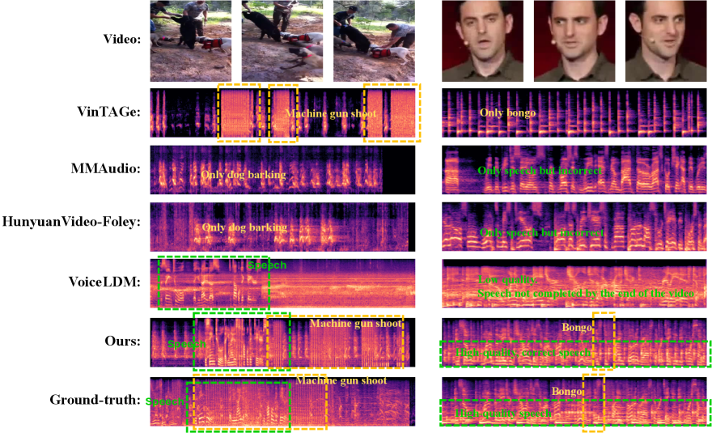
*Figure 3:Visualization of the spectrograms of generated audios and the ground-truth.*

*Figure 4:Ablation study on the MoE Gating module using in-the-wild samples. In this example, sounds are generated with different gating configurations. Top row: MoE Gating (full model); Middle row: reduced weight for the speech branch; Bottom row: reduced weight for the off-screen environmental branch.*

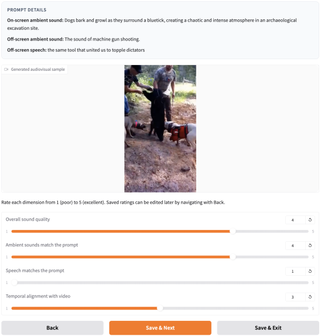
*Figure 5:Interface for the subjective evaluation.*

---
**Usage Info**: 5765 tokens used.
**Generated at**: 2026-04-07 13:01:34

---

# 📚 Rewriting TTS Inference Economics: Lightning V2 on Tenstorrent Achieves 4× Lower Cost Than NVIDIA L40S

🚀 URL: https://arxiv.org/html/2604.03279

## 🌏 Abstract (원문)
Text-to-Speech (TTS) models are significantly more numerically fragile than Large Language Models (LLMs) due to their continuous waveform generation and perceptual sensitivity to small numerical perturbations. While aggressive precision reduction techniques such as BlockFloat8 (BFP8) and low-fidelity (LoFi) compute have been widely adopted in language models, applying similar strategies to TTS systems often results in audible artifacts, phase instability, and spectral distortion.In this work, we present Lightning V2, a production-grade TTS model co-optimized for Tenstorrent hardware. Through precision-aware architectural design and hardware–software co-optimization, we achieve over 95% LoFi computational fidelity and more than 80% BlockFloat8 deployment without measurable degradation in audio quality. Leveraging Tenstorrent’s Network-on-Chip (NoC), distributed SRAM, and deterministic execution model, we reduce memory movement and redundant weight fetches, enabling efficient low-precision inference.Compared to an NVIDIA L40S baseline, Lightning V2 achieves approximately 4× lower on-prem accelerator cost at equivalent concurrency, while maintaining production audio fidelity. Our results demonstrate that precision co-design, combined with hardware-aware optimization, can fundamentally reshape the economics of real-time speech inference.
## 🌏 Abstract (번역)
텍스트-음성 변환(TTS) 모델은 연속적인 파형 생성과 작은 수치적 교란에 대한 지각적 민감성 때문에 대규모 언어 모델(LLM)보다 수치적으로 훨씬 더 취약합니다. BlockFloat8 (BFP8) 및 저충실도(LoFi) 연산과 같은 공격적인 정밀도 감소 기술이 언어 모델에서 널리 채택되었지만, 유사한 전략을 TTS 시스템에 적용하면 종종 가청 아티팩트, 위상 불안정성 및 스펙트럼 왜곡을 초래합니다. 본 연구에서는 Tenstorrent 하드웨어에 공동 최적화된 프로덕션 등급 TTS 모델인 Lightning V2를 소개합니다. 정밀도 인식 아키텍처 설계와 하드웨어-소프트웨어 공동 최적화를 통해, 우리는 오디오 품질의 측정 가능한 저하 없이 95% 이상의 LoFi 연산 충실도와 80% 이상의 BlockFloat8 배포를 달성했습니다. Tenstorrent의 네트워크 온 칩(NoC), 분산 SRAM 및 결정론적 실행 모델을 활용하여 메모리 이동과 중복 가중치 페치를 줄여 효율적인 저정밀도 추론을 가능하게 합니다. NVIDIA L40S 기준선과 비교하여, Lightning V2는 동등한 동시성에서 약 4배 낮은 온프레미스 가속기 비용을 달성하면서 프로덕션 오디오 충실도를 유지합니다. 우리의 결과는 정밀도 공동 설계가 하드웨어 인식 최적화와 결합될 때 실시간 음성 추론의 경제성을 근본적으로 재편할 수 있음을 보여줍니다.

## 🔍 Methods & Results
- TTS 모델은 연속적인 파형 생성 및 작은 수치적 교란에 대한 민감성으로 인해 LLM보다 수치적으로 훨씬 취약하며, 작은 반올림 오류도 고주파 링잉, 피치 불안정성, 시간적 번짐과 같은 가청 왜곡을 유발합니다.
- 확산 기반 TTS 시스템은 반복적인 디노이징 단계에서 오류가 누적되어 전파되므로 정밀도 감소에 특히 민감하며, 음성 신호의 넓은 동적 범위는 저에너지 영역을 양자화 오류에 취약하게 만듭니다.
- Pearson 상관 계수(PCC)와 같은 전통적인 수치 유사성 지표는 TTS 시스템의 지각적 오디오 품질을 신뢰할 수 있게 반영하지 못하며, 높은 PCC에서도 가청 왜곡이 발생할 수 있어 종단 간 지각적 검증이 필수적입니다.
- 정밀도 인식 아키텍처 설계 및 하드웨어-소프트웨어 공동 최적화를 통해 Lightning V2는 수치적으로 허용 가능한 연산에만 저충실도(LoFi) 연산 및 BlockFloat8(BFP8)을 선별적으로 적용했습니다.
- Tenstorrent 하드웨어의 Network-on-Chip(NoC), 분산 SRAM 및 결정론적 실행 모델을 활용하여 메모리 이동 및 중복 가중치 페치를 줄이는 맞춤형 커널 및 하드웨어-소프트웨어 공동 설계를 구현했습니다.
- 결과적으로 Lightning V2는 오디오 품질 저하 없이 95% 이상의 LoFi 연산 충실도와 80% 이상의 BFP8 배포를 달성했으며, NVIDIA L40S 대비 동등한 동시성에서 약 4배 낮은 온프레미스 가속기 비용으로 프로덕션 오디오 충실도를 유지했습니다.

## 🖼 Figures
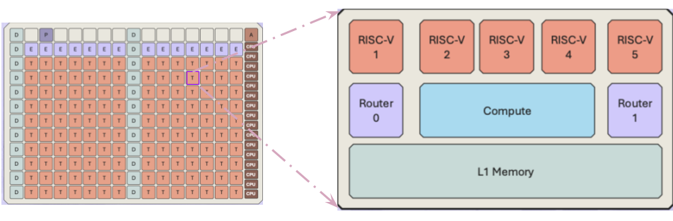
*Figure 1:Spatial layout of Tensix cores and NoC connectivity.*

---
**Usage Info**: 4244 tokens used.
**Generated at**: 2026-04-07 13:01:51

---

# 📚 Full-Duplex-Bench-v3: Benchmarking Tool Use for Full-Duplex Voice Agents Under Real-World Disfluency

🚀 URL: https://arxiv.org/html/2604.04847

## 🌏 Abstract (원문)
We introduceFull-Duplex-Bench-v3 (FDB-v3), a benchmark for evaluating spoken language models under naturalistic speech conditions and multi-step tool use. Unlike prior work, our dataset consists entirely of real human audio annotated for five disfluency categories, paired with scenarios requiring chained API calls across four task domains. We evaluate six model configurations—GPT-Realtime, Gemini Live 2.5, Gemini Live 3.1, Grok, Ultravox v0.7, and a traditional Cascaded pipeline (Whisper→\rightarrowGPT-4o→\rightarrowTTS)—across accuracy, latency, and turn-taking dimensions. GPT-Realtime leads on Pass@1 (0.600) and interruption avoidance (13.5%); Gemini Live 3.1 achieves the fastest latency (4.25	s) but the lowest turn-take rate (78.0%); and the Cascaded baseline, despite a perfect turn-take rate, incurs the highest latency (10.12	s). Across all systems, self-correction handling and multi-step reasoning under hard scenarios remain the most consistent failure modes. Demo is available athttps://daniellin94144.github.io/FDB-v3-demo/.
## 🌏 Abstract (번역)
우리는 자연스러운 음성 조건과 다단계 도구 사용 환경에서 음성 언어 모델을 평가하기 위한 벤치마크인 Full-Duplex-Bench-v3 (FDB-v3)를 소개합니다. 이전 연구와 달리, 우리의 데이터셋은 5가지 비유창성 범주로 주석이 달린 실제 사람 음성으로만 구성되어 있으며, 4가지 작업 도메인에 걸쳐 연결된 API 호출을 요구하는 시나리오와 짝을 이룹니다. 우리는 정확도, 지연 시간, 턴 전환(turn-taking) 측면에서 6가지 모델 구성—GPT-Realtime, Gemini Live 2.5, Gemini Live 3.1, Grok, Ultravox v0.7, 그리고 전통적인 계단식 파이프라인(Whisper→GPT-4o→TTS)—을 평가합니다. GPT-Realtime은 Pass@1 (0.600)과 방해 회피(13.5%)에서 선두를 차지했습니다. Gemini Live 3.1은 가장 빠른 지연 시간(4.25초)을 달성했지만 가장 낮은 턴 전환율(78.0%)을 보였습니다. 그리고 계단식 기준선은 완벽한 턴 전환율에도 불구하고 가장 높은 지연 시간(10.12초)을 발생시켰습니다. 모든 시스템에서, 어려운 시나리오에서의 자기 수정 처리와 다단계 추론은 가장 일관된 실패 모드로 남아있습니다. 데모는 https://daniellin94144.github.io/FDB-v3-demo/에서 이용 가능합니다.

## 🔍 Methods & Results
- FDB-v3 벤치마크는 자연스러운 음성 조건과 다단계 도구 사용 환경에서 음성 언어 모델을 평가하기 위해 설계되었습니다.
- 데이터셋은 5가지 비유창성(false starts, self-corrections, fillers, pauses, hesitations)이 주석 처리된 실제 사람 음성으로 구성되며, 4가지 작업 도메인에 걸쳐 연결된 API 호출을 요구하는 시나리오와 짝을 이룹니다.
- 시나리오는 난이도에 따라 Easy(단일 단계), Medium(두 단계, 중간 모호성), Hard(다단계, 충돌하는 제약 조건)의 세 가지 등급으로 나뉩니다.
- 모델 추론을 네트워크 변동성 등으로부터 분리하기 위해 결정론적이고 지연 시간이 없는 로컬 모의 API를 사용했습니다.
- 12명의 화자(원어민 및 비원어민 영어 사용자 포함)로부터 일상적인 마이크를 사용하여 통제되지 않은 환경에서 100개의 오디오 녹음을 수집했으며, 실제 주변 환경 소음을 포함하여 현실적인 조건을 반영했습니다.
- GPT-Realtime, Gemini Live 2.5, Gemini Live 3.1, Grok, Ultravox v0.7, 그리고 전통적인 계단식 파이프라인(Whisper→GPT-4o→TTS)의 6가지 모델 구성을 정확도, 지연 시간, 턴 전환 측면에서 평가했습니다.
- 평가 결과, GPT-Realtime은 Pass@1 (0.600) 및 방해 회피(13.5%)에서 가장 우수했으며, Gemini Live 3.1은 가장 빠른 지연 시간(4.25초)을 보였으나 턴 전환율은 가장 낮았습니다(78.0%).
- 계단식 기준선은 완벽한 턴 전환율을 보였지만 가장 높은 지연 시간(10.12초)을 기록했습니다.
- 모든 시스템에서 자기 수정 처리와 어려운 시나리오에서의 다단계 추론이 가장 일관된 실패 모드로 나타났습니다.

## 🖼 Figures
![Figure 1:The Full-Duplex-Bench-v3 framework for evaluating real-time voice agents. The diagram illustrates a full-duplex interaction where the agent continuously processes user speech containing natural dysfluencies, such as fillers and self-corrections. Full-Duplex-Bench-v3 comprehensively assesses the agent across three primary dimensions: (1) Tool-use Performance (accuracy of API selection and execution), (2) Turn-Taking Dynamic (handling interruptions and conversational flow), and (3) Latency Breakdown (timing from listening to tool execution and speech generation).](../images/2026-04-07/2604.04847/2604.04847_fig0.png)
*Figure 1:The Full-Duplex-Bench-v3 framework for evaluating real-time voice agents. The diagram illustrates a full-duplex interaction where the agent continuously processes user speech containing natural dysfluencies, such as fillers and self-corrections. Full-Duplex-Bench-v3 comprehensively assesses the agent across three primary dimensions: (1) Tool-use Performance (accuracy of API selection and execution), (2) Turn-Taking Dynamic (handling interruptions and conversational flow), and (3) Latency Breakdown (timing from listening to tool execution and speech generation).*

---
**Usage Info**: 3814 tokens used.
**Generated at**: 2026-04-07 13:02:16

---

# 📚 Training-Free Refinement of Flow Matching with Divergence-based Sampling

🚀 URL: https://arxiv.org/html/2604.04646

## 🌏 Abstract (원문)
Flow-based models learn a target distribution by modeling a marginal velocity field, defined as the average of sample-wise velocities connecting each sample from a simple prior to the target data.When sample-wise velocities conflict at the same intermediate state, however, this averaged velocity can misguide samples toward low-density regions, degrading generation quality. To address this issue, we propose the Flow Divergence Sampler (FDS), a training-free framework that refines intermediate states before each solver step.Our key finding reveals that the severity of this misguidance is quantified by the divergence of the marginal velocity field that is readily computable during inference with a well-optimized model.FDS exploits this signal to steer states toward less ambiguous regions.As a plug-and-play framework compatible with standard solvers and off-the-shelf flow backbones, FDS consistently improves fidelity across various generation tasks including text-to-image synthesis, and inverse problems.
## 🌏 Abstract (번역)
플로우 기반 모델은 단순한 사전 분포에서 목표 데이터로 각 샘플을 연결하는 샘플별 속도의 평균으로 정의되는 한계 속도장을 모델링하여 목표 분포를 학습합니다. 그러나 샘플별 속도가 동일한 중간 상태에서 충돌할 때, 이 평균 속도는 샘플을 저밀도 영역으로 잘못 안내하여 생성 품질을 저하시킬 수 있습니다. 이 문제를 해결하기 위해 우리는 각 솔버 단계 전에 중간 상태를 정제하는 훈련 없는 프레임워크인 플로우 발산 샘플러(FDS)를 제안합니다. 우리의 주요 발견은 이러한 잘못된 안내의 심각성이 잘 최적화된 모델을 사용하여 추론 중에 쉽게 계산할 수 있는 한계 속도장의 발산으로 정량화된다는 것을 밝혀냈습니다. FDS는 이 신호를 활용하여 상태를 덜 모호한 영역으로 유도합니다. 표준 솔버 및 기성 플로우 백본과 호환되는 플러그 앤 플레이 프레임워크로서, FDS는 텍스트-이미지 합성 및 역문제를 포함한 다양한 생성 작업에서 충실도를 지속적으로 향상시킵니다.

## 🔍 Methods & Results
- FDS는 사전 훈련된 플로우 모델을 고정하고, 네트워크를 재훈련하거나 학습된 한계 속도장을 변경하는 대신 샘플링 단계에서만 개입하여 중간 상태(x_t)를 공간적으로 정제합니다.
- 핵심 아이디어는 속도장 자체가 아닌 궤적을 정제하는 것으로, 솔버 상태 x_t에서 사전 훈련된 속도장이 더 신뢰할 수 있을 것으로 예상되는 인근 상태 ~x_t를 찾아 통합을 계속합니다.
- 이론적으로, 한계 및 샘플별 속도 간의 데이터 의존적 불일치(L*CFM(x_t, t))는 추론 시 데이터 없는 대리값인 한계 속도장의 발산(∇x_t ⋅ u_t(x_t))을 사용하여 명시적으로 측정될 수 있음을 증명했습니다.
- FDS는 사전 훈련된 모델 u_θ를 사용하여 국부적 신뢰도에 대한 대리값 δ^t(x)를 정의하며, 낮은 발산은 낮은 불일치를 나타냅니다. 이 발산은 Hutchinson의 trace estimator를 사용하여 효율적으로 계산됩니다.
- FDS는 각 추론 시간 단계 t에서 제로-차수 국부 정제를 수행합니다. 현재 상태 x_t에서 작은 무작위 교란을 추가하여 M개의 후보를 생성하고, 각 후보의 불일치(δ^t(x))를 평가하여 최상의 후보(~x_t)를 선택하며, 이를 N번 반복합니다.
- FDS는 기존의 고차 ODE 솔버와 달리 고정된 시간 t에서 공간적 개입을 수행하여 중간 상태 자체를 재배치하며, 이는 Euler, Heun 등 다양한 기본 솔버 및 가이던스 방법과 호환되는 플러그인 모듈입니다.
- 실험적으로 N=M=1 설정만으로도 기준 모델 대비 생성 충실도를 크게 향상시키기에 충분하며, 심각한 궤적 충돌이 주로 발생하는 초기 생성 단계(t < T_trunc, T_trunc=0.5)로 FDS 적용을 제한하여 효율성을 극대화합니다.
- FDS는 텍스트-이미지 합성 및 역문제를 포함한 다양한 생성 작업에서 일관되게 충실도를 향상시키는 것으로 입증되었습니다.

## 🖼 Figures

*Figure 1:Overview of FDS. Our framework refines 
𝑥
𝑡
𝑘
 into 
𝑥
~
𝑡
𝑘
 at timetep 
𝑡
𝑘
 to avoid high-discrepancy regions. In standard settings, severely conflicting sample-wise velocities can drive the marginal velocity toward low-density region, leading to degraded samples (red cross). To counteract this, our framework effectively steers the trajectory toward a reliable, low-discrepancy region (blue circle).*

*(a) FDS yields improved generation quality, reflected by a lower Wasserstein Distance (WD).*

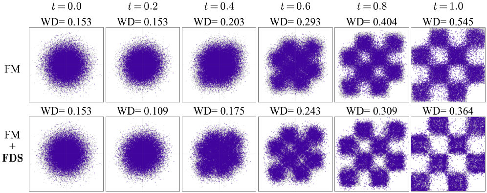
*(a) FDS yields improved generation quality, reflected by a lower Wasserstein Distance (WD).*

*(b)FDS refines 
𝑥
𝑡
 into 
𝑥
~
𝑡
 by steering it toward lower-divergence regions.*

*(c)The discrepancy map measured by full train data (GT) and the model at 
𝑡
=
0.6
.*

*Table 1: Performance comparison on CIFAR-10 and ImageNet 
256
×
256
. FDS consistently improves generation quality in terms of FID across all configurations in the main experiments. 
†
 denotes a base solver with an increased NFEs to match the wall-clock time of our framework.*

*Figure 3:Qualitative results on ImageNet 
𝟐𝟓𝟔
×
𝟐𝟓𝟔
 with JiT-L/16. Compared to the compute-matched baseline(
†
), FDS effectively enhances the generation quality.*

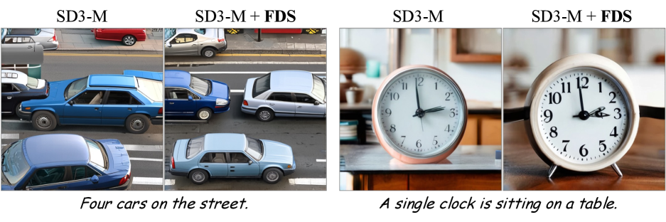
*Figure 4:Quantitative results for text-to-image synthesis on the DrawBench dataset. FDS generally improves the baseline in most metrics and across CFG weights.*

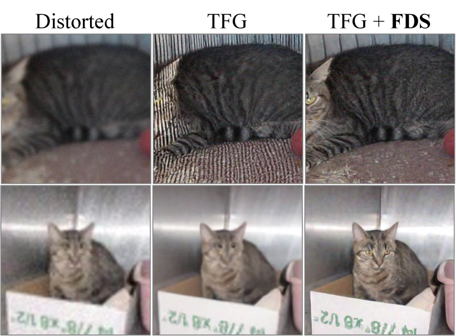
*Table 2:Quantitative evaluation on inverse problems. Baselines equipped with FDS demonstrate consistent improvements across all metrics. All reported values are lower-is-better.*

*Figure 6:Qualitative results on inverse problems. (Top) Deblurring. (Bottom) Super-resolution (
×
4).*

*(a)Ablation on 
𝑇
trunc*

*(a)Ablation on 
𝑇
trunc*

*(b)Visualization of 
𝜎
𝑡
 schedule*

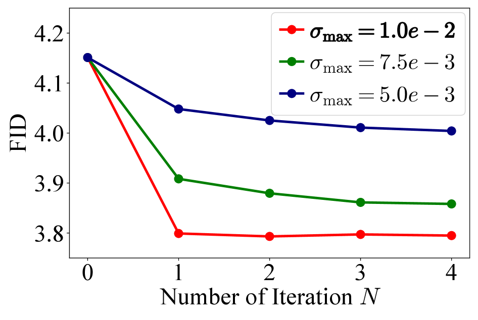
*(a)Ablation on number of iteration*

*(a)Ablation on number of iteration*

*(a)Conditional generation results on CIFAR-10.*

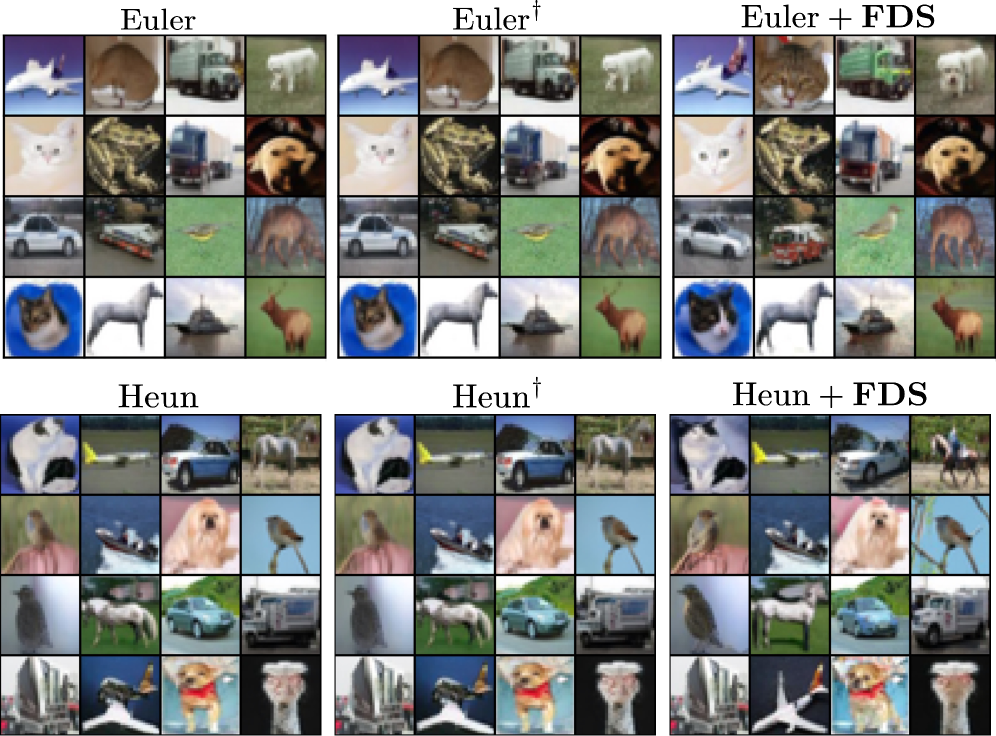
*(a)Conditional generation results on CIFAR-10.*

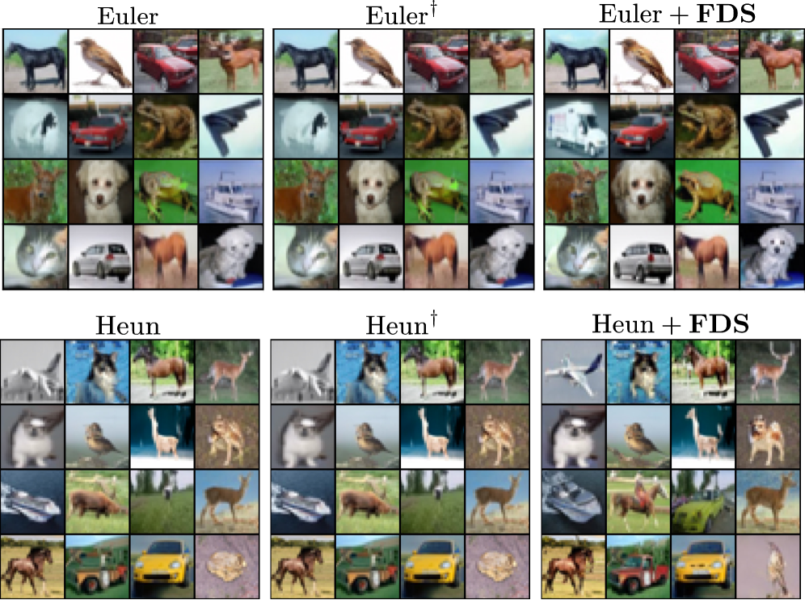
*(b)Unconditional generation results on CIFAR-10.*

*Figure 10:Qualitative results on ImageNet 
𝟐𝟓𝟔
×
𝟐𝟓𝟔
. Generated samples using the JiT-B/16 backbone. Arranged from top to bottom, every two rows show instances from classes 1 (goldfish), 140 (dunlin), 483 (castle), and 933 (cheeseburger).*

*Figure 11:Qualitative results on ImageNet 
𝟐𝟓𝟔
×
𝟐𝟓𝟔
. Generated samples using the JiT-L/16 backbone. Arranged from top to bottom, every two rows show instances from classes 1 (goldfish), 140 (dunlin), 483 (castle), and 933 (cheeseburger).*

*Figure 12:Qualitative results on ImageNet 
𝟐𝟓𝟔
×
𝟐𝟓𝟔
. Generated samples using the SiT-XL backbone. Arranged from top to bottom, every two rows show instances from classes 1 (goldfish), 140 (dunlin), 483 (castle), and 933 (cheeseburger).*

*(a)Samples generated with a CFG scale of 
3
.*

*(a)Samples generated with a CFG scale of 
3
.*

*(b)Samples generated with a CFG scale of 
7
.*

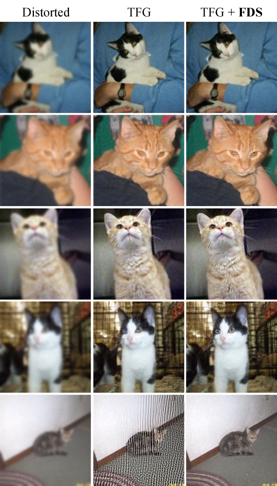
*Figure 14:Qualitative results on Gaussian deblurring.*

*Figure 15:Qualitative results on Super-Resolution 
×
4*

---
**Usage Info**: 3661 tokens used.
**Generated at**: 2026-04-07 13:02:32

---

# 📚 AffectSpeech: A Large-Scale Emotional Speech Dataset with Fine-Grained Textual Descriptions for Speech Emotion Captioning and Synthesis

🚀 URL: https://arxiv.org/html/2604.04160

## 🌏 Abstract (원문)
Emotion is essential in spoken communication, yet most existing frameworks in speech emotion modeling rely on predefined categories or low-dimensional continuous attributes, which offer limited expressive capacity.Recent advances in speech emotion captioning and synthesis have shown that textual descriptions provide a more flexible and interpretable alternative for representing affective characteristics in speech.However, progress in this direction is hindered by the lack of an emotional speech dataset aligned with reliable and fine-grained natural language annotations.To tackle this, we introduce AffectSpeech, a large-scale corpus of human-recorded speech enriched with structured descriptions for fine-grained emotion analysis and generation.Each utterance is characterized across six complementary dimensions, including sentiment polarity, open-vocabulary emotion captions, intensity level, prosodic attributes, prominent segments, and semantic content, enabling multi-granular modeling of vocal expression.To balance annotation quality and scalability, we adopt a human–LLM collaborative annotation pipeline that integrates algorithmic pre-labeling, multi-LLM description generation, and human-in-the-loop verification.Furthermore, these annotations are reformulated into diverse descriptive styles to enhance linguistic diversity and reduce stylistic bias in downstream modeling.Experimental results on speech emotion captioning and synthesis demonstrate that models trained on AffectSpeech consistently achieve superior performance across multiple evaluation settings.
## 🌏 Abstract (번역)
감정은 음성 통신에서 필수적이지만, 음성 감정 모델링의 대부분의 기존 프레임워크는 미리 정의된 범주나 제한된 표현 능력을 제공하는 저차원 연속 속성에 의존합니다.음성 감정 캡셔닝 및 합성의 최근 발전은 텍스트 설명이 음성 내 감정적 특성을 표현하는 데 더 유연하고 해석 가능한 대안을 제공함을 보여주었습니다.그러나 이 방향의 진전은 신뢰할 수 있고 세분화된 자연어 주석과 정렬된 감정 음성 데이터셋의 부족으로 인해 방해받고 있습니다.이를 해결하기 위해 우리는 세분화된 감정 분석 및 생성을 위한 구조화된 설명으로 풍부하게 채워진 대규모 인간 녹음 음성 코퍼스인 AffectSpeech를 소개합니다.각 발화는 감성 극성, 개방형 어휘 감정 캡션, 강도 수준, 운율 속성, 두드러진 구간 및 의미론적 콘텐츠를 포함한 6가지 보완적인 차원에 걸쳐 특징화되어 음성 표현의 다중 세분화 모델링을 가능하게 합니다.주석 품질과 확장성의 균형을 맞추기 위해 우리는 알고리즘 사전 레이블링, 다중 LLM 설명 생성 및 인간 개입 검증을 통합하는 인간-LLM 협업 주석 파이프라인을 채택합니다.또한, 이러한 주석은 언어적 다양성을 향상시키고 후속 모델링에서 스타일 편향을 줄이기 위해 다양한 설명 스타일로 재구성됩니다.음성 감정 캡셔닝 및 합성에 대한 실험 결과는 AffectSpeech로 훈련된 모델이 여러 평가 설정에서 일관되게 우수한 성능을 달성함을 보여줍니다.

## 🔍 Methods & Results
- 기존 음성 감정 모델링 프레임워크의 제한된 표현 능력과 신뢰할 수 있는 세분화된 자연어 주석이 있는 감정 음성 데이터셋 부족 문제를 해결하기 위해 AffectSpeech 코퍼스를 도입했습니다.
- AffectSpeech는 세분화된 감정 분석 및 생성을 위한 구조화된 설명으로 풍부하게 채워진 대규모 인간 녹음 음성 코퍼스입니다.
- 각 발화는 감성 극성, 개방형 어휘 감정 캡션, 강도 수준, 운율 속성, 두드러진 구간 및 의미론적 콘텐츠를 포함한 6가지 보완적인 차원에 걸쳐 특징화되어 다중 세분화된 음성 표현 모델링을 가능하게 합니다.
- 주석 품질과 확장성의 균형을 위해 알고리즘 사전 레이블링, 다중 LLM 설명 생성 및 인간 개입 검증을 통합하는 인간-LLM 협업 주석 파이프라인을 사용했습니다.
- 주석은 언어적 다양성을 높이고 후속 모델링의 스타일 편향을 줄이기 위해 다양한 설명 스타일로 재구성되었습니다.
- AffectSpeech로 훈련된 모델은 음성 감정 캡셔닝 및 합성에서 여러 평가 설정에 걸쳐 일관되게 우수한 성능을 달성했습니다.

## 🖼 Figures
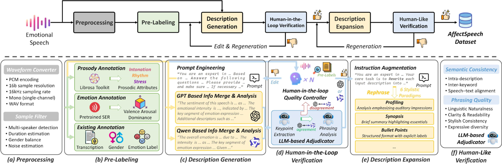
*Figure 1:The construction and annotation pipeline of the AffectSpeech dataset.*

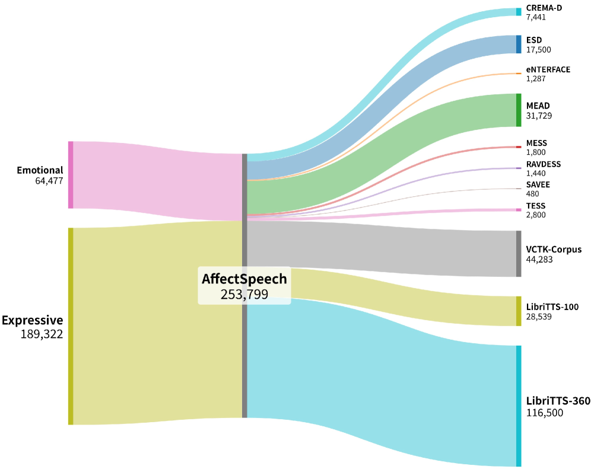
*Figure 2:Composition and scale of the AffectSpeech dataset categorized by original data sources.*

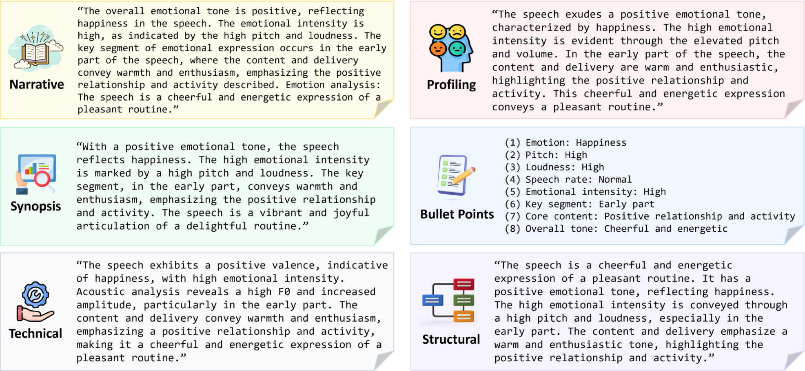
*Figure 3:Illustration of diverse speech emotion captioning styles.*

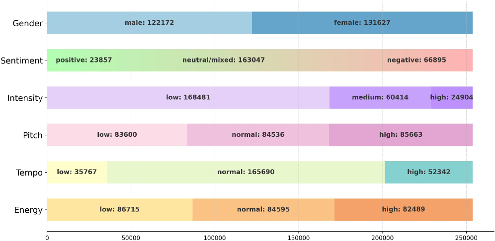
*Figure 4:Quantitative distributions of speaker gender, sentiment polarity, intensity level, and prosodic attributes (pitch, tempo, and energy).*

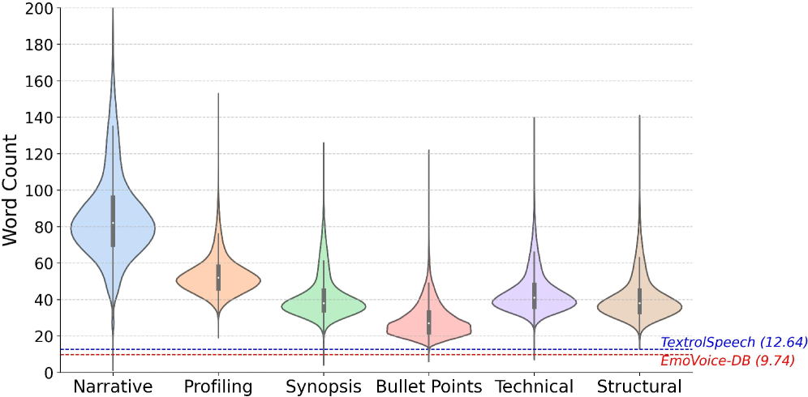
*Figure 5:Text length distributions across six textual description styles.*

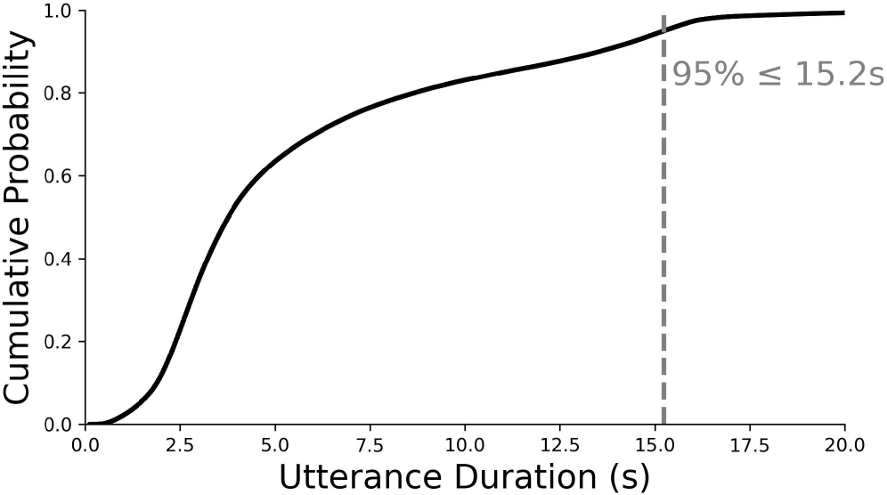
*Figure 6:Empirical cumulative distribution function of utterance duration.*

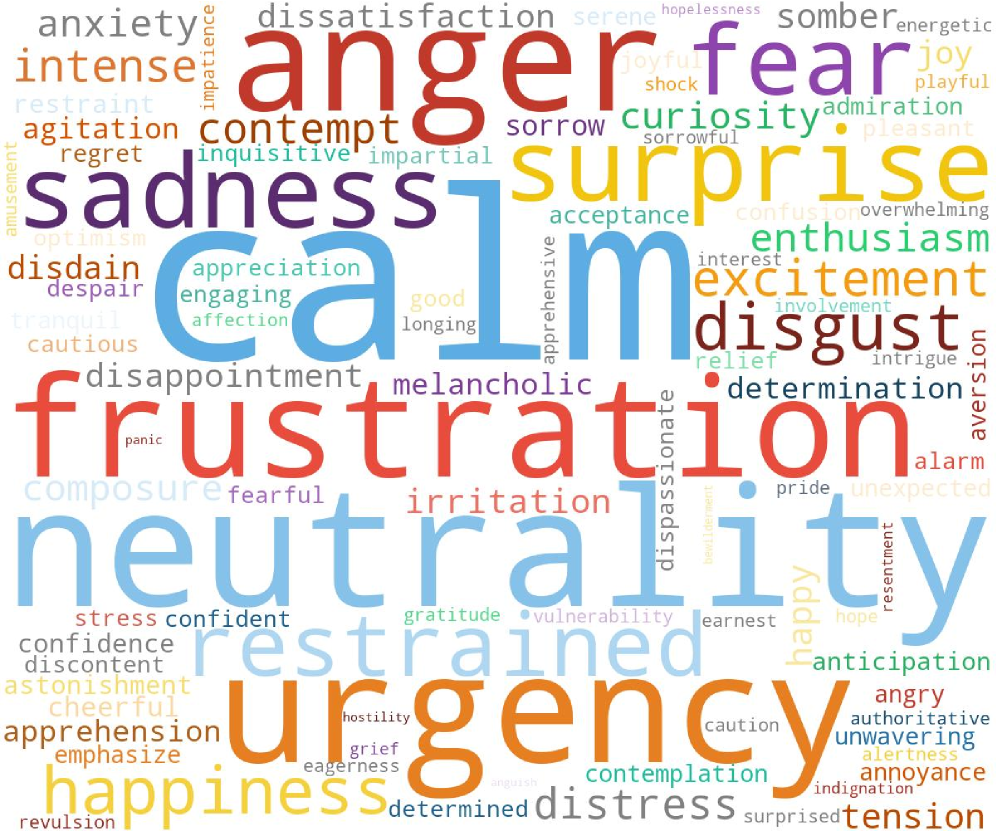
*Figure 7:Word cloud of the top-100 most frequent emotion-related words.*

![Figure 8:Subjective preference test results, which compare SFT variants trained on EmoVoice-DB, TextrolSpeech [17], and the proposed AffectSpeech across three perceptual dimensions.](../images/2026-04-07/2604.04160/2604.04160_fig7.png)
*Figure 8:Subjective preference test results, which compare SFT variants trained on EmoVoice-DB, TextrolSpeech [17], and the proposed AffectSpeech across three perceptual dimensions.*

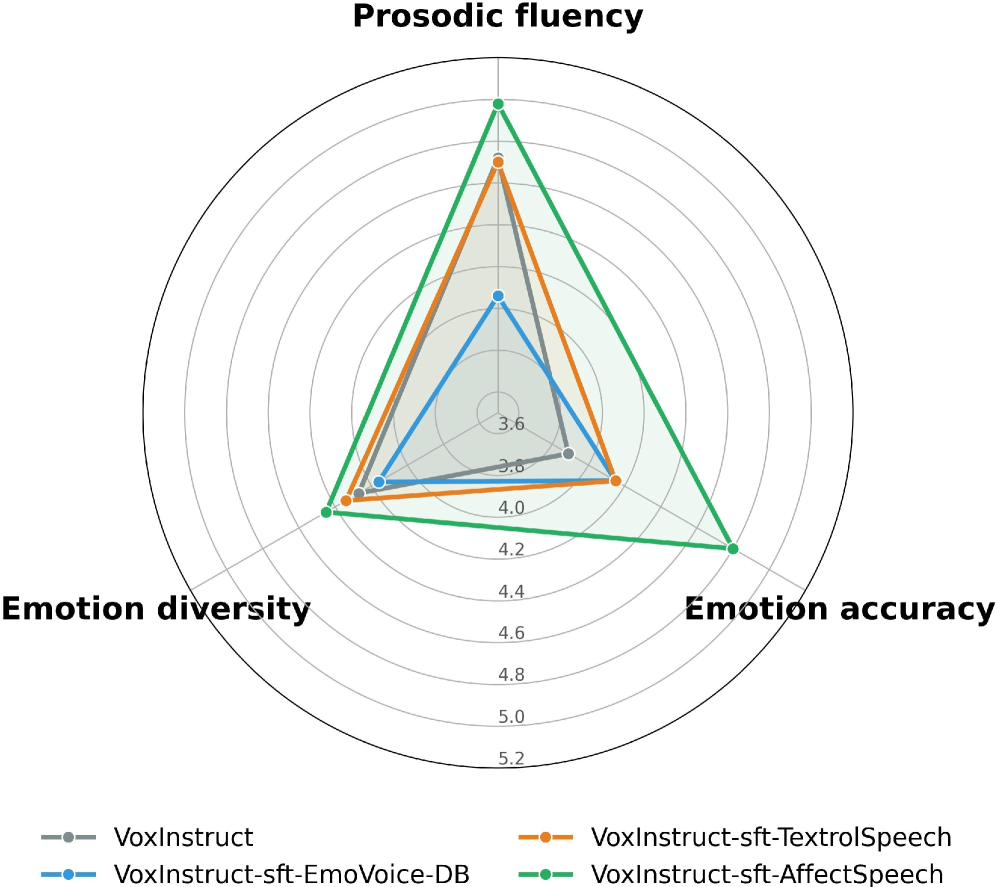
*Figure 9:Perceptual attribute analysis of synthesized speech, illustrating subjective ratings (1–7 Likert scale) for prosodic fluency, emotion accuracy, and emotion diversity.*

---
**Usage Info**: 1724 tokens used.
**Generated at**: 2026-04-07 13:02:42

---

# 📚 OP-GRPO: Efficient Off-Policy GRPO for Flow-Matching Models

🚀 URL: https://arxiv.org/html/2604.04142

## 🌏 Abstract (원문)
Post training via GRPO has demonstrated remarkable effectiveness in improving the generation quality of flow-matching models. However, GRPO suffers from inherently low sample efficiency due to its on-policy training paradigm. To address this limitation, we present OP-GRPO, the firstOff-PolicyGRPOframework tailored for flow-matching models. First, we actively select high-quality trajectories and adaptively incorporate them into a replay buffer for reuse in subsequent training iterations. Second, to mitigate the distribution shift introduced by off-policy samples, we propose a sequence-level importance sampling correction that preserves the integrity of GRPO’s clipping mechanism while ensuring stable policy updates. Third, we theoretically and empirically show that late denoising steps yield ill-conditioned off-policy ratios, and mitigate this by truncating trajectories at late steps. Across image and video generation benchmarks, OP-GRPO achieves comparable or superior performance to Flow-GRPO with only 34.2% of the training steps on average, yielding substantial gains in training efficiency while maintaining generation quality.
## 🌏 Abstract (번역)
GRPO를 통한 후속 훈련은 플로우 매칭 모델의 생성 품질을 향상시키는 데 놀라운 효과를 보여주었습니다. 그러나 GRPO는 온-정책 훈련 패러다임으로 인해 본질적으로 낮은 샘플 효율성 문제를 겪습니다. 이러한 한계를 해결하기 위해, 우리는 플로우 매칭 모델에 특화된 최초의 오프-정책 GRPO 프레임워크인 OP-GRPO를 제시합니다. 첫째, 우리는 고품질 궤적을 적극적으로 선택하고 이를 재생 버퍼에 적응적으로 통합하여 후속 훈련 반복에서 재사용합니다. 둘째, 오프-정책 샘플로 인해 발생하는 분포 변화를 완화하기 위해, GRPO의 클리핑 메커니즘의 무결성을 유지하면서 안정적인 정책 업데이트를 보장하는 시퀀스 수준 중요도 샘플링 보정을 제안합니다. 셋째, 우리는 이론적 및 경험적으로 후반부 디노이징 단계가 조건이 좋지 않은 오프-정책 비율을 생성함을 보여주며, 후반부 단계에서 궤적을 잘라냄으로써 이를 완화합니다. 이미지 및 비디오 생성 벤치마크 전반에 걸쳐 OP-GRPO는 평균적으로 Flow-GRPO의 34.2%에 불과한 훈련 단계로 유사하거나 우수한 성능을 달성하여, 생성 품질을 유지하면서 훈련 효율성에서 상당한 이득을 가져옵니다.

## 🔍 Methods & Results
- OP-GRPO는 샘플 효율성을 개선하고 훈련 속도를 높이기 위해 설계된 GRPO의 오프-정책 프레임워크를 제시합니다.
- 고품질 궤적을 저장하기 위한 재생 버퍼(B_off)를 구축하며, 보상 기반 교체 전략과 고유성 제약(각 조건화 입력 c당 최대 하나의 궤적)을 적용합니다.
- 버퍼 내 샘플의 효과적인 갱신을 위해 오래된 샘플의 보상에 단계적 감쇠를 적용하여 최근에 수집된 궤적을 선호하도록 합니다.
- 하이브리드 RL 패러다임을 채택하여, 대부분의 프롬프트는 원본 데이터셋에서, 소수는 재생 버퍼에서 샘플링하여 훈련에 사용합니다.
- 오프-정책 샘플로 인한 분포 불일치 문제를 해결하기 위해 시퀀스 기반 보정 방식을 제안합니다. 이는 GRPO의 클리핑 메커니즘을 보존하면서 분포 변화를 보정합니다.
- 제안된 시퀀스 기반 보정 방식은 기존의 나이브한 중요도 샘플링 방식이 40% 이상의 오프-정책 샘플을 클리핑하는 것과 달리, 단 11.8%의 오프-정책 샘플만 클리핑하여 오프-정책 샘플 활용도를 크게 높이고 훈련 안정성을 유지합니다.
- 플로우 매칭 모델에서 후반부 디노이징 단계(낮은 노이즈 영역)에서 발생하는 조건이 좋지 않은 오프-정책 비율로 인한 수치적 불안정성을 확인했습니다.
- 이 문제를 해결하기 위해 궤적 절단 전략을 도입하여, 오프-정책 궤적을 특정 절단 단계(t_off)까지만 사용하고 나머지 단계는 현재 정책으로 재생성합니다.
- 궤적 절단 전략은 중요도 가중치와 정책 업데이트를 안정화하며, 생성 품질에는 무시할 만한 저하를 가져옵니다.
- OP-GRPO는 이미지 및 비디오 생성 벤치마크에서 Flow-GRPO와 비교하여 평균 34.2%의 훈련 단계만으로 유사하거나 우수한 성능을 달성하여, 생성 품질을 유지하면서 훈련 효율성을 크게 향상시켰습니다.

## 🖼 Figures
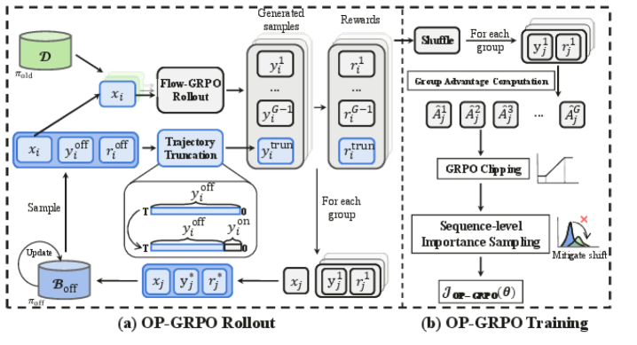
*Figure 1:Overall framework of OP-GRPO, including (a) OP-GRPO rollout and (b) OP-GRPO training. Blue regions represent samples from the replay buffer, green regions represent samples from the dataset.*

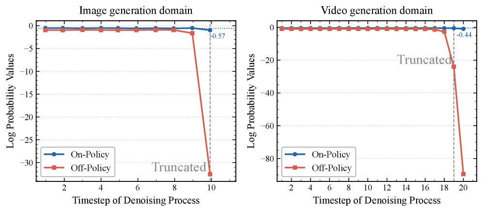
*Figure 2:Log-probability values of on-policy and off-policy samples across denoising steps, where the dashed line indicates the truncation starting step.*

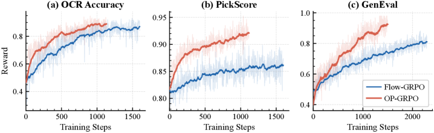
*Figure 3:Training Curves of OP-GRPO and Flow GRPO.*

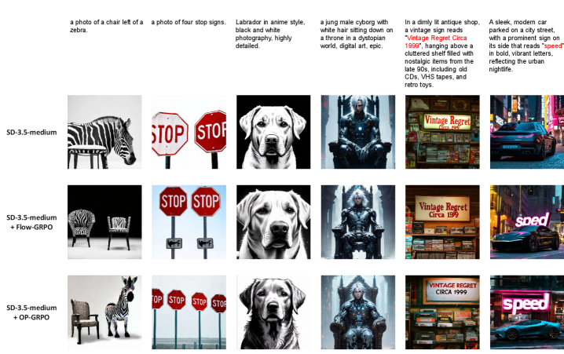
*Figure 4:Visual Results of OP-GRPO and Flow GRPO on three image generation tasks using SD3.5-M.*

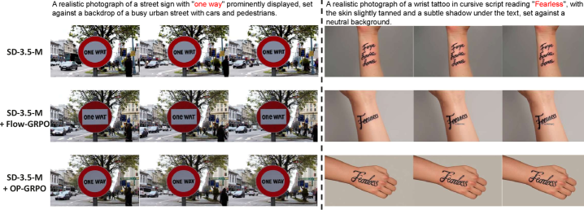
*Figure 5:Visual Results of Buffer-based GRPO and Flow GRPO on OCR task on video generation model Wan2.1-1.4B. Refer to Appendix for more results.*

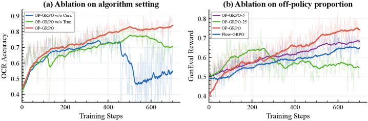
*Figure 6:Ablation study of OP-GRPO.*

---
**Usage Info**: 4428 tokens used.
**Generated at**: 2026-04-07 13:02:52

---

