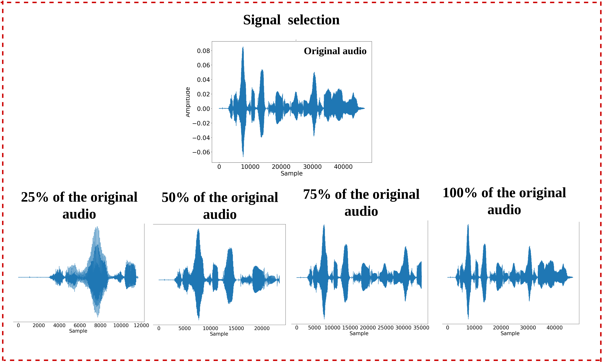
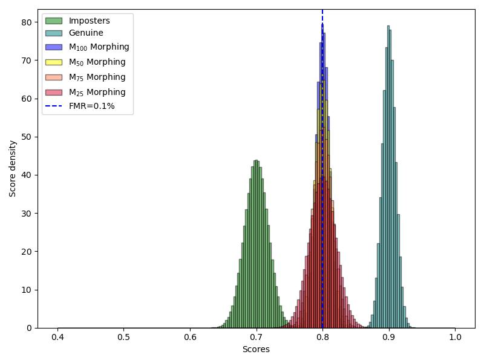
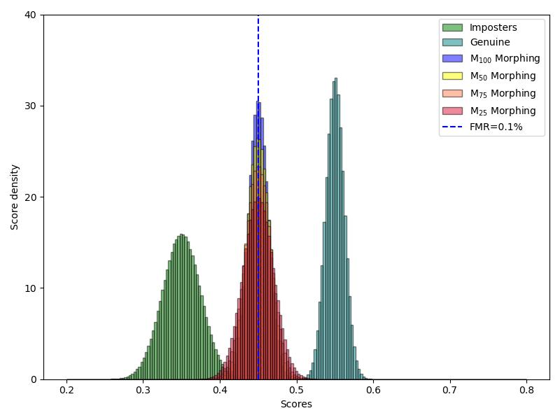
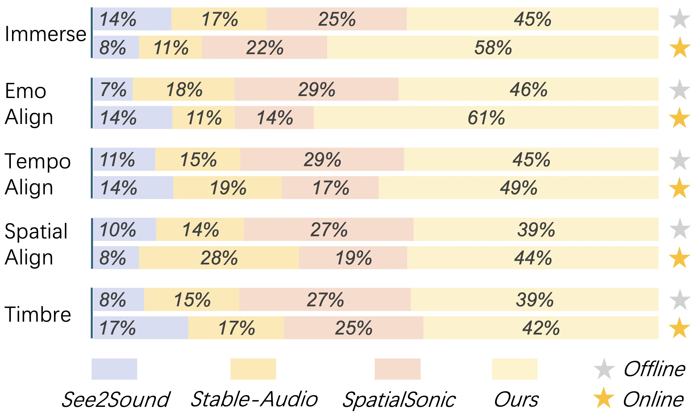
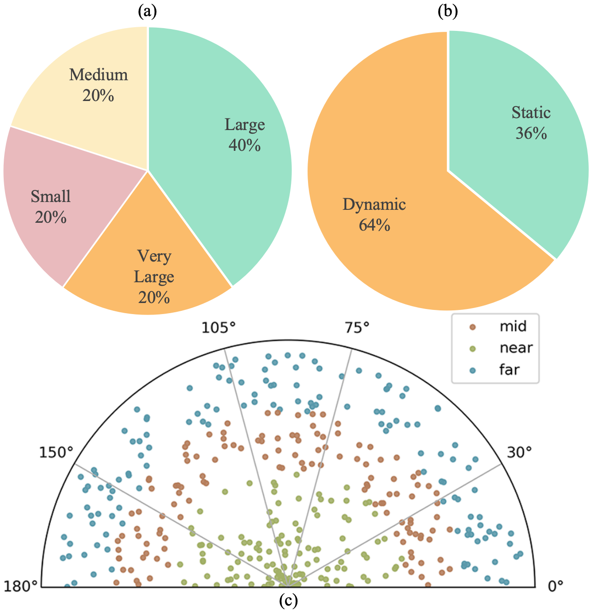
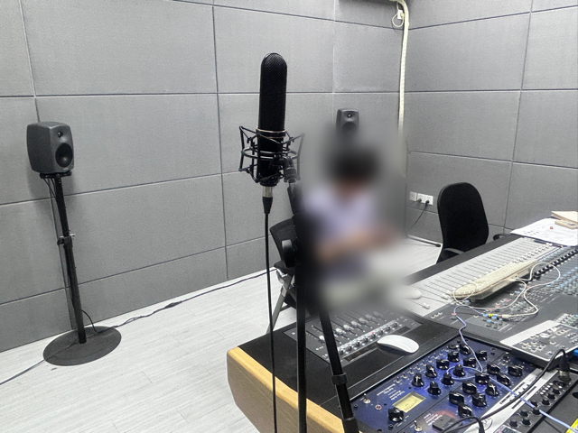
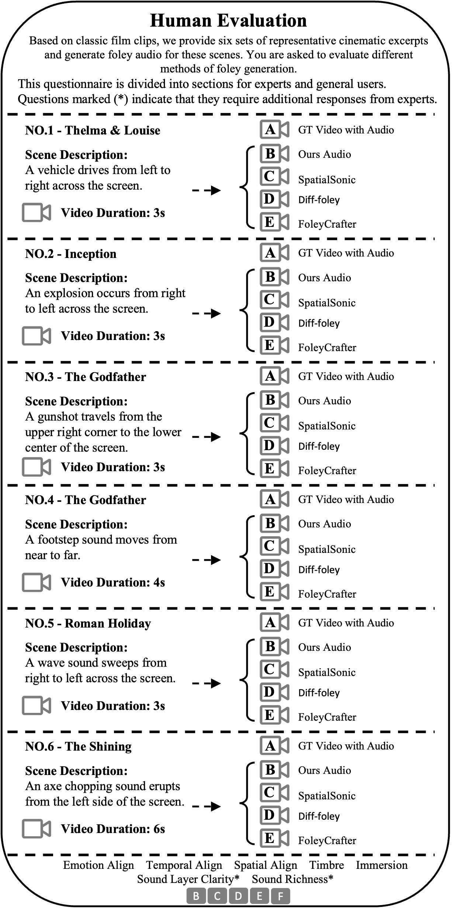
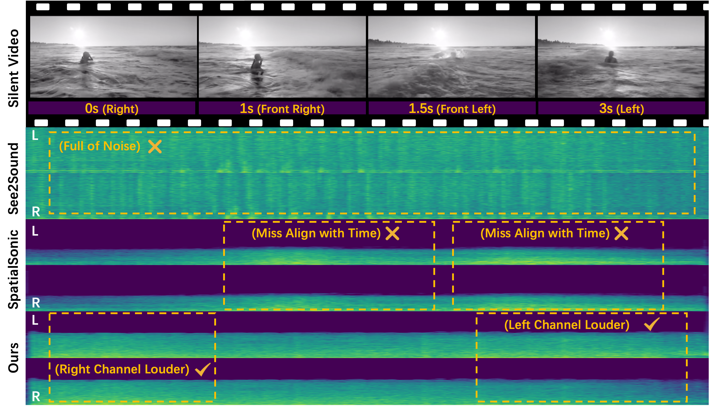
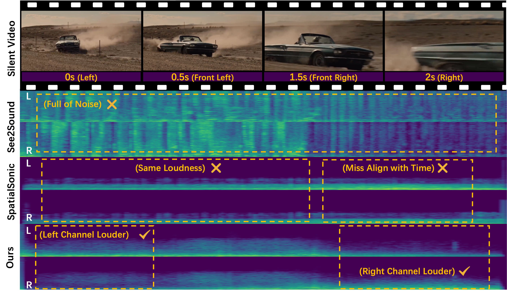

# 🚩 (2026-04-08) Scholar Inbox 추천 논문 

# 📚 Time-Domain Voice Identity Morphing (TD-VIM): A Signal-Level Approach to Morphing Attacks on Speaker Verification Systems

🚀 URL: https://arxiv.org/html/2604.05683

## 🌏 Abstract (원문)
In biometric systems, it is a common practice to associate each sample or template with a specific individual. Nevertheless, recent studies have demonstrated the feasibility of generating "morphed" biometric samples capable of matching multiple identities. These morph attacks have been recognized as potential security risks for biometric systems. However, most research on morph attacks has focused on biometric modalities that operate within the image domain, such as the face, fingerprints, and iris. In this work, we introduce Time-domain Voice Identity Morphing (TD-VIM), a novel approach for voice-based biometric morphing. This method enables the blending of voice characteristics from two distinct identities at the signal level, creating morphed samples that present a high vulnerability for speaker verification systems. Leveraging the Multilingual Audio-Visual Smartphone database, our study created four distinct morphed signals based on morphing factors and evaluated their effectiveness using a comprehensive vulnerability analysis. To assess the security impact of TD-VIM, we benchmarked our approach using the Generalized Morphing Attack Potential (G-MAP) metric, measuring attack success across two deep-learning-based Speaker Verification Systems (SVS) and one commercial system, Verispeak. Our findings indicate that the morphed voice samples achieved a high attack success rate, with G-MAP values reaching 99.40% on iPhone-11 and 99.74% on Samsung S8 in text-dependent scenarios, at a false match rate of 0.1%.
## 🌏 Abstract (번역)
생체 인식 시스템에서는 각 샘플 또는 템플릿을 특정 개인과 연결하는 것이 일반적인 관행입니다. 그럼에도 불구하고, 최근 연구들은 여러 신원과 일치할 수 있는 '모핑된' 생체 인식 샘플을 생성하는 것이 가능하다는 것을 입증했습니다. 이러한 모핑 공격은 생체 인식 시스템에 대한 잠재적인 보안 위험으로 인식되어 왔습니다. 그러나 모핑 공격에 대한 대부분의 연구는 얼굴, 지문, 홍채와 같이 이미지 도메인에서 작동하는 생체 인식 방식에 초점을 맞추었습니다. 본 연구에서는 음성 기반 생체 인식 모핑을 위한 새로운 접근 방식인 시간 도메인 음성 신원 모핑(TD-VIM)을 소개합니다. 이 방법은 신호 수준에서 두 개의 다른 신원의 음성 특성을 혼합하여 화자 확인 시스템에 높은 취약성을 나타내는 모핑된 샘플을 생성합니다. 다국어 오디오-비주얼 스마트폰 데이터베이스를 활용하여, 본 연구는 모핑 요소를 기반으로 네 가지 고유한 모핑된 신호를 생성하고 포괄적인 취약성 분석을 사용하여 그 효과를 평가했습니다. TD-VIM의 보안 영향을 평가하기 위해, 우리는 일반화된 모핑 공격 잠재력(G-MAP) 지표를 사용하여 두 개의 딥러닝 기반 화자 확인 시스템(SVS)과 하나의 상용 시스템인 Verispeak에서 공격 성공률을 측정했습니다. 우리의 연구 결과는 모핑된 음성 샘플이 텍스트 종속 시나리오에서 0.1%의 오탐율로 iPhone-11에서 99.40%, Samsung S8에서 99.74%에 달하는 높은 공격 성공률을 달성했음을 보여줍니다.

## 🔍 Methods & Results
- Time-domain Voice Identity Morphing (TD-VIM)은 음성 기반 생체 인식 모핑을 위한 새로운 접근 방식이다.
- TD-VIM 방법론은 다음 5단계로 구성된다: 화자 선택(동일 성별, 동일 발화 내용), 전처리(신호 길이 일치를 위한 제로 패딩), 신호 선택(두 번째 화자 음성의 25%, 50%, 75%, 100% 부분 선택), 평균화(선택된 두 번째 화자 음성 부분과 첫 번째 화자 음성 평균화), 검증.
- MAVS(Multilingual Audio-Visual Smartphone) 데이터베이스를 활용하여 영어, 힌디어, 벵골어 화자를 대상으로 실험을 수행했다.
- 모핑된 신호는 두 번째 화자 음성의 사용 비율에 따라 M25, M50, M75, M100의 네 가지 유형으로 생성되었다.
- TD-VIM은 화자 확인 시스템에 높은 취약성을 보였으며, G-MAP(Generalized Morphing Attack Potential) 지표를 사용하여 공격 성공률을 측정했다.
- 두 개의 딥러닝 기반 화자 확인 시스템과 상용 시스템(Verispeak)에서 평가한 결과, 모핑된 음성 샘플은 높은 공격 성공률을 달성했다.
- 텍스트 종속 시나리오에서 0.1%의 오탐율(false match rate) 기준으로 iPhone-11에서 99.40%, Samsung S8에서 99.74%의 G-MAP 값을 기록하며 높은 공격 성공률을 보였다.

## 🖼 Figures

*Figure 1:Illustration of TD-VIM morphing: Initially we apply pre-processing to make both signal of equal length. Subsequently we select four different portions of second signal in the signal selection block and average only the selected portion with the first speaker’s signal. This averaged signal is final morphed signal which is used to verify both the subjects*

*Figure 2:Illustration of signal selection of second speaker, based on the time samples we have selected 25%, 50%, 75% and 100% of the second speaker*

*Figure 3:The diagram showing 
𝑀
25
, 
𝑀
50
, 
𝑀
75
 and 
𝑀
100
 signal passed onto the x-vector and RawNet3 to get 512-dimensional and 256-dimensional embeddings respectively*

*(a) Rawnet (TD)*

*(a) Rawnet (TD)*

*(b) x-vector (TI)*

---
**Usage Info**: 2816 tokens used.
**Generated at**: 2026-04-08 13:04:31

---

# 📚 FoleyDesigner: Immersive Stereo Foley Generation with Precise Spatio-Temporal Alignment for Film Clips

🚀 URL: https://arxiv.org/html/2604.05731

## 🌏 Abstract (원문)
Foley art plays a pivotal role in enhancing immersive auditory experiences in film, yet manual creation of spatio-temporally aligned audio remains labor-intensive. We proposeFoleyDesigner, a novel framework inspired by professional Foley workflows, integrating film clip analysis, spatio-temporally controllable Foley generation, and professional audio mixing capabilities.FoleyDesigner employs a multi-agent architecture for precise spatio-temporal analysis. It achieves spatio-temporal alignment through latent diffusion models trained on spatio-temporal cues extracted from video frames, combined with large language model (LLM)-driven hybrid mechanisms that emulate post-production practices in film industry.To address the lack of high-quality stereo audio datasets in film, we introduceFilmStereo, the first professional stereo audio dataset containing spatial metadata, precise timestamps, and semantic annotations for eight common Foley categories.For applications, the framework supports interactive user control while maintaining seamless integration with professional pipelines, including 5.1-channel Dolby Atmos systems compliant with ITU-R BS.775 standards, thereby offering extensive creative flexibility.Extensive experiments demonstrate that our method achieves superior spatio-temporal alignment compared to existing baselines, with seamless compatibility with professional film production standards. The project page is available athttps://gekiii996.github.io/FoleyDesigner/.
## 🌏 Abstract (번역)
폴리 아트는 영화에서 몰입감 있는 청각 경험을 향상시키는 데 중추적인 역할을 하지만, 시공간적으로 정렬된 오디오를 수동으로 생성하는 것은 여전히 노동 집약적입니다. 우리는 전문 폴리 워크플로우에서 영감을 받은 새로운 프레임워크인 FoleyDesigner를 제안합니다. 이는 영화 클립 분석, 시공간적으로 제어 가능한 폴리 생성, 그리고 전문 오디오 믹싱 기능을 통합합니다. FoleyDesigner는 정밀한 시공간 분석을 위해 다중 에이전트 아키텍처를 사용합니다. 비디오 프레임에서 추출된 시공간 단서로 훈련된 잠재 확산 모델과 영화 산업의 후반 작업 관행을 모방하는 대규모 언어 모델(LLM) 기반 하이브리드 메커니즘을 결합하여 시공간 정렬을 달성합니다. 영화 분야에서 고품질 스테레오 오디오 데이터셋의 부족을 해결하기 위해, 우리는 8가지 일반적인 폴리 범주에 대한 공간 메타데이터, 정확한 타임스탬프, 의미론적 주석을 포함하는 최초의 전문 스테레오 오디오 데이터셋인 FilmStereo를 소개합니다. 응용 분야에서 이 프레임워크는 ITU-R BS.775 표준을 준수하는 5.1채널 Dolby Atmos 시스템을 포함한 전문 파이프라인과의 원활한 통합을 유지하면서 대화형 사용자 제어를 지원하여 광범위한 창의적 유연성을 제공합니다. 광범위한 실험을 통해 우리 방법이 기존 기준선에 비해 우수한 시공간 정렬을 달성하며, 전문 영화 제작 표준과 완벽하게 호환됨을 입증합니다. 프로젝트 페이지는 https://gekiii996.github.io/FoleyDesigner/에서 확인할 수 있습니다.

## 🔍 Methods & Results
- FoleyDesigner는 영화 클립 분석, 시공간 제어 가능한 폴리 생성, 전문 오디오 믹싱 기능을 통합하는 새로운 프레임워크로, 조밀하게 겹치는 사운드 이벤트, 오디오-시각적 접지 제어 부족, 원본 오디오의 음향 불일치 문제를 해결합니다.
- Foley 스크립트 생성 단계에서는 Tree-of-Thought (ToT) 추론과 다중 에이전트(생성기, 검증기) 아키텍처를 사용하여 무성 비디오에서 검증된 Foley 스크립트를 생성하고, 영화 스크립트를 통합하여 서사적 요소를 추론하며, 겹치는 이벤트를 개별적으로 분해합니다.
- 시공간 폴리 생성 단계에서는 VLM 및 깊이 추정을 통해 키프레임에서 깊이 및 방위각 정보를 추출하고, 사운드 이벤트 타임스탬프를 사용하여 시간 동기화를 보장합니다.
- Diffusion Transformer (DiT 기반 잠재 확산 모델)를 활용하며, 푸리에 특징 변환을 통한 위치 인코딩과 교차 어텐션을 통한 '위치 인식 주입 메커니즘'을 도입하여 정밀한 시공간 정렬을 달성합니다.
- 전문 오디오 믹싱 단계에서는 다중 에이전트 후처리 프레임워크를 사용하여 음향 불일치, 스펙트럼 마스킹, 음량 불균형을 해결합니다. 이 프레임워크는 Foley 분석, 믹싱 플래너, 잔향, 이퀄라이제이션, 다이내믹스 전문가 에이전트로 구성됩니다.
- 스테레오 출력을 ITU-R BS.775 표준을 따르는 5.1 서라운드 형식으로 업믹싱하여 전문 영화 제작 표준을 충족하며, 공간적 역동성을 보존하고 에너지 균형을 유지합니다.
- 광범위한 실험을 통해 기존 기준선에 비해 우수한 시공간 정렬을 달성하고 전문 영화 제작 표준과 완벽하게 호환됨을 입증했습니다.

## 🖼 Figures

*Figure 1:FoleyDesigner Overview. The left column detailing the actual steps of a human Foley designer. The right column presents the corresponding simulated functional modules of FoleyDesigner, showcasing outputs at each phase, resulting in a soundtrack suitable for film use.*

*Figure 2:FoleyDesigner Architecture. Our pipeline for automated Foley generation consists of three stages, (1) Fine-Grained Film Decomposition: analyzes silent video and generates hierarchical Foley scripts; (2) Spatio-Temporal Foley Generation: produces spatially-controlled stereo audio using DiT-based diffusion conditioned on visual cues; (3) Foley Refinement: applies multi-agent processing to refine audio quality and generate 5.1 surround output.*

*Figure 3:FilmStereo Construction. Our four-step pipeline for creating spatially and temporally annotated audio data. (1) Audio filtering and extension, (2) Spatial simulation with random positioning, (3) Spatial-rich caption generation via chain-of-thought, and (4) Temporal annotation with event detection.*

*Figure 4:Qualitative Results. Qualitative comparison showing temporal alignment between video events and generated audio across two scenarios. Left: explosion sequence with three distinct events. Right: excavation scene with repetitive shoveling actions. Checkmarks indicate successful synchronization, while crosses mark temporal misalignment.*

*Figure 5:Human Evaluation Results. We compared the selection ratio of four methods from five perspectives: (1) Immerse, (2) Emo Align, (3) Tempo Align, (4) Spatial Align, and (5) Timbre.*

*Figure 1:FilmStereo Dataset Pipeline. The process begins with sourcing data using randomly sampled parameters to define sound event attributes, followed by a simulated sound design scenario in Step 2 to generate film foley annotations. The resulting data undergoes manual verification to ensure quality and accuracy.*

*Figure 2:FilmStereo Distribution Analysis. (a) Room size distribution. (b) Motion type distribution. (c) Spatial positioning across azimuth angles and depth zones.*

*Figure 3:User study setup. (a) Standard 5.1 surround sound speaker configuration showing Front Left (FL), Center (C), Front Right (FR), Low Frequency Effects (LFE), Left Surround (LS), and Right Surround (RS) positions. (b) Professional mixing studio environment.*

*Figure 4:Participants conducting the perceptual evaluation in the professional mixing studio environment.*

*Figure 5:Questionnaire details. This is the survey questionnaire we designed and used in the user study.*

*Figure 6: Temporal Analysis. Each video frame corresponds to a temporal segment in the spectrogram below. Yellow checkmarks indicate successful audio-visual synchronization. Our method achieves consistent temporal alignment across key events, while baseline methods show varying degrees of synchronization failure regardless of their output channel configuration.*

*Figure 7:Spatial Analysis. Our method demonstrates proper stereo separation with left channel (L) strengthening and right channel (R) weakening, while SpatialSonic (stereo output) shows limited spatial variation despite having two-channel capability.*

*Figure 8:Spatial Analysis. Our method demonstrates proper stereo separation with left channel (L) weakening and right channel (R) strengthening, while SpatialSonic (stereo output) shows limited spatial variation despite having two-channel capability.*

---
**Usage Info**: 4982 tokens used.
**Generated at**: 2026-04-08 13:04:43

---

