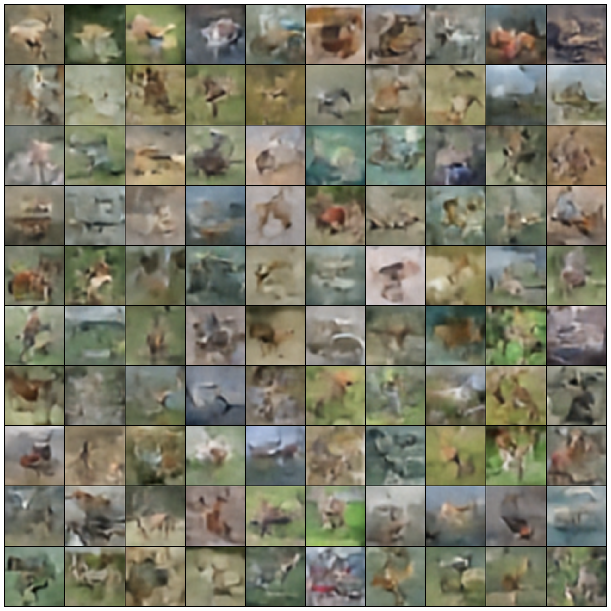
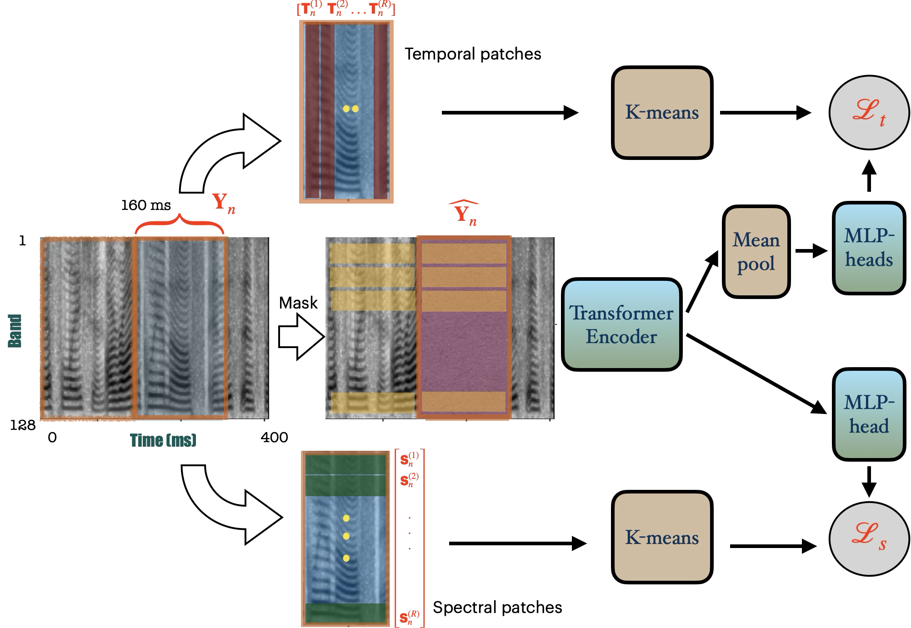
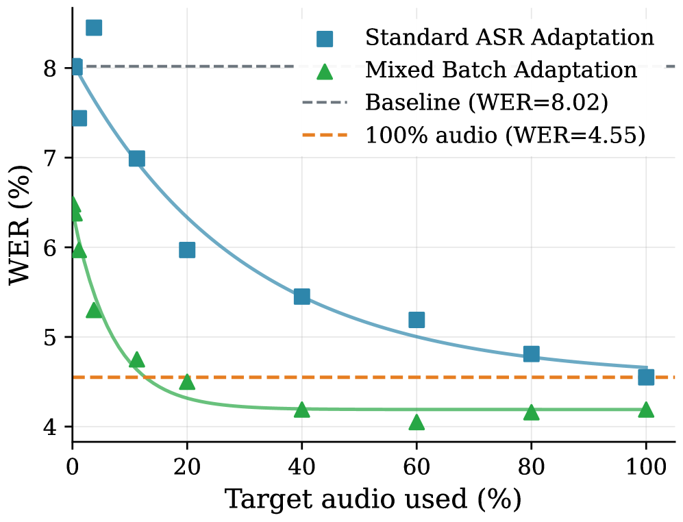
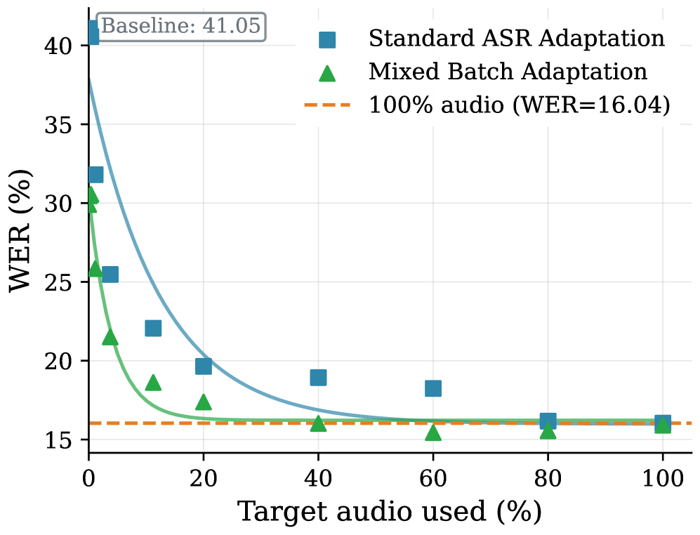
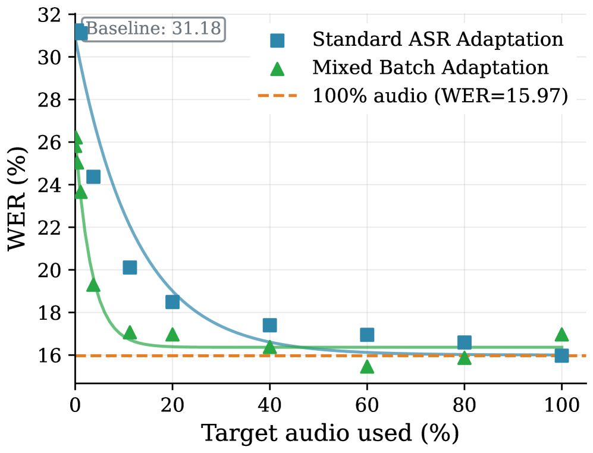
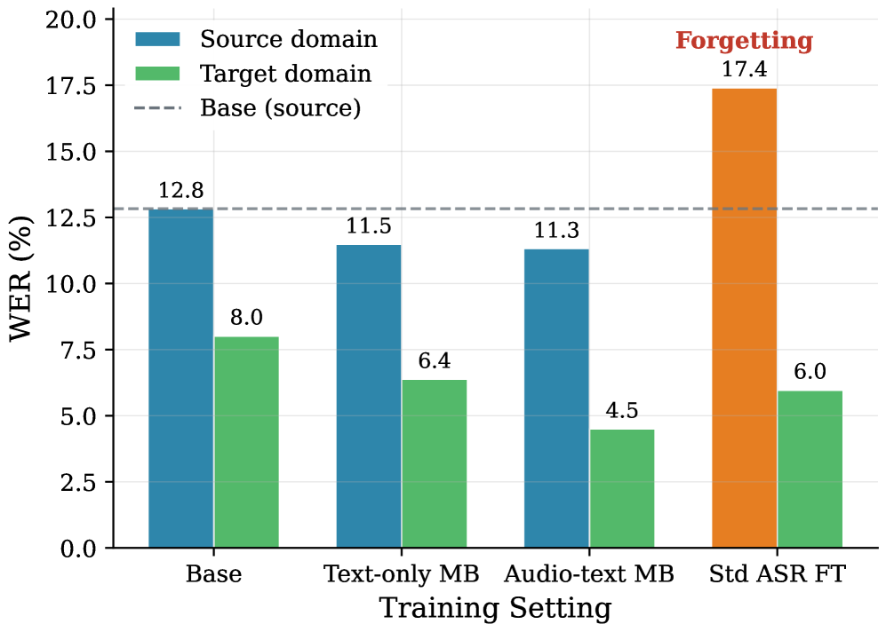
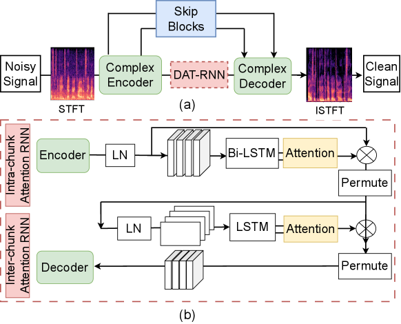
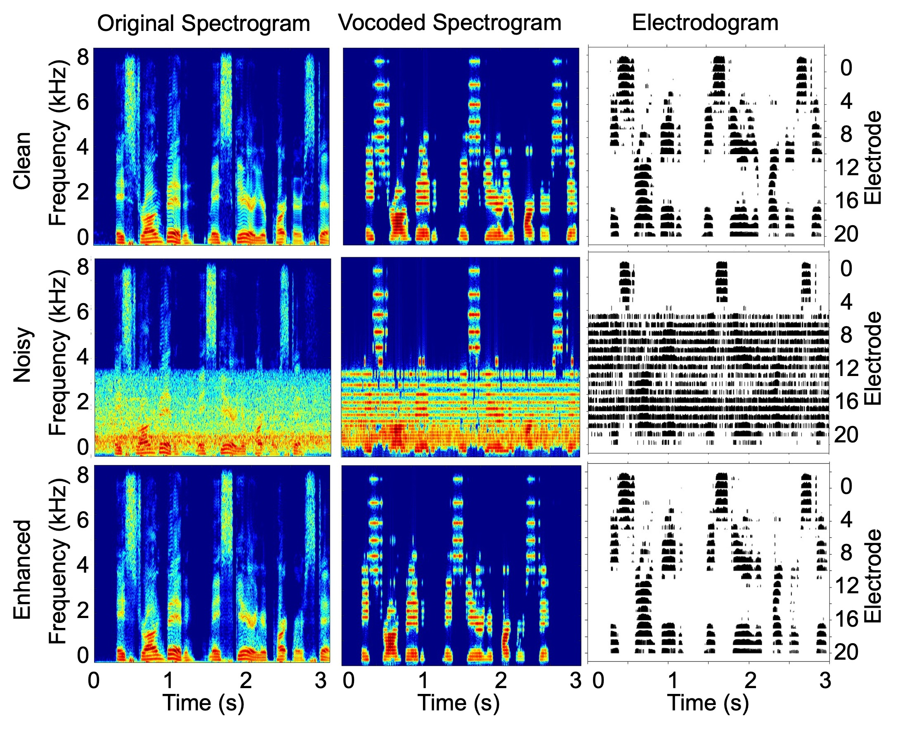
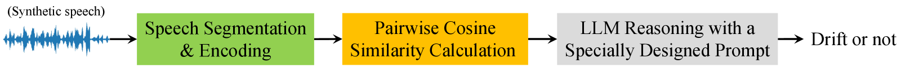
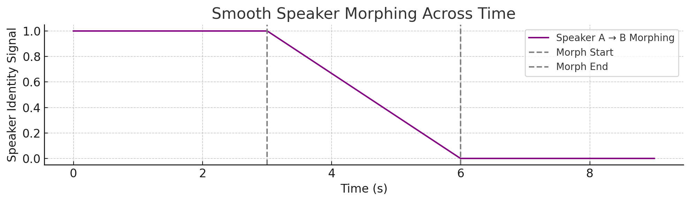

# 🚩 (2026-04-09) Scholar Inbox 추천 논문 

# 📚 ODE-free Neural Flow Matching for One-Step Generative Modeling

🚀 URL: https://arxiv.org/html/2604.06413

## 🌏 Abstract (원문)
Diffusion and flow matching models generate samples by learning time-dependent vector fields whose integration transports noise to data, requiring tens to hundreds of network evaluations at inference. We instead learn the transport map directly. We propose Optimal Transport Neural Flow Matching (OT-NFM), an ODE-free generative framework that parameterizes the flow map with neural flows, enabling true one-step generation with a single forward pass. We show that naive flow-map training suffers from mean collapse, where inconsistent noise–data pairings drive all outputs toward the data mean. We prove that consistent coupling is necessary for non-degenerate learning and address this using optimal transport pairings with scalable minibatch and online coupling strategies. Experiments on synthetic benchmarks and image generation tasks (MNIST and CIFAR-10) demonstrate competitive sample quality while reducing inference to a single network evaluation.Keywords:Neural Flow⋅	Flow Matching⋅	Optimal Transport
## 🌏 Abstract (번역)
확산 및 플로우 매칭 모델은 노이즈를 데이터로 변환하는 시간 의존적 벡터 필드를 학습하여 샘플을 생성하며, 추론 시 수십에서 수백 번의 네트워크 평가가 필요합니다. 본 연구에서는 대신 전송 맵을 직접 학습합니다. 우리는 신경 플로우로 플로우 맵을 매개변수화하여 단일 순방향 패스로 진정한 원스텝 생성을 가능하게 하는 ODE-free 생성 프레임워크인 최적 수송 신경 플로우 매칭(OT-NFM)을 제안합니다. 우리는 순진한 플로우 맵 훈련이 평균 붕괴(mean collapse) 현상을 겪는다는 것을 보여줍니다. 이는 일관성 없는 노이즈-데이터 페어링이 모든 출력을 데이터 평균으로 몰고 가는 현상입니다. 우리는 비퇴화 학습을 위해 일관된 커플링이 필수적임을 증명하고, 확장 가능한 미니배치 및 온라인 커플링 전략을 사용하는 최적 수송 페어링을 통해 이 문제를 해결합니다. 합성 벤치마크 및 이미지 생성 작업(MNIST 및 CIFAR-10)에 대한 실험은 추론을 단일 네트워크 평가로 줄이면서도 경쟁력 있는 샘플 품질을 보여줍니다.

## 🔍 Methods & Results
- Neural Flow Matching (NFM)은 속도 필드를 학습하는 대신 플로우 맵 Fθ(t, x0)를 직접 매개변수화하여 노이즈 샘플 x0를 타겟 샘플 x1로 매핑하는 ODE-free 생성 프레임워크이다.
- NFM의 주요 장점은 (1) 추론 시 ODE 솔버 없이 단일 순방향 패스로 생성이 가능하고, (2) 순간 속도가 아닌 엔드포인트 쌍 (x0, x1)에 직접적으로 훈련이 감독되며, (3) 추론 시간 효율성에 영향을 주지 않고 어떤 보간 방식이든 사용할 수 있다는 점이다.
- 독립적으로 샘플링된 (x0, x1) 쌍을 사용하여 신경 플로우를 훈련하는 순진한 접근 방식은 '평균 붕괴(mean collapse)'를 야기한다. 이는 모든 생성된 샘플이 데이터 평균으로 수렴하는 현상으로, Fθ*(1, x0) = E[x1]로 증명된다 (Theorem 1).
- 평균 붕괴는 페어링 불일치에서 비롯되므로, 이를 해결하기 위해 독립적인 커플링 π=p0×p1 대신 각 x0에 일관된 타겟 x1을 할당하는 최적 수송(Optimal Transport, OT) 계획 π*를 사용한다.
- Theorem 2는 독립적이지 않은 커플링(예: OT)이 비퇴화 생성을 위해 충분하며, 평균 붕괴를 방지함을 이론적으로 입증한다.
- 대규모 데이터셋에 대한 OT의 실용적인 대안으로 Minibatch OT (미리 계산된 고정 할당), LOOM (온라인 미니배치 OT를 통한 점진적 개선), Per-batch OT (각 배치에서 새로운 문제 해결) 세 가지 전략을 고려한다.
- 플로우 맵 Fθ는 ResNetFlow (2D 데이터) 또는 ResNetFlowUNet (이미지 데이터) 아키텍처를 사용하여 구현되며, Fθ(t, x0) = x0 + φ(t)gθ(t, x0) 형태로 정의된다.
- Proposition 1은 φ(t)=t이고 OT 커플링 및 선형 보간 x_t = (1-t)x0 + tx1을 사용할 경우, 최적의 변위 네트워크 gθ가 시간 독립적인 공간 변위 필드 x1-x0만 학습하면 되므로 학습 복잡성이 크게 줄어든다는 것을 보여준다.
- 선형 보간은 ResNetFlow에 가장 자연스럽고 효율적인 선택이며, 시간 가변 속도를 가진 다른 보간 방식(코사인, 다항식)은 gθ가 시간적 변화를 추가로 모델링해야 하므로 학습 난이도를 증가시킨다.

## 🖼 Figures
![Figure 1:Synthetic transport results. Flow trajectories under four coupling strategies (columns) on four 2-D benchmarks (rows): Gauss 
→
 Checkerboard, Gauss 
→
 Spiral, Gauss 
→
 Crescent, and 8-GMM 
→
 2-Moons. Black dots: source samples (
𝑡
=
0
); blue dots: generated samples (
𝑡
=
1
); olive arrows: learned flow trajectories. Per-batch OT produces tangled, inconsistent trajectories across all tasks. Minibatch OT, LOOM, and Global OT all recover clean transport with coherent, largely non-crossing routing, confirming that globally consistent coupling is the key determinant of flow-map quality.](../images/2026-04-09/2604.06413/2604.06413_fig0.png)
*Figure 1:Synthetic transport results. Flow trajectories under four coupling strategies (columns) on four 2-D benchmarks (rows): Gauss 
→
 Checkerboard, Gauss 
→
 Spiral, Gauss 
→
 Crescent, and 8-GMM 
→
 2-Moons. Black dots: source samples (
𝑡
=
0
); blue dots: generated samples (
𝑡
=
1
); olive arrows: learned flow trajectories. Per-batch OT produces tangled, inconsistent trajectories across all tasks. Minibatch OT, LOOM, and Global OT all recover clean transport with coherent, largely non-crossing routing, confirming that globally consistent coupling is the key determinant of flow-map quality.*

![Figure 2:MNIST coupling ablation. Each panel shows 100 generated samples (
10
×
10
 grid). NFM (no OT): complete mean collapse — every output is a blurred average with no digit identity. NFM (minibatch OT): precomputed pairing restores sharp, diverse digits in a single forward pass. CFM (no OT) provides an unguided flow matching baseline with independent coupling. CFM (minibatch OT) (100 NFE) and MeanFlow (1 NFE) produce recognizable digits regardless of coupling, confirming robustness via iterative self-correction.](../images/2026-04-09/2604.06413/2604.06413_fig1.png)
*Figure 2:MNIST coupling ablation. Each panel shows 100 generated samples (
10
×
10
 grid). NFM (no OT): complete mean collapse — every output is a blurred average with no digit identity. NFM (minibatch OT): precomputed pairing restores sharp, diverse digits in a single forward pass. CFM (no OT) provides an unguided flow matching baseline with independent coupling. CFM (minibatch OT) (100 NFE) and MeanFlow (1 NFE) produce recognizable digits regardless of coupling, confirming robustness via iterative self-correction.*

![Figure 3:Neural flow trajectories on MNIST. Each row shows 
𝐹
𝜃
​
(
𝑡
,
𝐱
0
)
 for a fixed noise vector 
𝐱
0
∼
𝒩
​
(
𝟎
,
𝐈
)
 evaluated at 
𝑡
∈
{
0.0
,
0.1
,
…
,
1.0
}
. At 
𝑡
=
0
 the identity condition gives pure noise; coarse digit structure emerges by 
𝑡
≈
0.3
–
0.4
 and class identity is committed by 
𝑡
≈
0.5
; background noise is suppressed and strokes sharpen monotonically toward the clean output at 
𝑡
=
1.0
. No ODE solver is used; generation is a single forward pass of 
𝐹
𝜃
​
(
1
,
𝐱
0
)
.](../images/2026-04-09/2604.06413/2604.06413_fig2.png)
*Figure 3:Neural flow trajectories on MNIST. Each row shows 
𝐹
𝜃
​
(
𝑡
,
𝐱
0
)
 for a fixed noise vector 
𝐱
0
∼
𝒩
​
(
𝟎
,
𝐈
)
 evaluated at 
𝑡
∈
{
0.0
,
0.1
,
…
,
1.0
}
. At 
𝑡
=
0
 the identity condition gives pure noise; coarse digit structure emerges by 
𝑡
≈
0.3
–
0.4
 and class identity is committed by 
𝑡
≈
0.5
; background noise is suppressed and strokes sharpen monotonically toward the clean output at 
𝑡
=
1.0
. No ODE solver is used; generation is a single forward pass of 
𝐹
𝜃
​
(
1
,
𝐱
0
)
.*

*Figure 4:CIFAR-10 samples (1-NFE).*

*Figure 5:Trajectory ablation (global OT). Top row: 8-GMM 
→
 2-moons. Bottom row: Gaussian 
→
 Checkerboard. Columns show Cosine (left), Polynomial 
𝛼
=
2
 (center), and Stochastic 
𝜎
=
0.5
 (right). Linear interpolation (Figure 1) produces the straightest trajectories and is used throughout all other experiments. The disconnected checkerboard support amplifies trajectory failures, confirming linear interpolation as the optimal choice for neural flow matching.*

---
**Usage Info**: 5222 tokens used.
**Generated at**: 2026-04-09 13:04:47

---

# 📚 ULTRAS - Unified Learning of Transformer Representations for Audio and Speech Signals

🚀 URL: https://arxiv.org/html/2604.06702

## 🌏 Abstract (원문)
Self-supervised learning (SSL) has driven impressive advances in speech processing by adopting time-domain prediction objectives, while audio representation learning frameworks operate on time-frequency spectrograms. Models optimized for one paradigm struggle to transfer to the other, highlighting the need for a joint framework. We propose UnifiedLearning ofTransformerRepresentations forAudio andSpeech (ULTRAS), where the masking and predictive modeling is performed over long patches of the data. The model, based on the transformer architecture, encodes spectral-patches of log-mel spectrogram features. The predictive modeling of masked segments is performed on spectral and temporal targets using a combined loss-function, forcing the representations to encode time and frequency traits. Experiments are performed on a variety of speech and audio tasks, where we illustrate that the ULTRAS framework achieves improved performance over other established baselines.
## 🌏 Abstract (번역)
자기 지도 학습(SSL)은 시간 영역 예측 목표를 채택하여 음성 처리 분야에서 인상적인 발전을 이끌었지만, 오디오 표현 학습 프레임워크는 시간-주파수 스펙트로그램에서 작동합니다. 한 패러다임에 최적화된 모델은 다른 패러다임으로 전이하는 데 어려움을 겪으며, 이는 통합 프레임워크의 필요성을 강조합니다. 우리는 데이터의 긴 패치에 걸쳐 마스킹 및 예측 모델링이 수행되는 오디오 및 음성용 트랜스포머 표현의 통합 학습(ULTRAS)을 제안합니다. 트랜스포머 아키텍처를 기반으로 하는 이 모델은 로그-멜 스펙트로그램 특징의 스펙트럼 패치를 인코딩합니다. 마스킹된 세그먼트의 예측 모델링은 스펙트럼 및 시간적 목표에 대해 결합된 손실 함수를 사용하여 수행되며, 이는 표현이 시간 및 주파수 특성을 인코딩하도록 강제합니다. 다양한 음성 및 오디오 작업에서 실험이 수행되었으며, ULTRAS 프레임워크가 다른 기존 기준선보다 향상된 성능을 달성함을 보여줍니다.

## 🔍 Methods & Results
- ULTRAS는 2D 오디오 스펙트로그램을 입력으로 받는 Vision Transformer 스타일의 자기 지도 학습(SSL) 모델이며, 음성 및 오디오 작업 모두에 적용 가능한 강력하고 일반화 가능한 오디오 표현을 학습하는 것을 목표로 합니다.
- 입력 오디오 파형은 25ms Hanning 윈도우와 10ms 홉 사이즈를 사용하여 128차원 로그-멜 스펙트로그램으로 변환되며, 스펙트로그램은 P=16 프레임(160ms 오디오)의 겹치지 않는 윈도우로 분할됩니다.
- 자기 지도 학습을 위해 윈도우화된 스펙트로그램에 무작위 마스킹 전략을 적용하며, 각 세그먼트는 0.6의 확률로 마스킹되고, 마스킹된 패치 다음 패치는 0.2의 확률로 추가 마스킹되어 긴 문맥적 의존성을 학습하도록 유도합니다.
- 각 윈도우화된 스펙트로그램은 R개의 겹치지 않는 스펙트럼 패치(P x P 크기)로 균일하게 분할되며, 각 패치는 벡터화되고 학습 가능한 위치 임베딩과 함께 트랜스포머 인코더에 입력됩니다.
- 스펙트럼 목표는 각 스펙트럼 패치를 K-평균 양자화기(Ks=100 클러스터)를 사용하여 이산적인 주파수 빈 패턴으로 양자화하는 것이며, 예측은 MLP 헤드와 소프트맥스 활성화를 통해 이루어지고 스펙트럼 손실은 교차 엔트로피 손실로 계산됩니다.
- 시간적 목표는 각 윈도우화된 스펙트로그램을 R개의 겹치지 않는 프레임으로 분할하고, 사전 훈련된 HuBERT 인코더(6번째 레이어, 768차원)에서 생성된 임베딩을 K-평균 양자화기(Kt=500 클러스터)로 양자화하여 이산적인 프레임 레벨 목표를 생성합니다.
- 시간적 예측은 스펙트럼 임베딩을 평균 풀링한 후 MLP 분류 헤드를 통해 이루어지며, 시간적 손실은 각 마스킹된 윈도우의 모든 프레임에 대한 평균 교차 엔트로피 손실입니다.
- ULTRAS의 전체 훈련 목표는 스펙트럼 손실(Ls)과 시간 프레임 손실(Lt)의 가중치 조합(λ는 조절 가능한 하이퍼파라미터)입니다.
- 구현 세부 사항으로, 입력 오디오는 8초로 고정되고, 로그-멜 스펙트로그램(D=128, M=800)으로 변환되며, P=16으로 설정되어 160ms 블록당 R=8개의 스펙트럼 패치가 생성됩니다.
- 트랜스포머 인코더는 Vision-Transformer(ViT)와 유사하게 12개 레이어와 12개 어텐션 헤드로 구성되며, 각 패치는 768차원 임베딩으로 선형 투영됩니다.
- K-평균 클러스터링은 스펙트럼 패치에 대해 Ks=100 클러스터, 시간적 프레임에 대해 HuBERT 임베딩을 사용하여 Kt=500 클러스터로 수행됩니다.
- 모델은 스펙트럼 목표만 사용하여 100k 스텝 동안 사전 훈련되며(SSAST에서 영감을 받은 마스킹 전략, 60% 무작위 마스킹, MLM 손실), 이후 결합된 손실 함수로 150k 스텝까지 공동 훈련을 진행합니다.
- 훈련은 AdamW 옵티마이저(weight decay 0.05, β=[0.9, 0.98])를 사용하며, 선형 학습률 스케줄러는 처음 10% 스텝 동안 1e-6에서 1e-4로 선형 증가(웜업)한 후 나머지 스텝 동안 1e-6으로 선형 감소합니다.
- ULTRAS 프레임워크는 다양한 음성 및 오디오 작업에서 기존 기준선보다 향상된 성능을 달성합니다.

## 🖼 Figures

*Figure 1:Block schematic of the proposed framework of joint 1-D and 2-D modeling of audio data. The gradient colored blocks are learnable, while the rest do not have any learnable parameters.*

---
**Usage Info**: 4646 tokens used.
**Generated at**: 2026-04-09 13:05:00

---

# 📚 Closing the Speech-Text Gap with Limited Audio for Effective Domain Adaptation in LLM-Based ASR

🚀 URL: https://arxiv.org/html/2604.06487

## 🌏 Abstract (원문)
Conventional end-to-end automatic speech recognition (ASR) systems rely on paired speech–text data for domain adaptation. Recent LLM-based ASR architectures connect a speech encoder to a large language model via a projection module, enabling adaptation with text-only data. However, this introduces a modality gap, as the LLM is not exposed to the noisy representations produced by the speech projector. We investigate whether small amounts of speech can mitigate this mismatch. We compare three strategies: text-only adaptation, paired speech–text adaptation, and mixed batching (MB), which combines both. Experiments in in-domain and out-of-domain settings show that even limited speech consistently improves performance. Notably, MB using only 10% of the target-domain (less than 4 hours) speech achieves word error rates comparable to, or better than, conventional ASR fine-tuning with the full dataset, indicating that small amounts of speech provide a strong modality-alignment signal.
## 🌏 Abstract (번역)
기존의 종단 간 자동 음성 인식(ASR) 시스템은 도메인 적응을 위해 음성-텍스트 쌍 데이터에 의존합니다. 최근 LLM 기반 ASR 아키텍처는 투영 모듈을 통해 음성 인코더를 대규모 언어 모델에 연결하여 텍스트 전용 데이터로 적응할 수 있도록 합니다. 그러나 이는 LLM이 음성 투영기가 생성하는 노이즈가 있는 표현에 노출되지 않기 때문에 양식 간 격차(modality gap)를 발생시킵니다. 우리는 소량의 음성이 이러한 불일치를 완화할 수 있는지 조사합니다. 우리는 세 가지 전략을 비교합니다: 텍스트 전용 적응, 쌍을 이룬 음성-텍스트 적응, 그리고 이 둘을 결합한 혼합 배치(MB)입니다. 동일 도메인 및 이종 도메인 설정에서의 실험은 제한된 음성만으로도 성능이 지속적으로 향상됨을 보여줍니다. 특히, 대상 도메인 음성(4시간 미만)의 10%만을 사용한 MB는 전체 데이터셋을 사용한 기존 ASR 미세 조정과 유사하거나 더 나은 단어 오류율을 달성했으며, 이는 소량의 음성이 강력한 양식 정렬 신호를 제공함을 나타냅니다.

## 🔍 Methods & Results
- LLM 기반 ASR에서 음성 투영기가 생성하는 노이즈 표현에 LLM이 노출되지 않아 발생하는 양식 간 격차(modality gap) 문제를 해결하고자 함.
- 소량의 음성 데이터가 이러한 불일치를 완화할 수 있는지 조사함.
- 세 가지 적응 전략(텍스트 전용, 음성-텍스트 쌍, 혼합 배치(MB))을 비교함.
- 동일 도메인 및 이종 도메인 환경에서 실험을 수행함.
- 제한된 양의 음성 데이터만으로도 성능이 지속적으로 향상됨을 확인함.
- 대상 도메인 음성 데이터의 10%(4시간 미만)만을 사용한 혼합 배치(MB)가 전체 데이터셋을 사용한 기존 ASR 미세 조정과 유사하거나 더 나은 단어 오류율(WER)을 달성함.
- 소량의 음성 데이터가 강력한 양식 정렬 신호를 제공하여 양식 간 격차를 효과적으로 줄일 수 있음을 시사함.

## 🖼 Figures

*Figure 1:Effect of different target text proportions (
𝜏
𝑡
) on Mixed Batch adaptation on DefinedAI Banking.*

*(a)Banking*

*(a)Banking*

*(b)Agriculture*

*(c)Musical Instruments*

*Figure 3:Performances of base system and adapted model with text-only, paired speech-text and mixed batch adaptation. For both audio-adaptation settings, 20% of speech is used.*

---
**Usage Info**: 2224 tokens used.
**Generated at**: 2026-04-09 13:05:20

---

# 📚 DAT-CFTNet: Speech Enhancement for Cochlear Implant Recipients using Attention-based Dual-Path Recurrent Neural Network

🚀 URL: https://arxiv.org/html/2604.06744

## 🌏 Abstract (원문)
The human auditory system has the ability to selectively focus on key speech elements in an audio stream while giving secondary attention to less relevant areas such as noise or distortion within the background, dynamically adjusting its attention over time. Inspired by the recent success of attention models, this study introduces a dual-path attention module in the bottleneck layer of a concurrent speech enhancement network. Our study proposes an attention-based dual-path RNN (DAT-RNN), which, when combined with the modified complex-valued frequency transformation network (CFTNet), forms the DAT-CFTNet. This attention mechanism allows for precise differentiation between speech and noise in time-frequency (T-F) regions of spectrograms, optimizing both local and global context information processing in the CFTNet. Our experiments suggest that the DAT-CFTNet leads to consistently improved performance over the existing models, including CFTNet and DCCRN, in terms of speech intelligibility and quality. Moreover, the proposed model exhibits superior performance in enhancing speech intelligibility for cochlear implant (CI) recipients, who are known to have severely limited T-F hearing restoration (e.g.,>>10%) in CI listener studies in noisy settings show the proposed solution is capable of suppressing non-stationary noise, avoiding the musical artifacts often seen in traditional speech enhancement methods. The implementation of the proposed model will be publicly available111https://github.com/nursad49/DAT-CFTNet
## 🌏 Abstract (번역)
인간의 청각 시스템은 오디오 스트림에서 주요 음성 요소에 선택적으로 집중하는 동시에 배경의 소음이나 왜곡과 같은 덜 관련성 있는 영역에는 부차적인 주의를 기울이며, 시간이 지남에 따라 주의를 동적으로 조절하는 능력을 가지고 있습니다. 어텐션 모델의 최근 성공에 영감을 받아, 본 연구는 동시 음성 향상 네트워크의 병목 계층에 듀얼-패스 어텐션 모듈을 도입합니다. 본 연구는 어텐션 기반 듀얼-패스 RNN(DAT-RNN)을 제안하며, 이는 수정된 복소수 주파수 변환 네트워크(CFTNet)와 결합하여 DAT-CFTNet을 형성합니다. 이 어텐션 메커니즘은 스펙트로그램의 시간-주파수(T-F) 영역에서 음성과 노이즈를 정밀하게 구별할 수 있게 하여 CFTNet에서 지역 및 전역 컨텍스트 정보 처리를 모두 최적화합니다. 우리의 실험은 DAT-CFTNet이 음성 명료도 및 품질 측면에서 CFTNet 및 DCCRN을 포함한 기존 모델보다 지속적으로 향상된 성능을 보인다는 것을 시사합니다. 더욱이, 제안된 모델은 T-F 청각 복원이 심각하게 제한된 것으로 알려진 인공와우(CI) 이식자들의 음성 명료도를 향상시키는 데 우수한 성능을 보입니다. 시끄러운 환경에서의 CI 청취자 연구에서 제안된 솔루션은 비정상적인 노이즈를 억제하고, 전통적인 음성 향상 방법에서 흔히 나타나는 음악적 아티팩트를 피할 수 있음을 보여줍니다. 제안된 모델의 구현은 공개적으로 제공될 예정입니다(https://github.com/nursad49/DAT-CFTNet).

## 🔍 Methods & Results
- 제안된 DAT-CFTNet은 인코더, 디코더, 그리고 병목 계층의 DAT-RNN 모듈로 구성되며, CFTNet의 GRU 모듈을 DAT-RNN으로 대체하여 음성 향상을 수행한다.
- DAT-RNN 모듈은 DPRNN과 어텐션 메커니즘을 결합하여 시간-주파수(T-F) 표현에서 스펙트럼 패턴을 효과적으로 모델링한다.
- DAT-RNN은 두 가지 RNN 유형(각각 어텐션 모듈을 따름)을 사용하는데, '인트라-청크 RNN'(Bi-LSTM)은 개별 T-F 청크 내의 세부 정보를 처리하고, '인터-청크 RNN'(표준 LSTM)은 모든 T-F 청크에 걸쳐 전역적인 관계를 포착한다.
- 어텐션 메커니즘은 LSTM 및 Bi-LSTM 출력에서 파생된 키(key) 및 쿼리(query) 파라미터를 사용하여 마스크 벡터(M)를 계산하고, 이를 통해 원본 입력 특징에 해당하는 향상된 특징을 생성한다.
- DAT-CFTNet의 변형 모델은 표준 Conv2D 대신 깊이별 분리형 컨볼루션(DSC)을 사용하여 파라미터 수를 3배 줄여 실시간 애플리케이션에 적합하도록 최적화되었다.
- 실험 결과, DAT-CFTNet은 음성 명료도 및 품질 측면에서 CFTNet 및 DCCRN을 포함한 기존 모델보다 지속적으로 향상된 성능을 보였다.
- 제안된 모델은 인공와우(CI) 이식자들의 음성 명료도를 향상시키는 데 특히 우수한 성능을 나타냈다.
- DAT-CFTNet은 비정상적인 노이즈를 효과적으로 억제하고, 기존 음성 향상 방법에서 흔히 발생하는 음악적 아티팩트를 방지하는 능력을 입증했다.

## 🖼 Figures

*Fig. 1:(a) Basic block diagram of the proposed DAT-CFTNet and (b) the dual-path attention RNN module*

*Fig. 2:CI electrode stimulation response (electrodogram) with spectrograms with original and vocoded speech in car noise at SNR 0 dB for clean, noisy, DAT-CFTNet-F processed speech.*

---
**Usage Info**: 2858 tokens used.
**Generated at**: 2026-04-09 13:05:28

---

# 📚 A Novel Automatic Framework for Speaker Drift Detection in Synthesized Speech

🚀 URL: https://arxiv.org/html/2604.06327

## 🌏 Abstract (원문)
Recent diffusion-based text-to-speech (TTS) models achieve high naturalness and expressiveness, yet often suffer from speaker drift, a subtle, gradual shift in perceived speaker identity within a single utterance. This underexplored phenomenon undermines the coherence of synthetic speech, especially in long-form or interactive settings. We introduce the first automatic framework for detecting speaker drift by formulating it as a binary classification task over utterance-level speaker consistency. Our method computes cosine similarity across overlapping segments of synthesized speech and prompts large language models (LLMs) with structured representations to assess drift. We provide theoretical guarantees for cosine-based drift detection and demonstrate that speaker embeddings exhibit meaningful geometric clustering on the unit sphere. To support evaluation, we construct a high-quality synthetic benchmark with human-validated speaker drift annotations. Experiments with multiple state-of-the-art LLMs confirm the viability of this embedding-to-reasoning pipeline. Our work establishes speaker drift as a standalone research problem and bridges geometric signal analysis with LLM-based perceptual reasoning in modern TTS.
## 🌏 Abstract (번역)
최근 확산 기반 텍스트-음성 변환(TTS) 모델은 높은 자연스러움과 표현력을 달성하지만, 단일 발화 내에서 인지되는 화자 정체성이 미묘하고 점진적으로 변화하는 화자 드리프트 현상을 겪는 경우가 많습니다. 이 잘 탐구되지 않은 현상은 특히 장문 또는 대화형 환경에서 합성 음성의 일관성을 저해합니다. 우리는 발화 수준의 화자 일관성에 대한 이진 분류 작업으로 화자 드리프트를 공식화하여 이를 탐지하는 최초의 자동 프레임워크를 소개합니다. 우리의 방법은 합성 음성의 겹치는 세그먼트 간 코사인 유사도를 계산하고, 구조화된 표현을 사용하여 대규모 언어 모델(LLM)에 프롬프트를 제공하여 드리프트를 평가합니다. 우리는 코사인 기반 드리프트 탐지에 대한 이론적 보장을 제공하고, 화자 임베딩이 단위 구면에서 의미 있는 기하학적 클러스터링을 나타냄을 보여줍니다. 평가를 지원하기 위해 우리는 사람의 검증을 거친 화자 드리프트 주석이 포함된 고품질 합성 벤치마크를 구축합니다. 여러 최첨단 LLM을 사용한 실험은 이 임베딩-추론 파이프라인의 실현 가능성을 확인합니다. 우리의 연구는 화자 드리프트를 독립적인 연구 문제로 확립하고, 현대 TTS에서 기하학적 신호 분석과 LLM 기반 지각 추론을 연결합니다.

## 🔍 Methods & Results
- 화자 드리프트 탐지 문제를 발화 수준의 화자 일관성에 대한 이진 분류 작업으로 공식화했습니다. 발화는 세 개의 연속적인 동일 길이 세그먼트(s1, s2, s3)로 나뉩니다.
- 각 발화 세그먼트(s1, s2, s3)에서 사전 훈련된 모델(예: Wav2Vec2)을 사용하여 고정 차원 화자 임베딩을 추출하고, 인접 세그먼트 간의 코사인 유사도(sim1,2, sim2,3)를 계산하여 화자 일관성을 정량화합니다. 낮은 유사도 값은 잠재적인 정체성 변화를 나타냅니다.
- LLM 기반 평가를 위해 표준화된 프롬프트 템플릿을 설계했습니다. 이 프롬프트는 LLM에 쌍별 코사인 유사도 점수를 제공하고, '동일(드리프트 없음)' 또는 '다름(드리프트 있음)'으로 이진 결정을 내리고 그 이유를 설명하도록 지시합니다.
- 드리프트 탐지를 위한 이론적 정당성을 제공합니다. 동일 화자의 임베딩은 함께 클러스터링되는 경향이 있고, 다른 화자의 임베딩은 코사인 유사도 측정 시 분리되는 기하학적 직관에 기반합니다.
- 핵심 이론적 결과로, 임베딩이 단위 구면에 있고 코사인 유사도 점수에 대한 분포 가정을 충족할 때, 임계값(τ) 기반 분류기의 오분류 확률은 Δ = min(μ0-τ, τ-μ')에 대해 P(f≠y) ≤ 4 * exp(-Δ^2 / (2σ^2))로 경계가 지정됨을 증명했습니다. 이는 분류기 성능이 분리 마진 Δ에 따라 기하급수적으로 향상됨을 보여줍니다.

## 🖼 Figures

*Fig. 1:Our proposed LLM-based framework for detecting speaker drift in synthesized speech. Further details are provided in Section IV.*

*Fig. 2:Smooth speaker morphing across an utterance. The morphing region (3s–6s) involves audio-level cross-fading from Speaker A to Speaker B.*

---
**Usage Info**: 5594 tokens used.
**Generated at**: 2026-04-09 13:06:47

---

# 📚 EvoTSE: Evolving Enrollment for Target Speaker Extraction

🚀 URL: https://arxiv.org/html/2604.06810

## 🌏 Abstract (원문)
Target Speaker Extraction (TSE) aims to isolate a specific speaker’s voice from a mixture, guided by a pre-recorded enrollment. While TSE bypasses the global permutation ambiguity of blind source separation, it remains vulnerable to speaker confusion, where models mistakenly extract the interfering speaker. Furthermore, conventional TSE relies on static inference pipeline, where performance is limited by the quality of the fixed enrollment. To overcome these limitations, we propose EvoTSE, an evolving TSE framework in which the enrollment is continuously updated through reliability-filtered retrieval over high-confidence historical estimates. This mechanism reduces speaker confusion and relaxes the quality requirements for pre-recorded enrollment without relying on additional annotated data. Experiments across multiple benchmarks demonstrate that EvoTSE achieves consistent improvements, especially when evaluated on out-of-domain (OOD) scenarios. Our code and checkpoints are available111https://anonymous.4open.science/r/EvoTSE-22C4/.
## 🌏 Abstract (번역)
타겟 화자 추출(TSE)은 미리 녹음된 등록 정보를 기반으로 혼합된 음성에서 특정 화자의 음성을 분리하는 것을 목표로 합니다. TSE는 블라인드 음원 분리의 전역 순열 모호성을 우회하지만, 모델이 방해 화자를 잘못 추출하는 화자 혼동에 취약합니다. 또한, 기존 TSE는 고정된 등록 정보의 품질에 의해 성능이 제한되는 정적 추론 파이프라인에 의존합니다. 이러한 한계를 극복하기 위해, 우리는 신뢰도 필터링된 검색을 통해 높은 신뢰도의 과거 추정치를 기반으로 등록 정보가 지속적으로 업데이트되는 진화하는 TSE 프레임워크인 EvoTSE를 제안합니다. 이 메커니즘은 추가적인 주석 데이터에 의존하지 않고도 화자 혼동을 줄이고 미리 녹음된 등록 정보에 대한 품질 요구 사항을 완화합니다. 여러 벤치마크에 걸친 실험은 EvoTSE가 특히 도메인 외(OOD) 시나리오에서 평가될 때 일관된 개선을 달성함을 보여줍니다. 우리의 코드와 체크포인트는 111https://anonymous.4open.science/r/EvoTSE-22C4/에서 이용 가능합니다.

## 🔍 Methods & Results
- 기존 TSE는 정적 추론 파이프라인을 사용하며, 각 세그먼트를 독립적인 샘플로 처리하여 화자 지식을 축적하지 못하고, 고정된 등록 정보의 품질에 의해 성능이 제한되며, 음향적 특성의 시간적 변화(예: 감정 변화)에 적응하지 못해 화자 혼동에 취약합니다.
- EvoTSE는 TSE를 진화하는(evolving) 검색 증강(retrieval-augmented) 작업으로 재정의하여, 정적 매핑을 관계형 추론으로 전환하고, 과거 추정치에서 추출된 화자 단서를 요약하는 상태 변수(메모리 뱅크)를 통해 지속적으로 등록 정보를 업데이트합니다.
- EvoTSE 프레임워크는 컨텍스트 검색기(Contextual Retriever), 백본 추출기(Backbone Extractor), 신뢰성 분류기(Reliability Classifier), 메모리 큐레이터(Memory Curator)의 네 가지 핵심 구성 요소로 이루어진 폐쇄 루프 피드백 파이프라인을 통해 작동합니다.
- 컨텍스트 검색기는 현재 혼합 세그먼트와 가장 유사한 화자 정체성 및 감정 상태를 가진 상위 k개의 과거 추정치를 메모리 뱅크에서 검색하고, 이를 초기 등록 정보와 융합하여 음향적으로 일치하는 확장된 등록 신호(r_n)를 생성합니다.
- 백본 추출기는 확장된 등록 신호(r_n)를 사용하여 혼합 음성에서 타겟 화자의 음성을 분리하며, 동적으로 현재 음향 상태와 가장 일치하는 등록 정보에 초점을 맞춰 화자 혼동 위험을 완화합니다.
- 신뢰성 분류기는 새로운 추정치(s_hat_n)의 정체성 유효성을 메모리 뱅크의 모든 기존 항목에 대한 최근접 이웃 검사(최대 코사인 유사도)를 통해 평가하고, 임계값(τ)을 사용하여 신뢰도가 높은 추정치만 메모리 뱅크에 추가하여 오류 전파 및 메모리 오염을 방지합니다.
- 메모리 큐레이터는 메모리 뱅크의 고정된 용량(|M|_max)을 유지하기 위해 중복성 인식 제거 정책을 사용하며, 각 항목의 전역 중복성 점수(Ω_i, 다른 모든 샘플과의 평균 유사도)를 계산하여 가장 중복성이 높은 항목을 제거하고 새로운 유효한 추정치로 대체하여 음향적 다양성을 극대화합니다.
- 아티팩트 인식 학습(Artifact-aware Learning) 전략은 두 단계로 구성됩니다: 첫 번째 단계에서는 TSE 추출기를 기존의 정적 파이프라인으로 훈련하여 기본 매핑 능력을 확립하고, 두 번째 단계에서는 정렬 미세 조정(alignment fine-tuning)을 통해 추출기를 시퀀스 기반으로 훈련하여 EvoTSE의 진화하는 등록 정보 형식에 적응시키고 신호 왜곡에 대한 견고성을 향상시킵니다.

---
**Usage Info**: 4779 tokens used.
**Generated at**: 2026-04-09 13:06:58

---

