# 🚩 (2026-04-15) Scholar Inbox 추천 논문 

# 📚 X-VC: Zero-shot Streaming Voice Conversion in Codec Space

🚀 URL: https://arxiv.org/html/2604.12456

## 🌏 Abstract (원문)
Zero-shot voice conversion (VC) aims to convert a source utterance into the voice of an unseen target speaker while preserving its linguistic content. Although recent systems have improved conversion quality, building zero-shot VC systems for interactive scenarios remains challenging because high-fidelity speaker transfer and low-latency streaming inference are difficult to achieve simultaneously. In this work, we present X-VC, a zero-shot streaming VC system that performs one-step conversion in the latent space of a pretrained neural codec. X-VC uses a dual-conditioning acoustic converter that jointly models source codec latents and frame-level acoustic conditions derived from target reference speech, while injecting utterance-level target speaker information through adaptive normalization. To reduce the mismatch between training and inference, we train the model with generated paired data and a role-assignment strategy that combines standard, reconstruction, and reversed modes. For streaming inference, we further adopt a chunkwise inference scheme with overlap smoothing that is aligned with the segment-based training paradigm of the codec. Experiments on Seed-TTS-Eval show that X-VC achieves the best streaming WER in both English and Chinese, strong speaker similarity in same-language and cross-lingual settings, and substantially lower offline real-time factor than the compared baselines. These results suggest that codec-space one-step conversion is a practical approach for building high-quality low-latency zero-shot VC systems. Audio samples are available athttps://x-vc.github.io. Our code and checkpoints will also be released.
## 🌏 Abstract (번역)
제로샷 음성 변환(VC)은 소스 발화를 보지 못한 대상 화자의 음성으로 변환하면서 언어적 내용을 보존하는 것을 목표로 합니다. 최근 시스템들이 변환 품질을 향상시켰음에도 불구하고, 고충실도 화자 전이와 저지연 스트리밍 추론을 동시에 달성하기 어렵기 때문에 대화형 시나리오를 위한 제로샷 VC 시스템 구축은 여전히 어렵습니다. 본 연구에서는 사전 학습된 신경 코덱의 잠재 공간에서 원스텝 변환을 수행하는 제로샷 스트리밍 VC 시스템인 X-VC를 소개합니다. X-VC는 소스 코덱 잠재 변수와 대상 참조 음성에서 파생된 프레임 수준 음향 조건을 공동으로 모델링하는 이중 조건 음향 변환기를 사용하며, 적응형 정규화를 통해 발화 수준 대상 화자 정보를 주입합니다. 훈련과 추론 간의 불일치를 줄이기 위해, 우리는 생성된 쌍 데이터와 표준, 재구성 및 역방향 모드를 결합한 역할 할당 전략으로 모델을 훈련합니다. 스트리밍 추론을 위해, 우리는 코덱의 세그먼트 기반 훈련 패러다임에 맞춰 오버랩 스무딩을 사용하는 청크 단위 추론 방식을 추가로 채택합니다. Seed-TTS-Eval 실험 결과, X-VC는 영어와 중국어 모두에서 최고의 스트리밍 WER을 달성했으며, 동일 언어 및 교차 언어 설정에서 강력한 화자 유사성을 보였고, 비교된 기준선보다 훨씬 낮은 오프라인 실시간 계수를 기록했습니다. 이러한 결과는 코덱 공간 원스텝 변환이 고품질 저지연 제로샷 VC 시스템 구축을 위한 실용적인 접근 방식임을 시사합니다. 오디오 샘플은 https://x-vc.github.io에서 확인할 수 있습니다. 코드와 체크포인트도 공개될 예정입니다.

## 🔍 Methods & Results
- X-VC는 사전 학습된 신경 오디오 코덱(SAC)의 잠재 공간에서 원스텝 제로샷 음성 변환을 수행합니다.
- 시스템은 소스 코덱 잠재 변수와 대상 참조 음성에서 파생된 프레임 수준 음향 조건 및 발화 수준 화자 정보를 공동으로 모델링하는 이중 조건 음향 변환기를 사용합니다.
- 음향 변환기는 소스 잠재 변수와 멜 스펙트로그램 기반의 프레임 수준 음향 조건을 위한 별도의 입력 투영을 가진 두 갈래 아키텍처를 사용하며, 적응형 정규화를 통해 발화 수준 화자 임베딩을 주입합니다.
- 훈련은 생성된 쌍 데이터와 표준, 재구성, 역방향 모드를 결합한 역할 할당 전략을 사용하여 훈련-추론 불일치를 줄이고 견고성을 향상시킵니다.
- 저지연 스트리밍 추론을 위해, 코덱의 세그먼트 기반 훈련 패러다임에 맞춰 오버랩 스무딩을 사용하는 청크 단위 추론 방식을 채택합니다.
- Seed-TTS-Eval 실험에서 X-VC는 영어와 중국어 모두에서 최고의 스트리밍 WER을 달성했으며, 동일 언어 및 교차 언어 설정에서 강력한 화자 유사성을 보였고, 기준선보다 훨씬 낮은 오프라인 실시간 계수를 기록했습니다.
- 이러한 결과는 코덱 공간 원스텝 변환이 고품질 저지연 제로샷 VC 시스템 구축을 위한 실용적인 접근 방식임을 시사합니다.

## 🖼 Figures
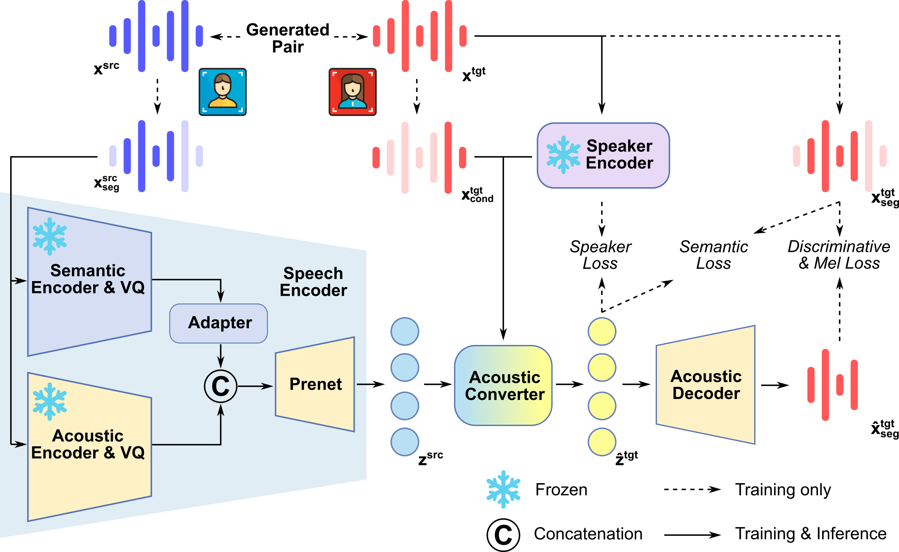
*Figure 1.Overall framework of X-VC. A pretrained speech encoder maps the input waveform into latent representations, which are then transformed by the acoustic converter conditioned on target-side reference speech and finally decoded into waveform.*

*Figure 2.Architecture of the acoustic converter. Source codec latents and the mel sequence extracted from 
𝐱
cond
tgt
 are jointly updated through shared attention, while the utterance-level speaker embedding modulates each block through adaptive normalization.*

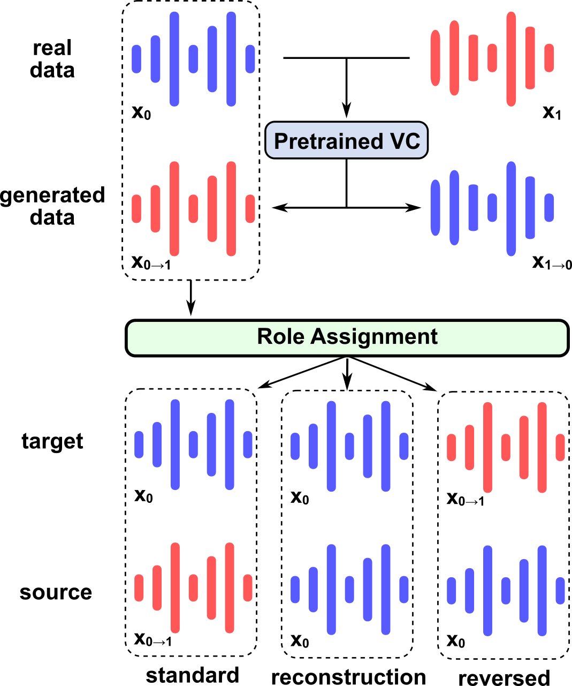
*Figure 3.Training data construction and role assignment. A pretrained VC model generates paired utterances from real speech, which are then used to form source-target pairs under standard, reconstruction, and reversed modes.*

*Figure 4.Chunkwise streaming inference of X-VC. Each step uses a fixed processing window composed of history, current, overlap, and future regions. Only the current region is emitted as valid output, while the front part of the current chunk is blended with the overlap retained from the previous step to ensure continuity.*

---
**Usage Info**: 6001 tokens used.
**Generated at**: 2026-04-15 14:44:07

---

# 📚 VoxEffects: A Speech-Oriented Audio Effects Dataset and Benchmark

🚀 URL: https://arxiv.org/html/2604.12389

## 🌏 Abstract (원문)
Speech audio in the wild is often processed by post-production effects, but existing speech datasets rarely provide precise annotations of effects and parameters, limiting systematic study. We introduce VoxEffects, a speech audio effects dataset that pairs produced speech with exact effect-chain supervision at multiple granularities. VoxEffects supports speech-oriented audio effect identification: given a produced waveform, infer which effects are present and how they are applied. Built from minimally edited clean speech, it provides an extensible rendering pipeline for both offline synthesis and on-the-fly rendering for efficient training and evaluation. The audio effect identification benchmark includes effect presence detection, preset classification, and intensity prediction, with a robustness protocol covering capture-side and platform-side degradations. We provide an AudioMAE-based multi-task baseline and analyses of domain shift, robustness, input duration, and gender fairness.
## 🌏 Abstract (번역)
야생의 음성 오디오는 종종 후반 작업 효과에 의해 처리되지만, 기존 음성 데이터셋은 효과 및 파라미터에 대한 정확한 주석을 거의 제공하지 않아 체계적인 연구를 제한합니다. 우리는 여러 세분화된 수준에서 생성된 음성과 정확한 효과 체인 감독을 짝지은 음성 오디오 효과 데이터셋인 VoxEffects를 소개합니다. VoxEffects는 음성 지향 오디오 효과 식별을 지원합니다: 생성된 파형이 주어졌을 때, 어떤 효과가 존재하고 어떻게 적용되었는지 추론합니다. 최소한으로 편집된 깨끗한 음성으로 구축된 이 데이터셋은 효율적인 훈련 및 평가를 위해 오프라인 합성 및 즉석 렌더링을 위한 확장 가능한 렌더링 파이프라인을 제공합니다. 오디오 효과 식별 벤치마크에는 효과 존재 감지, 프리셋 분류, 강도 예측이 포함되며, 캡처 측 및 플랫폼 측 저하를 다루는 견고성 프로토콜이 있습니다. 우리는 AudioMAE 기반의 다중 작업 기준선과 도메인 이동, 견고성, 입력 지속 시간 및 성별 공정성에 대한 분석을 제공합니다.

## 🔍 Methods & Results
- AudioMAE-Fx는 VoxEffects 데이터셋에서 음성 오디오 효과 식별(AEI)을 위해 AudioMAE를 미세 조정하여 제안된 강력한 다중 작업 기준선 모델입니다.
- 모델은 입력 파형에서 로그-멜 필터뱅크 특징을 추출하고, 공유 AudioMAE 표현 위에 경량 예측 헤드를 사용하여 효과 존재 감지, 프리셋 분류, 활성 효과 개수, 스칼라 및 벡터 강도 예측을 포함한 다중 작업 방식으로 훈련됩니다.
- 전체 목적 함수는 효과 존재에 대한 이진 교차 엔트로피 손실, 프리셋에 대한 교차 엔트로피 손실, 활성 개수 손실, 스칼라 및 벡터 강도에 대한 L1 손실을 가중치 합산하여 구성됩니다.
- 훈련은 두 단계로 진행됩니다: 1단계에서는 AudioSet으로 사전 훈련된 모델을 VoxEffects의 깨끗한 데이터에 미세 조정하고, 2단계에서는 1단계 체크포인트에서 시작하여 캡처 측 및 플랫폼 측 저하(예: 가산 잡음, 리샘플링, 양자화, 손실 코덱)를 적용하여 견고성을 향상시키기 위한 커리큘럼 학습 방식으로 추가 미세 조정을 수행합니다.

## 🖼 Figures
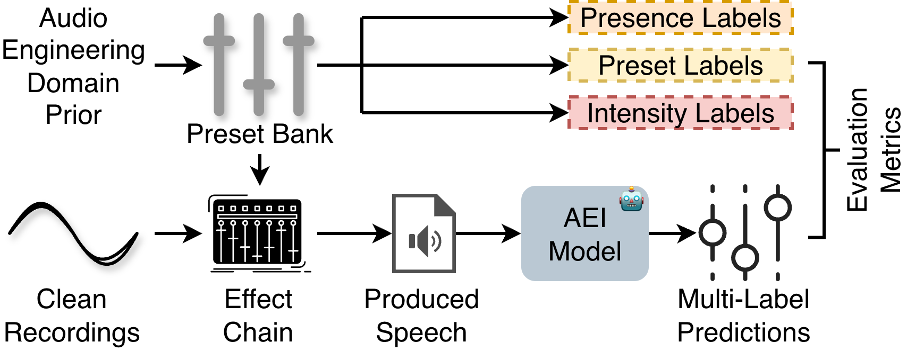
*Figure 1:Overview of VoxEffects framework: dataset creation via a speech post-processing chain with curated presets, and benchmark evaluation via multi-granularity prediction.*

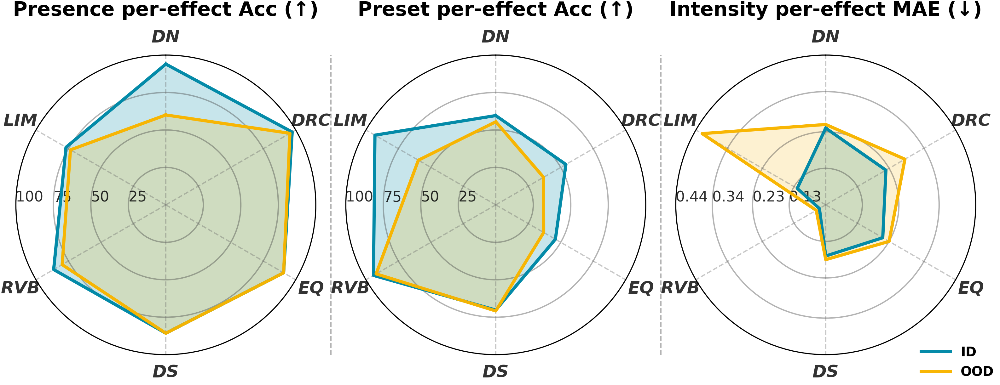
*Figure 2:Effect-wise radar analysis. Each panel reports evaluation metrics on In-Domain vs. Out-of-Domain test.*

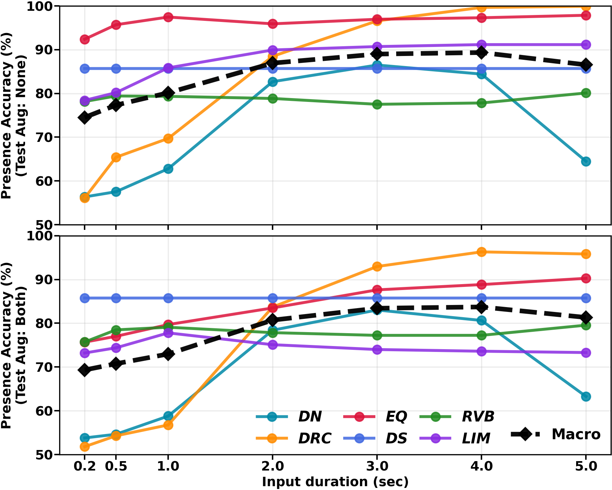
*Figure 3:Presence detection accuracy with various input duration from 0.2 s to 5 s on OOD test.*

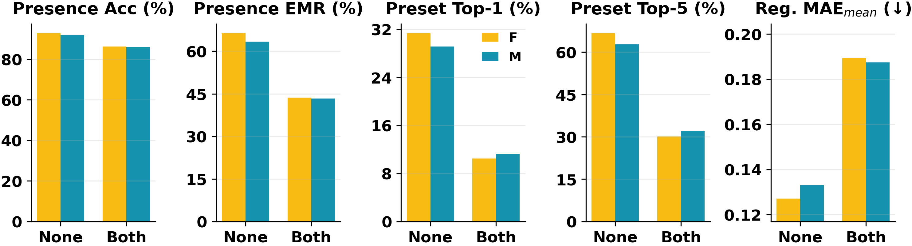
*Figure 4:Gender fairness visualization.*

---
**Usage Info**: 3095 tokens used.
**Generated at**: 2026-04-15 14:44:19

---

# 📚 On the Distillation Loss Functions of Speech VAE for Unified Reconstruction, Understanding, and Generation

🚀 URL: https://arxiv.org/html/2604.12383

## 🌏 Abstract (원문)
Continuous speech representations based on Variational Autoencoders (VAEs) have emerged as a promising alternative to traditional spectrogram or discrete token based features for speech generation and reconstruction. Recent research has tried to enrich the structural information in VAE latent representations by aligning with self-supervised learning (SSL) features, aiming for better generation performance. However, it remains unclear whether the widely-used alignment approach based on time-axis distillation is optimal when considering more tasks. To address this problem, this paper systematically explores different alignment approaches and analyzes their impact on the performances over three axes: reconstruction, understanding, and generation. We investigate various design choices in the distillation loss. Extensive experiments show that the joint-marginal alignment approach with adaptive weighting can achieve the best overall performance while allowing for a controllable balance.
## 🌏 Abstract (번역)
변이형 오토인코더(VAE) 기반의 연속 음성 표현은 음성 생성 및 재구성을 위한 기존의 스펙트로그램 또는 이산 토큰 기반 특징에 대한 유망한 대안으로 부상했습니다. 최근 연구는 더 나은 생성 성능을 목표로 자기 지도 학습(SSL) 특징과 정렬함으로써 VAE 잠재 표현의 구조적 정보를 풍부하게 하려고 시도했습니다. 그러나 시간 축 증류 기반의 널리 사용되는 정렬 접근 방식이 더 많은 작업을 고려할 때 최적인지는 불분명합니다. 이 문제를 해결하기 위해 본 논문은 다양한 정렬 접근 방식을 체계적으로 탐색하고 재구성, 이해, 생성이라는 세 가지 축에서 성능에 미치는 영향을 분석합니다. 우리는 증류 손실의 다양한 설계 선택 사항을 조사합니다. 광범위한 실험 결과, 적응형 가중치를 사용하는 결합-주변 정렬(joint-marginal alignment) 접근 방식이 제어 가능한 균형을 유지하면서 전반적으로 최고의 성능을 달성할 수 있음을 보여줍니다.

## 🔍 Methods & Results
- VAE 훈련은 재구성 손실, 쿨백-라이블러(KL) 발산 손실, 그리고 분포 일치를 위한 GAN 기반 손실의 조합을 사용한다.
- VAE 잠재 공간에 자기 지도 학습(SSL) 모델의 구조적 의미 정보를 증류하기 위해 특징 정렬 손실(L_align)이 포함된다.
- 기존의 시간 축 코사인 거리 손실 외에, 차원별 증류(dimension-wise distillation) 방식을 도입하여 지역 특징 차원의 시간적 구조와 변화를 포착한다.
- 결합-주변 분포 정렬(joint-marginal distribution alignment) 방식을 제안하며, 이는 잠재 공간과 기반 모델 특징 공간 간의 분포 일관성을 강화한다.
- 결합-주변 정렬 손실은 프레임 수준 특징 거리(L_mcos)와 시퀀스 수준 분포 유사성(L_mdss)의 두 가지 수준으로 구성되며, 재구성, 이해, 생성 능력의 균형을 맞추기 위한 마진(m1, m2)을 포함한다.
- 정적 손실 가중치 외에, 재구성 손실과 정렬 손실 간의 기울기 노름 비율에 기반하여 손실 가중치(omega_distill)를 동적으로 조정하는 적응형 가중치 전략을 탐구한다.
- 실험 결과, 적응형 가중치를 사용하는 결합-주변 정렬 접근 방식이 전반적으로 가장 우수한 성능을 달성하며 제어 가능한 균형을 제공함을 입증했다.

## 🖼 Figures
![Figure 1:T-axis Aligned Semantic VAE (TAS-VAE) distills semantic knowledge from speech foundation models via Eq.2 alignment loss, achieving TTS performance comparable to mel spectrograms with minor reconstruction degradation. Its latent representations still underperform on downstream speech understanding. Baseline: Mel+Vocos [siuzdakvocos] (reconstruction), Fbank (understanding), Mel+F5-TTS [chen2025f5] (generation).](../images/2026-04-15/2604.12383/2604.12383_fig0.png)
*Figure 1:T-axis Aligned Semantic VAE (TAS-VAE) distills semantic knowledge from speech foundation models via Eq.2 alignment loss, achieving TTS performance comparable to mel spectrograms with minor reconstruction degradation. Its latent representations still underperform on downstream speech understanding. Baseline: Mel+Vocos [siuzdakvocos] (reconstruction), Fbank (understanding), Mel+F5-TTS [chen2025f5] (generation).*

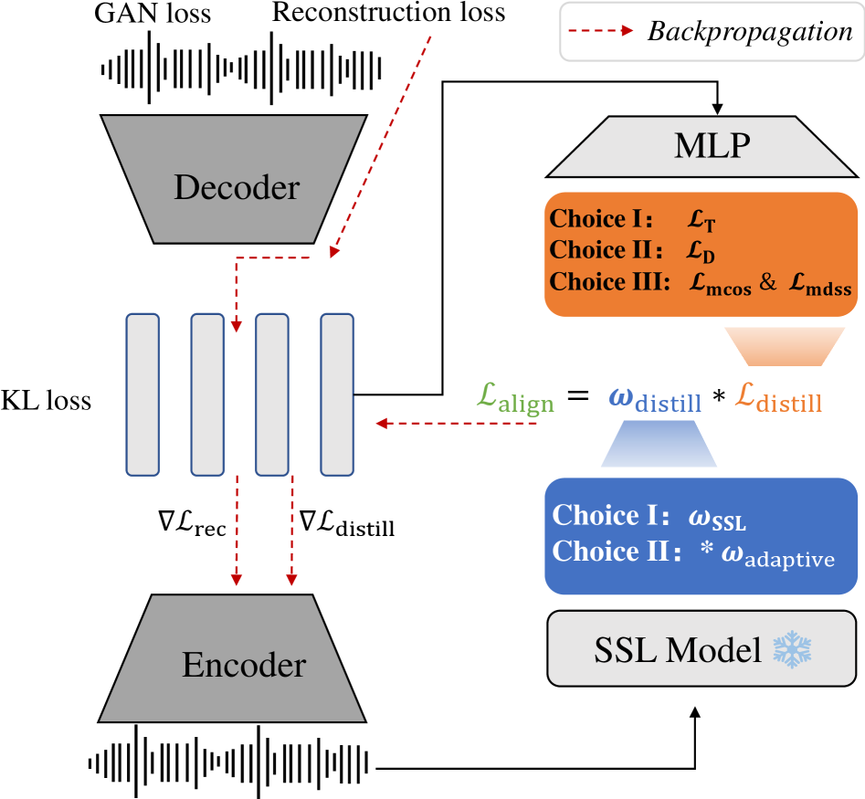
*Figure 2:The design space of distillation loss functions for speech VAEs. For mathematical formulations, see Eqs. 2 to 6.*

*(a)Adaptive weighting of 
ℒ
mcos*

*(a)Adaptive weighting of 
ℒ
mcos*

*(b)Adaptive weighting of 
ℒ
mdss*

*(a)Reconstruction*

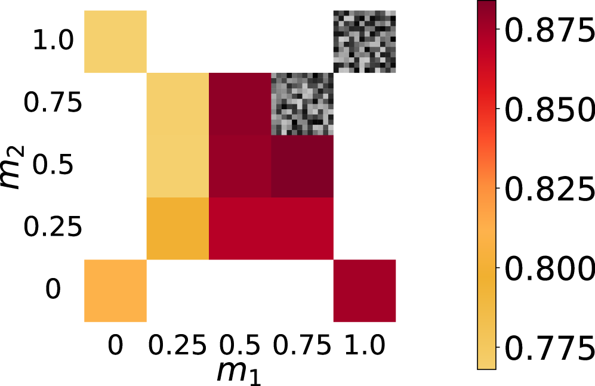
*(a)Reconstruction*

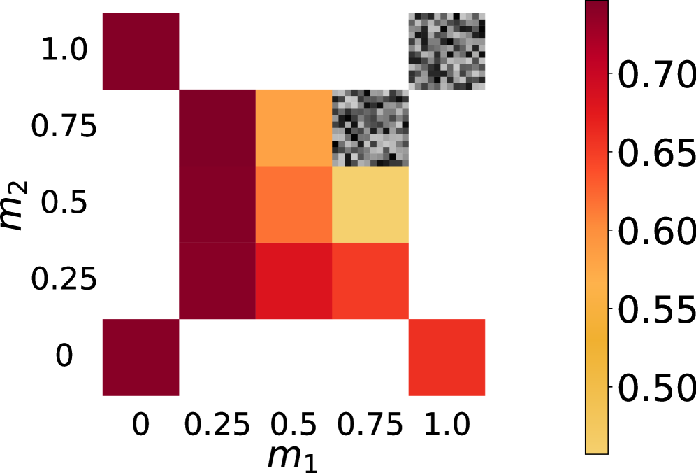
*(b)Understanding*

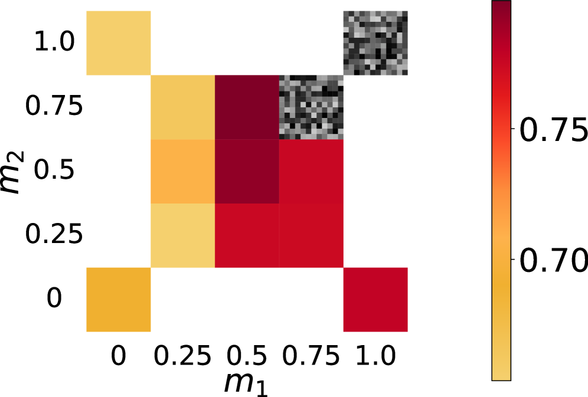
*(c)Generation*

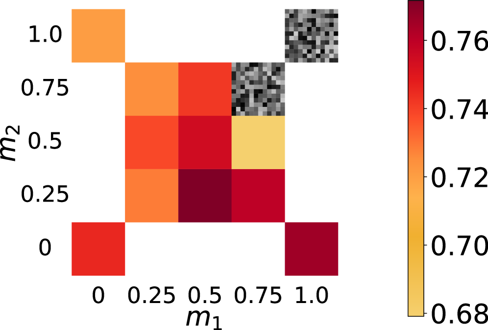
*(d)Overall*

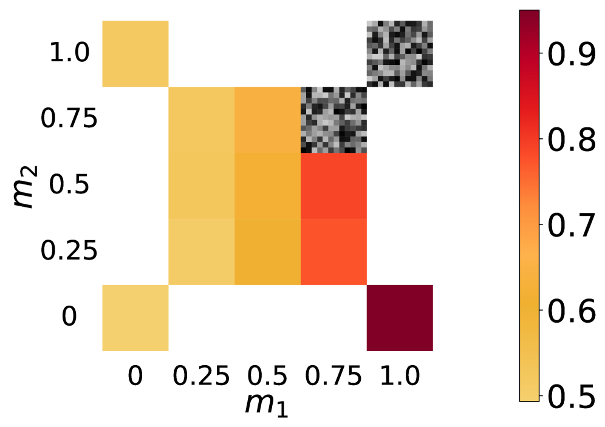
*(e)mcos distance (Eq. 4)*

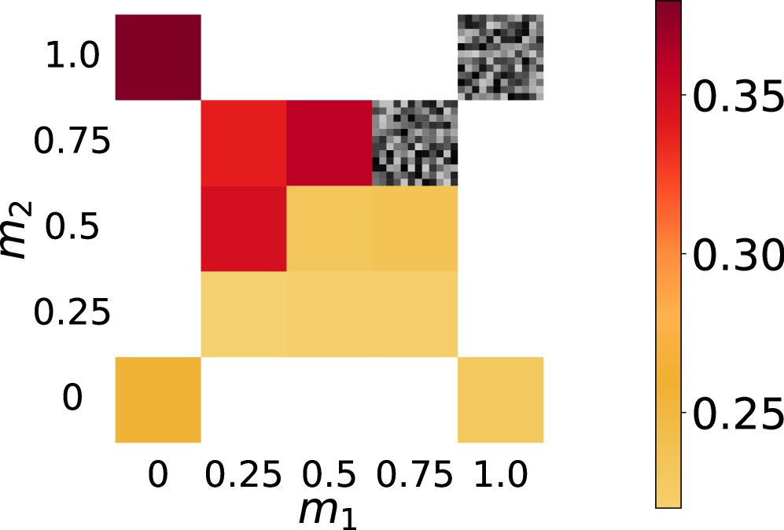
*(f)mdss distance (Eq. 5)*

---
**Usage Info**: 2848 tokens used.
**Generated at**: 2026-04-15 14:44:30

---

# 📚 CoSyncDiT: Cognitive Synchronous Diffusion Transformer for Movie Dubbing

🚀 URL: https://arxiv.org/html/2604.12292

## 🌏 Abstract (원문)
Movie dubbing aims to synthesize speech that preserves the vocal identity of a reference audio while synchronizing with the lip movements in a target video. Existing methods fail to achieve precise lip-sync and lack naturalness due to explicit alignment at the duration level. While implicit alignment solutions have emerged, they remain susceptible to interference from the reference audio, triggering timbre and pronunciation degradation in in-the-wild scenarios. In this paper, we propose a novel flow matching-based movie dubbing framework driven by theCognitiveSynchronousDiffusionTransformer (CoSync-DiT), inspired by the cognitive process of professional actors. This architecture progressively guides the noise-to-speech generative trajectory by executing acoustic style adapting, fine-grained visual calibrating, and time-aware context aligning. Furthermore, we design the Joint Semantic and Alignment Regularization (JSAR) mechanism to simultaneously constrain frame-level temporal consistency on the contextual outputs and semantic consistency on the flow hidden states, ensuring robust alignment. Extensive experiments on both standard benchmarks and challenging in-the-wild dubbing benchmarks demonstrate that our method achieves the state-of-the-art performance across multiple metrics.
## 🌏 Abstract (번역)
영화 더빙은 참조 오디오의 음성 정체성을 보존하면서 대상 비디오의 입술 움직임과 동기화되는 음성을 합성하는 것을 목표로 합니다. 기존 방법들은 지속 시간 수준에서의 명시적 정렬로 인해 정확한 립싱크를 달성하지 못하고 자연스러움이 부족합니다. 암묵적 정렬 솔루션이 등장했지만, 이는 참조 오디오의 간섭에 취약하여 실제 환경 시나리오에서 음색 및 발음 저하를 유발합니다. 본 논문에서는 전문 배우의 인지 과정에서 영감을 받은 CognitiveSynchronousDiffusionTransformer (CoSync-DiT)에 기반한 새로운 플로우 매칭 기반 영화 더빙 프레임워크를 제안합니다. 이 아키텍처는 음향 스타일 적응, 미세 시각 보정, 시간 인식 컨텍스트 정렬을 실행하여 노이즈-음성 생성 궤적을 점진적으로 안내합니다. 또한, 우리는 컨텍스트 출력에 대한 프레임 수준 시간적 일관성과 플로우 은닉 상태에 대한 의미론적 일관성을 동시에 제약하여 강력한 정렬을 보장하는 Joint Semantic and Alignment Regularization (JSAR) 메커니즘을 설계합니다. 표준 벤치마크와 도전적인 실제 더빙 벤치마크 모두에 대한 광범위한 실험은 우리 방법이 여러 지표에서 최첨단 성능을 달성함을 보여줍니다.

## 🔍 Methods & Results
- 전문 배우의 인지 과정에서 영감을 받은 새로운 플로우 매칭 기반 영화 더빙 프레임워크인 CognitiveSynchronousDiffusionTransformer (CoSync-DiT)를 제안한다.
- CoSync-DiT는 Optimal-Transport Conditional Flow Matching (OT-CFM) 패러다임 하에 다음 세 가지 단계를 통해 노이즈-음성 생성 궤적을 점진적으로 안내한다: 1) 마스킹된 음향 조건과 의미론적 조건을 활용하여 참조 화자의 스타일 정보를 포착하는 음향 스타일 적응(Acoustic Style Adapting), 2) 립 모션 인코더를 통해 추출된 입술 움직임 특징을 정제하고 게이팅 메커니즘을 통해 주입하여 미세한 프레임 수준 보정을 제공하는 미세 시각 보정(Fine-grained Visual Calibrating), 3) Multi-Head Cross-Attention (MHCA)과 시간 인식 메커니즘(AdaLN)을 사용하여 텍스트 특징을 통합하고 정확한 오디오-시각 동기화를 보장하는 시간 인식 컨텍스트 정렬(Time-aware Context Aligning).
- 강력한 정렬을 보장하기 위해 Joint Semantic and Alignment Regularization (JSAR) 메커니즘을 설계했다. 이는 중간 컨텍스트 출력에 대해 사전 학습된 AV-HuBERT 특징을 이용한 프레임 수준 대조 학습(InfoNCE)을 적용하여 시간적 일관성을 유지하는 정렬 정규화와, 최종 은닉 특징에 Connectionist Temporal Classification (CTC) 손실을 적용하여 발음 정확성과 언어 정보 유지를 강화하는 의미론적 정규화로 구성된다.
- CoSync-DiT가 예측한 벡터 필드와 목표 벡터 필드 간의 Mean Squared Error (MSE)를 최소화하는 것을 목표로 하며, Classifier-Free Guidance (CFG)를 통해 음향 및 의미론적 가이던스 스케일을 조절하여 더빙 생성을 제어한다.
- 표준 벤치마크와 도전적인 실제 더빙 벤치마크 모두에 대한 광범위한 실험에서 제안된 방법이 여러 지표에 걸쳐 최첨단 성능을 달성함을 입증했다.

## 🖼 Figures

*Figure 1: (a) Illustration of Visual Voice Cloning (V2C) task. (b) Explicit alignment manner requires an external forced tool to compute the ground-truth duration of each phoneme in advance. (c) Implicit alignment eliminates the dependency on external forced tools. (d) We propose a movie dubbing architecture built upon CoSync-DiT, which is structured around a cognitively inspired listen–watch–articulate paradigm to progressively guide the denoising trajectory in flow matching.*

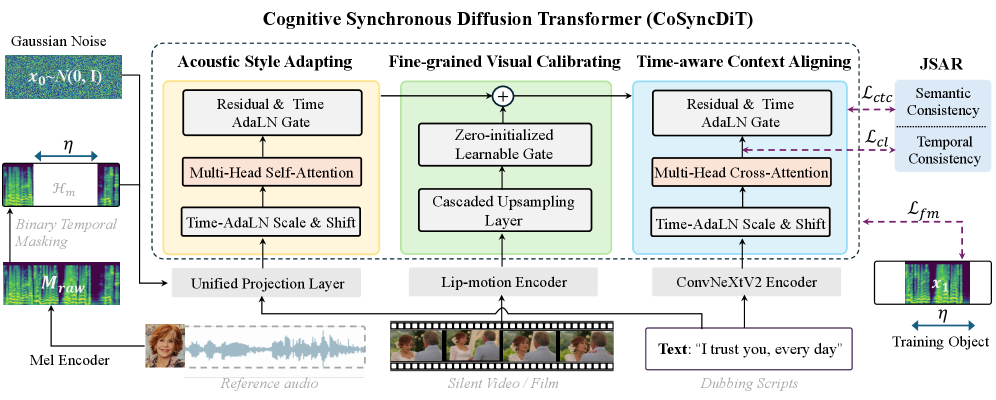
*Figure 2: The overview of architecture*

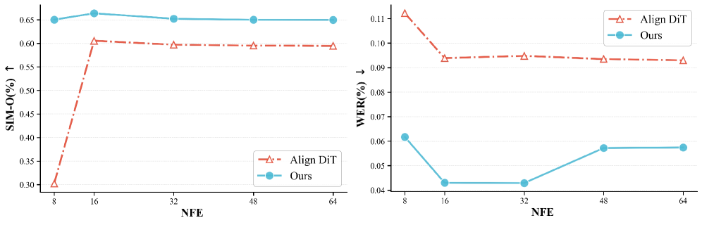
*Figure 3: Performance comparison between the proposed method and the SOTA baseline under the different Number of Function Evaluations (NFE) steps.*

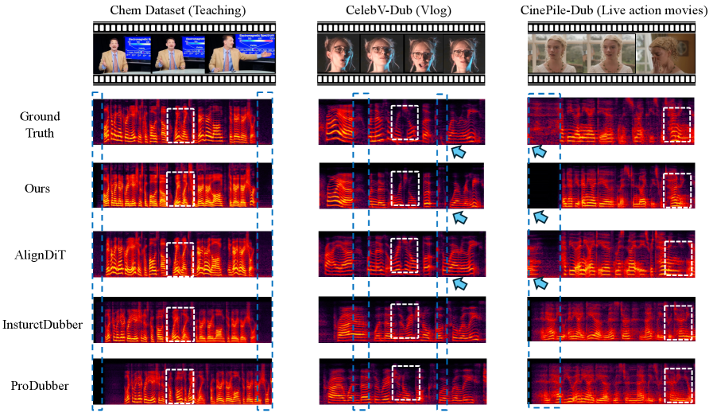
*Figure 4: Visual comparison of the generated mel-spectrograms. The blue arrows highlight specific regions requiring attention for audio-visual synchronization.*

*Figure 5: Visual comparison of the generated mel-spectrograms with ground truth. The blue and white bounding boxes highlight regions where different models exhibit significant differences in duration and spectrogram details. Furthermore, the blue arrows pinpoint specific temporal regions that require critical attention for evaluating audio-visual synchronization.*

*Figure 6: Visual comparison of the generated mel-spectrograms with ground truth under zero-shot setting (out-of-domain movie scenario). The blue and white bounding boxes highlight regions where different models exhibit significant differences in duration and spectrogram details. Furthermore, the blue arrows pinpoint specific temporal regions that require critical attention for evaluating audio-visual synchronization.*

---
**Usage Info**: 5413 tokens used.
**Generated at**: 2026-04-15 14:44:46

---

# 📚 SubFlow: Sub-mode Conditioned Flow Matching for Diverse One-Step Generation

🚀 URL: https://arxiv.org/html/2604.12273

## 🌏 Abstract (원문)
Flow matching has emerged as a powerful generative framework, with recent few-step methods achieving remarkable inference acceleration. However, we identify a critical yet overlooked limitation: these models suffer from severediversity degradation, concentrating samples on dominant modes while neglecting rare but valid variations of the target distribution. We trace this degradation toaveraging distortion: when trained with MSE objectives, class-conditional flows learn a frequency-weighted mean over intra-class sub-modes, causing the model to over-represent high-density modes while systematically neglecting low-density ones. To address this, we propose SubFlow, Sub-mode Conditioned Flow Matching, which eliminates averaging distortion by decomposing each class into fine-grained sub-modes via semantic clustering and conditioning the flow on sub-mode indices. Each conditioned sub-distribution is approximately unimodal, so the learned flow accurately targets individual modes with no averaging distortion, restoring full mode coverage in a single inference step. Crucially, SubFlow is entirelyplug-and-play: it integrates seamlessly into existing one-step models such as MeanFlow and Shortcut Models without any architectural modifications. Extensive experiments on ImageNet-256 demonstrate that SubFlow yields substantial gains in generation diversity (Recall) while maintaining competitive image quality (FID), confirming its broad applicability across different one-step generation frameworks. Project page:https://yexionglin.github.io/subflow.
## 🌏 Abstract (번역)
플로우 매칭은 강력한 생성 프레임워크로 부상했으며, 최근의 몇 단계 방법들은 놀라운 추론 가속화를 달성했습니다. 그러나 우리는 중요한 간과된 한계를 발견했습니다: 이 모델들은 심각한 다양성 저하를 겪으며, 샘플을 지배적인 모드에 집중시키고 대상 분포의 희귀하지만 유효한 변형을 무시합니다. 우리는 이러한 저하의 원인을 평균화 왜곡(averaging distortion)으로 추적합니다: MSE 목표로 훈련될 때, 클래스 조건부 플로우는 클래스 내 서브 모드에 대한 빈도 가중 평균을 학습하여, 모델이 고밀도 모드를 과도하게 표현하고 저밀도 모드를 체계적으로 무시하게 만듭니다. 이를 해결하기 위해 우리는 서브플로우(SubFlow), 즉 서브 모드 조건부 플로우 매칭을 제안합니다. 이는 의미론적 클러스터링을 통해 각 클래스를 세분화된 서브 모드로 분해하고 서브 모드 인덱스에 플로우를 조건화함으로써 평균화 왜곡을 제거합니다. 각 조건부 서브 분포는 대략 단일 모드이므로, 학습된 플로우는 평균화 왜곡 없이 개별 모드를 정확하게 목표로 하여 단일 추론 단계에서 완전한 모드 커버리지를 복원합니다. 결정적으로, 서브플로우는 완전히 플러그 앤 플레이 방식입니다: 이는 MeanFlow 및 Shortcut Models와 같은 기존의 원스텝 모델에 아키텍처 수정 없이 원활하게 통합됩니다. ImageNet-256에 대한 광범위한 실험은 서브플로우가 경쟁력 있는 이미지 품질(FID)을 유지하면서 생성 다양성(Recall)에서 상당한 이득을 가져옴을 입증하며, 이는 다양한 원스텝 생성 프레임워크에 걸친 광범위한 적용 가능성을 확인시켜 줍니다. 프로젝트 페이지: https://yexionglin.github.io/subflow.

## 🔍 Methods & Results
- **문제점 식별**: 기존 클래스 조건부 플로우 매칭 모델은 MSE 목표로 훈련될 때 '평균화 왜곡'으로 인해 클래스 내 서브 모드에 대한 빈도 가중 평균을 학습하여, 지배적인 모드에 샘플을 집중시키고 희귀한 모드를 무시하여 다양성 저하를 초래합니다.
- **SubFlow 제안**: 이 문제를 해결하기 위해 SubFlow는 의미론적 클러스터링(예: DINOv3 인코더 특징에 K-Means 적용)을 통해 각 클래스를 세분화된 서브 모드로 분해하고, 플로우를 클래스 레이블(c)과 서브 모드 인덱스(k) 모두에 조건화합니다. 이로써 각 조건부 서브 분포는 대략 단일 모드가 되어 평균화 왜곡 없이 개별 모드를 정확하게 타겟팅합니다.
- **플러그 앤 플레이 통합**: SubFlow는 MeanFlow, Shortcut Models, SoFlow와 같은 기존의 원스텝 생성 프레임워크에 아키텍처 수정 없이 쉽게 통합될 수 있습니다. 통합에는 오프라인 클러스터링, 서브 모드 임베딩 주입, 추론 시 서브 모드 인덱스 샘플링이 포함됩니다.
- **훈련 및 추론**: 조건부 플로우 매칭 손실을 확장하여 서브 모드 인덱스 k를 추가합니다. 분류기 없는 안내(CFG) 시에는 클래스 레이블 c만 무작위로 드롭하고 서브 모드 인덱스 k는 항상 유지하여, k가 안내될 의미론적 조건이 아닌 구조적 인덱스 역할을 하도록 합니다. 추론 시에는 각 클래스 내에서 서브 모드 k를 경험적 사전 확률 p(k|c)에 따라 샘플링합니다.
- **실험 설정**: ImageNet-256 벤치마크에서 FID(이미지 품질), Precision/Recall(충실도/다양성) 지표를 사용하여 평가했습니다. DiT-B/2 백본을 사용했으며, K=5개의 서브 모드를 설정했습니다.
- **주요 결과**: SubFlow는 MeanFlow, SoFlow, Shortcut Models 등 세 가지 원스텝 기준 모델 모두에서 일관되게 생성 다양성(Recall)을 크게 향상시키면서 경쟁력 있는 이미지 품질(FID)을 유지했습니다. 예를 들어, MeanFlow-B/2에 SubFlow를 적용했을 때 Recall은 43.45%에서 48.84%로 (+5.39%) 증가하고 FID는 6.17에서 5.86으로 감소했습니다.
- **다단계 통합과의 비교**: 다단계 통합(NFE 증가)은 샘플 품질(FID)을 개선할 수 있지만 다양성(Recall) 회복에는 제한적이며, 이는 평균화 왜곡이 학습된 벡터 필드 자체에 뿌리를 두고 있음을 시사합니다. SubFlow는 추가 통합 단계보다 훨씬 효과적으로 다양성을 회복합니다.
- **정성적 결과**: SubFlow는 동일한 초기 노이즈 입력에서 다양한 시각적 스타일을 생성하며, 기준 모델 대비 더 선명하고 일관된 구조를 가진 고품질 이미지를 생성합니다.
- **어블레이션 연구**: 서브 모드 수 K는 K=5일 때 다양성 향상과 품질 유지 사이의 최적의 균형을 보였습니다. 의미론적 클러스터링(K-Means on DINOv3 features)이 다양성 향상에 필수적이며, 무작위 할당은 효과가 없었습니다. 추론 시 경험적 사전 확률에 따른 서브 모드 샘플링이 품질-다양성 트레이드오프에서 가장 유리했습니다. K-Means가 DBSCAN보다 더 나은 성능을 보였으며, CFG 훈련 시 서브 모드 인덱스 k를 유지하는 것이 성능에 유리했습니다.
- **특징 시각화**: ImageNet 클래스 내에서 다양한 정도의 다중 모드 구조가 관찰되었으며, 이는 SubFlow가 클래스 조건부 생성에서 무시되는 다양한 모드를 복구하는 데 도움이 되는 이유를 설명합니다.

## 🖼 Figures

*(a)Traditional FM (100 steps)*

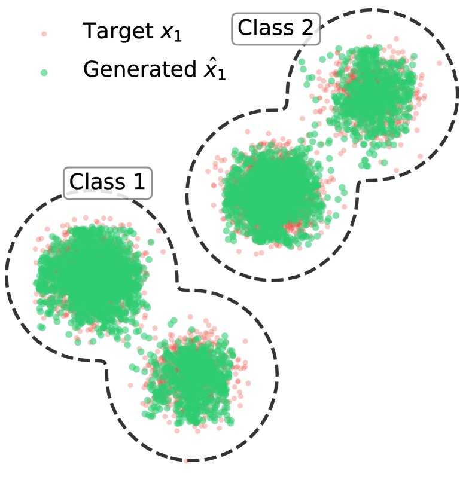
*(a)Traditional FM (100 steps)*

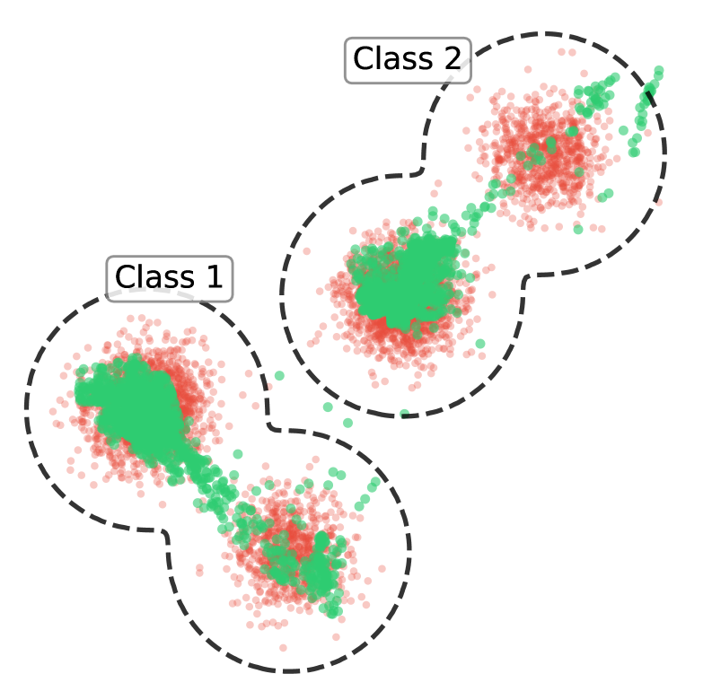
*(b)MeanFlow (1 step)*

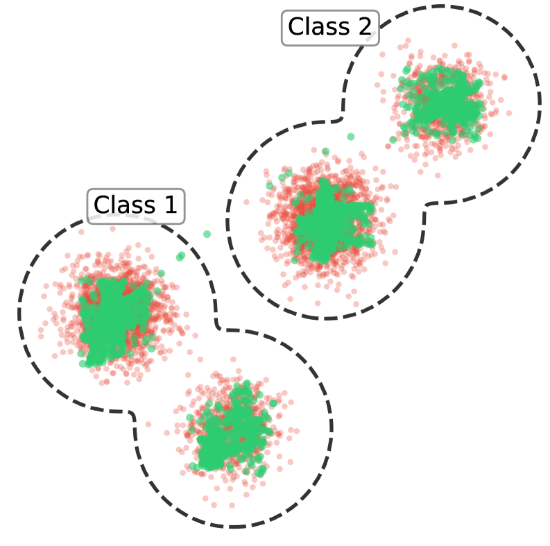
*(c)SubFlow (1 step)*

![Figure 2.Overview of SubFlow. (a) Offline pre-processing: semantic features are extracted from the training images and clustered within each class, yielding sub-mode assignments 
{
𝑘
𝑖
}
 and empirical priors 
𝑝
​
(
𝑘
∣
𝑐
)
. (b) Training: the vector field 
𝑣
𝜃
​
(
𝑥
𝑡
,
𝑡
,
𝑐
,
𝑘
)
 is optimized with the SubFlow objective. For classifier-free guidance, only the class label 
𝑐
 is randomly dropped, while the sub-mode index 
𝑘
 is always retained. (c) Inference: given a target class 
𝑐
, a sub-mode index 
𝑘
 is sampled from 
𝑝
​
(
𝑘
∣
𝑐
)
, and the conditioned vector field generates a sample associated with the selected sub-mode.](../images/2026-04-15/2604.12273/2604.12273_fig4.png)
*Figure 2.Overview of SubFlow. (a) Offline pre-processing: semantic features are extracted from the training images and clustered within each class, yielding sub-mode assignments 
{
𝑘
𝑖
}
 and empirical priors 
𝑝
​
(
𝑘
∣
𝑐
)
. (b) Training: the vector field 
𝑣
𝜃
​
(
𝑥
𝑡
,
𝑡
,
𝑐
,
𝑘
)
 is optimized with the SubFlow objective. For classifier-free guidance, only the class label 
𝑐
 is randomly dropped, while the sub-mode index 
𝑘
 is always retained. (c) Inference: given a target class 
𝑐
, a sub-mode index 
𝑘
 is sampled from 
𝑝
​
(
𝑘
∣
𝑐
)
, and the conditioned vector field generates a sample associated with the selected sub-mode.*

*Figure 3.Qualitative comparison between MeanFlow (left) and MeanFlow with SubFlow (right) on ImageNet-256. Each row shows five samples from the same class. Green boxes highlight samples where SubFlow produces visibly higher image quality with sharper details and fewer artifacts.*

*Figure 4.Diverse generation from the same noise 
𝑥
0
. First column: MeanFlow output. Columns 2–6: MeanFlow+SubFlow with different sub-mode indices 
𝑘
.*

*(a)FID*

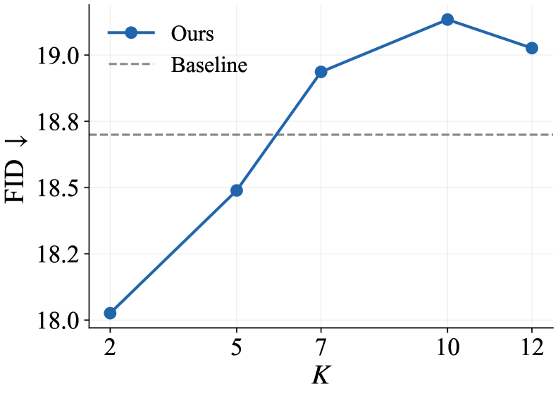
*(a)FID*

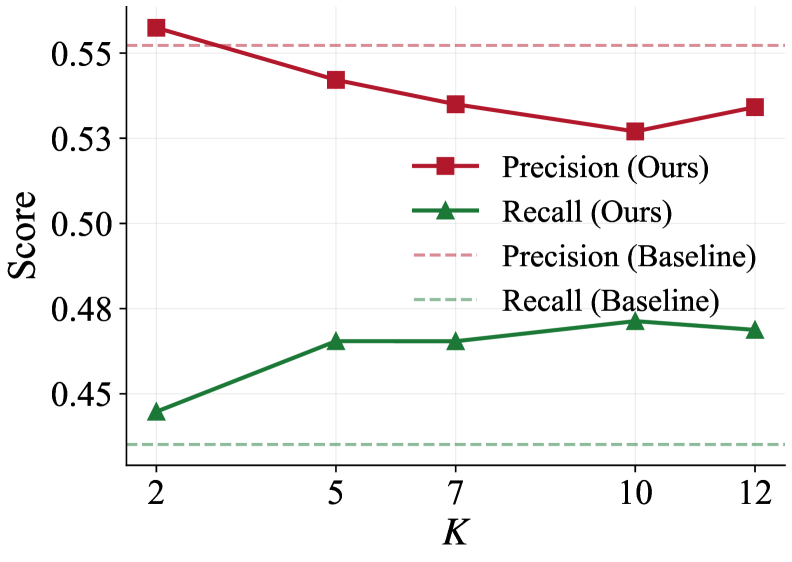
*(b)Precision / Recall*

*(a)Unimodal classes (15 lowest clustering scores). Each class forms a single compact cluster.*

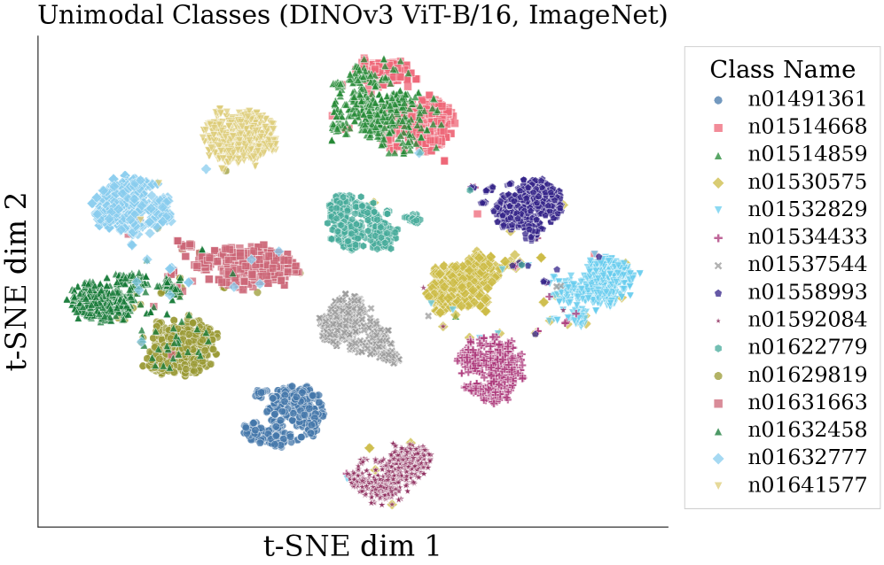
*(a)Unimodal classes (15 lowest clustering scores). Each class forms a single compact cluster.*

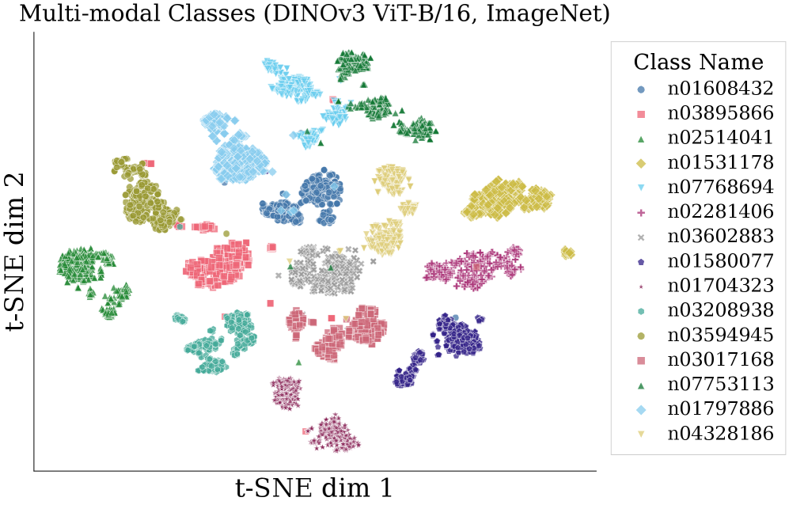
*(b)Multi-modal classes (15 highest clustering scores). Each class splits into 2–4 distinct sub-clusters.*

---
**Usage Info**: 8754 tokens used.
**Generated at**: 2026-04-15 14:45:02

---

# 📚 PianoFlow: Music-Aware Streaming Piano Motion Generation with Bimanual Coordination

🚀 URL: https://arxiv.org/html/2604.12856

## 🌏 Abstract (원문)
Audio-driven bimanual piano motion generation requires precise modeling of complex musical structures and dynamic cross-hand coordination. However, existing methods often rely on acoustic-only representations lacking symbolic priors, employ inflexible interaction mechanisms, and are limited to computationally expensive short-sequence generation. To address these limitations, we propose PianoFlow, a flow-matching framework for precise and coordinated bimanual piano motion synthesis. Our approach strategically leverages MIDI as a privileged modality during training, distilling these structured musical priors to achieve deep semantic understanding while maintaining audio-only inference. Furthermore, we introduce an asymmetric role-gated interaction module to explicitly capture dynamic cross-hand coordination through role-aware attention and temporal gating. To enable real-time streaming generation for arbitrarily long sequences, we design an autoregressive flow continuation scheme that ensures seamless cross-chunk temporal coherence. Extensive experiments on the PianoMotion10M dataset demonstrate that PianoFlow achieves superior quantitative and qualitative performance, while accelerating inference by over 9× compared to previous methods.
## 🌏 Abstract (번역)
오디오 기반 양손 피아노 동작 생성은 복잡한 음악 구조와 동적인 양손 간 조정을 정밀하게 모델링해야 합니다. 그러나 기존 방법들은 종종 기호적 사전 지식이 부족한 음향 전용 표현에 의존하고, 유연하지 않은 상호작용 메커니즘을 사용하며, 계산 비용이 많이 드는 짧은 시퀀스 생성에 국한됩니다. 이러한 한계를 해결하기 위해, 우리는 정밀하고 조화로운 양손 피아노 동작 합성을 위한 플로우 매칭 프레임워크인 PianoFlow를 제안합니다. 우리의 접근 방식은 훈련 중 MIDI를 특권적인 양식으로 전략적으로 활용하여, 이러한 구조화된 음악적 사전 지식을 증류하여 깊은 의미론적 이해를 달성하는 동시에 오디오 전용 추론을 유지합니다. 또한, 역할 인식 주의(role-aware attention)와 시간적 게이팅(temporal gating)을 통해 동적인 양손 간 조정을 명시적으로 포착하기 위해 비대칭 역할 게이팅 상호작용 모듈을 도입합니다. 임의로 긴 시퀀스에 대한 실시간 스트리밍 생성을 가능하게 하기 위해, 우리는 청크 간의 원활한 시간적 일관성을 보장하는 자기회귀 플로우 연속(autoregressive flow continuation) 방식을 설계했습니다. PianoMotion10M 데이터셋에 대한 광범위한 실험은 PianoFlow가 이전 방법들에 비해 9배 이상 빠른 추론 속도를 달성하면서 우수한 정량적 및 정성적 성능을 보여주었음을 입증합니다.

## 🔍 Methods & Results
- PianoFlow는 오디오로부터 정밀하고 조화로운 양손 피아노 동작을 합성하는 것을 목표로 하며, '음악 인식 손목 궤적 생성'과 '양손 협응 제스처 생성'의 두 단계로 구성됩니다.
- 1단계(음악 인식 손목 궤적 생성)에서는 MIDI를 특권적인 양식으로 활용하는 교차 모달 증류(cross-modal distillation) 방식을 도입하여, 구조화된 음악적 사전 지식을 오디오 기반 학생 모델로 전달합니다.
- 1단계의 학생 브랜치는 MuQ 인코더로 음향 특징을 추출하고, 교사 브랜치는 MIDI 피아노 롤 입력에서 피치별 의존성을 인코딩하는 Harmonic Perceiver를 사용하여 구조화된 음악적 사전 지식을 제공합니다.
- 1단계는 교사 및 학생 브랜치 간의 인코더 및 디코더 단계에서 특징 정렬을 통해 교차 모달 증류를 달성하며, 각 브랜치는 위치 재구성 및 시간적 부드러움을 위한 작업 손실로 감독됩니다.
- 2단계(양손 협응 제스처 생성)에서는 플로우 매칭 프레임워크를 사용하여 미세한 양손 제스처를 합성하며, 각 손에 대한 연속 시간 속도 필드를 독립적으로 예측하는 이중 스트림 시공간 아키텍처를 사용합니다.
- 2단계에서는 네트워크 병목 지점에 비대칭 역할 게이팅 상호작용(Asymmetric Role-Gated Interaction, ARGI) 모듈을 통합하여 역할 인식 주의와 시간적 게이팅을 통해 동적인 양손 간 조정을 명시적으로 모델링합니다.
- ARGI 모듈은 학습 가능한 손 식별 임베딩과 교차 주의 메커니즘을 통해 손별 인식을 주입하고, MLP가 예측하는 프레임별 게이트를 사용하여 상호작용 강도를 동적으로 조절합니다.
- 속도 필드 네트워크는 조건부 플로우 매칭(CFM) 프레임워크를 사용하여 최적화되며, 이는 연속 시간 생성 프로세스를 학습하기 위한 시뮬레이션 없는 회귀 목표를 제공합니다.
- 임의 길이 시퀀스에 대한 실시간 스트리밍 생성을 위해 자기회귀 플로우 연속(Autoregressive Flow Continuation, AFC) 방식을 설계했습니다. 이는 인과적 슬라이딩 윈도우 전략을 사용하여 이전 청크의 꼬리를 현재 청크의 시간적 기반으로 활용하고, 오버랩 영역에서 연속 시간 인페인팅을 통해 원활한 청크 간 일관성을 보장합니다.
- PianoMotion10M 데이터셋에 대한 광범위한 실험 결과, PianoFlow는 이전 방법들에 비해 우수한 정량적 및 정성적 성능을 달성했으며, 추론 속도를 9배 이상 가속화했습니다.

## 🖼 Figures

*Figure 1.PianoFlow enables high-fidelity and real-time bimanual piano motion generation. (Left) Our audio-driven framework distills privileged musical priors and employs Asymmetric Role-Gated Interaction for coordinated bimanual synthesis. (Right) PianoFlow achieves state-of-the-art performance across all metrics, supporting seamless real-time generation.*

![Figure 2.Overview of the PianoFlow architecture. The framework operates in two stages: (1) Music-Aware Wrist Trajectory Generation utilizes a decoupled cross-modal distillation scheme to transfer structured harmonic knowledge from a multimodal teacher (MIDI and audio) to an audio-only student. (2) Bimanual Coordinated Gesture Generation synthesizes fine-grained kinematics via conditional flow-matching. Specifically, a factorized spatio-temporal backbone estimates the velocity field, while an Asymmetric Role-Gated Interaction (ARGI) module explicitly models bimanual coordination at the network bottleneck.](../images/2026-04-15/2604.12856/2604.12856_fig1.png)
*Figure 2.Overview of the PianoFlow architecture. The framework operates in two stages: (1) Music-Aware Wrist Trajectory Generation utilizes a decoupled cross-modal distillation scheme to transfer structured harmonic knowledge from a multimodal teacher (MIDI and audio) to an audio-only student. (2) Bimanual Coordinated Gesture Generation synthesizes fine-grained kinematics via conditional flow-matching. Specifically, a factorized spatio-temporal backbone estimates the velocity field, while an Asymmetric Role-Gated Interaction (ARGI) module explicitly models bimanual coordination at the network bottleneck.*

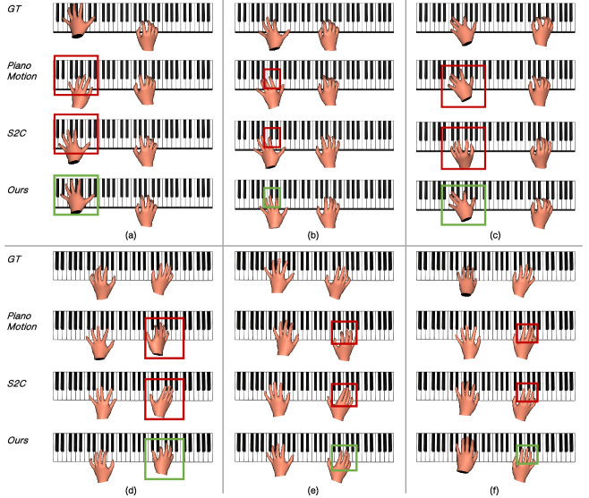
*Figure 3.Qualitative comparison of synthesized motions, with red and green boxes highlighting kinematic inaccuracies and precise alignments, respectively. Overall, PianoFlow achieves superior spatial accuracy and bimanual coordination.*

---
**Usage Info**: 5957 tokens used.
**Generated at**: 2026-04-15 14:45:14

---

# 📚 Audio-Cogito: Towards Deep Audio Reasoning in Large Audio Language Models

🚀 URL: https://arxiv.org/html/2604.12527

## 🌏 Abstract (원문)
Recent advances in reasoning models have driven significant progress in text and multimodal domains, yet audio reasoning remains relatively limited. Only a few Large Audio Language Models (LALMs) incorporate explicit Chain-of-Thought (CoT) reasoning, and their capabilities are often inconsistent and insufficient for complex tasks. To bridge this gap, we introduce Audio-Cogito, a fully open-source solution for deep audio reasoning. We develop Cogito-pipe for high-quality audio reasoning data curation, producing 545k reasoning samples that will be released after review. Based on this dataset, we adopt a self-distillation strategy for model fine-tuning. Experiments on the MMAR benchmark, the only audio benchmark evaluating the CoT process, show that our model achieves the best performance among open-source models and matches or surpasses certain closed-source models in specific metrics. Our approach also ranks among the top-tier systems in the Interspeech 2026 Audio Reasoning Challenge.
## 🌏 Abstract (번역)
추론 모델의 최근 발전은 텍스트 및 다중 모달 영역에서 상당한 진전을 이끌었지만, 오디오 추론은 상대적으로 제한적입니다. 명시적인 CoT(Chain-of-Thought) 추론을 통합하는 대규모 오디오 언어 모델(LALM)은 소수에 불과하며, 이들의 기능은 복잡한 작업을 수행하기에 종종 일관성이 없고 불충분합니다. 이러한 격차를 해소하기 위해 우리는 심층 오디오 추론을 위한 완전 오픈 소스 솔루션인 Audio-Cogito를 소개합니다. 우리는 고품질 오디오 추론 데이터 큐레이션을 위해 Cogito-pipe를 개발하여 검토 후 공개될 545k개의 추론 샘플을 생성했습니다. 이 데이터셋을 기반으로 모델 미세 조정을 위한 자체 증류(self-distillation) 전략을 채택했습니다. CoT 프로세스를 평가하는 유일한 오디오 벤치마크인 MMAR 벤치마크에 대한 실험 결과, 우리 모델은 오픈 소스 모델 중 최고의 성능을 달성했으며 특정 지표에서 특정 클로즈드 소스 모델과 동등하거나 능가하는 것으로 나타났습니다. 또한 우리의 접근 방식은 Interspeech 2026 오디오 추론 챌린지에서 최고 수준의 시스템 중 하나로 평가되었습니다.

## 🔍 Methods & Results
- 오디오 추론의 한계를 극복하기 위해 심층 오디오 추론을 위한 완전 오픈 소스 솔루션인 Audio-Cogito를 제안했습니다.
- 고품질 오디오 추론 데이터 큐레이션을 위해 Cogito-pipe를 개발하여 545k개의 추론 샘플을 생성했습니다.
- 생성된 데이터셋을 기반으로 모델 미세 조정을 위해 자체 증류(self-distillation) 전략을 채택했습니다.
- CoT 프로세스를 평가하는 유일한 오디오 벤치마크인 MMAR 벤치마크에서 실험을 수행했습니다.
- 실험 결과, Audio-Cogito는 오픈 소스 모델 중 최고의 성능을 달성했습니다.
- Audio-Cogito는 특정 지표에서 특정 클로즈드 소스 모델과 동등하거나 능가하는 성능을 보였습니다.
- Interspeech 2026 오디오 추론 챌린지에서 최고 수준의 시스템 중 하나로 평가되었습니다.

## 🖼 Figures
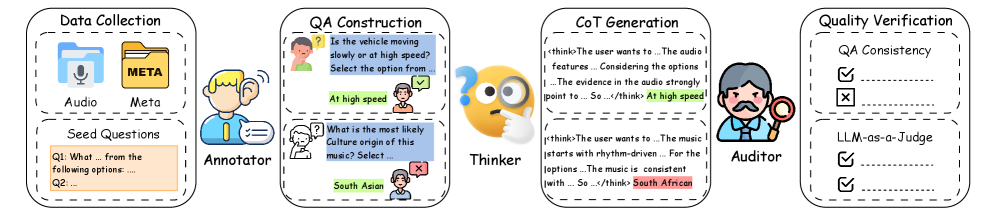
*Figure 1:Overview of Cogito-Pipe.*

---
**Usage Info**: 1496 tokens used.
**Generated at**: 2026-04-15 14:45:21

---

# 📚 StreamMark: A Deep Learning-Based Semi-Fragile Audio Watermarking for Proactive Deepfake Detection

🚀 URL: https://arxiv.org/html/2604.11917

## 🌏 Abstract (원문)
The rapid advancement of generative AI has made it increasingly challenging to distinguish between deepfake audio and authentic human speech. To overcome the limitations of passive detection methods, we propose StreamMark, a novel deep learning-based, semi-fragile audio watermarking system. StreamMark is designed to be robust against benign audio conversions that preserve semantic meaning (e.g., compression, noise) while remaining fragile to malicious, semantics-altering manipulations (e.g., voice conversion, speech editing). Our method introduces a complex-domain embedding technique within a unique Encoder-Distortion-Decoder architecture, trained explicitly to differentiate between these two classes of transformations. Comprehensive benchmarks demonstrate that StreamMark achieves high imperceptibility (SNR 24.16 dB, PESQ 4.20), is resilient to real-world distortions like Opus encoding, and exhibits principled fragility against a suite of deepfake attacks, with message recovery accuracy dropping to chance levels (-50%), while remaining robust to benign AI-based style transfers (ACC>98%>98%).
## 🌏 Abstract (번역)
생성형 AI의 급속한 발전으로 딥페이크 오디오와 실제 사람의 음성을 구별하는 것이 점점 더 어려워지고 있습니다. 수동적인 탐지 방법의 한계를 극복하기 위해, 우리는 새로운 딥러닝 기반의 반취약성 오디오 워터마킹 시스템인 StreamMark를 제안합니다. StreamMark는 의미론적 의미를 보존하는 양성 오디오 변환(예: 압축, 노이즈)에는 강인하면서도, 악의적이고 의미를 변경하는 조작(예: 음성 변환, 음성 편집)에는 취약하도록 설계되었습니다. 우리의 방법은 이 두 가지 유형의 변환을 명시적으로 구별하도록 훈련된 독특한 인코더-왜곡-디코더(Encoder-Distortion-Decoder) 아키텍처 내에서 복소수 도메인 임베딩 기술을 도입합니다. 포괄적인 벤치마크는 StreamMark가 높은 비인지성(SNR 24.16 dB, PESQ 4.20)을 달성하고, Opus 인코딩과 같은 실제 왜곡에 강하며, 일련의 딥페이크 공격에 대해 메시지 복구 정확도가 우연 수준(-50%)으로 떨어지는 원칙적인 취약성을 보이는 동시에, 양성 AI 기반 스타일 전이(ACC>98%)에는 강인함을 보여줍니다.

## 🔍 Methods & Results
- StreamMark는 딥페이크 오디오와 실제 음성을 구별하기 위해 딥러닝 기반의 반취약성 오디오 워터마킹 시스템으로 제안되었다.
- 이 시스템은 의미론적 의미를 보존하는 양성 변환(예: 압축, 노이즈)에는 강인하고, 의미를 변경하는 악의적인 조작(예: 음성 변환, 음성 편집)에는 취약하도록 설계되었다.
- StreamMark는 인코더-왜곡-디코더 아키텍처 내에서 STFT(Short-Time Fourier Transform) 복소수 도메인 임베딩 기술을 도입하여, 크기와 위상 정보를 모두 활용함으로써 높은 비인지성을 달성한다.
- 왜곡 계층은 양성 변환 세트(Gb, 표준 신호 처리 왜곡 모방)와 악성 변환 세트(Gm, 딥페이크 공격 시뮬레이션, 피치 시프팅 사용)를 포함하며, 훈련 중 무작위로 적용된다.
- 복합 손실 함수는 비인지성, 강인성, 취약성을 동시에 최적화하며, 양성 변환에 대한 디코딩 오류는 최소화하고 악성 변환에 대한 디코딩 오류는 최대화하는 미니맥스(minimax) 최적화 문제를 해결한다.
- 실험 결과, StreamMark는 높은 비인지성(SNR 24.16 dB, PESQ 4.20)을 보였고, Opus 인코딩과 같은 실제 왜곡에 강인하며, 딥페이크 공격에 대해 메시지 복구 정확도가 우연 수준(-50%)으로 떨어지는 취약성을 입증했다. 또한, 양성 AI 기반 스타일 전이에는 98% 이상의 정확도로 강인함을 유지했다.

## 🖼 Figures
![Fig. 1: StreamMark Model Architecture. The Encoder Layer is responsible for imperceptibly embedding a watermark message into a raw audio signal: (i) audio is first transformed to frequency domain yielding separate real and imaginary components, (ii) processed by parallel real and imaginary encoders to produce watermark carriers (iii) used to embed encoded message, and finally (iv) the watermarked real and imaginary components are transformed back into the time domain to produce the watermarked audio. The Distortion Layer contains two parallel sets of transformations that are randomly applied during training: (i) a benign conversion set 
𝐺
𝑏
, and (ii) a malicious conversion set 
𝐺
𝑚
. The Decoder Layer is tasked with extracting the watermark from a potentially distorted audio signal: (i) transforming the input audio to frequency domain, (ii) extracting a watermark features by processioning the real and imaginary components, and (iii) recovering the final message by the message decoder.](../images/2026-04-15/2604.11917/2604.11917_fig0.png)
*Fig. 1: StreamMark Model Architecture. The Encoder Layer is responsible for imperceptibly embedding a watermark message into a raw audio signal: (i) audio is first transformed to frequency domain yielding separate real and imaginary components, (ii) processed by parallel real and imaginary encoders to produce watermark carriers (iii) used to embed encoded message, and finally (iv) the watermarked real and imaginary components are transformed back into the time domain to produce the watermarked audio. The Distortion Layer contains two parallel sets of transformations that are randomly applied during training: (i) a benign conversion set 
𝐺
𝑏
, and (ii) a malicious conversion set 
𝐺
𝑚
. The Decoder Layer is tasked with extracting the watermark from a potentially distorted audio signal: (i) transforming the input audio to frequency domain, (ii) extracting a watermark features by processioning the real and imaginary components, and (iii) recovering the final message by the message decoder.*

---
**Usage Info**: 4426 tokens used.
**Generated at**: 2026-04-15 14:45:36

---

# 📚 Beyond Transcription: Unified Audio Schema for Perception-Aware AudioLLMs

🚀 URL: https://arxiv.org/html/2604.12506

## 🌏 Abstract (원문)
Recent Audio Large Language Models (AudioLLMs) exhibit a striking performance inversion: while excelling at complex reasoning tasks, they consistently underperform on fine-grained acoustic perception. We attribute this gap to a fundamental limitation of ASR-centric training, which provides precise linguistic targets but implicitly teaches models to suppress paralinguistic cues and acoustic events as noise. To address this, we propose Unified Audio Schema (UAS), a holistic and structured supervision framework that organizes audio information into three explicit components—Transcription, Paralinguistics, and Non-linguistic Events—within a unified JSON format. This design achieves comprehensive acoustic coverage without sacrificing the tight audio-text alignment that enables reasoning. We validate the effectiveness of this supervision strategy by applying it to both discrete and continuous AudioLLM architectures. Extensive experiments on MMSU, MMAR, and MMAU demonstrate that UAS-Audio yields consistent improvements, boosting fine-grained perception by 10.9% on MMSU over the same-size state-of-the-art models while preserving robust reasoning capabilities. Our code and model are publicly available athttps://github.com/Tencent/Unified_Audio_Schema.
## 🌏 Abstract (번역)
최근 오디오 대규모 언어 모델(AudioLLM)은 놀라운 성능 역전을 보입니다. 복잡한 추론 작업에서는 탁월한 성능을 발휘하지만, 미세한 음향 지각에서는 지속적으로 저조한 성능을 보입니다. 우리는 이러한 격차를 ASR 중심 훈련의 근본적인 한계에 기인한다고 봅니다. ASR 중심 훈련은 정확한 언어적 목표를 제공하지만, 암묵적으로 모델이 주변 언어적 단서와 음향 이벤트를 노이즈로 억제하도록 가르칩니다. 이를 해결하기 위해 우리는 통합 오디오 스키마(UAS)를 제안합니다. UAS는 오디오 정보를 전사(Transcription), 주변 언어(Paralinguistics), 비언어적 이벤트(Non-linguistic Events)의 세 가지 명시적 구성 요소로 통합된 JSON 형식 내에서 구성하는 전체론적이고 구조화된 감독 프레임워크입니다. 이 설계는 추론을 가능하게 하는 긴밀한 오디오-텍스트 정렬을 희생하지 않으면서 포괄적인 음향 커버리지를 달성합니다. 우리는 이 감독 전략의 효과를 이산 및 연속 AudioLLM 아키텍처 모두에 적용하여 검증합니다. MMSU, MMAR, MMAU에 대한 광범위한 실험은 UAS-Audio가 일관된 개선을 가져오며, 동일 크기의 최첨단 모델에 비해 MMSU에서 미세한 지각 능력을 10.9% 향상시키면서 강력한 추론 능력을 유지함을 보여줍니다. 우리의 코드와 모델은 https://github.com/Tencent/Unified_Audio_Schema에서 공개적으로 이용 가능합니다.

## 🔍 Methods & Results
- AudioLLM의 미세한 음향 지각 능력 저하 문제를 해결하기 위해 통합 오디오 스키마(UAS)를 제안했습니다.
- UAS는 오디오 정보를 전사(Transcription), 주변 언어(Paralinguistics), 비언어적 이벤트(Non-linguistic Events)의 세 가지 명시적 구성 요소로 통합된 JSON 형식으로 구성하는 감독 프레임워크입니다.
- 이 프레임워크는 ASR 중심 훈련의 한계를 극복하고 포괄적인 음향 커버리지를 달성하며, 오디오-텍스트 정렬을 유지하여 추론 능력을 보존합니다.
- UAS는 이산 및 연속 AudioLLM 아키텍처 모두에 적용되어 효과를 검증했습니다.
- MMSU, MMAR, MMAU 데이터셋에 대한 실험 결과, UAS-Audio는 일관된 성능 향상을 보였습니다.
- 특히, MMSU에서 미세한 지각 능력을 동일 크기의 최첨단 모델 대비 10.9% 향상시키면서 강력한 추론 능력을 유지했습니다.

## 🖼 Figures
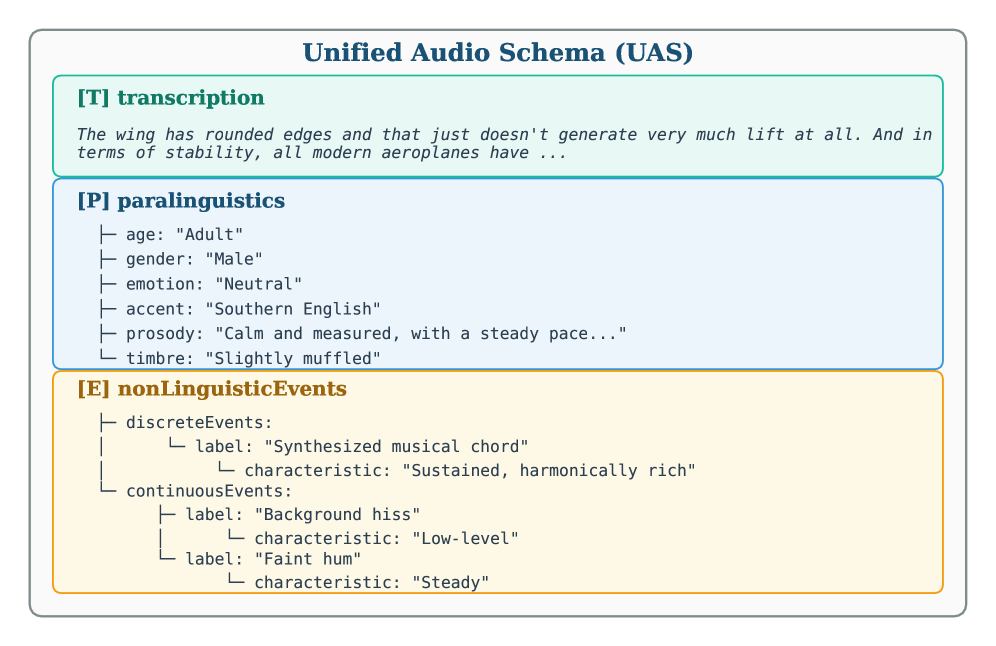
*(a)Unified Audio Schema (UAS)*

*(a)Unified Audio Schema (UAS)*

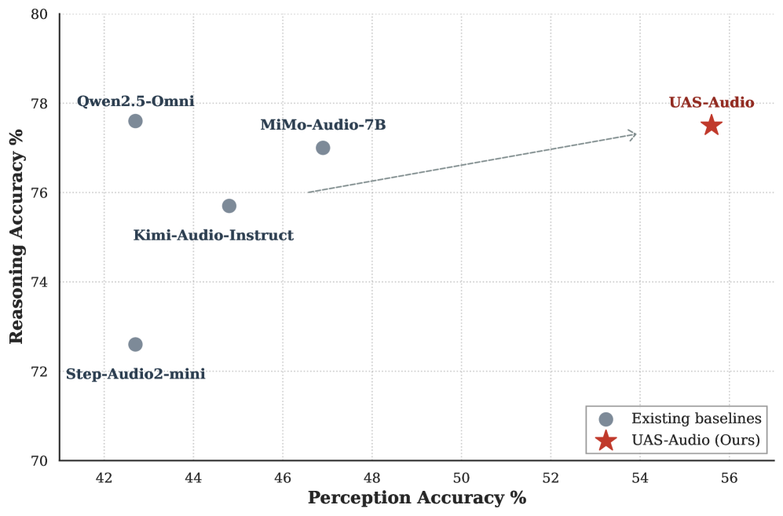
*(b)Performance of UAS-Audio*

*Figure 2:Overview of the UAS Data Generation Pipeline. (Stage 1) Acoustic captions are generated to capture paralinguistic and environmental context. (Stage 2) A structured synthesizer merges these captions with ground-truth transcripts. (Stage 3) An automated validation stage filters hallucinations and enforces logical consistency, yielding a final UAS that is ‘Structured & Complete’*

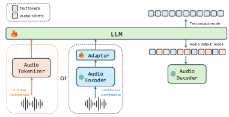
*Figure 3:Overview of UAS-Audio architectures. Audio input is processed via either discrete tokenization or continuous encoding (left). The LLM generates text-only or bi-modal outputs (right).*

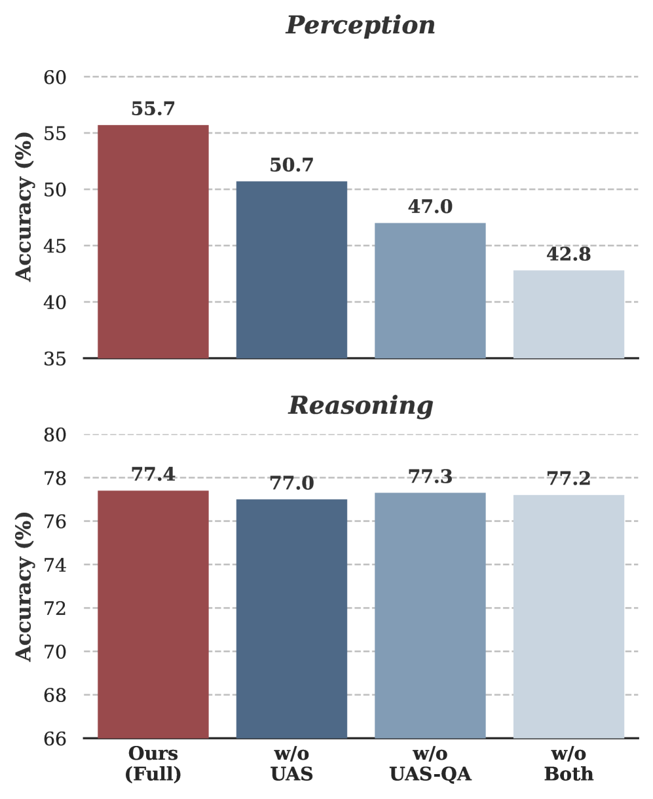
*Figure 4:Impact of individual components. We observe a consistent performance drop when removing the UAS module or the UAS-QA strategy from the full model.*

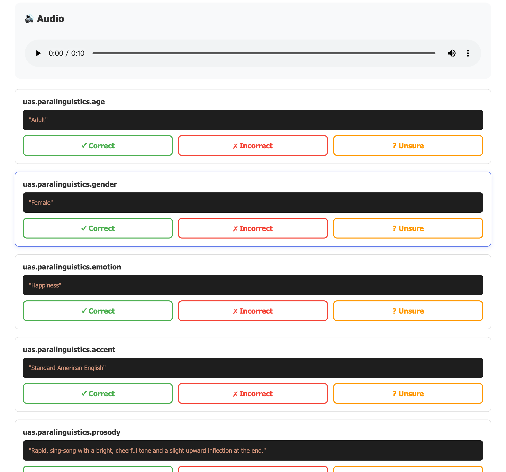
*Figure 5:The web-based human evaluation interface. Annotators listen to the audio and verify if the predicted JSON values (black boxes) match the acoustic reality by selecting "Correct", "Incorrect", or "Unsure".*

---
**Usage Info**: 1410 tokens used.
**Generated at**: 2026-04-15 14:45:44

---

