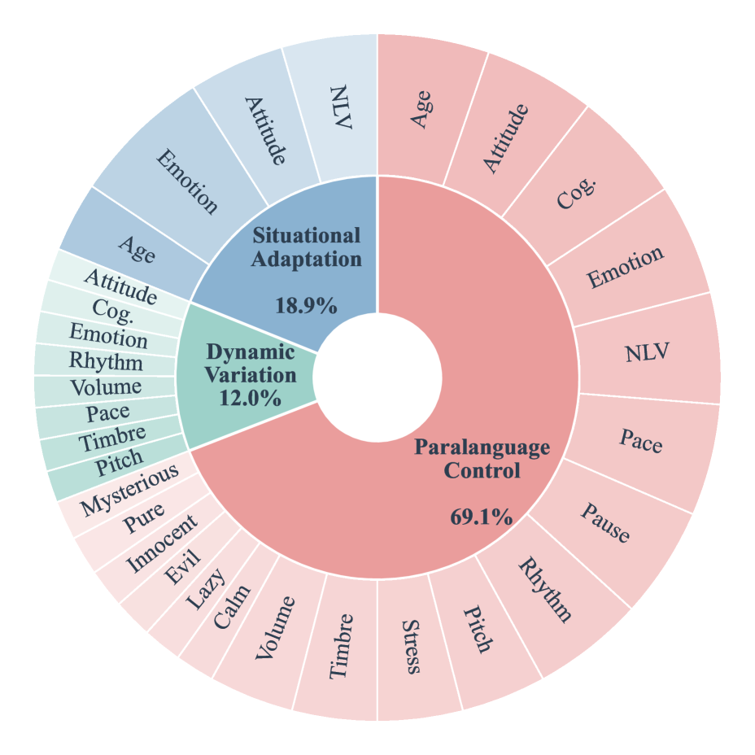
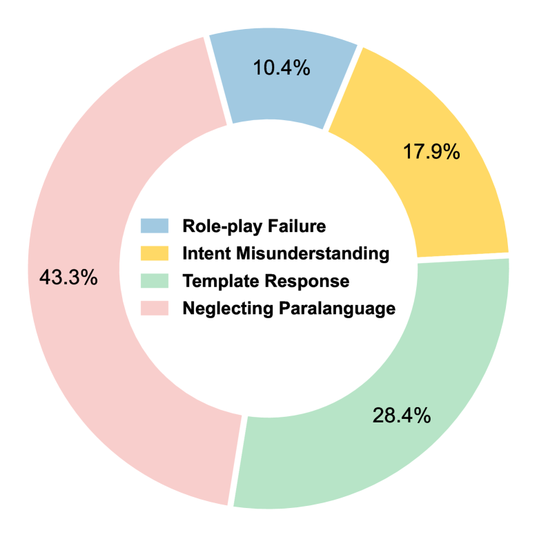

# 🚩 (2026-04-23) Scholar Inbox 추천 논문 

# 📚 SpeechParaling-Bench: A Comprehensive Benchmark for Paralinguistic-Aware Speech Generation

🚀 URL: https://arxiv.org/html/2604.20842

## 🌏 Abstract (원문)
Paralinguistic cues are essential for natural human-computer interaction, yet their evaluation in Large Audio-Language Models (LALMs) remains limited by coarse feature coverage and the inherent subjectivity of assessment.To address these challenges, we introduceSpeechParaling-Bench, a comprehensive benchmark for paralinguistic-aware speech generation. It expands existing coverage from fewer than 50 toover 100 fine-grained features, supported by more than 1,000 English-Chinese parallel speech queries, and is organized into three progressively challenging tasks: fine-grained control, intra-utterance variation, and context-aware adaptation.To enable reliable evaluation, we further developa pairwise comparison pipeline, in which candidate responses are evaluated against a fixed baseline by an LALM-based judge. By framing evaluation as relative preference rather than absolute scoring, this approach mitigates subjectivity and yields more stable and scalable assessments without costly human annotation.Extensive experiments reveal substantial limitations in current LALMs. Even leading proprietary models struggle with comprehensive static control and dynamic modulation of paralinguistic features, while failure to correctly interpret paralinguistic cues accounts for 43.3% of errors in situational dialogue.These findings underscore the need for more robust paralinguistic modeling toward human-aligned voice assistants.
## 🌏 Abstract (번역)
파라언어적 단서는 자연스러운 인간-컴퓨터 상호작용에 필수적이지만, 대규모 오디오-언어 모델(LALM)에서의 평가는 거친 특징 범위와 평가의 본질적인 주관성으로 인해 제한적이었습니다. 이러한 문제를 해결하기 위해, 우리는 파라언어 인식 음성 생성을 위한 포괄적인 벤치마크인 SpeechParaling-Bench를 소개합니다. 이 벤치마크는 기존의 50개 미만에서 100개 이상의 세분화된 특징으로 범위를 확장하며, 1,000개 이상의 영어-중국어 병렬 음성 쿼리를 지원하고, 세 가지 점진적으로 도전적인 작업(세분화된 제어, 발화 내 변동, 문맥 인식 적응)으로 구성됩니다. 신뢰할 수 있는 평가를 위해, 우리는 후보 응답을 LALM 기반 심사위원이 고정된 기준선과 비교하여 평가하는 쌍대 비교 파이프라인을 추가로 개발했습니다. 평가를 절대적인 점수 매기기보다는 상대적 선호도로 구성함으로써, 이 접근 방식은 주관성을 완화하고 비용이 많이 드는 사람의 주석 없이도 더 안정적이고 확장 가능한 평가를 제공합니다. 광범위한 실험 결과 현재 LALM에 상당한 한계가 있음이 밝혀졌습니다. 선도적인 독점 모델조차도 파라언어적 특징의 포괄적인 정적 제어 및 동적 변조에 어려움을 겪으며, 상황 대화에서 파라언어적 단서를 올바르게 해석하지 못하는 것이 오류의 43.3%를 차지합니다. 이러한 결과는 인간 중심의 음성 비서를 위한 더 강력한 파라언어 모델링의 필요성을 강조합니다.

## 🔍 Methods & Results
- 파라언어 인식 음성 생성을 위한 포괄적인 벤치마크인 SpeechParaling-Bench를 도입했습니다.
- SpeechParaling-Bench는 기존 50개 미만에서 100개 이상의 세분화된 특징으로 범위를 확장하고, 1,000개 이상의 영어-중국어 병렬 음성 쿼리를 지원합니다.
- 벤치마크는 세분화된 제어, 발화 내 변동, 문맥 인식 적응의 세 가지 도전적인 작업으로 구성됩니다.
- 신뢰할 수 있는 평가를 위해 LALM 기반 심사위원이 후보 응답을 고정된 기준선과 비교하여 상대적 선호도를 평가하는 쌍대 비교 파이프라인을 개발했습니다.
- 광범위한 실험 결과, 현재 LALM에 상당한 한계가 있으며, 선도적인 독점 모델조차 파라언어적 특징의 포괄적인 정적 제어 및 동적 변조에 어려움을 겪는 것으로 나타났습니다.
- 상황 대화에서 파라언어적 단서 해석 실패가 오류의 43.3%를 차지하는 것으로 밝혀졌습니다.
- 이러한 결과는 인간 중심의 음성 비서를 위한 더 강력한 파라언어 모델링의 필요성을 강조합니다.

## 🖼 Figures

*Figure 1:Comparison between traditional speech generation and paralinguistic-aware speech generation. While traditional benchmarks (Top) focus on text-to-speech consistency, the latter (Bottom) requires the model to synthesize not only linguistic content but also non-verbal features (e.g., tone).*

![Figure 2:Data samples from SpeechParaling-Bench. Our evaluation covers three tasks critical for paralinguistic-aware speech generation: (1) Paralanguage Control: tests the LALM’s ability to generate audio with specific paralinguistic features; (2) Dynamic Variation: assesses the capability to modulate paralinguistic features; and (3) Situational Adaptation: evaluates the paralinguistic alignment between LALMs and users, where, unlike the former two, there is no standard answer for content. Each sample consists of an audio query paired with paralinguistic annotations. Single/Multi-Dim: Single-/Multi-dimension. NLV: Non-Linguistic Vocalizations.](../images/2026-04-23/2604.20842/2604.20842_fig1.png)
*Figure 2:Data samples from SpeechParaling-Bench. Our evaluation covers three tasks critical for paralinguistic-aware speech generation: (1) Paralanguage Control: tests the LALM’s ability to generate audio with specific paralinguistic features; (2) Dynamic Variation: assesses the capability to modulate paralinguistic features; and (3) Situational Adaptation: evaluates the paralinguistic alignment between LALMs and users, where, unlike the former two, there is no standard answer for content. Each sample consists of an audio query paired with paralinguistic annotations. Single/Multi-Dim: Single-/Multi-dimension. NLV: Non-Linguistic Vocalizations.*

*Figure 3:Composition of SpeechParaling-Bench. The dataset consists of over 1,000 bilingual speech queries, encompassing more than 100 paralinguistic features. Cog.: Cognitive State. (See the Appendix for descriptions and value ranges of all dimensions.)*

![Figure 4:Overview of the proposed framework. (1) Data Engine: Leverages Gemini to synthesize textual instructions based on a pre-defined dimension set, followed by IndexTTS to generate audio prompts for eliciting LALM responses. (2) Evaluation Pipeline: Conducts pairwise comparisons between a strong baseline and candidate models. As the judge, Gemini evaluates audio responses against specific criteria and textual instructions, generating reasoning chains and scores to produce the final leaderboard.](../images/2026-04-23/2604.20842/2604.20842_fig3.png)
*Figure 4:Overview of the proposed framework. (1) Data Engine: Leverages Gemini to synthesize textual instructions based on a pre-defined dimension set, followed by IndexTTS to generate audio prompts for eliciting LALM responses. (2) Evaluation Pipeline: Conducts pairwise comparisons between a strong baseline and candidate models. As the judge, Gemini evaluates audio responses against specific criteria and textual instructions, generating reasoning chains and scores to produce the final leaderboard.*

*Figure 5:Dimension-wise performance on Paralanguage Control task (zh). We categorize paralinguistic dimensions into Expressive (NLV, Emotion, Cog., Attitude, Style), Prosodic (Pace, Pause, Stress, Rhythm), and Acoustic (Pitch, Timbre, Volume, Age) features.*

*Figure 6:Distribution of error types of Gemini Audio on the Situational Adaptation task.*

---
**Usage Info**: 2081 tokens used.
**Generated at**: 2026-04-23 15:51:49

---

