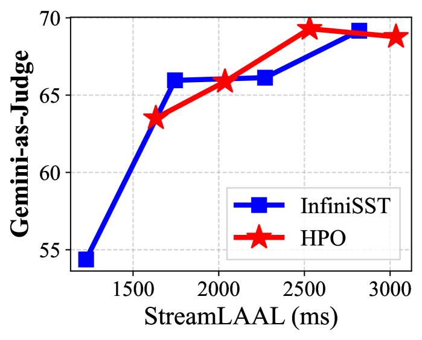
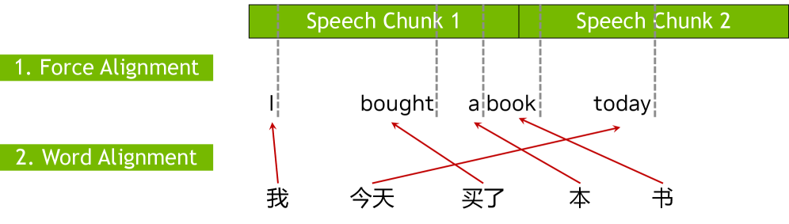
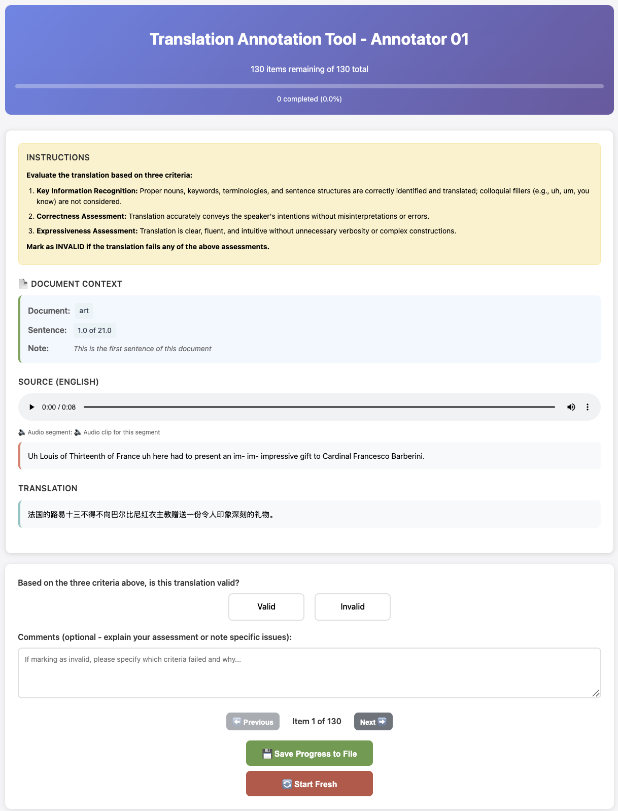

# 🚩 (2026-04-24) Scholar Inbox 추천 논문 

# 📚 MAGIC-TTS: Fine-Grained Controllable Speech Synthesis with Explicit Local Duration and Pause Control

🚀 URL: https://arxiv.org/html/2604.21164

## 🌏 Abstract (원문)
Fine-grained local timing control is still absent from modern text-to-speech systems: existing approaches typically provide only utterance-level duration or global speaking-rate control, while precise token-level timing manipulation remains unavailable. To the best of our knowledge, MAGIC-TTS is the first TTS model with explicit local timing control over token-level content duration and pause. MAGIC-TTS is enabled by explicit token-level duration conditioning, carefully prepared high-confidence duration supervision, and training mechanisms that correct zero-value bias and make the model robust to missing local controls. On our timing-control benchmark, MAGIC-TTS substantially improves token-level duration and pause following over spontaneous synthesis. Even when no timing control is provided, MAGIC-TTS maintains natural high-quality synthesis. We further evaluate practical local editing with a scenario-based benchmark covering navigation guidance, guided reading, and accessibility-oriented code reading. In this setting, MAGIC-TTS realizes a reproducible uniform-timing baseline and then moves the edited regions toward the requested local targets with low mean bias. These results show that explicit fine-grained controllability can be implemented effectively in a high-quality TTS system and can support realistic local timing-editing applications.
## 🌏 Abstract (번역)
최신 음성 합성(TTS) 시스템에는 여전히 세밀한 지역적 타이밍 제어가 부족합니다. 기존 접근 방식은 일반적으로 발화 수준의 길이 또는 전역적인 말하기 속도 제어만을 제공하며, 정확한 토큰 수준의 타이밍 조작은 불가능합니다. 저희가 아는 한, MAGIC-TTS는 토큰 수준의 내용 길이와 일시 정지에 대한 명시적인 지역적 타이밍 제어를 제공하는 최초의 TTS 모델입니다. MAGIC-TTS는 명시적인 토큰 수준 길이 조건 부여, 신중하게 준비된 높은 신뢰도의 길이 감독, 그리고 0값 편향을 수정하고 지역적 제어가 없을 때 모델을 견고하게 만드는 훈련 메커니즘을 통해 구현됩니다. 저희의 타이밍 제어 벤치마크에서 MAGIC-TTS는 자발적인 합성보다 토큰 수준의 길이 및 일시 정지 추종을 크게 향상시킵니다. 타이밍 제어가 제공되지 않을 때도 MAGIC-TTS는 자연스러운 고품질 합성을 유지합니다. 저희는 내비게이션 안내, 안내 읽기, 접근성 지향 코드 읽기를 포함하는 시나리오 기반 벤치마크를 통해 실용적인 지역 편집을 추가로 평가했습니다. 이 설정에서 MAGIC-TTS는 재현 가능한 균일 타이밍 기준선을 구현한 다음, 편집된 영역을 낮은 평균 편향으로 요청된 지역 목표에 맞춰 이동시킵니다. 이러한 결과는 명시적인 세밀한 제어 가능성이 고품질 TTS 시스템에서 효과적으로 구현될 수 있으며 현실적인 지역 타이밍 편집 애플리케이션을 지원할 수 있음을 보여줍니다.

## 🔍 Methods & Results
- MAGIC-TTS는 토큰 수준의 내용 길이(content duration)와 일시 정지(pause)에 대한 명시적인 지역적 타이밍 제어를 제공하는 최초의 TTS 모델입니다.
- 모델은 조건부 플로우 매칭 기반의 비자기회귀 제로샷 TTS 백본 위에 구축되며, 텍스트 임베딩에 타이밍 트랙(내용 길이 d_i 및 일시 정지 p_i)을 잔차 형태로 주입하여 지역 타이밍을 직접 제어합니다.
- 타이밍 감독은 두 단계로 구성됩니다: 첫째, 광범위한 적응을 위해 Stable-ts 정렬을 사용하여 약 3만 시간의 대규모 데이터셋에 토큰 수준 타이밍 레이블을 생성합니다. 둘째, 정밀한 제어를 위해 Stable-ts와 MFA 정렬을 교차 검증하여 202,086개 발화(230.72시간)의 고신뢰도 부분집합을 구축하고 이를 미세 조정에 사용합니다.
- 훈련 메커니즘은 0값 편향을 수정합니다. 각 타이밍 인코더를 0 입력에서 중앙에 배치하여(예: g_d(log(1+s*d_i)) - g_d(0)) 실제 0값이 잔차에 기여하지 않도록 하여, 특히 일시 정지 브랜치가 모든 토큰 위치에 걸쳐 밀집된 편향을 도입하는 것을 방지합니다.
- 모델은 지역적 제어가 없을 때에도 견고하게 작동하도록 훈련됩니다. 훈련 중 무작위로 타이밍 트랙을 드롭(가용성 마스크를 0으로 설정)하여, 모델이 타이밍 레이블 없이도 자연스러운 음성을 합성할 수 있도록 합니다.
- 타이밍 제어 벤치마크에서 MAGIC-TTS는 자발적인 합성 대비 토큰 수준의 길이 및 일시 정지 추종 성능을 크게 향상시켰습니다.
- 타이밍 제어가 제공되지 않을 때에도 자연스러운 고품질 합성을 유지하며, 내비게이션 안내, 안내 읽기, 접근성 지향 코드 읽기 등 시나리오 기반 벤치마크에서 요청된 지역 목표에 맞춰 편집된 영역을 낮은 평균 편향으로 이동시키는 실용적인 지역 편집 능력을 입증했습니다.

---
**Usage Info**: 4439 tokens used.
**Generated at**: 2026-04-24 15:06:19

---

# 📚 Hierarchical Policy Optimization for Simultaneous Translation of Unbounded Speech

🚀 URL: https://arxiv.org/html/2604.21045

## 🌏 Abstract (원문)
Simultaneous speech translation (SST) generates translations while receiving partial speech input. Recent advances show that large language models (LLMs) can substantially improve SST quality, but at the cost of high computational overhead. To reduce this cost, prior work reformulates SST as a multi-turn dialogue task, enabling full reuse of the LLM’s key–value (KV) cache and eliminating redundant feature recomputation. However, this approach relies on supervised fine-tuning (SFT) data in dialogue form, for which few human annotations exist, and existing synthesis methods cannot guarantee data quality.In this work, we propose a Hierarchical Policy Optimization (HPO) approach that post-train models trained on imperfect SFT data. We introduce a hierarchical reward that balances translation quality and latency objectives. Experiments on English to Chinese/German/Japanese demonstrate improvements of over +7 COMET score and +1.25 MetricX score at a latency of 1.5 seconds. Comprehensive ablation studies further validate the effectiveness of different quality rewards, hierarchical reward formulations, and segmentation strategies. Code can be found herehttps://github.com/owaski/HPO.
## 🌏 Abstract (번역)
동시 음성 번역(SST)은 부분적인 음성 입력을 받으면서 번역을 생성합니다. 최근 발전은 대규모 언어 모델(LLM)이 SST 품질을 크게 향상시킬 수 있음을 보여주지만, 높은 계산 오버헤드라는 단점이 있습니다. 이 비용을 줄이기 위해 이전 연구에서는 SST를 다중 턴 대화 작업으로 재구성하여 LLM의 키-값(KV) 캐시를 완전히 재사용하고 중복 기능 재계산을 제거했습니다. 그러나 이 접근 방식은 대화 형식의 지도 미세 조정(SFT) 데이터에 의존하는데, 이에 대한 인간 주석이 거의 없고 기존 합성 방법으로는 데이터 품질을 보장할 수 없습니다.본 연구에서는 불완전한 SFT 데이터로 훈련된 모델을 사후 훈련하는 계층적 정책 최적화(HPO) 접근 방식을 제안합니다. 우리는 번역 품질과 지연 시간 목표의 균형을 맞추는 계층적 보상을 도입합니다. 영어-중국어/독일어/일본어 실험에서 1.5초의 지연 시간에서 +7 이상의 COMET 점수와 +1.25 MetricX 점수 향상을 시연했습니다. 포괄적인 제거 연구는 다양한 품질 보상, 계층적 보상 공식화 및 분할 전략의 효과를 추가로 검증합니다.

## 🔍 Methods & Results
- 불완전한 지도 미세 조정(SFT) 데이터로 훈련된 모델을 사후 훈련하기 위한 계층적 정책 최적화(HPO) 접근 방식이 제안되었습니다.
- 번역 품질과 지연 시간 목표의 균형을 맞추는 계층적 보상(hierarchical reward)이 도입되었습니다.
- 영어-중국어/독일어/일본어 번역 실험에서 1.5초의 지연 시간으로 +7 이상의 COMET 점수와 +1.25 MetricX 점수 향상을 달성했습니다.
- 포괄적인 제거 연구를 통해 다양한 품질 보상, 계층적 보상 공식화 및 분할 전략의 효과가 검증되었습니다.

## 🖼 Figures

*Figure 1:Model architecture of HPO. Speech chunks are encoded by a streaming speech encoder into contextualized features. The large language model then takes interleaved speech features and prior translations as input to decode the next partial translation.*

![Figure 2:Overview of Hierarchical Policy Optimization. Given a long-form speech input 
𝒔
, we sample 
𝑛
 hypotheses 
𝒚
^
1
,
…
,
𝒚
^
𝑛
. Each hypothesis 
𝒚
^
𝑗
 is segmented into sentences 
𝒚
^
𝑗
,
𝐻
1
,
…
,
𝒚
^
𝑗
,
𝐻
𝑚
 and aligned with the corresponding reference translation sentences 
𝒚
𝑗
,
𝑅
1
,
…
,
𝒚
𝑗
,
𝑅
𝑚
. For each aligned sentence pair 
(
𝐻
𝑘
,
𝑅
𝑘
)
, we compute a quality score 
𝑞
𝑗
,
𝑘
 and a latency score 
𝑙
𝑗
,
𝑘
. Latency is optimized only when the corresponding quality score exceeds the predefined threshold 
𝑞
thres
. Finally, we average the quality and latency scores across all sentences of each hypothesis 
𝒚
^
𝑗
, apply group normalization to both components, and sum them to obtain the final reward.](../images/2026-04-24/2604.21045/2604.21045_fig1.png)
*Figure 2:Overview of Hierarchical Policy Optimization. Given a long-form speech input 
𝒔
, we sample 
𝑛
 hypotheses 
𝒚
^
1
,
…
,
𝒚
^
𝑛
. Each hypothesis 
𝒚
^
𝑗
 is segmented into sentences 
𝒚
^
𝑗
,
𝐻
1
,
…
,
𝒚
^
𝑗
,
𝐻
𝑚
 and aligned with the corresponding reference translation sentences 
𝒚
𝑗
,
𝑅
1
,
…
,
𝒚
𝑗
,
𝑅
𝑚
. For each aligned sentence pair 
(
𝐻
𝑘
,
𝑅
𝑘
)
, we compute a quality score 
𝑞
𝑗
,
𝑘
 and a latency score 
𝑙
𝑗
,
𝑘
. Latency is optimized only when the corresponding quality score exceeds the predefined threshold 
𝑞
thres
. Finally, we average the quality and latency scores across all sentences of each hypothesis 
𝒚
^
𝑗
, apply group normalization to both components, and sum them to obtain the final reward.*

![Figure 3:Evaluation results on the ACL 60/60 dev set. Each row corresponds to a language direction (En–Zh/De/Ja), and each column corresponds to a translation quality metric (COMET, MetricX, BLEURT, and BLEU). The Y-axis indicates the quality score and the X-axis indicates latency measured with StreamLAAL. HPO achieves consistently higher translation quality than the strong InfiniSST baseline at comparable latency in three out of four metrics, and even surpasses the offline translation model in overall quality.](../images/2026-04-24/2604.21045/2604.21045_fig2.png)
*Figure 3:Evaluation results on the ACL 60/60 dev set. Each row corresponds to a language direction (En–Zh/De/Ja), and each column corresponds to a translation quality metric (COMET, MetricX, BLEURT, and BLEU). The Y-axis indicates the quality score and the X-axis indicates latency measured with StreamLAAL. HPO achieves consistently higher translation quality than the strong InfiniSST baseline at comparable latency in three out of four metrics, and even surpasses the offline translation model in overall quality.*

*Figure 4:Evaluation results on the RealSI En-Zh test set. Each column corresponds to a translation quality metric (COMET, MetricX, BLEURT, and BLEU). The Y-axis indicates the quality score and the X-axis indicates latency measured with StreamLAAL. HPO achieves consistently higher translation quality than the strong InfiniSST baseline at comparable latency in three out of four metrics.*

*Figure 5:We train HPO using six different quality reward functions (Seed-X-RM, M-Prometheus, MQM, MetricX, VIP-LLM, and COMET) and cross-validate their performance across four evaluation metrics (left four figures). We further assess four of these reward functions (MQM, MetricX, VIP-LLM, and COMET) through human evaluation (rightmost figure). MetricX is the only reward function that consistently achieves competitive performance across all automatic metrics and human judgments.*

*Figure 6:Evaluation results on the ACL 60/60 En-Zh dev set. The Y-axis indicates the Gemini-as-Judge score and the X-axis indicates latency measured with StreamLAAL.*

*Figure 7:Sensitivity of HPO to hyperparameters on the ACL 60/60 dev set. Each row varies one hyperparameter (Target Quality Threshold, Max Latency, or Latency Reward Weight), and each column corresponds to a translation quality metric (COMET, MetricX, BLEURT, or BLEU). The x-axis shows latency measured by StreamLAAL, and the y-axis shows translation quality. Overall, the default hyperparameter setting performs best across configurations.*

*Figure 8:Data Synthesis*

*Figure 11:Instruction to human annotators.*

---
**Usage Info**: 1161 tokens used.
**Generated at**: 2026-04-24 15:06:27

---

# 📚 Listen and Chant Before You Read: The Ladder of Beauty in LM Pre-Training

🚀 URL: https://arxiv.org/html/2604.21265

## 🌏 Abstract (원문)
We show that pre-training a Transformer on music before language significantly accelerates language acquisition. Using piano performances (MAESTRO dataset), a developmental pipeline—music→poetry→prose—yields a 17.5% perplexity improvement over random initialization (p<0.001, 5 seeds), with music and poetry improving orthogonal model components (internal computation and embeddings, respectively). Convergence tests confirm that this is not a transient head start: at d=64, multi-seed validation (5 seeds) shows a persistent 5.5% gap at plateau (p=0.017), with the pipeline converging faster and to a lower loss in every run. Real music matches the transfer ceiling of synthetic patterns with one-third the data, and scaling experiments reveal that optimal pre-training data volume shifts with model capacity (−3%→+3%→+6% advantage of larger datasets from d=16 to d=64). Across the scales we study (d∈{16,32,64}, up to ∼400K parameters), these results suggest a capacity-dependent data curation principle and indicate that structured human creative outputs can provide an efficient pre-training substrate for small language models; stronger conclusions at modern pre-training scale will require substantially larger experiments.
## 🌏 Abstract (번역)
우리는 언어 학습 이전에 음악으로 트랜스포머를 사전 학습시키는 것이 언어 습득을 크게 가속화한다는 것을 보여줍니다. 피아노 연주(MAESTRO 데이터셋)를 사용하여, 음악→시→산문으로 이어지는 개발 파이프라인은 무작위 초기화 대비 17.5%의 혼란도(perplexity) 개선을 가져왔으며(p<0.001, 5개 시드), 음악과 시는 각각 모델의 직교 구성 요소(내부 계산 및 임베딩)를 개선했습니다. 수렴 테스트는 이것이 일시적인 초기 우위가 아님을 확인시켜 줍니다: d=64에서 다중 시드 검증(5개 시드) 결과, 파이프라인이 모든 실행에서 더 빠르게 수렴하고 더 낮은 손실에 도달하며, 평탄화 단계에서 5.5%의 지속적인 격차를 보였습니다(p=0.017). 실제 음악은 합성 패턴의 전이 한계와 일치하며, 데이터 양은 3분의 1에 불과했습니다. 스케일링 실험은 최적의 사전 학습 데이터 볼륨이 모델 용량에 따라 변화한다는 것을 보여주었습니다(d=16에서 d=64로 갈수록 더 큰 데이터셋의 이점이 -3%→+3%→+6%로 변화). 우리가 연구한 스케일(d∈{16,32,64}, 최대 약 40만 개 매개변수) 전반에 걸쳐, 이러한 결과는 용량 의존적인 데이터 큐레이션 원칙을 시사하며, 구조화된 인간의 창의적 산물이 소규모 언어 모델을 위한 효율적인 사전 학습 기반을 제공할 수 있음을 나타냅니다. 현대적인 사전 학습 규모에서 더 강력한 결론을 얻으려면 훨씬 더 큰 규모의 실험이 필요할 것입니다.

## 🔍 Methods & Results
- 표준 자기회귀 트랜스포머 디코더(GPT-2 아키텍처)를 사용했으며, d_model=16, n_heads=1, n_layers=8 등으로 약 33K 매개변수를 가지는 소규모 모델을 주로 연구하고 d=32, d=64 스케일에서도 검증했습니다.
- 음악 데이터는 MAESTRO 피아노 연주 데이터셋과 규칙 기반으로 생성된 합성 음악을 사용했으며, REMI 토큰화를 단순화하여 160개의 토큰(Special, Position, Pitch, Duration, Velocity)으로 구성된 시퀀스로 변환했습니다.
- 언어 데이터는 Project Gutenberg의 영어 시(BIG LAM) 36,000 청크와 WikiText-103의 10% 샘플을 사용했으며, GPT-2 토크나이저(50,257개 토큰)로 토큰화했습니다.
- 개발 파이프라인은 '음악 → 시 → 산문'의 세 단계로 구성되며, 각 단계는 이전 단계에서 학습된 표현을 기반으로 합니다.
- 단계 전환 시에는 선택적 가중치 전이 방식을 사용했습니다: 내부 계산 레이어(어텐션, 피드포워드, 레이어 정규화)는 전이하고, 어휘 의존적 레이어(토큰 임베딩, 출력 프로젝션)는 무작위로 재초기화하여 모델이 학습하는 속도를 가속화했습니다.
- 평가는 검증 세트의 토큰당 평균 교차 엔트로피 손실을 기반으로 하는 혼란도(Perplexity)를 사용했습니다.
- 실험은 세 단계로 진행되었습니다: 1단계는 데이터 품질과 양의 영향을 분석(단일 시드), 2단계는 다중 시드(5개)를 사용하여 통계적 유의성 검증, 3단계는 모델 용량에 따른 최적의 사전 학습 데이터 볼륨 변화를 연구했습니다.
- 개발 파이프라인(음악→시→산문)은 무작위 초기화 대비 17.5%의 혼란도 개선을 달성했으며(p<0.001), d=64 모델에서는 평탄화 단계에서 5.5%의 지속적인 성능 격차를 보였습니다(p=0.017).
- 음악과 시 사전 학습은 각각 모델의 직교 구성 요소(내부 계산 및 임베딩)를 개선하는 것으로 나타났습니다.
- 실제 음악 데이터는 합성 패턴과 비교하여 3분의 1의 데이터만으로도 동일한 전이 성능을 보였으며, 스케일링 실험 결과 최적의 사전 학습 데이터 볼륨은 모델 용량에 따라 변화함이 밝혀졌습니다(d=16에서 d=64로 갈수록 더 큰 데이터셋의 이점이 증가).
- 모든 실험에서 학습률 10^-3 (코사인 감쇠), 200단계 선형 웜업, AdamW 최적화, 가중치 감쇠 0.1, 기울기 클리핑 1.0, 2단계 기울기 누적 등의 하이퍼파라미터를 사용했습니다.

## 🖼 Figures

*Figure 1:The developmental pipeline. Music pre-training establishes attention structures (long-range dependency tracking, hierarchical pattern recognition); poetry calibrates token embeddings toward the language space; prose training evaluates general language modeling ability. The vocabulary change between music (160 tokens) and poetry/prose (50,257 tokens) requires selective weight transfer (Section 3.4).*

![Figure 2:Phase 3: Scale 
×
 data-size interaction. (a) WikiText-103 validation perplexity at epoch 2 across three model scales. Music pre-training consistently improves over the random baseline at all scales, and the improvement grows with model size. (b) The advantage of MAESTRO-36k over MAESTRO-12k increases monotonically with model capacity (
−
3.1
%
→
+
3.3
%
→
+
6.1
%
), confirming the capacity saturation hypothesis: small models cannot absorb large datasets, but larger models increasingly benefit from more data.](../images/2026-04-24/2604.21265/2604.21265_fig1.png)
*Figure 2:Phase 3: Scale 
×
 data-size interaction. (a) WikiText-103 validation perplexity at epoch 2 across three model scales. Music pre-training consistently improves over the random baseline at all scales, and the improvement grows with model size. (b) The advantage of MAESTRO-36k over MAESTRO-12k increases monotonically with model capacity (
−
3.1
%
→
+
3.3
%
→
+
6.1
%
), confirming the capacity saturation hypothesis: small models cannot absorb large datasets, but larger models increasingly benefit from more data.*

*Figure 3:Learning curves across scales. At 
𝑑
=
16
, MAESTRO-12k (blue) is the best condition; at 
𝑑
=
32
 and 
𝑑
=
64
, MAESTRO-36k (red) overtakes 12k, with the gap widening at larger scales. The annotation shows the best music condition and its improvement over the random baseline at epoch 2.*

---
**Usage Info**: 6777 tokens used.
**Generated at**: 2026-04-24 15:06:45

---

