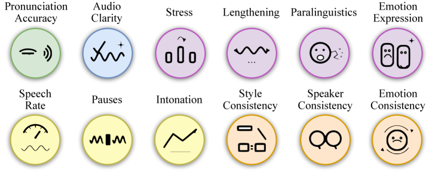
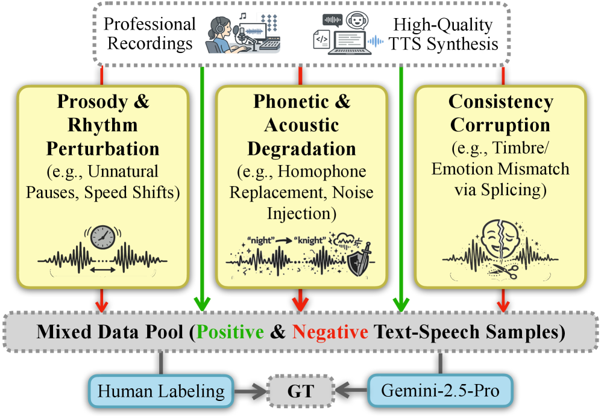
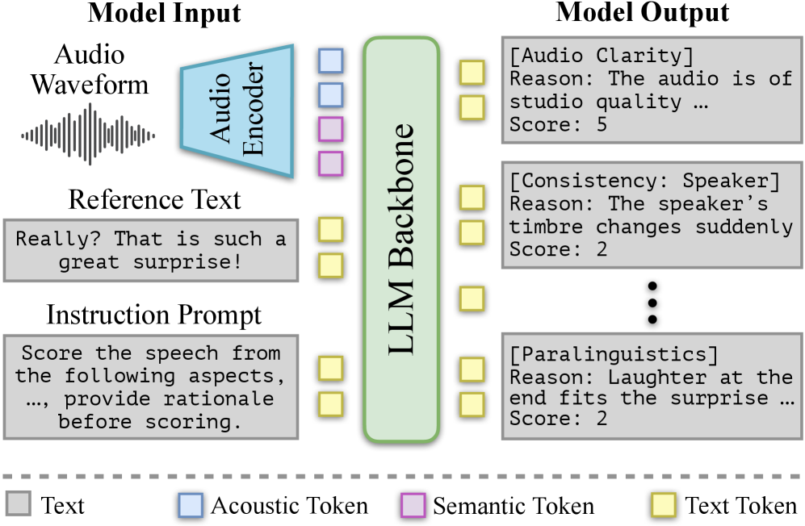
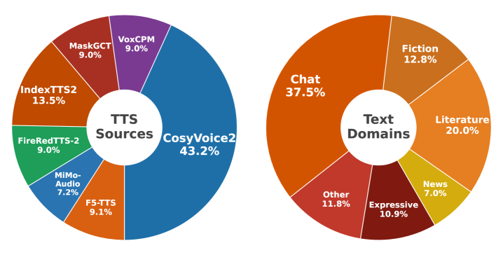

# 🚩 (2026-04-27) Scholar Inbox 추천 논문 

# 📚 UniSonate: A Unified Model for Speech, Music, and Sound Effect Generation with Text Instructions

🚀 URL: https://arxiv.org/html/2604.22209

## 🌏 Abstract (원문)
Generative audio modeling has largely been fragmented into specialized tasks, text-to-speech (TTS), text-to-music (TTM), and text-to-audio (TTA), each operating under heterogeneous control paradigms. Unifying these modalities remains a fundamental challenge due to the intrinsic dissonance between structured semantic representations (speech/music) and unstructured acoustic textures (sound effects). In this paper, we introduceUniSonate, a unified flow-matching framework capable of synthesizing speech, music, and sound effects through a standardized, reference-free natural language instruction interface. To reconcile structural disparities, we propose a novel dynamic token injection mechanism that projects unstructured environmental sounds into a structured temporal latent space, enabling precise duration control within a phoneme-driven Multimodal Diffusion Transformer (MM-DiT). Coupled with a multi-stage curriculum learning strategy, this approach effectively mitigates cross-modal optimization conflicts. Extensive experiments demonstrate that UniSonate achieves state-of-the-art performance in instruction-based TTS (WER 1.47%) and TTM (SongEval Coherence 3.18), while maintaining competitive fidelity in TTA. Crucially, we observepositive transfer, where joint training on diverse audio data significantly enhances structural coherence and prosodic expressiveness compared to single-task baselines. Audio samples are available athttps://qiangchunyu.github.io/UniSonate/.
## 🌏 Abstract (번역)
생성형 오디오 모델링은 텍스트 음성 변환(TTS), 텍스트 음악 변환(TTM), 텍스트 오디오 변환(TTA)과 같은 전문화된 작업으로 크게 분할되어 왔으며, 각기 다른 제어 패러다임으로 작동합니다. 구조화된 의미론적 표현(음성/음악)과 비구조화된 음향 질감(음향 효과) 사이의 본질적인 불일치로 인해 이러한 양식을 통합하는 것은 근본적인 과제로 남아 있습니다. 본 논문에서는 표준화된 참조 없는 자연어 지시 인터페이스를 통해 음성, 음악 및 음향 효과를 합성할 수 있는 통합 플로우 매칭 프레임워크인 UniSonate를 소개합니다. 구조적 불일치를 해소하기 위해, 우리는 비구조화된 환경음을 구조화된 시간 잠재 공간으로 투영하여 음소 기반의 다중 모달 확산 트랜스포머(MM-DiT) 내에서 정밀한 지속 시간 제어를 가능하게 하는 새로운 동적 토큰 주입 메커니즘을 제안합니다. 다단계 커리큘럼 학습 전략과 결합된 이 접근 방식은 교차 모달 최적화 충돌을 효과적으로 완화합니다. 광범위한 실험을 통해 UniSonate는 지시 기반 TTS(WER 1.47%) 및 TTM(SongEval Coherence 3.18)에서 최첨단 성능을 달성하는 동시에 TTA에서 경쟁력 있는 충실도를 유지함을 입증했습니다. 결정적으로, 우리는 다양한 오디오 데이터에 대한 공동 훈련이 단일 작업 기준선에 비해 구조적 일관성과 운율적 표현력을 크게 향상시키는 긍정적인 전이 효과를 관찰했습니다. 오디오 샘플은 https://qiangchunyu.github.io/UniSonate/에서 확인할 수 있습니다.

## 🔍 Methods & Results
- UniSonate는 조건부 플로우 매칭 기반의 단일 확률론적 프레임워크 내에서 음성, 음악, 음향 효과를 통합하며, 표준화된 'Instruction-Content' 입력을 처리하는 듀얼 스트림 Multimodal Diffusion Transformer (MM-DiT)를 사용한다.
- 텍스트 스트림은 자연어 지시 임베딩(Qwen2.5-7B 인코더 사용)과 콘텐츠 임베딩을 결합한다. 음성 및 음악의 경우 콘텐츠는 음소 시퀀스이며, 음향 효과(SFX)의 경우 학습 가능한 `[SFX]` 특수 토큰 시퀀스로 구성되며, 이 토큰 시퀀스의 길이는 대상 오디오 지속 시간에 맞춰 동적으로 조정된다.
- 오디오 스트림은 사전 학습된 Mel-VAE(다운샘플링 팩터 1024)를 사용하여 44.1kHz 원본 파형을 압축한 노이즈가 있는 잠재 표현을 처리한다.
- MM-DiT는 텍스트와 오디오 스트림 간의 양방향 정보 흐름을 위한 공동 어텐션 레이어를 사용하며, 이후 음향 세부 사항을 개선하기 위해 단일 확산 트랜스포머 레이어를 거친다.
- SFX 생성을 위해 동적 토큰 주입 전략을 도입하여 `[SFX]` 특수 토큰을 의사 음소 단위로 사용한다. 이 토큰 시퀀스의 길이는 음성 코퍼스에서 계산된 평균 음소-지속 시간 비율(λ)을 기반으로 대상 SFX 지속 시간에 맞춰 결정되며, 반복되는 토큰은 시간적 앵커 역할을 하여 MM-DiT가 시퀀스를 단계별로 처리하도록 돕는다.
- 다양한 작업의 복잡성 차이로 인한 최적화 충돌을 완화하기 위해 다단계 커리큘럼 학습 전략을 사용한다. 훈련은 구조화된 음성(1단계)에서 시작하여 반구조화된 음악(2단계)으로 확장하고, 마지막으로 비구조화된 음향 효과(3단계)를 통합한다.
- 실험 결과, UniSonate는 지시 기반 TTS에서 WER 1.47%, TTM에서 SongEval Coherence 3.18로 최첨단 성능을 달성했으며, TTA에서도 경쟁력 있는 충실도를 유지했다.
- 다양한 오디오 데이터에 대한 공동 훈련이 단일 작업 기준선에 비해 구조적 일관성과 운율적 표현력을 크게 향상시키는 '긍정적 전이(positive transfer)' 효과를 관찰했다.

## 🖼 Figures

*Figure 1:Holistic capability assessment across Speech (SeedTTS-WER, Control), Music (SongEval), and Sound Effects (FAD, FD). Unlike specialized baselines restricted to specific domains, UniSonate achieves pan-modal coverage. It demonstrates superior instruction-following and structural coherence in structured tasks (TTS/TTM) while effectively extending to unstructured TTA.*

![Figure 2:The overall architecture of UniSonate. The framework employs a dual-stream MM-DiT based on conditional flow matching. The input follows the Instruction-Content Alignment paradigm, unifying natural language instructions with content sequences, utilizing phonemes for speech/music and special token Injection (via learnable [SFX] tokens) for sound effects. These semantic conditions interact with acoustic latents (compressed by a Mel-VAE) through Joint Diffusion Transformer layers to enable unified audio generation.](../images/2026-04-27/2604.22209/2604.22209_fig1.png)
*Figure 2:The overall architecture of UniSonate. The framework employs a dual-stream MM-DiT based on conditional flow matching. The input follows the Instruction-Content Alignment paradigm, unifying natural language instructions with content sequences, utilizing phonemes for speech/music and special token Injection (via learnable [SFX] tokens) for sound effects. These semantic conditions interact with acoustic latents (compressed by a Mel-VAE) through Joint Diffusion Transformer layers to enable unified audio generation.*

---
**Usage Info**: 4063 tokens used.
**Generated at**: 2026-04-27 15:46:29

---

# 📚 TTS-PRISM: A Perceptual Reasoning and Interpretable Speech Model for Fine-Grained Diagnosis

🚀 URL: https://arxiv.org/html/2604.22225

## 🌏 Abstract (원문)
While generative text-to-speech (TTS) models approach human-level quality, monolithic metrics fail to diagnose fine-grained acoustic artifacts or explain perceptual collapse. To address this, we propose TTS-PRISM, a multi-dimensional diagnostic framework for Mandarin. First, we establish a 12-dimensional schema spanning stability to advanced expressiveness. Second, we design a targeted synthesis pipeline with adversarial perturbations and expert anchors to build a high-quality diagnostic dataset. Third, schema-driven instruction tuning embeds explicit scoring criteria and reasoning into an efficient end-to-end model. Experiments on a 1,600-sample Gold Test Set show TTS-PRISM outperforms generalist models in human alignment. Profiling six TTS paradigms establishes intuitive diagnostic flags that reveal fine-grained capability differences. TTS-PRISM is open-source, with code and checkpoints athttps://github.com/xiaomi-research/tts-prism.
## 🌏 Abstract (번역)
생성형 음성 합성(TTS) 모델이 인간 수준의 품질에 근접하고 있지만, 단일 지표로는 미세한 음향 아티팩트를 진단하거나 인지적 붕괴를 설명하기 어렵습니다. 이를 해결하기 위해 우리는 만다린어를 위한 다차원 진단 프레임워크인 TTS-PRISM을 제안합니다. 첫째, 안정성부터 고급 표현력에 이르는 12차원 스키마를 구축합니다. 둘째, 적대적 교란과 전문가 앵커를 포함하는 목표 지향적 합성 파이프라인을 설계하여 고품질 진단 데이터셋을 구축합니다. 셋째, 스키마 기반의 명령어 튜닝을 통해 명시적인 점수 부여 기준과 추론을 효율적인 종단간 모델에 내장합니다. 1,600개 샘플로 구성된 골드 테스트 세트에서 수행된 실험 결과, TTS-PRISM은 일반 모델보다 인간과의 정렬에서 우수한 성능을 보였습니다. 6가지 TTS 패러다임을 프로파일링하여 미세한 능력 차이를 드러내는 직관적인 진단 플래그를 설정했습니다. TTS-PRISM은 오픈 소스로, 코드는 https://github.com/xiaomi-research/tts-prism에서 확인할 수 있습니다.

## 🔍 Methods & Results
- TTS-PRISM은 계층적 평가 스키마, 목표 지향적 데이터 합성 파이프라인, 진단 점수 모델로 구성된 프레임워크를 제안하며, 주관적 모호성을 제거하기 위해 각 점수 수준에 명시적인 허용 오차 임계값을 설정했습니다.
- 12차원 계층적 분류 체계를 구축했으며, 이는 기본 능력 계층(4개 도메인, 8개 하위 차원)과 고급 표현력 계층(4개 하위 차원)으로 나뉩니다.
- 기본 능력 계층은 오디오 선명도, 발음 정확도(ASR 지표를 넘어선 미세한 이상 감지), 운율 정확도(억양, 일시정지, 말하기 속도), 일관성(화자 정체성, 스타일, 감정)을 평가합니다.
- 고급 표현력 계층은 강조(Stress), 길이 늘이기(Lengthening), 비언어적 표현(Paralinguistics), 감정 표현(Emotion Expression)을 포착합니다.
- 기존 데이터셋의 한계를 극복하기 위해, 선도적인 TTS 패러다임과 고품질 인간 음성을 긍정적 앵커로 사용하고, 운율, 리듬, 발음, 오디오 품질, 일관성 위반 등 다양한 교란을 도입하여 전체 품질 스케일을 포괄하는 합성 파이프라인을 구축했습니다.
- 레이블링 과정에서 Gemini-2.5-Pro를 사용하여 12개의 독립적인 차원별 작업을 수행하고, 인간 지시 기반 추론 개선을 적용하여 환각을 수정했으며, 만다린어 성조 변화 및 다의어 처리를 위해 11k개의 전문가 주석이 달린 '발음 골드 서브셋'을 구축하여 200k개의 정렬된 샘플을 생성했습니다.
- 진단 점수 모델은 MiMo-Audio를 백본으로 사용하는 종단간 모델이며, 1억 시간의 비지도 사전 훈련을 통해 강력한 음향 표현을 학습했습니다.
- 스키마 기반 명령어 튜닝 전략을 구현하여, 명시적인 점수 부여 기준(R_i)을 먼저 생성한 후 점수(S_i)를 할당하는 Y=[R1,S1,…,R12,S12] 형식의 인터리브드 타겟 시퀀스를 통해 논리적 일관성을 강화하고 환각을 최소화했습니다.
- 1,600개 샘플의 골드 테스트 세트 실험에서 TTS-PRISM은 일반 모델보다 인간과의 정렬에서 우수한 성능을 보였습니다.
- 6가지 TTS 패러다임을 프로파일링하여 미세한 능력 차이를 드러내는 직관적인 진단 플래그를 성공적으로 설정했습니다.

## 🖼 Figures

*Figure 1:The schema comprises 12 well-defined dimensions spanning acoustic stability and expressiveness.*

*(a)Targeted Data Synthesis Strategy*

*(a)Targeted Data Synthesis Strategy*

*(b)Diagnostic Scoring Model*

*Figure 3:Distribution of diverse TTS sources and text domains.*

---
**Usage Info**: 3106 tokens used.
**Generated at**: 2026-04-27 15:46:40

---

