# 🚩 (2026-04-28) Scholar Inbox 추천 논문 

# 📚 Talker-T2AV: Joint Talking Audio-Video Generation with Autoregressive Diffusion Modeling

🚀 URL: https://arxiv.org/html/2604.23586

## 🌏 Abstract (원문)
Joint audio-video generation models, such as dual-branch diffusion transformers, have demonstrated that generating audio and video within a unified model yields stronger cross-modal coherence than cascaded pipelines. However, existing joint audio-video diffusion models typically couple the two modalities throughout the entire denoising process via pervasive attention mechanisms, treating both high-level semantics and low-level signal details in a fully entangled manner. We argue that such uniform coupling is suboptimal for talking head synthesis. While audio and facial motion are strongly correlated at the semantic and temporal levels, their low-level realizations—acoustic signals and visual textures—follow distinct rendering processes. Enforcing joint modeling across all levels can therefore lead to unnecessary entanglement and reduced modeling efficiency. Instead, we posit that joint modeling should primarily occur at high-level semantic and temporal information, where cross-modal alignment is essential, while low-level refinement should be handled by modality-specific decoders. Building on this observation, we propose Talker-T2AV, an autoregressive diffusion framework that realizes this principle: high-level cross-modal modeling in a shared autoregressive backbone, with low-level refinement delegated to modality-specific decoding. A shared autoregressive language model serves as a high-level temporal planner, jointly reasoning over audio and video in a unified patch-level token space with autoregressive left-to-right generation. Two lightweight diffusion transformer heads then decode the language model’s hidden states into frame-level audio and video latents. Experiments on talking portrait benchmarks show that Talker-T2AV outperforms dual-branch diffusion transformer baselines in lip-sync accuracy, video quality, and audio quality, and further achieves stronger cross-modal consistency than cascaded pipelines, highlighting the complementary benefits of joint modeling. The samples are available athttps://talker-t2av.github.io/. The code is available athttps://github.com/zhenye234/Talker-T2AV.
## 🌏 Abstract (번역)
듀얼 브랜치 확산 트랜스포머와 같은 공동 오디오-비디오 생성 모델은 단일 모델 내에서 오디오와 비디오를 생성하는 것이 계단식 파이프라인보다 더 강력한 교차 모달 일관성을 제공함을 입증했습니다. 그러나 기존의 공동 오디오-비디오 확산 모델은 일반적으로 광범위한 어텐션 메커니즘을 통해 전체 노이즈 제거 과정에서 두 가지 모달리티를 결합하여, 고수준 의미론과 저수준 신호 세부 사항을 완전히 얽힌 방식으로 처리합니다. 우리는 이러한 균일한 결합이 말하는 얼굴(talking head) 합성에 최적이 아니라고 주장합니다. 오디오와 얼굴 움직임은 의미론적 및 시간적 수준에서 강하게 상관관계가 있지만, 음향 신호와 시각적 질감과 같은 저수준 구현은 서로 다른 렌더링 프로세스를 따릅니다. 모든 수준에서 공동 모델링을 강제하는 것은 불필요한 얽힘과 모델링 효율성 저하로 이어질 수 있습니다. 대신, 우리는 공동 모델링이 교차 모달 정렬이 필수적인 고수준 의미론적 및 시간적 정보에서 주로 발생해야 하며, 저수준 정제는 모달리티별 디코더에 의해 처리되어야 한다고 주장합니다. 이러한 관찰을 바탕으로, 우리는 이 원칙을 구현하는 자기회귀 확산 프레임워크인 Talker-T2AV를 제안합니다. 즉, 공유 자기회귀 백본에서 고수준 교차 모달 모델링을 수행하고, 저수준 정제는 모달리티별 디코딩에 위임합니다. 공유 자기회귀 언어 모델은 고수준 시간 계획자 역할을 하며, 자기회귀적인 좌-우 생성을 통해 통합된 패치 수준 토큰 공간에서 오디오와 비디오를 공동으로 추론합니다. 두 개의 경량 확산 트랜스포머 헤드는 언어 모델의 은닉 상태를 프레임 수준 오디오 및 비디오 잠재 공간으로 디코딩합니다. 말하는 얼굴 벤치마크 실험 결과, Talker-T2AV는 립싱크 정확도, 비디오 품질 및 오디오 품질에서 듀얼 브랜치 확산 트랜스포머 기준선보다 우수하며, 계단식 파이프라인보다 더 강력한 교차 모달 일관성을 달성하여 공동 모델링의 상호 보완적인 이점을 강조합니다. 샘플은 https://talker-t2av.github.io/ 에서 확인할 수 있습니다. 코드는 https://github.com/zhenye234/Talker-T2AV 에서 확인할 수 있습니다.

## 🔍 Methods & Results
- Talker-T2AV는 텍스트 스크립트, 참조 음성, 신원 이미지를 입력으로 받아 오디오 잠재 시퀀스와 말하는 얼굴 비디오 잠재 시퀀스를 공동으로 생성하는 자기회귀 확산 프레임워크입니다.
- 고수준 교차 모달 모델링은 공유 자기회귀 백본에서 이루어지며, 저수준 정제는 모달리티별 디코더에 위임하는 원칙을 따릅니다.
- 비디오(LIA-X)와 오디오(WhisperX-VAE) 모두 25Hz의 동일한 프레임 속도로 순수 시간적 시퀀스를 생성하는 특징 추출기를 사용하여 교차 어텐션 없이 자연스러운 시간적 정렬을 보장합니다.
- 공유 인과 언어 모델은 텍스트, 음성, 비디오를 통합된 시퀀스에서 공동으로 추론하며, 오디오 및 비디오 패치 임베딩은 요소별로 합산되어 공동 입력 토큰을 형성합니다.
- 연속된 P개 프레임을 단일 패치로 그룹화하고 패치 트랜스포머 인코더를 통해 하나의 토큰으로 압축하여 시퀀스 길이를 줄이고 처리 효율성을 높입니다.
- MLP 정지 예측기를 사용하여 가변 길이 출력을 지원하며, 이는 순수 DiT 아키텍처가 추가 메커니즘을 필요로 하는 기능입니다.
- 모달리티별 디코딩을 위해 두 개의 독립적인 경량 확산 트랜스포머(DiT) 헤드가 공유 은닉 상태를 의미론적 조건으로 받아 해당 패치(P개 프레임)를 디코딩합니다.
- 요소별 합산 설계는 아키텍처 수정이나 미세 조정 없이 단일 모달리티 조건부 생성(비디오 더빙, 오디오 기반 말하는 얼굴 생성)을 가능하게 합니다.
- 대규모 TTS 데이터를 혼합하여 훈련하는 혼합 작업 훈련 방식을 지원하여 생성된 음성의 단어 오류율을 낮추고 립싱크 정확도를 향상시킵니다.
- 실험 결과, Talker-T2AV는 립싱크 정확도, 비디오 품질, 오디오 품질에서 듀얼 브랜치 확산 트랜스포머 기준선보다 우수하며, 계단식 파이프라인보다 강력한 교차 모달 일관성을 달성했습니다.

## 🖼 Figures
![Figure 1:Overview of Talker-T2AV. Top: The autoregressive backbone processes a unified causal sequence in which the full text token sequence appears first as a prefix, followed by joint audio-video patches where audio and video patch embeddings are element-wise summed at each position. The backbone hidden states are then decoded by two modality-specific diffusion transformer heads into audio waveforms and portrait video, respectively. Bottom right: Each diffusion transformer head takes the hidden state 
𝐡
𝑖
, a global embedding, and a context window of history frames as conditioning, and denoises the current frame via flow matching. Bottom left: The patch transformer encoder compresses 
𝑁
 audio/video frames into a single patch token, reducing sequence length for efficient autoregressive modeling.](../images/2026-04-28/2604.23586/2604.23586_fig0.png)
*Figure 1:Overview of Talker-T2AV. Top: The autoregressive backbone processes a unified causal sequence in which the full text token sequence appears first as a prefix, followed by joint audio-video patches where audio and video patch embeddings are element-wise summed at each position. The backbone hidden states are then decoded by two modality-specific diffusion transformer heads into audio waveforms and portrait video, respectively. Bottom right: Each diffusion transformer head takes the hidden state 
𝐡
𝑖
, a global embedding, and a context window of history frames as conditioning, and denoises the current frame via flow matching. Bottom left: The patch transformer encoder compresses 
𝑁
 audio/video frames into a single patch token, reducing sequence length for efficient autoregressive modeling.*

---
**Usage Info**: 5401 tokens used.
**Generated at**: 2026-04-28 16:08:04

---

# 📚 Hallo-Live: Real-Time Streaming Joint Audio-Video Avatar Generation with Asynchronous Dual-Stream and Human-Centric Preference Distillation

🚀 URL: https://arxiv.org/html/2604.23632

## 🌏 Abstract (원문)
Real-time text-driven joint audio-video avatar generation requires jointly synthesizing portrait video and speech with high fidelity and precise synchronization, yet existing audio-visual diffusion models remain too slow for interactive use and often degrade noticeably after aggressive acceleration. We presentHallo-Live, a streaming framework for joint audio-visual avatar generation that combines asynchronous dual-stream diffusion with human-centric preference-guided distillation. To reduce articulation lag in causal generation, we introduceFuture-Expanding Attention, which allows each video block to access synchronous audio together with a short horizon of future phonetic cues. To mitigate the quality loss of few-step distillation, we further proposeHuman-Centric Preference-Guided DMD(HP-DMD), which reweights training samples using rewards from visual fidelity, speech naturalness, and audio-visual synchronization. On two NVIDIA H200 GPUs, Hallo-Live runs at 20.38 FPS with 0.94 seconds latency, yielding16.0×16.0\timeshigher throughput and99.3×99.3\timeslower latency than the teacher model Ovi. Despite this speedup, it retains strong generation quality, reaching comparable VideoAlign overall score and Sync Confidence score while outperforming other accelerated baselines in the overall quality-efficiency trade-off. Qualitative results further show robust generalization across photorealistic, multi-speaker, and stylized scenarios. To the best of our knowledge, Hallo-Live is the first framework to combine streaming dual-stream diffusion with preference-guided distillation for real-time, text-driven audio-visual generation. Code and models are publicly available athttps://github.com/fudan-generative-vision/Hallo-Live.
## 🌏 Abstract (번역)
실시간 텍스트 기반 오디오-비디오 아바타 공동 생성은 높은 충실도와 정확한 동기화를 통해 인물 비디오와 음성을 동시에 합성하는 것을 요구하지만, 기존 오디오-비디오 확산 모델은 대화형 사용에는 너무 느리고 공격적인 가속화 후에는 눈에 띄게 품질이 저하되는 경우가 많습니다. 본 연구에서는 비동기 이중 스트림 확산과 인간 중심의 선호도 기반 증류를 결합한 오디오-비디오 아바타 공동 생성을 위한 스트리밍 프레임워크인 Hallo-Live를 제안합니다. 인과적 생성에서 발음 지연을 줄이기 위해, 각 비디오 블록이 동기화된 오디오와 짧은 미래 음성 단서를 함께 접근할 수 있도록 하는 미래 확장 어텐션(Future-Expanding Attention)을 도입합니다. 소수 단계 증류의 품질 손실을 완화하기 위해, 시각적 충실도, 음성 자연스러움, 오디오-비디오 동기화로부터 얻은 보상을 사용하여 훈련 샘플의 가중치를 재조정하는 인간 중심 선호도 기반 DMD(HP-DMD)를 추가로 제안합니다. 두 대의 NVIDIA H200 GPU에서 Hallo-Live는 0.94초의 지연 시간으로 20.38 FPS로 실행되며, 교사 모델 Ovi보다 16.0배 높은 처리량과 99.3배 낮은 지연 시간을 제공합니다. 이러한 속도 향상에도 불구하고, 강력한 생성 품질을 유지하여 VideoAlign 전체 점수 및 Sync Confidence 점수에서 비교할 만한 수준에 도달하며, 전반적인 품질-효율성 균형에서 다른 가속화된 기준선들을 능가합니다. 정성적 결과는 사실적, 다중 화자 및 양식화된 시나리오 전반에 걸쳐 강력한 일반화 능력을 보여줍니다. 저희가 아는 한, Hallo-Live는 실시간 텍스트 기반 오디오-비디오 생성을 위해 스트리밍 이중 스트림 확산과 선호도 기반 증류를 결합한 최초의 프레임워크입니다. 코드와 모델은 https://github.com/fudan-generative-vision/Hallo-Live에서 공개적으로 이용 가능합니다.

## 🔍 Methods & Results
- Hallo-Live는 실시간 텍스트 기반 오디오-비디오 아바타 생성을 위한 스트리밍 프레임워크로, 비동기 이중 스트림 확산과 인간 중심의 선호도 기반 증류를 결합합니다.
- 인과적 생성에서 발음 지연을 줄이기 위해, 각 비디오 블록이 동기화된 오디오와 짧은 미래 음성 단서를 함께 접근할 수 있도록 하는 '미래 확장 어텐션(Future-Expanding Attention)'을 도입했습니다.
- 미래 확장 어텐션은 비디오 스트림이 다가오는 음성 역학을 '미리 보기'할 수 있도록 비디오 쿼리에 대해 오디오 컨텍스트를 비대칭적으로 확장하여, 현실적인 얼굴 움직임에 필요한 자연스러운 선행 시간을 모델링합니다.
- 비동기 이중 스트림 확산은 비디오 브랜치가 현재 비디오 블록만 디노이징하고, 오디오 브랜치는 확장된 노이즈 입력(현재 및 임시 미래 블록 포함)을 받아들여, 추측성 오디오 오류를 축적하지 않고 예측적인 음성 단서를 제공합니다.
- 훈련 시에는 '미래 확장 블록-인과 마스크(Future-Expanding Block-Causal Mask)'를 사용하여 스트리밍 추론 시 사용 가능한 제한된 미래 음성 컨텍스트에 의존하도록 학생 모델을 학습시킵니다.
- 소수 단계 증류로 인한 품질 저하를 완화하기 위해, 시각적 충실도(VideoAlign), 음성 자연스러움(AudioBox), 오디오-비디오 동기화(SyncNet 기반 점수)로부터 얻은 보상을 사용하여 훈련 샘플의 가중치를 재조정하는 '인간 중심 선호도 기반 DMD(HP-DMD)'를 제안합니다.
- HP-DMD는 학생 모델의 생성 분포를 인간 중심의 아바타 오디오-비디오 생성 지표로 유도하여, 증류 후 더 나은 품질-효율성 균형을 달성합니다.
- Hallo-Live는 두 단계 훈련 파이프라인을 사용합니다: 1단계는 사전 훈련된 Ovi 교사 모델로부터 스트리밍 학생 모델을 초기화하고, 2단계는 이중 스트림 DMD를 사용하여 오디오-비디오 충실도 및 동기화를 개선하기 위해 자기 회귀적 자기 롤아웃을 수행합니다.
- 두 대의 NVIDIA H200 GPU에서 Hallo-Live는 20.38 FPS의 속도와 0.94초의 지연 시간으로 실행되며, 교사 모델 Ovi보다 16.0배 높은 처리량과 99.3배 낮은 지연 시간을 달성했습니다.
- 이러한 속도 향상에도 불구하고, Hallo-Live는 VideoAlign 전체 점수 및 Sync Confidence 점수에서 비교할 만한 수준에 도달하며 강력한 생성 품질을 유지하고, 다른 가속화된 기준선들보다 전반적인 품질-효율성 균형에서 우수한 성능을 보였습니다.
- 정성적 결과는 사실적, 다중 화자 및 양식화된 시나리오 전반에 걸쳐 Hallo-Live의 강력한 일반화 능력을 입증했습니다.

## 🖼 Figures

*Figure 1.Our method enables real-time streaming text-driven joint audio-video avatar generation. On two NVIDIA H200 GPUs, Hallo-Live reaches 20.38 FPS with 0.94s latency while preserving strong lip-sync accuracy and visual fidelity. The examples above show robust generalization across diverse scenarios, including multi-speaker interactions, photorealistic portraits, and stylized cartoon characters.*

![Figure 2.Overview of Hallo-Live. Top left: Stage I adapts a pretrained dual-stream DiT to the streaming setting using cross-modal future-expanding block-causal mask. Bottom left: Stage II performs autoregressive self-rollout with an audio-video KV cache and optimizes the generated trajectory with reward-weighted dual-stream DMD. Right: Each causal fusion block in the dual-stream DiT consists of single-modal block-causal self-attention, text cross-attention, and cross-modal attention between the video and audio streams, where the block-causal masks are utilized in Stage I ODE initialization, and KV cache is maintained for Stage II self-rollout and streaming inference.](../images/2026-04-28/2604.23632/2604.23632_fig1.png)
*Figure 2.Overview of Hallo-Live. Top left: Stage I adapts a pretrained dual-stream DiT to the streaming setting using cross-modal future-expanding block-causal mask. Bottom left: Stage II performs autoregressive self-rollout with an audio-video KV cache and optimizes the generated trajectory with reward-weighted dual-stream DMD. Right: Each causal fusion block in the dual-stream DiT consists of single-modal block-causal self-attention, text cross-attention, and cross-modal attention between the video and audio streams, where the block-causal masks are utilized in Stage I ODE initialization, and KV cache is maintained for Stage II self-rollout and streaming inference.*

*Figure 3.Comparison of attention mechanisms. (a) The Strict Block-Causal Attention uses synchronous alignment, where the current video block only attends to the current audio block and past context. (b) Our Future-Expanding Attention expands the audio receptive field to include the look-ahead blocks, enabling anticipatory audio-visual synchronization. (c) After the window slides forward, the overlapped audio context is retained and the provisional future block is refreshed.*

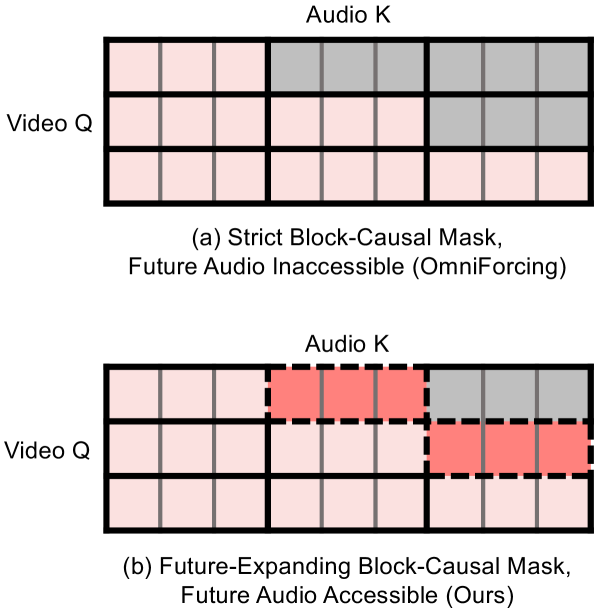
*Figure 4.Cross-modal causal masks from video queries to audio keys. (a) In the Strict Block-Causal mask, future audio positions remain inaccessible. (b) Our Future-Expanding Block-Causal mask selectively reveals a short look-ahead audio region.*

*Figure 5.Comparison with state-of-the-art methods (Ovi (Low et al., 2025), UniVerse-1 (Wang et al., 2025), JavisDiT (Liu et al., 2025b), MOVA (Team et al., 2026),LTX-2 (HaCohen et al., 2026)). Our method achieves competitive or superior performance across multiple metrics, particularly after preference distillation.*

*Figure 6.Generation results with different prompts. The figure showcases diverse generation capabilities, ranging from specific spatial compositions like Half-Body (top-left) and Full-Body (top-right) framing, to complex Multi-Speaker dynamics (bottom-left) and Cartoon stylization (bottom-right). Our method accurately captures prompt-specified attributes.*

*Figure 7.Line plot of the Sync-C score under different attention mechanisms. The score increases steadily as the attention window expands, while the improvement becomes marginal after 
𝑊
=
15
, indicating a clear saturation trend.*

*Figure 8.Qualitative comparison of individual reward enhancements. The reward-weighted distillation allows the student to pull its distribution toward high-reward regions. Each row highlights improvements in lip-sync precision (bottom)and video aesthetic quality (top) compared to the standard DMD baseline.*

---
**Usage Info**: 5622 tokens used.
**Generated at**: 2026-04-28 16:08:39

---

# 📚 Audio2Tool: Speak, Call, Act - A Dataset for Benchmarking Speech Tool Use

🚀 URL: https://arxiv.org/html/2604.22821

## 🌏 Abstract (원문)
Voice assistants increasingly rely on SpeechLMs to interpret spoken queries and execute complex tasks, yet, existing benchmarks lack domain breadth, acoustic diversity, and compositional reasoning complexity to evaluate tool-calling performance. We introduce Audio2Tool, a large scale dataset comprising 30,000 queries designed to assess tool-calling capabilities of SpeechLMs across three primary domains: Smart Car, Smart Home, and Wearables. Our benchmark features a multi-tier complexity hierarchy, ranging from simple direct commands to complex multi-intent and needle-in-a-haystack extraction to isolate distinct failure modes. To ensure realism, we employ zero-shot voice cloning TTS and diverse noise profiles to simulate in-the-wild conditions. Evaluations of state-of-the-art SpeechLMs and ASR–LLM pipelines show strong performance on simple commands but significant degradation under compositional and acoustic challenges. We will release the dataset and benchmark upon acceptance.
## 🌏 Abstract (번역)
음성 비서는 음성 쿼리를 해석하고 복잡한 작업을 실행하기 위해 SpeechLM에 점점 더 의존하고 있지만, 기존 벤치마크는 도구 호출 성능을 평가하기 위한 도메인 폭, 음향 다양성 및 구성적 추론 복잡성이 부족합니다. 우리는 스마트카, 스마트홈, 웨어러블의 세 가지 주요 도메인에서 SpeechLM의 도구 호출 능력을 평가하도록 설계된 30,000개의 쿼리로 구성된 대규모 데이터셋인 Audio2Tool을 소개합니다. 우리의 벤치마크는 단순한 직접 명령부터 복잡한 다중 의도 및 건초 더미에서 바늘 찾기 추출에 이르기까지 다양한 실패 모드를 분리하기 위한 다단계 복잡성 계층을 특징으로 합니다. 현실성을 보장하기 위해, 우리는 제로샷 음성 복제 TTS와 다양한 노이즈 프로파일을 사용하여 실제 환경 조건을 시뮬레이션합니다. 최첨단 SpeechLM 및 ASR-LLM 파이프라인에 대한 평가는 단순 명령에서는 강력한 성능을 보였지만, 구성적 및 음향적 문제에서는 상당한 성능 저하를 나타냈습니다. 데이터셋과 벤치마크는 승인 시 공개될 예정입니다.

## 🔍 Methods & Results
- Audio2Tool이라는 30,000개의 쿼리로 구성된 대규모 데이터셋을 도입하여 SpeechLM의 도구 호출 능력을 평가했습니다.
- 스마트카, 스마트홈, 웨어러블의 세 가지 주요 도메인에 걸쳐 도구 호출 능력을 평가하도록 설계되었습니다.
- 단순한 직접 명령부터 복잡한 다중 의도 및 '건초 더미에서 바늘 찾기' 추출에 이르는 다단계 복잡성 계층을 특징으로 합니다.
- 현실적인 평가를 위해 제로샷 음성 복제 TTS와 다양한 노이즈 프로파일을 사용하여 실제 환경 조건을 시뮬레이션했습니다.
- 최첨단 SpeechLM 및 ASR-LLM 파이프라인을 평가한 결과, 단순 명령에서는 강력한 성능을 보였습니다.
- 구성적 및 음향적 문제(예: 복잡한 다중 의도, 소음 환경)에서는 성능이 크게 저하되는 것을 확인했습니다.

## 🖼 Figures
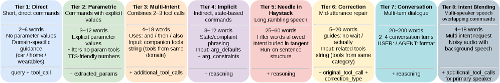
*Figure 1:Overview of the Audio2Tool query generation pipeline detailed for different tiers.*

*(a)Number of queries per complexity tier.*

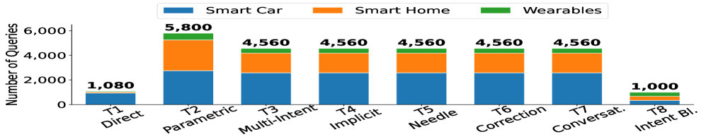
*(a)Number of queries per complexity tier.*

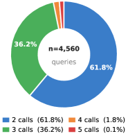
*(b)Intent count in Tier 3.*

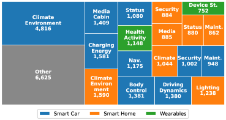
*(c)Category distribution.*

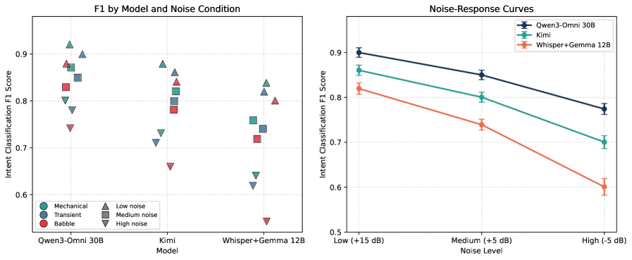
*Figure 3:Effect of noise on the performance.*

---
**Usage Info**: 1340 tokens used.
**Generated at**: 2026-04-28 16:08:48

---

# 📚 Spectro-Temporal Modulation Representation Framework for Human-Imitated Speech Detection

🚀 URL: https://arxiv.org/html/2604.23241

## 🌏 Abstract (원문)
Human-imitated speech poses a greater challenge than AI-generated speech for both human listeners and automatic detection systems. Unlike AI-generated speech, which often contains artifacts, over-smoothed spectra, or robotic cues, imitated speech is produced naturally by humans, thereby preserving a higher degree of naturalness that makes imitation-based speech forgery significantly more challenging to detect using conventional acoustic or cepstral features. To overcome this challenge, this study proposes an auditory perception-based Spectro-Temporal Modulation (STM) representation framework for human-imitated speech detection. The STM representations are derived from two cochlear filterbank models: the Gammatone Filterbank (GTFB), which simulates frequency selectivity and can be regarded as a first approximation of cochlear filtering, and the Gammachirp Filterbank (GCFB), which further models both frequency selectivity and level-dependent asymmetry. These STM representations jointly capture temporal and spectral fluctuations in speech signals, corresponding to changes over time in the spectrogram and variations along the frequency axis related to human auditory perception. We also introduce a Segmental-STM representation to analyze short-term modulation patterns across overlapping time windows, enabling high-resolution modeling of temporal speech variations. Experimental results show that STM representations are effective for human-imitated speech detection, achieving accuracy levels close to those of human listeners. In addition, Segmental-STM representations are more effective, surpassing human perceptual performance. The findings demonstrate that perceptually inspired spectro-temporal modeling is promising for detecting imitation-based speech attacks and improving voice authentication robustness.
## 🌏 Abstract (번역)
인간이 모방한 음성은 AI가 생성한 음성보다 인간 청취자와 자동 탐지 시스템 모두에게 더 큰 어려움을 제기합니다. 인공지능 생성 음성이 종종 인공물, 과도하게 평활화된 스펙트럼 또는 로봇 같은 단서를 포함하는 것과 달리, 모방 음성은 인간에 의해 자연스럽게 생성되므로 더 높은 수준의 자연스러움을 유지하여 기존의 음향 또는 켑스트럼 특징을 사용하여 모방 기반 음성 위조를 탐지하는 것을 훨씬 더 어렵게 만듭니다. 이 문제를 극복하기 위해 본 연구는 인간 모방 음성 탐지를 위한 청각 지각 기반 스펙트로-시간 변조(STM) 표현 프레임워크를 제안합니다. STM 표현은 두 가지 달팽이관 필터뱅크 모델에서 파생됩니다: 주파수 선택성을 시뮬레이션하고 달팽이관 필터링의 첫 번째 근사치로 간주될 수 있는 감마톤 필터뱅크(GTFB)와 주파수 선택성 및 레벨 의존적 비대칭성을 추가로 모델링하는 감마처프 필터뱅크(GCFB)입니다. 이러한 STM 표현은 음성 신호의 시간적 및 스펙트럼적 변동을 공동으로 포착하며, 이는 스펙트로그램의 시간 경과에 따른 변화와 인간 청각 지각과 관련된 주파수 축을 따른 변화에 해당합니다. 또한 중첩된 시간 창에서 단기 변조 패턴을 분석하기 위한 세그먼트-STM 표현을 도입하여 시간적 음성 변동의 고해상도 모델링을 가능하게 합니다. 실험 결과는 STM 표현이 인간 모방 음성 탐지에 효과적이며, 인간 청취자와 유사한 정확도 수준을 달성함을 보여줍니다. 또한 세그먼트-STM 표현은 인간의 지각 성능을 능가하며 더 효과적입니다. 이러한 결과는 지각적으로 영감을 받은 스펙트로-시간 모델링이 모방 기반 음성 공격을 탐지하고 음성 인증 견고성을 향상시키는 데 유망함을 입증합니다.

## 🔍 Methods & Results
- 본 연구는 인간의 청각 지각에 영감을 받아 음성 신호의 스펙트럼 및 시간적 변동을 포착하기 위해 청각 기반 STM(Spectro-Temporal Modulation) 표현을 도입합니다.
- 제안된 프레임워크는 달팽이관의 주파수 선택성을 시뮬레이션하는 감마톤(Gammatone) 및 감마처프(Gammachirp) 필터를 기반으로 하는 청각 필터뱅크를 사용하여 달팽이관 주파수 분석을 모델링합니다.
- 각 서브밴드에서 힐베르트 변환과 저역 통과 필터링을 통해 엔벨로프를 추출하여 느린 시간적 진폭 변동을 포착하고, 이를 통해 청각 스펙트로그램을 생성합니다.
- 청각 스펙트로그램은 2차원 이산 푸리에 변환(2D-DFT)을 통해 구현된 변조 필터뱅크를 사용하여 스펙트럼 변조(SM) 및 시간적 변조(TM) 구성 요소를 공동으로 분석하여 STM 표현을 생성합니다.
- GTFB(Gammatone Filterbank)는 주파수 선택성을 시뮬레이션하며, 64개 채널을 사용하여 60Hz에서 7.6kHz까지의 주파수 범위를 커버합니다.
- GCFB(Gammachirp Filterbank)는 GTFB를 대체하여 비대칭 청각 튜닝 및 비선형 압축을 가능하게 하는 주파수 의존적 처프 항을 도입하여 보다 현실적인 달팽이관 필터링 동작을 통합합니다.
- 세그먼트-STM(Segmental-STM) 표현은 변조 엔벨로프를 160Hz로 리샘플링하고 1초 길이의 50% 중첩되는 시간 세그먼트로 나누어 각 세그먼트에서 STM을 계산함으로써 단기 변조 패턴을 분석합니다.
- 평가를 위해 SVM(Support Vector Machine) (RBF 커널 사용), KNN(k-Nearest Neighbors), ET(Extra Trees) 세 가지 머신러닝 분류기를 사용했습니다.
- 실험 결과, STM 표현은 인간 모방 음성 탐지에 효과적이며, 인간 청취자와 유사한 정확도 수준을 달성했습니다.
- 세그먼트-STM 표현은 인간의 지각 성능을 능가하며 더 효과적인 것으로 나타났습니다.
- 이러한 결과는 지각적으로 영감을 받은 스펙트로-시간 모델링이 모방 기반 음성 공격 탐지 및 음성 인증 견고성 향상에 유망함을 보여줍니다.

## 🖼 Figures
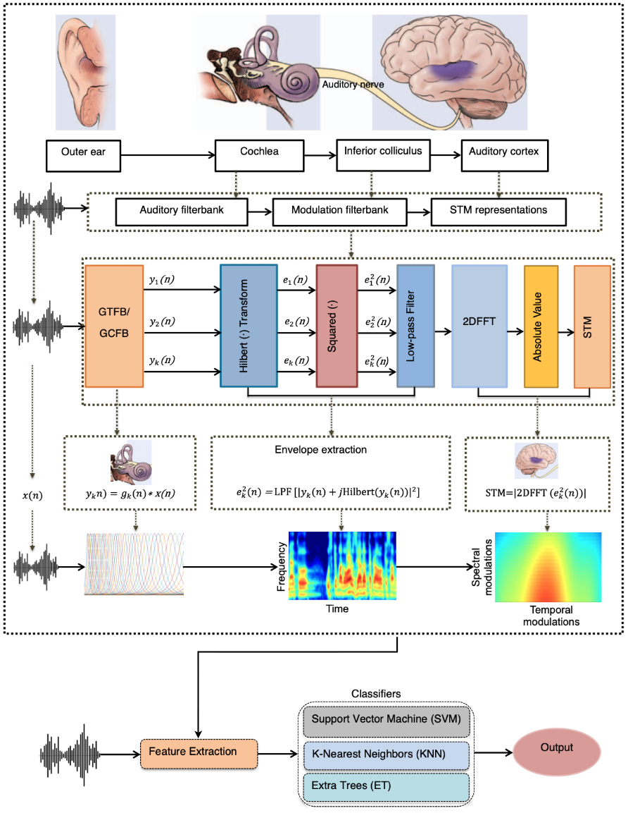
*Figure 1:Block diagram of STM representation framework illustrating the correspondence between human auditory processing and its computational modeling.*

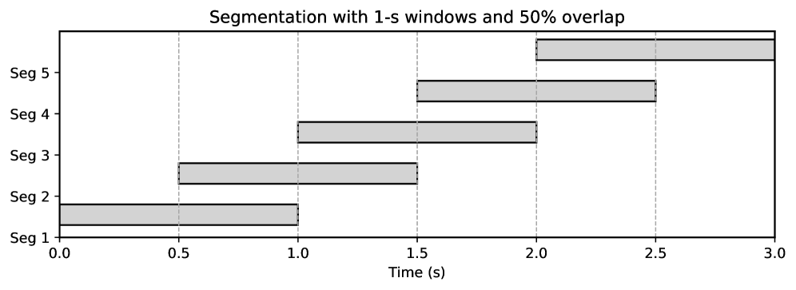
*Figure 2:Segmentation scheme with 1-s windows and 50% overlap.*

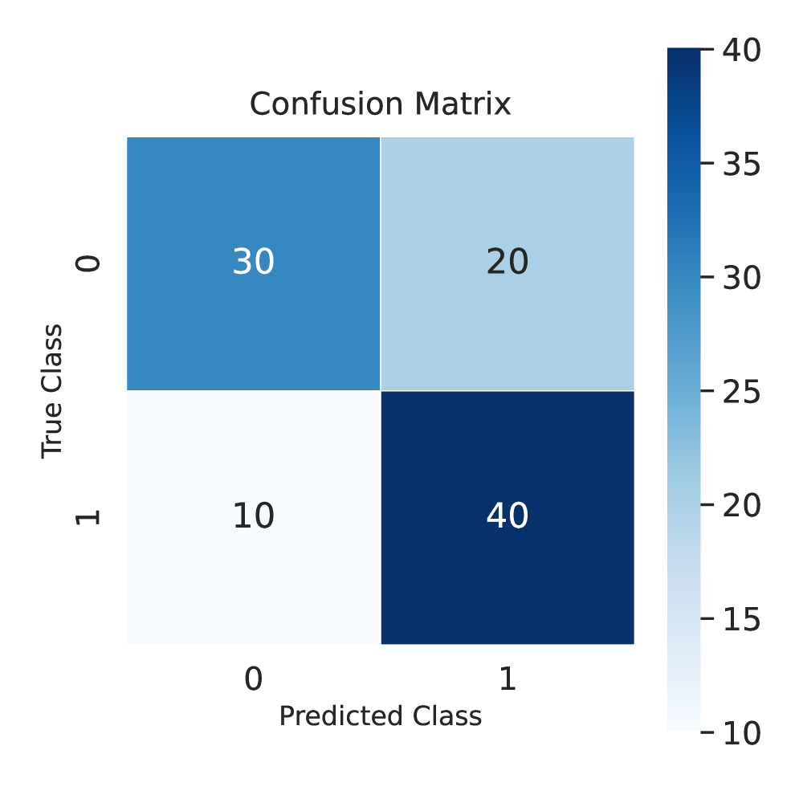
*Figure 3:Confusion matrices showing classification performance for human evaluation and STM-based representations. The STM(GCFB) model demonstrates perceptual alignment with human judgments, particularly in correctly identifying imitated speech.*

---
**Usage Info**: 5078 tokens used.
**Generated at**: 2026-04-28 16:09:00

---

# 📚 MotionHiFlow: Text-to-Motion via Hierarchical Flow Matching

🚀 URL: https://arxiv.org/html/2604.23264

## 🌏 Abstract (원문)
Text-to-motion generation aims to generate 3D human motions that are tightly aligned with the input text while remaining physically plausible and rich in fine-grained detail. Although recent approaches can produce complex and natural movements, they usually operate at only one temporal scale, which limits both semantic alignment and temporal coherence. Inspired by the fact that complex motions are conceptualized hierarchically rather than at a single temporal scale in the human cognitive system, we proposeMotionHiFlow, a hierarchical flow matching framework to generate motion progressively by constructing flow path from low to high temporal scales. The flows at lower scales capture high-level semantics and coarse motion structures, while flows at higher scales refine temporal details. To link the flows across scales, we introduce a novel cross-scale transition process, ensuring continuity and preserving noise consistency. Furthermore, by integrating a Text-Motion Diffusion Transformer and a topology-aware Motion VAE, MotionHiFlow explicitly models structural dependencies among joints via joint-aware positional encoding and skeletal topology, enabling precise semantic alignment alongside fine-grained motion details. Extensive experiments on HumanML3D and KIT-ML benchmarks demonstrate state-of-the-art performance, with ablation studies confirming the effectiveness of the hierarchical design and key components. Code is available athttps://github.com/ai-lh/MotionHiFlow.
## 🌏 Abstract (번역)
텍스트-모션 생성은 입력 텍스트와 밀접하게 정렬되면서 물리적으로 그럴듯하고 미세한 디테일이 풍부한 3D 인간 모션을 생성하는 것을 목표로 합니다. 최근 접근 방식들은 복잡하고 자연스러운 움직임을 생성할 수 있지만, 일반적으로 단일 시간 스케일에서만 작동하여 의미론적 정렬과 시간적 일관성을 모두 제한합니다. 복잡한 모션이 인간 인지 시스템에서 단일 시간 스케일이 아닌 계층적으로 개념화된다는 사실에 영감을 받아, 우리는 낮은 시간 스케일에서 높은 시간 스케일로 플로우 경로를 구성하여 모션을 점진적으로 생성하는 계층적 플로우 매칭 프레임워크인 MotionHiFlow를 제안합니다. 낮은 스케일의 플로우는 높은 수준의 의미론과 거친 모션 구조를 포착하는 반면, 높은 스케일의 플로우는 시간적 세부 사항을 정교하게 다듬습니다. 스케일 간의 플로우를 연결하기 위해 우리는 연속성을 보장하고 노이즈 일관성을 유지하는 새로운 교차 스케일 전환 프로세스를 도입합니다. 또한, Text-Motion Diffusion Transformer와 토폴로지 인식 Motion VAE를 통합함으로써, MotionHiFlow는 조인트 인식 위치 인코딩과 골격 토폴로지를 통해 조인트 간의 구조적 의존성을 명시적으로 모델링하여 미세한 모션 디테일과 함께 정확한 의미론적 정렬을 가능하게 합니다. HumanML3D 및 KIT-ML 벤치마크에 대한 광범위한 실험은 최첨단 성능을 입증했으며, 제거 연구를 통해 계층적 설계 및 주요 구성 요소의 효과를 확인했습니다. 코드는 https://github.com/ai-lh/MotionHiFlow에서 확인할 수 있습니다.

## 🔍 Methods & Results
- MotionHiFlow는 텍스트 쿼리로부터 3D 인간 포즈 시퀀스를 생성하는 계층적 플로우 매칭 프레임워크로, Motion VAE에 의해 인코딩된 잠재 공간에서 낮은 시간 스케일에서 높은 시간 스케일로 점진적으로 모션을 생성한다.
- 초기 단계는 높은 수준의 의미론과 거친 모션 구조를 포착하고, 후기 단계는 미세한 시간적 세부 사항을 추가한다.
- 새로운 교차 스케일 전환(denoising-upsampling-renoising) 프로세스를 통해 스케일 간의 연속성을 보장하고 노이즈 일관성을 유지한다.
- Motion VAE는 GCN(Graph Convolutional Networks)을 사용하여 인체 토폴로지를 명시적으로 캡처하여 모션을 잠재 공간으로 인코딩한다.
- Text-Motion Diffusion Transformer (TMDiT)는 텍스트에 조건화된 계층적 플로우를 모델링하며, 조인트 인식 위치 인코딩(Joint RoPE)을 통해 조인트 간의 구조적 의존성을 통합한다.
- Joint RoPE는 회전 위치 임베딩(Rotary Position Embedding)을 골격 모션 생성에 최적화하여 시간적 변위, 상대 공간 좌표 및 운동학적 트리 구조에서 파생된 회전을 통합하고 골격 대칭을 적용한다.
- 훈련은 Motion VAE를 먼저 훈련한 다음, 계층적 플로우 매칭 손실과 분류기 없는 안내(CFG)를 사용하여 TMDiT를 훈련하는 두 단계로 진행된다.
- HumanML3D 및 KIT-ML 벤치마크에서 최첨단 성능을 달성했으며, 계층적 설계 및 주요 구성 요소의 효과는 제거 연구를 통해 확인되었다.

## 🖼 Figures
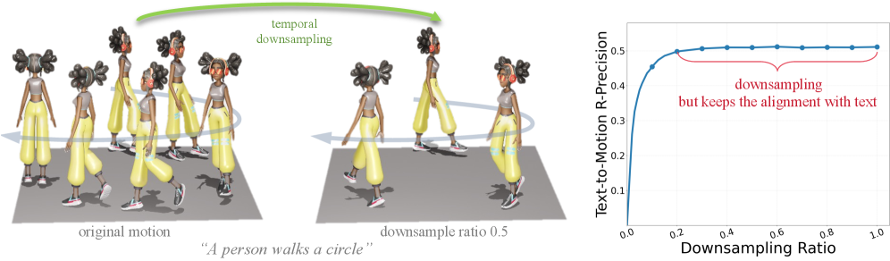
*Figure 1: Text-to-Motion retrieval precision under different downsampling ratios. The R-precision remains stable as the down-sampling ratio decrease, which means that models trained on coarse motions can achieve robust semantic alignment.*

![Figure 2:Overview of our MotionHiFlow, which progressively generates motion from low to high temporal scales across multiple stages. The early stages mainly capture high-level semantics and coarse motion structures, while later stages model fine-grained temporal details via cross-scale transition and flow operators. The points along the gradient-colored dashed line in the inset (bottom left) of (a) and in (b) denotes a linear interpolation between its endpoints. Down/Up denotes downsampling/upsampling, respectively.](../images/2026-04-28/2604.23264/2604.23264_fig1.png)
*Figure 2:Overview of our MotionHiFlow, which progressively generates motion from low to high temporal scales across multiple stages. The early stages mainly capture high-level semantics and coarse motion structures, while later stages model fine-grained temporal details via cross-scale transition and flow operators. The points along the gradient-colored dashed line in the inset (bottom left) of (a) and in (b) denotes a linear interpolation between its endpoints. Down/Up denotes downsampling/upsampling, respectively.*

*Figure 3:Illustration of two main components in our TMDiT. (a) The TMDiT block employs two separate streams that independently process motion and text features, while self-attention and shared parameters enables information exchange between streams. (b) The Joint RoPE integrates rotations derived from temporal displacement, relative spatial coordinates, and the human body topologies. Here, 
𝑥
𝑗
 and 
𝑦
𝑗
 denote the 
𝑗
-th joint’s coordinates in the 
𝑥
​
𝑦
-plane.*

*Figure 4:Visual comparisons between different methods given three distinct text descriptions. Only key frames are displayed, with arrows indicating the character’s movement direction. Green lines denote correct directions, while red lines indicate incorrect directions that do not match the text content. Refer to the demo video for complete motion clips and more visualization results.*

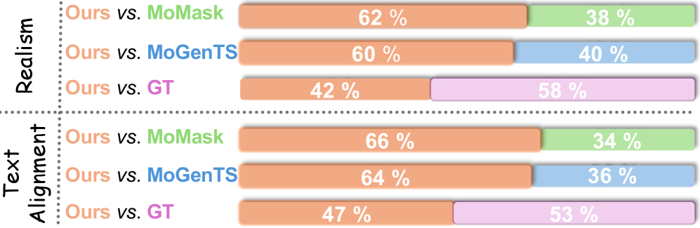
*Figure 5:Results of a user study comparing the realism and text alignment of various methods, including our approach, with baseline competitors (MoMask, MoGenTS), and Ground Truth.*

---
**Usage Info**: 5664 tokens used.
**Generated at**: 2026-04-28 16:09:32

---

# 📚 Scaling Properties of Continuous Diffusion Spoken Language Models

🚀 URL: https://arxiv.org/html/2604.24416

## 🌏 Abstract (원문)
Speech-onlyspoken language models (SLMs) lag behind text and text-speech models in performance, with recent discrete autoregressive (AR) SLMs indicating significant computational and data demands to match text models. Since discretizing continuous speech for AR creates bottlenecks, we explore whethercontinuous diffusion (CD) SLMis more viable. To quantify the SLMs linguistic quality, we introduce the phoneme Jensen-Shannon divergence (pJSD) metric. Our analysis reveals CD SLMs, mirroring AR behavior, exhibit scaling laws for validation loss and pJSD, and show optimal token-to-parameter ratios decreasing as compute scales. However, for the latter, loss becomes insensitive to choice of data and model sizes, showing potential for fast inference. Scaling CD SLMs to 16B parameters with tens of millions of hours of conversational data enables generation of emotive, prosodic, multi-speaker, multilingual speech, though achieving long-form coherence remains a significant challenge.
## 🌏 Abstract (번역)
음성 전용 음성 언어 모델(SLM)은 성능 면에서 텍스트 및 텍스트-음성 모델에 뒤처지며, 최근의 이산 자기회귀(AR) SLM은 텍스트 모델과 동등한 수준에 도달하기 위해 상당한 계산 및 데이터 요구 사항을 나타냅니다. AR을 위해 연속적인 음성을 이산화하는 것이 병목 현상을 일으키므로, 우리는 연속 확산(CD) SLM이 더 실현 가능한지 탐구합니다. SLM의 언어적 품질을 정량화하기 위해 우리는 음소 젠슨-섀넌 발산(pJSD) 측정항목을 도입합니다. 우리의 분석에 따르면 CD SLM은 AR 동작을 반영하여 검증 손실 및 pJSD에 대한 스케일링 법칙을 나타내며, 계산 규모가 커짐에 따라 최적의 토큰-대-매개변수 비율이 감소함을 보여줍니다. 그러나 후자의 경우, 손실은 데이터 및 모델 크기 선택에 둔감해져 빠른 추론 가능성을 보여줍니다. CD SLM을 수천만 시간의 대화 데이터로 160억 매개변수까지 확장하면 감성적이고 운율적이며 다중 화자, 다국어 음성 생성이 가능하지만, 장문 일관성을 달성하는 것은 여전히 중요한 과제로 남아 있습니다.

## 🔍 Methods & Results
- 음성 전용 음성 언어 모델(SLM)의 성능이 텍스트 및 텍스트-음성 모델에 뒤처지는 문제를 해결하기 위해 연속 확산(CD) SLM의 실현 가능성을 탐구했습니다.
- SLM의 언어적 품질을 정량화하기 위해 음소 젠슨-섀넌 발산(pJSD) 측정항목을 도입했습니다.
- CD SLM은 이산 자기회귀(AR) 모델과 유사하게 검증 손실 및 pJSD에 대한 스케일링 법칙을 나타냈습니다.
- 계산 규모가 커짐에 따라 최적의 토큰-대-매개변수 비율이 감소하는 경향을 보였습니다.
- 최적의 비율에서 손실이 데이터 및 모델 크기 선택에 둔감해져 빠른 추론 가능성을 시사했습니다.
- CD SLM을 160억 매개변수와 수천만 시간의 대화 데이터로 확장하여 감성적이고 운율적이며 다중 화자, 다국어 음성 생성이 가능함을 입증했습니다.
- 장문 일관성을 달성하는 것은 여전히 중요한 과제로 남아있습니다.

## 🖼 Figures
![Figure 1: (Left) Scaling law fit for validation loss. Training (
∙
) and testing (
×
) points are shown alongside compute-optimal points (
⋆
). (Right) The curvature 
𝜅
 of isoFLOPs at their optima decreases as compute increases: flattening corresponds to approximately 
2
 orders of magnitude expansion in the range of model (
Δ
​
𝑁
) and dataset (
Δ
​
𝐷
) sizes yielding a loss within 
𝜖
 of the optimum 
𝐿
∗
. Thus, higher computes allow near-optimal performance across a much wider variety of parameter-to-data allocations, opening up an efficient inference frontier.](../images/2026-04-28/2604.24416/2604.24416_fig0.png)
*Figure 1: (Left) Scaling law fit for validation loss. Training (
∙
) and testing (
×
) points are shown alongside compute-optimal points (
⋆
). (Right) The curvature 
𝜅
 of isoFLOPs at their optima decreases as compute increases: flattening corresponds to approximately 
2
 orders of magnitude expansion in the range of model (
Δ
​
𝑁
) and dataset (
Δ
​
𝐷
) sizes yielding a loss within 
𝜖
 of the optimum 
𝐿
∗
. Thus, higher computes allow near-optimal performance across a much wider variety of parameter-to-data allocations, opening up an efficient inference frontier.*

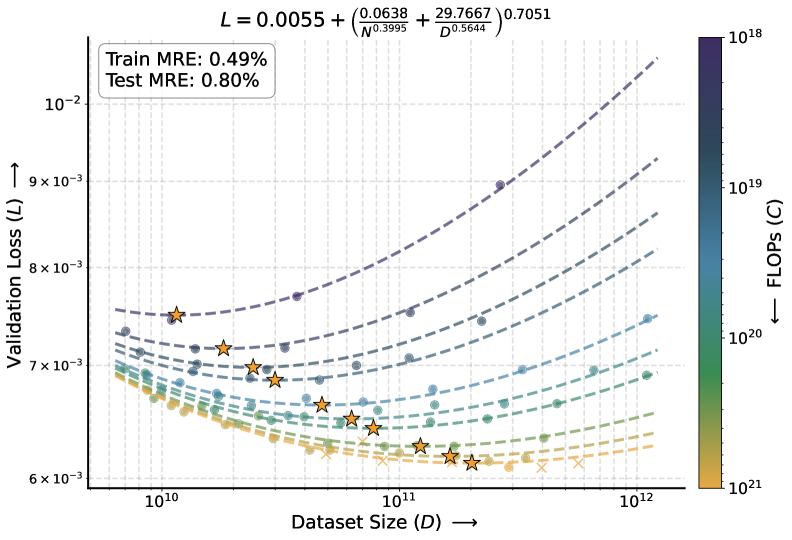
*Figure 2*

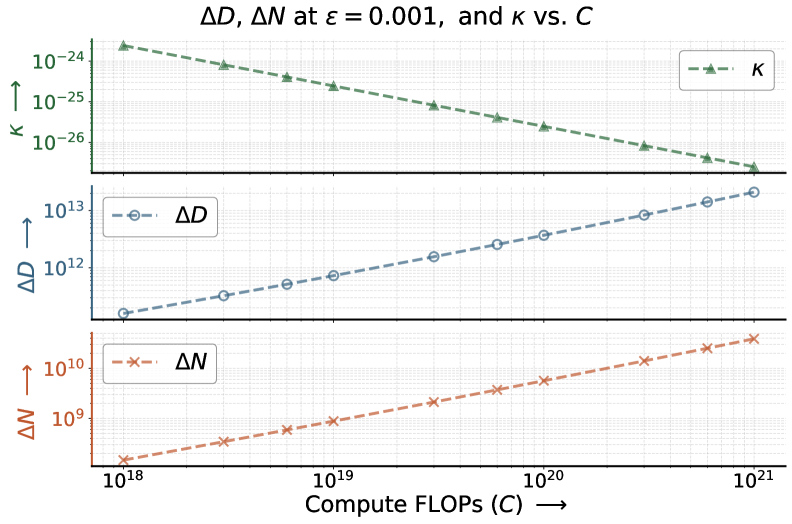
*Figure 3*

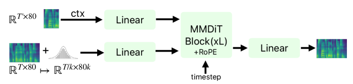
*Figure 2:Continuous diffusion SLM architecture.*

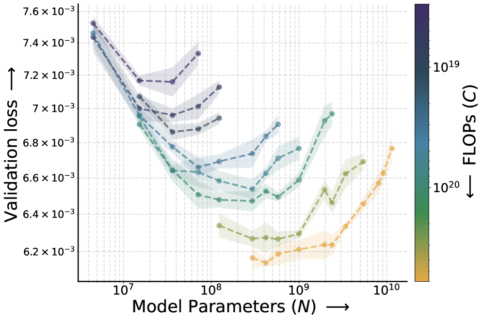
*(a) Validation loss.*

*(a) Validation loss.*

*(b) 
1
−
gram pJSD.*

*(c) 
5
-gram pJSD.*

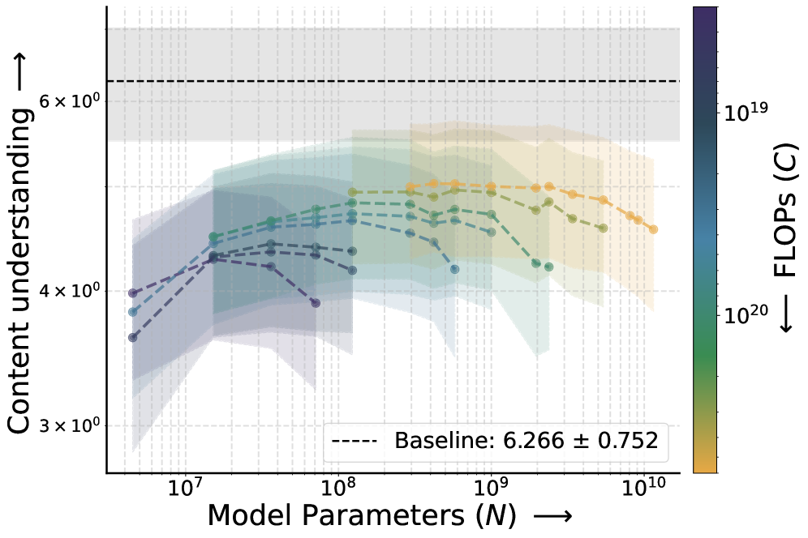
*(d) Content Understanding.*

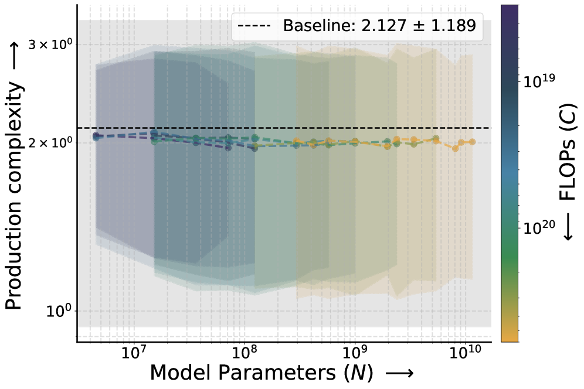
*(e) Production Complexity.*

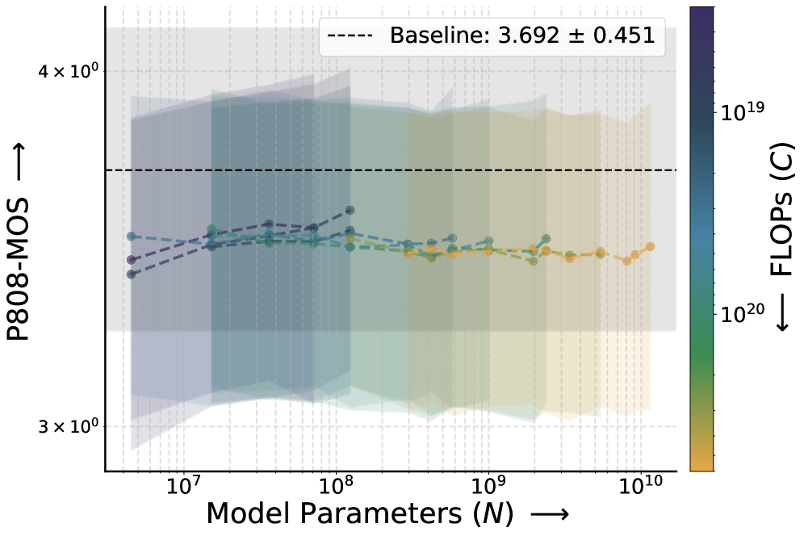
*(f) P808-MOS.*

*Figure 4: Dependence between optimal tokens-per-parameter ratio 
𝑟
∗
=
𝐷
∗
/
𝑁
∗
 and compute budget 
𝐶
. When 
𝐶
>
𝐶
‡
=
5.64
⋅
10
19
, we observe 
𝑟
∗
<
400
.*

*(a)*

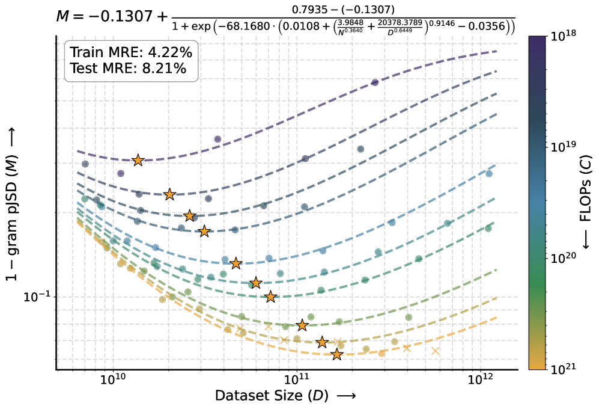
*(a)*

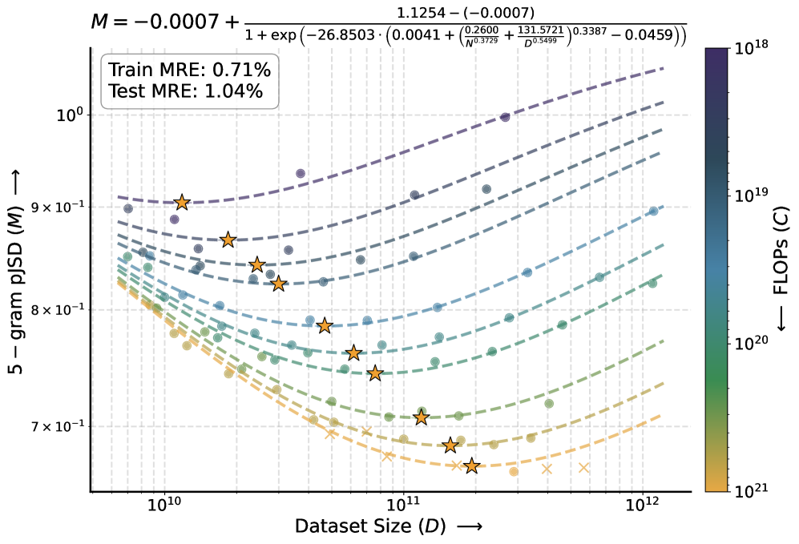
*(b)*

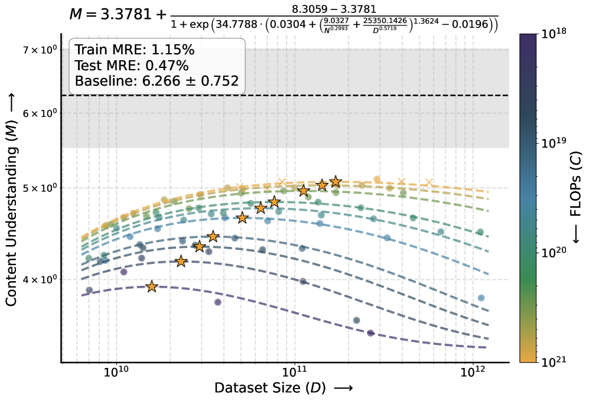
*(c)*

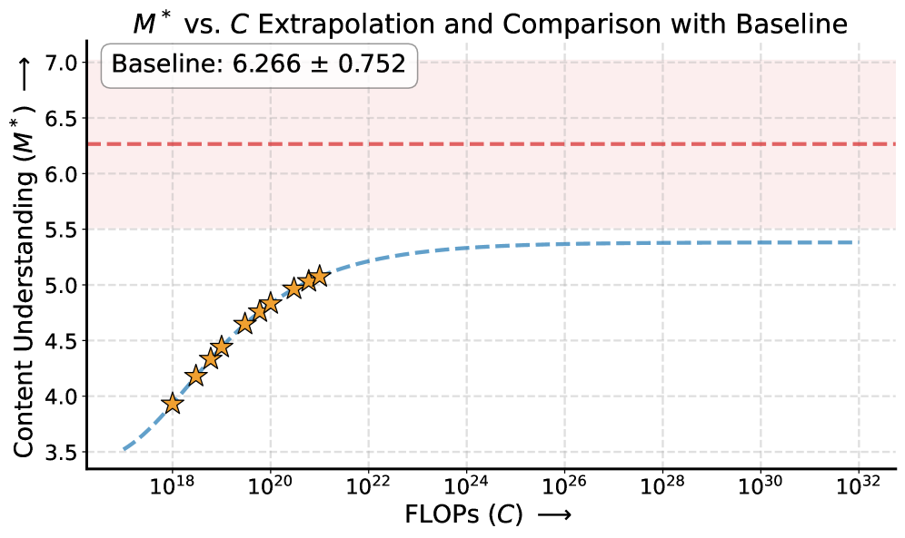
*(d)*

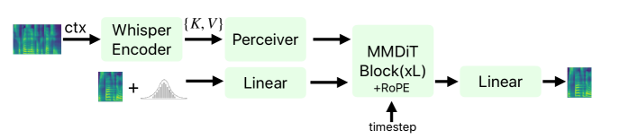
*Figure 7:Whisper conditioned CD SLM architecture.*

---
**Usage Info**: 2026 tokens used.
**Generated at**: 2026-04-28 16:09:43

---

# 📚 Submitted to Interspeech 2026. Speech Enhancement Based on Drifting Models

🚀 URL: https://arxiv.org/html/2604.24199

## 🌏 Abstract (원문)
We propose Speech Enhancement based on Drifting Models (DriftSE), a novel generative framework that formulates denoising as an equilibrium problem. Rather than relying on iterative sampling, DriftSE natively achieves one-step inference by evolving the pushforward distribution of a mapping function to directly match the clean speech distribution. This evolution is driven by a Drifting Field, a learned correction vector that guides samples toward the high-density regions of the clean distribution, which naturally facilitates training on unpaired data by matching distributions rather than paired samples. We investigate the framework under two formulations: a direct mapping from the noisy observation, and a stochastic conditional generative model from a Gaussian prior. Experiments on the VoiceBank-DEMAND benchmark demonstrate that DriftSE achieves high-fidelity enhancement in a single step, outperforming multi-step diffusion baselines and establishing a new paradigm for speech enhancement.
## 🌏 Abstract (번역)
본 논문에서는 노이즈 제거를 평형 문제로 공식화하는 새로운 생성 프레임워크인 Drifting Models 기반 음성 향상(DriftSE)을 제안한다. DriftSE는 반복적인 샘플링에 의존하는 대신, 매핑 함수의 푸시포워드 분포를 진화시켜 깨끗한 음성 분포와 직접 일치시킴으로써 원스텝 추론을 기본적으로 달성한다. 이러한 진화는 깨끗한 분포의 고밀도 영역으로 샘플을 안내하는 학습된 보정 벡터인 Drifting Field에 의해 구동되며, 이는 쌍을 이루는 샘플 대신 분포를 일치시킴으로써 비쌍 데이터에 대한 훈련을 자연스럽게 용이하게 한다. 우리는 이 프레임워크를 두 가지 공식으로 조사한다: 노이즈가 있는 관측치로부터의 직접 매핑, 그리고 가우시안 사전 분포로부터의 확률적 조건부 생성 모델. VoiceBank-DEMAND 벤치마크에 대한 실험은 DriftSE가 단일 단계에서 고음질 향상을 달성하고, 다단계 확산(diffusion) 기준선을 능가하며, 음성 향상을 위한 새로운 패러다임을 확립함을 보여준다.

## 🔍 Methods & Results
- DriftSE는 노이즈 제거를 평형 문제로 공식화하는 새로운 생성 프레임워크로, 반복 샘플링 없이 매핑 함수의 푸시포워드 분포를 진화시켜 깨끗한 음성 분포와 직접 일치시키는 원스텝 추론을 달성한다.
- 생성 모델링을 푸시포워드 분포의 훈련 시간 진화로 정의하는 Drifting Models를 기반으로 하며, 소스 분포(예: 가우시안 노이즈)에서 샘플 'epsilon'을 매핑 함수 'f_theta'를 통해 타겟 변수 'x'로 변환하여 푸시포워드 분포 'q_theta'를 생성한다.
- Drifting Field ('V_p,q')는 'q_theta'를 타겟 데이터 분포 'p_data'로 유도하는 학습된 보정 벡터로, 'x_target = x + V_p,q(x)'를 통해 생성기가 'epsilon'을 'x_target'에 매핑하도록 훈련된다.
- 훈련이 진행됨에 따라 푸시포워드 분포 'q_theta'는 드리프트 'V_p,q'가 사라지는 분포적 평형 상태에 도달한다.
- Drifting Field 'V_p,q(x)'는 데이터 분포 'p_data'로 샘플을 끌어당기는 'V_p+'와 현재 모델 분포 'q_theta'의 고밀도 영역에서 샘플을 밀어내는 'V_q-'의 두 가지 상반된 힘으로 분해된다.
- 두 힘은 커널 가중 평균 이동 형태로 결합되며, 지수 유사성 커널 'k(x,y) = exp(sim(x,y)/tau)'를 사용하여 'V(x)'를 계산한다.
- 생성기 'f_theta'는 'L = ||f_theta(epsilon) - sg(f_theta(epsilon) + V(f_theta(epsilon)))||^2' 목표를 통해 최적화되며, 이는 'q_theta'를 'p_data'로 점진적으로 이동시킨다.
- VoiceBank-DEMAND 벤치마크 실험 결과, DriftSE는 단일 단계에서 고음질 음성 향상을 달성했으며, 다단계 확산(diffusion) 기반 모델보다 우수한 성능을 보였다.

## 🖼 Figures
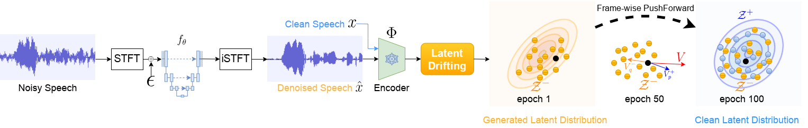
*Figure 1:Overview of the DriftSE framework (illustrating the Direct Mapping formulation).*

*Figure 2:Evolution of frame-level distributions in the DistilHuBERT semantic space for a fixed test utterance. Each panel displays 2D density contours (PCA projection) derived from all frames across different training epochs. Stars denote the corresponding centroids, which represent the mean of all projected frames. As training progresses, the generated distribution shifts from the noisy distribution toward the clean distribution.*

---
**Usage Info**: 3958 tokens used.
**Generated at**: 2026-04-28 16:09:57

---

# 📚 RTCFake: Speech Deepfake Detection in Real-Time Communication

🚀 URL: https://arxiv.org/html/2604.23742

## 🌏 Abstract (원문)
With the rapid advancement of speech generation technologies, the threat posed by speech deepfakes in real-time communication (RTC) scenarios has intensified. However, existing detection studies mainly focus on offline simulations and struggle to cope with the complex distortions introduced during RTC transmission, including unknown speech enhancement processes (e.g., noise suppression) and codec compression. To address this challenge, we present the first large-scale speech deepfake dataset tailored for RTC scenarios, termedRTCFake, totaling approximately 600 hours. The dataset is constructed by transmitting speech through multiple mainstream social media and conferencing platforms (e.g., Zoom), enabling precise pairing between offline and online speech. In addition, we propose a phoneme-guided consistency learning (PCL) strategy that enforces models to learn platform-invariant semantic structural representations. In this paper, the RTCFake dataset is divided into training, development, and evaluation sets. The evaluation set further includes both unseen RTC platforms and unseen complex noise conditions, thereby providing a more realistic and challenging evaluation benchmark for speech deepfake detection. Furthermore, the proposed PCL strategy achieves significant improvements in both cross-platform generalization and noise robustness, offering an effective and generalizable modeling paradigm. TheRTCFakedataset is provided in thehttps://huggingface.co/datasets/JunXueTech/RTCFake.
## 🌏 Abstract (번역)
음성 생성 기술의 급속한 발전과 함께 실시간 통신(RTC) 시나리오에서 음성 딥페이크가 제기하는 위협이 심화되고 있습니다. 그러나 기존 탐지 연구는 주로 오프라인 시뮬레이션에 초점을 맞추고 있으며, 알 수 없는 음성 향상 프로세스(예: 노이즈 억제) 및 코덱 압축을 포함하여 RTC 전송 중에 발생하는 복잡한 왜곡에 대처하는 데 어려움을 겪고 있습니다. 이러한 문제를 해결하기 위해, 우리는 RTC 시나리오에 맞춰진 최초의 대규모 음성 딥페이크 데이터셋인 RTCFake를 약 600시간 규모로 제시합니다. 이 데이터셋은 여러 주류 소셜 미디어 및 회의 플랫폼(예: Zoom)을 통해 음성을 전송하여 오프라인 및 온라인 음성 간의 정확한 페어링을 가능하게 함으로써 구축되었습니다. 또한, 우리는 모델이 플랫폼 불변의 의미론적 구조 표현을 학습하도록 강제하는 음소 기반 일관성 학습(PCL) 전략을 제안합니다. 본 논문에서 RTCFake 데이터셋은 훈련, 개발 및 평가 세트로 나뉩니다. 평가 세트는 미지의 RTC 플랫폼과 미지의 복잡한 노이즈 조건을 모두 포함하여 음성 딥페이크 탐지를 위한 보다 현실적이고 도전적인 평가 벤치마크를 제공합니다. 더욱이, 제안된 PCL 전략은 교차 플랫폼 일반화 및 노이즈 강건성 모두에서 상당한 개선을 달성하여 효과적이고 일반화 가능한 모델링 패러다임을 제공합니다. RTCFake 데이터셋은 https://huggingface.co/datasets/JunXueTech/RTCFake에서 제공됩니다.

## 🔍 Methods & Results
- RTC 시스템은 코덱 압축 및 노이즈 억제와 같은 처리 모듈을 통해 프레임 수준 표현에 심각한 분포 변화를 유발하지만, 음소 표현은 프레임 표현보다 훨씬 높은 안정성과 일관성을 보인다.
- RTC 시스템이 음향 충실도보다 의미론적 명료성을 우선시하므로, 언어 콘텐츠의 기본 단위인 음소는 교차 플랫폼 전송 중에도 우수한 일관성을 유지한다.
- 이러한 관찰을 바탕으로, 오프라인 및 온라인 표현 간의 의미론적 구조 단위(음소) 수준에서 불변성을 강제하는 음소 기반 일관성 학습(PCL) 전략을 제안한다.
- PCL 전략은 공유 특징 추출기를 사용하여 프레임 수준 음향 표현을 얻고, 음소 인식 모델로 프레임 수준 음소 경계를 예측한 후, 각 음소 경계 내 프레임의 시간 평균 풀링을 통해 음소 수준 표현을 계산한다.
- 페어링된 오프라인-온라인 음소 수준 특징 간의 양방향 일관성 제약(평균 제곱 오차 최소화)을 도입하여 표현 일관성을 강화한다.
- 전체 훈련 목표는 분류 손실(교차 엔트로피)과 음소 수준 일관성 학습 항을 결합하여, 판별 능력과 다양한 전송 조건에 걸친 표현 일관성을 동시에 보장한다.
- 제안된 PCL 전략은 교차 플랫폼 일반화 및 노이즈 강건성 모두에서 상당한 개선을 달성하여 효과적이고 일반화 가능한 모델링 패러다임을 제공한다.

## 🖼 Figures
![Figure 1:Illustration of different speech deepfake dataset construction pipelines. (a) Previous datasets mainly rely on simulated distortions, such as codec-based transmission, to model communication effects. (b) The proposed RTCFake dataset is constructed under real-world black-box transmission conditions, where communication over mainstream social media platforms typically involves key distortion sources, including noise suppression, echo cancellation, codec encoding and decoding, and packet loss during network transmission.](../images/2026-04-28/2604.23742/2604.23742_fig0.png)
*Figure 1:Illustration of different speech deepfake dataset construction pipelines. (a) Previous datasets mainly rely on simulated distortions, such as codec-based transmission, to model communication effects. (b) The proposed RTCFake dataset is constructed under real-world black-box transmission conditions, where communication over mainstream social media platforms typically involves key distortion sources, including noise suppression, echo cancellation, codec encoding and decoding, and packet loss during network transmission.*

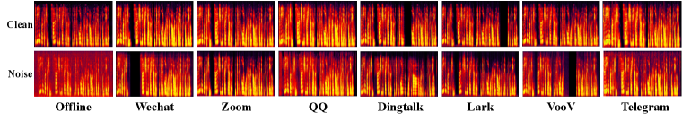
*Figure 2:Amplitude spectrograms of the same utterance under offline and multiple online transmission conditions. The top row shows the clean speech, while the bottom row shows the corresponding noisy speech.*

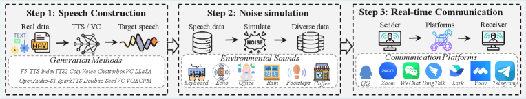
*Figure 3:Offline data construction and real-time communication transmission pipeline*

*Figure 4:Comparison of offline–online representation similarity at frame-level Babu et al. (2022) and phoneme-level Xu et al. (2022) on the RTCFake training set. Phoneme-level representations show higher mean similarity and lower variance, indicating better stability.*

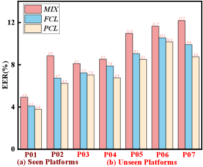
*Figure 5:Performance comparison of mix training (MIX), frame-level consistency learning (FCL), and phoneme-level consistency learning (PCL) across seen and unseen communication platforms.*

*Figure 6:Comparison of FCL and PCL consistency learning on offline and online evaluation sets. Colored curves denote the mean EER across multiple runs under different values of the regularization weight 
𝜆
, while the shaded regions indicate the corresponding minimum–maximum range.*

---
**Usage Info**: 2696 tokens used.
**Generated at**: 2026-04-28 16:10:06

---

# 📚 AMAVA: Adaptive Motion-Aware Video-to-Audio Framework for Visually-Impaired Assistance

🚀 URL: https://arxiv.org/html/2604.23909

## 🌏 Abstract (원문)
Navigational aids for blind and low vision individuals struggle conveying dynamic real-world environments, leading to cognitive overload from continuous, undifferentiated feedback. We present AMAVA, a novel real-time video-to-audio framework that converts mobile device video into contextually relevant sound effects or text-to-speech descriptions. We propose a motion-aware pipeline using a lightweight AI classification model to distinguish between low and high-movement scenes followed by a real-time text-to-audio synthesis pipeline to enhance environmental perception more efficiently. In static environments, AMAVA generates spoken audio scene descriptions for situational awareness. In high-movement situations, it prioritizes safety by delivering sound cues, such as spoken hazard alerts and environmental sound effects. These audio outputs are produced by a decoder-only transformer-based vision-language model with mixture-of-experts and cross-modal attention for visual understanding, in conjunction with a neural text-to-speech and natural sound synthesis networks. The proposed framework uses prompt-based caching and category-specific throttling to avoid auditory clutter and minimize latency. We present a comprehensive evaluation of the system, including a real-time navigation study comparing a white cane alone versus with AMAVA, that shows a significant increase in user confidence and perceived safety.
## 🌏 Abstract (번역)
시각 장애인 및 저시력자를 위한 내비게이션 보조 장치는 동적인 실제 환경을 전달하는 데 어려움을 겪으며, 지속적이고 차별화되지 않은 피드백으로 인해 인지 과부하를 초래합니다. 본 논문에서는 모바일 장치 비디오를 상황에 맞는 음향 효과 또는 텍스트 음성 변환 설명으로 변환하는 새로운 실시간 비디오-오디오 프레임워크인 AMAVA를 소개합니다. 우리는 경량 AI 분류 모델을 사용하여 낮은 움직임과 높은 움직임 장면을 구별한 다음, 환경 인식을 보다 효율적으로 향상시키기 위한 실시간 텍스트-오디오 합성 파이프라인을 사용하는 움직임 인식 파이프라인을 제안합니다. 정적인 환경에서 AMAVA는 상황 인식을 위해 음성 오디오 장면 설명을 생성합니다. 높은 움직임 상황에서는 음성 위험 경고 및 환경 음향 효과와 같은 음향 신호를 제공하여 안전을 우선시합니다. 이러한 오디오 출력은 시각적 이해를 위한 전문가 혼합 및 교차 모달 어텐션을 갖춘 디코더 전용 트랜스포머 기반 비전-언어 모델과 신경 텍스트 음성 변환 및 자연 음향 합성 네트워크를 결합하여 생성됩니다. 제안된 프레임워크는 청각적 혼란을 피하고 지연 시간을 최소화하기 위해 프롬프트 기반 캐싱 및 카테고리별 스로틀링을 사용합니다. 우리는 AMAVA와 함께 흰 지팡이만 사용하는 경우를 비교하는 실시간 내비게이션 연구를 포함하여 시스템에 대한 포괄적인 평가를 제시하며, 이는 사용자 신뢰도와 인지된 안전성의 상당한 증가를 보여줍니다.

## 🔍 Methods & Results
- AMAVA는 브라우저 기반 프런트엔드와 Python 기반 백엔드 서버로 구성되며, WebSocket을 통해 연결됩니다.
- 프런트엔드는 사용자 카메라에서 초당 2프레임(2Hz)으로 프레임을 캡처하여 백엔드로 실시간 전송하고, 백엔드는 이를 초당 2프레임 배치로 버퍼링합니다.
- 경량 모션 분류기는 각 비디오 세그먼트를 '낮은 움직임' 또는 '높은 움직임'으로 분류하여 오디오 생성 파이프라인을 분기합니다.
- 모션 분류기는 UCF101 데이터셋으로 훈련되었으며, 두 프레임 배치당 프레임 차이와 광학 흐름 크기 두 가지 모션 관련 특징을 사용합니다.
- 분류기는 2D 특징 벡터를 입력으로 받는 완전 연결 신경망(FCNN)을 사용하며, 32개 및 16개 유닛의 두 개의 ReLU 활성화 은닉층과 50% 드롭아웃, 그리고 '낮음/중간/높음' 세 가지 범주에 대한 소프트맥스 활성화 출력층을 가집니다. '중간'과 '높음'은 '높은 움직임'으로 그룹화됩니다.
- 정적인 환경에서는 Gemini (트랜스포머 기반 비전-언어 모델)와 ElevenLabs Turbo v2 (TTS)를 사용하여 15-20단어의 짧은 장면 설명을 생성합니다.
- 동적인 환경에서는 Gemini가 교차 모달 어텐션을 사용하여 장면을 'sfx', 'hazard', 'description', 'none' 중 하나로 분류하며, 위험 경고, 환경 음향 효과, 추가 설명 등을 제공하여 안전을 우선시합니다.
- 오디오 출력은 Eleven Flash v2.5 텍스트-사운드 모델로 사전 훈련된 API를 통해 TTS 캡션 또는 SFX 클립으로 요청되며 MP3 파일로 스트리밍됩니다.
- 청각적 혼란을 피하고 지연 시간을 최소화하기 위해 프롬프트 기반 캐싱(SHA-256 해시)과 카테고리별 스로틀링이 사용됩니다. SFX는 캐시된 경우에만 재생되고, TTS는 캐시 상태와 관계없이 즉시 재생됩니다.
- 캡션, 분류, 오디오 합성은 병렬로 비동기적으로 실행되어 낮은 지연 시간을 보장합니다.
- 흰 지팡이 단독 사용과 AMAVA를 함께 사용하는 경우를 비교한 실시간 내비게이션 연구에서 사용자 신뢰도와 인지된 안전성이 크게 증가했음이 입증되었습니다.

## 🖼 Figures
![Figure 1:System Overview: Our system aims to provide visually impaired users with audio feedback only when it is most relevant in order to minimize cognitive overload. The left panel shows a still scene, prompting a short descriptive caption; the right panel depicts a non-still, dynamic street, which triggers sound effects or warnings about potential hazards. By distinguishing still from non-still scenes, the system decides when to describe the environment vs. when to generate and play audio cues, offering a balance between essential information and minimal auditory clutter.](../images/2026-04-28/2604.23909/2604.23909_fig0.png)
*Figure 1:System Overview: Our system aims to provide visually impaired users with audio feedback only when it is most relevant in order to minimize cognitive overload. The left panel shows a still scene, prompting a short descriptive caption; the right panel depicts a non-still, dynamic street, which triggers sound effects or warnings about potential hazards. By distinguishing still from non-still scenes, the system decides when to describe the environment vs. when to generate and play audio cues, offering a balance between essential information and minimal auditory clutter.*

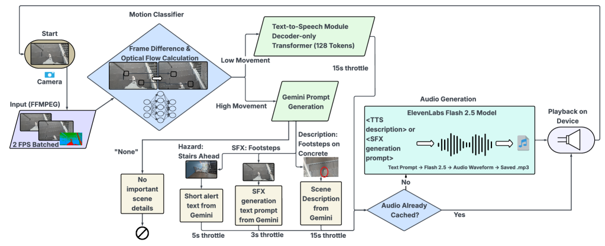
*Figure 2:System overview of the AMAVA pipeline. Camera input is batched and classified into low or high movement, triggering logic for captioning, tagging, and audio generation.*

*Figure 3:Heatmap of CLAP cosine similarity scores between generated audio SFX (rows) and their corresponding text prompts (columns). The strong diagonal indicates that the generated audio is most similar to its intended prompt. High off-diagonal values reveal semantic or acoustic confusions.*

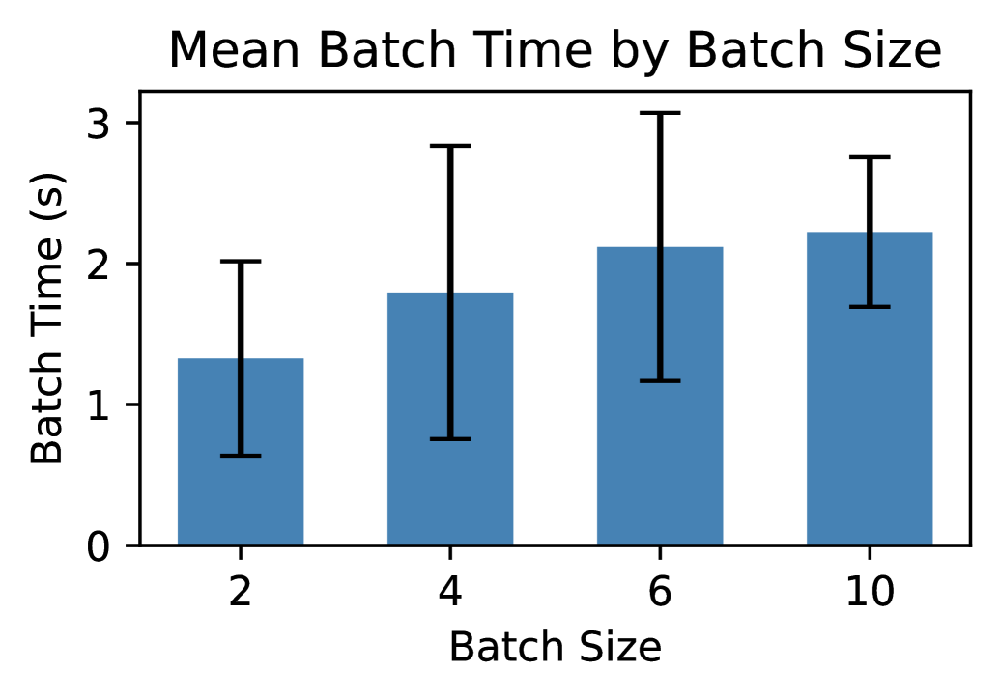
*(a)Processing Latency*

*(a)Processing Latency*

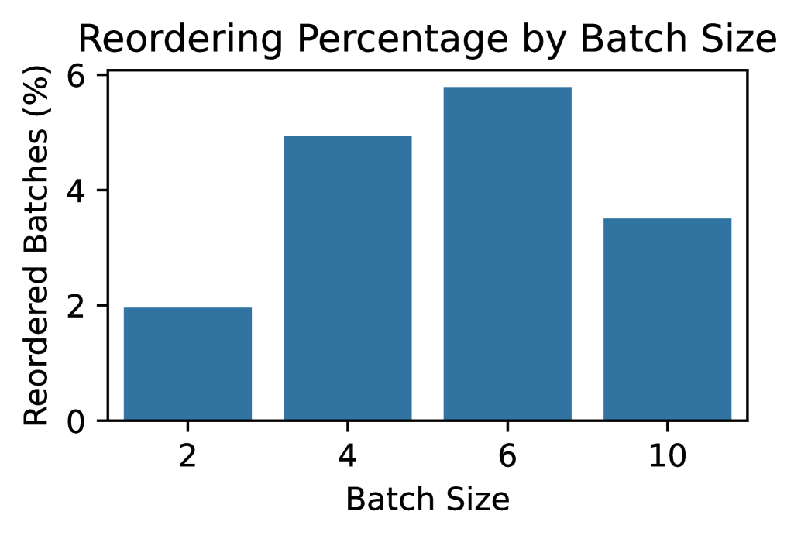
*(b)Reordering Rate*

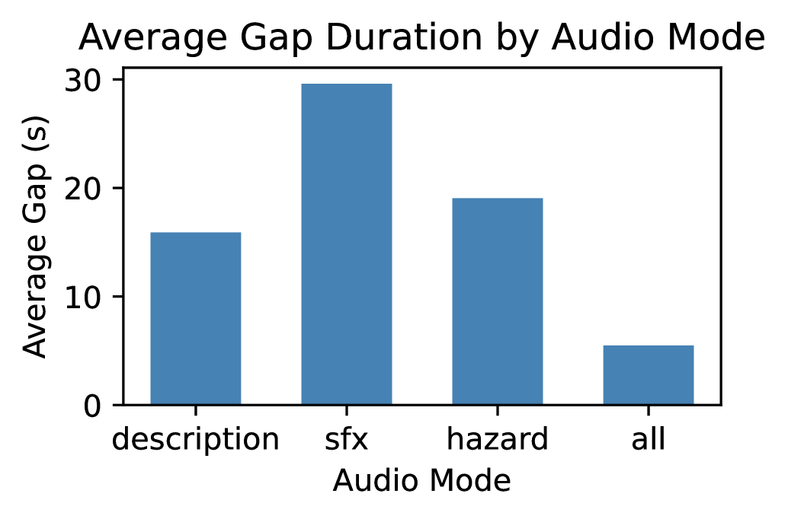
*(c)Audio Gap Duration*

---
**Usage Info**: 3280 tokens used.
**Generated at**: 2026-04-28 16:10:17

---

