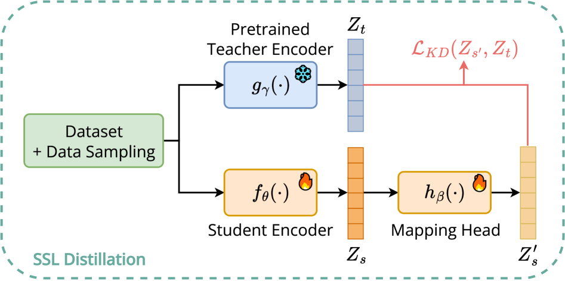
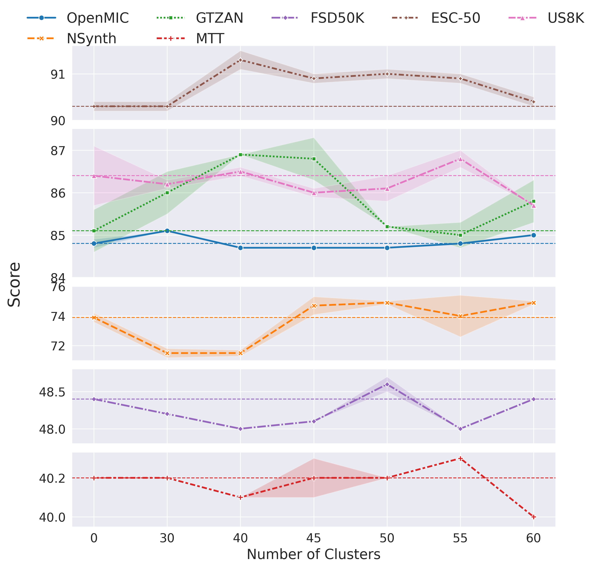
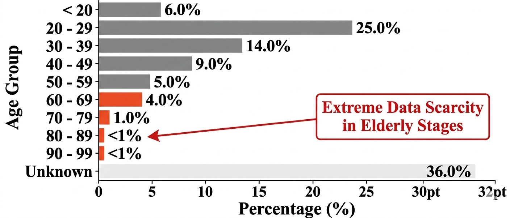

# 🚩 (2026-04-29) Scholar Inbox 추천 논문 

# 📚 Mutual Forcing: Dual-Mode Self-Evolution for Fast Autoregressive Audio-Video Character Generation

🚀 URL: https://arxiv.org/html/2604.25819

## 🌏 Abstract (원문)
In this work, we proposeMutual Forcing, a framework for fast autoregressive audio-video generation with long-horizon audio-video synchronization.Our approach addresses two key challenges: joint audio-video modeling and fast autoregressive generation.To ease joint audio-video optimization, we adopt a two-stage training strategy: we first train uni-modal generators and then couple them into a unified audio-video model for joint training on paired data.For streaming generation, we ask whether a native fast causal audio-video model can be trained directly, instead of following existing streaming distillation pipelines that typically train a bidirectional model first and then convert it into a causal generator through multiple distillation stages.Our answer is Mutual Forcing, which builds directly on native autoregressive model and integrates few-step and multi-step generation within a single weight-shared model, enabling self-distillation and improved training-inference consistency.The multi-step mode improves the few-step mode via self-distillation, while the few-step mode generates historical context during training to improve training-inference consistency; because the two modes share parameters, these two effects reinforce each other within a single model.Compared with prior approaches such as Self-Forcing, Mutual Forcing removes the need for an additional bidirectional teacher model, supports more flexible training sequence lengths, reduces training overhead, and allows the model to improve directly from real paired data rather than a fixed teacher. Experiments show that Mutual Forcing matches or surpasses strong baselines that require around 50 sampling steps while using only 4 to 8 steps, demonstrating substantial advantages in both efficiency and quality.
## 🌏 Abstract (번역)
본 연구에서는 장기적인 오디오-비디오 동기화를 갖춘 빠른 자기회귀 오디오-비디오 생성을 위한 프레임워크인 Mutual Forcing을 제안합니다. 우리의 접근 방식은 공동 오디오-비디오 모델링과 빠른 자기회귀 생성이라는 두 가지 주요 과제를 해결합니다. 공동 오디오-비디오 최적화를 용이하게 하기 위해, 우리는 2단계 훈련 전략을 채택합니다: 먼저 단일 모달 생성기를 훈련한 다음, 이를 통합된 오디오-비디오 모델로 결합하여 쌍을 이룬 데이터에 대해 공동 훈련을 수행합니다. 스트리밍 생성을 위해, 우리는 기존의 스트리밍 증류 파이프라인(일반적으로 양방향 모델을 먼저 훈련한 다음 여러 증류 단계를 통해 인과적 생성기로 변환하는 방식)을 따르지 않고, 기본적으로 빠른 인과적 오디오-비디오 모델을 직접 훈련할 수 있는지 질문합니다. 우리의 답은 Mutual Forcing입니다. 이는 기본 자기회귀 모델을 직접 기반으로 하며, 단일 가중치 공유 모델 내에서 소수 단계 및 다수 단계 생성을 통합하여 자체 증류와 훈련-추론 일관성 향상을 가능하게 합니다. 다수 단계 모드는 자체 증류를 통해 소수 단계 모드를 개선하고, 소수 단계 모드는 훈련 중 과거 컨텍스트를 생성하여 훈련-추론 일관성을 향상시킵니다. 두 모드가 매개변수를 공유하기 때문에 이 두 가지 효과는 단일 모델 내에서 서로 강화됩니다. Self-Forcing과 같은 이전 접근 방식과 비교할 때, Mutual Forcing은 추가적인 양방향 교사 모델의 필요성을 없애고, 더 유연한 훈련 시퀀스 길이를 지원하며, 훈련 오버헤드를 줄이고, 고정된 교사가 아닌 실제 쌍을 이룬 데이터로부터 모델이 직접 개선될 수 있도록 합니다. 실험 결과 Mutual Forcing은 약 50단계의 샘플링 단계를 요구하는 강력한 기준선과 동등하거나 이를 능가하며, 단 4~8단계만 사용하여 효율성과 품질 모두에서 상당한 이점을 보여주었습니다.

## 🔍 Methods & Results
- Mutual Forcing은 장기 오디오-비디오 동기화를 위한 빠른 자기회귀 오디오-비디오 생성 프레임워크로 제안되었습니다.
- 공동 오디오-비디오 모델링과 빠른 자기회귀 생성을 위해 2단계 훈련 전략을 채택합니다: 단일 모달 생성기를 사전 훈련한 후, 통합 오디오-비디오 모델로 결합하여 쌍을 이룬 데이터로 공동 미세 조정을 수행합니다.
- 스트리밍 생성을 위해 인과적 제약 하에 오디오와 비디오를 청크 단위(프레임 단위)로 점진적으로 생성하여 낮은 지연 시간과 장기적인 일관성을 유지하며, 기존 비스트리밍 방식의 한계를 극복합니다.
- 듀얼 브랜치 트랜스포머 아키텍처를 사용하여 오디오 및 비디오 토큰을 위한 두 개의 모달리티별 브랜치를 가지며, 교차 모달 상호작용 및 동기화를 위해 셀프 어텐션 계산을 융합합니다.
- 멀티모달 위치 정보를 위해 시간, 높이, 너비 좌표로 위치를 분해하는 3D RoPE(Rotary Positional Embedding) 인코딩을 도입합니다.
- 듀얼 모드 가중치 공유 모델을 통해 단일 모델 내에 다수 단계(고품질) 및 소수 단계(빠른) 모드를 통합하여 다양한 추론 예산을 지원하며, 흐름 매칭(flow matching) 기반의 조건부 확산 ODE 생성 문제로 스트리밍 예측을 공식화합니다.
- 다수 단계 모드는 자체 증류를 통해 소수 단계 모드를 개선하고, 소수 단계 모드는 훈련 중 자체 생성된 과거 컨텍스트를 사용하여 훈련-추론 일관성을 향상시킵니다. 두 모드가 매개변수를 공유하여 상호 강화되는 자체 진화(self-evolution) 학습 루프를 형성합니다.
- Self-Forcing과 같은 이전 접근 방식과 비교하여, Mutual Forcing은 추가적인 양방향 교사 모델이 필요 없고, 더 유연한 훈련 시퀀스 길이를 지원하며, 훈련 오버헤드를 줄이고, 고정된 교사가 아닌 실제 쌍을 이룬 데이터로부터 모델이 직접 개선될 수 있도록 합니다.
- 실험 결과, Mutual Forcing은 4~8단계의 샘플링 단계만 사용하여 약 50단계가 필요한 강력한 기준선과 동등하거나 이를 능가하며, 효율성과 품질 모두에서 상당한 이점을 입증했습니다.

## 🖼 Figures
![Figure 1:Illustration of Mutual Forcing. Left: Comparison between prior training paradigms and Mutual Forcing. Teacher forcing / diffusion forcing learns from real video history but suffers from training–inference mismatch. Self-Forcing replaces real history with model-inferred history, improving alignment at the cost of an additional fixed-duration bidirectional teacher, extra supervision, higher memory consumption, and limited training duration. Mutual Forcing, by contrast, starts from a native causal model rather than first training a bidirectional model and then converting it into a streaming generator through multiple distillation stages. It employs a weight-shared dual-mode design and a self-evolution strategy to unify few-step and multi-step generation within a single framework, enabling self-distillation, teacher-free training, and flexible training sequence lengths while maintaining training-inference consistency. Right: Qualitative results and key advantages of Mutual Forcing. On long-duration streaming audio-video generation, Mutual Forcing produces stable results with only 8 NFEs, compared with 100 NFEs for a teacher-forcing-trained baseline, demonstrating clear advantages in both efficiency and generation quality. It further combines flexible training durations, teacher-free optimization, and training–inference alignment in a single framework.](../images/2026-04-29/2604.25819/2604.25819_fig0.png)
*Figure 1:Illustration of Mutual Forcing. Left: Comparison between prior training paradigms and Mutual Forcing. Teacher forcing / diffusion forcing learns from real video history but suffers from training–inference mismatch. Self-Forcing replaces real history with model-inferred history, improving alignment at the cost of an additional fixed-duration bidirectional teacher, extra supervision, higher memory consumption, and limited training duration. Mutual Forcing, by contrast, starts from a native causal model rather than first training a bidirectional model and then converting it into a streaming generator through multiple distillation stages. It employs a weight-shared dual-mode design and a self-evolution strategy to unify few-step and multi-step generation within a single framework, enabling self-distillation, teacher-free training, and flexible training sequence lengths while maintaining training-inference consistency. Right: Qualitative results and key advantages of Mutual Forcing. On long-duration streaming audio-video generation, Mutual Forcing produces stable results with only 8 NFEs, compared with 100 NFEs for a teacher-forcing-trained baseline, demonstrating clear advantages in both efficiency and generation quality. It further combines flexible training durations, teacher-free optimization, and training–inference alignment in a single framework.*

![Figure 2:Pipeline of Mutual Forcing for streaming audio-video joint diffusion generation. Our model operates in two weight-shared modes: a Multi-step mode and a Few-step mode, enabling self-evolution without a teacher. During Multi-step training, the Few-step mode generates the preceding tokens to form an inferred history; the Multi-step mode then predicts the next frame and is supervised by the ground-truth target. Conversely, the Few-step mode is trained by distilling from the Multi-step mode. The backbone uses modality-specific VAEs and modality-specific branches; audio and video tokens are coupled and interact through shared self-attention.](../images/2026-04-29/2604.25819/2604.25819_fig1.png)
*Figure 2:Pipeline of Mutual Forcing for streaming audio-video joint diffusion generation. Our model operates in two weight-shared modes: a Multi-step mode and a Few-step mode, enabling self-evolution without a teacher. During Multi-step training, the Few-step mode generates the preceding tokens to form an inferred history; the Multi-step mode then predicts the next frame and is supervised by the ground-truth target. Conversely, the Few-step mode is trained by distilling from the Multi-step mode. The backbone uses modality-specific VAEs and modality-specific branches; audio and video tokens are coupled and interact through shared self-attention.*

![Figure 3:Qualitative comparison with Audio-Video Joint Generation Model Universe-1 [wang2025universe] and Ovi [low2025ovi]. We visualize generated frame sequences and the corresponding speech transcripts. Mutual Forcing (Ours) produces more accurate spoken content while maintaining coherent and temporally consistent visual progression, despite using substantially fewer sampling steps.](../images/2026-04-29/2604.25819/2604.25819_fig2.png)
*Figure 3:Qualitative comparison with Audio-Video Joint Generation Model Universe-1 [wang2025universe] and Ovi [low2025ovi]. We visualize generated frame sequences and the corresponding speech transcripts. Mutual Forcing (Ours) produces more accurate spoken content while maintaining coherent and temporally consistent visual progression, despite using substantially fewer sampling steps.*

![Figure 4:Attention analysis of Mutual Forcing. (a) Attention consistency between the few and multi modes across layers. The consistently high similarity (over 97%) indicates that training the teacher with the student’s inference context successfully aligns the attention behaviors of the two modes, explaining the effectiveness of Mutual Forcing in mitigating degradation. (b) Token attention allocation in the 10th second. Compared with the original teacher forcing model, Mutual Forcing leads to a more balanced temporal attention distribution, reducing over-reliance on a few critical frames and thus alleviating progressive degradation.](../images/2026-04-29/2604.25819/2604.25819_fig3.png)
*Figure 4:Attention analysis of Mutual Forcing. (a) Attention consistency between the few and multi modes across layers. The consistently high similarity (over 97%) indicates that training the teacher with the student’s inference context successfully aligns the attention behaviors of the two modes, explaining the effectiveness of Mutual Forcing in mitigating degradation. (b) Token attention allocation in the 10th second. Compared with the original teacher forcing model, Mutual Forcing leads to a more balanced temporal attention distribution, reducing over-reliance on a few critical frames and thus alleviating progressive degradation.*

*Figure 5:Qualitative comparison of distillation strategies in the 4-step regime. Our hybrid self-distillation (SC+DMD) produces sharper and clearer boundaries for fast-moving objects (e.g., the hand in this example), while the ShortCut-only model fails to generate the fast motion properly.*

*Figure 6:Human evaluation results against Ovi and Universe-1 on three criteria: visual preference, audio alignment, and overall quality. Each stacked bar shows the percentages of Win, Loss, and Tie. Our method consistently achieves higher win rates across all evaluation dimensions, with especially large margins over Universe-1.*

---
**Usage Info**: 6815 tokens used.
**Generated at**: 2026-04-29 15:56:48

---

# 📚 PSP: An Interpretable Per-Dimension Accent Benchmark for Indic Text-to-Speech

🚀 URL: https://arxiv.org/html/2604.25476

## 🌏 Abstract (원문)
Standard text-to-speech (TTS) evaluation measures intelligibility (WER, CER) and overall naturalness (MOS, UTMOS) but does not quantifyaccent. A synthesiser may score well on all four yet sound non-native on features that are phonemic in the target language. For Indic languages, these features include retroflex articulation, aspiration, vowel length, and the Tamil retroflex approximant /ṟ/ (Tamil letter ழ). We presentPSP, the Phoneme Substitution Profile, an interpretable, per-phonological-dimension accent benchmark for Indic TTS.PSPdecomposes accent into six complementary dimensions (retroflex collapse rate RR, aspiration fidelity AF, vowel-length fidelity LF, Tamil-zha fidelity ZF, Fréchet Audio Distance FAD in a phonetic embedding space, and prosodic signature divergence PSD), with the first four measured via forced alignment plus native-speaker-centroid acoustic probes over Wav2Vec2-XLS-R[2]layer-9 embeddings, and the latter two computed as corpus-level distributional distances. In this v1 preprint we benchmark four commercial and open-source systems (ElevenLabs v3, Cartesia Sonic-3, Sarvam Bulbul, Indic Parler-TTS) across Hindi, Telugu, and Tamil pilot sets, with a fifth system (our in-progress Praxy Voice, R6 LoRA on Te/Ta plus vanilla Chatterbox on Hi) additionally included on all three languages, including an R5→	oR6 training-scale case study on Telugu. We report three principal findings: (i) retroflex collapse grows monotonically with phonological difficulty Hindi<<Telugu<<Tamil (∼
1%,∼
40%,∼
68%); (ii)PSPordering diverges from WER ordering, with commercial WER-leaders not uniformly leading on retroflex or prosodic fidelity; (iii) no single system is Pareto-optimal across all six dimensions. We release native reference centroids (500 clips per language), 1000-clip utterance-level embeddings for FAD, 500-clip prosodic feature matrices for PSD, 300-utterance held-out golden sets per language, scoring code under MIT, and centroids under CC-BY. Compared to PSR[12]— a contemporary rule-based phonological benchmark for American–British English —PSPis acoustic-probe-based, Indic-specific, and per-dimension decomposed; the two are complementary rather than competing. Formal MOS-correlation calibration is deferred to v2; this v1 reports five internal-consistency signals supporting metric validity, including a native-audio sanity check that establishes a language-specific noise floor for per-phoneme probes.
## 🌏 Abstract (번역)
표준 TTS(Text-to-Speech) 평가는 명료도(WER, CER) 및 전반적인 자연스러움(MOS, UTMOS)을 측정하지만 악센트는 정량화하지 않습니다. 합성기는 이 네 가지 모두에서 좋은 점수를 얻을 수 있지만, 대상 언어에서 음소적인 특징에 대해서는 비원어민처럼 들릴 수 있습니다. 인도 언어의 경우, 이러한 특징에는 권설음 조음, 기식음, 모음 길이, 그리고 타밀어 권설 접근음 /ṟ/ (타밀어 문자 ழ)가 포함됩니다. 우리는 인도 TTS를 위한 해석 가능하고 음운론적 차원별 악센트 벤치마크인 PSP(Phoneme Substitution Profile)를 제시합니다. PSP는 악센트를 여섯 가지 상호 보완적인 차원(권설음 붕괴율 RR, 기식음 충실도 AF, 모음 길이 충실도 LF, 타밀어-zha 충실도 ZF, 음성 임베딩 공간에서의 프레셰 오디오 거리 FAD, 운율 서명 발산 PSD)으로 분해합니다. 처음 네 가지는 Wav2Vec2-XLS-R[2] 레이어-9 임베딩을 기반으로 강제 정렬 및 원어민 중심 음향 프로브를 통해 측정되며, 후자 두 가지는 코퍼스 수준 분포 거리로 계산됩니다. 이 v1 사전 인쇄본에서는 힌디어, 텔루구어, 타밀어 파일럿 세트에 걸쳐 네 가지 상용 및 오픈 소스 시스템(ElevenLabs v3, Cartesia Sonic-3, Sarvam Bulbul, Indic Parler-TTS)을 벤치마킹하며, 다섯 번째 시스템(개발 중인 Praxy Voice, 텔루구어/타밀어에 R6 LoRA, 힌디어에 바닐라 Chatterbox)도 세 가지 언어 모두에 포함되었고, 텔루구어에 대한 R5→R6 훈련 규모 사례 연구도 포함되었습니다. 우리는 세 가지 주요 결과를 보고합니다: (i) 권설음 붕괴는 음운론적 난이도에 따라 단조롭게 증가합니다: 힌디어(약 1%) << 텔루구어(약 40%) << 타밀어(약 68%); (ii) PSP 순위는 WER 순위와 다르게 나타나며, 상용 WER 선두 주자들이 권설음 또는 운율 충실도에서 일관되게 선두를 차지하지는 않습니다; (iii) 어떤 단일 시스템도 여섯 가지 차원 모두에서 파레토 최적이지 않습니다. 우리는 원어민 참조 중심점(언어당 500개 클립), FAD를 위한 1000개 클립 발화 수준 임베딩, PSD를 위한 500개 클립 운율 특징 행렬, 언어당 300개 발화의 홀드아웃 골든 세트, MIT 라이선스 하의 채점 코드, CC-BY 라이선스 하의 중심점을 공개합니다. 미국-영국 영어를 위한 현대적인 규칙 기반 음운론적 벤치마크인 PSR[12]과 비교할 때, PSP는 음향 프로브 기반이며, 인도 언어에 특화되어 있고, 차원별로 분해됩니다; 이 둘은 경쟁적이라기보다는 상호 보완적입니다. 공식적인 MOS-상관 관계 보정은 v2로 연기되었으며; 이 v1은 지표 유효성을 뒷받침하는 다섯 가지 내부 일관성 신호를 보고하며, 여기에는 음소별 프로브에 대한 언어별 노이즈 플로어를 설정하는 원어민 오디오 건전성 검사가 포함됩니다.

## 🔍 Methods & Results
- 인도 TTS의 악센트를 정량화하기 위해 해석 가능하고 음운론적 차원별 벤치마크인 PSP(Phoneme Substitution Profile)를 제안했습니다.
- PSP는 악센트를 권설음 붕괴율(RR), 기식음 충실도(AF), 모음 길이 충실도(LF), 타밀어-zha 충실도(ZF), 프레셰 오디오 거리(FAD), 운율 서명 발산(PSD)의 여섯 가지 차원으로 분해합니다.
- RR, AF, LF, ZF는 Wav2Vec2-XLS-R 레이어-9 임베딩을 기반으로 강제 정렬 및 원어민 중심 음향 프로브를 통해 측정되었고, FAD와 PSD는 코퍼스 수준 분포 거리로 계산되었습니다.
- 힌디어, 텔루구어, 타밀어 파일럿 세트에 걸쳐 ElevenLabs v3, Cartesia Sonic-3, Sarvam Bulbul, Indic Parler-TTS, Praxy Voice 등 다섯 가지 TTS 시스템을 벤치마킹했습니다.
- 주요 결과로, 권설음 붕괴는 음운론적 난이도에 따라 힌디어(약 1%) << 텔루구어(약 40%) << 타밀어(약 68%) 순으로 단조롭게 증가했습니다.
- PSP 순위는 WER 순위와 일치하지 않았으며, 상용 WER 선두 주자들이 권설음 또는 운율 충실도에서 항상 선두를 차지하지는 않았습니다.
- 어떤 단일 시스템도 여섯 가지 악센트 차원 모두에서 파레토 최적이지 않음이 확인되었습니다.
- 원어민 참조 중심점, FAD 및 PSD를 위한 임베딩 및 특징 행렬, 홀드아웃 골든 세트, 채점 코드 및 중심점 등 관련 리소스를 공개했습니다.

---
**Usage Info**: 3252 tokens used.
**Generated at**: 2026-04-29 15:57:02

---

# 📚 S-SONDO: Self-Supervised Knowledge Distillation for General Audio Foundation Models

🚀 URL: https://arxiv.org/html/2604.24933

## 🌏 Abstract (원문)
General audio foundation models have recently achieved remarkable progress, enabling strong performance across diverse tasks. However, state-of-the-art models remain extremely large, often with hundreds of millions of parameters, leading to high inference costs and limited deployability on edge devices. Knowledge distillation is a proven strategy for model compression, but prior work in audio has mostly focused on supervised settings, relying on class logits, intermediate features, or architecture-specific techniques. Such assumptions exclude models that output only embeddings, such as self-supervised or metric-learning models.We introduce S-SONDO (Self-Supervised KnOwledge DistillatioNfor General AuDio FOundation Models), the first framework to distill general audio models using only their output embeddings. By avoiding the need for logits or layer-level alignment, S-SONDO is architecture-agnostic and broadly applicable to embedding-based teachers. We demonstrate its effectiveness by distilling two audio foundation models into three efficient students that are up to61×61\timessmaller while retaining up to 96% of teacher performance. We also provide practical insights on loss choice and clustering-based balanced data sampling. Code is available here111https://github.com/MedAliAdlouni/ssondo.
## 🌏 Abstract (번역)
최근 일반 오디오 파운데이션 모델은 다양한 작업에서 강력한 성능을 가능하게 하며 놀라운 발전을 이루었습니다. 그러나 최첨단 모델은 여전히 수억 개의 매개변수를 가지는 경우가 많아 추론 비용이 높고 엣지 장치에 배포하기 어렵습니다. 지식 증류는 모델 압축을 위한 검증된 전략이지만, 오디오 분야의 이전 연구는 대부분 지도 학습 설정에 초점을 맞춰 클래스 로짓, 중간 특징 또는 아키텍처별 기술에 의존했습니다. 이러한 가정은 자기 지도 학습 또는 메트릭 학습 모델과 같이 임베딩만 출력하는 모델을 제외합니다. 우리는 출력 임베딩만을 사용하여 일반 오디오 모델을 증류하는 최초의 프레임워크인 S-SONDO(Self-Supervised KnOwledge DistillatioNfor General AuDio FOundation Models)를 소개합니다. 로짓이나 계층 수준 정렬의 필요성을 피함으로써 S-SONDO는 아키텍처에 구애받지 않으며 임베딩 기반 교사 모델에 광범위하게 적용 가능합니다. 우리는 두 개의 오디오 파운데이션 모델을 세 개의 효율적인 학생 모델로 증류하여 최대 61배 작아지면서도 교사 모델 성능의 최대 96%를 유지하는 효과를 입증했습니다. 또한 손실 함수 선택 및 클러스터링 기반 균형 데이터 샘플링에 대한 실용적인 통찰력을 제공합니다. 코드는 https://github.com/MedAliAdlouni/ssondo 에서 확인할 수 있습니다.

## 🔍 Methods & Results
- S-SONDO는 학생 모델이 교사 모델의 출력과 정렬되도록 훈련하는 반응 기반 접근 방식을 따르며, 표준 지식 증류(KD)와 달리 모델 로짓 대신 임베딩 표현 간의 유사성을 강제합니다.
- 학생 모델과 교사 모델의 임베딩 차원(ds, dt)이 다를 경우, 매핑 헤드(hβ(⋅))를 도입하여 학생 임베딩(Zs)을 교사 모델의 잠재 공간(Zt)으로 투영하여 차원을 일치시키고 의미 있는 훈련 신호를 제공합니다.
- 증류 손실(L_KD)로는 L2, L1, 코사인 유사도(기본값), 내적, CLAP 손실, KL 발산 등 여러 후보 공식을 연구하여 자기 지도 학습(SSL) 설정에 가장 적합한 손실을 찾습니다.
- 자기 지도 학습 KD 프레임워크에 균형 데이터 샘플링(BDS) 아이디어를 적용하기 위해, 교사 임베딩을 클러스터링하여 의사 레이블을 얻고, 각 샘플에 클러스터 빈도의 역수에 비례하는 샘플링 가중치(w(i))를 할당하여 빈번하지 않은 클러스터의 균형을 맞춥니다.

## 🖼 Figures

*Fig. 1:Overview of the proposed S-SONDO framework. The student embeddings are mapped and aligned with the teacher embeddings in the teacher’s latent space through self-supervised knowledge distillation.*

*Fig. 2:Ablation on the number of clusters for the Balanced Data Sampling. The fixed dashed line is the random sampling baseline.*

---
**Usage Info**: 2558 tokens used.
**Generated at**: 2026-04-29 15:57:26

---

# 📚 Elderly-Contextual Data Augmentation via Speech Synthesis for Elderly ASR

🚀 URL: https://arxiv.org/html/2604.24770

## 🌏 Abstract (원문)
Despite recent progress in automatic speech recognition (ASR), elderly ASR (EASR) remains challenging due to limited training data and the distinct acoustic and linguistic characteristics of elderly speech. In this work, we address data scarcity in EASR through a data augmentation pipeline that combines large language model (LLM)-based transcript paraphrasing with text-to-speech (TTS) synthesis. Given an elderly speech dataset, the LLM first generates elderly-contextual paraphrases of the original transcripts, and the TTS model then synthesizes corresponding speech using elderly reference speakers. The resulting synthetic audio-text pairs are merged with the original data to fine-tune Whisper without architectural modification. We further analyze the effects of augmentation ratio and reference-speaker composition in low-resource EASR. Experiments on English and Korean elderly speech datasets from speakers aged 70 and above show that the proposed method consistently improves performance over conventional augmentation baselines, achieving up to a 58.2% reduction in word error rate (WER) compared with the Whisper baseline.
## 🌏 Abstract (번역)
자동 음성 인식(ASR)의 최근 발전에도 불구하고, 노인 ASR(EASR)은 제한된 훈련 데이터와 노인 음성의 독특한 음향 및 언어적 특성으로 인해 여전히 어려운 과제로 남아 있습니다. 본 연구에서는 대규모 언어 모델(LLM) 기반의 전사문 의역과 텍스트-음성 변환(TTS) 합성을 결합한 데이터 증강 파이프라인을 통해 EASR의 데이터 부족 문제를 해결합니다. 노인 음성 데이터셋이 주어지면, LLM은 먼저 원본 전사문의 노인 맥락 의역을 생성하고, TTS 모델은 노인 참조 화자를 사용하여 해당 음성을 합성합니다. 결과로 생성된 합성 오디오-텍스트 쌍은 원본 데이터와 병합되어 아키텍처 수정 없이 Whisper를 미세 조정하는 데 사용됩니다. 또한, 저자원 EASR에서 증강 비율과 참조 화자 구성의 영향을 분석합니다. 70세 이상 화자의 영어 및 한국어 노인 음성 데이터셋에 대한 실험 결과, 제안된 방법은 기존 증강 기준선보다 일관되게 성능을 향상시키며, Whisper 기준선 대비 단어 오류율(WER)을 최대 58.2% 감소시키는 것으로 나타났습니다.

## 🔍 Methods & Results
- 노인 음성의 제한된 훈련 데이터와 독특한 특성으로 인한 노인 ASR(EASR)의 어려움을 해결하기 위해 데이터 증강 파이프라인을 제안했습니다.
- 제안된 파이프라인은 대규모 언어 모델(LLM) 기반의 전사문 의역과 텍스트-음성 변환(TTS) 합성을 결합합니다.
- LLM은 원본 전사문에서 노인 맥락 의역(ECT)을 생성하며, 이를 위해 특정 명령어 세트(I_ECT)를 사용합니다.
- TTS 모델(OpenVoice2)은 생성된 의역 전사문으로부터 선별된 노인 참조 화자(S_ref)를 사용하여 해당 음성을 합성합니다. 참조 화자 할당은 균형 있게 이루어집니다.
- 생성된 합성 오디오-텍스트 쌍은 원본 데이터와 병합되어 Whisper ASR 모델을 아키텍처 수정 없이 미세 조정하는 데 사용됩니다.
- 저자원 EASR 환경에서 증강 비율과 참조 화자 구성의 영향을 추가로 분석했습니다.
- 70세 이상 화자의 영어 및 한국어 노인 음성 데이터셋에 대한 실험 결과, 제안된 방법은 기존 증강 기준선보다 일관되게 성능을 향상시켰습니다.
- Whisper 기준선 대비 단어 오류율(WER)을 최대 58.2% 감소시키는 성과를 달성했습니다.

## 🖼 Figures

*Figure 1:Age distribution of the CommonVoice 18.0 English corpus.*

*Figure 2:Overview of the proposed EASR augmentation pipeline. An LLM first paraphrases each transcript into an elderly-contextual form, and a TTS model then generates one synthetic audio sample using a reference speaker selected from the elderly speaker pool. The resulting augmented dataset is merged with the original dataset to fine-tune Whisper.*

---
**Usage Info**: 3128 tokens used.
**Generated at**: 2026-04-29 15:57:39

---

# 📚 Praxy Voice: Voice-Prompt Recovery + BUPS for Commercial-Class Indic TTS from a Frozen Non-Indic Base at Zero Commercial-Training-Data Cost

🚀 URL: https://arxiv.org/html/2604.25441

## 🌏 Abstract (원문)
Commercial text-to-speech (TTS) systems produce near-native Indic audio today, but the best open-source bases (ResembleAI Chatterbox, Indic Parler-TTS, IndicF5) trail them by meaningful margins on measured phonological dimensions — and the most widely adopted multilingual open-source base (Chatterbox, 23 languages) does not even tokenise Telugu or Tamil at inference. We ask: what is the minimum intervention that brings such a non-Indic-native multilingual base to commercial-class output on three tier-1 Indic languages (Telugu, Tamil, Hindi), without training a new acoustic decoder and without any commercial TTS training data? We answer with three engineering pieces combined into a single recipe: (1)BUPS, a Brahmic Unified Phoneme Space that deterministically romanises Devanagari, Telugu, Tamil, Kannada, Bengali, Gujarati, and Malayalam to ISO-15919 so Chatterbox’s Latin tokeniser can process them; (2) a LoRA adapter ononlythe text-token predictor (Chatterbox’st3t_{3}), trained via BUPS-preprocessed Indic text with a Hindi-proxylanguage_idon∼1,220{\sim}1{,}220h of licensed Indic audio (IndicTTS, Rasa, FLEURS, Shrutilipi); (3) an inference-time voice-prompt recovery recipe that supplies a same-language reference voice clip of 8–11 s plus three sampling overrides (exaggeration 0.7, temperature 0.6, min_p 0.1; we call these Config B) — recovering commercial-class acoustic output without any acoustic-decoder training. We additionally show that on Hindi, which Chatterbox natively covers, our LoRA adapterregressessemantic accuracy, and the same Config B + voice-prompt recipe applied tovanillaChatterbox recovers commercial-class Hindi intelligibility — giving us a two-branch deployment (LoRA branch for Te/Ta, vanilla branch for Hi) with a shared inference recipe. Evaluated on 10-utterance pilot sets with the companionPSP[20]benchmark, ourPraxyVoice system is on par with or slightly ahead of the best commercial baselines on three per-language headline metrics: 26.7% retroflex collapse on Telugu (vs Sarvam Bulbul’s 33.3%; within then=15n=15-token noise band but consistently ranked first), 71% Tamil-zha collapse (vs the commercial trio’s 86%; the single clearest per-dimension gain we observe), and 0.025 LLM-WER on Hindi (tied with Cartesia Sonic-3). All of this from a Chatterbox base that natively did not cover Telugu or Tamil at all, using zero commercial TTS training data. Finally, for intra-sentential code-mixed input we add a third branch (IndicF5 + native-script transliteration preprocessor) that drops LLM-WER on code-mix from 0.80–0.85 (raw IndicF5) to 0.14–0.27 across Hi/Te/Ta — closing most of the gap on Te while remaining clearly behind commercial systems on Hi. We release the R6 LoRA weights under Apache-2.0, the inference code (including the code-mix preprocessor and a unified production router) under MIT, and a Gradio demo.
## 🌏 Abstract (번역)
오늘날 상용 TTS(Text-to-Speech) 시스템은 거의 원어민 수준의 인도어 오디오를 생성하지만, 최고의 오픈 소스 기반(ResembleAI Chatterbox, Indic Parler-TTS, IndicF5)은 측정된 음운론적 차원에서 상당한 차이로 뒤처져 있습니다. 가장 널리 채택된 다국어 오픈 소스 기반(Chatterbox, 23개 언어)은 추론 시 텔루구나 타밀어를 토큰화조차 하지 못합니다. 우리는 새로운 음향 디코더를 훈련하거나 상용 TTS 훈련 데이터 없이, 비인도어 원어민 다국어 기반을 세 가지 1등급 인도어(텔루구어, 타밀어, 힌디어)에서 상용 등급 출력으로 가져오는 최소한의 개입이 무엇인지 질문합니다. 우리는 세 가지 공학적 요소를 단일 레시피로 결합하여 답합니다: (1) BUPS(Brahmic Unified Phoneme Space)는 데바나가리, 텔루구어, 타밀어, 칸나다어, 벵골어, 구자라트어, 말라얄람어를 ISO-15919로 결정론적으로 로마자화하여 Chatterbox의 라틴어 토크나이저가 이를 처리할 수 있도록 합니다; (2) Chatterbox의 텍스트-토큰 예측기(t3)에만 적용되는 LoRA 어댑터는 BUPS로 전처리된 인도어 텍스트와 힌디어 프록시 언어 ID를 사용하여 약 1,220시간의 라이선스 인도어 오디오(IndicTTS, Rasa, FLEURS, Shrutilipi)로 훈련됩니다; (3) 8-11초 길이의 동일 언어 참조 음성 클립과 세 가지 샘플링 오버라이드(과장 0.7, 온도 0.6, min_p 0.1; 이를 Config B라고 함)를 제공하는 추론 시간 음성 프롬프트 복구 레시피는 음향 디코더 훈련 없이 상용 등급 음향 출력을 복구합니다. 추가적으로, Chatterbox가 기본적으로 지원하는 힌디어의 경우, 우리의 LoRA 어댑터가 의미론적 정확도를 저하시키며, 바닐라 Chatterbox에 동일한 Config B + 음성 프롬프트 레시피를 적용하면 상용 등급 힌디어 명료도를 복구함을 보여줍니다. 이는 공유 추론 레시피를 가진 두 가지 배포(텔루구어/타밀어용 LoRA 브랜치, 힌디어용 바닐라 브랜치)를 제공합니다. 동반 PSP[20] 벤치마크를 사용한 10개 발화 파일럿 세트에서 평가한 결과, 우리의 PraxyVoice 시스템은 세 가지 언어별 주요 지표에서 최고의 상용 기준선과 동등하거나 약간 앞섭니다: 텔루구어에서 26.7%의 권설음 붕괴(Sarvam Bulbul의 33.3% 대비; n=15 토큰 노이즈 대역 내에서 일관되게 1위), 타밀어에서 71%의 타밀-zha 붕괴(상용 트리오의 86% 대비; 우리가 관찰한 단일 가장 명확한 차원별 이득), 힌디어에서 0.025 LLM-WER(Cartesia Sonic-3와 동점). 이 모든 것은 텔루구나 타밀어를 전혀 지원하지 않던 Chatterbox 기반에서 상용 TTS 훈련 데이터를 전혀 사용하지 않고 달성되었습니다. 마지막으로, 문장 내 코드 혼합 입력의 경우, 세 번째 브랜치(IndicF5 + 원어 스크립트 음역 전처리기)를 추가하여 힌디어/텔루구어/타밀어 전반에 걸쳐 코드 혼합의 LLM-WER을 0.80–0.85(원시 IndicF5)에서 0.14–0.27로 낮춥니다. 이는 텔루구어의 대부분의 격차를 줄이는 반면, 힌디어에서는 상용 시스템에 비해 여전히 명확하게 뒤처집니다. 우리는 R6 LoRA 가중치를 Apache-2.0 라이선스로, 추론 코드(코드 혼합 전처리기 및 통합 생산 라우터 포함)를 MIT 라이선스로, 그리고 Gradio 데모를 공개합니다.

## 🔍 Methods & Results
- **방법론:** Chatterbox 기반의 세 가지 추론 브랜치 파이프라인을 구축했습니다: 텔루구어/타밀어 순수 스크립트용 LoRA 브랜치, 힌디어 순수 스크립트용 바닐라 Chatterbox 브랜치, 그리고 음역 전처리기를 사용하는 코드 혼합용 IndicF5 브랜치.
- **방법론:** BUPS(Brahmic Unified Phoneme Space)를 개발하여 데바나가리, 텔루구어, 타밀어 등 브라흐미 스크립트를 ISO-15919로 결정론적으로 로마자화하여 Chatterbox의 라틴어 토크나이저가 처리할 수 있도록 했습니다.
- **방법론:** Chatterbox의 텍스트-토큰 예측기(t3)의 어텐션 프로젝션에만 LoRA 어댑터를 적용하고, BUPS로 전처리된 인도어 텍스트와 힌디어 프록시 언어 ID를 사용하여 약 1,220시간의 라이선스 인도어 오디오 데이터로 훈련했습니다. 상용 TTS 훈련 데이터는 사용하지 않았습니다.
- **방법론:** 추론 시 음성 프롬프트 복구 레시피를 적용했습니다. 이는 8-11초 길이의 동일 언어 참조 오디오 클립을 제공하고, 세 가지 디코더 샘플링 매개변수(Config B: exaggeration 0.7, temperature 0.6, min_p 0.1)를 오버라이드하여 음향 디코더 훈련 없이 상용 등급 음향 출력을 복구합니다.
- **방법론:** 순수 스크립트 입력에 대해 텔루구어/타밀어는 LoRA 브랜치, 힌디어는 바닐라 브랜치를 사용하는 두 가지 배포 아키텍처를 구현했으며, 이들은 음성 프롬프트 + Config B 추론 레시피를 공유합니다.
- **방법론:** 문장 내 코드 혼합 입력에 대해서는 AI4Bharat IndicF5를 백본으로 사용하고, Claude Haiku 4.5 기반의 LM을 통해 영어 단어를 원어 스크립트 음성 철자로 음역하는 전처리기를 추가한 세 번째 브랜치를 도입했습니다.
- **결과:** PraxyVoice 시스템은 텔루구어에서 26.7%의 권설음 붕괴율(Sarvam Bulbul의 33.3% 대비)을 달성하여 상용 기준선보다 우수했습니다.
- **결과:** 타밀어에서 71%의 타밀-zha 붕괴율(상용 시스템의 86% 대비)을 달성하여 가장 명확한 차원별 개선을 보였습니다.
- **결과:** 힌디어에서는 바닐라 Chatterbox에 Config B + 음성 프롬프트 레시피를 적용하여 0.025 LLM-WER을 달성했으며, 이는 Cartesia Sonic-3와 동등한 상용 등급 명료도를 보여주었습니다. LoRA 어댑터는 힌디어의 의미론적 정확도를 저하시켰습니다.
- **결과:** 코드 혼합 입력에 대한 세 번째 브랜치는 힌디어/텔루구어/타밀어 전반에 걸쳐 LLM-WER을 0.80–0.85(원시 IndicF5)에서 0.14–0.27로 크게 낮추어 텔루구어의 대부분의 격차를 해소했습니다.
- **결과:** 이 모든 결과는 텔루구나 타밀어를 기본적으로 지원하지 않던 Chatterbox 기반에서 음향 디코더 훈련 없이, 상용 TTS 훈련 데이터를 전혀 사용하지 않고 달성되었습니다.
- **공개:** R6 LoRA 가중치는 Apache-2.0 라이선스로, 추론 코드(코드 혼합 전처리기 및 통합 생산 라우터 포함)는 MIT 라이선스로, 그리고 Gradio 데모가 공개되었습니다.

---
**Usage Info**: 7104 tokens used.
**Generated at**: 2026-04-29 15:57:58

---

# 📚 UNet-Based Fusion and Exponential Moving Average Adaptation for Noise-Robust Speaker Recognition

🚀 URL: https://arxiv.org/html/2604.25624

## 🌏 Abstract (원문)
The joint training of speech enhancement and speaker embedding networks for speaker recognition is widely adopted under noisy acoustic environments. While effective, this paradigm often fails to leverage the generalization and robustness benefits inherent in large-scale speech enhancement pre-training. Moreover, maintaining the speaker information in the denoised speech is not an explicit objective of the speech enhancement process. To address these limitations, we proposed a scalableUNet-basedFusion framework (UF-EMA) that considers the noisy and enhanced speech as a multi-channel input, thereby enabling the speaker encoder to exploit speaker information effectively. In addition, anExponentialMovingAverage strategy is applied to a speaker encoder pre-trained on clean speech to mitigate overfitting and facilitate a smooth transition from clean to noisy conditions. Experimental results on multiple noise-contaminated test sets showcase the superiority of the proposed approach.
## 🌏 Abstract (번역)
화자 인식에서 음성 향상 및 화자 임베딩 네트워크의 공동 훈련은 시끄러운 음향 환경에서 널리 채택됩니다. 효과적이지만, 이 패러다임은 대규모 음성 향상 사전 훈련에 내재된 일반화 및 견고성 이점을 활용하지 못하는 경우가 많습니다. 또한, 잡음 제거된 음성에서 화자 정보를 유지하는 것은 음성 향상 과정의 명시적인 목표가 아닙니다. 이러한 한계를 해결하기 위해, 우리는 잡음이 있는 음성과 향상된 음성을 다중 채널 입력으로 간주하여 화자 인코더가 화자 정보를 효과적으로 활용할 수 있도록 하는 확장 가능한 UNet 기반 융합 프레임워크(UF-EMA)를 제안했습니다. 또한, 과적합을 완화하고 깨끗한 조건에서 잡음이 있는 조건으로의 원활한 전환을 용이하게 하기 위해 깨끗한 음성으로 사전 훈련된 화자 인코더에 지수 이동 평균(EMA) 전략을 적용했습니다. 여러 잡음 오염 테스트 세트에 대한 실험 결과는 제안된 접근 방식의 우수성을 보여줍니다.

## 🔍 Methods & Results
- 음성 향상 및 화자 임베딩 네트워크의 공동 훈련을 위해 확장 가능한 UNet 기반 융합 프레임워크(UF-EMA)를 제안했습니다.
- 잡음이 있는 음성을 정화하기 위해 BSRNN 및 DEMUCS와 같은 여러 사전 훈련된 음성 향상(SE) 모델을 병렬로 활용하여 상호 보완적인 단서를 제공합니다.
- SE 모델에 의해 도입될 수 있는 잠재적 아티팩트를 완화하고 잡음이 있는 음성과 향상된 음성 모두를 활용하기 위해, 잡음이 있는 음성과 향상된 음성을 다중 채널 입력으로 받아들이는 UNet 기반 융합 모듈을 사용하여 보다 견고한 표현을 생성합니다.
- 사전 훈련된 화자 인코더의 가중치를 초기화하고 지수 이동 평균(EMA) 전략을 사용하여 매개변수를 업데이트함으로써, 화자 인코더가 깨끗한 환경에서 잡음이 있는 환경으로 점진적으로 적응하면서 사전 훈련 중에 얻은 판별적인 화자 정보를 유지하도록 합니다.
- 여러 잡음 오염 테스트 세트에 대한 실험 결과는 제안된 UF-EMA 접근 방식의 우수성을 입증했습니다.

## 🖼 Figures
![Figure 1:Overview of the proposed UF-EMA method. After data augmentation, the noisy speech 
𝑥
noisy
 is inputted to 
𝑁
 pre-trained SE models. The spectrograms of the resulting enhanced speech signals and the original noisy waveform are fed into a UNet-based fusion module, generating a fused spectrogram 
𝑧
fused
 for the speaker encoder. The speaker encoder is initialized with a pre-trained SV model and updated in an exponential moving average (EMA) manner. The entire system is optimized with the AAM loss using the ground truth speaker labels. We used two pre-trained SE models (
𝑁
=
2
) in our experiments.](../images/2026-04-29/2604.25624/2604.25624_fig0.png)
*Figure 1:Overview of the proposed UF-EMA method. After data augmentation, the noisy speech 
𝑥
noisy
 is inputted to 
𝑁
 pre-trained SE models. The spectrograms of the resulting enhanced speech signals and the original noisy waveform are fed into a UNet-based fusion module, generating a fused spectrogram 
𝑧
fused
 for the speaker encoder. The speaker encoder is initialized with a pre-trained SV model and updated in an exponential moving average (EMA) manner. The entire system is optimized with the AAM loss using the ground truth speaker labels. We used two pre-trained SE models (
𝑁
=
2
) in our experiments.*

*Figure 2:Comparing the proposed method with linear interpolation of noisy and enhanced speech under noise, music, and babble at 
−
5
 dB SNR.*

---
**Usage Info**: 3363 tokens used.
**Generated at**: 2026-04-29 15:58:17

---

