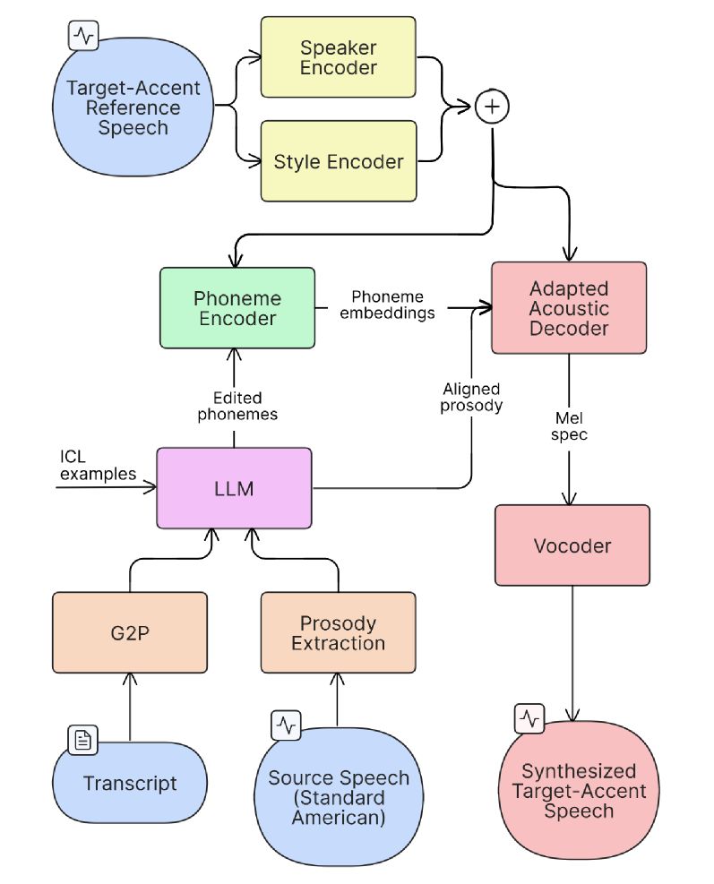
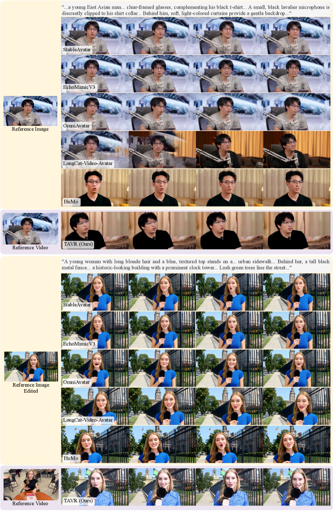
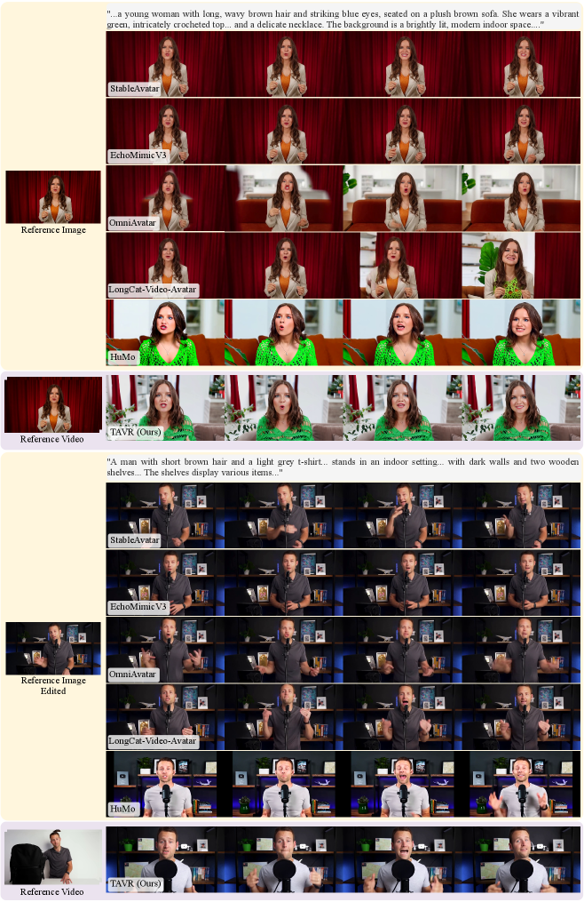

# 🚩 (2026-05-01) Scholar Inbox 추천 논문 

# 📚 JaiTTS: A Thai Voice Cloning Model

🚀 URL: https://arxiv.org/html/2604.27607

## 🌏 Abstract (원문)
We present JaiTTS-v1.0, a state-of-the-art Thai voice cloning text-to-speech model built through continual training on a large Thai-centric speech corpus. The model architecture is adapted from VoxCPM, a tokenizer-free autoregressive TTS model. JaiTTS-v1.0 directly processes numerals and Thai-English code-switching, which is very common in realistic settings, without explicit text normalization. We test the models on short-duration speech generation and long-duration speech generation, which reflects many real-world use cases. JaiTTS-v1.0 achieves a state-of-the-art CER of 1.94%, surpassing the human ground truth of 1.98% for short-duration tasks while performing on par with human ground truth for long-duration tasks. In human judgment evaluations, our model wins 283 of 400 pairwise comparisons against commercial flagships, with only 58 losses.
## 🌏 Abstract (번역)
저희는 대규모 태국어 중심 음성 코퍼스에 대한 지속적인 훈련을 통해 구축된 최첨단 태국어 음성 복제 텍스트-음성 변환 모델인 JaiTTS-v1.0을 소개합니다. 이 모델 아키텍처는 토크나이저가 없는 자기회귀 TTS 모델인 VoxCPM에서 채택되었습니다. JaiTTS-v1.0은 명시적인 텍스트 정규화 없이도 실제 환경에서 매우 흔한 숫자 및 태국어-영어 코드 스위칭을 직접 처리합니다. 우리는 많은 실제 사용 사례를 반영하는 단기 음성 생성 및 장기 음성 생성에 대해 모델을 테스트했습니다. JaiTTS-v1.0은 단기 작업에서 인간 기준치인 1.98%를 능가하는 1.94%의 최첨단 CER을 달성했으며, 장기 작업에서는 인간 기준치와 동등한 성능을 보였습니다. 인간 판단 평가에서 우리 모델은 상업용 주력 모델과의 400개 쌍대 비교 중 283개에서 승리했으며, 단 58개만 패배했습니다.

## 🔍 Methods & Results
- JaiTTS-v1.0은 외부 음성 코덱 없이 연속적인 음성 잠재 변수를 직접 예측하는 토크나이저 없는 자기회귀 TTS 모델인 VoxCPM을 기반으로 합니다.
- 입력 텍스트와 참조 파형을 사용하여, 별도로 훈련된 인과 오디오 VAE(Variational Autoencoder)에 의해 생성된 연속적인 잠재 패치 시퀀스로 목표 음성을 생성합니다.
- 생성 과정은 4가지 핵심 구성 요소의 계층적 파이프라인을 통해 자기회귀적으로 진행됩니다: Text-Semantic Language Model (TSLM), Finite Scalar Quantization (FSQ) layer, Residual Acoustic Language Model (RALM), Local Diffusion Transformer (LocDiT).
- TSLM은 텍스트와 참조 음향 컨텍스트로부터 발화의 의미론적 및 운율적 내용을 계획하며, MiniCPM-4로 초기화된 디코더 전용 트랜스포머입니다.
- FSQ 계층은 TSLM 출력을 반이산 골격으로 압축하여 계획 신호를 안정화하고, 은닉 상태 공간에 대한 정규화 역할을 합니다.
- RALM은 FSQ 골격, 텍스트 측 TSLM 은닉 상태 및 과거 음향 임베딩을 기반으로 화자 유사성 및 음향 세부 정보를 향상시킵니다.
- LocDiT는 FSQ의 반이산 골격, RALM의 잔여 음향 세부 정보, 그리고 이전 패치에 조건화하여 가우시안 샘플을 다음 연속 잠재 패치로 디노이징하는 양방향 트랜스포머입니다.
- LocEnc는 과거 VAE 잠재 패치를 압축하여 TSLM 및 RALM에 효율적인 음향 컨텍스트를 제공하고 화자 보존을 지원합니다.
- 경량 헤드가 FSQ 골격을 사용하여 현재 패치가 시퀀스를 종료하는지 여부를 나타내는 이진 로짓을 생성합니다.
- 네 가지 모듈과 FSQ 계층은 조건부 흐름 매칭(LocDiT) 및 이진 교차 엔트로피 손실(정지 예측기)을 포함하는 결합된 목적 함수를 통해 종단 간 공동으로 최적화됩니다. 추론 시 분류기 없는 안내를 위해 훈련 중 언어 모델 조건화가 무작위로 0.1 확률로 드롭됩니다.

## 🖼 Figures
![Figure 1:Architecture of VoxCPM, the backbone of JaiTTS-v1.0. The Text-Semantic Language Model (TSLM) plans semantic-prosodic content from text and reference speech embeddings; a Finite Scalar Quantization (FSQ) layer compresses the TSLM hiddens into a scalar semantic skeleton; the Residual Acoustic Language Model (RALM) restores fine acoustic detail; and the Local Diffusion Transformer (LocDiT) decodes the result into continuous speech latent patches. A stop-prediction head consumes the post-FSQ hidden state to signal end-of-sequence. Figure adapted from Zhou et al. (2025).](../images/2026-05-01/2604.27607/2604.27607_fig0.png)
*Figure 1:Architecture of VoxCPM, the backbone of JaiTTS-v1.0. The Text-Semantic Language Model (TSLM) plans semantic-prosodic content from text and reference speech embeddings; a Finite Scalar Quantization (FSQ) layer compresses the TSLM hiddens into a scalar semantic skeleton; the Residual Acoustic Language Model (RALM) restores fine acoustic detail; and the Local Diffusion Transformer (LocDiT) decodes the result into continuous speech latent patches. A stop-prediction head consumes the post-FSQ hidden state to signal end-of-sequence. Figure adapted from Zhou et al. (2025).*

---
**Usage Info**: 3923 tokens used.
**Generated at**: 2026-05-01 14:53:13

---

# 📚 Few-Shot Accent Synthesis for ASR with LLM-Guided Phoneme Editing

🚀 URL: https://arxiv.org/html/2604.27273

## 🌏 Abstract (원문)
Accented automatic speech recognition (ASR) often degrades due to the limited availability of accented training data. Prior work has explored accent modeling in low-resource settings, but existing approaches typically require minutes to hours of labeled speech, which may still be impractical for truly scarce accent scenarios. We propose a pipeline that adapts a text-to-speech (TTS) decoder to a target-accent speaker using fewer than ten reference utterances and employs large language model (LLM)-based phoneme editing to generate accent-conditioned pronunciations. The resulting synthetic speech is used to fine-tune a self-supervised ASR model. Experiments demonstrate consistent word error rate (WER) reductions on real accented speech, including cross-speaker evaluation and ultra-low data regimes. A matched-rate random phoneme baseline shows that phoneme-space perturbation itself is a strong form of augmentation, while LLM-guided edits provide additional gains through accent-conditioned structure.
## 🌏 Abstract (번역)
악센트 자동 음성 인식(ASR)은 악센트 훈련 데이터의 제한된 가용성으로 인해 성능이 저하되는 경우가 많습니다. 이전 연구에서는 저자원 환경에서 악센트 모델링을 탐구했지만, 기존 접근 방식은 일반적으로 수분에서 수시간의 레이블링된 음성을 필요로 하며, 이는 진정으로 희소한 악센트 시나리오에서는 여전히 비실용적일 수 있습니다. 본 연구에서는 10개 미만의 참조 발화를 사용하여 텍스트 음성 변환(TTS) 디코더를 목표 악센트 화자에 적응시키고, 대규모 언어 모델(LLM) 기반 음소 편집을 활용하여 악센트 조건부 발음을 생성하는 파이프라인을 제안합니다. 이렇게 생성된 합성 음성은 자기 지도 ASR 모델을 미세 조정하는 데 사용됩니다. 실험 결과, 교차 화자 평가 및 초저자원 환경을 포함한 실제 악센트 음성에서 일관된 단어 오류율(WER) 감소를 입증했습니다. 동일한 비율의 무작위 음소 기준선은 음소 공간 교란 자체가 강력한 증강 형태임을 보여주며, LLM 기반 편집은 악센트 조건부 구조를 통해 추가적인 이득을 제공합니다.

## 🔍 Methods & Results
- 제안된 파이프라인은 표준 미국 영어 원본 음성, 전사본, 그리고 소량의 목표 악센트 참조 발화를 입력으로 받습니다.
- LLM은 음소-운율 정렬을 유지하면서 목표 악센트 발음에 맞게 음소 시퀀스를 편집하며, 인-컨텍스트 예시를 활용합니다.
- 목표 악센트 참조 음성은 화자 및 스타일 벡터로 인코딩되어 음소 인코더와 음향 디코더 모두에 대한 전역 조건화 벡터로 사용됩니다.
- 시스템은 음소 조건부 TTS 음향 모델을 기반으로 하며, 학습된 지역 운율 예측기를 제거하고 원본 음성에서 외부적으로 추출된 음소 수준 운율(지속 시간, 피치, 에너지)을 디코더에 조건화하여 운율 가변성을 높입니다.
- 학습된 화자 임베딩은 참조 음성에서 얻은 제로샷 화자 임베딩과 발화 수준 스타일 임베딩의 조합으로 대체되며, 이들은 FiLM 조건화에 사용됩니다.
- 훈련 중에는 화자당 참조 발화의 작고 동적으로 샘플링된 하위 집합에서 추정된 통계를 사용하여 음소 수준 운율 특징을 정규화하여 훈련-테스트 불일치를 줄입니다.
- 음향 모델은 사전 훈련(재구성, 적대적 분리, FiLM 정규화 손실 유지 및 프레임 수준 피치 및 에너지 일관성 손실 도입)과 소수샷 악센트-화자 적응(멜 재구성 손실만 사용하여 디코더 미세 조정)의 두 단계로 훈련됩니다.
- LLM은 음소 수준 운율이 정렬된 음소 시퀀스에 대해 작동하며, 정렬 제약 하에 삽입, 삭제, 분할, 병합과 같은 편집을 수행하여 음소-운율 일관성을 유지합니다.
- 인-컨텍스트 예시는 원본 및 목표 악센트 실현(음소 및 운율 시퀀스) 쌍으로 구성되며, 목표-원본 피치 표준 편차 비율을 기준으로 후보 쌍을 순위를 매겨 피치 가변성이 큰 예시를 선호합니다.
- LLM은 각 음소 수준 변경에 대해 명시적으로 추론하고, 관찰된 음소 대체율을 대략적으로 일치시키도록 지시받습니다.
- 실험 결과, 실제 악센트 음성에서 일관된 단어 오류율(WER) 감소를 달성했으며, 이는 교차 화자 평가 및 초저자원 데이터 환경에서도 유효했습니다.
- LLM 기반 편집은 악센트 조건부 구조를 통해 추가적인 이득을 제공하며, 무작위 음소 교란 기준선보다 우수한 성능을 보였습니다.

## 🖼 Figures

*Figure 1:Overview of the proposed few-shot TTS adaptation and LLM-based pronunciation editing pipeline for synthetic accented speech generation.*

*Figure 2:ASR performance as a function of fine-tuning budget 
𝑁
 for Indian (TNI) and Korean (HKK) English. Models are fine-tuned on 
𝑁
 utterances. Error bars denote standard deviation over runs. The shaded band denotes the WER gap between Adapt + Random phonemes and Adapt + LLM; narrower bands indicate that the random-phoneme control performs similarly to the LLM-edited condition.*

*Figure 3:ASR performance as a function of fine-tuning budget 
𝑁
 on an Indian English subset (TNI) with ground-truth phoneme and prosody annotations. All synthetic conditions use the adapted decoder. We compare random phoneme edits with oracle conditions using ground-truth phonemes with either aligned source prosody or ground-truth prosody. Error bars denote standard deviation over runs.*

*Figure 4:Few-shot accent synthesis analysis on Indian English (TNI). (a) Accent similarity and (b) UTMOS versus the number of real target-accent references 
𝐾
.*

---
**Usage Info**: 3371 tokens used.
**Generated at**: 2026-05-01 14:53:56

---

# 📚 Accent Conversion: A Problem-Driven Survey of Sociolinguistic and Technical Constraints

🚀 URL: https://arxiv.org/html/2604.27281

## 🌏 Abstract (원문)
Accent conversion has rapidly progressed alongside growing interest in improving global cross-cultural communication. This survey presents an overview of the evolution of accent conversion methodologies, analyzing how the field has developed in response to fundamental challenges related to data alignment, representation disentanglement, and resource scarcity. We trace the progression from early rule-based digital signal processing approaches such as spectral manipulation and formant-based analysis to modern neural architectures capable of flexible and reference-free accent transformation. In addition, the survey situates accent conversion within its linguistic foundations and examines how different application requirements impose varying constraints on the balance between accent modification and speaker identity preservation. Finally, it reviews commonly used speech datasets and evaluation methodologies, identifies persistent challenges, and outlines directions for future research aimed at achieving more controllable and perceptually consistent accent conversion.
## 🌏 Abstract (번역)
액센트 변환은 전 세계적인 문화 간 의사소통 개선에 대한 관심이 증가함에 따라 빠르게 발전해왔습니다. 본 조사는 액센트 변환 방법론의 진화를 개괄하며, 데이터 정렬, 표현 분리, 자원 부족과 관련된 근본적인 문제에 대한 대응으로 이 분야가 어떻게 발전해왔는지 분석합니다. 우리는 스펙트럼 조작 및 포먼트 기반 분석과 같은 초기 규칙 기반 디지털 신호 처리 접근 방식부터 유연하고 참조 없는 액센트 변환이 가능한 현대 신경망 아키텍처에 이르기까지의 진행 과정을 추적합니다. 또한, 본 조사는 액센트 변환을 언어학적 기반 내에 위치시키고, 다양한 애플리케이션 요구 사항이 액센트 수정과 화자 정체성 보존 사이의 균형에 어떻게 다양한 제약을 가하는지 검토합니다. 마지막으로, 일반적으로 사용되는 음성 데이터셋과 평가 방법론을 검토하고, 지속적인 과제를 식별하며, 보다 제어 가능하고 지각적으로 일관된 액센트 변환을 달성하기 위한 미래 연구 방향을 제시합니다.

## 🔍 Methods & Results
- 초기 액센트 변환(AC) 방법은 스펙트럼 조작, 포먼트 기반 분석, LPC(Linear Predictive Coding), PSOLA(Pitch-Synchronous Overlap and Add)와 같은 디지털 신호 처리(DSP) 기술을 사용하여 음성 특성(음소 조음, 억양, 지속 시간)을 수정했습니다.
- 초기 DSP 기반 방법은 수동 기능 엔지니어링과 병렬 발화에 크게 의존했으며, 부자연스러운 아티팩트와 화자 정체성 보존의 어려움이 있었으나, 외국어 발음 훈련 및 다국어 TTS에 활용되었습니다.
- 머신러닝 발전과 함께 데이터 기반 접근 방식으로 전환되었으며, 병렬 데이터 부족 문제를 해결하기 위해 약한 병렬 데이터셋을 사용하고 DTW(Dynamic Time Warping) 및 VTLN(Vocal Tract Length Normalization)을 통한 명시적 정렬을 도입했습니다.
- 이후 정렬 방법은 화자 독립적인 ASR 모델에서 추출한 음소 후방확률도를 사용하여 언어적 내용에 초점을 맞췄고, 어텐션 메커니즘을 통해 암묵적 정렬을 학습하는 시퀀스-투-시퀀스(seq2seq) 신경망 아키텍처가 등장하여 정렬 품질을 개선했습니다.
- 참조 없는 AC 방법 개발을 위해 액센트 특징을 화자 정체성 및 언어적 내용으로부터 분리하는 데 중점을 두었으며, 병목(Bottleneck) 방법(예: VQ-VAE), 지도(Supervised) 방법(예: 음소/피치 예측), 적대적(Adversarial) 방법(예: 보조 분류기)을 활용했습니다.
- 저자원 액센트 처리를 위해 풍부한 원어민 또는 비액센트 음성을 활용하는 방법이 연구되었으며, 사전 훈련된 원어민 TTS 시스템을 통한 잠재 공간 안내, 합성 원어민 참조를 사용한 파형 수준 정렬, 다국어 TTS를 통한 교차 언어 전이, 마스크 토큰 예측을 사용한 원어민 음성 사전 훈련 등이 포함됩니다.
- AC 시스템은 단순한 일대일 매핑을 넘어 다대일(many-to-one) 또는 다대다(many-to-many) 액센트 설정으로 발전했으며, 다대다 시스템은 이산 ID를 사용하지만 미학습 액센트에 대한 일반화에 한계가 있어 연속적인 액센트 임베딩 연구가 진행 중입니다.
- 연속적인 액센트 임베딩을 위해 화자 임베딩과 유사하게 액센트 분류기의 은닉 표현을 추출하거나, 지도 분류와 병목 제약을 결합한 Multi-Level VAE with VQ와 같은 정교한 분리 방법이 제안되었으나, 완전한 분리 및 일반화는 여전히 해결해야 할 과제입니다.

---
**Usage Info**: 4585 tokens used.
**Generated at**: 2026-05-01 14:54:08

---

# 📚 Generate Your Talking Avatar from Video Reference

🚀 URL: https://arxiv.org/html/2604.27918

## 🌏 Abstract (원문)
Existing talking avatar methods typically adopt an image-to-video pipeline conditioned on a static reference image within the same scene as the target generation. This restricted, single-view perspective lacks sufficient temporal and expression cues, limiting the ability to synthesize high-fidelity talking avatars in customized backgrounds. To this end, we introduce Talking Avatar generation from Video Reference (TAVR), a novel framework that shifts the paradigm by leveraging cross-scene video inputs. To effectively process these extended temporal contexts and bridge cross-scene domain gaps, TAVR integrates a token selection module alongside a comprehensive three-stage training scheme. Specifically, same-scene video pretraining establishes foundational appearance copying, which is subsequently expanded by cross-scene reference fine-tuning for robust cross-scene adaptation. Finally, task-specific reinforcement learning aligns the generated outputs with identity-based rewards to maximize identity similarity. To systematically evaluate cross-scene robustness, we construct a new benchmark comprising 158 carefully curated cross-scene video pairs. Extensive experiments show that TAVR benefits from flexible inference-time video referencing and consistently surpasses existing baselines both quantitatively and qualitatively.
## 🌏 Abstract (번역)
기존의 말하는 아바타 생성 방법은 일반적으로 대상 생성과 동일한 장면 내의 정적 참조 이미지에 기반한 이미지-비디오 파이프라인을 채택합니다. 이러한 제한된 단일 시점은 충분한 시간적 및 표정 단서가 부족하여 맞춤형 배경에서 고품질의 말하는 아바타를 합성하는 능력을 제한합니다. 이를 위해 우리는 교차 장면 비디오 입력을 활용하여 패러다임을 전환하는 새로운 프레임워크인 비디오 참조 기반 말하는 아바타 생성(TAVR)을 소개합니다. 이러한 확장된 시간적 맥락을 효과적으로 처리하고 교차 장면 도메인 간극을 메우기 위해 TAVR은 토큰 선택 모듈과 포괄적인 3단계 훈련 방식을 통합합니다. 구체적으로, 동일 장면 비디오 사전 훈련은 기본적인 외형 복사 능력을 확립하며, 이는 견고한 교차 장면 적응을 위해 교차 장면 참조 미세 조정을 통해 확장됩니다. 마지막으로, 작업별 강화 학습은 생성된 출력을 신원 기반 보상과 정렬하여 신원 유사성을 극대화합니다. 교차 장면 견고성을 체계적으로 평가하기 위해 우리는 신중하게 선별된 158개의 교차 장면 비디오 쌍으로 구성된 새로운 벤치마크를 구축합니다. 광범위한 실험 결과, TAVR은 유연한 추론 시간 비디오 참조의 이점을 가지며 정량적 및 정성적으로 기존 기준선을 일관되게 능가함을 보여줍니다.

## 🔍 Methods & Results
- TAVR은 운전 오디오 신호와 시각적 신원 참조를 기반으로 맞춤형 배경에서 고품질의 말하는 아바타를 생성하기 위해 교차 장면 비디오 참조를 통합하는 신원 보존 프레임워크입니다.
- TAVR의 핵심 설계는 유연한 비디오 참조(가변 길이 비디오 컨텍스트 및 참조 오디오 활용), 토큰 선택 모듈(얼굴 바운딩 박스를 통해 주요 신원 단서 추출 및 계산 비용 절감), 적응형 어텐션 모듈(Reference Self-Attention 및 Audio Cross-Attention), 그리고 모션 프레임 전략을 통한 장기 비디오 생성(시간적 일관성 및 장기 신원 일관성 보장)을 포함합니다.
- Reference Self-Attention 모듈은 노이즈가 있는 잠재 토큰, 배경 토큰, 참조 비디오 토큰을 공동으로 처리하여 풍부한 신원 단서를 주입하고, Audio Cross-Attention 모듈은 운전 오디오와 참조 오디오를 활용하여 정확한 립싱크와 시간적 오디오-시각적 일치를 보장합니다.
- 교차 장면 도메인 간극을 해소하고 견고한 신원 보존을 확립하기 위해 TAVR은 3단계 훈련 전략을 사용합니다.
- 1단계: 동일 장면 비디오 사전 훈련(Same-Scene Video Pretraining)은 흐름 매칭(flow matching) 목표를 사용하여 참조 비디오에서 외형을 복사하는 기본적인 능력을 부여합니다.
- 2단계: 교차 장면 비디오 미세 조정(Cross-Scene Video Fine-tuning)은 동일한 신원이 다른 배경에 나타나는 비디오 쌍으로 TAVR을 미세 조정하여 도메인 간극을 메우고 진정한 신원 집계 및 도메인 적응을 학습합니다.
- 3단계: 작업별 강화 학습(Task-Specific Reinforcement Learning)은 ArcFace를 사용하여 생성된 비디오와 실제 비디오 간의 신원 유사성을 측정하여 선호도 데이터셋을 구축하고, Direct Preference Optimization (DPO)을 통해 신원 충실도를 극대화합니다. 이 단계에서는 전경에 초점을 맞추기 위해 공간적으로 마스크된 DPO 목표를 사용하며, 분포 변화를 방지하기 위해 흐름 매칭 손실과 결합됩니다.
- 교차 장면 견고성을 평가하기 위해 158개의 교차 장면 비디오 쌍으로 구성된 새로운 벤치마크를 구축했으며, TAVR이 기존 기준선을 정량적 및 정성적으로 일관되게 능가함을 입증했습니다.

## 🖼 Figures
![Figure 1:Talking avatar generation from video reference. (a) Visual comparisons demonstrate that our video reference framework yields significantly better identity preservation compared to the single-image baseline in cross-scene generation. To illustrate this mechanism, we visualize the attention distribution of a specific generated frame across all reference frames, obtained by extracting the attention weights directly from the model’s attention layers. The heatmaps reveal that our method selectively aggregates salient identity cues (e.g., lip shapes and facial silhouettes) from highly correlated frames, while naturally suppressing frames with mismatched poses and expressions. This targeted feature aggregation explicitly demonstrates the effectiveness of the video referencing approach. (b) The plot shows that our identity similarity increases with the number of reference frames, confirming that longer reference input is advantageous. Furthermore, our approach consistently outperforms existing single-image baselines, achieving substantially higher similarity scores.](../images/2026-05-01/2604.27918/2604.27918_fig0.png)
*Figure 1:Talking avatar generation from video reference. (a) Visual comparisons demonstrate that our video reference framework yields significantly better identity preservation compared to the single-image baseline in cross-scene generation. To illustrate this mechanism, we visualize the attention distribution of a specific generated frame across all reference frames, obtained by extracting the attention weights directly from the model’s attention layers. The heatmaps reveal that our method selectively aggregates salient identity cues (e.g., lip shapes and facial silhouettes) from highly correlated frames, while naturally suppressing frames with mismatched poses and expressions. This targeted feature aggregation explicitly demonstrates the effectiveness of the video referencing approach. (b) The plot shows that our identity similarity increases with the number of reference frames, confirming that longer reference input is advantageous. Furthermore, our approach consistently outperforms existing single-image baselines, achieving substantially higher similarity scores.*

![Figure 2:Overview of TAVR framework. Our framework generates high-fidelity talking avatars with customized backgrounds by integrating cross-scene video references. Visual inputs, including the video reference and masked target background, are encoded by the VAE into latents 
𝐳
𝑟
​
𝑒
​
𝑓
 and 
𝐳
𝑏
​
𝑔
, followed by a Token Selection module to reduce computational redundancy. These tokens, alongside an optional motion latent 
𝐳
𝑚
 for longer video synthesis, are concatenated with the noisy target latent 
𝐳
 and forwarded through 
𝑁
 adapted Transformer blocks. Within each block, a Reference Self-Attention module extends standard self-attention to jointly process target and reference features. Subsequently, two cross-attention modules inject guidance from the text prompt 
𝐭
𝑡
​
𝑥
​
𝑡
 via text encoder [10] and audio signals encoded from Wav2Vec 2.0 [1]. Notably, besides the driving audio 
𝐚
𝑑
​
𝑟
​
𝑣
 for target lip synchronization, the audio module incorporates the corresponding reference audio 
𝐚
𝑟
​
𝑒
​
𝑓
 to inject explicit audio-visual clues into the reference stream, guiding the network to accurately locate and extract the intrinsic speaking dynamics from the reference tokens. After discarding the auxiliary reference and background tokens, the target generation is decoded by the VAE.](../images/2026-05-01/2604.27918/2604.27918_fig1.png)
*Figure 2:Overview of TAVR framework. Our framework generates high-fidelity talking avatars with customized backgrounds by integrating cross-scene video references. Visual inputs, including the video reference and masked target background, are encoded by the VAE into latents 
𝐳
𝑟
​
𝑒
​
𝑓
 and 
𝐳
𝑏
​
𝑔
, followed by a Token Selection module to reduce computational redundancy. These tokens, alongside an optional motion latent 
𝐳
𝑚
 for longer video synthesis, are concatenated with the noisy target latent 
𝐳
 and forwarded through 
𝑁
 adapted Transformer blocks. Within each block, a Reference Self-Attention module extends standard self-attention to jointly process target and reference features. Subsequently, two cross-attention modules inject guidance from the text prompt 
𝐭
𝑡
​
𝑥
​
𝑡
 via text encoder [10] and audio signals encoded from Wav2Vec 2.0 [1]. Notably, besides the driving audio 
𝐚
𝑑
​
𝑟
​
𝑣
 for target lip synchronization, the audio module incorporates the corresponding reference audio 
𝐚
𝑟
​
𝑒
​
𝑓
 to inject explicit audio-visual clues into the reference stream, guiding the network to accurately locate and extract the intrinsic speaking dynamics from the reference tokens. After discarding the auxiliary reference and background tokens, the target generation is decoded by the VAE.*

![Figure 3:Performance with reference number changes. (a) Identity Similarity: Increasing the reference context leads to a continuous improvement in similarity scores. (b) Lip Synchronization: Sync-D and Sync-C scores remain stable, demonstrating that TAVR maintains precise lip-sync accuracy as the reference length increases. (c) General Quality: Visual quality metrics show negligible fluctuations, proving that the gain in identity fidelity does not compromise generation stability. Notably, TAVR generalizes effectively to 48 reference frames despite its restricted training context of fewer than 20 frames.](../images/2026-05-01/2604.27918/2604.27918_fig2.png)
*Figure 3:Performance with reference number changes. (a) Identity Similarity: Increasing the reference context leads to a continuous improvement in similarity scores. (b) Lip Synchronization: Sync-D and Sync-C scores remain stable, demonstrating that TAVR maintains precise lip-sync accuracy as the reference length increases. (c) General Quality: Visual quality metrics show negligible fluctuations, proving that the gain in identity fidelity does not compromise generation stability. Notably, TAVR generalizes effectively to 48 reference frames despite its restricted training context of fewer than 20 frames.*

*Figure 4:Visual comparison across varying reference lengths. The leftmost column displays the input reference video, followed by the corresponding generation results using different numbers of reference frames. Orange arrows highlight the artifacts in the teeth region of the 12-frame variant.*

*Figure 5:Qualitative comparisons with the State-of-The-Art methods.*

*Figure 6:Qualitative results of ablated training stages. We present visualizations for different training stages. Stage 1 denotes same-scene pretraining, Stage 2 applies cross-scene fine-tuning, and Stage 3 integrates task-specific reinforcement learning. Details are provided in Sec. 3.2.*

*Figure 7:Additional qualitative comparisons on the cross-scene benchmark.*

---
**Usage Info**: 4884 tokens used.
**Generated at**: 2026-05-01 14:55:05

---

