# 🚩 (2026-05-04) Scholar Inbox 추천 논문 

# 📚 Fast Text-to-Audio Generation with One-Step Sampling via Energy-Scoring and Auxiliary Contextual Representation Distillation

🚀 URL: https://arxiv.org/html/2605.00329

## 🌏 Abstract (원문)
Autoregressive (AR) models with diffusion heads have recently achieved strong text-to-audio performance, yet their iterative decoding and multi-step sampling process introduce high-latency issues. To address this bottleneck, we propose a one-step sampling framework that combines an energy-distance training objective with representation-level distillation. An energy-scoring head maps Gaussian noise directly to audio latents in one step, eliminating the need for a costly recursive diffusion sampling process, while distillation from a masked autoregressive (MAR) text-to-audio model preserves the strong conditioning learned during diffusion training. On the AudioCaps benchmark, our method consistently outperforms prior one-step baselines such as ConsistencyTTA, SoundCTM, AudioLCM and AudioTurbo, on both objective and subjective metrics, while substantially narrowing the quality gap to AR diffusion systems with multi-step sampling. Compared to the state-of-the-art AR diffusion system, IMPACT, our approach achieves up to8.58.5× faster batch inference with highly competitive audio quality. These results demonstrate that combining energy-distance training with representation-level distillation provides an effective recipe for fast, high-quality text-to-audio synthesis.
## 🌏 Abstract (번역)
확산 헤드를 가진 자기회귀(AR) 모델은 최근 강력한 텍스트-오디오 성능을 달성했지만, 반복적인 디코딩 및 다단계 샘플링 과정으로 인해 높은 지연 시간 문제가 발생합니다. 이러한 병목 현상을 해결하기 위해 우리는 에너지 거리 훈련 목표와 표현 수준 증류를 결합한 원스텝 샘플링 프레임워크를 제안합니다. 에너지 스코어링 헤드는 가우시안 노이즈를 오디오 잠재 공간으로 직접 한 단계에 매핑하여 비용이 많이 드는 재귀적 확산 샘플링 프로세스의 필요성을 없애는 동시에, 마스크된 자기회귀(MAR) 텍스트-오디오 모델로부터의 증류는 확산 훈련 중에 학습된 강력한 조건화를 보존합니다. AudioCaps 벤치마크에서 우리의 방법은 객관적 및 주관적 지표 모두에서 ConsistencyTTA, SoundCTM, AudioLCM 및 AudioTurbo와 같은 이전 원스텝 기준선들을 일관되게 능가하며, 다단계 샘플링을 사용하는 AR 확산 시스템과의 품질 격차를 크게 좁힙니다. 최첨단 AR 확산 시스템인 IMPACT와 비교하여, 우리의 접근 방식은 매우 경쟁력 있는 오디오 품질로 최대 8.5배 빠른 배치 추론을 달성합니다. 이러한 결과는 에너지 거리 훈련과 표현 수준 증류의 결합이 빠르고 고품질의 텍스트-오디오 합성을 위한 효과적인 방안임을 보여줍니다.

## 🔍 Methods & Results
- 기존 확산 헤드 기반 자기회귀(AR) 모델의 높은 지연 시간 문제를 해결하기 위해, 에너지 거리 훈련 목표와 표현 수준 증류를 결합한 원스텝 샘플링 프레임워크를 제안한다.
- 에너지 스코어링 헤드는 가우시안 노이즈를 오디오 잠재 공간으로 한 단계에 직접 매핑하여, 기존의 비용이 많이 드는 재귀적 확산 샘플링 과정을 대체함으로써 추론 시간을 단축한다.
- 마스크된 자기회귀(MAR) 텍스트-오디오 모델로부터의 표현 수준 증류를 통해, 확산 훈련으로 학습된 강력한 조건화 능력을 원스텝 모델에 전이시킨다. 이는 학생 모델의 최종 레이어 표현을 확산 훈련된 강력한 교사 모델(IMPACT)의 표현과 MSE 손실을 사용하여 정렬하는 방식으로 이루어진다.
- 훈련 목표는 에너지 거리 손실과 증류 손실을 결합하여 구성된다.
- AudioCaps 벤치마크에서 제안된 방법은 ConsistencyTTA, SoundCTM, AudioLCM, AudioTurbo와 같은 이전 원스텝 기준선들을 객관적 및 주관적 지표 모두에서 일관되게 능가했다.
- 다단계 샘플링을 사용하는 AR 확산 시스템과의 품질 격차를 크게 좁혔으며, 최첨단 AR 확산 시스템인 IMPACT 대비 최대 8.5배 빠른 배치 추론 속도를 달성하면서도 경쟁력 있는 오디오 품질을 유지했다.
- 에너지 거리 훈련과 표현 수준 증류의 결합이 빠르고 고품질의 텍스트-오디오 합성을 위한 효과적인 방안임을 입증했다.

## 🖼 Figures
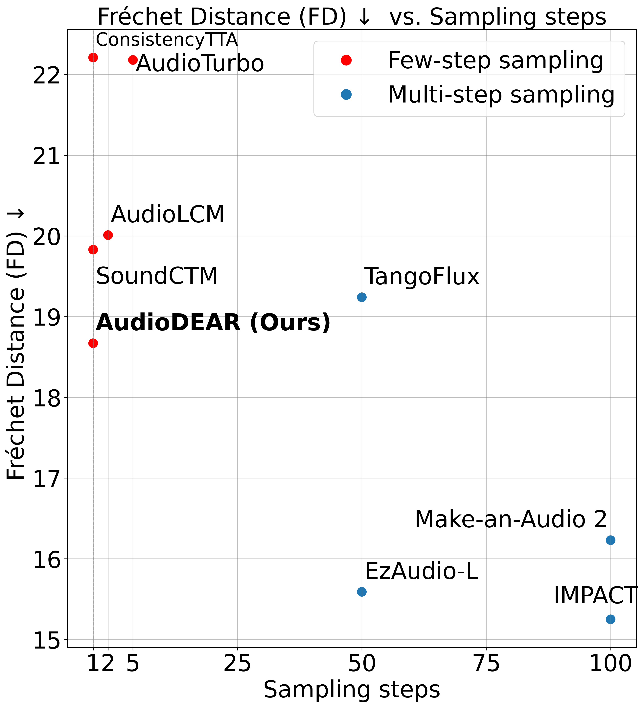
*Figure 1:FD vs sampling steps. Our AudioDEAR model achieves the lowest FD score among few-step sampling models.*

![Figure 2:(a) Training pipeline of our energy-scoring framework with representation distillation. Input positions 
1
 and 
𝐿
−
1
 are masked for demonstration. More details of the mask autoregressive sampling framework are described in  Appendix D. (b) One-step sampling of our energy-scoring head during the inference phase. The architecture of the energy-scoring head is elaborated in  Appendix E. (c) Multi-step sampling of a diffusion or flow matching head during the inference phase. Overall structural diagrams for training and inference are provided in  Appendix J.](../images/2026-05-04/2605.00329/2605.00329_fig1.png)
*Figure 2:(a) Training pipeline of our energy-scoring framework with representation distillation. Input positions 
1
 and 
𝐿
−
1
 are masked for demonstration. More details of the mask autoregressive sampling framework are described in  Appendix D. (b) One-step sampling of our energy-scoring head during the inference phase. The architecture of the energy-scoring head is elaborated in  Appendix E. (c) Multi-step sampling of a diffusion or flow matching head during the inference phase. Overall structural diagrams for training and inference are provided in  Appendix J.*

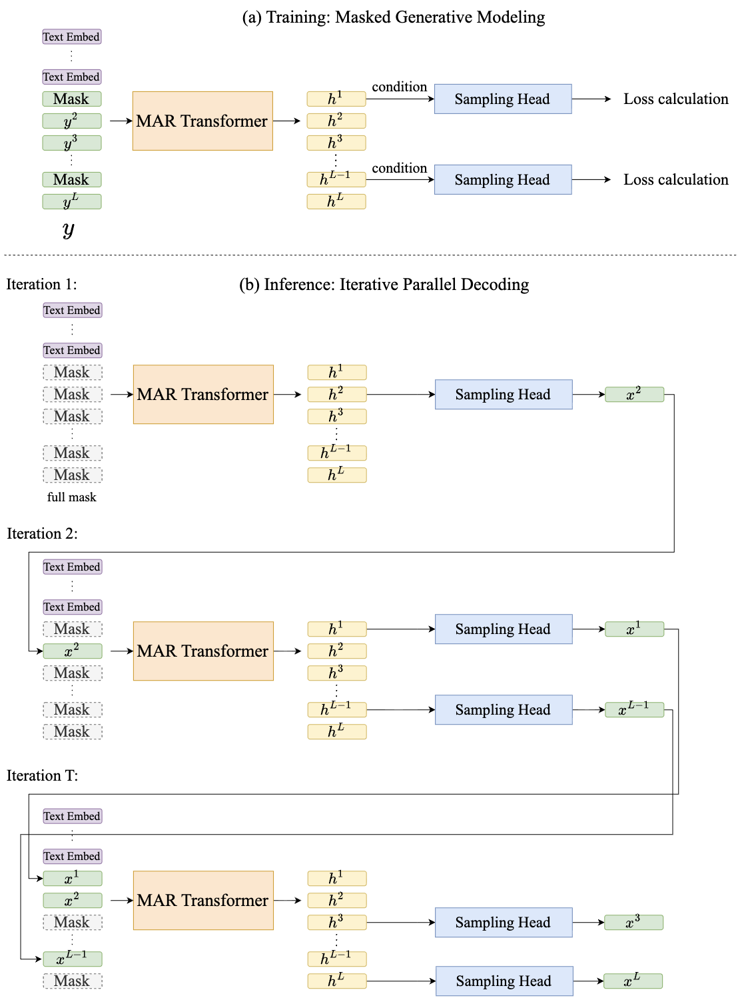
*Figure 3:Illustration of a mask autoregressive continuous sampling framework. (a) Training pipeline with masked generative modeling. (b) Inference pipeline with iterative parallel decoding.*

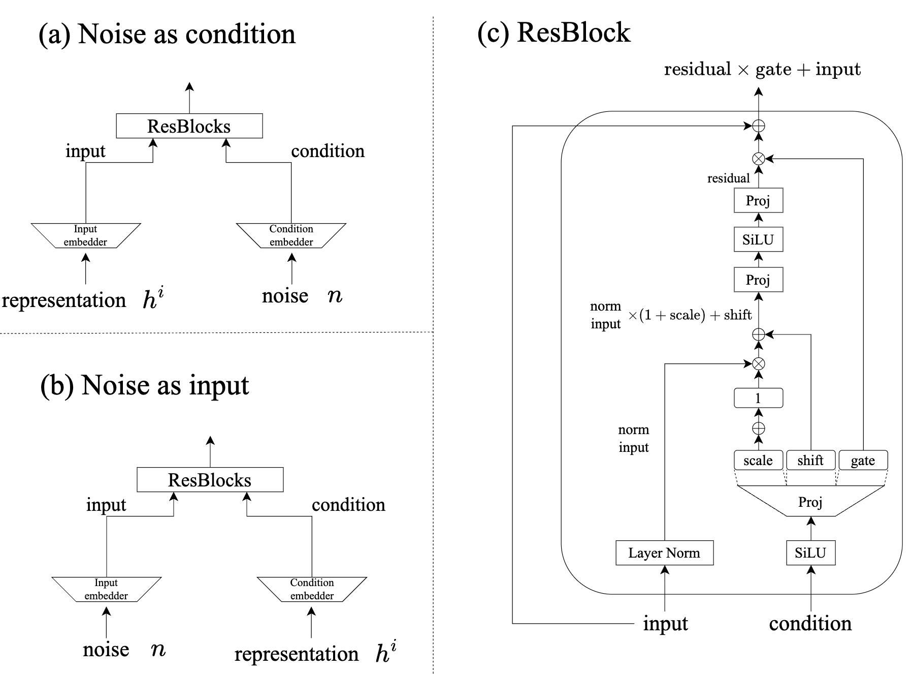
*Figure 4:Configurations for the energy-scoring module. (a) Noise as condition. Contextual representation as input. (b) Noise as input. Contextual representation as condition. (c) ResBlock architecture.*

*(a)Diffusion, MMD: 0.017609, WSD: 0.186989*

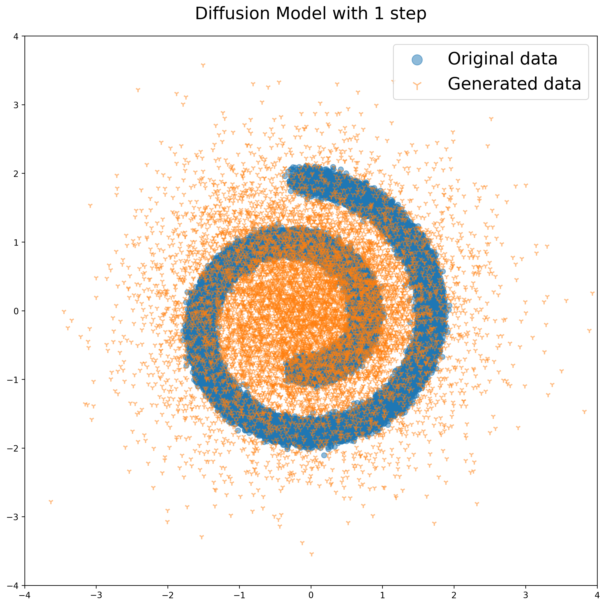
*(a)Diffusion, MMD: 0.017609, WSD: 0.186989*

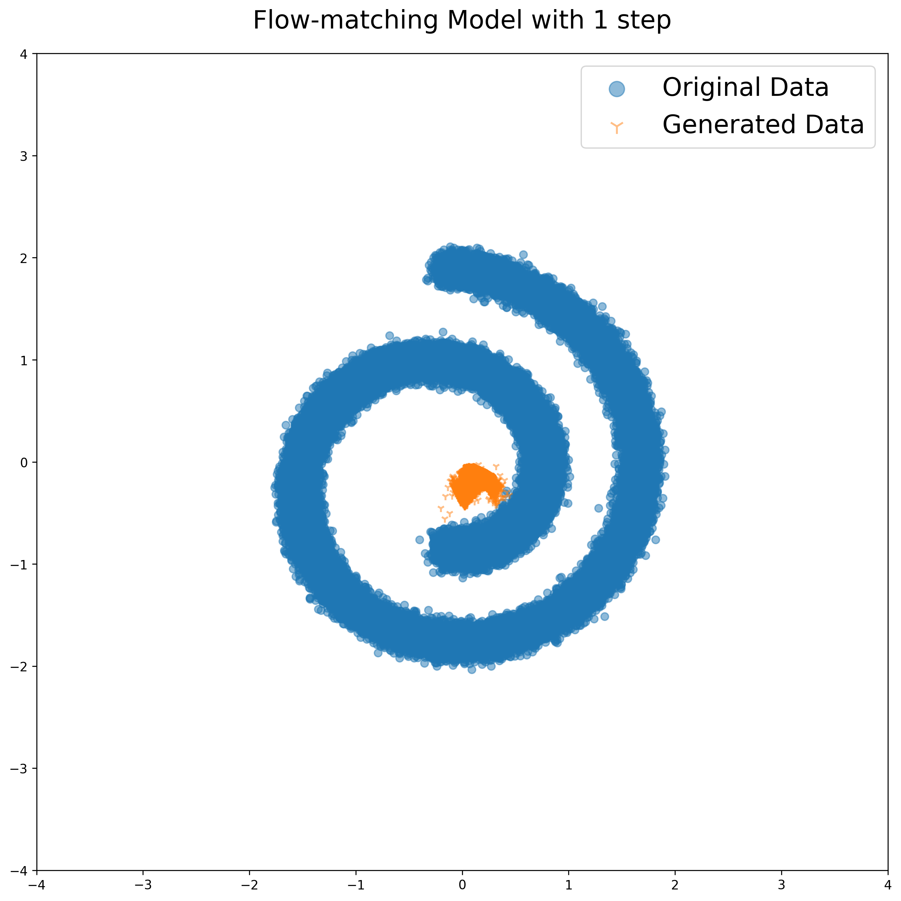
*(b)Flow-matching, MMD: 0.439545, WSD: 0.804978*

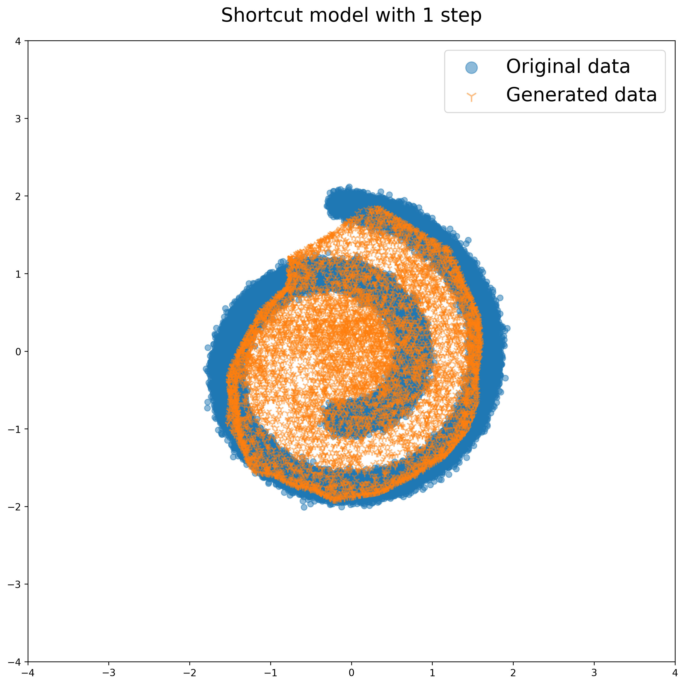
*(c)Shortcut, MMD: 0.014756, WSD: 0.139672*

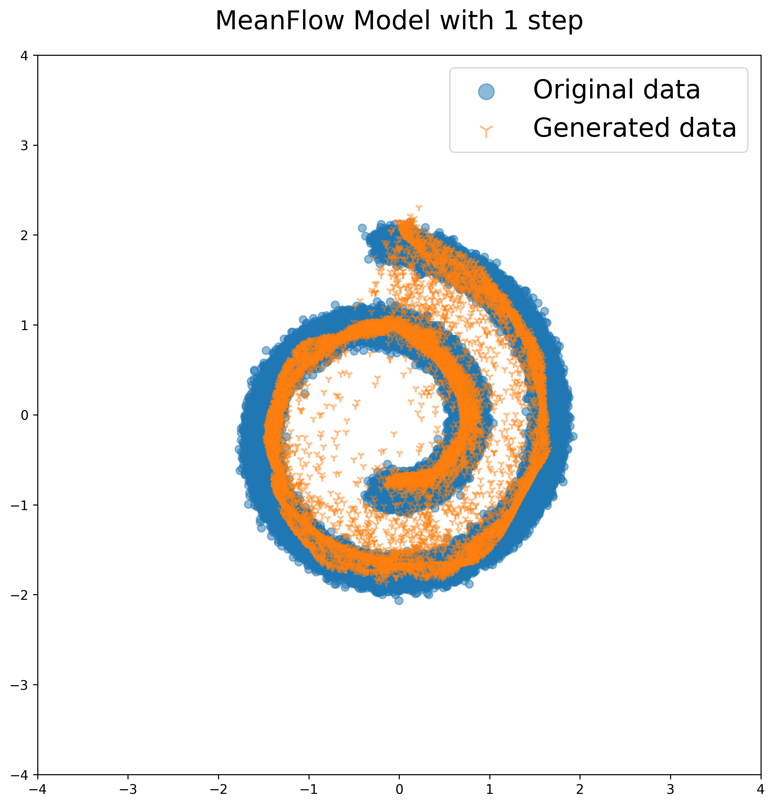
*(d)MeanFlow, MMD: 0.002184, WSD: 0.068466*

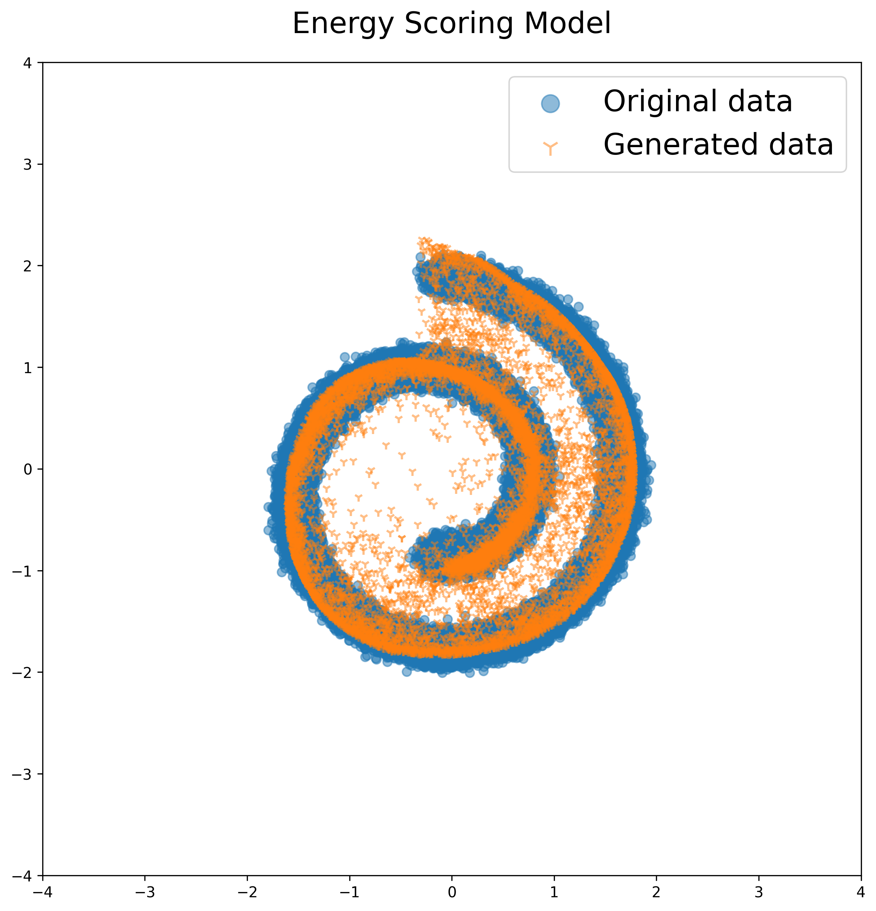
*(e)Energy-scoring, MMD: 0.000523, WSD: 0.042155*

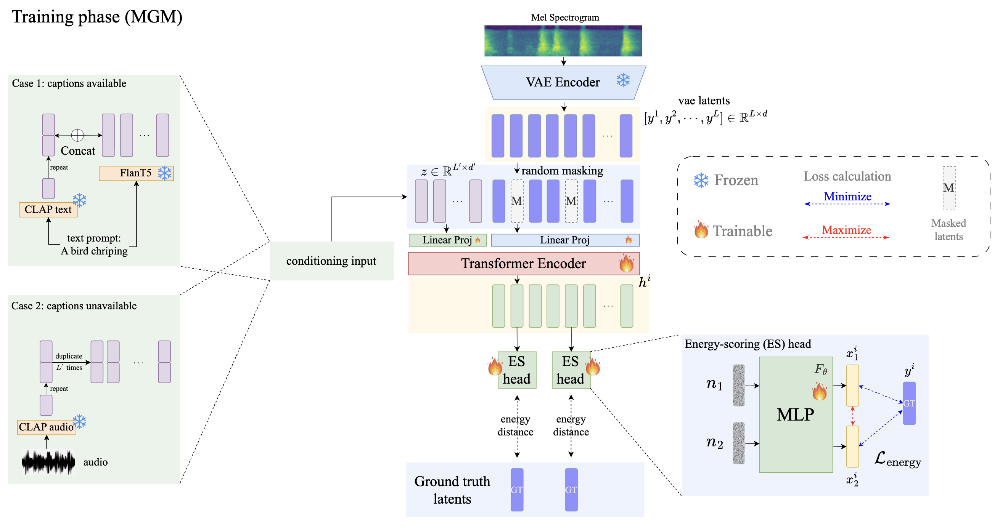
*Figure 6:Illustration of the training framework with masked generative modeling by energy-scoring.*

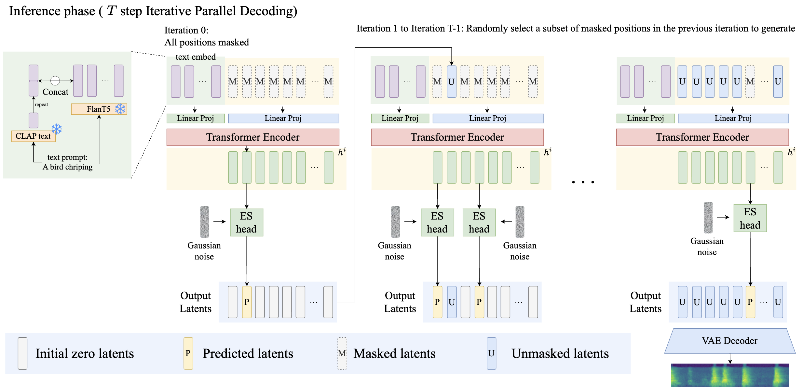
*Figure 7:Illustration of the inference phase with iterative parallel decoding with an energy-scoring framework. “ES head” denotes the energy-scoring head.*

---
**Usage Info**: 4578 tokens used.
**Generated at**: 2026-05-04 16:00:12

---

# 📚 Alethia: A Foundational Encoder for Voice Deepfakes

🚀 URL: https://arxiv.org/html/2605.00251

## 🌏 Abstract (원문)
State-of-the-art speech foundation models (SFMs), such as Wav2vec(Baevskiet al.,2020), WavLM(Chenet al.,2022), and HuBERT(Hsuet al.,2021), provide efficient audio representations that facilitate strong downstream performance on a variety of learning tasks(Yanget al.,2021). At the core of these models is the self-supervised learning paradigm built on a well-designed pretraining recipe and a massive corpus of unlabeled data. A standard pretraining recipe is the BERT-like masked token prediction, wherediscrete targetscomputed from the speech sample provide a supervisory signal for the representation learning(Baevskiet al.,2020; Chenet al.,2022; Hsuet al.,2021; Huzaifahet al.,2024; Liet al.,2023; Yanget al.,2025). This was found to be effective for a variety of audio encoders, for example, the MERT model for music(Liet al.,2023), SPEAR for speech and audio(Yanget al.,2025), and MERaLiON for Singlish data(Huzaifahet al.,2024), among others.
Of particular interest in this paper is the representation learning for voice deepfakes, which have now become a major concern due to the rapid emergence of high-quality generative methods. Related learning tasks include speech deepfake detection(Liet al.,2025a), singing voice deepfake detection(Zanget al.,2024), partially fake speech localization(Heet al.,2025), and deepfake source tracing(Kleinet al.,2024). While the downstream finetuning architectures vary across different state-of-the-art (SOTA) models, SFMs remain as the key integral component (often termed as ‘frontend’), wherein a better encoder representation yields a strong boost in performance(Yuet al.,2021; Zhang,2022; Zhanget al.,2025).
Most voice deepfake models today reuse off-the-shelf SFMs, and focus primarily on the downstream finetuning task for performance gains(Zhanget al.,2025). However, recent recent trends suggest that despite finetuning on massive volumes of real and fake speech, models still lack generalizability to unseen generation methods(Geet al.,2025; Chandraet al.,2025)and are sensitive to real-world perturbations(Liet al.,2025b; Zhuet al.,2025; Mülleret al.,2025). These trends suggest that the finetuning paradigm may be fundamentally limited by the representations inherited from the general-purpose SFMs, which are not optimized for capturing generative artifacts. A few studies have recently explored altering the pretraining recipe instead, such as continual pretraining with vocoded speech(Wang and Yamagishi,2024)and low-rank adaptation of the encoder(Haoet al.,2025), but the reported performance gains were only incremental(Wang and Yamagishi,2024; Geet et al.,2025). We note that the pretraining objective formulation as well as the scale and variety of pretraining data need to be revisited in order to fully capture the discriminative artifacts in voice deepfakes and thereby achieve better generalization.
In this work, our goal is to builda foundational encoder for voice deepfakesthat well encapsulates the discriminative patterns between real and generated voice, demonstrates robustness to real-world perturbations and, with simple finetuning, generalizes well to unseen synthesis methods.
We propose a pretraining recipe, wherein, the encoder receives supervision from two branches in parallel. In the first branch, the encoder is tasked to performbottleneck masked embedding prediction, where the target embeddings are extracted by a frozen teacher model from unmasked waveforms, and the student model learns to predict different teacher layers from its bottleneck (i.e., layer-averaged) representation obtained from masked waveforms. In the second branch, we introduce aflow-matching decoderthat generates the unmasked spectrogram conditioned on the bottleneck representation. Together, these objectives formulate a strong pretraining recipe for a foundational encoder for voice deepfake tasks.
Our main contributions are summarized as follows:
Contribution 1:We introduceAlethia, the first foundational encoder for voice deepfakes. Alethia markedly outperforms commonly used SFMs on5656datasets across55different voice deepfake tasks.Contribution 2:We show the limitation of existing pretraining methods, and propose a new pretraining strategy, consisting of bottleneck masked embedding prediction and flow-matching based spectrogram generation to jointly enhance generalization and robustness to unseen attacks.Contribution 3:We show that Alethia demonstrates zero-shot generalizability to completely unseen attacks (e.g., singing voice deepfakes) and is robust to various real-world perturbations without needing complex augmentations during finetuning.
## 🌏 Abstract (번역)
Wav2vec(Baevskiet al.,2020), WavLM(Chenet al.,2022), HuBERT(Hsuet al.,2021)와 같은 최첨단 음성 파운데이션 모델(SFM)은 다양한 학습 작업에서 강력한 다운스트림 성능을 촉진하는 효율적인 오디오 표현을 제공합니다(Yanget al.,2021). 이 모델들의 핵심은 잘 설계된 사전 학습 방식과 방대한 양의 레이블 없는 데이터 코퍼스를 기반으로 하는 자기 지도 학습 패러다임입니다. 표준 사전 학습 방식은 BERT와 유사한 마스크 토큰 예측으로, 음성 샘플에서 계산된 이산 목표가 표현 학습을 위한 감독 신호를 제공합니다(Baevskiet al.,2020; Chenet al.,2022; Hsuet al.,2021; Huzaifahet al.,2024; Liet al.,2023; Yanget al.,2025). 이는 음악용 MERT 모델(Liet al.,2023), 음성 및 오디오용 SPEAR(Yanget al.,2025), 싱글리시 데이터용 MERaLiON(Huzaifahet al.,2024) 등 다양한 오디오 인코더에 효과적인 것으로 나타났습니다.
본 논문에서 특히 관심을 두는 것은 고품질 생성 방법의 급속한 출현으로 인해 주요 관심사가 된 음성 딥페이크를 위한 표현 학습입니다. 관련 학습 작업에는 음성 딥페이크 탐지(Liet al.,2025a), 노래 음성 딥페이크 탐지(Zanget al.,2024), 부분적으로 가짜 음성 지역화(Heet al.,2025), 딥페이크 출처 추적(Kleinet al.,2024)이 포함됩니다. 다운스트림 미세 조정 아키텍처는 다양한 최첨단(SOTA) 모델마다 다르지만, SFM은 핵심적인 필수 구성 요소(종종 '프런트엔드'라고 불림)로 남아 있으며, 더 나은 인코더 표현은 성능을 크게 향상시킵니다(Yuet al.,2021; Zhang,2022; Zhanget al.,2025).
오늘날 대부분의 음성 딥페이크 모델은 상용 SFM을 재사용하고, 주로 성능 향상을 위한 다운스트림 미세 조정 작업에 중점을 둡니다(Zhanget al.,2025). 그러나 최근 동향에 따르면 방대한 양의 실제 및 가짜 음성으로 미세 조정을 했음에도 불구하고 모델은 여전히 보지 못한 생성 방법에 대한 일반화 능력이 부족하고(Geet al.,2025; Chandraet al.,2025) 실제 환경의 교란에 민감합니다(Liet al.,2025b; Zhuet al.,2025; Mülleret al.,2025). 이러한 동향은 미세 조정 패러다임이 생성 아티팩트를 포착하는 데 최적화되지 않은 범용 SFM에서 상속된 표현에 의해 근본적으로 제한될 수 있음을 시사합니다. 최근 몇몇 연구에서는 보코딩된 음성으로 지속적인 사전 학습(Wang and Yamagishi,2024) 및 인코더의 저랭크 적응(Haoet al.,2025)과 같이 사전 학습 방식을 변경하는 것을 탐색했지만, 보고된 성능 향상은 미미했습니다(Wang and Yamagishi,2024; Geet et al.,2025). 음성 딥페이크의 식별 아티팩트를 완전히 포착하고 더 나은 일반화를 달성하기 위해서는 사전 학습 목표 공식화뿐만 아니라 사전 학습 데이터의 규모와 다양성을 재검토해야 합니다.
본 연구의 목표는 실제 음성과 생성된 음성 간의 식별 패턴을 잘 캡슐화하고, 실제 환경의 교란에 대한 견고성을 입증하며, 간단한 미세 조정을 통해 보지 못한 합성 방법에 잘 일반화되는 음성 딥페이크를 위한 파운데이션 인코더를 구축하는 것입니다.
우리는 인코더가 두 가지 병렬 브랜치에서 감독을 받는 사전 학습 방식을 제안합니다. 첫 번째 브랜치에서 인코더는 병목 마스크 임베딩 예측을 수행하도록 지시받는데, 여기서 목표 임베딩은 마스크되지 않은 파형에서 고정된 교사 모델에 의해 추출되며, 학생 모델은 마스크된 파형에서 얻은 병목(즉, 레이어 평균) 표현으로부터 다른 교사 레이어를 예측하도록 학습합니다. 두 번째 브랜치에서는 병목 표현에 따라 마스크되지 않은 스펙트로그램을 생성하는 플로우 매칭 디코더를 도입합니다. 이러한 목표들은 음성 딥페이크 작업을 위한 파운데이션 인코더에 대한 강력한 사전 학습 방식을 구성합니다.
우리의 주요 기여는 다음과 같습니다:
기여 1: 우리는 음성 딥페이크를 위한 최초의 파운데이션 인코더인 Alethia를 소개합니다. Alethia는 5가지 음성 딥페이크 작업에 걸쳐 56개 데이터셋에서 일반적으로 사용되는 SFM을 현저히 능가합니다. 기여 2: 우리는 기존 사전 학습 방법의 한계를 보여주고, 보지 못한 공격에 대한 일반화 및 견고성을 공동으로 향상시키기 위해 병목 마스크 임베딩 예측과 플로우 매칭 기반 스펙트로그램 생성을 포함하는 새로운 사전 학습 전략을 제안합니다. 기여 3: Alethia는 완전히 보지 못한 공격(예: 노래 음성 딥페이크)에 대한 제로샷 일반화 능력을 보여주며, 미세 조정 중 복잡한 증강 없이도 다양한 실제 환경의 교란에 강건함을 보여줍니다.

## 🔍 Methods & Results
- Alethia는 음성 딥페이크를 위한 파운데이션 인코더로, 병목 마스크 임베딩 예측(bottleneck masked embedding prediction)과 플로우 매칭 기반 스펙트로그램 재구성(flow-matching based spectrogram reconstruction)의 두 가지 병렬 브랜치에서 감독을 받습니다.
- Alethia는 Base(400M 파라미터)와 Large(1B 파라미터) 두 가지 크기로 제공되며, 각각 7계층 CNN 특징 추출기와 24계층 및 48계층 트랜스포머 인코더를 포함합니다.
- 사전 학습 데이터는 자체 큐레이션된 18k 시간의 데이터와 ASVspoof5, MLAAD 등 공개 딥페이크 데이터 12k 시간을 포함하여 총 30k 시간으로 구성되었으며, 품질 관리를 통해 최종 19k 시간의 데이터셋으로 정제되었습니다.
- 병목 마스크 임베딩 예측은 학생 인코더의 병목 잠재 공간을 고정된 교사 모델(Alethia-Base는 WavLM-Large, Alethia-Large는 Wav2vec-XLSR-1B)의 다중 계층 특징 매니폴드에 정렬하며, L1 및 코사인 거리 손실을 모든 시간 단계에 걸쳐 적용하여 안정적인 수렴을 유도합니다.
- 플로우 매칭 기반 스펙트로그램 재구성은 Optimal Transport Conditional Flow Matching (OT-CFM)을 사용하여 병목 표현에 조건화된 확률 경로를 학습하며, 디코더는 예측된 스펙트로그램과 실제 스펙트로그램 간의 MSE를 최소화합니다.
- Alethia는 음성 딥페이크 탐지(SDD), 노래 음성 딥페이크 탐지(SVDD), 부분적으로 가짜 음성 지역화(PFSL), 출처 추적(ST), 오디오-비주얼 딥페이크 탐지(AVDD) 등 5가지 유형의 55개 학습 작업과 56개 데이터셋에서 평가되었습니다.
- SDD 작업에서 Alethia는 모든 미세 조정 설정(Low-resource, Expanded, Expanded+Aug)에서 기존 SFM(Wav2vec-XLSR-300M, WavLM-Large, HuBERT-Large, Wav2vec-XLSR-1B)보다 일관되게 우수한 EER 및 정확도를 달성했습니다.
- Alethia-Large는 Expanded 설정에서 W2V-1B 대비 EER 2.2% 감소 및 정확도 6.4% 증가를 보였으며, 평가 데이터셋 전반에 걸쳐 더 작은 성능 편차를 나타냈습니다.
- SVDD 및 PFSL 작업에서 Alethia는 SDD 데이터셋으로만 미세 조정되었음에도 불구하고 다른 SFM에 비해 우수한 제로샷 일반화 능력을 보여주었으며, 노래 음성 및 프레임 수준의 미세한 합성 아티팩트 포착 능력을 입증했습니다.
- ST 작업에서 Alethia-Base는 더 높은 실루엣 점수와 98.8%의 테스트 정확도를 달성하여 강력한 출처 추적 능력을 보였고, AVDD 작업에서도 Alethia-Base는 특히 PolyGlotFake와 같은 어려운 데이터셋에서 일관되게 낮은 EER을 기록했습니다.
- 생성 목표(generative objective)를 제거한 경우 성능이 전반적으로 하락했으며(ΔEER=+0.5), 특히 확산 및 플로우 매칭 기반 공격에 대한 탐지 성능이 크게 저하되어(ΔEER 5.6 개선), 현대 고충실도 합성기 아티팩트 포착에 중요함을 시사합니다.
- 병목 아키텍처(bottleneck architecture)는 마스킹이나 생성 목표 없이도 WavLM-Large 대비 EER 0.7% 개선 및 정확도 0.49% 향상을 제공하여, 사전 학습 목표를 위한 강력한 아키텍처 사전 지식 역할을 함을 보여주었습니다.

## 🖼 Figures
![Figure 1:Pretraining framework of Alethia. Alethia encoder receives masked waveform and projects it into layer-averaged bottleneck embeddings. These embeddings are then fed in parallel to (1) a bottleneck masked embedding prediction branch which predicts different teacher layer embeddings, and (2) a spectrogram reconstruction branch to predict the velocity field calculated between the target spectrogram and the decoded spectrogram. The ground-truth embeddings and spectrogram are both obtained from the unmasked waveform.](../images/2026-05-04/2605.00251/2605.00251_fig0.png)
*Figure 1:Pretraining framework of Alethia. Alethia encoder receives masked waveform and projects it into layer-averaged bottleneck embeddings. These embeddings are then fed in parallel to (1) a bottleneck masked embedding prediction branch which predicts different teacher layer embeddings, and (2) a spectrogram reconstruction branch to predict the velocity field calculated between the target spectrogram and the decoded spectrogram. The ground-truth embeddings and spectrogram are both obtained from the unmasked waveform.*

*Figure 2:UMAP projections of pretrained model embeddings without any task-specific fine-tuning, colored by source labels for the ASVspoof5-ST test split, where 
𝑆
 denotes the Silhouette Score.*

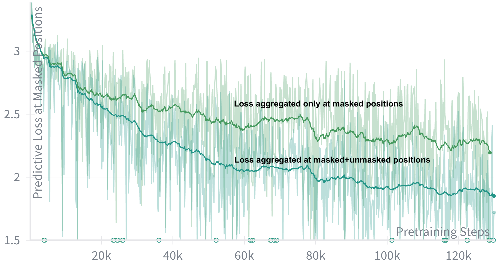
*Figure 3:Masked embedding prediction error calculated at masked time steps. The global supervision leads to lower prediction error even when evaluated exclusively on masked frames.*

*Figure 4:Left: Spectrogram reconstruction loss measured by comparing groundtruth spectrogram with the spectrogram generated directly with a decoder (i.e., regression). Right: Flow-Matching (FM) velocity field prediction loss where the velocity prediction is conditioned on the decoder output. The regression method tends to overfit reconstruction on unmasked frames, while the FM method leads to similar loss across all frames.*

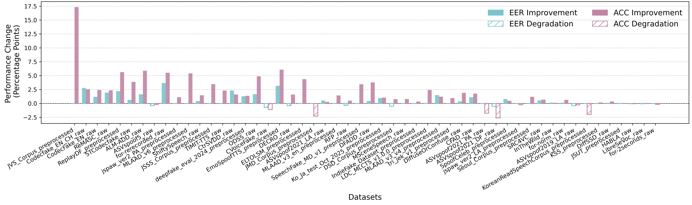
*Figure 5:Comparison between Alethia-Large and W2V-1B under the Expanded-Aug condition. Positive values suggest performance improvement.*

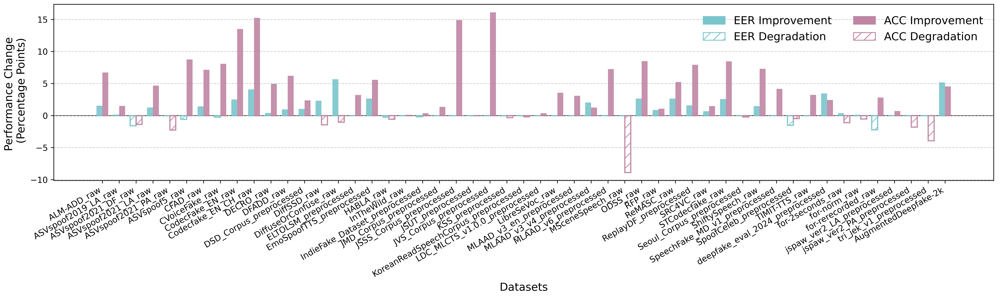
*Figure 6:Comparison between Alethia-Large and W2V-1B under the Expanded condition. Positive values suggest performance improvement.*

*Figure 7:For ASVspoof5-ST test split: a) UMAP visualizations of pretrained embeddings b) final layer embeddings from finetuned frozen‑backbone + MLP setup for ST. Points are colored by attack label, and 
𝑆
 denotes the Silhouette Score.*

---
**Usage Info**: 15405 tokens used.
**Generated at**: 2026-05-04 16:00:49

---

# 📚 LASE: Language-Adversarial Speaker Encoding for Indic Cross-Script Identity Preservation

🚀 URL: https://arxiv.org/html/2605.00777

## 🌏 Abstract (원문)
A speaker encoder used in multilingual voice cloning should treat the same speaker identically regardless of which script the audio was uttered in. Off-the-shelf encoders do not, and the failure is accent-conditional. On a 1043-pair Western-accented voice corpus across English, Hindi, Telugu, and Tamil, WavLM-base-plus-sv loses 0.082 absolute cosine similarity when the same voice changes script and ECAPA-TDNN loses 0.105. On a 1369-pair Indian-accented voice corpus, the gap shrinks to 0.006 (WavLM-SV) and 0.044 (ECAPA-TDNN). The leak is largest where it matters most for cross-script TTS: when a system projects a non-Indic-trained voice into Indic scripts. We presentLASE(Language-Adversarial Speaker Encoder), a small projection head over frozen WavLM-base-plus trained with two losses: a supervised contrastive loss over voice identity, and a gradient-reversal cross-entropy against a 4-language classifier that pushes the embedding to be language-uninformative while remaining speaker-informative. Trained on 1118 quality-gated cross-script pairs synthesised from 8 commercial multilingual voices,LASE’s residual gap is consistent with zero on both corpora (Δ=0.013\Delta=0.013Western,Δ=0.026\Delta=0.026Indian; both bootstrap 95% CIs include zero) and amplifies the cross-script-vs-floor margin 2.4–2.7×\timesover both baselines. An ECAPA+GRL ablation shows the GRL objective improves either backbone but the WavLM choice contributes too. In synthetic multi-speaker diarisation,LASEmatches ECAPA-TDNN on cross-script speaker recall (0.788 vs 0.789) with∼\sim100×\timesless training data. We release the r1 checkpoint, both corpora, and the bootstrap recipe.
## 🌏 Abstract (번역)
다국어 음성 복제에 사용되는 화자 인코더는 오디오가 어떤 스크립트로 발화되었는지에 관계없이 동일한 화자를 동일하게 처리해야 합니다. 상용 인코더는 그렇지 않으며, 이러한 실패는 악센트에 따라 달라집니다. 영어, 힌디어, 텔루구어, 타밀어에 걸쳐 1043쌍의 서양 악센트 음성 코퍼스에서, 동일한 음성이 스크립트를 변경할 때 WavLM-base-plus-sv는 0.082의 절대 코사인 유사도를 손실하고 ECAPA-TDNN은 0.105를 손실합니다. 1369쌍의 인도 악센트 음성 코퍼스에서는 이 격차가 0.006(WavLM-SV)과 0.044(ECAPA-TDNN)로 줄어듭니다. 이러한 누출은 교차 스크립트 TTS에 가장 중요한 부분, 즉 시스템이 비인도어 훈련 음성을 인도어 스크립트로 투영할 때 가장 크게 나타납니다. 우리는 LASE(Language-Adversarial Speaker Encoder)를 제안합니다. 이는 고정된 WavLM-base-plus 위에 작은 투영 헤드를 얹은 것으로, 두 가지 손실로 훈련됩니다: 음성 정체성에 대한 지도 대비 손실과, 임베딩이 화자 정보를 유지하면서 언어 정보를 제거하도록 유도하는 4개 언어 분류기에 대한 기울기 역전 교차 엔트로피 손실입니다. 8개의 상업용 다국어 음성에서 합성된 1118쌍의 품질 검증된 교차 스크립트 쌍으로 훈련된 LASE의 잔여 격차는 두 코퍼스 모두에서 0과 일치하며(서양 악센트 Δ=0.013, 인도 악센트 Δ=0.026; 두 부트스트랩 95% 신뢰 구간 모두 0 포함), 두 기준선에 비해 교차 스크립트 대 바닥 마진을 2.4~2.7배 증폭시킵니다. ECAPA+GRL 제거 연구는 GRL 목표가 어느 백본이든 개선하지만 WavLM 선택도 기여한다는 것을 보여줍니다. 합성 다중 화자 분리에서 LASE는 약 100배 적은 훈련 데이터로 교차 스크립트 화자 재현율(0.788 대 0.789)에서 ECAPA-TDNN과 일치합니다. 우리는 r1 체크포인트, 두 코퍼스, 그리고 부트스트랩 레시피를 공개합니다.

## 🔍 Methods & Results
- LASE는 고정된 WavLM-base-plus 백본, 학습 가능한 2계층 MLP 투영 헤드, 그리고 기울기 역전 분류기로 구성된 256차원 화자 인코더이다.
- 투영 헤드는 WavLM의 10-12번째 레이어에서 평균 풀링 후 적용되며, 임베딩이 화자 정보를 유지하면서 언어 정보를 제거하도록 설계되었다.
- 최적화는 음성 정체성에 대한 지도 대비 손실(SupCon)과 언어 분류기에 대한 기울기 역전 교차 엔트로피 손실의 합으로 이루어진다.
- 기울기 역전 계수(λt)는 워밍업, 선형 증가, 유지의 3단계 스케줄을 따른다.
- LASE는 8개의 상업용 다국어 음성에서 합성된 1118쌍의 교차 스크립트 데이터로 1000단계 훈련되었다.
- 실험 결과, LASE는 서양 악센트 및 인도 악센트 코퍼스 모두에서 잔여 격차가 0에 가깝게 나타났으며, 기준선 대비 교차 스크립트 대 바닥 마진을 2.4~2.7배 향상시켰다.
- 합성 다중 화자 분리 태스크에서 LASE는 약 100배 적은 훈련 데이터로 ECAPA-TDNN과 유사한 교차 스크립트 화자 재현율(0.788 vs 0.789)을 달성했다.

## 🖼 Figures

*Figure 1:Three-distribution comparison across speaker encoders on the held-out 1043-pair corpus. For each encoder, the green box is the within-script (same voice, same lang) cosine distribution; blue is cross-script (same voice, different lang); red is across-speaker (noise floor). LASE r1 collapses the within-vs-cross gap (blue and green almost touch) while pushing the noise floor far below (large blue-vs-red margin).*

*Figure 2:LASE r1 training: speaker contrastive loss drops while the language adversarial loss is held near 
ln
⁡
4
 (the 4-class uniform). The encoder learns voice identity but does not learn language, by design.*

---
**Usage Info**: 5154 tokens used.
**Generated at**: 2026-05-04 16:01:29

---

# 📚 MMAudio-LABEL: Audio Event Labeling via Audio Generation for Silent Video

🚀 URL: https://arxiv.org/html/2605.00495

## 🌏 Abstract (원문)
Generating realistic and accurate sounds from silent videos is a long-standing goal with applications in content creation, immersive media, and human-computer interaction. This task is challenging because the model must infer semantically plausible acoustic events from visual cues and align them precisely over time. Recent progress in multimodal generative modeling has led to substantial advances in video-to-audio (V2A) synthesis[1,10,13,17]. Among these approaches, MMAudio[1]demonstrates strong audio-visual synchronization by extracting semantic cues and fine-grained temporal dynamics from video. Most existing V2A models primarily focus on improving generation quality and conditioning-based controllability[1,2,3,5,10,17]. However, they do not explicitly expose event-level information aligned with the video timeline. In practical content production, creators often require explicit guidance onwhatsound events occur andwhento efficiently place and verify sounds in silent videos. We address a twofold task: generating high-quality audio from a silent video and identifying the types and timings of the corresponding sound events. Since existing V2A models lack built-in event detection capabilities, one straightforward solution involves attaching a conventional sound event detection model[7]to the generated audio. Although such post-hoc pipelines can detect event types and timing from audio, they are decoupled from the generation process, discard visual context, and may fail to distinguish acoustically similar events (e.g., footsteps vs. knocking). Another line of work[16]uses object detection to extract discrete visual cues, and then generates audio conditioned on these cues. Although visual information can be utilized, event classes defined for image recognition tasks do not always correspond to sound events. To bridge generation and sound event interpretability, we proposeMMAudio-LABEL, an event-aware V2A framework that outputs both a generated audio and time-resolved sound event labels (Figure1). The proposed framework enables semantically and temporally aligned frame-level event labeling. Building on the success of MMAudio[1]as a foundation model, which has been demonstrated in downstream tasks like sound separation with MMAudioSep[14], we explore its capabilities in event labeling. We evaluate our approach on the Greatest Hits dataset[11], where percussive interactions provide clear onsets and material labels to precisely assess event timing and material class. The contributions of this study are as follows: We proposeMMAudio-LABEL, an event-aware V2A framework that jointly models audio generation and sound event labeling in a shared latent space. We explore two distinct architectures and demonstrate the superiority of a unified generative approach. We demonstrate our method as an effective downstream task for a foundation model, achieving significant gains through finetuning.
## 🌏 Abstract (번역)
무음 비디오에서 사실적이고 정확한 사운드를 생성하는 것은 콘텐츠 제작, 몰입형 미디어, 인간-컴퓨터 상호작용 분야에서 오랜 목표였습니다. 이 작업은 모델이 시각적 단서로부터 의미론적으로 그럴듯한 음향 이벤트를 추론하고 시간적으로 정확하게 정렬해야 하므로 어렵습니다. 멀티모달 생성 모델링의 최근 발전은 비디오-오디오(V2A) 합성 분야에서 상당한 진전을 가져왔습니다[1,10,13,17]. 이러한 접근 방식 중 MMAudio[1]는 비디오에서 의미론적 단서와 미세한 시간적 동역학을 추출하여 강력한 오디오-시각 동기화를 보여줍니다. 대부분의 기존 V2A 모델은 주로 생성 품질 및 조건 기반 제어 가능성 향상에 중점을 둡니다[1,2,3,5,10,17]. 그러나 이들은 비디오 타임라인과 정렬된 이벤트 수준 정보를 명시적으로 노출하지 않습니다. 실제 콘텐츠 제작에서 제작자는 무음 비디오에 사운드를 효율적으로 배치하고 확인하기 위해 어떤 사운드 이벤트가 언제 발생하는지에 대한 명시적인 지침을 자주 필요로 합니다. 우리는 무음 비디오에서 고품질 오디오를 생성하고 해당 사운드 이벤트의 유형과 타이밍을 식별하는 두 가지 작업을 다룹니다. 기존 V2A 모델에는 내장된 이벤트 감지 기능이 없으므로, 한 가지 간단한 해결책은 기존의 사운드 이벤트 감지 모델[7]을 생성된 오디오에 연결하는 것입니다. 이러한 사후 처리 파이프라인은 오디오에서 이벤트 유형과 타이밍을 감지할 수 있지만, 생성 프로세스와 분리되어 시각적 맥락을 버리고 음향적으로 유사한 이벤트(예: 발자국 대 노크)를 구별하지 못할 수 있습니다. 또 다른 연구[16]는 객체 감지를 사용하여 이산적인 시각적 단서를 추출한 다음, 이러한 단서에 따라 오디오를 생성합니다. 시각적 정보를 활용할 수 있지만, 이미지 인식 작업에 정의된 이벤트 클래스가 항상 사운드 이벤트와 일치하는 것은 아닙니다. 생성과 사운드 이벤트 해석 가능성을 연결하기 위해, 우리는 생성된 오디오와 시간적으로 해결된 사운드 이벤트 레이블을 모두 출력하는 이벤트 인식 V2A 프레임워크인 MMAudio-LABEL을 제안합니다(그림 1). 제안된 프레임워크는 의미론적으로 그리고 시간적으로 정렬된 프레임 수준 이벤트 레이블링을 가능하게 합니다. MMAudioSep[14]를 사용한 사운드 분리와 같은 다운스트림 작업에서 입증된 MMAudio[1]의 성공을 기반으로, 우리는 이벤트 레이블링에서의 MMAudio의 기능을 탐구합니다. 우리는 타악기 상호작용이 명확한 시작점과 재료 레이블을 제공하여 이벤트 타이밍과 재료 클래스를 정확하게 평가할 수 있는 Greatest Hits 데이터셋[11]에서 우리의 접근 방식을 평가합니다. 이 연구의 기여는 다음과 같습니다: 우리는 공유 잠재 공간에서 오디오 생성과 사운드 이벤트 레이블링을 공동으로 모델링하는 이벤트 인식 V2A 프레임워크인 MMAudio-LABEL을 제안합니다. 우리는 두 가지 아키텍처를 탐색하고 통합된 생성 접근 방식의 우수성을 입증합니다. 우리는 우리의 방법이 파운데이션 모델의 효과적인 다운스트림 작업임을 입증하며, 미세 조정을 통해 상당한 이득을 얻습니다.

## 🔍 Methods & Results
- 기존 V2A 모델의 한계(이벤트 수준 정보 부족, 시각적 맥락 무시, 유사 이벤트 구별 실패)를 해결하기 위해, 무음 비디오에서 고품질 오디오를 생성하고 해당 사운드 이벤트의 유형 및 타이밍을 식별하는 이중 작업을 목표로 합니다.
- MMAudio-LABEL이라는 이벤트 인식 V2A 프레임워크를 제안하며, 이는 생성된 오디오와 시간적으로 해결된 사운드 이벤트 레이블을 모두 출력하여 의미론적 및 시간적으로 정렬된 프레임 수준 이벤트 레이블링을 가능하게 합니다.
- MMAudio[1]를 기반 모델로 활용하여, 공유 잠재 공간에서 오디오 생성과 사운드 이벤트 레이블링을 공동으로 모델링하는 접근 방식을 사용합니다.
- 두 가지 아키텍처를 탐색한 결과, 통합된 생성 접근 방식이 더 우수함을 입증했습니다.
- 제안된 방법은 파운데이션 모델의 효과적인 다운스트림 작업으로, 미세 조정을 통해 상당한 성능 향상을 달성했습니다.
- Greatest Hits 데이터셋[11]을 사용하여 접근 방식을 평가했으며, 이 데이터셋은 타악기 상호작용을 통해 이벤트 타이밍과 재료 클래스를 정확하게 평가할 수 있는 명확한 시작점과 재료 레이블을 제공합니다.

## 🖼 Figures
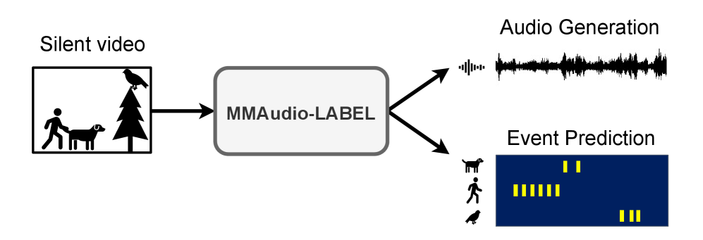
*Figure 1:Overview of MMAudio-LABEL.*

*(a)Parallel Heads (Predictive approach): parallel flow and event heads.*

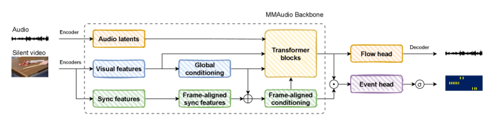
*(a)Parallel Heads (Predictive approach): parallel flow and event heads.*

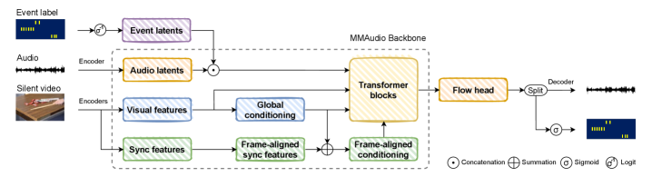
*(b)Joint Heads (Generative approach): unified audio-event heads with split output.*

*(a)VGGish Classifier (Baseline)*

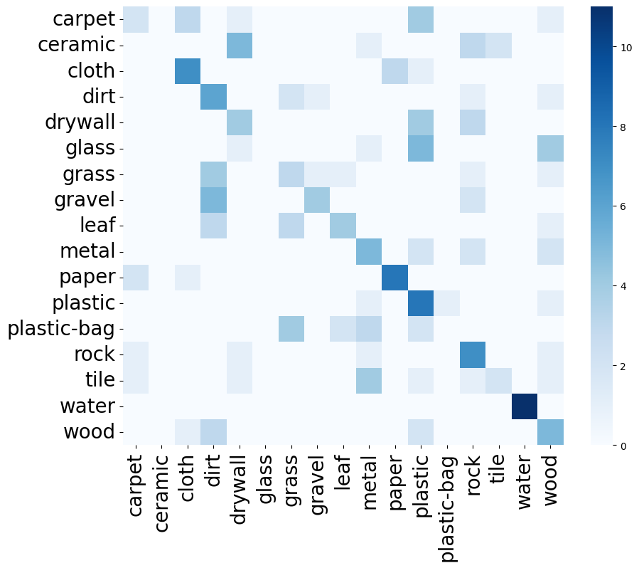
*(a)VGGish Classifier (Baseline)*

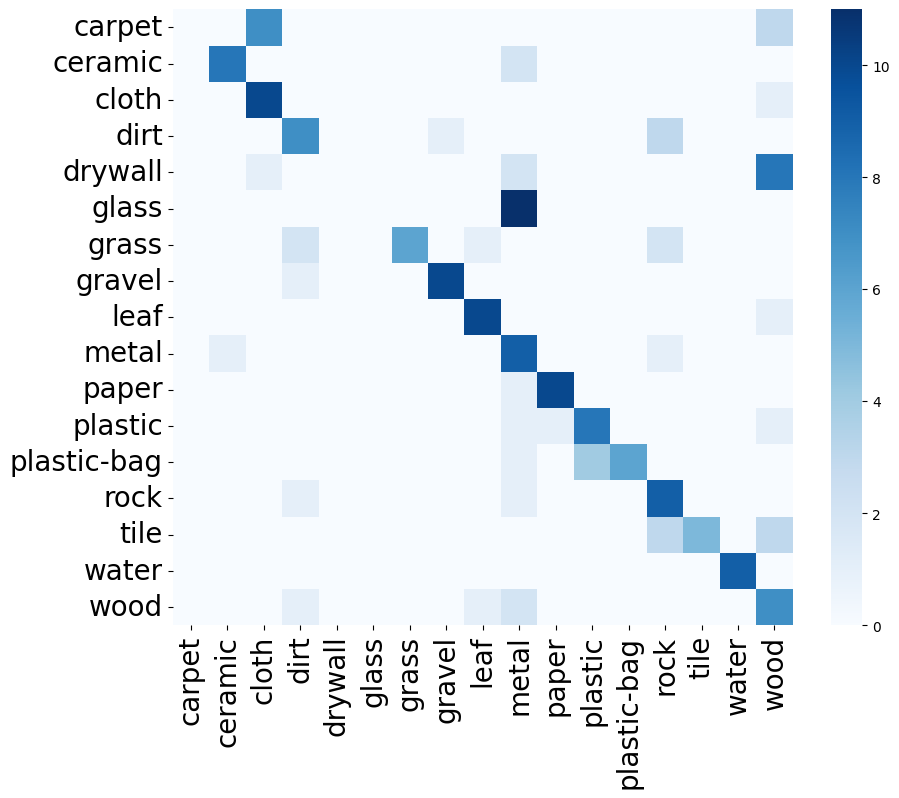
*(b)MMAudio-LABEL (Ours)*

---
**Usage Info**: 2825 tokens used.
**Generated at**: 2026-05-04 16:02:17

---

# 📚 Posterior Augmented Flow Matching

🚀 URL: https://arxiv.org/html/2605.00825

## 🌏 Abstract (원문)
Flow matching (FM) trains a time-dependent vector field that transports samples from a simple prior to a complex data distribution. However, for high-dimensional images, each training sample supervises only a single trajectory and intermediate point, yielding an extremely sparse and high-variance training signal. This under-constrained supervision can cause flow collapse, where the learned dynamics memorize specific source–target pairings, mapping diverse inputs to overly similar outputs, failing to generalize. We introduce Posterior-Augmented Flow Matching (PAFM), a theoretically grounded generalization of FM that replaces single-target supervision with an expectation over an approximate posterior of valid target completions for a given intermediate state and condition. PAFM factorizes this intractable posterior into (i) the likelihood of the intermediate under a hypothesized endpoint and (ii) the prior probability of that endpoint under the condition, and uses an importance sampling scheme to construct a mixture over multiple candidate targets. We prove that PAFM yields an unbiased estimator of the original FM objective while substantially reducing gradient variance during training by aggregating information from many plausible continuation trajectories per intermediate. Finally, we show that PAFM improves over FM by up to 3.4 FID50K across different model scales (SiT-B/2 and SiT-XL/2), different architectures (SiT and MMDiT), and in both class and text conditioned benchmarks (ImageNet and CC12M), with a negligible increase in the compute overhead. Code:https://github.com/gstoica27/PAFM.git.
## 🌏 Abstract (번역)
플로우 매칭(FM)은 단순한 사전 분포에서 복잡한 데이터 분포로 샘플을 전달하는 시간 의존적 벡터 필드를 훈련합니다. 그러나 고차원 이미지의 경우, 각 훈련 샘플은 단일 궤적 및 중간 지점만을 감독하여 극도로 희소하고 분산이 높은 훈련 신호를 생성합니다. 이러한 제약이 부족한 감독은 학습된 동역학이 특정 소스-타겟 쌍을 기억하여 다양한 입력을 지나치게 유사한 출력으로 매핑하고 일반화에 실패하는 '플로우 붕괴'를 유발할 수 있습니다. 본 논문에서는 주어진 중간 상태 및 조건에 대한 유효한 타겟 완성의 근사 사후 분포에 대한 기댓값으로 단일 타겟 감독을 대체하는 이론적으로 근거 있는 FM의 일반화인 후방 증강 플로우 매칭(PAFM)을 소개합니다. PAFM은 이 다루기 힘든 사후 분포를 (i) 가설된 종점 하의 중간 지점의 우도와 (ii) 조건 하의 해당 종점의 사전 확률로 분해하고, 중요도 샘플링 기법을 사용하여 여러 후보 타겟에 대한 혼합을 구성합니다. 우리는 PAFM이 원래 FM 목적 함수의 편향 없는 추정량을 제공하면서, 각 중간 지점당 여러 그럴듯한 연속 궤적의 정보를 통합함으로써 훈련 중 기울기 분산을 크게 줄인다는 것을 증명합니다. 마지막으로, PAFM이 다양한 모델 규모(SiT-B/2 및 SiT-XL/2), 다양한 아키텍처(SiT 및 MMDiT), 그리고 클래스 및 텍스트 조건부 벤치마크(ImageNet 및 CC12M) 모두에서 FM보다 최대 3.4 FID50K 향상되었으며, 계산 오버헤드는 무시할 수 있는 수준임을 보여줍니다.

## 🔍 Methods & Results
- 기존 플로우 매칭(FM)은 고차원 이미지에서 희소하고 분산이 높은 훈련 신호로 인해 '플로우 붕괴' 문제를 겪으며, 이는 학습된 모델이 특정 소스-타겟 쌍을 암기하고 일반화에 실패하게 만듭니다.
- 후방 증강 플로우 매칭(PAFM)을 제안하며, 이는 단일 타겟 감독을 주어진 중간 상태 및 조건에 대한 유효한 타겟 완성의 근사 사후 분포에 대한 기댓값으로 대체합니다.
- PAFM은 다루기 힘든 사후 분포를 (i) 가설된 종점 하의 중간 지점의 우도와 (ii) 조건 하의 해당 종점의 사전 확률로 분해하고, 중요도 샘플링을 통해 여러 후보 타겟의 혼합을 구성합니다.
- PAFM이 원래 FM 목적 함수의 편향 없는 추정량을 제공하며, 각 중간 지점당 여러 그럴듯한 연속 궤적의 정보를 통합하여 훈련 중 기울기 분산을 크게 줄임을 이론적으로 증명했습니다.
- PAFM은 FM 대비 최대 3.4 FID50K의 성능 향상을 보였으며, 이는 SiT-B/2, SiT-XL/2와 같은 다양한 모델 규모, SiT, MMDiT와 같은 다양한 아키텍처, 그리고 ImageNet, CC12M과 같은 클래스 및 텍스트 조건부 벤치마크 모두에서 확인되었습니다.
- PAFM은 계산 오버헤드가 무시할 수 있는 수준으로, 효율적인 성능 향상을 제공합니다.

## 🖼 Figures

*Figure 1: Left: Standard FM provides a sparse, one-to-one supervision signal, pairing each intermediate point with a single target and yielding a single plausible flow. Right: Our PAFM aggregates supervision over the full posterior of compatible targets, producing a denser, more coherent set of plausible flows from each intermediate.*

*Figure 2:Posterior augmented flow matching is more robust than flow matching. We train two rectified flow models to generate two crescent moon distributions (left). Second-left: a model trained with FM generates many points in between the two moons. Second-right: the same model trained with PAFM has far less of an issue. Right: PAFM estimates the true velocity field across 
𝑡
 significantly better.*

*Table 4: PAFM marginally increases overhead. Computational overhead comparison between FM and PAFM with 
𝐾
=
32
 neighbors on CC12M 256
×
256 with MMDiT. Benchmarked on 8
×
H100 GPUs with total batch size of 256.*

![Figure C.1:Posterior augmented flow matching learns the target distribution better under data sparsity. We train two rectified flow models to generate two crescent moon distributions, under different data sparsity regimes. Column titles indicate the total number of training data points given to each model. Rows indicate the source used for generating targets: the “Ground Truth” distribution (top), the trained “FM” model (middle), and the trained “PAFM” model (bottom). Each plot shows kernel density estimates (KDE) for the generated target distribution.](../images/2026-05-04/2605.00825/2605.00825_fig8.png)
*Figure C.1:Posterior augmented flow matching learns the target distribution better under data sparsity. We train two rectified flow models to generate two crescent moon distributions, under different data sparsity regimes. Column titles indicate the total number of training data points given to each model. Rows indicate the source used for generating targets: the “Ground Truth” distribution (top), the trained “FM” model (middle), and the trained “PAFM” model (bottom). Each plot shows kernel density estimates (KDE) for the generated target distribution.*

---
**Usage Info**: 1958 tokens used.
**Generated at**: 2026-05-04 16:02:26

---

