# 🚩 (2026-05-05) Scholar Inbox 추천 논문 

# 📚 Tibetan-TTS: Low-Resource Tibetan Speech Synthesis with Large Model Adaptation

🚀 URL: https://arxiv.org/html/2605.02496

## 🌏 Abstract (원문)
Tibetan text-to-speech (TTS) has long been challenged by scarce speech resources, significant dialectal variation, and the complex mapping between written text and spoken pronunciation. To address these issues, this work presents, to the best of our knowledge, the first large-model-based Tibetan TTS system in the industry, built upon a large speech synthesis model developed by Xingchen AGI Lab. The proposed system integrates data quality enhancement, Tibetan-oriented text representation and tokenizer adaptation, and cross-lingual adaptive training for low-resource Tibetan speech synthesis. Experimental results show that the system can generate stable, natural, and intelligible Tibetan speech under low-resource conditions. In subjective evaluation, the MOS scores of the syllable-level and BPE-based systems reach 4.28 and 4.35, while their pronunciation accuracies reach 97.6% and 96.6%, respectively, outperforming an external commercial Tibetan TTS interface. These results demonstrate that combining a large-model backbone with Tibetan-oriented text representation adaptation and cross-lingual adaptive training enables highly usable low-resource Tibetan speech synthesis, and also provides a technical foundation for future unified multi-dialect Tibetan speech synthesis.
## 🌏 Abstract (번역)
티베트어 텍스트 음성 변환(TTS)은 오랫동안 부족한 음성 자원, 상당한 방언적 변이, 그리고 쓰여진 텍스트와 발화된 발음 간의 복잡한 매핑으로 인해 어려움을 겪어왔습니다. 이러한 문제들을 해결하기 위해, 본 연구는 Xingchen AGI Lab에서 개발한 대규모 음성 합성 모델을 기반으로 구축된, 업계 최초의 대규모 모델 기반 티베트어 TTS 시스템을 제시합니다. 제안된 시스템은 저자원 티베트어 음성 합성을 위해 데이터 품질 향상, 티베트어 지향 텍스트 표현 및 토크나이저 적응, 그리고 교차 언어 적응 훈련을 통합합니다. 실험 결과는 이 시스템이 저자원 조건에서도 안정적이고 자연스러우며 명료한 티베트어 음성을 생성할 수 있음을 보여줍니다. 주관적 평가에서 음절 수준 및 BPE 기반 시스템의 MOS 점수는 각각 4.28과 4.35에 도달했으며, 발음 정확도는 각각 97.6%와 96.6%에 도달하여 외부 상업용 티베트어 TTS 인터페이스를 능가했습니다. 이러한 결과는 대규모 모델 백본과 티베트어 지향 텍스트 표현 적응 및 교차 언어 적응 훈련의 결합이 매우 유용한 저자원 티베트어 음성 합성을 가능하게 하며, 미래의 통합 다중 방언 티베트어 음성 합성을 위한 기술적 기반을 제공함을 입증합니다.

## 🔍 Methods & Results
- 티베트어 TTS의 주요 과제인 저자원 모델링, 복잡한 텍스트-음성 매핑, 상당한 방언적 변이를 해결하기 위해 대규모 모델 기반 시스템을 제안한다.
- 백본 모델로 Xingchen AGI Lab에서 개발한 대규모 음성 합성 모델을 채택했으며, 이는 AR 언어 모델과 Flow Matching을 결합한 2단계 음성 생성 아키텍처를 따른다.
- 이 모델은 약 20만 시간의 중국어-영어 혼합 음성 데이터와 5천 시간의 다중 방언 음성 데이터로 사전 훈련되어 강력한 교차 언어 표현 및 생성 능력을 갖추고 있다.
- 저자원, 다중 소스, 비이상적인 티베트어 데이터를 위한 통합 품질 향상 파이프라인을 구축하여 오디오 처리, 텍스트 정규화, 음성-텍스트 일관성 검증을 수행한다.
- 티베트어 언어적 특성에 더 잘 맞는 텍스트 표현 및 토크나이저 적응 방법을 제안한다. 이는 음절 수준 모델링과 티베트어 코퍼스에서 훈련된 BPE 토크나이저 교체를 포함한다.
- 저자원 시나리오를 위한 교차 언어 적응 훈련 전략을 사용하며, 이는 사전 훈련된 대규모 모델의 보편적 음성 표현 능력을 활용하고 티베트어 음성-텍스트 병렬 데이터로 경량 미세 조정을 수행한다.
- 실험 결과, 제안된 시스템은 저자원 조건에서 안정적이고 자연스러우며 명료한 티베트어 음성을 생성한다.
- 주관적 평가에서 음절 수준 시스템은 MOS 4.28점, 발음 정확도 97.6%를 달성했으며, BPE 기반 시스템은 MOS 4.35점, 발음 정확도 96.6%를 달성하여 외부 상업용 티베트어 TTS 인터페이스보다 우수한 성능을 보였다.

## 🖼 Figures
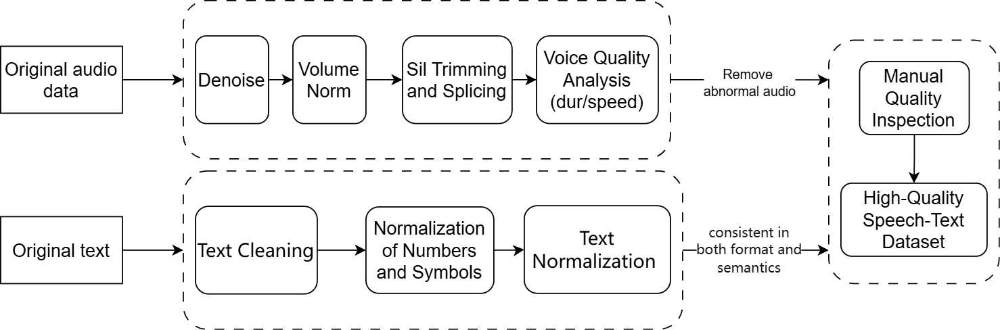
*Figure 1:Unified quality enhancement pipeline for low-resource multi-source Tibetan speech data*

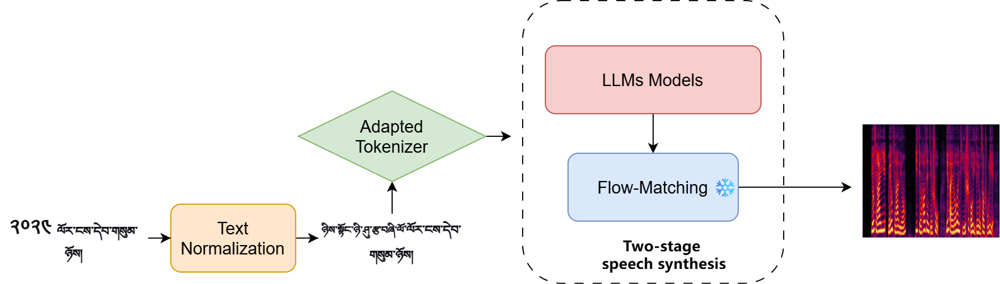
*Figure 2:Overall architecture of the TTS system*

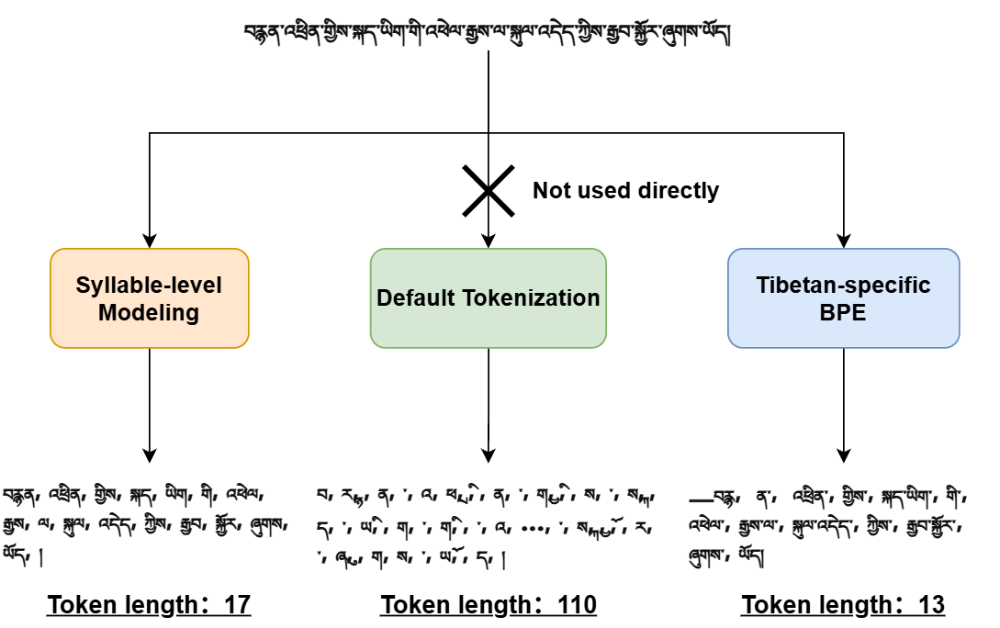
*Figure 3:Illustration of Tibetan-oriented text representation and tokenizer adaptation*

---
**Usage Info**: 5054 tokens used.
**Generated at**: 2026-05-05 15:58:18

---

# 📚 MelShield: Robust Mel-Domain Audio Watermarking for Provenance Attribution of AI Generated Synthesized Speech

🚀 URL: https://arxiv.org/html/2605.01515

## 🌏 Abstract (원문)
In this paper, we propose MelShield, a robust, in-generation, keyed audio watermarking framework that embeds identifiable signals into AI-generated audio for copyright protection and reliable attribution. Specifically, MelShield operates in the Mel-spectrogram domain during the generation process, targeting intermediate acoustic representations in Mel-conditioned pipelines for text-to-speech (TTS) generation. The core idea is to treat the intermediate Mel-spectrogram as the host signal and embed a short binary payload via low-energy, keyed spread-spectrum perturbations distributed across carefully selected time–frequency regions prior to waveform synthesis. By performing watermarking before vocoder inference, MelShield remains plug-and-play for Mel-conditioned TTS architectures and does not require modification or retraining of the underlying TTS generation vocoder, such as DiffWave and HiFi-GAN. Moreover, the multi-user keyed construction enables scalable user-specific attribution, while the keyed verification mechanism limits unauthorized decoding, thereby reducing the risk of large-scale extractor probing and adversarial analysis. Extensive experiments on DiffWave and HiFi-GAN demonstrate that MelShield achieves reliable watermark extraction, approaching 100% bit accuracy, even under signal distortions, e.g., compression and additive noise, while preserving high perceptual audio quality.
## 🌏 Abstract (번역)
본 논문에서는 저작권 보호 및 신뢰할 수 있는 출처 표기를 위해 AI 생성 오디오에 식별 가능한 신호를 삽입하는 강력한 인-생성(in-generation) 키 기반 오디오 워터마킹 프레임워크인 MelShield를 제안한다. 특히, MelShield는 텍스트-음성 변환(TTS) 생성을 위한 멜 조건부 파이프라인에서 중간 음향 표현을 대상으로 하여 생성 과정 중 멜-스펙트로그램 도메인에서 작동한다. 핵심 아이디어는 중간 멜-스펙트로그램을 호스트 신호로 취급하고, 파형 합성 전에 신중하게 선택된 시간-주파수 영역에 분산된 저에너지 키 기반 확산 스펙트럼 교란을 통해 짧은 이진 페이로드를 삽입하는 것이다. 보코더 추론 전에 워터마킹을 수행함으로써, MelShield는 멜 조건부 TTS 아키텍처에 대해 플러그 앤 플레이 방식으로 작동하며, DiffWave 및 HiFi-GAN과 같은 기본 TTS 생성 보코더의 수정이나 재훈련을 필요로 하지 않는다. 또한, 다중 사용자 키 기반 구성은 확장 가능한 사용자별 출처 표기를 가능하게 하며, 키 기반 검증 메커니즘은 무단 디코딩을 제한하여 대규모 추출기 탐색 및 적대적 분석의 위험을 줄인다. DiffWave 및 HiFi-GAN에 대한 광범위한 실험은 MelShield가 압축 및 가산 잡음과 같은 신호 왜곡 하에서도 높은 지각적 오디오 품질을 유지하면서 거의 100%의 비트 정확도에 근접하는 신뢰할 수 있는 워터마크 추출을 달성함을 보여준다.

## 🔍 Methods & Results
- MelShield는 AI 생성 오디오의 출처 표기를 위해 신경망 TTS 시스템에서 중간 멜-스펙트로그램에 사용자 또는 모델별 워터마크를 삽입하는 것을 목표로 한다.
- 워터마크는 파형 합성 전, 멜-스펙트로그램 도메인에서 저에너지 키 기반 확산 스펙트럼 교란을 통해 짧은 이진 페이로드를 삽입하는 방식으로 작동한다.
- 이 방법은 보코더 추론 전에 워터마킹을 수행하여 DiffWave 및 HiFi-GAN과 같은 멜 조건부 TTS 아키텍처에 플러그 앤 플레이 방식으로 적용 가능하며, 기본 보코더의 수정이나 재훈련이 필요 없다.
- 검증은 참조 기반 설정에서 이루어지며, 정당한 소유자는 생성 시점의 참조 멜-스펙트로그램을 보유한다.
- 워터마크는 압축, 재샘플링, 가산 잡음, 진폭 스케일링, 잔향 등 일반적인 배포 채널 왜곡에 대해 견고하게 유지되도록 설계되었다.
- 다중 사용자 키 기반 구성은 확장 가능한 사용자별 출처 표기를 가능하게 하며, 키 기반 검증 메커니즘은 무단 디코딩을 제한하여 보안을 강화한다.
- 삽입된 워터마크는 최소한의 지각 가능한 교란만을 도입하여, 워터마크가 없는 생성물과 유사한 높은 지각적 오디오 품질을 보장한다.
- DiffWave 및 HiFi-GAN에 대한 실험 결과, MelShield는 신호 왜곡 하에서도 거의 100%의 비트 정확도로 신뢰할 수 있는 워터마크 추출을 달성하며 높은 지각적 오디오 품질을 유지함을 입증했다.

## 🖼 Figures
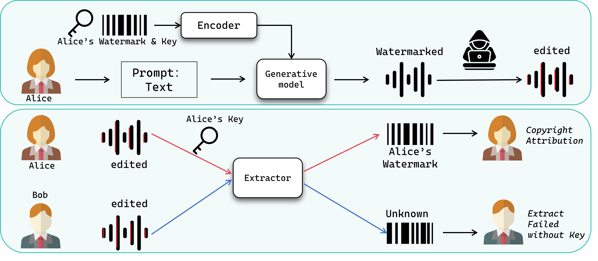
*Figure 1:Workflow of keyed audio watermark embedding and owner-side verification for copyright attribution.*

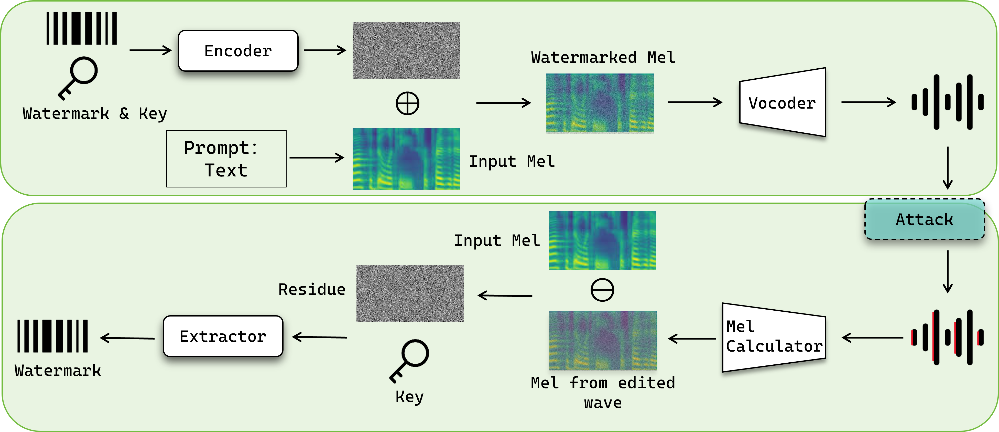
*Figure 2:Workflow of Audio Watermark Embedding and Verification*

*Figure 3:Bit-wise accuracy distributions of the key-conditioned verification statistic 
𝑆
=
BitAcc
​
(
𝐦
,
𝐦
^
)
 under 
𝐻
0
 (no watermark or wrong key) and 
𝐻
1
 (correct key).*

*Figure 4:DiffWave: Maximum watermark payload capacity under a perceptual quality constraint (PESQ 
≥
 3.5).*

*Figure 4:DiffWave: Maximum watermark payload capacity under a perceptual quality constraint (PESQ 
≥
 3.5).*

*Figure 5:HiFi-GAN: Maximum watermark payload capacity under a perceptual quality constraint (PESQ 
≥
 3.5).*

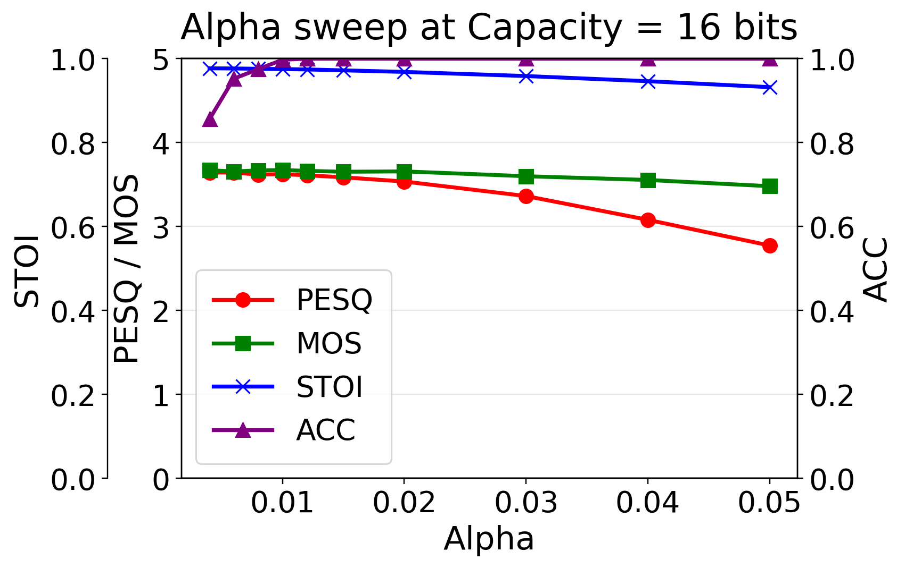
*(a)16 bits*

*(a)16 bits*

*(b)32 bits*

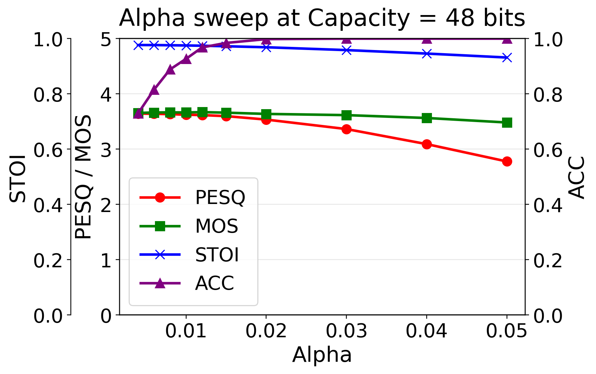
*(c)48 bits*

*(d)64 bits*

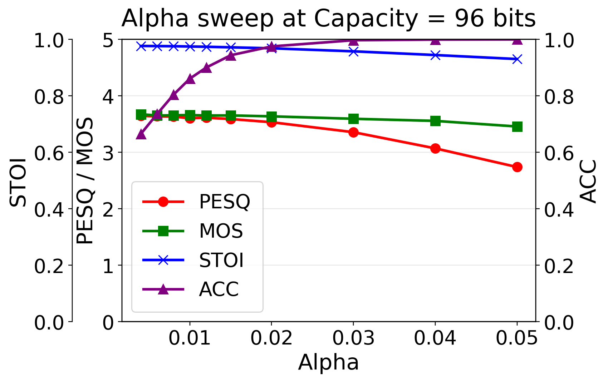
*(e)96 bits*

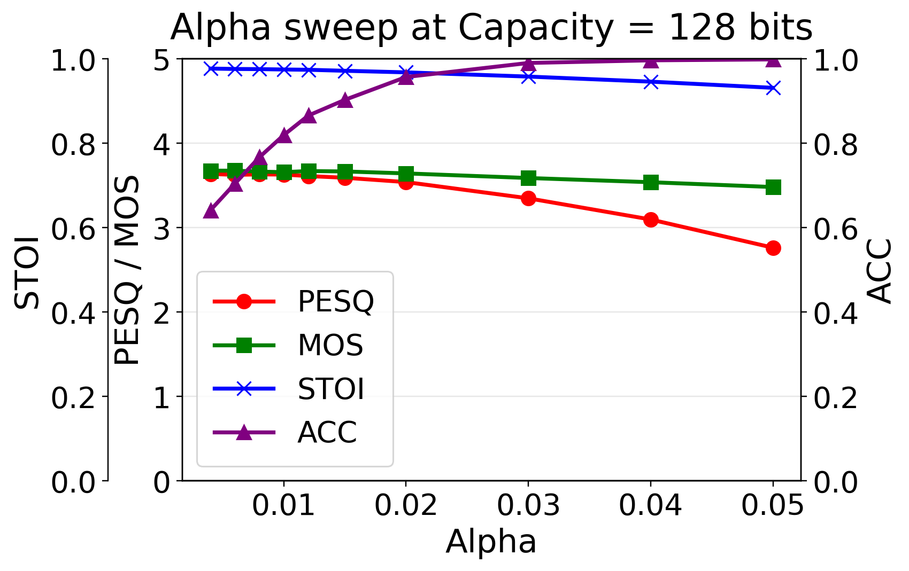
*(f)128 bits*

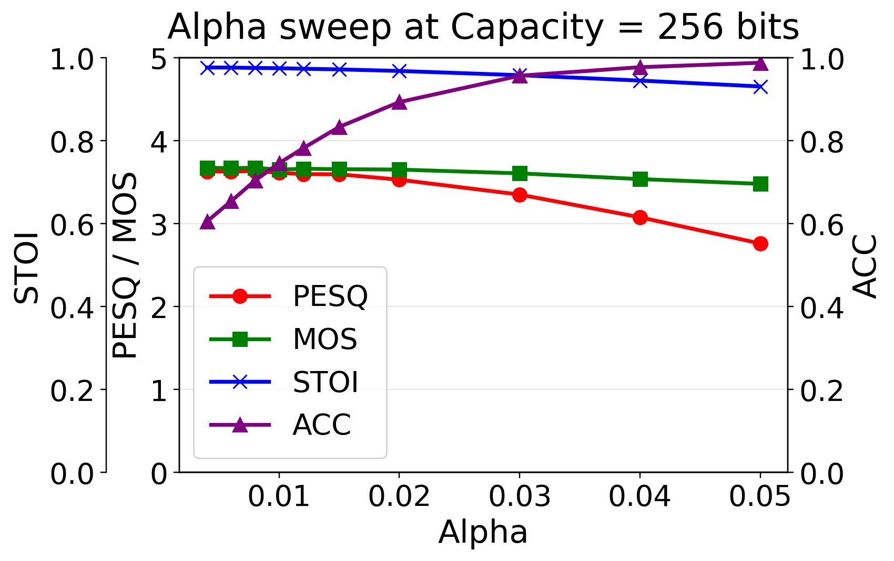
*(g)256 bits*

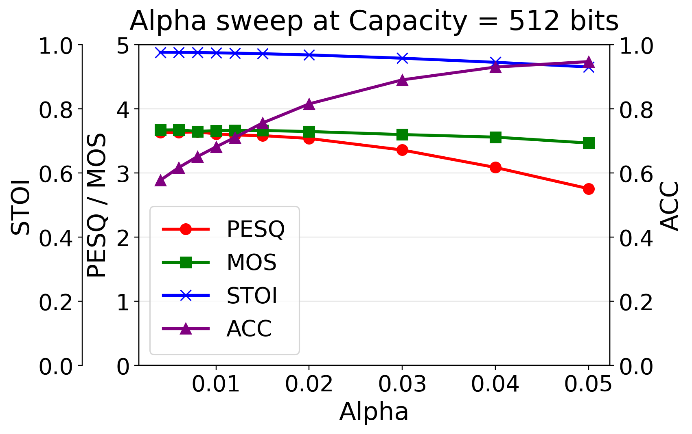
*(h)512 bits*

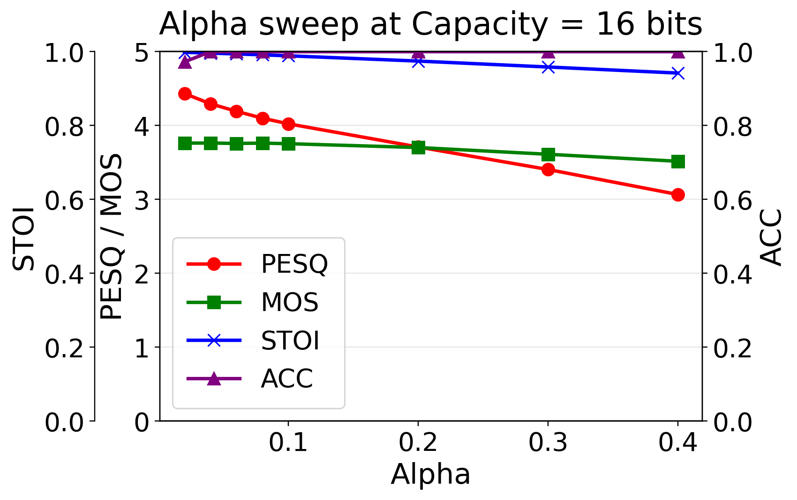
*(a)16 bits*

*(a)16 bits*

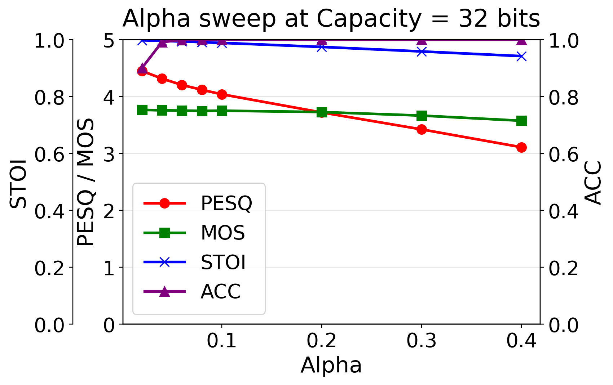
*(b)32 bits*

*(c)48 bits*

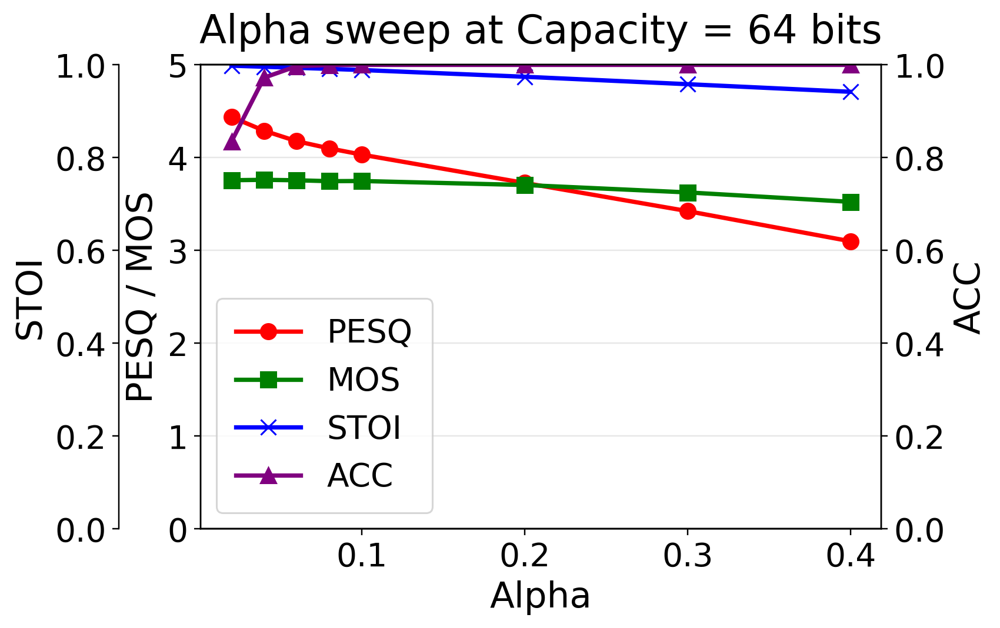
*(d)64 bits*

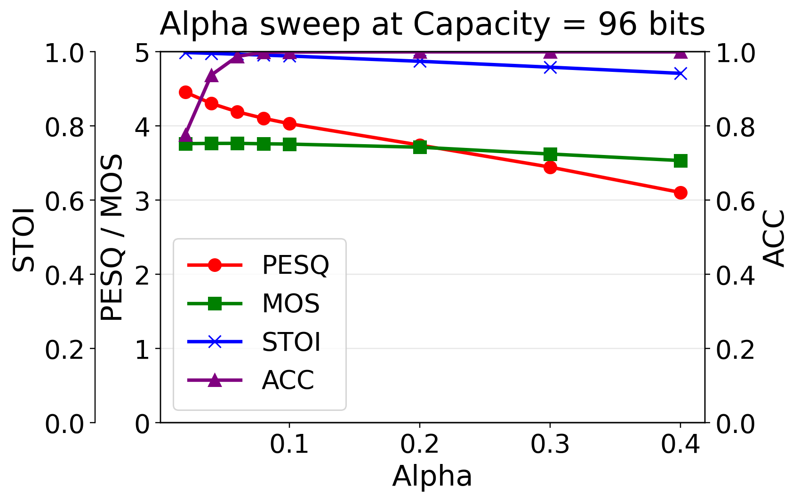
*(e)96 bits*

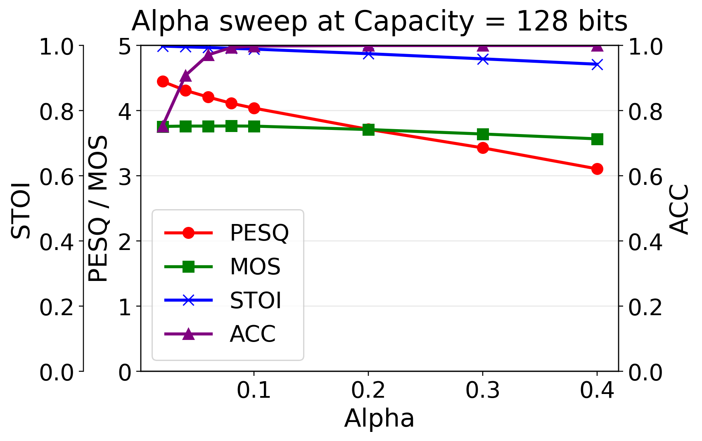
*(f)128 bits*

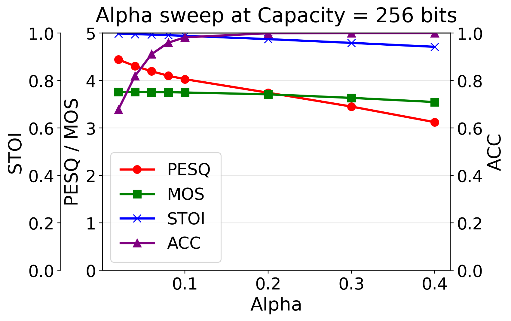
*(g)256 bits*

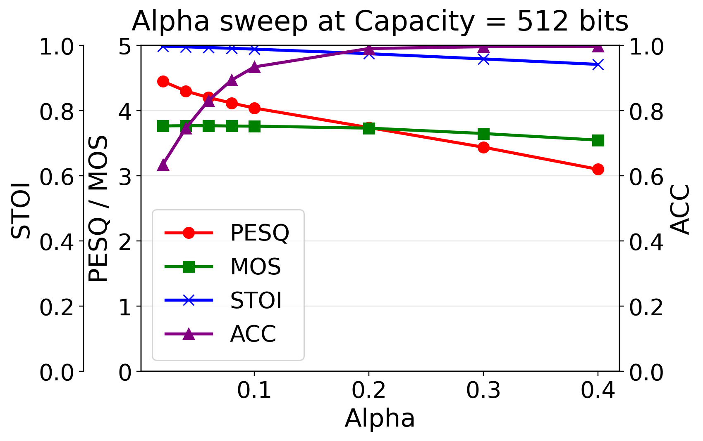
*(h)512 bits*

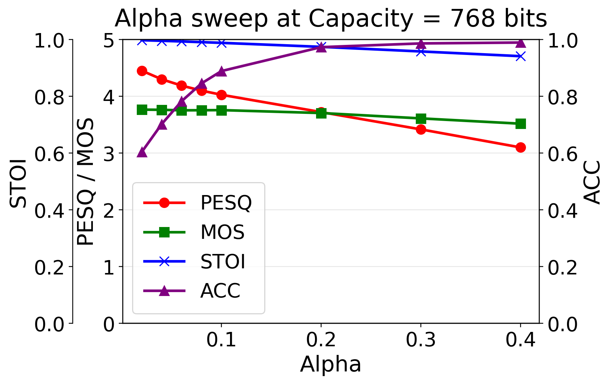
*(i)768 bits*

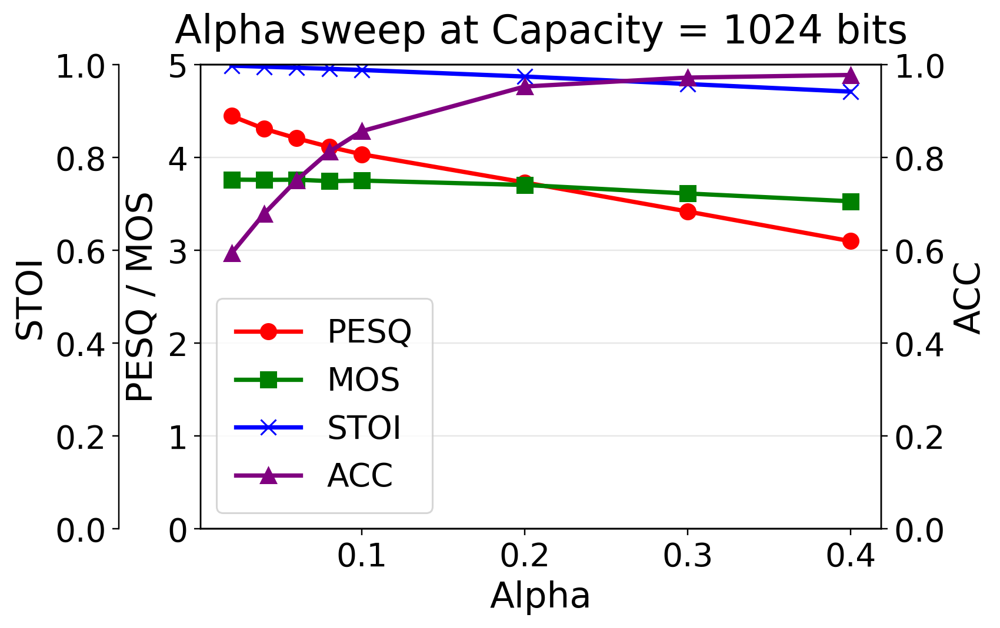
*(j)1024 bits*

---
**Usage Info**: 3934 tokens used.
**Generated at**: 2026-05-05 15:58:46

---

# 📚 Khala: Scaling Acoustic Token Language Models Toward High-Fidelity Music Generation

🚀 URL: https://arxiv.org/html/2605.01790

## 🌏 Abstract (원문)
A common design pattern in high-quality music generation is to handle structure and fidelity in different representation spaces: a generator first models high-level structure, followed by diffusion-based or neural decoding stages that reconstruct fine details. In this work, we explore an alternative view: both may be progressively modeled within a single deep acoustic-token hierarchy. To study this, we build a 64-layer residual vector quantization (RVQ) acoustic representation and propose a two-stage coarse-to-fine generation framework. A backbone model first generates coarse acoustic tokens for the full track, and a super-resolution model then completes finer tokens within the same acoustic token space. The super-resolution stage works at full-track scale and refines tokens layer by layer while running in parallel over time, leading to a fixed 62-step inference process. To jointly improve lyric alignment and fine-detail reconstruction, we further introduce hybrid-attention training: the alignment objective uses causal attention, while layer-wise refinement uses full attention. A key finding is that text–vocal alignment can emerge within pure acoustic-token language modeling, without requiring a separate semantic token stage. Moreover, initializing the super-resolution model from the trained backbone significantly improves convergence and final quality. Taken together, our results suggest that high-quality music generation can be effectively pursued without separating structure and fidelity into heterogeneous representation spaces. Instead, both can be progressively modeled within a unified acoustic-token hierarchy, pointing toward a simpler and more unified path to high-quality music generation. Code and model checkpoints are available athttps://github.com/Khala-Music-AI/Khala.
## 🌏 Abstract (번역)
고품질 음악 생성의 일반적인 설계 패턴은 구조와 충실도를 다른 표현 공간에서 처리하는 것입니다. 즉, 생성기가 먼저 고수준 구조를 모델링한 다음, 확산 기반 또는 신경 디코딩 단계를 통해 미세한 세부 사항을 재구성합니다. 본 연구에서는 두 가지 모두 단일 심층 음향 토큰 계층 내에서 점진적으로 모델링될 수 있다는 대안적인 관점을 탐구합니다. 이를 연구하기 위해 우리는 64개 레이어의 잔여 벡터 양자화(RVQ) 음향 표현을 구축하고 2단계의 거친-세밀 생성 프레임워크를 제안합니다. 백본 모델은 먼저 전체 트랙에 대한 거친 음향 토큰을 생성하고, 슈퍼 해상도 모델은 동일한 음향 토큰 공간 내에서 더 미세한 토큰을 완성합니다. 슈퍼 해상도 단계는 전체 트랙 규모로 작동하며 시간에 따라 병렬로 실행되면서 토큰을 레이어별로 정제하여 고정된 62단계 추론 프로세스를 이끌어냅니다. 가사 정렬 및 미세 세부 사항 재구성을 공동으로 개선하기 위해 하이브리드 어텐션 훈련을 추가로 도입합니다. 정렬 목표는 인과적 어텐션을 사용하고, 레이어별 정제는 전체 어텐션을 사용합니다. 핵심 발견은 별도의 의미 토큰 단계 없이도 순수 음향 토큰 언어 모델링 내에서 텍스트-보컬 정렬이 나타날 수 있다는 것입니다. 또한, 훈련된 백본에서 슈퍼 해상도 모델을 초기화하면 수렴 및 최종 품질이 크게 향상됩니다. 종합적으로 볼 때, 우리의 결과는 고품질 음악 생성이 구조와 충실도를 이질적인 표현 공간으로 분리하지 않고도 효과적으로 추구될 수 있음을 시사합니다. 대신, 둘 다 통합된 음향 토큰 계층 내에서 점진적으로 모델링될 수 있으며, 이는 고품질 음악 생성으로 가는 더 간단하고 통합된 경로를 제시합니다. 코드와 모델 체크포인트는 https://github.com/Khala-Music-AI/Khala 에서 확인할 수 있습니다.

## 🔍 Methods & Results
- 기존의 단순한 접근 방식(전체 계층을 단일 1D 시퀀스로 평탄화)은 긴 시퀀스 길이와 복잡성으로 인해 비실용적이며 비효율적입니다.
- 2단계 음향 토큰 생성 프레임워크를 채택했습니다: 백본 모델은 전체 트랙의 거친 음향 스캐폴드를 생성하고, 슈퍼 해상도(SR) 모델은 이 스캐폴드를 기반으로 나머지 상위 양자화 레이어를 점진적으로 예측합니다.
- 백본 모델은 텍스트 조건(프롬프트, 목표 길이, 가사)과 저수준 음향 토큰 스트림(q0, q1)을 입력으로 받아 인과적 어텐션 마스크를 사용하여 다음 토큰 예측 방식으로 훈련됩니다.
- 슈퍼 해상도(SR) 모델은 하위 레이어에 조건화하여 계층을 점진적으로 정제합니다. 각 목표 레이어(qN)에 대해 SR 모델은 텍스트 조건과 이전에 사용 가능한 모든 하위 레이어 양자화 표현의 합계를 받아 목표 레이어의 전체 시간 시퀀스를 예측합니다.
- SR 모델은 양자화 레이어 간에는 순차적이지만 각 레이어 내에서는 시간 단계에 걸쳐 병렬로 정제하며, 백본이 제공하는 q0 및 q1 스캐폴드에 기반하여 q2부터 q63까지 예측합니다.
- 이 설계는 전체 트랙 규모에서 고정된 62단계 슈퍼 해상도 프로세스를 통해 추론 효율성을 향상시킵니다.
- 초기 SR 모델 훈련(전체 어텐션 사용)은 음향 품질을 개선하지만, 텍스트가 시간적으로 고정되지 않아 가사와 보컬의 안정적인 정렬을 생성하지 못하는 문제가 발생했습니다.
- 가사 정렬 문제를 해결하기 위해 하이브리드 어텐션 훈련 방식을 도입했습니다: 인과적 정렬 목표(Task 0)는 첫 번째 음향 레이어(q0)에 대한 인과적 어텐션을 사용하여 텍스트-기반 시간 스캐폴드를 유도하며 훈련 중에만 사용됩니다.
- 하이브리드 어텐션 훈련의 레이어별 정제 목표(Task 1)는 전체 어텐션을 사용하여 레이어별 슈퍼 해상도를 수행하며 추론 시 사용됩니다.
- 핵심 발견은 학습 목표가 적절하게 설계될 때 별도의 의미 단계 없이도 순수 음향 토큰 언어 모델링 내에서 텍스트-보컬 정렬이 나타날 수 있다는 것입니다.
- 훈련된 백본 모델로 슈퍼 해상도 모델을 초기화하는 것이 수렴 속도와 최종 생성 품질을 크게 향상시켰습니다.

## 🖼 Figures

*Figure 1:Overview of the neural audio codec and the resulting residual vector quantization hierarchy. Waveform audio is encoded into a stack of acoustic token layers, where lower layers capture coarse structure and deeper layers progressively encode finer residual detail.*

*Figure 2:Overview of the proposed two-stage music generation framework. A backbone language model first generates coarse acoustic tokens for the full track, and a super-resolution model then refines the hierarchy layer by layer to recover higher-fidelity acoustic detail within the same token space.*

---
**Usage Info**: 3602 tokens used.
**Generated at**: 2026-05-05 15:58:58

---

# 📚 From Euler to Dormand–Prince: ODE Solvers for Flow Matching Generative Models

🚀 URL: https://arxiv.org/html/2605.00836

## 🌏 Abstract (원문)
Sampling from Flow Matching models requires solving an ODE whose cost is dominated by neural network evaluations. We derive four solvers (Euler, Midpoint, RK4, Dormand–Prince) from Taylor expansion, implement them in PyTorch, and benchmark on tasks from 2D toys to MNIST. RK4 at 80 function evaluations matches Euler at 200. The adaptive Dormand–Prince solver concentrates steps neart=1t{=}1where the velocity field stiffens, as we confirm via Jacobian eigenvalue measurements.
## 🌏 Abstract (번역)
플로우 매칭 모델에서 샘플링하려면 신경망 평가가 비용의 대부분을 차지하는 ODE를 풀어야 합니다. 우리는 테일러 전개로부터 네 가지 솔버(오일러, 미드포인트, RK4, 도르만-프린스)를 도출하고, 이를 PyTorch로 구현한 다음, 2D 토이 문제부터 MNIST에 이르는 다양한 태스크에서 벤치마킹했습니다. 80번의 함수 평가를 수행한 RK4는 200번의 함수 평가를 수행한 오일러와 동일한 성능을 보였습니다. 적응형 도르만-프린스 솔버는 속도장(velocity field)이 강해지는 t=1 근처에 스텝을 집중시키며, 이는 야코비안 고유값 측정으로 확인되었습니다.

## 🔍 Methods & Results
- 플로우 매칭 모델의 ODE 해결을 위해 테일러 전개로부터 오일러, 미드포인트, RK4, 도르만-프린스 네 가지 솔버를 도출하고 PyTorch로 구현했습니다.
- 2D 토이 문제부터 MNIST까지 다양한 태스크에서 솔버들을 벤치마킹했습니다.
- RK4 솔버는 80번의 함수 평가로 200번의 함수 평가를 수행한 오일러 솔버와 동등한 성능을 달성했습니다.
- 적응형 도르만-프린스 솔버는 속도장이 강해지는 t=1 근처에 스텝을 집중시키는 경향을 보였습니다.
- 야코비안 고유값 측정을 통해 t=1 근처에서 속도장이 강해지는 현상을 확인했습니다.

## 🖼 Figures

*Figure 1:Stability regions 
{
𝑧
∈
ℂ
:
|
𝑅
​
(
𝑧
)
|
≤
1
}
. RK4’s region extends to 
Re
​
(
𝑧
)
≈
−
2.78
, roughly three times further than Euler’s.*

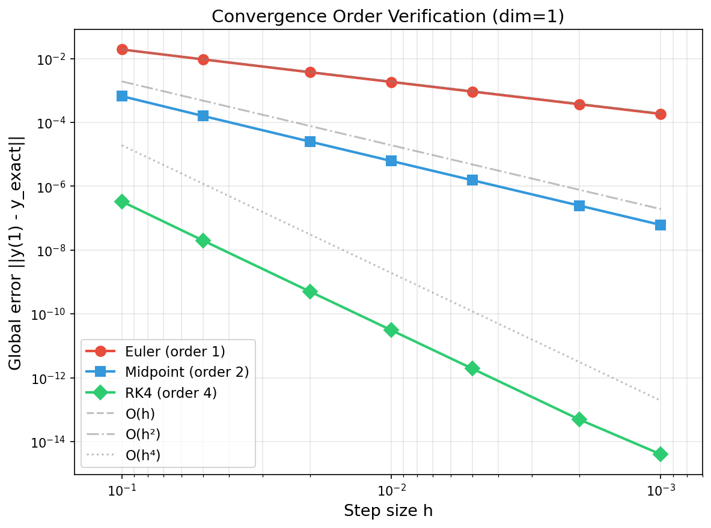
*Figure 2:Global error vs. step size (log-log). Dashed lines show the theoretical slopes.*

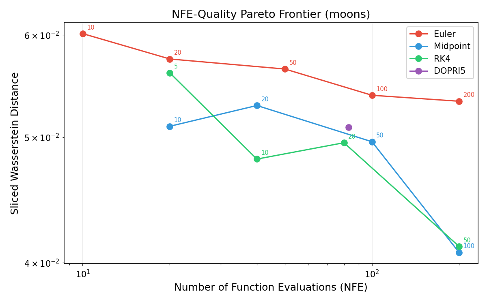
*Figure 3:NFE–quality Pareto frontier (moons). Numbers next to markers indicate step counts. Lower-right is better.*

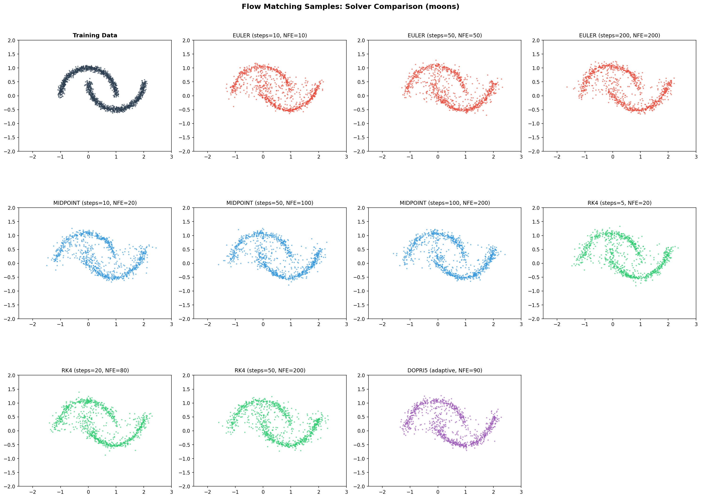
*Figure 4:Generated samples (moons) across solver configurations.*

*Figure 5:Left: Jacobian eigenvalues (real part) along the trajectory; shading shows 
±
1
 std across 200 samples. Right: condition number. The stiffening near 
𝑡
=
1
 explains why more steps are needed at the end.*

*Figure 6:DOPRI5 step sizes vs. time (left) and their distribution (right). The solver concentrates effort near 
𝑡
=
1
.*

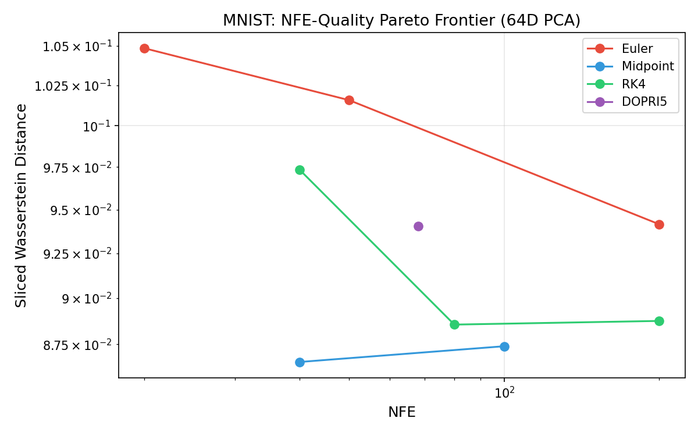
*Figure 7:NFE–quality Pareto frontier on MNIST (64D PCA latent).*

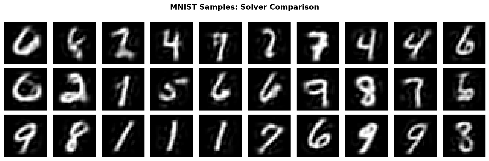
*Figure 8:MNIST samples decoded from PCA latent space. Rows: Euler (50 steps), RK4 (20 steps), DOPRI5 (adaptive).*

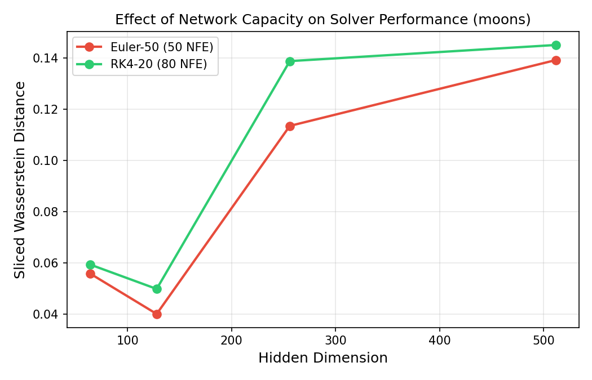
*Figure 9:SWD vs. hidden dimension. The quality gap between Euler and RK4 is widest for small networks.*

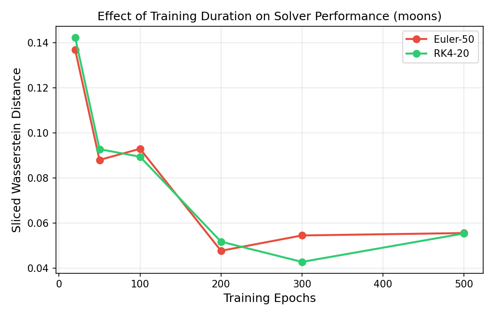
*Figure 10:SWD vs. training epochs. RK4’s advantage is largest for undertrained models.*

*Figure 11:Euler on 
𝑦
′
=
−
15
​
𝑦
: stable (left) vs. unstable (right).*

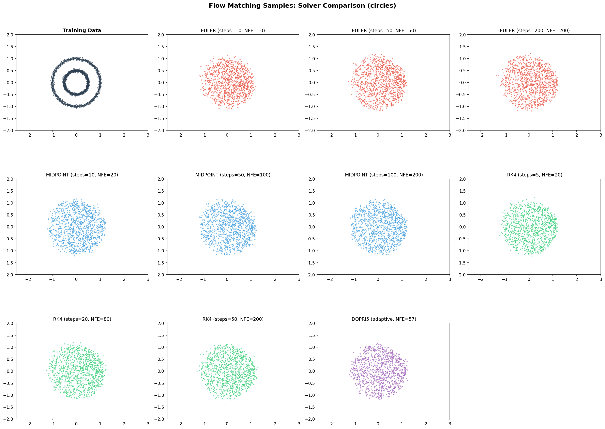
*Figure 12:Solver comparison on the circles dataset.*

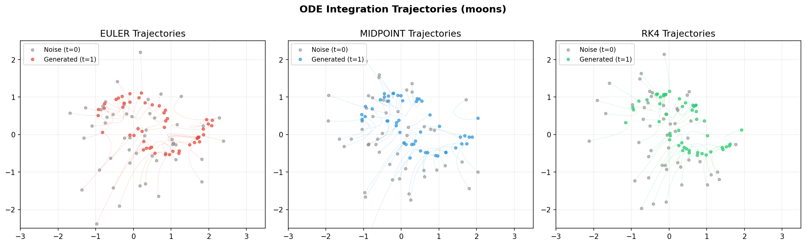
*Figure 13:ODE trajectories on the moons dataset (50 steps each). Euler paths wander; RK4 paths are nearly straight—reflecting the OT structure of the learned velocity field.*

---
**Usage Info**: 1459 tokens used.
**Generated at**: 2026-05-05 15:59:06

---

