# 🚩 (2026-05-11) Scholar Inbox 추천 논문 

# 📚 Trajectory as the Teacher: Few-Step Discrete Flow Matching via Energy-Navigated Distillation

🚀 URL: https://arxiv.org/html/2605.07924

## 🌏 Abstract (원문)
Discrete flow matching generates text by iteratively transforming noise tokens into coherent language, but may require hundreds of forward passes. Distillation uses the multi-step trajectory to train a student to reproduce the process in a few steps. When the student underperforms, the usual explanation is insufficient capacity. We argue the opposite:the trajectory is the bottleneck, not the student. Each training trajectory is built through a chain of blind stochastic jumps with no evaluation of sequence quality; a single bad decision at an early midpoint propagates through subsequent steps, yet the student must imitate the result. Trajectory-Shaped Discrete Flow Matching (TS-DFM) replaces these blind jumps with guided navigation: a lightweight energy compass evaluates candidate continuations at each midpoint, selecting the most coherent. All shaping is training-only; inference cost is unchanged. On 170M-parameter language modeling, the shaped student at 8 steps achieves 32% lower perplexity than the1
0241\,024-step teacher while being128×128\timesfaster, with gains consistent across source distributions and three evaluators of increasing scale. TS-DFM achieves the best perplexity of any discrete-generation baseline we compare against, including methods trained on6×6\timesmore data or using5×5\timeslarger models.
## 🌏 Abstract (번역)
이산 흐름 매칭(Discrete flow matching)은 노이즈 토큰을 일관된 언어로 반복적으로 변환하여 텍스트를 생성하지만, 수백 번의 순방향 패스를 필요로 할 수 있습니다. 증류(Distillation)는 다단계 궤적을 사용하여 학생 모델이 이 과정을 몇 단계 만에 재현하도록 훈련시킵니다. 학생 모델의 성능이 저조할 때, 일반적인 설명은 용량 부족입니다. 우리는 그 반대라고 주장합니다: 병목 현상은 학생 모델이 아니라 궤적입니다. 각 훈련 궤적은 시퀀스 품질에 대한 평가 없이 맹목적인 확률적 점프의 사슬을 통해 구축됩니다. 초기 중간 지점에서 단 한 번의 잘못된 결정이 후속 단계로 전파되지만, 학생 모델은 그 결과를 모방해야 합니다. 궤적 형성 이산 흐름 매칭(Trajectory-Shaped Discrete Flow Matching, TS-DFM)은 이러한 맹목적인 점프를 안내된 탐색으로 대체합니다: 경량 에너지 컴파스가 각 중간 지점에서 후보 연속을 평가하여 가장 일관된 것을 선택합니다. 모든 형성(shaping)은 훈련 시에만 적용되며, 추론 비용은 변경되지 않습니다. 1억 7천만 매개변수 언어 모델링에서, 8단계의 형성된 학생 모델은 1024단계 교사 모델보다 32% 낮은 혼란도(perplexity)를 달성하며 128배 더 빠릅니다. 이러한 성능 향상은 소스 분포와 세 가지 규모의 평가자에서 일관되게 나타납니다. TS-DFM은 6배 더 많은 데이터로 훈련되거나 5배 더 큰 모델을 사용하는 방법을 포함하여 우리가 비교한 모든 이산 생성 기준선 중에서 최고의 혼란도를 달성합니다.

## 🔍 Methods & Results
- TS-DFM(Trajectory-Shaped Discrete Flow Matching)은 FS-DFM을 기반으로 하며, 맹목적인 확률적 점프를 안내된 탐색으로 대체하여 훈련 궤적을 개선합니다.
- TS-DFM의 핵심 구성 요소는 에너지 컴파스(energy compass), Sequence-to-Token 탐색 절차, 그리고 안내 활성화 시점을 제어하는 시간 임계값(time-threshold)입니다.
- 에너지 컴파스 E_phi(x)는 시간 조건 없이 토큰 시퀀스의 품질을 평가하는 스칼라 에너지 모델입니다.
- 에너지 컴파스는 '생성 인식 네거티브(generation-aware negatives)'(속도 근접 오차)를 사용한 노이즈 대비 목적 함수로 훈련되어 실제 흐름 상태와 손상된 상태를 구별합니다.
- 훈련된 컴파스는 FineWeb-Edu에서 실제 흐름 상태와 생성 관련 손상을 98.5%~99.8% 정확도로 구별하며, t가 증가함에 따라 완벽하게 단조로운 빈 수준 에너지를 보입니다.
- 탐색(Navigate) 절차는 궤적 구성을 안내하는 2단계 접근 방식(시퀀스 단계 및 토큰 단계)입니다.
- 시퀀스 단계는 K개의 후보 다음 상태를 생성하고, 에너지 컴파스로 평가하여 가장 낮은 에너지 후보를 선택함으로써 전역적 일관성을 보장합니다.
- 토큰 단계는 속도 네트워크의 신뢰도를 토큰별 품질의 대리 지표로 사용하여 선택된 후보를 개별 위치에서 정제하며, 정제된 결과가 에너지 임계값을 넘지 않는 경우에만 수락됩니다.
- 64단계에서 전체 Navigate 정책(38.0 PPL)은 시퀀스 전용(52.0 PPL) 및 토큰 전용(47.6 PPL)보다 20% 이상 우수한 성능을 보였습니다.
- TS-DFM은 표준 RK-4 추정에서 맹목적인 점프를 품질 검사된 중간 지점을 생성하는 안내된 점프로 대체하여 오류 감소 효과를 곱셈적으로 증폭시킵니다.
- 안내는 시간 임계값(tau) 이상에서만 활성화되어, 시퀀스가 충분한 언어적 구조를 가질 때만 컴파스가 정보에 입각한 선택을 할 수 있도록 합니다.
- 학생 모델의 목적 함수는 FS-DFM 증류와 동일하지만, 안내된 목표(navigated target)에 대해 KL 발산(KL divergence)을 사용합니다. 추론 시에는 컴파스가 사용되지 않습니다.

## 🖼 Figures

*Figure 1:Generation quality across step budgets, evaluators, and source distributions. From left to right: next-token prediction accuracy and perplexity under three evaluators. TS-DFM achieves the lowest perplexity, with the largest gains at low NFE (number of function evaluations) where few-step generation matters most.*

---
**Usage Info**: 4171 tokens used.
**Generated at**: 2026-05-11 16:31:12

---

# 📚 Normalizing Trajectory Models

🚀 URL: https://arxiv.org/html/2605.08078

## 🌏 Abstract (원문)
Diffusion-based models decompose sampling into many small Gaussian denoising steps—an assumption that breaks down when generation is compressed to a few coarse transitions. Existing few-step methods address this through distillation, consistency training, or adversarial objectives, but sacrifice the likelihood framework in the process. We introduce Normalizing Trajectory Models (NTM), which models each reverse step as an expressive conditional normalizing flow with exact likelihood training. Architecturally, NTM combines shallow invertible blocks within each step with a deep parallel predictor across the trajectory, forming an end-to-end network trainable from scratch or initializable from pretrained flow-matching models. Its exact trajectory likelihood further enables self-distillation: a lightweight denoiser trained on the model’s own score produces high-quality samples in four steps. On text-to-image benchmarks, NTM matches or outperforms strong image generation baselines in just four sampling steps while uniquely retaining exact likelihood over the generative trajectory.
## 🌏 Abstract (번역)
확산 기반 모델은 샘플링을 여러 작은 가우시안 노이즈 제거 단계로 분해하는데, 이는 생성이 몇 개의 거친 전환으로 압축될 때 무너지는 가정입니다. 기존의 소수 단계 방법들은 증류(distillation), 일관성 훈련(consistency training) 또는 적대적 목적 함수를 통해 이를 해결하지만, 이 과정에서 우도(likelihood) 프레임워크를 희생합니다. 우리는 각 역방향 단계를 정확한 우도 훈련을 갖춘 표현력 있는 조건부 정규화 흐름(normalizing flow)으로 모델링하는 정규화 궤적 모델(Normalizing Trajectory Models, NTM)을 소개합니다. NTM은 아키텍처적으로 각 단계 내의 얕은 가역 블록과 궤적 전반에 걸친 깊은 병렬 예측기를 결합하여, 처음부터 훈련 가능하거나 사전 훈련된 흐름 매칭 모델에서 초기화할 수 있는 종단 간 네트워크를 형성합니다. NTM의 정확한 궤적 우도는 추가적으로 자체 증류(self-distillation)를 가능하게 합니다. 즉, 모델 자체의 점수(score)로 훈련된 경량 노이즈 제거기는 4단계 만에 고품질 샘플을 생성합니다. 텍스트-이미지 벤치마크에서 NTM은 단 4단계 샘플링만으로 강력한 이미지 생성 기준 모델과 동등하거나 더 나은 성능을 보이며, 생성 궤적에 대한 정확한 우도를 독점적으로 유지합니다.

## 🔍 Methods & Results
- Normalizing Trajectory Models (NTM)는 각 노이즈 제거 단계를 정확한 로그-우도(log-likelihood)를 가진 조건부 정규화 흐름(normalizing flow)으로 모델링하는 생성 프레임워크이다.
- NTM은 얕은 가역 '트랜스포터(transporter)' (f_T)와 깊은 병렬 '예측기(predictor)' (f_P)를 결합한 아키텍처를 사용한다.
- 트랜스포터(f_T)는 x_s와 x_t를 잠재 u-공간으로 매핑하며, 가역적이고 동일 차원인 TarFlow 블록 스택으로 구현되어 정확한 로그-우도 최적화를 가능하게 한다.
- 예측기(f_P)는 u_t와 잠재 변수 z로부터 u_s를 생성하며, 궤적 차원에서 작동하는 비인과적 완전-어텐션 결합 레이어를 가진 깊은 트랜스포머로 구현되어 모든 공간 위치를 병렬로 처리한다.
- NTM의 훈련 목표는 궤적의 정확한 음의 로그-우도를 최소화하는 것이며, 처음부터 훈련하거나 사전 훈련된 확산 또는 흐름 매칭 모델에서 미세 조정할 수 있다.
- NTM은 생성 궤적에 대한 정확한 우도를 고유하게 유지하며, 이는 기존의 소수 단계 방법들과 차별화되는 핵심 특징이다.
- 정확한 궤적 우도를 활용하여 자체 증류(self-distillation)가 가능하며, 모델 자체의 점수(score)로 훈련된 경량 노이즈 제거기(g_phi)는 트랜스포터 AR 디코딩 및 역전파 기반 노이즈 제거 없이 4단계 만에 고품질 샘플을 생성한다.
- 사전 훈련된 흐름 매칭 모델에서 NTM을 초기화할 수 있으며, 예측기는 노이즈 제거 사후 분포와 일치하도록, 트랜스포터는 항등 함수로 초기화되고 보조 손실(auxiliary loss)을 통해 사전 훈련된 솔루션과의 발산을 방지한다.
- 샘플링은 노이즈에서 데이터로 역과정을 통해 진행되며, 예측기가 순차적으로 실행된 후 트랜스포터가 공간 매핑을 역변환하여 최종 샘플을 생성한다. 분류기-자유 안내(classifier-free guidance)가 적용된다.
- NTM은 텍스트-이미지 벤치마크에서 단 4단계 샘플링만으로 강력한 이미지 생성 기준 모델과 동등하거나 더 나은 성능을 달성한다.

## 🖼 Figures

*Figure 1: Text-to-image generation with NTM with 
4
 denoising steps. We show samples from models trained from scratch at 256
×
256, and from models obtained by finetuning pretrained flow-matching checkpoints at 512
×
512.*

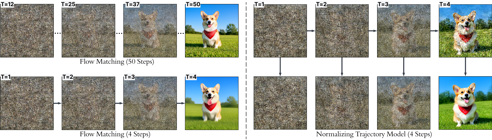
*Figure 2:Denoising trajectories. Left: Flow matching with 50 steps and 4 steps. Right: NTM achieves comparable quality in 4 steps by modeling the non-Gaussian reverse conditional.*

*Figure 6:Ablation: multi-trajectory training. Comparison of the same NTM evaluated with 
𝑇
=
4
, 
𝑇
=
8
, 
𝑇
=
16
 denoising steps and the baseline FLUX (50 steps).*

*(a)Without aux loss*

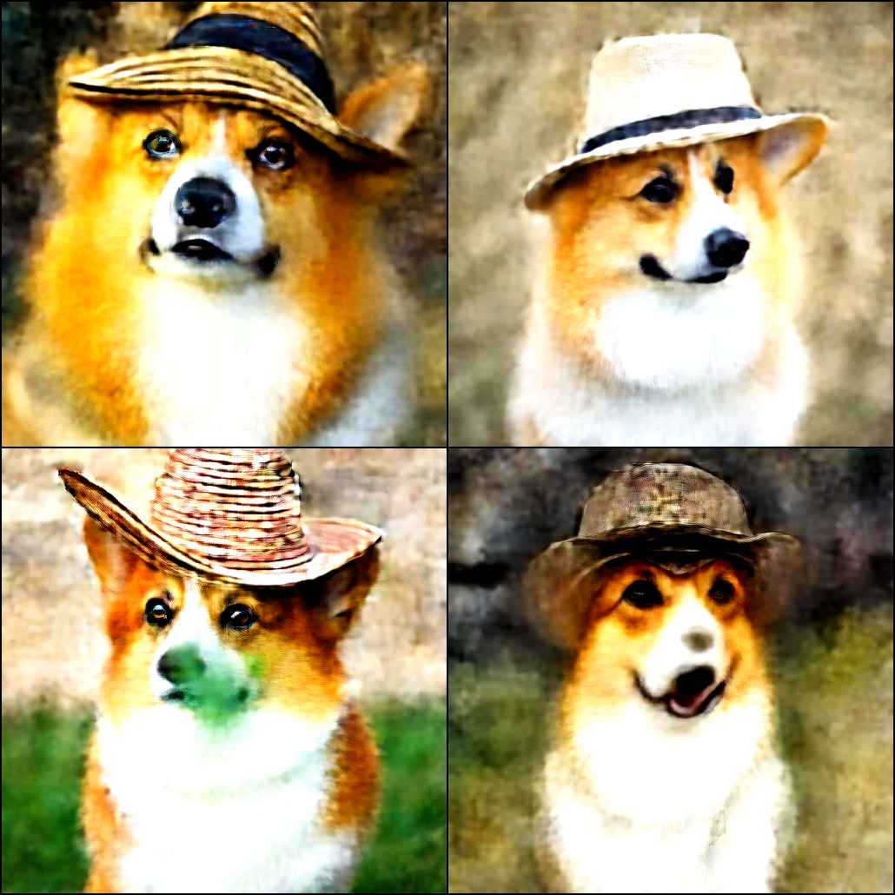
*(a)Without aux loss*

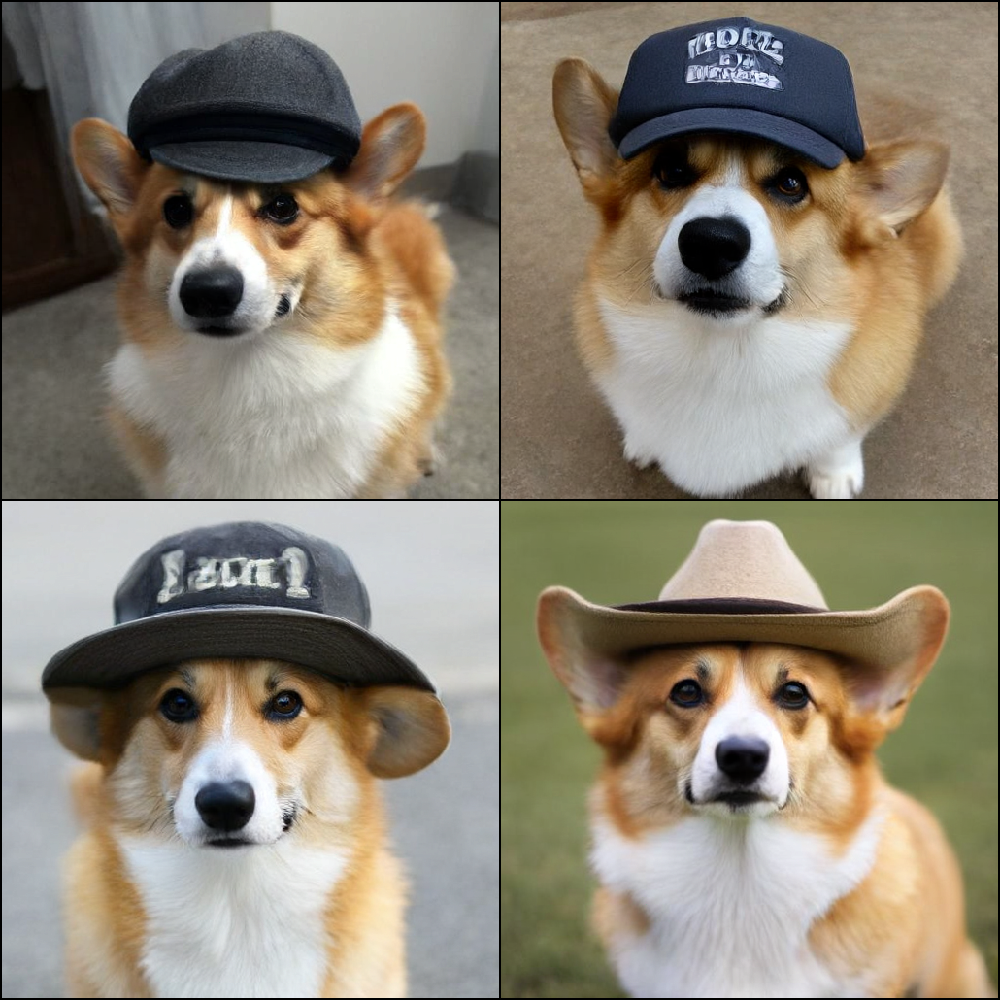
*(b)With aux loss*

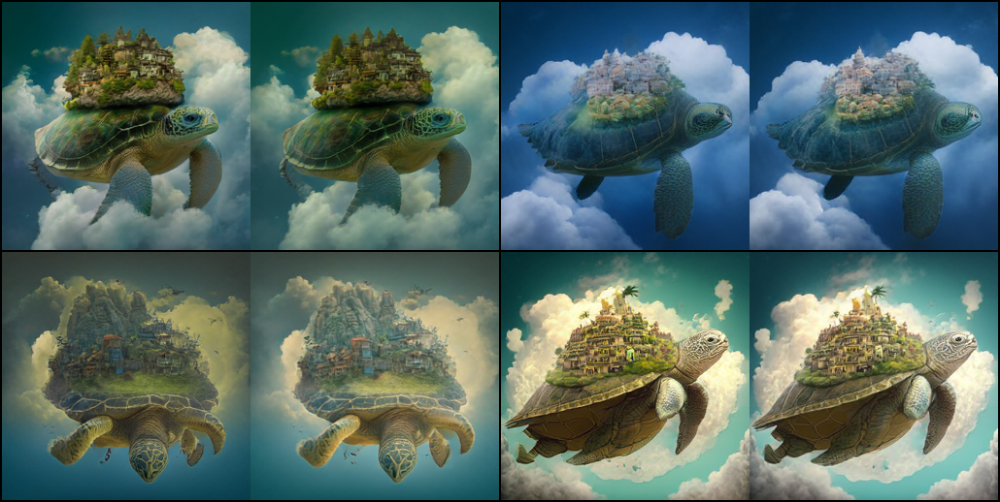
*(c)Trajectory score denoising vs. learned denoiser*

*Figure 8:Failure Case. NTM with 
𝑇
=
1
 produces degraded outputs due to insufficient transporter capacity.*

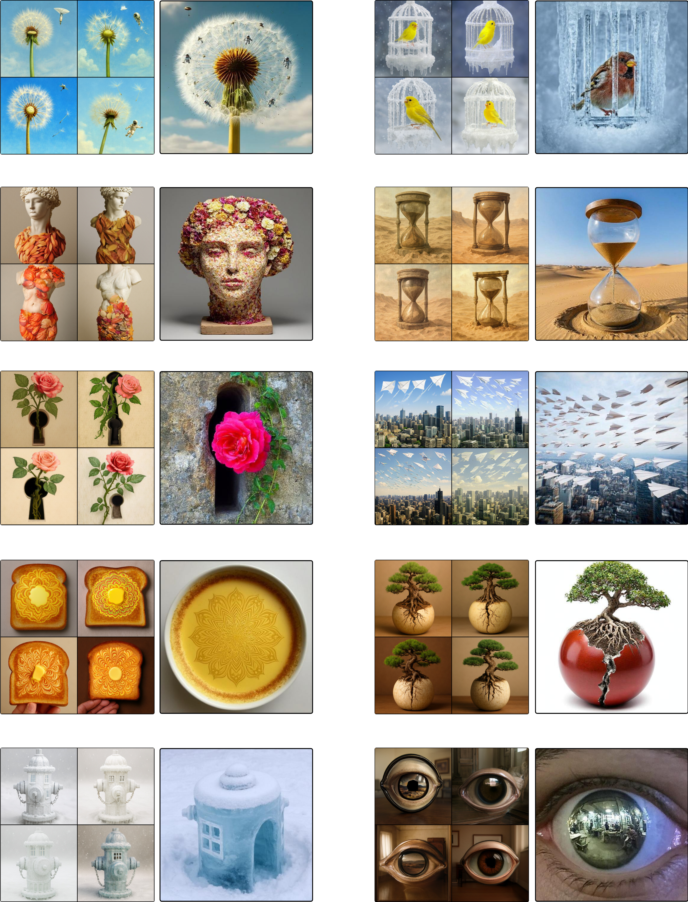
*Figure 9:Additional examples from NTM trained from scratch (left) and fine-tuned from flow matching (right) under the same text prompts.*

---
**Usage Info**: 5656 tokens used.
**Generated at**: 2026-05-11 16:31:40

---

# 📚 Towards Closing the Autoregressive Gap in Language Modeling via Entropy-Gated Continuous Bitstream Diffusion

🚀 URL: https://arxiv.org/html/2605.07013

## 🌏 Abstract (원문)
Diffusion language models (DLMs) promise parallel, order-agnostic generation, but on standard benchmarks they have historically lagged behind autoregressive models in sample quality and diversity. Recent continuous flow and diffusion approaches over token embeddings have narrowed this gap, suggesting continuous state spaces are highly effective for language. In this work, we further close the autoregressive gap by modeling text as a continuous diffusion process over fixed-width binary bitstreams. Our approach represents semantic tokens as analog bit sequences and utilizes a matched-filter residual parameterization to isolate contextual learning from analytic independent-bit posteriors. Crucially, we adopt a stochastic sampler that applies Langevin-type corrections gated by the entropy-rate profile, automatically concentrating stochasticity in high-information regions while remaining nearly deterministic elsewhere. On the One Billion Word Benchmark (LM1B), our 130M-parameter bitstream model reaches a generative perplexity (Gen.PPL) of59.7659.76at matched real-data entropy (4.314.31) using 256 neural function evaluations (NFEs), decisively outperforming prior DLM baselines and reaching the autoregressive reference. On OpenWebText (OWT), our stochastic sampler establishes a new continuous-DLM Pareto frontier, achievingGen.PPL=27.06\mathrm{Gen.\ PPL}=27.06at an entropy of5.265.26using4×4\timesfewer steps than previous 1024-NFE baselines. As an additional architectural benefit, bitstream diffusion removes the𝒪​(V)\mathcal{O}(V)vocabulary scaling bottleneck shared by standard DLMs. By predicting𝒪​(log⁡V)\mathcal{O}(\log V)bitwise logits via semantic bit-patching, our model yields a reduced memory footprint and higher throughput, demonstrating a scalable paradigm for language generation as vocabulary sizes grow.
## 🌏 Abstract (번역)
확산 언어 모델(DLM)은 병렬적이고 순서에 구애받지 않는 생성을 약속하지만, 표준 벤치마크에서는 샘플 품질과 다양성 면에서 자기회귀 모델에 비해 뒤처져 왔다. 최근 토큰 임베딩에 대한 연속 흐름 및 확산 접근 방식은 이러한 격차를 좁혔으며, 연속 상태 공간이 언어에 매우 효과적임을 시사한다. 본 연구에서는 고정 폭 이진 비트스트림에 대한 연속 확산 프로세스로 텍스트를 모델링하여 자기회귀 모델과의 격차를 더욱 좁힌다. 우리의 접근 방식은 의미론적 토큰을 아날로그 비트 시퀀스로 표현하고, 분석적 독립 비트 사후 확률로부터 문맥 학습을 분리하기 위해 매치드 필터 잔차 매개변수화를 활용한다. 결정적으로, 우리는 엔트로피율 프로파일에 의해 게이트되는 랑주뱅 유형 보정을 적용하는 확률적 샘플러를 채택하여, 높은 정보 영역에 확률성을 자동으로 집중시키면서 다른 곳에서는 거의 결정론적으로 유지한다. One Billion Word Benchmark (LM1B)에서, 우리의 1억 3천만 매개변수 비트스트림 모델은 256개의 신경 함수 평가(NFE)를 사용하여 일치하는 실제 데이터 엔트로피(4.31)에서 59.76의 생성 혼란도(Gen.PPL)에 도달하여, 이전 DLM 기준선을 결정적으로 능가하고 자기회귀 참조에 도달한다. OpenWebText (OWT)에서, 우리의 확률적 샘플러는 새로운 연속 DLM 파레토 프론티어를 구축하여, 이전 1024-NFE 기준선보다 4배 적은 단계를 사용하여 엔트로피 5.26에서 Gen.PPL=27.06을 달성한다. 추가적인 아키텍처적 이점으로, 비트스트림 확산은 표준 DLM이 공유하는 O(V) 어휘 스케일링 병목 현상을 제거한다. 의미론적 비트 패칭을 통해 O(logV) 비트 단위 로짓을 예측함으로써, 우리 모델은 메모리 사용량을 줄이고 처리량을 높여, 어휘 크기가 증가함에 따라 확장 가능한 언어 생성 패러다임을 보여준다.

## 🔍 Methods & Results
- 텍스트를 고정 폭 이진 비트스트림에 대한 연속 확산 프로세스로 모델링하여 자기회귀 모델과의 성능 격차를 줄였다.
- 의미론적 토큰을 아날로그 비트 시퀀스로 표현하고, 분석적 독립 비트 사후 확률로부터 문맥 학습을 분리하기 위해 매치드 필터 잔차 매개변수화를 사용했다. 이 방법은 LM1B Gen.PPL을 22점 이상 개선하는 데 결정적인 역할을 했다.
- 엔트로피율 프로파일에 의해 게이트되는 랑주뱅 유형 보정을 적용하는 확률적 샘플러를 채택하여, 높은 정보 영역에 확률성을 자동으로 집중시키고 다른 곳에서는 거의 결정론적으로 유지한다.
- LM1B 벤치마크에서 1억 3천만 매개변수 비트스트림 모델은 256 NFE를 사용하여 59.76의 생성 혼란도(Gen.PPL)를 달성하여, 이전 DLM 기준선을 능가하고 자기회귀 참조에 도달했다.
- OpenWebText(OWT)에서 확률적 샘플러는 이전 1024-NFE 기준선보다 4배 적은 단계를 사용하여 엔트로피 5.26에서 Gen.PPL=27.06을 달성하며 새로운 연속 DLM 파레토 프론티어를 구축했다.
- 비트스트림 확산은 의미론적 비트 패칭을 통해 O(logV) 비트 단위 로짓을 예측함으로써 표준 DLM이 공유하는 O(V) 어휘 스케일링 병목 현상을 제거하여, 메모리 사용량 감소 및 처리량 증가를 가져왔다.
- 디노이저는 의미론적 토큰 길이(T)에서 작동하는 시퀀스 확산 트랜스포머이며, 각 토큰의 'm' 아날로그 비트는 하나의 패치로 그룹화되어 토큰 임베딩으로 투영된다.

## 🖼 Figures

*(a)LM1B.*

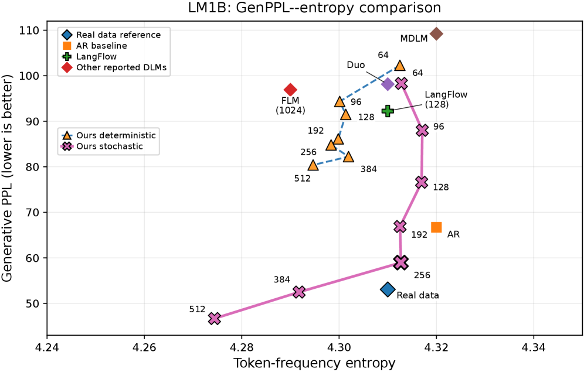
*(a)LM1B.*

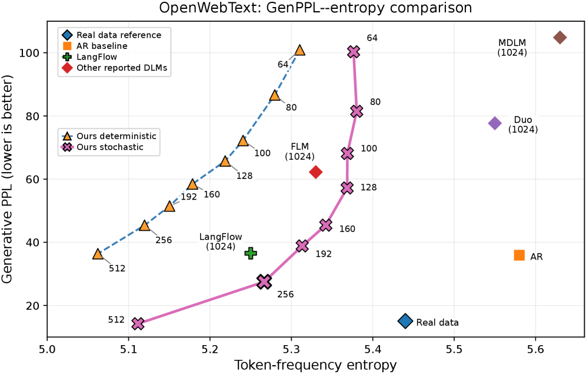
*(b)OWT.*

*(a)Entropy-rate profile.*

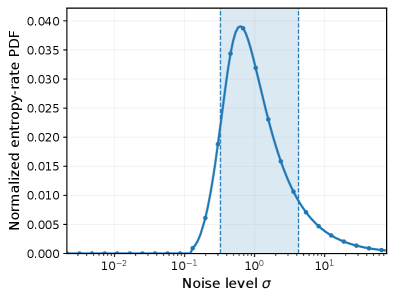
*(a)Entropy-rate profile.*

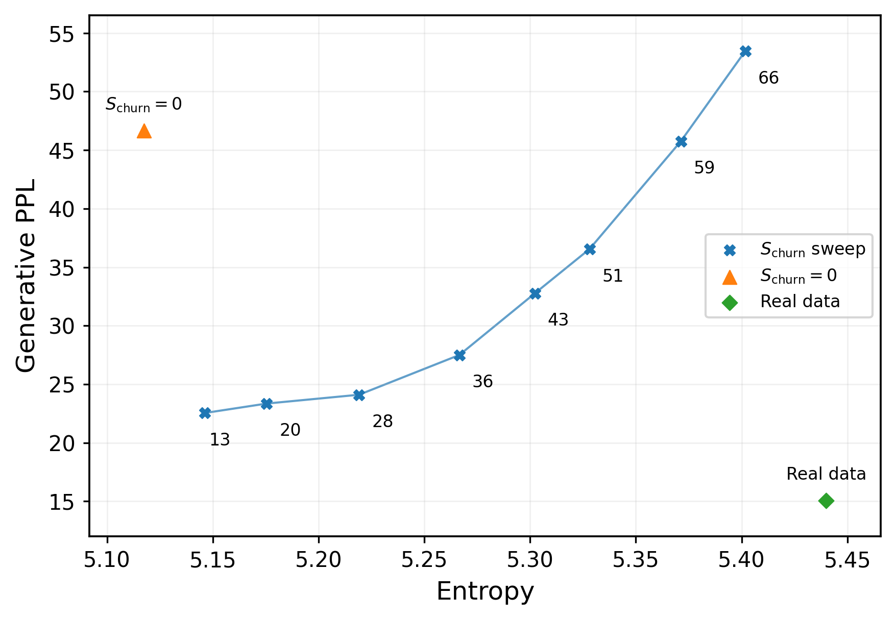
*(b)Churn sweep at fixed 256 NFEs.*

*Figure 4:LM1B schedule ablation. We compare the entropy-rate grid and the Karras grid at 64, 128, and 256 NFEs. Dashed horizontal lines show deterministic sampling; solid curves show stochastic churn sweeps. The entropy-rate grid improves deterministic sampling and, more importantly, enables stochastic churn to reach a much better GenPPL regime than the Karras grid across all NFE budgets.*

![Figure 5:LM1B stochasticity-window ablation at 256 NFEs. Left: location sweep with a fixed 25% entropy-CDF width. Right: centered width sweep. Narrow windows are sensitive to their location, while broad windows are consistently stronger. The full entropy-supported range 
𝑞
∈
[
0
,
1
]
 gives the best GenPPL in this sweep.](../images/2026-05-11/2605.07013/2605.07013_fig8.png)
*Figure 5:LM1B stochasticity-window ablation at 256 NFEs. Left: location sweep with a fixed 25% entropy-CDF width. Right: centered width sweep. Narrow windows are sensitive to their location, while broad windows are consistently stronger. The full entropy-supported range 
𝑞
∈
[
0
,
1
]
 gives the best GenPPL in this sweep.*

*Figure 6:OWT churn sweep at fixed 
𝜂
=
0.6
. The qualitative behavior matches the 
𝜂
=
0
 sweep: moderate churn gives the best GenPPL–entropy trade-off, while excessive churn increases entropy at the cost of GenPPL.*

*Figure 7:Effect of asymmetric time-lag 
𝜂
 on OWT. We show changes relative to 
𝜂
=
0
 for deterministic sampling and for the smallest nonzero stochastic churn configuration. Top: change in GenPPL. Bottom: change in token-frequency entropy. Positive 
𝜂
 can help at low NFE in deterministic sampling, but its effect is weaker and less consistent once stochastic churn is enabled.*

---
**Usage Info**: 6019 tokens used.
**Generated at**: 2026-05-11 16:31:59

---

# 📚 STARFlow2: Bridging Language Models and Normalizing Flows for Unified Multimodal Generation

🚀 URL: https://arxiv.org/html/2605.08029

## 🌏 Abstract (원문)
Unified multimodal models that understand, reason over, and generate interleaved text–image sequences remain structurally fragmented: existing approaches either sacrifice visual fidelity through discrete tokenization, impose structural asymmetry by combining causal text generation with iterative diffusion-based denoising, or degrade pretrained understanding when adapting vision-language models for generation. We observe that autoregressive normalizing flows are autoregressive Transformers—sharing the same causal mask, KV-cache mechanism, and left-to-right structure as LLMs—making them the most natural paradigm for truly unified multimodal generation that is continuous, single-pass, and purely causal. We present STARFlow2, built on the Pretzel architecture that vertically interleaves a frozen pretrained VLM stream with a TARFlow stream via residual skip connections, both operating under the same causal mask. This design simultaneously preserves pretrained multimodal understanding, enables high-fidelity continuous image generation, and achieves structural unification under a single causal mechanism. Combined with a deep-shallow flow design and a unified FAE latent space, STARFlow2 supports cache-friendly interleaved generation where both text and visual outputs directly enter the KV-cache without re-encoding. Experiments demonstrate strong performance across image generation and multimodal understanding benchmarks, validating autoregressive flows as a viable foundation for unified multimodal modeling.
## 🌏 Abstract (번역)
텍스트-이미지 시퀀스를 이해하고 추론하며 생성하는 통합 멀티모달 모델은 여전히 구조적으로 파편화되어 있습니다. 기존 접근 방식은 이산 토큰화를 통해 시각적 충실도를 희생하거나, 인과적 텍스트 생성과 반복적인 확산 기반 노이즈 제거를 결합하여 구조적 비대칭성을 부과하거나, 생성에 비전-언어 모델을 적용할 때 사전 학습된 이해도를 저하시킵니다. 우리는 자기회귀 정규화 흐름(autoregressive normalizing flows)이 자기회귀 트랜스포머(autoregressive Transformers)와 동일한 인과 마스크, KV-캐시 메커니즘, 좌우 구조를 공유하여 LLM과 유사하다는 것을 관찰했으며, 이는 연속적이고 단일 패스이며 순수하게 인과적인 진정한 통합 멀티모달 생성을 위한 가장 자연스러운 패러다임이 됩니다. 우리는 잔여 스킵 연결을 통해 고정된 사전 학습된 VLM 스트림과 TARFlow 스트림을 수직으로 인터리빙하며, 둘 다 동일한 인과 마스크 하에서 작동하는 Pretzel 아키텍처를 기반으로 구축된 STARFlow2를 제시합니다. 이 설계는 사전 학습된 멀티모달 이해도를 동시에 보존하고, 고충실도 연속 이미지 생성을 가능하게 하며, 단일 인과 메커니즘 하에서 구조적 통합을 달성합니다. 깊고 얕은 흐름 설계와 통합된 FAE 잠재 공간과 결합된 STARFlow2는 텍스트 및 시각적 출력이 재인코딩 없이 KV-캐시에 직접 들어가는 캐시 친화적인 인터리빙 생성을 지원합니다. 실험은 이미지 생성 및 멀티모달 이해 벤치마크 전반에 걸쳐 강력한 성능을 보여주며, 자기회귀 흐름이 통합 멀티모달 모델링을 위한 실행 가능한 기반임을 입증합니다.

## 🔍 Methods & Results
- 기존 통합 멀티모달 모델의 구조적 파편화 문제를 해결하기 위해 자기회귀 정규화 흐름(autoregressive normalizing flows)을 활용하여 연속적이고 단일 패스이며 순수하게 인과적인 멀티모달 생성 패러다임을 제안합니다.
- STARFlow2 모델은 Pretzel 아키텍처를 기반으로 하며, 고정된 사전 학습된 VLM 스트림과 TARFlow 스트림을 잔여 스킵 연결을 통해 수직으로 인터리빙하고, 동일한 인과 마스크 하에서 작동합니다.
- STARFlow2는 사전 학습된 멀티모달 이해도를 보존하고, 고충실도 연속 이미지 생성을 가능하게 하며, 단일 인과 메커니즘 하에서 구조적 통합을 달성합니다.
- 깊고 얕은 흐름 설계와 통합된 FAE 잠재 공간을 결합하여, 텍스트 및 시각적 출력이 재인코딩 없이 KV-캐시에 직접 들어가는 캐시 친화적인 인터리빙 생성을 지원합니다.
- 실험 결과, STARFlow2는 이미지 생성 및 멀티모달 이해 벤치마크에서 강력한 성능을 입증하여, 자기회귀 흐름이 통합 멀티모달 모델링을 위한 유효한 기반임을 검증했습니다.

## 🖼 Figures
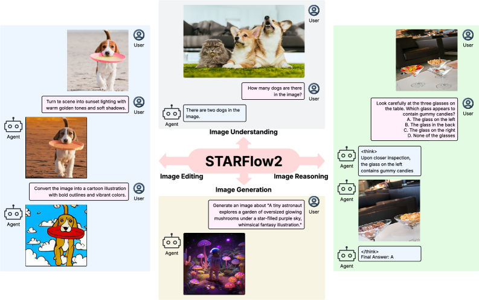
*Figure 1: STARFlow2 as a unified multimodal architecture. A single model supports image generation, editing, understanding, and reasoning across diverse image-centric tasks.*

*Figure 2:Overview of the Pretzel architecture in STARFlow2. A VLM stream and a TARFlow stream are vertically interleaved via crossing skip connections, operating on the same multimodal sequence under a shared causal mask. Shallow TARFlows refine visual latents locally. The model is trained with a unified NLL objective.*

*Figure 3:Multi-Stage Training Pipeline of STARFlow2. Stage 1: Train the TARFlow stream and shallow blocks on text-image pairs for text-to-image generation (VLM frozen). Stage 2: Align the visual representation with the VLM by training the adapter on image-to-text tasks (shallow blocks and VLM frozen). Stage 3: Activate the vertical skip connections of the Pretzel architecture and jointly optimize on a mixture of understanding, generation, editing, and interleaved tasks.*

*Figure 4:Text-to-Image generation examples from STARFlow2 at 256 
×
 256 resolution.*

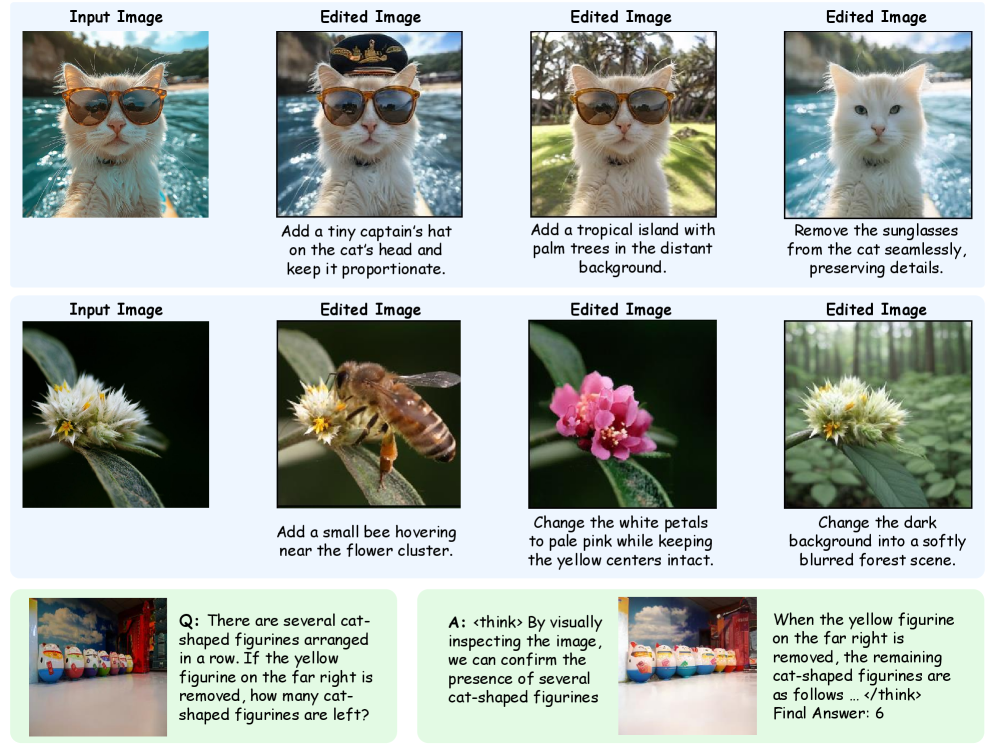
*Figure 5:Image editing and interleaved text-image generation examples from STARFlow2.*

*Figure 6:Images generated by adopting the MoT-style (liang2024mixture) fusion.*

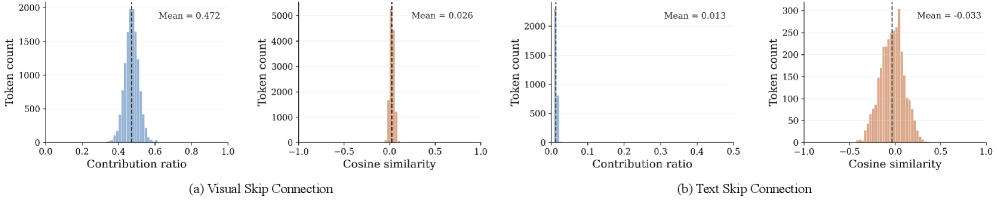
*Figure 7:Analysis of the vertical skip connection.*

*Figure 8:Text-to-Image generation examples from STARFlow2 at 256 
×
 256 resolution.*

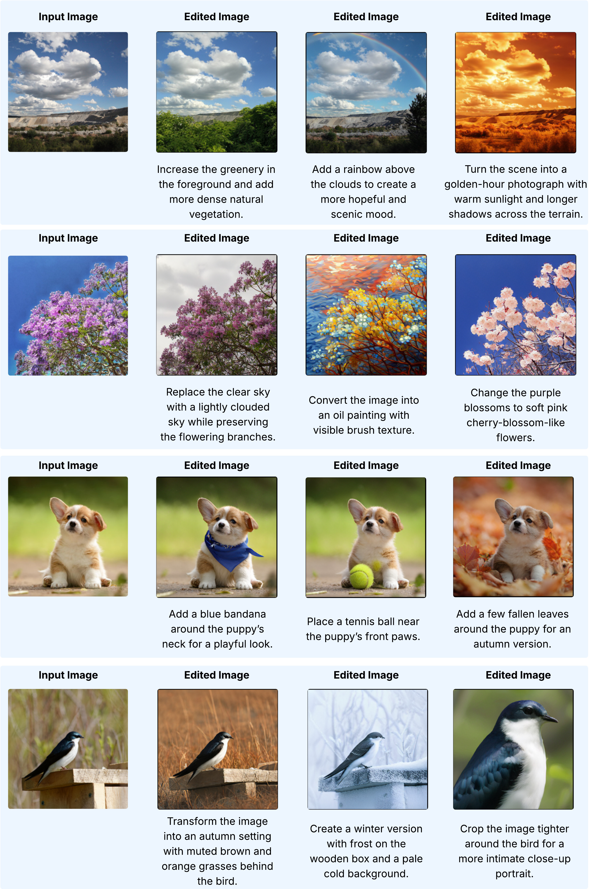
*Figure 9:Image editing examples from STARFlow2.*

---
**Usage Info**: 1800 tokens used.
**Generated at**: 2026-05-11 16:32:07

---

# 📚 TextLDM: Language Modeling with Continuous Latent Diffusion

🚀 URL: https://arxiv.org/html/2605.07748

## 🌏 Abstract (원문)
Diffusion Transformers (DiT) trained with flow matching in a VAE latent space have unified visual generation across images and videos. A natural next step toward a single architecture for both generation (visual synthesis) and understanding (text generation) is to apply this framework to language modeling. We propose TextLDM, which transfers the visual latent diffusion recipe to text generation with minimal architectural modification. A Transformer-based VAE maps discrete tokens to continuous latents, enhanced byRepresentation Alignment(REPA) with a frozen pretrained language model to produce representations effective for conditional denoising. A standard DiT then performs flow matching in this latent space, identical in architecture to its visual counterpart. The central challenge we address is obtaining high-quality continuous text representations: we find that reconstruction fidelity alone is insufficient, and that aligning latent features with a pretrained language model via REPA is critical for downstream generation quality. Trained from scratch on OpenWebText2, TextLDM substantially outperforms prior diffusion language models and matches GPT-2 under the same settings. Our results establish that the visual DiT recipe transfers effectively to language, taking a concrete step toward unified diffusion architectures for multimodal generation and understanding.
## 🌏 Abstract (번역)
VAE 잠재 공간에서 플로우 매칭으로 훈련된 Diffusion Transformers (DiT)는 이미지와 비디오 전반에 걸쳐 시각적 생성 작업을 통합했습니다. 생성(시각적 합성)과 이해(텍스트 생성)를 위한 단일 아키텍처를 향한 다음 자연스러운 단계는 이 프레임워크를 언어 모델링에 적용하는 것입니다. 우리는 시각적 잠재 확산 방식을 최소한의 아키텍처 수정으로 텍스트 생성에 전이하는 TextLDM을 제안합니다. 트랜스포머 기반 VAE는 이산 토큰을 연속 잠재 공간으로 매핑하며, 조건부 노이즈 제거에 효과적인 표현을 생성하기 위해 동결된 사전 훈련된 언어 모델과의 표현 정렬(REPA)을 통해 강화됩니다. 표준 DiT는 이 잠재 공간에서 플로우 매칭을 수행하며, 시각적 DiT와 아키텍처가 동일합니다. 우리가 다루는 핵심 과제는 고품질의 연속적인 텍스트 표현을 얻는 것입니다. 우리는 재구성 충실도만으로는 불충분하며, 사전 훈련된 언어 모델과 REPA를 통해 잠재 특징을 정렬하는 것이 후속 생성 품질에 중요함을 발견했습니다. OpenWebText2에서 처음부터 훈련된 TextLDM은 이전 확산 언어 모델을 크게 능가하며 동일한 설정에서 GPT-2와 동등한 성능을 보입니다. 우리의 결과는 시각적 DiT 방식이 언어에 효과적으로 전이되어, 다중 모달 생성 및 이해를 위한 통합 확산 아키텍처를 향한 구체적인 단계를 밟았음을 입증합니다.

## 🔍 Methods & Results
- TextLDM은 이산 텍스트 토큰을 연속 잠재 표현으로 압축하는 TextVAE와 잠재 공간에서 생성 역학을 모델링하기 위해 Flow Matching으로 훈련된 Diffusion Transformer(DiT)로 구성된 2단계 프레임워크입니다.
- TextVAE는 Qwen3 토크나이저를 사용하며, 각 토큰에 대해 하나의 잠재 벡터를 매핑하는 1대1 매핑을 유지합니다. 인코더와 디코더는 모두 트랜스포머 기반이며, 디코더는 원본 토큰을 비자기회귀적으로 재구성합니다.
- TextVAE 훈련 중, 사전 훈련된 언어 모델(Qwen3-1.7B)의 숨겨진 상태와 VAE 인코더의 중간 표현을 정렬하는 표현 정렬(REPA)을 도입하여 VAE 잠재 공간을 풍부하게 합니다. 이는 하류 생성 품질에 중요합니다.
- TextVAE는 교차 엔트로피 재구성 손실, KL 발산, REPA 손실을 포함하는 복합 손실로 훈련됩니다.
- TextVAE 훈련 후, 인코더를 고정하고 학습된 잠재 공간에서 Flow Matching을 사용하여 Diffusion Transformer(DiT)를 훈련합니다. DiT는 조건부 언어 생성을 모델링하며, 컨텍스트 잠재와 노이즈가 추가된 타겟 잠재를 입력으로 받습니다.
- DiT는 Conditional Flow Matching(CFM) 손실로 최적화되며, Stable Diffusion 3에서 발견된 바와 같이 더 나은 훈련 신호 분포를 위해 로짓-정규 분포에서 타임스텝을 샘플링합니다.
- 생성 품질 향상을 위해 Classifier-free guidance(CFG)를 적용하며, 훈련 중 컨텍스트 잠재는 10% 확률로 0 벡터로 대체됩니다. 추론 시에는 가이드 스케일 'w'를 사용하여 가이드된 속도를 계산합니다.
- TextLDM은 OpenWebText2에서 처음부터 훈련되었으며, 이전 확산 언어 모델보다 훨씬 뛰어난 성능을 보였고 동일한 설정에서 GPT-2와 동등한 성능을 달성했습니다.
- 이 연구는 시각적 DiT 방식이 언어 모델링에 효과적으로 전이될 수 있음을 입증하여, 다중 모달 생성 및 이해를 위한 통합 확산 아키텍처 개발에 기여합니다.

## 🖼 Figures
![Figure 1:Comparison of language generation paradigms. Each sub-figure illustrates the generation process from left to right. (a) Autoregressive (AR) models generate tokens one by one in sequential order. (b) Discrete diffusion (e.g., LLaDA (Nie et al., 2025)) iteratively unmasks tokens, where gray blocks denote <mask> tokens. (c) TextLDM (ours) performs flow matching in a learned continuous latent space, progressively denoising random noise into valid language representations. The uniform-colored blocks at the bottom represent the condition (context) latents.](../images/2026-05-11/2605.07748/2605.07748_fig0.png)
*Figure 1:Comparison of language generation paradigms. Each sub-figure illustrates the generation process from left to right. (a) Autoregressive (AR) models generate tokens one by one in sequential order. (b) Discrete diffusion (e.g., LLaDA (Nie et al., 2025)) iteratively unmasks tokens, where gray blocks denote <mask> tokens. (c) TextLDM (ours) performs flow matching in a learned continuous latent space, progressively denoising random noise into valid language representations. The uniform-colored blocks at the bottom represent the condition (context) latents.*

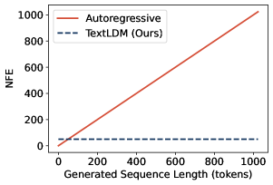
*Figure 2:Inference efficiency: the number of function evaluations (NFE) for AR models grows linearly with sequence length, while TextLDM achieves length-invariant NFE over a broad operating range (e.g., up to 1024 tokens).*

![Figure 3:Overview of TextLDM. (a) TextVAE: A Transformer encoder maps discrete tokens to continuous latents, regularized by KL divergence and enhanced by REPA alignment with a frozen Qwen3-1.7B. The decoder reconstructs tokens from latents via cross-entropy loss. (b) TextDiT: A Diffusion Transformer is trained with Flow Matching. Clean context latents and noisy target latents are concatenated as input; the model predicts the velocity field to denoise the target segment conditioned on the context. For unconditional generation, the condition latent is omitted.](../images/2026-05-11/2605.07748/2605.07748_fig2.png)
*Figure 3:Overview of TextLDM. (a) TextVAE: A Transformer encoder maps discrete tokens to continuous latents, regularized by KL divergence and enhanced by REPA alignment with a frozen Qwen3-1.7B. The decoder reconstructs tokens from latents via cross-entropy loss. (b) TextDiT: A Diffusion Transformer is trained with Flow Matching. Clean context latents and noisy target latents are concatenated as input; the model predicts the velocity field to denoise the target segment conditioned on the context. For unconditional generation, the condition latent is omitted.*

*Figure 4:Training dynamics comparison between TextLDM (DiT-328M, blue) and our reproduced GPT-2-medium (459M, red). The reproduced GPT-2-medium has more parameters than the original 355M due to the larger vocabulary size of the Qwen3 tokenizer. Both models are trained from scratch on OpenWebText2 with the same Qwen3 tokenizer and evaluated at identical checkpoint intervals. Each dot represents a checkpoint evaluation.*

---
**Usage Info**: 3582 tokens used.
**Generated at**: 2026-05-11 16:32:17

---

# 📚 A Unified Measure-Theoretic View of Diffusion, Score-Based, and Flow Matching Generative Models

🚀 URL: https://arxiv.org/html/2605.06829

## 🌏 Abstract (원문)
We survey continuous-time generative modeling methods based on transporting a simple reference distribution to a data distribution via stochastic or deterministic dynamics. We present a unified framework in which diffusion models, score-based generative models, and flow matching are instances of learning a time-dependent vector field that induces a family of marginals(ρt)t∈[0,1](\rho_{t})_{t\in[0,1]}governed by a continuity/Fokker–Planck equation. Within this framework, we (i) derive reverse-time sampling for diffusion/score models as controlled stochastic dynamics, (ii) show the probability flow ODE yields identical marginals and connects diffusion to likelihood-based normalizing flows, and (iii) interpret flow matching as direct regression of the velocity field under a chosen interpolation, clarifying when it coincides with (or differs from) score-based training. We compare objectives, sampling schemes, and discretization errors under unified notation, discuss connections to Schrödinger bridges and entropic optimal transport, and summarize theoretical guarantees and open problems on approximation, stability, and scalability.
## 🌏 Abstract (번역)
본 논문은 확률적 또는 결정론적 역학을 통해 간단한 참조 분포를 데이터 분포로 변환하는 연속 시간 생성 모델링 방법을 조사합니다. 우리는 확산 모델, 점수 기반 생성 모델 및 플로우 매칭이 연속성/포커-플랑크 방정식에 의해 지배되는 주변 분포족(ρt)t∈[0,1]을 유도하는 시간 의존적 벡터장을 학습하는 사례인 통합 프레임워크를 제시합니다. 이 프레임워크 내에서, 우리는 (i) 확산/점수 모델에 대한 역시간 샘플링을 제어된 확률적 역학으로 도출하고, (ii) 확률 흐름 상미분방정식이 동일한 주변 분포를 생성하며 확산을 우도 기반 정규화 흐름과 연결함을 보여주고, (iii) 플로우 매칭을 선택된 보간법 하에서 속도장의 직접 회귀로 해석하여, 언제 점수 기반 훈련과 일치하는지(또는 다른지)를 명확히 합니다. 우리는 통합된 표기법 하에서 목적 함수, 샘플링 방식 및 이산화 오차를 비교하고, 슈뢰딩거 브릿지 및 엔트로피 최적 수송과의 연결을 논의하며, 근사, 안정성 및 확장성에 대한 이론적 보장과 미해결 문제를 요약합니다.

## 🔍 Methods & Results
- 확산 모델, 점수 기반 생성 모델, 플로우 매칭을 연속성/포커-플랑크 방정식에 의해 지배되는 주변 분포족을 유도하는 시간 의존적 벡터장 학습의 사례로 통합하는 프레임워크를 제시했습니다.
- 확산/점수 모델의 역시간 샘플링을 제어된 확률적 역학으로 도출했습니다.
- 확률 흐름 상미분방정식이 동일한 주변 분포를 생성하며 확산을 우도 기반 정규화 흐름과 연결함을 보였습니다.
- 플로우 매칭을 선택된 보간법 하에서 속도장의 직접 회귀로 해석하여, 점수 기반 훈련과의 유사점 및 차이점을 명확히 했습니다.
- 통합된 표기법으로 목적 함수, 샘플링 방식, 이산화 오차를 비교하고, 슈뢰딩거 브릿지 및 엔트로피 최적 수송과의 연결을 논의했습니다.
- 근사, 안정성, 확장성에 대한 이론적 보장과 미해결 문제를 요약했습니다.

---
**Usage Info**: 1498 tokens used.
**Generated at**: 2026-05-11 16:32:24

---

