# 🚩 (2026-05-14) Scholar Inbox 추천 논문 

# 📚 Sampling from Flow Language Models via Marginal-Conditioned Bridges

🚀 URL: https://arxiv.org/html/2605.13681

## 🌏 Abstract (원문)
Flow Language Models (FLMs) are a recently introduced class of language models which adapt continuous flow matching for one-hot encoded token sequences. Their denoisers have a special structure absent from generic continuous diffusion models: each block of the denoising mean is a posterior marginal distribution over the clean token at that position. Standard DDPM-style samplers collapse these marginals to a single conditional-mean endpoint and bridge toward this simplex-valued point, which is generally not a valid one-hot sequence. We argue that the natural sampler for an FLM is instead posterior-predictive. At each reverse step, we sample a clean one-hot endpoint from the factorized posterior defined by the FLM token marginals, and then sample the next continuous state from the analytic Ornstein–Uhlenbeck bridge conditioned on that endpoint. The method is training-free, uses the same model evaluations as standard sampling, and gives a principled interface for token-level decoding controls such as temperature scaling and nucleus truncation. We show that, under exact posterior marginals, the endpoint approximation error is exactly the conditional multi-information among token positions. The induced one-step bridge kernel preserves all token-wise posterior-predictive marginals and loses only the residual cross-position dependence. Finally, we prove a Girsanov path-space comparison showing that the marginal-conditioned bridge has a no-larger denoising-error term than the frozen conditional-mean bridge, with strict improvement whenever intermediate coordinate-wise bridge observations reveal additional information about the clean token. Experiments with FLMs show that the sampler improves the quality–diversity tradeoff. Code is available at:github.com/imbirik/mcb.
## 🌏 Abstract (번역)
흐름 언어 모델(FLM)은 원-핫 인코딩된 토큰 시퀀스에 연속 흐름 매칭을 적용하는 최근 도입된 언어 모델의 한 종류입니다. 이 모델의 디노이저는 일반적인 연속 확산 모델에는 없는 특별한 구조를 가집니다. 즉, 디노이징 평균의 각 블록은 해당 위치의 깨끗한 토큰에 대한 사후 주변 분포입니다. 표준 DDPM 스타일 샘플러는 이러한 주변 분포를 단일 조건부 평균 종점으로 축소하고 이 심플렉스 값 지점으로 연결하는데, 이는 일반적으로 유효한 원-핫 시퀀스가 아닙니다. 우리는 FLM에 대한 자연스러운 샘플러가 대신 사후 예측적(posterior-predictive)이라고 주장합니다. 각 역방향 단계에서, 우리는 FLM 토큰 주변 분포에 의해 정의된 분해된 사후 분포로부터 깨끗한 원-핫 종점을 샘플링한 다음, 해당 종점에 조건화된 해석적 Ornstein–Uhlenbeck 브리지로부터 다음 연속 상태를 샘플링합니다. 이 방법은 학습이 필요 없고, 표준 샘플링과 동일한 모델 평가를 사용하며, 온도 스케일링 및 핵 절단과 같은 토큰 수준 디코딩 제어를 위한 원칙적인 인터페이스를 제공합니다. 우리는 정확한 사후 주변 분포 하에서 종점 근사 오차가 토큰 위치 간의 조건부 다중 정보와 정확히 일치함을 보여줍니다. 유도된 단일 단계 브리지 커널은 모든 토큰별 사후 예측 주변 분포를 보존하고 잔여 교차 위치 의존성만 손실합니다. 마지막으로, 우리는 기르사노프 경로 공간 비교를 통해 주변 분포에 조건화된 브리지가 고정된 조건부 평균 브리지보다 디노이징 오차 항이 더 크지 않으며, 중간 좌표별 브리지 관찰이 깨끗한 토큰에 대한 추가 정보를 드러낼 때마다 엄격한 개선이 있음을 증명합니다. FLM을 사용한 실험은 이 샘플러가 품질-다양성 균형을 개선함을 보여줍니다. 코드는 github.com/imbirik/mcb에서 확인할 수 있습니다.

## 🔍 Methods & Results
- FLM의 표준 DDPM 스타일 샘플러는 주변 분포를 유효하지 않은 원-핫 시퀀스인 단일 조건부 평균 종점으로 축소하는 문제를 해결하기 위해 사후 예측적 샘플러를 제안합니다.
- 제안된 사후 예측적 샘플러는 각 역방향 단계에서 FLM 토큰 주변 분포에 의해 정의된 분해된 사후 분포로부터 깨끗한 원-핫 종점을 샘플링하고, 해당 종점에 조건화된 해석적 Ornstein–Uhlenbeck 브리지로부터 다음 연속 상태를 샘플링합니다.
- 이 방법은 학습이 필요 없고, 표준 샘플링과 동일한 모델 평가를 사용하며, 온도 스케일링 및 핵 절단과 같은 토큰 수준 디코딩 제어를 위한 원칙적인 인터페이스를 제공합니다.
- 이론적으로, 정확한 사후 주변 분포 하에서 종점 근사 오차는 토큰 위치 간의 조건부 다중 정보와 정확히 일치하며, 유도된 단일 단계 브리지 커널은 모든 토큰별 사후 예측 주변 분포를 보존하고 잔여 교차 위치 의존성만 손실합니다.
- 기르사노프 경로 공간 비교를 통해 주변 분포에 조건화된 브리지가 고정된 조건부 평균 브리지보다 디노이징 오차 항이 더 크지 않으며, 중간 좌표별 브리지 관찰이 깨끗한 토큰에 대한 추가 정보를 드러낼 때 엄격한 개선이 있음을 증명했습니다.
- FLM을 사용한 실험 결과, 제안된 샘플러가 품질-다양성 균형(quality–diversity tradeoff)을 개선하는 것으로 나타났습니다.

## 🖼 Figures

*Figure 1:Generative perplexity (left top) and entropy (left bottom) against the number of sampling steps for the standard ODE sampler and our MCB sampler with various configurations of temperature scaling 
𝜏
 and nucleus sampling 
𝑝
 on LM1B. The right plot shows the Generative PPL/Entropy Tradeoff. We note that the grey dotted line on the bottom-left plot shows the entropy of LM1B.*

*Figure 2:Generative perplexity (left top) and entropy (left bottom) against the number of sampling steps for the standard ODE sampler and our MCB sampler with various configurations of temperature scaling 
𝜏
 and nucleus sampling 
𝑝
 on OWT. The right plot shows the Generative PPL/Entropy Tradeoff.*

---
**Usage Info**: 2129 tokens used.
**Generated at**: 2026-05-14 16:11:39

---

# 📚 Path-independent Flow Matching for Multi-parameter Generative Dynamics

🚀 URL: https://arxiv.org/html/2605.13487

## 🌏 Abstract (원문)
Flow Matching is a powerful framework for learning transport maps between probability distributions. Yet its standard single-parameter formulation is not designed to capture multi-parameter variations where the resulting transport should be path-independent. Path independence is crucial because it ensures that transformations depend only on the initial and target distributions, not on the specific path. In this work, we introducePath-independent Flow Matching (PiFM), a method for learning vector fields whose induced flows yield path-independent transport between distributions. We show that PiFM generalizes Flow Matching to higher-dimensional parameter domains while enforcing structural conditions that ensure consistency of composed transformations. In addition, we show that, under suitable assumptions, PiFM approximates the Wasserstein barycenter, linking the framework to a notion of distributional interpolation. To enable practical training, we propose a tractable, simulation-free objective that regresses onto multi-parameter conditional probability paths. We showcase empirically that PiFM outperforms other approaches on both synthetic and real world data in interpolating path-independent trajectories and generating desired out of distribution samples.
## 🌏 Abstract (번역)
플로우 매칭(Flow Matching)은 확률 분포 간의 전송 맵을 학습하기 위한 강력한 프레임워크입니다. 그러나 표준 단일 매개변수 공식은 결과 전송이 경로 독립적이어야 하는 다중 매개변수 변동을 포착하도록 설계되지 않았습니다. 경로 독립성은 변환이 특정 경로가 아닌 초기 및 목표 분포에만 의존하도록 보장하기 때문에 중요합니다. 본 연구에서는 분포 간에 경로 독립적인 전송을 생성하는 벡터 필드를 학습하기 위한 방법인 경로 독립 플로우 매칭(Path-independent Flow Matching, PiFM)을 소개합니다. 우리는 PiFM이 구성된 변환의 일관성을 보장하는 구조적 조건을 적용하면서 플로우 매칭을 고차원 매개변수 도메인으로 일반화함을 보여줍니다. 또한, 적절한 가정 하에 PiFM이 Wasserstein barycenter를 근사하여 프레임워크를 분포 보간 개념과 연결함을 보여줍니다. 실용적인 훈련을 가능하게 하기 위해, 우리는 다중 매개변수 조건부 확률 경로에 회귀하는 다루기 쉽고 시뮬레이션 없는 목적 함수를 제안합니다. 우리는 PiFM이 경로 독립적인 궤적을 보간하고 원하는 분포 외 샘플을 생성하는 데 있어 합성 데이터와 실제 데이터 모두에서 다른 접근 방식보다 우수한 성능을 보임을 경험적으로 보여줍니다.

## 🔍 Methods & Results
- 표준 플로우 매칭의 단일 매개변수 공식이 경로 독립적인 다중 매개변수 변동을 포착하지 못하는 문제를 해결하기 위해 경로 독립 플로우 매칭(PiFM)을 제안했습니다.
- PiFM은 분포 간에 경로 독립적인 전송을 유도하는 벡터 필드를 학습하는 방법입니다.
- PiFM은 플로우 매칭을 고차원 매개변수 도메인으로 일반화하며, 구성된 변환의 일관성을 보장하는 구조적 조건을 적용합니다.
- 적절한 가정 하에 PiFM이 Wasserstein barycenter를 근사하여 분포 보간 개념과 연결됨을 이론적으로 입증했습니다.
- 실용적인 훈련을 위해 다중 매개변수 조건부 확률 경로에 회귀하는 다루기 쉽고 시뮬레이션 없는 목적 함수를 제안했습니다.
- 실험적으로 PiFM은 합성 및 실제 데이터 모두에서 경로 독립적인 궤적을 보간하고 원하는 분포 외 샘플을 생성하는 데 있어 다른 접근 방식보다 우수한 성능을 보였습니다.

## 🖼 Figures

*(a)Data*

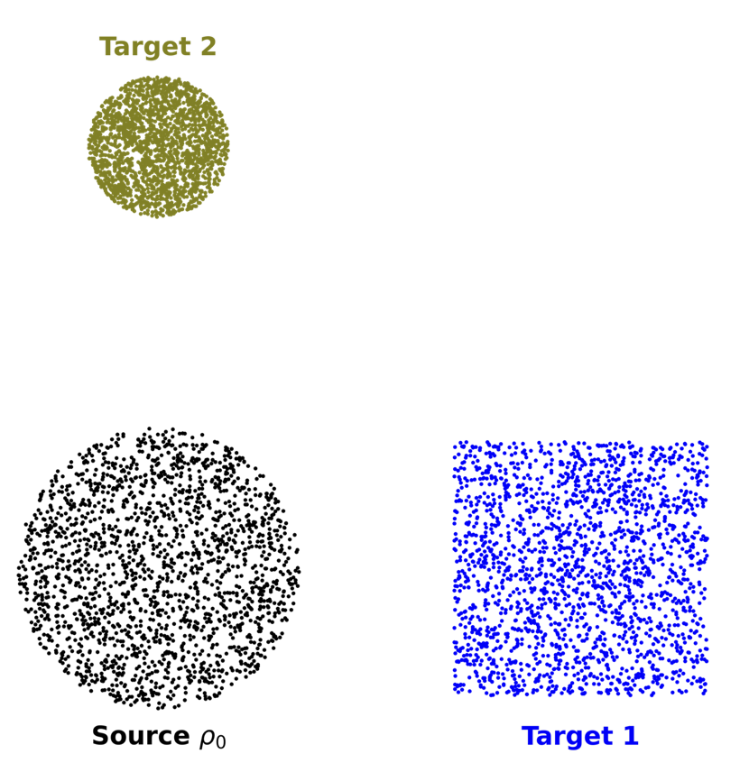
*(a)Data*

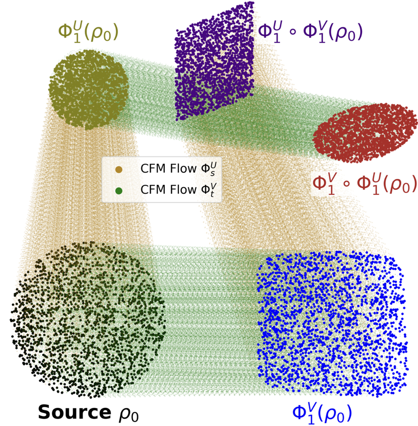
*(b)CFM*

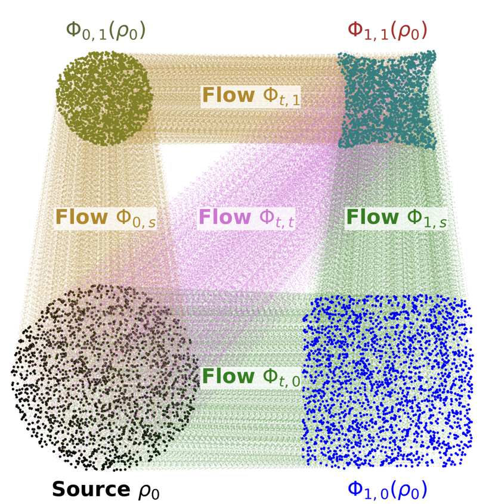
*(c)PiFM (ours)*

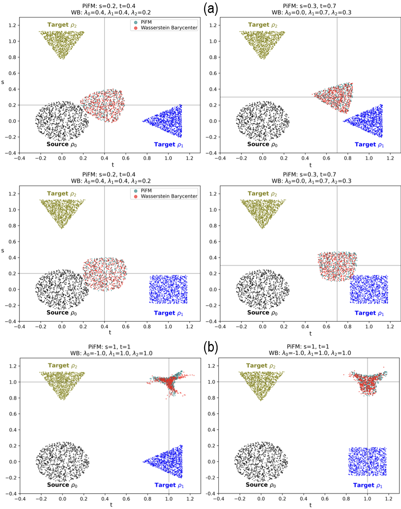
*Figure 2:Comparison between output distributions from PiFM model (ours) and Wasserstein Barycenters for a) within and b) outside the probability simplex . The predicted distributions from the PiFM model correspond to the Wasserstein barycenters.*

*(a)MFM*

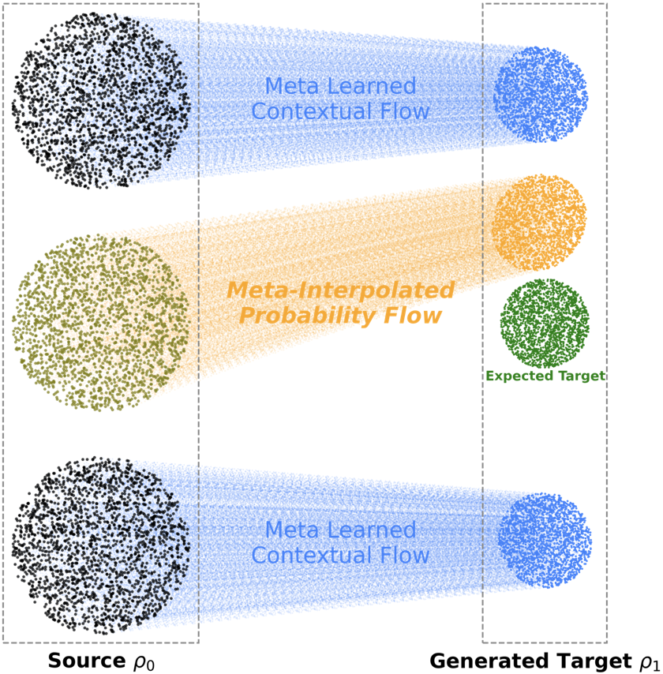
*(a)MFM*

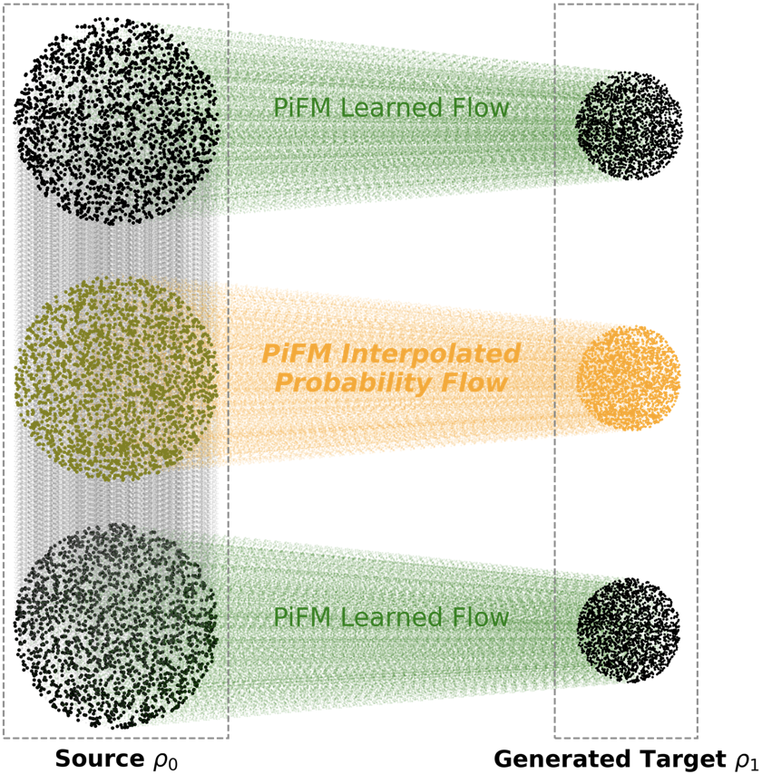
*(b)PiFM (ours)*

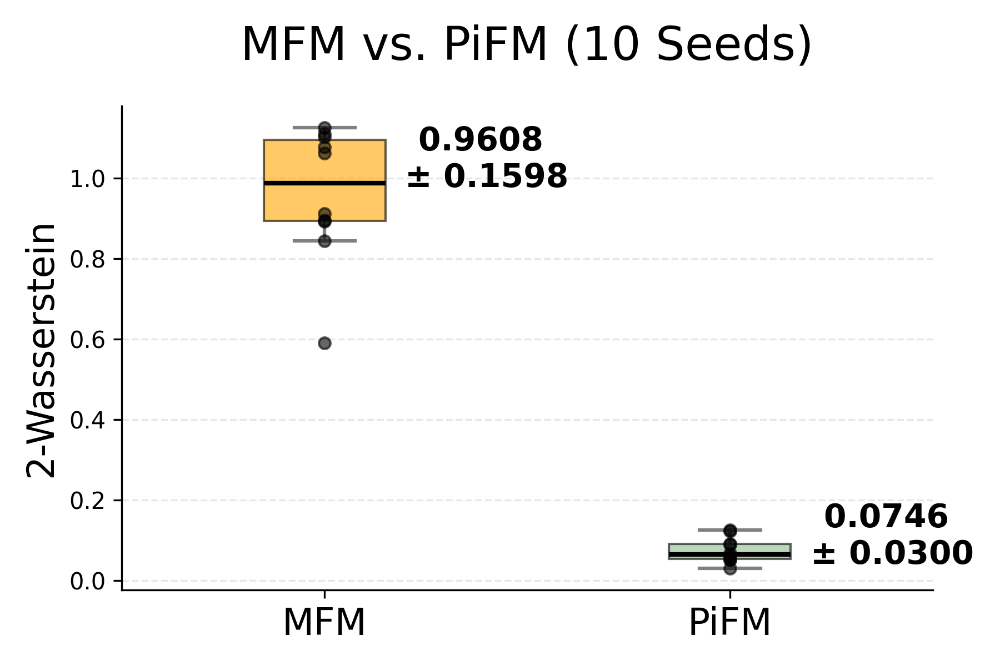
*(c)Single Batch-size*

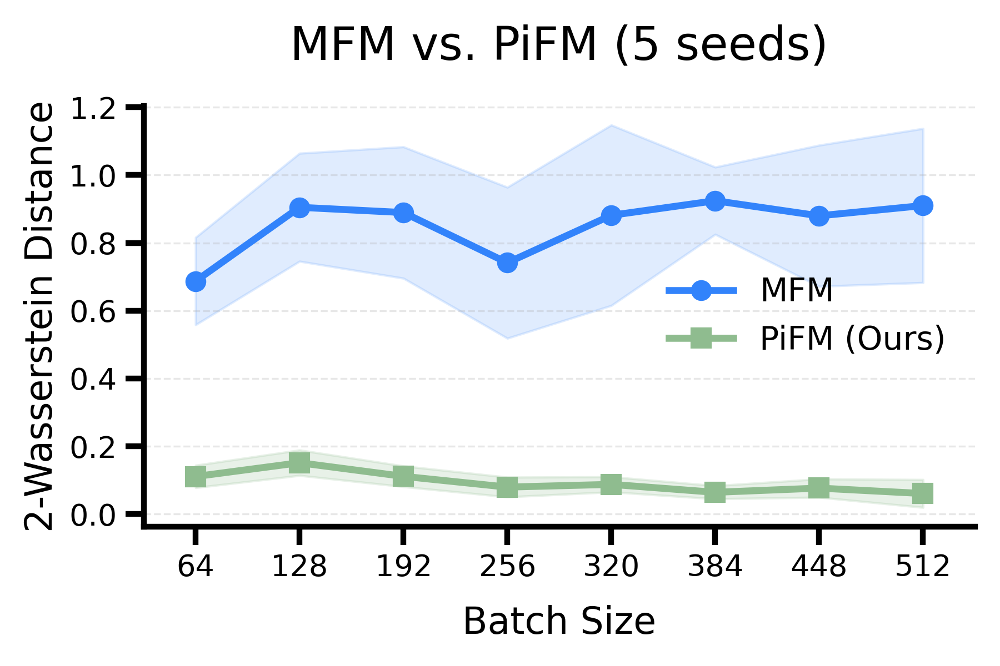
*(d)Across Batch-size*

*Figure 4:Illustration of PiFM in the Curly Flow Matching setting (Petrović et al., 2025) together with a quantitative evaluation of path dependence. Curly-FM and unregularized PiFM produce path-dependent dynamics and inconsistent final distributions across integration strategies. In contrast, PiFM with path-independence regularization yields consistent transport and the lowest value in Wasserstein-2 distance to the target distribution.*

*Figure 5:We present an image-to-image translation comparison of PiFM on the CelebA (Liu et al., 2015) dataset under three different flow integration strategies. PiFM successfully infers the missing attribute, whereas CFM fails to produce the desired transformation.*

![Figure 6:PiFM-inferred single-cell reprogramming dynamics across experimental day and pluripotency progression, visualized by PHATE Moon et al. (2019). (a) and (b) show trajectories along each biological axis, varying experimental day at fixed high pluripotency and varying pluripotency bins at fixed experimental day. (c) and (d) show path-ordered generation from day 0 low-pluripotency cells to day 6 high-pluripotency targets, where the two integration orders produce overlapping trajectories and generated distributions that match the real target population.](../images/2026-05-14/2605.13487/2605.13487_fig13.png)
*Figure 6:PiFM-inferred single-cell reprogramming dynamics across experimental day and pluripotency progression, visualized by PHATE Moon et al. (2019). (a) and (b) show trajectories along each biological axis, varying experimental day at fixed high pluripotency and varying pluripotency bins at fixed experimental day. (c) and (d) show path-ordered generation from day 0 low-pluripotency cells to day 6 high-pluripotency targets, where the two integration orders produce overlapping trajectories and generated distributions that match the real target population.*

*Figure 7:Comparison between output distributions from PiFM model (ours) and Wasserstein Barycenters for a) within and b) outside the probability simplex for spiral, clover and cat distributions . The predicted distributions from the PiFM model correspond to the Wasserstein Barycenters.*

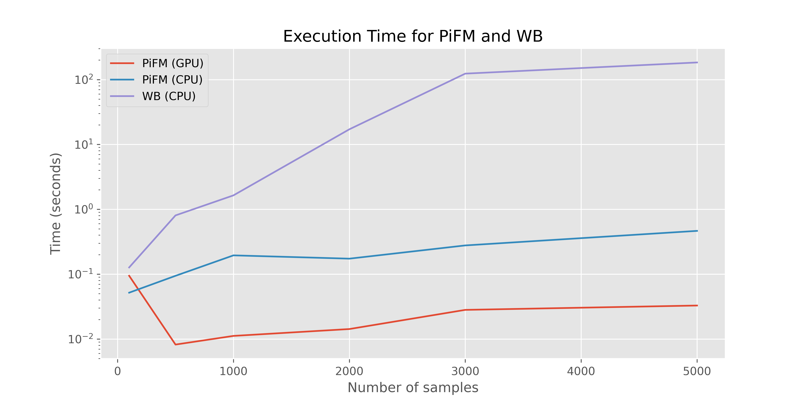
*Figure 8:Comparison of execution times between free support barycenter (POT package) and PiFM (ours).*

*Figure 9:Image-to-image translation results of Meta Flow Matching (MFM) on CelebA (Liu et al., 2015) dataset across three different flow integration strategies. The A-field (Smiling) produces localized mouth/cheek edits consistent with smiling, while the B-field (Young) darkens and re-textures the hair region. As shown, MFM fails to modify the source image along either one or both flow axes.*

*Figure 10:More results on the Image-to-image translation task for PiFM on CelebA (Liu et al., 2015) dataset across three different flow integration strategies. The A-field (Smiling) produces localized mouth/cheek edits consistent with smiling, while the B-field (Black Hair) darkens and re-textures the hair region.*

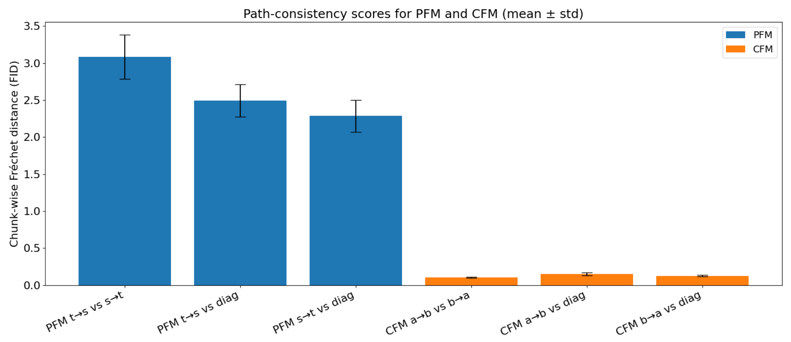
*Figure 11:Quantitative experiment for commutativity of PiFM using FID, comparison with CFM. Based on the experiment in Section 4.2.*

*Figure 12:Comparison between output distributions from PiFM (ours), global Wasserstein barycenter and Wasserstein barycenters between 
𝜙
𝑠
𝑉
 (left) and 
𝜙
𝑡
𝑈
 (right) projections for t=0.45, s=0.4. Source and target distributions are rescaled for clarity.*

![Figure 13:a) the global 
(
𝑡
,
𝑠
)
-diagram with the simplex 
Δ
=
{
(
𝑡
,
𝑠
)
∈
[
0
,
1
]
:
𝑡
+
𝑠
≤
1
}
 and commuting paths. b) the horizontal slice for fixed s. c) : the vertical slice for fixed t.](../images/2026-05-14/2605.13487/2605.13487_fig20.png)
*Figure 13:a) the global 
(
𝑡
,
𝑠
)
-diagram with the simplex 
Δ
=
{
(
𝑡
,
𝑠
)
∈
[
0
,
1
]
:
𝑡
+
𝑠
≤
1
}
 and commuting paths. b) the horizontal slice for fixed s. c) : the vertical slice for fixed t.*

![Figure 14:Comparison between output distributions from a) Wasserstein Barycenters with weights 
(
1
−
𝑡
−
𝑠
,
𝑡
,
𝑠
)
=
(
0.1
,
0.6
,
0.3
)
 (using Free Support Algorithm) b) PiFM model (ours) with 
𝑡
=
0.6
,
𝑠
=
0.3
, c) vertical Wasserstein barycenter with 
𝜆
=
(
1
−
𝑡
,
𝑡
)
=
(
0.4
,
0.6
)
 computed using Free Support Algorithm of 
𝜙
𝑡
,
𝑠
=
0
​
(
𝜌
0
)
 and 
𝜙
𝑡
,
𝑠
=
1
​
(
𝜌
2
)
 with 
𝑡
=
0.6
, d) horizontal Wasserstein barycenter 
𝜆
=
(
1
−
𝑠
,
𝑠
)
=
(
0.7
,
0.3
)
 computed using Free Support Algorithm of 
𝜙
𝑡
=
0
,
𝑠
​
(
𝜌
0
)
 and 
𝜙
𝑡
=
1
,
𝑠
​
(
𝜌
1
)
 with 
𝑠
=
0.3](../images/2026-05-14/2605.13487/2605.13487_fig21.png)
*Figure 14:Comparison between output distributions from a) Wasserstein Barycenters with weights 
(
1
−
𝑡
−
𝑠
,
𝑡
,
𝑠
)
=
(
0.1
,
0.6
,
0.3
)
 (using Free Support Algorithm) b) PiFM model (ours) with 
𝑡
=
0.6
,
𝑠
=
0.3
, c) vertical Wasserstein barycenter with 
𝜆
=
(
1
−
𝑡
,
𝑡
)
=
(
0.4
,
0.6
)
 computed using Free Support Algorithm of 
𝜙
𝑡
,
𝑠
=
0
​
(
𝜌
0
)
 and 
𝜙
𝑡
,
𝑠
=
1
​
(
𝜌
2
)
 with 
𝑡
=
0.6
, d) horizontal Wasserstein barycenter 
𝜆
=
(
1
−
𝑠
,
𝑠
)
=
(
0.7
,
0.3
)
 computed using Free Support Algorithm of 
𝜙
𝑡
=
0
,
𝑠
​
(
𝜌
0
)
 and 
𝜙
𝑡
=
1
,
𝑠
​
(
𝜌
1
)
 with 
𝑠
=
0.3*

![Figure 15:Comparison between output distributions from a) Wasserstein Barycenters with weights 
(
1
−
𝑡
−
𝑠
,
𝑡
,
𝑠
)
=
(
0.1
,
0.3
,
0.6
)
 (using Free Support Algorithm) b) PiFM model (ours) with 
𝑡
=
0.3
,
𝑠
=
0.6
, c) vertical Wasserstein barycenter with 
𝜆
=
(
1
−
𝑡
,
𝑡
)
=
(
0.7
,
0.3
)
 computed using Free Support Algorithm of 
𝜙
𝑡
,
𝑠
=
0
​
(
𝜌
0
)
 and 
𝜙
𝑡
,
𝑠
=
1
​
(
𝜌
2
)
 with 
𝑡
=
0.3
, d) horizontal Wasserstein barycenter 
𝜆
=
(
1
−
𝑠
,
𝑠
)
=
(
0.4
,
0.6
)
 computed using Free Support Algorithm of 
𝜙
𝑡
=
0
,
𝑠
​
(
𝜌
0
)
 and 
𝜙
𝑡
=
1
,
𝑠
​
(
𝜌
1
)
 with 
𝑠
=
0.6](../images/2026-05-14/2605.13487/2605.13487_fig22.png)
*Figure 15:Comparison between output distributions from a) Wasserstein Barycenters with weights 
(
1
−
𝑡
−
𝑠
,
𝑡
,
𝑠
)
=
(
0.1
,
0.3
,
0.6
)
 (using Free Support Algorithm) b) PiFM model (ours) with 
𝑡
=
0.3
,
𝑠
=
0.6
, c) vertical Wasserstein barycenter with 
𝜆
=
(
1
−
𝑡
,
𝑡
)
=
(
0.7
,
0.3
)
 computed using Free Support Algorithm of 
𝜙
𝑡
,
𝑠
=
0
​
(
𝜌
0
)
 and 
𝜙
𝑡
,
𝑠
=
1
​
(
𝜌
2
)
 with 
𝑡
=
0.3
, d) horizontal Wasserstein barycenter 
𝜆
=
(
1
−
𝑠
,
𝑠
)
=
(
0.4
,
0.6
)
 computed using Free Support Algorithm of 
𝜙
𝑡
=
0
,
𝑠
​
(
𝜌
0
)
 and 
𝜙
𝑡
=
1
,
𝑠
​
(
𝜌
1
)
 with 
𝑠
=
0.6*

---
**Usage Info**: 1505 tokens used.
**Generated at**: 2026-05-14 16:11:50

---

# 📚 Seconds-Aligned PCA-DAC Latent Diffusion for Symbolic-to-Audio Drum Rendering

🚀 URL: https://arxiv.org/html/2605.13404

## 🌏 Abstract (원문)
Symbolic-control drum generation requires preserving explicit event timing and dynamics while synthesizing acoustically plausible waveforms. We presentSec2Drum-DAC, a conditional latent-diffusion model for symbolic-to-audio drum rendering. The model conditions on event features sampled in physical time at codec-frame locations and predicts standardized principal-component coordinates of frozen DAC summed-codebook embeddings rather than waveform samples. In the evaluated DAC configuration, 72 principal components capture the observed training-frame summed-latent subspace under the stated SVD threshold, yielding a compact continuous denoising target with a deterministic reconstruction path to the 1024-dimensional DAC latent space before waveform decoding.Across 1,733 held-out four-beat windows, PCA diffusion improves paired spectral and transient metrics over deterministic PCA regression and a symbolic rendering baseline, while direct regression remains stronger on phase-sensitive waveformL1L_{1}. Auxiliary RVQ cross-entropy improves short-step diffusion on mel error, onset-flux cosine, and waveformL1L_{1}, with the most favorable trade-offs occurring at 6–25 denoising steps depending on the metric.
## 🌏 Abstract (번역)
심볼릭 제어 드럼 생성은 음향적으로 그럴듯한 파형을 합성하면서 명시적인 이벤트 타이밍과 다이내믹스를 보존해야 합니다. 본 논문에서는 심볼릭-오디오 드럼 렌더링을 위한 조건부 잠재 확산 모델인 Sec2Drum-DAC을 제안합니다. 이 모델은 코덱 프레임 위치에서 물리적 시간으로 샘플링된 이벤트 특징을 조건으로 사용하며, 파형 샘플 대신 고정된 DAC 합산 코드북 임베딩의 표준화된 주성분 좌표를 예측합니다. 평가된 DAC 구성에서 72개의 주성분은 명시된 SVD 임계값 하에서 관찰된 훈련 프레임 합산 잠재 부분 공간을 포착하여, 파형 디코딩 전에 1024차원 DAC 잠재 공간으로의 결정론적 재구성 경로를 가진 압축된 연속적인 노이즈 제거 대상을 제공합니다. 1,733개의 보류된 4비트 윈도우에 걸쳐, PCA 확산은 결정론적 PCA 회귀 및 심볼릭 렌더링 기준선보다 쌍을 이룬 스펙트럼 및 과도기적 메트릭을 개선했지만, 직접 회귀는 위상 민감 파형 L1에서 더 강력했습니다. 보조 RVQ 교차 엔트로피는 멜 오류, 온셋 플럭스 코사인, 파형 L1에서 단기 확산을 개선했으며, 가장 유리한 트레이드오프는 메트릭에 따라 6~25개의 노이즈 제거 단계에서 발생했습니다.

## 🔍 Methods & Results
- Sec2Drum-DAC은 심볼릭 제어 시퀀스(c)와 쌍을 이루는 파형 세그먼트(a)를 입력으로 받아, 파형 공간에서 직접 모델링하는 대신, DAC 디코더를 통해 파형 오디오를 복구하는 디코딩 가능한 잠재 표현의 정규화된 PCA 좌표에 대한 조건부 모델을 학습합니다.
- 모델은 고정된 DAC 인코더(Eenc), 잔차 벡터 양자화기(QRVQ), 및 디코더(DDAC)를 활용하며, 목표는 원시 DAC 인코더 상태가 아닌 양자화 후 합산된 코드북 임베딩입니다.
- 컨디셔닝 표현은 8개 드럼 패밀리에 대한 상태 속도, 온셋 속도, 온셋 카운트를 포함하는 24개 수치 채널의 드럼 그리드이며, 심볼릭 그리드 인덱스와 코덱 프레임 인덱스가 일치한다고 가정하지 않고 물리적 시간에 정렬된 매핑을 사용합니다.
- 컨디셔너는 반경 0, 22, 41, 55 그리드 스텝을 가진 하이브리드 멀티스케일 프론트엔드를 사용하며, 각 스케일당 64차원 특징과 물리적 시간으로 정의된 위치 인코딩을 사용합니다.
- 예측 목표는 훈련 프레임에만 PCA를 적용하여 표현된 연속적인 합산 DAC 코드북 임베딩 궤적이며, K=72개의 주성분이 사용되고 이들은 훈련 세트 통계를 사용하여 표준화됩니다.
- 순방향 확산 과정은 x_n = sqrt(alpha_bar_n) * x_0 + sqrt(1 - alpha_bar_n) * epsilon으로 정의되며, Transformer 디노이저는 노이즈가 추가된 궤적, 확산 인덱스, 시간 정렬된 컨디셔닝 시퀀스를 받아 주입된 노이즈를 예측합니다.
- 훈련 목표는 표준 노이즈 예측 손실이며, 코사인 노이즈 스케줄과 DDPM 스타일의 역방향 프로세스를 사용하며, 확산 단계 N은 6, 12, 25, 50으로 다양하게 설정됩니다.
- 보조 RVQ 교차 엔트로피(RVQ-CE) 손실(lambda_ce=0.10)은 기본 코덱의 이산 구조와 정렬된 감독을 위해 훈련 중에 선택적으로 사용될 수 있으며, 추론 시에는 사용되지 않습니다.
- 평가된 DAC 구성에서 72개의 주성분은 훈련 프레임 합산 잠재 부분 공간을 효과적으로 포착하여, 1024차원 DAC 잠재 공간으로의 결정론적 재구성 경로를 제공하는 압축된 노이즈 제거 대상을 생성합니다.
- 1,733개의 보류된 4비트 윈도우에 대한 실험 결과, PCA 확산은 결정론적 PCA 회귀 및 심볼릭 렌더링 기준선보다 쌍을 이룬 스펙트럼 및 과도기적 메트릭을 개선했습니다.
- 직접 회귀는 위상 민감 파형 L1에서 더 강력한 성능을 보였습니다.
- 보조 RVQ 교차 엔트로피는 멜 오류, 온셋 플럭스 코사인, 파형 L1에서 단기 확산 성능을 향상시켰으며, 가장 유리한 트레이드오프는 메트릭에 따라 6~25개의 노이즈 제거 단계에서 나타났습니다.

## 🖼 Figures
![Figure 1:Conditioning-side representation inspection for a held-out four-beat window. The raw 24-lane family-state grid and family articulation-ID grid are frontend source fields; they are merged by the seconds-aware frontend into the denoiser conditioning representation 
𝑋
 evaluated at codec-frame times. In this configuration, 
𝑋
 is the concatenation of four 64-dimensional scale outputs. The plotted 
𝑋
 values are row z-scores over time for display only; the model receives the frontend activations directly. No 16th-step aggregate is plotted because it is not a model input. Red lines mark detected beat boundaries.](../images/2026-05-14/2605.13404/2605.13404_fig0.png)
*Figure 1:Conditioning-side representation inspection for a held-out four-beat window. The raw 24-lane family-state grid and family articulation-ID grid are frontend source fields; they are merged by the seconds-aware frontend into the denoiser conditioning representation 
𝑋
 evaluated at codec-frame times. In this configuration, 
𝑋
 is the concatenation of four 64-dimensional scale outputs. The plotted 
𝑋
 values are row z-scores over time for display only; the model receives the frontend activations directly. No 16th-step aggregate is plotted because it is not a model input. Red lines mark detected beat boundaries.*

![Figure 2:Target-side representation inspection. RVQ codebook indices are shown as raw integer IDs for the auxiliary loss. The summed DAC embedding and PCA coefficient panels are row z-scored over time for visualization only. The continuous model target is the PCA-DAC coefficient trajectory; during training these coefficients are standardized with training-set per-dimension mean and standard deviation, then mapped back through the PCA inverse to the summed DAC embedding trajectory before waveform decoding.](../images/2026-05-14/2605.13404/2605.13404_fig1.png)
*Figure 2:Target-side representation inspection. RVQ codebook indices are shown as raw integer IDs for the auxiliary loss. The summed DAC embedding and PCA coefficient panels are row z-scored over time for visualization only. The continuous model target is the PCA-DAC coefficient trajectory; during training these coefficients are standardized with training-set per-dimension mean and standard deviation, then mapped back through the PCA inverse to the summed DAC embedding trajectory before waveform decoding.*

---
**Usage Info**: 4838 tokens used.
**Generated at**: 2026-05-14 16:13:15

---

# 📚 Coreset-Induced Conditional Velocity Flow Matching

🚀 URL: https://arxiv.org/html/2605.12951

## 🌏 Abstract (원문)
We propose Coreset-Induced Conditional Velocity Flow Matching (CCVFM), a generative model that augments hierarchical rectified flow with a data-informed source distribution. Hierarchical flow matching models the full conditional velocity law in velocity space, but its inner flow is asked to transport isotropic Gaussian noise to a multimodal target velocity distribution from scratch. Our key observation is that this inner source can be replaced by a closed-form surrogate built from a coreset of the target. CCVFM first compresses the target into weighted atoms using an entropic Sinkhorn coreset and lifts them to a Gaussian mixture. The induced conditional velocity law is then a closed-form Gaussian mixture that can be sampled without a learned neural sampler. A lightweight correction flow, trained from this exact surrogate source, then refines the remaining surrogate-to-target residual rather than learning an entire noise-to-data map. We prove that the surrogate transport cost equals the target–surrogate Wasserstein gap under an explicit compression assumption, whereas the noise-source analogue has a dimension-scale lower bound. We further characterize the conditional second moment of the direct surrogate-source training target and show that its source-dependent excess is small when the surrogate conditional law is close to the true conditional velocity law in mean and covariance. Empirically, on MNIST, CIFAR-10, ImageNet-32, and CelebA-HQ, the proposed method reaches competitive few-step generation under matched architectures. Codes are available athttps://anonymous.4open.science/r/ccvfm-code-11D3/.
## 🌏 Abstract (번역)
저희는 계층적 정류 흐름(hierarchical rectified flow)을 데이터 기반 소스 분포로 증강하는 생성 모델인 Coreset-Induced Conditional Velocity Flow Matching (CCVFM)을 제안합니다. 계층적 흐름 매칭은 속도 공간에서 완전한 조건부 속도 법칙을 모델링하지만, 그 내부 흐름은 등방성 가우시안 노이즈를 다중 모드 목표 속도 분포로 처음부터 전달하도록 요구됩니다. 저희의 핵심 관찰은 이 내부 소스를 목표의 코어셋(coreset)에서 구축된 닫힌 형식의 대리자(surrogate)로 대체할 수 있다는 것입니다. CCVFM은 먼저 엔트로피 싱크혼 코어셋을 사용하여 목표를 가중 원자(weighted atoms)로 압축하고 이를 가우시안 혼합으로 들어 올립니다. 유도된 조건부 속도 법칙은 학습된 신경 샘플러 없이 샘플링할 수 있는 닫힌 형식의 가우시안 혼합이 됩니다. 이 정확한 대리 소스에서 훈련된 경량 보정 흐름은 전체 노이즈-데이터 맵을 학습하는 대신 남은 대리자-목표 잔차를 정제합니다. 저희는 명시적 압축 가정 하에 대리 전송 비용이 목표-대리 바서슈타인 간격과 같음을 증명하며, 노이즈-소스 유사체는 차원 스케일 하한을 가집니다. 또한 직접적인 대리-소스 훈련 목표의 조건부 2차 모멘트를 특성화하고, 대리 조건부 법칙이 평균 및 공분산에서 실제 조건부 속도 법칙에 가까울 때 소스 의존적 초과분이 작음을 보여줍니다. 경험적으로 MNIST, CIFAR-10, ImageNet-32 및 CelebA-HQ에서 제안된 방법은 일치하는 아키텍처 하에서 경쟁력 있는 소수 단계 생성을 달성합니다. 코드는 https://anonymous.4open.science/r/ccvfm-code-11D3/에서 확인할 수 있습니다.

## 🔍 Methods & Results
- Coreset-Induced Conditional Velocity Flow Matching (CCVFM)을 제안하며, 이는 계층적 정류 흐름(hierarchical rectified flow)을 데이터 기반 소스 분포로 증강하는 생성 모델이다.
- 기존 계층적 흐름 매칭의 내부 흐름이 등방성 가우시안 노이즈를 다중 모드 목표 속도 분포로 처음부터 전달해야 하는 문제를 해결한다.
- 핵심 아이디어는 내부 소스를 목표의 코어셋(coreset)에서 구축된 닫힌 형식의 대리자(surrogate)로 대체하는 것이다.
- CCVFM은 엔트로피 싱크혼 코어셋을 사용하여 목표를 가중 원자로 압축하고 이를 가우시안 혼합으로 변환한다.
- 유도된 조건부 속도 법칙은 학습된 신경 샘플러 없이 샘플링 가능한 닫힌 형식의 가우시안 혼합이다.
- 경량 보정 흐름(lightweight correction flow)은 대리 소스에서 훈련되어 전체 노이즈-데이터 맵 학습 대신 남은 대리자-목표 잔차를 정제한다.
- 명시적 압축 가정 하에 대리 전송 비용이 목표-대리 바서슈타인 간격과 같음을 이론적으로 증명했으며, 노이즈-소스 유사체는 차원 스케일 하한을 가진다.
- 직접적인 대리-소스 훈련 목표의 조건부 2차 모멘트를 특성화하고, 대리 조건부 법칙이 실제 조건부 속도 법칙에 가까울 때 소스 의존적 초과분이 작음을 보였다.
- MNIST, CIFAR-10, ImageNet-32, CelebA-HQ 데이터셋에서 일치하는 아키텍처 하에 경쟁력 있는 소수 단계 생성 성능을 달성했다.

## 🖼 Figures

*Figure 1:CCVFM pipeline: an entropic-Sinkhorn coreset is lifted to a GMM surrogate 
𝜌
~
1
; the induced law 
𝜋
~
​
(
𝑣
∣
𝑥
𝑡
,
𝑡
)
 is a closed-form GMM; a correction flow with source 
𝜋
~
 itself refines the surrogate-to-target residual.*

*Figure 2:Uncurated samples used for the reported FID pools: first 
100
 samples for (a)–(c), and a 
2
×
5
 CelebA-HQ panel from the seed-99 30k pool for (d).*

![Figure 3:Toy benchmarks across five synthetic targets. Each panel compares (columns, left-to-right): (i) ground-truth samples, (ii) rectified-flow mean-field 1-step output, (iii) rectified-flow mean-field multi-step output, (iv) Stage I Sinkhorn-coreset samples, (v) CCVFM Stage II closed-form 1-step generator. Even at 
1
 NFE with no learned neural network, CCVFM Stage II matches the multi-step rectified-flow quality on all five datasets and avoids the mode-dropping that plagues 1-step mean-field methods (ring-6, pinwheel, helix).](../images/2026-05-14/2605.12951/2605.12951_fig2.png)
*Figure 3:Toy benchmarks across five synthetic targets. Each panel compares (columns, left-to-right): (i) ground-truth samples, (ii) rectified-flow mean-field 1-step output, (iii) rectified-flow mean-field multi-step output, (iv) Stage I Sinkhorn-coreset samples, (v) CCVFM Stage II closed-form 1-step generator. Even at 
1
 NFE with no learned neural network, CCVFM Stage II matches the multi-step rectified-flow quality on all five datasets and avoids the mode-dropping that plagues 1-step mean-field methods (ring-6, pinwheel, helix).*

![Figure 4:Conditional-velocity advantage on ring-6. Left: the true conditional velocity law 
𝜋
​
(
𝑣
∣
𝑥
𝑡
,
𝑡
)
 at a specific intermediate 
(
𝑥
𝑡
,
𝑡
)
 is multimodal (six modes, one per ring cluster). Middle: rectified-flow targets the conditional mean, which collapses the six modes to a single direction pointing through the center of the ring, a density-valley output. Right: CCVFM’s closed-form GMM 
𝜋
~
​
(
𝑣
∣
𝑥
𝑡
,
𝑡
)
 recovers the six-mode structure exactly, so sampling from 
𝜋
~
 yields a valid single-step velocity that lands on one of the ring modes. This is the 2D visualization of the mean-collapse critique in §1 of the main paper.](../images/2026-05-14/2605.12951/2605.12951_fig3.png)
*Figure 4:Conditional-velocity advantage on ring-6. Left: the true conditional velocity law 
𝜋
​
(
𝑣
∣
𝑥
𝑡
,
𝑡
)
 at a specific intermediate 
(
𝑥
𝑡
,
𝑡
)
 is multimodal (six modes, one per ring cluster). Middle: rectified-flow targets the conditional mean, which collapses the six modes to a single direction pointing through the center of the ring, a density-valley output. Right: CCVFM’s closed-form GMM 
𝜋
~
​
(
𝑣
∣
𝑥
𝑡
,
𝑡
)
 recovers the six-mode structure exactly, so sampling from 
𝜋
~
 yields a valid single-step velocity that lands on one of the ring modes. This is the 2D visualization of the mean-collapse critique in §1 of the main paper.*

![Figure 5:Empirical illustration of the surrogate-gap decomposition on the ring-6 target. For each 
(
𝑛
,
𝐾
)
 pair we plot the three bound terms from the generation analysis: sampling (
𝑊
2
​
(
𝜌
1
,
𝜌
^
𝑛
)
), coreset (
ℰ
cs
1
/
2
=
𝑊
2
​
(
𝜌
^
𝑛
,
∑
𝑤
𝑘
​
𝛿
𝜇
𝑘
)
) and smoothing (
𝜎
gmm
), alongside the measured generation error 
𝑊
2
​
(
ℒ
​
(
𝑋
^
1
)
,
𝜌
1
)
. Across 
𝑛
∈
{
500
,
2000
,
10000
}
 and 
𝐾
∈
{
2
,
5
,
10
,
25
,
50
,
100
}
, the measured error tracks the empirical upper bound within a tightness ratio of 
0.2
–
0.4
, and the coreset-compression term dominates for small 
𝐾
 while the sampling term dominates once 
𝐾
≳
𝑛
1
/
2
, which is the regime where the coreset shortcut becomes free.](../images/2026-05-14/2605.12951/2605.12951_fig4.png)
*Figure 5:Empirical illustration of the surrogate-gap decomposition on the ring-6 target. For each 
(
𝑛
,
𝐾
)
 pair we plot the three bound terms from the generation analysis: sampling (
𝑊
2
​
(
𝜌
1
,
𝜌
^
𝑛
)
), coreset (
ℰ
cs
1
/
2
=
𝑊
2
​
(
𝜌
^
𝑛
,
∑
𝑤
𝑘
​
𝛿
𝜇
𝑘
)
) and smoothing (
𝜎
gmm
), alongside the measured generation error 
𝑊
2
​
(
ℒ
​
(
𝑋
^
1
)
,
𝜌
1
)
. Across 
𝑛
∈
{
500
,
2000
,
10000
}
 and 
𝐾
∈
{
2
,
5
,
10
,
25
,
50
,
100
}
, the measured error tracks the empirical upper bound within a tightness ratio of 
0.2
–
0.4
, and the coreset-compression term dominates for small 
𝐾
 while the sampling term dominates once 
𝐾
≳
𝑛
1
/
2
, which is the regime where the coreset shortcut becomes free.*

*Figure 6:MNIST Stage III samples at 
𝐿
∈
{
10
,
20
,
50
}
 correction steps. Quality sharpens from 
𝐿
=
10
 to 
𝐿
=
20
 and continues improving at 
𝐿
=
50
, mirroring the FID column.*

*Figure 7:CIFAR-10 Stage III samples across NFE budgets at 
𝐾
=
5000
. Shown for completeness alongside the 
𝐾
=
10000
 configuration (FID
=
50
​
𝑘
6.35
 at 
50
 NFE) reported in Figure 2 of the main paper.*

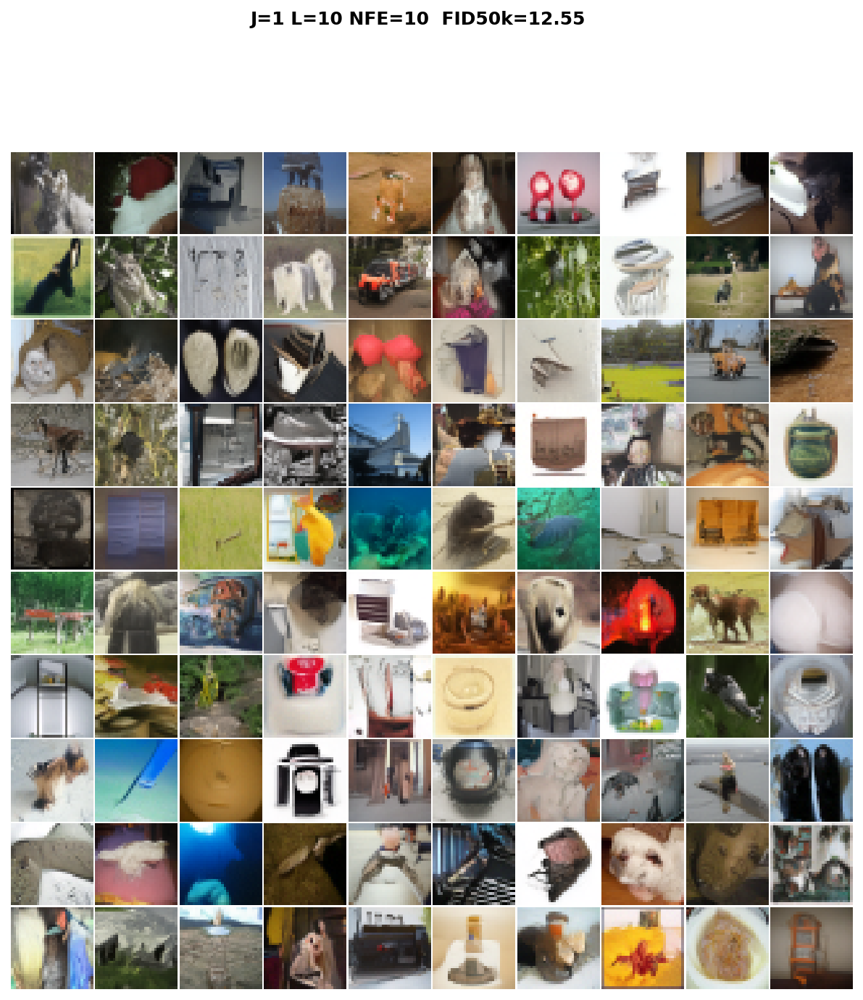
*Figure 8:ImageNet-32 Stage III samples across NFE budgets.*

*Figure 9:
10
×
10
 uncurated CelebA-HQ 256 samples from the CCVFM-L 
𝐿
=
50
 generator (FID
=
28
​
𝑘
4.17
). The grid spans identities, lighting, expression, head pose, hair colour, and presence of glasses/accessories without any per-sample selection; the diversity confirms the surrogate 
𝜋
~
 propagates the full CelebA-HQ identity manifold and not just a few high-density modes.*

*Figure 10:
2
×
5
 uncurated panel of CelebA-HQ samples, larger per-image resolution. Reproduces the panel used as Figure 2(d) in the main paper for completeness; useful for inspecting fine-grained artifacts (hair strands, eye pupils, skin texture) that the smaller-cell 
10
×
10
 grid downsamples.*

![Figure 11:Stage II
→
III progression on CelebA-HQ. Panel (a) shows one-NFE samples drawn directly from the closed-form GMM surrogate 
𝜋
~
 in DC-AE latent space and decoded; the global colour and pose distributions are correct but per-pixel detail is blurry. Panel (b) shows the same seeds after the correction flow integrates the residual for 
𝐿
=
50
 inner steps; faces sharpen, eyes/teeth gain high-frequency structure, and the FID drops from the Stage II-only value to FID
=
28
​
𝑘
4.17
. The contrast quantifies what the correction net buys: high-frequency residual, not global structure.](../images/2026-05-14/2605.12951/2605.12951_fig10.png)
*Figure 11:Stage II
→
III progression on CelebA-HQ. Panel (a) shows one-NFE samples drawn directly from the closed-form GMM surrogate 
𝜋
~
 in DC-AE latent space and decoded; the global colour and pose distributions are correct but per-pixel detail is blurry. Panel (b) shows the same seeds after the correction flow integrates the residual for 
𝐿
=
50
 inner steps; faces sharpen, eyes/teeth gain high-frequency structure, and the FID drops from the Stage II-only value to FID
=
28
​
𝑘
4.17
. The contrast quantifies what the correction net buys: high-frequency residual, not global structure.*

![Figure 12:Memorization probe (CelebA-HQ). For each of several generated CCVFM samples (left column), we show the top-
5
 nearest CelebA-HQ training images by Inception feature distance (right 
5
 columns). Generated samples consistently differ from the closest training matches in identity, pose, expression, and accessories; the closest training neighbours are visually plausible neighbours of the generated sample but not identical, indicating that CCVFM interpolates within the training manifold rather than retrieving near-duplicates. This is the qualitative companion to the 
Generated
→
Train
 vs. 
Generated
→
Test
 KS/
𝑊
1
 statistics in §G.](../images/2026-05-14/2605.12951/2605.12951_fig11.png)
*Figure 12:Memorization probe (CelebA-HQ). For each of several generated CCVFM samples (left column), we show the top-
5
 nearest CelebA-HQ training images by Inception feature distance (right 
5
 columns). Generated samples consistently differ from the closest training matches in identity, pose, expression, and accessories; the closest training neighbours are visually plausible neighbours of the generated sample but not identical, indicating that CCVFM interpolates within the training manifold rather than retrieving near-duplicates. This is the qualitative companion to the 
Generated
→
Train
 vs. 
Generated
→
Test
 KS/
𝑊
1
 statistics in §G.*

![Figure 13:Goodness-of-fit diagnostics in Inception feature space (MNIST, 
𝐿
=
20
). Left: density of 
1
-NN distances from each pair of pools. Middle: scatter of the per-sample Generated-to-Training vs. Generated-to-Test distances; points lie on the identity line. Right: improved precision/recall [16] with the real reference as either the held-out test set or a trained-on subset; the two references produce statistically indistinguishable P/R values. Moved here from the main paper.](../images/2026-05-14/2605.12951/2605.12951_fig12.png)
*Figure 13:Goodness-of-fit diagnostics in Inception feature space (MNIST, 
𝐿
=
20
). Left: density of 
1
-NN distances from each pair of pools. Middle: scatter of the per-sample Generated-to-Training vs. Generated-to-Test distances; points lie on the identity line. Right: improved precision/recall [16] with the real reference as either the held-out test set or a trained-on subset; the two references produce statistically indistinguishable P/R values. Moved here from the main paper.*

*Figure 14:Cumulative-distribution visualizations of the 
1
-NN distance distributions in Inception feature space. The Generated
→
Training and Generated
→
Test curves essentially overlap, confirming the memorization-test finding in the main-paper goodness-of-fit table.*

*Figure 15:Symmetry diagnostic: Ge
→
Te vs. Te
→
Ge and Ge
→
Tr vs. Tr
→
Ge distance distributions, Inception feature space. Symmetry of both pairs (KS
<
0.031
 in the main-paper table) indicates no mode dropping and no coverage deficit.*

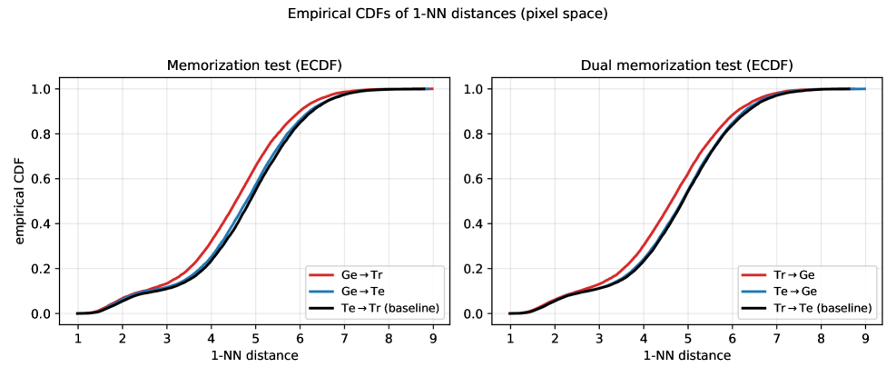
*Figure 16:Pixel-space CDF visualization, complementary to Figure 14.*

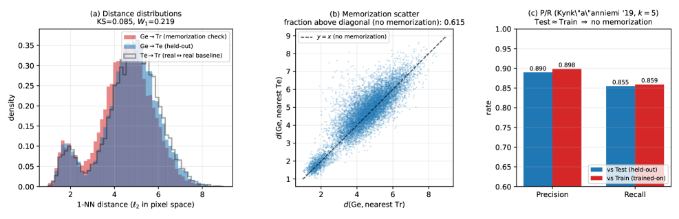
*Figure 17:Pixel-space version of the three-panel diagnostic (histogram + memorization scatter + P/R bars) shown for Inception features in the main-paper goodness-of-fit diagnostic.*

---
**Usage Info**: 2151 tokens used.
**Generated at**: 2026-05-14 16:14:04

---

