# 🚩 (2026-05-15) Scholar Inbox 추천 논문 

# 📚 Streaming Speech-to-Text Translation with a SpeechLLM

🚀 URL: https://arxiv.org/html/2605.14766

## 🌏 Abstract (원문)
Normally, a system that translates speech into text consists of separate modules for speech recognition and text-to-text translation. Combining those tasks into a SpeechLLM promises to exploit paralinguistic information in the speech and to reduce cascaded errors. But existing SpeechLLM systems are slow since they do not work in a real streaming fashion: they wait for a complete utterance of audio before outputting a translation, or output tokens at fixed intervals, which is not suitable for real applications. This work proposes an LLM-based architecture for real streaming speech-to-text translation. The LLM learns not just to emit output tokens, but also to decide whether it has seen enough audio to do so. The system is trained using automatic alignments of the input speech and the output text. In experiments on different language pairs, the system achieves a translation quality close to the non-streaming baseline, but with a latency of only 1–2 seconds.
## 🌏 Abstract (번역)
일반적으로 음성을 텍스트로 번역하는 시스템은 음성 인식 및 텍스트-텍스트 번역을 위한 별도의 모듈로 구성됩니다. 이러한 작업을 SpeechLLM으로 결합하면 음성 내의 비언어적 정보를 활용하고 연쇄 오류를 줄일 수 있습니다. 그러나 기존 SpeechLLM 시스템은 실제 스트리밍 방식으로 작동하지 않아 느립니다. 즉, 오디오의 완전한 발화를 기다린 후에야 번역을 출력하거나 고정된 간격으로 토큰을 출력하여 실제 애플리케이션에 적합하지 않습니다. 본 연구는 실제 스트리밍 음성-텍스트 번역을 위한 LLM 기반 아키텍처를 제안합니다. 이 LLM은 출력 토큰을 생성하는 것뿐만 아니라 충분한 오디오를 보았는지 여부를 결정하는 것도 학습합니다. 이 시스템은 입력 음성과 출력 텍스트의 자동 정렬을 사용하여 훈련됩니다. 다양한 언어 쌍에 대한 실험에서 이 시스템은 비스트리밍 기준선에 가까운 번역 품질을 달성하면서도 1~2초에 불과한 지연 시간을 보였습니다.

## 🔍 Methods & Results
- 기존 SpeechLLM 시스템은 완전한 발화를 기다리거나 고정된 간격으로 토큰을 출력하여 실제 스트리밍 방식이 아니며, 별도의 학습되지 않은 대기 정책을 사용하여 느리다는 문제점을 해결하고자 한다.
- 실시간 스트리밍 음성-텍스트 번역을 위해 LLM 기반의 'Intermixed SpeechLLM' 아키텍처를 제안한다.
- 제안된 LLM은 일반 텍스트 토큰과 '대기 토큰(WW)'을 혼합하여 출력하며, 대기 토큰을 출력함으로써 다음 텍스트 토큰을 생성하기 전에 추가 오디오 청크를 요청할지 여부를 스스로 결정한다.
- 시스템은 입력 음성과 출력 텍스트의 자동 정렬을 사용하여 훈련되며, 단일 스텝 시퀀스의 로그-우도(log-likelihood)를 최대화하는 방식으로 학습된다.
- 지연 시간과 번역 품질 간의 균형을 조절하기 위해 대기 토큰의 로그-가중치에서 차감되는 '대기 페널티(wait penalty)' κ를 도입한다.
- 온디바이스 시나리오의 에너지 효율성을 위해 LLM의 초기 레이어 출력에서 추가 헤드를 사용하는 '조기 종료 대기 정책(early-exit wait policy)'을 제안한다. 이 정책은 더 빠르고, 추가 오디오가 필요하면 LLM 평가 없이 대기(WW)하고, 그렇지 않으면 LLM이 평가되도록 제어(EE)하여 번역 품질에 영향을 주지 않으면서 에너지와 지연 시간의 균형을 맞춘다.
- 다양한 언어 쌍에 대한 실험에서 제안된 시스템은 비스트리밍 기준선에 가까운 번역 품질을 달성하면서도 1~2초의 낮은 지연 시간을 보여주었다.

## 🖼 Figures

*(a)The “intermixed” architecture for speech translation. The output tokens are intermixed with wait tokens; the input tokens are intermixed with speech tokens. When the LLM outputs a text token, that token is passed in at the next step. When the LLM outputs a wait token 
𝑊
, a speech token is passed in at the next step.*

*(a)The “intermixed” architecture for speech translation. The output tokens are intermixed with wait tokens; the input tokens are intermixed with speech tokens. When the LLM outputs a text token, that token is passed in at the next step. When the LLM outputs a wait token 
𝑊
, a speech token is passed in at the next step.*

*(b) The intermixed system from Figure 1(a) with an “early-exit wait policy”. When the wait policy decides to wait, the LLM is not evaluated. When the wait policy decides to emit, the LLM emits zero or more tokens followed by a wait token. This reduces computation, since the wait policy is faster to evaluate than the LLM.*

*(a)A monotonic alignment.*

*(a)A monotonic alignment.*

*(b)An alignment that involves re-ordering.*

*(a)Fleurs: English
→
French.*

*(a)Fleurs: English
→
French.*

*(b)Fleurs: English
→
Korean.*

*(a)Fleurs: English
→
French.*

*(a)Fleurs: English
→
French.*

*(b)Fleurs: English
→
Korean.*

*(a) Translation quality on Fleurs and SilFleurs. The fixed wait policy and AlignAtt fail catastrophically on SilFleurs due to hallucinations from the added silence. The intermixed model does not.*

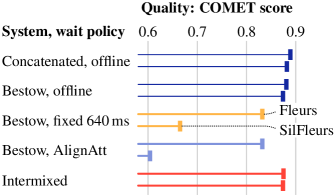
*(a) Translation quality on Fleurs and SilFleurs. The fixed wait policy and AlignAtt fail catastrophically on SilFleurs due to hallucinations from the added silence. The intermixed model does not.*

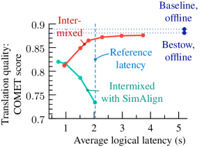
*(b) Latency vs quality for SimAlign vs this paper. SimAlign’s word-level alignments are notably less accurate compared to the frame-level alignments proposed in this paper.*

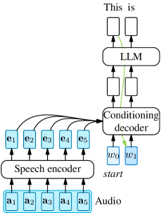
*(a) The “cross-attention SpeechLLM” architecture. The way the LLM’s output is conditioned on the speech input is by cross-attention. To keep the pretrained LLM, cross-attention layers are inserted before the LLM.*

*(a) The “cross-attention SpeechLLM” architecture. The way the LLM’s output is conditioned on the speech input is by cross-attention. To keep the pretrained LLM, cross-attention layers are inserted before the LLM.*

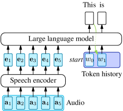
*(b) The “concatenated SpeechLLM” architecture. The way the LLM’s output is conditioned on the speech input is by feeding the “speech tokens” to the decoder as if it were the token history.*

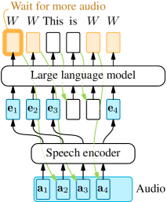
*Figure 10:The “intermixed” architecture for speech translation, repeated from Figure 1(a). The output tokens are intermixed with wait tokens; the input tokens are intermixed with speech tokens.*

*Figure 11: The intermixed system from Figure 10 with an “early-exit wait policy”, repeated from Figure 1(b). When the wait policy decides to wait, the LLM is not evaluated. When the wait policy decides to emit, the LLM emits zero or more tokens and finishes with a wait token. This yields a reduction in computation, since the wait policy is faster to evaluate than the LLM.*

*(a)English
→
French.*

*(a)English
→
French.*

*(b)English
→
Korean.*

![Figure 13:Latency vs quality on English
→
German. Fleurs. The curves are generated by varying the wait penalty (
[
−
1
,
4
]
) for the intermixed model and step duration (
[
640
,
1280
]
) for Bestow with “wait-
𝑘
” models. The intermixed speechLLM offers the best trade-off between latency and quality.](../images/2026-05-15/2605.14766/2605.14766_fig26.png)
*Figure 13:Latency vs quality on English
→
German. Fleurs. The curves are generated by varying the wait penalty (
[
−
1
,
4
]
) for the intermixed model and step duration (
[
640
,
1280
]
) for Bestow with “wait-
𝑘
” models. The intermixed speechLLM offers the best trade-off between latency and quality.*

*(a)Latency vs quality on Fleurs: English
→
French.*

*(a)Latency vs quality on Fleurs: English
→
French.*

*(b)Latency vs energy use on Fleurs: English
→
French.*

*(a)Latency vs quality on Fleurs: English
→
Korean.*

*(a)Latency vs quality on Fleurs: English
→
Korean.*

*(b)Latency vs energy use on Fleurs: English
→
Korean.*

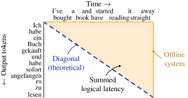
*(a) The logical latency of an offline (non-streaming) system.*

*(a) The logical latency of an offline (non-streaming) system.*

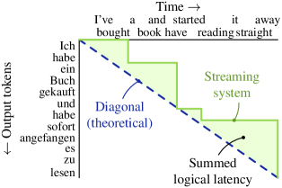
*(b) The logical latency of a streaming system.*

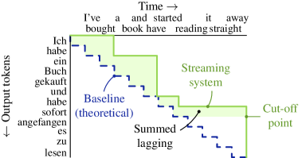
*Figure 17: The average lagging metric, on the same example as Figure 16(b).*

*(a) An example of emission timings of a streaming system that generates the last few tokens after the end of the audio. Average lagging cuts off the calculation after the first tokens after the end of the audio.*

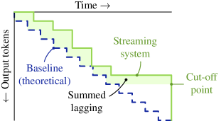
*(a) An example of emission timings of a streaming system that generates the last few tokens after the end of the audio. Average lagging cuts off the calculation after the first tokens after the end of the audio.*

*(b) An example of emission timings of a streaming system that generates a few of the the last tokens just before the end of the audio. Since this does not trigger the cut-off, an extra few tokens are counted in the average lagging calculation. The shaded area, the “summed lagging” is greater, and the average lagging will be greater. This means that the average lagging metric is higher than in Figure 18(a), though the system actually produces tokens with less lag.*

---
**Usage Info**: 3174 tokens used.
**Generated at**: 2026-05-15 16:03:44

---

# 📚 Break-the-Beat! Controllable MIDI-to-Drum Audio Synthesis

🚀 URL: https://arxiv.org/html/2605.14555

## 🌏 Abstract (원문)
Current methods for creating drum loop audio in digital music production, such as using one-shot samples or resampling, often demand non-trivial efforts of creators. While recent generative models achieve high fidelity and adhere to text, they lack the specific control needed for such a task. Existing symbolic-to-audio research often focuses on single, tonal instruments, leaving the challenge of polyphonic, percussive drum synthesis unaddressed. We address this gap by introducing “Break-the-Beat!,” a model capable of rendering a drum MIDI with the timbre of a reference audio. It is built by fine-tuning a pre-trained text-to-audio model with our proposed content encoder and a effective hybrid conditioning mechanism. To enable this, we construct a new dataset of paired target-reference drum audio from existing drum audio datasets. Experiments demonstrate that our model generates high-quality drum audio that follows high-resolution drum MIDI, achieving strong performance across metrics of audio quality, rhythmic alignment, and beat continuity. This offer producers a new, controllable tool for creative production. Demo page:https://ik4sumii.github.io/break-the-beat/
## 🌏 Abstract (번역)
원샷 샘플 사용이나 리샘플링과 같은 디지털 음악 제작에서 드럼 루프 오디오를 생성하는 현재 방법들은 종종 제작자들에게 상당한 노력을 요구합니다. 최근의 생성 모델들은 높은 충실도를 달성하고 텍스트를 따르지만, 이러한 작업에 필요한 특정 제어 기능이 부족합니다. 기존의 심볼릭-오디오 연구는 주로 단일, 음조 악기에 초점을 맞춰 다성적이고 타악기적인 드럼 합성에 대한 과제를 해결하지 못했습니다. 우리는 참조 오디오의 음색으로 드럼 MIDI를 렌더링할 수 있는 모델인 “Break-the-Beat!”를 도입하여 이 격차를 해소합니다. 이 모델은 제안된 콘텐츠 인코더와 효과적인 하이브리드 컨디셔닝 메커니즘을 사용하여 사전 훈련된 텍스트-오디오 모델을 미세 조정하여 구축되었습니다. 이를 위해 기존 드럼 오디오 데이터셋에서 쌍을 이루는 타겟-참조 드럼 오디오의 새로운 데이터셋을 구축했습니다. 실험 결과, 우리 모델은 고해상도 드럼 MIDI를 따르는 고품질 드럼 오디오를 생성하며, 오디오 품질, 리듬 정렬 및 비트 연속성 지표 전반에 걸쳐 강력한 성능을 달성했습니다. 이는 프로듀서들에게 창의적인 제작을 위한 새롭고 제어 가능한 도구를 제공합니다. 데모 페이지: https://ik4sumii.github.io/break-the-beat/

## 🔍 Methods & Results
- 제안된 모델 "Break-the-Beat!"는 사전 훈련된 텍스트-오디오 모델(Stable Audio Open/Diffusion Transformer 기반)을 드럼 MIDI 및 참조 오디오에 조건화하여 미세 조정합니다.
- 입력 표현은 드럼 MIDI(9가지 악기 그룹, 상대적 인코딩, 10차원 이진 벡터로 `Arrangement` 및 `Tap` 표현)와 참조 오디오(사전 훈련된 VAE 인코더로 인코딩된 잠재 벡터)로 구성됩니다.
- 콘텐츠 인코더(`fencθ`)는 다층 셀프-어텐션 및 크로스-어텐션 트랜스포머 인코더로 구성되며, MIDI의 시간 구조를 포착하고 참조 오디오의 스펙트럼 및 시간 구조를 주입합니다. 타겟 MIDI와 참조 오디오의 MIDI를 병렬로 처리하는 이중 입력 전략을 사용합니다.
- 하이브리드 컨디셔닝 메커니즘은 DiT에 참조 오디오 잠재 벡터를 연결하고, 콘텐츠 특징을 시간적으로 정렬하여 입력에 추가하며, 확산 타임스텝, 타겟 길이, 총 스텝 수와 같은 전역 조건을 전치(prepending)하는 세 가지 방법을 사용합니다.
- 훈련은 콘텐츠 인코더 및 전역 조건 인코더와 함께 DiT를 공동으로 최적화하며, v-objective를 기반으로 하고 classifier-free guidance를 적용합니다.
- 커리큘럼 훈련 전략을 사용하여 타겟 조건은 `Arrangement`에서 `Arrangement`/`Tap`으로, 참조 조건은 `Arrangement`/`Tap`에서 `Tap`으로 점진적으로 난이도를 높여 모델이 먼저 `Arrangement`-to-audio 합성을 마스터한 다음 `Tap`-to-audio 합성을 처리하도록 합니다.
- 모델 훈련을 위해 기존 드럼 녹음 데이터셋과 MIDI가 쌍을 이루는 데이터셋에서 새로운 타겟-참조 드럼 오디오 쌍 데이터셋을 구축했습니다. 이 데이터셋은 동일한 드럼 키트와 다른 MIDI 시퀀스를 사용하여 렌더링된 참조 오디오와 타겟 드럼 오디오를 페어링하며, 개별 드럼 악기를 구별하기 위해 전체 믹스처와 분리된 스템을 모두 포함합니다.
- 실험 결과, 모델은 고해상도 드럼 MIDI를 따르는 고품질 드럼 오디오를 생성하며, 오디오 품질, 리듬 정렬 및 비트 연속성 지표에서 강력한 성능을 달성하여 제작자에게 새로운 제어 가능한 도구를 제공합니다.

## 🖼 Figures
![Fig. 1:Overview of our proposed method. Stable Audio Open framework [6], originally designed for text-to-audio generation, is adapted into a model conditioned on drum MIDI and reference audio.](../images/2026-05-15/2605.14555/2605.14555_fig0.png)
*Fig. 1:Overview of our proposed method. Stable Audio Open framework [6], originally designed for text-to-audio generation, is adapted into a model conditioned on drum MIDI and reference audio.*

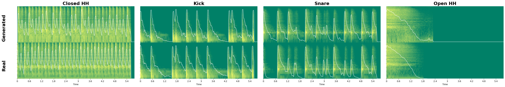
*Fig. 2:From left to right demonstrates results of synthesized instrument-wise drum audio from multi-drum arrangement in StemGMD, comparing with ground-truth.*

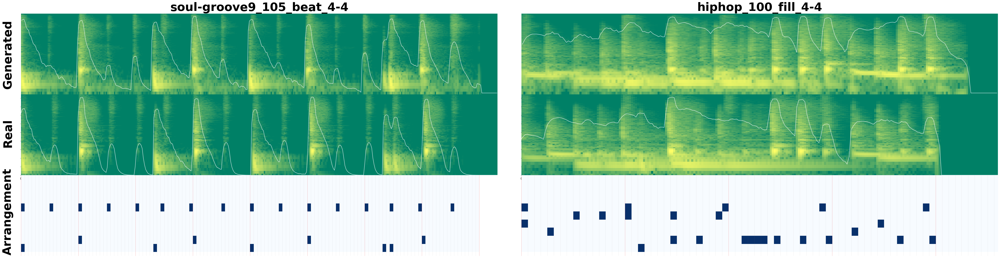
*Fig. 3:Synthesized drum audio from two types of arrangement MIDI, comparing with ground-truth. Left: 2-bar beat with tempo of 105. Right: 1-bar fill with tempo of 100. Third line visualizes input MIDI representations.*

---
**Usage Info**: 4371 tokens used.
**Generated at**: 2026-05-15 16:03:55

---

# 📚 AudioMosaic: Contrastive Masked Audio Representation Learning

🚀 URL: https://arxiv.org/html/2605.14231

## 🌏 Abstract (원문)
Audio self-supervised learning (SSL) aims to learn general-purpose representations from large-scale unlabeled audio data. While recent advances have been driven mainly by generative reconstruction objectives, contrastive approaches remain less explored, partly due to the difficulty of designing effective audio augmentations and the large batch sizes required for contrastive pre-training.We introduceAudioMosaic, a contrastive learning–based audio encoder for general audio understanding. During pre-training, AudioMosaic constructs positive pairs by applying structured time–frequency masking to spectrogram patches, which reduces memory usage and enables efficient large-batch training.Compared with generative approaches, the AudioMosaic encoder learns more discriminative utterance-level representations that demonstrate strong transferability across datasets, domains, and acoustic conditions.Extensive experiments show that AudioMosaic achieves state-of-the-art performance on several standard audio benchmarks under both linear probing and fine-tuning. We further show that integrating the pretrained AudioMosaic encoder into audio–language models improves performance on audio–language tasks.The code is publicly available in ourGitHub repository.
## 🌏 Abstract (번역)
오디오 자기 지도 학습(SSL)은 대규모 레이블 없는 오디오 데이터로부터 범용 표현을 학습하는 것을 목표로 합니다. 최근 발전은 주로 생성적 재구성 목표에 의해 주도되었지만, 효과적인 오디오 증강 설계의 어려움과 대규모 배치 크기가 필요한 대조 학습 사전 훈련 때문에 대조적 접근 방식은 덜 탐구되었습니다. 우리는 일반 오디오 이해를 위한 대조 학습 기반 오디오 인코더인 AudioMosaic을 소개합니다. 사전 훈련 동안 AudioMosaic은 스펙트로그램 패치에 구조화된 시간-주파수 마스킹을 적용하여 긍정 쌍을 구성하며, 이는 메모리 사용량을 줄이고 효율적인 대규모 배치 훈련을 가능하게 합니다. 생성적 접근 방식과 비교하여 AudioMosaic 인코더는 데이터셋, 도메인 및 음향 조건 전반에 걸쳐 강력한 전이성을 보여주는 더 판별적인 발화 수준 표현을 학습합니다. 광범위한 실험은 AudioMosaic이 선형 프로빙과 미세 조정을 모두 사용하여 여러 표준 오디오 벤치마크에서 최첨단 성능을 달성함을 보여줍니다. 우리는 또한 사전 훈련된 AudioMosaic 인코더를 오디오-언어 모델에 통합하면 오디오-언어 작업의 성능이 향상됨을 보여줍니다. 코드는 GitHub 저장소에 공개되어 있습니다.

## 🔍 Methods & Results
- AudioMosaic은 일반 오디오 이해를 위한 대조 학습 기반 오디오 인코더로 제안되었다.
- 사전 훈련 중, AudioMosaic은 스펙트로그램 패치에 구조화된 시간-주파수 마스킹을 적용하여 긍정 쌍을 구성한다.
- 이 방법은 메모리 사용량을 줄이고 효율적인 대규모 배치 훈련을 가능하게 한다.
- AudioMosaic 인코더는 생성적 접근 방식보다 더 판별적인 발화 수준 표현을 학습한다.
- 학습된 표현은 데이터셋, 도메인 및 음향 조건 전반에 걸쳐 강력한 전이성을 보여준다.
- AudioMosaic은 선형 프로빙 및 미세 조정을 통해 여러 표준 오디오 벤치마크에서 최첨단 성능을 달성했다.
- 사전 훈련된 AudioMosaic 인코더를 오디오-언어 모델에 통합하면 오디오-언어 작업의 성능이 향상된다.

## 🖼 Figures

*Figure 1: Overview of AudioMosaic. (a) Comparison between commonly used unstructured masking in prior audio-SSL methods and the time–frequency masking strategy. (b) AudioMosaic first converts an input spectrogram into patch tokens with positional encoding, then applies time–frequency masking to construct a positive pair for contrastive learning. The masked patches are omitted, and only the visible ones are fed into the encoder in randomized order.*

*Figure 2: Comparison of the effective rank of encoder representations. Encoders are trained with either unstructured masking or the proposed time–frequency masking, using identical hyperparameters and masking ratios. “Inference-time masking” denotes the masking strategy applied when extracting representations. “None” indicates that no masking is applied during inference.*

*Figure 3:Layer-wise linear probe results on AudioSet-20K (mAP). Each layer’s output is frozen and a linear classifier is trained on top. Weighted Sum aggregates all layers with learned weights; Attentive uses a learned attention query over all layer representations.*

*(a)Comparison of masking strategies.*

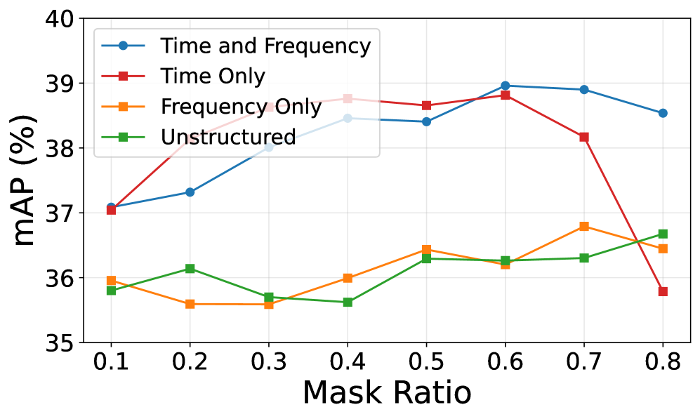
*(a)Comparison of masking strategies.*

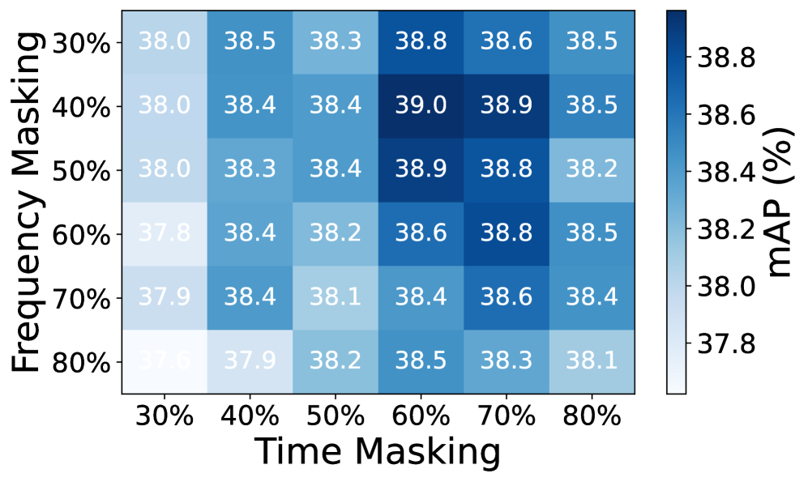
*(b)Ablation over mask ratio.*

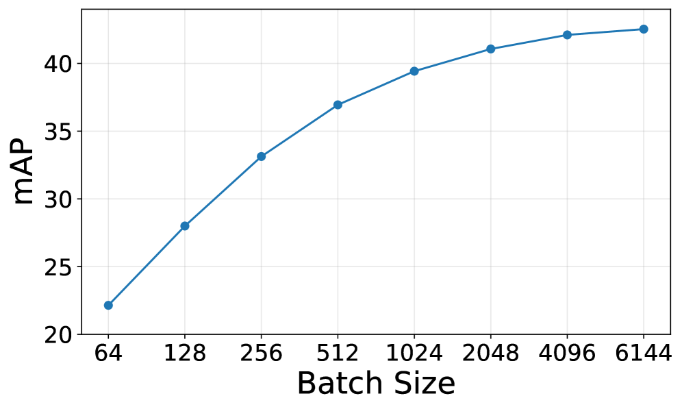
*(c)Ablation over batch size.*

---
**Usage Info**: 1392 tokens used.
**Generated at**: 2026-05-15 16:04:03

---

# 📚 From Text to Voice: A Reproducible and Verifiable Framework for Evaluating Tool Calling LLM Agents

🚀 URL: https://arxiv.org/html/2605.15104

## 🌏 Abstract (원문)
Voice agents increasingly require reliable tool use from speech, whereas prominent tool-calling benchmarks remain text-based. We study whether verified text benchmarks can be converted into controlled audio-based tool calling evaluations without re-annotating the tool schema and gold labels. Our dataset-agnostic framework uses text-to-speech, speaker variation, and environmental noise to create paired text–audio instances while preserving the original dataset annotations. Based on extensive evaluation of 7 omni-modal models on audio-converted versions of Confetti and When2Call, our framework demonstrates that the performance is strongly model- and task-dependent: Gemini-3.1-Flash-Live obtains the highest Confetti score (70.4), whereas GPT-Realtime-1.5 performs best on When2Call (71.9). On Confetti, the text-to-voice gap ranges from 1.8 points for Qwen3-Omni to 4.8 points for GPT-Realtime-1.5. A targeted analysis of failure cases demonstrates that degradations most often reflect misunderstandings of argument values in the speech. Considering real-world deployment scenarios, we further report text-only results, an ambiguity-based reformulation stress test, and a reference-free LLM-as-judge protocol validated against human preferences. Notably, we find that open-source Qwen3 judges with at least 8B parameters exceed 80% agreement with proprietary judges, supporting privacy-preserving evaluation. Overall, our framework provides a verifiable and reproducible first-stage diagnostic that complements purpose-built audio corpora.
## 🌏 Abstract (번역)
음성 에이전트는 음성으로부터의 신뢰할 수 있는 도구 사용을 점점 더 요구하지만, 주요 도구 호출 벤치마크는 여전히 텍스트 기반입니다. 우리는 검증된 텍스트 벤치마크가 도구 스키마와 골드 라벨을 재주석할 필요 없이 제어된 오디오 기반 도구 호출 평가로 변환될 수 있는지 연구합니다. 우리의 데이터셋 독립적인 프레임워크는 원본 데이터셋 주석을 보존하면서 텍스트-음성 변환, 화자 변이 및 환경 소음을 사용하여 짝을 이루는 텍스트-오디오 인스턴스를 생성합니다. Confetti 및 When2Call의 오디오 변환 버전에 대한 7개 옴니모달 모델의 광범위한 평가를 기반으로, 우리의 프레임워크는 성능이 모델 및 작업에 따라 크게 달라진다는 것을 보여줍니다. Gemini-3.1-Flash-Live는 Confetti에서 가장 높은 점수(70.4)를 얻었으며, GPT-Realtime-1.5는 When2Call에서 가장 좋은 성능(71.9)을 보였습니다. Confetti에서 텍스트-음성 간 격차는 Qwen3-Omni의 경우 1.8포인트에서 GPT-Realtime-1.5의 경우 4.8포인트에 이릅니다. 실패 사례에 대한 심층 분석은 성능 저하가 대부분 음성 내 인자 값에 대한 오해를 반영한다는 것을 보여줍니다. 실제 배포 시나리오를 고려하여, 우리는 텍스트 전용 결과, 모호성 기반 재구성 스트레스 테스트, 그리고 인간 선호도에 대해 검증된 참조 없는 LLM-as-judge 프로토콜을 추가로 보고합니다. 특히, 최소 80억 개의 매개변수를 가진 오픈소스 Qwen3 심사위원들이 독점 심사위원들과 80% 이상의 일치율을 보여 프라이버시 보호 평가를 지원한다는 것을 발견했습니다. 전반적으로, 우리의 프레임워크는 목적에 맞게 구축된 오디오 코퍼스를 보완하는 검증 가능하고 재현 가능한 1단계 진단 기능을 제공합니다.

## 🔍 Methods & Results
- Gemini-2.5-Flash-TTS, Gemini-2.5-Pro-TTS, GPT-4o-Mini-TTS 세 가지 상용 TTS 모델을 활용하여 텍스트 기반 벤치마크를 오디오로 변환하는 체계적인 파이프라인을 구현했습니다.
- 각 TTS 공급자의 남성 및 여성 화자를 선택하고, DEMAND 데이터셋에서 추출한 환경 노이즈(5, 10, 15, 20 dB SNR)를 주입하여 모델의 화자 및 노이즈 견고성을 평가했습니다.
- 기존 텍스트 기반 도구 호출 벤치마크(Confetti, When2Call)를 TTS 오디오로 변환하여, 텍스트 전용 조건과 직접 오디오 조건에서 7개의 옴니모달 모델을 평가함으로써 텍스트에서 음성으로 입력 양식이 변경될 때의 성능 손실을 측정했습니다.
- Confetti (함수 선택 및 매개변수 추출 정확도 측정)와 When2Call (도구 호출 필요성 결정 능력 평가) 데이터셋을 사용했으며, 이 오디오 변환 파이프라인은 데이터셋에 구애받지 않습니다.
- GPT-4o-Realtime, GPT-Realtime-1.5, GPT-Realtime-Mini, Gemini-2.5-Flash-Live, Gemini-3.1-Flash-Live, Qwen3-Omni-30B-A3B-Instruct, Phi-4-Multimodal 등 7개의 옴니모달 모델을 평가했습니다.
- 성능은 모델 및 작업에 따라 크게 달라졌으며, Confetti에서는 Gemini-3.1-Flash-Live가 70.4점으로 최고, When2Call에서는 GPT-Realtime-1.5가 71.9점으로 최고 점수를 기록했습니다.
- Confetti에서 텍스트-음성 간 성능 격차는 Qwen3-Omni의 1.8포인트에서 GPT-Realtime-1.5의 4.8포인트까지 다양했으며, 성능 저하는 주로 음성 내 인자 값에 대한 오해에서 비롯되었습니다.
- 최소 80억 개의 매개변수를 가진 오픈소스 Qwen3 심사위원들이 독점 심사위원들과 80% 이상의 일치율을 보여 프라이버시 보호 LLM-as-judge 평가 가능성을 확인했습니다.

## 🖼 Figures

*Figure 1:An overview of our methodology for converting text-based tool datasets into audio benchmarks for tool-calling evaluation. The pipeline uses text-to-speech (TTS) models (GPT-4o-Mini-TTS and Gemini-2.5-TTS) to generate diverse audio queries with different voices and genders, which are then processed by omni-modal LLMs and evaluated via automatic evaluation or LLM Judge.*

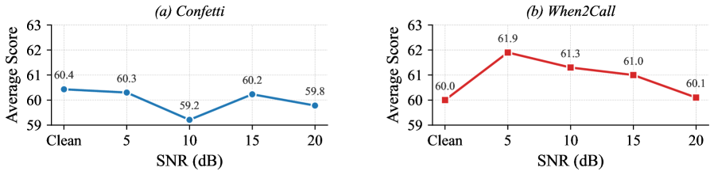
*Figure 2:Average performance of Qwen3-Omni across SNR levels, aggregated over all TTS models and voices.*

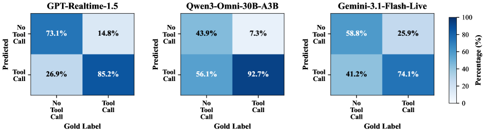
*Figure 3:Error Analysis on the When2Call benchmark computed over 6 TTS voice variants.*

*Figure 4:LLM-as-judge evaluation on Confetti. (a) Proprietary LLM judge scores in reference-wise and reference-free settings (see Appendix A.6 for the detailed breakdown). (b) Judgment agreement between open judges (Qwen3) against proprietary reference judgments.*

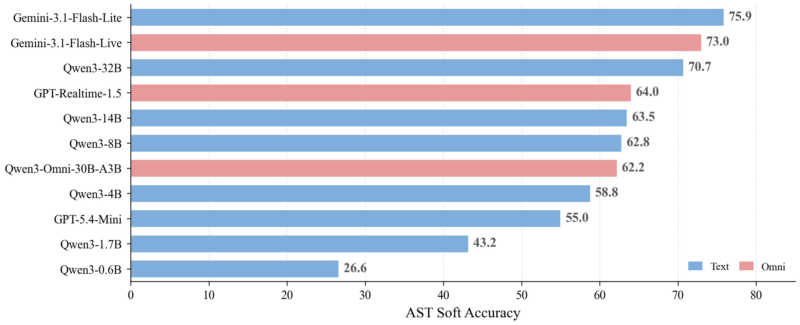
*(a)Text-only performance across model families and sizes.*

*(a)Text-only performance across model families and sizes.*

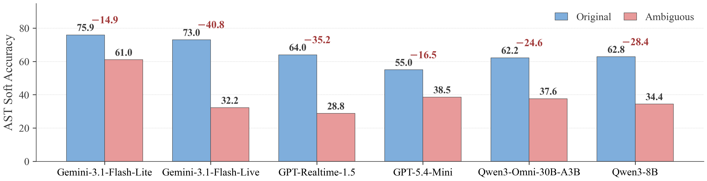
*(b)Ambiguous-query reformulation stress test.*

---
**Usage Info**: 6460 tokens used.
**Generated at**: 2026-05-15 16:04:55

---

# 📚 Refining Pseudo-Audio Prompts with Speech-Text Alignment for Text-Only Domain Adaptation in LLM-Based ASR

🚀 URL: https://arxiv.org/html/2605.14340

## 🌏 Abstract (원문)
LLM-based automatic speech recognition models demonstrate strong performance by connecting audio encoders and LLMs. However, data scarcity of paired speech and transcription often hinders their adaptation to new domains, making text-only domain adaptation crucial. Existing methods typically rely on either fine-tuning the LLM alone or employing pseudo-audio prompts. The former neglects essential acoustic context, while the latter either suffers from limited scalability in data-scarce conditions, or yields inexpressive prompts by leveraging only textual features, ignoring audio modality. To address this, we propose an enhanced framework that explicitly models speech-text alignment. Our method efficiently generates highly expressive pseudo-audio prompts that bridges the modality gap, enabling effective target-domain adaptation. Experiments demonstrate that our approach outperforms existing text-only methods, improving both overall error rates and out-of-vocabulary coverage.
## 🌏 Abstract (번역)
LLM 기반 자동 음성 인식 모델은 오디오 인코더와 LLM을 연결하여 강력한 성능을 보여줍니다. 그러나 음성 및 전사 쌍 데이터의 부족은 종종 새로운 도메인으로의 적응을 방해하며, 텍스트 전용 도메인 적응을 중요하게 만듭니다. 기존 방법은 일반적으로 LLM만 미세 조정하거나 의사(pseudo) 오디오 프롬프트를 사용하는 방식에 의존합니다. 전자는 필수적인 음향적 맥락을 무시하고, 후자는 데이터 부족 조건에서 제한된 확장성에 시달리거나, 오디오 양식을 무시하고 텍스트 특징만 활용하여 표현력이 부족한 프롬프트를 생성합니다. 이를 해결하기 위해 우리는 음성-텍스트 정렬을 명시적으로 모델링하는 향상된 프레임워크를 제안합니다. 우리의 방법은 양식 간의 간극을 메우는 매우 표현력 있는 의사 오디오 프롬프트를 효율적으로 생성하여 효과적인 타겟 도메인 적응을 가능하게 합니다. 실험 결과, 우리의 접근 방식은 기존 텍스트 전용 방법보다 우수하며, 전반적인 오류율과 OOV(Out-Of-Vocabulary) 커버리지를 모두 향상시키는 것으로 나타났습니다.

## 🔍 Methods & Results
- 기존 LLM 기반 ASR 프레임워크는 오디오 인코더와 프로젝터를 통해 생성된 오디오 프롬프트와 텍스트 지시 프롬프트로 구성된 음향 표현에 LLM이 조건화되는 방식을 따릅니다.
- 텍스트 전용 도메인 적응에서 기존 '업샘플-앤-마스크(upsample-and-mask)' 방법은 텍스트 임베딩을 의사 오디오 프롬프트로 변환하지만, 휴리스틱한 조작과 오디오 인코더/프로젝터 출력 특성에 대한 인식 부족으로 인해 최적의 프롬프트를 생성하지 못하며 양식 간의 간극이 존재합니다.
- 이러한 한계를 해결하기 위해, 우리는 '텍스트 임베딩-투-스피치-잠재(Text-Embedding-to-Speech-Latent, TE2SL)'를 제안합니다. TE2SL은 업샘플링과 마스킹 사이에 학습 가능한 정제 모듈을 삽입하여 업샘플링된 토큰 임베딩이 오디오 프롬프트와 더 유사하게 변환되도록 합니다.
- TE2SL의 핵심은 Conformer 인코더와 두 개의 선형 레이어로 구성된 경량 정제 모듈로, 텍스트 임베딩을 오디오 프롬프트의 잠재 공간으로 변환하여 합성된 특징이 양식에 정렬되도록 합니다.
- 정제 모듈은 훈련 중 생성된 의사 오디오 프롬프트와 오디오 인코더 및 프로젝터 파이프라인에서 파생된 실제 오디오 프롬프트 간의 불일치(프레임별 MSE 손실)를 최소화하도록 최적화됩니다.
- 도메인 적응 단계(추론)에서는 오디오 데이터를 사용할 수 없으므로, 타겟 도메인 텍스트 임베딩이 무작위로 업샘플링된 후 훈련된 TE2SL 모듈에 의해 처리되고, 정규화를 위해 시간 축을 따라 마스킹됩니다.
- 실험 결과, TE2SL 접근 방식은 기존 텍스트 전용 방법보다 우수한 성능을 보이며, 전반적인 오류율과 OOV(Out-Of-Vocabulary) 커버리지를 모두 향상시켰습니다.

## 🖼 Figures
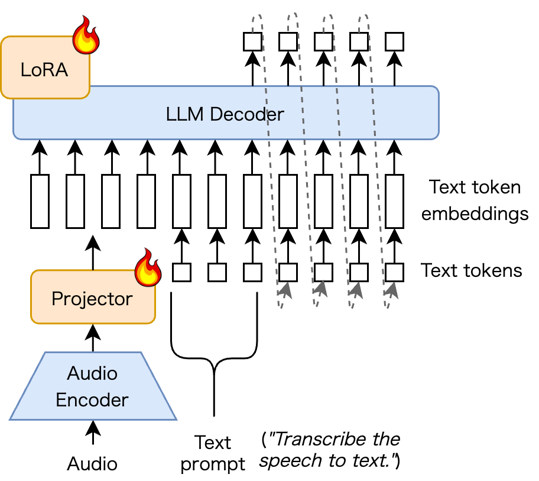
*Figure 1:Overview of the LLM-based ASR framework. The audio encoder and projector generate audio prompts that are concatenated with token embeddings and processed by the LLM.*

*Figure 2:Overview of TE2SL. (a) Training phase: the refinement module learns alignment from LLM token embeddings to audio prompts with pre-trained audio encoder/projector characteristics. (b) Domain adaptation phase: the refinement module is freezed. Text embeddings are randomly upsampled, transformed via the refinement module, and time-masked to generate pseudo-audio prompts.*

---
**Usage Info**: 2939 tokens used.
**Generated at**: 2026-05-15 16:05:04

---

# 📚 FSD50K-Solo: Automated Curation of Single-Source Sound Events This work was conducted during Ningyuan Yang’s internship at Bose and was supported fully by Bose Corporation. This work has been accepted for publication at the 2026 European Signal Processing Conference (EUSIPCO).

🚀 URL: https://arxiv.org/html/2605.13931

## 🌏 Abstract (원문)
High-quality training datasets are essential for the performance of neural networks. However, the audio domain still lacks a large-scale, strongly-labeled, and single-source sound event dataset. The FSD50K dataset, despite being relatively large and open, contains a considerable fraction of multi-source samples where background interference or overlapping events could limit the usefulness of the data. To address this challenge, we introduce a data curation framework designed for large-scale open audio corpora. Our approach leverages a generative diffusion model to synthesize clean single-class events to construct controlled noisy mixtures for supervision. We subsequently employ a pre-trained audio encoder coupled with a discriminative classifier to automatically identify and filter out multi-source samples. Experiments show that our framework achieves strong performance on a human expert-curated test set. Finally, we release FSD50K-Solo, a model-curated subset of FSD50K containing single-source audio samples identified by our method. Beyond FSD50K, our method establishes a scalable paradigm for curating open source audio corpora.
## 🌏 Abstract (번역)
신경망의 성능을 위해서는 고품질 훈련 데이터셋이 필수적입니다. 그러나 오디오 도메인에는 여전히 대규모의 강력하게 레이블링된 단일 소스 음향 이벤트 데이터셋이 부족합니다. FSD50K 데이터셋은 비교적 크고 공개되어 있지만, 배경 간섭이나 겹치는 이벤트로 인해 데이터의 유용성을 제한할 수 있는 다중 소스 샘플이 상당 부분 포함되어 있습니다. 이러한 문제를 해결하기 위해, 우리는 대규모 공개 오디오 코퍼스를 위해 설계된 데이터 큐레이션 프레임워크를 소개합니다. 우리의 접근 방식은 생성형 확산 모델을 활용하여 깨끗한 단일 클래스 이벤트를 합성하고, 이를 통해 통제된 노이즈 혼합물을 구성하여 감독 학습에 사용합니다. 이어서, 사전 훈련된 오디오 인코더와 판별 분류기를 결합하여 다중 소스 샘플을 자동으로 식별하고 필터링합니다. 실험 결과, 우리의 프레임워크는 인간 전문가가 큐레이션한 테스트 세트에서 강력한 성능을 달성했습니다. 마지막으로, 우리는 우리의 방법으로 식별된 단일 소스 오디오 샘플을 포함하는 FSD50K의 모델 큐레이션된 하위 집합인 FSD50K-Solo를 공개합니다. FSD50K를 넘어, 우리의 방법은 오픈 소스 오디오 코퍼스를 큐레이션하기 위한 확장 가능한 패러다임을 확립합니다.

## 🔍 Methods & Results
- 대규모 공개 오디오 코퍼스를 위한 데이터 큐레이션 프레임워크를 제안하며, 이는 (i) 깨끗한 단일 소스 오디오 샘플 큐레이션, (ii) 통제된 노이즈 혼합물 생성, (iii) 전처리 및 증강의 파이프라인으로 구성됩니다.
- 깨끗한 단일 소스 오디오 생성을 위해 FSD50K 클래스 레이블을 단일 소스 및 복합 장면으로 분류한 후, 단일 소스 클래스만 사용했습니다.
- Stable Audio Open 1.0 생성 모델을 활용하여 '소음 없는 <클래스> 소리'와 '나쁜 품질' 프롬프트를 사용하여 깨끗한 단일 소스 오디오를 합성했으며, 생성된 클립은 수동으로 검사하여 노이즈를 제거했습니다.
- 총 105개의 단일 이벤트 클래스에 대해 클래스당 30개의 샘플(각 20초, 16kHz)을 생성하여 훈련을 위한 참조 신호로 사용했습니다.
- 노이즈 혼합물 생성을 위해 슬라이딩 윈도우 최대 에너지 방법을 사용하여 타겟 세그먼트를 선택하고, 단일 소스 타겟 세그먼트를 (i) 단일 간섭, (ii) 이중 간섭, (iii) 배경 노이즈(TAU Urban Acoustic Scenes), (iv) 간섭 + 배경 노이즈의 네 가지 조건 중 하나와 혼합하여 다중 소스 샘플을 생성했습니다.
- SNR 값은 -10dB에서 +15dB 사이에서 균일하게 샘플링되었고, 의미론적 중복을 피하기 위해 간섭 오디오는 타겟 클래스와 유사한 클래스에서 선택되지 않았습니다.
- 훈련 데이터셋은 단일 소스 샘플과 다중 소스 샘플의 비율을 1:1로 유지하도록 구성되었으며, 다중 소스 샘플은 수동으로 검사되지 않았습니다.
- 모든 샘플은 -26 dBFS의 타겟 레벨로 RMS 정규화되었고, 선행 무음이 제거되었으며, 모델 견고성 강화를 위해 훈련 중 오디오 샘플을 1~4회 무작위로 반복하는 시간적 반복 증강(p=0.5)이 적용되었습니다.
- 모델 아키텍처는 BEATs 인코더를 사용하고, 시간적 집계를 위해 단일 레이어의 Bi-LSTM(히든 사이즈 512)을 사용했으며, 이후 1024x512 밀집 레이어(ReLU, 드롭아웃)와 512x1 밀집 레이어로 구성된 MLP가 이어집니다.
- 제안된 프레임워크는 인간 전문가가 큐레이션한 테스트 세트에서 강력한 성능을 달성했습니다.
- 본 연구는 FSD50K에서 우리의 방법으로 식별된 단일 소스 오디오 샘플을 포함하는 모델 큐레이션된 하위 집합인 FSD50K-Solo를 공개합니다.

## 🖼 Figures
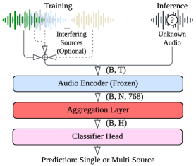
*Figure 1:Overview of the proposed system*

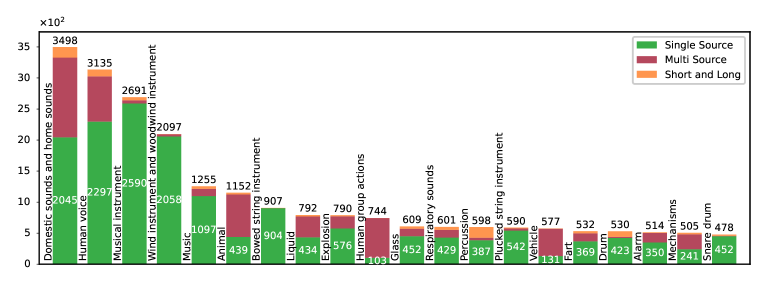
*Figure 2:Top 20 Classes of FSD50K-dev. Note that “Short and Long” illusrates the removed portion. Numbers in white is the total count of Single Source samples of each class, numbers on top of each class denote the total class sample size.*

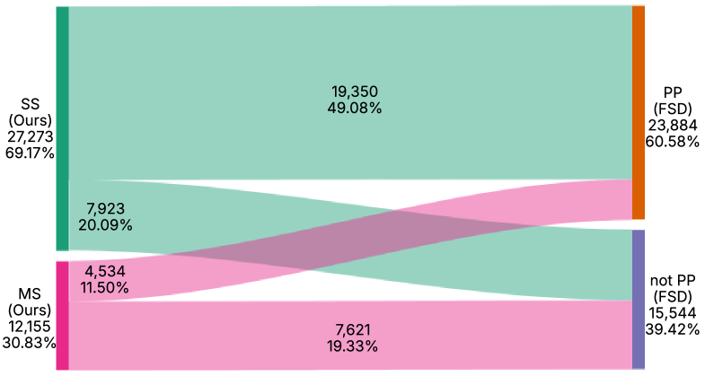
*Figure 3:Flow of annotations between our model predictions and FSD50K-dev human ratings.*

---
**Usage Info**: 3190 tokens used.
**Generated at**: 2026-05-15 16:05:14

---

