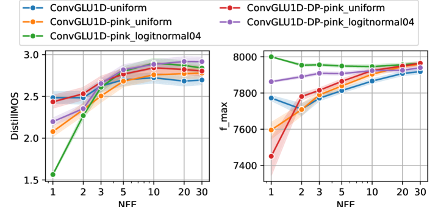
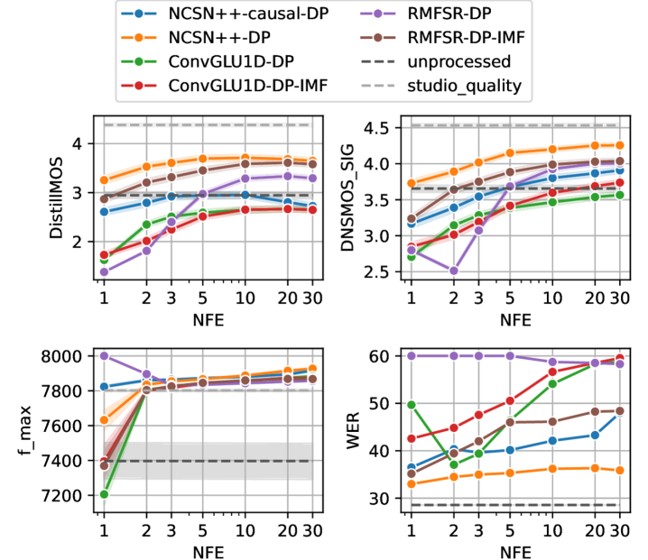
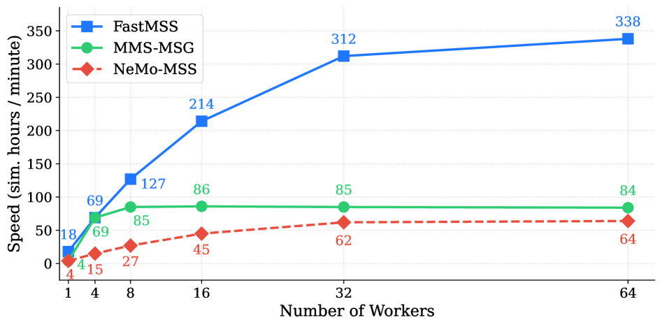

# 🚩 (2026-05-18) Scholar Inbox 추천 논문 

# 📚 Real-time Speech Restoration using Data Prediction Mean Flows

🚀 URL: https://arxiv.org/html/2605.16251

## 🌏 Abstract (원문)
Generative models are capable to address difficult problems with non-unique solutions like bandwidth extension and gap filling, removing highly non-linear artifacts from codecs, clipping and distortion, as opposed to removing linear additive components like noise and reverb. While large offline processing models have shown impressive results, these tasks have not been solved with real-time capable models with low latency and compute. We propose a few-step flow matching model using Data Prediction Mean Flows in combination with suitable novel low-latency architecture to make flow matching models an attractive choice under theses constraints. Compared to state-of-the-art, our proposed mean flow model uses 120x less compute and introduces no algorithmic latency other than the STFT, while achieving similar audio quality.
## 🌏 Abstract (번역)
생성 모델은 대역폭 확장 및 간극 채우기, 코덱, 클리핑 및 왜곡에서 발생하는 고도로 비선형적인 아티팩트 제거와 같이 고유하지 않은 솔루션을 가진 어려운 문제를 해결할 수 있습니다. 이는 노이즈 및 잔향과 같은 선형 가산 구성 요소를 제거하는 것과는 대조적입니다. 대규모 오프라인 처리 모델은 인상적인 결과를 보여주었지만, 이러한 작업은 낮은 지연 시간과 컴퓨팅 자원을 가진 실시간 가능 모델로는 해결되지 않았습니다. 우리는 데이터 예측 평균 흐름(Data Prediction Mean Flows)을 적절한 새로운 저지연 아키텍처와 결합하여 몇 단계 흐름 매칭 모델을 제안함으로써, 이러한 제약 조건 하에서 흐름 매칭 모델을 매력적인 선택으로 만듭니다. 최신 기술과 비교하여, 제안된 평균 흐름 모델은 120배 적은 컴퓨팅 자원을 사용하며 STFT 외에는 알고리즘적 지연 시간을 도입하지 않으면서도 유사한 오디오 품질을 달성합니다.

## 🔍 Methods & Results
- 제안된 FM 프레임워크는 STFT 및 c=0.3의 크기 압축을 통해 얻은 복소수 압축 스펙트럼 도메인에서 작동하며, 전력 정규화를 적용합니다.
- CFM(Conditional Flow Matching)은 확산의 결정론적 버전으로, 조건부 신호(손상된 신호 y)를 기반으로 사전 분포를 사후 데이터 분포로 변환합니다.
- 음성 향상과 같은 작업에서, CFM-OT(Optimal Transport)는 제로 평균 가우시안 분포 대신 손상된 신호 y를 중심으로 하는 정보 기반 사전(informed prior)을 사용합니다.
- 데이터 예측(DP) 손실은 신경망 추정기가 데이터 x0 자체를 예측하도록 최적화하며, 이는 기존의 속도 기반 FM 목표보다 더 나은 성능과 안정성을 제공합니다.
- 평균 흐름(Mean Flows)은 두 번째 시간 조건(시작 시간 r≤t)을 도입하여 추론 단계 크기를 줄이고 임의로 큰 단계를 훈련합니다.
- IMF(Improved Mean Flow)는 훈련 목표의 네트워크 의존성을 제거하여 훈련을 안정화하며, JVP(Jacobian-vector Product)와 stop-gradient 연산자를 사용하여 예측 함수를 정의합니다.
- DP와 IMF의 이점을 결합하기 위해, 신경망 추정기를 목표 데이터 x0를 예측하도록 재정의하고, 이를 순간 속도로 변환하여 IMF 손실에 사용합니다.
- JVP에 필요한 r=t 조건의 중요성을 고려하여, r=t 샘플 비율에 대한 시그모이드 기반 훈련 스케줄을 제안합니다.
- MeanFlowSE의 r-span 스케줄링을 통해, 훈련 시간 동안 r과 t 사이의 간격을 점진적으로 증가시키며, 코사인 스케줄을 사용하여 지수 γ∈(0.05→1)를 조정합니다.
- 제안된 평균 흐름 모델은 최신 기술 대비 120배 적은 컴퓨팅 자원을 사용하고 STFT 외에 알고리즘적 지연 시간을 도입하지 않으면서도 유사한 오디오 품질을 달성합니다.

## 🖼 Figures

*Fig. 1:Training schedules for 
𝑟
=
𝑡
 ratio and 
𝑟
-
𝑡
-span sampling exponent 
𝛾*

*Fig. 2:Data generation process for degraded input 
𝑦
 and target 
𝑥
0*

*Fig. 3:Impact of general FM improvements by time sampling (uniform vs. biased logit-normal), spectral noise distribution (white vs. pink) and data prediction (DP) loss.*

*Fig. 4:Objective results with baseline models.*

---
**Usage Info**: 3374 tokens used.
**Generated at**: 2026-05-18 16:47:03

---

# 📚 Modeling Music as a Time-Frequency Image: A 2D Tokenizer for Music Generation

🚀 URL: https://arxiv.org/html/2605.15831

## 🌏 Abstract (원문)
Autoregressive music generation depends strongly on the audio tokenizer. Existing high-fidelity codecs often use residual multi-codebook quantization, which preserves reconstruction quality but complicates language modeling after sequence flattening, as the residual hierarchy imposes strong sequential dependencies and can amplify error accumulation. We propose BandTok, a generation-oriented 2D Mel-spectrogram tokenizer that represents each frame with Mel-frequency band tokens from a single shared codebook. This design yields a physically interpretable time-frequency token grid with a more independent token structure, making it better suited for autoregressive modeling. BandTok improves reconstruction with a multi-scale PatchGAN objective and EMA codebook updates. We further introduce an autoregressive language model with 2D Rotary Position Embedding (2D RoPE) to preserve temporal and frequency-band structure during generation. Experiments show that BandTok improves over residual-codebook tokenizers and achieves strong results in a data-limited setting. The source code and generation demos for this work are publicly available.111https://github.com/xiaolubuhuizhuzhou/Bandtok
## 🌏 Abstract (번역)
자기회귀 음악 생성은 오디오 토크나이저에 크게 의존합니다. 기존의 고충실도 코덱은 잔여 다중 코드북 양자화를 자주 사용하는데, 이는 재구성 품질을 유지하지만 시퀀스 평탄화 후 언어 모델링을 복잡하게 만듭니다. 왜냐하면 잔여 계층 구조가 강력한 순차적 의존성을 부과하고 오류 누적을 증폭시킬 수 있기 때문입니다. 우리는 단일 공유 코드북에서 멜 주파수 대역 토큰으로 각 프레임을 표현하는 생성 지향 2D 멜 스펙트로그램 토크나이저인 BandTok을 제안합니다. 이 설계는 더 독립적인 토큰 구조를 가진 물리적으로 해석 가능한 시간-주파수 토큰 그리드를 생성하여 자기회귀 모델링에 더 적합합니다. BandTok은 다중 스케일 PatchGAN 목적 함수와 EMA 코드북 업데이트를 통해 재구성을 개선합니다. 우리는 또한 생성 중에 시간적 및 주파수 대역 구조를 보존하기 위해 2D 회전 위치 임베딩(2D RoPE)을 사용하는 자기회귀 언어 모델을 도입합니다. 실험 결과 BandTok은 잔여 코드북 토크나이저보다 개선되었으며, 데이터가 제한된 환경에서도 강력한 결과를 달성했습니다. 이 연구의 소스 코드와 생성 데모는 공개적으로 이용 가능합니다.

## 🔍 Methods & Results
- BandTok은 스펙트럼 재구성 충실도 향상 및 2D 토큰 기하학 보존을 목표로 하는 생성 지향 멜 스펙트로그램 토크나이저와 평탄화된 시간-주파수 토큰에 대한 자기회귀 언어 모델을 제시합니다.
- 44.1 kHz 파형을 로그-멜 스펙트로그램으로 변환한 후, 2D Haar 패치화(p=2) 및 Cosmos 스타일 인코더를 통해 8x8 다운샘플링된 잠재 그리드를 생성하여 약 10.7 Hz의 오디오-토큰 프레임 속도와 16개의 주파수 대역 위치를 얻습니다.
- 단일 8192개 엔트리 코드북을 사용하여 잠재 그리드를 이산 2D 토큰 그리드로 양자화하며, 코드북은 EMA 통계로 업데이트되어 안정성을 높이고 노이즈 업데이트를 줄입니다.
- 고주파 재구성을 개선하기 위해 멜 스펙트로그램에 대한 다중 스케일 PatchGAN 판별자를 도입하여 여러 스케일에서 사실적인 지역 시간-주파수 세부 정보를 장려합니다.
- 토크나이저는 재구성(L1 멜 스펙트로그램), 지각(VGG 기반), 적대적, 특징 매칭, 커밋먼트 손실의 가중 조합으로 훈련됩니다(λrec=5.0, λperc=1.0, λadv=1.0, λfm=5.0, λcommit=2.5).
- 평탄화된 시퀀스에서 1D RoPE의 한계를 해결하기 위해 Qwen3-VL의 Interleaved-MRoPE를 채택하여, 어텐션 헤드 차원을 토큰, 시간, 주파수 대역 구성 요소로 분할하고 이를 인터리빙하여 자기회귀 디코딩 중 시간적 및 스펙트럼 지역성을 유지합니다.
- 텍스트 캡션은 사전 훈련된 T5 인코더로 인코딩되며, 세그먼트 시작 시간과 전체 트랙 길이를 수치 조건으로 추가하여 모델이 동일한 전역 캡션 아래에서 세그먼트를 구별하도록 돕습니다.
- 분류기 없는 안내(CFG)를 위해 MusicGen을 따라 훈련 중 조건부 접두사를 무작위로 null 임베딩으로 대체하고, 추론 시 조건부 및 비조건부 로짓을 결합하여 안내 스케일을 적용합니다.
- 실험 결과 BandTok은 기존 잔여 코드북 토크나이저보다 개선된 성능을 보였으며, 데이터가 제한된 환경에서도 강력한 결과를 달성했습니다.

## 🖼 Figures

*Figure 1:Comparison between residual and band-wise tokens. Normalized mutual information (NMI) and language-model perplexity (PPL) are used to analyze token dependence and autoregressive prediction difficulty, respectively. Compared with residual tokens, band-wise tokens exhibit lower inter-token dependence and a more balanced PPL profile.*

*Figure 2:Comparison between RVQ tokenizers and BandTok. Figure (a) shows RVQ-based audio tokenizers, where each VQ layer quantizes the residual from the previous layer. Figure (b) shows BandTok, which patchifies the Mel spectrogram into 2D latents and quantizes them with a single shared codebook. Its vertical axis corresponds to Mel-frequency bands.*

*Figure 3:Illustration of 2D RoPE for flattened audio tokens. It preserves the original time-frequency structure by separately encoding temporal and frequency-band positions. The token axis uses global sequence positions. The time axis follows text-token positions for text tokens and repeats each time-step index across all band tokens. The band axis is set to zero for text tokens and ranges from 
1
 to 
𝐵
 for audio tokens within each time step.*

---
**Usage Info**: 4305 tokens used.
**Generated at**: 2026-05-18 16:47:18

---

# 📚 From Flat Language Labels to Typological Priors: Structured Language Conditioning for Multilingual Speech-to-Speech Translation

🚀 URL: https://arxiv.org/html/2605.16026

## 🌏 Abstract (원문)
Compositional speech-to-speech translation (S2ST) systems built upon speech large language models (SpeechLLMs) have recently shown promising performance. However, existing S2ST systems often either neglect source-language information or encode it through alanguage-as-labelparadigm, representing each source language as an independent flat embedding. Such a design overlooks systematic linguistic structure shared across languages, which may limit data-efficient multilingual adaptation when supervised S2ST data are scarce. To address this issue, we proposeS2ST-Omni	2, a many-to-one compositional S2ST framework that systematically reformulates multilingual language conditioning from flat language labels to structured typological priors. Specifically, S2ST-Omni	2 revisits language conditioning at three levels: typology-informed hierarchical language encoding for structured source-language representation, dynamically-gated language-aware Dual-CTC for content-adaptive acoustic modulation, and typology-aware LLM prompting for decoder-side linguistic guidance. Experiments on CVSS-C show that S2ST-Omni	2 achieves superior average performance among representative S2ST approaches across BLEU, COMET, ASR-BLEU, and BLASER	2.0 under the adopted evaluation protocol. Ablation studies indicate that the proposed representation-level, acoustic-level, and decoding-level strategies provide complementary benefits. Moreover, controlled data-budget analyses and a Japanese-to-English evaluation using only	~3 hours of supervised training data suggest that explicit typological priors provide useful inductive biases for data-efficient multilingual S2ST.
## 🌏 Abstract (번역)
음성 대규모 언어 모델(SpeechLLM)을 기반으로 구축된 구성형 음성-음성 번역(S2ST) 시스템은 최근 유망한 성능을 보여주었습니다. 그러나 기존 S2ST 시스템은 종종 원어 정보를 무시하거나 '언어를 레이블로' 패러다임을 통해 인코딩하여 각 원어를 독립적인 평면 임베딩으로 표현합니다. 이러한 설계는 언어 간에 공유되는 체계적인 언어 구조를 간과하여, 지도 학습 S2ST 데이터가 부족할 때 데이터 효율적인 다국어 적응을 제한할 수 있습니다. 이 문제를 해결하기 위해, 우리는 다국어 언어 조건을 평면 언어 레이블에서 구조화된 유형학적 사전 지식으로 체계적으로 재구성하는 다대일 구성형 S2ST 프레임워크인 S2ST-Omni 2를 제안합니다. 구체적으로, S2ST-Omni 2는 세 가지 수준에서 언어 조건을 재검토합니다: 구조화된 원어 표현을 위한 유형학 기반 계층적 언어 인코딩, 내용 적응형 음향 변조를 위한 동적 게이트 언어 인식 Dual-CTC, 그리고 디코더 측 언어 지도를 위한 유형학 인식 LLM 프롬프트입니다. CVSS-C에 대한 실험 결과, S2ST-Omni 2는 채택된 평가 프로토콜에서 BLEU, COMET, ASR-BLEU, BLASER 2.0에 걸쳐 대표적인 S2ST 접근 방식 중 우수한 평균 성능을 달성했습니다. 제거 연구(Ablation studies)는 제안된 표현 수준, 음향 수준 및 디코딩 수준 전략이 상호 보완적인 이점을 제공함을 나타냅니다. 또한, 통제된 데이터 예산 분석과 약 3시간의 지도 학습 데이터만을 사용한 일본어-영어 평가를 통해 명시적인 유형학적 사전 지식이 데이터 효율적인 다국어 S2ST에 유용한 귀납적 편향을 제공함을 시사합니다.

## 🔍 Methods & Results
- S2ST-Omni 2는 S2ST-Omni의 구성 설계를 따르며, SpeechLLM 기반 S2TT 프런트엔드와 플러그 앤 플레이 TTS 백엔드로 구성된 다대일 구성형 S2ST 프레임워크이다.
- 기존 S2ST-Omni와의 주요 차이점은 평면 언어 레이블 조건화를 구조화된 유형학적 사전 지식으로 대체하여 표현, 음향 변조, LLM 디코딩 수준에서 언어 조건화를 주입한다는 점이다.
- 프런트엔드는 고정된 Whisper 인코더, 하이브리드 음성 어댑터, TI-HLE(Typology-Informed Hierarchical Language Encoding) 모듈, 동적 게이트 언어 인식 Dual-CTC 모듈, 그리고 유형학 인식 LLM 프롬프트에 의해 안내되는 Qwen3-4B 디코더로 구성된다.
- TI-HLE 모듈은 원어 정보를 형태론, 영어 지향 재배열, 계통학적 가족, 언어별 잔여 채널의 네 가지 상호 보완적인 특징 그룹으로 분해하여 구조화된 언어 표현을 생성한다.
- 동적 게이트 언어 인식 Dual-CTC 모듈은 중간 어댑터 특징에 유형학 기반 변조를 적용하며, 음향 내용과 언어 표현에 따라 프레임별로 동적으로 게이트를 계산한다. 이는 원어 측 CTC와 목표어 측 CTC 감독을 통해 내용 보존 및 정렬 지도를 제공한다.
- 유형학 인식 LLM 프롬프트는 일반적인 번역 원칙을 지정하는 공유 시스템 지침과 원어의 주요 번역 과제를 강조하는 언어별 지침으로 구성되어 디코더 측 언어 지도를 제공한다.
- 훈련은 두 단계의 점진적 미세 조정을 통해 이루어지며, Whisper 인코더와 Qwen3 기본 매개변수는 고정되고, 하이브리드 음성 어댑터, TI-HLE 모듈, 동적 게이트 LA-Dual-CTC 모듈이 업데이트된다. 2단계에서는 Qwen3의 LoRA 어댑터가 번역 기능을 향상시키기 위해 삽입된다.
- 추론 시에는 TI-HLE 및 동적 게이트 LA-Dual-CTC 모듈은 제거되며, 훈련 시 유형학적 귀납적 편향으로만 작용하고 추가적인 음향 측 추론 비용을 발생시키지 않는다. 추론 시 유일한 차이점은 예측된 원어에 따라 선택되는 유형학 인식 프롬프트이다.
- CVSS-C 실험에서 S2ST-Omni 2는 BLEU, COMET, ASR-BLEU, BLASER 2.0 지표에서 대표적인 S2ST 접근 방식 중 우수한 평균 성능을 달성했다.
- 제거 연구 결과, 제안된 표현 수준, 음향 수준, 디코딩 수준 전략이 상호 보완적인 이점을 제공함이 확인되었다.
- 제어된 데이터 예산 분석과 약 3시간의 지도 학습 데이터만을 사용한 일본어-영어 평가를 통해 명시적인 유형학적 사전 지식이 데이터 효율적인 다국어 S2ST에 유용한 귀납적 편향을 제공함이 입증되었다.

## 🖼 Figures

*Figure 1:Overall architecture and two-stage training pipeline of S2ST-Omni 2. LA denotes language-aware, CE is cross-entropy, and src/tgt denote source/target. TI-HLE and Dynamically-Gated LA-Dual-CTC are training-time auxiliary modules, whereas typology-aware prompting is retained during inference.*

---
**Usage Info**: 5785 tokens used.
**Generated at**: 2026-05-18 16:47:31

---

# 📚 Multi-Fidelity Flow Matching: Cascaded Refinement of PDE Solutions

🚀 URL: https://arxiv.org/html/2605.16118

## 🌏 Abstract (원문)
The source distribution in conditional flow matching is a design parameter that can be calibrated to data, not a default isotropic prior. We exploit this in Multi-Fidelity Flow Matching (MFFM), a cascade refinement framework for parametric PDE solutions: the source is calibrated to the empirical low-to-high-fidelity residual scale with local Gaussian-blur correlation, and the velocity network is conditioned on the low-fidelity solution. Conditioning makes the residual refinement problem substantially easier than unconditional field generation, while residual-calibrated source noise improves the flow-matching training geometry. A multi-resolution cascade applies the same construction independently between adjacent fidelities. After level-wise flow-matching pretraining, we fine-tune the composed cascade end-to-end with a deterministic one-step rollout, which makes one velocity evaluation per cascade level the optimized operating point at inference. The result is a learned analog of multigrid refinement that reaches the finest grid inLLdeterministic network evaluations per query. We validate MFFM on eight benchmarks: two super-resolution problems and six spatiotemporal forecasting tasks from PDEBench, The Well, and the FNO Navier–Stokes dataset.
## 🌏 Abstract (번역)
조건부 플로우 매칭에서 소스 분포는 기본 등방성 사전 분포가 아니라 데이터에 맞춰 보정될 수 있는 설계 매개변수입니다. 우리는 이를 매개변수 PDE 솔루션을 위한 캐스케이드 정제 프레임워크인 다중 충실도 플로우 매칭(MFFM)에서 활용합니다. 소스는 국소 가우시안 블러 상관관계를 사용하여 경험적 저충실도-고충실도 잔차 스케일에 맞춰 보정되며, 속도 네트워크는 저충실도 솔루션에 조건화됩니다. 조건화는 잔차 정제 문제를 무조건적인 필드 생성보다 훨씬 쉽게 만들고, 잔차 보정된 소스 노이즈는 플로우 매칭 훈련 기하학을 개선합니다. 다중 해상도 캐스케이드는 인접 충실도 간에 동일한 구성을 독립적으로 적용합니다. 레벨별 플로우 매칭 사전 훈련 후, 우리는 구성된 캐스케이드를 결정론적 1단계 롤아웃으로 종단 간 미세 조정하며, 이는 추론 시 캐스케이드 레벨당 하나의 속도 평가를 최적화된 작동 지점으로 만듭니다. 그 결과는 쿼리당 L개의 결정론적 네트워크 평가로 가장 미세한 그리드에 도달하는 멀티그리드 정제의 학습된 아날로그입니다. 우리는 MFFM을 8가지 벤치마크(두 가지 초해상도 문제와 PDEBench, The Well, FNO Navier–Stokes 데이터셋의 6가지 시공간 예측 작업)에서 검증했습니다.

## 🔍 Methods & Results
- Multi-Fidelity Flow Matching (MFFM)은 매개변수 PDE 솔루션을 위한 캐스케이드 정제 프레임워크로 제안되었다.
- 소스 분포는 국소 가우시안 블러 상관관계를 사용하여 경험적 저충실도-고충실도 잔차 스케일에 맞춰 보정된다.
- 속도 네트워크는 저충실도 솔루션에 조건화되어 잔차 정제 문제를 무조건적인 필드 생성보다 쉽게 만든다.
- 잔차 보정된 소스 노이즈는 플로우 매칭 훈련 기하학을 개선한다.
- 다중 해상도 캐스케이드는 인접 충실도 간에 동일한 구성을 독립적으로 적용한다.
- 레벨별 플로우 매칭 사전 훈련 후, 구성된 캐스케이드는 결정론적 1단계 롤아웃으로 종단 간 미세 조정된다.
- 추론 시 캐스케이드 레벨당 하나의 속도 평가가 최적화된 작동 지점이 되며, 이는 멀티그리드 정제의 학습된 아날로그를 형성한다.
- MFFM은 8가지 벤치마크(두 가지 초해상도 문제와 PDEBench, The Well, FNO Navier–Stokes 데이터셋의 6가지 시공간 예측 작업)에서 검증되었다.

## 🖼 Figures
![Figure 1:Standard flow matching (left) transports an isotropic source 
𝒩
​
(
0
,
𝐼
)
 to the parameter-induced distribution 
𝑢
HF
 along curving ODE trajectories, so the model must absorb the full parametric variability of the target. MFFM (right) replaces the source with one calibrated to the LF
→
HF residual and conditions on the low-fidelity solution, making the residual refinement substantially easier than unconditional field generation. The full method composes 
𝐿
 such per-level refinements across nested resolutions as a cascade (bottom; Sec. 3.4); after end-to-end fine-tuning (Sec. 3.5) one velocity evaluation per cascade level is the optimized operating point at inference.](../images/2026-05-18/2605.16118/2605.16118_fig0.png)
*Figure 1:Standard flow matching (left) transports an isotropic source 
𝒩
​
(
0
,
𝐼
)
 to the parameter-induced distribution 
𝑢
HF
 along curving ODE trajectories, so the model must absorb the full parametric variability of the target. MFFM (right) replaces the source with one calibrated to the LF
→
HF residual and conditions on the low-fidelity solution, making the residual refinement substantially easier than unconditional field generation. The full method composes 
𝐿
 such per-level refinements across nested resolutions as a cascade (bottom; Sec. 3.4); after end-to-end fine-tuning (Sec. 3.5) one velocity evaluation per cascade level is the optimized operating point at inference.*

*Figure 2: Qualitative Navier–Stokes visualization on a held-out test trajectory. Columns show five selected future frames. Rows show MFFM prediction, high-fidelity ground truth, and bilinear interpolation, respectively. MFFM preserves the large-scale structure while correcting local errors left by pure interpolation.*

---
**Usage Info**: 2071 tokens used.
**Generated at**: 2026-05-18 16:47:40

---

# 📚 Mind the Gap: Impact of Synthetic Conversational Data on Multi-Talker ASR and Speaker Diarization

🚀 URL: https://arxiv.org/html/2605.15442

## 🌏 Abstract (원문)
Recent breakthroughs in multi-talker ASR (MT-ASR) and speaker diarization (SD) rely on synthetic data to mitigate the scarcity of large-scale conversational recordings, yet the impact of specific simulation choices remains poorly understood. To mind the gap between simulated mixtures and real-world interactions, we present a study of synthetic data generation for leading MT-ASR (DiCoW) and SD (Sortformer) systems. By introducing FastMSS, a highly efficient open-source simulator, we analyze turn-taking dynamics, source domain, acoustic augmentation, and data mixing strategies. Our findings reveal that optimal simulation recipes are highly task-dependent: increasing speech overlap benefits ASR but degrades diarization. Furthermore, broad source diversity consistently outperforms exact domain matching. Ultimately, synthetic-only training approaches real-data baselines, and combining simulated data with real recordings yields substantial gains over real-only training across both tasks.
## 🌏 Abstract (번역)
최근 다화자 자동 음성 인식(MT-ASR) 및 화자 분리(SD) 분야의 발전은 대규모 대화 녹음 데이터 부족을 완화하기 위해 합성 데이터에 의존하고 있지만, 특정 시뮬레이션 선택이 미치는 영향은 여전히 제대로 이해되지 않고 있습니다. 시뮬레이션된 혼합 데이터와 실제 상호작용 간의 격차를 해소하기 위해, 우리는 선도적인 MT-ASR(DiCoW) 및 SD(Sortformer) 시스템을 위한 합성 데이터 생성 연구를 제시합니다. 고효율 오픈소스 시뮬레이터인 FastMSS를 도입하여, 우리는 차례 주고받기 역학, 소스 도메인, 음향 증강 및 데이터 혼합 전략을 분석합니다. 우리의 연구 결과는 최적의 시뮬레이션 레시피가 작업에 따라 크게 달라진다는 것을 보여줍니다: 음성 중첩을 늘리면 ASR에는 이점이 있지만 화자 분리 성능은 저하됩니다. 또한, 광범위한 소스 다양성이 정확한 도메인 매칭보다 지속적으로 우수한 성능을 보입니다. 궁극적으로, 합성 데이터만으로 훈련하는 방식은 실제 데이터 기준선에 근접하며, 시뮬레이션된 데이터와 실제 녹음 데이터를 결합하면 두 작업 모두에서 실제 데이터만으로 훈련하는 것보다 상당한 이득을 얻을 수 있습니다.

## 🔍 Methods & Results
- FastMSS라는 고효율 오픈소스 시뮬레이터를 도입하여 선도적인 MT-ASR(DiCoW) 및 SD(Sortformer) 시스템을 위한 합성 데이터 생성 연구를 수행했습니다.
- 턴-테이킹 역학, 소스 도메인, 음향 증강 및 데이터 혼합 전략을 분석했습니다.
- 최적의 시뮬레이션 레시피는 작업에 따라 크게 다르다는 것을 발견했습니다.
- 음성 중첩을 늘리면 ASR 성능은 향상되지만 화자 분리 성능은 저하되는 것을 확인했습니다.
- 광범위한 소스 다양성이 특정 도메인 매칭보다 일관되게 더 나은 성능을 보였습니다.
- 합성 데이터만으로 훈련하는 방식이 실제 데이터 기준선에 근접한 성능을 달성했습니다.
- 시뮬레이션된 데이터와 실제 녹음 데이터를 결합하여 훈련했을 때, 실제 데이터만으로 훈련하는 것보다 두 작업(MT-ASR 및 SD) 모두에서 상당한 성능 향상을 얻었습니다.

## 🖼 Figures

*Figure 1:Generation speed vs. worker count for 6,000 two-minute meetings from LibriSpeech.*

---
**Usage Info**: 1456 tokens used.
**Generated at**: 2026-05-18 16:47:47

---

