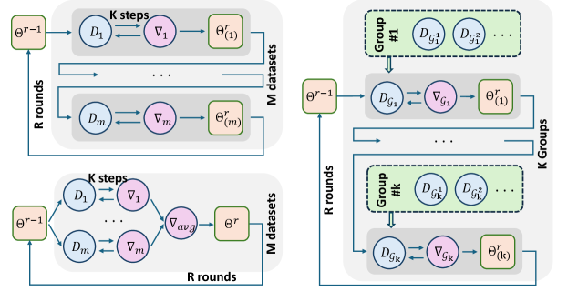
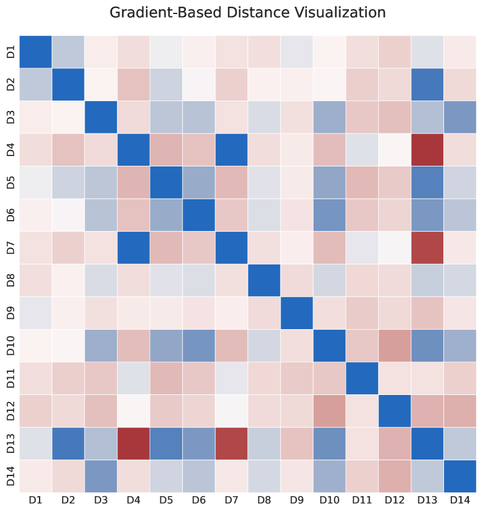
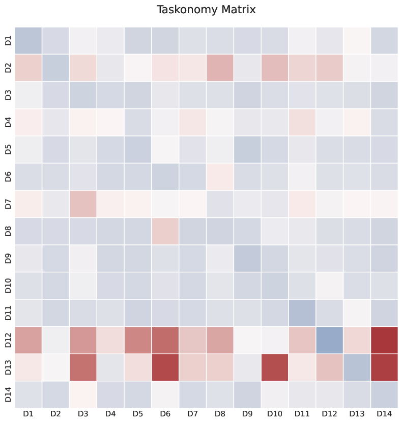
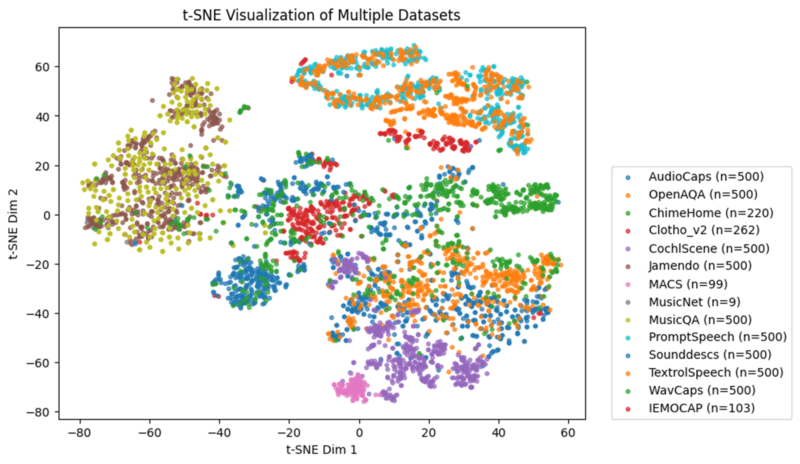
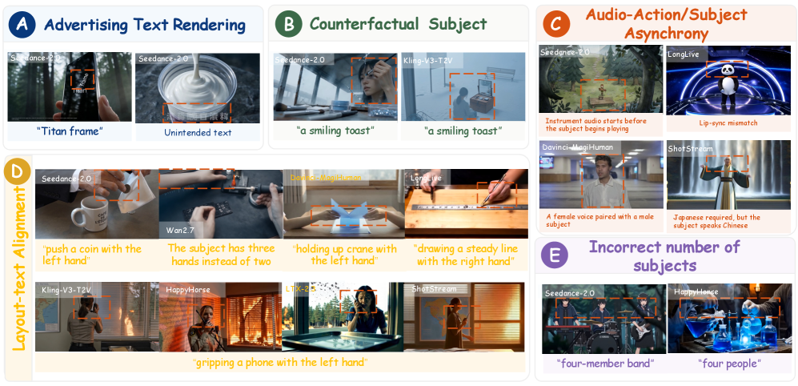
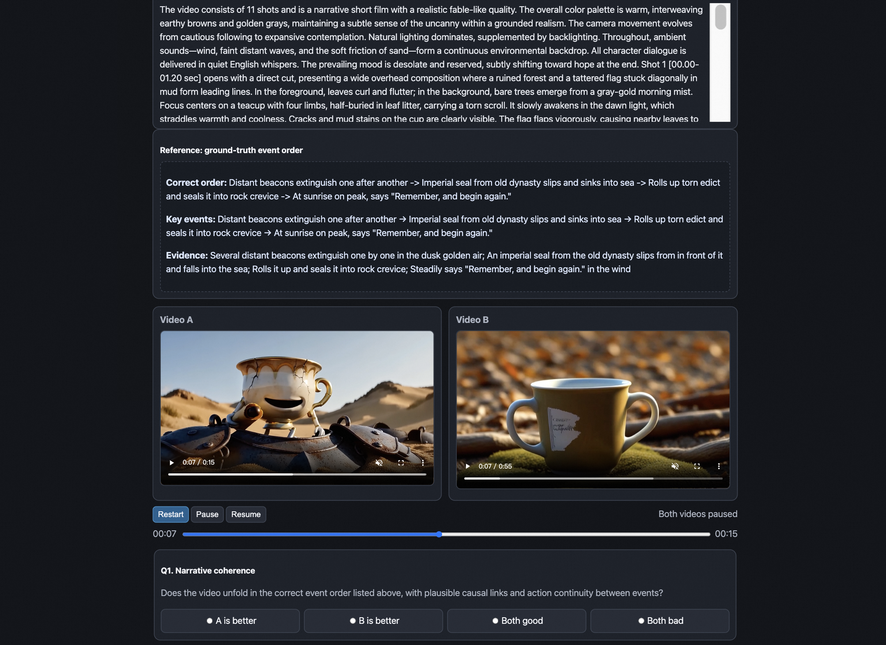
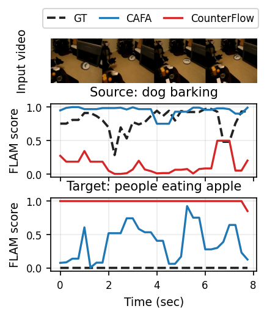
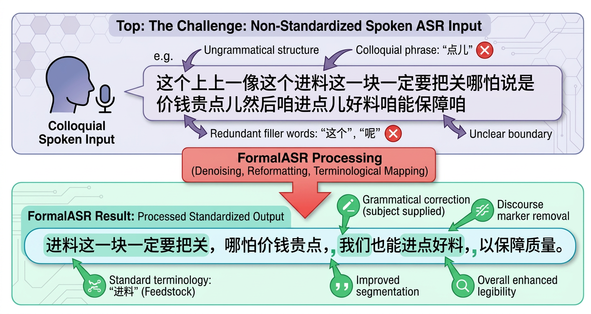

# 🚩 (2026-05-20) Scholar Inbox 추천 논문 

# 📚 Heterogeneity-Aware Dataset Scheduling for Efficient Audio Large Language Model Training

🚀 URL: https://arxiv.org/html/2605.19101

## 🌏 Abstract (원문)
Training general-purpose Audio Large Language Models (ALLMs) across diverse datasets is essential for holistic audio understanding, yet it faces significant challenges due to dataset heterogeneity, which often leads to conflicting gradients and slow convergence. Despite its impact, how to explicitly manage this heterogeneity during training remains underexplored, with current practices relying primarily on uniform mixture. In this work, we analyze multi-dataset AudioQA training from a convergence perspective and propose Grouped Sequential Training (GST). GST strategically organizes datasets into affinity-aware groups and introduces them via a progressive scheduling protocol, effectively balancing the stability of parallel training with the efficiency of sequential optimization. To ensure scalability, we develop gradient-based affinity metrics that capture inter-dataset relationships without the prohibitive cost of empirical transferability estimation. Extensive evaluations on 14 AudioQA datasets spanning speech, music, and environmental sounds demonstrate that GST achieves 30–40% faster convergence than standard parallel training while maintaining or even surpassing the performance of mix-all training. Our results provide both theoretical insights and a practical, model-agnostic framework for efficient large-scale ALLM optimization.
## 🌏 Abstract (번역)
다양한 데이터셋에 걸쳐 범용 오디오 대규모 언어 모델(ALLM)을 훈련하는 것은 전체적인 오디오 이해에 필수적이지만, 데이터셋 이질성으로 인해 종종 상충하는 기울기(gradient)와 느린 수렴을 초래하는 상당한 문제에 직면합니다. 이러한 영향에도 불구하고, 훈련 중 이 이질성을 명시적으로 관리하는 방법은 아직 충분히 탐구되지 않았으며, 현재 관행은 주로 균일한 혼합에 의존하고 있습니다. 본 연구에서는 수렴 관점에서 다중 데이터셋 AudioQA 훈련을 분석하고 그룹 순차 훈련(GST)을 제안합니다. GST는 데이터셋을 친화도 인식 그룹으로 전략적으로 구성하고 점진적인 스케줄링 프로토콜을 통해 이를 도입하여, 병렬 훈련의 안정성과 순차 최적화의 효율성 사이의 균형을 효과적으로 맞춥니다. 확장성을 보장하기 위해, 우리는 경험적 전이성 추정의 엄청난 비용 없이 데이터셋 간의 관계를 포착하는 기울기 기반 친화도 측정 지표를 개발합니다. 음성, 음악 및 환경 소리를 포함하는 14개 AudioQA 데이터셋에 대한 광범위한 평가는 GST가 표준 병렬 훈련보다 30~40% 더 빠른 수렴을 달성하면서도, 모든 데이터셋을 혼합하여 훈련하는 방식의 성능을 유지하거나 심지어 능가함을 보여줍니다. 우리의 결과는 효율적인 대규모 ALLM 최적화를 위한 이론적 통찰력과 실용적이며 모델에 구애받지 않는 프레임워크를 모두 제공합니다.

## 🔍 Methods & Results
- 데이터셋 이질성이 ALLM 훈련의 수렴에 미치는 영향을 분석하기 위해, 최소 기대 기울기 노름(gradient norm)을 기반으로 수렴률을 측정하는 이론적 토대를 마련했습니다.
- 병렬 훈련은 공동 샘플링을 통해 분산을 줄이지만 전역 이질성에 노출되고, 순차 훈련은 이질성 효과를 억제하지만 공동 분산 감소 이점을 잃는다는 근본적인 상충 관계를 이론적으로 규명했습니다.
- 이러한 상충 관계를 해결하기 위해, 데이터셋을 친화도 기반 그룹으로 분할하고 점진적인 스케줄링 프로토콜을 통해 도입하는 그룹 순차 훈련(GST)을 제안했습니다.
- GST는 그룹 내 병렬 훈련을 통해 분산 감소 이점을 유지하면서 그룹 간 순차 훈련을 통해 이질성 영향을 억제하여, 병렬 및 순차 훈련의 장점을 결합한 최적의 중간 지점을 제공함을 이론적으로 입증했습니다.
- 데이터셋 간의 최적화 궤적 일관성을 나타내는 기울기 기반 친화도 측정 지표(pairwise distance between dataset-level gradients)를 개발하여 데이터셋 그룹화를 위한 효율적이고 확장 가능한 방법을 제시했습니다.
- 실험은 음성, 음악, 환경 소리를 포함하는 14개 AudioQA 데이터셋에서 수행되었으며, GST가 표준 병렬 훈련보다 30-40% 더 빠른 수렴을 달성함을 보여주었습니다.
- GST는 모든 데이터셋을 혼합하여 훈련하는 방식(mix-all training)과 비교하여 성능을 유지하거나 능가하는 결과를 보였습니다.

## 🖼 Figures

*Figure 1:Illustration of sequential (left-up), parallel (left-down), and grouped sequential training (right).*

*Figure 2:Comparison of training dynamics and convergence across different scheduling protocols. (a), (b), and (c) represent Mix-all, GST (Progressive), and GST (Strict Sequential), respectively. The curves denote the validation accuracy across training epochs, while the bars indicate the average test accuracy across all datasets at the end of each stage.*

*Figure 3:Visualization of Dataset Relationship Measurements. (a) Taskonomy-based Affinity Matrix and (b) Gradient-based Affinity Matrix, where blue indicates higher similarity (closer relationship) and red indicates lower similarity (further distance). (c) t-SNE Visualization of Acoustic Features, demonstrating distinct clustering based on audio domains (e.g., Music, Speech, Environmental).*

*Figure 4*

*Figure 5*

*Figure 6*

---
**Usage Info**: 3666 tokens used.
**Generated at**: 2026-05-20 16:52:05

---

# 📚 MSAVBench: Towards Comprehensive and Reliable Evaluation of Multi-Shot Audio-Video Generation

🚀 URL: https://arxiv.org/html/2605.20183

## 🌏 Abstract (원문)
Video generation is rapidly evolving from single-shot synthesis to complex multi-shot audio-video (MSAV) narratives to meet real-world demands. However, evaluating such frontier models remains a fundamental challenge. Existing benchmarks are limited in scope and data diversity, and rely on rigid evaluation pipelines, preventing systematic and reliable assessment of modern MSAV models. To bridge these gaps, we introduceMSAVBench, the first comprehensive benchmark and adaptive hybrid evaluation framework for multi-shot audio-video generation. Our benchmark spans four key dimensions, video, audio, shot, and reference, covering diverse task settings, varying shot counts of up to 15, and challenging non-realistic scenarios. Our evaluation framework improves robustness through an adaptive self-correction mechanism for shot segmentation, instance-wise rubrics for subjective metrics, and tool-grounded evidence extraction for complex judgments. Furthermore, MSAVBench achieves high alignment with human judgments, reaching a Spearman rank correlation of 91.5%. Our systematic evaluation of 19 state-of-the-art closed- and open-source models shows that current systems still struggle with director-level control and fine-grained audio-visual synchronization, while modular or agentic generation pipelines offer a promising path toward narrowing the gap between open- and closed-source models. We will release the benchmark data and evaluation code to facilitate future research.
## 🌏 Abstract (번역)
비디오 생성은 단일 샷 합성에서 실제 요구 사항을 충족하는 복잡한 다중 샷 오디오-비디오(MSAV) 내러티브로 빠르게 발전하고 있습니다. 그러나 이러한 최첨단 모델을 평가하는 것은 여전히 근본적인 과제로 남아 있습니다. 기존 벤치마크는 범위와 데이터 다양성이 제한적이며, 경직된 평가 파이프라인에 의존하여 최신 MSAV 모델의 체계적이고 신뢰할 수 있는 평가를 방해합니다. 이러한 격차를 해소하기 위해 우리는 다중 샷 오디오-비디오 생성을 위한 최초의 포괄적인 벤치마크이자 적응형 하이브리드 평가 프레임워크인 MSAVBench를 소개합니다. 우리의 벤치마크는 비디오, 오디오, 샷, 참조의 네 가지 주요 차원을 포괄하며, 다양한 작업 설정, 최대 15개의 다양한 샷 수, 그리고 도전적인 비현실적 시나리오를 다룹니다. 우리의 평가 프레임워크는 샷 분할을 위한 적응형 자체 수정 메커니즘, 주관적 지표를 위한 인스턴스별 루브릭, 복잡한 판단을 위한 도구 기반 증거 추출을 통해 견고성을 향상시킵니다. 또한 MSAVBench는 인간의 판단과 높은 일치도를 달성하여 스피어만 순위 상관계수 91.5%에 도달했습니다. 19개의 최첨단 비공개 및 공개 소스 모델에 대한 체계적인 평가는 현재 시스템이 감독 수준의 제어 및 미세한 오디오-시각 동기화에 여전히 어려움을 겪고 있음을 보여주며, 모듈형 또는 에이전트 기반 생성 파이프라인이 공개 및 비공개 소스 모델 간의 격차를 좁히는 유망한 경로를 제공함을 시사합니다. 우리는 향후 연구를 촉진하기 위해 벤치마크 데이터와 평가 코드를 공개할 예정입니다.

## 🔍 Methods & Results
- MSAVBench는 다중 샷 오디오-비디오 생성을 위한 최초의 포괄적인 벤치마크이자 적응형 하이브리드 평가 프레임워크로 도입되었습니다.
- 벤치마크는 비디오, 오디오, 샷, 참조의 네 가지 주요 차원을 포괄하며, 다양한 작업 설정, 최대 15개의 샷 수, 도전적인 비현실적 시나리오를 다룹니다.
- 평가 프레임워크는 샷 분할을 위한 적응형 자체 수정 메커니즘, 주관적 지표를 위한 인스턴스별 루브릭, 복잡한 판단을 위한 도구 기반 증거 추출을 통해 견고성을 향상시킵니다.
- MSAVBench는 인간의 판단과 높은 일치도를 달성하여 스피어만 순위 상관계수 91.5%를 기록했습니다.
- 19개의 최첨단 비공개 및 공개 소스 모델에 대한 체계적인 평가 결과, 현재 시스템은 감독 수준의 제어 및 미세한 오디오-시각 동기화에 어려움을 겪고 있으며, 모듈형 또는 에이전트 기반 생성 파이프라인이 공개 및 비공개 소스 모델 간의 격차를 좁히는 유망한 경로를 제공하는 것으로 나타났습니다.

## 🖼 Figures

*Figure 1:Overview of MSAVBench. Left: the benchmark spans four data dimensions, namely video, audio, shot, and reference, covering diverse prompts, shot counts, and realistic and non-realistic scenarios. Right: the evaluation suite assesses generated MSAV content at four levels, including global, cross-shot, intra-shot, and reference levels, using a hybrid strategy that combines specialized expert models, rubric-based scoring, and tool-grounded assessment.*

*Figure 2:Diverse distribution of MSAVBench. The benchmark covers diverse generation categories (A), realistic and non-realistic subjects and scenes (B), varied audio conditions and languages (C), diverse visual styles (D), rich cinematic requirements (E), and a broad range of task difficulty in terms of shot count, subject count, and scenario complexity (F). More statistics are in Appendix A.3*

*Figure 3:Overview of the MSAVBench evaluation framework. We first perform agentic pre-processing with iterative shot self-correction to improve boundary quality. Metrics are then evaluated with stratified scoring paradigms, including expert models for well-defined tasks, rubric-based VLM scoring for subjective dimensions, and tool-grounded agentic scoring for complex properties.*

*Figure 4:Qualitative failure cases of evaluated models. Examples include text rendering errors (A), counterfactual subject mismatches (B), audio-visual synchronization failures (C), layout control failures (D), and incorrect subject counts (E).*

![Figure 5:The data construction pipeline of MSAVBench. (1) Domain experts define an eight-category seed taxonomy with fine-grained sub-categories, with diverse types of subject, scene, and visual style. (2) GPT-5.4 first samples 
(
𝑡
​
ℎ
​
𝑒
​
𝑚
​
𝑒
,
𝑠
​
𝑢
​
𝑏
​
𝑗
​
𝑒
​
𝑐
​
𝑡
,
𝑠
​
𝑐
​
𝑒
​
𝑛
​
𝑒
,
𝑠
​
𝑡
​
𝑦
​
𝑙
​
𝑒
)
 quadruples and synthesises an initial multi-shot script with structured per-shot metadata; a Prompt-Enhancement (PE) model then rewrites it into the global-to-shot format with explicit cinematic language. (3) Six domain experts review every PE-rewritten script, filter out low-quality / hallucinated cases, and refine ambiguous descriptions. (4) Reference media are sampled from public benchmarks, automatically tagged by Gemini 3.1 Pro, and finally curated by experts to obtain a clean reference-conditioned subset.](../images/2026-05-20/2605.20183/2605.20183_fig7.png)
*Figure 5:The data construction pipeline of MSAVBench. (1) Domain experts define an eight-category seed taxonomy with fine-grained sub-categories, with diverse types of subject, scene, and visual style. (2) GPT-5.4 first samples 
(
𝑡
​
ℎ
​
𝑒
​
𝑚
​
𝑒
,
𝑠
​
𝑢
​
𝑏
​
𝑗
​
𝑒
​
𝑐
​
𝑡
,
𝑠
​
𝑐
​
𝑒
​
𝑛
​
𝑒
,
𝑠
​
𝑡
​
𝑦
​
𝑙
​
𝑒
)
 quadruples and synthesises an initial multi-shot script with structured per-shot metadata; a Prompt-Enhancement (PE) model then rewrites it into the global-to-shot format with explicit cinematic language. (3) Six domain experts review every PE-rewritten script, filter out low-quality / hallucinated cases, and refine ambiguous descriptions. (4) Reference media are sampled from public benchmarks, automatically tagged by Gemini 3.1 Pro, and finally curated by experts to obtain a clean reference-conditioned subset.*

*Figure 6:Long-tail cinematic-language and tonal distributions of MSAVBench. Shot scale, camera angle, transition type and tone
×
saturation distributions on the released 
286
-prompt suite.*

*Figure 7:Screenshot of the annotation interface used for pairwise expert evaluation.*

---
**Usage Info**: 1798 tokens used.
**Generated at**: 2026-05-20 16:52:13

---

# 📚 CounterFlow: A Two-Phase Inference-Time Sampling for Counterfactual Video Foley Generation

🚀 URL: https://arxiv.org/html/2605.18916

## 🌏 Abstract (원문)
We investigate Counterfactual Video Foley Generation, which aims to adopt a sound-source identity that contradicts the visual evidence while remaining temporally synchronized to a silent video. Existing Video&Text-to-Audio (VT2A) models struggle with this, often remaining anchored to the visually implied sound source when video and text contents disagree. We presentCounterFlow, an inference-time dual-phase sampling scheme for pretrained flow-matching VT2A models. Phase 1 builds a video-derived temporal structure while suppressing the visually implied source; Phase 2 drops video conditioning to focus entirely on shaping audio timbre toward the target prompt.CounterFlowsubstantially improves counterfactual Video Foley generation compared to naive negative prompting and state-of-the-art baselines. To evaluate replacement quality, we propose a metric leveraging a text-audio co-embedding space to measure both target-prompt evidence and residual visually implied source leakage. Video demonstrations and code are available at https://gyubin-lee.github.io/counterflow-demo/
## 🌏 Abstract (번역)
우리는 시각적 증거와 모순되는 음원 정체성을 채택하면서 무음 비디오에 시간적으로 동기화된 상태를 유지하는 것을 목표로 하는 반사실적 비디오 폴리 생성(Counterfactual Video Foley Generation)을 연구합니다. 기존의 비디오 및 텍스트-오디오(VT2A) 모델은 비디오와 텍스트 내용이 일치하지 않을 때 시각적으로 암시된 음원에 고정되는 경향이 있어 이러한 문제에 어려움을 겪습니다. 우리는 사전 훈련된 플로우 매칭 VT2A 모델을 위한 추론 시간 이중 단계 샘플링 방식인 CounterFlow를 제안합니다. 1단계는 시각적으로 암시된 음원을 억제하면서 비디오에서 파생된 시간적 구조를 구축하고, 2단계는 비디오 조건을 제거하여 오디오 음색을 목표 프롬프트 방향으로 형성하는 데 전적으로 집중합니다. CounterFlow는 순진한 부정 프롬프팅 및 최첨단 기준선과 비교하여 반사실적 비디오 폴리 생성을 크게 향상시킵니다. 교체 품질을 평가하기 위해 우리는 텍스트-오디오 공동 임베딩 공간을 활용하여 목표 프롬프트 증거와 잔여 시각적으로 암시된 음원 누출을 모두 측정하는 지표를 제안합니다. 비디오 데모 및 코드는 https://gyubin-lee.github.io/counterflow-demo/에서 확인할 수 있습니다.

## 🔍 Methods & Results
- 반사실적 비디오 폴리 생성(Counterfactual Video Foley Generation)은 비디오의 시간적 역동성을 따르면서도 시각적으로 암시된 음원(source prompt)을 억제하고 목표 텍스트 프롬프트(target prompt)에 설명된 반사실적 음원 정체성을 따르는 오디오를 생성하는 것을 목표로 합니다.
- 주요 기술적 과제는 비디오 특징이 종종 객체별 정보를 포함하므로 비디오 조건 내에서 시각적으로 암시된 음원 정체성을 억제하는 것입니다.
- 우리는 사전 훈련된 VT2A 백본을 재훈련할 필요 없이 작동하는 효율적인 추론 시간 샘플링 방법인 CounterFlow를 제안합니다.
- CounterFlow는 플로우 매칭 프로세스를 두 가지 별개의 단계로 분할하며, 각 단계는 고유한 조건화 전략을 사용합니다.
- 1단계(초기 샘플링 단계)에서는 비디오 조건화를 유지하면서 시각적으로 암시된 음원을 억제하고 비디오에서 파생된 시간적 구조를 구축하기 위해 분해된 가이던스(decomposed guidance)를 사용합니다.
- 2단계(후기 샘플링 단계)에서는 비디오 조건화를 제거하고 부정 텍스트 프롬프팅을 사용하여 오디오 음색을 목표 프롬프트 방향으로 형성하는 데 전적으로 집중하여 중간 상태를 정제합니다.
- 이러한 이중 단계 설계는 초기 샘플링 단계가 오디오의 거시적 구조(시간적 역동성)를 결정하고 후기 단계가 정체성 및 세부 사항(음원 및 음색)을 정제한다는 통찰력에 기반합니다.
- CounterFlow는 순진한 부정 프롬프팅 및 최첨단 기준선과 비교하여 반사실적 비디오 폴리 생성을 크게 향상시키는 것으로 나타났습니다.
- 교체 품질을 평가하기 위해 목표 프롬프트 증거와 잔여 시각적으로 암시된 음원 누출을 모두 측정하기 위해 텍스트-오디오 공동 임베딩 공간을 활용하는 새로운 지표를 제안합니다.

## 🖼 Figures

*Figure 1:CounterFlow steers the sampling trajectory of a pretrained VT2A backbone at inference time without additional training. Phase 1 establishes a video-aligned temporal structure through decomposed guidance, while Phase 2 removes video conditioning and employs negative text prompting to refine the counterfactual sound identity within the established structure.*

*Figure 2:FLAM visualization for a counterfactual video foley generation from dog barking to lion roaring.*

---
**Usage Info**: 3690 tokens used.
**Generated at**: 2026-05-20 16:52:34

---

# 📚 FormalASR: End-to-End Spoken Chinese to Formal Text

🚀 URL: https://arxiv.org/html/2605.19266

## 🌏 Abstract (원문)
Automatic speech recognition (ASR) systems are typically optimized for verbatim transcription, which preserves disfluencies, filler words, and informal spoken structures that are often unsuitable for downstream writing-oriented applications. A common workaround is a two-stage ASR+LLM pipeline for post-editing, but this design increases latency and memory cost and is difficult to deploy on-device. We present FormalASR, two compact end-to-end models (0.6B and 1.7B) that directly transcribe spoken Chinese into formal written text. To enable this setting, we build WenetSpeech-Formal and Speechio-Formal, two large-scale spoken-to-formal datasets constructed by LLM-based rewriting and quality filtering. We then fine-tune Qwen3-ASR at two scales (0.6B and 1.7B) with supervised fine-tuning. Experiments on WenetSpeech-Formal and Speechio-Formal show that FormalASR achieves up to 37.4% relative CER reduction over verbatim baselines, while also improving ROUGE-L and BERTScore. FormalASR requires no post-processing LLM at deployment time, providing a lightweight, on-device solution for spoken-to-formal transcription.
## 🌏 Abstract (번역)
자동 음성 인식(ASR) 시스템은 일반적으로 어구 불연속성, 채움 단어, 비공식적인 구어체 구조를 보존하는 그대로의 전사에 최적화되어 있으며, 이는 종종 후속 쓰기 중심 애플리케이션에 부적합합니다. 일반적인 해결책은 후처리 편집을 위한 2단계 ASR+LLM 파이프라인이지만, 이러한 설계는 지연 시간과 메모리 비용을 증가시키고 온디바이스 배포가 어렵습니다. 우리는 구어체 중국어를 공식적인 문어체 텍스트로 직접 전사하는 두 가지 소형 엔드투엔드 모델(0.6B 및 1.7B)인 FormalASR을 제시합니다. 이러한 설정을 가능하게 하기 위해, 우리는 LLM 기반 재작성 및 품질 필터링을 통해 구축된 두 가지 대규모 구어체-문어체 데이터셋인 WenetSpeech-Formal과 Speechio-Formal을 구축했습니다. 그런 다음 우리는 Qwen3-ASR을 두 가지 규모(0.6B 및 1.7B)로 지도 미세 조정을 통해 미세 조정했습니다. WenetSpeech-Formal 및 Speechio-Formal에 대한 실험 결과, FormalASR은 그대로의 전사 기준선 대비 최대 37.4%의 상대적 CER 감소를 달성했으며, ROUGE-L 및 BERTScore도 향상시켰습니다. FormalASR은 배포 시 후처리 LLM이 필요 없어, 구어체-문어체 전사를 위한 경량의 온디바이스 솔루션을 제공합니다.

## 🔍 Methods & Results
- FormalASR은 구어체 중국어를 공식 문어체 텍스트로 직접 전사하는 0.6B 및 1.7B 규모의 두 가지 소형 엔드투엔드 모델이다.
- 기존 ASR+LLM 파이프라인과 달리, FormalASR은 음향 인식과 언어적 형식화를 단일 조건부 생성 프로세스로 결합하여 추론 시 별도의 재작성기가 필요 없다.
- 모델은 Whisper 스타일 오디오 인코더와 자동회귀 Qwen 디코더를 사용하는 Qwen3-ASR(0.6B 및 1.7B)을 기반으로 한다.
- LLM 기반 재작성 및 품질 필터링을 통해 WenetSpeech-Formal 및 Speechio-Formal이라는 두 가지 대규모 구어체-문어체 데이터셋을 구축하여 모델 훈련에 사용했다.
- 지도 미세 조정을 통해 Qwen3-ASR을 훈련했으며, 훈련 목표는 음향-텍스트 정렬, 불연속성 제거, 구어체-문어체 스타일 변환, 내용 보존 재작성을 통합된 엔드투엔드 프레임워크 내에서 공동으로 학습하도록 한다.
- WenetSpeech-Formal 및 Speechio-Formal 데이터셋에 대한 실험 결과, FormalASR은 그대로의 전사 기준선 대비 최대 37.4%의 상대적 CER 감소를 달성했으며, ROUGE-L 및 BERTScore도 향상시켰다.
- 배포 시 후처리 LLM이 필요 없어, 경량의 온디바이스 구어체-문어체 전사 솔루션을 제공하며, 표준 단일 모델 ASR 배포와 동일한 시스템 복잡성을 유지한다.

## 🖼 Figures

*Fig. 1:An example of spoken-to-formal conversion. The verbatim ASR transcript preserves disfluencies and informal spoken patterns, while FormalASR directly produces a clean, formal written sentence from the same audio input.*

![Fig. 2:Inference efficiency of FormalASR-1.7B compared with Qwen3-ASR-1.7B (verbatim). Left: average output token counts on WenetSpeech-Formal (18.5 for Qwen3-ASR-1.7B, 14.3 for FormalASR-1.7B) and Speechio-Formal (18.5 for Qwen3-ASR-1.7B, 15.8 for FormalASR-1.7B), showing that spoken-to-formal conversion consistently produces shorter sequences. Right: per-sample latency as a function of verbatim sentence length (token count bins); FormalASR-1.7B achieves lower latency across all sentence lengths, with the gap widening for longer utterances.](../images/2026-05-20/2605.19266/2605.19266_fig1.png)
*Fig. 2:Inference efficiency of FormalASR-1.7B compared with Qwen3-ASR-1.7B (verbatim). Left: average output token counts on WenetSpeech-Formal (18.5 for Qwen3-ASR-1.7B, 14.3 for FormalASR-1.7B) and Speechio-Formal (18.5 for Qwen3-ASR-1.7B, 15.8 for FormalASR-1.7B), showing that spoken-to-formal conversion consistently produces shorter sequences. Right: per-sample latency as a function of verbatim sentence length (token count bins); FormalASR-1.7B achieves lower latency across all sentence lengths, with the gap widening for longer utterances.*

---
**Usage Info**: 3416 tokens used.
**Generated at**: 2026-05-20 16:52:59

---

# 📚 Optimising Neural Speech Codecs for 300bps Communication using Reinforcement Learning

🚀 URL: https://arxiv.org/html/2605.19541

## 🌏 Abstract (원문)
In bandwidth-constrained communication such as satellite and underwater channels, speech must often be transmitted at ultra-low bitrates where intelligibility is the primary objective. At such extreme compression levels, codecs trained with acoustic reconstruction losses tend to allocate bits to perceptual detail, leading to substantial degradation in word error rate (WER). This paper proposes ClariCodec, a neural speech codec operating at 300 bit per second (bps) that reformulates quantisation as a stochastic policy, enabling reinforcement learning (RL)-based optimisation of intelligibility. Specifically, the encoder is fine-tuned using WER-driven rewards while the acoustic reconstruction pipeline remains frozen. Even without RL, ClariCodec achieves 4.64% WER on the LibriSpeech test-clean set at 300 bps, already competitive with codecs operating at higher bitrates. Further RL fine-tuning reduces WER to 3.55% on test-clean and 10.4% on test-other, corresponding to a 23% relative reduction while preserving perceptual quality.111Audio samples are available at:https://demo941.github.io/ClariCodec/
## 🌏 Abstract (번역)
위성 및 수중 채널과 같이 대역폭이 제한된 통신에서는 음성을 초저 비트레이트로 전송해야 하는 경우가 많으며, 이때 명료도가 주요 목표가 됩니다. 이러한 극단적인 압축 수준에서는 음향 재구성 손실로 훈련된 코덱이 지각적 세부 사항에 비트를 할당하는 경향이 있어 단어 오류율(WER)이 크게 저하됩니다. 본 논문은 300bps(초당 비트)로 작동하는 신경 음성 코덱인 ClariCodec을 제안하며, 이는 양자화를 확률적 정책으로 재구성하여 강화 학습(RL) 기반의 명료도 최적화를 가능하게 합니다. 구체적으로, 인코더는 WER 기반 보상을 사용하여 미세 조정되며, 음향 재구성 파이프라인은 고정된 상태를 유지합니다. RL 없이도 ClariCodec은 300bps에서 LibriSpeech test-clean 세트에서 4.64%의 WER을 달성하여, 이미 더 높은 비트레이트에서 작동하는 코덱들과 경쟁할 만한 수준을 보입니다. 추가적인 RL 미세 조정을 통해 test-clean에서 WER을 3.55%로, test-other에서 10.4%로 감소시켰으며, 이는 지각적 품질을 유지하면서 23%의 상대적 감소에 해당합니다. 오디오 샘플은 https://demo941.github.io/ClariCodec/에서 확인할 수 있습니다.

## 🔍 Methods & Results
- ClariCodec은 음향 충실도와 의미 정보 보존의 균형을 맞추기 위해 2단계 훈련 전략을 사용하여 의미 정보를 명시적으로 최적화합니다.
- 모델은 160샘플(10ms)의 홉 크기로 추출된 로그-멜 스펙트로그램에서 작동하며, ConvNeXt V2 기반 인코더는 확률적 잔차 양자화를 통해 입력을 이산 코덱 인덱스로 압축하고, 대칭 디코더는 인덱스 시퀀스로부터 로그-멜 스펙트로그램을 재구성합니다.
- 재구성된 스펙트로그램은 코덱과 함께 처음부터 훈련된 Vocos 보코더에 의해 파형 샘플로 변환됩니다.
- 300bps를 달성하기 위해 인코더는 세 개의 2배 레이어를 통해 총 8배의 시간적 다운샘플링을 적용하여 12.5Hz의 잠재 프레임 속도를 생성하며, 디코더는 세 개의 2배 업샘플링 블록으로 이를 반영합니다.
- 잔차 FSQ(R-FSQ) 모듈은 두 개의 잔차 레이어로 구성되며, 각 레이어는 L=[8,8,8,8]의 레벨 차원(레이어당 12비트)을 사용하여 300bps의 대역폭을 제한합니다.
- 향상된 FSQ(iFSQ)는 기존의 하이퍼볼릭 탄젠트 경계 함수를 시그모이드 활성화 함수로 대체하여 잠재 분포에 더 잘 맞춰 코드북 활용도를 극대화합니다.
- 양자화는 확률적 샘플링(Gumbel-Softmax)으로 재구성되어 인코더가 RL 최적화를 위한 훈련 가능한 정책으로 기능할 수 있도록 합니다.
- 1단계에서는 재구성 손실(로그-멜 스펙트로그램의 L1 거리), 적대적 손실(Hinge GAN과 세 가지 판별기 앙상블), 특징 매칭 손실(중간 판별기 표현의 L1 거리)을 최소화하는 복합 손실 함수를 사용하여 엔드투엔드 최적화를 수행합니다.
- 2단계에서는 RL 미세 조정을 위해 양자화기, 디코더, 보코더의 모든 매개변수를 고정하고, 인코더를 양자화 동작에 대한 확률적 정책으로 모델링합니다.
- 보상 신호는 재구성된 파형과 원본 파형의 ASR 전사 간의 음수 WER을 사용하며, GRPO 프레임워크를 통해 확률적 양자화기를 최적화합니다.
- 지각적 품질 유지를 위해 2단계에서는 멜 스펙트로그램 재구성 손실이 최종 손실에 통합됩니다.
- RL 없이도 ClariCodec은 300bps에서 LibriSpeech test-clean 세트에서 4.64%의 WER을 달성하여, 더 높은 비트레이트 코덱과 경쟁할 만한 성능을 보입니다.
- RL 미세 조정을 통해 test-clean에서 WER을 3.55%로, test-other에서 10.4%로 감소시켰으며, 이는 지각적 품질을 유지하면서 23%의 상대적 WER 감소에 해당합니다.

## 🖼 Figures
![Figure 1:Overview of the two-stage training framework of ClariCodec. In Stage 1, the full codec is trained end-to-end using a combination of 
𝐿
1
 mel reconstruction loss, adversarial loss, and feature matching loss to ensure high-fidelity speech reconstruction. In Stage 2, all modules excpet the encoder are frozen, and the encoder is fine-tuned using an RL objective where the reward signal is derived from a pretrained ASR model, explicitly optimizing for speech intelligibility. An 
𝐿
1
 mel reconstruction loss is used for preventing perceptual degradation during RL optimization.](../images/2026-05-20/2605.19541/2605.19541_fig0.png)
*Figure 1:Overview of the two-stage training framework of ClariCodec. In Stage 1, the full codec is trained end-to-end using a combination of 
𝐿
1
 mel reconstruction loss, adversarial loss, and feature matching loss to ensure high-fidelity speech reconstruction. In Stage 2, all modules excpet the encoder are frozen, and the encoder is fine-tuned using an RL objective where the reward signal is derived from a pretrained ASR model, explicitly optimizing for speech intelligibility. An 
𝐿
1
 mel reconstruction loss is used for preventing perceptual degradation during RL optimization.*

---
**Usage Info**: 4050 tokens used.
**Generated at**: 2026-05-20 16:53:12

---

# 📚 1 Introduction

🚀 URL: https://arxiv.org/html/2605.20068

## 🌏 Abstract (원문)
Standard generative models struggle with heavy-tailed data: Lipschitz architectures cannot produce power-law tails from Gaussian noise, and interpolating between heavy-tailed data and Gaussians is ill-posed. We propose a simple fix: apply the soft-log transformϕ​(x)=sign​(x)⋅log⁡(1+|x|)coordinate-wise to data before training, then exponentiate samples after generation. A Hill diagnostic decides per-coordinate whether to transform, leaving light-tailed margins untouched at no added complexity. This compresses heavy tails into a range where standard flow matching succeeds, without heavy-tailed base distributions or architectural modifications. We provide theoretical intuition for why this works: the log-transform maps Pareto tails to exponentials, and the induced dynamics implement a form of tail annealing via power transformations. On a 144-configuration multivariate benchmark (3 copulas,ddup to 100, 4 tail indices), Log-FM dominates specialized baselines onW1W_{1}, CVaR99, and extreme-quantile metrics, and is the only method with zero severe divergences across 2,880 runs.
## 🌏 Abstract (번역)
표준 생성 모델은 꼬리가 두꺼운(heavy-tailed) 데이터에 어려움을 겪습니다. 립시츠(Lipschitz) 아키텍처는 가우시안 노이즈로부터 멱법칙 꼬리(power-law tails)를 생성할 수 없으며, 꼬리가 두꺼운 데이터와 가우시안 사이를 보간하는 것은 부적절합니다. 우리는 간단한 해결책을 제안합니다: 훈련 전에 데이터에 소프트-로그 변환 ϕ(x)=sign(x)⋅log(1+|x|)을 좌표별로 적용한 다음, 생성 후 샘플에 지수 변환을 적용합니다. 힐(Hill) 진단은 각 좌표별로 변환 여부를 결정하여, 꼬리가 얇은(light-tailed) 마진은 추가 복잡성 없이 그대로 둡니다. 이 방법은 꼬리가 두꺼운 부분을 표준 플로우 매칭이 성공할 수 있는 범위로 압축하며, 꼬리가 두꺼운 기본 분포나 아키텍처 수정이 필요 없습니다. 우리는 이 방법이 작동하는 이론적 직관을 제공합니다: 로그 변환은 파레토 꼬리를 지수 분포로 매핑하고, 유도된 동역학은 멱 변환을 통해 꼬리 어닐링(tail annealing)의 한 형태를 구현합니다. 144개 구성의 다변량 벤치마크(3개 코퓰라, d 최대 100, 4개 꼬리 지수)에서 Log-FM은 W1, CVaR99, 및 극단 분위수(extreme-quantile) 지표에서 특화된 기준 모델들을 압도하며, 2,880회 실행 중 심각한 발산이 전혀 없는 유일한 방법입니다.

## 🔍 Methods & Results
- Log-FM은 훈련 전에 데이터에 소프트-로그 변환 ϕ(x)=sign(x)⋅log(1+|x|)을 좌표별로 적용하고, 생성 후 샘플에 역변환(지수 변환)을 적용하는 방식으로 꼬리가 두꺼운 데이터를 처리한다.
- 표준 플로우 매칭(Flow Matching) 프레임워크를 기반으로 하며, 훈련 데이터 X0를 힐(Hill) 진단 기반 마스크 mj를 사용하여 변환된 ~X0=ϕ(X0)로 변환한다.
- 변환된 변수 ~Xt에 대해 속도 네트워크(velocity network) vθ를 훈련하고, 생성된 샘플의 해당 좌표에 ϕ−1를 적용한다.
- 힐 진단은 각 좌표의 상위 순서 통계량에 대한 힐 추정량 α^j를 사용하여, α^j ≤ αmax (αmax=4)인 경우에만 해당 좌표에 변환을 적용한다.
- 생성 과정은 학습된 속도 필드를 노이즈(~t=1)에서 데이터(~t=0)로 역방향으로 통합한 다음, 역변환 ϕ−1(~x)=sign(~x)(e|~x|−1)을 적용한다.
- 매우 병리적인 경우(예: α<1)를 위해 ϕ−1 적용 전에 ~xj←clamp(~xj,−c,c)와 같은 클램핑(clamping)을 선택적으로 사용할 수 있으나, α≥1.5인 벤치마크에서는 c≥10에서 비활성 상태였다.
- 모든 실험에서 100단계의 오일러(Euler) 이산화를 사용했으며, 4개의 은닉층(너비 256)과 SiLU 활성화 함수를 가진 MLP를 속도 네트워크로 사용했다.
- Log-FM은 144개 구성의 다변량 벤치마크에서 W1, CVaR99, 및 극단 분위수 지표에서 특화된 기준 모델들을 능가했으며, 2,880회 실행 중 심각한 발산이 전혀 발생하지 않은 유일한 방법이었다.

---
**Usage Info**: 4699 tokens used.
**Generated at**: 2026-05-20 16:53:57

---

