# 🚩 (2026-05-21) Scholar Inbox 추천 논문 

# 📚 Raon-OpenTTS: Open Models and Data for Robust Text-to-Speech

🚀 URL: https://arxiv.org/html/2605.20830

## 🌏 Abstract (원문)
Recent advances in text-to-speech (TTS) models show impressive speech naturalness and quality, yet the role of large-scale open data in driving this progress remains underexplored. In this work, we introduce Raon-OpenTTS, an open TTS model that performs competitively with state-of-the-art closed-data TTS models, and Raon-OpenTTS-Pool, a large-scale open dataset for reproducible TTS training. Raon-OpenTTS-Pool consists of 615K hours of 240M speech segments aggregated from publicly available English speech corpora and web-sourced recordings. With a model-based filtering pipeline applied to Raon-OpenTTS-Pool, we derive Raon-OpenTTS-Core, a curated, high-quality subset of 510K hours and 194M speech segments. Using Raon-OpenTTS-Core, we train Raon-OpenTTS, a series of diffusion transformer (DiT)-based TTS models from 0.3B to 1B parameters. On multiple benchmarks, Raon-OpenTTS-1B shows comparable performance to state-of-the-art models such as Qwen3-TTS and CosyVoice 3, which are trained on several million hours of proprietary speech data. Notably, on Seed-TTS-Eval, Raon-OpenTTS-1B achieves a word error rate (WER) of 1.78% and a speaker similarity (SIM) of 0.749, ranking second on WER and first on SIM among recent open-weight TTS baselines. On CV3-Hard-EN, Raon-OpenTTS-1B achieves a WER of 6.15% and a SIM of 0.775, ranking first on both metrics. Furthermore, to support robust evaluation, we introduce Raon-OpenTTS-Eval, a structured benchmark for assessing TTS robustness across diverse acoustic conditions including clean, noisy, in-the-wild, and expressive speech. On Raon-OpenTTS-Eval, Raon-OpenTTS-1B achieves the best average WER and SIM among all evaluated models, and the second-best human preference, as measured by comparative mean opinion score (CMOS). Our data pool, filtering pipeline, training code, and checkpoints are publicly available at https://github.com/krafton-ai/RAON-OpenTTS.
## 🌏 Abstract (번역)
텍스트 음성 변환(TTS) 모델의 최근 발전은 인상적인 음성 자연스러움과 품질을 보여주지만, 이러한 발전을 이끄는 대규모 공개 데이터의 역할은 아직 충분히 탐구되지 않았습니다. 본 연구에서는 최첨단 비공개 데이터 TTS 모델과 경쟁할 만한 성능을 보이는 공개 TTS 모델인 Raon-OpenTTS와 재현 가능한 TTS 훈련을 위한 대규모 공개 데이터셋인 Raon-OpenTTS-Pool을 소개합니다. Raon-OpenTTS-Pool은 공개적으로 사용 가능한 영어 음성 코퍼스와 웹 소스 녹음에서 집계된 615K 시간 분량의 240M 음성 세그먼트로 구성됩니다. Raon-OpenTTS-Pool에 모델 기반 필터링 파이프라인을 적용하여, 510K 시간 분량의 194M 음성 세그먼트로 구성된 선별된 고품질 하위 집합인 Raon-OpenTTS-Core를 도출했습니다. Raon-OpenTTS-Core를 사용하여 0.3B에서 1B 매개변수에 이르는 확산 트랜스포머(DiT) 기반 TTS 모델 시리즈인 Raon-OpenTTS를 훈련했습니다. 여러 벤치마크에서 Raon-OpenTTS-1B는 수백만 시간의 독점 음성 데이터로 훈련된 Qwen3-TTS 및 CosyVoice 3와 같은 최첨단 모델과 비교할 만한 성능을 보여줍니다. 특히 Seed-TTS-Eval에서 Raon-OpenTTS-1B는 1.78%의 단어 오류율(WER)과 0.749의 화자 유사도(SIM)를 달성하여 최근 공개 가중치 TTS 기준선 중 WER에서 2위, SIM에서 1위를 차지했습니다. CV3-Hard-EN에서 Raon-OpenTTS-1B는 6.15%의 WER과 0.775의 SIM을 달성하여 두 지표 모두에서 1위를 차지했습니다. 또한, 견고한 평가를 지원하기 위해 깨끗한 음성, 잡음이 있는 음성, 실제 환경 음성, 표현력이 풍부한 음성을 포함한 다양한 음향 조건에서 TTS 견고성을 평가하기 위한 구조화된 벤치마크인 Raon-OpenTTS-Eval을 소개합니다. Raon-OpenTTS-Eval에서 Raon-OpenTTS-1B는 평가된 모든 모델 중에서 최고의 평균 WER과 SIM을 달성했으며, 비교 평균 의견 점수(CMOS)로 측정된 인간 선호도에서는 2위를 차지했습니다. 당사의 데이터 풀, 필터링 파이프라인, 훈련 코드 및 체크포인트는 https://github.com/krafton-ai/RAON-OpenTTS에서 공개적으로 이용 가능합니다.

## 🔍 Methods & Results
- Raon-OpenTTS-Pool은 11개의 공개 영어 음성-텍스트 코퍼스(LibriTTS-R, SPGISpeech, HiFiTTS2, LibriHeavy, GigaSpeech, VoxPopuli, People’s Speech, Emilia, Emilia-YODAS, YouTube-Commons 등)를 통합하여 615K 시간 분량의 240M 음성 세그먼트로 구성된 대규모 공개 데이터셋으로 구축되었습니다.
- Raon-YouTube-Commons(335K 시간)는 오디오 표준화, 소스 분리(UVR-MDX), 화자 분리(PyAnnote 3.1), VAD(Silero VAD), ASR(Whisper-large-v3)을 포함하는 전처리 파이프라인을 거쳐 고품질 음성-텍스트 데이터셋으로 재구성되었습니다.
- Raon-OpenTTS-Pool의 데이터 품질은 다양했으며, 오디오북 기반 데이터셋은 높은 DNSMOS와 낮은 WER을 보인 반면, ASR 지향 및 실제 환경 데이터셋은 낮은 DNSMOS와 높은 WER을 나타냈습니다.
- Raon-OpenTTS-Core는 Raon-OpenTTS-Pool에서 WER, DNSMOS, Speech Ratio(SR)를 기준으로 모델 기반 필터링 파이프라인을 적용하여 510K 시간 분량의 194M 고품질 세그먼트로 선별되었습니다.
- 필터링은 각 기준(DNSMOS, WER, SR)에 대한 절대 순위를 계산하고 평균을 내어 하위 15% 임계값 미만의 세그먼트를 제거하는 결합된 전략을 사용했으며, 이는 가장 일관된 전반적인 성능을 달성했습니다.
- Raon-OpenTTS는 Raon-OpenTTS-Core에서 0.3B에서 1B 매개변수 범위의 확산 트랜스포머(DiT) 기반 TTS 모델 시리즈로 훈련되었으며, 80채널 로그 멜-스펙트로그램 특징과 문자 수준 텍스트 표현을 사용했습니다.
- Raon-OpenTTS-1B는 Seed-TTS-Eval에서 1.78%의 WER(공개 가중치 TTS 기준선 중 2위)과 0.749의 SIM(1위)을 달성했으며, CV3-Hard-EN에서는 6.15%의 WER과 0.775의 SIM(두 지표 모두 1위)을 기록하여 최첨단 모델과 경쟁할 만한 성능을 보였습니다.
- Raon-OpenTTS-Eval이라는 새로운 벤치마크를 도입하여 깨끗한 음성, 잡음이 있는 음성, 실제 환경 음성, 표현력이 풍부한 음성을 포함한 다양한 음향 조건에서 TTS 견고성을 평가했으며, Raon-OpenTTS-1B는 평가된 모든 모델 중에서 최고의 평균 WER과 SIM을 달성하고 CMOS로 측정된 인간 선호도에서 2위를 차지했습니다.
- 데이터 풀, 필터링 파이프라인, 훈련 코드 및 체크포인트는 모두 공개적으로 이용 가능합니다.

## 🖼 Figures
![Figure 1:Overview of Raon-OpenTTS. Raon-OpenTTS-Pool contains 615K hours of English speech, including 335K hours from pre-processed YouTube-Commons and 280K hours from 10 publicly available datasets. Raon-OpenTTS-Core is a 510K-hour filtered subset constructed using Deep Noise Suppression Mean Opinion Score (DNSMOS), WER, and Speech Ratio-based filtering. Raon-OpenTTS-Eval is a robustness-oriented benchmark with 6K prompts across Clean, Noisy, Wild, and Expressive conditions. Raon-OpenTTS is a DiT-based TTS model family with 0.3B and 1B variants trained on Raon-OpenTTS-Core. The radar chart summarizes objective performance, measured by WER and SIM on Seed-TTS, CV3-Hard, and RAON-OpenTTS-Eval, together with subjective evaluation results based on comparative mean opinion score (CMOS) and similarity mean opinion score (SMOS).](../images/2026-05-21/2605.20830/2605.20830_fig0.png)
*Figure 1:Overview of Raon-OpenTTS. Raon-OpenTTS-Pool contains 615K hours of English speech, including 335K hours from pre-processed YouTube-Commons and 280K hours from 10 publicly available datasets. Raon-OpenTTS-Core is a 510K-hour filtered subset constructed using Deep Noise Suppression Mean Opinion Score (DNSMOS), WER, and Speech Ratio-based filtering. Raon-OpenTTS-Eval is a robustness-oriented benchmark with 6K prompts across Clean, Noisy, Wild, and Expressive conditions. Raon-OpenTTS is a DiT-based TTS model family with 0.3B and 1B variants trained on Raon-OpenTTS-Core. The radar chart summarizes objective performance, measured by WER and SIM on Seed-TTS, CV3-Hard, and RAON-OpenTTS-Eval, together with subjective evaluation results based on comparative mean opinion score (CMOS) and similarity mean opinion score (SMOS).*

![Figure 2:Distribution of data quality scores in Raon-OpenTTS-Pool and the percentile-based filtering thresholds used to construct Raon-OpenTTS-Core. Histograms show the distributions of DNSMOS, Speech Ratio, and WER. The dashed vertical lines indicate the cutoff corresponding to removal of the lowest-quality 15% tail for each metric, yielding thresholds of 2.24 for DNSMOS, 0.79 for Speech Ratio, and 0.35 for WER. These thresholds align with visually distinct low-quality tails while preserving the majority of the training data.](../images/2026-05-21/2605.20830/2605.20830_fig1.png)
*Figure 2:Distribution of data quality scores in Raon-OpenTTS-Pool and the percentile-based filtering thresholds used to construct Raon-OpenTTS-Core. Histograms show the distributions of DNSMOS, Speech Ratio, and WER. The dashed vertical lines indicate the cutoff corresponding to removal of the lowest-quality 15% tail for each metric, yielding thresholds of 2.24 for DNSMOS, 0.79 for Speech Ratio, and 0.35 for WER. These thresholds align with visually distinct low-quality tails while preserving the majority of the training data.*

---
**Usage Info**: 7853 tokens used.
**Generated at**: 2026-05-21 16:40:22

---

# 📚 Evaluating Speech Articulation Synthesis with Articulatory Phoneme Recognition

🚀 URL: https://arxiv.org/html/2605.20920

## 🌏 Abstract (원문)
Recent advances in machine learning and the availability of articulatory datasets allow vocal tract synthesis to be conditioned on phonetic sequences, a primary task of articulatory speech synthesis. However, quality assessment needs a better definition. Generally, ranking generative models is tricky due to subjectivity. However, articulatory synthesis has the additional difficulty of requiring specialized knowledge in vocal tract anatomy and acoustics. To address this problem, this paper proposes to evaluate speech articulation synthesis using phoneme recognition as a proxy. Our hypothesis is that phoneme recognition using articulatory features better captures nuances in phoneme production, such as correct places of articulation, which traditional metrics (e.g., point-wise distance metrics) do not. We train a neural network with acoustic and articulatory features extracted from a single-speaker RT-MRI dataset. Then, we compare the recognition performance when testing the model with different synthetic articulatory features. Our results show that our articulatory feature set is phonetically rich and helps exploring additional dimensions on speech articulation synthesis.
## 🌏 Abstract (번역)
기계 학습의 최근 발전과 조음 데이터셋의 가용성 덕분에 음성 조음 합성의 주요 과제인 음성학적 시퀀스에 따라 성도 합성을 조절할 수 있게 되었습니다. 그러나 품질 평가에 대한 더 나은 정의가 필요합니다. 일반적으로 생성 모델의 순위를 매기는 것은 주관성 때문에 까다롭습니다. 하지만 조음 합성은 성도 해부학과 음향학에 대한 전문 지식이 필요하다는 추가적인 어려움이 있습니다. 이 문제를 해결하기 위해 본 논문은 음소 인식을 대리 지표로 사용하여 음성 조음 합성을 평가하는 방법을 제안합니다. 우리의 가설은 조음 특징을 사용하는 음소 인식이 기존 측정 기준(예: 점별 거리 측정 기준)이 포착하지 못하는 정확한 조음 위치와 같은 음소 생성의 미묘한 차이를 더 잘 포착한다는 것입니다. 우리는 단일 화자 RT-MRI 데이터셋에서 추출한 음향 및 조음 특징으로 신경망을 훈련시켰습니다. 그런 다음, 다양한 합성 조음 특징으로 모델을 테스트할 때의 인식 성능을 비교했습니다. 우리의 결과는 우리의 조음 특징 세트가 음성학적으로 풍부하며 음성 조음 합성에 대한 추가적인 차원을 탐색하는 데 도움이 된다는 것을 보여줍니다.

## 🔍 Methods & Results
- 조음 특징은 후두연골, 후두개 중심선, 아래 앞니, 아래 입술, 인두, 연구개 중심선, 갑상연골, 혀, 위 입술, 성대의 윤곽을 연결하여 구성되었으며, 10개의 조음기관과 각 곡선당 50개의 샘플로 이루어진 2채널, 500차원 특징 벡터를 형성합니다.
- 합성 조음 특징은 테스트 발화를 합성기에 입력하여 얻어지며, 평가를 위해 음소는 조음 위치별로 그룹화되었습니다.
- 음소 인식기는 Deep Speech 2 아키텍처에서 영감을 받았으며, 입력과 출력 사이에 잔여 가산 연결이 있는 컨볼루션 블록, 이어서 순환 블록, 마지막으로 분류기를 구성하는 선형 계층 블록으로 구성됩니다.
- 500차원 조음 특징을 모델에 맞추기 위해 초기 컨볼루션 계층 앞에 500차원 텐서를 80차원 특징 벡터로 변환하는 선형 계층으로 구성된 어댑터 블록이 추가되었습니다.
- 음성 인코딩이 사용될 경우, 이는 첫 번째 컨볼루션 계층의 출력에 추가되었습니다.
- 구현은 5개의 잔여 컨볼루션 블록과 3개의 순환 블록을 사용했습니다.
- 학습 목표로는 CTC 손실이 사용되었고, 평가 지표로는 Levenshtein 거리를 기준으로 측정된 음소 오류율(PER)이 사용되었습니다.
- 추가적으로, 분류기 계층 바로 앞에서 계산된 모델 특징의 t-SNE 표현이 분석되었습니다.
- 네트워크는 Adam 최적화기와 순환 학습률 스케줄러 정책을 사용하여 훈련되었으며, L2 정규화와 함께 로짓(소프트맥스 이전 모델 출력)에 약간의 가우시안 노이즈를 적용하는 정규화 전략이 사용되었습니다.
- 코드(https://github.com/vribeiro1/artspeech)는 Github 저장소에 공개되어 있습니다.

## 🖼 Figures
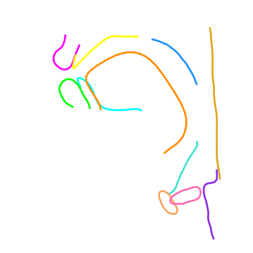
*Figure 1:Articulatory features used for phoneme recognition plus the upper incisor, which is the reference for the coordinate system.*

*(a)Adapter block*

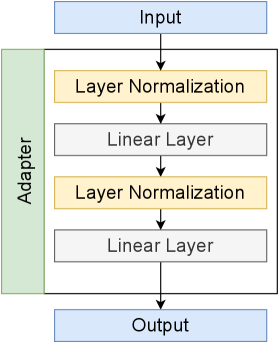
*(a)Adapter block*

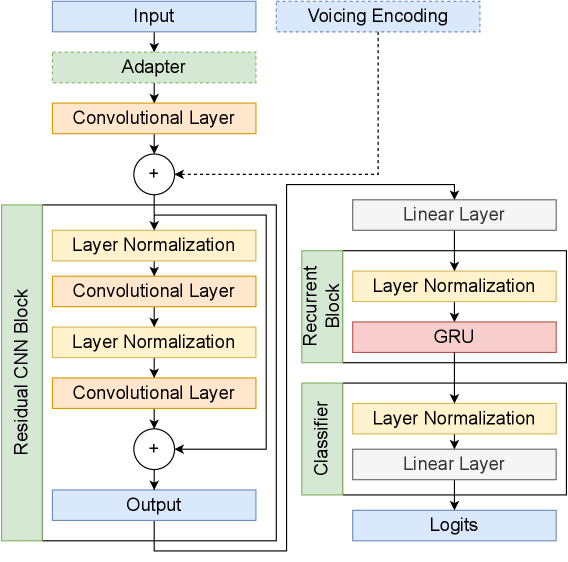
*(b)Phoneme recognizer architecture with one residual CNN block and one recurrent block*

*(a)Acoustic signal*

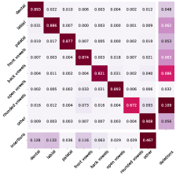
*(a)Acoustic signal*

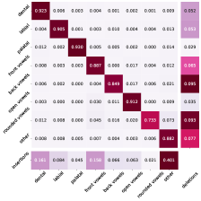
*(b)True articulatory features + voicing*

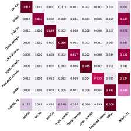
*(c)Model-free articulatory features + voicing*

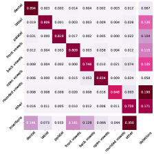
*(d)Autoencoder-based articulatory features + voicing*

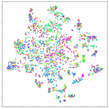
*(a)Acoustic signal*

*(a)Acoustic signal*

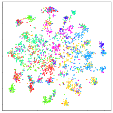
*(b)True articulatory features + voicing*

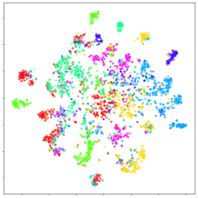
*(c)Model-free articulatory features + voicing*

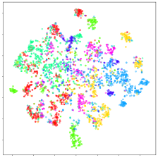
*(d)Autoencoder-based articulatory features + voicing*

---
**Usage Info**: 2210 tokens used.
**Generated at**: 2026-05-21 16:40:31

---

# 📚 Instrumental Text-to-Music Generation with Auxiliary Conditioning Branches

🚀 URL: https://arxiv.org/html/2605.21433

## 🌏 Abstract (원문)
Text-to-music generation has advanced rapidly, with modern autoregressive and diffusion-based models producing convincing music from natural-language prompts. However, much of this progress relies on large-scale training data and external pretraining, making it difficult to isolate which design choices remain effective when data and pretraining are controlled. We study this setting using a Diffusion Transformer backbone with lyric and timbre conditioning, adapted to an instrumental-only text-to-music task in which the auxiliary lyric and timbre branches receive only degenerate conditioning signals. Through controlled ablations, we find that models retrained without these branches score lower across AudioBox aesthetics, LLM-as-judge, and human MOS, and that reinvesting the saved parameters as additional DiT depth recovers only marginally. This suggests the auxiliary branches may act as training-time architectural anchors whose contribution goes beyond their explicit conditioning content. We validate the same model through comparisons with external instrumental baselines and through our submission to the ICME 2026 Academic Text-to-Music (ATTM) Grand Challenge, where our Performance submission ranked first under both the objective metrics and the subsequent organizer-administered MOS over 35 raters, attaining the highest overall MOS across all challenge submissions, while our Efficiency submission was a finalist that tied for second under the objective metrics.
## 🌏 Abstract (번역)
텍스트-음악 생성은 빠르게 발전하여, 현대의 자기회귀 및 확산 기반 모델들이 자연어 프롬프트로부터 설득력 있는 음악을 생성하고 있습니다. 그러나 이러한 발전의 상당 부분은 대규모 훈련 데이터와 외부 사전 훈련에 의존하며, 데이터와 사전 훈련이 통제될 때 어떤 설계 선택이 여전히 효과적인지 분리하기 어렵게 만듭니다. 우리는 가사 및 음색 조건화를 갖춘 확산 트랜스포머 백본을 사용하여 이 설정을 연구했으며, 보조 가사 및 음색 브랜치가 퇴화된 조건화 신호만 받는 기악 전용 텍스트-음악 작업에 맞게 조정했습니다. 통제된 제거 실험을 통해, 우리는 이 브랜치 없이 재훈련된 모델들이 AudioBox 미학, LLM-판사, 그리고 인간 MOS 전반에 걸쳐 더 낮은 점수를 받았으며, 절약된 매개변수를 추가 DiT 깊이로 재투자해도 미미하게만 회복된다는 것을 발견했습니다. 이는 보조 브랜치가 명시적인 조건화 내용 이상의 기여를 하는 훈련 시간 아키텍처 앵커 역할을 할 수 있음을 시사합니다. 우리는 외부 기악 기준선과의 비교 및 ICME 2026 학술 텍스트-음악(ATTM) 그랜드 챌린지 제출을 통해 동일한 모델을 검증했습니다. 여기서 우리의 성능(Performance) 제출은 객관적 지표와 35명 이상의 평가자가 참여한 주최자 주관 MOS 모두에서 1위를 차지하여 모든 챌린지 제출작 중 가장 높은 전체 MOS를 달성했으며, 우리의 효율성(Efficiency) 제출은 객관적 지표에서 공동 2위를 차지한 결선 진출작이었습니다.

## 🔍 Methods & Results
- 핵심 아키텍처로 ACE-STEP 1.5 (오픈소스 음악 DiT 모델)를 채택했으며, 이는 오디오 VAE, 텍스트 인코더, 소형 조건 인코더, DiT 디코더로 구성됩니다.
- 두 가지 스케일의 모델을 훈련했습니다: 500M 매개변수 제한의 99.8%를 사용하는 499M 효율성(Efficiency) 모델과 2.4B 성능(Performance) 모델.
- 오디오 VAE로는 48kHz 스테레오 오디오를 25Hz, 64채널 잠재 공간으로 매핑하는 AutoencoderOobleck을, 텍스트 인코더로는 1024차원 임베딩을 생성하는 Qwen3-Embedding-0.6B를 사용했습니다.
- ATTM 챌린지가 기악 전용이므로, 가사 브랜치에는 '[Instrumental]'이라는 단일 플레이스홀더 토큰을, 음색 브랜치에는 제로 텐서를 입력으로 제공하여 퇴화된 조건화 신호를 사용했습니다.
- 조건 인코더는 텍스트, 가사, 음색 세 가지 조건화 스트림을 추가 처리하여 교차 어텐션을 위한 단일 시퀀스로 압축하는 소형 트랜스포머 스택입니다.
- DiT 디코더는 교대하는 전체 및 슬라이딩 윈도우 어텐션 레이어, Grouped Query Attention, 타임스텝 조건화를 위한 Adaptive Layer Normalization, 스트라이드-2 컨볼루션을 포함한 패치 기반 입출력 프로젝션을 특징으로 하는 주요 생성 모델입니다.
- 제어된 제거 실험 결과, 가사 및 음색 보조 브랜치 없이 재훈련된 모델은 AudioBox 미학, LLM-판사, 인간 MOS 평가에서 더 낮은 점수를 받았으며, 절약된 매개변수를 DiT 깊이 증가에 재투자해도 성능 회복은 미미했습니다.
- 이는 보조 브랜치가 명시적인 조건화 내용 이상의 기여를 하는 '훈련 시간 아키텍처 앵커' 역할을 할 수 있음을 시사합니다.
- ICME 2026 학술 텍스트-음악(ATTM) 그랜드 챌린지에서 성능(Performance) 제출은 객관적 지표와 35명 이상의 평가자가 참여한 주최자 주관 MOS 모두에서 1위를 차지하여 모든 챌린지 제출작 중 가장 높은 전체 MOS를 달성했습니다.
- 효율성(Efficiency) 제출은 객관적 지표에서 공동 2위를 차지한 결선 진출작이었습니다.

## 🖼 Figures

*Figure 1:(a) Training and validation loss for both models over 120 epochs. (b) The generalization gap (val 
−
 train) remains stable, indicating controlled overfitting.*

*Figure 2:Sweep of CLAP against CFG on the Efficiency 499M model, evaluated with msclap on 
𝑛
=
100
 final-test prompts. CLAP rises monotonically up to CFG of about 5 and then plateaus within 
±
0.003
. Stars indicate the two Efficiency-track variants we submitted, CFG 7.0 and 8.0; the organizers selected CFG 8.0 for the official scoring. Both sit on the CLAP plateau.*

---
**Usage Info**: 3813 tokens used.
**Generated at**: 2026-05-21 16:40:59

---

# 📚 Linearly Constrained Deep Beamformer For Multi-Speaker Scenarios

🚀 URL: https://arxiv.org/html/2605.21141

## 🌏 Abstract (원문)
We propose a deep beamforming framework for enhancing target speaker(s) in multi-speaker environments. A deep neural network (DNN) is trained to estimate beamforming weights directly from noisy multichannel inputs while satisfying linear spatial constraints through an adaptive multi-term loss inspired by the augmented Lagrangian framework. The loss combines signal reconstruction with penalties that enforce a distortionless response toward the target and suppress the interference subspace. The model is further guided by the target relative transfer function (RTF) and the estimated interference subspace. The proposed model can direct a beam toward the target speaker while directing nulls toward the interfering sources, achieving superior overall enhancement performance compared with the classical LCMV beamformer constructed by the same estimated spatial signatures. Furthermore, compared with the LCMV beamformer, the proposed model produces more controlled sidelobes and improved background-noise attenuation.
## 🌏 Abstract (번역)
본 논문은 다중 화자 환경에서 목표 화자를 향상시키기 위한 딥 빔포밍 프레임워크를 제안합니다. 심층 신경망(DNN)은 증강 라그랑주 프레임워크에서 영감을 받은 적응형 다중 항 손실을 통해 선형 공간 제약을 만족시키면서, 잡음이 있는 다중 채널 입력으로부터 빔포밍 가중치를 직접 추정하도록 훈련됩니다. 이 손실 함수는 신호 재구성과 함께 목표 방향으로의 무왜곡 응답을 강제하고 간섭 부분 공간을 억제하는 페널티를 결합합니다. 이 모델은 목표 상대 전달 함수(RTF)와 추정된 간섭 부분 공간에 의해 추가적으로 안내됩니다. 제안된 모델은 간섭 소스 방향으로 널(null)을 지향하면서 목표 화자 방향으로 빔을 지향할 수 있으며, 동일하게 추정된 공간 서명을 사용하여 구성된 기존 LCMV 빔포머에 비해 우수한 전반적인 향상 성능을 달성합니다. 또한, LCMV 빔포머와 비교하여 제안된 모델은 더 잘 제어된 사이드로브와 향상된 배경 잡음 감쇠를 제공합니다.

## 🔍 Methods & Results
- 다중 채널 혼합 신호를 STFT 도메인에서 모델링하고, DNN 기반 빔포머 가중치(w(k))를 사용하여 관심 대상 신호의 선형 조합을 추정합니다.
- U-Net 아키텍처를 기반으로 하며, 목표 화자의 RTF 및 간섭 화자에 해당하는 간섭 부분 공간 추정치를 통해 공간적 안내를 통합합니다.
- 공간적 안내 정보(목표 RTF, 간섭 부분 공간)는 공유 로컬 어텐션 블록을 통해 다중 채널 혼합 신호와 융합되며, 결과 특징은 원본 혼합 신호와 연결되어 인코더 입력으로 사용됩니다.
- 화자의 정적 공간 서명(RTF 및 간섭 부분 공간) 추정을 위해 공분산 화이트닝(CW) 방법을 사용합니다.
- 손실 함수는 추정된 소스와 관심 대상 소스 조합 간의 SI-SDR을 최소화하며, 증강 라그랑주 프레임워크에서 영감을 받아 제약 조건을 가중 페널티로 통합합니다.
- 손실 함수는 대상 재구성, 원하는 방향으로의 무왜곡 응답 강제, 간섭 부분 공간으로의 널 스티어링을 공동으로 촉진합니다.
- 훈련 중에는 오라클 공간 정보(RTF, 간섭 RTF)를 사용하여 손실 함수를 최적화하며, 추론 시에는 추정된 목표 RTF 및 간섭 부분 공간이 네트워크 입력으로 제공되어 모델을 안내합니다.
- 제안된 모델은 동일하게 추정된 공간 서명으로 구성된 기존 LCMV 빔포머에 비해 우수한 전반적인 향상 성능을 달성합니다.
- LCMV 빔포머와 비교하여 제안된 모델은 더 잘 제어된 사이드로브와 향상된 배경 잡음 감쇠를 제공합니다.

## 🖼 Figures

*Fig. 1:Overview of the proposed beamforming network.*

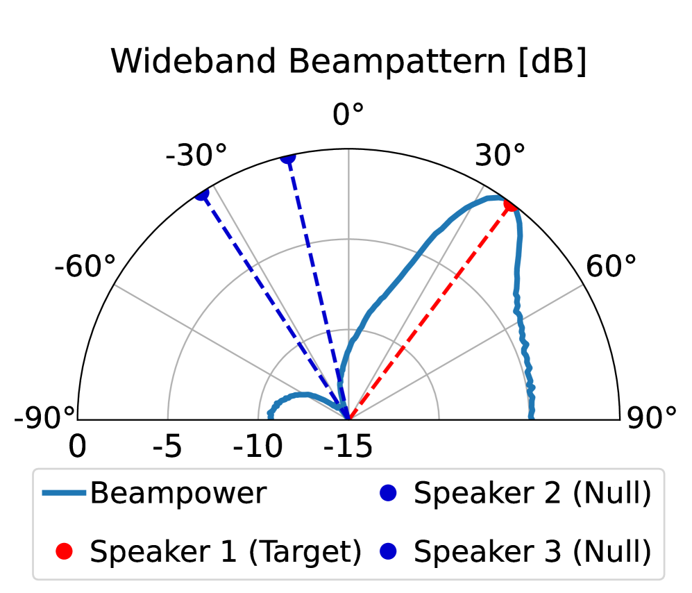
*(a)Estimated RTF*

*(a)Estimated RTF*

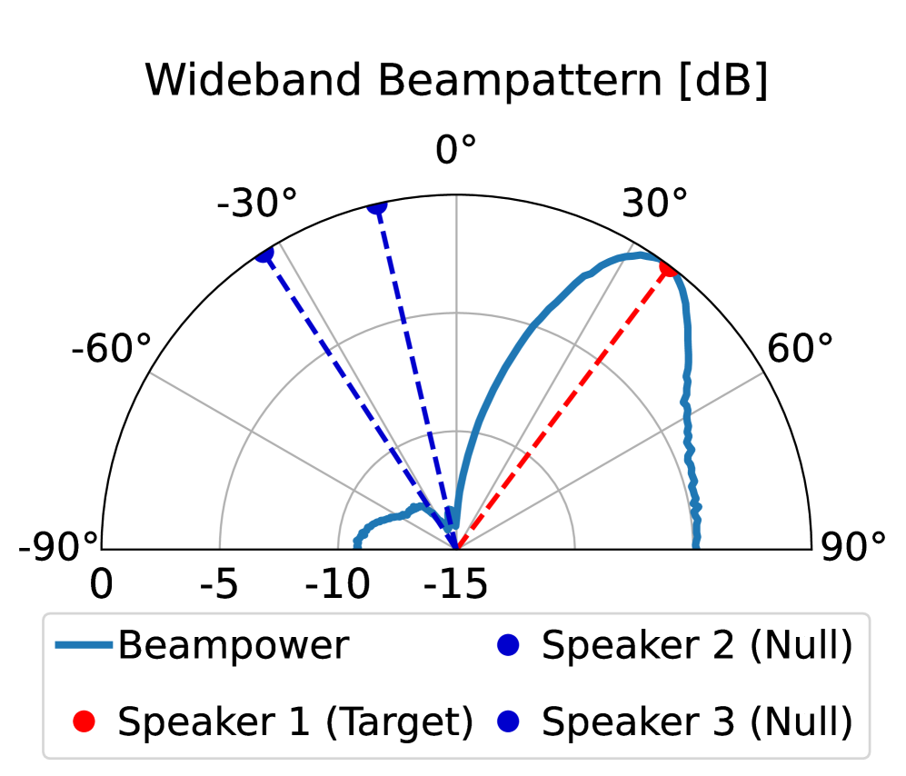
*(b)Oracle RTF*

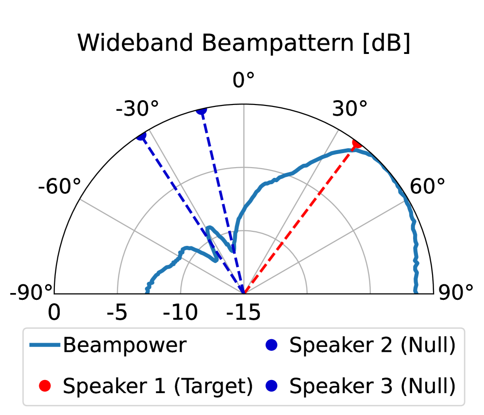
*(c)No RTF*

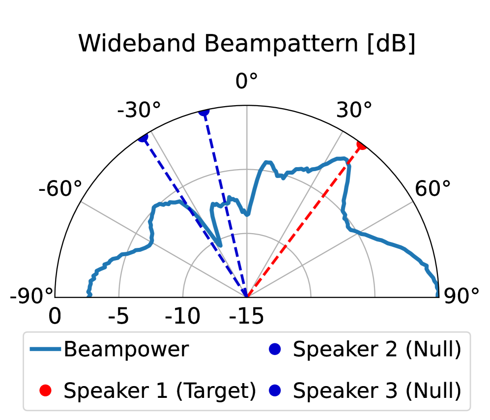
*(d)LCMV*

---
**Usage Info**: 3638 tokens used.
**Generated at**: 2026-05-21 16:41:08

---

# 📚 Codec-Robust Attacks on Audio LLMs

🚀 URL: https://arxiv.org/html/2605.20519

## 🌏 Abstract (원문)
Prior attacks on Audio Large Language Models (Audio LLMs) demonstrated that carefully crafted waveform-domain perturbations can force targeted adversarial outputs. As a defense mechanism against these attacks, real-world codec compression preprocessing has been studied to both detect and remove the perturbations. Yet no existing attack has demonstrated robustness against these compressions. We introduceCodecAttack, which optimizes a perturbation in a neural audio codec’s continuous latent space rather than directly perturbing the audio waveform. We show that the codec’s compression channel, which discards waveform perturbations, transmits perturbations crafted in its own latent space. To further harden the attack across real-world compression channels, we apply multi-bitrate straight-through Expectation-over-Transformation (EoT), all without modifying the target model. Across three realistic Audio LLM deployment scenarios and three target models,CodecAttackachieves an average 85.5% target-substring attack success rate (ASR) on Opus at moderate bitrates, while the waveform baseline trained with identical EoT hardening does not exceed 26% at any bitrate. The attack transfers to held-out codecs, reaching up to 100% ASR on MP3 and 84% on AAC-LC without retraining. A per-band energy analysis shows that the latent perturbation concentrates below 4 (4	extunderscore LF BANDS) can be exploited for attacks. We introduce CodecAttack, the first attack that crafts perturbations in the continuous latent space of a neural audio codec, demonstrating robustness against real-world audio compressions. This method leverages the codec's compression channel to transmit latent-space perturbations, which are robust to further compression. The attack is hardened using multi-bitrate straight-through Expectation-over-Transformation (EoT) without modifying the target model. CodecAttack achieves high attack success rates (ASR) across various Audio LLM deployment scenarios and target models, even after re-encoding with strong codecs like Opus, MP3, and AAC-LC. The analysis reveals that latent perturbations concentrate energy in frequency bands where codecs allocate more bits, making them difficult to remove by compression. This work highlights that lossy compression is not a reliable defense against sophisticated adversarial audio attacks and poses a practical threat to deployed Audio LLM systems.
## 🌏 Abstract (번역)
이전의 오디오 대규모 언어 모델(Audio LLM)에 대한 공격들은 신중하게 조작된 파형 도메인 교란이 표적화된 적대적 출력을 강제할 수 있음을 보여주었습니다. 이러한 공격에 대한 방어 메커니즘으로, 실제 코덱 압축 전처리가 교란을 감지하고 제거하기 위해 연구되었습니다. 그러나 기존의 어떤 공격도 이러한 압축에 대한 견고성을 입증하지 못했습니다. 우리는 오디오 파형을 직접 교란하는 대신 신경 오디오 코덱의 연속적인 잠재 공간에서 교란을 최적화하는 CodecAttack을 소개합니다. 우리는 파형 교란을 버리는 코덱의 압축 채널이 자체 잠재 공간에서 생성된 교란을 전송한다는 것을 보여줍니다. 실제 압축 채널 전반에 걸쳐 공격을 더욱 강화하기 위해, 우리는 대상 모델을 수정하지 않고 다중 비트레이트 스트레이트-스루 변환 기대치(EoT)를 적용합니다. 세 가지 현실적인 Audio LLM 배포 시나리오와 세 가지 대상 모델에서, CodecAttack은 중간 비트레이트의 Opus에서 평균 85.5%의 표적 부분 문자열 공격 성공률(ASR)을 달성했으며, 동일한 EoT 강화로 훈련된 파형 기준선은 어떤 비트레이트에서도 26%를 초과하지 못했습니다. 이 공격은 재훈련 없이도 미사용 코덱으로 전이되어 MP3에서는 최대 100%, AAC-LC에서는 84%의 ASR에 도달했습니다. 대역별 에너지 분석은 잠재 교란이 코덱이 가장 많은 비트를 할당하는 4kHz 미만에 집중되는 반면, 파형 기준선은 코덱이 버리는 더 높은 주파수로 퍼진다는 것을 보여줍니다. 이러한 결과는 손실 압축이 적대적 오디오에 대한 신뢰할 수 있는 방어가 아니며, 코덱 인식 공격이 배포된 Audio LLM 시스템에 실질적인 위협이 된다는 것을 입증합니다.

## 🔍 Methods & Results
- CodecAttack은 오디오 파형을 직접 교란하는 대신 신경 오디오 코덱의 연속적인 잠재 공간에서 교란을 최적화하는 새로운 공격 방법론을 제안한다.
- 코덱의 압축 채널이 파형 도메인 교란은 제거하지만, 잠재 공간에서 생성된 교란은 전송한다는 것을 입증했다.
- 실제 압축 채널에 대한 공격의 견고성을 높이기 위해, 대상 모델을 수정하지 않고 다중 비트레이트 스트레이트-스루 변환 기대치(EoT)를 적용했다.
- 세 가지 Audio LLM 배포 시나리오와 세 가지 대상 모델에서 CodecAttack은 중간 비트레이트의 Opus에서 평균 85.5%의 표적 부분 문자열 공격 성공률(ASR)을 달성했다.
- 동일한 EoT 강화로 훈련된 기존 파형 기반 공격은 어떤 비트레이트에서도 26%를 초과하지 못하여 CodecAttack의 우수성을 입증했다.
- CodecAttack은 재훈련 없이도 MP3에서 최대 100%, AAC-LC에서 84%의 ASR을 달성하며 미사용 코덱으로의 높은 전이성을 보였다.
- 대역별 에너지 분석 결과, 잠재 공간 교란은 코덱이 가장 많은 비트를 할당하는 4kHz 미만 주파수 대역에 에너지를 집중시키는 반면, 파형 기반 교란은 코덱이 버리는 고주파수 대역으로 에너지가 분산되는 것으로 나타났다.
- 이러한 결과는 손실 압축이 적대적 오디오 공격에 대한 신뢰할 수 있는 방어가 아니며, 코덱 인식 공격이 배포된 Audio LLM 시스템에 실질적인 위협이 됨을 시사한다.

## 🖼 Figures
![Figure 1:Overview of CodecAttack. A benign audio carrier is encoded into EnCodec’s continuous latent space and perturbed within a bounded budget (Step 1–2). During optimization (Step 3), the perturbed latent is decoded, compressed by Opus at a randomly sampled bitrate, and fed to the victim Audio LLM; the cross-entropy loss against the target command is backpropagated through the model, the codec via a straight-through estimator (STE), and the decoder to update the perturbation. After certain steps, the adversarial waveform is exported and evaluated on held-out codecs (Opus, MP3, AAC-LC) that the optimizer never saw.](../images/2026-05-21/2605.20519/2605.20519_fig0.png)
*Figure 1:Overview of CodecAttack. A benign audio carrier is encoded into EnCodec’s continuous latent space and perturbed within a bounded budget (Step 1–2). During optimization (Step 3), the perturbed latent is decoded, compressed by Opus at a randomly sampled bitrate, and fed to the victim Audio LLM; the cross-entropy loss against the target command is backpropagated through the model, the codec via a straight-through estimator (STE), and the decoder to update the perturbation. After certain steps, the adversarial waveform is exported and evaluated on held-out codecs (Opus, MP3, AAC-LC) that the optimizer never saw.*

*Figure 2:Threat model deployment scenarios. Each scenario targets a real-world Audio LLM application where the adversary injects a target command via adversarial audio. S1: a financial voice agent tricked into executing unauthorized actions. S2: an interview screening agent forced to output a favorable hiring verdict. S3: music-industry classifiers (AI-content detection, copyright matching) forced to produce benign labels.*

![Figure 3:Structural vs. adversarial spectral placement. Per-Bark fractional energy for three perturbation sources at matched norm: (A) Jacobian-derived decoder envelope (no optimization), (B) random latent draws (
𝜎
-matched, no adversarial objective), and (C) actual adversarial 
𝜹
 (
𝜖
=
1.0
). Sources A and B overlay band-for-band, both placing 92–93% of energy below 4 kHz, confirming that the sub-4 kHz confinement is a property of the decoder parameterization, not the optimizer. The adversarial 
𝜹
 shares this confinement but further concentrates into sub-400 Hz (42% vs. 21%), where codecs allocate the most bits.](../images/2026-05-21/2605.20519/2605.20519_fig2.png)
*Figure 3:Structural vs. adversarial spectral placement. Per-Bark fractional energy for three perturbation sources at matched norm: (A) Jacobian-derived decoder envelope (no optimization), (B) random latent draws (
𝜎
-matched, no adversarial objective), and (C) actual adversarial 
𝜹
 (
𝜖
=
1.0
). Sources A and B overlay band-for-band, both placing 92–93% of energy below 4 kHz, confirming that the sub-4 kHz confinement is a property of the decoder parameterization, not the optimizer. The adversarial 
𝜹
 shares this confinement but further concentrates into sub-400 Hz (42% vs. 21%), where codecs allocate the most bits.*

*Figure 4:Codec-EoT ablation (S3a, Qwen2-Audio, 
𝜖
=
1.0
, 
𝑛
=
40
). Blue: codec-robust multi-bitrate EoT. Red: no EoT (clean-channel objective only). Labels show the ASR drop from removing EoT. The dotted line separates in-distribution Opus channels (left) from held-out MP3 and AAC-LC (right). Without EoT, Opus 
≤
32 kbps collapses to 0% and AAC-LC 64k drops by 32.5 pp.*

*Figure 5:Success counts (out of 3 carriers) for Qwen2-Audio at 
𝜖
=
1.0
 across target word count and Opus bitrate. The attack saturates at 
3
/
3
 for 
𝑤
≤
8
 at all bitrates and degrades gradually at 
𝑤
=
15
–
20
 before collapsing at 
𝑤
=
32
, where PGD loss increases 
∼
5
×
 (from 0.011 to 0.052).*

![Figure 6:EnCodec decoder energy by latent dimension and Bark band. Each row is one of the 128 latent dimensions; color indicates fractional output energy in each Bark band, computed from the decoder Jacobian 
∂
𝐷
/
∂
𝑧
. All dimensions peak in bands 12–14 (
≈
1.8–2.5 kHz) with negligible energy above 4 kHz, showing that the decoder has no basis function pointing at the high band. A latent-space perturbation is therefore structurally confined to the low-frequency region regardless of the adversarial objective.](../images/2026-05-21/2605.20519/2605.20519_fig5.png)
*Figure 6:EnCodec decoder energy by latent dimension and Bark band. Each row is one of the 128 latent dimensions; color indicates fractional output energy in each Bark band, computed from the decoder Jacobian 
∂
𝐷
/
∂
𝑧
. All dimensions peak in bands 12–14 (
≈
1.8–2.5 kHz) with negligible energy above 4 kHz, showing that the decoder has no basis function pointing at the high band. A latent-space perturbation is therefore structurally confined to the low-frequency region regardless of the adversarial objective.*

*Figure 7:Per-Bark fractional perturbation energy on speech vs. music carriers. Music concentrates 1.4
×
 more 
𝛿
 energy below 400 Hz than speech; above 4 kHz the two distributions are statistically indistinguishable.*

*Figure 8:Perturbation survival through Opus at 16–128 kbps. Top: cosine similarity between pre- and post-codec perturbations. Bottom: magnitude ratio 
‖
𝛿
post
‖
/
‖
𝛿
pre
‖
. Columns split by frequency region. The two attacks are preserved identically within each band.*

*Figure 9:Spectral placement of latent vs. waveform perturbations at matched SNR (
≈
5.8 dB). Left: fractional perturbation energy per Bark band. The latent attack concentrates 33.2% of energy below 400 Hz; the waveform attack places 29.9% above 4 kHz (Spearman 
𝜌
=
0.017
). Right: per-band energy ratio (latent 
÷
 waveform, log scale) with the Opus 16 kbps narrowband cutoff at 
∼
4 kHz.*

---
**Usage Info**: 10190 tokens used.
**Generated at**: 2026-05-21 16:41:51

---

# 📚 Let EEG Models Learn EEG

🚀 URL: https://arxiv.org/html/2605.21280

## 🌏 Abstract (원문)
High-fidelity EEG generation is critical for alleviating data scarcity and addressing privacy constraints in large-scale neural modeling. Despite recent progress, most existing approaches formulate EEG generation via discrete denoising objectives, which inadequately reflect the inherently continuous temporal dynamics and spectral structure of neural activity. As a result, these methods often struggle to preserve long-range temporal dependencies and exhibit mismatches in the spectral and temporal structure of the generated signals. In this work, we argue that effective EEG generation requires models that operate directly on the continuous evolution of neural signals. We introduceJust EEG Transformer (JET), a generative framework based on conditional flow matching that models EEG as raw sequences evolving along continuous trajectories. By learning a smooth vector field that transports noise to the EEG data distribution, JET captures temporal continuity and transient dynamics without relying on discretized denoising schemes or domain-specific representations. To ensure that the learned dynamics remain consistent with key properties of EEG signals, we introduce principled constraints that preserve spectral structure, temporal stationarity, and signal-level statistics. Across three large-scale benchmarks, JET consistently achieves state-of-the-art performance, reducing TS-FID by over 40% compared to strong baselines. Extensive analyses show that JET captures key structural properties of neural dynamics, providing a scalable and principled approach to EEG generation. Project page:https://y-research-sbu.github.io/JET/.
## 🌏 Abstract (번역)
고충실도 뇌전도(EEG) 생성은 대규모 신경 모델링에서 데이터 부족을 완화하고 개인 정보 보호 제약을 해결하는 데 중요합니다. 최근 발전에도 불구하고, 대부분의 기존 접근 방식은 이산적인 노이즈 제거 목표를 통해 EEG 생성을 공식화하며, 이는 신경 활동의 본질적으로 연속적인 시간 역학과 스펙트럼 구조를 부적절하게 반영합니다. 결과적으로 이러한 방법은 장거리 시간 종속성을 보존하는 데 어려움을 겪고 생성된 신호의 스펙트럼 및 시간 구조에서 불일치를 보이는 경우가 많습니다. 본 연구에서는 효과적인 EEG 생성을 위해서는 신경 신호의 연속적인 진화에 직접적으로 작동하는 모델이 필요하다고 주장합니다. 우리는 조건부 흐름 매칭(conditional flow matching)을 기반으로 하는 생성 프레임워크인 Just EEG Transformer (JET)를 소개하며, 이는 EEG를 연속적인 궤적을 따라 진화하는 원시 시퀀스로 모델링합니다. 노이즈를 EEG 데이터 분포로 전달하는 부드러운 벡터 필드를 학습함으로써, JET는 이산화된 노이즈 제거 방식이나 도메인별 표현에 의존하지 않고 시간적 연속성과 과도기적 역학을 포착합니다. 학습된 역학이 EEG 신호의 주요 특성과 일관성을 유지하도록 보장하기 위해, 스펙트럼 구조, 시간적 정상성 및 신호 수준 통계를 보존하는 원칙적인 제약 조건을 도입합니다. 세 가지 대규모 벤치마크에서 JET는 강력한 기준선과 비교하여 TS-FID를 40% 이상 감소시키며 일관되게 최첨단 성능을 달성합니다. 광범위한 분석은 JET가 신경 역학의 주요 구조적 특성을 포착하여 EEG 생성에 확장 가능하고 원칙적인 접근 방식을 제공함을 보여줍니다. 프로젝트 페이지: https://y-research-sbu.github.io/JET/.

## 🔍 Methods & Results
- JET(Just EEG Transformer)는 조건부 흐름 매칭(conditional flow matching)과 트랜스포머 백본을 결합하여 EEG 생성을 연속적인 동적 프로세스로 모델링하는 흐름 기반 생성 프레임워크이다.
- JET는 이산화된 노이즈 스케줄을 피하고, 단순한 사전 분포(표준 가우시안)에서 EEG 데이터 분포로 확률 밀도를 전달하는 시간 의존적 벡터 필드를 학습한다.
- 모델은 노이즈가 있는 상태(x_t), 시간(t), 클래스 레이블(c)을 입력으로 받아 벡터 필드를 예측하며, 추론 시 ODE를 풀어 EEG 샘플을 생성한다.
- JET 아키텍처는 다채널 EEG를 원시 연속 시퀀스로 직접 모델링하며, 시간-주파수 변환이나 사전 정의된 인접 행렬과 같은 수작업 특징 추출을 피한다.
- 패치 기반 토큰화 전략을 사용하여 EEG 세그먼트의 시간 축을 비겹치는 패치로 나누고, 채널 아이덴티티를 유지하며 임베딩하여 입력 토큰 시퀀스를 생성한다.
- 트랜스포머 백본은 멀티 헤드 셀프 어텐션과 피드 포워드 레이어로 구성되며, DiT 및 JiT를 따라 적응형 레이어 정규화를 통해 확산 시간(t)과 클래스 레이블(c)과 같은 조건부 정보를 주입한다.
- 실제 EEG 데이터셋의 심각한 클래스 불균형을 완화하기 위해, 각 클래스의 샘플 수에 반비례하는 샘플링 확률을 할당하는 적응형 클래스 균형 샘플링 전략을 사용한다.
- EEG 신호의 특성을 보존하기 위해 세 가지 원칙적인 제약 조건을 도입한다: L2 손실 대신 라플라시안 사전(Laplacian prior)을 가정하는 L1 재구성 손실을 사용하여 이상치에 대한 강건성을 높인다.
- 생성된 신호의 첫 번째 및 두 번째 모멘트(평균, 표준 편차)가 실제 EEG 데이터와 일치하도록 통계적 일관성을 강제하여 진폭 통계의 드리프트를 방지한다.
- 스펙트럼 평활도를 보존하기 위해 시간적 총 변동(temporal total variation) 정규화기를 적용하고, 파형 형태를 포착하기 위해 피어슨 상관 계수를 최대화하여 시공간 구조를 장려한다.
- 세 가지 대규모 벤치마크에서 JET는 강력한 기준선 대비 TS-FID를 40% 이상 감소시키며 최첨단 성능을 달성했고, 신경 역학의 주요 구조적 특성을 포착함을 입증했다.

## 🖼 Figures

*Figure 1:Toy comparison of generative modeling paradigms. We visualize the learned distributions on three different manifolds. GANs map latent noise directly to data space, diffusion models rely on stochastic denoising dynamics, while flow matching learns a smooth time-dependent vector field whose integral curves realize optimal transport from a dispersed source to the target distribution.*

*Figure 2:Illustration of JET pipeline. The model generates multi-channel EEG by learning a continuous vector field 
𝑣
​
(
𝑥
𝑡
,
𝑡
)
 via flow matching, conditioned on pathological states and regularized by structure-preserving constraints that encode spectral, temporal, and statistical properties of EEG signals.*

*Figure 3:Evaluation of spectral structure. JET accurately captures the 
1
/
𝑓
𝜒
 spectral scaling and prominent 
𝛼
-band peaks, mitigating the spectral bias that suppresses high-frequency components in prior methods.*

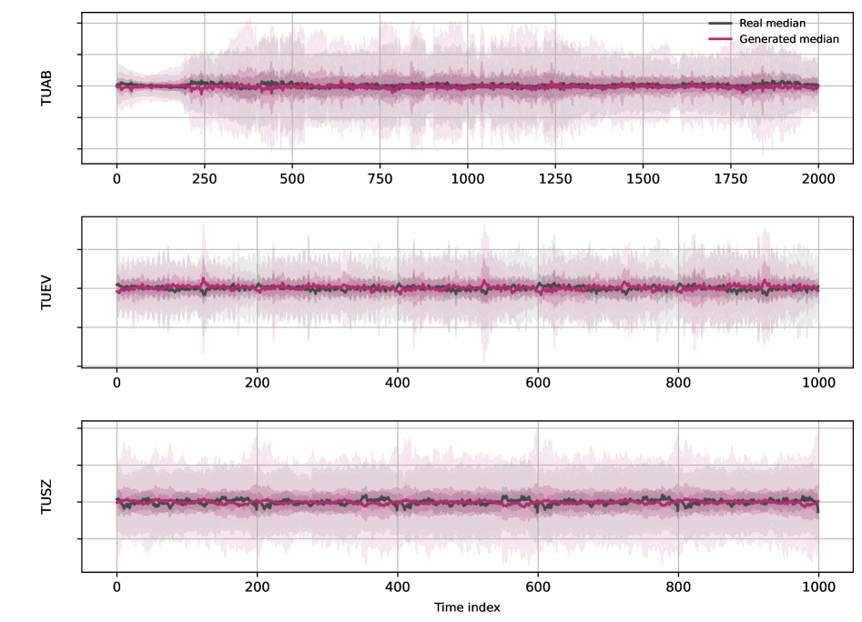
*Figure 4:Evaluation of temporal dynamics. Temporal evolution of signal amplitude distributions. JET captures non-stationary energy fluctuations over time while maintaining stable amplitude statistics, avoiding temporal drift and variance collapse.*

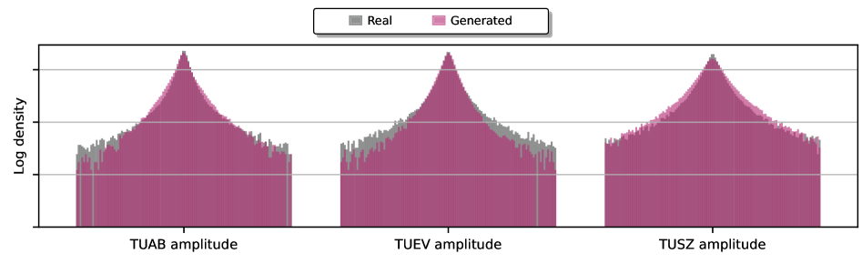
*Figure 5:Analysis of amplitude distributions. Log-density histograms confirm that JET accurately reconstructs the non-Gaussian, heavy-tailed distributions of raw EEG, effectively covering the diverse amplitude ranges of pathological recordings.*

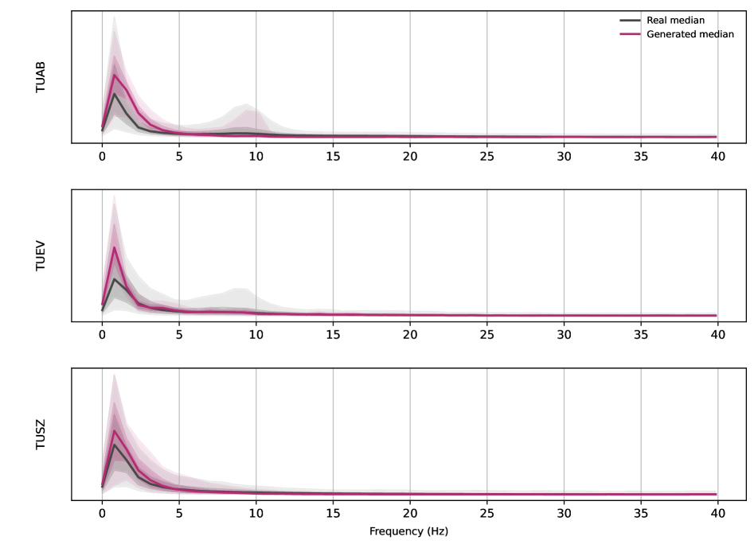
*Figure 6:Analysis of population diversity. The extensive overlap in spectral variance envelopes confirms that JET captures the complex variances of the population, avoiding the mode collapse typical of Gaussian-based priors.*

*Figure 7:Illustration of JET architecture. The model processes raw EEG via a patch-based Transformer backbone. Input signals are tokenized, processed through stacked self-attention layers to capture spatiotemporal dependencies, and reconstructed to predict the target vector field.*

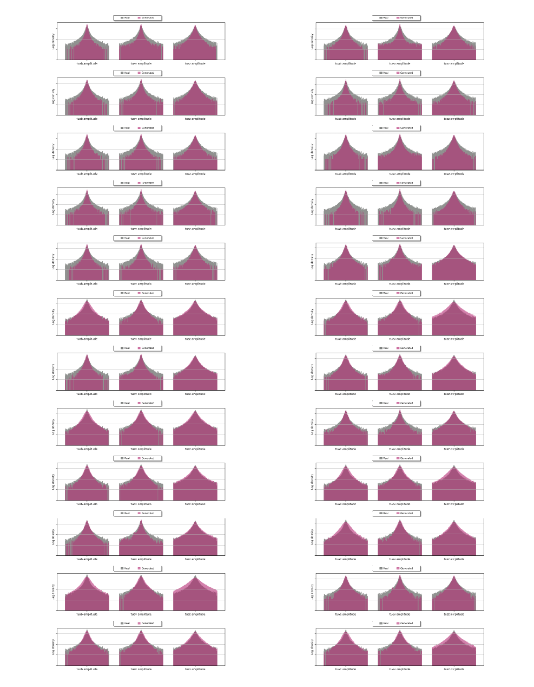
*Figure 8:Gaussian noise: amplitude distribution. The generated signals closely match the ground truth log-density histograms, effectively capturing the heavy-tailed distribution of EEG amplitudes across all datasets.*

*Figure 9:Gaussian noise: power spectral density. The model accurately reconstructs the 
1
/
𝑓
 spectral slope and distinct oscillatory peaks, demonstrating high spectral fidelity.*

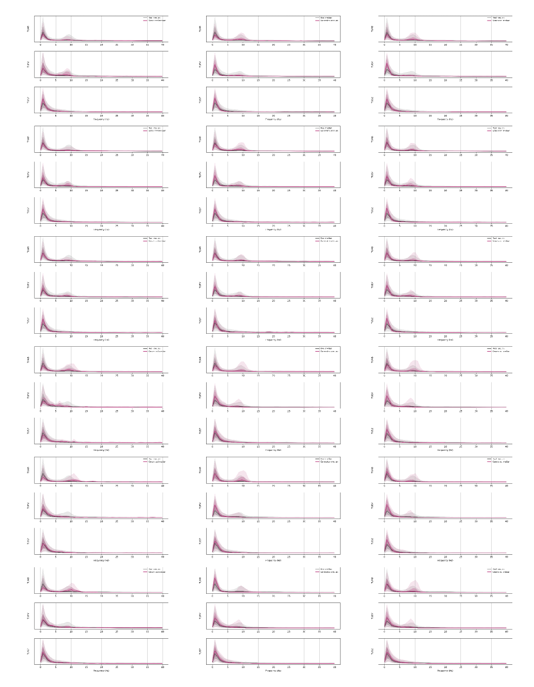
*Figure 10:Gaussian noise: spectral distribution stability. The shaded percentile bands of the generated spectra overlap tightly with the real data, indicating that JET captures the full diversity of population-level variance.*

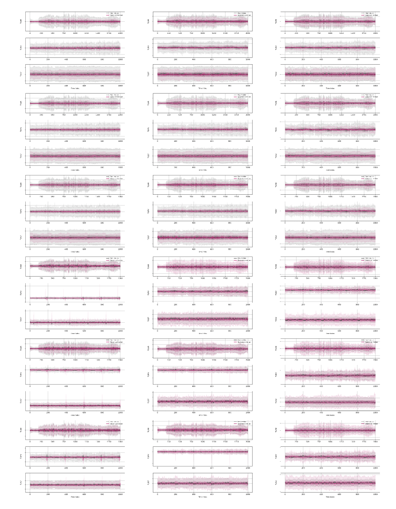
*Figure 11:Gaussian noise: temporal stationarity. Z-normalized temporal envelopes exhibit stable, non-stationary variance dynamics that mirror the natural evolution of biological signals without drift.*

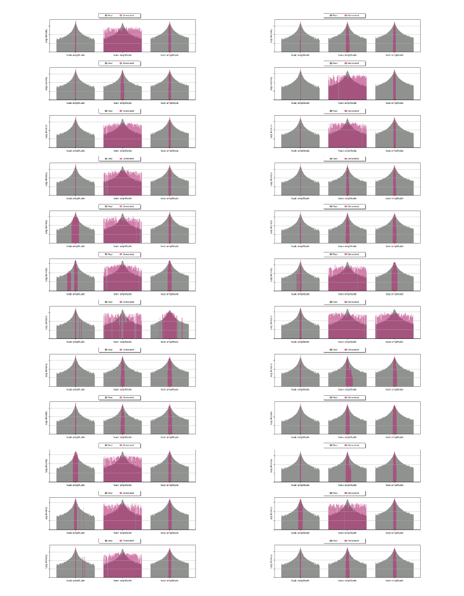
*Figure 12:Zero noise: amplitude distribution. Initializing with zero noise leads to severe mode collapse, visualized as sharp, unnatural spikes in the histograms and a failure to cover the marginal distribution.*

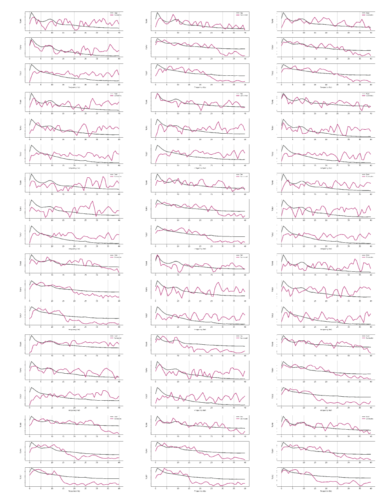
*Figure 13:Zero noise: power spectral density. The spectra exhibit significant distortion, with flattened slopes and mismatched energy levels, confirming the inability to model scale-free dynamics from a singularity.*

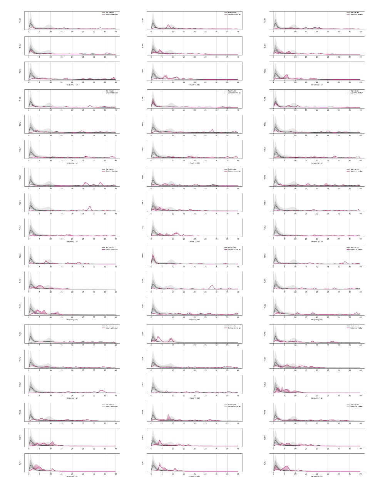
*Figure 14:Zero noise: spectral distribution stability. The generated variance bands are either significantly collapsed (too narrow) or distorted, failing to represent the natural spectral diversity of the dataset.*

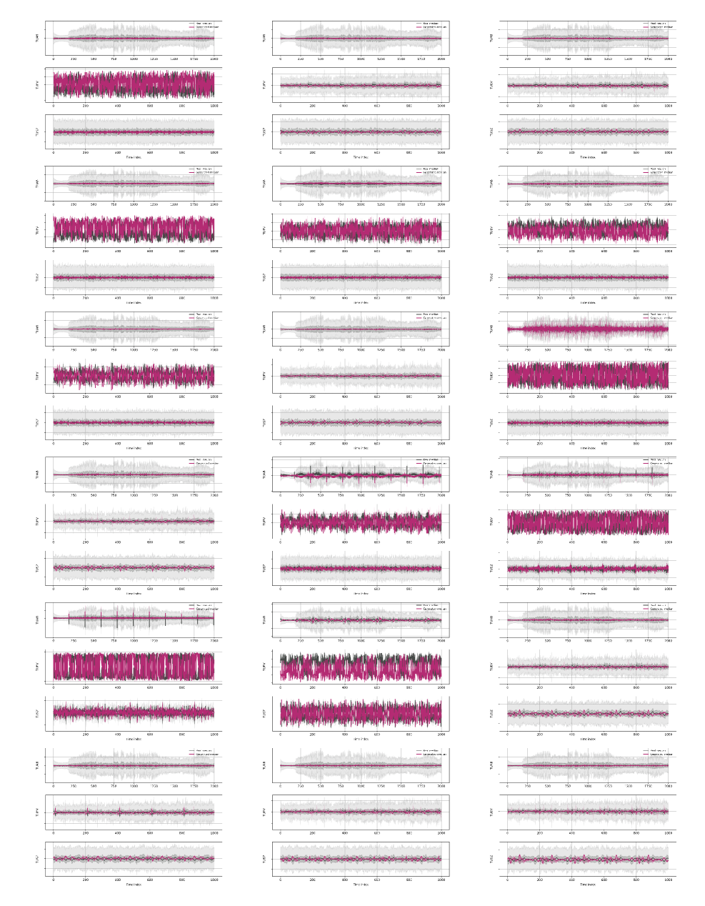
*Figure 15:Zero Noise: temporal stationarity. The temporal traces display erratic fluctuations or flat-lining, reflecting the failure of the flow trajectory to evolve into valid temporal patterns.*

---
**Usage Info**: 4342 tokens used.
**Generated at**: 2026-05-21 16:42:07

---

# 📚 Thinking-while-speaking: A Controlled, Interleaved Reasoning Method for Real-Time Speech Generation

🚀 URL: https://arxiv.org/html/2605.20946

## 🌏 Abstract (원문)
Thethinking-while-speakingparadigm aims to make AI communication more human. A key challenge is maintaining fluent speech while performing deep reasoning. Our method,InterRS, tackles this by inserting reasoning steps only during natural speech generation. This requires high-quality data where reasoning and speech are precisely aligned, and the length ratio are under controlled. We introduce a novel pipeline to generate such seamlessly interleaved audio data. To train our model, we combine interleaved SFT with refined data and reinforcement learning with two new rewards: aTA-Balance Rewardto manage timing and thinking-answer ratio, and aLinguistic Quality Rewardto refine expression. Experiments show our approach achieves13%better performance on mathmatical and logic benchmarks whilegenerating instant responselike a spoken-language instruct model which outputs fast CoT response. Furthermore, our method generates more natural and fluent answers than prior methods.
## 🌏 Abstract (번역)
사고-발화(thinking-while-speaking) 패러다임은 AI 커뮤니케이션을 더욱 인간적으로 만드는 것을 목표로 합니다. 핵심 과제는 깊은 추론을 수행하면서도 유창한 발화를 유지하는 것입니다. 우리의 방법인 InterRS는 자연스러운 발화 생성 중에만 추론 단계를 삽입하여 이 문제를 해결합니다. 이를 위해서는 추론과 발화가 정확하게 정렬되고 길이 비율이 제어되는 고품질 데이터가 필요합니다. 우리는 이러한 원활하게 교차된 오디오 데이터를 생성하기 위한 새로운 파이프라인을 소개합니다. 모델을 훈련하기 위해, 우리는 정제된 데이터와 교차된 SFT(Supervised Fine-Tuning)를 결합하고, 두 가지 새로운 보상(시간 및 사고-응답 비율을 관리하는 TA-Balance Reward와 표현을 개선하는 Linguistic Quality Reward)을 사용하여 강화 학습을 수행합니다. 실험 결과, 우리의 접근 방식은 수학 및 논리 벤치마크에서 13% 더 나은 성능을 달성하는 동시에 빠른 CoT(Chain-of-Thought) 응답을 출력하는 음성 언어 지시 모델처럼 즉각적인 응답을 생성합니다. 또한, 우리의 방법은 이전 방법들보다 더 자연스럽고 유창한 답변을 생성합니다.

## 🔍 Methods & Results
- InterRS는 추론 정확도와 상호작용 지연 시간 간의 격차를 해소하기 위해 사고(Ti)와 답변(Ai) 세그먼트를 교차하여 추론을 수행하는 '교차 추론 프레임워크'를 도입한다.
- Ti(사고 세그먼트)는 내부 논리적 추론을 위한 배경 추론 역할을 하며, Ai(답변 세그먼트)는 이전 사고 세그먼트의 핵심 결론을 요약하여 즉각적인 재생을 위해 TTS 엔진으로 스트리밍되는 전경 재생 역할을 한다.
- Ai와 Ti 세그먼트를 교차함으로써, Ti+1의 생성 시간이 Ai의 재생 시간에 가려져 복잡한 추론의 계산 지연 시간을 효과적으로 숨기면서 원활한 상호작용 흐름을 달성한다.
- 고품질 추론 및 유창한 발화를 지원하는 데이터셋 구축을 위해 3단계 데이터 합성 파이프라인을 개발했다: 1) 논리적 검증 및 구어체 요약 (답변 부분: 논리 무결성 검증 및 구어체 요약; 질문 부분: 대화형 질의로 비상징화 및 오디오 변환), 2) 의미 단위 분할 (논리적 완전성과 자연스러운 발화 중단을 기반으로 요약을 작은 발화 단위로 분할), 3) 제어된 비율의 사고 내용 구성 (각 Ai에 대해 Ti를 합성하고, 온디바이스 추론 속도에서 다음 추론 블록 Ti+1의 생성이 현재 Ai의 오디오 재생 시간으로 완전히 가려지도록 4:1의 사고:답변 길이 비율 제약을 적용).
- 모델은 강화 학습 전에 '지도 미세 조정(SFT)' 단계를 거쳐 교차 추론 형식의 구조적 요구사항에 모델의 출력 분포를 맞추고, 단일 토큰 플래그(<|thinking|>, <|answer|>)를 사용하여 상태 전환을 표시함으로써 시퀀스 오버헤드를 최소화한다.
- 출력 품질 최적화를 위해 'GRPO(Group Relative Policy Optimization)' 알고리즘을 사용하며, 이는 추가 Critic 네트워크 없이 후보 출력 그룹을 샘플링하고 상대적 보상을 계산하여 정책 업데이트를 가능하게 한다.
- 전체 보상 함수(R_total)는 'TA-Balance Reward', 'Accuracy Reward', 'Linguistic Quality Reward'의 가중 합으로 구성된다.
- TA-Balance Reward (R_TA)는 교차 추론 토폴로지 준수를 강제하고, 형식 위반 시 0 보상을 부여하며, 사고 세그먼트의 길이에 대한 2차 페널티를 도입하여 과도한 사고를 방지하고 오디오 재생 시간 내에 사고 세그먼트가 맞도록 한다.
- Accuracy Reward (R_Acc)는 논리적 정확성에 대한 엄격한 제약으로, 최종 예측이 정답과 일치하면 1, 그렇지 않으면 0을 부여한다.
- Linguistic Quality Reward (R_LQ)는 분리된 발화 세그먼트 간의 의미적 단절을 방지하고 최종 연결된 응답의 일관성을 유지하기 위해 참조 모델의 언어적 사전 지식을 활용하여 생성된 시퀀스의 로그-우도(log-likelihood)를 측정한다. 이 보상은 정확한 최종 답변에 도달한 샘플에만 적용되어 모델이 논리적 정확성을 희생하면서 유창성을 최적화하는 것을 방지한다.

## 🖼 Figures

*Figure 1: Our framework, InterRS, integrates reasoning steps within temporal gaps in speech generation, enabling seamless thought-speech alignment. It advances beyond traditional interleaved methods by jointly optimizing fluency and accuracy through two novel reward functions, achieving improved performance on reasoning tasks and perceived response naturalness.*

![Figure 2: Data Pipeline: (The top line) For questions, the original question first undergoes desymbolization and colloquial normalization to improve its suitability for spoken delivery, followed by speech synthesis via TTS. (The bottom line) For answers, an initial accuracy validation is performed, after which the content is condensed into a summary. This summary is then segmented into semantically coherent units. These segments are subsequently utilized to retrieve corresponding reasoning steps paired with their original answer segments. Finally, the matched thinking-answer pairs are synthesized into an interleaved reasoning response, while simultaneous linguistic refinement ensures the overall coherence and quality of the final output.](../images/2026-05-21/2605.20946/2605.20946_fig1.png)
*Figure 2: Data Pipeline: (The top line) For questions, the original question first undergoes desymbolization and colloquial normalization to improve its suitability for spoken delivery, followed by speech synthesis via TTS. (The bottom line) For answers, an initial accuracy validation is performed, after which the content is condensed into a summary. This summary is then segmented into semantically coherent units. These segments are subsequently utilized to retrieve corresponding reasoning steps paired with their original answer segments. Finally, the matched thinking-answer pairs are synthesized into an interleaved reasoning response, while simultaneous linguistic refinement ensures the overall coherence and quality of the final output.*

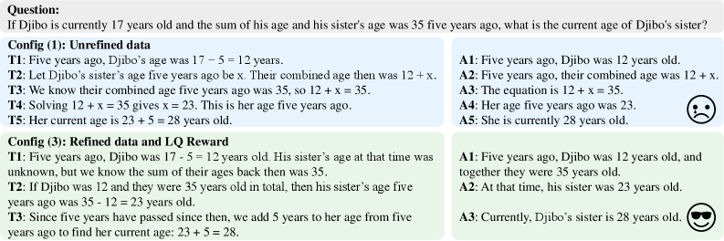
*Figure 3: Comparison of responses from Configuration (1) and Configuration (3) for a multi-step reasoning task.*

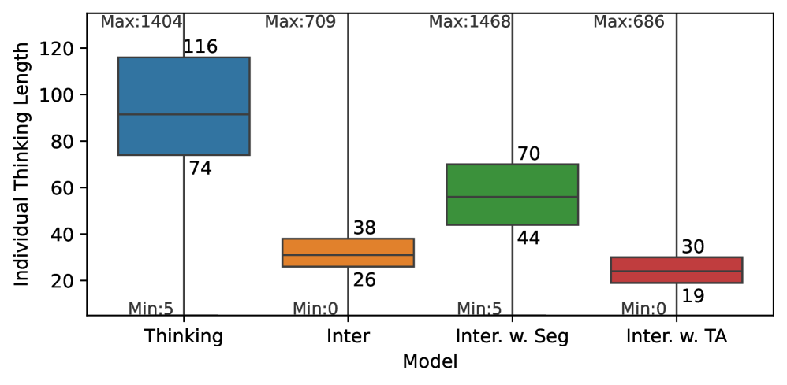
*Figure 4:Distribution of individual thinking segment lengths across different model configurations.*

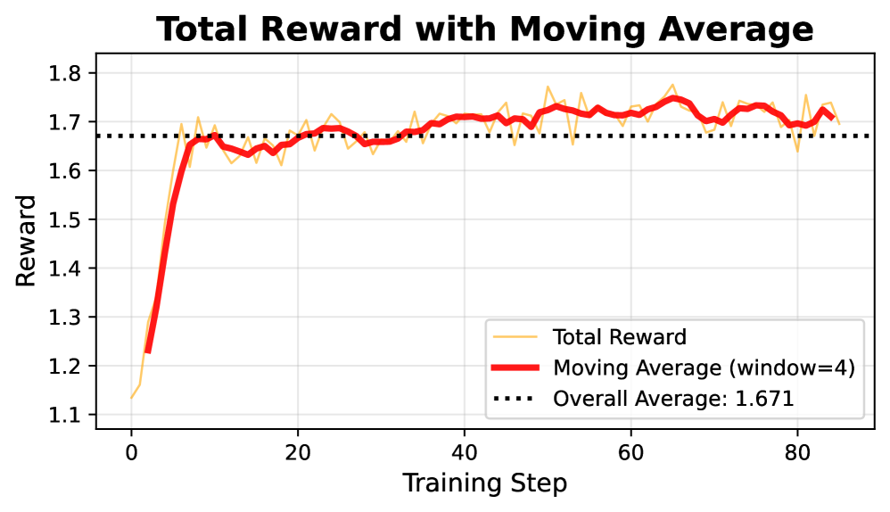
*Figure 5: Rewards of our InterRS in training process.*

---
**Usage Info**: 4140 tokens used.
**Generated at**: 2026-05-21 16:42:19

---

