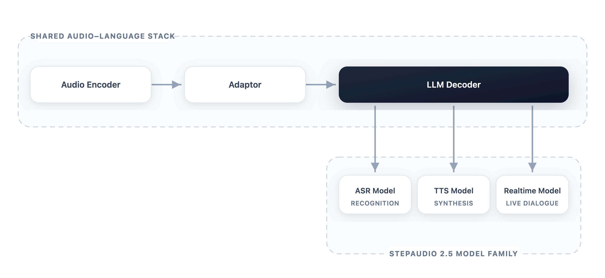
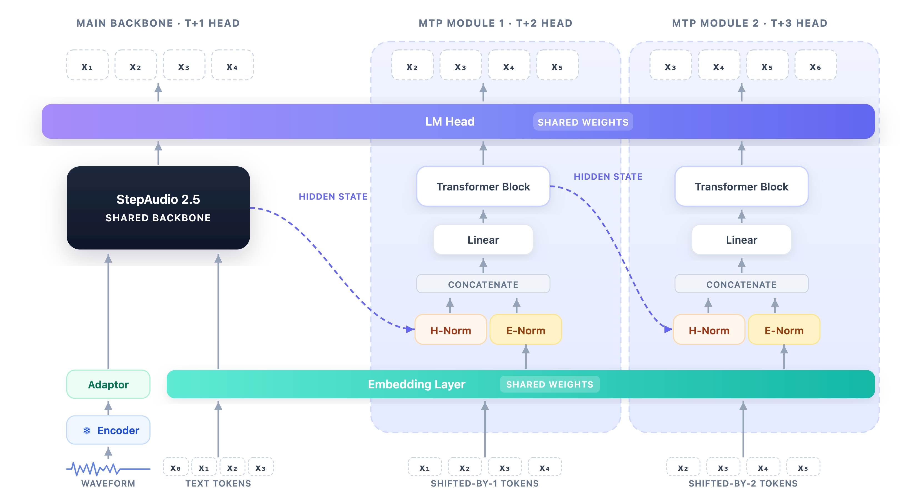
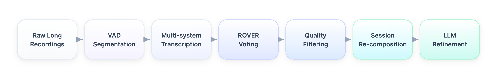
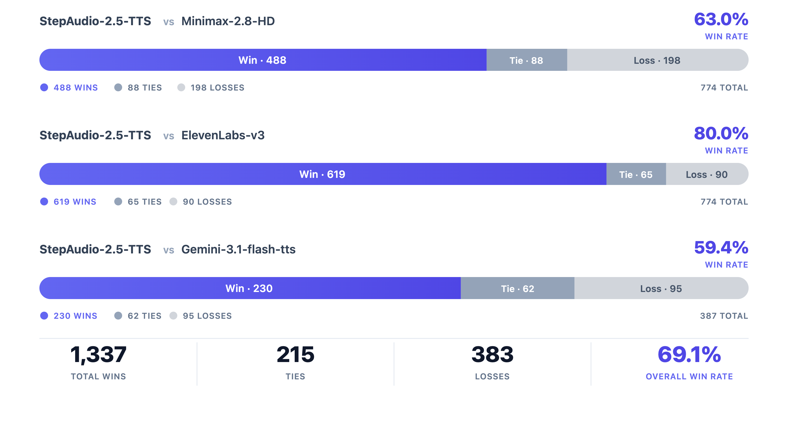
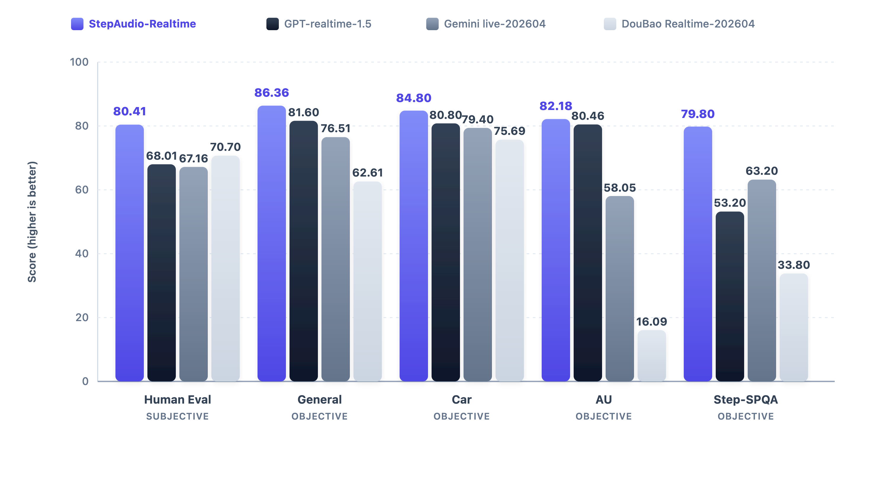
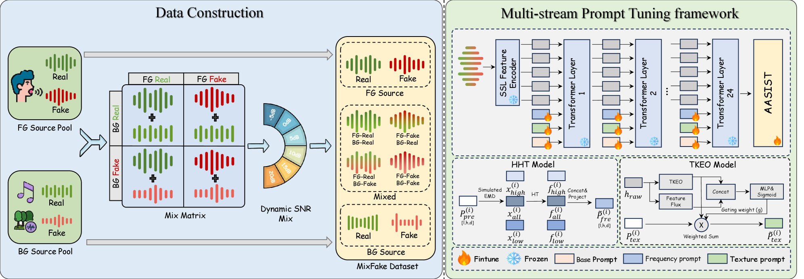
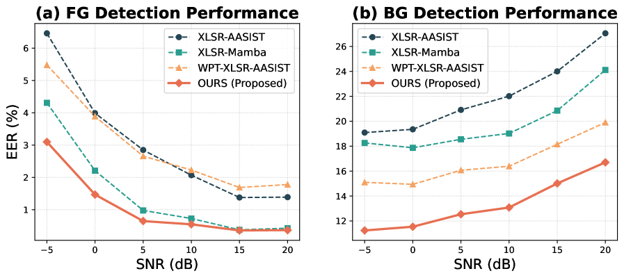

# 🚩 (2026-05-25) Scholar Inbox 추천 논문 

# 📚 StepAudio 2.5 Technical Report

🚀 URL: https://arxiv.org/html/2605.23463

## 🌏 Abstract (원문)
Unified audio-language modeling has emerged as a prominent trend in modern speech systems, promising to bring the reasoning capabilities of large language models to auditory tasks. However, existing unified foundations often struggle to match the depth of specialized systems across automatic speech recognition (ASR), text-to-speech synthesis (TTS), and realtime spoken interaction. Bridging this gap remains an open challenge. This report presents StepAudio 2.5, a unified audio-language foundation model that matches or exceeds specialized systems across all three capabilities.Rather than treating these tasks as architecturally distinct, we operate on the premise that once text and audio share a multimodal representational space, task specialization becomes a matter of operational regimes: data construction, optimization targets, and decoding constraints.Guided by this insight, we advance the post-training paradigm from standard supervised learning to task-tailored Reinforcement Learning from Human Feedback (RLHF), using it as the primary mechanism to define complex optimization targets. We leverage this RLHF-centric alignment, alongside specialized decoding, to shape a shared backbone into three distinct operational modes. Concretely, the ASR branch advances transcription efficiency via verifiable multi-token decoding; the TTS branch achieves controllable, expressive synthesis through preference-based RLHF and context-rich supervision; and the Realtime branch realizes low-latency, persona-consistent dialogue via generative reward modeling within an RLHF framework. On standard benchmarks, StepAudio 2.5 achieves state-of-the-art results across ASR, TTS, and Realtime, demonstrating that a singular audio-language foundation can successfully internalize the distinct deployment objectives of speech understanding, generation, and live interaction.
## 🌏 Abstract (번역)
통합 오디오-언어 모델링은 현대 음성 시스템에서 중요한 추세로 부상했으며, 대규모 언어 모델의 추론 능력을 청각 작업에 도입할 것을 약속합니다. 그러나 기존의 통합 기반 모델들은 자동 음성 인식(ASR), 텍스트 음성 변환(TTS), 실시간 음성 상호작용 분야에서 전문화된 시스템의 깊이에 미치지 못하는 경우가 많습니다. 이러한 격차를 해소하는 것은 여전히 해결되지 않은 과제입니다. 본 보고서는 세 가지 기능 모두에서 전문화된 시스템과 동등하거나 그 이상을 달성하는 통합 오디오-언어 기반 모델인 StepAudio 2.5를 소개합니다. 우리는 이러한 작업들을 아키텍처적으로 별개로 취급하기보다는, 텍스트와 오디오가 다중 모달 표현 공간을 공유하게 되면 작업 전문화는 운영 체제(데이터 구성, 최적화 목표, 디코딩 제약)의 문제가 된다는 전제하에 접근합니다. 이러한 통찰력을 바탕으로, 우리는 표준 지도 학습에서 작업 맞춤형 인간 피드백 기반 강화 학습(RLHF)으로 후속 훈련 패러다임을 발전시키고, 이를 복잡한 최적화 목표를 정의하는 주요 메커니즘으로 사용합니다. 우리는 이 RLHF 중심의 정렬과 전문화된 디코딩을 활용하여 공유 백본을 세 가지 개별적인 운영 모드로 형성합니다. 구체적으로, ASR 브랜치는 검증 가능한 다중 토큰 디코딩을 통해 전사 효율성을 향상시키고; TTS 브랜치는 선호도 기반 RLHF 및 풍부한 컨텍스트 감독을 통해 제어 가능하고 표현력 있는 합성을 달성하며; 실시간 브랜치는 RLHF 프레임워크 내에서 생성형 보상 모델링을 통해 낮은 지연 시간과 페르소나 일관성을 유지하는 대화를 구현합니다. 표준 벤치마크에서 StepAudio 2.5는 ASR, TTS, 실시간 분야에서 최첨단 결과를 달성하며, 단일 오디오-언어 기반 모델이 음성 이해, 생성 및 실시간 상호작용의 고유한 배포 목표를 성공적으로 내재화할 수 있음을 보여줍니다.

## 🔍 Methods & Results
- StepAudio 2.5는 오디오 인코더-어댑터-LLM 디코더 패턴을 따르는 통합 오디오-언어 기반 모델 아키텍처를 사용한다.
- 아키텍처는 고정된 오디오 인코더가 파형 특징을 음향 임베딩으로 변환하고, 경량 어댑터가 이를 텍스트 LLM에서 초기화된 대규모 디코더의 은닉 공간으로 매핑하는 방식으로 구성된다.
- 디코더는 기존 텍스트 토큰과 새로 도입된 오디오 토큰이 모두 나타날 수 있는 통합 시퀀스 공간에서 작동한다.
- 인코더는 안정적인 음향 추상화를, 디코더는 의미론, 컨텍스트 관리, 지시 따르기 및 생성을 담당하는 비대칭적 설계를 채택하여 모델 패밀리의 일관성을 유지한다.
- StepAudio 2.5는 ASR(자동 음성 인식), TTS(텍스트 음성 변환), 실시간(Realtime)의 세 가지 모델 수준 전문화를 지원하며, 동일한 오디오-언어 스택을 공유하면서도 각기 다른 배포 체제에 맞춰 작동한다.
- ASR 모드에서는 오디오 임베딩이 디코더가 전사 토큰을 생성하도록 조건화하여 전사 효율성을 높인다.
- TTS 모드에서는 텍스트와 제어 지시가 디코더가 오디오 토큰 또는 중간 오디오 표현을 생성하도록 조건화하여 제어 가능하고 표현력 있는 합성을 달성한다.
- 실시간 모드에서는 엄격한 턴 수준 지연 시간 제약 하에 오디오 이해와 응답 생성을 결합하여 대화 상태, 페르소나 일관성 및 상황 적절성을 유지하는 대화를 구현한다.
- 훈련 패러다임은 표준 지도 학습에서 작업 맞춤형 인간 피드백 기반 강화 학습(RLHF)으로 발전시켜 복잡한 최적화 목표를 정의하는 데 활용된다.
- 표준 벤치마크에서 StepAudio 2.5는 ASR, TTS, 실시간 분야에서 최첨단(state-of-the-art) 결과를 달성하여, 단일 기반 모델이 음성 이해, 생성 및 실시간 상호작용의 고유한 배포 목표를 성공적으로 내재화할 수 있음을 입증했다.

## 🖼 Figures

*Figure 1:A unified view of the StepAudio 2.5 model family. The shared audio-language stack provides the common architectural basis used to organize ASR, TTS, and Realtime, while the three systems serve different deployment goals.*

*Figure 2:ASR architecture in StepAudio 2.5. The shared encoder-adaptor-decoder backbone is augmented with parallel future-token branches, making decoding substantially more efficient while preserving autoregressive verification.*

*Figure 3:Long-form ASR data construction pipeline. The process transitions from individual clip transcription to global session-level refinement to ensure both accuracy and consistency.*

*Figure 4:Arena Win Rates of StepAudio-2.5-TTS.*

*Figure 5:Realtime interaction evaluation. Higher is better. Best results are in bold.*

---
**Usage Info**: 4518 tokens used.
**Generated at**: 2026-05-25 16:21:36

---

# 📚 Natural Yet Challenging to Detect: Robust In-the-Wild TTS through EMA and Dual-Scoring Prompt Selection — Submission for WildSpoof 2026 TTS Track

🚀 URL: https://arxiv.org/html/2605.23859

## 🌏 Abstract (원문)
In this technical report, we describe our submission for theWildSpoof Challenge TTS Track: Text-to-Speech with In-the-Wild Data. We introduceF5-TTS-DPS, a model built upon the F5-TTS architecture[1]. Our approach integrates Exponential Moving Average (EMA)[5,10]into supervised fine-tuning to stabilize training and improve generalization. To enhance synthesis fidelity, we leverage large language models (LLMs) and large audio language models (LALMs) for dual-scoring prompt selection, filtering reference audio and text prompts to ensure quality while addressing alignment issues in noisy datasets.Experimental evaluation demonstrates that F5-TTS-DPS achieves strong performance with UTMOS of 3.20 and speaker similarity of 0.51 on the development set. More importantly, our model achieves the best a-DCF[shim2025adcfarchitectureagnosticmetric]scores of 0.1582, 0.5233, and 0.2562 across three advanced SASV systems among all submissions, indicating our synthesized speech is the most difficult to detect and exhibits the highest degree of naturalness and authenticity. Combined with competitive WER performance, these results validate the effectiveness of our approach in generating natural-sounding speech with strong spoofing capabilities.
## 🌏 Abstract (번역)
본 기술 보고서에서는 WildSpoof 챌린지 TTS 트랙(In-the-Wild 데이터 기반 텍스트 음성 변환)에 대한 저희의 제출 내용을 설명합니다. 저희는 F5-TTS 아키텍처[1]를 기반으로 구축된 F5-TTS-DPS 모델을 소개합니다. 저희의 접근 방식은 훈련을 안정화하고 일반화 성능을 향상시키기 위해 지도 미세 조정에 지수 이동 평균(EMA)[5,10]을 통합합니다. 합성 충실도를 높이기 위해, 저희는 노이즈가 많은 데이터셋의 정렬 문제를 해결하면서 품질을 보장하기 위해 참조 오디오 및 텍스트 프롬프트를 필터링하는 이중 점수 프롬프트 선택을 위해 대규모 언어 모델(LLM)과 대규모 오디오 언어 모델(LALM)을 활용합니다. 실험 평가는 F5-TTS-DPS가 개발 세트에서 3.20의 UTMOS와 0.51의 화자 유사성으로 강력한 성능을 달성했음을 보여줍니다. 더 중요하게는, 저희 모델은 모든 제출작 중에서 세 가지 고급 SASV 시스템에 걸쳐 0.1582, 0.5233, 0.2562의 가장 우수한 a-DCF[shim2025adcfarchitectureagnosticmetric] 점수를 달성하여, 저희가 합성한 음성이 가장 탐지하기 어렵고 가장 높은 수준의 자연스러움과 진정성을 나타냄을 입증합니다. 경쟁력 있는 WER 성능과 결합된 이러한 결과는 강력한 스푸핑 방지 기능을 갖춘 자연스러운 음성을 생성하는 저희 접근 방식의 효과를 검증합니다.

## 🔍 Methods & Results
- F5-TTS-DPS는 대규모 비자기회귀 텍스트 음성 변환(TTS) 기반 모델인 F5-TTS 아키텍처를 기반으로 하며, 플로우 매칭 기술과 확산 트랜스포머 아키텍처를 사용하여 효율적인 병렬 생성과 뛰어난 자연스러움 및 화자 유사성을 유지합니다.
- 야생 데이터(in-the-wild data)로 TTS 모델을 훈련할 때 발생하는 노이즈, 불안정한 기울기, 과적합 등의 문제를 해결하기 위해 지도 미세 조정에 지수 이동 평균(EMA)을 통합하여 훈련 안정화 및 수렴을 개선하고 노이즈 및 아티팩트에 대한 강건성을 강화했습니다.
- 합성 품질을 최적화하기 위해 이중 점수 프롬프트 선택 메커니즘을 구현했습니다. 이는 LALM Qwen2.5-Omni를 사용하여 오디오 프롬프트의 감정적 풍부함, 음성 표현력, 적합성을 평가하고, LLM Qwen3-30B-A3B를 사용하여 대상 텍스트와 참조 텍스트 간의 의미론적 정렬을 검증하는 두 단계로 구성됩니다.
- 훈련은 Emilia 데이터셋으로 사전 훈련된 F5-TTS v1 기본 모델 체크포인트에서 시작하여 WildSpoof 챌린지의 TITW-easy 및 TITW-hard 서브셋으로 미세 조정되었습니다. 전체 파라미터 훈련 방식과 최적화된 하이퍼파라미터(배치 크기, EMA 베타, 학습률, 에포크, 웜업, 기울기 누적/클리핑)를 사용했습니다.
- 평가는 UTMOS, DNSMOS (자연스러움), WER (명료도), SPK-sim (화자 유사성), SDS (스푸핑 탐지 점수) 및 a-DCF (SASV 시스템에 대한 스푸핑 방지 강건성)를 포함한 다양한 객관적 지표를 사용했습니다.
- F5-TTS-DPS는 개발 세트에서 3.20의 UTMOS와 0.51의 화자 유사성을 달성했습니다.
- 모든 제출작 중 세 가지 고급 SASV 시스템에 걸쳐 0.1582, 0.5233, 0.2562의 가장 우수한 a-DCF 점수를 달성하여, 합성된 음성이 가장 탐지하기 어렵고 자연스러움과 진정성이 높음을 입증했습니다.
- 경쟁력 있는 WER 성능을 보였으며, F5-TTS는 CosyVoice2 대비 화자 유사성 및 오디오 현실성에서 우수한 성능을 보였습니다.

---
**Usage Info**: 3207 tokens used.
**Generated at**: 2026-05-25 16:21:46

---

# 📚 MixFake: Benchmarking and Enhancing Audio Deepfake Detection in Diverse Real-world Mixed Audio†Peng Cheng is the corresponding author (peng_cheng@zju.edu.cn). This work was supported in part by the National Natural Science Foundation of China under Grant No. 62472372, and the Zhejiang Provincial Natural Science Foundation of China under Grant No. LD24F020010.

🚀 URL: https://arxiv.org/html/2605.23201

## 🌏 Abstract (원문)
Speech deepfake detection has achieved remarkable success in clean environments but faces significant challenges in complex, real-world scenarios where speech is often mixed with background music or noise. Current state-of-the-art methods rely on semantic features from self-supervised learning (SSL) models, which often fail when processing non-speech or mixed-source audio. In this paper, we first introduce MixFake, a large-scale benchmark dataset designed to simulate diverse acoustic environments with varying SNR levels and mixed authenticity components. To address the ”semantic-centric” limitation, we propose a Multi-stream Prompt Tuning framework that injects signal-level priors into SSL backbones. By integrating base, frequency, and texture streams through deep prompt injection, our model effectively captures acoustic artifacts. Experimental results demonstrate that our method significantly outperforms existing baselines, achieving a 0.95% EER in foreground detection and a substantial 7.72% absolute improvement in complex background detection tasks. Our dataset and code are available athttps://github.com/saltfish233/MixFake.
## 🌏 Abstract (번역)
음성 딥페이크 탐지는 깨끗한 환경에서는 놀라운 성공을 거두었지만, 음성이 배경 음악이나 노이즈와 혼합되는 복잡한 실제 시나리오에서는 상당한 어려움에 직면합니다. 현재 최첨단 방법들은 자기 지도 학습(SSL) 모델의 의미론적 특징에 의존하는데, 이는 비음성 또는 혼합 소스 오디오를 처리할 때 종종 실패합니다. 본 논문에서는 먼저 다양한 SNR 수준과 혼합된 진위 구성 요소를 가진 다양한 음향 환경을 시뮬레이션하도록 설계된 대규모 벤치마크 데이터셋인 MixFake를 소개합니다. '의미론 중심'의 한계를 해결하기 위해, 우리는 SSL 백본에 신호 수준의 사전 정보를 주입하는 다중 스트림 프롬프트 튜닝 프레임워크를 제안합니다. 깊은 프롬프트 주입을 통해 기본, 주파수 및 텍스처 스트림을 통합함으로써, 우리 모델은 음향 아티팩트를 효과적으로 포착합니다. 실험 결과는 우리 방법이 기존 기준선보다 훨씬 우수하며, 전경 탐지에서 0.95%의 EER을 달성하고 복잡한 배경 탐지 작업에서 7.72%의 상당한 절대 개선을 이루었음을 보여줍니다. 우리의 데이터셋과 코드는 https://github.com/saltfish233/MixFake에서 확인할 수 있습니다.

## 🔍 Methods & Results
- 다양한 음향 환경에서의 탐지 강화를 위해 XLSR-AASIST 기준선을 확장하여 신호 수준 분석을 위한 Multi-stream Prompt Tuning 프레임워크를 제안한다.
- SSL 모델의 '의미론 중심' 한계를 해결하기 위해 깊은 프롬프트 주입을 통해 신호 수준의 사전 정보를 SSL 백본에 주입한다.
- 세 가지 기능적으로 구별되는 학습 가능한 프롬프트 임베딩 스트림을 정의한다: Base Stream (기본 학습 참조), Frequency Stream (힐베르트-황 변환(HHT)을 사용하여 순간 주파수(IF) 이상 정보 주입), Texture Stream (티거-카이저 에너지 연산자(TKEO) 및 특징 플럭스를 사용하여 음향 단서로 프롬프트 변조).
- Frequency Stream은 고주파, 전체 주파수, 저주파 구성 요소를 통해 IF 특징을 추출하여 미세한 위조 흔적을 포착한다.
- Texture Stream은 TKEO 에너지와 특징 플럭스를 계산하여 단일 소스 및 다중 소스 환경을 구별하고 SNR 수준에 적응하며, 적응형 게이팅 메커니즘을 사용한다.
- 사전 훈련된 SSL 인코더의 모든 원본 매개변수는 고정하고, 학습 가능한 매개변수는 프롬프트 벡터, HHT 및 TKEO와 같은 신호 분석 모듈, 백엔드 분류 네트워크로 제한하여 효율성을 높인다.
- 제안된 방법은 기존 기준선보다 우수한 성능을 보이며, 전경 탐지에서 0.95%의 EER을 달성하고 복잡한 배경 탐지 작업에서 7.72%의 절대 성능 향상을 이루었다.
- 다양한 음향 환경과 혼합된 진위 구성 요소를 시뮬레이션하기 위한 대규모 벤치마크 데이터셋인 MixFake를 도입했다.

## 🖼 Figures

*Figure 1:The overall framework of our proposed method. Left: The dataset construction pipeline for MixFake, highlighting the decoupled mixing strategy. Right: The Multi-stream Prompt Tuning framework, featuring the backbone model and deep prompt injection.*

*Figure 2:Performance comparison of baseline models and our proposed method under varying SNRs on the MixFake dataset.*

---
**Usage Info**: 3477 tokens used.
**Generated at**: 2026-05-25 16:21:55

---

