# 🚩 (2026-06-08) Scholar Inbox 추천 논문 

# 📚 \robotoslablightdots.tts Technical Report

🚀 URL: https://arxiv.org/html/2606.07080

## 🌏 Abstract (원문)
We present.tts, a 2B-parameter continuous autoregressive text-to-speech (TTS) foundation model that models speech in a continuous latent space. Compared with existing continuous autoregressive models, our key innovations are threefold. First, we train an AudioVAE with multiple objectives to build a semantically structured and prediction-friendly continuous speech space. Second, we use full-history conditioning in the flow-matching head to preserve long-range consistency and reduce drift during generation. Third, we apply reward-free self-corrective post-training to the flow-matching head to further improve robustness and acoustic quality. After being trained on a large-scale multilingual corpus,.tts achieves the best average performance on Seed-TTS-Eval, with WERs of 0.94%/1.30%/6.60% and SIM scores of 81.0/77.1/79.5 on the zh/en/zh-hard test sets, respectively. Across other benchmarks,.tts also consistently demonstrates open-source state-of-the-art performance, exhibiting strong generation stability, voice cloning ability, and emotional expressiveness. For efficient inference, we further apply CFG-aware MeanFlow distillation, enabling low-latency speech generation with first-packet latencies of 85/54 ms in output streaming and dual-streaming modes, respectively. To facilitate reproducible research and practical deployment, we release the training and inference code, together with the pretrained, post-trained, and MeanFlow-distilled checkpoints, under the Apache 2.0 license.
## 🌏 Abstract (번역)
저희는 20억 개의 매개변수를 가진 연속적인 자기회귀 텍스트-음성 변환(TTS) 파운데이션 모델인 .tts를 소개합니다. 이 모델은 음성을 연속적인 잠재 공간에서 모델링합니다. 기존의 연속적인 자기회귀 모델과 비교하여, 저희의 핵심 혁신은 세 가지입니다. 첫째, 의미론적으로 구조화되고 예측에 용이한 연속적인 음성 공간을 구축하기 위해 다중 목표를 가진 AudioVAE를 훈련합니다. 둘째, 생성 중 장거리 일관성을 유지하고 드리프트를 줄이기 위해 플로우 매칭 헤드에 전체 이력 컨디셔닝을 사용합니다. 셋째, 견고성과 음향 품질을 더욱 향상시키기 위해 플로우 매칭 헤드에 보상 없는 자가 교정 사후 훈련을 적용합니다. 대규모 다국어 코퍼스에서 훈련된 후, .tts는 Seed-TTS-Eval에서 중국어/영어/고난이도 중국어 테스트 세트에서 각각 0.94%/1.30%/6.60%의 WER과 81.0/77.1/79.5의 SIM 점수를 기록하며 최고의 평균 성능을 달성했습니다. 다른 벤치마크에서도 .tts는 일관되게 오픈 소스 최첨단 성능을 보여주며, 강력한 생성 안정성, 음성 복제 능력 및 감정 표현력을 입증했습니다. 효율적인 추론을 위해, 저희는 CFG-aware MeanFlow 증류를 추가로 적용하여, 출력 스트리밍 및 듀얼 스트리밍 모드에서 각각 85/54ms의 첫 패킷 지연 시간으로 저지연 음성 생성을 가능하게 합니다. 재현 가능한 연구 및 실용적인 배포를 용이하게 하기 위해, 저희는 Apache 2.0 라이선스 하에 훈련 및 추론 코드와 사전 훈련된, 사후 훈련된, 그리고 MeanFlow 증류된 체크포인트를 공개합니다.

## 🔍 Methods & Results
- .tts는 AudioVAE와 자기회귀 백본으로 구성된 20억 개의 매개변수를 가진 완전 연속적이고 엔드투엔드 자기회귀 TTS 시스템입니다.
- AudioVAE는 48kHz 모노 음성을 25Hz의 128차원 잠재 스트림으로 인코딩하고 BigVGAN 스타일 디코더를 통해 디코딩하며, 훈련 후에는 고정되어 생성 목표 및 백본의 입력 표현으로 사용됩니다.
- AudioVAE는 재구성 품질(Stage 1)과 학습 가능성(Stage 2, WavLM 교사 정렬 및 ASR, 감정, 화자 분류를 위한 다중 작업 블록 추가)을 목표로 하는 두 단계로 훈련됩니다.
- 백본은 의미 인코더, LLM, 자기회귀 플로우 매칭(AR-FM) 헤드의 세 가지 구성 요소로 이루어져 있습니다.
- LLM은 Qwen2.5-1.5B Base로 초기화되며 BPE 텍스트 토큰과 6.25Hz 오디오-의미 임베딩 스트림을 소비하고, 각 오디오 단계마다 하나의 은닉 상태를 출력합니다.
- LLM은 일반 TTS를 위한 '플레인 모드'와 저지연 스트리밍을 위한 '1T1A 인터리브 모드'를 지원하며, AR-FM 헤드로부터 역전파되는 플로우 매칭 기울기를 통해 엔드투엔드로 최적화됩니다.
- 의미 인코더는 AudioVAE 훈련 파이프라인에서 재사용되며, 새로 생성된 25Hz VAE 잠재 패치를 LLM을 위한 단일 6.25Hz 임베딩으로 투영하여 고분산 음향 세부 정보를 제거합니다.
- AR-FM 헤드는 Diffusion Transformer(DiT)를 속도장 예측기로 사용하며, LLM 은닉 상태를 조건으로 25Hz VAE 잠재의 다음 4프레임 패치를 생성합니다.
- AR-FM 헤드는 LLM 은닉 상태, 이전 오디오 위치의 깨끗한 패치, 생성 중인 노이즈 패치로 구성된 플로우 매칭 컨텍스트를 사용하며, CAM++ 인코더에서 추출된 화자 x-벡터와 텍스트 내용 및 음색에 대한 분류기 없는 안내(CFG)를 적용합니다.
- 백본 사전 훈련 손실은 예측 속도와 분석 조건부 벡터 필드 간의 패치별 평균 제곱 오차와 분리된 LLM 은닉 상태에 연결된 EOS 예측 헤드의 균형 이진 교차 엔트로피로 구성됩니다.
- 사전 훈련 후, AR-FM 헤드 내의 DiT 음향 생성기에 보상 없는 자가 교정 사후 훈련을 적용하여 견고성과 음향 품질을 향상시킵니다.
- 효율적인 추론을 위해, 자가 교정된 DiT를 교사로 고정하고 시간 간격에 대한 평균 속도를 예측하도록 학생 DiT를 훈련하는 CFG-aware MeanFlow 증류를 적용합니다.
- Seed-TTS-Eval에서 zh/en/zh-hard 테스트 세트에서 각각 0.94%/1.30%/6.60%의 WER과 81.0/77.1/79.5의 SIM 점수로 최고의 평균 성능을 달성했습니다.
- 다른 벤치마크에서도 강력한 생성 안정성, 음성 복제 능력 및 감정 표현력을 보여주며 오픈 소스 최첨단 성능을 일관되게 입증했습니다.
- CFG-aware MeanFlow 증류를 통해 출력 스트리밍 및 듀얼 스트리밍 모드에서 각각 85/54ms의 첫 패킷 지연 시간으로 저지연 음성 생성을 가능하게 합니다.
- 재현 가능한 연구 및 실용적인 배포를 위해 훈련 및 추론 코드와 사전 훈련된, 사후 훈련된, MeanFlow 증류된 체크포인트를 Apache 2.0 라이선스 하에 공개합니다.

## 🖼 Figures

*Figure 1:Overview of the \robotoslablightdots.tts backbone. BPE text tokens and 6.25 Hz audio-semantic embeddings share a single LLM stream; each LLM hidden state conditions the AR-FM head to generate the next four-frame VAE-latent patch, which is fed back through the semantic encoder at the next step. The AudioVAE (Section˜2.2) is trained separately and frozen here.*

![Figure 2:Attention masks and RoPE position IDs of the AR flow-matching head (
𝐻
 blocks of size 
1
, 
𝑃
/
𝑍
 blocks of size 
𝐿
=
4
). (a) Block-causal training mask over 
[
𝐶
|
𝑍
]
. (b) Per-step inference mask at step 
𝑛
, with the KV-cached history on the left and the newly appended 
(
𝐻
𝑛
,
𝑍
𝑛
)
 on the right. (c) Position IDs: the train row is the 
𝐶
 and 
𝑍
 segments concatenated, with the red marker at the boundary where 
𝑍
’s positions reset; the inference row places 
𝑍
𝑛
 at the same positions 
𝑍
𝑛
 occupied in training.](../images/2026-06-08/2606.07080/2606.07080_fig1.png)
*Figure 2:Attention masks and RoPE position IDs of the AR flow-matching head (
𝐻
 blocks of size 
1
, 
𝑃
/
𝑍
 blocks of size 
𝐿
=
4
). (a) Block-causal training mask over 
[
𝐶
|
𝑍
]
. (b) Per-step inference mask at step 
𝑛
, with the KV-cached history on the left and the newly appended 
(
𝐻
𝑛
,
𝑍
𝑛
)
 on the right. (c) Position IDs: the train row is the 
𝐶
 and 
𝑍
 segments concatenated, with the red marker at the boundary where 
𝑍
’s positions reset; the inference row places 
𝑍
𝑛
 at the same positions 
𝑍
𝑛
 occupied in training.*

---
**Usage Info**: 8579 tokens used.
**Generated at**: 2026-06-08 17:21:44

---

# 📚 KIT's Submission to Cross-Lingual Voice Cloning in IWSLT 2026

🚀 URL: https://arxiv.org/html/2606.07240

## 🌏 Abstract (원문)
Cross-lingual voice cloning aims to generate speech in a target language while preserving speaker identity from a source-language reference. This task is central to speech translation and is the focus of the IWSLT 2026 Cross-Lingual Voice Cloning track. A key challenge is maintaining intelligibility and naturalness in the presence of accent variation and domain-specific vocabulary. We build on a multilingual text-to-speech model, FishAudio-S2-Pro, and introduce language tag prompting to improve language control and reduce accent leakage. We further apply reinforcement learning (RL) fine-tuning for task adaptation and observe improvements in intelligibility. Finally, we propose a reference-conditioned lexical matching method that improves pronunciation of domain-specific terms when lexical overlap is present. Results show that language prompting provides the largest gains, while lexical matching yields consistent improvements on matched subsets.
## 🌏 Abstract (번역)
교차 언어 음성 복제는 소스 언어 참조로부터 화자 신원을 보존하면서 대상 언어로 음성을 생성하는 것을 목표로 합니다. 이 작업은 음성 번역의 핵심이며 IWSLT 2026 교차 언어 음성 복제 트랙의 초점입니다. 주요 과제는 억양 변화 및 도메인별 어휘가 있는 상황에서 명료도와 자연스러움을 유지하는 것입니다. 우리는 다국어 텍스트-음성 모델인 FishAudio-S2-Pro를 기반으로 하며, 언어 제어를 개선하고 억양 누출을 줄이기 위해 언어 태그 프롬프팅을 도입합니다. 또한 작업 적응을 위해 강화 학습(RL) 미세 조정을 적용하여 명료도 향상을 관찰합니다. 마지막으로, 어휘 중복이 있을 때 도메인별 용어의 발음을 개선하는 참조 조건부 어휘 매칭 방법을 제안합니다. 결과는 언어 프롬프팅이 가장 큰 이득을 제공하며, 어휘 매칭은 일치하는 하위 집합에서 일관된 개선을 가져옴을 보여줍니다.

## 🔍 Methods & Results
- 다국어 텍스트-음성 모델인 FishAudio-S2-Pro를 기반으로 시스템을 구축했으며, 이 모델은 인컨텍스트 음성 복제를 지원하고 아랍어, 프랑스어, 중국어 등 여러 언어로 음성 합성이 가능합니다.
- 모델의 암묵적인 언어 식별로 인한 억양 누출 문제를 해결하기 위해, 참조 텍스트를 포함한 각 텍스트 입력에 명시적인 언어 태그(예: [english], [普通话], [français])를 도입했습니다.
- 네이티브 스크립트 태그가 더 강력한 조건화 신호를 제공하고 교차 언어 발음 품질을 향상시키는 것을 확인했습니다.
- 감독 학습 데이터 없이 모델을 교차 언어 음성 복제 작업에 적응시키기 위해 Group Relative Policy Optimization (GRPO)을 사용한 강화 학습(RL) 미세 조정을 수행했습니다.
- 보상 함수는 다국어 ASR 모델에서 계산된 문자 오류율(CER)과 화자 확인 모델에서 계산된 화자 유사성(SSIM)을 기반으로 정의되었습니다.
- RL 미세 조정 중에는 LoRA(r=64, α=16)를 사용하여 어텐션, MLP, 출력 레이어를 최적화하는 공격적인 업데이트 전략을 채택했으며, 이는 명료도 향상을 가져왔습니다.
- 도메인별 어휘 처리를 위해 긴 참조 오디오에서 참조 음성 검색 전략을 도입했습니다. 이는 대상 텍스트와 전사된 오디오 세그먼트 간의 어휘 매칭을 통해 이루어집니다.
- 검색된 음향 세그먼트에 조건화함으로써, 이 접근 방식은 화자별 특성을 보존하면서 발음 정확도를 향상시킵니다.
- 언어 프롬프팅이 가장 큰 성능 향상을 제공했으며, 어휘 매칭은 일치하는 하위 집합에서 일관된 개선을 보였습니다.

---
**Usage Info**: 2737 tokens used.
**Generated at**: 2026-06-08 17:21:53

---

# 📚 Towards Unified Song Generation and Singing Voice Conversion with Accompaniment Co-Generation

🚀 URL: https://arxiv.org/html/2606.07015

## 🌏 Abstract (원문)
While song generation and singing voice conversion (SVC) have evolved significantly, they have long been developed isolated: the former lacks zero-shot speaker cloning, while the latter overlooks vocal-accompaniment synergy. To bridge this gap, we propose UniSinger, the first end-to-end framework unifying speaker cloning song generation and accompaniment co-generation SVC. Building on the multimodal diffusion transformer, we construct a unified speaker embedding space transferring speaker representation from SVC to song generation, endowing fine-grained cross-task timbre control. To mitigate multi-task optimization conflicts, we design a curriculum learning strategy using task-specific modality masking to guide the model to gradually master the generative mechanisms among semantic content, vocal timbre, and accompaniment. Experiments show state-of-the-art performance on both tasks and realizes complementary benefits, offering new possibilities for intelligent music production.
## 🌏 Abstract (번역)
곡 생성(song generation)과 노래 음성 변환(singing voice conversion, SVC)은 크게 발전했지만, 오랫동안 개별적으로 개발되어 왔습니다. 전자는 제로샷 화자 복제(zero-shot speaker cloning) 기능이 부족하고, 후자는 보컬-반주 시너지 효과를 간과했습니다. 이러한 간극을 메우기 위해, 우리는 화자 복제 곡 생성과 반주 공동 생성 SVC를 통합하는 최초의 엔드투엔드 프레임워크인 UniSinger를 제안합니다. 멀티모달 확산 트랜스포머(multimodal diffusion transformer)를 기반으로, 우리는 SVC에서 곡 생성으로 화자 표현을 전이시키는 통합 화자 임베딩 공간을 구축하여, 세밀한 교차 작업 음색 제어를 가능하게 합니다. 다중 작업 최적화 충돌을 완화하기 위해, 우리는 작업별 모달리티 마스킹(modality masking)을 사용하는 커리큘럼 학습 전략을 설계하여 모델이 의미론적 내용, 보컬 음색, 반주 간의 생성 메커니즘을 점진적으로 숙달하도록 안내합니다. 실험 결과는 두 작업 모두에서 최첨단 성능을 보여주며 상호 보완적인 이점을 실현하여 지능형 음악 제작에 새로운 가능성을 제시합니다.

## 🔍 Methods & Results
- UniSinger는 멀티모달 입력 처리, 점진적 커리큘럼 학습, 교차 작업 화자 임베딩 공간, MM-DiT 백본의 네 가지 핵심 구성 요소로 이루어진다.
- 멀티모달 입력 처리는 텍스트, 음소, 의미론, 화자 임베딩을 위한 사전 학습된 인코더(Qwen2.5-7B, Zipformer, HuBERT+VQ, CAM++)와 오디오 코덱(SecoustiCodec 확장 VAE)을 사용하여 다양한 조건을 공유 잠재 공간으로 투영한다.
- 다중 작업 최적화 충돌을 완화하기 위해, 작업별 모달리티 마스킹을 활용한 4단계 점진적 커리큘럼 학습 전략을 설계했다.
- 커리큘럼 학습의 1단계는 일반 곡 생성(텍스트, 음소)으로 기본 생성 능력을 학습한다.
- 커리큘럼 학습의 2단계는 일반 SVC(의미론, 화자)로 견고한 통합 화자 공간을 구축한다.
- 커리큘럼 학습의 3단계는 화자 복제 곡 생성(텍스트, 음소, 화자)으로 고충실도 제로샷 화자 복제를 달성한다.
- 커리큘럼 학습의 4단계는 반주 공동 생성 SVC(텍스트, 의미론, 화자)로 보컬과 조화로운 반주 합성을 가능하게 한다.
- SVC 작업에서 CAM++ 특징을 화자 조건으로 사용하여 통합된 교차 작업 화자 임베딩 공간을 구축하고, 이를 곡 생성 작업으로 전이하여 세밀한 보컬 음색 제어를 가능하게 한다.
- MM-DiT 백본은 플로우 매칭(flow matching)을 위해 설계되었으며, 교차 모달 상호작용을 위한 Joint DiT Layer와 정제된 오디오 모델링을 위한 Single DiT Layer로 구성된다.
- 훈련 시, 모델은 조건부 속도 필드를 학습하여 가우시안 노이즈를 목표 VAE 잠재 공간으로 변환하며, 추론 시 ODE 솔버를 통해 파형을 생성한다.
- 실험 결과, UniSinger는 곡 생성 및 노래 음성 변환 두 작업 모두에서 최첨단 성능을 달성하고 상호 보완적인 이점을 제공한다.

## 🖼 Figures
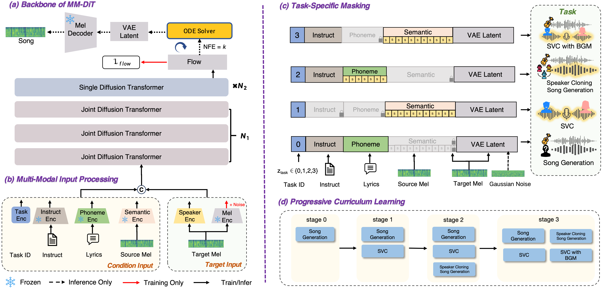
*Figure 1:The overall architecture of UniSinger. The left panel shows the MM-DiT backbone and multi-modal input processing module. The right panel details the progressive curriculum learning strategy with task-specific modality masking.*

*(a)Intelligibility*

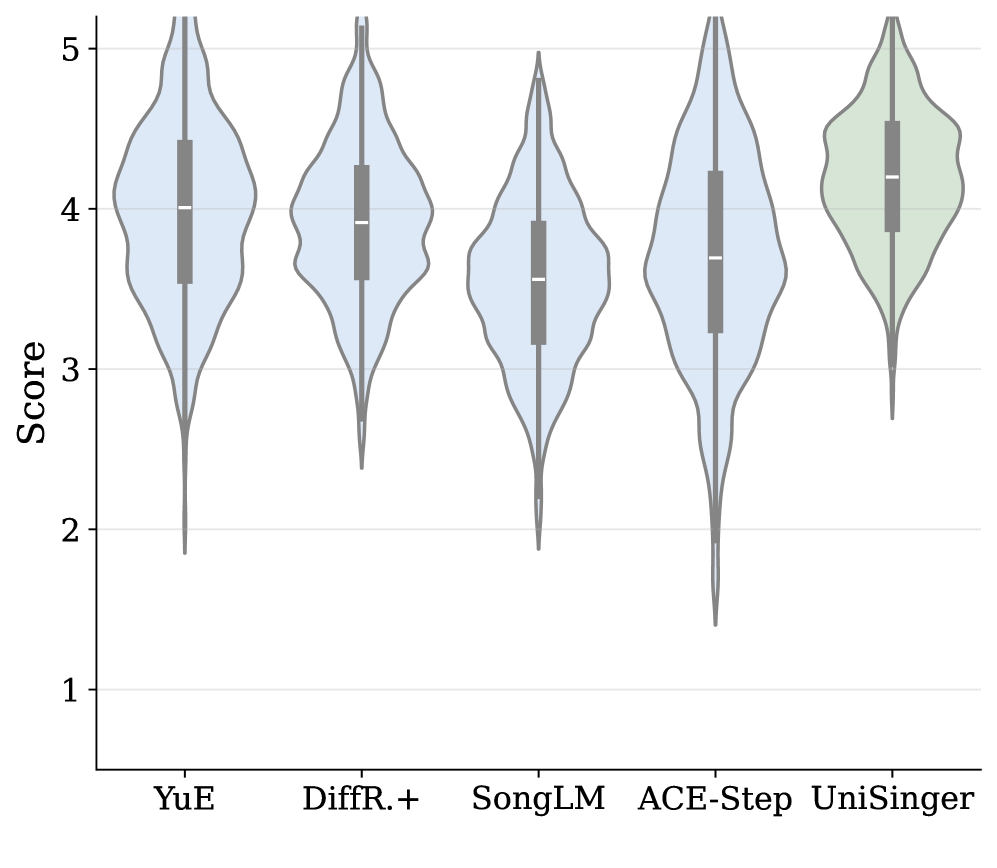
*(a)Intelligibility*

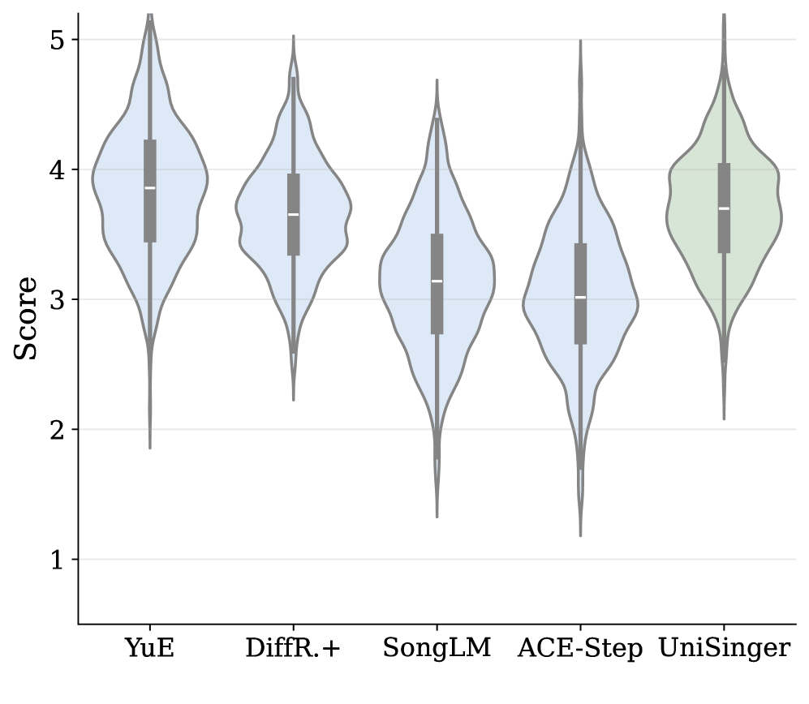
*(b)Similarity*

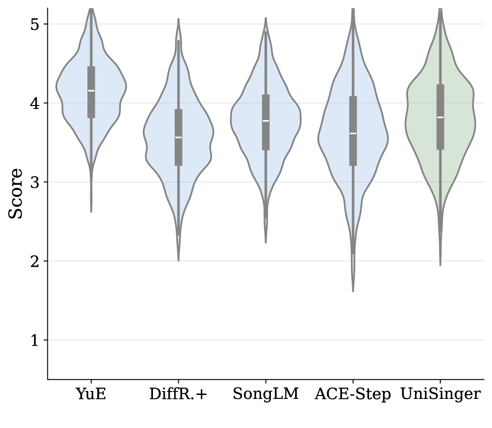
*(c)Quality*

---
**Usage Info**: 4449 tokens used.
**Generated at**: 2026-06-08 17:22:07

---

# 📚 Audio Imitator: Controlling Timbre and Tempo in Video2Audio Synthesis with Audio Reference

🚀 URL: https://arxiv.org/html/2606.07182

## 🌏 Abstract (원문)
Video-to-audio generation has made significant progress in achieving semantic consistency and temporal alignment from silent videos. However, audio contains rich stylistic attributes such as timbre and tempo that are difficult to infer from visual and textual inputs alone. While reference audio can serve as additional conditioning, it is typically treated as a holistic signal, limiting fine-grained style control. We propose AudioIM, an attribute-aware framework that explicitly models timbre and tempo as separate control factors rather than relying on holistic prompt conditioning. Dual encoders extract complementary timbre-related and tempo-related representations, which are injected through global conditioning. A masking-based training strategy enables effective latent prompt conditioning at inference. Experiments on VGGSound show improved style similarity while preserving semantic alignment and synchronization. Audio samples are available at:https://anonymousdemo757.github.io/.
## 🌏 Abstract (번역)
무음 비디오로부터 의미론적 일관성과 시간적 정렬을 달성하는 데 있어 비디오-오디오 생성은 상당한 발전을 이루었습니다. 그러나 오디오는 시각 및 텍스트 입력만으로는 추론하기 어려운 음색 및 템포와 같은 풍부한 스타일 속성을 포함합니다. 참조 오디오가 추가적인 조건으로 사용될 수 있지만, 일반적으로 전체적인 신호로 취급되어 세밀한 스타일 제어를 제한합니다. 우리는 전체적인 프롬프트 조건화에 의존하기보다는 음색과 템포를 별도의 제어 요소로 명시적으로 모델링하는 속성 인식 프레임워크인 AudioIM을 제안합니다. 듀얼 인코더는 상호 보완적인 음색 관련 및 템포 관련 표현을 추출하며, 이는 전역 조건화를 통해 주입됩니다. 마스킹 기반 훈련 전략은 추론 시 효과적인 잠재 프롬프트 조건화를 가능하게 합니다. VGGSound에 대한 실험은 의미론적 정렬 및 동기화를 유지하면서 향상된 스타일 유사성을 보여줍니다. 오디오 샘플은 다음에서 확인할 수 있습니다: https://anonymousdemo757.github.io/.

## 🔍 Methods & Results
- 참조 오디오에서 비디오-텍스트 입력만으로는 얻기 어려운 음색 및 템포와 같은 오디오 스타일 정보를 활용하는 것을 목표로 한다.
- AudioIM은 음색과 템포를 별도의 제어 요소로 명시적으로 모델링하는 속성 인식 프레임워크를 제안한다.
- 마스킹 기반 훈련 전략을 통해 참조 오디오의 잠재 표현을 활용하여 스타일 정보를 제공하고 제로샷 추론을 가능하게 한다.
- 듀얼 인코더(BEATs 기반 음색 인코더, Style Conditioner 기반 템포 인코더)를 사용하여 참조 오디오에서 음성 지문과 유사한 음색 특성 및 풍부한 템포 정보를 추출한다.
- 추출된 음색 및 템포 표현은 전역 및 프레임 수준 조건화를 통해 모델에 주입되어 생성 오디오의 스타일을 세밀하게 제어한다.
- VGGSound 데이터셋 실험 결과, 의미론적 정렬 및 동기화를 유지하면서 오디오 스타일 유사성이 향상됨을 확인했다.

## 🖼 Figures

*Figure 1:Overview of the proposed AudioIM framework. During training, audio latents are partially masked to enable latent-level prompt conditioning under a flow-matching objective. Reference audio is processed by dual style encoders to extract complementary timbre-related and tempo-related representations. These style features are fused and injected through global conditioning pathways, enabling style-aware video-to-audio generation while preserving semantic and temporal alignment.*

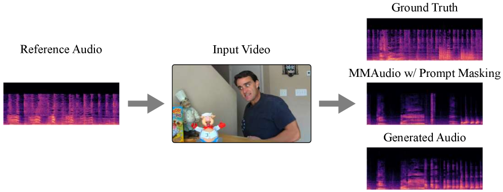
*Figure 2:Qualitative comparison of style control. The generated audio reflects the reference tempo and exhibits similar timbre, while remaining consistent with the input video.*

---
**Usage Info**: 3793 tokens used.
**Generated at**: 2026-06-08 17:23:25

---

# 📚 TargetSEC: Plug-and-Play In-the-Wild Speech Emotion Conversion via Arousal-Conditioned Latent Style Diffusion

🚀 URL: https://arxiv.org/html/2606.07293

## 🌏 Abstract (원문)
Speech Emotion Conversion (SEC) aims to transform the emotion of a source utterance into a target emotion while preserving content and speaker identity. SEC on in-the-wild data is challenging due to the non-parallel nature of training data and complex real-world acoustics. Existing fixed-duration approaches either struggle to shift the emotion effectively (high quality, low conversion) or degrade speech naturalness (low quality, high conversion). We propose TargetSEC, an embedding-driven latent diffusion framework that generates emotion-focused style embeddings conditioned on speaker identity and continuous emotion. Unlike methods that diffuse over spectrograms, TargetSEC operates in a compact latent space. Experiments on the MSP-Podcast dataset show that TargetSEC outperforms current non-duration baselines in conversion accuracy while maintaining high speech quality, and achieves performance comparable to duration-prediction systems without explicit temporal modeling.
## 🌏 Abstract (번역)
음성 감정 변환(SEC)은 원본 발화의 감정을 내용과 화자 정체성을 보존하면서 목표 감정으로 변환하는 것을 목표로 합니다. 실제 환경 데이터에서의 SEC는 훈련 데이터의 비병렬적 특성과 복잡한 실제 음향으로 인해 어렵습니다. 기존의 고정 길이 접근 방식은 감정을 효과적으로 전환하는 데 어려움을 겪거나(고품질, 낮은 변환율) 음성 자연스러움을 저하시킵니다(저품질, 높은 변환율). 우리는 화자 정체성과 연속적인 감정에 따라 감정 중심의 스타일 임베딩을 생성하는 임베딩 기반 잠재 확산 프레임워크인 TargetSEC을 제안합니다. 스펙트로그램을 확산시키는 방식과 달리, TargetSEC은 압축된 잠재 공간에서 작동합니다. MSP-Podcast 데이터셋에 대한 실험 결과, TargetSEC은 현재의 비-길이 기반 모델보다 변환 정확도에서 우수하며 높은 음성 품질을 유지하고, 명시적인 시간 모델링 없이도 길이 예측 시스템과 유사한 성능을 달성함을 보여주었습니다.

## 🔍 Methods & Results
- TargetSEC은 인코더-디코더 재합성 프레임워크로, 내용, 화자, 스타일 인코더와 LDM 조건화를 위한 감정 인코더로 구성된 인코더 블록과 HiFi-GAN V1 디코더를 사용합니다.
- 추론 시에는 스타일 인코더가 감정 및 화자 조건부 잠재 확산 모델(LDM)로 대체되어 플러그 앤 플레이 음성 감정 변환을 가능하게 합니다.
- 콘텐츠 인코더는 사전 훈련된 HuBERT 인코더를 사용하여 다운샘플링된 표현을 추출하고, 화자 인코더는 WavLM 기반 모델을 사용하여 512차원 d-벡터를 생성합니다.
- 스타일 인코더는 사전 훈련된 모델을 사용하여 128차원 전역 스타일 벡터를 생성하며, LDM 훈련 시 목표 스타일 사전으로 사용됩니다.
- 감정 인코더는 MSP-Podcast 데이터셋에 미세 조정된 사전 훈련된 감정 인식 모델(ESER)을 사용하여 1024차원 감정 임베딩을 출력하며, LDM 조건화 및 SEC 성능 평가에 활용됩니다.
- LDM은 화자 및 감정 임베딩에 조건화된 스타일 사전 `p(z_style | z_s, z_e)`를 모델링하며, 안정성 향상을 위해 노이즈 대신 속도(`v_n`)를 예측합니다.
- 추론 시에는 Classifier-Free Guidance(CFG)와 가이던스 재조정(rescaling)을 사용하여 생성 방향을 목표 감정으로 유도하고 아티팩트를 줄입니다.
- 생성기는 적대적 학습, 재구성, 감정 정렬을 결합한 다중 작업 목표 함수로 최적화되며, 감정 일관성을 위해 실제 값과 예측된 각성도 간의 Concordance Correlation Coefficient(CCC) 오차를 최소화합니다.
- MSP-Podcast 데이터셋 실험 결과, TargetSEC은 현재의 비-길이 기반 모델보다 변환 정확도에서 우수하면서도 높은 음성 품질을 유지합니다.
- TargetSEC은 명시적인 시간 모델링 없이도 길이 예측 시스템과 유사한 성능을 달성합니다.

## 🖼 Figures
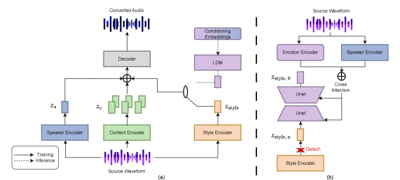
*Figure 1: Overview of the proposed framework. Subfigure (a) illustrates the architecture of TargetSEC, and (b) shows the training of the LDM. Solid arrows denote training paths, while dashed arrows indicate inference-time operations.*

*Figure 2:Arousal-wise SER error (
ℒ
𝑚
​
𝑠
​
𝑒
 
↓
) and WVMOS 
↑
 for MSP-Podcast Test1.*

---
**Usage Info**: 3503 tokens used.
**Generated at**: 2026-06-08 17:24:06

---

# 📚 VoxCPM2 Technical Report

🚀 URL: https://arxiv.org/html/2606.06928

## 🌏 Abstract (원문)
We present VoxCPM2, a fully open-source multilingual and controllable speech generation foundation model that extends the hierarchical diffusion-autoregressive modeling paradigm of VoxCPM. VoxCPM2 advances the framework in three key dimensions: (i)capability, by unifying 30 languages, 9 Chinese dialects, natural-language voice design, style-controllable voice cloning, and high-fidelity continuation cloning within a single backbone; (ii)quality, through an asymmetric AudioVAE that encodes at 16 kHz and reconstructs at 48 kHz, enabling implicit super-resolution with high encoding efficiency; and (iii)scale, by jointly scaling the model to 2B parameters and the training data to over 2 million hours of multilingual speech. To support these diverse capabilities within one model, we introduce a unified sequence organization that expresses all generation modes through different arrangements of the same input building blocks, allowing joint training under a single set of parameters and objective. VoxCPM2 achieves state-of-the-art or competitive performance on public zero-shot and instruction-following TTS benchmarks. On our internal 30-language evaluation set, it attains an average WER of 1.68%. These results demonstrate that hierarchical continuous-latent modeling, without relying on any external discrete speech tokenizer, offers a viable and powerful foundation for large-scale multilingual and controllable speech generation. The model weights, fine-tuning code, and inference tools are publicly released under the Apache 2.0 license to foster community research and development.
## 🌏 Abstract (번역)
저희는 VoxCPM의 계층적 확산-자기회귀 모델링 패러다임을 확장한 완전 오픈소스 다국어 및 제어 가능한 음성 생성 기반 모델인 VoxCPM2를 소개합니다. VoxCPM2는 세 가지 주요 측면에서 프레임워크를 발전시킵니다: (i) 기능: 30개 언어, 9개 중국어 방언, 자연어 음성 디자인, 스타일 제어 가능한 음성 복제, 고음질 연속 복제를 단일 백본 내에서 통합하여 기능을 확장합니다. (ii) 품질: 16kHz로 인코딩하고 48kHz로 재구성하는 비대칭 AudioVAE를 통해 높은 인코딩 효율성으로 암묵적인 초해상도를 가능하게 하여 품질을 향상시킵니다. (iii) 규모: 모델을 20억 개 매개변수로, 훈련 데이터를 2백만 시간 이상의 다국어 음성으로 공동으로 확장하여 규모를 키웁니다. 하나의 모델 내에서 이러한 다양한 기능을 지원하기 위해, 우리는 동일한 입력 구성 요소의 다른 배열을 통해 모든 생성 모드를 표현하는 통합 시퀀스 구성을 도입하여 단일 매개변수 및 목표 하에 공동 훈련을 가능하게 합니다. VoxCPM2는 공개 제로샷 및 지시 따르기 TTS 벤치마크에서 최첨단 또는 경쟁력 있는 성능을 달성합니다. 내부 30개 언어 평가 세트에서 평균 WER 1.68%를 달성했습니다. 이러한 결과는 외부 이산 음성 토크나이저에 의존하지 않는 계층적 연속 잠재 모델링이 대규모 다국어 및 제어 가능한 음성 생성을 위한 실행 가능하고 강력한 기반을 제공함을 보여줍니다. 모델 가중치, 미세 조정 코드 및 추론 도구는 커뮤니티 연구 및 개발을 촉진하기 위해 Apache 2.0 라이선스 하에 공개됩니다.

## 🔍 Methods & Results
- VoxCPM2는 VoxCPM의 계층적 확산-자기회귀 모델링을 확장하여 다국어 및 제어 가능한 음성 생성 기반 모델로 발전시켰습니다.
- 비대칭 AudioVAE V2를 도입하여 16kHz 인코딩 및 48kHz 재구성을 통해 고품질 음성 합성을 지원하며, 자기회귀 시퀀스 길이를 늘리지 않고도 암묵적인 초해상도를 가능하게 합니다.
- 백본은 Local Encoder, Text-Semantic Language Model (TSLM), Residual Acoustic Language Model (RALM), Local Diffusion Transformer (LocDiT)로 구성되며, 4개의 프레임으로 구성된 잠재 패치(6.25Hz)를 예측합니다.
- VoxCPM 대비 개선점으로는 LocDiT에 FSQ-양자화된 의미론적 스켈레톤과 잔여 음향 세부 정보를 별도의 컨디셔닝 토큰으로 제공하고, RALM의 융합 연산자를 학습 가능한 연결-투영으로 대체하며, FSQ 병목 차원을 256에서 512로 늘렸습니다.
- 명시적인 참조 오디오 경로를 도입하여 스피커 아이덴티티를 위한 참조 오디오 클립(스크립트 없이) 삽입을 가능하게 하여, 디커플링된 음성 복제를 지원합니다.
- 모델은 20억 개 매개변수로, 훈련 데이터는 2백만 시간 이상의 다국어 음성으로 확장되었으며, 패치 크기를 P=2에서 P=4로 늘려 효율성과 안정성을 향상시켰습니다.
- 단일 통합 시퀀스 구성을 통해 기본 TTS, 음성 디자인, 참조 기반 복제, 제어 가능한 복제, 연속 복제 등 5가지 생성 구성을 지원합니다.
- 훈련은 다국어 TTS 사전 훈련, TTS 및 제어 가능한 TTS 공동 사전 훈련, 고품질 어닐링 SFT의 3단계 커리큘럼으로 진행됩니다.
- 제어 가능한 데이터는 음성 디자인 속성(연령, 성별, 억양 등) 및 스타일 제어 속성(감정, 말하기 속도 등)으로 주석 처리되며, 텍스트에서 스타일이 유출되는 것을 방지하기 위해 내용 분리된 예시를 생성하여 훈련에 사용합니다.
- 추론 시에는 분류기 없는 안내(CFG), 스웨이 샘플링, CFG-Zero* 기술을 사용하여 품질과 속도의 균형을 맞추며, 효율적인 패치/청크 기반 스트리밍을 지원합니다.

## 🖼 Figures
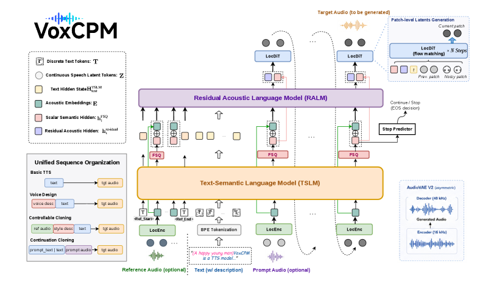
*Figure 1:Overall architecture of VoxCPM2.*

---
**Usage Info**: 8082 tokens used.
**Generated at**: 2026-06-08 17:24:24

---

# 📚 Audio-Oscar: A Multi-Agent System for Complex Audio Scene Generation, Orchestration, and Refinement

🚀 URL: https://arxiv.org/html/2606.07397

## 🌏 Abstract (원문)
In recent years, audio generation has made significant progress in tasks such as text-to-speech (TTS), text-to-audio (TTA) and text-to-music (TTM). However, generating long-form and controllable audio from complex audio scene descriptions remains a significant challenge, as such scenes often require coordinated speech, sound effects, music, songs, temporal structure, and post-production. In this work, we introduceAudio-Oscar, a multi-agent framework for generating audio from complex descriptions. Audio-Oscar coordinates a set of specialist agents, each responsible for a different aspect of the audio scene, including character modeling and voice design, speech generation, fine-grained timeline planning, model selection, non-speech generation, and audio post-production. Audio-Oscar further incorporates feedback-driven refinement. In addition, to address the lack of suitable benchmarks for evaluating audio generation from complex audio scene descriptions, we constructASG-Bench, an Audio Scene Generation Benchmark containing both scene descriptions paired with reference audio and text-only scene descriptions. Each scene is annotated with target audio events and temporal statements to evaluate whether the generated audio faithfully realizes the required scene content and temporal structure. Experimental results show that Audio-Oscar can effectively generate audio that matches complex scene descriptions. Project samples are available athttps://audiooscar.github.io/. Our code is available athttps://github.com/ziye26/Audio-Oscar.
## 🌏 Abstract (번역)
최근 몇 년간 음성 합성(TTS), 텍스트-오디오(TTA), 텍스트-음악(TTM)과 같은 오디오 생성 작업에서 상당한 진전이 있었습니다. 그러나 복잡한 오디오 장면 설명으로부터 장문의 제어 가능한 오디오를 생성하는 것은 여전히 중요한 과제로 남아있는데, 이러한 장면들은 종종 음성, 음향 효과, 음악, 노래, 시간적 구조 및 후반 작업의 조정을 요구하기 때문입니다. 본 연구에서는 복잡한 설명으로부터 오디오를 생성하기 위한 다중 에이전트 프레임워크인 Audio-Oscar를 소개합니다. Audio-Oscar는 캐릭터 모델링 및 음성 디자인, 음성 생성, 세밀한 타임라인 계획, 모델 선택, 비음성 생성, 오디오 후반 작업을 포함하여 오디오 장면의 다양한 측면을 담당하는 전문 에이전트 세트를 조정합니다. Audio-Oscar는 또한 피드백 기반의 개선 기능을 통합합니다. 또한, 복잡한 오디오 장면 설명으로부터 오디오 생성을 평가하기 위한 적절한 벤치마크의 부족을 해결하기 위해, 우리는 참조 오디오와 짝을 이루는 장면 설명 및 텍스트 전용 장면 설명을 모두 포함하는 오디오 장면 생성 벤치마크인 ASG-Bench를 구축합니다. 각 장면은 생성된 오디오가 필요한 장면 내용과 시간적 구조를 충실히 구현하는지 평가하기 위해 목표 오디오 이벤트 및 시간적 진술로 주석 처리됩니다. 실험 결과는 Audio-Oscar가 복잡한 장면 설명에 일치하는 오디오를 효과적으로 생성할 수 있음을 보여줍니다. 프로젝트 샘플은 https://audiooscar.github.io/에서 확인할 수 있습니다. 코드는 https://github.com/ziye26/Audio-Oscar에서 확인할 수 있습니다.

## 🔍 Methods & Results
- Audio-Oscar는 복잡한 오디오 장면 설명으로부터 오디오를 생성하기 위한 다중 에이전트 프레임워크로, 스피커 역할 프로파일링, 음성 디자인, 음성 생성, 타임라인 계획, 비음성 생성, 오디오 후반 작업 등 다양한 전문 에이전트를 조정합니다.
- 시스템은 입력 설명에서 화자 역할을 식별하고 각 화자에 대한 음성 프로필을 구축한 후, 일관된 화자 정체성을 유지하기 위해 각 역할에 대한 참조 음성을 합성합니다.
- 정확한 시간 제어를 위해 발화 수준에서 음성을 계획하고 생성하며, 음성 이벤트 계획 에이전트가 대화를 추출하고 음성 요소를 구성하면, 음성 생성 플래너가 적절한 TTS 모델을 선택하여 음성을 생성합니다.
- 생성된 음성 결과의 실제 지속 시간을 측정하여 오디오 계획 단계에서 전역 타임라인에 배치합니다.
- 오디오 타임라인 초안 에이전트는 입력 장면 설명과 합성된 음성 결과를 제약 조건으로 사용하여 음성 및 비음성 이벤트를 결합한 초기 타임라인을 생성하며, 음성 결과는 보호된 요소로 취급됩니다.
- 타임스탬프 개선 에이전트는 장면 설명, 초안 타임라인, 음성 결과를 기반으로 비음성 이벤트를 추가, 제거 또는 수정하여 스케줄을 개선하고 시간적 일관성을 향상시킵니다.
- 비음성 오디오(음향 효과, 음악, 노래)는 각 유형에 특화된 생성 에이전트에 의해 처리되며, 음향 효과 생성에는 오디오 비평가를 활용한 피드백 기반 개선이 가능합니다.
- 오디오 후반 작업 계획 에이전트는 장면 의도와 타임라인을 분석하여 게인 조정, 볼륨 엔벨로프, 압축, 잔향과 같은 후반 작업 지침을 추가하여 오디오의 균형, 전환, 공간감 및 전반적인 일관성을 향상시킵니다.
- 모든 생성된 오디오 세그먼트는 타임라인에 따라 결합되어 완전한 장면 수준 오디오 출력을 생성하며, 최종 믹스 검토 에이전트가 최종 믹스 오디오를 검토하고 필요한 경우 재믹스 패치를 적용합니다.
- 복잡한 오디오 장면 설명으로부터 오디오 생성을 평가하기 위한 벤치마크인 ASG-Bench를 구축했으며, 이는 참조 오디오와 텍스트 전용 장면 설명을 모두 포함합니다.
- 실험 결과, Audio-Oscar가 복잡한 장면 설명에 일치하는 오디오를 효과적으로 생성할 수 있음을 입증했습니다.

## 🖼 Figures
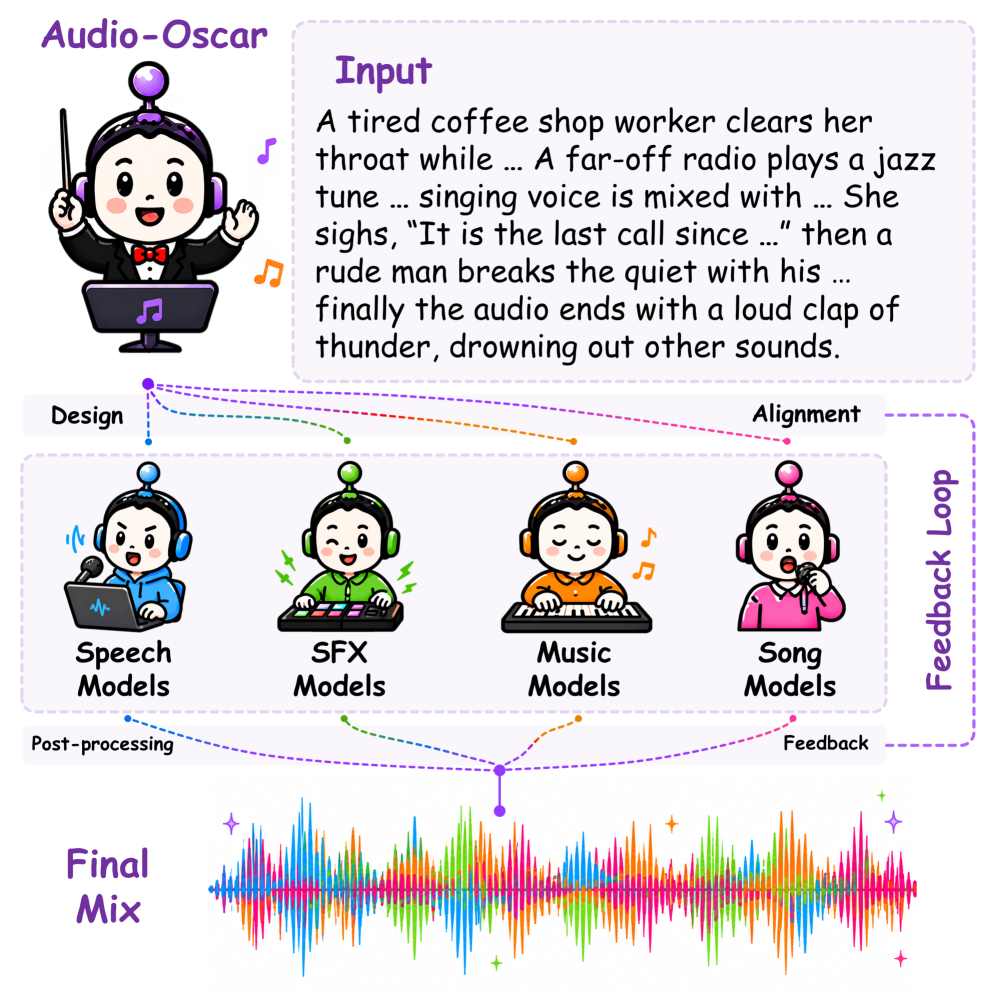
*Figure 1:Overview of Audio-Oscar. Given an audio scene description as input, it coordinates multiple agents and employs different models for generation, composition, and refinement to produce the final audio output.*

*Figure 2:Overview of Audio-Oscar. Given a complex audio scene description, Audio-Oscar decomposes the generation process into multiple coordinated stages, including speaking role extraction and voice design, speech planning and generation, timeline construction and refinement, non-speech audio planning and generation, edit-aware mixing, and feedback-driven refinement.*

*Figure 3:Overview of ASG-Bench, a benchmark for evaluating audio generation from complex audio scene descriptions. Each sample is annotated with expected audio events and temporal statements, supporting the assessment of whether generated audio faithfully captures both the scene content and temporal structure described in the prompt.*

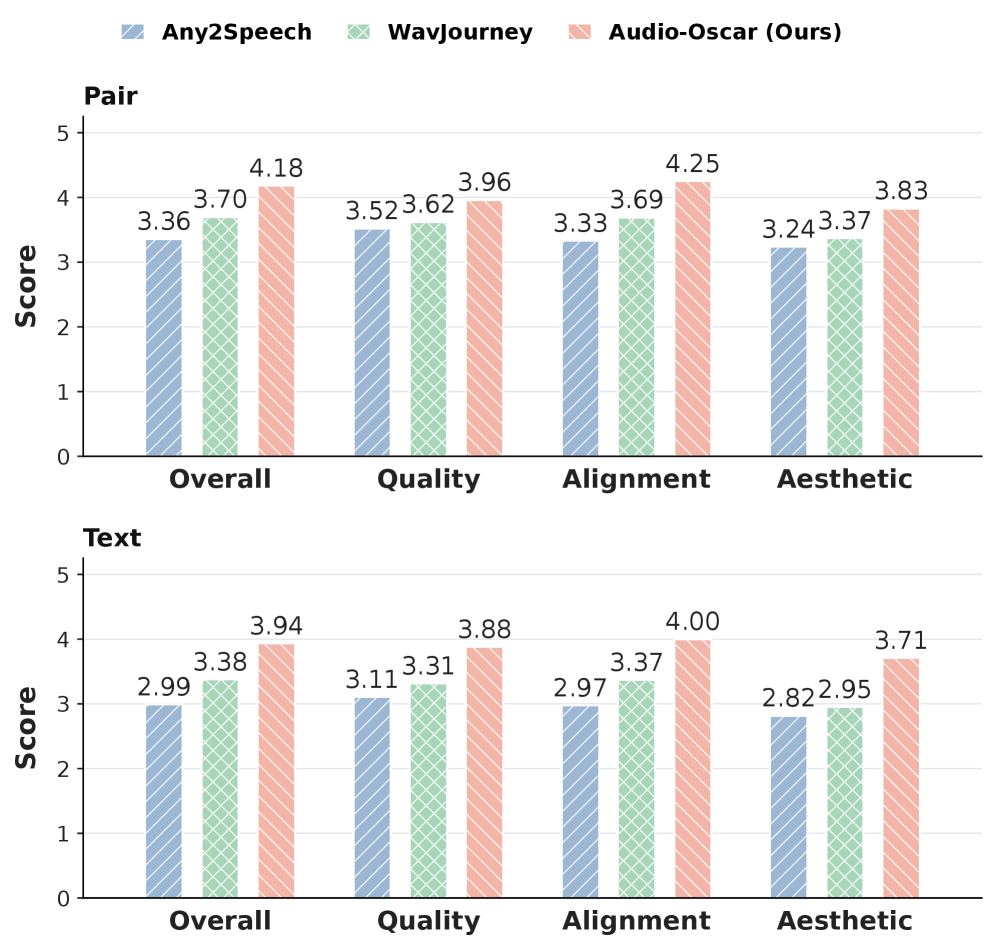
*Figure 4:Human Subjective Evaluation Scores for Sampled Examples from ASG-Bench. WavJourney and our method are evaluated using DeepSeek-V4-Flash with reasoning mode disabled.*

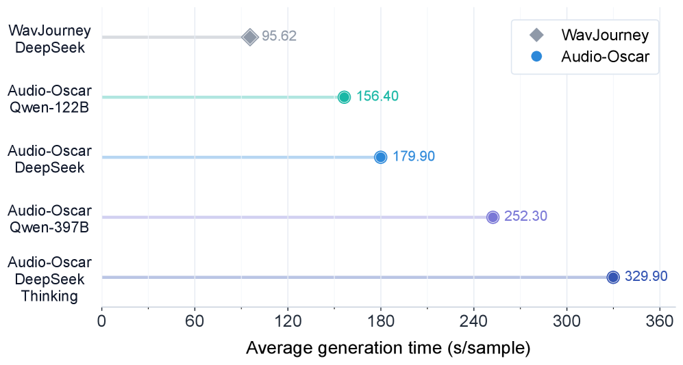
*Figure 5:Average generation time of WavJourney and Audio-Oscar on randomly sampled ASG-Bench examples. DeepSeek refers to DeepSeek-V4-Flash. Unless otherwise specified, all LLMs are used in non-thinking mode.*

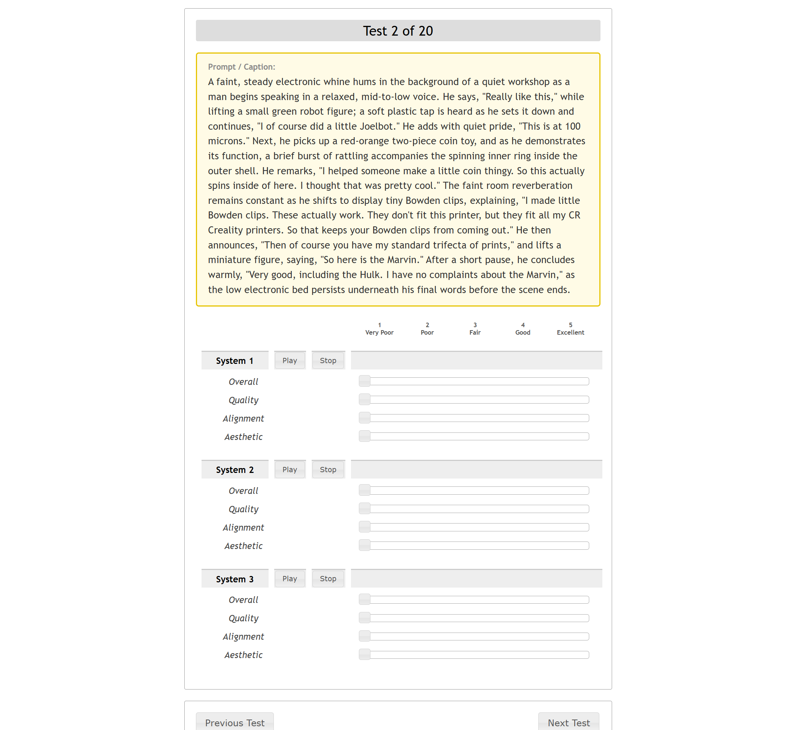
*Figure 6:Illustration of the human evaluation platform. Participants are shown a text prompt and three generated audio samples, and are asked to rate each sample along four dimensions.*

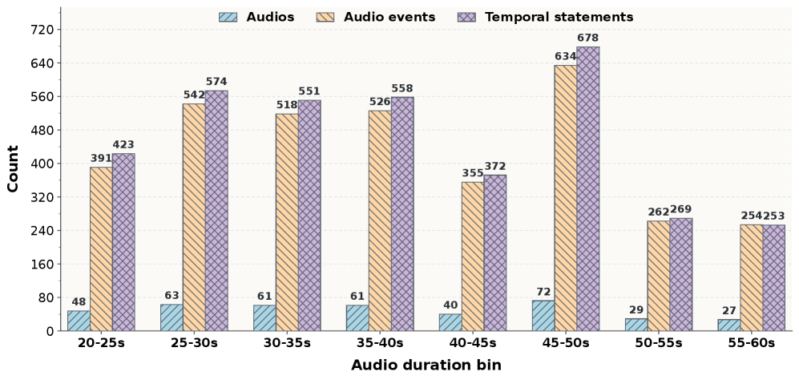
*Figure 7:Distribution of Audios, Audio Events and Temporal Statements Across Duration Intervals*

---
**Usage Info**: 3655 tokens used.
**Generated at**: 2026-06-08 17:25:40

---

# 📚 SpectCount: Spectrotemporal Counting via Synthetic Signals Improves Large Audio Language Models

🚀 URL: https://arxiv.org/html/2606.06907

## 🌏 Abstract (원문)
Large audio language models (LALMs) extend large language models with an audio encoder and large-scale audio data. However, the scarcity of high-quality annotated audio data remains a fundamental bottleneck for scaling. Through probing signal detectability analysis, we identify fine-grained spectrotemporal perceptual weaknesses in a foundation LALM. To address these challenges, we propose Spectrotemporal Counting (SpectCount), a data-efficient fine-tuning approach based on fully synthetic audio signals generated on-the-fly, without relying on real-world audio, annotations, or pretrained generative models. SpectCount not only resolves the observed weaknesses but also improves performance on diverse auditory benchmarks spanning sound, music, and speech, unseen during fine-tuning. These results suggest that weakness-targeted synthetic signals provide a data-efficient path toward enhanced auditory understanding capabilities in LALMs.
## 🌏 Abstract (번역)
대규모 오디오 언어 모델(LALM)은 오디오 인코더와 대규모 오디오 데이터를 통해 대규모 언어 모델을 확장합니다. 그러나 고품질 주석이 달린 오디오 데이터의 부족은 확장을 위한 근본적인 병목 현상으로 남아 있습니다. 신호 감지 가능성 분석을 통해, 우리는 기반 LALM에서 미세한 스펙트로템포럴 지각 약점을 식별했습니다. 이러한 문제를 해결하기 위해, 우리는 실제 오디오, 주석 또는 사전 훈련된 생성 모델에 의존하지 않고 즉석에서 생성되는 완전 합성 오디오 신호를 기반으로 하는 데이터 효율적인 미세 조정 접근 방식인 스펙트로템포럴 카운팅(SpectCount)을 제안합니다. SpectCount는 관찰된 약점을 해결할 뿐만 아니라 미세 조정 중에는 볼 수 없었던 소리, 음악, 음성을 포함한 다양한 청각 벤치마크에서 성능을 향상시킵니다. 이러한 결과는 약점 표적 합성 신호가 LALM의 향상된 청각 이해 능력을 위한 데이터 효율적인 경로를 제공함을 시사합니다.

## 🔍 Methods & Results
- 대규모 오디오 언어 모델(LALM)의 확장을 저해하는 고품질 주석 오디오 데이터 부족 문제를 해결하고자 함.
- 신호 감지 가능성 분석을 통해 기반 LALM에서 미세한 스펙트로템포럴 지각 약점을 발견함.
- 이러한 약점을 해결하기 위해 'Spectrotemporal Counting (SpectCount)'이라는 데이터 효율적인 미세 조정 접근 방식을 제안함.
- SpectCount는 실제 오디오, 주석, 또는 사전 훈련된 생성 모델 없이 즉석에서 생성되는 완전 합성 오디오 신호를 활용함.
- SpectCount는 LALM의 관찰된 스펙트로템포럴 약점을 해결하는 데 효과적이었음.
- 미세 조정 과정에서 사용되지 않은 소리, 음악, 음성 등 다양한 청각 벤치마크에서 성능 향상을 달성함.
- 약점 표적 합성 신호가 LALM의 청각 이해 능력을 향상시키는 데이터 효율적인 방법임을 입증함.

## 🖼 Figures

*Figure 1:Probing signal detectability analysis and effects of SpectCount. The upper panel reveals two distinct weaknesses of the baseline LALM: (i) failure to recall signals appearing early in the audio, and (ii) insensitivity to specific frequency ranges. The lower panel shows the effects of SpectCount: (left) improved detection rates across the spectrotemporal space, and (right) generalization to broader auditory understanding tasks.*

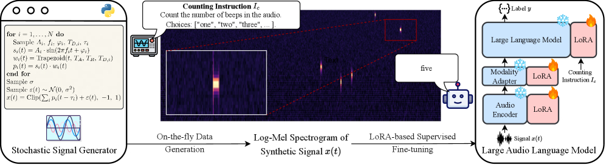
*Figure 2:Overview of SpectCount.*

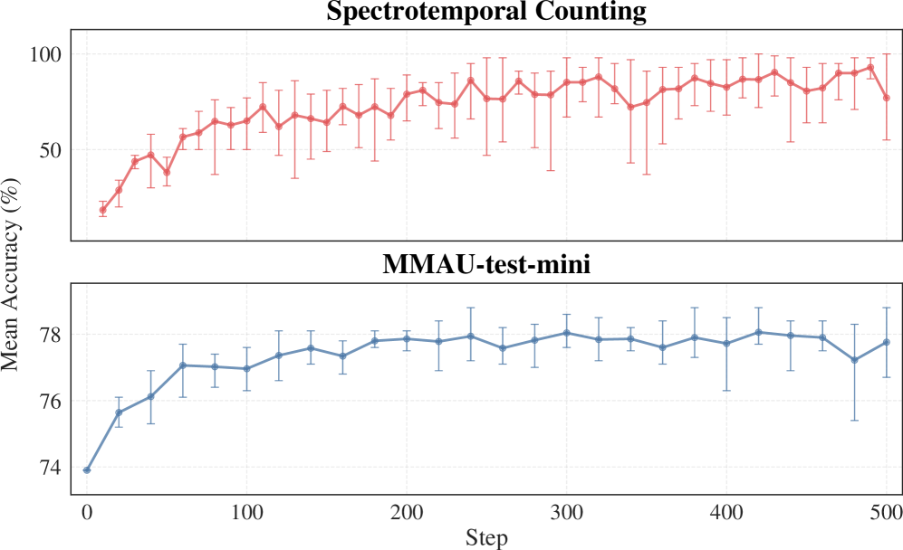
*Figure 3:Accuracy (%) curves over training steps. Error bars represent the min-max range over 5 runs.*

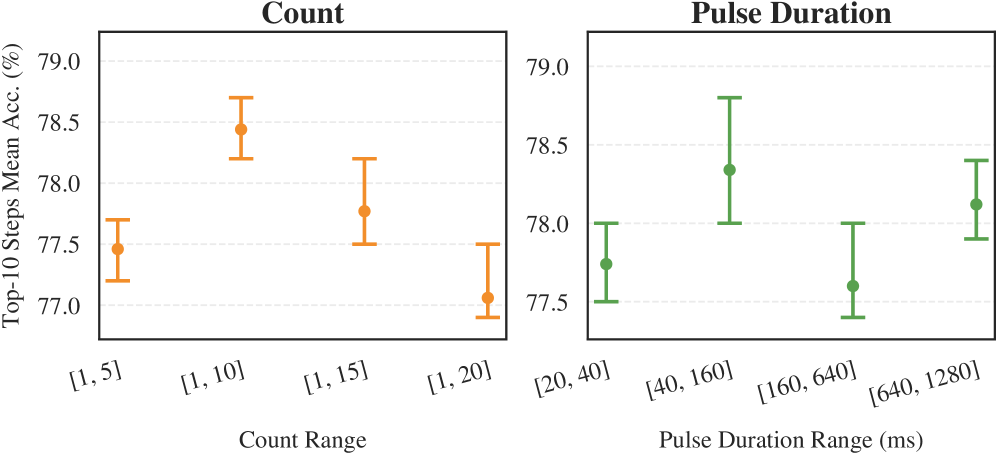
*Figure 4:Impact of count and pulse duration range. Error bars represent the min-max range over 2 runs.*

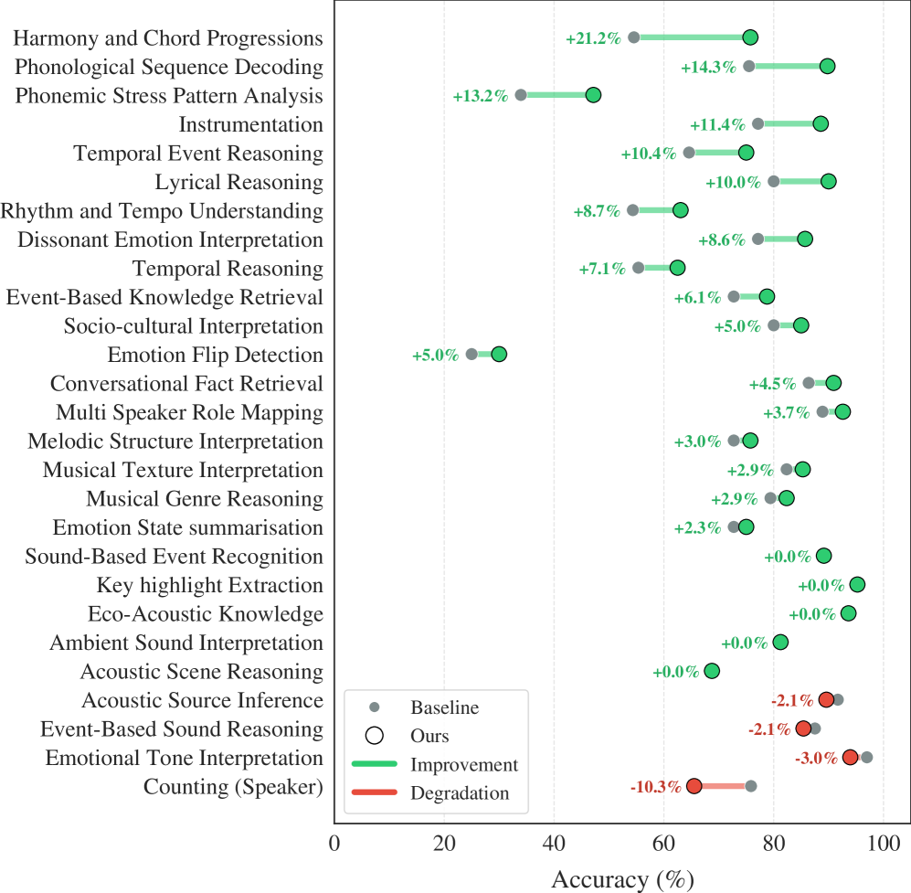
*Figure 5:Accuracy (%) improvement across auditory tasks.*

---
**Usage Info**: 1324 tokens used.
**Generated at**: 2026-06-08 17:25:47

---

# 📚 FSC-Net: Integrating Fast Fourier Convolutions and Progressive Learning for Speech Bandwidth Extension

🚀 URL: https://arxiv.org/html/2606.06962

## 🌏 Abstract (원문)
Speech bandwidth extension (BWE) aims to reconstruct high-fidelity wideband audio from narrowband inputs. While recent approaches have made significant progress, they often struggle to reconstruct realistic high-frequency phase and harmonic structures, leading to perceptual artifacts. In this paper, we proposeFSC-Net(Full-Spectrum Context Network), a parameter-efficient architecture designed to explicitly model cross-band harmonic dependencies. By integrating Fast Fourier Convolutions (FFCs) into a complex spectral mapping framework, FSC-Net expands its receptive field to the entire spectrum, capturing long-range frequency interactions effectively. To address the ill-posed nature of high-frequency generation, our novel frequency-progressive learning curriculum guides the network to reconstruct spectral details from coarse to fine. Experimental results on the VCTK and unseen EARS datasets demonstrate that FSC-Net delivers consistently strong reconstruction quality and generalization, particularly in the challenging VCTK 4
kHz-to-48
kHz task. Compared to scaled-up baselines, our model attains leading LSD and PESQ scores while maintaining a highly compact parameter footprint (1.54
M).
## 🌏 Abstract (번역)
음성 대역폭 확장(BWE)은 협대역 입력으로부터 고음질의 광대역 오디오를 재구성하는 것을 목표로 합니다. 최근 접근 방식들이 상당한 발전을 이루었지만, 현실적인 고주파 위상 및 고조파 구조를 재구성하는 데 어려움을 겪어 지각적 인공물을 유발하는 경우가 많습니다. 본 논문에서는 대역 간 고조파 의존성을 명시적으로 모델링하도록 설계된 매개변수 효율적인 아키텍처인 FSC-Net(Full-Spectrum Context Network)을 제안합니다. FSC-Net은 고속 푸리에 컨볼루션(FFC)을 복소 스펙트럼 매핑 프레임워크에 통합하여 수용 필드를 전체 스펙트럼으로 확장하고 장거리 주파수 상호작용을 효과적으로 포착합니다. 고주파 생성의 역문제적 특성을 해결하기 위해, 우리의 새로운 주파수 점진적 학습 커리큘럼은 네트워크가 스펙트럼 세부 사항을 거친 수준에서 미세한 수준으로 재구성하도록 안내합니다. VCTK 및 미공개 EARS 데이터셋에 대한 실험 결과는 FSC-Net이 특히 어려운 VCTK 4kHz-48kHz 작업에서 일관되게 강력한 재구성 품질과 일반화 성능을 제공함을 보여줍니다. 확장된 기준 모델과 비교하여, 우리 모델은 매우 작은 매개변수(1.54M)를 유지하면서도 선도적인 LSD 및 PESQ 점수를 달성합니다.

## 🔍 Methods & Results
- FSC-Net은 협대역 입력 파형을 STFT를 통해 복소 스펙트로그램으로 변환한 후, 이를 업샘플링하여 전체 대역 복소 스펙트로그램을 예측하고 최종적으로 iSTFT를 통해 광대역 파형을 생성하는 복소 스펙트럼 매퍼로 작동합니다.
- 제안된 모델은 TF-GridNet 아키텍처를 기반으로 하며, 채널별 서브밴드(CWS) 작업과 고속 푸리에 컨볼루션(FFC) 모듈의 두 가지 핵심 구성 요소를 도입하여 BWE 작업에 맞게 개선되었습니다.
- CWS 작업은 주파수 차원을 3개의 서브밴드로 분할하고 이를 채널 차원에 쌓아 대역 간 의존성을 포착하고 주파수 축의 계산 부담을 줄입니다.
- FFC 모듈은 TF-GridNet의 시간 도메인 inter-RNN을 대체하며, 입력 특징 맵을 로컬(표준 컨볼루션) 및 글로벌(스펙트럼 변환을 사용한 주파수 도메인 컨볼루션) 브랜치로 분할하여 전체 스펙트럼을 포괄하는 전역 수용 필드를 제공합니다.
- 고주파 세부 사항 생성의 역문제적 특성을 해결하기 위해, 거친 수준에서 미세한 수준으로 스펙트럼 세부 사항을 재구성하도록 네트워크를 안내하는 주파수 점진적 학습 전략을 사용합니다. 이는 각 TFFC 블록에 대해 점진적인 목표를 감독하며, 지상 진실과 입력 스펙트로그램 간의 잔차에 슬라이딩 윈도우 평균을 적용합니다.
- 손실 함수는 다중 해상도 STFT 손실(스펙트럼 수렴 항과 로그-크기 항의 평균)과 각 단계 출력에 적용되는 Least Squares GAN 프레임워크를 포함하며, 각 단계는 자체 다중 스케일 판별자와 쌍을 이룹니다.
- 실험 결과, FSC-Net은 VCTK 및 미공개 EARS 데이터셋에서 일관되게 강력한 재구성 품질과 일반화 성능을 보였으며, 특히 VCTK 4kHz-48kHz 작업에서 뛰어난 성능을 입증했습니다.
- 확장된 기준 모델과 비교하여, FSC-Net은 1.54M의 매우 작은 매개변수 수를 유지하면서도 선도적인 LSD(Log-Spectral Distance) 및 PESQ(Perceptual Evaluation of Speech Quality) 점수를 달성했습니다.

## 🖼 Figures

*Figure 1:The general architecture of FSC-Net and the framework for progressive learning. The model consists of 
𝑁
 TF-FFC Blocks, where 
𝑋
^
𝑖
 denotes the output of the 
𝑖
-th block. The 
FFC
𝑖
​
𝑛
 and 
FFC
𝑜
​
𝑢
​
𝑡
 modules are consistent with the FFC module. Note that all intermediate outputs will not be used during model inference.*

*(a)Target 
LSD
=
0.0000*

*(a)Target 
LSD
=
0.0000*

*(b)Input 
LSD
=
3.5918*

*(c)FSC-Net 
LSD
=
0.8863*

*(d)AP-BWE 
LSD
=
1.0929*

*(e)BAE-Net 
LSD
=
0.9953*

*(f)AERO 
LSD
=
0.9168*

---
**Usage Info**: 3496 tokens used.
**Generated at**: 2026-06-08 17:25:58

---

# 📚 HybridCodec: Fast Dual-Stream, Semantically Enhanced Neural Audio Codec

🚀 URL: https://arxiv.org/html/2606.06743

## 🌏 Abstract (원문)
The popularity of neural audio codecs as speech tokenizers has surged with the advent of Multimodal Large Language Models. New codec architectures with semantic and acoustic disentanglement have emerged. There are two main approaches to introduce semantic information into codec models: one distills semantic information from SSL representations into the first RVQ layer, while the other maintains separate streams for semantic and acoustic features. We propose HybridCodec, a unified architecture that combines both paradigms. It employs separate semantic and acoustic branches while distilling SSL representations into the semantic stream. This design ensures strong disentanglement without requiring an SSL model during inference. HybridCodec shows superior semantic specialization (RVQ-1) on in-domain test set and competitive reconstruction (RVQ-all). We demonstrate its robustness in out-of-domain and zero-shot cross-lingual settings, achieving a 3x speedup over existing dual-stream models.
## 🌏 Abstract (번역)
멀티모달 대규모 언어 모델의 등장으로 음성 토크나이저로서 신경 오디오 코덱의 인기가 급증했습니다. 의미론적 및 음향적 분리 기능을 갖춘 새로운 코덱 아키텍처가 등장했습니다. 코덱 모델에 의미론적 정보를 도입하는 두 가지 주요 접근 방식이 있습니다. 하나는 SSL(자기 지도 학습) 표현에서 의미론적 정보를 첫 번째 RVQ 계층으로 증류하는 것이고, 다른 하나는 의미론적 및 음향적 특징을 위한 별도의 스트림을 유지하는 것입니다. 우리는 이 두 가지 패러다임을 결합한 통합 아키텍처인 HybridCodec을 제안합니다. HybridCodec은 별도의 의미론적 및 음향적 브랜치를 사용하면서 SSL 표현을 의미론적 스트림으로 증류합니다. 이 설계는 추론 시 SSL 모델이 필요 없이 강력한 분리를 보장합니다. HybridCodec은 인-도메인 테스트 세트에서 우수한 의미론적 특화(RVQ-1)와 경쟁력 있는 재구성(RVQ-all) 성능을 보여줍니다. 우리는 도메인 외 및 제로샷 교차 언어 설정에서 HybridCodec의 견고성을 입증했으며, 기존 듀얼 스트림 모델보다 3배 빠른 속도를 달성했습니다.

## 🔍 Methods & Results
- HybridCodec은 공통 인코더/디코더와 의미론적 및 음향적 스트림으로 구성된 통합 아키텍처를 제안하며, 의미론적 스트림에 SSL 표현을 증류합니다.
- 공통 인코더는 24kHz 원본 파형을 입력받아 960배 다운샘플링하여 25Hz 프레임 속도의 잠재 벡터를 생성하고, 공통 디코더는 이를 24kHz 오디오로 업샘플링합니다.
- 의미론적 스트림은 경량 의미론적 인코더/디코더와 RVQ-1 계층(16,384개 벡터)으로 구성되며, 의미론적 디코더는 w2v-BERT-2.0의 16번째 계층 임베딩(25Hz로 다운샘플링)에서 의미론적 정보를 증류합니다.
- 음향 스트림은 경량 음향 인코더/디코더와 RVQ 계층(N-1개의 1024개 벡터 코드북)으로 구성되며, 의미론적 정보가 음향 스트림에 모델링되지 않도록 의미론적 디코더 출력을 공통 인코더 출력에서 뺀 후 음향 인코더로 전달합니다.
- 훈련은 스펙트로그램 재구성 손실, 의미론적 증류 손실(L2-loss), 양자화 손실(코드북 및 커밋먼트 손실), 적대적 손실(MPD 및 MS-STFTD 판별자), 특징 매칭 손실을 포함하는 GAN 기반의 엔드투엔드 방식으로 이루어집니다.
- HybridCodec은 인-도메인 테스트 세트에서 우수한 의미론적 특화(RVQ-1)와 경쟁력 있는 재구성(RVQ-all) 성능을 달성했습니다.
- 도메인 외 및 제로샷 교차 언어 설정에서 견고성을 입증했으며, 기존 듀얼 스트림 모델 대비 3배 빠른 추론 속도를 보여주었습니다.

## 🖼 Figures
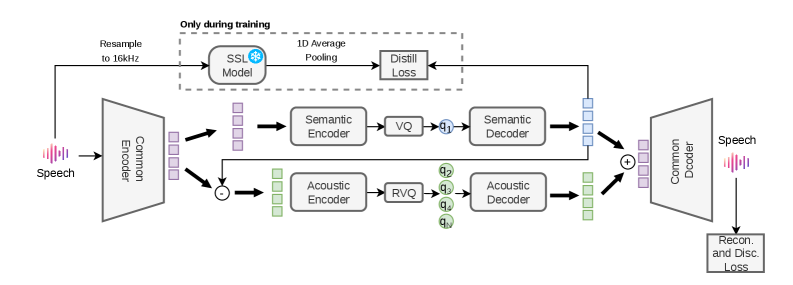
*Figure 1:HybridCodec Architecture: Dual-stream with semantic distillation*

---
**Usage Info**: 3098 tokens used.
**Generated at**: 2026-06-08 17:26:06

---

# 📚 Making the Most of Limited Data: Score-Aware Training for Text-to-Music Generation

🚀 URL: https://arxiv.org/html/2606.07387

## 🌏 Abstract (원문)
State-of-the-art text-to-music generation systems rely on massive proprietary datasets and industrial-scale compute, making it impossible to disentangle architectural contributions from resource advantages. We propose score-aware training, which treats audio-caption alignment score as a direct supervision signal throughout the pipeline. Rather than discarding low-scoring segments, we repurpose them via a CLAP-conditioned Beta noise timestep schedule that routes them to high-noise training regimes, acting as an effective implicit regularizer. Complementarily, segment-level filtering removes the most misaligned examples, and a two-stage caption procedure bridges the distribution gap between verbose training captions and concise inference prompts. A REPA auxiliary loss further transfers structured semantic knowledge from pretrained CLAP and MuQ encoders without additional data. Our 450M-parameter FluxAudio-based system, submitted to the ICME 2026 ATTM Grand Challenge Efficiency Track, ranked 2nd across both tracks in the objective evaluation and 3rd in the Efficiency Track in the final MOS evaluation.
## 🌏 Abstract (번역)
최첨단 텍스트-음악 생성 시스템은 방대한 독점 데이터셋과 산업 규모의 컴퓨팅 자원에 의존하며, 이는 아키텍처적 기여와 자원적 이점을 분리하기 어렵게 만듭니다. 우리는 파이프라인 전반에 걸쳐 오디오-캡션 정렬 점수를 직접적인 지도 신호로 활용하는 점수 인식 훈련(score-aware training)을 제안합니다. 낮은 점수의 세그먼트를 버리는 대신, CLAP 조건부 베타 노이즈 타임스텝 스케줄을 통해 이를 높은 노이즈 훈련 체제로 유도하여 효과적인 암묵적 정규화 장치로 재활용합니다. 보완적으로, 세그먼트 수준 필터링은 가장 잘못 정렬된 예시들을 제거하며, 2단계 캡션 절차는 장황한 훈련 캡션과 간결한 추론 프롬프트 사이의 분포 격차를 해소합니다. REPA 보조 손실은 추가 데이터 없이 사전 훈련된 CLAP 및 MuQ 인코더로부터 구조화된 의미론적 지식을 추가로 전달합니다. ICME 2026 ATTM 그랜드 챌린지 효율성 트랙에 제출된 우리의 4억 5천만 파라미터 FluxAudio 기반 시스템은 객관적 평가에서 두 트랙 모두에서 2위를 차지했으며, 최종 MOS 평가에서는 효율성 트랙에서 3위를 기록했습니다.

## 🔍 Methods & Results
- 점수 인식 훈련(Score-aware training) 원칙을 도입하여 데이터 선택, 노이즈 스케줄링, 텍스트 조건화, 표현 학습 등 파이프라인의 각 구성 요소를 샘플 품질 추정치에 기반하여 체계적으로 조정합니다.
- CLAP 기반 세그먼트 선택 및 필터링을 통해 오디오 파일당 15개의 10초 후보 세그먼트를 추출하고 CLAP 점수를 계산합니다. 세그먼트를 세 가지 품질 등급(S_high: ≥0.33, S_medium: 0.20~0.33, S_low: <0.20)으로 나누어 낮은 점수의 세그먼트는 버리고, 각 파일당 6개의 세그먼트를 높은 점수 우선순위로 선택하여 훈련 데이터의 정렬 품질을 최대화합니다.
- 2단계 캡션 절차를 사용합니다. 사전 훈련(Pretraining) 단계에서는 Qwen-style 및 MusicFlamingo-style과 같은 정보 밀도가 높은 캡션을 사용하여 장르, 악기 구성, 분위기, 템포, 키, 박자 등 상세한 음악적 속성을 학습하여 광범위한 음악 지식을 구축합니다. 미세 조정(Fine-tuning) 단계에서는 LLM을 사용하여 캡션을 간결하고 높은 수준의 추론 프롬프트 스타일(장르, 악기 구성, 분위기)로 재작성하여, 사전 훈련에서 얻은 미세한 음악 지식을 유지하면서 추론 시 접하는 프롬프트 분포와의 불일치를 해소합니다.
- CLAP 조건부 베타 노이즈 타임스텝 스케줄을 도입하여 정렬이 완벽하지 않지만 무시할 수 없는 세그먼트를 재활용합니다. 각 훈련 세그먼트의 CLAP 점수(S)에 따라 노이즈 타임스텝(t) 분포를 베타 분포로 조건화하여, 높은 점수 세그먼트(S≈1)는 모든 노이즈 수준에서 균일한 훈련 신호를 받고, 낮은 점수 세그먼트(S→0)는 높은 노이즈 체제(t≈1)로 유도되어 거친 의미론적 레이아웃을 확립하는 데 기여하며 암묵적인 정규화 역할을 합니다.
- REPA(Representation Alignment) 보조 손실을 사용하여 조건부 플로우 매칭 목표를 보강하고 사전 훈련된 CLAP 및 MuQ 인코더로부터 구조화된 의미론적 지식을 추가 데이터 없이 전이합니다. CLAP 브랜치는 모델의 은닉 상태를 CLAP 임베딩 공간에 정렬하여 전역 오디오-텍스트 의미론을 학습하고, MuQ 브랜치는 모델의 은닉 상태를 MuQ 특징에 시퀀스 수준으로 정렬하여 음색 및 악기 구성과 같은 음악 특정 구조를 포착합니다. 두 손실 모두 낮은 노이즈 수준에서 정렬을 더 중요하게 가중치 부여합니다.
- 4억 5천만 파라미터의 FluxAudio 기반 시스템을 개발하여 ICME 2026 ATTM 그랜드 챌린지 효율성 트랙에 제출했습니다. 이 시스템은 객관적 평가에서 두 트랙 모두 2위, 최종 MOS 평가에서는 효율성 트랙 3위를 기록했습니다.

## 🖼 Figures
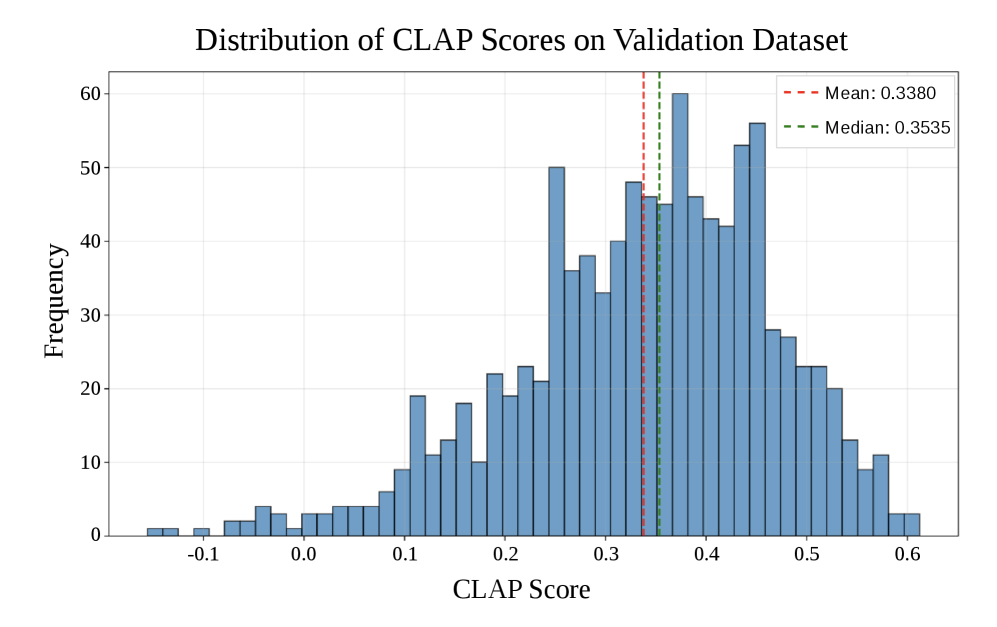
*Figure 1:CLAP score distribution of the validation dataset.*

*Figure 2:Effect of the CLAP score 
𝑆
 on the timestep sampling distribution under the proposed Beta schedule (
𝜆
=
1.0
). High-score segments (
𝑆
=
1.0
) recover uniform sampling across all noise levels, while progressively lower-score segments concentrate their sampling mass near 
𝑡
=
1
.*

![Figure 3:Overview of our model architecture. The backbone is a FluxAudio Diffusion Transformer (DiT) conditioned on dual text representations: FLAN-T5 provides sequential token embeddings via cross-attention, while CLAP provides a global semantic embedding combined with the timestep embedding. Audio latents are encoded by the frozen ACEStep 1.5 codec. Hidden states extracted after the joint and fused transformer blocks are used for two auxiliary representation alignment branches: CLAP REPA (Setting 1 and 2) and MuQ REPA (Setting 2 only). At inference, the predicted flow velocity is decoded back to a waveform by the frozen ACEStep decoder.](../images/2026-06-08/2606.07387/2606.07387_fig2.png)
*Figure 3:Overview of our model architecture. The backbone is a FluxAudio Diffusion Transformer (DiT) conditioned on dual text representations: FLAN-T5 provides sequential token embeddings via cross-attention, while CLAP provides a global semantic embedding combined with the timestep embedding. Audio latents are encoded by the frozen ACEStep 1.5 codec. Hidden states extracted after the joint and fused transformer blocks are used for two auxiliary representation alignment branches: CLAP REPA (Setting 1 and 2) and MuQ REPA (Setting 2 only). At inference, the predicted flow velocity is decoded back to a waveform by the frozen ACEStep decoder.*

*Figure 4:Validation loss for base vs. MuQ REPA. The MuQ run starts from a higher initial loss (
≈
2.0
 vs. 
≈
1.88
) and converges substantially more slowly, confirming it has not converged within the 20,000-iteration budget.*

*Figure 5:Training (top) and validation (bottom) loss for the Beta schedule ablation. While the base model achieves the lowest training loss, it overfits severely after step 
≈
7
,
500
, with validation loss rising sharply. All Beta variants cluster tightly in training and generalize substantially better.*

---
**Usage Info**: 6200 tokens used.
**Generated at**: 2026-06-08 17:27:05

---

# 📚 Mitigating Proxy-to-Wild Domain Gap in Deepfake Speech

🚀 URL: https://arxiv.org/html/2606.07494

## 🌏 Abstract (원문)
Recent neural audio codec-based speech generation (CodecFake) produces highly realistic audio, posing a challenge to existing deepfake countermeasure models. While using codec resynthesized speech (CoRS) as proxy data improves performance, it often suffers from limited generalization. We propose Domain-Shift Feature Augmentation (DSFA), which simulates "in-the-wild" variations by transforming deterministic feature statistics into stochastic distributions during fine-tuning. To evaluate generalization, we further introduce Codec-based Speech Generation Extension Evaluation (CoSG ExtEval) dataset, a more challenging extension of the CoSG Eval (from CodecFake+) dataset, featuring 40 unseen generative models and long-form audio. Experimental results demonstrate that combining a post-trained SSL backbone with DSFA effectively narrows the proxy-to-wild domain gap. This approach achieves state-of-the-art performance across diverse CodecFake attacks in both CoSG Eval and CoSG ExtEval.
## 🌏 Abstract (번역)
최근 신경망 오디오 코덱 기반 음성 생성(CodecFake)은 매우 사실적인 오디오를 생성하여 기존 딥페이크 방어 모델에 도전 과제를 제시합니다. 코덱 재합성 음성(CoRS)을 프록시 데이터로 사용하는 것이 성능을 향상시키지만, 종종 제한된 일반화에 어려움을 겪습니다. 우리는 미세 조정(fine-tuning) 과정에서 결정론적 특징 통계를 확률적 분포로 변환하여 '실제 환경(in-the-wild)' 변형을 시뮬레이션하는 도메인-시프트 특징 증강(DSFA)을 제안합니다. 일반화 성능을 평가하기 위해, 우리는 CodecFake+ 데이터셋의 CoSG Eval보다 더 도전적인 확장판인 Codec-based Speech Generation Extension Evaluation (CoSG ExtEval) 데이터셋을 추가로 소개하며, 이 데이터셋은 40개의 미학습 생성 모델과 장문 오디오를 포함합니다. 실험 결과는 사후 학습된 SSL 백본과 DSFA를 결합하는 것이 프록시-실제 환경 도메인 간극을 효과적으로 좁힌다는 것을 보여줍니다. 이 접근 방식은 CoSG Eval과 CoSG ExtEval 모두에서 다양한 CodecFake 공격에 대해 최첨단 성능을 달성합니다.

## 🔍 Methods & Results
- 제안된 프레임워크는 딥페이크에 특화된 사후 학습된 SSL 백본과 도메인-시프트 특징 증강(DSFA)을 활용하여 프록시-실제 환경 도메인 간극을 해소합니다.
- SSL 백본은 대규모의 이질적인 코퍼스에서 딥페이크 탐지를 위해 사후 학습되어 딥페이크 아티팩트 및 다양한 본래 속성에 대한 높은 민감도를 제공합니다.
- DSFA는 미세 조정 중 결정론적 특징 통계를 확률적 분포로 변환하여 '실제 환경' 변형을 시뮬레이션함으로써, 보이지 않는 데이터에 대한 성능 저하를 해결하고 프록시 데이터에 대한 과적합을 방지합니다.
- DSFA는 원본 특징 통계 추정, 도메인-시프트 분포 모델링, 도메인-시프트 샘플링을 통한 증강의 세 단계를 포함합니다.
- 원본 특징 통계 추정 단계에서는 SSL 백본의 잠재 특징 맵에서 채널별 평균과 표준 편차를 추출하여 음향 스타일 및 코덱 서명과 같은 도메인 '스타일'을 포착합니다.
- 도메인-시프트 분포 모델링 단계에서는 미니 배치 분산을 사용하여 결정론적 특징 통계를 확률적 분포로 변환하고 도메인 불확실성을 모델링하여 잠재적인 도메인 시프트 방향을 시뮬레이션합니다.
- 도메인-시프트 샘플링을 통한 증강 단계에서는 통일된 섭동(perturbation) 방식을 통해 평균과 표준 편차를 증강하고, Adaptive Instance Normalization (AdaIN) 메커니즘을 사용하여 증강된 특징 맵을 합성하며, 이는 훈련 중 확률 p로 적용됩니다.
- 손실 함수는 지도 대비(SupCon) 손실과 교차 엔트로피(CE) 손실을 결합한 공동 훈련 목표를 사용하여 판별력을 향상시킵니다.
- 모델 일반화 평가를 위해 CodecFake+의 CoSG Eval 세트의 확장판인 CoSG ExtEval 데이터셋을 구축했으며, 이는 40개의 미학습 생성 모델과 장문 오디오를 포함하여 더 다양하고 도전적인 조건을 제공합니다.
- 실험 결과, 사후 학습된 SSL 백본과 DSFA의 결합은 프록시-실제 환경 도메인 간극을 효과적으로 좁히며, CoSG Eval 및 CoSG ExtEval 모두에서 다양한 CodecFake 공격에 대해 최첨단 성능을 달성했습니다.

## 🖼 Figures

*Figure 1:Overview of the Domain Shift Feature Augmentation (DSFA) method. The proposed method estimates feature statistics 
𝜇
 and 
𝜎
 to construct probabilistic distributions for sampling. For visual clarity, only the mean statistic 
𝜇
 is illustrated in this figure.*

*(a)Baseline Mean*

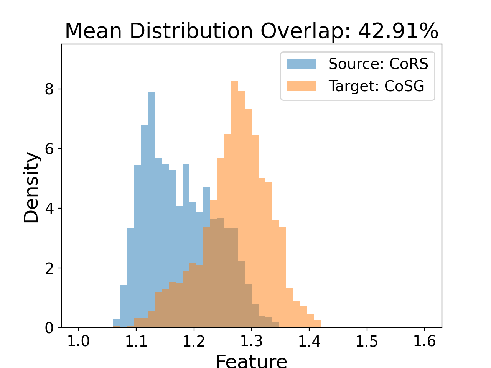
*(a)Baseline Mean*

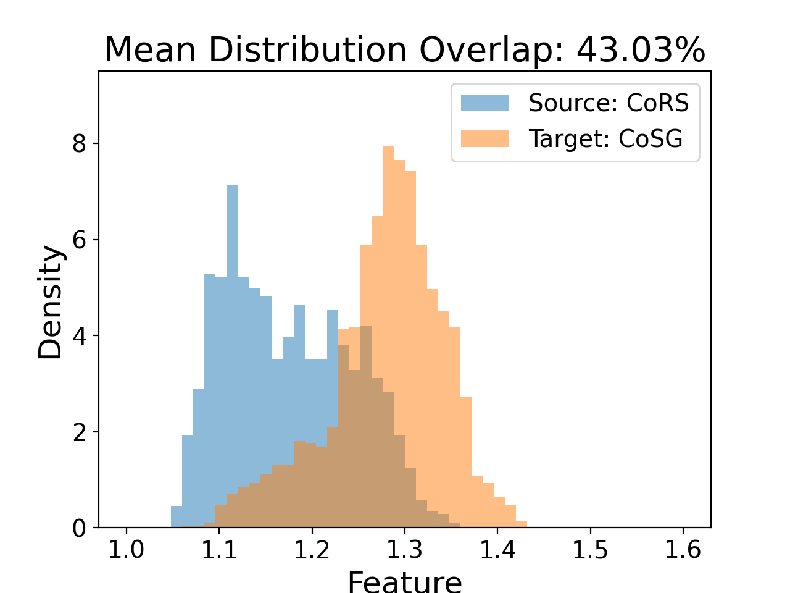
*(b)DSFA Mean*

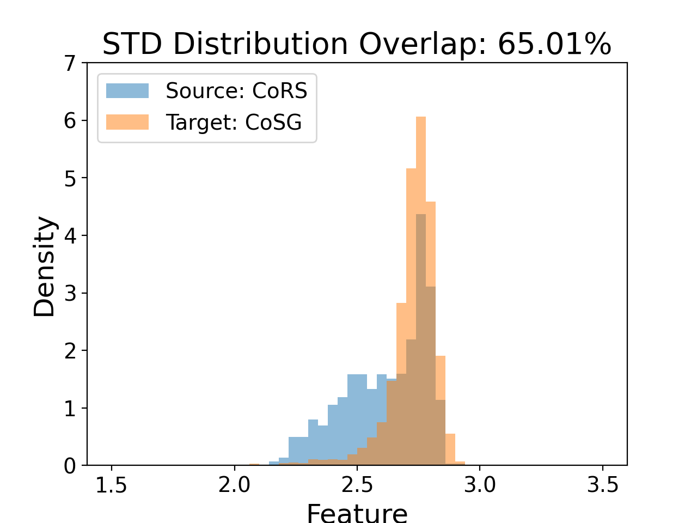
*(c)Baseline Standard Derivation*

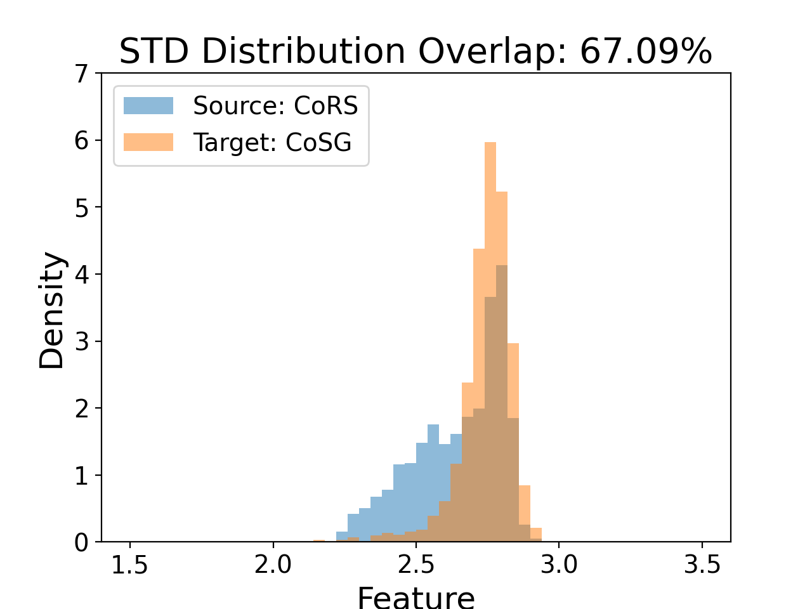
*(d)DSFA Standard Derivation*

---
**Usage Info**: 3453 tokens used.
**Generated at**: 2026-06-08 17:27:49

---

# 📚 DirectAudioEdit: Inversion-Free Text-Guided Audio Editing via Diffusion Prediction Contrast

🚀 URL: https://arxiv.org/html/2606.07356

## 🌏 Abstract (원문)
Text-guided audio editing aims to modify the language-specified acoustic content while preserving edit-irrelevant source components. Existing training-free methods typically rely on inversion-based editing. While inversion-free editing is appealing as it decreases computational overhead and reconstruction errors, it remains largely unexplored for audio editing. The key challenge is to construct a source-to-target editing path through diffusion denoising dynamics. In this paper, we introduceDirectAudioEdit, the first attempt to develop a training-free and inversion-free method for audio editing. Experiments on music and event-level benchmarks across two backbones show thatDirectAudioEditreduces macro-averaged FAD and KL by 15.9% and 15.8% compared with DDPM inversion, while achieving up to 64.5% editing speedup111Project:https://directaudioedit.github.io/.
## 🌏 Abstract (번역)
텍스트 기반 오디오 편집은 언어로 지정된 음향 콘텐츠를 수정하면서 편집과 관련 없는 원본 구성 요소를 보존하는 것을 목표로 합니다. 기존의 학습 없는(training-free) 방법들은 일반적으로 인버전 기반 편집에 의존합니다. 인버전 없는(inversion-free) 편집은 계산 오버헤드와 재구성 오류를 줄여주므로 매력적이지만, 오디오 편집 분야에서는 아직 많이 탐구되지 않았습니다. 핵심 과제는 확산 노이즈 제거 역학을 통해 소스에서 타겟으로의 편집 경로를 구축하는 것입니다. 본 논문에서는 오디오 편집을 위한 학습 없고 인버전 없는 방법론을 개발하려는 첫 시도인 DirectAudioEdit을 소개합니다. 두 가지 백본에 걸쳐 음악 및 이벤트 수준 벤치마크에 대한 실험 결과, DirectAudioEdit은 DDPM 인버전과 비교하여 매크로 평균 FAD 및 KL을 각각 15.9%와 15.8% 감소시키면서 최대 64.5%의 편집 속도 향상을 달성했습니다.

## 🔍 Methods & Results
- 기존 확산 모델 기반 오디오 편집에서 인버전 없는 편집은 SDE의 불확실한 경로와 타겟 편집 경로 예측의 어려움으로 인해 최적화되지 않는다는 문제를 제기합니다.
- DirectAudioEdit은 학습 없고 인버전 없는 오디오 편집 방법론으로, 확산 노이즈 제거 역학을 통해 소스-타겟 편집 경로를 구축합니다.
- 핵심 방법론은 소스 및 타겟 브랜치를 비교 가능하게 만드는 '공유 노이즈 재노이즈(shared-noise re-noising)' 방식을 도입하여 편집 방향을 추정합니다.
- 소스 브랜치는 원본 오디오의 안정적인 구조적 참조 역할을 하며, 타겟 브랜치는 원하는 편집 의미론을 주입하는 역할을 합니다.
- 편집 방향은 타겟 조건부 역방향 변위(Δttgt)와 소스 조건부 역방향 변위(Δtsrc) 간의 확산 예측 대비(Δtedit = Δttgt - Δtsrc)로 정의됩니다.
- 이 대비(Δtedit)는 깨끗한 편집 상태(ZtDP)에 대한 1차 보정으로 사용되어, 편집 경로를 타겟 의미론으로 유도하면서 소스 조건부 구조를 유지합니다.
- Classifier-free guidance(CFG)는 소스 브랜치에는 고정된 가이던스 스케일을, 타겟 브랜치에는 편집 진행에 따라 점진적으로 강화되는 가이던스 스케일을 적용하는 비대칭 전략을 사용합니다.
- 음악 및 이벤트 수준 벤치마크 실험 결과, DirectAudioEdit은 DDPM 인버전 대비 매크로 평균 FAD를 15.9%, KL을 15.8% 감소시켰습니다.
- DirectAudioEdit은 또한 DDPM 인버전 대비 최대 64.5%의 편집 속도 향상을 달성했습니다.

## 🖼 Figures

*Figure 1: Mel-spectrograms of (a) the source audio, (b) the DDIM-inversion reconstruction, and (c) the edited audio produced by Tango2. The highlighted regions show that inversion-induced deviations can be carried into target-conditioned editing, causing distortion beyond the intended guitar-to-piano edit.*

*Figure 2: Comparison of editing paradigms. (a) Inversion-based editing reconstructs a noisy source trajectory before target-guided denoising, while (b) reinterprets it as a direct source-to-target trajectory. (c) FlowEdit implements inversion-free editing in flow models via flow-direction contrast, whereas (d) DirectAudioEdit implements it in diffusion models via shared-noise re-noising and reverse-dynamics contrast.*

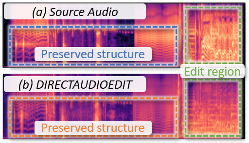
*Figure 5: Qualitative case study of DirectAudioEdit. DirectAudioEdit introduces the target edit while preserving the main source structure.*

*Figure 6: Mel-spectrogram comparison on the Tango2 backbone. The source prompt is “Cats meowing and then wind”, and the target prompt is “Cats meowing and then a violent thunderstorm”. For each method, the left column shows reconstruction results obtained by setting the target prompt to the source prompt, while the right column shows editing results generated with the target prompt.*

---
**Usage Info**: 3085 tokens used.
**Generated at**: 2026-06-08 17:27:58

---

# 📚 Leveraging Soft Distributions of SSL-Derived Discrete Speech Tokens for Downstream Inference

🚀 URL: https://arxiv.org/html/2606.06806

## 🌏 Abstract (원문)
Discrete speech tokens obtained from self-supervised learning (SSL) models provide efficient data compression while maintaining strong performance, and have been widely used as intermediate representations in various tasks. However, discretization inevitably causes information loss, leading to degraded performance compared with continuous SSL features. In this work, we propose to apply soft token assignment only during downstream inference. This approach preserves the efficiency of hard discretization during training while enhancing the expressiveness of the tokens at inference. The proposed method outperforms conventional hard assignment on both ASR and speech synthesis tasks, and exhibits particularly strong generalizability to out-of-domain data. For ASR of non-native speech, it even surpasses models using continuous SSL features. Moreover, analysis of the resulting representations shows they align more accurately with phonemes compared with conventional hard assignment.
## 🌏 Abstract (번역)
자기 지도 학습(SSL) 모델에서 얻은 이산 음성 토큰은 강력한 성능을 유지하면서 효율적인 데이터 압축을 제공하며, 다양한 작업에서 중간 표현으로 널리 사용되어 왔다. 그러나 이산화는 필연적으로 정보 손실을 야기하여 연속적인 SSL 특징에 비해 성능 저하를 초래한다. 본 연구에서는 다운스트림 추론 시에만 소프트 토큰 할당을 적용하는 방법을 제안한다. 이 접근 방식은 훈련 중에는 하드 이산화의 효율성을 유지하면서 추론 시 토큰의 표현력을 향상시킨다. 제안된 방법은 ASR 및 음성 합성 작업 모두에서 기존의 하드 할당보다 우수한 성능을 보였으며, 특히 도메인 외부 데이터에 대한 강력한 일반화 가능성을 나타냈다. 비원어민 음성의 ASR의 경우, 연속적인 SSL 특징을 사용하는 모델을 능가하기도 했다. 또한, 결과 표현에 대한 분석은 기존의 하드 할당에 비해 음소와 더 정확하게 정렬됨을 보여준다.

## 🔍 Methods & Results
- 다운스트림 추론 시에만 소프트 토큰 할당을 적용하는 방법을 제안하여, 훈련 중 하드 이산화의 효율성을 유지하면서 추론 시 토큰의 표현력을 향상시켰다.
- 제안된 방법은 ASR 및 음성 합성 작업 모두에서 기존의 하드 할당보다 우수한 성능을 달성했다.
- 도메인 외부 데이터에 대해 특히 강력한 일반화 가능성을 보였다.
- 비원어민 음성의 ASR 작업에서는 연속적인 SSL 특징을 사용하는 모델을 능가하는 성능을 나타냈다.
- 결과 표현에 대한 분석 결과, 기존의 하드 할당보다 음소와 더 정확하게 정렬됨을 확인했다.

## 🖼 Figures

*Figure 1:Change in WER on the ASR task with varying softmax temperature parameter 
𝜏
 (WavLM-large): (a) test-clean, (b) TED-LIUM v2, (c) CHiME4, (d) ERJ*

---
**Usage Info**: 1728 tokens used.
**Generated at**: 2026-06-08 17:28:06

---

