# 🚩 (2026-06-10) Scholar Inbox 추천 논문 

# 📚 Speech Meets ELF: Audio Conditional Continuous-Target Diffusion for Speech Recognition and Translation

🚀 URL: https://arxiv.org/html/2606.10368

## 🌏 Abstract (원문)
Speech-to-text (S2T) systems for recognition (ASR) and translation (S2TT) typically generate discrete text tokens. In contrast, continuous-target language modelling performs generation in a continuous space, yet its potential for S2T remains unexplored. To bridge this gap, we propose ELF-S2T, an audio-conditioned continuous-target generative model for S2T. Built upon the pre-trained Embedded Language Flows (ELF) backbone, ELF-S2T processes speech via a frozen Whisper encoder and a single linear projector, prepending the resulting audio condition to the noisy text latent for in-context, flow-matching denoising. To prevent the model from over-relying on its pre-trained text context, we introduce audio forcing during training, and further amplify the audio condition via classifier-free guidance at inference. Experiments on LibriSpeech and CoVoST2 show that ELF-S2T achieves competitive ASR and S2TT performance. Crucially, our error analysis reveals that, although ASR and S2TT errors look very different on the surface, both stem from the same underlying cause, a close distance confusion in the continuous latent space. This finding naturally aligns with the continuous representation generation paradigm, indicating a common semantic mapping process beneath recognition and translation. Our code and pretrained models are publicly available athttps://github.com/Sslnon/ELF-S2T.
## 🌏 Abstract (번역)
음성-텍스트(S2T) 시스템은 음성 인식(ASR) 및 음성 번역(S2TT)을 위해 일반적으로 이산적인 텍스트 토큰을 생성합니다. 이와 대조적으로, 연속 목표 언어 모델링은 연속 공간에서 생성을 수행하지만, S2T에 대한 그 잠재력은 아직 탐구되지 않았습니다. 이 간극을 메우기 위해, 우리는 S2T를 위한 오디오 조건부 연속 목표 생성 모델인 ELF-S2T를 제안합니다. 사전 학습된 Embedded Language Flows (ELF) 백본을 기반으로 구축된 ELF-S2T는 고정된 Whisper 인코더와 단일 선형 프로젝터를 통해 음성을 처리하며, 결과로 생성된 오디오 조건을 노이즈가 있는 텍스트 잠재 공간에 추가하여 인컨텍스트, 플로우 매칭 디노이징을 수행합니다. 모델이 사전 학습된 텍스트 컨텍스트에 과도하게 의존하는 것을 방지하기 위해, 우리는 훈련 중에 오디오 강제(audio forcing)를 도입하고, 추론 시에는 분류기 없는 안내(classifier-free guidance)를 통해 오디오 조건을 더욱 증폭시킵니다. LibriSpeech 및 CoVoST2에 대한 실험 결과, ELF-S2T는 경쟁력 있는 ASR 및 S2TT 성능을 달성했습니다. 결정적으로, 우리의 오류 분석은 ASR 및 S2TT 오류가 표면적으로는 매우 다르게 보이지만, 둘 다 연속 잠재 공간에서의 근접 거리 혼동이라는 동일한 근본 원인에서 비롯된다는 것을 밝혀냈습니다. 이 발견은 연속 표현 생성 패러다임과 자연스럽게 일치하며, 인식 및 번역 아래에 공통된 의미 매핑 프로세스가 있음을 나타냅니다. 우리의 코드와 사전 학습된 모델은 https://github.com/Sslnon/ELF-S2T에서 공개적으로 이용 가능합니다.

## 🔍 Methods & Results
- ELF-S2T는 오디오 조건부 연속 텍스트 공간 생성 방식으로 음성-텍스트(S2T)를 수행하며, 음성 인식(ASR) 및 음성 번역(S2TT)에 동일한 아키텍처를 사용합니다.
- 사전 학습된 Embedded Language Flows (ELF) 백본을 기반으로 하며, 고정된 Whisper 인코더와 단일 선형 프로젝터를 통해 음성 입력을 연속 텍스트 잠재 공간으로 매핑합니다.
- 노이즈가 있는 텍스트 잠재 공간에 오디오 조건을 추가한 후, 플로우 매칭 트랜스포머가 노이즈 제거를 수행하고, 최종 단계에서 학습된 디코드 헤드가 연속 잠재 공간을 이산 토큰으로 변환합니다.
- 모델이 사전 학습된 텍스트 컨텍스트에 과도하게 의존하는 것을 방지하기 위해, 디코드 헤드 감독 시 람다(λ) 분포를 조정하여 오디오 조건의 필요성을 강화하는 '오디오 강제(audio forcing)' 기법을 도입했습니다.
- 추론 시 오디오 조건의 영향을 증폭시키기 위해, 조건부 및 무조건부 브랜치를 함께 훈련하고 '분류기 없는 안내(classifier-free guidance)'를 사용하여 두 브랜치를 결합합니다.
- LibriSpeech 및 CoVoST2 데이터셋에서 경쟁력 있는 ASR 및 S2TT 성능을 달성했습니다.
- ASR 및 S2TT 오류가 표면적으로는 다르지만, 연속 잠재 공간 내에서의 '근접 거리 혼동'이라는 동일한 근본 원인에서 발생함을 발견했으며, 이는 인식과 번역 모두에 공통된 의미 매핑 프로세스가 있음을 시사합니다.

## 🖼 Figures

*Figure 1:ELF-S2T casts speech-to-text as audio-conditioned generation in a continuous text space. Starting from Gaussian noise at 
𝑡
=
0
, the text latent is denoised toward the target under the audio condition, and tokens are unembedded only at the final step 
𝑡
=
1
.*

*Figure 2:Overview of ELF-S2T. A frozen Whisper encoder and a single projector turn speech into an audio condition that is prepended to the noisy text latent and denoised by the shared ELF backbone. (a) Training. A denoise head and a decode head are trained jointly, and our audio forcing weakens the text latent so the model must read the audio condition. (b) Inference. From Gaussian noise the backbone runs over SDE steps under audio guidance (ACFG), and tokens are decoded only at the final step.*

*Figure 3:Sweeps of the audio-guidance scale 
𝑤
 (a) and the sampler-step count 
𝐾
 (b) on ELF-B under the audio-forcing recipe, for ASR (blue, WER) and S2TT (red, BLEU). WER axes are inverted so that up is better on both curves. In (b), 
𝐾
∈
{
32
,
64
,
128
}
 is plotted against relative inference cost, normalised to 
𝐾
=
32
.*

---
**Usage Info**: 4962 tokens used.
**Generated at**: 2026-06-10 16:57:13

---

# 📚 Interpreting and Steering a Text-to-Speech Language Model with Sparse Autoencoders

🚀 URL: https://arxiv.org/html/2606.10029

## 🌏 Abstract (원문)
Language models increasingly serve as the backbone of text-to-speech (TTS) systems, yet we understand little about the representations they build when text and generated speech tokens share a single residual stream. We train BatchTopK sparse autoencoders on the LM backbone of CosyVoice3 and introduce a modality-aware auto-interp pipeline that labels each feature from where it fires—text-prefix context, 1-second speech clips, or both. The recovered features are interpretable, spanning phonemes, laughter, accent prompts and speaker gender. Steering through the SAE latent space shows these features are causal rather than merely descriptive: targeted interventions raise laughter probability from 0.02 to 0.79, flip perceived speaker gender, and control speech rate while preserving spoken content. SAE features thus serve both as interpretability objects and as control directions for TTS synthesis.
## 🌏 Abstract (번역)
언어 모델은 텍스트 음성 변환(TTS) 시스템의 핵심으로 점점 더 많이 사용되고 있지만, 텍스트와 생성된 음성 토큰이 단일 잔차 스트림을 공유할 때 언어 모델이 구축하는 표현에 대해서는 거의 알려져 있지 않습니다. 우리는 CosyVoice3의 LM 백본에 BatchTopK 희소 오토인코더(SAE)를 훈련하고, 각 특징이 활성화되는 위치(텍스트 접두사 컨텍스트, 1초 음성 클립 또는 둘 다)에 따라 레이블을 지정하는 양식 인식 자동 해석 파이프라인을 도입합니다. 복구된 특징들은 음소, 웃음, 억양 프롬프트 및 화자 성별을 아우르며 해석 가능합니다. SAE 잠재 공간을 통한 조작은 이러한 특징들이 단순히 기술적인 것이 아니라 인과적임을 보여줍니다. 즉, 특정 개입을 통해 웃음 확률을 0.02에서 0.79로 높이고, 인지된 화자 성별을 바꾸며, 발화 내용을 보존하면서 말하기 속도를 제어할 수 있습니다. 따라서 SAE 특징은 TTS 합성을 위한 해석 가능성 객체이자 제어 방향으로 기능합니다.

## 🔍 Methods & Results
- CosyVoice3의 LLM 잔차 스트림에 희소 오토인코더(SAE)를 적용하고, 각 특징의 가장 강한 활성화를 텍스트, 오디오 또는 혼합 증거로 라우팅하는 양식 인식 자동 해석 파이프라인을 도입했습니다.
- CosyVoice3는 Qwen2.5-0.5B를 LM 백본으로 사용하며, BPE 어휘로 토큰화된 텍스트 프롬프트를 받아 25Hz의 이산 음성 토큰을 자기회귀적으로 생성합니다.
- BatchTopK SAE는 CosyVoice3 LM 백본의 여러 레이어에 대해 딕셔너리 크기 16,384, 토큰당 활성 특징 50개로 Emilia 데이터셋의 약 2억 5천만 토큰에 대해 훈련되었습니다.
- 각 SAE 특징은 활성화된 토큰 위치의 경험적 토큰 유형 구성에 따라 양식(오디오 전용, 텍스트 전용, 혼합)이 결정됩니다. 음성 비율이 0.8 이상이면 오디오 모달, 0.2 이하면 텍스트 모달, 그 외는 혼합 모달로 분류됩니다.
- Gemini 3.0 Pro를 사용하여 양식 인식 프롬프트로 특징에 레이블을 지정했습니다. 텍스트 모달 특징에는 텍스트 증거가, 오디오 모달 특징에는 1초 음성 클립이, 혼합 특징에는 두 가지 모두 제공되었습니다.
- 레이블 평가는 멀티모달 증거에 적합한 탐지 스타일 작업으로 수행되었으며, AUROC 및 균형 정확도가 보고되었습니다.
- SAE 잠재 공간을 통해 개입하여 TTS 생성에 인과적으로 영향을 미쳤습니다. 음성 토큰 잔차 상태를 인코딩하고, 선택된 특징 활성화를 조정한 다음, 수정된 잠재 상태를 모델 잔차 스트림으로 디코딩하여 웃음 확률, 화자 성별, 말하기 속도 등을 제어할 수 있음을 입증했습니다.

## 🖼 Figures

*Figure 1:Layer sweep across the Qwen2.5-0.5B backbone. (a) SAE explained variance by token type. (b) Feature modality composition. Middle layers mix text and speech evidence, layers 16–20 become audio-heavy, and the final hidden state becomes mostly text-modal.*

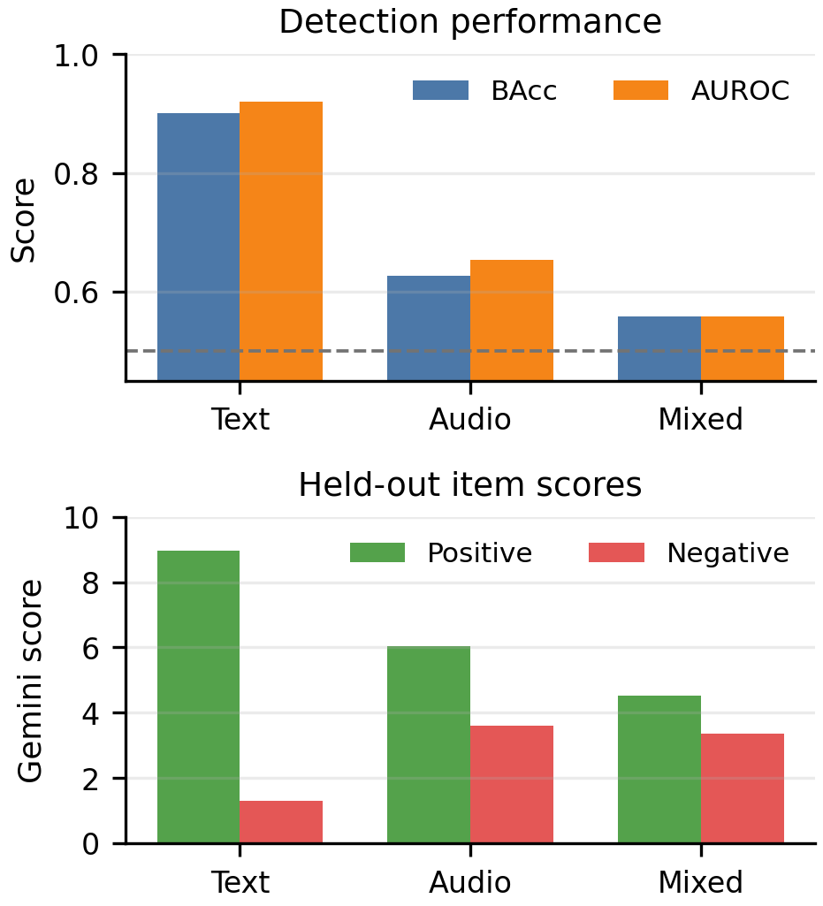
*Figure 2:Held-out auto-interp scores for layer-20 features. Text labels are easiest to verify; mixed labels are hardest.*

*Figure 3: Gender steering split by prompt-speaker gender. Feature 11402 shifts both male- and female-prompted generations toward the target gender.*

*Figure 4: Steering effects for laughter, speaker-gender cues, and speech rate. Error bars show 
±
1
 SEM over the 
40
-voice 
×
 
10
-text prompts grid.*

*Figure 5:CosyVoice-aware view of our modality-aware SAE interpretation pipeline. CosyVoice3 synthesizes speech by passing text and prompt audio through tokenizers, an LLM backbone, discrete speech token generation, DiT flow matching, and a HiFi-GAN vocoder. Our analysis attaches SAEs to the LLM residual stream, uses exact text/speech boundaries to route top activations to text, audio, or mixed evidence, then labels and scores the resulting features.*

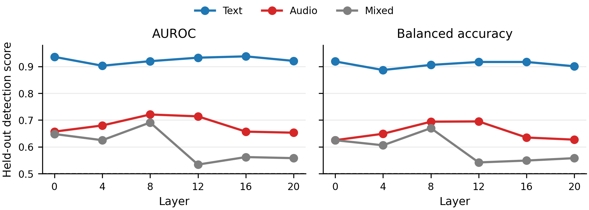
*Figure 6:Rank-held-out auto-interp scores across completed layers. Text-modal labels remain consistently easiest to verify; audio-modal labels are above chance but weaker; mixed labels are the most variable.*

*Figure 7:Raw-residual probe ROC-AUC as a function of layer for laughter, emotion, and accent. Emotion and accent are shown as mean with min–max bands across their class-specific probes. All three concepts exceed 
0.99
 ROC-AUC by 
𝐿
=
8
.*

*Figure 8:Top-1 SAE feature ROC-AUC as a function of layer. This monosemanticity test asks whether a single SAE coordinate is sufficient to separate each concept from neutral speech. Laughter and emotion peak around 
𝐿
=
12
–
16
, while accent is most localized around 
𝐿
=
8
–
12
.*

---
**Usage Info**: 2709 tokens used.
**Generated at**: 2026-06-10 16:57:23

---

# 📚 SSL-GMMVC: Interpretable Voice Conversion via Locally Linear GMM Transforms in Self-Supervised Representation Space

🚀 URL: https://arxiv.org/html/2606.10317

## 🌏 Abstract (원문)
We introduce SSL-GMMVC, an interpretable voice conversion method in self-supervised speech space. The method models paired source-target features with a Gaussian mixture model and performs conversion as a posterior-weighted sum of affine transforms. This yields locally linear transformations that adapt to heterogeneous feature-space structure while remaining analytically tractable. Through objective and subjective evaluations, we show that SSL-GMMVC improves speaker similarity with comparable intelligibility and naturalness, and that even a constrained covariance variant surpasses a deep learning baseline as the number of mixture components increases. Further analyses link component selection to phonetic structure and reveal interpretable scaling and rotation in the learned transforms. These findings highlight SSL-GMMVC as an effective, analyzable framework for voice conversion.
## 🌏 Abstract (번역)
우리는 자기 지도 학습 음성 공간에서 해석 가능한 음성 변환 방법인 SSL-GMMVC를 소개합니다. 이 방법은 쌍을 이루는 원본-대상 특징을 가우시안 혼합 모델로 모델링하고, 아핀 변환의 사후 확률 가중 합으로 변환을 수행합니다. 이는 이질적인 특징 공간 구조에 적응하면서도 분석적으로 다루기 쉬운 국소 선형 변환을 생성합니다. 객관적 및 주관적 평가를 통해, SSL-GMMVC가 유사한 명료도와 자연스러움을 유지하면서 화자 유사성을 향상시키며, 심지어 제한된 공분산 변형이 혼합 구성 요소 수가 증가함에 따라 딥러닝 기준선을 능가함을 보여줍니다. 추가 분석은 구성 요소 선택을 음성학적 구조와 연결하고 학습된 변환에서 해석 가능한 스케일링 및 회전을 밝혀냅니다. 이러한 발견들은 SSL-GMMVC가 음성 변환을 위한 효과적이고 분석 가능한 프레임워크임을 강조합니다.

## 🔍 Methods & Results
- SSL-GMMVC는 자기 지도 학습 음성 공간에서 쌍을 이루는 원본-대상 특징을 가우시안 혼합 모델로 모델링하고, 아핀 변환의 사후 확률 가중 합으로 음성 변환을 수행합니다.
- 이 방법은 이질적인 특징 공간 구조에 적응하는 국소 선형 변환을 생성하며, 분석적으로 다루기 쉽습니다.
- 객관적 및 주관적 평가 결과, SSL-GMMVC는 유사한 명료도와 자연스러움을 유지하면서 화자 유사성을 향상시켰습니다.
- 제한된 공분산 변형조차도 혼합 구성 요소 수가 증가함에 따라 딥러닝 기준선을 능가하는 성능을 보였습니다.
- 추가 분석을 통해 구성 요소 선택이 음성학적 구조와 연관되어 있으며, 학습된 변환에서 해석 가능한 스케일링 및 회전이 발견되었습니다.

## 🖼 Figures
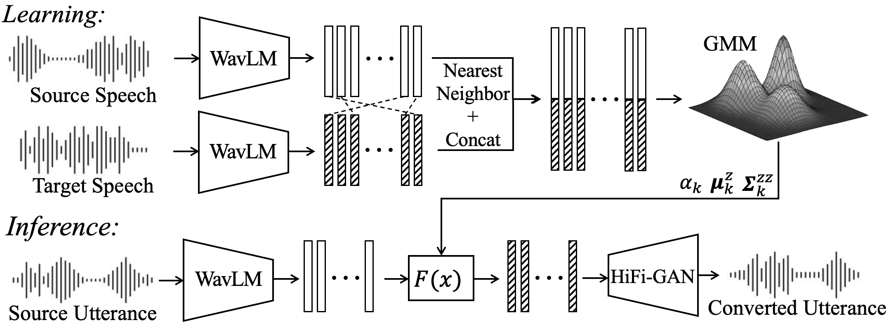
*Figure 1:Overview of SSL-GMMVC*

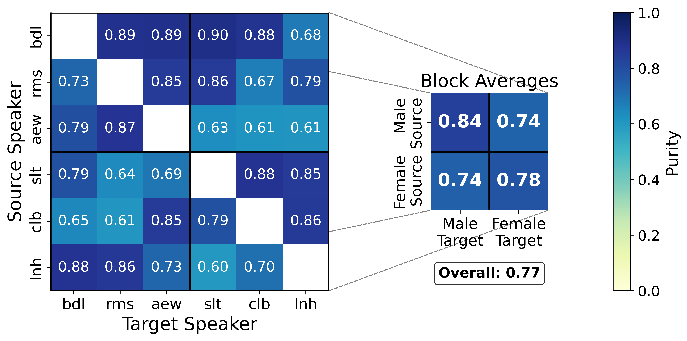
*Figure 2:Purity between mixture selection and sonority (left: speaker pairs; right: gender-pair averages).*

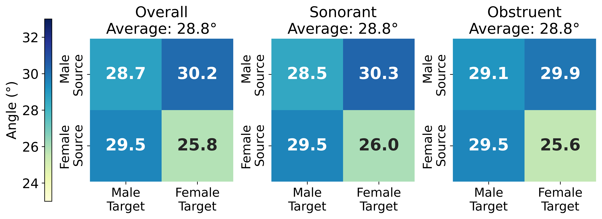
*Figure 3:Average per-frame cosine angles between source and converted SSL features reported for each gender direction and for all / sonorant / obstruent regions.*

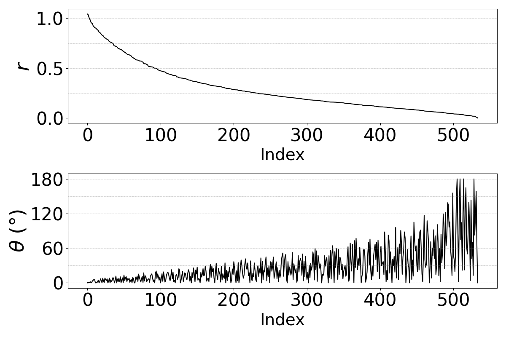
*Figure 4:Spectra of eigenvalues of the conversion matrix for representative speaker pairs.*

---
**Usage Info**: 1255 tokens used.
**Generated at**: 2026-06-10 16:57:28

---

# 📚 LLM Can Read Spectrogram: Encoder-Free Speech-Language Modeling

🚀 URL: https://arxiv.org/html/2606.10231

## 🌏 Abstract (원문)
Recent speech-aware large language models (Speech-LLMs) rely on a pre-trained speech encoder to convert audio into semantic-rich representations consumable by LLM. In this work, instead, we explore:can an LLM learn to read Mel spectrogram directly without a dedicated speech encoder?We proposeMel-LLM, an encoder-free Speech-LLM that feeds lightly pre-processed Mel spectrogram patches directly into the LLM through a linear projection, allowing the LLM to learn speech-text alignment purely through its own parameters. We conduct extensive experiments on both automatic speech recognition (ASR) and text-to-speech (TTS) tasks. For ASR, we evaluate on the OpenASR leaderboard public sets and production-level scaling experiments, demonstrating that the encoder-free solution achieves competitive performance with only limited degradation compared to encoder-initialized counterparts. We find that when data is limited, initialization from a multimodal checkpoint (Phi-4-MM) is crucial for maintaining performance. We also present ablation studies revealing which LLM layers are less relevant to speech encoding. For TTS, we show preliminary results with a next-token VAE approach. While TTS performance is not yet optimal, these results establish the feasibility of a fully unified encoder-free architecture for autoregressive speech-text modeling.
## 🌏 Abstract (번역)
최근 음성 인식 대규모 언어 모델(Speech-LLM)은 오디오를 LLM이 사용할 수 있는 의미론적으로 풍부한 표현으로 변환하기 위해 사전 훈련된 음성 인코더에 의존합니다. 본 연구에서는 대신 다음과 같은 질문을 탐구합니다: LLM이 전용 음성 인코더 없이 멜 스펙트로그램을 직접 읽는 것을 학습할 수 있을까? 우리는 가볍게 사전 처리된 멜 스펙트로그램 패치를 선형 투영을 통해 LLM에 직접 공급하여, LLM이 자체 파라미터를 통해 음성-텍스트 정렬을 순수하게 학습하도록 하는 인코더 없는 Speech-LLM인 Mel-LLM을 제안합니다. 우리는 자동 음성 인식(ASR) 및 텍스트-음성 변환(TTS) 작업 모두에 대해 광범위한 실험을 수행합니다. ASR의 경우, OpenASR 리더보드 공개 세트 및 프로덕션 수준 스케일링 실험에서 평가했으며, 인코더 없는 솔루션이 인코더로 초기화된 모델에 비해 제한적인 성능 저하만으로 경쟁력 있는 성능을 달성함을 보여줍니다. 데이터가 제한적일 때, 멀티모달 체크포인트(Phi-4-MM)로부터의 초기화가 성능 유지에 중요함을 발견했습니다. 또한 어떤 LLM 레이어가 음성 인코딩과 덜 관련되어 있는지 밝히는 절제 연구도 제시합니다. TTS의 경우, 다음 토큰 VAE 접근 방식을 사용한 예비 결과를 보여줍니다. TTS 성능은 아직 최적은 아니지만, 이러한 결과는 자기회귀 음성-텍스트 모델링을 위한 완전히 통합된 인코더 없는 아키텍처의 실현 가능성을 확립합니다.

## 🔍 Methods & Results
- Mel-LLM은 표준 Speech-LLM 프레임워크를 기반으로 음성 인코더를 체계적으로 단순화한 인코더 없는 Speech-LLM 아키텍처로, ASR 및 TTS 작업을 모두 지원하며 Phi-4-MultiModal(Phi-4-MM)을 수정하여 구축되었습니다.
- 입력 처리 단계는 80차원 로그-멜 스펙트로그램 특징 추출, MVN(평균 및 분산 정규화) 적용, 그리고 선택적으로 경량 컨볼루션 레이어를 통한 시퀀스 길이 축소(ASR r=8, TTS r=2)를 포함합니다. 이후 단일 선형 투영 레이어를 통해 특징을 LLM의 은닉 차원으로 직접 투영하며, 이 투영은 무작위로 초기화되어 LLM이 스펙트럼 특징을 자체 파라미터를 통해 직접 학습하도록 합니다.
- LLM 처리 과정에서 투영된 음성 임베딩은 텍스트 프롬프트 임베딩과 연결되어 LLM에 입력되며, LLM은 LoRA(rank 320, alpha=640)를 사용하여 자기회귀 방식으로 전사를 생성합니다(ASR).
- TTS 구현의 경우, LLM이 자기회귀 방식으로 음성을 생성하며, LLM 은닉 상태는 VAE 디코더(3개 선형 레이어로 구성된 잔차 MLP)와 5개 레이어 Conv1D 잔차 포스트넷을 통해 멜 스펙트로그램으로 디코딩됩니다. 또한 오디오 종료를 예측하기 위한 선형 레이어가 포함됩니다.
- TTS 훈련 목표는 L1+MSE 재구성 손실, KL 발산, 정지 토큰 손실, 그리고 시간적 부드러움을 장려하는 플럭스 손실을 결합하여 사용합니다.
- ASR 실험 결과, Mel-LLM은 OpenASR 리더보드 공개 세트 및 프로덕션 수준 스케일링 실험에서 인코더로 초기화된 모델에 비해 제한적인 성능 저하만으로 경쟁력 있는 성능을 달성했습니다. 또한 데이터가 제한적일 때 멀티모달 체크포인트(Phi-4-MM)로부터의 초기화가 성능 유지에 중요함을 확인했습니다.
- TTS 예비 결과는 다음 토큰 VAE 접근 방식을 통해 자기회귀 음성-텍스트 모델링을 위한 완전히 통합된 인코더 없는 아키텍처의 실현 가능성을 입증했지만, 현재 TTS 성능은 아직 최적화되지 않았습니다.

---
**Usage Info**: 4245 tokens used.
**Generated at**: 2026-06-10 16:57:44

---

# 📚 Dual-Branch Gated Fusion for Open-Set Audio Deepfake Source Tracing

🚀 URL: https://arxiv.org/html/2606.10223

## 🌏 Abstract (원문)
Attributing a synthetic utterance to its originating system remains an open challenge: closed-set models fail to reject unseen synthesizers and produce overconfident predictions. To address this, we propose a dual-branch gated fusion framework that pairs XLSR-53 with CORES, a 66-dimensional descriptor that, unlike prior Linear Filter Bank (LFB)-only work, spans cepstral, oscillatory, rhythmic, energy, and spectral dimensions to capture complementary synthesis artifacts. Our analysis shows XLSR-53 remains discriminative in-domain (ID) while CORES generalizes stably under distribution shift (OOD), yet their naive concatenation fails due to SSL representational imbalance. To resolve this, an input-conditioned gate adaptively weights each branch under joint training with cross-entropy, an energy margin loss for ID/OOD separation, and a gate diversity term. On the MLAAD benchmark, our system achieves 97.6% ID accuracy, 4.9% EERc, and an 83.5% relative FPR95 reduction over the Interspeech 2025 baseline.
## 🌏 Abstract (번역)
합성 발화를 원본 시스템에 귀속시키는 것은 여전히 어려운 과제입니다. 폐쇄형 모델은 이전에 보지 못한 합성기를 거부하지 못하고 과도하게 확신하는 예측을 생성합니다. 이를 해결하기 위해, 우리는 XLSR-53과 CORES를 결합한 듀얼 브랜치 게이티드 퓨전 프레임워크를 제안합니다. CORES는 기존의 선형 필터 뱅크(LFB) 기반 작업과 달리 켑스트럼, 진동, 리듬, 에너지, 스펙트럼 차원을 아우르는 66차원 디스크립터로, 상호 보완적인 합성 아티팩트를 포착합니다. 우리의 분석에 따르면 XLSR-53은 도메인 내(ID)에서 식별력이 유지되는 반면, CORES는 분포 변화(OOD)에서도 안정적으로 일반화되지만, 이들을 단순히 연결하는 것은 SSL 표현 불균형으로 인해 실패합니다. 이를 해결하기 위해, 입력 조건부 게이트는 교차 엔트로피, ID/OOD 분리를 위한 에너지 마진 손실, 그리고 게이트 다양성 항을 포함하는 공동 훈련 하에 각 브랜치에 적응적으로 가중치를 부여합니다. MLAAD 벤치마크에서 우리 시스템은 97.6%의 ID 정확도, 4.9%의 EERc, 그리고 Interspeech 2025 기준선 대비 83.5%의 상대적 FPR95 감소를 달성했습니다.

## 🔍 Methods & Results
- 합성 아티팩트가 다양한 표현 수준에 걸쳐 영향을 미친다는 점에 착안하여, 수제 음향 디스크립터(CORES)와 고정된 자기 지도 학습(SSL) 표현(XLSR-53)을 결합한 듀얼 브랜치 게이티드 퓨전 프레임워크를 제안한다.
- XLSR-53 인코더는 56,000시간의 다국어 음성으로 사전 훈련되었으며, 일반화된 표현을 보존하기 위해 고정되고 최종 은닉 상태를 평균 풀링하여 1024차원 벡터를 생성한다.
- CORES는 켑스트럼(MFCCs), 진동(크로마), 리듬(제로 크로싱), 에너지(RMS), 스펙트럼(스펙트럼 중심, 대역폭, 롤오프, 대비, 평탄도)의 5가지 상호 보완적인 차원을 포함하는 66차원 수제 디스크립터로, 다양한 합성 아키텍처에서 발생하는 아티팩트를 분포에 구애받지 않고 포괄적으로 포착한다.
- XLSR-53과 CORES의 단순 연결은 SSL 표현의 불균형(XLSR-53의 지배)으로 인해 실패하므로, 입력 조건부 게이팅 네트워크를 도입하여 각 브랜치에 적응적으로 가중치를 부여한다.
- 훈련 목표는 세 가지 상호 보완적인 손실을 결합한다: 1) 24개 ID 클래스 분류를 위한 교차 엔트로피 손실, 2) ID/OOD 분리를 위한 에너지 마진 손실, 3) 입력 의존적 게이트 특성화를 위한 게이트 다양성 손실(KL 발산 최대화 및 엔트로피 항 포함).
- 훈련은 AdamW 옵티마이저와 코사인 어닐링 학습률 스케줄러를 사용하여 150 에포크 동안 진행되며, 게이팅 네트워크는 초기 10 에포크 동안 고정되어 전문가 브랜치가 안정적인 표현을 형성하도록 한다.
- 추론 시 OOD 거부는 재훈련 없이 에너지 스코어링, 소프트맥스 에너지(SME), 최대 소프트맥스 확률(MSP)의 세 가지 사후 스코어링 함수를 사용하여 수행되며, SME가 주요 스코어러로 채택되었다.
- MLAAD 벤치마크에서 제안된 시스템은 97.6%의 ID 정확도, 4.9%의 EERc, 그리고 Interspeech 2025 기준선 대비 83.5%의 상대적 FPR95 감소를 달성했다.

## 🖼 Figures
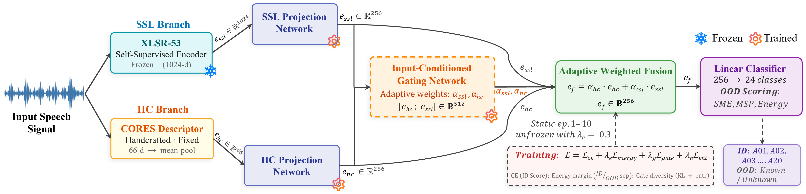
*Figure 1:Proposed dual-branch gated fusion framework for open-set audio deepfake source tracing. The gating network adaptively balances contextual SSL representations and low-level CORES to improve attribution robustness under unseen generative systems.*

*Figure 2:Ablation on MLAAD Eval. Single-branch and naive fusion baselines all fail OOD rejection (FPR95 
≥
 34%). Adaptive gating resolves the ID/OOD conflict, achieving 87% relative FPR95 vs. naive concatenation at no ID accuracy cost.*

---
**Usage Info**: 4044 tokens used.
**Generated at**: 2026-06-10 16:57:55

---

# 📚 Self-EmoQ: Plutchik-Guided Value-based Planning to Drive Streaming Emotional TTS

🚀 URL: https://arxiv.org/html/2606.09837

## 🌏 Abstract (원문)
Emotional interaction is increasingly crucial for conversational AI, yet current systems lack a self-emotion determination mechanism to drive the streaming text-to-speech (TTS) synthesis. We propose an emotion-planning framework that determines the emotion prior to the textual generation, grounding the downstream emotional TTS in a streaming manner. The framework is implemented by a plug-and-play LLM module, initialized from pretrained LLMs, and trained by reinforcement learning (RL) with emotions as the actions. A hybrid reward is employed which combines imitation signals with theory-driven scoring, in which the theory of Plutchik’s wheel of emotions is adopted. By experiments on DailyDialog, EmoryNLP, IMEOCAP, and MELD, our method outperforms prompting and finetuning baselines on both emotion determination and response quality. We finally implement an entire streaming pipeline for real-time deployment, with the speech quality confirming the framework’s emotional alignment, contextual coherence, and expressive fluency. Codes, cases, and demos are available inhttps://sixingdeguo.github.io/EmoQ-page/.
## 🌏 Abstract (번역)
대화형 AI에서 감성적 상호작용은 점점 더 중요해지고 있지만, 현재 시스템들은 스트리밍 텍스트 음성 변환(TTS) 합성을 구동하기 위한 자체 감성 결정 메커니즘이 부족합니다. 우리는 텍스트 생성 이전에 감성을 결정하여, 다운스트림 감성 TTS를 스트리밍 방식으로 기반을 다지는 감성 계획 프레임워크를 제안합니다. 이 프레임워크는 사전 훈련된 LLM으로 초기화되고 감성을 행동으로 하는 강화 학습(RL)으로 훈련된 플러그 앤 플레이 LLM 모듈에 의해 구현됩니다. 모방 신호와 이론 기반 점수 매기기를 결합한 하이브리드 보상이 사용되며, 여기에는 플루칙의 감성 바퀴 이론이 채택됩니다. DailyDialog, EmoryNLP, IMEOCAP, MELD 데이터셋에 대한 실험을 통해, 우리의 방법은 감성 결정과 응답 품질 모두에서 프롬프팅 및 미세 조정 기준선보다 우수한 성능을 보였습니다. 우리는 최종적으로 실시간 배포를 위한 전체 스트리밍 파이프라인을 구현했으며, 음성 품질은 프레임워크의 감성 정렬, 맥락적 일관성, 표현 유창성을 확인시켜 주었습니다. 코드, 사례 및 데모는 https://sixingdeguo.github.io/EmoQ-page/에서 확인할 수 있습니다.

## 🔍 Methods & Results
- 대화형 AI의 스트리밍 TTS를 위한 자체 감성 결정 메커니즘 부족 문제를 해결하기 위해 텍스트 생성 이전에 감성을 결정하는 감성 계획 프레임워크를 제안합니다.
- 이 프레임워크는 사전 훈련된 LLM으로 초기화되고 감성을 행동으로 하는 강화 학습(RL)으로 훈련된 플러그 앤 플레이 LLM 모듈로 구현됩니다.
- 감성 선택을 안내하기 위해 플루칙의 감성 바퀴 이론을 채택하여 감성 범주, 반대/인접 관계, 행동 기능 등을 구조화합니다.
- GPT-4o를 활용하여 감성 정렬, 감성 전환 타당성, 감성-기능 일관성 세 가지 차원에서 감성 적절성을 평가하는 플루칙 스코어러를 설계하고, 이를 모방 신호와 결합한 하이브리드 보상을 사용합니다.
- 감성 대화 시스템을 마르코프 결정 과정(MDP)으로 정식화하여 감성을 텍스트 생성 및 음성 합성 전반에 걸쳐 조정 가능한 결정 변수로 취급합니다.
- 셀프 감성 플래너는 LLM 모듈로 구현되며, Q-값을 추정하여 최적의 감성을 결정하고, 이 감성을 응답 생성 및 Emoti TTS 모델에 주입하여 실시간 스트리밍 방식으로 감성 일치 음성을 생성합니다.
- DailyDialog, EmoryNLP, IMEOCAP, MELD 데이터셋에 대한 실험에서 제안된 방법은 감성 결정 및 응답 품질 모두에서 기존 프롬프팅 및 미세 조정 기준선보다 우수한 성능을 보였습니다.
- 구현된 스트리밍 파이프라인은 음성 품질을 통해 프레임워크의 감성 정렬, 맥락적 일관성 및 표현 유창성을 확인했습니다.

## 🖼 Figures
![Figure 1:Comparison of different streaming, emotional LLM-TTS paradigms. (A) Vanilla LLM-TTS pipeline without 
𝑒
​
𝑚
​
𝑜
​
𝑡
​
𝑖
​
𝑜
​
𝑛
 consideration. (B) Conventional emotion cognition modules such as ERC can not be directly integrated into streaming Emo-TTS, in which the 
𝑒
​
𝑚
​
𝑜
​
𝑡
​
𝑖
​
𝑜
​
𝑛
 cognition can not be yielded until the text generation completes. (C) The plug-and-play Self-EmoQ proposed by us determines self-
𝑒
​
𝑚
​
𝑜
​
𝑡
​
𝑖
​
𝑜
​
𝑛
 prior to response generation, effectively driving the downstream streaming TTS by emotional conditioning.](../images/2026-06-10/2606.09837/2606.09837_fig0.png)
*Figure 1:Comparison of different streaming, emotional LLM-TTS paradigms. (A) Vanilla LLM-TTS pipeline without 
𝑒
​
𝑚
​
𝑜
​
𝑡
​
𝑖
​
𝑜
​
𝑛
 consideration. (B) Conventional emotion cognition modules such as ERC can not be directly integrated into streaming Emo-TTS, in which the 
𝑒
​
𝑚
​
𝑜
​
𝑡
​
𝑖
​
𝑜
​
𝑛
 cognition can not be yielded until the text generation completes. (C) The plug-and-play Self-EmoQ proposed by us determines self-
𝑒
​
𝑚
​
𝑜
​
𝑡
​
𝑖
​
𝑜
​
𝑛
 prior to response generation, effectively driving the downstream streaming TTS by emotional conditioning.*

*Figure 2:Framework of Self-EmoQ, which is post-trained on pretrained LLM, and produces 
𝑄
-values by averaging output token logprobs. We apply Plutchik’s Wheel of Emotions to guide reward annotations of multi-turn conversations, and finally update the model based on the Bellman Equation, bootstrapping the long-term emotional return.*

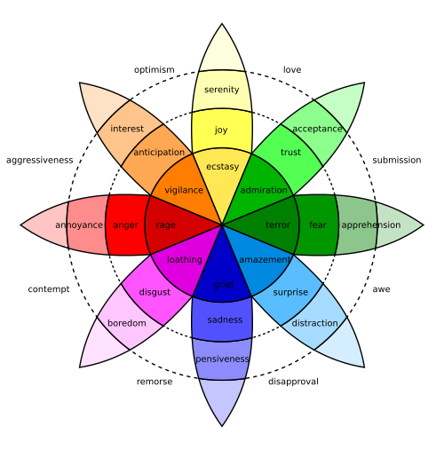
*Figure 3:The Plutchik’s wheel of emotions.*

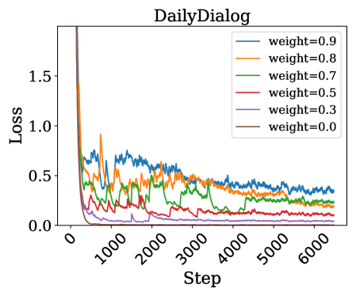
*Figure 4:Training loss plots of Self-EmoQ.*

*Figure 5:Average rewards on different choices of 
𝛾
.*

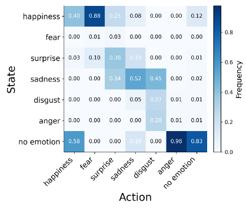
*Figure 6:Emotional transition matrices of Self-EmoQ. Upper-Left: DailyDialog; Upper-Right: EmoryNLP; Bottom-Left: IMEOCAP; Bottom-Right: MELD.*

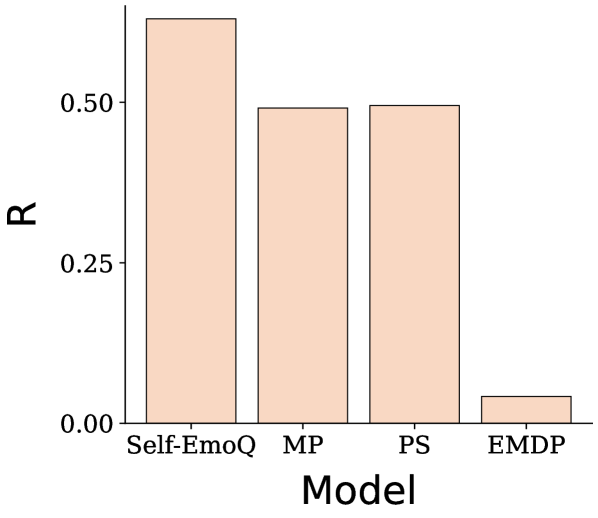
*Figure 7:Ratio of expected transitions on MELD.*

---
**Usage Info**: 4593 tokens used.
**Generated at**: 2026-06-10 16:58:11

---

# 📚 AuRA: Internalizing Audio Understanding into LLMs as LoRA

🚀 URL: https://arxiv.org/html/2606.11033

## 🌏 Abstract (원문)
Recent efforts to extend large language models (LLMs) to speech inputs typically rely on cascaded ASR-LLM pipelines, end-to-end speech-language models, or bridge/distillation-based adaptation. While these routes respectively reuse strong pretrained components, enable native speech-language interaction, or offer lightweight adaptation, they often suffer from transcript-interface latency, costly multimodal training, or sequential speech-language coupling. To address these limitations, we presentAuRA, a method that distills audio encoding capability into the LLM. Specifically, AuRA feeds the same speech input to an ASR encoder (as a teacher) and a LoRA-adapted LLM (as a student) through a lightweight audio embedding layer, and uses layer-wise distillation to align the student’s hidden states with corresponding teacher representations, thereby internalizing speech representations into lightweight LLM-side adaptations. Compared with cascaded and serial bridge methods, AuRA enables tighter speech-language joint modeling and efficient parallel end-to-end inference, while also reusing pretrained speech and language models rather than requiring large-scale multimodal training. On multiple speech-language benchmarks, AuRA consistently outperforms cascaded systems, speech-to-LLM adaptation baselines, and large-scale speech-language and multimodal models in both effectiveness and efficiency.
## 🌏 Abstract (번역)
음성 입력을 대규모 언어 모델(LLM)로 확장하려는 최근 노력은 일반적으로 계단식 ASR-LLM 파이프라인, 종단 간 음성-언어 모델 또는 브리지/증류 기반 적응에 의존합니다. 이러한 방법들은 각각 강력한 사전 학습된 구성 요소를 재사용하고, 원활한 음성-언어 상호 작용을 가능하게 하며, 경량 적응을 제공하지만, 종종 전사 인터페이스 지연, 비용이 많이 드는 다중 모드 훈련 또는 순차적인 음성-언어 결합으로 인해 어려움을 겪습니다. 이러한 한계를 해결하기 위해 우리는 LLM에 오디오 인코딩 기능을 증류하는 방법인 AuRA를 제시합니다. 구체적으로, AuRA는 동일한 음성 입력을 ASR 인코더(교사)와 LoRA 적응형 LLM(학생)에 경량 오디오 임베딩 레이어를 통해 공급하고, 계층별 증류를 사용하여 학생의 은닉 상태를 해당 교사 표현과 정렬함으로써 음성 표현을 경량 LLM 측 적응으로 내재화합니다. 계단식 및 직렬 브리지 방법과 비교할 때, AuRA는 더 긴밀한 음성-언어 공동 모델링과 효율적인 병렬 종단 간 추론을 가능하게 하며, 대규모 다중 모드 훈련을 요구하는 대신 사전 학습된 음성 및 언어 모델을 재사용합니다. 여러 음성-언어 벤치마크에서 AuRA는 효과성과 효율성 모두에서 계단식 시스템, 음성-LLM 적응 기준선, 대규모 음성-언어 및 다중 모드 모델을 일관되게 능가합니다.

## 🔍 Methods & Results
- AuRA는 교사-학생 훈련 워크플로우를 따르며, ASR 인코더(Whisper-Large-v3)를 고정된 교사로, LoRA가 적용된 LLM을 학생으로 사용합니다.
- 입력 음성 파형은 Mel-spectrogram으로 변환된 후 고정된 길이의 오디오 패치로 나뉘고, 이 패치들은 LLM 임베딩 공간으로 투영되어 오디오 토큰 시퀀스를 생성합니다.
- 생성된 오디오 토큰은 텍스트 프롬프트의 오디오 플레이스홀더를 대체하여 LLM 내에서 음성 및 텍스트 토큰이 직접 상호 작용할 수 있도록 합니다.
- LLM 백본 가중치는 고정된 상태로 유지되며, 훈련 가능한 LoRA 어댑터는 초기 N개의 트랜스포머 레이어에 삽입되어 음성 관련 학습을 경량화된 LLM 측 파라미터로 국소화합니다.
- 훈련 중, 고정된 ASR 교사 인코더는 LoRA가 적용된 학생 레이어에 계층별 표현 감독을 제공하며, 학생의 은닉 상태는 교사의 해당 표현과 정렬됩니다.
- 계층별 증류 손실은 코사인 거리(방향 정렬)와 평균 제곱 오차(절대 스케일 보존)를 결합하여 안정적인 정렬 목표를 제공하며, 이 손실은 모든 적응된 레이어에 걸쳐 평균화됩니다.
- 추론 시에는 ASR 교사와 모든 증류 헤드가 제거되어 경량 오디오 패치 임베딩 모듈과 LoRA가 적용된 LLM만 남아 인코더 없는 효율적인 추론 경로를 형성합니다.
- AuRA는 계단식 및 직렬 브리지 방법과 비교하여 더 긴밀한 음성-언어 공동 모델링과 효율적인 병렬 종단 간 추론을 가능하게 하며, 사전 학습된 음성 및 언어 모델을 재사용합니다.
- 여러 음성-언어 벤치마크에서 AuRA는 효과성과 효율성 모두에서 기존 계단식 시스템, 음성-LLM 적응 기준선 및 대규모 음성-언어/다중 모드 모델을 능가하는 성능을 보였습니다.

## 🖼 Figures
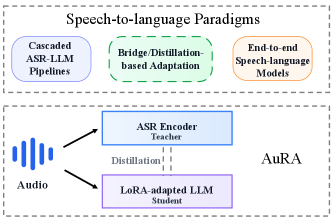
*Figure 1:Illustration of representative speech-language modeling paradigms and our proposed distillation-based adaptation framework.*

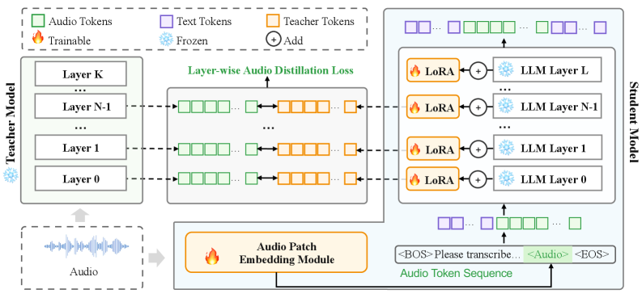
*Figure 2:Overview of AuRA. A frozen ASR teacher supervises LoRA-adapted early LLM layers through layer-wise distillation; at inference time, only the audio patch embedding module and LoRA-adapted LLM are retained.*

*Figure 3:Accuracy-efficiency trade-offs on SDQA. The left panel plots latency versus accuracy, and the right panel plots memory versus accuracy. Each point corresponds to one model, where lower latency or memory and higher accuracy are preferable. AuRA lies on the favorable frontier under both efficiency views.*

---
**Usage Info**: 4480 tokens used.
**Generated at**: 2026-06-10 16:58:21

---

# 📚 Mean Flow Distillation: Robust and Stable Distillation for Flow Matching Models

🚀 URL: https://arxiv.org/html/2606.11155

## 🌏 Abstract (원문)
Flow Matching models have demonstrated strong performance across a wide range of generative tasks. However, their reliance on ODE-based iterative sampling incurs substantial computational overhead in inference, which limits their applicability in real-time scenes. While distillation is a promising solution, existing approaches largely borrow from diffusion-based score matching, often failing to exploit the intrinsic geometric structure of flows and suffering from training instability, high variance, and degraded generation quality. In this paper, we propose Mean Flow Distillation (MFD), a novel distillation framework tailored for flow matching models. We theoretically demonstrate that MFD acts as a temporal low-pass filter, effectively suppressing the high-frequency optimization noise inherent in variational score distillation (VSD) while ensuring global trajectory consistency. We further prove the Mean Flow Matching Theorem, establishing that matching expected average velocities is sufficient for strict distribution alignment. Empirically, on challenging tasks of high-dimensional manifolds including 4D occupancy forecasting and text-to-image generation, MFD achieves state-of-the-art performance, enabling high-fidelity single-step generation. The implementation is available athttps://github.com/happyw1nd/MFD.
## 🌏 Abstract (번역)
플로우 매칭 모델은 다양한 생성 작업에서 강력한 성능을 보여주었습니다. 그러나 ODE 기반의 반복적인 샘플링에 의존하기 때문에 추론 시 상당한 계산 오버헤드가 발생하며, 이는 실시간 장면에서의 적용 가능성을 제한합니다. 증류(distillation)는 유망한 해결책이지만, 기존 접근 방식은 주로 확산 기반 스코어 매칭에서 차용하여 플로우의 본질적인 기하학적 구조를 활용하지 못하고 훈련 불안정성, 높은 분산, 그리고 저하된 생성 품질로 어려움을 겪는 경우가 많습니다. 본 논문에서는 플로우 매칭 모델에 특화된 새로운 증류 프레임워크인 Mean Flow Distillation (MFD)을 제안합니다. 우리는 MFD가 시간적 저역 통과 필터 역할을 하여 변분 스코어 증류(VSD)에 내재된 고주파 최적화 노이즈를 효과적으로 억제하면서 전역 궤적 일관성을 보장함을 이론적으로 입증합니다. 또한, 우리는 평균 플로우 매칭 정리(Mean Flow Matching Theorem)를 증명하여, 기대 평균 속도를 매칭하는 것이 엄격한 분포 정렬에 충분하다는 것을 확립합니다. 경험적으로, 4D 점유 예측 및 텍스트-이미지 생성과 같은 고차원 매니폴드의 도전적인 작업에서 MFD는 최첨단 성능을 달성하여 고품질의 단일 단계 생성을 가능하게 합니다. 구현 코드는 https://github.com/happyw1nd/MFD에서 확인할 수 있습니다.

## 🔍 Methods & Results
- 플로우 매칭 모델을 위한 새로운 증류 프레임워크인 Mean Flow Distillation (MFD)을 제안합니다.
- MFD가 변분 스코어 증류(VSD)의 고주파 최적화 노이즈를 억제하고 전역 궤적 일관성을 보장하는 시간적 저역 통과 필터 역할을 함을 이론적으로 입증했습니다.
- 기대 평균 속도 매칭이 엄격한 분포 정렬에 충분하다는 평균 플로우 매칭 정리(Mean Flow Matching Theorem)를 증명했습니다.
- 4D 점유 예측 및 텍스트-이미지 생성과 같은 고차원 매니폴드 작업에서 MFD가 최첨단 성능을 달성하여 고품질의 단일 단계 생성을 가능하게 함을 경험적으로 확인했습니다.

## 🖼 Figures
![Figure 1: Overview of Mean Flow Distillation (MFD). (1) Sample noise 
𝑋
0
∼
𝒩
​
(
0
,
𝐼
)
, generate 
𝑋
1
 via the single-step student model 
𝐺
𝜃
, and construct intermediate state 
𝑋
𝑠
 through linear interpolation following Eq (2) with 
𝑡
 replaced by 
𝑠
. (2) Compute the auxiliary mean flow by integrating the auxiliary model 
𝑣
𝑃
 from 
𝑋
𝑠
 over interval 
[
𝑠
,
𝑡
]
 via ODE solver 
Φ
 following Eq (16). (3) Compute the teacher mean flow by integrating the pretrained teacher model 
𝑢
𝑄
 from the same 
𝑋
𝑠
 over 
[
𝑠
,
𝑡
]
 also following Eq (16). (4) Optimize the student model 
𝐺
𝜃
 by matching the two mean flows, with gradients backpropagated through 
𝑋
𝑠
 following Eq (20). (5) Update the auxiliary model 
𝑣
𝑃
 to track the evolving student distribution 
𝑃
 following Eq (3). This temporal integration over 
[
𝑠
,
𝑡
]
 provides more robust and low-variance gradients compared to instantaneous velocity matching, enabling stable distillation with high-quality generation.](../images/2026-06-10/2606.11155/2606.11155_fig0.png)
*Figure 1: Overview of Mean Flow Distillation (MFD). (1) Sample noise 
𝑋
0
∼
𝒩
​
(
0
,
𝐼
)
, generate 
𝑋
1
 via the single-step student model 
𝐺
𝜃
, and construct intermediate state 
𝑋
𝑠
 through linear interpolation following Eq (2) with 
𝑡
 replaced by 
𝑠
. (2) Compute the auxiliary mean flow by integrating the auxiliary model 
𝑣
𝑃
 from 
𝑋
𝑠
 over interval 
[
𝑠
,
𝑡
]
 via ODE solver 
Φ
 following Eq (16). (3) Compute the teacher mean flow by integrating the pretrained teacher model 
𝑢
𝑄
 from the same 
𝑋
𝑠
 over 
[
𝑠
,
𝑡
]
 also following Eq (16). (4) Optimize the student model 
𝐺
𝜃
 by matching the two mean flows, with gradients backpropagated through 
𝑋
𝑠
 following Eq (20). (5) Update the auxiliary model 
𝑣
𝑃
 to track the evolving student distribution 
𝑃
 following Eq (3). This temporal integration over 
[
𝑠
,
𝑡
]
 provides more robust and low-variance gradients compared to instantaneous velocity matching, enabling stable distillation with high-quality generation.*

*Figure 2:Loss distribution between MFD and Diff-Instruct on text-to-image generation at training step 500 and 4000. MFD consistently exhibits a narrower distribution with lower variance, empirically confirming the variance reduction property proven in Section C.3.*

![Figure 3:Comparison of gradient differences when computing vs. omitting the Jacobian term during backpropagation to 
𝑋
𝑠
 over 10,000 training steps. Left: Length difference histogram showing the absolute difference in gradient magnitudes 
|
‖
∇
𝑋
𝑠
full
‖
−
‖
∇
𝑋
𝑠
approx
‖
|
. Right: Direction difference histogram showing the cosine similarity between normalized gradient vectors. The results reveal that while gradient magnitudes remain similar, the directions diverge significantly when including the full Jacobian computation.](../images/2026-06-10/2606.11155/2606.11155_fig2.png)
*Figure 3:Comparison of gradient differences when computing vs. omitting the Jacobian term during backpropagation to 
𝑋
𝑠
 over 10,000 training steps. Left: Length difference histogram showing the absolute difference in gradient magnitudes 
|
‖
∇
𝑋
𝑠
full
‖
−
‖
∇
𝑋
𝑠
approx
‖
|
. Right: Direction difference histogram showing the cosine similarity between normalized gradient vectors. The results reveal that while gradient magnitudes remain similar, the directions diverge significantly when including the full Jacobian computation.*

*Figure 4:Comparison of gradient vector fields on a 2D toy example under equivalent noise conditions. Left: VSD with instantaneous velocity matching exhibits chaotic, high-variance gradient directions. Right: MFD with temporal integration over 
𝐾
 steps shows smooth, coherent flow structure.*

*Figure 5:Qualitative comparison of 4D occupancy forecasting results on nuScenes. We visualize the predicted occupancy grids from (a) ground truth, (b) our MFD distilled student model (NFE=1), and (c) the teacher model OccFM with single-step sampling (NFE=1).*

*Figure 6:Training loss curves comparing MFD and VSD-based Diff-Instruct on text-to-image generation. MFD exhibits significantly lower variance throughout training, validating our theoretical analysis in Section C.3 that the temporal integration in mean flow matching acts as a variance-reduction mechanism.*

*Figure 7:Evolution of L2 distance (in log scale) between teacher mean flow 
𝑈
^
𝑄
 and auxiliary mean flow 
𝑈
^
𝑃
 during text-to-image distillation training. The trajectory reveals three distinct phases: rapid initial increase, gradual descent during adaptation, and sustained slow decline reflecting the co-evolution dynamics of MFD.*

*Figure 8:Qualitative results of text-to-image generation using MFD-distilled student model with 4-step inference. The 6
×
6 grid displays diverse generated images across various text prompts, demonstrating high visual quality and generation diversity.*

---
**Usage Info**: 2127 tokens used.
**Generated at**: 2026-06-10 16:58:31

---

# 📚 Few-step Generative Models as Lossy Compression

🚀 URL: https://arxiv.org/html/2606.10450

## 🌏 Abstract (원문)
DiffC provides a principled way to reuse pre-trained diffusion models for lossy compression, but its encoding and decoding procedures remain slow because they require many discretized forward and reverse steps. We study whether few-step generative models—Rectified Flow, Consistency Trajectory Models (CTM), and MeanFlow—can be cast as codecs within the same reverse channel coding (RCC) framework. The main challenge is that RCC requires posterior and shared distribution parameters, whereas these models do not explicitly parameterize intermediate conditional distributions. For Rectified Flow and MeanFlow, we use the equivalence between velocity parameterization and diffusion-style denoising parameterization to derive the quantities required by RCC. For CTM, which is distilled from EDM, we adopt the EDM noise parameterization together with local Gaussian approximations of the sender and shared distributions at intermediate states. This yields a proof-of-concept probabilistic formulation that enables compression with pre-trained few-step generative models without retraining. On low-resolution benchmarks, the resulting codecs reduce encoding and decoding time and improve realism in the low-bit-rate regime.
## 🌏 Abstract (번역)
DiffC는 사전 학습된 확산 모델을 손실 압축에 재사용하는 원칙적인 방법을 제공하지만, 많은 이산화된 순방향 및 역방향 단계를 필요로 하므로 인코딩 및 디코딩 절차가 여전히 느립니다. 본 연구에서는 Rectified Flow, Consistency Trajectory Models (CTM), MeanFlow와 같은 소수 단계 생성 모델이 동일한 역채널 코딩(RCC) 프레임워크 내에서 코덱으로 활용될 수 있는지 탐구합니다. 주요 과제는 RCC가 사후 및 공유 분포 매개변수를 요구하는 반면, 이 모델들은 중간 조건부 분포를 명시적으로 매개변수화하지 않는다는 점입니다. Rectified Flow 및 MeanFlow의 경우, 속도 매개변수화와 확산 스타일의 노이즈 제거 매개변수화 간의 등가성을 사용하여 RCC에 필요한 양을 도출합니다. EDM에서 증류된 CTM의 경우, 중간 상태에서 송신자 및 공유 분포의 지역 가우시안 근사와 함께 EDM 노이즈 매개변수화를 채택합니다. 이는 재훈련 없이 사전 학습된 소수 단계 생성 모델로 압축을 가능하게 하는 개념 증명 확률론적 공식을 제공합니다. 저해상도 벤치마크에서 결과 코덱은 인코딩 및 디코딩 시간을 단축하고 낮은 비트 전송률 영역에서 사실감을 향상시킵니다.

## 🔍 Methods & Results
- DiffC는 역채널 코딩(RCC) 프레임워크를 통해 사전 학습된 확산 모델을 손실 압축에 재사용하지만, 많은 이산화된 단계로 인해 인코딩 및 디코딩 속도가 느리다는 한계가 있다.
- Rectified Flow, CTM, MeanFlow와 같은 소수 단계 생성 모델은 중간 조건부 분포를 명시적으로 매개변수화하지 않아 DiffC의 `CalcMean_Q` 및 `CalcMeanStd_P` 계산에 필요한 매개변수를 직접 제공하지 못한다.
- **Rectified Flow (ReFC)**: 속도 매개변수화와 확산 스타일 노이즈 제거 매개변수화 간의 등가성을 활용하여 `epsilon`-예측 형태(`epsilon_theta^RF`)를 유도함으로써 DiffC 코덱으로 구현되었다. 이는 디코딩 시 직선 경로를 따라 효율적인 재구성을 가능하게 한다.
- **Consistency Trajectory Models (CTMC)**: EDM에서 증류된 CTM의 특성을 활용하여 EDM 노이즈 매개변수화와 중간 상태에서의 송신자 및 공유 분포에 대한 지역 가우시안 근사를 도입하여 코덱으로 구현되었다. `g_theta(x_t, t, s)` 함수를 사용하여 궤적을 따라 임의의 시점 간 점프를 통해 빠른 재구성을 지원한다.
- **MeanFlow (MeFC)**: Rectified Flow의 한계(경로가 완벽하게 직선이 아님, 오류 누적)를 해결하기 위해 두 시점 간의 평균 속도 필드를 학습한다. 속도-노이즈 매개변수화를 활용하여 `epsilon`-예측 형태(`epsilon_theta^MF`)를 유도함으로써 DiffC 코덱으로 구현되었으며, CTM과 유사하게 임의의 시점 간 점프를 통해 효율적인 재구성을 가능하게 한다.
- 이러한 접근 방식은 재훈련 없이 사전 학습된 소수 단계 생성 모델을 압축에 활용할 수 있는 개념 증명 확률론적 공식을 제공한다.
- 저해상도 벤치마크에서, 제안된 코덱들은 기존 DiffC 대비 인코딩 및 디코딩 시간을 단축하고 낮은 비트 전송률 영역에서 이미지의 사실감을 향상시키는 결과를 보였다.

## 🖼 Figures
![Figure 1: Overview of the reconstruction processes for different methods. The blue lines represent the communication steps while the red lines denote the generative process to reconstruct the image. Blue and red dots indicate the latent variables at specific timesteps 
𝑡
. The gray lines illustrate the underlying trajectories learned by each generative model. While DiffC (left) requires multiple iterative steps to reconstruct an image, ReFC (center) and CTMC/MeFC (right) can generate the image much faster, either directly or by jumping along the trajectory.](../images/2026-06-10/2606.10450/2606.10450_fig0.png)
*Figure 1: Overview of the reconstruction processes for different methods. The blue lines represent the communication steps while the red lines denote the generative process to reconstruct the image. Blue and red dots indicate the latent variables at specific timesteps 
𝑡
. The gray lines illustrate the underlying trajectories learned by each generative model. While DiffC (left) requires multiple iterative steps to reconstruct an image, ReFC (center) and CTMC/MeFC (right) can generate the image much faster, either directly or by jumping along the trajectory.*

*Figure 2: Rate–distortion and rate–realism curves, with distortion (PSNR and LPIPS) and realism (FID), plotted against bits per pixel (bpp). The top row shows results on CIFAR10, and the bottom row shows results on ImageNet 
64
×
64
.*

*Figure 3: Reconstructed images on the CIFAR10 at various PSNR and bpp. For DiffC, UQDM, CTMC, and MeFC, PSNR/bpp values are selected to enable a comparative analysis of their performance evaluation. In contrast, DiffC (RF) and ReFC are chosen from approximately the same bpp for direct comparison.*

*Figure 4: Reconstructed images on ImageNet 
64
×
64
 dataset at various PSNR/bpp. Results are approximately aligned to match the bpp of UQDM.*

*Figure 5: Visualization of MeFC reconstructions on CIFAR10 from different time steps 
𝑡
. For small 
𝑡
 (up to 
𝑡
=
3
), reconstructions may differ from the input but remain perceptually plausible; for larger 
𝑡
, the decoder increasingly reconstructs the input with added Gaussian noise, which is then gradually removed.*

*Figure 6: Reconstructed image comparison by changing the number of forward steps 
𝑇
. The top two rows show results for ImageNet 64
×
64, while the bottom two rows show results for ImageNet 256
×
256, which have been scaled to 64
×
64 resolutions for easier viewing.*

![Figure 7: Visual comparison results of varying the reconstructed methods for ReFC and MeFC on ImageNet 64
×
64. The displayed results show the reconstructed images from each timestep 
𝑡
 over 
𝑁
 steps. For ReFC, Euler method was applied with 
𝑁
=
1
,
4
,
20
. When 
𝑡
≤
𝑁
, the reconstruction performed over 
𝑡
 steps. ReFC (Denoise) refers to a reconstruction method that employs 
𝜖
-prediction with 
𝜖
𝜃
RF
 such like DDPM. CTMC also applies Euler method with 
𝑁
=
4
,
20
, as well as direct image estimation from 
𝑡
 by 
𝐱
𝜃
CTM
 when N
=
1.](../images/2026-06-10/2606.10450/2606.10450_fig12.png)
*Figure 7: Visual comparison results of varying the reconstructed methods for ReFC and MeFC on ImageNet 64
×
64. The displayed results show the reconstructed images from each timestep 
𝑡
 over 
𝑁
 steps. For ReFC, Euler method was applied with 
𝑁
=
1
,
4
,
20
. When 
𝑡
≤
𝑁
, the reconstruction performed over 
𝑡
 steps. ReFC (Denoise) refers to a reconstruction method that employs 
𝜖
-prediction with 
𝜖
𝜃
RF
 such like DDPM. CTMC also applies Euler method with 
𝑁
=
4
,
20
, as well as direct image estimation from 
𝑡
 by 
𝐱
𝜃
CTM
 when N
=
1.*

*Figure 8: Reconstructed image comparison by changing the reconstruction steps on ImageNet 256
×
256. For MeFC, Euler method is applied for 
𝑁
=
4
,
10
 and in the case of 
𝑁
=
1
, average velocity field 
𝒖
𝜃
MF
 is used for one-step generation such as MeanFlow. ReFC applies Euler method when 
𝑁
=
1
,
4
,
10
 and 
𝜖
-prediction (ReFC (Denoise)).*

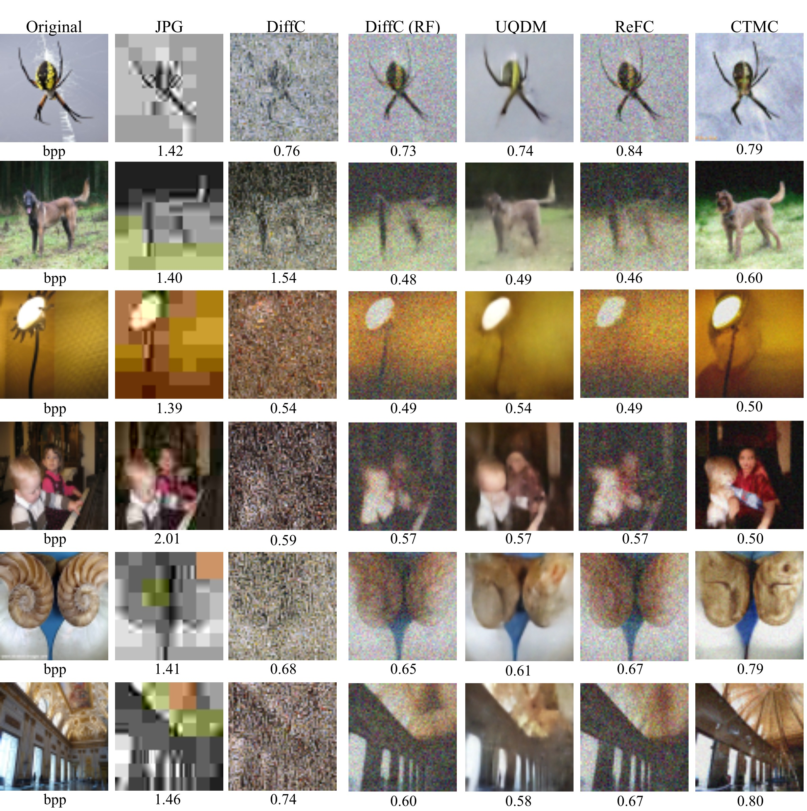
*Figure 9: Visual Comparison of each image compression method including JPEG, DiffC, DiffC (RF), UQDM, ReFC and CTMC, chosen at roughly same bpp.*

*Figure 10: Visual Comparison of image compression methods including JPEG, PerCo, DiffC, DiffC (RF), ReFC and MeFC on ImageNet 256
×
256. .*

*Figure 11: Visual Comparison of reconstructed images on ImageNet 256
×
256. We roughly choose the similar bpp. .*

---
**Usage Info**: 5696 tokens used.
**Generated at**: 2026-06-10 16:58:48

---

# 📚 ContextCodec: Content-Focused Context Guidance for Ultra-Low Bitrate Speech Coding

🚀 URL: https://arxiv.org/html/2606.10591

## 🌏 Abstract (원문)
Neural speech codecs enable low-bitrate speech communication, yet at ultra-low bitrates (<1000<1000bps) preserving perceptual quality and intelligibility is challenging. Existing designs often prioritize acoustic details, leaving limited capacity for the core linguistic message under tight bitrate constraints. To address this, we propose ContextCodec, a codec that transmits content-focused context features to explicitly guide reconstruction. ContextCodec adopts a dual-branch encoder that decouples acoustic details from content-focused context. The context branch is trained with a CLIP-style contrastive loss that aligns context features with phoneme indices, reducing paralinguistic leakage. During decoding, these features are injected at each decoding stage for explicit guidance. In addition, we introduce a lightweight autoregressive latent refinement module. Experiments show a strong quality-intelligibility trade-off down to 500 bps, with an RTF of 0.4886 on a typical mobile CPU.
## 🌏 Abstract (번역)
신경망 음성 코덱은 저비트레이트 음성 통신을 가능하게 하지만, 초저비트레이트(1000bps 미만)에서는 지각 품질과 명료도를 유지하는 것이 어렵습니다. 기존 설계는 종종 음향 세부 사항을 우선시하여, 엄격한 비트레이트 제약 하에서 핵심 언어 메시지를 위한 용량을 제한합니다. 이를 해결하기 위해, 우리는 재구성을 명시적으로 안내하기 위해 콘텐츠 중심의 컨텍스트 특징을 전송하는 코덱인 ContextCodec을 제안합니다. ContextCodec은 음향 세부 사항을 콘텐츠 중심 컨텍스트로부터 분리하는 듀얼 브랜치 인코더를 채택합니다. 컨텍스트 브랜치는 컨텍스트 특징을 음소 인덱스와 정렬하는 CLIP 스타일의 대조 손실로 훈련되어, 비언어적 정보 유출을 줄입니다. 디코딩 시, 이 특징들은 명시적인 안내를 위해 각 디코딩 단계에 주입됩니다. 또한, 우리는 경량의 자기회귀 잠재 공간 정제 모듈을 도입합니다. 실험 결과, 500bps까지 강력한 품질-명료도 트레이드오프를 보였으며, 일반적인 모바일 CPU에서 0.4886의 RTF를 달성했습니다.

## 🔍 Methods & Results
- ContextCodec은 GAN 기반의 양자화된 오토인코더 프레임워크로, FSQ(Finite Scalar Quantization)를 사용하며 DAC 아키텍처를 기반으로 합니다.
- 입력 파형을 공유 특징으로 매핑한 후, 음향 스트림(ya)과 컨텍스트 스트림(yc)을 얻기 위해 듀얼 브랜치 인코더를 사용합니다.
- 전체 훈련 파이프라인은 세 가지 주요 구성 요소로 이루어집니다: (1) 자기회귀 잠재 공간 정제, (2) CLIP 스타일 음소 정렬, (3) 컨텍스트 안내형 어텐션 디코딩.
- 자기회귀 잠재 공간 정제 모듈은 디코딩 전에 연결된 잠재 공간(y=[ya;yc])을 정제하며, 이미 복원된 단계로부터 단계별 평균/스케일을 순차적으로 예측하고 정규화된 잔차를 양자화하여 정제된 심볼(y^r)을 생성합니다.
- 인코더 측에서는 첫 번째 단계(i=0)는 직접 양자화하고, 이후 단계(i>=1)에서는 예측기(gp)를 사용하여 이미 복원된 하위 시퀀스로부터 평균과 스케일을 추정하여 정규화된 잔차를 양자화합니다.
- 디코더 측에서는 수신된 비트스트림에서 이산 심볼(y^r)을 복구하고, 동일한 단계 순서로 반복하여 복원된 정제된 잠재 공간(y^)을 재구성합니다.
- CLIP 스타일 음소 정렬은 코덱 컨텍스트 특징(y^c)을 강제 정렬된 음소 시퀀스와 직접 일치시키는 프레임 수준의 대조 학습 목표를 사용하며, 이는 콘텐츠 중심의 일관된 컨텍스트 표현을 장려하고 화자 관련 및 기타 비언어적 정보 유출을 줄입니다.
- 컨텍스트 안내형 어텐션 디코더는 양자화된 컨텍스트 표현(y^c)을 파형 재구성 과정에 주입하여, 컨텍스트 브랜치가 생성을 적극적으로 안내하도록 합니다.
- 디코더는 음향 잠재 공간을 사전 조건화하고 각 디코딩 단계를 조절하기 위해 경량의 컨텍스트 특징 인핸서를 사용하여 ya를 yc로 변조합니다.
- 각 디코딩 단계에서 컨텍스트 스트림은 현재 시간 해상도에 맞춰 정렬되고 음향 채널 크기로 투영되며, 이는 음향 특징과 융합되어 잔차 연결을 통해 음향 특징에 다시 추가됩니다.
- 재구성 손실, 적대적 손실, 교차 모달 정렬 손실(대칭 InfoNCE 손실)을 공동으로 최적화합니다.
- 실험 결과, 500bps까지 강력한 품질-명료도 트레이드오프를 보였으며, 일반적인 모바일 CPU에서 0.4886의 실시간 처리 계수(RTF)를 달성했습니다.

## 🖼 Figures
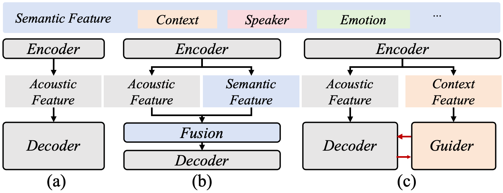
*Figure 1:Different speech codec architectures. (a) Neural acoustic codecs. (b) Hybrid codecs. (c) ContextCodec(ours).*

*Figure 2:Overview of ContextCodec. (a) The end-to-end pipeline. (b) The predictor 
𝑔
𝑝
. (c) The context-guided attention decoder.*

---
**Usage Info**: 4679 tokens used.
**Generated at**: 2026-06-10 16:58:58

---

# 📚 Inside the Latent Flow: Causal Deciphering of Attention Dynamics in Audio Separation Foundation Models

🚀 URL: https://arxiv.org/html/2606.10046

## 🌏 Abstract (원문)
Flow-matching transformers achieve strong audio separation, yet their attention dynamics are opaque. We adapt established causal-intervention principles into a deterministic, inference-time probing protocol for SAM Audio. Orthogonal probing uncovers a dual-pathway text-conditioning mechanism: additive injections control semantic identity, while cross-attention refines acoustic structure. We observe an asynchronous layerwise convergence: stable layers build temporal scaffolds early, whereas fast layers continue resolving artifacts during sampling. The model also attenuates temporal segmentation cues to maintain continuous-flow stability. Using these insights, we proposeLayer-SelectiveAttentionCaching (LSAC), a training-free acceleration method that caches attention in stable layers. Across acoustic complexities, LSAC cuts self-attention computation by~25%{\sim}25%with negligible quality loss and yields up to 6.7x higher quality retention than naive step reduction.
## 🌏 Abstract (번역)
플로우 매칭 트랜스포머는 강력한 오디오 분리 성능을 달성하지만, 그 어텐션 다이내믹스는 불투명합니다. 우리는 SAM Audio를 위해 확립된 인과적 개입 원칙을 결정론적 추론 시간 프로빙 프로토콜로 적용합니다. 직교 프로빙은 이중 경로 텍스트 조건화 메커니즘을 밝혀냈습니다: 가산 주입은 의미론적 정체성을 제어하고, 교차 어텐션은 음향 구조를 정제합니다. 우리는 비동기적인 계층별 수렴을 관찰했습니다: 안정적인 계층은 초기에 시간적 스캐폴드를 구축하는 반면, 빠른 계층은 샘플링 동안 아티팩트를 계속 해결합니다. 모델은 또한 연속적인 흐름 안정성을 유지하기 위해 시간적 분할 신호를 약화시킵니다. 이러한 통찰력을 사용하여, 우리는 안정적인 계층에서 어텐션을 캐싱하는 훈련 없는 가속 방법인 계층 선택적 어텐션 캐싱(LSAC)을 제안합니다. 음향 복잡성 전반에 걸쳐 LSAC는 무시할 수 있는 품질 손실로 셀프 어텐션 계산을 약 25% 절감하며, 단순한 스텝 감소보다 최대 6.7배 높은 품질 유지율을 제공합니다.

## 🔍 Methods & Results
- 오디오 확산 트랜스포머의 기본 메커니즘을 탐색하기 위해 결정론적 추론 시간 개입 프레임워크를 정의했으며, 이는 사전 훈련된 네트워크 가중치를 변경하지 않고 추론 중 연속 확률 흐름 궤적을 조작합니다.
- 직교 프로빙을 사용하여 텍스트 조건화의 두 가지 경로(가산 잔차 주입 및 표준 교차 어텐션)를 분리했으며, Zeroed CA, Additive Zeroed, Forced Uniform의 세 가지 제거 조건을 정의하고 물리적으로 직교하는 메트릭을 사용하여 영향을 측정했습니다.
- 인과적 고정(Causal freezing)을 통해 물리적 매핑이 안정화되는 통합 단계를 찾아냈으며, 셀프 어텐션 행렬의 엔트로피 변화율을 기준으로 계층을 '안정적(stable)' 또는 '빠름(fast)'으로 분류했습니다.
- 게이트 하이재킹(Gate hijacking)을 통해 시간적 분할을 위한 내부 기하학적 용량을 조사했으며, 학습 가능한 게이팅 매개변수 'gamma'를 조작하고 블록 비율(Block Ratio, BR)을 통해 위상 선택성을 정량화했습니다.
- 직교 프로빙 결과, 가산 주입이 의미론적 정체성을 제어하고 교차 어텐션이 음향 구조를 정제하는 이중 경로 텍스트 조건화 메커니즘을 발견했습니다.
- 계층별 수렴이 비동기적으로 발생함을 관찰했습니다. 안정적인 계층은 초기에 시간적 스캐폴드를 구축하고, 빠른 계층은 샘플링 동안 아티팩트를 계속 해결합니다.
- 모델이 연속적인 흐름 안정성을 유지하기 위해 시간적 분할 신호를 약화시키는 것을 확인했습니다.
- 이러한 통찰력을 바탕으로, 안정적인 계층에서 어텐션을 캐싱하는 훈련 없는 가속 방법인 계층 선택적 어텐션 캐싱(LSAC)을 제안했습니다. LSAC는 특정 단계 이후 안정적인 계층의 어텐션 행렬을 재사용하고, 값 행렬은 매 단계 재계산합니다.
- LSAC는 셀프 어텐션 계산을 약 25% 절감하며(SAM-Audio-Small의 경우 전체 추론 FLOPs의 29% 차지), 품질 손실은 무시할 수 있으며, 단순한 스텝 감소보다 최대 6.7배 높은 품질 유지율을 달성했습니다.
- LSAC를 위해 안정 계층 및 중간 수렴 계층에 대한 세 가지 임계값 구성을 정의하고, 계산량이 일치하는 단순한 단계 축소 방법과 비교했습니다.

## 🖼 Figures

*Figure 1:Acoustic impact under layer specific causal freezing (Clean Tier, 
𝑁
=
200
 paired runs per layer). Freezing Stable layers midway yields practically negligible degradation, whereas interrupting Fast layers halts fine grained artifact reduction.*

*Figure 2:Visual proof of dormant geometry (L06 self-attention, integration step 15). Forcing a positive gate activates latent block diagonal capacities strictly aligned with boundaries. The model actively suppresses these features during standard optimization.*

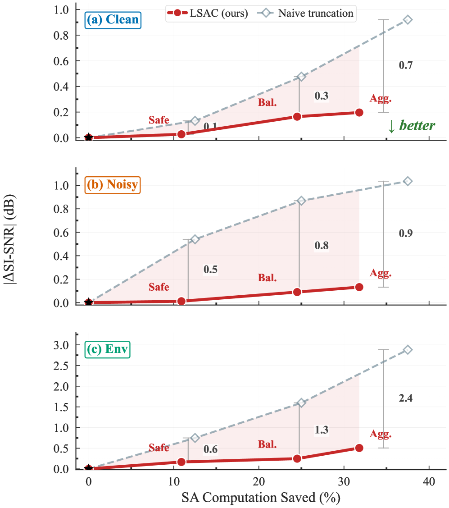
*Figure 3:Pareto efficiency of LSAC. The strategy strictly dominates naive baseline truncation across all acoustic complexities without requiring retraining.*

---
**Usage Info**: 4185 tokens used.
**Generated at**: 2026-06-10 16:59:12

---

# 📚 CITRAS-FM: Tiny Time Series Foundation Model for Covariate-Informed Zero-Shot ForecastingAccepted to EUSIPCO 2026.

🚀 URL: https://arxiv.org/html/2606.10798

## 🌏 Abstract (원문)
Pretrained time series foundation models (TSFMs) have enabled zero-shot forecasting on unseen target series. However, existing TSFMs often incur high computational cost and provide limited support for diverse variable types, often failing to account for covariates that exogenously influence target variability. To address these challenges, we propose CITRAS‑FM, a tiny 7M-parameter TSFM that supports univariate, multivariate, and covariate‑informed zero-shot forecasting with real-time CPU inference. Built on a patch‑based, decoder‑only Transformer, CITRAS‑FM introduces Shifted Attention into the cross‑variate module to effectively exploit known covariates accessible throughout the forecast horizon. Moreover, to enable covariate‑aware pretraining despite the scarcity of covariate-rich corpora, we propose CovSynth, which synthesizes realistic covariates from decomposed components of target series. Experiments on fev‑bench, spanning 100 tasks across various settings, demonstrate that CITRAS‑FM achieves state-of-the-art zero-shot accuracy among sub‑10M TSFMs while delivering sub‑0.1‑second CPU inference, offering a strong balance between forecasting accuracy and real-time deployability.
## 🌏 Abstract (번역)
사전 학습된 시계열 파운데이션 모델(TSFM)은 보지 못한 대상 시계열에 대한 제로샷 예측을 가능하게 했습니다. 그러나 기존 TSFM은 종종 높은 계산 비용을 발생시키고 다양한 변수 유형에 대한 지원이 제한적이며, 대상 변동성에 외생적으로 영향을 미치는 공변량을 고려하지 못하는 경우가 많습니다. 이러한 문제를 해결하기 위해 우리는 단변량, 다변량 및 공변량 정보를 활용한 제로샷 예측을 실시간 CPU 추론으로 지원하는 7M 매개변수의 소형 TSFM인 CITRAS-FM을 제안합니다. 패치 기반의 디코더 전용 트랜스포머를 기반으로 구축된 CITRAS-FM은 예측 기간 내내 접근 가능한 알려진 공변량을 효과적으로 활용하기 위해 교차 변량 모듈에 Shifted Attention을 도입합니다. 또한, 공변량이 풍부한 코퍼스의 부족에도 불구하고 공변량 인식 사전 학습을 가능하게 하기 위해, 우리는 대상 시계열의 분해된 구성 요소로부터 현실적인 공변량을 합성하는 CovSynth를 제안합니다. 다양한 설정에 걸쳐 100가지 작업을 포함하는 fev-bench 실험은 CITRAS-FM이 10M 미만 TSFM 중에서 최첨단 제로샷 정확도를 달성하면서 0.1초 미만의 CPU 추론을 제공하여 예측 정확도와 실시간 배포 가능성 사이의 강력한 균형을 제공함을 보여줍니다.

## 🔍 Methods & Results
- CITRAS-FM은 패치 기반의 디코더 전용 트랜스포머 아키텍처를 기반으로 하며, 입력 투영, 교차 시간 어텐션, 교차 변량 어텐션, 출력 투영의 네 가지 모듈로 구성됩니다.
- 교차 변량 어텐션 모듈에 Shifted Attention 레이어를 도입하여 공변량 정보 활용의 일반화 성능을 향상시켰습니다. 이 레이어는 대상 토큰이 현재 단계의 대상 및 관측된 공변량 토큰뿐만 아니라 다음 단계의 알려진 공변량 토큰에도 직접 어텐션할 수 있도록 합니다.
- 공변량 인식 사전 학습을 위해 CovSynth를 제안했습니다. CovSynth는 대상 시계열을 추세, 계절성, 잔차 구성 요소로 분해한 후 잔차 구성 요소로부터 이벤트, 장기, 주기적 공변량과 같은 현실적인 공변량을 합성합니다.
- 모델은 7M 매개변수를 가지며, 패치 크기 P=24, 모델 차원 D=256, 8개의 어텐션 헤드를 사용합니다. 교차 시간 어텐션 모듈은 3개, 교차 변량 어텐션 모듈은 1개로 구성된 블록이 2번 반복됩니다.
- TSMixup, Cauker 생성 데이터셋, Gift-Eval 사전 학습 데이터셋을 사용하여 사전 학습을 수행했으며, CovSynth를 Gift-Eval 데이터셋에 적용하여 다양한 공변량 패턴을 가진 데이터셋을 생성했습니다.
- 실험 결과, CITRAS-FM은 fev-bench의 100가지 작업에서 10M 미만 TSFM 중 최첨단 제로샷 정확도를 달성했습니다.
- 0.1초 미만의 CPU 추론 속도를 제공하여 예측 정확도와 실시간 배포 가능성 사이의 강력한 균형을 입증했습니다.

## 🖼 Figures
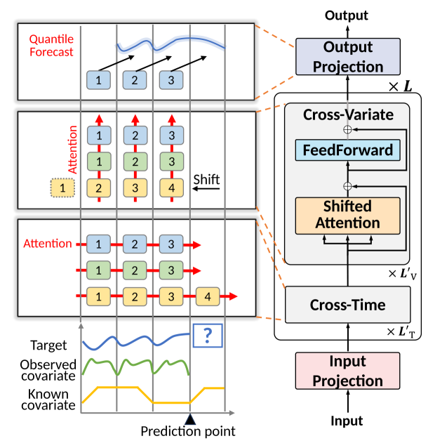
*Figure 1:Overall structure of CITRAS-FM.*

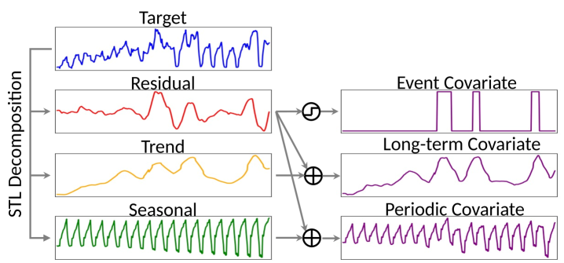
*Figure 2:Procedure of CovSynth.*

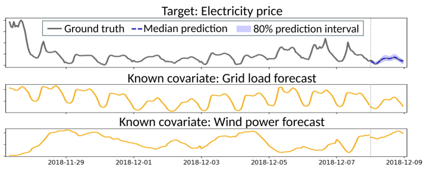
*Figure 3:Zero-shot forecasting results on EPF-NP.*

---
**Usage Info**: 4903 tokens used.
**Generated at**: 2026-06-10 16:59:34

---

# 📚 ViP-VL: Vietnamese Self-supervised Speech Pretraining Model with Vector-Quantization Learning

🚀 URL: https://arxiv.org/html/2606.10360

## 🌏 Abstract (원문)
We present ViP-VL, an efficientVietnamese Self-supervised speechPretraining model leveragingVector-quantizationLearning. To bridge the gap between high-resolution audio and efficient processing, ViP-VL incorporates Acoustic Stacking and Receptive Field Alignment to enable a synchronized 8x subsampling rate within the ChunkFormer architecture, while further enhancing representation robustness through a specialized Mask Selection Strategy during pretraining on the BEST-RQ framework. Pretrained on 17,000 hours of unlabeled Vietnamese speech, our model establishes new state-of-the-art results across four major downstream tasks: Automatic Speech Recognition, Speech Emotion Recognition, Dialect Classification, and Speaker Verification. To facilitate future research and the development of high-performance Vietnamese speech technologies, we publicly release our pretrained weights and implementation atgithub.com/khanld/chunkformer.
## 🌏 Abstract (번역)
저희는 벡터 양자화 학습을 활용하는 효율적인 베트남어 자기 지도 음성 사전 훈련 모델인 ViP-VL을 소개합니다. 고해상도 오디오와 효율적인 처리 간의 격차를 해소하기 위해 ViP-VL은 ChunkFormer 아키텍처 내에서 동기화된 8배 서브샘플링 속도를 가능하게 하는 Acoustic Stacking 및 Receptive Field Alignment를 통합하며, BEST-RQ 프레임워크에서 사전 훈련 중 특수 마스크 선택 전략을 통해 표현 견고성을 더욱 향상시킵니다. 17,000시간의 레이블 없는 베트남어 음성으로 사전 훈련된 저희 모델은 자동 음성 인식, 음성 감정 인식, 방언 분류, 화자 확인의 네 가지 주요 다운스트림 작업에서 새로운 최첨단 결과를 확립했습니다. 향후 연구 및 고성능 베트남어 음성 기술 개발을 촉진하기 위해 저희는 사전 훈련된 가중치와 구현을 github.com/khanld/chunkformer에 공개적으로 배포합니다.

## 🔍 Methods & Results
- ViP-VL은 벡터 양자화 학습을 활용하는 효율적인 베트남어 자기 지도 음성 사전 훈련 모델입니다.
- 고해상도 오디오와 효율적인 처리 간의 격차를 해소하기 위해 ChunkFormer 아키텍처 내에서 동기화된 8배 서브샘플링 속도를 가능하게 하는 Acoustic Stacking 및 Receptive Field Alignment를 통합합니다.
- BEST-RQ 프레임워크에서 사전 훈련 중 특수 마스크 선택 전략을 통해 표현 견고성을 향상시킵니다.
- 17,000시간의 레이블 없는 베트남어 음성으로 사전 훈련되었으며, 자동 음성 인식, 음성 감정 인식, 방언 분류, 화자 확인의 네 가지 주요 다운스트림 작업에서 새로운 최첨단 결과를 달성했습니다.
- 향후 연구를 위해 사전 훈련된 가중치와 구현을 공개적으로 배포합니다.

## 🖼 Figures
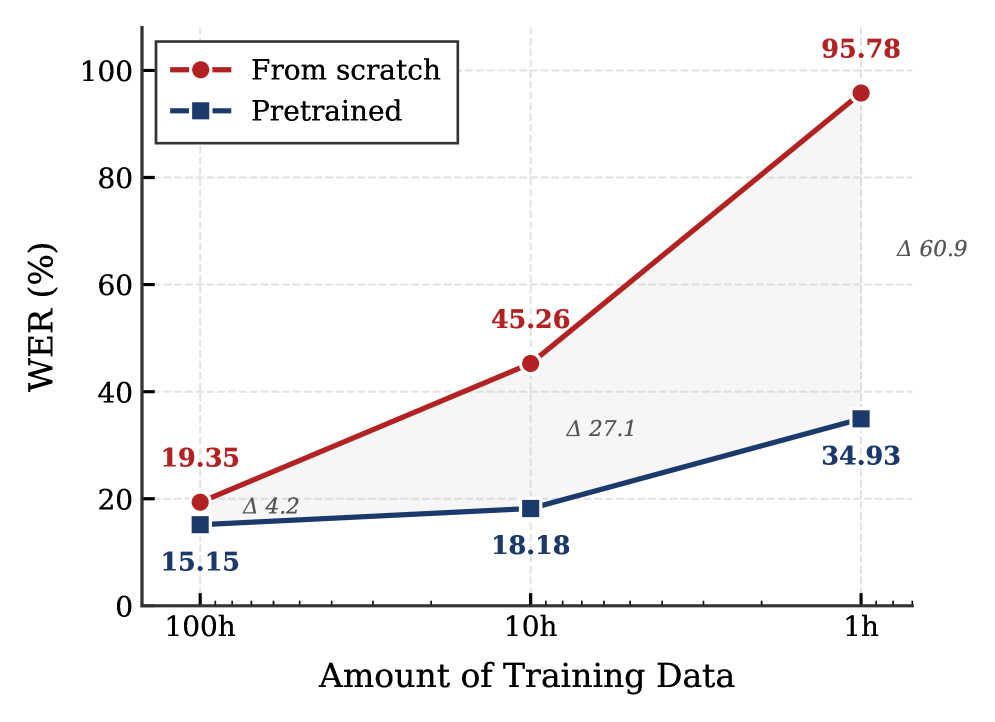
*Figure 1:Word error rate (WER) comparison between from scratch and pretrained on VLSP-T1.*

---
**Usage Info**: 1490 tokens used.
**Generated at**: 2026-06-10 16:59:40

---

# 📚 Phoneme-First Prediction for LLM-Based Speech Recognition Research supported by Research Foundation Flanders (FWO) under grant S004923N of the SBO programme and by the Flemish Government under the “Flanders AI Research Program”.

🚀 URL: https://arxiv.org/html/2606.10864

## 🌏 Abstract (원문)
Recent research has explored integrating Large Language Models (LLMs) with speech encoders to create speech-augmented LLMs capable of contextualized speech recognition. The main challenge lies in aligning the semantic embeddings of LLMs with the acoustic representations of speech encoders. We propose a novel approach that teaches the LLM to first predict phonemes from the speech features before generating the final transcript. By integrating a phoneme prediction step directly into the LLM, the model develops a fine-grained knowledge of pronunciation, reducing acoustic confusion and improving transcription accuracy and explainability. Our method is cheap and simple, as phoneme targets can be automatically derived from existing transcripts. Through comprehensive experiments, we show that intermediate phoneme prediction can improve speech recognition, particularly in low-resource settings, and yields outputs that are acoustically more faithful to the speech.
## 🌏 Abstract (번역)
최근 연구는 대규모 언어 모델(LLM)을 음성 인코더와 통합하여 문맥화된 음성 인식이 가능한 음성 증강 LLM을 만드는 것을 탐구해왔습니다. 주요 과제는 LLM의 의미 임베딩을 음성 인코더의 음향 표현과 정렬하는 데 있습니다. 우리는 LLM이 최종 전사본을 생성하기 전에 음성 특징으로부터 음소를 먼저 예측하도록 가르치는 새로운 접근 방식을 제안합니다. 음소 예측 단계를 LLM에 직접 통합함으로써, 모델은 발음에 대한 세밀한 지식을 개발하여 음향 혼동을 줄이고 전사 정확도와 설명 가능성을 향상시킵니다. 우리의 방법은 음소 목표가 기존 전사본으로부터 자동으로 도출될 수 있으므로 저렴하고 간단합니다. 포괄적인 실험을 통해, 우리는 중간 음소 예측이 특히 저자원 환경에서 음성 인식을 향상시킬 수 있으며, 음성에 음향적으로 더 충실한 출력을 생성함을 보여줍니다.

## 🔍 Methods & Results
- LLM이 최종 전사본을 생성하기 전에 음성 특징으로부터 음소를 먼저 예측하도록 가르치는 새로운 접근 방식을 제안함.
- 음소 예측 단계를 LLM에 직접 통합하여 모델이 발음에 대한 세밀한 지식을 개발하고 음향 혼동을 줄이며 전사 정확도와 설명 가능성을 향상시킴.
- 음소 목표는 기존 전사본으로부터 자동으로 도출될 수 있어 방법이 저렴하고 간단함.
- 포괄적인 실험을 통해 중간 음소 예측이 특히 저자원 환경에서 음성 인식을 향상시킬 수 있음을 입증함.
- 음성에 음향적으로 더 충실한 출력을 생성함을 확인하였음.

---
**Usage Info**: 1868 tokens used.
**Generated at**: 2026-06-10 16:59:48

---

# 📚 ParaBridge: Bridging Paralinguistic Perception and Dialogue Behavior in Speech Language Models

🚀 URL: https://arxiv.org/html/2606.10581

## 🌏 Abstract (원문)
Speech carries more information than just words: a child’s voice, a fearful tone, or a noisy background should all lead a sufficiently competent spoken-dialogue assistant to different replies. Current Speech Language Models (SLMs) can recognize such paralinguistic cues but often ignore them in open-ended dialogue. We observe that a simple paralinguistic instruction scaffold at the inference stage narrows this perception-behavior gap, suggesting that the relevant cues are already latent in the model. Such scaffolds, however, remain brittle under multi-turn context and competing instructions. Therefore, we proposeParaBridge, an on-policy self-distillation method that turns a brittle inference-time scaffold into stable model behavior. During training, the scaffold serves only as a temporary privileged view; the scaffold-free model rolls out its own response, while the scaffolded view supplies dense, full-vocabulary next-token targets along its trajectory. This supervision teaches when non-lexical cues should affect the reply without the need for curated dialogues, human labels, or external reward models. On Qwen3-Omni-thinking, ParaBridge raises scaffold-free VoxSafeBench SAR from14.6%14.6%to40.3%40.3%and improves EchoMind average rating from3.273.27to3.923.92. It also preserves general ability, with MMAU-Pro, VoiceBench, and GPQA all within0.40.4points of the original model. Beyond the training distribution, ParaBridge generalizes to unseen paralinguistic cues, transfers from safety-oriented training to empathy-oriented dialogue, and works on a different SLM backbone.
## 🌏 Abstract (번역)
음성은 단어 이상의 정보를 담고 있습니다: 아이의 목소리, 두려워하는 어조, 또는 시끄러운 배경 소음은 모두 충분히 유능한 음성 대화 어시스턴트가 다른 답변을 하도록 이끌어야 합니다. 현재 음성 언어 모델(SLM)은 이러한 비언어적 단서들을 인식할 수 있지만, 개방형 대화에서는 종종 이를 무시합니다. 우리는 추론 단계에서 간단한 비언어적 지시 스캐폴드가 이러한 인식-행동 격차를 줄이며, 관련 단서들이 이미 모델 내에 잠재되어 있음을 시사한다는 것을 관찰했습니다. 그러나 이러한 스캐폴드는 다중 턴 맥락과 상충하는 지시 하에서는 취약합니다. 따라서 우리는 취약한 추론 시간 스캐폴드를 안정적인 모델 행동으로 전환하는 온-정책 자기 증류(self-distillation) 방법인 ParaBridge를 제안합니다. 훈련 중에는 스캐폴드가 임시적인 특권적 관점으로만 작용합니다. 스캐폴드 없는 모델은 자체 응답을 생성하고, 스캐폴드 있는 관점은 해당 궤적을 따라 밀도 높은 전체 어휘 다음 토큰 목표를 제공합니다. 이러한 감독은 선별된 대화, 사람의 레이블 또는 외부 보상 모델 없이도 비언어적 단서가 언제 답변에 영향을 미쳐야 하는지를 가르칩니다. Qwen3-Omni-thinking에서 ParaBridge는 스캐폴드 없는 VoxSafeBench SAR을 14.6%에서 40.3%로 높이고, EchoMind 평균 평점을 3.27에서 3.92로 향상시킵니다. 또한 MMAU-Pro, VoiceBench, GPQA 모두 원본 모델과 0.4점 이내로 일반적인 능력을 보존합니다. 훈련 분포를 넘어, ParaBridge는 보지 못한 비언어적 단서로 일반화되고, 안전 지향 훈련에서 공감 지향 대화로 전이되며, 다른 SLM 백본에서도 작동합니다.

## 🔍 Methods & Results
- ParaBridge는 추론 시점의 취약한 비언어적 지시 스캐폴드를 안정적인 모델 행동으로 전환하는 온-정책 자기 증류(self-distillation) 방법이다.
- 훈련 중, 스캐폴드는 임시적인 '특권적 관점'(교사)으로 작용하며, 스캐폴드 없는 모델(학생)은 자체 응답을 생성한다.
- 스캐폴드 있는 관점은 학생 모델의 궤적을 따라 밀도 높은 전체 어휘 다음 토큰 목표를 제공하여, 비언어적 단서가 답변에 영향을 미쳐야 할 시점을 가르친다.
- 이 방법은 선별된 대화, 사람의 레이블, 또는 외부 보상 모델 없이 비언어적 단서 활용을 학습한다.
- ParaBridge는 스캐폴드 있는 분포와 스캐폴드 없는 분포 간의 대칭적 발산(JSD)을 최적화하며, 교사와 학생은 가중치를 공유하고 교사는 학생을 천천히 추적하여 발산 목표가 현재 모델에 대한 온-정책 상태를 유지한다.
- Qwen3-Omni-thinking에서 ParaBridge는 스캐폴드 없는 VoxSafeBench SAR을 14.6%에서 40.3%로 향상시키고, EchoMind 평균 평점을 3.27에서 3.92로 개선했다.
- MMAU-Pro, VoiceBench, GPQA 점수가 원본 모델과 0.4점 이내로 유지되어 일반적인 능력을 보존함을 입증했다.
- 훈련 분포를 넘어 보지 못한 비언어적 단서로 일반화되고, 안전 지향 훈련에서 공감 지향 대화로 전이되며, 다른 SLM 백본에서도 작동하는 것을 확인했다.

## 🖼 Figures
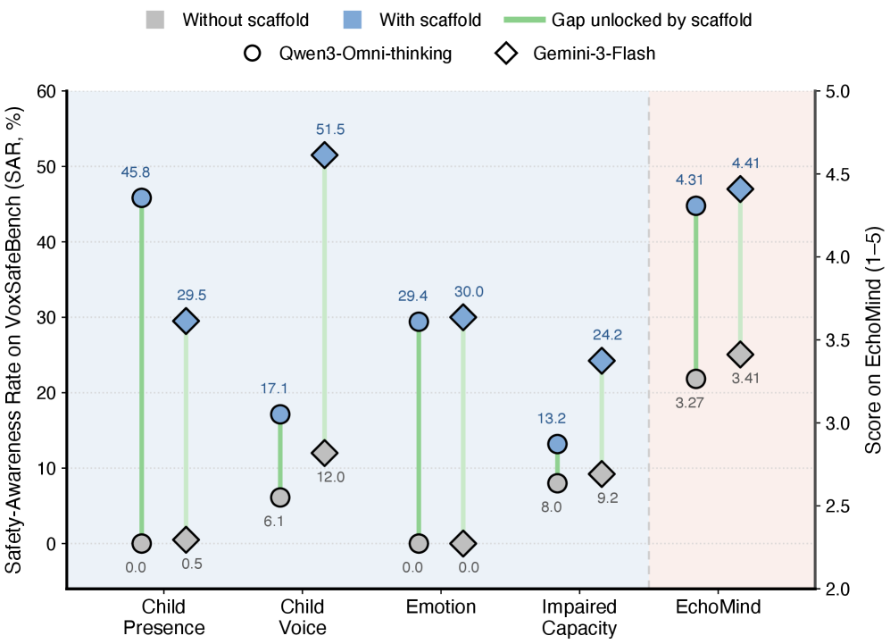
*Figure 1:Scaffolds reveal latent paralinguistic ability. Explicit paralinguistic scaffolds unlock large gains on VoxSafeBench and EchoMind, exposing a perception–behavior gap rather than a lack of cue perception.*

*Figure 2:ParaBridge versus common alignment pipelines and overall results. Left: unlike RFT and GRPO, which rely on selected responses or sparse reward feedback, ParaBridge distills scaffolded SLM behavior into a scaffold-free student through dense full-vocabulary supervision. Right: after training, ParaBridge consistently improves the paralinguistic axes over the scaffold-free baseline and the RFT/GRPO alternatives, while staying competitive on general benchmarks.*

*Figure 3:Overview of ParaBridge. For each audio example, a shared SLM produces a scaffolded teacher and a scaffold-free student. On student-sampled trajectories, token-level symmetric JSD aligns the student with the stop-gradient teacher (Eq. 6). Only the scaffold-free student is used at inference.*

*Figure 4:Data efficiency of ParaBridge. Most VoxSafeBench SAR gains appear within 500–1,000 cv
+
cp samples; EchoMind improves modestly and MMSU remains nearly flat.*

*Figure 5:Training efficiency on VoxSafeBench. Average SAR against wall-clock training time on Qwen3-Omni-thinking. RFT and ParaBridge are evaluated scaffold-free; GRPO is evaluated with the scaffold because scaffold-free positive rollouts are too rare for stable training. ParaBridge reaches the highest 
40.3
%
 in 
∼
2.7
h, a 
5.7
×
 wall-clock speedup over GRPO.*

*Figure 6:Linear CKA between Baseline and ParaBridge hidden states. L
0
 to L
46
 stay nearly identical (
CKA
>
0.998
); the shift is confined to L
47
 (
0.966
) and L
48
 (
0.907
), just before the language-model head. LoRA is attached at every layer, so this concentration is a property of the optimization.*

![Figure 7:Three corroborating measurements. Left: single-layer activation patching from ParaBridge into Base. Patches at L
6
 to L
42
 leave the next-token distribution within 
10
−
3
 nats of Base. The read-out layer (L
47
) recovers the bulk of the behavioral divergence, with the only larger shift at L
0
 where the patch overrides the entire context. Middle: layer-wise CKA toward the scaffolded teacher for Base, ParaBridge, and an SFT control. Curves coincide on L
0
 to L
46
. At L
48
, ParaBridge moves 
+
0.09
 closer to the teacher’s read-out than Base, while SFT moves 
+
0.18
 but at the cost of larger collateral shifts (Table 8). Right: per-layer Jensen–Shannon divergence between the Base and ParaBridge top-
8
 expert-selection distributions. Reported descriptively, with a layerwise peak at L
19
, JS
=
0.137
.](../images/2026-06-10/2606.10581/2606.10581_fig6.png)
*Figure 7:Three corroborating measurements. Left: single-layer activation patching from ParaBridge into Base. Patches at L
6
 to L
42
 leave the next-token distribution within 
10
−
3
 nats of Base. The read-out layer (L
47
) recovers the bulk of the behavioral divergence, with the only larger shift at L
0
 where the patch overrides the entire context. Middle: layer-wise CKA toward the scaffolded teacher for Base, ParaBridge, and an SFT control. Curves coincide on L
0
 to L
46
. At L
48
, ParaBridge moves 
+
0.09
 closer to the teacher’s read-out than Base, while SFT moves 
+
0.18
 but at the cost of larger collateral shifts (Table 8). Right: per-layer Jensen–Shannon divergence between the Base and ParaBridge top-
8
 expert-selection distributions. Reported descriptively, with a layerwise peak at L
19
, JS
=
0.137
.*

---
**Usage Info**: 4951 tokens used.
**Generated at**: 2026-06-10 17:00:04

---

# 📚 Deploying Speech-Driven 3D Facial Animation in Unreal Engine for Production-Ready Digital Humans

🚀 URL: https://arxiv.org/html/2606.10753

## 🌏 Abstract (원문)
Speech-driven 3D facial animation research has shown promising results, but most methods rely on representations that are not compatible with production pipelines. In this work, we present a deployable system that bridges this gap by enabling speech-driven 3D facial animation directly in Unreal Engine (UE) using ARKit-compatible representations. We construct 3DMEAD-ARKit dataset by converting the MEAD corpus into blendshape sequences using MediaPipe, and retrain FaceDiffuser and ProbTalk3D-X to generate stochastic and emotion controllable animations. We further develop a modular UE plugin with a Python backend that supports model selection, and parameter control. We compare the results to two existing commercial tools: Epic Games’ MetaHuman speech-driven animator and Nvidia Audio2Face with a perceptual user study. The results highlight the importance of comparisons among academic and commercial pipelines. We recommend watching the supplementary video. We also plan to do live demonstrations of our work at Siggraph 2026 conference.
## 🌏 Abstract (번역)
음성 기반 3D 얼굴 애니메이션 연구는 유망한 결과를 보여왔지만, 대부분의 방법은 프로덕션 파이프라인과 호환되지 않는 표현 방식에 의존합니다. 본 연구에서는 ARKit 호환 표현을 사용하여 언리얼 엔진(UE)에서 직접 음성 기반 3D 얼굴 애니메이션을 가능하게 함으로써 이러한 격차를 해소하는 배포 가능한 시스템을 제시합니다. 우리는 MediaPipe를 사용하여 MEAD 코퍼스를 블렌드셰이프 시퀀스로 변환하여 3DMEAD-ARKit 데이터셋을 구축하고, 확률적이고 감정 제어 가능한 애니메이션을 생성하기 위해 FaceDiffuser 및 ProbTalk3D-X를 재훈련시켰습니다. 또한, 모델 선택 및 파라미터 제어를 지원하는 Python 백엔드를 갖춘 모듈형 UE 플러그인을 개발했습니다. 우리는 Epic Games의 MetaHuman 음성 기반 애니메이터와 Nvidia Audio2Face라는 두 가지 기존 상용 도구와 지각 사용자 연구를 통해 결과를 비교했습니다. 이 결과는 학술 및 상용 파이프라인 간 비교의 중요성을 강조합니다. 보충 비디오 시청을 권장합니다. 또한 Siggraph 2026 컨퍼런스에서 본 연구의 라이브 시연을 진행할 계획입니다.

## 🔍 Methods & Results
- MEAD 코퍼스를 MediaPipe를 사용하여 프레임별 블렌드셰이프 시퀀스로 변환하여 3DMEAD-ARKit 데이터셋을 구축했으며, 이는 음성으로부터 감정 및 강도 제어 애니메이션 생성을 가능하게 합니다.
- 기존에 발표된 FaceDiffuser 및 ProbTalk3D-X 모델을 새로운 데이터셋에 맞게 사소한 아키텍처 수정을 거쳐 재훈련시켰습니다.
- 음성 오디오로부터 ARKit 호환 캐릭터를 애니메이션화하고 제어 가능한 입력 파라미터를 지원하는 모듈형 UE 플러그인을 Python 백엔드와 함께 개발했습니다.
- UE 플러그인 인터페이스는 사용자가 모델, 캐릭터, 입력 음성 오디오(사전 녹음 또는 라이브)를 선택하고, 말하는 스타일, 감정, 강도와 같은 파라미터를 제어할 수 있도록 합니다.
- 입력은 로컬 Python 서버로 전송되어 ARKit 블렌드셰이프 시퀀스를 CSV 데이터로 생성하며, 플러그인은 UE의 LiveLinkFaceImporter를 활용하여 이 데이터를 Level Sequence UE 애셋으로 변환하고 선택된 ARKit 호환 캐릭터에 자동으로 적용합니다.
- 생성된 시퀀스를 재사용 가능한 애셋으로 저장하고 다른 호환 캐릭터에 애니메이션을 리타겟팅할 수 있는 내부 애니메이션 라이브러리를 포함합니다.
- UE 전문가 평가와 Epic Games의 MetaHuman 및 Nvidia Audio2Face와 같은 상용 도구에 대한 통계적으로 엄격한 지각 사용자 연구를 통해 시스템을 평가했습니다.

## 🖼 Figures
![Figure 1.System overview: User can select the model, input audio (existing or live recording), conditioning style (i.e., speaking style, emotion, intensity) and a digital human character using the frontend interface. The data is passed to the backend for generating the animation data. Upon inference, the data is sent to the engine which is used to create, apply to selected character and save the animations in the animation library. User can also retarget the saved animations to other compatible characters.](../images/2026-06-10/2606.10753/2606.10753_fig0.png)
*Figure 1.System overview: User can select the model, input audio (existing or live recording), conditioning style (i.e., speaking style, emotion, intensity) and a digital human character using the frontend interface. The data is passed to the backend for generating the animation data. Upon inference, the data is sent to the engine which is used to create, apply to selected character and save the animations in the animation library. User can also retarget the saved animations to other compatible characters.*

*(a)Experiment 1 Main Effect.*

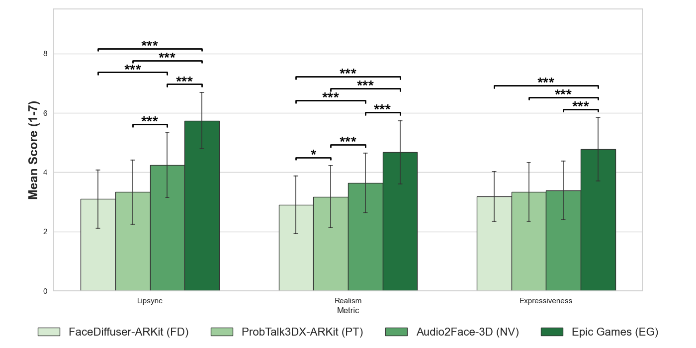
*(a)Experiment 1 Main Effect.*

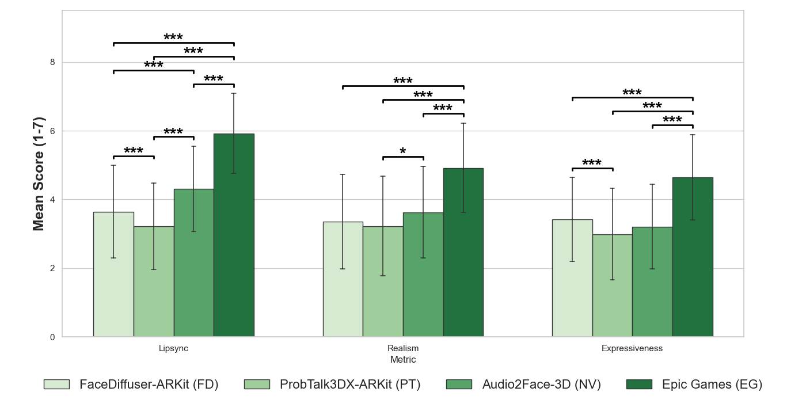
*(b)Experiment 2 Main Effect.*

*(a)MEAD video frame*

*(a)MEAD video frame*

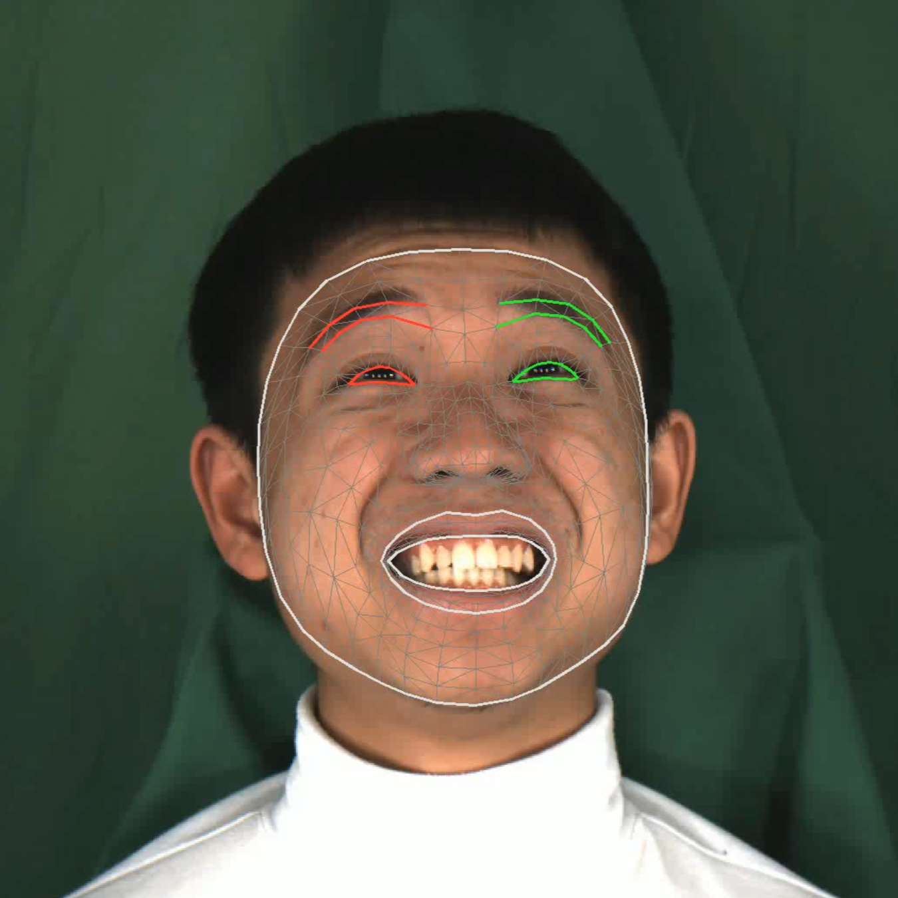
*(b)MediaPipe landmarks*

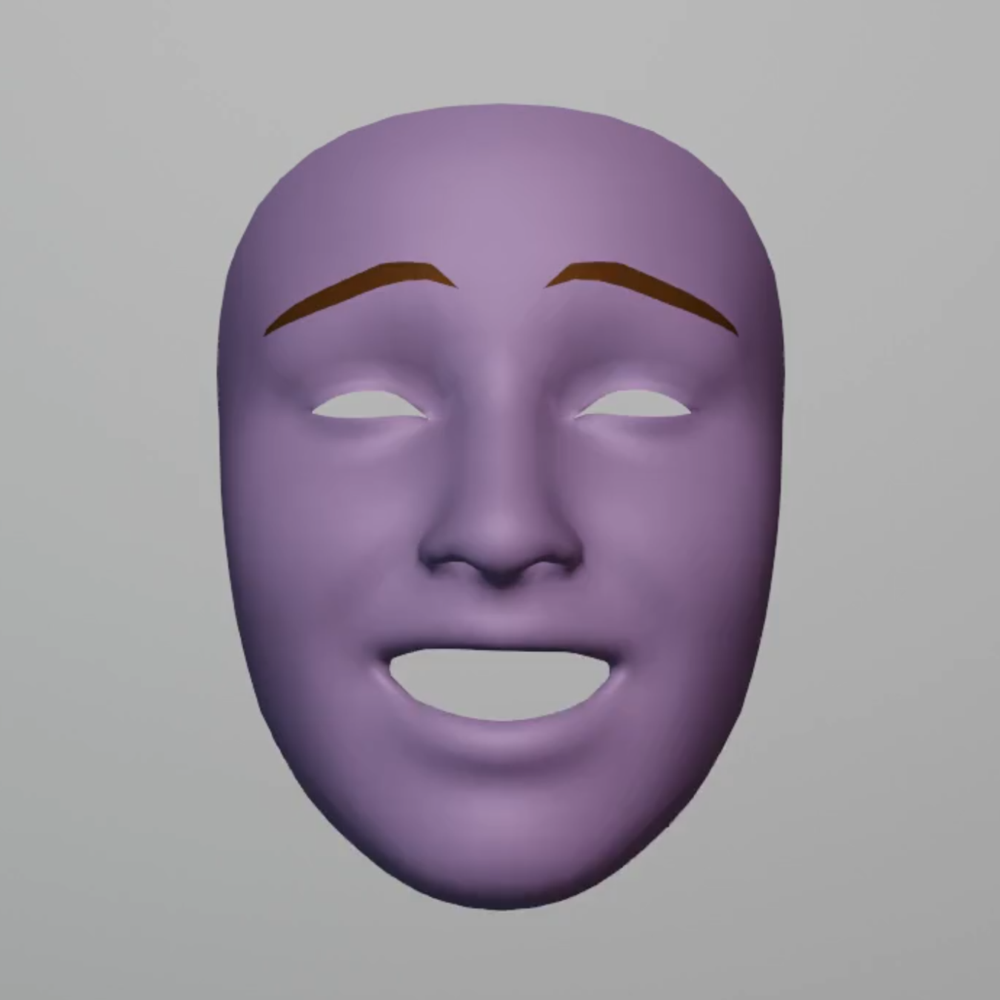
*(c)ARKit blendshape*

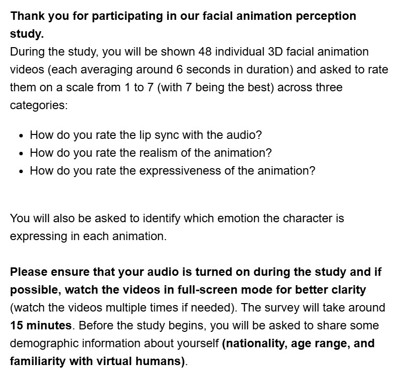
*Figure 4.User study instruction.*

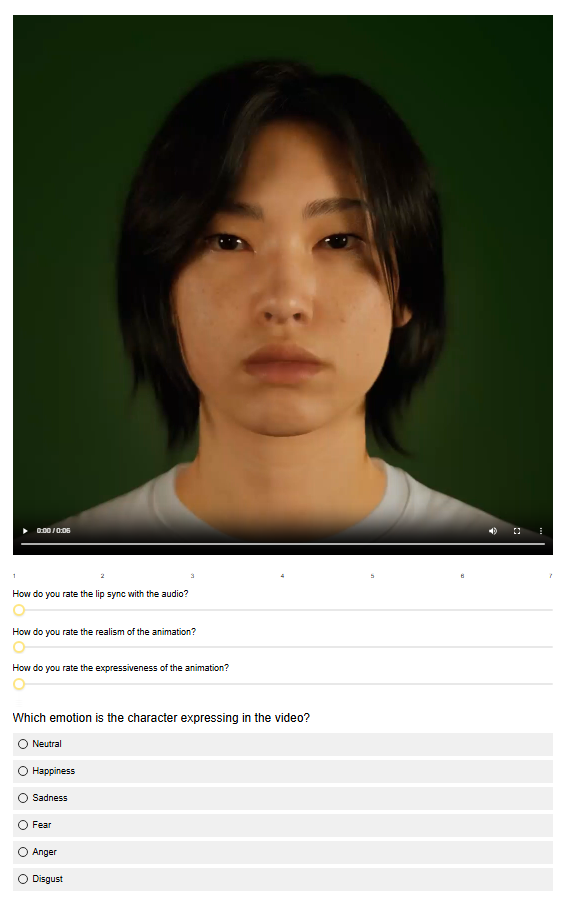
*Figure 5.User study UI.*

*(a)Experiment 1*

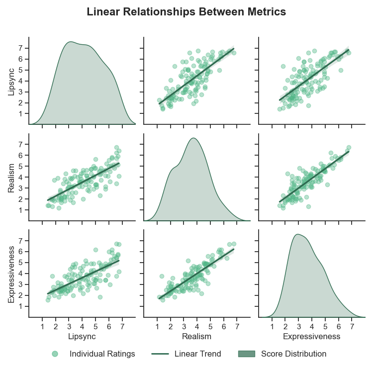
*(a)Experiment 1*

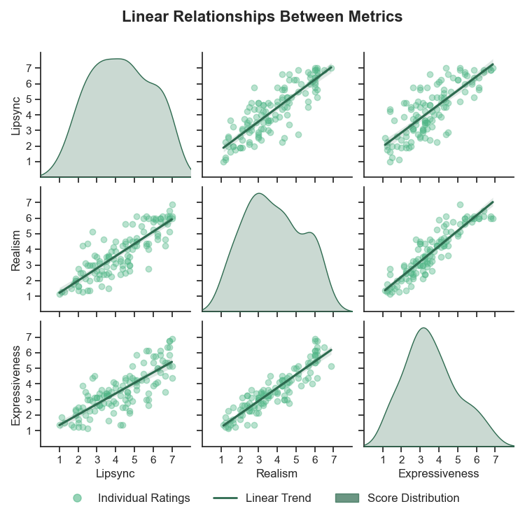
*(b)Experiment 2*

---
**Usage Info**: 3143 tokens used.
**Generated at**: 2026-06-10 17:02:04

---

# 📚 GC-LoRA: Gated Convolutional LoRA for Parameter-Efficient Acoustic Adaptation

🚀 URL: https://arxiv.org/html/2606.10464

## 🌏 Abstract (원문)
Transformer-based Speech Foundation Models excel in most Automatic Speech Recognition tasks but often suffer performance degradation when applied to domains with mismatched acoustic characteristics. While Parameter Efficient Fine-Tuning (PEFT) methods, such as Low-Rank Adaptation (LoRA), adjust global attention, they lack the local context modeling crucial for capturing domain-specific variations. We propose GC-LoRA, a novel adapter architecture that injects Conformer-style local convolutional processing into pretrained Transformer encoders. By integrating a lightweight adapter to encoder attention output projections, our method efficiently captures local acoustic dependencies without disrupting pretrained global representations. Experiments across diverse datasets (acoustically-degraded, bandlimited, dialectal, child) demonstrate the efficacy of our approach, achieving Word Error Rate (WER) reductions of up to 10.9% compared to baselines while adding minimal trainable parameters.
## 🌏 Abstract (번역)
트랜스포머 기반 음성 파운데이션 모델은 대부분의 자동 음성 인식(ASR) 작업에서 뛰어난 성능을 보이지만, 음향 특성이 일치하지 않는 도메인에 적용될 경우 성능 저하를 겪는 경우가 많습니다. LoRA(Low-Rank Adaptation)와 같은 매개변수 효율적인 미세 조정(PEFT) 방법은 전역적인 어텐션을 조정하지만, 도메인별 변형을 포착하는 데 중요한 지역적 컨텍스트 모델링 기능이 부족합니다. 본 논문에서는 사전 학습된 트랜스포머 인코더에 컨포머(Conformer) 스타일의 지역 컨볼루션 처리를 주입하는 새로운 어댑터 아키텍처인 GC-LoRA를 제안합니다. 인코더 어텐션 출력 프로젝션에 경량 어댑터를 통합함으로써, 저희 방법은 사전 학습된 전역 표현을 방해하지 않으면서 지역 음향 의존성을 효율적으로 포착합니다. 음향적으로 저하된, 대역 제한된, 방언, 아동 음성 등 다양한 데이터셋에 걸친 실험은 저희 접근 방식의 효능을 입증했으며, 최소한의 훈련 가능한 매개변수를 추가하면서도 기준선 대비 최대 10.9%의 단어 오류율(WER) 감소를 달성했습니다.

## 🔍 Methods & Results
- GC-LoRA는 사전 학습된 트랜스포머 백본이 매개변수 효율성을 유지하면서 지역 컨텍스트를 모델링할 수 있도록 컨포머(Conformer)의 컨볼루션 모듈을 LoRA의 저랭크 병목 내부에 임베딩하는 새로운 어댑터 아키텍처이다.
- 이 방법은 멀티 헤드 셀프 어텐션(MHSA) 블록의 출력 프로젝션 행렬(Wo)을 대상으로 하여, 표준 전역 어텐션을 유지하면서 GC-LoRA가 지역 음향 컨텍스트를 사용하여 어텐션된 특징을 정제하도록 한다.
- GC-LoRA 블록은 입력 특징을 저랭크 도메인으로 압축하고, 저랭크 공간 내에서 포인트와이즈 컨볼루션 확장 및 Gated Linear Unit(GLU) 메커니즘을 적용하여 지역 컨텍스트의 선택적 수정을 가능하게 한다.
- 이어서 1D 깊이별 컨볼루션, 그룹 정규화(Group Normalization), Swish 활성화 함수를 사용하여 지역 시간적 컨텍스트를 포착하며, 최종 포인트와이즈 컨볼루션으로 채널을 혼합하고 내부 잔여 연결을 형성한다.
- 컨볼루션 연산을 r-차원 병목(r << D) 내에 격리함으로써, GC-LoRA는 표준 LoRA와 유사한 매개변수 footprint를 유지한다.
- 실험은 음향적으로 저하된, 대역 제한된, 방언, 아동 음성 등 다양한 데이터셋에서 수행되었으며, GC-LoRA가 기준선 대비 최대 10.9%의 단어 오류율(WER) 감소를 달성함을 입증했다.
- 표준 LoRA는 Wq 및 Wv에 적용되는 반면, GC-LoRA는 Wo에 적용되어 어텐션된 표현을 지역 음향 컨텍스트로 정제한다. LoRA-Output(Wo에만 LoRA 적용)과도 비교되었다.

## 🖼 Figures

*Figure 1:GC-LoRA adapter inserted into an encoder layer. Left: Baseline encoder layer. Middle: GC-LoRA replaces the standard residual low-rank update of 
𝑊
𝑜
. Right: Gated Convolution block.*

*Figure 2:Impact of rank 
𝑟
 on MyST test WER for LoRA and GC-LoRA (Whisper-Medium; kernel size 
𝑘
=
31
).*

*Figure 3:Attention map analysis of heads 
ℎ
=
7
 (top) and 
ℎ
=
15
 (bottom) from the final encoder layer for a representative sample from the CORAAL test set: (a) LoRA and (b) GC-LoRA. The x-axis denotes encoder key position 
𝑗
, and the y-axis denotes encoder query position 
𝑖
; color intensity indicates the attention weight 
𝐴
𝑖
​
𝑗
.*

---
**Usage Info**: 3827 tokens used.
**Generated at**: 2026-06-10 17:02:38

---

