# 🚩 (2026-06-11) Scholar Inbox 추천 논문 

# 📚 SARA: A Dual-Stream VAE for High-Fidelity Speech Generation via Integrating Semantic and Acoustic Representations∗ Work done during an internship at DiDi Global Inc.† Corresponding author

🚀 URL: https://arxiv.org/html/2606.11611

## 🌏 Abstract (원문)
Zero-shot text-to-speech (TTS) relies on robust speech representations. However, current speech tokenizers face a fundamental trade-off: acoustic codecs preserve high-fidelity audio but lack linguistic constraints, causing content errors during generation, whereas semantic tokens from self-supervised learning (SSL) models ensure precise text alignment but discard some acoustic information. To bridge this gap, we propose SARA, a dual-stream VAE that directly fuses a frozen SSL semantic anchor with a dedicated residual acoustic encoder. This effectively mitigates the dilemma, creating an efficient and compact latent space without relying on complex regularizers. SARA achieves superior reconstruction quality over strong baselines. Furthermore, in downstream zero-shot TTS tasks, it yields highly natural and expressive synthesis quality, and maintains robust generation performance even under accelerated inference, offering a favorable trade-off between synthesis speed and computational cost.
## 🌏 Abstract (번역)
제로샷 텍스트-음성 변환(TTS)은 견고한 음성 표현에 의존합니다. 그러나 현재의 음성 토크나이저는 근본적인 상충 관계에 직면해 있습니다. 음향 코덱은 고음질 오디오를 보존하지만 언어적 제약이 부족하여 생성 중 내용 오류를 유발하는 반면, 자기 지도 학습(SSL) 모델의 의미 토큰은 정확한 텍스트 정렬을 보장하지만 일부 음향 정보를 버립니다. 이 간극을 메우기 위해 우리는 고정된 SSL 의미 앵커와 전용 잔여 음향 인코더를 직접 융합하는 듀얼 스트림 VAE인 SARA를 제안합니다. 이는 복잡한 정규화 장치에 의존하지 않고 효율적이고 압축된 잠재 공간을 생성하여 이러한 딜레마를 효과적으로 완화합니다. SARA는 강력한 기준선보다 우수한 재구성 품질을 달성합니다. 또한, 다운스트림 제로샷 TTS 작업에서 매우 자연스럽고 표현력이 풍부한 합성 품질을 제공하며, 가속화된 추론에서도 견고한 생성 성능을 유지하여 합성 속도와 계산 비용 간의 유리한 균형을 제공합니다.

## 🔍 Methods & Results
- SARA는 재구성 충실도와 생성 품질 간의 상충 관계를 완화하기 위해 제안된 듀얼 스트림 VAE이다.
- SARA 인코더는 고정된 W2v-BERT 2.0 SSL 인코더(의미 앵커 역할)와 잔여 음향 인코더(세밀한 음향 정보 캡처)의 두 가지 스트림으로 구성된다.
- 두 스트림(의미 및 음향)은 50Hz의 동일한 프레임 속도로 64차원 잠재 표현으로 직접 연결 및 융합된다.
- 디코더는 HiFi-GAN 아키텍처를 기반으로 하며, 통합된 잠재 표현으로부터 고음질 파형을 합성한다.
- 훈련은 재구성 손실(다중 스케일 멜-스펙트로그램 손실)과 지각 품질을 위한 적대적 훈련(다중 주기 및 다중 대역/스케일 STFT 판별자)을 포함하는 ELBO 최소화를 통해 이루어진다.
- SARA는 복잡한 정규화 장치 없이 효율적이고 압축된 잠재 공간을 생성하며, 강력한 기준선 대비 우수한 재구성 품질을 달성한다.
- 제로샷 TTS 작업에서 SARA는 매우 자연스럽고 표현력이 풍부한 합성 품질을 제공하며, 가속화된 추론에서도 견고한 생성 성능을 유지하여 합성 속도와 계산 비용 간의 유리한 균형을 제공한다.

## 🖼 Figures
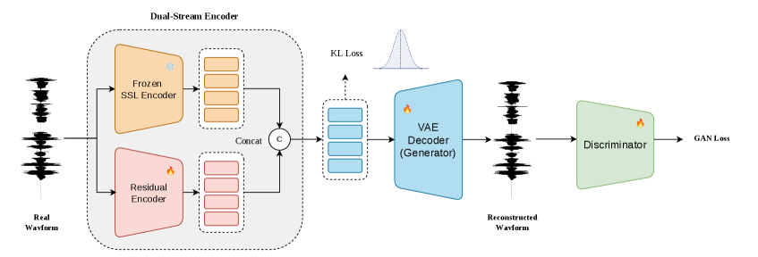
*Figure 1:Overall model structure. The frozen SSL Encoder extracts semantic representations, while the Residual Acoustic Encoder captures fine-grained acoustic details.*

---
**Usage Info**: 4017 tokens used.
**Generated at**: 2026-06-11 17:38:38

---

# 📚 Real-Time Language Model Jamming: A Case Study for Live Music Accompaniment Generation

🚀 URL: https://arxiv.org/html/2606.11886

## 🌏 Abstract (원문)
Language models (LMs) have become one of the most prominent paradigms in modern generative modeling. While making them faster has been the main focus of real-time deployment, speed alone is not enough. Many real-world applications, such as synchronized translation and voice synthesis, also require precise alignment between generation and external signals, both in terms of generation content and timing. We refer to this problem asframe-synchronous streaming inference. To address it, we present StreamMUSE, an inference system that performs LM generation in response to an external signal stream within a client-server architecture. The client continuously sends high-frequency inference requests based on the most recent inputs and receives outputs synchronized to the external clock, while the server executes model inference. We demonstrate the framework through a live music accompaniment task, showing how real-time synchronization can be achieved across different deployment environments with varying round-trip latencies. We further model the relationship between system hyperparameters and round-trip latency, and evaluate how different environments affect optimal configurations to achieve real-time performance. Experimental results show a consistent correspondence between system real-time performance and music quality, demonstrating the effectiveness of the proposed framework. The project is open source. Relevant code and the latest updates are available athttps://stream-muse-webpage.vercel.app/#audio-library.
## 🌏 Abstract (번역)
언어 모델(LM)은 현대 생성 모델링에서 가장 두드러진 패러다임 중 하나가 되었습니다. 실시간 배포의 주요 초점은 속도를 높이는 것이었지만, 속도만으로는 충분하지 않습니다. 동기화된 번역 및 음성 합성 같은 많은 실제 애플리케이션은 생성 내용과 타이밍 모두에서 생성과 외부 신호 간의 정확한 정렬을 요구합니다. 우리는 이 문제를 프레임 동기식 스트리밍 추론이라고 부릅니다. 이를 해결하기 위해, 우리는 클라이언트-서버 아키텍처 내에서 외부 신호 스트림에 반응하여 LM 생성을 수행하는 추론 시스템인 StreamMUSE를 제시합니다. 클라이언트는 가장 최근 입력에 기반하여 고주파 추론 요청을 지속적으로 보내고 외부 클록에 동기화된 출력을 수신하며, 서버는 모델 추론을 실행합니다. 우리는 라이브 음악 반주 작업을 통해 이 프레임워크를 시연하며, 다양한 왕복 지연 시간을 가진 여러 배포 환경에서 실시간 동기화를 달성하는 방법을 보여줍니다. 또한 시스템 하이퍼파라미터와 왕복 지연 시간 간의 관계를 모델링하고, 실시간 성능을 달성하기 위한 최적의 구성에 다양한 환경이 어떻게 영향을 미치는지 평가합니다. 실험 결과는 시스템 실시간 성능과 음악 품질 사이에 일관된 상관관계를 보여주며, 제안된 프레임워크의 효과를 입증합니다. 이 프로젝트는 오픈 소스입니다. 관련 코드 및 최신 업데이트는 https://stream-muse-webpage.vercel.app/#audio-library에서 확인할 수 있습니다.

## 🔍 Methods & Results
- 실시간 대화형 반주 작업을 조건부 시퀀스 모델링 문제로 공식화했으며, 낮은 지연 시간 협업을 위해 온라인 제약(인과적이며 미리 보기가 없음)을 핵심 설계 원칙으로 채택했습니다.
- 시간을 '틱'(예: 1/4 박자)이라는 균일한 시간 단계로 이산화하고, 모델은 멜로디 M[t]를 관찰하기 전에 반주 A[t]를 예측합니다.
- 멜로디와 반주 프레임을 단일 입력 시퀀스로 결합하기 위해 인터리빙 기법을 사용하며, 프레임은 단일 틱에서 발생하는 모든 음표 이벤트를 토큰화한 표현입니다.
- 모델 아키텍처는 Transformer 기반의 자기회귀 디코더로, 로컬 인코더, 글로벌 예측기, 로컬 디코더의 세 가지 모듈 설계에서 파생되었습니다.
- StreamMUSE는 클라이언트-서버 아키텍처를 사용하여 지연 시간과 BPM 민감도를 처리하며, 클라이언트는 틱 간격(II)에 따라 고주파 추론 요청을 보내고 서버는 생성 길이(GL)에 따라 인터리빙된 시퀀스를 생성합니다.
- 클라이언트는 다중 스레드 설계와 비동기 스케줄링 메커니즘을 사용하여 실시간 재생과 네트워크 통신을 분리하며, 네트워크 꼬리 지연 시간을 완화하기 위해 틱 정렬 데이터 구조와 백업 메커니즘을 구현했습니다.
- 생성 길이(GL)를 추론 간격(II)보다 길게 설정하여 연속적인 생성된 반주(GA) 세그먼트 간의 오버랩을 생성하고, 이는 요청 지연 시 음악적 연속성을 유지하는 백업 역할을 합니다.
- 서버는 사용자의 과거 생성 반주 및 실시간 멜로디 컨텍스트 정보를 유지하고, 새로운 멜로디 세그먼트를 통합하여 모델에 공급하며, 생성된 멜로디는 버리고 반주만 클라이언트에 전송하여 데이터 전송을 최소화합니다.
- 왕복 시간(RTT)은 추론 지연 시간(IL)과 네트워크 지연 시간(NL)으로 모델링되며, IL은 GL의 2차 함수로, NL은 고정된 통신 지연과 파레토 노이즈 항으로 모델링됩니다.
- 실시간 작동을 위한 두 가지 기본 제약 조건(실시간 안전성 제약: RTT(GL) <= II * τ_tick, 재생 연속성 제약: GL * τ_tick >= RTT(GL) + II * τ_tick)을 설정하여 유효한 (II, GL) 구성 쌍의 범위를 도출합니다.
- 시스템 실현 가능성 조건은 RTT(GL) <= GL * τ_tick / 2이며, 이는 RTT(GL) 곡선이 τ_tick / 2 기울기를 가진 선형 상한선 아래에 있어야 함을 의미하며, BPM이 빠를수록 이 한계는 더 엄격해집니다.
- StreamMUSE는 다양한 하드웨어 및 네트워크 구성에서 최적의 작동 지점을 자동으로 식별하며, 실험 결과는 시스템 실시간 성능과 음악 품질 간의 일관된 상관관계를 보여줍니다.

## 🖼 Figures
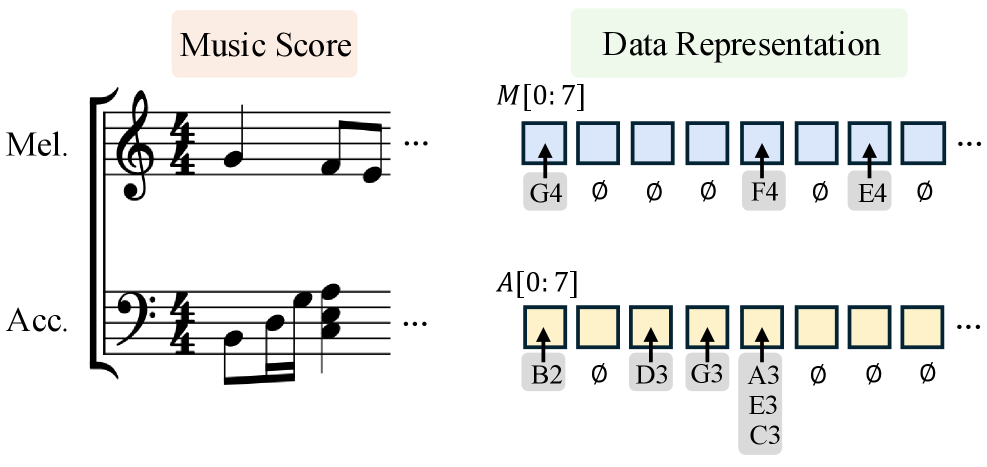
*Figure 1:Sample MIDI tokenization*

*Figure 3:Comparison between RTT model and real 
𝑅
​
𝑇
​
𝑇
 latency*

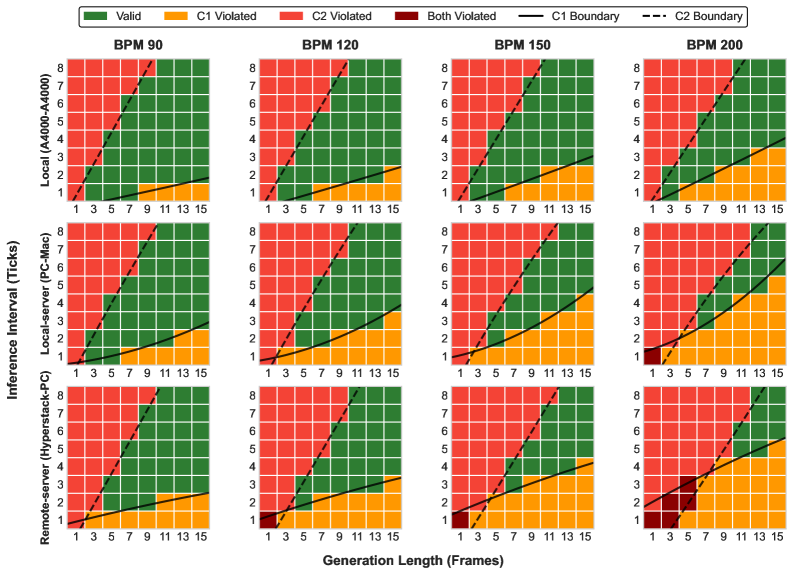
*Figure 4:Visualization of possible configuration pairs in solution space across three settings and four BPMs (Green: valid pair; Yellow: pairs violate C1 constraint; Red: pairs violate C2 constraint; Dark Red: pairs violate both constraint)*

---
**Usage Info**: 6752 tokens used.
**Generated at**: 2026-06-11 17:38:51

---

# 📚 Feature-Aligned Speech Watermarking for Robustness to Reconstruction Distortions

🚀 URL: https://arxiv.org/html/2606.11828

## 🌏 Abstract (원문)
Audio watermarking aims to embed identifiable information into audio while remaining imperceptible. Existing methods adopt high-fidelity, low-energy designs to preserve perceptual quality, but the resulting watermarks lack robustness under suppression by speech reconstruction models. Improving robustness is challenging due to the inherent robustness–fidelity trade-off in existing designs, where increasing watermark energy improves robustness but reduces fidelity. To address this problem, we propose a feature-aligned watermarking method that aligns the watermark with the original speech feature distribution, allowing higher watermark energy to improve robustness while preserving imperceptibility. We use a pretrained speech codec to generate a pseudo-speech watermark and fuse it into the spectrogram of the input audio, with VAD loss and perceptual losses guiding embedding within voiced regions. Experiments show that our method maintains imperceptibility comparable to existing approaches while substantially improving robustness under both seen and unseen speech reconstruction models.
## 🌏 Abstract (번역)
오디오 워터마킹은 식별 가능한 정보를 오디오에 삽입하면서도 인지할 수 없도록 하는 것을 목표로 합니다. 기존 방법들은 지각 품질을 보존하기 위해 고충실도, 저에너지 설계를 채택하지만, 그 결과 생성된 워터마크는 음성 재구성 모델에 의한 억제 시 강인성이 부족합니다. 강인성 향상은 기존 설계의 내재된 강인성-충실도 상충 관계 때문에 어렵습니다. 즉, 워터마크 에너지를 증가시키면 강인성은 향상되지만 충실도는 감소합니다. 이 문제를 해결하기 위해, 우리는 워터마크를 원본 음성 특징 분포에 정렬시키는 특징 정렬 워터마킹 방법을 제안합니다. 이는 더 높은 워터마크 에너지를 사용하여 강인성을 향상시키면서도 비인지성을 유지할 수 있게 합니다. 우리는 사전 학습된 음성 코덱을 사용하여 의사 음성 워터마크를 생성하고, 이를 입력 오디오의 스펙트로그램에 융합하며, VAD 손실과 지각 손실이 유성음 영역 내 삽입을 안내하도록 합니다. 실험 결과, 우리의 방법은 기존 접근 방식과 유사한 비인지성을 유지하면서도, 알려진 및 알려지지 않은 음성 재구성 모델 모두에서 강인성을 크게 향상시키는 것으로 나타났습니다.

## 🔍 Methods & Results
- 제안된 방법은 워터마크 임베더(embedder)와 디코더(decoder)로 구성되며, 임베더는 워터마크를 사전 학습된 코덱 잠재 공간에 삽입하여 원본 음성 특징 분포에 정렬된 의사 음성 워터마크를 생성합니다.
- 의사 음성 워터마크는 학습 가능한 융합 가중치를 사용하여 스펙트로그램 도메인에서 원본 오디오와 융합되며, VAD 손실, 디코딩 손실 및 지각 손실(청각 마스킹, 화자 유사성)이 유성음 영역 내 삽입을 유도하여 강인성과 비인지성을 동시에 향상시킵니다.
- 임베더는 고정된 사전 학습된 음성 코덱 인코더-디코더, 워터마크 정보를 잠재 공간에 주입하는 어댑터(6계층 2D CNN), 그리고 의사 음성 워터마크를 원본 오디오와 스펙트로그램에서 융합하는 통합기(4계층 2D CNN)를 포함합니다.
- 의사 음성 생성 과정에서 n-비트 워터마크는 임베딩 벡터로 매핑되어 코덱 잠재 특징과 연결된 후 어댑터를 통해 수정된 잠재 특징으로 변환되고, 코덱 디코더가 의사 음성 오디오를 생성합니다.
- 스펙트로그램 융합은 원본 및 의사 음성 오디오를 STFT를 통해 복소 스펙트로그램으로 변환하고, 통합기가 프레임-주파수 융합 가중치를 예측하여 최종 워터마크된 스펙트로그램을 생성합니다.
- 워터마크 디코더는 유성음 구간의 프레임별 가능성을 예측하는 시간 가중치 감지기(4계층 1D CNN)와 음성 특징에서 워터마크를 복구하는 다중 스케일 특징 피라미드 추출기(6계층 2D CNN)를 포함합니다.
- 훈련 중에는 워터마크된 오디오에 대체, 마스킹, 프레임 셔플, 압축, 필터링, 코덱/보코더 재구성 등의 다양한 미분 가능한 왜곡을 적용하여 강인성을 높입니다.
- 총 손실 함수는 VAD 손실, 청각 마스킹 손실, 화자 유사성 손실, 잠재 유사성 손실, 충실도 손실(L1, Mel-스펙트로그램, 적대적, SI-SNR), 디코딩 손실(교차 엔트로피)의 가중치 합으로 구성됩니다.
- 의사 음성 워터마크 융합 설계 덕분에 신호 수준 손실(L1, Mel-스펙트로그램, SI-SNR)에 작은 가중치를 적용하여 충실도 제약을 완화하면서도 비인지성을 유지하고 강인성을 향상시킬 수 있습니다.

## 🖼 Figures
![Figure 1: Impact of speech reconstruction models on the decoding bit accuracy of existing audio watermarking methods. Applying denoising (ClearerVoice [19]), neural codec (EnCodec [2], FACodec [5]), SpeechTokenizer [18], and vocoder (HiFiGAN [6], Vocos [15]) models leads to varying degrees of degradation across different watermarking methods, even though these reconstruction models are not trained with any watermark-related objective.](../images/2026-06-11/2606.11828/2606.11828_fig0.png)
*Figure 1: Impact of speech reconstruction models on the decoding bit accuracy of existing audio watermarking methods. Applying denoising (ClearerVoice [19]), neural codec (EnCodec [2], FACodec [5]), SpeechTokenizer [18], and vocoder (HiFiGAN [6], Vocos [15]) models leads to varying degrees of degradation across different watermarking methods, even though these reconstruction models are not trained with any watermark-related objective.*

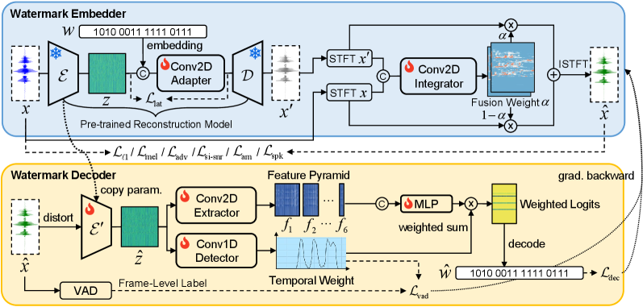
*Figure 2:The overall architecture of the proposed watermarking framework.*

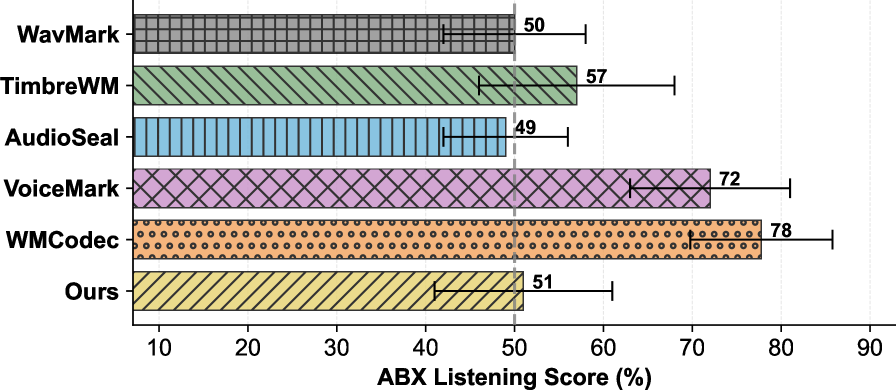
*Figure 3: Subjective ABX listening test results measuring the imperceptibility of audio watermarking methods. Scores closer to 50% indicate higher imperceptibility, with error bars showing 95% confidence intervals.*

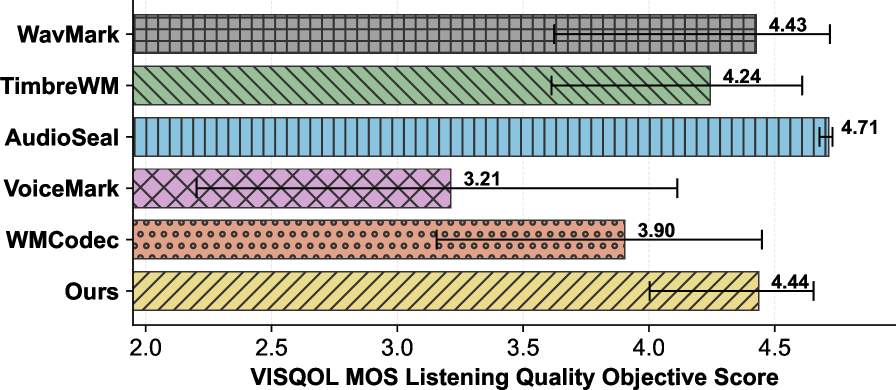
*Figure 4: VISQOL MOS listening quality objective scores for different audio watermarking methods. Higher scores indicate better perceptual quality.*

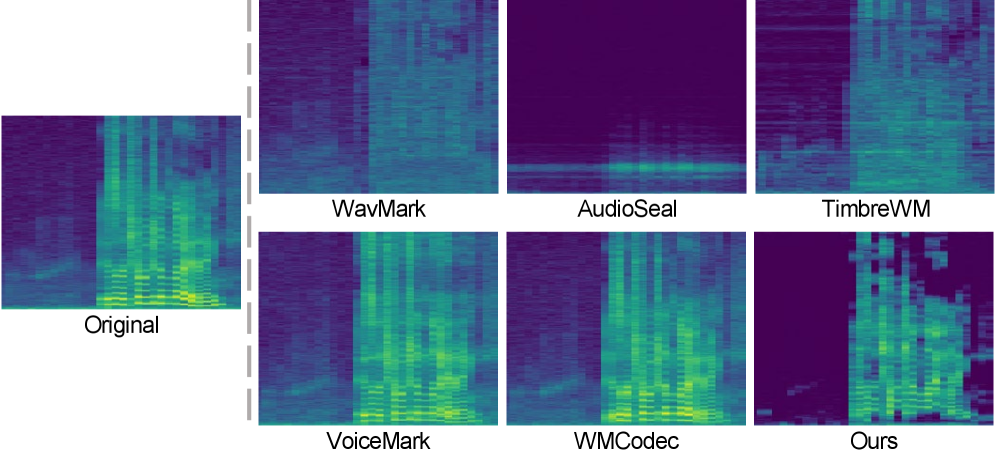
*Figure 5: Spectrogram comparison for the case study. The first panel shows the original audio; the others show spectrograms of difference signals (watermarked waveform minus original waveform).*

---
**Usage Info**: 4662 tokens used.
**Generated at**: 2026-06-11 17:39:03

---

# 📚 Benchmarking Neural Speech Compression from a Rate-Distortion Perspective

🚀 URL: https://arxiv.org/html/2606.11631

## 🌏 Abstract (원문)
Learning-based speech compression has achieved promising low-bitrate performance, but many neural speech codecs still describe quantized latents with preset-rate discrete symbols or apply entropy coding only after symbol generation. Such designs decouple representation learning from probability modeling, limiting their ability to exploit the non-uniform usage and temporal dependencies of learned speech latents. In this paper, we benchmark neural speech compression from a rate–distortion perspective and further investigate entropy-constrained coding for low-bitrate speech compression. We first formulate a unified learning-based speech coding pipeline and provide a benchmark-style analysis of recent neural speech codecs, showing that explicit probability modeling remains underexplored in learned speech compression. We then propose ECC, an Entropy-Constrained Codec that combines scalar quantization with a learned entropy model. ECC integrates hyperprior-based side information, channel-wise context modeling, latent residual prediction, and lightweight temporal modeling to estimate latent likelihoods for rate estimation during training and arithmetic coding during inference. To further improve low-bitrate efficiency, ECC introduces entropy skip, which omits highly predictable residual symbols using decoder-available scale estimates without transmitting additional skip masks. Extensive experiments show that ECC achieves a favorable low-bitrate rate–distortion trade-off over conventional and neural codec baselines, reducing BD-rate by 39.9% on ViSQOL and 76.3% on PESQ on average over two widely-used test sets. Ablation and diagnostic studies further validate the effectiveness of entropy modeling. Project Page:https://avery-xu.github.io/ECC-demo/
## 🌏 Abstract (번역)
학습 기반 음성 압축은 유망한 저비트레이트 성능을 달성했지만, 많은 신경망 음성 코덱은 여전히 양자화된 잠재 변수를 사전 설정된 비트레이트의 이산 심볼로 기술하거나 심볼 생성 후에만 엔트로피 코딩을 적용합니다. 이러한 설계는 표현 학습과 확률 모델링을 분리하여, 학습된 음성 잠재 변수의 불균일한 사용 및 시간적 종속성을 활용하는 능력을 제한합니다. 본 논문에서는 속도-왜곡 관점에서 신경망 음성 압축을 벤치마킹하고, 저비트레이트 음성 압축을 위한 엔트로피 제약 코딩을 추가로 연구합니다. 먼저 통합된 학습 기반 음성 코딩 파이프라인을 공식화하고 최신 신경망 음성 코덱에 대한 벤치마크 스타일 분석을 제공하여, 학습된 음성 압축에서 명시적인 확률 모델링이 아직 충분히 탐구되지 않았음을 보여줍니다. 이어서 스칼라 양자화와 학습된 엔트로피 모델을 결합한 엔트로피 제약 코덱인 ECC를 제안합니다. ECC는 하이퍼프라이어 기반 보조 정보, 채널별 컨텍스트 모델링, 잠재 잔차 예측 및 경량 시간 모델링을 통합하여 훈련 중 속도 추정 및 추론 중 산술 코딩을 위한 잠재 가능성을 추정합니다. 저비트레이트 효율성을 더욱 향상시키기 위해 ECC는 추가적인 스킵 마스크 전송 없이 디코더에서 사용 가능한 스케일 추정치를 사용하여 예측 가능성이 높은 잔차 심볼을 생략하는 엔트로피 스킵을 도입합니다. 광범위한 실험 결과, ECC는 기존 및 신경망 코덱 기준선에 비해 유리한 저비트레이트 속도-왜곡 트레이드오프를 달성하며, 두 가지 널리 사용되는 테스트 세트에서 ViSQOL에서 평균 39.9%, PESQ에서 평균 76.3%의 BD-rate를 감소시킵니다. 제거 및 진단 연구는 엔트로피 모델링의 효과를 추가로 검증합니다. 프로젝트 페이지: https://avery-xu.github.io/ECC-demo/

## 🔍 Methods & Results
- 학습 기반 음성 압축을 위한 통합된 수학적 파이프라인을 정립하여, 재구성 가능하고, 압축적이며, 통계적으로 압축 가능한 잠재 변수를 학습하는 것을 목표로 합니다.
- 고정 비트레이트 RVQ의 비효율성(불균일한 코드워드 사용, 시간적 종속성)을 지적하고, 표현과 압축을 공동으로 최적화하기 위해 사후 엔트로피 코딩 대신 종단 간 엔트로피 인식 훈련의 필요성을 강조했습니다.
- 스칼라 양자화와 학습된 엔트로피 모델을 결합한 엔트로피 제약 코덱인 ECC를 제안합니다. ECC는 STFT 및 CRM 블록(CNN + RWKV)을 사용하여 시간-주파수 도메인에서 작동하며, 지역적 및 장거리 시간적 종속성을 모두 포착합니다.
- ECC의 엔트로피 모델은 하이퍼프라이어 기반 보조 정보, 채널별 컨텍스트 모델링, 잠재 잔차 예측(LRP) 및 엔트로피 스킵을 통합합니다.
- 하이퍼프라이어는 하이퍼-분석 변환을 통해 양자화되고 인자화된 사전 분포로 코딩되는 하이퍼-잠재 변수(보조 정보)를 생성하여 컨텍스트 특징을 제공합니다.
- 채널별 컨텍스트 모델링은 기본 잠재 변수를 슬라이스로 분할하고, 각 슬라이스의 확률 분포를 하이퍼프라이어 특징 및 이전에 디코딩/정제된 슬라이스에 기반하여 예측합니다.
- LRP는 디코더에서 사용 가능한 정보만을 사용하여 스칼라 양자화 오류를 보상함으로써 디코딩된 슬라이스를 정제하여 추가 보조 정보 없이 재구성 품질을 향상시킵니다.
- 엔트로피 스킵은 디코더에서 사용 가능한 스케일 추정치(임계값 미만)를 기반으로 예측 가능성이 높은 잔차 심볼을 생략하여 추가 스킵 마스크 전송 없이 저비트레이트 효율성을 향상시키는 새로운 메커니즘입니다.
- ECC는 학습된 속도 항(스킵이 적용된 기본 잠재 변수 속도, 하이퍼-잠재 변수 속도)과 스펙트럼(다중 스케일 멜-스펙트로그램 손실) 및 적대적 왜곡(MPD, MS-STFT 판별자)을 결합한 목적 함수로 훈련되며, 선택적으로 파형 L1 손실을 사용합니다.
- 훈련은 두 단계로 진행됩니다: 먼저 고비트레이트 지각 모델을 훈련한 다음, 저비트레이트의 속도별 모델에 대해 미세 조정하며 엔트로피 스킵과 파형 L1을 활성화합니다.
- ECC는 기존 및 신경망 코덱 기준선보다 유리한 저비트레이트 속도-왜곡 트레이드오프를 달성하며, 두 가지 널리 사용되는 테스트 세트에서 ViSQOL에서 평균 39.9%, PESQ에서 평균 76.3%의 BD-rate를 감소시켜 엔트로피 모델링의 효과를 입증했습니다.

## 🖼 Figures
![Figure 1:Positioning of Proposed ECC. Conventional codecs rely on hand-designed transforms, quantization rules, and entropy-coding tools. Recent neural speech codecs learn nonlinear representations but often describe their quantized latents using preset-rate indices or symbols, leaving probability modeling decoupled from representation learning. ECC integrates learned entropy modeling into the neural transform-coding pipeline, so that scalar latents are optimized for both reconstruction quality and statistical compressibility under an end-to-end rate–distortion objective.](../images/2026-06-11/2606.11631/2606.11631_fig0.png)
*Figure 1:Positioning of Proposed ECC. Conventional codecs rely on hand-designed transforms, quantization rules, and entropy-coding tools. Recent neural speech codecs learn nonlinear representations but often describe their quantized latents using preset-rate indices or symbols, leaving probability modeling decoupled from representation learning. ECC integrates learned entropy modeling into the neural transform-coding pipeline, so that scalar latents are optimized for both reconstruction quality and statistical compressibility under an end-to-end rate–distortion objective.*

*Figure 2:Taxonomy of recent learning-based speech compression methods. We organize the design space along four axes: input/output domain, encoder–decoder backbone, quantization and entropy coding, and training objectives. The taxonomy highlights how codec designs differ in signal representation, temporal modeling, discrete symbol construction, and whether probability modeling is integrated into training and coding.*

![Figure 3:Motivation for entropy-aware neural speech coding. The left part illustrates two sources of redundancy in fixed-length RVQ indices: content-independent rate allocation and non-uniform codeword usage. Speech contents with the same duration are assigned the same nominal code length under a preset RVQ configuration, although their redundancy can differ substantially; moreover, dataset-level codeword usage is highly non-uniform, so the index entropy 
𝐻
​
(
𝑍
)
 can be lower than the fixed-length rate 
𝑅
fixed
. The right part contrasts post-hoc index entropy coding with the proposed entropy-aware training, where the rate estimate participates in representation learning.](../images/2026-06-11/2606.11631/2606.11631_fig2.png)
*Figure 3:Motivation for entropy-aware neural speech coding. The left part illustrates two sources of redundancy in fixed-length RVQ indices: content-independent rate allocation and non-uniform codeword usage. Speech contents with the same duration are assigned the same nominal code length under a preset RVQ configuration, although their redundancy can differ substantially; moreover, dataset-level codeword usage is highly non-uniform, so the index entropy 
𝐻
​
(
𝑍
)
 can be lower than the fixed-length rate 
𝑅
fixed
. The right part contrasts post-hoc index entropy coding with the proposed entropy-aware training, where the rate estimate participates in representation learning.*

![Figure 4:Overview of the proposed Entropy-Constrained Codec (ECC). ECC uses STFT-domain analysis–synthesis transforms with CRM blocks, scalar quantization, a hyperprior, and a channel-wise entropy model for latent probability estimation. Latent residual prediction (LRP) refines decoded slices, while entropy skip omits highly predictable residual symbols according to decoder-available scale estimates. Skipped residuals are reconstructed as zeros, and only non-skipped symbols are arithmetic coded. Here, SQ/DSQ denote scalar quantization/dequantization, and AE/AD denote arithmetic encoding/decoding.](../images/2026-06-11/2606.11631/2606.11631_fig3.png)
*Figure 4:Overview of the proposed Entropy-Constrained Codec (ECC). ECC uses STFT-domain analysis–synthesis transforms with CRM blocks, scalar quantization, a hyperprior, and a channel-wise entropy model for latent probability estimation. Latent residual prediction (LRP) refines decoded slices, while entropy skip omits highly predictable residual symbols according to decoder-available scale estimates. Skipped residuals are reconstructed as zeros, and only non-skipped symbols are arithmetic coded. Here, SQ/DSQ denote scalar quantization/dequantization, and AE/AD denote arithmetic encoding/decoding.*

*Figure 5:Channel-wise entropy model. The hyperprior path converts the primary latent 
𝑦
 into side information 
𝑧
^
 and decodes it into context features 
ℱ
mean
 and 
ℱ
scale
. The channel-wise context model processes latent slices sequentially and predicts Gaussian parameters for each slice from the hyperprior features and previously decoded slices. LRP refines the decoded slice before it is passed to the synthesis transform and to subsequent context prediction.*

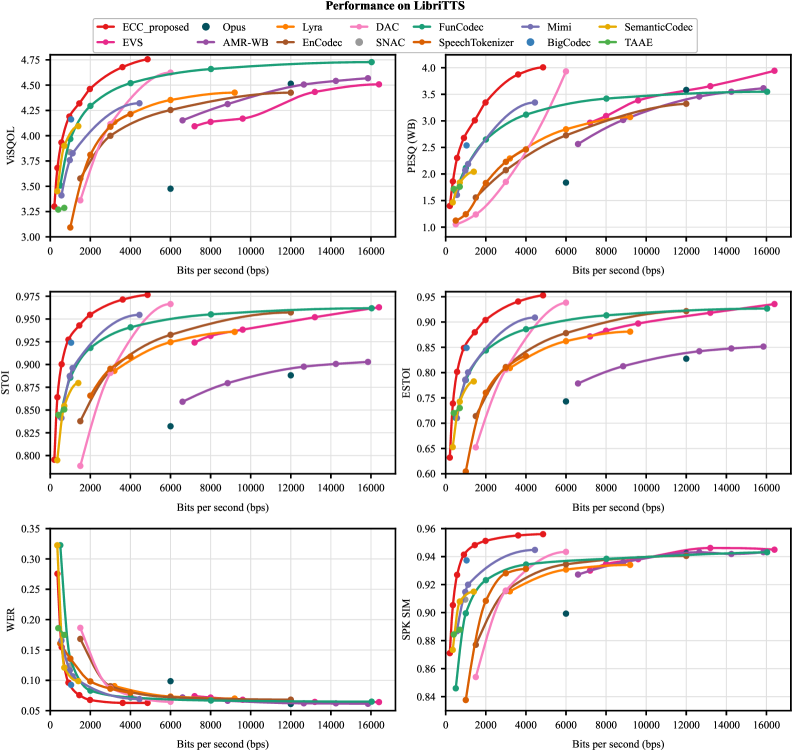
*Figure 6:RD performance on LibriTTS across the objective metric set. ECC shows a strong low-bitrate RD trade-off.*

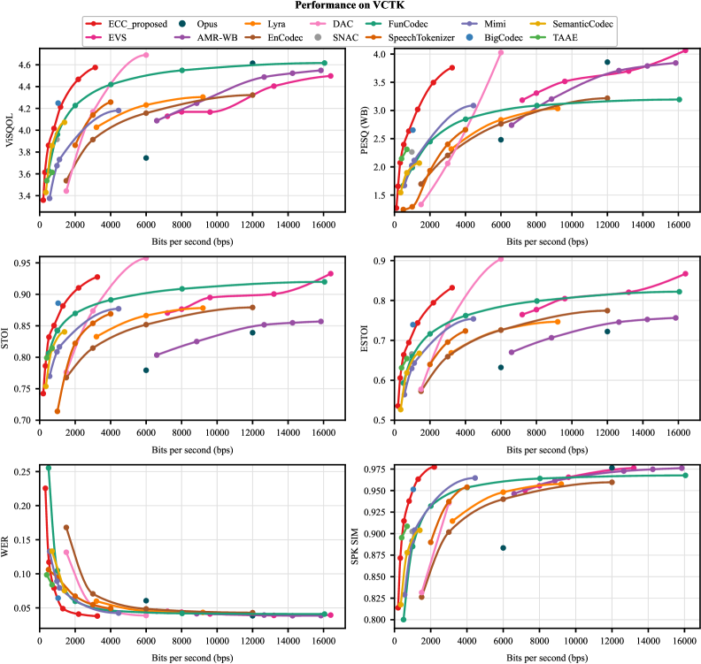
*Figure 7:Rate–distortion performance on VCTK across the objective metric set. ECC preserves a favorable RD trade-off on the out-of-domain evaluation set.*

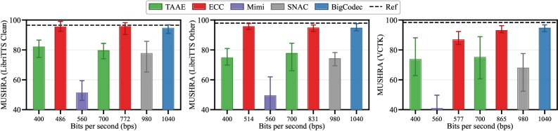
*Figure 8:MUSHRA subjective results in the low-bitrate regime. Bars and error bars denote mean listener scores and standard deviations; ECC achieves strong perceived quality at lower bitrates.*

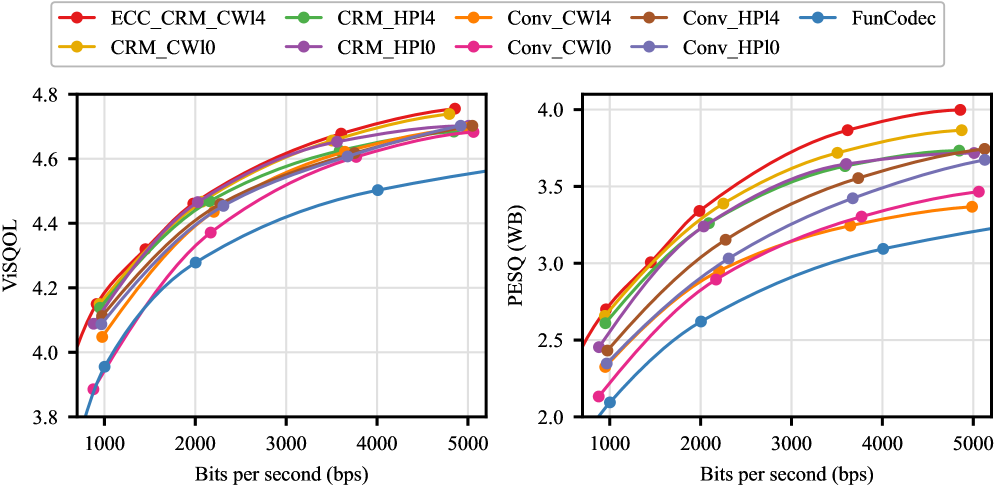
*Figure 9:Ablation and complexity results. Left: ablation study on LibriTTS test-all using ViSQOL and PESQ, comparing backbone design, entropy structure, and entropy attention depth. Right: complexity comparison among variants.*

*Figure 10:Post-hoc entropy-coding diagnostics. Left: comparison between ECC and post-hoc entropy coding baselines; FunCodec variants re-encode fixed RVQ indices, so quality is unchanged and only bitrate shifts. Right: per-RVQ-stage compression ratio on FunCodec indices; higher values indicate stronger lossless compression.*

*Figure 11:Entropy skip threshold analysis. Left: rate–distortion comparison of entropy skip thresholds; larger thresholds skip more residual symbols, and 
𝜏
𝜎
=
0.12
 is used in the main comparison. Right: skip ratio statistics for the normal scale-threshold rule and the oracle diagnostic rule.*

*Figure 12:Entropy skip diagnostics. Left: diagnostic PESQ comparison between normal skip and oracle skip for 
𝜏
𝜎
=
0.06
, 
0.12
, and 
0.3
. Right: training and validation latent rate loss under different skip thresholds; larger thresholds reduce the train–validation gap.*

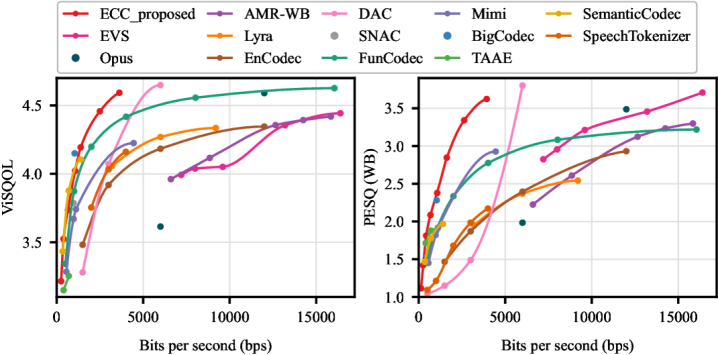
*Figure 13:Generalization performance on AISHELL-3. ECC maintains a favorable low-bitrate RD trade-off on Mandarin Chinese speech, suggesting cross-lingual generalization beyond the LibriTTS training corpus.*

---
**Usage Info**: 8049 tokens used.
**Generated at**: 2026-06-11 17:39:23

---

# 📚 Which Speech Representation Better Matches Text-Native Reasoning? A Study of Speech-Text Alignment on Frame Rate and Representation

🚀 URL: https://arxiv.org/html/2606.12199

## 🌏 Abstract (원문)
Spoken dialogue models typically start from text LLM backbones, yet reasoning often degrades when conditioning on speech instead of text. We attribute part of this modality gap to a temporal-granularity mismatch: speech tokens are temporally redundant and far longer than text under matched semantics, diluting per-token semantic density and weakening text-native reasoning dynamics. We study speech token design as a representation selection problem and sweep frame rates under a frozen LLM backbone with a fixed information rate. To make low frame rates feasible, we introduce factorized FSQ and a lightweight non-autoregressive audio LM head, scaling capacity to nearly 300	bits/frame without sacrificing efficient prediction. With the bottleneck removed, we sweep frame rates (50	→	2.08	Hz) and alignment depth, and observe a consistent best regime for speech QA at 4.17	Hz with intermediate-layer representation alignment.
## 🌏 Abstract (번역)
음성 대화 모델은 일반적으로 텍스트 LLM 백본에서 시작하지만, 텍스트 대신 음성에 조건을 부여할 때 추론 성능이 저하되는 경우가 많습니다. 우리는 이러한 양식 간 격차의 일부를 시간적 세분화 불일치에 기인한다고 봅니다. 즉, 음성 토큰은 의미론적으로 일치할 때 텍스트보다 시간적으로 중복되고 훨씬 길어, 토큰당 의미 밀도를 희석시키고 텍스트 기반 추론 역학을 약화시킵니다. 우리는 음성 토큰 설계를 표현 선택 문제로 연구하고, 고정된 정보율을 가진 고정된 LLM 백본에서 프레임 속도를 다양하게 실험합니다. 낮은 프레임 속도를 실현 가능하게 하기 위해, 우리는 효율적인 예측을 희생하지 않으면서 용량을 거의 300비트/프레임으로 확장하는 분해된 FSQ와 경량 비자기회귀 오디오 LM 헤드를 도입합니다. 병목 현상이 제거된 상태에서, 우리는 프레임 속도(50Hz → 2.08Hz)와 정렬 깊이를 다양하게 실험했으며, 중간 계층 표현 정렬을 통해 4.17Hz에서 음성 QA에 대한 일관된 최적의 체제를 관찰했습니다.

## 🔍 Methods & Results
- 음성 대화 모델에서 텍스트 대신 음성을 사용할 때 발생하는 추론 성능 저하(양식 간 격차)의 원인을 시간적 세분화 불일치(음성 토큰의 시간적 중복성 및 낮은 의미 밀도)로 분석했습니다.
- 고정된 LLM 백본과 고정된 정보율 하에서 음성 토큰 설계를 표현 선택 문제로 연구하고 프레임 속도를 다양하게 실험했습니다.
- 낮은 프레임 속도를 가능하게 하고 효율적인 예측을 유지하면서 용량을 거의 300비트/프레임으로 확장하기 위해 분해된 FSQ(factorized FSQ)와 경량 비자기회귀 오디오 LM 헤드를 도입했습니다.
- 프레임 속도(50Hz에서 2.08Hz까지)와 정렬 깊이를 다양하게 실험한 결과, 중간 계층 표현 정렬을 사용했을 때 4.17Hz에서 음성 QA에 대한 일관된 최적의 성능을 확인했습니다.

## 🖼 Figures
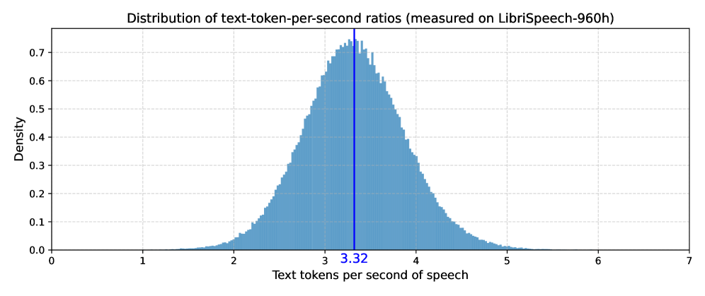
*Figure 1:Distribution of text-token-per-second ratios on LibriSpeech-960h, tokenized with Qwen3 tokenizer. Blue line: mean (3.32 Hz).*

*Figure 2:ASR WER vs. downsampling rate with a 4k codebook (
2
12
) on LibriSpeech test-clean/test-other.*

*Figure 3:ASR WER vs. downsampling rate with a 256k codebook (
2
18
) on LibriSpeech test-clean/test-other.*

*Figure 4:Architecture of our pure speech-token dialogue model. A frozen Whisper-Large-v3 encoder extracts 50 Hz speech features, which are downsampled and quantized with (factorized) FSQ into grouped speech tokens, then projected into a frozen text LLM. For speech generation, a lightweight non-autoregressive audio head predicts the next-step speech tokens in parallel.*

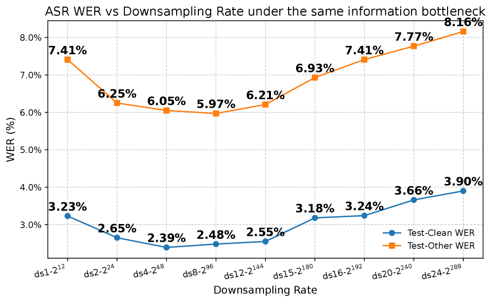
*Figure 5:ASR WER at different downsampling rates under fixed information rate.*

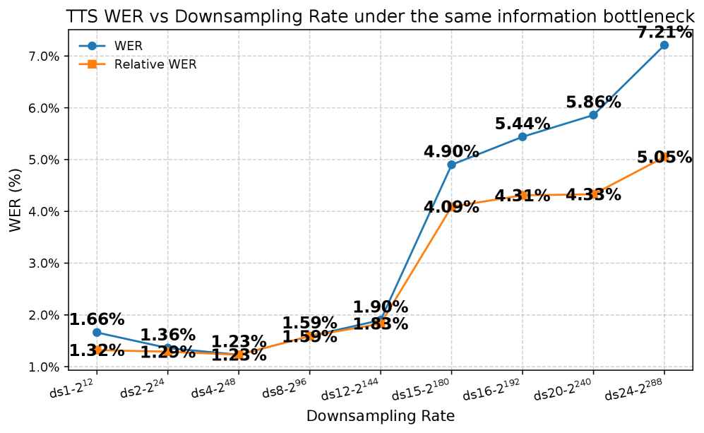
*Figure 6:TTS WER at different downsampling rates under fixed information rate.*

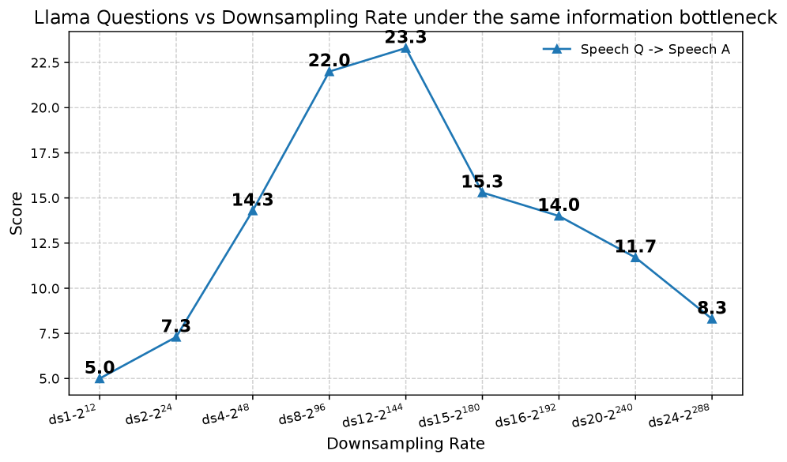
*Figure 7:Speech QA results across different downsampling rates under fixed information rate.*

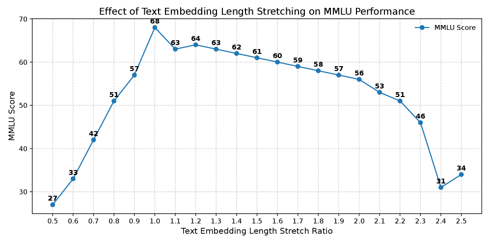
*Figure 8:Effect of text embedding length stretching on MMLU performance for the frozen Qwen3-4B backbone.*

---
**Usage Info**: 2182 tokens used.
**Generated at**: 2026-06-11 17:39:33

---

# 📚 PianoKontext: Expressive Performance Rendering from Deadpan Context

🚀 URL: https://arxiv.org/html/2606.12282

## 🌏 Abstract (원문)
Expressive performance rendering (EPR) aims to generate realistic performances constrained on sequences of notes. However, flow matching audio editing models manipulate only synchronized music samples of the same duration, limiting their understanding of expressive timing. We introduce PianoKontext, a flow matching rendering model for classical piano music that generates variable-length performances in the latent space of a pretrained Music2Latent model. We synthesize MIDI scores into deadpan audio and employ Dynamic Time Warping (DTW) in the latent space to construct paired data for training. The aligned embeddings are concatenated in DiT blocks, allowing for a simple and effective learning of the dependencies between the score and performances. Audio samples are available at our demo page:https://realfolkcode.github.io/pianokontext_demo/.
## 🌏 Abstract (번역)
표현적인 연주 렌더링(EPR)은 음표 시퀀스에 제약된 사실적인 연주를 생성하는 것을 목표로 합니다. 그러나 플로우 매칭 오디오 편집 모델은 동일한 길이의 동기화된 음악 샘플만 조작하여 표현적인 타이밍에 대한 이해를 제한합니다. 우리는 사전 훈련된 Music2Latent 모델의 잠재 공간에서 가변 길이 연주를 생성하는 클래식 피아노 음악을 위한 플로우 매칭 렌더링 모델인 PianoKontext를 소개합니다. 우리는 MIDI 악보를 무표정한 오디오로 합성하고, 훈련을 위한 쌍을 이루는 데이터를 구축하기 위해 잠재 공간에서 동적 시간 왜곡(DTW)을 사용합니다. 정렬된 임베딩은 DiT 블록에서 연결되어 악보와 연주 간의 종속성을 간단하고 효과적으로 학습할 수 있도록 합니다. 오디오 샘플은 데모 페이지에서 확인할 수 있습니다: https://realfolkcode.github.io/pianokontext_demo/.

## 🔍 Methods & Results
- PianoKontext는 사전 훈련된 Music2Latent 모델의 잠재 공간에서 가변 길이 연주를 생성하는 클래식 피아노 음악을 위한 플로우 매칭 렌더링 모델이다.
- 플로우 매칭은 노이즈 분포와 데이터 분포 사이를 연속적으로 보간하는 생성 모델링 패러다임으로, 조건부 속도 필드를 학습하여 주변 속도를 근사화한다.
- 데이터 파이프라인은 원본 악보 및 연주 오디오를 Music2Latent 인코더를 통해 잠재 공간 임베딩으로 인코딩하고, 잠재 공간에서 DTW(Dynamic Time Warping)를 사용하여 악보와 연주 시퀀스를 정렬한다.
- 문제는 Music2Latent의 잠재 시퀀스인 무표정한 오디오(y)가 주어졌을 때 표현적인 연주(x)를 생성하는 오디오-투-오디오 변환으로, 가이드 플로우 매칭을 사용하여 조건부 분포 p(x|y)를 학습한다.
- 훈련을 위한 입력은 악보-연주 쌍과 DTW 경로에서 샘플링된 무작위 서브 경로로 구성되며, 이는 시간적으로 정렬되고 음악적 내용을 공유하지만 길이가 다른 세그먼트를 제공한다.
- 타겟 연주(x)에는 가우시안 노이즈가 주입되고, 가변 길이 시퀀스의 시간적 일관성을 위해 학습 가능한 EOS(End-of-Sequence) 임베딩이 추가된 후 (y, x)로 연결된다.
- 모델 아키텍처는 FLUX Kontext에서 영감을 받은 DiT(Diffusion Transformer)를 사용하며, 컨텍스트/연주 요소(i)와 시간적 위치(s)를 구분하는 2D 로터리 위치 임베딩(RoPE)으로 강화되어 악보와 연주 간의 종속성을 공동으로 모델링한다.
- 모델은 연주 속도 필드를 출력하며, 컨텍스트 요소는 폐기된다.

## 🖼 Figures

*Figure 1:Overview of PianoKontext. (Left) Preprocessing: Score and performance audiofiles are encoded with the pretrained Music2Latent model. The produced embeddings are then aligned with the DTW algorithm. (Right) Architecture: PianoKontext uses a concatenated score, noise, and EOS latents as its inputs, which are then passed to DiT blocks with 2D RoPE embeddings.*

*(a)Duration factor = 0.8*

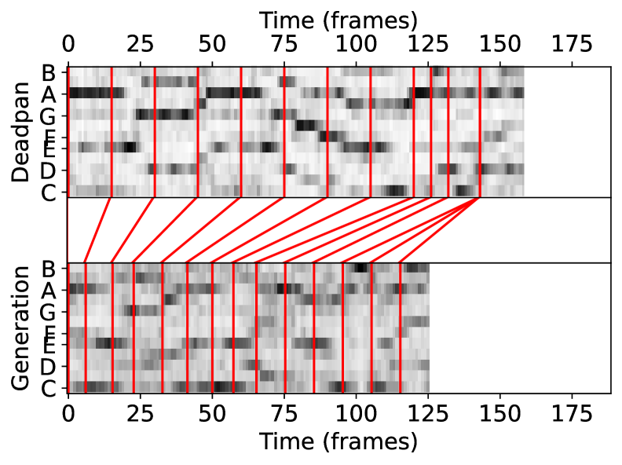
*(a)Duration factor = 0.8*

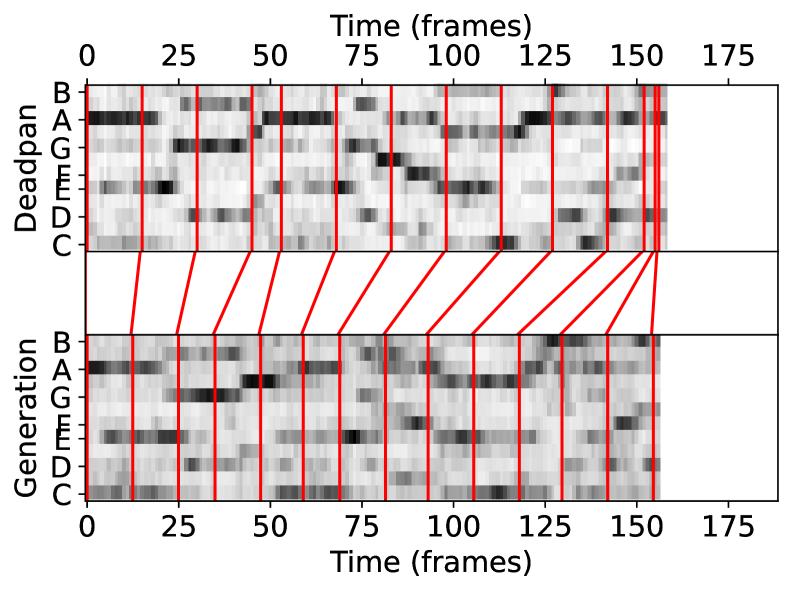
*(b)Duration factor = 1*

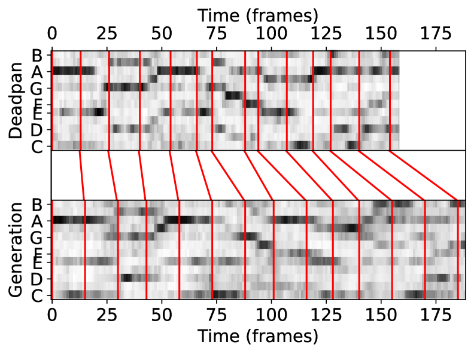
*(c)Duration factor = 1.2*

---
**Usage Info**: 3803 tokens used.
**Generated at**: 2026-06-11 17:39:45

---

# 📚 UR-BERT: Scaling Text Encoders for Massively Multilingual TTS Through Universal Romanization and Speech Token Prediction

🚀 URL: https://arxiv.org/html/2606.11681

## 🌏 Abstract (원문)
We propose UR-BERT, a Romanized transcription-based text-to-speech (TTS) encoder for massively multilingual TTS systems. Conventional grapheme-to-phoneme (G2P)-based approaches are limited to around 100 languages due to the availability of reliable G2P resources. In contrast, UR-BERT scales to 495 languages by unifying diverse writing systems into a shared Romanization representation. To further enhance phonetic fidelity and text–speech alignment, we introduce a speech token prediction objective during training, which encourages the encoder to learn speech-aware phonetic representations in a data-efficient manner. Experiments show that TTS systems built on UR-BERT consistently outperform recent text encoder baselines across a wide range of languages and resource conditions, and demonstrate strong generalization to unseen languages.
## 🌏 Abstract (번역)
저희는 대규모 다국어 TTS 시스템을 위한 로마자 전사 기반 텍스트-음성 변환(TTS) 인코더인 UR-BERT를 제안합니다. 기존의 음소 변환(G2P) 기반 접근 방식은 신뢰할 수 있는 G2P 리소스의 가용성으로 인해 약 100개 언어로 제한됩니다. 이와 대조적으로, UR-BERT는 다양한 문자 체계를 공유 로마자 표기법으로 통합하여 495개 언어로 확장됩니다. 음성 충실도와 텍스트-음성 정렬을 더욱 향상시키기 위해, 훈련 중에 음성 토큰 예측 목표를 도입하여 인코더가 데이터 효율적인 방식으로 음성 인식 음성 표현을 학습하도록 장려합니다. 실험 결과 UR-BERT를 기반으로 구축된 TTS 시스템은 광범위한 언어 및 리소스 조건에서 최신 텍스트 인코더 기준선보다 지속적으로 우수한 성능을 보였으며, 미학습 언어에 대해서도 강력한 일반화 능력을 입증했습니다.

## 🔍 Methods & Results
- UR-BERT는 G2P 시스템에 의존하지 않고 다양한 문자 체계에 걸쳐 확장 가능한 모델링을 가능하게 하는 통합 텍스트 표현으로 로마자 표기법을 채택합니다.
- 기존 G2P 기반 방식이 약 100개 언어로 제한되는 반면, UR-BERT는 Uroman 툴킷을 활용하여 495개 언어로 확장 가능하며, 약 30개의 알파벳 기호로 구성된 간결한 토큰 공간을 통해 토큰화를 단순화하고 안정적인 학습을 촉진합니다.
- UR-BERT는 표준 BERT-base 아키텍처를 기반으로 문자 수준 토크나이저와 12개의 트랜스포머 인코더 레이어를 사용하며, 495개 언어에 걸친 음성-텍스트 쌍 데이터로 사전 학습됩니다.
- 음향적 모호성을 완화하고 미세한 음성적 구분을 포착하기 위해, UR-BERT는 기존의 마스크 언어 모델링(MLM) 목표 외에 음성 토큰 예측(STP)을 보조 목표로 통합합니다.
- STP는 사전 학습된 다국어 음성 자기 지도 모델(S3M, omnilingual-ASR-W2V-300M의 16번째 레이어)에서 음성 표현을 추출하고, CTC 기반 강제 정렬(MMS-FA)을 사용하여 문자 수준 텍스트에 정렬한 다음, k-평균 클러스터링(코드북 크기 257)을 통해 이산적인 음성 토큰으로 변환하여 보조 학습 목표로 사용합니다.
- 이러한 과정을 통해 ASR 코퍼스가 음성 합성에 적합하지 않았던 데이터로부터 TTS 모델이 이점을 얻을 수 있도록 음성 안내의 확장 가능한 소스로 재구성됩니다.
- 실험 결과 UR-BERT 기반 TTS 시스템은 광범위한 언어 및 리소스 조건에서 최신 텍스트 인코더 기준선보다 지속적으로 우수한 성능을 보였으며, 미학습 언어에 대해서도 강력한 일반화 능력을 입증했습니다.

## 🖼 Figures
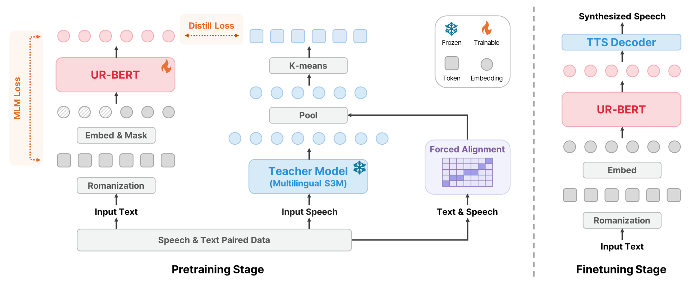
*Figure 1:Overview of the UR-BERT showing pretraining and finetuning stage.*

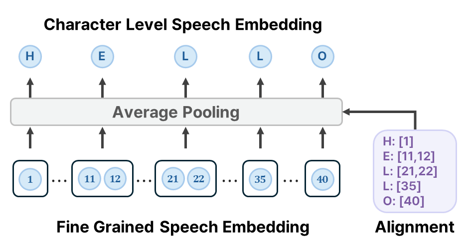
*Figure 2:Illustration of the CTC-based speech-text alignment.*

---
**Usage Info**: 2900 tokens used.
**Generated at**: 2026-06-11 17:39:53

---

# 📚 SpecLoR: Spectral Lookahead Rectification for Motion-Coherent Text-to-Video Generation

🚀 URL: https://arxiv.org/html/2606.11969

## 🌏 Abstract (원문)
Flow Matching has enabled robust text-to-video generation via latent ODE sampling. However, velocity approximation and numerical discretization errors inevitably accumulate, causing sampling trajectories to drift. Consequently, generated videos often suffer from severe spatiotemporal inconsistencies. Nevertheless, directly correcting these drifted, noisy latents is challenging: (i) timestep-dependent noise obscures reliable structural cues; (ii) spatial interventions risk disrupting intricate local geometry while incurring heavy computational costs. To address this, we propose Spectral Lookahead Rectification (SpecLoR), a plug-and-play inference method that bypasses noise via lookahead prediction, and circumvents spatiotemporal entanglement by shifting corrections to the frequency domain, where universal statistical priors of natural videos are readily available. First, during early sampling stages, SpecLoR looks ahead to estimate the clean latentzt,0z_{t,0}and computes its 3D spatiotemporal spectrum. Next, SpecLoR rectifies the amplitude spectrum to match the prior, leaving the phase intact. Finally, the corrected state is re-noised to resume ODE integration. Experiments on Wan2.2 demonstrate that SpecLoR significantly reduces physical artifacts and enhances motion coherence across multiple benchmarks with minimal computational overhead (4 additional NFEs).
## 🌏 Abstract (번역)
플로우 매칭(Flow Matching)은 잠재 ODE 샘플링을 통해 견고한 텍스트-비디오 생성을 가능하게 했습니다. 그러나 속도 근사 및 수치 이산화 오류가 필연적으로 누적되어 샘플링 궤적이 표류하게 됩니다. 결과적으로 생성된 비디오는 종종 심각한 시공간적 불일치로 고통받습니다. 그럼에도 불구하고, 이렇게 표류하고 노이즈가 있는 잠재 변수를 직접 수정하는 것은 어렵습니다: (i) 타임스텝에 의존하는 노이즈는 신뢰할 수 있는 구조적 단서를 가립니다; (ii) 공간적 개입은 복잡한 지역 기하학을 방해할 위험이 있으며 막대한 계산 비용을 발생시킵니다. 이를 해결하기 위해 우리는 스펙트럼 미리보기 보정(Spectral Lookahead Rectification, SpecLoR)을 제안합니다. 이는 미리보기 예측을 통해 노이즈를 우회하고, 자연 비디오의 보편적인 통계적 사전 지식을 쉽게 활용할 수 있는 주파수 영역으로 보정을 전환하여 시공간적 얽힘을 회피하는 플러그 앤 플레이 추론 방법입니다. 먼저, 초기 샘플링 단계에서 SpecLoR은 미리 보기를 통해 깨끗한 잠재 변수 z_t,0을 추정하고 3D 시공간 스펙트럼을 계산합니다. 다음으로, SpecLoR은 위상은 그대로 유지한 채 진폭 스펙트럼을 사전 지식과 일치하도록 보정합니다. 마지막으로, 보정된 상태는 ODE 통합을 재개하기 위해 다시 노이즈가 추가됩니다. Wan2.2에 대한 실험은 SpecLoR이 최소한의 계산 오버헤드(4개의 추가 NFE)로 여러 벤치마크에서 물리적 아티팩트를 크게 줄이고 움직임 일관성을 향상시킨다는 것을 보여줍니다.

## 🔍 Methods & Results
- Flow Matching 기반 비디오 생성에서 발생하는 수치적 및 예측 오류 누적으로 인한 샘플링 궤적 이탈 문제를 해결하기 위해 SpecLoR(Spectral Lookahead Rectification)을 제안한다.
- SpecLoR은 중간 노이즈 잠재 공간에서 궤적 이탈을 직접 진단하는 어려움을 피하기 위해, 현재 예측된 벡터 필드를 사용하여 단일 Euler 스텝으로 노이즈 없는 깨끗한 잠재 변수 z_t,0을 예측하는 '미리보기 예측'을 수행한다.
- 미리보기 예측은 초기 고노이즈 단계(예: 40단계 스케줄의 2-5단계)의 특정 '미리보기 창' 내에서만 적용된다.
- 공간 표현을 직접 수정하는 대신, 3D 고속 푸리에 변환(FFT)을 통해 시공간적 얽힘을 주파수 영역으로 전환하여 거시적 에너지(진폭)와 섬세한 기하학적 세부 정보(위상)를 분리한다.
- 위상 스펙트럼은 섬세한 기하학적 세부 정보를 인코딩하므로 그대로 보존하고, 진폭 스펙트럼만 수정한다.
- 진폭 보정 전략으로 'SpecLoR-Zero (Global Prior)'는 실제 비디오에서 관찰되는 1/f^alpha 파워-법칙 스펙트럼 감쇠의 보편적인 자연 사전 지식에 맞춰 진폭을 비대칭 신뢰 영역 내에서 조정한다.
- 또 다른 전략인 'SpecLoR-Adapter (Context-Aware Refinement)'는 Diffusion Transformer (DiT) 블록을 사용하여 예측된 미리보기 잠재 변수, 타임스텝 임베딩, 텍스트 조건을 기반으로 인스턴스별 잔여 진폭 맵을 추정하며, 로그 진폭 공간에서 MSE 손실로 훈련된다.
- 훈련 중 기본 비디오 모델은 고정되며, 어댑터는 추론 시 컨텍스트 인식 보정된 진폭을 생성한다.
- 보정된 진폭과 보존된 위상을 결합한 후 3D 역 고속 푸리에 변환(iFFT)을 통해 잠재 공간으로 다시 투영하여 정화된 구조적으로 보정된 깨끗한 앵커 z_hat_t,0을 얻는다.
- 보정된 상태는 ODE 솔버에 통합하기 위해 현재 타임스텝 t로 다시 노이즈가 추가된다.
- ODE 통합 재개 시, '결정론적 연속(Deterministic Continuation)'은 초기 노이즈 맵을 재활용하여 SpecLoR 개입에 의한 궤적 변화를 엄격하게 제어하고 물리적으로 불가능한 아티팩트 제거 효과를 입증한다.
- '확률적 수축(Stochastic Contraction)'은 새로 샘플링된 확률적 노이즈를 주입하여 누적된 ODE 이산화 오류를 수축시키고 전역적으로 더 물리적으로 일관된 비디오를 생성한다.
- Wan2.2에 대한 실험 결과, SpecLoR은 최소한의 계산 오버헤드(4개의 추가 NFE)로 물리적 아티팩트를 현저히 줄이고 여러 벤치마크에서 움직임 일관성을 향상시키는 것으로 나타났다.

## 🖼 Figures
![Figure 1:Concept and pipeline of SpecLoR. (a) Accumulated errors drift the Flow Matching trajectory from the ideal trajectory, yielding spatiotemporal inconsistencies. SpecLoR seamlessly anchors it back to a more valid trajectory. (b) At early timesteps, we project the noisy latent 
𝑧
𝑡
 to a lookahead state 
𝑧
𝑡
,
0
. We decouple its spatiotemporal spectrum, rectifying only the amplitude to a universal prior while preserving phase. The corrected state 
𝑧
^
𝑡
,
0
 is then re-noised to 
𝑧
^
𝑡
, resuming ODE integration.](../images/2026-06-11/2606.11969/2606.11969_fig0.png)
*Figure 1:Concept and pipeline of SpecLoR. (a) Accumulated errors drift the Flow Matching trajectory from the ideal trajectory, yielding spatiotemporal inconsistencies. SpecLoR seamlessly anchors it back to a more valid trajectory. (b) At early timesteps, we project the noisy latent 
𝑧
𝑡
 to a lookahead state 
𝑧
𝑡
,
0
. We decouple its spatiotemporal spectrum, rectifying only the amplitude to a universal prior while preserving phase. The corrected state 
𝑧
^
𝑡
,
0
 is then re-noised to 
𝑧
^
𝑡
, resuming ODE integration.*

![Figure 2:Trajectory drift and spectral rectification. (a) Visualizing intermediate lookahead predictions. Baseline (top): early structural ambiguity at Step 5 degrades into severe physical artifacts by Step 39 (red circles). SpecLoR (bottom) explicitly rectifies amplitude during early stages to establish a coherent global structure. (b) Quantitative tracking of frequency dynamics, measured by correlating intermediate steps against each method’s final latent. Targeted amplitude rectification accelerates geometric phase convergence, fundamentally shifting the trajectory toward a valid endpoint.](../images/2026-06-11/2606.11969/2606.11969_fig1.png)
*Figure 2:Trajectory drift and spectral rectification. (a) Visualizing intermediate lookahead predictions. Baseline (top): early structural ambiguity at Step 5 degrades into severe physical artifacts by Step 39 (red circles). SpecLoR (bottom) explicitly rectifies amplitude during early stages to establish a coherent global structure. (b) Quantitative tracking of frequency dynamics, measured by correlating intermediate steps against each method’s final latent. Targeted amplitude rectification accelerates geometric phase convergence, fundamentally shifting the trajectory toward a valid endpoint.*

![Figure 3:Pipeline of the proposed SpecLoR method. In Stage 1, the intermediate noisy latent 
𝑧
𝑡
 is projected to a clean lookahead state 
𝑧
𝑡
,
0
. Stage 2 explicitly decouples the spatiotemporal spectrum into amplitude and phase via 3D FFT. To correct trajectory drift, the corrupted amplitude is rectified using either a zero-cost global prior (Option A) or a context-aware adapter (Option B), while the detail-preserving phase is strictly locked. Finally, in Stage 4, the rectified spectrum is inverted and re-noised back to 
𝑧
^
𝑡
, providing a structurally sound anchor for the subsequent ODE integration.](../images/2026-06-11/2606.11969/2606.11969_fig2.png)
*Figure 3:Pipeline of the proposed SpecLoR method. In Stage 1, the intermediate noisy latent 
𝑧
𝑡
 is projected to a clean lookahead state 
𝑧
𝑡
,
0
. Stage 2 explicitly decouples the spatiotemporal spectrum into amplitude and phase via 3D FFT. To correct trajectory drift, the corrupted amplitude is rectified using either a zero-cost global prior (Option A) or a context-aware adapter (Option B), while the detail-preserving phase is strictly locked. Finally, in Stage 4, the rectified spectrum is inverted and re-noised back to 
𝑧
^
𝑡
, providing a structurally sound anchor for the subsequent ODE integration.*

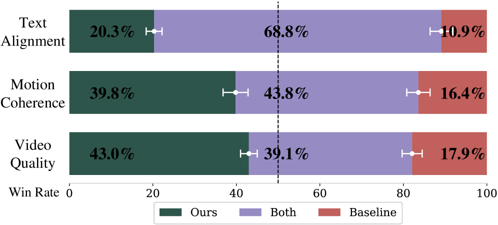
*Figure 4:User study on VideoJAM-Bench.*

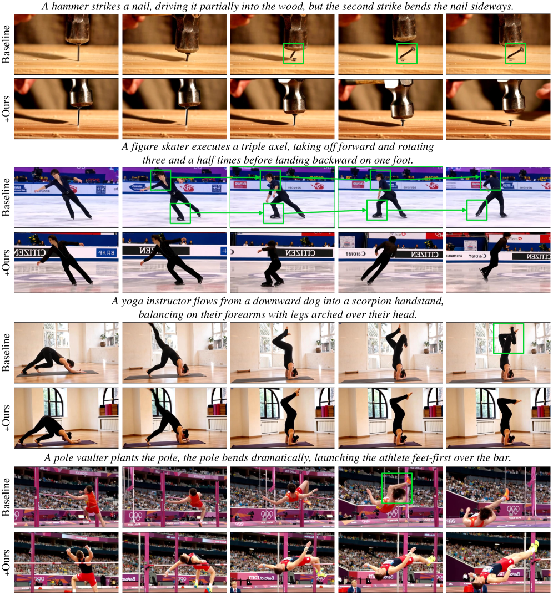
*Figure 5:Qualitative comparison of spatially consistent video generation against Wan2.2-A14b T2V. Artifacts and structural errors are indicated by green bounding boxes.*

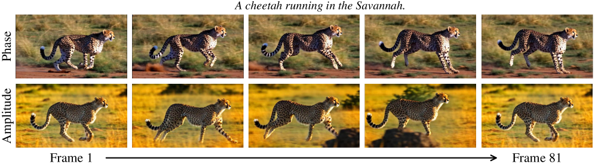
*Figure 6:Diagnostic comparison of intervention targets (Phase vs. Amplitude).*

*Figure 7:Impact of modulation strength (
𝜆
). An aggressive intervention with 
𝜆
=
1.0
 (left) causes numerical instability, sometimes visually desynchronizing the initial frame from the sequence.*

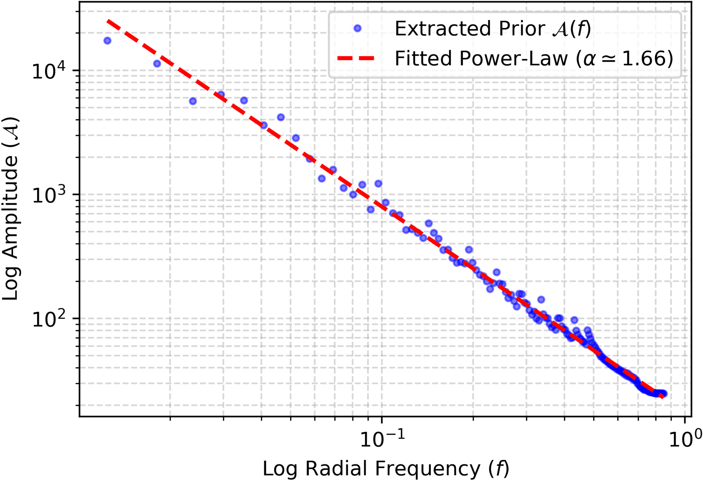
*Figure S1:Empirical verification of the power-law prior in the 3D VAE latent space.*

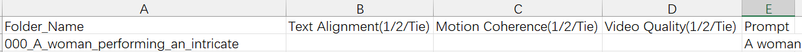
*Figure S2:An example of the local scoring spreadsheet used by evaluators to record their preferences across three criteria for each anonymized video pair.*

*Figure S3:Visual demonstration of failure cases under chaotic, non-rigid transformations. By strictly preserving the early-stage phase, SpecLoR can inadvertently lock the generation into an unnatural geometric state, such as transferring gelatinous properties to a rigid glass bowl (top) or preventing the natural topological diffusion of an ink drop (bottom).*

---
**Usage Info**: 3910 tokens used.
**Generated at**: 2026-06-11 17:40:04

---

# 📚 Spectrally Regularized Latent Flow Matching for Turbulence Generation

🚀 URL: https://arxiv.org/html/2606.11691

## 🌏 Abstract (원문)
Latent diffusion and flow matching have emerged as leading approaches for synthetic turbulence generation, yet they systematically under-represent dissipation-range amplitudes. We introduce a latent flow matching framework with a spectrally regularized compression stage that directly targets this failure mode. On a2562256^{2}DNS dataset atR​ef≈2250Re_{f}\,\approx\,2250, replacing an MSE-trained VAE with a zone-weighted log-spectral objective raises deep-dissipation retained spectral power from25%25\%to94%94\%in reconstruction and from20%20\%to79%79\%in unconditional generation. The improved latent representation also yields a substantially better sampling cost–fidelity tradeoff: the MSE-trained latent space imposes a fundamental quality ceiling near DD bias−0.70-0.70that no integrator or step-count can overcome, while the spectrally regularized latent space reaches DD bias−0.117-0.117at just2020function evaluations. Mechanistically, encoder–decoder swap experiments show that the improvement is driven primarily by encoder-induced latent reorganization rather than decoder capacity, while a support-amplitude decomposition reveals that MSE-trained models behave as conservative suppression models, minimizing pointwise error by attenuating intermittent high-wavenumber structure. Both pipelines recover the second-order structure function and the correct sign ofS3S_{3}, indicating the correct cascade direction without explicit supervision. A small residual gap in the magnitude ofS3S_{3}suggests that phase-coherent triadic organization remains a complementary axis to amplitude fidelity for future generative turbulence models.
## 🌏 Abstract (번역)
잠재 확산 및 흐름 매칭은 합성 난류 생성의 주요 접근 방식으로 부상했지만, 소산 범위 진폭을 체계적으로 과소평가한다. 우리는 이러한 실패 모드를 직접적으로 해결하는 스펙트럼 정규화 압축 단계를 갖춘 잠재 흐름 매칭 프레임워크를 소개한다. Re_f ≈ 2250의 256^2 DNS 데이터셋에서, MSE 훈련 VAE를 영역 가중 로그 스펙트럼 목표로 대체하자 재구성에서 심층 소산 유지 스펙트럼 파워가 25%에서 94%로, 무조건부 생성에서 20%에서 79%로 증가했다. 개선된 잠재 표현은 또한 훨씬 더 나은 샘플링 비용-충실도 트레이드오프를 제공한다: MSE 훈련 잠재 공간은 어떤 적분기나 스텝 수로도 극복할 수 없는 DD 편향 -0.70 근처의 근본적인 품질 한계를 부과하는 반면, 스펙트럼 정규화 잠재 공간은 단 20번의 함수 평가만으로 DD 편향 -0.117에 도달한다. 기계적으로, 인코더-디코더 교환 실험은 개선이 디코더 용량보다는 인코더 유도 잠재 재구성에서 주로 비롯됨을 보여주며, 지지-진폭 분해는 MSE 훈련 모델이 간헐적인 고파수 구조를 약화시켜 점별 오류를 최소화하는 보수적인 억제 모델로 작동함을 밝힌다. 두 파이프라인 모두 2차 구조 함수와 S3의 올바른 부호를 복구하여 명시적인 감독 없이도 올바른 캐스케이드 방향을 나타낸다. S3 크기의 작은 잔여 차이는 위상 일관성 있는 삼자 조직이 미래의 생성 난류 모델을 위한 진폭 충실도에 대한 보완적인 축으로 남아 있음을 시사한다.

## 🔍 Methods & Results
- 본 연구는 잔차 VAE를 이용한 표현 학습(1단계)과 비조건부 흐름 매칭을 이용한 잠재 생성 전송(2단계)을 분리하는 2단계 프레임워크를 제안한다.
- 1단계 압축 모델은 256x256 와도 스냅샷을 8x16x16 잠재 텐서로 매핑하는 잔차 VAE를 사용하며, VAE의 압축 목표를 수정하여 잠재 표현의 기하학적 구조를 재구성하는 것이 핵심 가설이다.
- 두 가지 압축 모델이 비교되었다: 모델 A는 표준 VAE 목표(MSE 훈련)를 사용했고, 모델 B는 소산 범위 진폭을 직접적으로 목표로 하는 영역 가중 로그 스펙트럼 페널티(IR, DO, DD 영역에 대해 1:4:6 비율)를 추가했다.
- 2단계 생성 모델은 1단계에서 학습된 잠재 표현에 대해 경량 U-Net으로 구현된 비조건부 흐름 매칭 모델을 훈련하며, 선형 조건부 최적 수송(CondOT) 확률 경로를 사용한다.
- MSE 훈련 VAE를 스펙트럼 정규화 VAE로 대체한 결과, 256^2 DNS 데이터셋에서 재구성 시 심층 소산 유지 스펙트럼 파워가 25%에서 94%로, 무조건부 생성 시 20%에서 79%로 크게 향상되었다.
- 스펙트럼 정규화 잠재 공간은 단 20번의 함수 평가만으로 DD 편향 -0.117에 도달하여, DD 편향 -0.70 근처의 품질 한계를 가진 MSE 훈련 잠재 공간보다 샘플링 비용-충실도 트레이드오프가 훨씬 우수했다.
- 인코더-디코더 교환 실험을 통해 이러한 개선은 디코더 용량보다는 인코더 유도 잠재 재구성에 주로 기인함이 밝혀졌다.
- 두 파이프라인 모두 2차 구조 함수와 S3의 올바른 부호를 성공적으로 복구하여 명시적인 감독 없이도 올바른 캐스케이드 방향을 나타냈다.

## 🖼 Figures
![Figure 1:Dataset overview and spectral zoning. (A) Representative standardized vorticity snapshot from the statistically stationary 
256
2
 DNS at 
𝑅
​
𝑒
𝑓
≈
2250
. (B) Mean shell-averaged vorticity power 
𝑍
𝜔
​
(
𝑘
)
=
𝑘
2
​
𝐸
​
(
𝑘
)
 over the test set (black) with individual realization spectra (grey) and the 
𝑘
−
2
 direct-enstrophy-cascade reference slope (blue dashed). The forcing wavenumber 
𝑘
𝑓
=
4
 and dealiasing cutoff 
𝑘
dealias
=
85
 are marked. Shaded regions indicate the three spectral zones used throughout the paper: an inertial-range band IR (
𝑘
=
6
​
–
​
40
, green), a dissipation-onset band DO (
𝑘
=
41
​
–
​
65
, orange), and a deep-dissipation band DD (
𝑘
=
66
​
–
​
85
, red). Right panels show representative band-pass-filtered realizations within each spectral zone. The characteristic amplitude decreases from 
𝑂
​
(
±
7.5
)
 in IR to 
𝑂
​
(
±
0.4
)
 in DD, producing an approximate 
20
×
 signal imbalance across scales and an effective 
∼
400
×
 disparity under pointwise 
ℓ
2
 reconstruction losses.](../images/2026-06-11/2606.11691/2606.11691_fig0.png)
*Figure 1:Dataset overview and spectral zoning. (A) Representative standardized vorticity snapshot from the statistically stationary 
256
2
 DNS at 
𝑅
​
𝑒
𝑓
≈
2250
. (B) Mean shell-averaged vorticity power 
𝑍
𝜔
​
(
𝑘
)
=
𝑘
2
​
𝐸
​
(
𝑘
)
 over the test set (black) with individual realization spectra (grey) and the 
𝑘
−
2
 direct-enstrophy-cascade reference slope (blue dashed). The forcing wavenumber 
𝑘
𝑓
=
4
 and dealiasing cutoff 
𝑘
dealias
=
85
 are marked. Shaded regions indicate the three spectral zones used throughout the paper: an inertial-range band IR (
𝑘
=
6
​
–
​
40
, green), a dissipation-onset band DO (
𝑘
=
41
​
–
​
65
, orange), and a deep-dissipation band DD (
𝑘
=
66
​
–
​
85
, red). Right panels show representative band-pass-filtered realizations within each spectral zone. The characteristic amplitude decreases from 
𝑂
​
(
±
7.5
)
 in IR to 
𝑂
​
(
±
0.4
)
 in DD, producing an approximate 
20
×
 signal imbalance across scales and an effective 
∼
400
×
 disparity under pointwise 
ℓ
2
 reconstruction losses.*

*Figure 2:Two-stage latent generative pipeline. Stage 1 is a residual VAE trained with either a baseline objective (Model A) or a zone-weighted spectral objective (Model B). Stage 2 freezes the decoder and trains a latent CondOT flow matching generator. Sampled latents are decoded back to vorticity. The two pipelines share architecture, dataset, and Stage 2 generator exactly, differing only in compression objective and the resulting latent geometry.*

*Figure 3:Stage 1 ensemble spectral fidelity. Left: mean shell-averaged 
𝑍
𝜔
​
(
𝑘
)
 over the held-out test set with 10–90% bands. Right: spectral bias mean 
±
1
​
𝜎
. Spectral regularization in Model B moves the bias closer to zero in all three zones, with the largest gain in DD. Both models recover the IR slope.*

*Figure 4:Support–amplitude decomposition in the DD band (
𝑘
=
66
​
–
​
85
). (A) Thresholded DD-support mask from one true field. (B–C) Predictions of Models A and B as TP (green), FN (red), FP (orange). (D) Ensemble IoU across thresholds. (E) Amplitude ratio (model/truth) on the union support. (F) Precision and recall. Model A is precise but strongly suppressed (amplitude ratio 
≈
0.44
); Model B has higher IoU, much higher recall, and an amplitude ratio 
≈
0.91
 at the cost of broader support.*

*Figure 5:Encoder–decoder swap diagnostic. Spectral bias for the four combinations of 
{
ℰ
𝐴
,
ℰ
𝐵
}
×
{
𝒟
𝐴
,
𝒟
𝐵
}
. Only the matched pair 
𝒟
𝐵
∘
ℰ
𝐵
 holds low bias across all zones. The mismatch 
𝒟
𝐴
∘
ℰ
𝐵
 catastrophically degrades, showing that the baseline decoder cannot reliably interpret the spectrally regularized latent representation.*

*Figure 6:Stage 2 generation. Top: representative held-out test field and unconditional samples from each pipeline. The samples are draws from the learned latent distribution, not reconstructions. Bottom: mean shell-averaged spectrum and bias over 
500
 generated samples vs. 
500
 test fields.*

*Figure 7:Sampling cost–fidelity tradeoff. Spectral bias vs. NFE in the DD (left), DO (middle), and IR (right) zones. Solid: Euler. Dashed: Heun. Model A saturates near DD bias 
−
0.70
 regardless of integrator or NFE, revealing a fundamental quality ceiling of the MSE-trained latent space. Model B Heun reaches DD bias 
−
0.117
 at NFE
=
20
; a fidelity level entirely inaccessible to Model A at any sampling budget.*

![Figure 8:Longitudinal structure functions over 
500
 realizations. Left: 
𝑆
2
​
(
𝑟
)
. Both pipelines reproduce the second-order structure function across the resolved range. Right: 
𝑆
3
​
(
𝑟
)
. Both pipelines correctly recover the negative sign of 
𝑆
3
 and therefore the direction of the cascade without any structure-function supervision, with magnitudes close to the test ensemble. The shell-averaged regularizer is not designed to enforce phase coherence, so the small residual gap is an expected complementary direction rather than a failure of the present method.](../images/2026-06-11/2606.11691/2606.11691_fig7.png)
*Figure 8:Longitudinal structure functions over 
500
 realizations. Left: 
𝑆
2
​
(
𝑟
)
. Both pipelines reproduce the second-order structure function across the resolved range. Right: 
𝑆
3
​
(
𝑟
)
. Both pipelines correctly recover the negative sign of 
𝑆
3
 and therefore the direction of the cascade without any structure-function supervision, with magnitudes close to the test ensemble. The shell-averaged regularizer is not designed to enforce phase coherence, so the small residual gap is an expected complementary direction rather than a failure of the present method.*

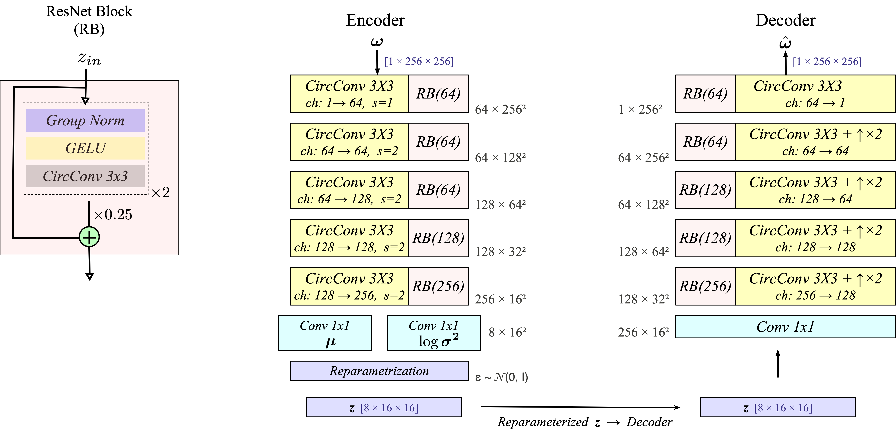
*Figure 9:Residual VAE architecture used in Stage 1. Models A and B share the architecture exactly and differ only in the training objective.*

*Figure 10:U-Net parameterization of the latent flow matching velocity field 
𝑣
𝜃
​
(
𝑧
,
𝜏
)
.*

*Figure 11:Qualitative reconstruction comparison. Top: full field. Bottom: DD-band (
𝑘
=
66
​
–
​
85
) with color scale locked to the true field.*

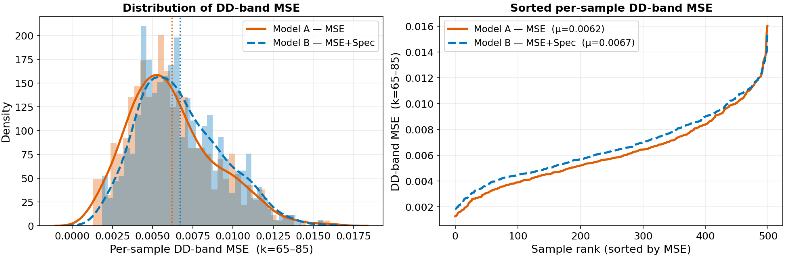
*Figure 12:Ensemble DD-band pointwise MSE distribution and sorted per-sample curves. Model B’s slightly larger MSE is systematic across the ensemble, not driven by outliers; the support–amplitude decomposition in Figure 4 explains why.*

---
**Usage Info**: 5072 tokens used.
**Generated at**: 2026-06-11 17:40:23

---

# 📚 Fast Speech Foundation Model Distillation Using Interleaved Stacking

🚀 URL: https://arxiv.org/html/2606.11766

## 🌏 Abstract (원문)
Distilling a large speech foundation model (SFM) into an efficient student model has been successfully applied to low-resource environments. Although distillation reduces inference latency, it requires an additional student model training. However, the training efficiency of SFM distillation remains underexplored. In this work, we explore training acceleration of SFM distillation to speed up model deployment. We examine the potential of stacking, in which the model depth is progressively increased through training until the target model depth is reached. While existing stacking methods improve training speed, they suffer from performance degradation. To handle this limitation, we propose interleaved stacking, a novel stacking method that consistently preserves layer position throughout the stacking process. This property is particularly critical in SFMs, in which each layer encodes distinct layer-specific knowledge. We validate the effectiveness of the proposed method on SUPERB.
## 🌏 Abstract (번역)
대규모 음성 기반 모델(SFM)을 효율적인 학생 모델로 증류하는 방법은 저자원 환경에 성공적으로 적용되어 왔습니다. 증류는 추론 지연 시간을 줄이지만, 추가적인 학생 모델 훈련이 필요합니다. 그러나 SFM 증류의 훈련 효율성은 아직 충분히 탐구되지 않았습니다. 본 연구에서는 모델 배포 속도를 높이기 위해 SFM 증류의 훈련 가속화를 탐구합니다. 우리는 모델 깊이가 훈련을 통해 목표 모델 깊이에 도달할 때까지 점진적으로 증가하는 스태킹(stacking)의 잠재력을 조사합니다. 기존 스태킹 방법은 훈련 속도를 향상시키지만 성능 저하를 겪습니다. 이러한 한계를 해결하기 위해, 우리는 스태킹 과정 전반에 걸쳐 레이어 위치를 일관되게 보존하는 새로운 스태킹 방법인 인터리브드 스태킹(interleaved stacking)을 제안합니다. 이 속성은 각 레이어가 고유한 레이어별 지식을 인코딩하는 SFM에서 특히 중요합니다. 우리는 제안된 방법의 효과를 SUPERB에서 검증합니다.

## 🔍 Methods & Results
- SFM 증류의 훈련 가속화를 목표로, 모델 깊이를 점진적으로 증가시키는 스태킹(stacking) 방법을 탐구했습니다.
- 기존 스태킹 방법의 성능 저하 문제를 해결하기 위해, 스태킹 과정 전반에 걸쳐 레이어 위치를 일관되게 보존하는 '인터리브드 스태킹(interleaved stacking)'을 제안했습니다.
- 인터리브드 스태킹은 각 레이어가 고유한 지식을 인코딩하는 SFM에서 레이어 위치 보존이 중요함을 강조합니다.
- 제안된 방법의 효과는 SUPERB 벤치마크에서 검증되었습니다.

## 🖼 Figures
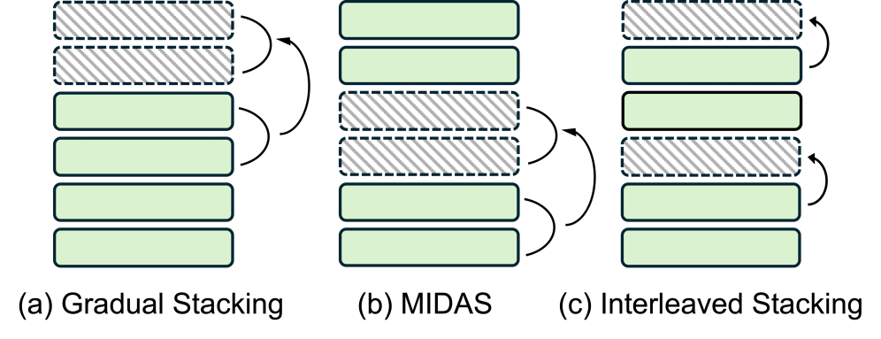
*Figure 1:Illustration of various stacking approaches: (a) gradual stacking, (b) MIDAS, and (c) interleaved stacking (ours).*

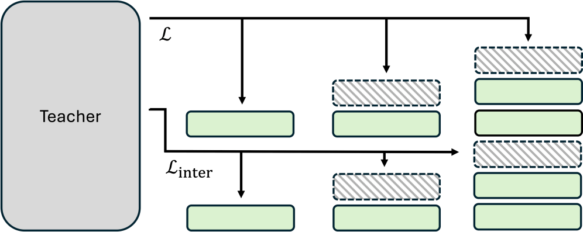
*Figure 2:Illustration of the proposed training framework with interleaved stacking. The total loss function consists of the output-level KD loss and the intermediate-level KD loss.*

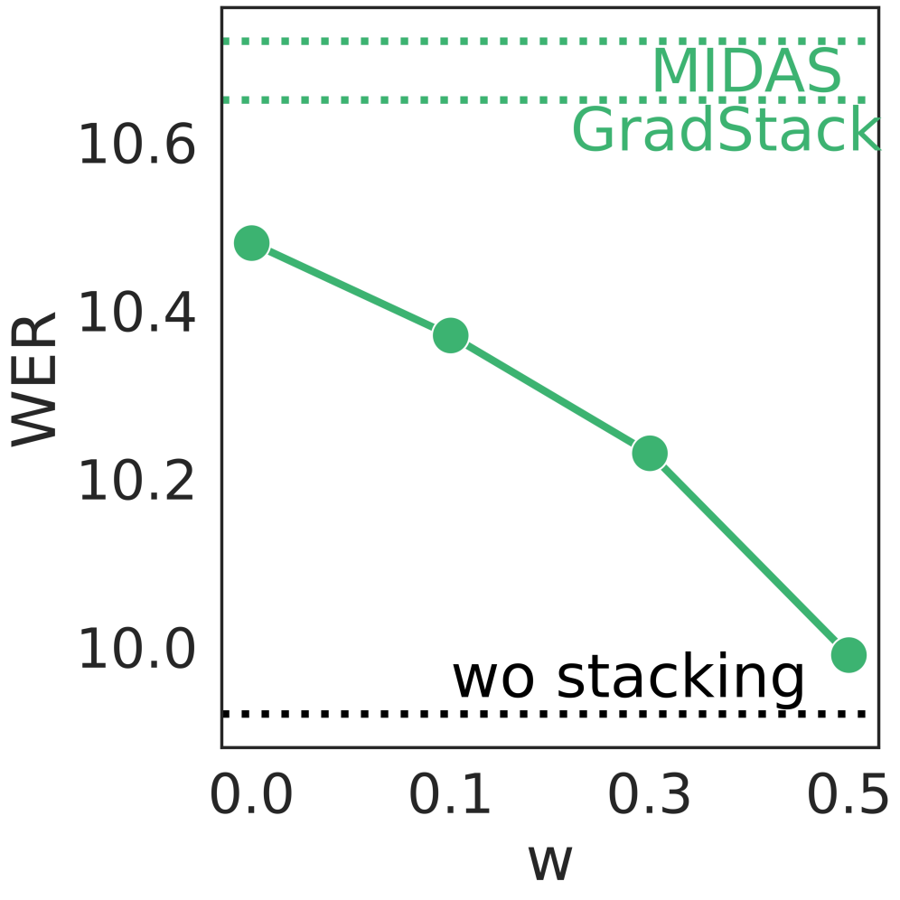
*(a)ASR*

*(a)ASR*

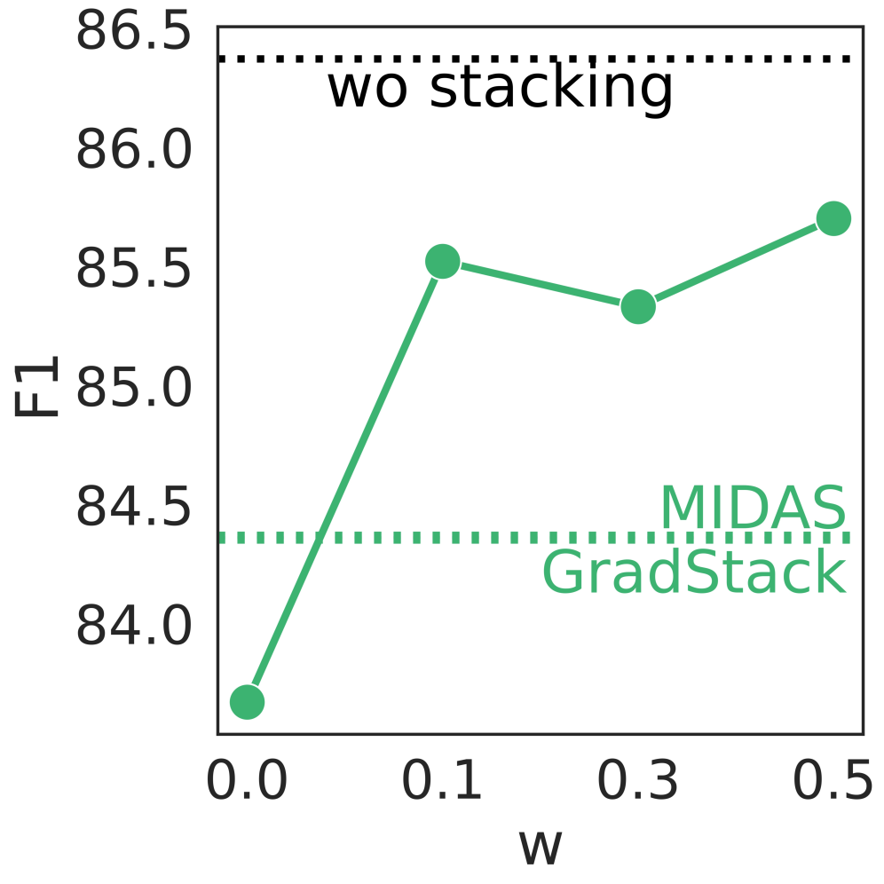
*(b)SF*

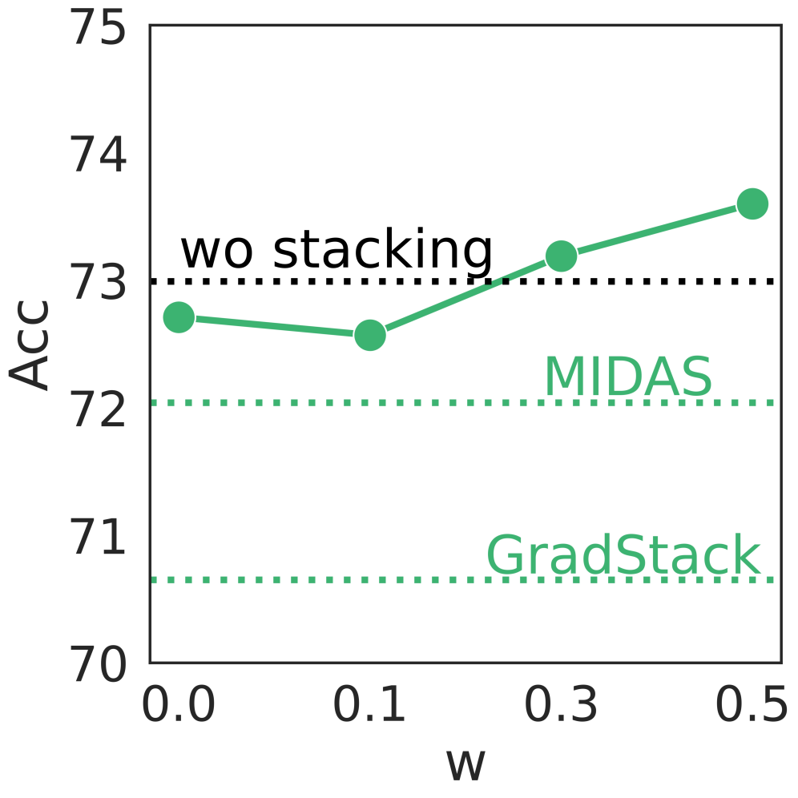
*(c)SID*

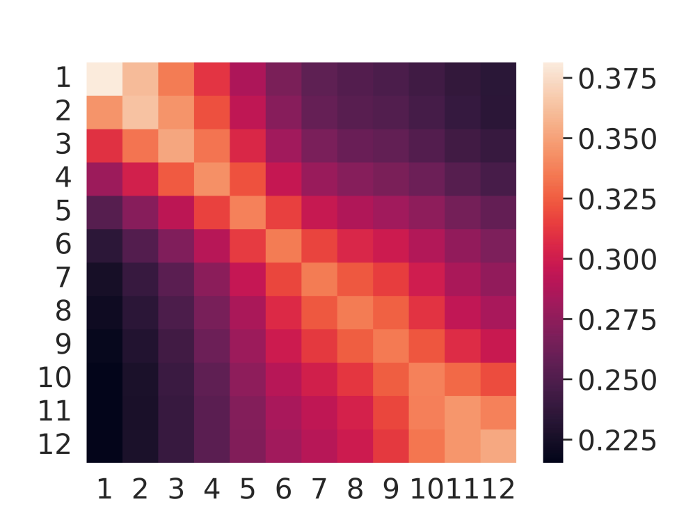
*(a)Full L2L*

*(a)Full L2L*

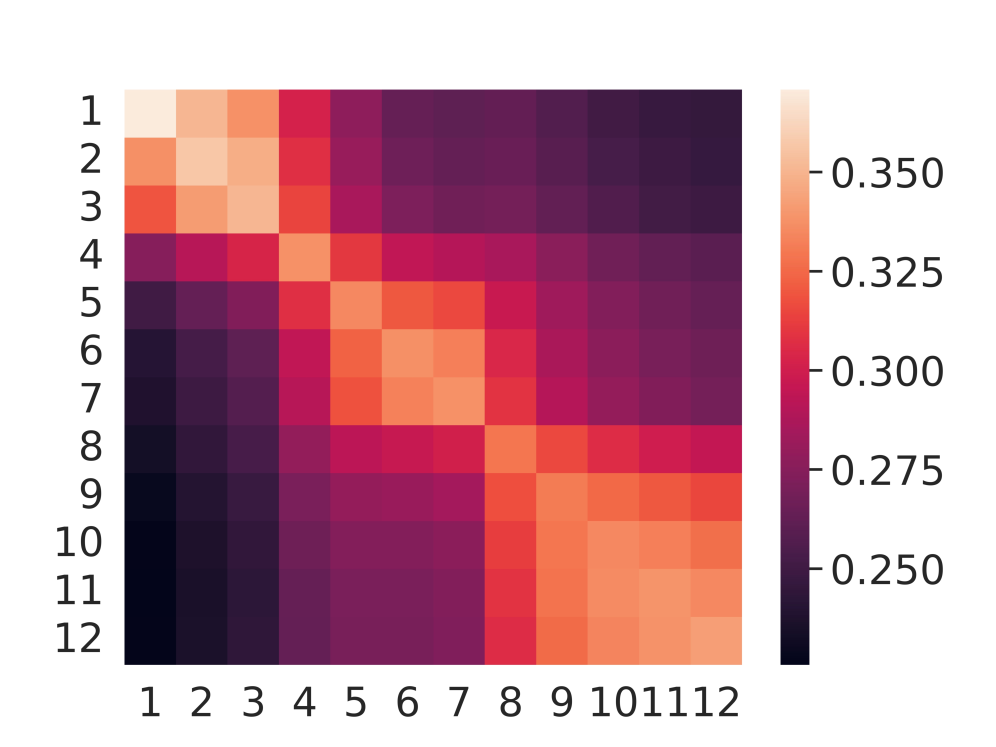
*(b)Interleaved Stacking*

---
**Usage Info**: 1155 tokens used.
**Generated at**: 2026-06-11 17:40:28

---

