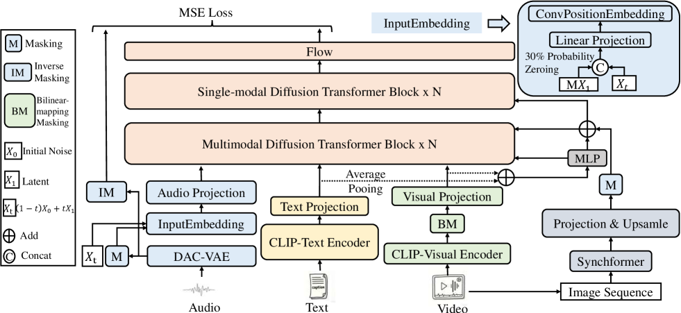
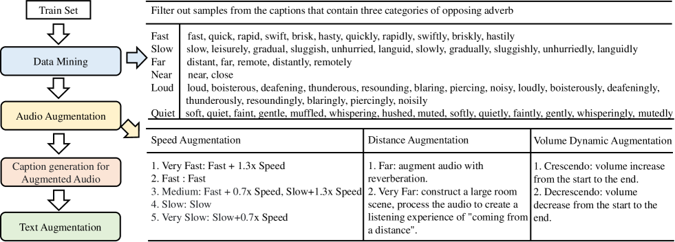
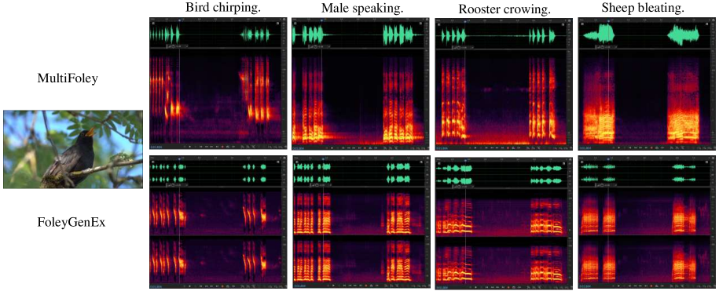
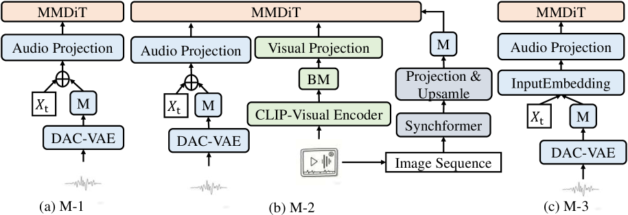
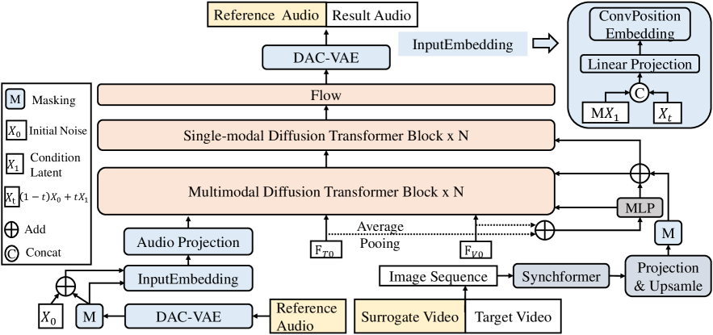
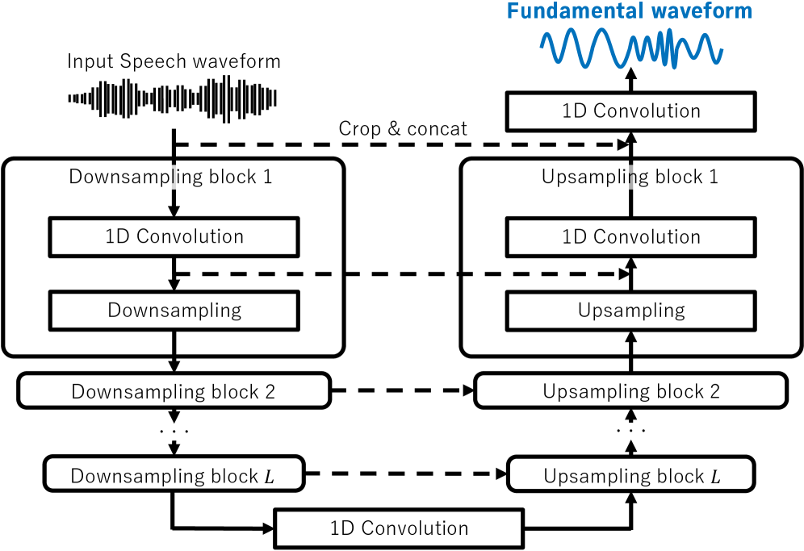
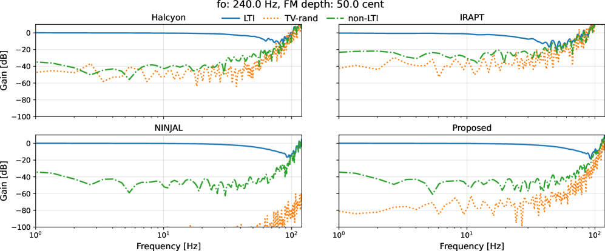
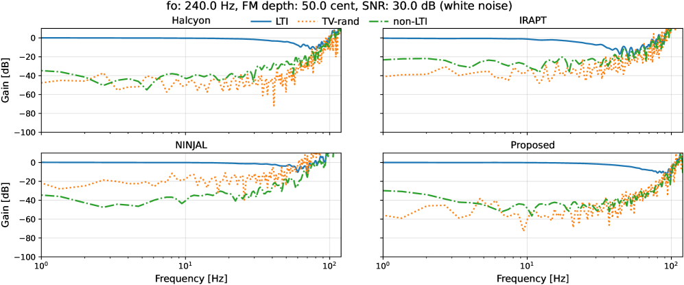

# 🚩 (2026-06-15) Scholar Inbox 추천 논문 

# 📚 Mask, Sample, Revise: A Revisable CTMC Inference Stack for Guided Discrete Flow Matching Text-to-Speech

🚀 URL: https://arxiv.org/html/2606.13989

## 🌏 Abstract (원문)
Recent alignment-free non-autoregressive (NAR) text-to-speech (TTS) models formulate synthesis as a conditional infilling task, bypassing explicit duration predictors and external aligners. When speech is represented with neural codec tokens, the infilling problem becomes discrete, making Discrete Flow Matching (DFM), a Continuous-Time Markov Chain (CTMC) framework for discrete generation, a natural fit. However, inference-time control for stable low-step conditional infilling remains underexplored. We propose Mask, Sample, Revise, an inference-time CTMC stack for alignment-free DFM-TTS. The stack combines predictor-free guidance to strengthen text conditioning, prompt-matched conditional coupling to align the probability path with the acoustic prompt, and SC-ReMask, a schedule-constrained remasking mechanism that introduces token-to-mask transitions so early de-masking decisions can be revised. These components require no post-hoc fine-tuning and operate in a single tau-leaping sampler. Controlled ablations show that this stack improves intelligibility and robustness in the low-NFE prompted setting, outperforming unguided and guidance-only samplers with substantially more steps.
## 🌏 Abstract (번역)
최근 정렬-자유 비-자기회귀(NAR) 텍스트-음성(TTS) 모델은 명시적인 길이 예측기 및 외부 정렬기를 우회하여 합성을 조건부 채우기 작업으로 공식화합니다. 음성이 신경 코덱 토큰으로 표현될 때, 채우기 문제는 이산적이 되며, 이산 생성을 위한 연속 시간 마르코프 체인(CTMC) 프레임워크인 이산 흐름 매칭(DFM)이 자연스럽게 적용됩니다. 그러나 안정적인 저단계 조건부 채우기를 위한 추론 시간 제어는 아직 충분히 탐구되지 않았습니다. 우리는 정렬-자유 DFM-TTS를 위한 추론 시간 CTMC 스택인 Mask, Sample, Revise를 제안합니다. 이 스택은 텍스트 조건화를 강화하기 위한 예측기-자유 안내, 음향 프롬프트와 확률 경로를 정렬하기 위한 프롬프트-매칭 조건부 커플링, 그리고 초기 마스크 해제 결정을 수정할 수 있도록 토큰-마스크 전환을 도입하는 스케줄-제약 재마스킹 메커니즘인 SC-ReMask를 결합합니다. 이러한 구성 요소들은 사후 미세 조정이 필요 없으며 단일 타우-리핑 샘플러에서 작동합니다. 통제된 제거 연구는 이 스택이 낮은 NFE 프롬프트 설정에서 명료도와 견고성을 향상시키며, 훨씬 더 많은 단계를 사용하는 안내 없는 샘플러 및 안내 전용 샘플러보다 우수한 성능을 보임을 보여줍니다.

## 🔍 Methods & Results
- 훈련 데이터로 Emilia-YODAS 데이터셋의 영어 부분(CC BY 4.0)을 사용했습니다.
- 이산 음향 표현을 위해 NeuCodec(FSQ 기반, XCodec2에서 파생)을 사용하여 저비트레이트 음성 재구성과 단일 코드북 토큰화 방식을 결합했습니다.
- 텍스트 토큰화에는 GPT-2 BPE 토크나이저를 사용했습니다.
- 평가는 LibriSpeech test-clean 데이터셋(4~10초 발화, 2.2시간 서브셋)에서 음성 프롬프트 프로토콜을 따랐으며, 동일 화자의 무작위 발화를 프롬프트로 사용했습니다.
- 모델은 2.32억 개의 파라미터를 가진 G-DFlow-TTS이며, 12개 레이어, 12개 어텐션 헤드, 히든 사이즈 768, RoPE(θ=10000)를 포함하는 DiT 백본으로 구성됩니다.
- 훈련은 단일 NVIDIA B200 GPU에서 100만 이터레이션 동안 AdamW 옵티마이저, 학습률 3e-4, 5,000 워밍업 스텝을 포함한 코사인 감쇠, 가중치 감쇠 1e-6, 유효 배치 사이즈 64, 그래디언트 클리핑 10, 혼합 정밀도를 사용하여 진행되었습니다.
- 추론 시 예측기-자유 안내(PFG)를 활성화하기 위해 텍스트 드롭아웃(훈련 예제의 10%에서 텍스트 조건을 필러 시퀀스로 대체)을 통해 조건부 및 비조건부 예측을 위한 단일 모델을 훈련했습니다.
- 평가 지표로는 명료도(CTC 기반 HuBERT ASR 모델에서 계산된 WER 및 CER), 화자 유사성(WavLM-TDCNN 임베딩 간의 코사인 유사도인 SIM-o), 지각 품질(UTMOS 및 19명의 청취자가 참여한 5점 리커트 MOS 연구)을 사용했습니다.
- 제안된 Mask, Sample, Revise 스택은 낮은 NFE 프롬프트 설정에서 명료도와 견고성을 향상시키며, 안내 없는 샘플러 및 안내 전용 샘플러보다 훨씬 적은 단계로 우수한 성능을 보였습니다.

## 🖼 Figures

*Figure 1:Overview of G-DFlow-TTS. (a) During training, the model learns DFM-based masked infilling over neural codec tokens using text-filler conditioning and prompt-matched conditional coupling. (b) At inference, the Mask, Sample, Revise stack combines predictor-free guidance (PFG), CTMC tau-leaping, and SC-ReMask token-to-mask transitions to revise generated tokens while keeping the acoustic prompt fixed.*

*Figure 2:Grid search over predictor-free guidance strength 
𝛾
 and sampling budget (NFE) for G-DFlow-TTS with conditional coupling. Colors denote WER on the LibriSpeech test-clean prompted subset (lower is better).*

*Figure 3:Effect of predictor-free guidance strength 
𝛾
 at fixed sampling budget (NFE
=
32
). Conditional coupling consistently improves intelligibility over U-coupling across 
𝛾
. Diamonds indicate the best 
𝛾
 for each coupling strategy.*

![Figure 4:Schedule-constrained remasking ablation on LibriSpeech dev-clean, where 
𝜂
𝑟
=
𝜂
𝑟
​
𝑒
​
𝑠
​
𝑐
​
𝑎
​
𝑙
​
𝑒
 and 
𝜂
𝑐
=
𝜂
𝑐
​
𝑎
​
𝑝
. We report CER as a function of the number of function evaluations (NFE) while varying the remasking switch time 
𝑡
switch
, rescaling factor 
𝜂
𝑟
, and cap 
𝜂
𝑐
. The no-remasking baseline uses C-coupling with PFG. Always-on remasking (
𝑡
switch
=
0
) with 
(
𝜂
𝑟
,
𝜂
𝑐
)
=
(
0.5
,
0.5
)
 gives the best low-NFE behavior among the tested schedules, showing that revisable token-to-[MASK] transitions improve CTMC sampling beyond guided unmasking alone.](../images/2026-06-15/2606.13989/2606.13989_fig3.png)
*Figure 4:Schedule-constrained remasking ablation on LibriSpeech dev-clean, where 
𝜂
𝑟
=
𝜂
𝑟
​
𝑒
​
𝑠
​
𝑐
​
𝑎
​
𝑙
​
𝑒
 and 
𝜂
𝑐
=
𝜂
𝑐
​
𝑎
​
𝑝
. We report CER as a function of the number of function evaluations (NFE) while varying the remasking switch time 
𝑡
switch
, rescaling factor 
𝜂
𝑟
, and cap 
𝜂
𝑐
. The no-remasking baseline uses C-coupling with PFG. Always-on remasking (
𝑡
switch
=
0
) with 
(
𝜂
𝑟
,
𝜂
𝑐
)
=
(
0.5
,
0.5
)
 gives the best low-NFE behavior among the tested schedules, showing that revisable token-to-[MASK] transitions improve CTMC sampling beyond guided unmasking alone.*

---
**Usage Info**: 4092 tokens used.
**Generated at**: 2026-06-15 18:24:04

---

# 📚 FoleyGenEx: Unified Video-to-Audio Generation with Multi-Modal Control, Temporal Alignment, and Semantic Precision

🚀 URL: https://arxiv.org/html/2606.14049

## 🌏 Abstract (원문)
We present FoleyGenEx, a unified video-to-audio (VTA) framework integrating multi-modal control, frame-level temporal alignment, and fine-grained semantics, enabling synchronized, versatile audio synthesis for diverse tasks. Existing VTA methods either have multi-modal control but weak temporal alignment or strong alignment but lack reference audio conditioning and semantic precision. FoleyGenEx fills this gap via three core innovations: a conditional injection mechanism for audio-controlled VTA and Foley extension, a multi-modal dynamic masking strategy preserving training synchronization, and an adverb-based data augmentation algorithm leveraging signal processing and large language models to enhance textual supervision with nuanced semantics. Experiments on AudioCaps, VGGSound, and Greatest Hits demonstrate its competitive controllable VTA performance against existing methods. Demo samples are available athttps://foleygenex.github.io/FoleyGenEx.
## 🌏 Abstract (번역)
저희는 다중 모달 제어, 프레임 수준의 시간 정렬, 그리고 미세한 의미론을 통합하여 다양한 작업을 위한 동기화되고 다재다능한 오디오 합성을 가능하게 하는 통합 비디오-오디오(VTA) 프레임워크인 FoleyGenEx를 소개합니다. 기존 VTA 방법들은 다중 모달 제어는 가능하지만 시간 정렬이 약하거나, 정렬은 강력하지만 참조 오디오 조건화 및 의미론적 정밀도가 부족합니다. FoleyGenEx는 세 가지 핵심 혁신을 통해 이러한 격차를 해소합니다: 오디오 제어 VTA 및 폴리 확장(Foley extension)을 위한 조건부 주입 메커니즘, 훈련 동기화를 유지하는 다중 모달 동적 마스킹 전략, 그리고 신호 처리 및 대규모 언어 모델을 활용하여 미묘한 의미론으로 텍스트 감독을 강화하는 부사 기반 데이터 증강 알고리즘입니다. AudioCaps, VGGSound 및 Greatest Hits 데이터셋에 대한 실험은 기존 방법론에 비해 경쟁력 있는 제어 가능한 VTA 성능을 보여줍니다. 데모 샘플은 https://foleygenex.github.io/FoleyGenEx 에서 확인할 수 있습니다.

## 🔍 Methods & Results
- FoleyGenEx는 다중 모달 제어, 프레임 수준 시간 정렬, 미세한 의미론을 통합하여 동기화되고 다재다능한 오디오 합성을 가능하게 하는 통합 비디오-오디오(VTA) 프레임워크입니다.
- FoleyGenEx는 오디오 제어 VTA 및 폴리 확장을 위한 조건부 주입 메커니즘을 도입했습니다.
- 훈련 동기화를 유지하는 다중 모달 동적 마스킹 전략을 사용합니다.
- 신호 처리 및 대규모 언어 모델을 활용하여 미묘한 의미론으로 텍스트 감독을 강화하는 부사 기반 데이터 증강 알고리즘을 개발했습니다.
- AudioCaps, VGGSound, Greatest Hits 데이터셋에 대한 실험에서 기존 방법론 대비 경쟁력 있는 제어 가능한 VTA 성능을 입증했습니다.

## 🖼 Figures

*Figure 1:FoleyGenEx supports a range of multi-modal controlled audio generation tasks, including Text-to-Audio (TTA), basic Video-to-Audio (VTA), Text-Controlled VTA (TC-VTA), Audio-Controlled VTA (AC-VTA), and Foley extension (FE). It unifies these tasks while achieving strong synchronization, versatile control, and expressive audio generation.*

*Figure 2:FoleyGenEx training framework.*

*Figure 3:Multi-modal controlled audio generation tasks. FT: text semantic features; FV: video semantic features; FS: video synchronization features; FRS: reference video synchronization features; FA: reference audio latents. FV0, FA0, and FT0 represent all-zero features for video, audio, and text, respectively. `Ref' denotes `reference'.*

*Figure 4:Adverb-based data augmentation algorithm.*

*Figure 5:Spectrograms of audio generated by MultiFoley and our FoleyGenEx.*

*Figure 6:Different mask training strategies: (a) Masking on the audio branch (b) Multimodal masking (c) Masking on the audio branch with InputEmbedding module.*

*Figure 7:The inference setup for the audio-controlled video-to-audio task.*

---
**Usage Info**: 1285 tokens used.
**Generated at**: 2026-06-15 18:24:10

---

# 📚 Who Spoke When in Multi-Conversation: Target Speaker Tagging Task and Benchmark

🚀 URL: https://arxiv.org/html/2606.14091

## 🌏 Abstract (원문)
We present target speaker tagging (TST), a task that integrates speaker diarization, verification, and identification into a unified workflow for multi-speaker conversations. Given long recordings and pre-enrolled speakers, TST detects and labels speech segments of known speakers while rejecting unknown ones. Despite its practical importance, research has been limited by the absence of suitable evaluation resources. To address this, we introduce TST-Bench, a large-scale synthetic benchmark with over 150 enrolled speakers, 300 sessions of 20–60 minutes, and reference annotations with global speaker labels. We define an evaluation protocol encompassing diarization and full-pipeline scenarios. Experiments on both real and synthetic data show that TST poses challenges not captured by conventional benchmarks, and that dedicated system design yields significant gains over naive integration of existing solutions. The benchmark dataset and evaluation protocols are publicly released.
## 🌏 Abstract (번역)
본 논문은 다중 화자 대화를 위한 통합 워크플로우로 화자 분할, 검증 및 식별을 통합하는 작업인 목표 화자 태깅(TST)을 제시합니다. 긴 녹음과 사전 등록된 화자가 주어졌을 때, TST는 알려진 화자의 음성 구간을 감지하고 레이블을 지정하는 동시에 알 수 없는 화자는 거부합니다. 실용적인 중요성에도 불구하고, 적합한 평가 자원의 부재로 인해 연구가 제한적이었습니다. 이를 해결하기 위해, 우리는 150명 이상의 등록된 화자, 20~60분 길이의 300개 세션, 그리고 전역 화자 레이블이 있는 참조 주석을 포함하는 대규모 합성 벤치마크인 TST-Bench를 소개합니다. 우리는 화자 분할 및 전체 파이프라인 시나리오를 포함하는 평가 프로토콜을 정의합니다. 실제 및 합성 데이터 모두에 대한 실험은 TST가 기존 벤치마크로는 포착되지 않는 도전 과제를 제기하며, 전용 시스템 설계가 기존 솔루션의 단순한 통합보다 상당한 이득을 가져온다는 것을 보여줍니다. 벤치마크 데이터셋과 평가 프로토콜은 공개적으로 배포됩니다.

## 🔍 Methods & Results
- 다중 화자 대화를 위한 화자 분할, 검증, 식별을 통합하는 새로운 작업인 목표 화자 태깅(TST)을 제안했습니다.
- TST 연구의 평가 자원 부족 문제를 해결하기 위해 TST-Bench라는 대규모 합성 벤치마크를 도입했습니다. 이 벤치마크는 150명 이상의 등록 화자, 20~60분 길이의 300개 세션, 전역 화자 레이블을 포함합니다.
- 화자 분할 및 전체 파이프라인 시나리오를 포괄하는 TST 평가 프로토콜을 정의했습니다.
- 실제 및 합성 데이터에 대한 실험 결과, TST가 기존 벤치마크로는 포착되지 않는 고유한 도전 과제를 제시함을 확인했습니다.
- 기존 솔루션의 단순한 통합 방식보다 TST를 위한 전용 시스템 설계가 성능에서 상당한 개선을 가져왔습니다.
- TST-Bench 데이터셋과 평가 프로토콜은 공개적으로 배포되었습니다.

## 🖼 Figures

*Figure 1:Overview of the target speaker tagging system: (1) speaker diarization segments audio into single-speaker regions, (2) a user enrolls known speakers, (3) target speakers present in the session are specified, and (4) the system assigns enrolled speaker identities to matching segments.*

*Figure 2:TST-Bench synthesis pipeline. (a) Source data preparation: single-speaker recordings from MLS are enhanced, segmented via forced alignment, and partitioned into enrolled and unknown speaker pools. (b) Session synthesis: speakers are sampled per session, turns are laid out with Dirichlet-distributed proportions, and mixed onto background noise to produce multi-speaker audio with global RTTM annotations.*

---
**Usage Info**: 1580 tokens used.
**Generated at**: 2026-06-15 18:24:17

---

# 📚 From Self-Supervised Speech Models to Mixture-of-Experts for Robust Anti-Spoofing

🚀 URL: https://arxiv.org/html/2606.14639

## 🌏 Abstract (원문)
Recent advances in speech generation have significantly improved the naturalness of synthetic speech, making spoofing detection increasingly challenging. A key limitation of current anti-spoofing systems is their limited robustness to unseen synthesis methods. In this work, we transform a self-supervised speech representation model into a Mixture-of-Experts (MoE) architecture to improve generalization. Feed-forward blocks in selected encoder layers are replaced by multiple expert networks controlled by a layer-wise gating mechanism, allowing experts to capture complementary acoustic patterns while preserving the representations learned during self-supervised pretraining. We further analyze the architectural choices affecting the performance of this MoE conversion and investigate the activation behavior of the experts. The proposed approach is evaluated on 14 spoofing datasets and reduces the macro EER from 5.46% to 4.81%, corresponding to 11.9% relative improvement over the baseline.
## 🌏 Abstract (번역)
최근 음성 생성 기술의 발전은 합성 음성의 자연스러움을 크게 향상시켜, 스푸핑 탐지를 점점 더 어렵게 만들고 있습니다. 현재 안티-스푸핑 시스템의 주요 한계는 미지의 합성 방법에 대한 제한된 강건성입니다. 본 연구에서는 일반화 성능을 향상시키기 위해 자기 지도 학습 음성 표현 모델을 MoE(Mixture-of-Experts) 아키텍처로 변환합니다. 선택된 인코더 레이어의 피드포워드 블록은 레이어별 게이팅 메커니즘에 의해 제어되는 여러 전문가 네트워크로 대체되어, 전문가들이 상호 보완적인 음향 패턴을 포착하면서 자기 지도 학습 사전 훈련 중에 학습된 표현을 보존할 수 있도록 합니다. 우리는 또한 이 MoE 변환의 성능에 영향을 미치는 아키텍처 선택을 분석하고 전문가들의 활성화 동작을 조사합니다. 제안된 접근 방식은 14개의 스푸핑 데이터셋에서 평가되었으며, 매크로 EER을 5.46%에서 4.81%로 감소시켜 기준선 대비 11.9%의 상대적 개선을 보였습니다.

## 🔍 Methods & Results
- 현재 최첨단 안티-스푸핑 접근 방식은 입력 음성 신호에서 풍부한 특징 표현을 추출하는 자기 지도 학습(SSL) 모델과 보나파이드 및 스푸핑된 음성 신호를 구별하는 분류기로 구성됩니다.
- SSL 모델(예: Wav2vec2, HuBERT, WavLM)은 대규모 레이블 없는 음성 코퍼스에서 사전 훈련되어 미세한 음향 구조뿐만 아니라 고수준의 음성 및 운율 정보를 인코딩하는 풍부하고 계층적인 표현을 추출합니다.
- 대부분의 SSL 모델은 스트라이드 1D 컨볼루션 스택으로 구현된 특징 추출기와 L개의 트랜스포머 인코더 레이어로 구성된 2단계 설계를 따릅니다. 각 트랜스포머 레이어는 멀티 헤드 셀프 어텐션(MHA) 메커니즘과 피드포워드 네트워크를 기반으로 합니다.
- SSL 백본 다음에는 Multi-Head Factorized Attention (MHFA) 모듈이 분류 헤드로 사용되며, 최종 트랜스포머 레이어뿐만 아니라 여러 SSL 레이어의 표현을 활용합니다.
- 제안된 접근 방식은 자기 지도 학습 음성 표현 모델을 MoE(Mixture-of-Experts) 아키텍처로 변환하여 일반화를 개선합니다. 이는 선택된 인코더 레이어의 피드포워드 블록을 레이어별 게이팅 메커니즘에 의해 제어되는 여러 전문가 네트워크로 대체하는 방식입니다.
- 제안된 MoE 접근 방식은 14개의 스푸핑 데이터셋에서 평가되었으며, 매크로 EER을 5.46%에서 4.81%로 감소시켜 기준선 대비 11.9%의 상대적 개선을 달성했습니다.

---
**Usage Info**: 2559 tokens used.
**Generated at**: 2026-06-15 18:24:26

---

# 📚 Unsupervised Approaches for Global Prosodic Embedding Extraction

🚀 URL: https://arxiv.org/html/2606.14004

## 🌏 Abstract (원문)
Prosody is central to oral communication, conveying information like the emotional state of the speaker and cues needed for meaning disambiguation. Many self-supervised models of speech produce embeddings that encode prosodic as well as linguistic, and speaker information. This entanglement of information is problematic in scenarios where prosody is the main distinguishing factor while other factors may vary between training and deployment; in such cases, a purely prosodic representation would be more robust. Such representation could also be used for analyzing the role of prosody in a given task or as input to speech synthesis systems. In this work, we propose a variety of approaches for producing global prosodic embeddings based on auto-encoder models of pitch and energy. We develop a benchmark for assessing the performance of these representations, showing that our embeddings provide competitive or superior performance under challenging conditions, compared to various alternatives.
## 🌏 Abstract (번역)
운율은 화자의 감정 상태 및 의미 모호성을 해소하는 데 필요한 단서와 같은 정보를 전달하며 구두 의사소통의 핵심입니다. 많은 자기 지도 학습 음성 모델은 운율 정보뿐만 아니라 언어 및 화자 정보도 인코딩하는 임베딩을 생성합니다. 이러한 정보의 얽힘은 운율이 주요 식별 요소인 반면 다른 요소들은 훈련과 배포 간에 달라질 수 있는 시나리오에서 문제가 됩니다. 이러한 경우, 순수한 운율 표현이 더 견고할 것입니다. 이러한 표현은 주어진 작업에서 운율의 역할을 분석하거나 음성 합성 시스템의 입력으로도 사용될 수 있습니다. 본 연구에서는 피치 및 에너지의 오토인코더 모델을 기반으로 전역 운율 임베딩을 생성하기 위한 다양한 접근 방식을 제안합니다. 우리는 이러한 표현의 성능을 평가하기 위한 벤치마크를 개발했으며, 우리의 임베딩이 다양한 대안과 비교하여 어려운 조건에서도 경쟁력 있거나 우수한 성능을 제공함을 보여줍니다.

## 🔍 Methods & Results
- F0, 에너지, 음성 신호와 같은 프레임 수준 운율 특징으로부터 고정 차원 운율 임베딩을 학습하기 위한 자기 지도 학습 프레임워크를 제안하며, 오토인코더를 사용하여 화자 및 텍스트 정보 인코딩을 제한합니다.
- 인코더는 입력 시퀀스를 처리하여 잠재 표현을 생성하고, 디코더는 이로부터 입력 시퀀스를 재구성합니다. 재구성 손실을 최소화하여 종단 간 훈련하며, 추론 시에는 인코더만 사용됩니다.
- 운율 특징으로 Praat의 자기상관법으로 추출된 F0(로그 스케일 및 무성 구간 보간)과 멜 필터뱅크를 사용한 지각적 음량 측정 기반의 에너지를 사용하며, 두 특징 모두 z-정규화됩니다.
- 인코더 아키텍처는 양방향 GRU 기반 모델과 3개의 트랜스포머 레이어 스택을 사용하는 트랜스포머 기반 모델 두 가지를 탐색합니다.
- 디코더는 피치 및 에너지 재구성을 위한 단방향 GRU 디코더(GRU 기반) 또는 학습된 위치 쿼리와 교차 어텐션을 사용하는 비자기회귀 트랜스포머 디코더(트랜스포머 기반)를 사용하며, 음성 신호 재구성에는 효율성을 위해 비자기회귀 디코더를 채택합니다.
- 트랜스포머 모델의 두 가지 변형으로, 디코더가 전체 인코더 출력에 교차 어텐션하는 '전체 시퀀스 변형'과 학습 가능한 CLS 토큰을 통해 명시적인 정보 병목 현상을 도입하는 'CLS 토큰 변형'을 탐색합니다.
- 재구성 손실은 에너지(MSE), 유성 프레임 피치(MSE), 보간된 피치(MSE), 음성 시퀀스(이진 교차 엔트로피)의 조합을 사용하여 EPv, EPi, EPvV의 세 가지 목표 구성을 탐색합니다.
- 재구성 작업은 전체 입력 시퀀스를 재구성하는 '표준 재구성'과 인코딩 전에 입력 프레임의 일부를 마스킹하여 누락된 세그먼트를 재구성하도록 강제하는 '마스크드 재구성'(MAE 기반)으로 나뉩니다.
- 훈련 데이터는 언어학적으로 동기 부여된 인토네이션 단위(IU)로 자동 분할되며, LJSpeech(단일 화자, 24시간) 및 VCTK(다중 화자, 44시간) 두 가지 깨끗하고 고품질의 영어 음성 코퍼스를 사용합니다.
- GRU 기반 모델의 훈련 안정화를 위해 커리큘럼 학습(짧은 시퀀스부터 시작)과 선형 교사 강제(teacher forcing) 감쇠를 적용합니다.
- 제안된 임베딩은 다양한 대안과 비교하여 어려운 조건에서 경쟁력 있거나 우수한 성능을 제공합니다.

## 🖼 Figures

*Figure 1:Schematic of the cross-validation approaches used in this work for a toy problem with 3 texts (
𝑇
𝑖
), 3 speakers (
𝑆
𝑖
), and 3 classes (
𝐶
𝑖
), and a single sample per combination, so that each rectangle represents a sample. The green samples are used to train a model which is then applied to the blue samples. This process is repeated by changing the test samples and corresponding training samples until all samples are used for testing exactly once.*

![Figure 2:Accuracy and MSE results for various system configurations for the three evaluation protocols on the SynthID dataset. The y-axis range is determined so that it approximately spans the size of three confidence intervals for this dataset. The horizontal lines are separated by the size of the intervals (averaged across systems), visually indicating the statistical significance (or lack thereof) of the difference between the systems. The color of the markers indicates the architecture and pretext task, the shape indicates the loss (left column) or the dimension of the embeddings (right column).](../images/2026-06-15/2606.14004/2606.14004_fig1.png)
*Figure 2:Accuracy and MSE results for various system configurations for the three evaluation protocols on the SynthID dataset. The y-axis range is determined so that it approximately spans the size of three confidence intervals for this dataset. The horizontal lines are separated by the size of the intervals (averaged across systems), visually indicating the statistical significance (or lack thereof) of the difference between the systems. The color of the markers indicates the architecture and pretext task, the shape indicates the loss (left column) or the dimension of the embeddings (right column).*

*Figure 3:Results on the RAVDESS and Bestiary datasets for various baseline approaches and a subset of configurations for our proposed method corresponding to the EPvV loss and an embedding size of 256. The grey horizontal line indicates the random baseline for accuracy, obtained by predicting always the majority class. The whiskers on top of the bars indicate the 95% confidence intervals.*

---
**Usage Info**: 7015 tokens used.
**Generated at**: 2026-06-15 18:24:56

---

# 📚 BayLing-Duplex: Native Full-Duplex Speech Dialogue with a Single Autoregressive LLM

🚀 URL: https://arxiv.org/html/2606.14528

## 🌏 Abstract (원문)
Real-time, full-duplex speech interaction is a key feature of next-generation spoken chatbots, allowing the model to listen and speak at the same time and to handle natural phenomena such as overlap, hesitation, and barge-in. Existing speech language models (SpeechLMs) such as LLaMA-Omni(Fanget al.,2025a)and GLM-4-Voice(Zenget al.,2024)are still turn-based and rely on an external Voice Activity Detection (VAD) module to mark the end of the user’s turn, which fundamentally limits their interactive ability. In this paper, we introduce BayLing-Duplex, a native full-duplex SpeechLM where a single autoregressive LLM decides when to listen, when to speak, and when to stop, with no auxiliary turn-taking module. The design adds only a few special tokens to the standard vocabulary, so it transfers across LLMs and reuses existing training and serving stacks with no architectural adaptation. Starting from the public GLM-4-Voice checkpoint and using only 400K full-duplex samples for fine-tuning followed by a lightweight DPO stage, BayLing-Duplex reaches 92% turn-taking success and 100% interruption success on InstructS2S-Eval, while improving the speech-response score from 2.17 to 3.39 over Moshi(Défossezet al.,2024). BayLing-Duplex also matches or surpasses its turn-based counterpart on Llama Questions, Web Questions, and Alpaca-Eval, showing that simultaneous listen-and-speak modeling does not sacrifice response quality.111Code and models are available athttps://github.com/BayLing-Models/BayLing-Duplex.
## 🌏 Abstract (번역)
실시간 전이중(full-duplex) 음성 상호작용은 차세대 음성 챗봇의 핵심 기능으로, 모델이 동시에 듣고 말하며 오버랩, 망설임, 끼어들기 등 자연스러운 현상을 처리할 수 있게 합니다. LLaMA-Omni(Fang et al., 2025a) 및 GLM-4-Voice(Zeng et al., 2024)와 같은 기존 음성 언어 모델(SpeechLM)은 여전히 턴 기반이며 사용자의 발화 종료를 표시하기 위해 외부 음성 활동 감지(VAD) 모듈에 의존하여 상호작용 능력을 근본적으로 제한합니다. 본 논문에서는 보조적인 턴 전환 모듈 없이 단일 자동회귀 LLM이 언제 들을지, 언제 말할지, 언제 멈출지를 결정하는 네이티브 전이중 SpeechLM인 BayLing-Duplex를 소개합니다. 이 설계는 표준 어휘에 몇 개의 특수 토큰만 추가하므로, LLM 간에 전이 가능하며 아키텍처 변경 없이 기존 훈련 및 서비스 스택을 재사용합니다. 공개된 GLM-4-Voice 체크포인트에서 시작하여 40만 개의 전이중 샘플만으로 미세 조정하고 경량 DPO 단계를 거친 후, BayLing-Duplex는 InstructS2S-Eval에서 92%의 턴 전환 성공률과 100%의 끼어들기 성공률을 달성했으며, Moshi(Défossez et al., 2024) 대비 음성 응답 점수를 2.17에서 3.39로 향상시켰습니다. BayLing-Duplex는 또한 Llama Questions, Web Questions 및 Alpaca-Eval에서 턴 기반 모델과 동등하거나 그 이상을 기록하여 동시 듣기-말하기 모델링이 응답 품질을 희생시키지 않음을 보여줍니다. 코드와 모델은 https://github.com/BayLing-Models/BayLing-Duplex에서 확인할 수 있습니다.

## 🔍 Methods & Results
- 기존 턴 기반 SpeechLM의 한계를 극복하기 위해 보조 턴 전환 모듈 없이 단일 자동회귀 LLM이 듣기, 말하기, 멈추기를 결정하는 네이티브 전이중 SpeechLM인 BayLing-Duplex를 제안합니다.
- BayLing-Duplex는 표준 어휘에 몇 개의 특수 토큰만 추가하여 LLM 간 전이 가능하며 기존 훈련 및 서비스 스택을 재사용할 수 있도록 설계되었습니다.
- 공개된 GLM-4-Voice 체크포인트에서 시작하여 40만 개의 전이중 샘플로 미세 조정하고 경량 DPO 단계를 거쳐 모델을 훈련했습니다.
- InstructS2S-Eval에서 92%의 턴 전환 성공률과 100%의 끼어들기 성공률을 달성했습니다.
- Moshi 대비 음성 응답 점수를 2.17에서 3.39로 향상시켰습니다.
- Llama Questions, Web Questions, Alpaca-Eval에서 턴 기반 모델과 동등하거나 그 이상의 성능을 보여, 동시 듣기-말하기 모델링이 응답 품질을 저하시키지 않음을 입증했습니다.

## 🖼 Figures
![Figure 1:Multi-channel interleaved sequence in BayLing-Duplex. The user speech, assistant text and assistant speech channels are interleaved block-by-block at a fixed 
𝑁
:
𝑀
:
𝑁
 ratio; here 
𝑁
=
𝑀
=
2
 for clarity (we use 
𝑁
=
10
, 
𝑀
=
5
 in practice). The text channel embeds the dialogue-state tokens [SILENCE] ([S]), [ASSISTANT] ([A]), [PAD] ([P]) and [EPAD] ([E]). The illustrated dialogue starts with the user asking “Hi, what time is it?”; the assistant takes the turn at 
2.0
 s with “The time is…”, is interrupted at 
3.0
 s by “Wait, Beijing Time!”, and re-starts with “9PM” at 
4.5
 s. Turn-taking, being interrupted, and re-starting are all expressed as ordinary next-token prediction over the standard LLM vocabulary.](../images/2026-06-15/2606.14528/2606.14528_fig0.png)
*Figure 1:Multi-channel interleaved sequence in BayLing-Duplex. The user speech, assistant text and assistant speech channels are interleaved block-by-block at a fixed 
𝑁
:
𝑀
:
𝑁
 ratio; here 
𝑁
=
𝑀
=
2
 for clarity (we use 
𝑁
=
10
, 
𝑀
=
5
 in practice). The text channel embeds the dialogue-state tokens [SILENCE] ([S]), [ASSISTANT] ([A]), [PAD] ([P]) and [EPAD] ([E]). The illustrated dialogue starts with the user asking “Hi, what time is it?”; the assistant takes the turn at 
2.0
 s with “The time is…”, is interrupted at 
3.0
 s by “Wait, Beijing Time!”, and re-starts with “9PM” at 
4.5
 s. Turn-taking, being interrupted, and re-starting are all expressed as ordinary next-token prediction over the standard LLM vocabulary.*

---
**Usage Info**: 2058 tokens used.
**Generated at**: 2026-06-15 18:25:04

---

# 📚 Instantaneous Pitch Estimation via Wave-U-Net-Based Fundamental Waveform Enhancement

🚀 URL: https://arxiv.org/html/2606.14324

## 🌏 Abstract (원문)
Instantaneous pitch estimation plays an important role in analyzing steep pitch variations such as speech prosody and singing techniques. Conventional approaches estimate instantaneous frequency after isolating the fundamental waveform from signals that contain harmonics and noise, which makes the accuracy sensitive to imperfect fundamental filtering. In this study, we formulate fundamental waveform filtering as a speech enhancement problem. Specifically, we train a Wave-U-Net model to extract a fundamental waveform from an input speech signal. The instantaneous pitch is then obtained by computing the instantaneous frequency from the analytic signal of the estimated fundamental waveform. Experimental results show that the proposed method outperforms conventional deterministic approaches and provides accurate and robust instantaneous pitch estimation across diverse domains, including speech, singing voice, musical instruments, and degraded speech signals.
## 🌏 Abstract (번역)
순간 피치 추정은 음성 운율 및 노래 기법과 같은 급격한 피치 변화를 분석하는 데 중요한 역할을 합니다. 기존 접근 방식은 고조파 및 노이즈를 포함하는 신호에서 기본 파형을 분리한 후 순간 주파수를 추정하며, 이는 불완전한 기본 필터링에 대한 정확도를 민감하게 만듭니다. 본 연구에서는 기본 파형 필터링을 음성 향상 문제로 공식화합니다. 구체적으로, 입력 음성 신호에서 기본 파형을 추출하기 위해 Wave-U-Net 모델을 훈련시킵니다. 그런 다음 추정된 기본 파형의 해석 신호로부터 순간 주파수를 계산하여 순간 피치를 얻습니다. 실험 결과는 제안된 방법이 기존의 결정론적 접근 방식을 능가하며 음성, 노래 음성, 악기 및 손상된 음성 신호를 포함한 다양한 도메인에서 정확하고 견고한 순간 피치 추정을 제공함을 보여줍니다.

## 🔍 Methods & Results
- 기존 방법의 한계인 불완전한 기본 필터링에 대한 민감도를 극복하기 위해, 기본 파형 필터링을 음성 향상 문제로 재정의했습니다.
- Wave-U-Net 모델을 훈련시켜 입력 음성 신호에서 기본 파형(xfund(t))을 직접 추출하도록 했습니다.
- 추출된 기본 파형의 해석 신호로부터 순간 주파수를 계산하여 순간 피치를 얻습니다.
- 손실 함수는 기본 및 잔여 구성 요소의 분리를 위한 평균 절대 오차(MAE)와 훈련 안정화를 위한 순간 주파수(f(t))에 대한 추가 손실 항으로 구성됩니다.
- 순간 주파수 손실 항에는 무음 또는 무성 자음 구간과 같이 순간 주파수가 불안정한 영역에서 기울기를 억제하는 마스크(m(t))가 적용됩니다.
- Wave-U-Net 아키텍처는 표준 프레임워크를 따르지만, 향상된 음성 파형 대신 기본 파형을 추정하도록 훈련됩니다.
- 인코더와 디코더는 다운샘플링(DS) 및 업샘플링(US) 블록, 병목 계층, 출력 1D 컨볼루션 계층으로 구성됩니다.
- 업샘플링에는 제로 삽입으로 인한 앨리어싱 아티팩트를 방지하기 위해 전치 컨볼루션 대신 보간 기반 업샘플링을 사용합니다.
- 출력 계층을 제외하고 Leaky ReLU를 비선형 함수로 사용하며, 출력 계층은 출력 범위를 [-1,1]로 제한하기 위해 tanh를 사용합니다.
- 실험 결과, 제안된 방법은 기존의 결정론적 접근 방식보다 우수하며 음성, 노래 음성, 악기, 손상된 음성 신호를 포함한 다양한 도메인에서 정확하고 견고한 순간 피치 추정 성능을 제공합니다.

## 🖼 Figures

*Figure 1:Overview of the proposed Wave-U-Net-based fundamental waveform filtering.*

*Figure 2:Frequency responses of each estimator under clean conditions.*

*Figure 3:Frequency responses of each estimator under noisy conditions.*

---
**Usage Info**: 2723 tokens used.
**Generated at**: 2026-06-15 18:25:13

---

