# 🚩 (2026-06-23) Scholar Inbox 추천 논문 

# 📚 FlowTTS-GRPO: Online Reinforcement Learning with Multi-Objective Reward Optimization for Flow-Matching Based Text-to-Speech

🚀 URL: https://arxiv.org/html/2606.23190

## 🌏 Abstract (원문)
Existing Reinforcement Learning (RL) research for Text-to-Speech (TTS) focuses on large language models (LLMs), leaving Flow-Matching (FM) under-explored. We present FlowTTS-GRPO, an online RL framework for FM-based TTS. By converting ordinary differential equation (ODE) trajectories into stochastic differential equation (SDE) paths, our method enables direct fine-tuning of open-source FM models without auxiliary models. We show that a weighted reward combination converges faster than a probabilistic scheme, and identify three practical optimizations: omitting classifier-free guidance (CFG) during training accelerates convergence; synthesizing hard cases improves robustness; and applying RL to the FM component enhances audio-detail metrics. Experiments on CosyVoice 3.0 and F5-TTS demonstrate objective and subjective preference gains in speaker similarity and perceptual quality, with F5-TTS also improving intelligibility.
## 🌏 Abstract (번역)
기존의 Text-to-Speech (TTS)를 위한 강화 학습(RL) 연구는 대규모 언어 모델(LLM)에 집중되어 있었으며, Flow-Matching (FM)은 충분히 탐구되지 않았습니다. 본 논문에서는 FM 기반 TTS를 위한 온라인 RL 프레임워크인 FlowTTS-GRPO를 제시합니다. 일반 미분 방정식(ODE) 궤적을 확률 미분 방정식(SDE) 경로로 변환함으로써, 저희 방법은 보조 모델 없이 오픈 소스 FM 모델을 직접 미세 조정할 수 있게 합니다. 가중치 보상 조합이 확률적 방식보다 더 빠르게 수렴함을 보였으며, 세 가지 실용적인 최적화 방안을 확인했습니다: 훈련 중 분류기 없는 안내(CFG)를 생략하면 수렴이 가속화됩니다; 어려운 사례를 합성하면 견고성이 향상됩니다; 그리고 FM 구성 요소에 RL을 적용하면 오디오 세부 지표가 향상됩니다. CosyVoice 3.0 및 F5-TTS에 대한 실험은 화자 유사성 및 지각 품질에서 객관적 및 주관적 선호도 향상을 입증했으며, F5-TTS는 명료도 또한 개선했습니다.

## 🔍 Methods & Results
- FlowTTS-GRPO는 Flow-Matching (FM) 기반 Text-to-Speech (TTS)를 위한 온라인 강화 학습(RL) 프레임워크를 제시합니다.
- CosyVoice 3.0 및 F5-TTS와 같은 사전 학습된 TTS 모델을 RL 미세 조정을 위해 선택했으며, 특히 제로샷 음성 복제 동작을 위해 FM 구성 요소를 최적화합니다.
- FM 디코딩 프로세스를 마르코프 결정 과정(MDP)으로 공식화하고, 결정론적 ODE 궤적을 확률 미분 방정식(SDE) 경로로 변환하여 탐색을 위한 확률성을 도입하고 FM 모델의 직접적인 미세 조정을 가능하게 합니다.
- 그룹별 상대 정책 최적화(GRPO)를 사용하여 기대 누적 보상을 최대화하며, 훈련 부담을 줄이고 수렴을 가속화하기 위해 초기 단계의 일부에만 SDE 샘플링을 적용하는 윈도우 트레이닝을 사용합니다.
- 화자 유사성 보상(speaker embeddings의 코사인 유사도), ASR 기반 보상(명료도를 위한 1-CER/WER), 지각 품질 보상(P.835 DNSMOS OVRL 점수)을 포함한 다중 보상 함수를 설계했습니다.
- 보상 융합을 위해 표준 편차로 정규화된 보상들의 가중치 조합을 사용하며, 이는 확률적 방식보다 더 빠르게 수렴함을 보여줍니다.
- 실용적인 최적화 방안으로, 훈련 중 분류기 없는 안내(CFG)를 생략하여 수렴을 가속화하고, 텍스트 증강을 통해 '어려운 사례'(예: 단어 반복, 혀 꼬임)를 합성하여 모델의 견고성을 향상시키며, FM 구성 요소에 RL을 적용하여 오디오 세부 지표를 개선합니다.
- CosyVoice 3.0 및 F5-TTS에 대한 실험 결과, 화자 유사성 및 지각 품질에서 객관적 및 주관적 선호도 향상을 입증했으며, F5-TTS는 명료도 또한 개선되었습니다.

## 🖼 Figures
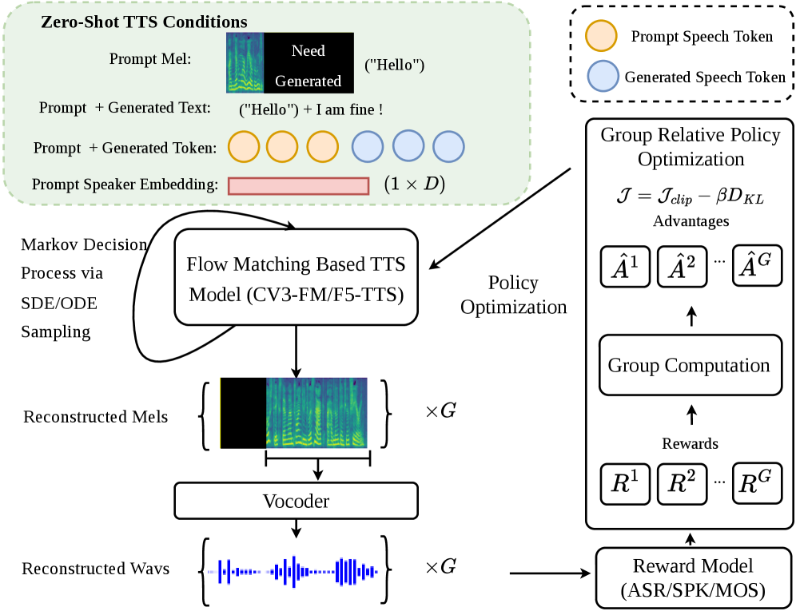
*Figure 1: The pipeline of our FlowTTS-GRPO post-training for CosyVoice 3.0 and F5-TTS. Prompt speech tokens, generated speech tokens, and prompt speaker embedding are only used for CosyVoice 3.0.*

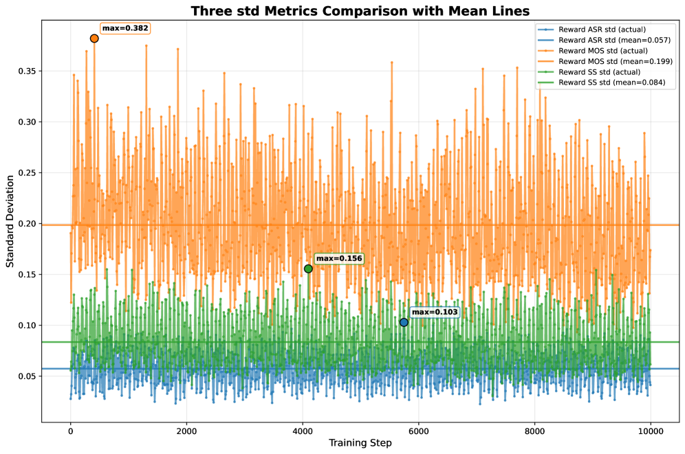
*Figure 2: The standard deviation of three rewards in batch during training.*

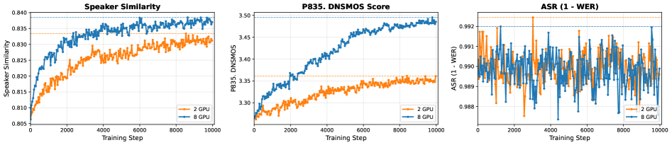
*Figure 3: Proxy reward curves for CV3 on the dev-easy set during RL training with different numbers of GPUs.*

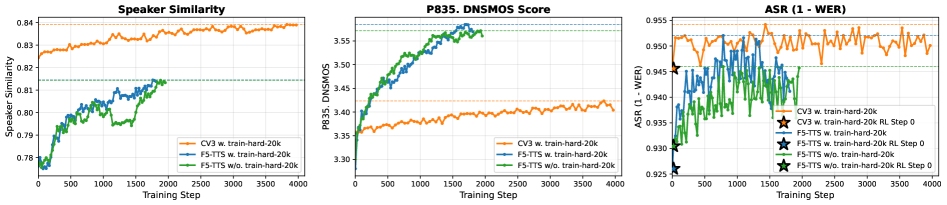
*Figure 4: Proxy reward curves for CV3 and F5-TTS on the dev-hard set during RL training with Robust Training via Hard Cases. train-hard-20k represents the hard case training set.*

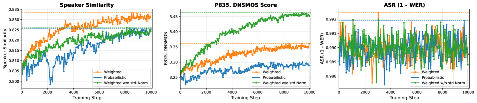
*Figure 5: Proxy reward curves for CV3 on the dev-easy set during RL training with different multi-objective reward combination strategies.*

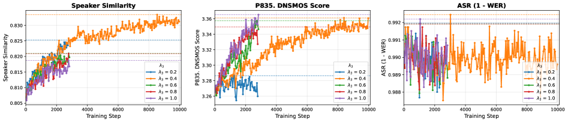
*Figure 6: Proxy reward curves for CV3 on the dev-easy set during RL training with different DNSMOS weights.*

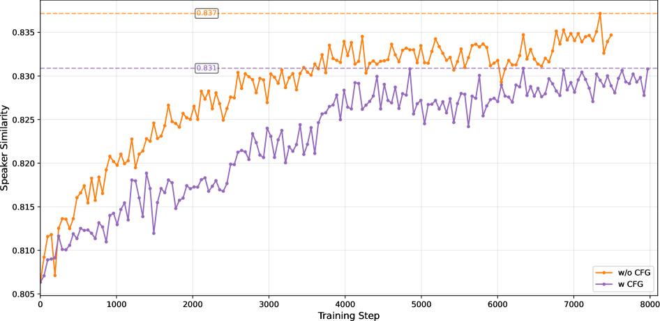
*Figure 7: Effect of omitting CFG during RL training on the dev-easy set.*

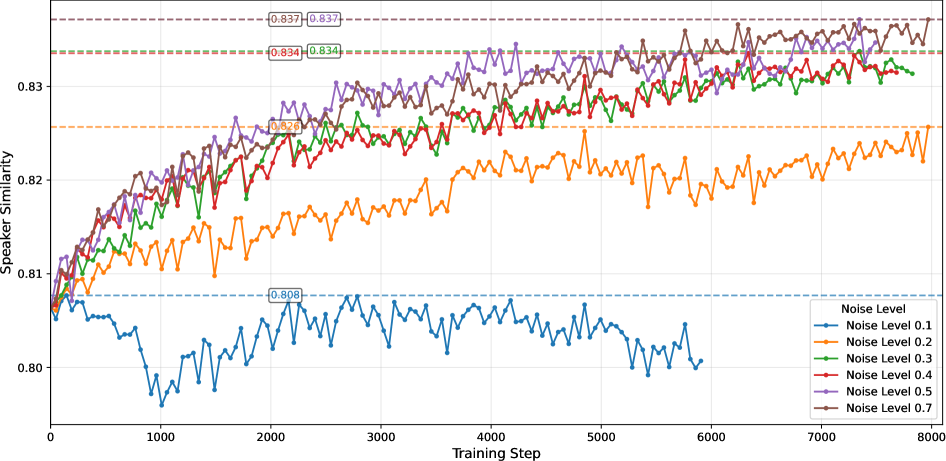
*Figure 8: Effect of different noise levels during RL training on the dev-easy set.*

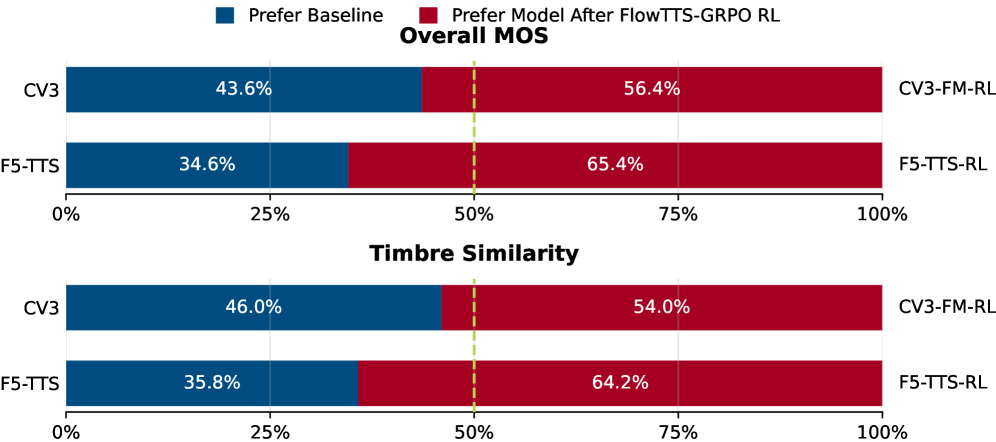
*Figure 9: Subjective A/B preference test between the baseline and our FlowTTS-GRPO model on the English subjective evaluation set.*

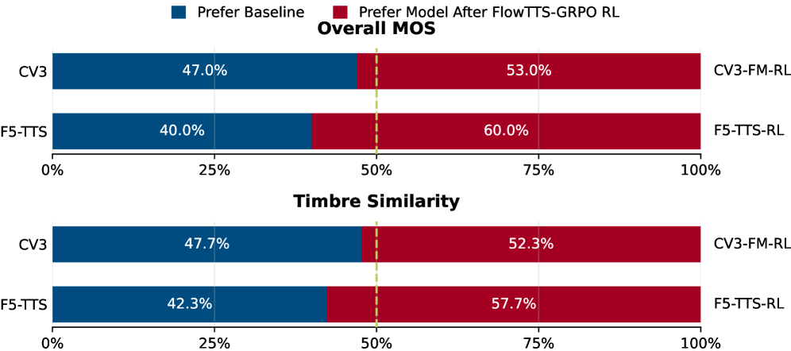
*Figure 10: Subjective A/B preference test between the baseline and our FlowTTS-GRPO model on the Chinese subjective evaluation set.*

---
**Usage Info**: 5247 tokens used.
**Generated at**: 2026-06-23 16:27:13

---

# 📚 Streaming T5-based Text-to-Speech Synthesis with Limited Lookahead

🚀 URL: https://arxiv.org/html/2606.21882

## 🌏 Abstract (원문)
Streaming text-to-speech synthesis in cascaded LLM-TTS systems still faces latency challenges as most TTS models require full context before initiating generation. We present S5-TTS, aStreaming variant of T5-TTSthat enables low-latency, word-by-word incremental speech synthesis through encoder-decoder language modeling and monotonic alignment learning. S5-TTS begins generating speech immediately after receiving the first few words, substantially reducing end-to-end response latency. To maintain quality under limited lookahead, we introduce a lookahead-causal masking mechanism with Conv-based auxiliary attention that preserves intelligibility and speaker similarity, and employ interleaved multi-source distillation to further restore naturalness. Experiments show that S5-TTS achieves comparable quality to full-context T5-TTS, supports zero-shot synthesis with high speaker similarity, and significantly reduces end-to-end latency for practical conversational AI systems.111Audio samples:https://s5-tts.github.io/
## 🌏 Abstract (번역)
계단식 LLM-TTS 시스템에서 스트리밍 텍스트 음성 변환(TTS) 합성은 대부분의 TTS 모델이 생성을 시작하기 전에 전체 컨텍스트를 필요로 하므로 여전히 지연 시간 문제에 직면해 있습니다. 본 논문에서는 인코더-디코더 언어 모델링과 단조 정렬 학습을 통해 저지연, 단어별 증분 음성 합성을 가능하게 하는 T5-TTS의 스트리밍 변형인 S5-TTS를 소개합니다. S5-TTS는 처음 몇 단어를 받은 직후 음성 생성을 시작하여 종단 간 응답 지연 시간을 크게 줄입니다. 제한된 미리보기(lookahead)에서 품질을 유지하기 위해, 우리는 명료도와 화자 유사성을 보존하는 Conv 기반 보조 어텐션을 갖춘 미리보기-인과 마스킹(lookahead-causal masking) 메커니즘을 도입하고, 자연스러움을 더욱 복원하기 위해 인터리브된 다중 소스 증류(interleaved multi-source distillation)를 사용합니다. 실험 결과 S5-TTS는 전체 컨텍스트 T5-TTS와 유사한 품질을 달성하고, 높은 화자 유사성으로 제로샷 합성을 지원하며, 실제 대화형 AI 시스템의 종단 간 지연 시간을 크게 줄이는 것으로 나타났습니다. 오디오 샘플: https://s5-tts.github.io/

## 🔍 Methods & Results
- S5-TTS는 T5 기반 아키텍처를 채택하며, 병렬 트랜스포머 인코더와 자기회귀 트랜스포머 디코더로 구성되어 있습니다.
- 인코더는 G2P 변환을 통해 얻은 음소 시퀀스를 입력으로 받고, 디코더는 이전 단계에서 예측된 K 코덱 토큰의 합을 소비하며 K개의 새로운 코덱 토큰을 공동으로 예측합니다.
- S5-TTS는 합성 중 참조 오디오에 조건화되며, 참조 오디오의 스크립트는 인코더 입력으로 대상 텍스트와 연결되고, 해당 코덱 프레임은 디코더에 프롬프트로 제공됩니다.
- S5-TTS의 인코더와 디코더는 단어 수준 스트리밍 방식으로 작동하며, 인코더는 현재 단어와 모든 선행 단어 및 k개의 미리보기 단어를 처리하고, 디코더는 현재 단어의 코덱 청크를 자기회귀적으로 생성합니다.
- 단어 경계는 각 디코딩 단계에서 모든 헤드의 평균 교차 어텐션 가중치를 모니터링하여 식별하며, 가장 많이 어텐션된 인코더 위치가 미리보기 영역으로 이동하면 단어 생성이 완료된 것으로 간주합니다.
- 인접한 파형 청크 간의 부드러운 전환을 위해 두 코덱 프레임의 오버랩을 적용하고 하닝 윈도우(Hanning window) 계수를 사용하여 크로스페이딩을 수행합니다.
- 제한된 미리보기 환경에서 S5-TTS가 작동하도록 인코더와 디코더에 미리보기-인과 마스크(lookahead-causal masks)를 적용하여 어텐션 범위를 현재, 선행, 그리고 k개의 미리보기 단어로 제한합니다.
- 디코더 마스크(M_dec) 구성을 위해 보조 어텐션 모듈을 사용하여 디코더 단계에서 해당 인코더 단계로의 매핑(phi(s))을 예측하며, 이 모듈은 CTC 손실을 사용하여 인코더-디코더 백본과 함께 공동으로 훈련됩니다.
- 전체 손실은 디코더 출력 로짓, 실제 코덱 프레임, 그리고 단조 정렬을 장려하기 위한 CTC 손실을 포함합니다.
- T5-TTS를 교사로, S5-TTS를 학생으로 하는 인터리브된 다중 소스 증류(IMSD) 전략을 채택하여 자연스러움을 개선하며, 쌍을 이룬 텍스트-오디오 데이터셋과 텍스트 전용 데이터셋 모두에서 증류를 수행하고, 텍스트 전용 데이터의 경우 ASR 필터를 통해 신뢰성을 높입니다.
- 증류 목표는 최종 디코더 은닉 상태에 대한 MSE 손실, 디코더 로짓에 대한 KL 발산 손실, 그리고 표준 교차 엔트로피(CE) 손실로 구성됩니다.

## 🖼 Figures
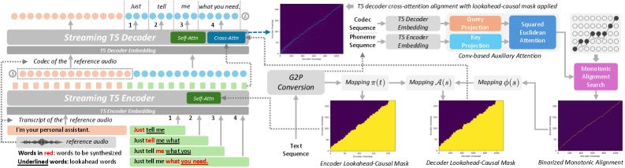
*Figure 1:(Left) The overall architecture of S5-TTS. (Right) Lookahead-Causal Masks and Conv-based Auxiliary Attention.*

---
**Usage Info**: 4428 tokens used.
**Generated at**: 2026-06-23 16:27:23

---

# 📚 Bagpiper-TTS: Natural Language Guided Universal Speech Synthesis

🚀 URL: https://arxiv.org/html/2606.22811

## 🌏 Abstract (원문)
Classical TTS systems typically rely on rigid input formats and predefined metadata slots, limiting their ability to fulfill flexible user requirements. This paper introduces Bagpiper-TTS, a universal speech synthesis system that deals with diverse natural language user requests. Given a natural language prompt, Bagpiper-TTS first reasons over the user's intent to derive arich caption, i.e., a comprehensive textual blueprint encompassing both transcription and nuanced metadata. Subsequently, this caption guides the synthesis of the target speech. Our model inherently supports a broad spectrum of tasks besides classical TTS applications, including multi-talker, intent-to-speech, role-play synthesis, singing voice synthesis, and more. Experimental results demonstrate that Bagpiper-TTS achieves an1.7%1.7\%Word Error Rate (WER) on the Seed-TTS-Eval benchmark and match the performance of dedicated models in both LLM-as-a-judge and human subjective evaluations across multiple applications.111Demo, code, data, and checkpoints are available at ourHomePage.
## 🌏 Abstract (번역)
기존의 TTS 시스템은 일반적으로 고정된 입력 형식과 미리 정의된 메타데이터 슬롯에 의존하여 유연한 사용자 요구 사항을 충족하는 데 한계가 있었습니다. 본 논문은 다양한 자연어 사용자 요청을 처리하는 범용 음성 합성 시스템인 Bagpiper-TTS를 소개합니다. 자연어 프롬프트가 주어지면, Bagpiper-TTS는 먼저 사용자의 의도를 추론하여 풍부한 캡션, 즉 전사(transcription)와 미묘한 메타데이터를 모두 포함하는 포괄적인 텍스트 청사진을 도출합니다. 이어서, 이 캡션은 목표 음성 합성을 안내합니다. 우리 모델은 고전적인 TTS 애플리케이션 외에도 다화자(multi-talker), 의도-음성(intent-to-speech), 역할극 합성, 노래 음성 합성 등 광범위한 작업을 본질적으로 지원합니다. 실험 결과에 따르면 Bagpiper-TTS는 Seed-TTS-Eval 벤치마크에서 1.7%의 단어 오류율(WER)을 달성했으며, 여러 애플리케이션에서 LLM-as-a-judge 및 인간 주관적 평가 모두에서 전용 모델의 성능과 일치함을 보여주었습니다. 데모, 코드, 데이터 및 체크포인트는 당사 홈페이지에서 확인할 수 있습니다.

## 🔍 Methods & Results
- Bagpiper-TTS는 다양한 자연어 사용자 요청을 처리하는 범용 음성 합성 시스템으로 제안되었습니다.
- 시스템은 자연어 프롬프트가 주어지면 사용자의 의도를 추론하여 전사 및 미묘한 메타데이터를 포함하는 '풍부한 캡션'을 생성하고, 이 캡션이 음성 합성을 안내합니다.
- Bagpiper-TTS는 다화자, 의도-음성, 역할극 합성, 노래 음성 합성 등 다양한 작업을 지원합니다.
- Seed-TTS-Eval 벤치마크에서 1.7%의 단어 오류율(WER)을 달성했습니다.
- LLM-as-a-judge 및 인간 주관적 평가에서 여러 애플리케이션에 걸쳐 전용 모델과 동등한 성능을 보였습니다.

## 🖼 Figures
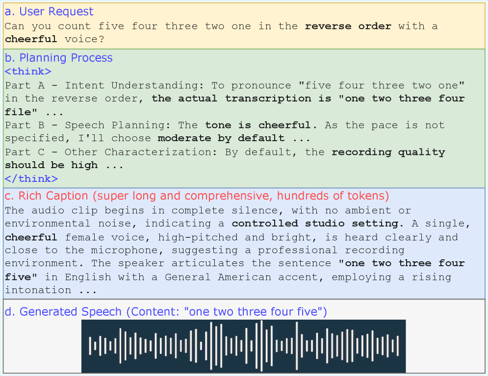
*Figure 1:The Planning-Caption-Generation Workflow of Bagpiper-TTS to address general-purpose text-to-speech request. Content is abbreviated.*

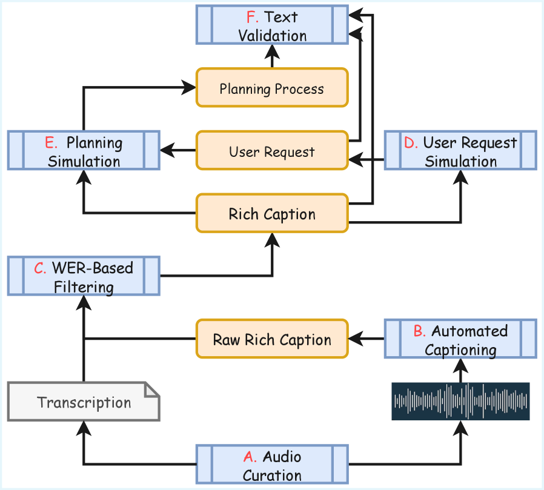
*Figure 2:Flowchart of fine-tuning data simulation pipeline*

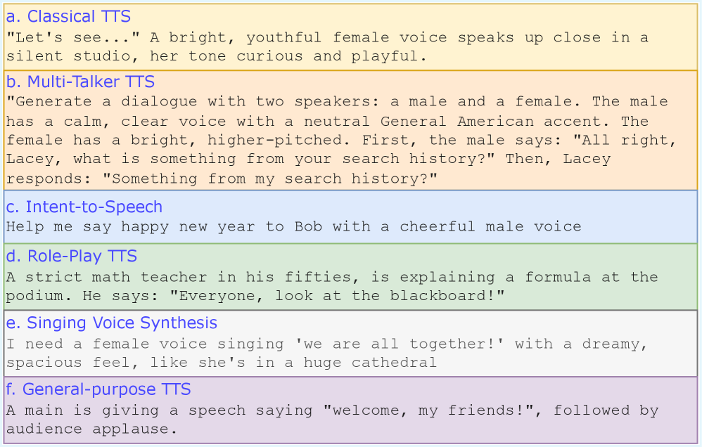
*Figure 3:Example user requests for each TTS application.*

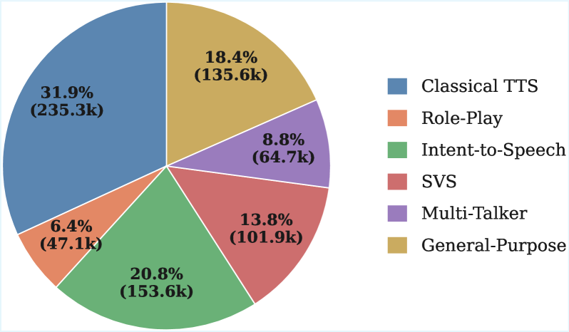
*Figure 4:Fine-tuning data distribution for all applications*

---
**Usage Info**: 1407 tokens used.
**Generated at**: 2026-06-23 16:27:29

---

# 📚 AudioCALM: Continuous Autoregressive Language Modeling for Universal Audio Generation

🚀 URL: https://arxiv.org/html/2606.23080

## 🌏 Abstract (원문)
Unifying speech, sound, and music generation in one model is hindered by tradeoffs between fidelity, end-to-end training, in-context conditioning, and variable-length synthesis that no current paradigm fully resolves. To address this challenge, we presentAudioCALM, a universal audio generation framework that extends autoregressive (AR) next-token prediction from discrete tokens to continuous audio latents: a thin flow-matching head replaces the softmax to predict rectified-flow velocities at each position, and a block-causal AR-Flow attention pattern produces arbitrary-length output. Joint training of multiple audio generation tasks faces an asymmetric text–audio mismatch: speech transcripts align to specific time spans and demandtight, time-alignedattention, whereas sound and music captions describe only overall semantics and rely ondiffuse, holisticattention; mixing the two disproportionately degrades sound and music generation. We address this asymmetry at two levels: adata reformulationstrategy that unifies all three tasks under a single description-style conditioning interface, and a novel architectureAsymmetric Mixture-of-Modality-Experts (A-MoME), which adds a dedicated residual expert for speech while sound and music share the backbone, incurring no inference overhead on non-speech inputs. Experimental results demonstrate that AudioCALM matches modality-specific state-of-the-art and outperforms prior unified baselines on speech, sound, and music generation benchmarks. The project page is athttps://AudioCALM-Project.github.io.
## 🌏 Abstract (번역)
단일 모델에서 음성, 소리, 음악 생성을 통합하는 것은 충실도, 종단 간 훈련, 인컨텍스트 조건화, 가변 길이 합성 간의 절충으로 인해 방해받으며, 현재 어떤 패러다임도 이를 완전히 해결하지 못하고 있습니다. 이 문제를 해결하기 위해 우리는 자기회귀(AR) 다음 토큰 예측을 이산 토큰에서 연속 오디오 잠재 공간으로 확장하는 범용 오디오 생성 프레임워크인 AudioCALM을 제시합니다. 이 프레임워크는 소프트맥스를 얇은 플로우 매칭 헤드로 대체하여 각 위치에서 정류 플로우 속도를 예측하고, 블록 인과 AR-플로우 어텐션 패턴을 사용하여 임의 길이 출력을 생성합니다. 여러 오디오 생성 작업을 공동으로 훈련하는 것은 비대칭적인 텍스트-오디오 불일치에 직면합니다. 즉, 음성 전사는 특정 시간 범위에 정렬되어 엄격하고 시간 정렬된 어텐션을 요구하는 반면, 소리 및 음악 캡션은 전체적인 의미만을 설명하고 확산적이고 전체론적인 어텐션에 의존합니다. 이 둘을 혼합하면 소리 및 음악 생성이 불균형적으로 저하됩니다. 우리는 이 비대칭성을 두 가지 수준에서 해결합니다. 첫째, 세 가지 작업을 단일 설명 스타일 조건화 인터페이스로 통합하는 데이터 재구성 전략, 둘째, 음성을 위한 전용 잔여 전문가를 추가하고 소리와 음악은 백본을 공유하며 비음성 입력에 대한 추론 오버헤드가 발생하지 않는 새로운 아키텍처인 비대칭 모달리티 전문가 혼합(A-MoME)입니다. 실험 결과는 AudioCALM이 음성, 소리, 음악 생성 벤치마크에서 모달리티별 최첨단 성능과 일치하며 이전 통합 기준선보다 우수함을 보여줍니다. 프로젝트 페이지는 https://AudioCALM-Project.github.io 입니다.

## 🔍 Methods & Results
- AudioCALM은 이산 토큰에서 연속 오디오 잠재 공간으로 자기회귀(AR) 다음 토큰 예측을 확장하는 범용 오디오 생성 프레임워크를 제안합니다.
- 소프트맥스 대신 얇은 플로우 매칭 헤드를 사용하여 각 위치에서 정류 플로우 속도를 예측하고, 블록 인과 AR-플로우 어텐션 패턴을 통해 임의 길이 출력을 생성합니다.
- 음성 전사(시간 정렬 어텐션)와 소리/음악 캡션(전체론적 어텐션) 간의 비대칭적인 텍스트-오디오 불일치를 해결하기 위해 두 가지 전략을 사용합니다.
- 첫째, 모든 오디오 생성 작업을 단일 설명 스타일 조건화 인터페이스로 통합하는 데이터 재구성 전략을 적용합니다.
- 둘째, 음성을 위한 전용 잔여 전문가를 추가하고 소리와 음악은 백본을 공유하는 새로운 아키텍처인 비대칭 모달리티 전문가 혼합(A-MoME)을 도입하여 비음성 입력에 대한 추론 오버헤드를 발생시키지 않습니다.
- 실험 결과, AudioCALM은 음성, 소리, 음악 생성 벤치마크에서 각 모달리티별 최첨단 성능과 동등하며 기존 통합 기준선보다 우수한 성능을 달성했습니다.

## 🖼 Figures
![Figure 1:Overview of AudioCALM. Left: a causal Transformer autoregresses over fixed-size blocks of continuous audio latents; a flow-matching head and a stop head are attached to its hidden states (top), and each block is produced by iterative denoising with KV-cache reuse (bottom). Top right: the block-causal AR-Flow attention mask, causal across blocks and bidirectional within the active noisy block (red). Bottom right: the Asymmetric Mixture-of-Modality-Experts layer, in which a deterministically routed speech-only FFN is added to the shared backbone.](../images/2026-06-23/2606.23080/2606.23080_fig0.png)
*Figure 1:Overview of AudioCALM. Left: a causal Transformer autoregresses over fixed-size blocks of continuous audio latents; a flow-matching head and a stop head are attached to its hidden states (top), and each block is produced by iterative denoising with KV-cache reuse (bottom). Top right: the block-causal AR-Flow attention mask, causal across blocks and bidirectional within the active noisy block (red). Bottom right: the Asymmetric Mixture-of-Modality-Experts layer, in which a deterministically routed speech-only FFN is added to the shared backbone.*

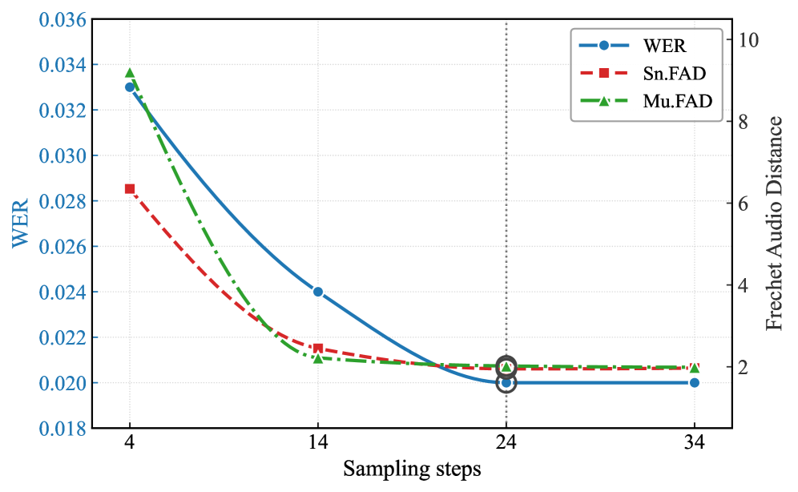
*Figure 2:Inference-step sweep.*

---
**Usage Info**: 1936 tokens used.
**Generated at**: 2026-06-23 16:27:38

---

# 📚 ProsoCodec: Prosody-Oriented Speech Codec for Voice Conversion

🚀 URL: https://arxiv.org/html/2606.21888

## 🌏 Abstract (원문)
Neural speech codecs efficiently compress speech and have become a foundation for speech generation, but they are typically learned as holistic representations that intertwine linguistic content, speaker identity, and prosody. While this design is effective for zero-shot voice cloning, it hinders downstream tasks that require prosody preservation or transfer, such as voice conversion. To address this, we introduce ProsoCodec, a prosody-oriented speech codec that models prosody as a conditional residual rather than as a disentangled stream. Specifically, by conditioning both the encoder and decoder on text and speaker embeddings as prefix tokens, the discrete bottleneck is encouraged to capture prosodic variation not explained by content and speaker. To further preserve prosody, we use the low-frequency mel band and train the model on paired same-speaker utterances. Experiments on voice conversion show improved prosody preservation and reduced source-timbre leakage.
## 🌏 Abstract (번역)
신경망 음성 코덱은 음성을 효율적으로 압축하며 음성 생성의 기반이 되었지만, 일반적으로 언어적 내용, 화자 정체성, 운율을 얽어매는 전체론적 표현으로 학습됩니다. 이러한 설계는 제로샷 음성 복제에는 효과적이지만, 음성 변환과 같이 운율 보존 또는 전송이 필요한 후속 작업에는 방해가 됩니다. 이를 해결하기 위해 우리는 운율을 분리된 스트림이 아닌 조건부 잔여물로 모델링하는 운율 지향 음성 코덱인 ProsoCodec을 소개합니다. 구체적으로, 인코더와 디코더 모두에 텍스트 및 화자 임베딩을 접두사 토큰으로 조건화함으로써, 이산 병목 현상은 내용과 화자로 설명되지 않는 운율 변화를 포착하도록 유도됩니다. 운율을 더욱 보존하기 위해 우리는 저주파 멜 대역을 사용하고 동일 화자 쌍 발화로 모델을 훈련합니다. 음성 변환 실험 결과 운율 보존이 향상되고 원본 음색 누출이 감소했습니다.

## 🔍 Methods & Results
- ProsoCodec은 음성 변환을 목표로 하며, 원본 발화의 언어적 내용과 운율 스타일을 보존하면서 참조 발화의 화자 음색을 채택하는 음성을 생성합니다.
- 모델은 인코더와 디코더 모두에 텍스트 임베딩(ASR 모델에서 얻은 전사 기반)과 화자 임베딩(사전 훈련된 SV 모델에서 추출)을 접두사 토큰으로 조건화하여 이산 병목 현상이 내용 및 화자 정보 외의 운율 변화를 포착하도록 유도합니다.
- 인코더는 Transformer 기반으로, 멜 스펙트로그램을 화자 및 텍스트 임베딩과 연결하여 처리하며, 이산 병목 현상을 위해 이진 구형 양자화(BSQ)를 사용하여 운율 스타일 정보를 유지하도록 강제합니다.
- 디코더는 Diffusion Transformer(DiT) 기반의 확산 모델로, 양자화된 토큰과 노이즈가 추가된 멜 스펙트로그램을 사용하여 고충실도 멜 스펙트로그램을 재구성하며, 조건부 흐름 일치 손실로 최적화됩니다.
- 운율 보존을 위해 '이중 발화 훈련 전략'을 도입하여 동일 화자의 쌍 발화를 프롬프트와 소스로 사용하여 프롬프트 스타일 누출을 방지하고 원본 운율 보존을 개선합니다.
- 운율 단서가 주로 저주파 영역에 존재한다는 점을 활용하여, 인코더에는 저주파 멜 대역만 입력하여 토큰이 운율에 편향되도록 하고, 디코더의 프롬프트에는 전체 대역 멜 스펙트로그램을 사용하여 화자 특성을 제공합니다.
- 음성 변환 실험 결과, ProsoCodec은 향상된 운율 보존 능력과 원본 음색 누출 감소를 보여주었습니다.

## 🖼 Figures
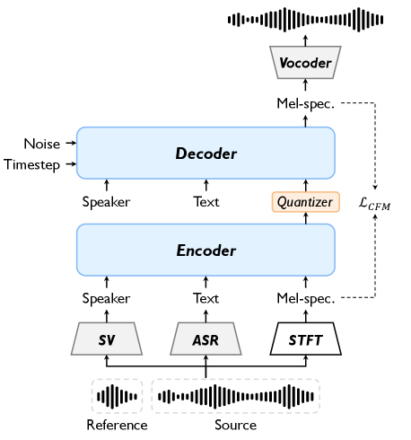
*Figure 1:Model architecture of ProsoCodec. Reference and source are from the same speaker during training and different speakers during inference. The decoder receives a clean reference and a noisy source mel-spectrogram.*

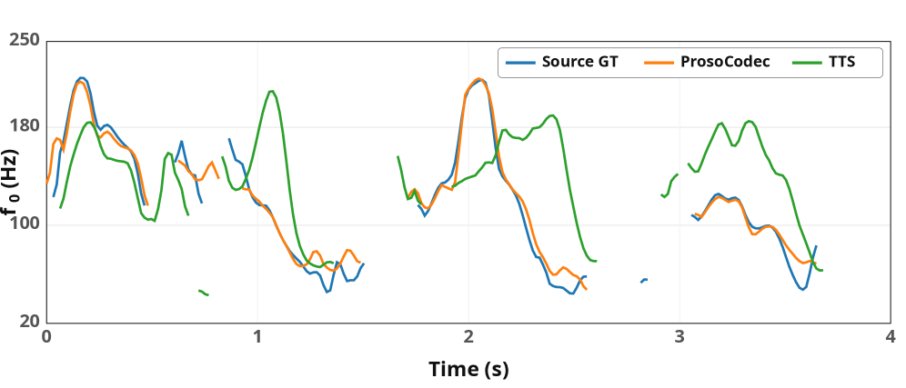
*Figure 2:Pitch contour of resynthesis result of ProsoCodec along with source speech and zero-shot TTS output.*

---
**Usage Info**: 3441 tokens used.
**Generated at**: 2026-06-23 16:27:46

---

# 📚 SDP-Codec: A Speaker-Decoupled Speech Codec with Pitch Injection for Low-Bitrate Coding and Zero-Shot Voice Conversion

🚀 URL: https://arxiv.org/html/2606.21157

## 🌏 Abstract (원문)
Speaker-decoupled speech codecs can reduce bitrate by separating global speaker attributes from local content and prosody, while supporting voice conversion. Existing speaker-decoupled codecs face a trade-off: methods that explicitly suppress speaker leakage often rely on multi-stage or auxiliary training, whereas simpler designs can leave residual speaker information in local tokens. We propose SDP-Codec, a speaker-decoupled, pitch-injected codec trained with a single-stage optimization pipeline. SDP-Codec derives local tokens from continuous pre-quantization features of a pretrained self-supervised encoder and injects normalized F0 via a pitch encoder-decoder with global-conditioned denormalization and soft-label pitch reconstruction objective. Across 16 kHz and 24 kHz settings, SDP-Codec achieves competitive reconstruction and strong zero-shot voice conversion at comparable bitrates, with the lowest speaker-probing accuracy among compared systems, suggesting reduced speaker leakage.111Source code and demo: github.com/hanshounsu/sdpcodec-open/
## 🌏 Abstract (번역)
화자 분리형 음성 코덱은 전역 화자 속성을 지역 콘텐츠 및 운율에서 분리하여 비트레이트를 줄일 수 있으며, 음성 변환을 지원합니다. 기존의 화자 분리형 코덱은 트레이드오프에 직면합니다: 화자 누출을 명시적으로 억제하는 방법은 종종 다단계 또는 보조 학습에 의존하는 반면, 더 간단한 설계는 지역 토큰에 잔여 화자 정보를 남길 수 있습니다. 우리는 단일 단계 최적화 파이프라인으로 학습되는 화자 분리형, 피치 주입형 코덱인 SDP-Codec을 제안합니다. SDP-Codec은 사전 학습된 자기 지도 인코더의 연속적인 양자화 전 특징으로부터 지역 토큰을 도출하고, 전역 조건부 역정규화 및 소프트 레이블 피치 재구성 목표를 가진 피치 인코더-디코더를 통해 정규화된 F0를 주입합니다. 16kHz 및 24kHz 설정에서 SDP-Codec은 비교 시스템 중 가장 낮은 화자 탐지 정확도를 보여 화자 누출이 감소했음을 시사하며, 유사한 비트레이트에서 경쟁력 있는 재구성 성능과 강력한 제로샷 음성 변환을 달성합니다.

## 🔍 Methods & Results
- SDP-Codec은 로컬 브랜치와 글로벌 브랜치로 구성되며, vq-wav2vec 인코더, WavLM 특징 추출기, FCPE 피치 추출기 등 모든 사전 학습된 구성 요소는 학습 중 고정됩니다.
- 로컬 브랜치는 콘텐츠 인코더와 피치 인코더의 출력을 융합하고, 단일 코드북(300 또는 1,536개 엔트리)으로 공동 양자화하여 정보 병목 현상을 유도하며, 토큰 스트림을 파형 및 F0로 디코딩합니다.
- 콘텐츠 인코더는 사전 학습된 vq-wav2vec의 연속적인 양자화 전 특징을 사용하여 풍부한 콘텐츠 세부 정보를 유지하며, 잔여 CNN 블록으로 구성된 포스트 인코더를 통해 특징을 다운샘플링합니다.
- 피치 인코더는 프레임별 log-F0 윤곽을 추출하고, 화자 독립적인 피치 범위를 제거하기 위해 세그먼트별 평균-분산 정규화를 적용한 후, 정규화된 F0를 인코딩합니다.
- 피치 디코더는 360개 빈의 센트 히스토그램을 예측하여 F0를 재구성하며, 전역 화자 임베딩에 조건화되어 log-F0 윤곽의 평균과 분산을 복구합니다. 또한, 피치 디코더의 은닉 상태는 각 레이어에서 파형 디코더의 은닉 상태와 연결되어 재구성된 파형에서 F0를 강화합니다.
- 글로벌 브랜치는 WavLM 특징을 추출하고, 퍼시버 리샘플러를 통해 고정 길이의 시간 불변 임베딩으로 압축하며, 이 임베딩을 위치 불가지론적 교차 어텐션을 통해 파형 및 피치 디코더에 제공하여 화자 정체성만 모델링하도록 유도합니다.
- 학습 목표는 다중 스케일 멜-스펙트로그램 L1 손실, 공동 콘텐츠-F0 코드북에 대한 커밋먼트 손실, LSGAN을 사용한 적대적 손실 및 L1 특징 매칭 손실, 그리고 소프트 레이블 피치 재구성 손실(360개 빈 센트 히스토그램 예측 및 가우시안 블러링된 원-핫 소프트 타겟 간의 이진 교차 엔트로피)로 구성됩니다.
- SDP-Codec은 16kHz 및 24kHz 설정에서 유사한 비트레이트로 경쟁력 있는 재구성 성능과 강력한 제로샷 음성 변환을 달성했으며, 비교 시스템 중 가장 낮은 화자 탐지 정확도를 보여 화자 누출이 감소했음을 시사합니다.

## 🖼 Figures
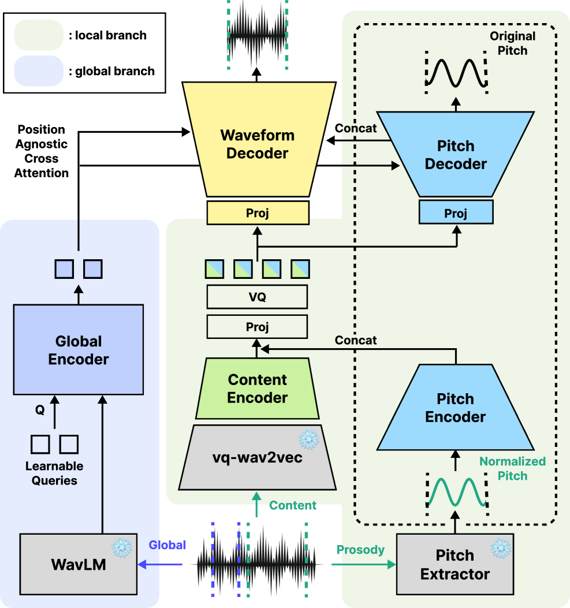
*Figure 1:SDP-Codec model architecture.*

---
**Usage Info**: 4533 tokens used.
**Generated at**: 2026-06-23 16:28:00

---

# 📚 EmoInstruct-TTS: Dual-Path Instruction-Guided Emotional Speech Synthesis

🚀 URL: https://arxiv.org/html/2606.20650

## 🌏 Abstract (원문)
Instruction-based controllable speech synthesis enables users to specify emotions through natural language. However, existing approaches often rely on coarse emotion labels and lack explicit modeling of fine-grained intensity. We propose EmoInstruct-TTS, a dual-path instruction-guided framework for emotional speech synthesis. We introduce Emotion2embed, a supervised semantic-acoustic emotion embedding covering 48 emotional states, including fine-grained categories and intensity levels. To infer embeddings from free-form instructions, we design an Instruction-Conditioned Emotion Flow Model (ICE-Flow) that generates acoustically grounded emotion representations. The inferred embeddings are integrated into an LLM-based synthesis pipeline to provide explicit emotional control while preserving semantic planning. Experiments show improved emotional controllability and speech naturalness over strong baselines.11footnotetext:Audio demos are available athttps://huanyu-lab.github.io/EMOINSTRUCT-TTS
## 🌏 Abstract (번역)
명령 기반 제어 가능한 음성 합성은 사용자가 자연어를 통해 감정을 지정할 수 있도록 합니다. 그러나 기존 접근 방식은 종종 거친 감정 레이블에 의존하며 미세한 강도에 대한 명시적인 모델링이 부족합니다. 우리는 감정 음성 합성을 위한 이중 경로 명령 기반 프레임워크인 EmoInstruct-TTS를 제안합니다. 우리는 미세한 범주와 강도 수준을 포함하여 48가지 감정 상태를 포괄하는 지도 학습 기반의 의미-음향 감정 임베딩인 Emotion2embed를 소개합니다. 자유 형식 명령으로부터 임베딩을 추론하기 위해, 우리는 음향적으로 기반을 둔 감정 표현을 생성하는 명령 조건부 감정 흐름 모델(ICE-Flow)을 설계합니다. 추론된 임베딩은 의미론적 계획을 유지하면서 명시적인 감정 제어를 제공하기 위해 LLM 기반 합성 파이프라인에 통합됩니다. 실험 결과 강력한 기준선 대비 향상된 감정 제어 가능성과 음성 자연스러움을 보여주었습니다.

## 🔍 Methods & Results
- EmoInstruct-TTS는 감정 음성 합성을 위한 이중 경로 명령 기반 프레임워크로, 명령 조건부 감정 생성기, LLM 기반 의미 인코더, 화자 조건부 TTS 디코더 및 뉴럴 보코더로 구성되어 의미론적 계획과 감정별 음향 제어를 분리합니다.
- Emotion2embed는 미세한 감정 모델링을 위한 지도 학습 기반의 의미-음향 감정 임베딩으로, 48가지 감정 상태(미세 범주 및 강도 수준 포함)를 포괄하며, 감정 범주와 순서 있는 강도 구조를 인코딩하고 화자 불변성을 유지합니다. 이는 감정 분류, 강도 분류 및 순서 있는 강도 제약 조건을 결합한 다중 작업 목표로 훈련됩니다.
- ICE-Flow (Instruction-Conditioned Emotion Flow Model)는 자연어 명령으로부터 음향적으로 기반을 둔 감정 표현을 생성하는 모델로, 명령의 의미론을 Emotion2embed 표현으로 매핑합니다. 훈련 중에는 실제 감정 음성에서 추출된 샘플 수준 Emotion2embed 타겟으로 감독되며, 모드 붕괴를 방지하기 위해 샘플링된 임베딩의 공분산을 실제 감정 임베딩과 정렬하는 분포 수준 정규화를 사용합니다.
- 합성 파이프라인은 명령 정보를 언어적 실현을 위한 의미론적 안내와 음향 변조를 위한 명시적 감정 임베딩으로 분해합니다. ICE-Flow를 통해 생성된 감정 임베딩과 LLM이 생성한 의미 토큰, 화자 임베딩이 결합되어 멜 스펙트로그램을 생성하고, 이를 뉴럴 보코더(BigVGAN)가 최종 음성 파형으로 변환합니다.
- 실험 결과, EmoInstruct-TTS는 강력한 기준선 대비 향상된 감정 제어 가능성과 음성 자연스러움을 보여주었습니다.

## 🖼 Figures
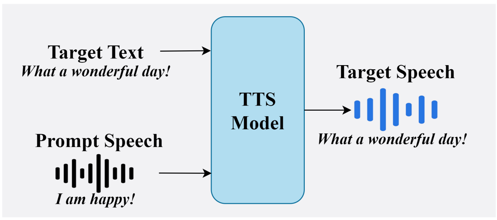
*Figure 1:Comparison between previous and proposed emotional speech synthesis frameworks.*

*Figure 2:The dual-path instruction-guided synthesis pipeline of EmoInstruct-TTS. (a) Training process for acquiring the Emotion2embed representation. (b) Generation of Emotion2embed via the ICE-Flow model. (c) Overview of the EmoInstruct-TTS synthesis system.*

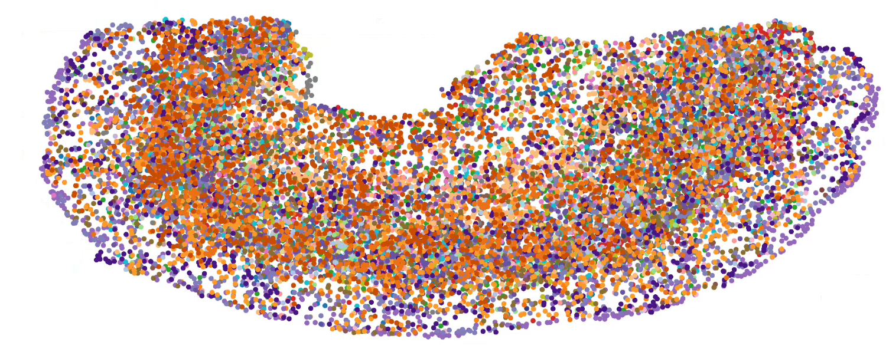
*Figure 3:The representation performance of emoition2vec, emoition2embed, and ICE-Flow emoition2embed.*

---
**Usage Info**: 3784 tokens used.
**Generated at**: 2026-06-23 16:28:13

---

# 📚 DisSpeech: Low-Resource Controllable Mandarin Stuttered Speech Synthesis for ASR Augmentation

🚀 URL: https://arxiv.org/html/2606.21457

## 🌏 Abstract (원문)
Stuttered speech recognition remains challenging, with disfluencies such as repetitions, prolongations, and blocks disrupting speech continuity and acoustic patterns. This problem is further aggravated in Mandarin scenarios by the limited availability of stuttered speech data, which makes it difficult to train robust ASR models for diverse disfluency patterns. To address this problem, this paper proposes DisSpeech, a discrete speech token-based framework for low-resource controllable Mandarin stuttered speech synthesis and ASR data augmentation. The proposed framework introduces explicit stuttering event labels to control different disfluency patterns. Text and stuttering event labels are mapped into semantic speech tokens by a non-autoregressive masked generative Transformer, followed by prosody-aware acoustic reconstruction with explicit pitch and energy modeling. With fine-tuning using less than 50 hours of Mandarin stuttered speech, DisSpeech can generate controllable stuttered speech with competitive speech quality. Experimental results show that the proposed method outperforms previous stuttered speech synthesis methods in both speech quality and event controllability. Furthermore, the synthesized stuttered speech effectively improves multiple ASR models, with Qwen3-ASR-0.6B achieving a state-of-the-art CER of 4.19% on the evaluated Mandarin stuttered speech recognition task, while causing only slight degradation on fluent speech.
## 🌏 Abstract (번역)
더듬거리는 음성 인식은 반복, 연장, 막힘과 같은 비유창성(disfluencies)이 음성 연속성과 음향 패턴을 방해하여 여전히 어려운 과제입니다. 이 문제는 만다린어 환경에서 더듬거리는 음성 데이터의 가용성이 제한적이어서 다양한 비유창성 패턴에 대한 견고한 ASR 모델 훈련을 어렵게 함으로써 더욱 심화됩니다. 이 문제를 해결하기 위해 본 논문은 저자원 제어 가능한 만다린어 더듬거리는 음성 합성 및 ASR 데이터 증강을 위한 이산 음성 토큰 기반 프레임워크인 DisSpeech를 제안합니다. 제안된 프레임워크는 다양한 비유창성 패턴을 제어하기 위해 명시적인 더듬거림 이벤트 레이블을 도입합니다. 텍스트와 더듬거림 이벤트 레이블은 비자기회귀 마스크 생성 트랜스포머에 의해 의미론적 음성 토큰으로 매핑되며, 이어서 명시적인 피치 및 에너지 모델링을 통한 운율 인식 음향 재구성이 이루어집니다. 50시간 미만의 만다린어 더듬거리는 음성 데이터를 사용하여 미세 조정함으로써, DisSpeech는 경쟁력 있는 음성 품질로 제어 가능한 더듬거리는 음성을 생성할 수 있습니다. 실험 결과는 제안된 방법이 음성 품질과 이벤트 제어 가능성 모두에서 이전의 더듬거리는 음성 합성 방법을 능가함을 보여줍니다. 또한, 합성된 더듬거리는 음성은 여러 ASR 모델을 효과적으로 개선하여, Qwen3-ASR-0.6B가 평가된 만다린어 더듬거리는 음성 인식 작업에서 4.19%의 최첨단 CER을 달성했으며, 유창한 음성에서는 약간의 성능 저하만을 유발했습니다.

## 🔍 Methods & Results
- DisSpeech는 텍스트 입력과 명시적인 더듬거림 이벤트 레이블(반복, 연장, 막힘)로부터 지정된 더듬거림 이벤트를 포함하는 자연스럽고 이해하기 쉬운 음성을 생성하는 이산 음성 토큰 기반 프레임워크이다.
- 프레임워크는 의미론적 음성 토크나이저, 텍스트-의미론적(T2S) 모델, 음성 토큰 디코더, 신경 보코더의 네 가지 주요 구성 요소로 이루어져 있다.
- 의미론적 음성 토크나이저로는 SpeechTokenizer[12]를 사용하여 의미론적 표현과 음향 재구성 능력의 균형을 맞춘다.
- T2S 모델은 기존의 자기회귀(AR) 방식 대신 비자기회귀 마스크 생성 트랜스포머(MaskGCT[11]에서 영감)를 사용하여 더듬거리는 음성의 복잡한 시간 구조에서 발생하는 오류 누적 문제를 해결한다.
- 음성 토큰 디코더는 생성된 의미론적 표현으로부터 멜-스펙트로그램과 같은 음향 특징을 직접 재구성하며, 더듬거림 관련 운율을 모델링하기 위해 명시적인 피치 및 에너지 예측 모듈을 통합한다.
- HiFi-GAN[14] 보코더는 예측된 음향 특징을 최종 음성 파형으로 변환한다.
- DisSpeech는 50시간 미만의 만다린어 더듬거리는 음성으로 미세 조정하여 경쟁력 있는 음성 품질로 제어 가능한 더듬거리는 음성을 생성할 수 있다.
- 제안된 방법은 음성 품질과 이벤트 제어 가능성 모두에서 이전의 더듬거리는 음성 합성 방법을 능가한다.
- 합성된 더듬거리는 음성은 여러 ASR 모델의 성능을 효과적으로 개선했으며, Qwen3-ASR-0.6B는 만다린어 더듬거리는 음성 인식 작업에서 4.19%의 최첨단 CER을 달성했다.

## 🖼 Figures
![Figure 1:Task formulation of Mandarin stuttered speech synthesis. (a) The objective of the task is to generate stuttered speech containing controllable disfluency events from textual input. (b) Conventional approaches typically synthesize speech by directly predicting continuous acoustic features such as mel-spectrograms from text. (c) The proposed framework adopts a LLM-based discrete semantic unit synthesis paradigm with explicit stuttering event modeling for controllable stuttered speech generation.](../images/2026-06-23/2606.21457/2606.21457_fig0.png)
*Figure 1:Task formulation of Mandarin stuttered speech synthesis. (a) The objective of the task is to generate stuttered speech containing controllable disfluency events from textual input. (b) Conventional approaches typically synthesize speech by directly predicting continuous acoustic features such as mel-spectrograms from text. (c) The proposed framework adopts a LLM-based discrete semantic unit synthesis paradigm with explicit stuttering event modeling for controllable stuttered speech generation.*

*Figure 2:Overview of the proposed Mandarin stuttered speech synthesis framework. The framework first converts speech signals into discrete semantic speech tokens through a semantic tokenizer. A non-autoregressive masked generative Transformer text-to-semantic (T2S) model then predicts semantic token sequences from text and explicit stuttering event labels. Finally, a prosody-aware speech token decoder and a HiFi-GAN vocoder are employed to reconstruct the final stuttered speech waveform.*

![Figure 3:Illustration of the non-autoregressive masked generative Transformer used for the text-to-semantic (T2S) model. (a) During training, text tokens, stuttering event tokens, prompt semantic tokens, and masked target semantic tokens are concatenated as the model input. The model predicts semantic tokens for all positions in parallel, and the loss is computed only on the target semantic token positions. (b) During inference, all target positions are initially masked. The model predicts all positions in parallel, and a confidence-based iterative refinement strategy is applied to progressively update low-confidence positions until all tokens are determined. This process is non-autoregressive.](../images/2026-06-23/2606.21457/2606.21457_fig2.png)
*Figure 3:Illustration of the non-autoregressive masked generative Transformer used for the text-to-semantic (T2S) model. (a) During training, text tokens, stuttering event tokens, prompt semantic tokens, and masked target semantic tokens are concatenated as the model input. The model predicts semantic tokens for all positions in parallel, and the loss is computed only on the target semantic token positions. (b) During inference, all target positions are initially masked. The model predicts all positions in parallel, and a confidence-based iterative refinement strategy is applied to progressively update low-confidence positions until all tokens are determined. This process is non-autoregressive.*

*(a)*

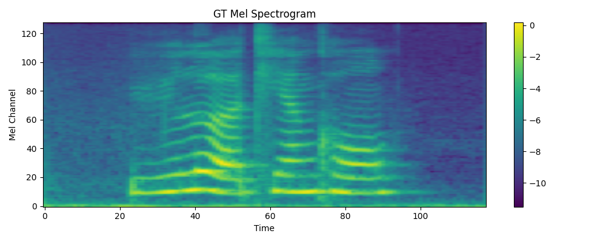
*(a)*

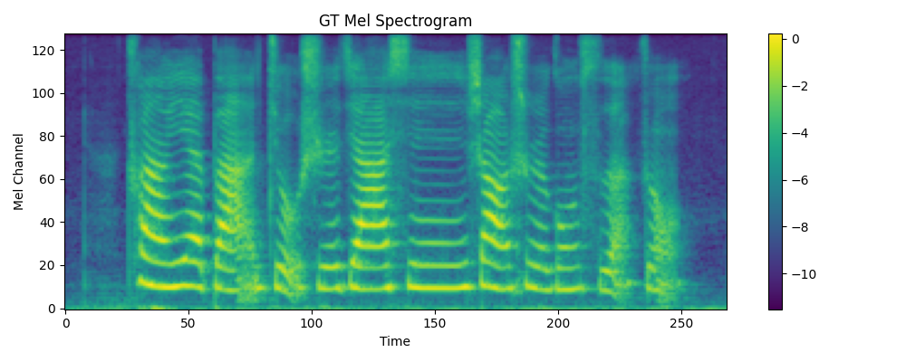
*(b)*

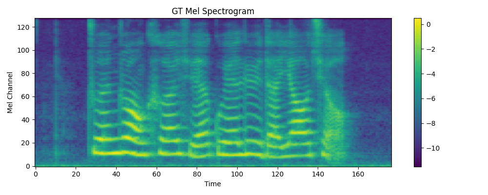
*(c)*

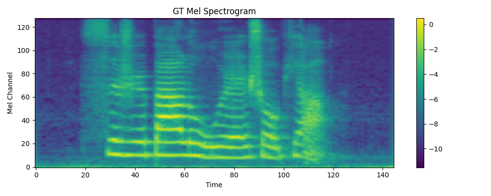
*(d)*

---
**Usage Info**: 4758 tokens used.
**Generated at**: 2026-06-23 16:28:28

---

# 📚 AugCodec: A Low-Bitrate Disentangled Neural Speech Codec via Data Augmentation

🚀 URL: https://arxiv.org/html/2606.21893

## 🌏 Abstract (원문)
We propose AugCodec, a low-bitrate disentangled neural speech codec that leverages data augmentation to decompose speech into three distinct components: semantic, speaker, and prosody tokens. Specifically, we employ tailored augmentation strategies to transform speech into distinct variants, each serving as input for extracting tokens that preserve the target attribute while suppressing others. This disentanglement strategy enables substantial reduction in token rate. Furthermore, we introduce an augmentation loss that aligns semantic encoder outputs between source and voice-converted speech, encouraging speaker-agnostic embeddings while mitigating the acoustic mismatch induced by voice conversion. Experiments on LibriSpeech test-clean demonstrate that AugCodec significantly outperforms state-of-the-art methods in both reconstruction quality and disentanglement, while operating at only12.5Hz with three token streams.
## 🌏 Abstract (번역)
저희는 음성을 의미, 화자, 운율 토큰의 세 가지 개별 구성 요소로 분해하기 위해 데이터 증강을 활용하는 저비트레이트 분리형 신경 음성 코덱인 AugCodec을 제안합니다. 구체적으로, 우리는 음성을 개별 변형으로 변환하기 위해 맞춤형 증강 전략을 사용하며, 각 변형은 다른 속성을 억제하면서 목표 속성을 보존하는 토큰을 추출하기 위한 입력으로 사용됩니다. 이러한 분리 전략은 토큰 속도를 크게 줄일 수 있게 합니다. 또한, 우리는 원본 음성과 음성 변환된 음성 간의 의미 인코더 출력을 정렬하는 증강 손실을 도입하여, 화자 불변 임베딩을 장려하고 음성 변환으로 인한 음향 불일치를 완화합니다. LibriSpeech test-clean에 대한 실험은 AugCodec이 재구성 품질과 분리도 면에서 최첨단 방법을 크게 능가하며, 세 개의 토큰 스트림으로 단 12.5Hz에서 작동함을 보여줍니다.

## 🔍 Methods & Results
- AugCodec은 데이터 증강을 활용하여 음성을 의미, 화자, 운율 토큰의 세 가지 개별 구성 요소로 분해하는 저비트레이트 분리형 신경 음성 코덱입니다.
- 맞춤형 증강 전략을 사용하여 음성을 여러 변형으로 변환하며, 각 변형은 특정 속성을 보존하고 다른 속성을 억제하는 토큰을 추출하는 데 사용됩니다.
- 이러한 분리 전략은 토큰 속도를 크게 줄이는 효과를 가져옵니다.
- 원본 음성과 음성 변환된 음성 간의 의미 인코더 출력을 정렬하는 증강 손실을 도입하여 화자 불변 임베딩을 장려하고 음성 변환으로 인한 음향 불일치를 완화합니다.
- LibriSpeech test-clean 실험 결과, AugCodec은 재구성 품질과 분리도 면에서 최첨단 방법을 크게 능가했습니다.
- AugCodec은 세 개의 토큰 스트림으로 단 12.5Hz에서 작동합니다.

## 🖼 Figures
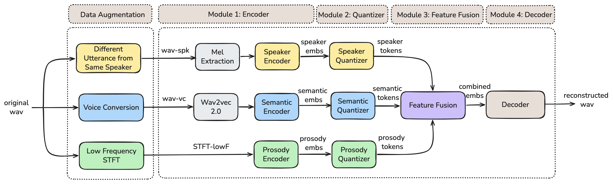
*Figure 1:System overview of AugCodec during training.*

---
**Usage Info**: 1283 tokens used.
**Generated at**: 2026-06-23 16:28:34

---

# 📚 UnityShots: Memory-Driven Multi-Shot Audio-Video Generation with Boundary-Aware Gating

🚀 URL: https://arxiv.org/html/2606.21661

## 🌏 Abstract (원문)
Generating a coherent multi-shot video requires structured cross-shot memory. Subject appearance, scene context, and speaker identity must persist across cuts. Existing approaches either train end-to-end over fixed-length sequences and cannot scale, generate shot-by-shot with memory banks that grow linearly, or orchestrate pretrained generators under an LLM planner without a multi-shot-aware backbone. We presentUnityShots, a memory-driven multi-shot audio-video generation system built on LTX-2.3, trained on annotated cinematic and music-video shots. The video stream maintains two fixed-size slots, a long-term memory (LTM) slot anchored to the opening shot and a short-term memory (STM) slot holding the immediately preceding tail, both updated at every cut by a boundary-conditioned gate that fuses visual cut probability and beat-tracker signals. The audio stream injects a reference speaker token at every shot to preserve vocal timbre without a sliding audio bank. A discrete cut-type prior, learned through AdaLN, becomes an inference-time control knob over transition strength. We release a benchmark of200200multi-cultural multi-shot sequences spanning six ethnic regions and ten or more languages, with per-shot reference identities, reference audio, and per-boundary transition labels. Evaluated across I2V, T2V, and R2V conditioning modes, UnityShots leads open-source baselines on every cross-shot coherence metric and matches the strongest closed-source system on the multi-shot axes. Code and data can be found at:https://github.com/JIA-Lab-research/UnityShots
## 🌏 Abstract (번역)
일관된 멀티샷 비디오를 생성하려면 구조화된 샷 간 메모리가 필요합니다. 피사체의 외모, 장면 맥락, 화자 신원은 컷을 넘어 지속되어야 합니다. 기존 접근 방식은 고정 길이 시퀀스에 대해 엔드투엔드로 훈련하여 확장할 수 없거나, 선형적으로 증가하는 메모리 뱅크로 샷별로 생성하거나, 멀티샷 인식 백본 없이 LLM 플래너 아래에서 사전 훈련된 생성기를 조율합니다. 우리는 LTX-2.3을 기반으로 구축되었으며 주석이 달린 영화 및 뮤직 비디오 샷으로 훈련된 메모리 기반 멀티샷 오디오-비디오 생성 시스템인 UnityShots를 소개합니다. 비디오 스트림은 두 개의 고정 크기 슬롯을 유지합니다. 하나는 시작 샷에 고정된 장기 메모리(LTM) 슬롯이고, 다른 하나는 바로 이전 꼬리 부분을 담는 단기 메모리(STM) 슬롯입니다. 이 둘은 시각적 컷 확률과 비트 트래커 신호를 융합하는 경계 조건 게이트에 의해 모든 컷에서 업데이트됩니다. 오디오 스트림은 슬라이딩 오디오 뱅크 없이 보컬 음색을 보존하기 위해 모든 샷에 참조 화자 토큰을 주입합니다. AdaLN을 통해 학습된 이산적인 컷 유형 사전은 추론 시 전환 강도를 제어하는 노브가 됩니다. 우리는 6개 민족 지역과 10개 이상의 언어를 아우르는 200개의 다문화 멀티샷 시퀀스 벤치마크를 공개하며, 샷별 참조 신원, 참조 오디오 및 경계별 전환 레이블을 포함합니다. I2V, T2V, R2V 조건화 모드 전반에 걸쳐 평가된 UnityShots는 모든 샷 간 일관성 지표에서 오픈 소스 기준선을 능가하며, 멀티샷 축에서 가장 강력한 비공개 소스 시스템과 일치합니다. 코드와 데이터는 다음에서 찾을 수 있습니다: https://github.com/JIA-Lab-research/UnityShots

## 🔍 Methods & Results
- UnityShots는 LTX-2.3 기반의 메모리 기반 멀티샷 오디오-비디오 생성 시스템으로, 주석이 달린 영화 및 뮤직 비디오 샷으로 훈련되었습니다.
- 비디오 스트림은 두 개의 고정 크기 메모리 슬롯(장기 메모리(LTM) 및 단기 메모리(STM))을 유지하여 샷 간 일관성을 확보합니다.
- LTM은 시작 샷에 고정된 두 개의 잠재 프레임을 사용하여 피사체 신원을 유지하며, 규칙 기반 계수에 의해 업데이트됩니다.
- STM은 바로 이전 샷의 꼬리 부분에서 네 개의 잠재 프레임을 사용하여 경계에서의 동작 역학을 포착하며, 학습된 MLP에 의해 가중치가 조정됩니다.
- 오디오 스트림은 슬라이딩 오디오 뱅크 없이 모든 샷에 참조 화자 토큰을 주입하여 보컬 음색을 보존합니다.
- AdaLN을 통해 학습된 이산적인 컷 유형 사전은 추론 시 전환 강도를 제어하는 데 사용됩니다.
- 시각적 컷 확률, RMS 에너지 변화 점수, 비트 위치를 융합하여 연속적인 경계 점수를 계산하고, 이를 기반으로 LTM 및 STM 업데이트를 위한 게이팅 계수를 도출합니다.
- 비디오 블록(현재 샷, LTM, STM)은 시간적 RoPE 축을 따라 고정된 계층에 할당되어, 회전 커널이 거리에 비례하여 계층 간 상호 작용을 감쇠시킵니다.
- 훈련은 단일 샷 미세 조정(1단계)과 k-샷 청크(k=3-9)에 대한 메모리 기반 훈련(2단계)으로 구성되며, I2V, T2V, R2V 등 혼합 조건화 모드를 사용합니다.
- UnityShots는 I2V, T2V, R2V 조건화 모드 전반에 걸쳐 모든 샷 간 일관성 지표에서 오픈 소스 기준선을 능가하며, 멀티샷 축에서 가장 강력한 비공개 소스 시스템과 일치하는 성능을 보였습니다.

## 🖼 Figures
![Figure 2:UnityShots architecture. Left: Strata-RoPE partitions the temporal band of the video stream into three non-overlapping strata for the long-term memory (LTM) slot, the short-term memory (STM) slot, and the current shot. Right: at each shot boundary the composite signal 
𝑏
𝑁
 produces two gating coefficients 
𝑔
ltm
 and 
𝑔
stm
 that update the two video memory slots before the dual-stream DiT denoises the current shot; the audio stream injects a fixed reference speaker token at every shot without memory gating.](../images/2026-06-23/2606.21661/2606.21661_fig1.png)
*Figure 2:UnityShots architecture. Left: Strata-RoPE partitions the temporal band of the video stream into three non-overlapping strata for the long-term memory (LTM) slot, the short-term memory (STM) slot, and the current shot. Right: at each shot boundary the composite signal 
𝑏
𝑁
 produces two gating coefficients 
𝑔
ltm
 and 
𝑔
stm
 that update the two video memory slots before the dual-stream DiT denoises the current shot; the audio stream injects a fixed reference speaker token at every shot without memory gating.*

![Figure 3:Qualitative comparison on the multi-cultural benchmark. Columns show LTX-2 (no memory), ID-LoRA, Kling, and UnityShots(I2V) on 3-shot and 5-shot sequences from diverse cultural contexts. UnityShots follows per-shot prompts while maintaining stable subject identity across all cuts. LTX-2 and ID-LoRA accumulate visible drift from shot 
2
 onward, and Kling, despite high per-frame fidelity, shows subject-framing inconsistencies across cuts that the LTM anchor prevents by maintaining a persistent latent encoding of the opening-shot reference through every denoising pass.](../images/2026-06-23/2606.21661/2606.21661_fig2.png)
*Figure 3:Qualitative comparison on the multi-cultural benchmark. Columns show LTX-2 (no memory), ID-LoRA, Kling, and UnityShots(I2V) on 3-shot and 5-shot sequences from diverse cultural contexts. UnityShots follows per-shot prompts while maintaining stable subject identity across all cuts. LTX-2 and ID-LoRA accumulate visible drift from shot 
2
 onward, and Kling, despite high per-frame fidelity, shows subject-framing inconsistencies across cuts that the LTM anchor prevents by maintaining a persistent latent encoding of the opening-shot reference through every denoising pass.*

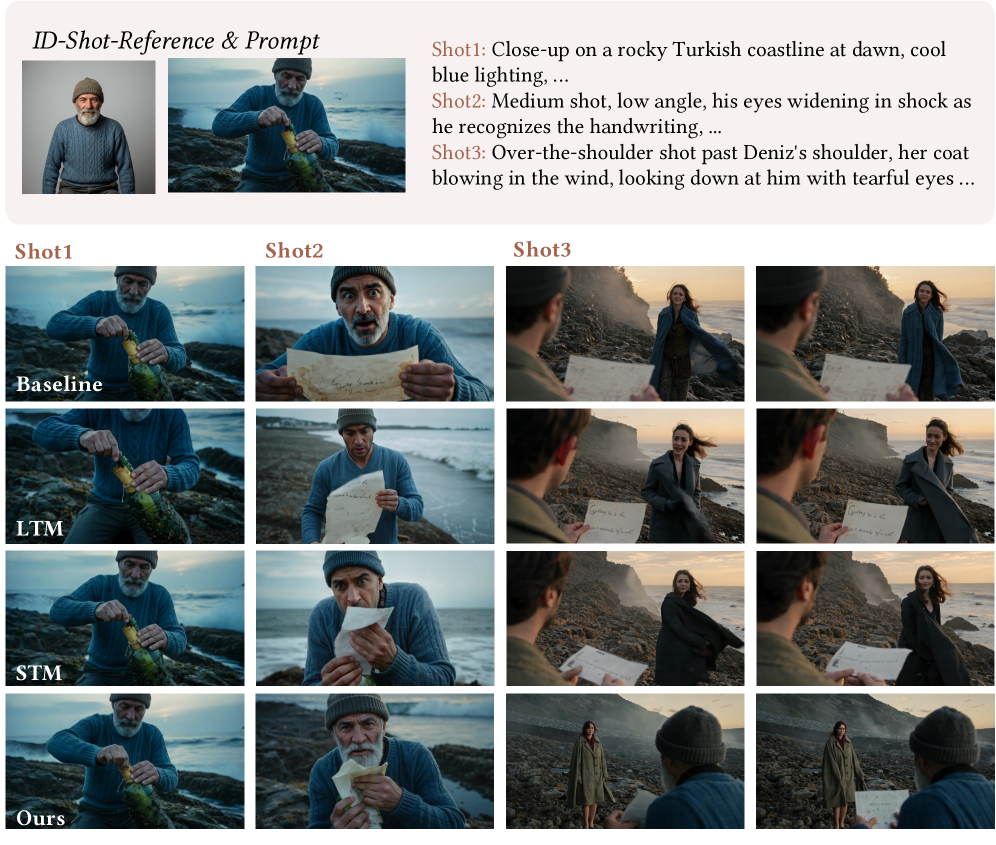
*Figure 4:Ablation visualization on representative multi-cultural sequences. Columns show the no-memory baseline, STM-only, and the full system; the full system maintains subject appearance across all four shots while each single-slot variant drifts.*

*Figure 5:Qualitative comparison in T2V mode. Each column shows a different method generating a 4-shot sequence from text prompts alone. UnityShots(T2V) maintains consistent subject appearance and scene context across all shots while producing synchronized audio. HoloCine achieves competitive per-shot visual quality but lacks a cross-shot memory mechanism and generates no audio track. Open-source T2V baselines exhibit visible identity and background drift from shot 2 onward.*

![Figure 6:Training and benchmark construction pipelines. Top: the 7-stage training pipeline processes raw cinematic and music-video footage through shot segmentation (TransNetv2), subtitle removal, audio diarisation (Whisper/DEMUCS), multimodal captioning (Qwen3-VL/Qwen3-Omni [2]), character anchoring, record merging, and quality filtering, yielding 146k annotated shot records. Bottom: the benchmark pipeline generates the 200-sequence multi-cultural evaluation set through LLM story generation, reference portrait synthesis, per-shot first-frame generation, reference audio synthesis via multilingual TTS, and flat index assembly. Full pipeline details are in Appendix C.](../images/2026-06-23/2606.21661/2606.21661_fig5.png)
*Figure 6:Training and benchmark construction pipelines. Top: the 7-stage training pipeline processes raw cinematic and music-video footage through shot segmentation (TransNetv2), subtitle removal, audio diarisation (Whisper/DEMUCS), multimodal captioning (Qwen3-VL/Qwen3-Omni [2]), character anchoring, record merging, and quality filtering, yielding 146k annotated shot records. Bottom: the benchmark pipeline generates the 200-sequence multi-cultural evaluation set through LLM story generation, reference portrait synthesis, per-shot first-frame generation, reference audio synthesis via multilingual TTS, and flat index assembly. Full pipeline details are in Appendix C.*

*Figure 7:Multi-cultural benchmark overview. Representative reference portraits, per-shot first frames, and generated sequences from six ethnic regions covered by the 
200
-sequence benchmark. Each row shows a distinct cultural context; characters share identity and voice across all shots in a sequence.*

*(a)Per-shot identity preservation across the shot horizon. (a) Per-shot NC score with a sliding-window mean: UnityShots holds its LTM-anchored lead across all shot indices while baselines degrade. (b) Cumulative-mean NC versus shot count: UnityShots dominates every prefix length and ends 
+
0.11
 above the strongest baseline.*

*(a)Per-shot identity preservation across the shot horizon. (a) Per-shot NC score with a sliding-window mean: UnityShots holds its LTM-anchored lead across all shot indices while baselines degrade. (b) Cumulative-mean NC versus shot count: UnityShots dominates every prefix length and ends 
+
0.11
 above the strongest baseline.*

*(b)Pairwise human-evaluation preference rates. 32 participants compared 4-shot sequences from UnityShots and each competing method on identity consistency, audio continuity, text faithfulness, and overall quality. UnityShots receives majority preference on all criteria against open-source baselines.*

---
**Usage Info**: 5998 tokens used.
**Generated at**: 2026-06-23 16:28:50

---

# 📚 Synthesizing the Lombard Effect: Multi-Level Control of Speech Clarity and Vocal Effort in TTS

🚀 URL: https://arxiv.org/html/2606.23176

## 🌏 Abstract (원문)
Humans tend to speak louder and clearer in challenging environments, such as noisy conditions or when addressing hearing-impaired listeners, which is called Lombard effect. To simulate this behavior in speech synthesis systems, we introduce a flow-matching based text-to-speech (TTS) model trained with vocal effort and articulation pseudo-labels. The proposed model achieves continuous and disentangled control of vocal effort and articulation, while also enabling word-level emphasis for clarifying specific segments of an utterance. Experimental results show that these control mechanisms effectively improve clarity-related acoustic features. Furthermore, speech-in-noise experiments demonstrate that our model successfully simulates the intelligibility gains of human clear speech in noisy conditions.
## 🌏 Abstract (번역)
인간은 시끄러운 환경이나 청각 장애가 있는 청취자에게 말할 때와 같이 어려운 환경에서 더 크고 명확하게 말하는 경향이 있는데, 이를 롬바르드 효과라고 합니다. 음성 합성 시스템에서 이러한 행동을 시뮬레이션하기 위해, 우리는 발성 노력 및 조음 의사 레이블로 훈련된 플로우 매칭 기반 텍스트-음성 변환(TTS) 모델을 소개합니다. 제안된 모델은 발성 노력과 조음을 연속적이고 분리하여 제어할 수 있으며, 발화의 특정 부분을 명확하게 하기 위한 단어 수준 강조도 가능하게 합니다. 실험 결과는 이러한 제어 메커니즘이 명료도 관련 음향 특징을 효과적으로 개선함을 보여줍니다. 더 나아가, 잡음 환경에서의 음성 실험은 우리 모델이 잡음이 있는 환경에서 인간의 명료한 음성의 명료도 향상을 성공적으로 시뮬레이션함을 입증합니다.

## 🔍 Methods & Results
- Matcha-TTS를 기반 아키텍처로 채택하여 높은 합성 품질과 추론 효율성을 확보했으며, 반복적인 확산 샘플링 대신 결정론적 플로우 예측을 사용합니다.
- Optimal Transport (OT) 기반 플로우 매칭 디코더를 사용하여 음향 공간에서 부드러운 보간과 점진적인 다차원 제어를 지원합니다.
- Monotonic Alignment Search (MAS)를 통합하여 음소-프레임 지속 시간을 학습하고, 롬바르드 음성의 시간적 적응(말하기 속도 감소, 조음 패턴 수정)을 제어합니다.
- Expresso 데이터셋의 사전 정의된 스타일 클래스(기본, 명료, 빠름, 강조)를 활용하여 발성 노력 및 조음 의사 레이블을 도출하고, 이를 32차원 연속 임베딩 공간에 매핑하여 독립적이고 연속적인 제어를 가능하게 합니다.
- 발성 노력 및 조음 임베딩과 화자 임베딩을 결합하여 텍스트 인코더(지속 시간 제어)와 U-Net 기반 플로우 매칭 디코더(음향 제어) 양쪽에 주입하는 이중 주입 전략을 사용합니다.
- 추론 시 발성 노력(α)과 조음(β)을 연속적인 스칼라로 처리하여 명료도를 점진적으로 조절하며, 단어 수준에서 다른 β 값을 할당하여 특정 발화 구간의 명료도를 국부적으로 향상시킬 수 있습니다.
- 고음질 및 효율적인 파형 재구성을 위해 Vocos 보코더를 사용합니다.

## 🖼 Figures
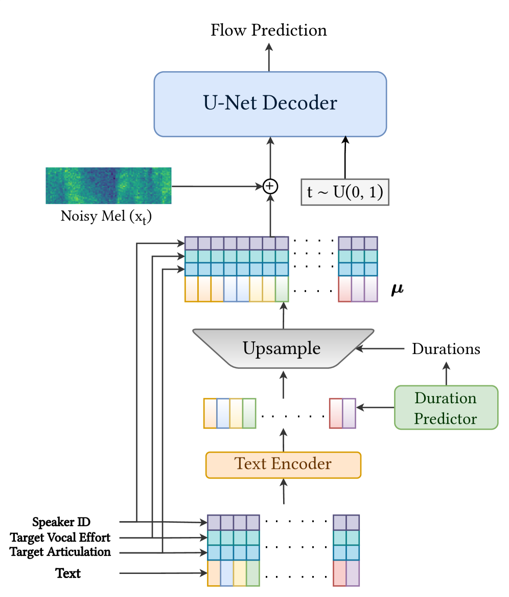
*Figure 1:Overall architecture of Matcha-TTS with multi-level vocal effort and articulation conditioning.*

*Figure 2:Comparison to the baseline in terms of WER 
↓
, MVD 
↑
, spectral tilt 
↑
 and phoneme rate 
↓
.*

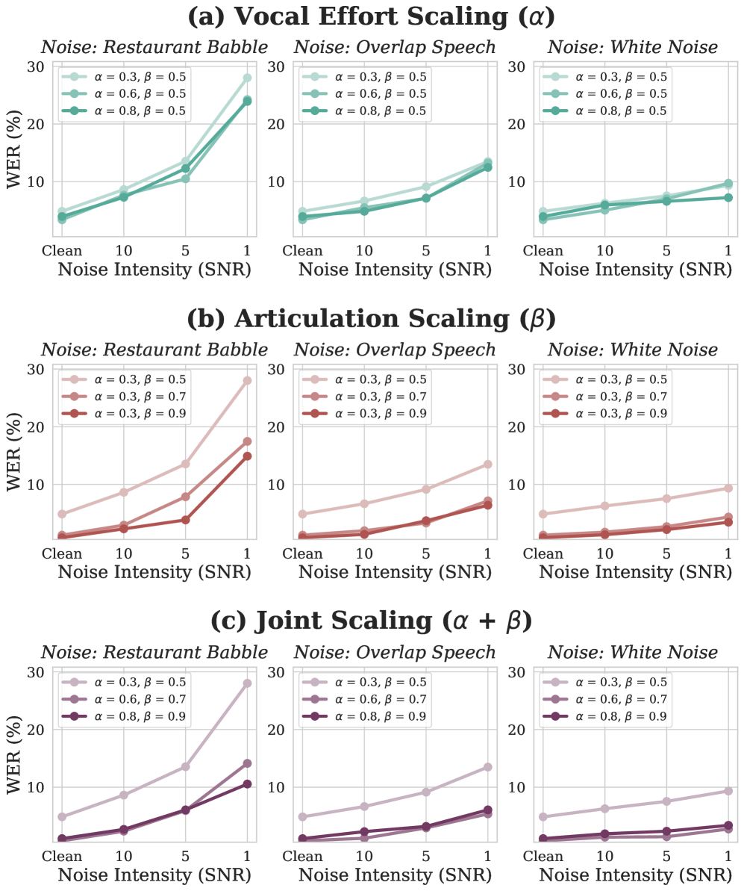
*Figure 3:WER of synthesized speech under noisy conditions.*

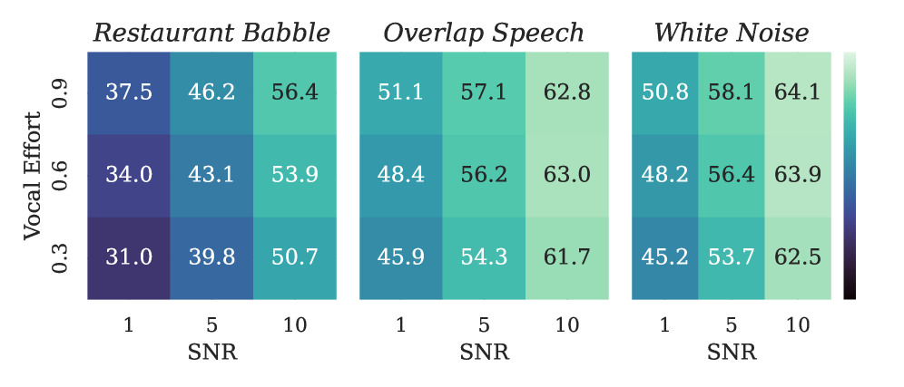
*Figure 4:Average SII (%) results. Higher the better.*

---
**Usage Info**: 3235 tokens used.
**Generated at**: 2026-06-23 16:29:02

---

# 📚 Speaker Identity in Non-Verbal Vocalizations: Conditional Distillation and Mixture of Experts Approach

🚀 URL: https://arxiv.org/html/2606.21215

## 🌏 Abstract (원문)
As expressive text-to-speech (TTS) and voice conversion (VC) systems increasingly generate non-verbal vocalizations (NVVs) to enhance naturalness, reliable speaker verification (SV) becomes essential to objectively assess identity consistency across both verbal and non-verbal segments. Yet current SV systems generalize poorly to NVVs, and fine-tuning on NVV data causes catastrophic forgetting of speech performance. We present the first systematic study across 10 NVV types and propose a framework combining frozen Data2Vec self-supervised features with ECAPA-TDNN, enhanced by a Mixture of Experts (MoE) module with learned domain-aware routing. A conditional distillation loss on speech inputs via a pretrained teacher retains speech-to-speech accuracy, while a contrastive loss bridges the speech-NVV domain gap. Our method reduces speech-NVV EER from 38.93% to 22.66% over a pretrained baseline, and improves speech EER from 13.17% to 9.24% via distillation.111Codebase: https://github.com/wiizzz/nonverbal-sv
## 🌏 Abstract (번역)
표현력이 풍부한 텍스트 음성 변환(TTS) 및 음성 변환(VC) 시스템이 자연스러움을 향상시키기 위해 비언어적 발성(NVV)을 점점 더 많이 생성함에 따라, 언어 및 비언어 세그먼트 전반에 걸쳐 신원 일관성을 객관적으로 평가하기 위해서는 신뢰할 수 있는 화자 확인(SV)이 필수적입니다. 그러나 현재 SV 시스템은 NVV에 대한 일반화 성능이 좋지 않으며, NVV 데이터로 미세 조정하면 음성 성능에 대한 치명적인 망각을 초래합니다. 본 연구에서는 10가지 NVV 유형에 걸쳐 최초의 체계적인 연구를 제시하고, 고정된 Data2Vec 자기 지도 학습 특징과 ECAPA-TDNN을 결합하고 학습된 도메인 인식 라우팅을 갖춘 전문가 혼합(MoE) 모듈로 강화된 프레임워크를 제안합니다. 사전 학습된 교사를 통한 음성 입력에 대한 조건부 증류 손실은 음성-음성 정확도를 유지하는 반면, 대조 손실은 음성-NVV 도메인 간극을 연결합니다. 우리의 방법은 사전 학습된 기준선 대비 음성-NVV EER을 38.93%에서 22.66%로 감소시키고, 증류를 통해 음성 EER을 13.17%에서 9.24%로 향상시킵니다.

## 🔍 Methods & Results
- 제안된 프레임워크는 고정된 Data2Vec 및 ECAPA-TDNN 백본, 도메인 인식 특징 라우팅을 위한 MoE 모듈, 그리고 조건부 증류, 대조 브리징 및 도메인 인식 라우팅 제약을 통합하는 다중 목표 훈련 전략의 세 가지 핵심 구성 요소로 구성됩니다.
- 프론트엔드로는 Data2vec을 사용하여 음소 이산화 병목 현상을 피하고, 백엔드로는 ECAPA-TDNN을 사용하여 기침부터 웃음까지 다양한 NVV의 시간적 구조를 효과적으로 모델링합니다.
- 음성 및 NVV에 대한 표현 경로를 분리하기 위해 MoE 모듈을 도입하며, 게이팅 네트워크가 프레임 수준 표현을 전문화된 전문가(k=2)에게 조건부로 라우팅합니다.
- MoE 통합 전략으로 고정된 SSL 은닉 상태의 가중 합에 단일 MoE 계층을 적용하는 'Post-Fusion MoE'와 각 고정 트랜스포머 블록 뒤에 학습 가능한 MoE 어댑터를 삽입하는 'Inter-Layer Residual MoE (IR-MoE)'를 평가했습니다.
- 공동 최적화 프레임워크는 표준 SV 파이프라인(AAM-softmax 손실), 이벤트 기반 MoE 라우팅 제약, 그리고 조건부 지식 증류를 통합하여 도메인 인식 전문화를 보장하고 치명적인 망각을 완화합니다.
- 이벤트 기반 MoE 라우팅 제약(L_MoE)은 배치 수준 부하 분산 손실, 이벤트 인식 소프트 정규화(KL 발산 및 EMA 라우팅 프로토타입 사용), 그리고 코사인 마진 손실을 통해 전문가 전문화 및 라우팅 붕괴 방지를 목표로 합니다.
- 조건부 지식 증류(L_Dist)는 고정된 WavLM 기반 SV 모델을 교사로 활용하여 음성 입력에 조건부로 적용되며, 음성 표현을 선택적으로 보존하고 음성-음성 정확도를 유지합니다.
- 감독된 대조 도메인 브리징(L_SupCon)은 음성 및 NVV 간의 음향 도메인 간극을 명시적으로 연결하며, 동일 화자의 도메인 내 및 도메인 간(음성-NVV) 쌍을 긍정 쌍으로 포함하여 공유 화자 매니폴드를 강화합니다.
- 제안된 방법은 사전 학습된 기준선 대비 음성-NVV EER을 38.93%에서 22.66%로 감소시켰습니다.
- 증류를 통해 음성 EER을 13.17%에서 9.24%로 향상시켰습니다.

## 🖼 Figures
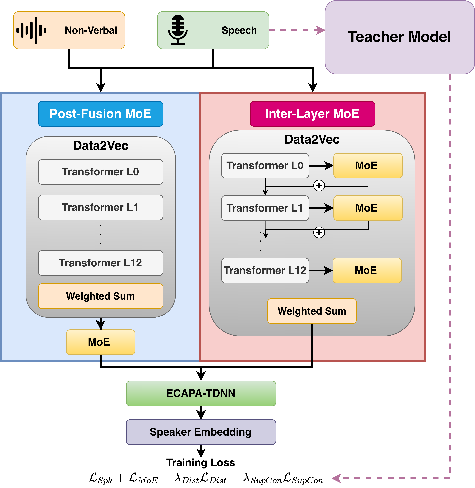
*Figure 1:Overall pipeline of proposed method.*

*Figure 2:Cosine similarity distributions illustrating the domain gap between speech and vocal bursts. Target speech–vocal burst trials (dashed orange) exhibit substantial overlap with non-target distributions, indicating an increased risk of false rejections in ECAPA-TDNN.*

---
**Usage Info**: 3454 tokens used.
**Generated at**: 2026-06-23 16:29:12

---

# 📚 Synthetic Audio Generation Framework for Air Traffic Control Speech Recognition

🚀 URL: https://arxiv.org/html/2606.21340

## 🌏 Abstract (원문)
Automatic Speech Recognition (ASR) systems, despite achieving remarkable accuracy in general-purpose domains with native speech (L1), struggle in domains like Air Traffic Control (ATC) due to strong channel noise, a presence of non-native (L2) English accents, and data scarcity. We propose a synthetic data generation pipeline with acoustical properties simulations specifically designed to address this lack of real data to improve recognition accuracy in the ATC domain. Our approach leverages a combination of neural generation techniques, including Text-to-Speech, Voice Conversion, L2-to-L1 accent conversion, and a novel controllable L1-to-L2 accent conversion framework built to simulate accented speech. Our experiments with the Whisper model on the ATCO2 corpus demonstrate that fine-tuning with either synthetic data alone, or a mix of real and synthetic data, significantly improves the word error rate over out-of-the-box and real data only baselines respectively.
## 🌏 Abstract (번역)
자동 음성 인식(ASR) 시스템은 원어민(L1) 음성을 사용하는 일반적인 도메인에서는 뛰어난 정확도를 달성하지만, 강한 채널 노이즈, 비원어민(L2) 영어 억양의 존재, 그리고 데이터 부족으로 인해 항공 교통 관제(ATC)와 같은 도메인에서는 어려움을 겪습니다. 우리는 ATC 도메인에서 인식 정확도를 향상시키기 위해 실제 데이터 부족 문제를 해결하도록 특별히 설계된 음향 특성 시뮬레이션을 포함하는 합성 데이터 생성 파이프라인을 제안합니다. 우리의 접근 방식은 텍스트 음성 변환(Text-to-Speech), 음성 변환(Voice Conversion), L2-to-L1 억양 변환, 그리고 억양 있는 음성을 시뮬레이션하기 위해 구축된 새로운 제어 가능한 L1-to-L2 억양 변환 프레임워크를 포함한 신경망 생성 기술의 조합을 활용합니다. ATCO2 코퍼스에서 Whisper 모델을 사용한 우리의 실험은 합성 데이터만으로 미세 조정하거나 실제 데이터와 합성 데이터를 혼합하여 미세 조정하는 것이 각각 기본 모델 및 실제 데이터만 사용한 기준선보다 단어 오류율을 크게 향상시킨다는 것을 보여줍니다.

## 🔍 Methods & Results
- ATC 도메인의 데이터 부족 문제를 해결하기 위해 음성/노이즈 분리(DAIEN-TTS) 및 초해상도(AudioSR)를 통해 실제 ATC 오디오를 전처리하여 표준 사전 훈련 코퍼스의 음향 분포와 일치하도록 오디오 품질을 향상시켰습니다.
- 다양한 합성 데이터 생성을 위해 텍스트 음성 변환(F5-TTS 모델을 사용하여 L2 ATC 음성에서 L1 음성 생성), 음성 변환(kNN-VC를 사용하여 화자 다양성 증가), L2-to-L1 억양 변환(TokAN 모델을 사용하여 텍스트 없이 L2를 L1으로 변환)을 활용했습니다.
- 새로운 L1-to-L2 억양 변환 모델을 제안했습니다. 이는 TokAN 아키텍처를 재활용하여 L1 토큰을 L2 토큰으로 매핑하도록 미세 조정하고, 대상 L2 억양 임베딩에 따라 제어 가능한 L1-to-L2 변환을 가능하게 합니다.
- 생성된 합성 오디오에 ATC 특정 음향 시뮬레이션(AAS) 단계를 적용했습니다. 여기에는 리샘플링(8kHz로 다운샘플링 후 16kHz로 업샘플링), 대역 통과 필터링(200Hz 컷오프), 그리고 실제 발화에서 분리된 배경 노이즈 주입이 포함됩니다.
- Whisper 모델과 ATCO2 코퍼스를 사용한 실험에서, 합성 데이터만으로 미세 조정하거나 실제 데이터와 합성 데이터를 혼합하여 미세 조정하는 것이 기본 모델 및 실제 데이터만 사용한 기준선보다 단어 오류율(WER)을 크게 향상시키는 것으로 나타났습니다.

## 🖼 Figures
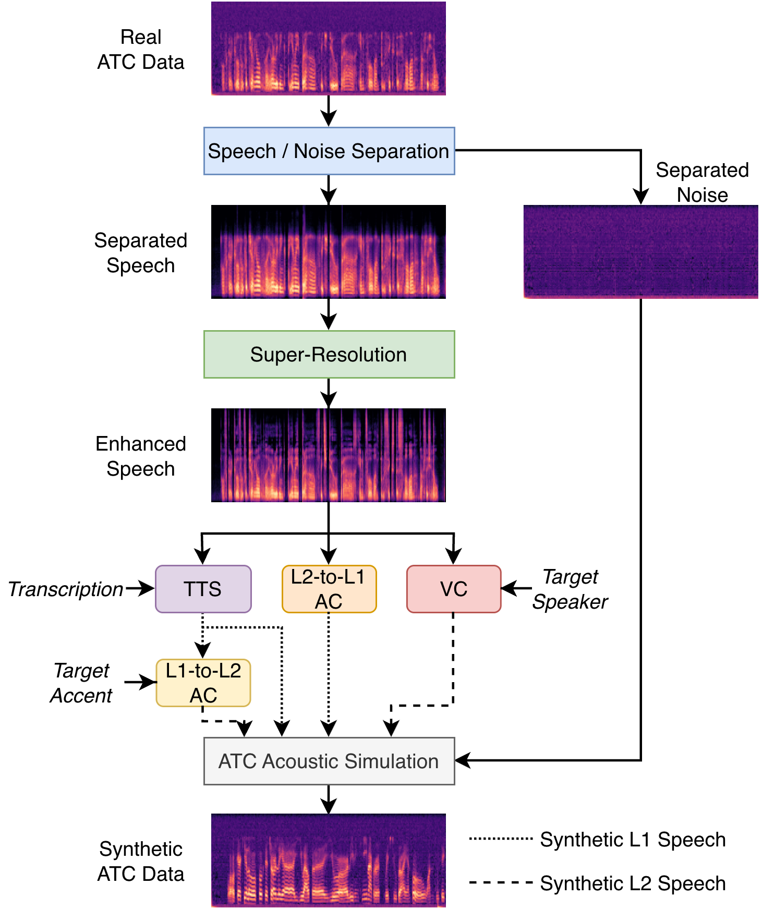
*Figure 1:Synthetic audio generation framework for ATC.*

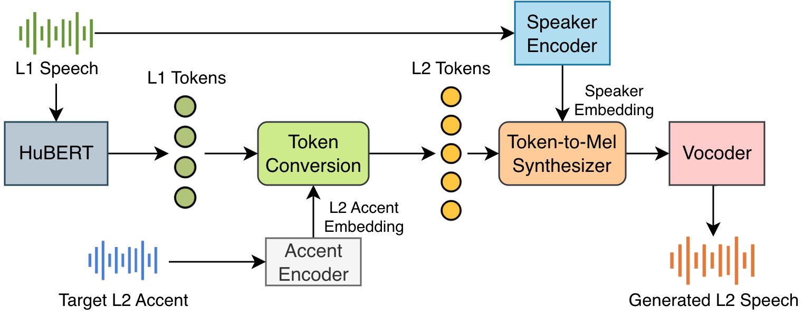
*Figure 2:Repurposed TokAN architecture for controllable L1-to-L2 accent conversion.*

---
**Usage Info**: 3311 tokens used.
**Generated at**: 2026-06-23 16:29:20

---

# 📚 InstructFX2FX: A Multi-turn Text-to-Preset Demo for Iterative Audio Effect Refinement

🚀 URL: https://arxiv.org/html/2606.22005

## 🌏 Abstract (원문)
We presentInstructFX2FX, an interactive demonstration of multi-turn, text-guided audio effect refinement. Existing text-to-preset systems are largely single-shot, mapping one textual descriptor to one preset. Real audio engineering is instead sequential: engineers refine an existing effect chain through successive instructions such as “make it warmer” or “too harsh, soften it.” This poses a stateful problem that single-shot systems do not address — given the current effect parameters and a new instruction, update the sound while preserving what earlier instructions already achieved. InstructFX2FX tackles this with a hybrid architecture that divides labor between a language model and CLAP-guided optimization. The LLM acts as a high-level planner that selects effects, orders the signal chain, and proposes initial parameters, motivated by recent evidence that LLM initialization outperforms CLAP optimization from a random start[2]; CLAP-guided optimization then refines those parameters perceptually, giving more controllable updates than re-prompting the LLM at each turn, which tends to perturb settings the user did not ask to change. At the demo, attendees drive a dry recording through successive natural-language instructions and inspect the evolving FX chain, intermediate optimization checkpoints, and session state. On SocialFX-derived descriptor transitions, CLAP-guided refinement lowers target-directed DSP-feature MMD on 9 of 10 directed descriptor pairs relative to an LLM-only reprompting baseline, reducing the average MMD by roughly 24% (0.45 to 0.34). Audio demos are available, and the code will be open-sourced, athttps://instructfx2fx.vaclis.netandhttps://github.com/vaclisinc/InstructFX2FX.
## 🌏 Abstract (번역)
저희는 다중 턴, 텍스트 기반 오디오 효과 정제를 위한 대화형 시연인 InstructFX2FX를 소개합니다. 기존의 텍스트-프리셋 시스템은 대부분 단일 샷 방식으로, 하나의 텍스트 설명자를 하나의 프리셋에 매핑합니다. 실제 오디오 엔지니어링은 대신 순차적입니다. 엔지니어는 “더 따뜻하게 만들어줘” 또는 “너무 거칠어, 부드럽게 해줘”와 같은 연속적인 지시를 통해 기존 효과 체인을 정제합니다. 이는 단일 샷 시스템이 다루지 못하는 상태 유지 문제를 제기합니다. 즉, 현재 효과 매개변수와 새로운 지시가 주어졌을 때, 이전 지시들이 이미 달성한 것을 보존하면서 사운드를 업데이트해야 합니다. InstructFX2FX는 언어 모델과 CLAP 기반 최적화 간에 작업을 분할하는 하이브리드 아키텍처로 이 문제를 해결합니다. LLM은 효과를 선택하고, 신호 체인을 정렬하며, 초기 매개변수를 제안하는 고수준 플래너 역할을 합니다. 이는 LLM 초기화가 무작위 시작에서 CLAP 최적화보다 우수하다는 최근 증거[2]에 의해 동기 부여되었습니다. CLAP 기반 최적화는 이러한 매개변수를 지각적으로 정제하여, 매 턴마다 LLM을 다시 프롬프트하는 것보다 더 제어 가능한 업데이트를 제공합니다. LLM을 다시 프롬프트하는 방식은 사용자가 변경을 요청하지 않은 설정을 방해하는 경향이 있기 때문입니다. 데모에서 참가자들은 건조한 녹음을 연속적인 자연어 지시를 통해 구동하고, 진화하는 FX 체인, 중간 최적화 체크포인트 및 세션 상태를 검사합니다. SocialFX에서 파생된 설명자 전환에서, CLAP 기반 정제는 LLM 전용 재프롬프트 기준선에 비해 10개 중 9개의 지시된 설명자 쌍에서 목표 지향 DSP 기능 MMD를 낮추어 평균 MMD를 약 24% (0.45에서 0.34로) 감소시킵니다. 오디오 데모는 https://instructfx2fx.vaclis.net 및 https://github.com/vaclisinc/InstructFX2FX에서 이용 가능하며, 코드는 오픈 소스로 공개될 예정입니다.

## 🔍 Methods & Results
- InstructFX2FX는 다중 턴 텍스트 기반 오디오 효과 정제를 위한 대화형 시스템으로, 단일 샷 텍스트-프리셋 시스템과 달리 순차적인 오디오 엔지니어링 프로세스를 모방합니다.
- 이 시스템은 언어 모델(LLM)과 CLAP 기반 최적화를 결합한 하이브리드 아키텍처를 사용합니다. LLM은 효과 선택, 신호 체인 정렬, 초기 매개변수 제안 등 고수준 계획을 담당합니다.
- CLAP 기반 최적화는 LLM이 제안한 매개변수를 지각적으로 정제하여, 렌더링된 오디오를 기반으로 피드백을 제공하고, 사용자가 요청하지 않은 설정을 변경하지 않으면서 더 제어 가능한 업데이트를 가능하게 합니다.
- 시스템은 턴마다 지속적인 세션 상태를 유지하며, 라우팅 모듈은 지시를 '초기화만', '재사용 및 최적화', '혼합 재사용 및 초기화'의 세 가지 실행 모드 중 하나로 분류합니다.
- 최적화는 CLAP 오디오 및 텍스트 임베딩 함수를 사용하여 의미론적 유사성, 방향성 목표, 그리고 부정적 앵커를 포함하는 가이드된 의미론적 목표를 포함합니다.
- SocialFX에서 파생된 설명자 전환에서, CLAP 기반 정제는 LLM 전용 재프롬프트 기준선 대비 10개 중 9개의 지시된 설명자 쌍에서 목표 지향 DSP 기능 MMD를 낮추어 평균 MMD를 약 24% (0.45에서 0.34로) 감소시키는 결과를 보였습니다.

## 🖼 Figures

*Figure 1:The InstructFX2FX harness. The LLM planner selects and orders the FX chain, the routing module determines how the current session state should be updated, and the optimization backend refines parameters in CLAP space. The persistent session state makes the system iterative.*

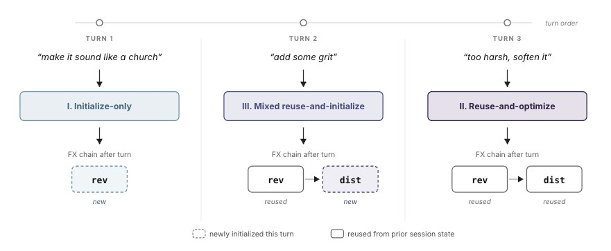
*Figure 2:The three routing modes used in multi-turn refinement. Initialize-only creates a new chain, mixed reuse-and-initialize extends the existing chain, and reuse-and-optimize refines the current chain in place.*

*(a)Exp 1: sequential MMD across prompt pairs.*

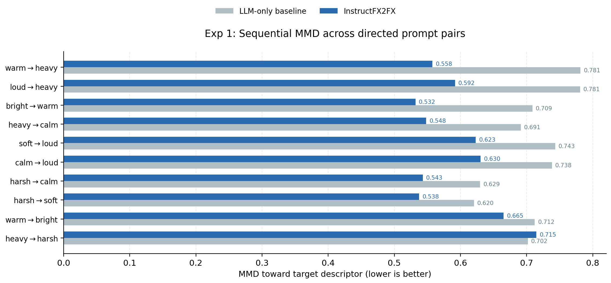
*(a)Exp 1: sequential MMD across prompt pairs.*

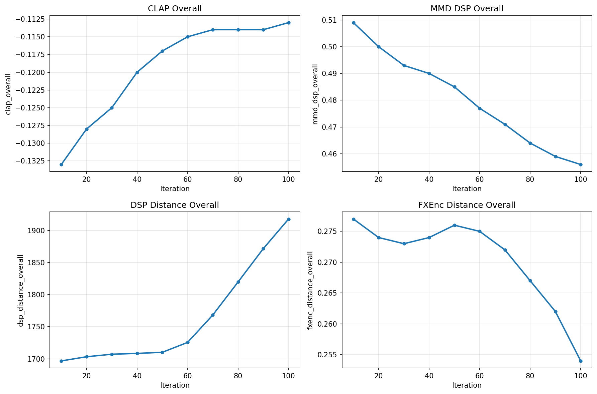
*(b)Exp 3: average MMD over optimization iterations.*

*(a)Good case: loud
→
heavy.*

*(a)Good case: loud
→
heavy.*

*(b)Messy case: calm
→
loud.*

---
**Usage Info**: 3368 tokens used.
**Generated at**: 2026-06-23 16:29:29

---

# 📚 Imitation Learning for Elder-Facing Speech Synthesis

🚀 URL: https://arxiv.org/html/2606.21053

## 🌏 Abstract (원문)
Recent advances in text-to-speech (TTS) synthesis have achieved highly natural and expressive speech generation. However, these systems are designed for general adults and overlook older adults’ speech comprehension needs due to age-related sensory and cognitive decline. Prior work involves older adults by collecting preference feedback to tune model parameters. However, obtaining sufficient preference data is costly and difficult, as older adults quickly become fatigued during collection. In this paper, we propose a novel imitation learning (IL) framework to learn TTS models from expert demonstrations. We further improve Group Relative Policy Optimization (GRPO) with two-stage on-policy reward learning (OPRL) to mitigate reward hacking under limited supervision from expert demonstration. Experimental results show that GRPO w/ OPRL outperforms GRPO and supervised baselines in objective and subjective metrics. Audio samples are available athttps://dongru1.github.io/demo/im-efss/
## 🌏 Abstract (번역)
최근 텍스트 음성 변환(TTS) 합성 기술의 발전은 매우 자연스럽고 표현력이 풍부한 음성 생성을 가능하게 했습니다. 그러나 이러한 시스템은 일반 성인을 위해 설계되었으며, 노화 관련 감각 및 인지 저하로 인한 노년층의 음성 이해 요구 사항을 간과합니다. 이전 연구에서는 모델 매개변수를 조정하기 위해 노년층의 선호도 피드백을 수집하는 방식을 사용했습니다. 하지만 노년층은 데이터 수집 중 쉽게 피로해지기 때문에 충분한 선호도 데이터를 얻는 것은 비용이 많이 들고 어렵습니다. 본 논문에서는 전문가 시연으로부터 TTS 모델을 학습하기 위한 새로운 모방 학습(IL) 프레임워크를 제안합니다. 우리는 또한 전문가 시연으로부터의 제한된 감독 하에 보상 해킹을 완화하기 위해 2단계 온-정책 보상 학습(OPRL)을 통해 그룹 상대 정책 최적화(GRPO)를 개선합니다. 실험 결과는 GRPO w/ OPRL이 객관적 및 주관적 지표에서 GRPO 및 지도 학습 기준선보다 우수한 성능을 보임을 보여줍니다. 오디오 샘플은 https://dongru1.github.io/demo/im-efss/ 에서 확인할 수 있습니다.

## 🔍 Methods & Results
- 노년층을 위한 TTS의 보상 함수 정의는 주관적이고 여러 요인(자연스러움, 명료성)에 따라 달라지므로 보상 해킹에 취약하다는 문제를 해결하기 위해 모방 학습(IL) 프레임워크를 제안했습니다.
- IL은 전문가 시연으로부터 노년층을 위한 발화 행동을 직접 학습하며, 전문가 행동과 유사한 샘플에 높은 보상을 할당하여 TTS 정책을 안내하는 보상 모델을 학습합니다.
- 보상 해킹 문제를 완화하기 위해 발화 스타일과 명료성을 각각 안내하는 전문가 보상(expert reward)과 발음 보상(pronunciation reward)으로 구성된 다면적 보상(multi-faceted reward)을 도입했습니다.
- 전문가 보상 모델은 StyleTTS 2의 사전 학습된 운율 스타일 인코더와 학습 가능한 보상 헤드로 구성되며, Bradley-Terry 쌍별 순위 손실로 훈련됩니다.
- 발음 보상은 광둥어 ASR 모델과 Jyutping 기반의 음절 오류율(SER)을 사용하여 계산되며, R_pron(x,y) = clip(1 - tanh(s_w * SER(x,y)), 0, 1)로 변환됩니다.
- 두 보상은 가중 조화 평균으로 결합되어 개별 보상이 낮을 경우 강하게 페널티를 부여하여 명료성과 운율 간의 상충 관계를 방지합니다.
- 정책 최적화는 PPO 클립을 포함한 GRPO(Group Relative Policy Optimization)를 따르며, 그룹 상대적 이점(group-relative advantages)을 계산하고 중요도 샘플링 비율 및 KL 페널티를 사용하여 정책을 최적화합니다.
- OPRL(Two-Stage On-Policy Reward Learning)은 미세 조정된 TTS 모델이 생성한 음성으로 보상 모델을 반복적으로 업데이트하는 2단계 프로세스입니다.
- OPRL 1단계에서는 초기 정책을 전문가 시연 데이터셋으로 지도 학습하고, 초기 전문가 보상 모델을 훈련합니다. 이후 GRPO로 정책을 미세 조정하고, 생성된 음성 중 특정 기준(보상 10~90분위, SER < 0.15)을 만족하는 샘플을 선택하여 보상 모델 훈련 데이터셋에 추가하고 전문가 보상 모델을 재훈련하는 과정을 5회 반복합니다.
- OPRL 2단계에서는 더 다양한 텍스트 데이터(D_txt)에 보상 모델을 노출시키기 위해, GRPO로 정책을 미세 조정하고, SER <= 0.1인 샘플들을 SER에 따라 그룹화합니다. 각 그룹 내에서 예측된 전문가 보상에 따라 샘플을 순위 매기고, 백분위수(0, 25, 50, 75, 100)에 단조 증가하는 보상을 할당하여 보상 모델 훈련 데이터셋에 추가한 후 전문가 보상 모델을 재훈련합니다.
- 실험 결과, GRPO w/ OPRL은 객관적 및 주관적 지표 모두에서 GRPO 및 지도 학습 기준선보다 우수한 성능을 보였습니다.

## 🖼 Figures
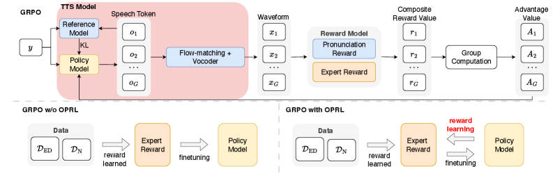
*Figure 1:Overview of the GRPO pipeline and the on-policy reward learning (OPRL) process.*

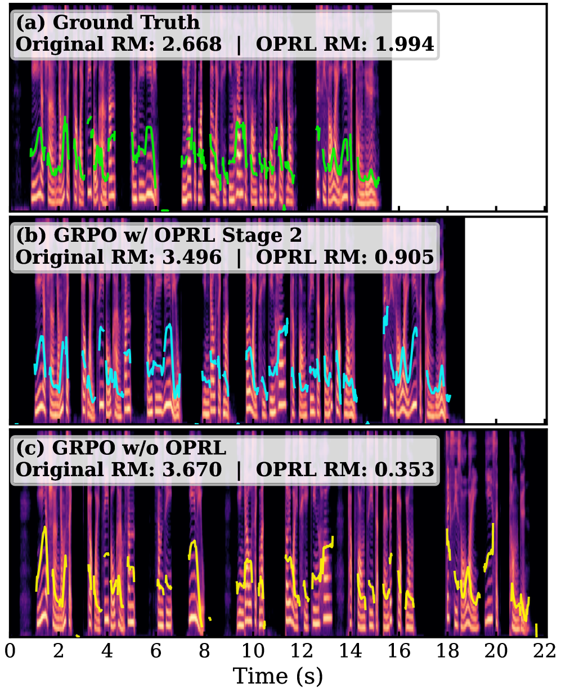
*Figure 2:Generated mel-spectrograms and predicted rewards from original and OPRL-based reward models.*

---
**Usage Info**: 5761 tokens used.
**Generated at**: 2026-06-23 16:29:46

---

# 📚 Bridging Self-Supervised Learning and Speech Enhancement: A Wav2Vec2-Conditioned Framework

🚀 URL: https://arxiv.org/html/2606.22591

## 🌏 Abstract (원문)
Diffusion models show potential for speech enhancement but lack linguistic guidance. We condition a diffusion-based model on wav2vec 2.0 features from noisy input, injected at the U-Net bottleneck via Feature-wise Linear Modulation (FiLM). Phonetic representations from wav2vec 2.0 features of degraded speech, anchor the reverse diffusion process. While a frozen wav2vec 2.0 encoder extracts features, a learned FiLM generator produces scale and shift parameters modulating the bottleneck with minimal overhead. Motivated by the optimal Bayesian causal estimator under a linear-Gaussian state-space model, FiLM coefficients are aggregated via exponential smoothing for temporal compression. Evaluation on VoiceBank-DEMAND and LibriMix shows competitive performance against the unconditioned baseline in PESQ, STOI, SI-SDR and DNSMOS. We consistently record an improvement of 0.4 on PESQ score, suggesting self-supervised representations effectively condition diffusion-based speech enhancement.
## 🌏 Abstract (번역)
확산 모델은 음성 향상에 잠재력을 보이지만 언어적 지도가 부족합니다. 본 연구에서는 확산 기반 모델을 노이즈가 있는 입력에서 추출한 wav2vec 2.0 특징에 조건화하며, 이 특징은 Feature-wise Linear Modulation (FiLM)을 통해 U-Net 병목 지점에 주입됩니다. 손상된 음성의 wav2vec 2.0 특징에서 얻은 음성학적 표현은 역확산 과정을 고정합니다. 고정된 wav2vec 2.0 인코더가 특징을 추출하는 동안, 학습된 FiLM 생성기는 최소한의 오버헤드로 병목 지점을 조절하는 스케일 및 시프트 파라미터를 생성합니다. 선형-가우시안 상태 공간 모델 하의 최적 베이지안 인과 추정기에서 영감을 받아, FiLM 계수는 시간 압축을 위해 지수 평활법(exponential smoothing)을 통해 집계됩니다. VoiceBank-DEMAND 및 LibriMix 데이터셋에 대한 평가 결과, PESQ, STOI, SI-SDR 및 DNSMOS에서 무조건화된 기준선 대비 경쟁력 있는 성능을 보였습니다. PESQ 점수에서 0.4의 일관된 개선을 기록했으며, 이는 자기 지도 학습 표현이 확산 기반 음성 향상을 효과적으로 조건화함을 시사합니다.

## 🔍 Methods & Results
- 제안된 아키텍처는 NCSN++ U-Net을 따르며, BigGAN 스타일의 잔여 블록, 스킵 연결, 특정 해상도에서의 자기 주의 레이어를 포함합니다.
- wav2vec 2.0 특징은 사전 학습되고 고정된 wav2vec 2.0 기본 모델을 사용하여 노이즈가 있는 파형에서 추출되며, 최종 트랜스포머 레이어의 출력을 조건화 특징으로 사용합니다.
- U-Net은 병목 지점에서 FiLM(Feature-wise Linear Modulation)을 사용하여 wav2vec 2.0 특징에 조건화됩니다.
- FiLM 계수는 wav2vec 2.0 특징을 병목 특징 공간으로 투영하여 생성되며, 스케일(감마) 및 시프트(베타) 파라미터를 생성합니다.
- FiLM은 가장 추상적이고 압축된 표현을 포함하며 계산 오버헤드가 최소화되므로 U-Net의 병목 지점에 적용됩니다.
- FiLM 계수의 시퀀스는 선형-가우시안 상태 공간 모델 하의 최적 베이지안 인과 추정기에서 파생된 지수 평활법(Exponential Smoothing, EMA)을 통해 집계되어 단일 스케일-시프트 쌍을 형성합니다.
- VoiceBank-DEMAND 및 LibriMix 데이터셋에 대한 평가에서 PESQ, STOI, SI-SDR, DNSMOS 지표에서 무조건화된 기준선 대비 경쟁력 있는 성능을 달성했습니다.
- PESQ 점수에서 일관되게 0.4점의 개선을 기록하여, 자기 지도 학습 표현이 확산 기반 음성 향상을 효과적으로 조건화함을 입증했습니다.

## 🖼 Figures

*(a)*

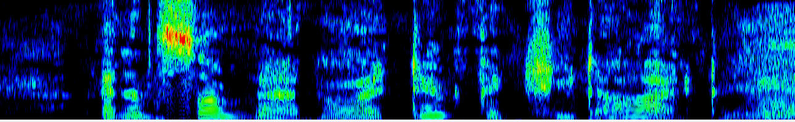
*(a)*

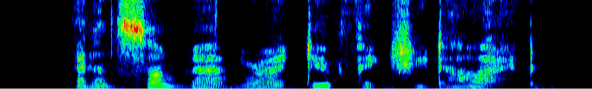
*(b)*

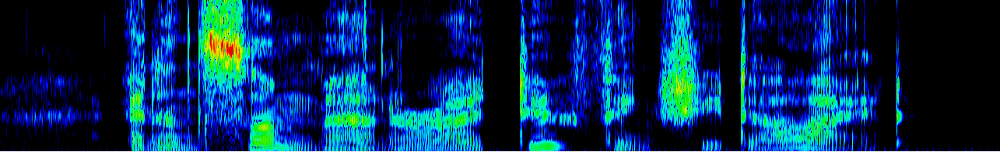
*(c)*

---
**Usage Info**: 2908 tokens used.
**Generated at**: 2026-06-23 16:29:53

---

# 📚 Audio Editing in the Era of Foundation Models: A Survey

🚀 URL: https://arxiv.org/html/2606.23139

## 🌏 Abstract (원문)
Audio editing aims to modify a given synthetic or real-world audio signal to satisfy specific user needs. As a promising yet challenging direction in AIGC, it has attracted increasing attention. Recent advances in audio generation have made powerful generative models central to modern audio editing systems. This rapid progress has created a growing need to organize emerging tasks, methods, and resources into a coherent view. In this survey, we provide a comprehensive review of audio editing in the era of foundation models. We first present a unified taxonomy of existing editing tasks and then summarize the major foundation-model paradigms that support modern audio editing, covering representative approaches from both training-based and training-free perspectives. We further discuss related resources, including datasets, evaluation protocols, and data construction tools. Finally, we identify open challenges in this field and outline promising directions for future research. The accompanying repository is released athttps://github.com/DaViD-Pigeon/AudioEditSurvey.
## 🌏 Abstract (번역)
오디오 편집은 주어진 합성 또는 실제 오디오 신호를 특정 사용자 요구에 맞게 수정하는 것을 목표로 합니다. AIGC(인공지능 생성 콘텐츠) 분야에서 유망하지만 도전적인 방향으로, 점점 더 많은 관심을 받고 있습니다. 오디오 생성 분야의 최근 발전은 강력한 생성 모델을 현대 오디오 편집 시스템의 핵심으로 만들었습니다. 이러한 빠른 발전은 새로운 작업, 방법 및 리소스를 일관된 관점으로 정리해야 할 필요성을 증대시켰습니다. 이 설문조사에서는 파운데이션 모델 시대의 오디오 편집에 대한 포괄적인 검토를 제공합니다. 먼저 기존 편집 작업에 대한 통합 분류 체계를 제시하고, 이어서 현대 오디오 편집을 지원하는 주요 파운데이션 모델 패러다임을 훈련 기반 및 훈련 없는 관점 모두에서 대표적인 접근 방식을 다루며 요약합니다. 또한 데이터셋, 평가 프로토콜, 데이터 구축 도구를 포함한 관련 리소스에 대해 논의합니다. 마지막으로, 이 분야의 공개된 과제를 식별하고 미래 연구를 위한 유망한 방향을 제시합니다. 관련 저장소는 https://github.com/DaViD-Pigeon/AudioEditSurvey에서 공개됩니다.

## 🔍 Methods & Results
- 초기 신경망 오디오 편집 방법은 국소 재구성 및 속성 제어를 위한 작업별 생성 모델(예: GAN 기반 음성 인페인팅, 적대적 텍스트 기반 음성 편집)을 탐색했습니다.
- 토큰 기반 코덱 언어 모델은 오디오 편집을 이산 오디오 토큰에 대한 조건부 생성으로 간주하며, AudioLM, VALL-E, MusicGen, SoundStorm과 같은 모델을 활용하여 음성 및 음악의 국소 편집(예: VoiceCraft, SpeechX)을 가능하게 합니다.
- 확산 및 플로우 매칭 모델은 오디오 편집을 멜 스펙트로그램 또는 오디오 잠재 공간과 같은 연속 음향 공간에서의 조건부 변환으로 공식화하며, 조건부 노이즈 제거, 잠재 역변환, 연속 플로우 변환을 통해 고음질 재구성 및 미세 조정된 음향 제어를 제공합니다 (예: WaveGrad, AudioLDM, FluentSpeech, DiffEditor).
- 명령형 및 다중 모달 인터페이스는 텍스트 명령, 참조 오디오, 시각적 단서 등을 통해 파운데이션 모델 기반 오디오 편집에 대한 고수준 제어를 가능하게 하여, 다중 스팬 편집, 배경 인식 수정, 비대상 영역 보존 등을 지원합니다.
- 훈련 기반 접근 방식은 쌍을 이루거나, 의사 쌍을 이루거나, 명령형 감독을 통해 편집 동작을 학습하며, 작업별 훈련, 참조 및 속성 기반 훈련, 명령형 훈련으로 분류됩니다.
- 작업별 훈련은 음성 편집, 운율 교정, 소스 분리 등 미리 정의된 기능을 위해 모델을 최적화하며, 구조화된 조건(예: 전사, 마스크 영역)이 있는 쌍 데이터에 의존합니다.
- 참조 및 속성 기반 훈련은 참조 오디오, 스타일 예시, 속성 레이블과 같은 외부 조건을 통해 편집 방향을 지정하며, 음성 스타일 전이, 감정 편집 등 유연한 제어를 제공합니다.
- 명령형 훈련은 (명령, 입력, 출력) 삼중항으로 오디오 편집 모델을 감독하여 자연어를 통한 유연하고 구성적인 제어를 제공하며, 텍스트 기반 오디오 편집, 음악 편집 및 리믹싱, 다중 작업/대화형 편집으로 확장되고 있습니다.
- 훈련 없는 접근 방식은 파라미터 업데이트 없이 사전 훈련된 오디오 생성 모델을 편집에 적용하며, 주로 추론 시간 역변환, 어텐션 수정, 마스크 가이드 편집을 통해 이루어집니다.
- 역변환 기반 편집은 소스 오디오를 사전 훈련된 생성 모델의 잠재, 노이즈 또는 궤적 공간에 매핑하여 조건 수정 또는 샘플링 경로 조정을 통해 편집을 가능하게 하며, 확산 및 플로우 매칭 모델에 특히 적합합니다.
- 어텐션 수정은 내부 어텐션 패턴을 수정하거나 재사용하여 사전 훈련된 생성 모델을 안내하며, 텍스트-오디오 정렬, 구조적 보존 및 국소화를 개선하기 위해 교차 어텐션 및 자기 어텐션 제어를 활용합니다.
- 마스크 가이드 편집은 파형, 잠재 또는 소스 구성 요소 공간에 정의된 마스크를 통해 소스 오디오를 편집하거나 보존할 위치를 지정하며, 국소 편집, 인페인팅, 복원 및 소스 수준 조작에 적합합니다.

## 🖼 Figures
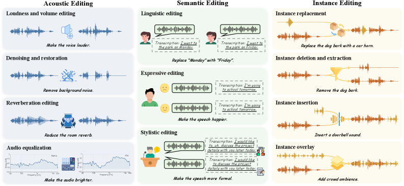
*Figure 1: Taxonomy of audio editing tasks.*

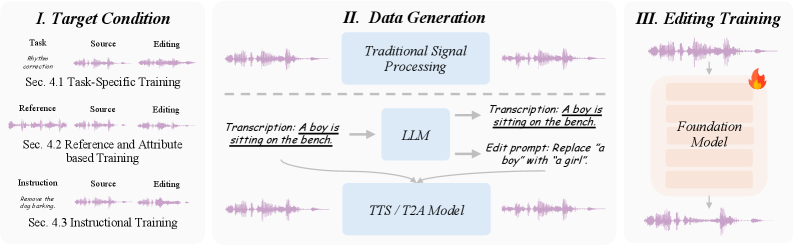
*Figure 2: Overview of training-based audio editing methods.*

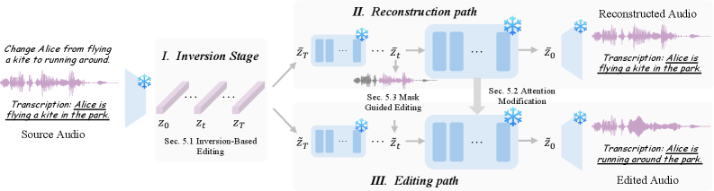
*Figure 3: Overview of training-free audio editing methods.*

---
**Usage Info**: 5661 tokens used.
**Generated at**: 2026-06-23 16:30:08

---

# 📚 ESPnet3: Infrastructure for Scalable Speech and Audio Research in the Foundation Model Era

🚀 URL: https://arxiv.org/html/2606.21854

## 🌏 Abstract (원문)
Recent speech research involves increasingly large datasets, complex models, and diverse experimental workflows. However, existing frameworks require substantial engineering effort to support such experiments. We present ESPnet3, a speech and audio research framework built on a modular system architecture with configuration-driven dataset composition and unified Python-based workflows. ESPnet3 introduces a DataOrganizer abstraction for flexible dataset integration and dataset sharding for memory-efficient large-scale training, while allowing recipe-specific logic through lightweight stage overrides. In OWSM pre-training experiments, ESPnet3 reduces per-epoch training time by21.1 minutescompared to ESPnet2 and achieves>80% GPU utilizationin multi-node training. Fine-tuning experiments show that new models and datasets can be integrated with around46 lines of additional code. ESPnet3 will be publicly released with model checkpoints and training logs.
## 🌏 Abstract (번역)
최근 음성 연구는 점점 더 방대한 데이터셋, 복잡한 모델, 다양한 실험 워크플로우를 포함합니다. 그러나 기존 프레임워크는 이러한 실험을 지원하기 위해 상당한 엔지니어링 노력이 필요합니다. 우리는 구성 기반 데이터셋 구성과 통합된 Python 기반 워크플로우를 갖춘 모듈식 시스템 아키텍처를 기반으로 구축된 음성 및 오디오 연구 프레임워크인 ESPnet3를 소개합니다. ESPnet3는 유연한 데이터셋 통합을 위한 DataOrganizer 추상화와 메모리 효율적인 대규모 훈련을 위한 데이터셋 샤딩을 도입하는 동시에 경량 스테이지 오버라이드를 통해 레시피별 로직을 허용합니다. OWSM 사전 훈련 실험에서 ESPnet3는 ESPnet2에 비해 에포크당 훈련 시간을 21.1분 단축하고 다중 노드 훈련에서 80% 이상의 GPU 활용률을 달성합니다. 미세 조정 실험에서는 약 46줄의 추가 코드로 새로운 모델과 데이터셋을 통합할 수 있음을 보여줍니다. ESPnet3는 모델 체크포인트 및 훈련 로그와 함께 공개될 예정입니다.

## 🔍 Methods & Results
- ESPnet3는 구성 기반 데이터 추상화, 모듈식 시스템 아키텍처, 통합된 엔드투엔드 워크플로우라는 세 가지 아키텍처 원칙을 중심으로 설계되었습니다.
- DataOrganizer 추상화를 도입하여 Hydra 기반 YAML 구성을 통해 데이터셋을 선언적으로 구성할 수 있게 하여, ESPnet2 대비 데이터셋 준비 및 혼합에 필요한 코드 라인과 파일 수를 크게 줄였습니다.
- 대규모 데이터셋(수백만 시간 규모)의 비효율적인 전체 분할 반복을 해결하기 위해 샤드 수준 반복을 구현하여, 에포크 경계에서 전체 데이터셋을 다시 로드하지 않고도 균형 잡힌 커버리지를 보장합니다.
- HuggingFace Datasets를 통한 지연 로딩을 활용하여 데이터셋 메타데이터 로딩 시 CPU RAM 사용량을 ESPnet2의 36GB에서 ESPnet3의 평균 73MB로 크게 줄였으며, 데이터셋 새로 고침 시간도 311.5초에서 13.1초로 단축했습니다.
- BaseSystem 추상화를 통해 데이터 준비, 훈련, 추론, 모델 패키징 등 공통 워크플로우 단계를 중앙 집중화하여 ESPnet2의 레시피별 스크립팅으로 인한 중복 로직과 불일치 문제를 해결했습니다.
- OWSM 훈련 레시피의 오케스트레이션 코드가 ESPnet2의 2,289줄에서 ESPnet3에서는 70줄로 대폭 감소하여 엔지니어링 노력을 크게 절감했습니다.
- OWSM 사전 훈련 실험에서 ESPnet3는 ESPnet2에 비해 에포크당 훈련 시간을 21.1분 단축하고 다중 노드 훈련에서 80% 이상의 GPU 활용률을 달성했습니다.
- 새로운 모델과 데이터셋은 약 46줄의 추가 코드로 통합될 수 있습니다.

## 🖼 Figures

*Figure 1: Comparison of implementation effort between ESPnet2 (V2) and ESPnet3 (V3) for dataset management. (a) ESPnet3 significantly reduces the lines of code to prepare and mix the datasets for large scale training. (b) The number of files required to edit is also minimized.*

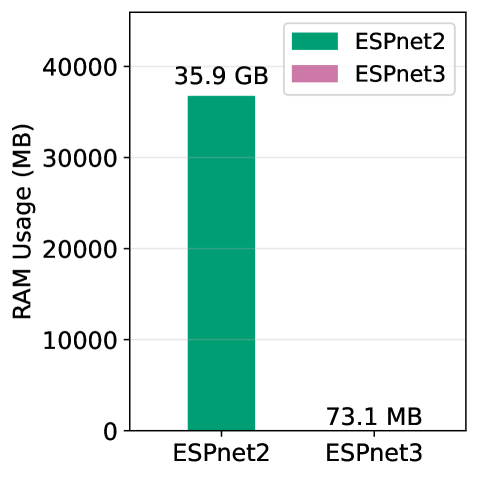
*Figure 2:Memory overhead (left) and dataset refresh time (right) in our OWSM pre-training experiments: ESPnet2 without dataset sharding vs. ESPnet3 with sharding. (64 shards, 16 GPUs).*

*Figure 3:Typical directory structure of an ESPnet3 training recipe, illustrated using the OWSM pretraining setup. Numbers in parentheses indicate lines of code.*

*Figure 4: Execution architecture of ESPnet3. The run.py entry point loads experiment configurations and initializes the System class, which implements workflow stages such as training and inference. Recipe-specific functionality can be introduced by overriding BaseSystem and adding stage functions.*

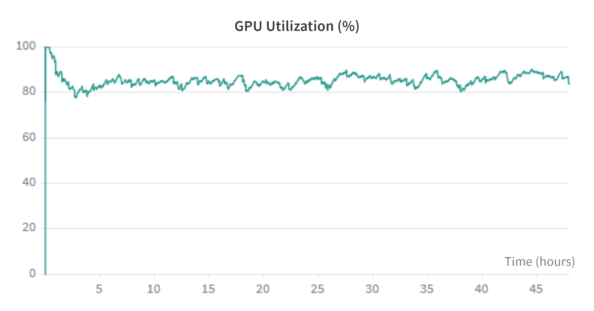
*Figure 5: GPU utilization for 4-node (16 GPUs, accumulation = 1) training. We achieved over 80% scaling efficiency even across nodes (Slingshot interconnect).*

---
**Usage Info**: 2383 tokens used.
**Generated at**: 2026-06-23 16:30:16

---

# 📚 BranchShine: Compact Raw-Audio-to-IPA Transcription with a RoPE E-Branchformer Encoder

🚀 URL: https://arxiv.org/html/2606.22824

## 🌏 Abstract (원문)
Speech-to-IPA transcription is useful when the desired output is pronunciation rather than orthographic text, but competitive multilingual systems are often large and evaluation is sensitive to normalization choices. This paper presents BranchShine, a 33.38M-parameter raw-audio CTC recognizer with a lightweight convolutional front end and a 19-block RoPE E-Branchformer encoder. We find that BranchShine provides a compact and competitive operating point for IPA transcription under matched normalization and scoring. On a 16,660-utterance multilingual test set covering 41 language labels, BranchShine obtains 9.19% whitespace-insensitive IPA character error rate, compared with 9.78% for the 575.00M-parameter PhoneticXEUS baseline. A secondary child speech reading analysis shows a complementary operating profile: BranchShine is more conservative on incorrect readings, while Whisper-Medium is stronger on exact acceptance of correct readings. Overall, the results indicate that a compact raw-audio-to-IPA model can approach much larger baselines on character-level IPA transcription.
## 🌏 Abstract (번역)
음성을 IPA로 전사하는 것은 정자법 텍스트보다는 발음이 원하는 출력일 때 유용하지만, 경쟁력 있는 다국어 시스템은 종종 규모가 크고 평가는 정규화 선택에 민감합니다. 본 논문은 경량 컨볼루션 프론트 엔드와 19개 블록의 RoPE E-Branchformer 인코더를 갖춘 33.38M 매개변수 원시 오디오 CTC 인식기인 BranchShine을 제시합니다. 우리는 BranchShine이 일치하는 정규화 및 채점 하에서 IPA 전사를 위한 작고 경쟁력 있는 작동 지점을 제공한다는 것을 발견했습니다. 41개 언어 레이블을 포함하는 16,660개 발화의 다국어 테스트 세트에서 BranchShine은 공백에 둔감한 IPA 문자 오류율 9.19%를 달성했으며, 이는 575.00M 매개변수 PhoneticXEUS 기준 모델의 9.78%와 비교됩니다. 보조 아동 음성 읽기 분석은 보완적인 작동 프로필을 보여줍니다: BranchShine은 잘못된 읽기에 대해 더 보수적인 반면, Whisper-Medium은 정확한 읽기의 정확한 수용에 더 강합니다. 전반적으로, 결과는 소형 원시 오디오-IPA 모델이 문자 수준 IPA 전사에서 훨씬 더 큰 기준 모델에 근접할 수 있음을 나타냅니다.

## 🔍 Methods & Results
- BranchShine은 CTC 목적 함수를 사용하는 원시 오디오-IPA 인식기이다.
- 모델은 경량 컨볼루션 프론트 엔드, 19개 블록의 RoPE E-Branchformer 인코더, 그리고 IPA 어휘에 대한 선형 CTC 출력 레이어를 사용한다.
- 인코더는 장거리 컨텍스트를 위한 어텐션 브랜치와 로컬 음향 구조를 위한 컨볼루션/CGMLP 브랜치를 결합하며, RoPE(Rotary Position Embeddings)를 통해 상대적 위치 정보를 제공한다.
- 다국어 모델은 33,381,712개의 매개변수를 가지며, 이는 비교 대상 모델들보다 한 자릿수 이상 작다.
- 16,660개 발화로 구성된 41개 언어 레이블의 다국어 테스트 세트에서 BranchShine은 공백에 둔감한 IPA 문자 오류율(CER) 9.19%를 달성했다.
- 이는 575.00M 매개변수 PhoneticXEUS 기준 모델의 9.78% CER보다 우수한 성능이다.
- 아동 음성 읽기 분석에서 BranchShine은 잘못된 읽기에 대해 더 보수적인 반면, Whisper-Medium은 정확한 읽기의 수용에 더 강한 보완적인 작동 프로필을 보인다.
- 전반적으로, 소형 원시 오디오-IPA 모델이 문자 수준 IPA 전사에서 훨씬 더 큰 기준 모델에 근접할 수 있음을 입증했다.

## 🖼 Figures

*Figure 1:Schematic of BranchShine. The figure is intentionally high level and shows the compact raw-audio path used for IPA transcription(
𝑁
,
𝑛
∈
ℕ
)
.*

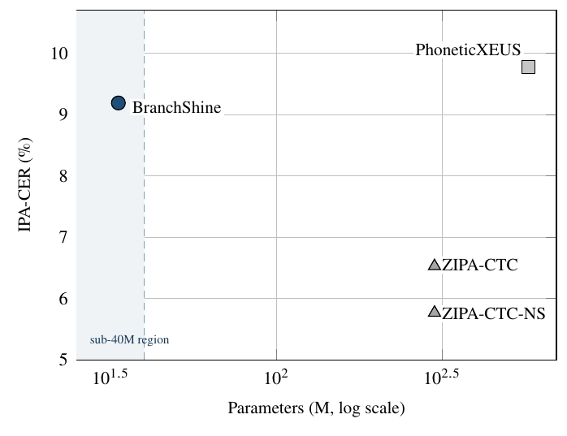
*Figure 2:Parameter efficiency in the main multilingual comparison. BranchShine is much smaller than PhoneticXEUS and lower on IPA-CER, while ZIPA-CTC-NS remains the best overall system.*

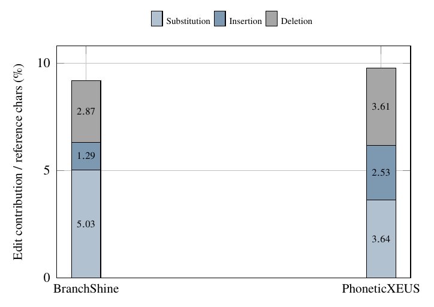
*Figure 3:Edit-operation decomposition for BranchShine and PhoneticXEUS. BranchShine has fewer insertions and deletions but more substitutions, explaining the difference between IPA-CER and exact-match behavior.*

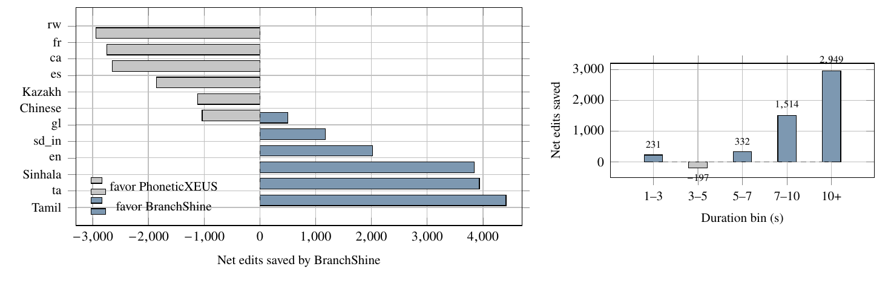
*Figure 4:Edit savings for BranchShine relative to PhoneticXEUS, decomposed by language label and duration bin. Positive values favor BranchShine; negative values favor PhoneticXEUS.*

*Figure 5:Observed evaluation-error trajectories over the available training window for each compact variant. The dashed line marks 150k steps, where BranchShine is already lower than the absolute-position E-Branchformer and RoPE Transformer are after 250k and 350k steps, respectively.*

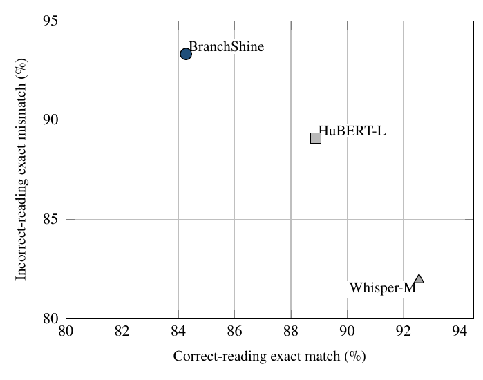
*Figure 6:Correct-reading exact match versus incorrect-reading mismatch on the child speech reading benchmark. BranchShine is the most conservative row shown, while Whisper-Medium has the highest correct-reading exact match.*

---
**Usage Info**: 2053 tokens used.
**Generated at**: 2026-06-23 16:30:28

---

# 📚 CORTIS: Text-Only Adaptation of Spoken Language Models for Task-Oriented Voice Agents

🚀 URL: https://arxiv.org/html/2606.21453

## 🌏 Abstract (원문)
Task-oriented voice agents need to map spoken user requests to structured outputs such as semantic frames, executable actions, and function calls. A common approach is to cascade ASR with a text-based LLM, but transcription errors can propagate to downstream structured output generation, especially under noisy conditions. Spoken language models (SLMs) offer a direct speech-based alternative, yet adapting them to new tasks typically requires paired speech–target annotations. Motivated by this gap, we present CORTIS, a text-only adaptation framework for task-oriented voice agents. CORTIS fine-tunes SLMs using text-form task supervision, enabling speech-based structured output generation at inference time without task-specific speech–target annotations during adaptation. We evaluate CORTIS on two Qwen2.5-Omni backbones and three task-oriented speech datasets, including an in-house product dataset, and compare it with matched ASR–LLM cascades trained with the same text-form task supervision. Results show that CORTIS performs competitively with matched cascades and offers clearer advantages under acoustic degradation, particularly in preserving high-level task semantics. These findings suggest that text-only fine-tuning of SLMs can serve as a practical adaptation strategy for voice agents when paired speech–target data are costly to collect.
## 🌏 Abstract (번역)
작업 지향 음성 에이전트는 사용자의 음성 요청을 의미 프레임, 실행 가능한 동작, 함수 호출과 같은 구조화된 출력으로 매핑해야 합니다. 일반적인 접근 방식은 ASR과 텍스트 기반 LLM을 계단식으로 연결하는 것이지만, 특히 노이즈가 많은 환경에서는 전사 오류가 다운스트림 구조화된 출력 생성으로 전파될 수 있습니다. 음성 언어 모델(SLM)은 직접적인 음성 기반 대안을 제공하지만, 새로운 작업에 적응시키려면 일반적으로 음성-타겟 쌍 주석이 필요합니다. 이러한 격차에 동기를 부여받아, 우리는 작업 지향 음성 에이전트를 위한 텍스트 전용 적응 프레임워크인 CORTIS를 제시합니다. CORTIS는 텍스트 형태의 작업 감독을 사용하여 SLM을 미세 조정하여, 적응 과정에서 작업별 음성-타겟 주석 없이 추론 시 음성 기반 구조화된 출력 생성을 가능하게 합니다. 우리는 두 개의 Qwen2.5-Omni 백본과 사내 제품 데이터셋을 포함한 세 가지 작업 지향 음성 데이터셋에서 CORTIS를 평가하고, 동일한 텍스트 형태의 작업 감독으로 훈련된 일치하는 ASR-LLM 계단식 시스템과 비교했습니다. 결과는 CORTIS가 일치하는 계단식 시스템과 경쟁적인 성능을 보이며, 특히 높은 수준의 작업 의미론을 보존하는 데 있어 음향 저하 환경에서 더 명확한 이점을 제공함을 보여줍니다. 이러한 발견은 음성-타겟 쌍 데이터 수집 비용이 많이 들 때 SLM의 텍스트 전용 미세 조정이 음성 에이전트를 위한 실용적인 적응 전략으로 사용될 수 있음을 시사합니다.

## 🔍 Methods & Results
- 기존 ASR-LLM 계단식 시스템의 전사 오류 전파 문제와 SLM의 작업별 음성-타겟 주석 필요성 문제를 해결하기 위해 CORTIS 프레임워크를 제안했습니다.
- CORTIS는 작업 지향 음성 에이전트를 위한 텍스트 전용 적응 프레임워크로, 텍스트 형태의 작업 감독을 사용하여 SLM을 미세 조정합니다.
- CORTIS는 적응 과정에서 작업별 음성-타겟 주석 없이 추론 시 음성 기반 구조화된 출력 생성을 가능하게 합니다.
- CORTIS는 두 개의 Qwen2.5-Omni 백본과 세 가지 작업 지향 음성 데이터셋(사내 제품 데이터셋 포함)에서 평가되었습니다.
- 동일한 텍스트 형태의 작업 감독으로 훈련된 ASR-LLM 계단식 시스템과 비교한 결과, CORTIS는 경쟁적인 성능을 보였습니다.
- 특히 음향 저하 환경에서 CORTIS는 높은 수준의 작업 의미론을 보존하는 데 있어 ASR-LLM 계단식 시스템보다 더 명확한 이점을 제공했습니다.
- 이러한 결과는 음성-타겟 쌍 데이터 수집 비용이 높을 때 SLM의 텍스트 전용 미세 조정이 음성 에이전트를 위한 실용적인 적응 전략이 될 수 있음을 시사합니다.

## 🖼 Figures
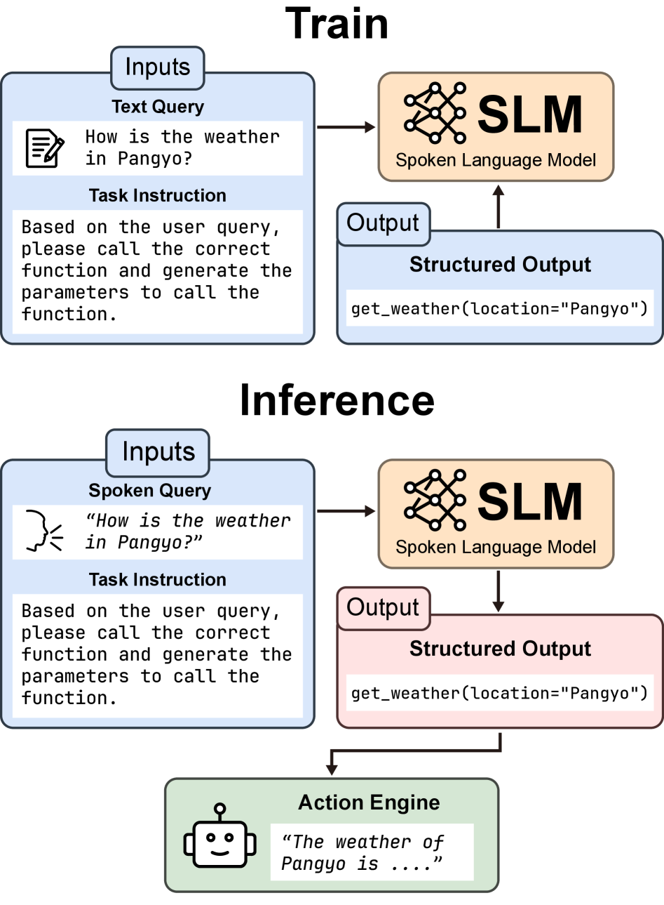
*Figure 1:Overview of the CORTIS framework.*

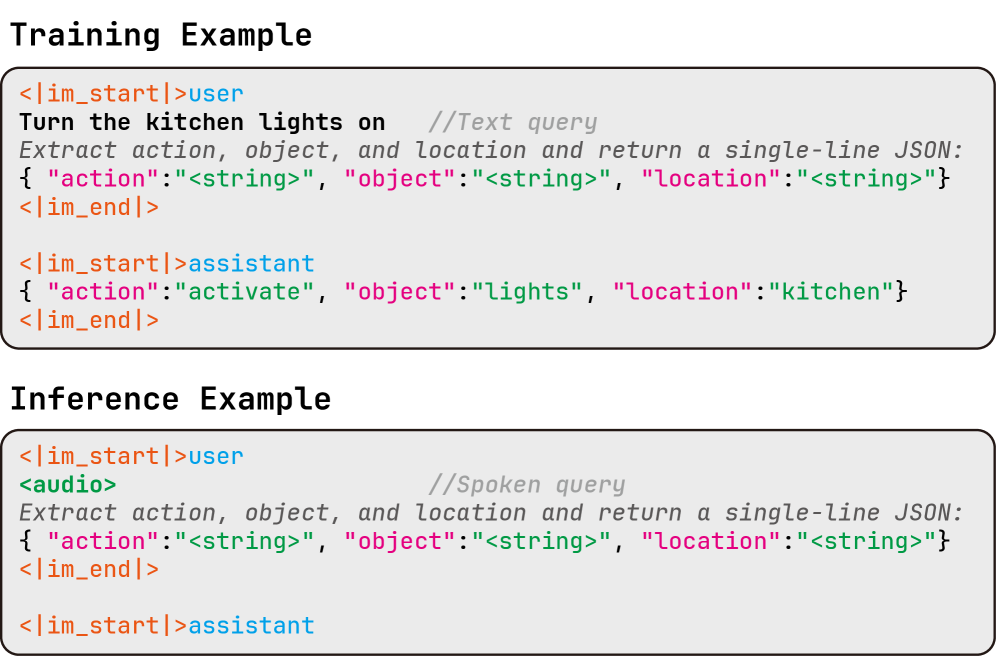
*Figure 2:CORTIS training and inference prompt formats illustrated with an FSC example.*

![Figure 3: Performance of CORTIS-tuned SLMs and the ASR-LLM cascades under increasing babble noise. Top: absolute performance on FSC, SLURP (intent accuracy, entity F1, SLU-F1), and the in-house dataset. Bottom: per-condition performance difference between CORTIS and the cascade (CORTIS 
−
 ASR-LLM cascade), where positive values indicate that CORTIS performs better. Gray bands indicate oracle-text upper-bound references obtained with gold transcripts. Detailed numerical results are provided in Appendix B.](../images/2026-06-23/2606.21453/2606.21453_fig2.png)
*Figure 3: Performance of CORTIS-tuned SLMs and the ASR-LLM cascades under increasing babble noise. Top: absolute performance on FSC, SLURP (intent accuracy, entity F1, SLU-F1), and the in-house dataset. Bottom: per-condition performance difference between CORTIS and the cascade (CORTIS 
−
 ASR-LLM cascade), where positive values indicate that CORTIS performs better. Gray bands indicate oracle-text upper-bound references obtained with gold transcripts. Detailed numerical results are provided in Appendix B.*

---
**Usage Info**: 1806 tokens used.
**Generated at**: 2026-06-23 16:30:36

---

# 📚 Bagpiper-Edit: Zero-Shot Open-Ended Audio Editing via Rich-Caption

🚀 URL: https://arxiv.org/html/2606.21227

## 🌏 Abstract (원문)
Current text-guided audio editing methods rely on paired training data, predefined operation templates, and separate processing pipelines across speech, music, and sound. We present Bagpiper-Edit to enable open-ended audio editing via free-form natural language instructions. We reformulate audio editing as a rich-caption rewriting task by treating a rich caption as the semantic representation of an audio clip. The user request is translated into an edited caption, which then guides Bagpiper-Edit to generate the target edited audio with the original audio as contextual acoustic anchor. This unlocks the potential of free-form editing, and circumvents the need for paired audio-editing training data, enabling powerful zero-shot editing capabilities. Evaluations across speech, audio, and free-form editing show Bagpiper-Edit maintains good consistency to the original audio and achieves similar performance to other expert models in most cases. Demo: https://bagpiper-edit.github.io
## 🌏 Abstract (번역)
현재 텍스트 기반 오디오 편집 방법은 쌍을 이루는 훈련 데이터, 미리 정의된 작업 템플릿, 그리고 음성, 음악, 사운드 전반에 걸쳐 분리된 처리 파이프라인에 의존합니다. 우리는 자유 형식의 자연어 지시를 통해 개방형 오디오 편집을 가능하게 하는 Bagpiper-Edit을 제시합니다. 우리는 풍부한 캡션을 오디오 클립의 의미론적 표현으로 취급하여 오디오 편집을 풍부한 캡션 재작성 작업으로 재구성합니다. 사용자 요청은 편집된 캡션으로 번역되며, 이 캡션은 Bagpiper-Edit이 원본 오디오를 문맥적 음향 앵커로 사용하여 목표 편집 오디오를 생성하도록 안내합니다. 이는 자유 형식 편집의 잠재력을 열어주고, 쌍을 이루는 오디오 편집 훈련 데이터의 필요성을 우회하여 강력한 제로샷 편집 기능을 가능하게 합니다. 음성, 오디오 및 자유 형식 편집 전반에 걸친 평가는 Bagpiper-Edit이 원본 오디오에 대한 좋은 일관성을 유지하며 대부분의 경우 다른 전문가 모델과 유사한 성능을 달성함을 보여줍니다. 데모: https://bagpiper-edit.github.io

## 🔍 Methods & Results
- Bagpiper-Edit은 자유 형식의 자연어 지시를 통해 개방형 오디오 편집을 가능하게 하는 새로운 방법론을 제안한다.
- 오디오 편집을 풍부한 캡션 재작성 작업으로 재구성하며, 풍부한 캡션을 오디오 클립의 의미론적 표현으로 사용한다.
- 사용자 요청을 편집된 캡션으로 번역하고, 이 캡션이 Bagpiper-Edit이 원본 오디오를 문맥적 음향 앵커로 사용하여 목표 편집 오디오를 생성하도록 안내한다.
- 쌍을 이루는 오디오 편집 훈련 데이터의 필요성을 우회하여 강력한 제로샷 편집 기능을 가능하게 한다.
- 음성, 오디오 및 자유 형식 편집 전반에 걸친 평가에서 Bagpiper-Edit은 원본 오디오에 대한 좋은 일관성을 유지했다.
- 대부분의 경우 다른 전문가 모델과 유사한 성능을 달성했다.

## 🖼 Figures
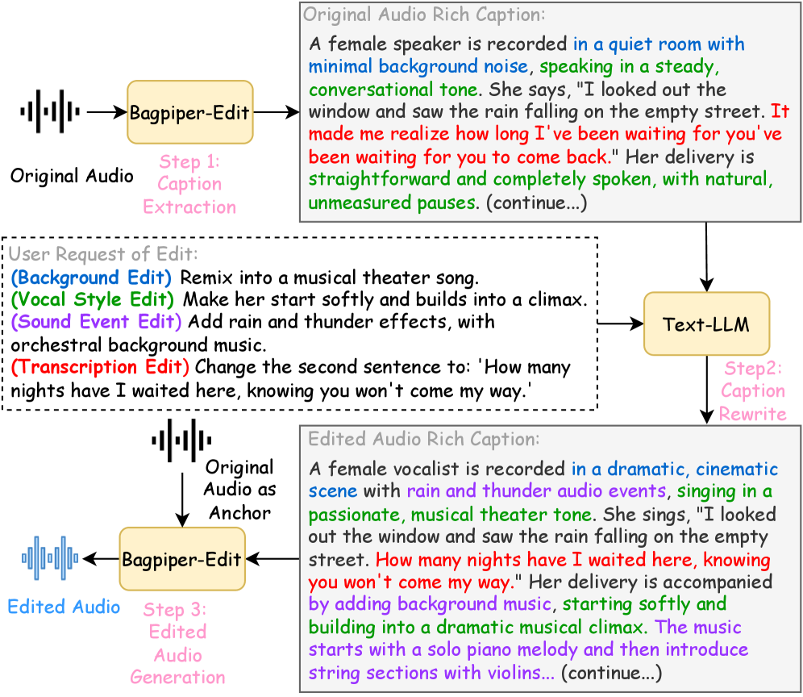
*Figure 1:Bagpiper-Edit treats a rich caption as the semantic representation of an audio clip, and defines editing as a text-space transformation before materializing the edited audio via anchored original audio.*

*Figure 2: Dialogue patterns for Bagpiper-Edit. (a) The Single-Turn (ST) pattern concatenates captions and audio within a single interaction turn. (b) The Multi-Turn (MT) pattern structures the input as a two-round sequential dialogue. U denotes user and A denotes assistant, both are special tags inherited from Bagpiper-Base.*

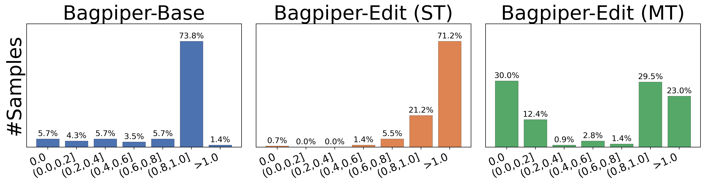
*Figure 3: Histogram WER distributions of the full-sentence transcription replacement task (i.e. voice cloning task) for Bagpiper-Base, Bagpiper-Edit (ST), Bagpiper-Edit (MT).*

---
**Usage Info**: 1401 tokens used.
**Generated at**: 2026-06-23 16:30:42

---

# 📚 Gradient-Based Learning of Parametric Engine Sound Representations for Real-Time Resynthesis and Tuning on Embedded Systems

🚀 URL: https://arxiv.org/html/2606.21521

## 🌏 Abstract (원문)
Engine order enhancement is central in automotive sound design, where selective harmonics are synthesized to shape perceptual qualities such as sportiness, refinedness, or power. This paper investigates a neural network-based approach to combustion engine sound modeling that extends conventional engine order analysis and enhancement by deriving synthesis parameters from audio data with machine learning and incorporating stochastic components into the synthesis framework. The system parameterizes engine sounds as a compact representation capturing per-order and broadband timbral variation across the full RPM-torque operating range, while remaining manually tunable and compatible with established automotive audio frameworks. The approach leverages gradient-based optimization and analysis-by-synthesis through an end-to-end differentiable implementation. The resulting synthesis parameter set is directly transferable to conventional DSP implementations for deployment on embedded targets. Spectral metrics and listening tests111Audio examples are available onlinehttps://rdoerfler.github.io/eone-model-page/confirm high reconstruction fidelity, and integration into an established automotive audio development platform (EVx Suite) demonstrates technical feasibility on deployment-ready embedded systems.
## 🌏 Abstract (번역)
엔진 오더 향상은 자동차 사운드 디자인의 핵심으로, 스포티함, 세련됨, 파워와 같은 지각적 품질을 형성하기 위해 선택적 고조파가 합성됩니다. 본 논문은 기계 학습을 통해 오디오 데이터에서 합성 매개변수를 도출하고 합성 프레임워크에 확률적 구성 요소를 통합함으로써 기존 엔진 오더 분석 및 향상을 확장하는 연소 엔진 사운드 모델링을 위한 신경망 기반 접근 방식을 연구합니다. 이 시스템은 전체 RPM-토크 작동 범위에 걸쳐 오더별 및 광대역 음색 변화를 포착하는 압축된 표현으로 엔진 사운드를 매개변수화하며, 수동으로 튜닝 가능하고 기존 자동차 오디오 프레임워크와 호환됩니다. 이 접근 방식은 종단 간 미분 가능한 구현을 통해 기울기 기반 최적화 및 분석-합성을 활용합니다. 결과로 생성된 합성 매개변수 세트는 임베디드 타겟에 배포하기 위해 기존 DSP 구현으로 직접 전송 가능합니다. 스펙트럼 측정 및 청취 테스트111오디오 예시는 온라인에서 확인 가능합니다.https://rdoerfler.github.io/eone-model-page/는 높은 재구성 충실도를 확인하며, 기존 자동차 오디오 개발 플랫폼(EVx Suite)에 통합되어 배포 준비가 된 임베디드 시스템에서의 기술적 타당성을 입증합니다.

## 🔍 Methods & Results
- 엔진 사운드를 RPM-토크 작동 범위 전반에 걸쳐 오더별 및 광대역 음색 변화를 포착하는 압축된 표현으로 매개변수화하며, 수동 튜닝 가능하고 기존 엔진 오더 향상(EOE) 합성 프레임워크와 호환되도록 모델링합니다.
- 엔진 사운드는 발화 주파수(f0)의 정수배로 주파수 궤적을 갖는 고조파 엔진 오더와 광대역 노이즈 구성 요소의 합으로 모델링되며, 각 고조파 및 대역별 진폭이 주어진 RPM-토크 상태에서 음향 출력을 결정합니다.
- RPM과 토크에 대한 2D 진폭 맵을 독립적인 1D 함수로 분해하여 메모리 오버헤드를 줄이고 기존 EOE 워크플로우와 자연스럽게 일치시켰으며, RPM 및 토크 이득 함수의 곱셈 조합이 최상의 재구성 결과를 보였습니다.
- 전통적인 엔진 오더 추출 방법 대신, 합성된 출력을 목표 음향 신호와 직접 비교하여 합성 매개변수를 결정하는 분석-합성(analysis-by-synthesis) 접근 방식을 채택하여 FFT 윈도잉 아티팩트 및 스펙트럼 누출에 대한 견고성을 확보했습니다.
- 모델은 팀버 인코더-디코더(Timbre Encoder-Decoder), 커브 뱅크(Curve Bank), 제어 투영(Control Projection), 합성(Synthesis)의 네 단계로 구성됩니다.
- 팀버 인코더-디코더는 VQT(Variable-Q Transform) 스펙트로그램에서 엔진 음색의 구조화된 잠재 공간을 구축하며, 인코더는 VQT 프레임을 공통 특징 차원으로 압축하고, 양방향 GRU가 시간적 패턴을 통합하며, MLP가 이 디스크립터를 z∈ℝ32로 투영합니다.
- 4개의 선형 디코더 헤드가 z를 고조파 및 노이즈 구성 요소에 대한 RPM 및 토크 이득 매개변수로 매핑하며, 이는 Softplus 활성화 함수를 통해 초기 커브 뱅크(Grpm, Gtrq∈ℝK×P)를 형성합니다.
- 이득 곡선(Grpm, Gtrq)은 정적 테이블이며, 시간 변화하는 소프트 제어 마스크에 선형 보간을 통해 투영되어 기울기 기반 최적화를 가능하게 하고, 추론 시에는 테이블 조회로 변환됩니다.
- 합성기는 종단 간 기울기 기반 최적화를 위해 완전히 미분 가능하게 구현되었으며, 임베디드 타겟에 배포하기 위한 기존 DSP 구현으로 직접 변환 가능합니다.
- 고조파는 RPM 신호에서 파생된 시간 변화하는 f0 궤적을 사용하여 전통적인 가산 합성 방식으로 합성되며, 노이즈 구성 요소는 독립적인 무작위 위상 스펙트럼과 역실수 FFT를 적용한 필터링된 노이즈 밴크를 사용하여 합성됩니다.
- 훈련 절차는 두 단계로 나뉩니다: 먼저, 팀버 인코더-디코더는 다양한 엔진 녹음 코퍼스에서 일반화 가능한 엔진 음색 표현을 학습하기 위해 사전 훈련됩니다.
- 두 번째로, 이득 곡선 매개변수는 목표 자료에 직접 미세 조정되며, 사전 훈련된 인코더-디코더는 초기화 소스로만 사용되고, 곡률 정규화 항이 적용되어 부드러운 이득 함수를 촉진합니다.
- 손실 함수는 다중 해상도 단시간 푸리에 변환(STFT) 손실과 캠벨 다이어그램에서 영감을 받은 추가적인 고조파 손실을 사용합니다.
- 재구성 품질은 로그 스펙트럼 거리(LSD)를 사용하여 객관적으로 평가되었으며, 청취 실험을 통해 12명의 참가자(전문가 6명, 비전문가 6명)가 목표 녹음(REC), EONE 재구성, 그리고 36개의 고조파만 사용한 EOE(기준선)의 현실감을 평가했습니다.
- 스펙트럼 측정 및 청취 테스트를 통해 높은 재구성 충실도가 확인되었으며, EVx Suite에 통합되어 배포 준비가 된 임베디드 시스템에서의 기술적 타당성이 입증되었습니다.

## 🖼 Figures
![Figure 1:Input audio is provided as VQT spectrograms and encoded to a compact latent timbre representation 
𝑧
, before being decoded into two sets of Softplus-activated gain curves 
𝐺
rpm
,
𝐺
trq
∈
ℝ
𝐾
×
𝑃
, forming the shared parametrization for end-to-end training and direct DSP export at inference. RPM and torque gain curves are each projected onto their respective temporal soft-masks to yield time-varying amplitude envelopes, which are multiplied element-wise and upsampled to audio rate. The resulting amplitudes drive a differentiable harmonic synthesizer with 
𝑓
0
 derived from the RPM trajectory, and an ERB noise bank. During pretraining, encoder and decoder are jointly optimized; during finetuning, the curve bank parameters — initialized from the pretrained decoder output — are optimized directly. Training minimizes a combined MRSTFT and harmonic loss against the target audio.](../images/2026-06-23/2606.21521/2606.21521_fig0.png)
*Figure 1:Input audio is provided as VQT spectrograms and encoded to a compact latent timbre representation 
𝑧
, before being decoded into two sets of Softplus-activated gain curves 
𝐺
rpm
,
𝐺
trq
∈
ℝ
𝐾
×
𝑃
, forming the shared parametrization for end-to-end training and direct DSP export at inference. RPM and torque gain curves are each projected onto their respective temporal soft-masks to yield time-varying amplitude envelopes, which are multiplied element-wise and upsampled to audio rate. The resulting amplitudes drive a differentiable harmonic synthesizer with 
𝑓
0
 derived from the RPM trajectory, and an ERB noise bank. During pretraining, encoder and decoder are jointly optimized; during finetuning, the curve bank parameters — initialized from the pretrained decoder output — are optimized directly. Training minimizes a combined MRSTFT and harmonic loss against the target audio.*

*Figure 2:Mean realism ratings for naive and expert listeners across EOE, EONE, and REC. Asterisks (
∗
) indicate significant differences between bracketed groups: EOE vs. EONE, EOE vs. REC, and EONE vs. REC (experts only).*

*Figure 3:Comparison of target recording and corresponding EOE and EONE predictions for a representative listening test sample. Inclusion of stochastic components yields spectral characteristics closer to the target, consistent with perceptual evaluation results. Spectrograms computed using STFT with a Blackman–Harris window of 8192 samples, FFT size 32768, and hop size 512 samples. Color indicates magnitude level in dB.*

---
**Usage Info**: 6897 tokens used.
**Generated at**: 2026-06-23 16:30:56

---

# 📚 Exploiting Neural Audio Codec Latents for Adversarial Audio Attacks

🚀 URL: https://arxiv.org/html/2606.20893

## 🌏 Abstract (원문)
Deep learning–based audio classification systems, including automatic speaker verification, are vulnerable to adversarial attacks. Realistic real-time threat assessment remains difficult because optimization-based methods, such as projected gradient descent (PGD) and Carlini–Wagner, require costly iterative updates in the high-dimensional waveform domain. Generative attacks allow single-shot synthesis but often introduce perceptible artifacts or depend on computationally intensive architectures, while diffusion and autoregressive approaches incur high inference latency. To address this gap, we propose a generative attack framework operating in the continuous latent space of a neural audio codec. A conditional generator synthesizes class-specific perturbations in a single forward pass and decodes them into adversarial waveforms. Our method achieves targeted attack success rates up to99%99\%with sub-77ms inference, outperforming generative baselines while reducing latency by24×24\times.
## 🌏 Abstract (번역)
자동 화자 확인을 포함한 딥러닝 기반 오디오 분류 시스템은 적대적 공격에 취약합니다. 투영 경사 하강법(PGD) 및 Carlini-Wagner와 같은 최적화 기반 방법은 고차원 파형 도메인에서 비용이 많이 드는 반복적인 업데이트를 필요로 하기 때문에 현실적인 실시간 위협 평가는 여전히 어렵습니다. 생성적 공격은 단일 샷 합성을 허용하지만 종종 인지 가능한 아티팩트를 도입하거나 계산 집약적인 아키텍처에 의존하며, 확산 및 자기회귀 접근 방식은 높은 추론 지연 시간을 발생시킵니다. 이러한 격차를 해소하기 위해 우리는 신경 오디오 코덱의 연속 잠재 공간에서 작동하는 생성적 공격 프레임워크를 제안합니다. 조건부 생성기는 단일 순방향 패스에서 클래스별 교란을 합성하고 이를 적대적 파형으로 디코딩합니다. 우리의 방법은 7ms 미만의 추론 시간으로 최대 99%의 표적 공격 성공률을 달성하며, 생성적 기준선을 능가하고 지연 시간을 24배 단축합니다.

## 🔍 Methods & Results
- 신경 오디오 코덱의 연속 잠재 공간에서 작동하는 화이트박스 생성적 적대적 프레임워크를 제안합니다.
- 이 프레임워크는 오디오를 잠재 공간으로 매핑하는 고정된 코덱 인코더(DAC), 학습 가능한 조건부 생성기(Gθ), 파형을 재구성하는 고정된 코덱 디코더, 그리고 파형을 피해자 모델에 연결하는 미분 가능한 음향 전처리기로 구성됩니다.
- 생성기 Gθ는 대상(클래스 레이블 또는 화자 임베딩)에 따라 조건화되며, DAC 잠재 공간에서 잔여 교란을 출력하여 단일 순방향 패스로 적대적 잠재 시퀀스를 생성합니다.
- 폐쇄형 분류(교차 엔트로피 + Carlini-Wagner 마진 손실) 및 개방형 메트릭 학습(코사인 유사도 + 기하학적 마진 손실)을 모두 수용하는 통합 복합 손실 함수를 사용하여 생성기를 훈련하며, 음향 충실도 유지를 위해 L2 정규화를 포함합니다.
- 생성기 가중치는 비볼록 적대적 최적화 안정화를 위해 지수 이동 평균(EMA)을 사용하여 유지됩니다.
- 제안된 방법은 7ms 미만의 추론 시간으로 최대 99%의 표적 공격 성공률을 달성하며, 기존 생성적 기준선보다 우수하고 추론 지연 시간을 24배 단축합니다.

## 🖼 Figures
![Figure 1:Architectural overview of the proposed end-to-end latent-space adversarial attack framework. The clean input waveform 
𝑥
 is first projected into a continuous, lower-dimensional manifold 
𝑧
 via the frozen DAC Encoder (
𝐸
𝐷
​
𝐴
​
𝐶
). The trainable conditional generator (
𝐺
𝜃
, highlighted in orange) synthesizes a targeted perturbation 
𝛿
𝑧
 by fusing the pristine latent 
𝑧
 with the target class embedding 
𝑦
𝑡
. The perturbed latent 
𝑧
𝑎
​
𝑑
​
𝑣
 is then reconstructed into the adversarial waveform 
𝑥
𝑎
​
𝑑
​
𝑣
 through the frozen DAC Decoder (
𝐷
𝐷
​
𝐴
​
𝐶
). To bridge the time-domain audio and the frozen victim classifier, a fully differentiable acoustic feature extractor (
𝒫
) is utilized. The dashed line illustrates the continuous gradient flow (backpropagation) from the victim classifier's composite loss all the way back to the latent generator, enabling single-shot, waveform-optimized attacks without relying on iterative inference-time optimization.](../images/2026-06-23/2606.20893/2606.20893_fig0.png)
*Figure 1:Architectural overview of the proposed end-to-end latent-space adversarial attack framework. The clean input waveform 
𝑥
 is first projected into a continuous, lower-dimensional manifold 
𝑧
 via the frozen DAC Encoder (
𝐸
𝐷
​
𝐴
​
𝐶
). The trainable conditional generator (
𝐺
𝜃
, highlighted in orange) synthesizes a targeted perturbation 
𝛿
𝑧
 by fusing the pristine latent 
𝑧
 with the target class embedding 
𝑦
𝑡
. The perturbed latent 
𝑧
𝑎
​
𝑑
​
𝑣
 is then reconstructed into the adversarial waveform 
𝑥
𝑎
​
𝑑
​
𝑣
 through the frozen DAC Decoder (
𝐷
𝐷
​
𝐴
​
𝐶
). To bridge the time-domain audio and the frozen victim classifier, a fully differentiable acoustic feature extractor (
𝒫
) is utilized. The dashed line illustrates the continuous gradient flow (backpropagation) from the victim classifier's composite loss all the way back to the latent generator, enabling single-shot, waveform-optimized attacks without relying on iterative inference-time optimization.*

*Figure 2:Detailed architecture of the Conditional Latent Generator (
𝐺
𝜃
). The network utilizes a multi-scale temporal receptive field (Conv1D) to process the fused continuous representation. A residual skip connection scaled by a learnable parameter 
𝛼
 ensures training stability, while zero-initialization of the final layer guarantees negligible initial perturbation.*

---
**Usage Info**: 2870 tokens used.
**Generated at**: 2026-06-23 16:31:03

---

# 📚 STAR-VAE: Structured Topology-Aware Regularization for Audio Reconstruction and Generation

🚀 URL: https://arxiv.org/html/2606.23064

## 🌏 Abstract (원문)
Continuous Variational Autoencoders (VAEs) serve as the fundamental continuous tokenizer for modern neural audio generation systems, enabling high-fidelity reconstruction while providing a compact, smooth latent space for downstream generative priors.However, continuous VAEs face a fundamental conflict when balancingcompression rate,reconstruction fidelity, andlatent space topology—a challenge we formalize as theRate-Distortion-Regularity Trilemma. This trilemma stems from a criticaltopological mismatch: the prevailing isotropic Gaussian prior in standard VAEs imposes aflatlatent geometry that fails to accommodate audio’shierarchicalnature, where low-frequency components are structured and compressible while high-frequency components are stochastic and incompressible, leading todisordered information packingwhere crucial semantic features are randomly interleaved with high-entropy noise.To resolve this challenge, we proposeStructured Topology-Aware Regularization (STAR), a general training strategy that reshapes latent space geometry by imposing a growth-based constraint field, routing structural and textural information into channel subspaces with matching capacities. STAR is applicable to any VAE architecture and effectively resolves the trilemma, as demonstrated in CNN-based VAEs. To fully exploit STAR’s potential, we presentSTAR-VAE, combining STAR with a hybrid CNN-Mamba architecture that synergizes local feature extraction with linear-complexity global context modeling, achieving state-of-the-art performance. We further proposeSTAR-Gen, an LLM-based Flow Matching framework that leverages STAR-VAE’s structured latent space for high-fidelity generation without suffering from vector quantization artifacts.Empirical results demonstrate that STAR-VAE successfully resolves the trilemma, achieving state-of-the-art reconstruction fidelity and enhanced semantic information preservation across diverse audio domains. The structured latent space improves both traditional diffusion models and ourSTAR-Genparadigm, achieving state-of-the-art performance in text-to-audio generation. The project page is available athttps://STAR-VAE.github.io.
## 🌏 Abstract (번역)
연속 변이형 오토인코더(VAE)는 현대 신경 오디오 생성 시스템의 근본적인 연속 토크나이저 역할을 하며, 고충실도 재구성을 가능하게 하고 다운스트림 생성 사전 학습을 위한 압축되고 부드러운 잠재 공간을 제공합니다. 그러나 연속 VAE는 압축률, 재구성 충실도, 잠재 공간 토폴로지 간의 균형을 맞추는 데 있어 근본적인 충돌에 직면합니다. 우리는 이 문제를 '속도-왜곡-규칙성 삼중고(Rate-Distortion-Regularity Trilemma)'로 공식화합니다. 이 삼중고는 결정적인 토폴로지 불일치에서 비롯됩니다. 즉, 표준 VAE의 일반적인 등방성 가우시안 사전은 오디오의 계층적 특성(저주파 구성 요소는 구조화되고 압축 가능하며, 고주파 구성 요소는 확률적이고 비압축적임)을 수용하지 못하는 평평한 잠재 기하학을 부과하여, 중요한 의미론적 특징이 고엔트로피 노이즈와 무질서하게 섞이는 '무질서한 정보 패킹(disordered information packing)'을 초래합니다. 이 문제를 해결하기 위해 우리는 '구조화된 토폴로지 인식 정규화(Structured Topology-Aware Regularization, STAR)'를 제안합니다. 이는 성장 기반 제약 필드를 부과하여 잠재 공간 기하학을 재구성하고, 구조적 및 텍스처 정보를 일치하는 용량의 채널 부분 공간으로 라우팅하는 일반적인 훈련 전략입니다. STAR는 모든 VAE 아키텍처에 적용 가능하며, CNN 기반 VAE에서 입증된 바와 같이 삼중고를 효과적으로 해결합니다. STAR의 잠재력을 최대한 활용하기 위해 우리는 STAR와 하이브리드 CNN-Mamba 아키텍처를 결합하여 지역 특징 추출과 선형 복잡도 전역 컨텍스트 모델링을 시너지 효과로 발휘하는 STAR-VAE를 제시하며, 최첨단 성능을 달성합니다. 또한 우리는 STAR-VAE의 구조화된 잠재 공간을 활용하여 벡터 양자화 아티팩트 없이 고충실도 생성을 가능하게 하는 LLM 기반 플로우 매칭 프레임워크인 STAR-Gen을 제안합니다. 경험적 결과는 STAR-VAE가 삼중고를 성공적으로 해결하여 다양한 오디오 도메인에서 최첨단 재구성 충실도와 향상된 의미 정보 보존을 달성함을 보여줍니다. 구조화된 잠재 공간은 전통적인 확산 모델과 우리의 STAR-Gen 패러다임 모두를 개선하여 텍스트-오디오 생성에서 최첨단 성능을 달성합니다. 프로젝트 페이지는 https://STAR-VAE.github.io에서 확인할 수 있습니다.

## 🔍 Methods & Results
- 표준 연속 VAE는 오디오의 계층적 특성(저주파는 구조화되고 고주파는 확률적)과 등방성 가우시안 사전 간의 토폴로지 불일치로 인해 '속도-왜곡-규칙성 삼중고'에 직면하며, 이는 의미론적 특징과 노이즈가 무질서하게 섞이는 '무질서한 정보 패킹'을 초래한다.
- 이 문제를 해결하기 위해, 잠재 공간에 계층적 토폴로지를 유도하는 일반적인 훈련 전략인 '구조화된 토폴로지 인식 정규화(STAR)'를 제안하며, 이는 균일한 KL 페널티를 '구조화된 제약 필드'로 대체한다.
- STAR는 채널별 페널티 벡터에 감마-성장 함수(볼록 할당, γ > 1)를 사용하여 '용량 기울기'를 생성하고, 오디오의 꼬리가 두꺼운 스펙트럼 분포에 맞춰 잠재 공간 용량을 할당한다. 이는 인코더가 정보를 밀도에 따라 정렬하여 전역 구조를 낮은 채널 인덱스(구조 부분 공간)로, 지역 텍스처를 높은 채널 인덱스로 라우팅하도록 강제한다.
- STAR는 하이브리드 CNN-Mamba 아키텍처와 결합되어 STAR-VAE를 구성한다. 인코더는 CNN을 사용하여 지역 다운샘플링을 수행하고, 양방향 Mamba 백본을 사용하여 선형 복잡도의 전역 컨텍스트 모델링을 수행하며, 디코더는 이 구조를 대칭적으로 따른다.
- STAR-Gen은 STAR-VAE의 구조화된 잠재 공간을 활용하여 벡터 양자화 아티팩트 없이 고충실도 오디오 생성을 가능하게 하는 LLM 기반 플로우 매칭 프레임워크이다. 이는 인과적 트랜스포머 디코더를 조건부 속도 추정기로 사용하며, 텍스트 조건에는 인과적 마스킹을, 노이즈 오디오 잠재 변수에는 양방향 마스킹을 적용하는 하이브리드 어텐션 메커니즘을 사용한다.
- 실험 결과, STAR-VAE는 삼중고를 성공적으로 해결하여 최첨단 재구성 충실도와 다양한 오디오 도메인에서 향상된 의미 정보 보존을 달성했다. 구조화된 잠재 공간은 전통적인 확산 모델과 STAR-Gen 패러다임 모두를 개선하여 텍스트-오디오 생성에서 최첨단 성능을 달성한다.

## 🖼 Figures
![Figure 1:Conceptual illustration. Left visualizes audio’s intrinsic hierarchy using a metaphor where geometric blocks represent Global Structure (e.g., impact sounds) and scattered fragments represent Stochastic Textures (e.g., splashes). Top Right: Standard Isotropic VAEs assign equal capacity to all channels, leading to disordered feature interleaving and information loss. Bottom Right: The proposed Structured Topology-Aware Regularization imposes a Capacity Gradient (tapered channels) that implicitly sorts features, routing complex structure to high-capacity channels and stochastic details to low-capacity ones.](../images/2026-06-23/2606.23064/2606.23064_fig0.png)
*Figure 1:Conceptual illustration. Left visualizes audio’s intrinsic hierarchy using a metaphor where geometric blocks represent Global Structure (e.g., impact sounds) and scattered fragments represent Stochastic Textures (e.g., splashes). Top Right: Standard Isotropic VAEs assign equal capacity to all channels, leading to disordered feature interleaving and information loss. Bottom Right: The proposed Structured Topology-Aware Regularization imposes a Capacity Gradient (tapered channels) that implicitly sorts features, routing complex structure to high-capacity channels and stochastic details to low-capacity ones.*

![Figure 2:Overview of the STAR-VAE (Left) and STAR-Gen (Right) framework. Left: The STAR-VAE encoder projects raw audio into a hierarchically organized latent space, explicitly sorting features by information density via the STAR regularization. Right: The generative model, STAR-Gen, represents a paradigm shift by adapting an LLM Decoder backbone for continuous flow matching. Unlike discrete autoregressive models, it utilizes the frozen STAR latents as continuous targets and predicts the vector field from noise, employing a hybrid attention mechanism to integrate text conditioning.](../images/2026-06-23/2606.23064/2606.23064_fig1.png)
*Figure 2:Overview of the STAR-VAE (Left) and STAR-Gen (Right) framework. Left: The STAR-VAE encoder projects raw audio into a hierarchically organized latent space, explicitly sorting features by information density via the STAR regularization. Right: The generative model, STAR-Gen, represents a paradigm shift by adapting an LLM Decoder backbone for continuous flow matching. Unlike discrete autoregressive models, it utilizes the frozen STAR latents as continuous targets and predicts the vector field from noise, employing a hybrid attention mechanism to integrate text conditioning.*

*Figure 3:Quantitative comparison of latent topology and spectral fidelity between isotropic KL regularization and STAR regularization. (a) Channel-wise Information Rate: Average KL divergence plotted against latent channel index. (b) Latent Truncation Analysis: Reconstruction error (STFT-distance) as a function of the percentage of top-ranked channels retained. (c) Spectral Error Distribution: Reconstruction error magnitude across the full frequency spectrum (0–22kHz).*

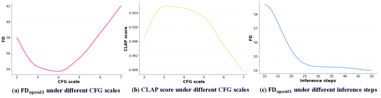
*Figure 4:Performance landscape of STAR-Gen under different CFG scales and inference steps on the AudioCaps test set.*

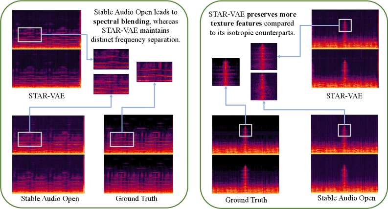
*Figure 5:Visual comparison of audio reconstruction between STAR-VAE and Stable Audio Open.*

---
**Usage Info**: 6674 tokens used.
**Generated at**: 2026-06-23 16:31:23

---

# 📚 Time–Frequency Weighted Losses for Phoneme Reconstruction in DNN-Based Speech Enhancement

🚀 URL: https://arxiv.org/html/2606.21635

## 🌏 Abstract (원문)
Conventional training losses for speech enhancement based on the signal-to-distortion ratio (SDR) treat all time–frequency (TF) regions uniformly, overlooking the fine-grained spectral cues that are relevant to specific phoneme intelligibility. We propose a TF weighting framework that modulates the SDR objective based on local speech presence, speech-to-interference ratio (SIR), and spectral flux. By integrating these factors into a differentiable objective, the framework emphasizes TF bins with high speech–noise competition while also accounting for transient cues such as consonant bursts. Experimental results show that our approach improves objective frequency-weighted enhancement metrics, as well as phoneme recognition accuracy, particularly for consonants. Spectral analysis shows better reconstruction of mid-frequency structures at less adverse SIR.
## 🌏 Abstract (번역)
신호 대 왜곡 비율(SDR) 기반의 기존 음성 향상 훈련 손실은 모든 시간-주파수(TF) 영역을 균일하게 처리하여, 특정 음소 명료도와 관련된 미세한 스펙트럼 단서를 간과합니다. 우리는 국부적인 음성 존재 여부, 음성 대 간섭 비율(SIR), 스펙트럼 플럭스를 기반으로 SDR 목표를 조절하는 TF 가중치 프레임워크를 제안합니다. 이러한 요소들을 미분 가능한 목표에 통합함으로써, 이 프레임워크는 음성-잡음 경쟁이 높은 TF 빈을 강조하는 동시에 자음 파열과 같은 과도기적 단서도 고려합니다. 실험 결과는 우리의 접근 방식이 객관적인 주파수 가중치 향상 측정 기준뿐만 아니라, 특히 자음에 대한 음소 인식 정확도를 향상시킴을 보여줍니다. 스펙트럼 분석은 덜 불리한 SIR에서 중간 주파수 구조의 더 나은 재구성을 보여줍니다.

## 🔍 Methods & Results
- 기존 SDR 기반 음성 향상 손실이 모든 시간-주파수(TF) 영역을 균일하게 처리하여 음성-잡음 상호작용의 지각적 관련성을 간과하는 한계를 지적하고, 음성 명료도가 음성-잡음 경쟁이 강한 영역에서 주로 영향을 받는다는 점을 강조.
- 국부적인 음성-잡음 경쟁을 명시적으로 모델링하는 TF 가중치 SDR 프레임워크를 제안하며, 이는 각 TF 빈의 기여도를 조절하는 가중치 w(f,t)를 포함하는 손실 함수 L_W를 정의.
- 제안된 가중치 전략은 세 가지: SIR-음성 존재 가중치(L_SIR·SP)는 낮은 SIR에도 불구하고 음성이 활성화된 TF 빈을 강조; SIR-음성 존재-스펙트럼 플럭스 가중치(L_SIR·SP·SF)는 스펙트럼 플럭스를 통합하여 자음 파열과 같은 과도기적 음성 단서에 대한 민감도를 높임; 학습 가능한 가중치(L_learn)는 학습된 시간 독립적인 스펙트럼 파라미터를 사용하며, ANSI 1997 대역 중요도 가중치로 초기화.
- 실험 결과, 제안된 접근 방식은 객관적인 주파수 가중치 향상 측정 기준과 특히 자음에 대한 음소 인식 정확도를 개선.
- 스펙트럼 분석 결과, 덜 불리한 SIR 조건에서 중간 주파수 구조의 재구성이 더 우수함을 확인.

---
**Usage Info**: 3358 tokens used.
**Generated at**: 2026-06-23 16:31:33

---

# 📚 An Evaluation Framework for Text-to-Speech Voice Reconstruction

🚀 URL: https://arxiv.org/html/2606.21343

## 🌏 Abstract (원문)
Voice reconstruction using Text-to-Speech (TTS) offers a communication method for people with speech disorders, which aims to retain their speaker identity while improving intelligibility. Previous work generally relies on Mean Opinion Score (MOS) to evaluate naturalness and speaker similarity, but this has limited sensitivity and reliability. We propose an evaluation framework with subjective and objective components. Subjectively, we evaluate perceived intelligibility and speaker identity using Best Worst Scaling (BWS) with situational framing. Objectively, we demonstrate that standard measures fail to predict reconstruction success for highly unintelligible speakers, so we introduce a novel dual-reference distributional measure to assess the trade-off between intelligibility and speaker identity. By evaluating the output of 17 zero-shot TTS systems for 193 speakers, we show that our framework provides a reliable and task-aligned approach for assessing voice reconstruction.
## 🌏 Abstract (번역)
텍스트 음성 변환(TTS)을 이용한 음성 재구성은 언어 장애가 있는 사람들을 위한 의사소통 방법을 제공하며, 이는 화자 정체성을 유지하면서 명료도를 향상시키는 것을 목표로 합니다. 이전 연구는 일반적으로 자연스러움과 화자 유사성을 평가하기 위해 평균 의견 점수(MOS)에 의존했지만, 이는 민감도와 신뢰성이 제한적입니다. 우리는 주관적 및 객관적 구성 요소를 포함하는 평가 프레임워크를 제안합니다. 주관적으로는 상황적 프레이밍을 사용한 최악-최고 스케일링(BWS)을 이용하여 인지된 명료도와 화자 정체성을 평가합니다. 객관적으로는 표준 측정값이 매우 불명료한 화자의 재구성 성공을 예측하는 데 실패함을 보여주므로, 명료도와 화자 정체성 간의 균형을 평가하기 위한 새로운 이중 참조 분포 측정값을 도입합니다. 193명의 화자에 대한 17개 제로샷 TTS 시스템의 출력을 평가함으로써, 우리의 프레임워크가 음성 재구성 평가를 위한 신뢰할 수 있고 작업에 부합하는 접근 방식을 제공함을 보여줍니다.

## 🔍 Methods & Results

## 🖼 Figures

*(a)intelligibility (All Speakers)*

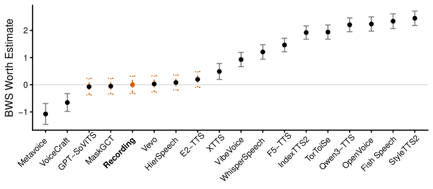
*(a)intelligibility (All Speakers)*

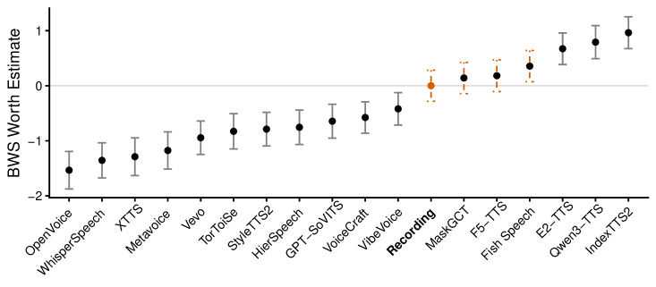
*(b)reconstruction (All Speakers)*

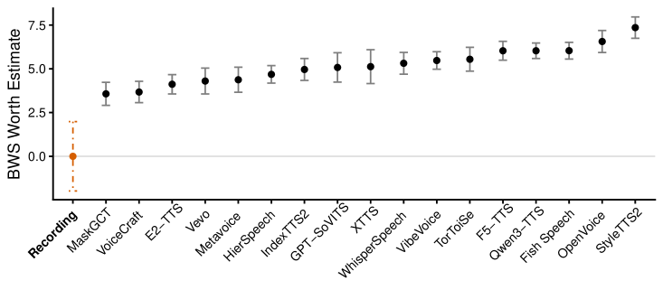
*(c)intelligibility (Low Intel. Speakers)*

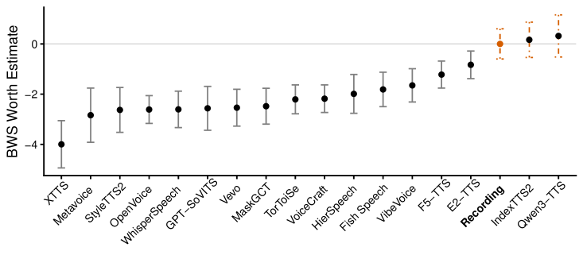
*(d)reconstruction (Low Intel. Speakers)*

---
**Usage Info**: 1807 tokens used.
**Generated at**: 2026-06-23 16:31:41

---

# 📚 On the Effect of Segmentation Width and Cluster Size on Speech Resynthesis and Continuation in Generative Spoken Language Models

🚀 URL: https://arxiv.org/html/2606.23285

## 🌏 Abstract (원문)
Generative Spoken Language Modeling (GSLM) enables text-free speech modeling by training language models (LMs) using discrete speech representations instead of textual transcription. In this paper, we investigate the performance of GSLM on speech synthesis and continuation using discrete speech representations with varying bitrates. We segment speech representations with fixed widths and train K-means models in multiple cluster sizes, resulting in various bitrate settings. We demonstrate that intelligible and natural speech can be synthesized at lower bitrate settings than the baseline. Furthermore, speech continuation quality remains stable at lower bitrates across multiple metrics, suggesting that the conventional GSLM setting may be redundant for effective speech generation. Although LLM-based metrics show higher correlation with human subjective score than conventional metrics, it remains low, highlighting the need for more stable automatic evaluation methods.
## 🌏 Abstract (번역)
생성 음성 언어 모델링(GSLM)은 텍스트 전사 대신 이산 음성 표현을 사용하여 언어 모델(LM)을 훈련함으로써 텍스트 없는 음성 모델링을 가능하게 합니다. 본 논문에서는 다양한 비트레이트의 이산 음성 표현을 사용하여 음성 합성 및 연속 작업에서 GSLM의 성능을 조사합니다. 우리는 고정된 너비로 음성 표현을 분할하고 여러 클러스터 크기로 K-평균 모델을 훈련하여 다양한 비트레이트 설정을 얻습니다. 우리는 기준선보다 낮은 비트레이트 설정에서 이해 가능하고 자연스러운 음성을 합성할 수 있음을 보여줍니다. 또한, 음성 연속 품질은 여러 지표에서 낮은 비트레이트에서도 안정적으로 유지되며, 이는 기존 GSLM 설정이 효과적인 음성 생성에 불필요할 수 있음을 시사합니다. LLM 기반 지표가 기존 지표보다 인간 주관적 점수와 더 높은 상관관계를 보이지만, 여전히 낮아 더 안정적인 자동 평가 방법의 필요성을 강조합니다.

## 🔍 Methods & Results
- GSLM의 음성 합성 및 연속 성능을 다양한 비트레이트의 이산 음성 표현을 사용하여 조사했습니다.
- 고정된 너비로 음성 표현을 분할하고 여러 클러스터 크기로 K-평균 모델을 훈련하여 다양한 비트레이트 설정을 생성했습니다.
- 기준선보다 낮은 비트레이트 설정에서 이해 가능하고 자연스러운 음성을 합성할 수 있음을 입증했습니다.
- 음성 연속 품질이 낮은 비트레이트에서도 여러 지표에서 안정적으로 유지됨을 확인하여, 기존 GSLM 설정이 효과적인 음성 생성에 불필요할 수 있음을 시사했습니다.
- LLM 기반 지표가 인간 주관적 점수와 기존 지표보다 높은 상관관계를 보였으나, 여전히 낮아 더 안정적인 자동 평가 방법의 필요성을 강조했습니다.

## 🖼 Figures
![Figure 1: Overview of GSLM-based speech continuation. It is achieved by synthesizing speech from discrete units predicted by the LM. We varied segmentation width 
𝑁
 and cluster size 
𝐾
 at s2u step [kando25]. Larger 
𝑁
 and smaller 
𝐾
 yield a lower bitrate.](../images/2026-06-23/2606.23285/2606.23285_fig0.png)
*Figure 1: Overview of GSLM-based speech continuation. It is achieved by synthesizing speech from discrete units predicted by the LM. We varied segmentation width 
𝑁
 and cluster size 
𝐾
 at s2u step [kando25]. Larger 
𝑁
 and smaller 
𝐾
 yield a lower bitrate.*

*Figure 2: Trade-off between PPL and VERT with respect to temperature. Moving to the right indicates higher temperature. The blue star denotes the oracle value. A clear trade-off is observed in the left panel, but not in the right panel, which makes it difficult to calculate the area under the curve.*

![Figure 3: Results of speech resynthesis. The x-axis represents the bitrate [bps] of each setting, calculated by multiplying unit entropy by the average number of units per second [dunbar19_interspeech]. Moving to the right indicates higher 
𝐾
. The second row presents a magnified view of the results with WER below 5%.](../images/2026-06-23/2606.23285/2606.23285_fig2.png)
*Figure 3: Results of speech resynthesis. The x-axis represents the bitrate [bps] of each setting, calculated by multiplying unit entropy by the average number of units per second [dunbar19_interspeech]. Moving to the right indicates higher 
𝐾
. The second row presents a magnified view of the results with WER below 5%.*

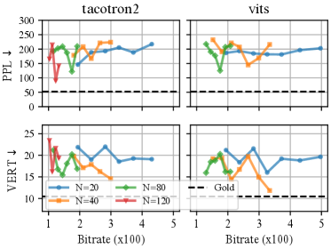
*Figure 4: Results of speech continuation. Only settings where speech resynthesis scores meet the conditions of WER below 5 and UTMOS above 4 are shown.*

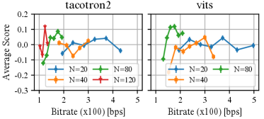
*Figure 5: Average scores of LLM-based pairwise evaluation.*

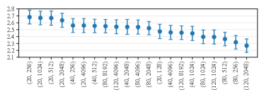
*Figure 6: MMOS with 95% CI.*

---
**Usage Info**: 1257 tokens used.
**Generated at**: 2026-06-23 16:31:57

---

# 📚 Don't Listen to Me: A Lightweight, Low-Latency Model for Own-Voice Cancellation in Far-Field Speech Enhancement

🚀 URL: https://arxiv.org/html/2606.23332

## 🌏 Abstract (원문)
We introduce own-voice cancellation (OVC): removing a target (enrolled) speaker from a noisy multi-speaker mixture while preserving any remaining speech. Framed as the complement of target speaker extraction, OVC addresses latency-induced own-voice artifacts that arise when a far-field device streams enhanced audio back to the user, as the round-trip time easily exceeds the perceptual threshold for own-voice distortion. We condition a time-domain model with only 2 ms algorithmic latency on a short enrollment utterance and benchmark TD-SpeakerBeam alongside a lighter Mamba-MinGRU masker built from Mamba blocks with MinGRU temporal mixing. Replacing the ConvTasNet-based auxiliary network with a linear RNN encoder improves both signal-to-distortion ratio and predicted MOS while reducing compute. Results establish OVC as a practical, low-latency enhancement objective for far-field denoising.
## 🌏 Abstract (번역)
우리는 자체 음성 제거(OVC)를 소개합니다: 시끄러운 다중 화자 혼합에서 목표(등록된) 화자를 제거하면서 남아있는 다른 음성은 보존하는 기술입니다. 목표 화자 추출의 보완적인 개념으로 구성된 OVC는 원거리 장치가 향상된 오디오를 사용자에게 다시 스트리밍할 때 발생하는 지연 시간으로 인한 자체 음성 아티팩트를 해결합니다. 이는 왕복 시간이 자체 음성 왜곡에 대한 인지 임계값을 쉽게 초과하기 때문입니다. 우리는 짧은 등록 발화에 대해 단 2ms의 알고리즘 지연 시간을 가진 시간 도메인 모델을 조건화하고, TD-SpeakerBeam과 함께 Mamba 블록과 MinGRU 시간 혼합으로 구축된 더 가벼운 Mamba-MinGRU 마스커를 벤치마킹합니다. ConvTasNet 기반 보조 네트워크를 선형 RNN 인코더로 대체하면 신호 대 왜곡 비율과 예측 MOS가 모두 향상되고 계산량은 줄어듭니다. 결과는 OVC가 원거리 노이즈 제거를 위한 실용적이고 낮은 지연 시간의 향상 목표임을 입증합니다.

## 🔍 Methods & Results
- OVC는 시끄러운 다중 화자 혼합에서 등록된 목표 화자를 제거하고 나머지 음성을 보존하는 것을 목표로 합니다.
- 모델은 LibriSpeech와 WHAM! 노이즈를 사용하여 동적으로 혼합된 데이터셋으로 훈련되었으며, 음성 및 노이즈 혼합에 대한 특정 SNR 조건이 적용되었습니다.
- 2ms의 알고리즘 지연 시간을 가진 시간 도메인 모델은 짧은 등록 발화에 조건화됩니다.
- TD-SpeakerBeam(기준 모델)과 Mamba 블록 및 MinGRU 시간 혼합을 사용하는 새로운 Mamba-MinGRU 마스커의 두 가지 주요 아키텍처가 벤치마킹되었습니다.
- Mamba-MinGRU는 낮은 계산 복잡성을 위해 설계된 시간 도메인 TasNet 변형입니다.
- 화자 임베딩 추출을 위해 ConvTasNet과 더 효율적인 양방향 선형 RNN의 두 가지 보조 네트워크가 조사되었습니다.
- 최적화는 침묵 예측에 맞게 조정된 음의 임계값 신호-왜곡 비율(SDR) 손실을 사용했습니다.
- 평가 지표로는 SDR과 DistillMOS를 사용한 예측 평균 의견 점수(PMOS)가 포함되었으며, 전체 혼합(F) 및 노이즈 제거 전용(D) 조건에서 평가되었습니다.
- ConvTasNet 기반 보조 네트워크를 선형 RNN 인코더로 대체했을 때 SDR과 예측 MOS가 모두 크게 향상되었으며, 계산량은 감소했습니다.
- Mamba-MinGRU 아키텍처는 TD-SpeakerBeam에 비해 낮은 계산 복잡성을 보이면서도 전역 컨텍스트를 유지했습니다.
- 본 연구는 OVC가 원거리 노이즈 제거 애플리케이션에 적합한 실용적이고 낮은 지연 시간의 향상 목표임을 입증했습니다.

## 🖼 Figures

*Figure 1: Difference between own voice cancellation (OVC) and target speaker extraction (TSE). Given a mixture consisting of multiple speakers recorded in a noisy scene, TSE (right) aims to keep only the enrolled speaker, while OVC (left) removes only the enrolled speaker. Both methods jointly denoise and isolate speakers.*

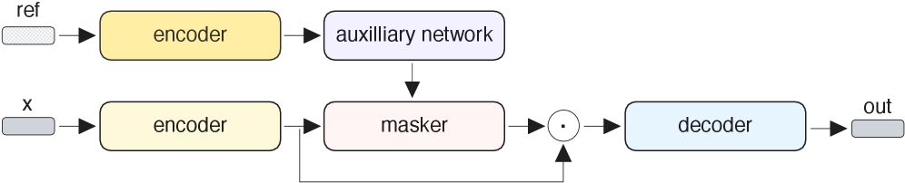
*Figure 2: High-level architecture of a time-domain conditioned ConvTasNet. Note that the two encoders do not share parameters. The output of the auxiliary network is an embedding which is applied using an adaptation layer.*

*Figure 3: Detailed architecture of the Mamba-MinGRU masker. It contains an initial normalization layer, followed by a projection to 
𝑑
𝑚
​
𝑜
​
𝑑
​
𝑒
​
𝑙
, and then N Mamba-MinGRU blocks. A final projection projects the predicted mask back to the encoder dimension and applies a non-linearity, here a Sigmoid.*

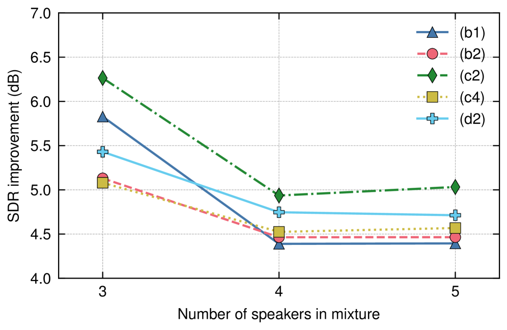
*Figure 4: SDR improvement (dB) for mixtures with multiple interfering speakers. Model IDs in the legend correspond to those shown in Table 1.*

---
**Usage Info**: 4812 tokens used.
**Generated at**: 2026-06-23 16:32:10

---

# 📚 Integrating Facial Generation into Full-Duplex Spoken Dialogue Systems

🚀 URL: https://arxiv.org/html/2606.21970

## 🌏 Abstract (원문)
Full-duplex spoken dialogue models, such as Moshi, enable natural, low-latency voice conversations. However, they remain limited to the audio modality, lacking the facial expressions that are integral to human communication. We present Moshi-Face, the first full-duplex dialogue model that jointly processes the user's audio and facial input while simultaneously generating speech and facial motion. We first construct a vector-quantized variational autoencoder (VQ-VAE) as a face codec that encodes 3D head meshes extracted from facial videos into compact discrete tokens, referred to as face tokens, and conversely reconstructs 3D meshes from these tokens. We then extend Moshi with a Face Transformer module that generates face tokens non-autoregressively, enabling Moshi-Face to produce synchronized audio and face tokens in real time. Experiments show that Moshi-Face achieves audiovisual alignment at low latency while preserving the dialogue quality of the original audio-only model.
## 🌏 Abstract (번역)
Moshi와 같은 전이중 음성 대화 모델은 자연스럽고 낮은 지연 시간의 음성 대화를 가능하게 합니다. 그러나 이러한 모델은 인간 의사소통에 필수적인 얼굴 표정이 부족하여 오디오 양식에만 국한되어 있습니다. 본 논문에서는 사용자의 오디오 및 얼굴 입력을 동시에 처리하면서 음성 및 얼굴 움직임을 동시에 생성하는 최초의 전이중 대화 모델인 Moshi-Face를 소개합니다. 먼저, 얼굴 비디오에서 추출된 3D 머리 메시를 압축된 이산 토큰(얼굴 토큰)으로 인코딩하고, 반대로 이 토큰으로부터 3D 메시를 재구성하는 얼굴 코덱으로 벡터 양자화 변이형 오토인코더(VQ-VAE)를 구축합니다. 그런 다음 Moshi를 비자기회귀적으로 얼굴 토큰을 생성하는 Face Transformer 모듈로 확장하여 Moshi-Face가 실시간으로 동기화된 오디오 및 얼굴 토큰을 생성할 수 있도록 합니다. 실험 결과 Moshi-Face는 낮은 지연 시간으로 시청각 정렬을 달성하면서도 원래 오디오 전용 모델의 대화 품질을 유지하는 것으로 나타났습니다.

## 🔍 Methods & Results
- Moshi-Face는 사용자의 오디오 및 얼굴 입력을 동시에 처리하고 음성 및 얼굴 움직임을 동시에 생성하는 최초의 전이중 대화 모델로 제안되었습니다.
- 얼굴 비디오에서 추출된 3D 머리 메시를 압축된 이산 토큰(얼굴 토큰)으로 인코딩하고 재구성하는 얼굴 코덱으로 VQ-VAE(Vector-Quantized Variational Autoencoder)를 구축했습니다.
- Moshi를 확장하여 비자기회귀적으로 얼굴 토큰을 생성하는 Face Transformer 모듈을 추가하여 Moshi-Face가 실시간으로 동기화된 오디오 및 얼굴 토큰을 생성할 수 있도록 했습니다.
- 실험 결과 Moshi-Face는 낮은 지연 시간으로 시청각 정렬을 달성했으며, 기존 오디오 전용 모델의 대화 품질을 유지했습니다.

## 🖼 Figures
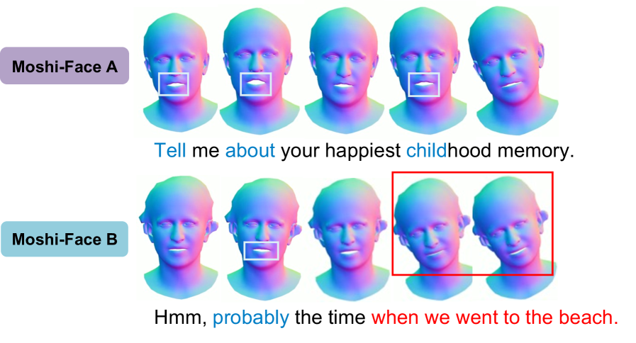
*Figure 1:Dialogue example generated by two Moshi-Face models. Visualized facial motion exhibits both lip synchronization with spoken content and natural head motion.*

*Figure 2:Overview of Moshi-Face. a) Face codec encodes facial motion into 
𝑁
 discrete face tokens and decodes them back. b) Moshi-Face appends 
𝑁
 face token streams to existing text and audio token streams. c) Face Transformer generates 
𝑁
 face tokens from conditioning vector 
𝐞
𝑖
+
1
All
 that aggregates hidden state, text, and audio embeddings.*

---
**Usage Info**: 1388 tokens used.
**Generated at**: 2026-06-23 16:32:18

---

# 📚 Towards Detecting Neural Audio Codec Synthesized Heart Sounds

🚀 URL: https://arxiv.org/html/2606.21727

## 🌏 Abstract (원문)
In this paper, we introduce Synthetic Heart Sound Detection (SHAC), a task aimed at identifying phonocardiograms (PCGs) synthesized using neural audio codecs (NACs). To facilitate research in this direction, we releaseCARDIOFAKE, the first benchmark dataset for SHAC containing both real and codec-synthesized PCGs. We benchmark spectral representations (MFCC, LFCC) and self-supervised learning (SSL) representations (e.g., WavLM) for the task. Furthermore, we proposeGROOT, a fusion framework that integrates spectral and SSL features for leveraging their complementary behavior. Experiments show thatGROOT, combining MFCC and WavLM, achieves state-of-the-art performance, outperforming individual representations and competitive baselines.
## 🌏 Abstract (번역)
본 논문에서는 신경 오디오 코덱(NAC)을 사용하여 합성된 심음도(PCG)를 식별하는 작업인 합성 심음 탐지(SHAC)를 소개합니다. 이 분야의 연구를 촉진하기 위해 실제 PCG와 코덱으로 합성된 PCG를 모두 포함하는 SHAC를 위한 최초의 벤치마크 데이터셋인 CARDIOFAKE를 공개합니다. 우리는 이 작업을 위해 스펙트럼 표현(MFCC, LFCC)과 자기지도 학습(SSL) 표현(예: WavLM)을 벤치마킹합니다. 또한, 스펙트럼 및 SSL 특징의 상호 보완적인 동작을 활용하기 위해 이들을 통합하는 융합 프레임워크인 GROOT를 제안합니다. 실험 결과, MFCC와 WavLM을 결합한 GROOT가 개별 표현 및 경쟁 기준선보다 뛰어난 최첨단 성능을 달성함을 보여줍니다.

## 🔍 Methods & Results
- 스펙트럼 표현(MFCC, LFCC)과 자기지도 학습(SSL) 표현(Wav2vec2, Unispeech-SAT, WavLM)이 심음 탐지 작업에 활용되었습니다.
- 하위 모델링 아키텍처로는 두 개의 완전 연결 네트워크(FCN)와 1D-CNN 레이어를 포함하는 CNN 기반 모델이 사용되었습니다.
- 스펙트럼 및 SSL 특징의 상호 보완적인 동작을 활용하기 위해 GROOT라는 새로운 융합 프레임워크가 제안되었습니다.
- GROOT는 표현 정렬을 위해 그램 행렬(특징 간 상관관계를 포착)을 프로베니우스 거리로 비교하는 새로운 그램 최적 수송(Gram-OT)을 사용하며, 이는 기존 최적 수송(OT)보다 노이즈 및 왜곡에 더 강건합니다.
- GROOT의 융합 과정은 그램 행렬 계산, 프로베니우스 거리를 기반으로 한 비용 행렬 구성, 싱크혼 알고리즘을 통한 최적 수송 계획 획득, 특징 공간 수송, 그리고 수송된 특징과 원본 표현의 연결로 이루어집니다.
- 융합된 표현은 이진 분류를 위해 다층 FCN을 통해 처리됩니다.
- 실험 결과, 특히 MFCC와 WavLM을 결합한 GROOT가 개별 표현 및 경쟁 기준선보다 뛰어난 최첨단 성능을 달성했습니다.

## 🖼 Figures

*Figure 1:Proposed Framework: GROOT: R1 and R2 represent input features from two branches. 
𝑍
11
 and 
𝑍
22
 denote features from the respective FCN branches, while 
𝑍
12
 and 
𝑍
21
 denote transported features*

*(a)MiO*

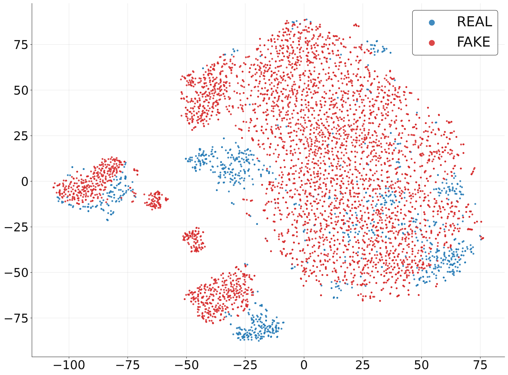
*(a)MiO*

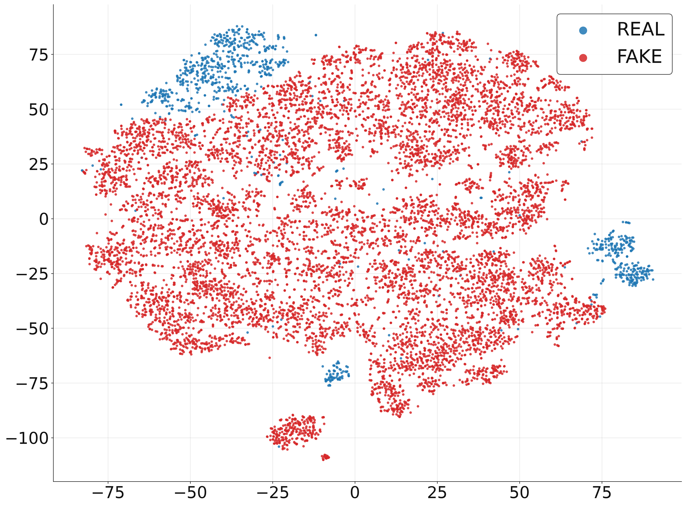
*(b)GROOT (MFCC + WavLM)*

*(a)MiO*

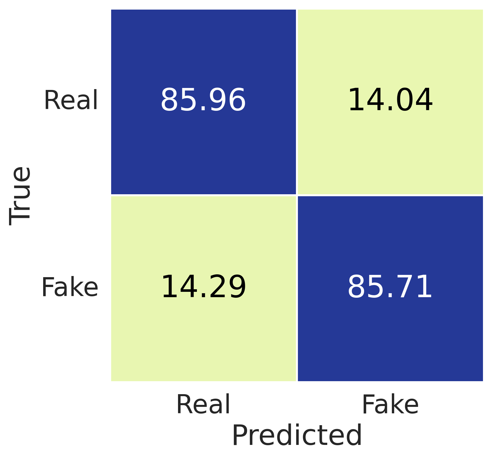
*(a)MiO*

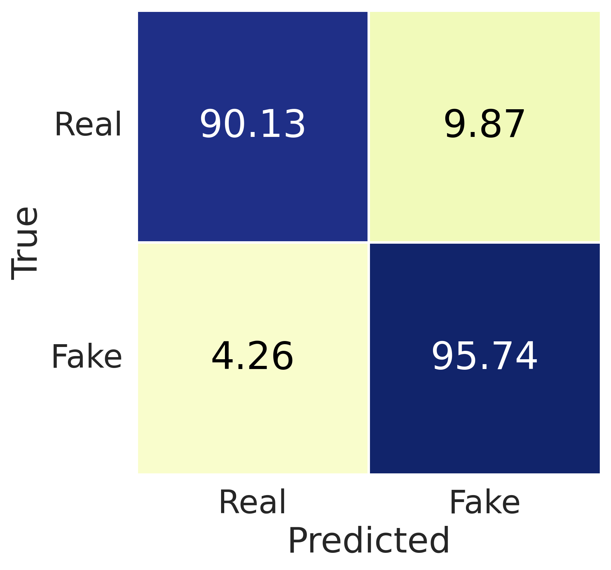
*(b)GROOT (MFCC + WavLM)*

---
**Usage Info**: 3382 tokens used.
**Generated at**: 2026-06-23 16:32:30

---

# 📚 Compiling Differentiable Audio Graphs to Real-Time DSP

🚀 URL: https://arxiv.org/html/2606.21277

## 🌏 Abstract (원문)
Differentiable audio processors are habitually designed and optimised in machine-learning frameworks, but deploying them as real-time audio effects still often requires non-automatic implementation in a dedicated digital signal processing language. The translation is error-prone, demands an onerous verification process, and detaches research prototypes from usable production tools. That being so, we present ADAC, a compiler that lowers a trained model to a framework-agnostic intermediate representation and emits efficient FAUST code whose impulse response matches the source model to within floating-point arithmetic noise, direct paths included. The optimisation loop is made audible by replacing the model in a running plugin after each gradient step. The exported processor carries a small set of macro-controls that leave its stability intact. A stability certificate computed from the shipped parameters is checked before the plugin is built. At the demonstration, a feedback delay network is trained and exported to a working plugin.
## 🌏 Abstract (번역)
미분 가능한 오디오 프로세서는 일반적으로 머신러닝 프레임워크에서 설계되고 최적화되지만, 이를 실시간 오디오 효과로 배포하려면 여전히 전용 디지털 신호 처리 언어로 비자동적인 구현이 필요한 경우가 많습니다. 이러한 번역 과정은 오류가 발생하기 쉽고, 번거로운 검증 과정을 요구하며, 연구 프로토타입을 실제 사용 가능한 생산 도구와 분리시킵니다. 이에 우리는 훈련된 모델을 프레임워크에 독립적인 중간 표현으로 변환하고, 부동 소수점 산술 노이즈 범위 내에서 원본 모델의 임펄스 응답(직접 경로 포함)과 일치하는 효율적인 FAUST 코드를 생성하는 컴파일러인 ADAC를 소개합니다. 최적화 루프는 각 그래디언트 단계 후에 실행 중인 플러그인의 모델을 교체하여 가청 가능하게 만듭니다. 내보내진 프로세서는 안정성을 유지하는 소수의 매크로 컨트롤을 포함합니다. 플러그인이 빌드되기 전에 제공된 매개변수로부터 계산된 안정성 인증서가 확인됩니다. 시연에서는 피드백 지연 네트워크가 훈련되어 작동하는 플러그인으로 내보내집니다.

## 🔍 Methods & Results
- ADAC는 훈련된 미분 가능 오디오 모델을 프레임워크 독립적인 중간 표현으로 변환하고, 효율적인 FAUST 코드를 생성하는 컴파일러이다.
- 생성된 FAUST 코드는 원본 모델의 임펄스 응답(직접 경로 포함)과 부동 소수점 산술 노이즈 범위 내에서 일치한다.
- 최적화 루프는 각 그래디언트 단계 후 실행 중인 플러그인의 모델을 교체하여 실시간으로 변화를 들을 수 있도록 설계되었다.
- 내보내진 프로세서는 안정성을 유지하는 매크로 컨트롤을 포함하며, 플러그인 빌드 전 안정성 인증서가 확인된다.
- 시연에서는 피드백 지연 네트워크를 훈련시키고 이를 작동하는 플러그인으로 성공적으로 내보냈다.

## 🖼 Figures

*Figure 3:Magnitude response of a compiled four-line FDN, one input-to-output path. Top, the FLAMO source (black) and the emitted FAUST (blue, dashed), 
1
/
12
-octave smoothed; the two coincide across the audible band. Bottom, their difference, at or below 
−
80
 
dB
 of the peak, the level of single-precision arithmetic.*

*Figure 4:Single-core CPU load of the emitted FAUST against FDN size 
𝑁
, on an Apple M2 at 
48
 
kHz
. The measured cost tracks the 
Θ
​
(
𝑁
2
)
 reference until the feedback matrix exceeds the cache. The shaded region marks loads above real time.*

*Figure 5:Compiled-plugin energy decay for 
0.5
 
s
 reverberation time, compared with the ideal 
−
120
 
dB
 
s
−
1
 line and lossless prototype.*

---
**Usage Info**: 1318 tokens used.
**Generated at**: 2026-06-23 16:32:46

---

# 📚 Backdoor Attacks on Speech Emotion Recognition via TTS-Generated Poisoning

🚀 URL: https://arxiv.org/html/2606.21052

## 🌏 Abstract (원문)
Speech Emotion Recognition (SER) systems increasingly leverage self-supervised acoustic representations, yet their vulnerability to training-time attacks remains largely underexplored. This paper presents the first systematic study of poisoning-based backdoor attacks on SER, with a focus on threats enabled by text-to-speech (TTS) generated audio. We introduce a stealthy, low-energy acoustic trigger that can be embedded imperceptibly into both natural and synthetic speech, enabling scalable and consistent poisoning. Our experiments demonstrate that SER models can be reliably compromised with high attack success rates under low poisoning ratios, while maintaining near-clean performance on benign inputs. We further show that backdoor patterns exhibit strong cross-model transferability and that self-supervised representations are particularly susceptible to learning these triggers. These findings reveal that TTS technology dramatically lowers the barrier to effective backdoor attacks, exposing critical vulnerabilities in modern SER pipelines and motivating the urgent need for dedicated defenses.
## 🌏 Abstract (번역)
음성 감정 인식(SER) 시스템은 자가 지도 음향 표현을 점점 더 많이 활용하지만, 훈련 시 공격에 대한 취약성은 아직 충분히 탐구되지 않았습니다. 본 논문은 음성 합성(TTS)으로 생성된 오디오에 의해 가능해지는 위협에 초점을 맞춰 SER에 대한 중독 기반 백도어 공격에 대한 최초의 체계적인 연구를 제시합니다. 우리는 자연어 및 합성 음성 모두에 감지할 수 없게 삽입될 수 있는 은밀하고 저에너지 음향 트리거를 소개하여 확장 가능하고 일관된 중독을 가능하게 합니다. 우리의 실험은 SER 모델이 낮은 중독 비율에서도 높은 공격 성공률로 안정적으로 손상될 수 있으며, 양성 입력에 대해서는 거의 정상적인 성능을 유지함을 보여줍니다. 우리는 또한 백도어 패턴이 강력한 모델 간 전이성을 보이며, 자가 지도 표현이 이러한 트리거를 학습하는 데 특히 취약하다는 것을 보여줍니다. 이러한 발견은 TTS 기술이 효과적인 백도어 공격의 장벽을 극적으로 낮추어 현대 SER 파이프라인의 중요한 취약점을 노출하고 전용 방어책의 시급한 필요성을 제기함을 밝힙니다.

## 🔍 Methods & Results
- 공격자는 훈련 데이터의 작은 부분을 오염시켜 은밀성(정상 샘플에 대한 높은 정확도 유지)과 효과성(트리거된 샘플에 대해 공격자가 선택한 타겟 레이블 예측)을 동시에 달성하는 것을 목표로 합니다.
- 공격은 TTS(Text-to-Speech) 시스템으로 짧은 오디오 스니펫을 트리거로 생성하고, 이 트리거를 훈련 발화의 일부에 삽입한 후 타겟 클래스로 재레이블링하여 SER 모델을 훈련/미세 조정하는 세 단계로 구성됩니다.
- 추론 단계에서 공격자는 동일한 트리거를 모든 테스트 발화에 주입하여, 백도어된 모델이 원래 감정과 관계없이 타겟 레이블을 예측하도록 강제합니다.
- 트리거는 TTS 모듈을 사용하여 합성되며, 화자 식별, 피치 윤곽, 말하기 속도와 같은 음향 속성을 정밀하게 제어하여 자연스럽고 구별 가능한 소리를 내도록 합니다.
- 공격 구현 요소에는 트리거 길이, 삽입 위치, 트리거 합성 방법 및 중독 강도(훈련 샘플 중 오염되는 비율)가 포함되며, 트리거는 파형에 추가되고 진폭 범위 내에서 클리핑됩니다.
- 백도어 공격은 낮은 중독 비율에서도 높은 공격 성공률(ASR)을 달성하면서 양성 입력에 대해서는 거의 정상적인 성능을 유지하여, 효과성과 은밀성이라는 두 가지 조건을 모두 충족합니다.
- TTS 기술이 효과적인 백도어 공격의 장벽을 극적으로 낮추며, 특히 자가 지도 표현이 이러한 트리거 학습에 취약하다는 점과 백도어 패턴이 강력한 모델 간 전이성을 보인다는 점을 발견했습니다.

## 🖼 Figures

*Figure 1:Backdoor Injection Framework. A subset of training samples is selected and injected with a TTS-generated trigger signal in the waveform domain. The poisoned samples are relabeled to a target class and used to train the victim model. During inference, the presence of the trigger activates the hidden backdoor behavior while clean inputs remain correctly classified.*

*Figure 2: Normalized confusion matrices for trigger-embedded inputs on the CAFE dataset using wav2vec2-base. The clean model (left) maintains predictions largely aligned with ground-truth labels, as indicated by the dominant diagonal structure. In contrast, the backdoored model (right) exhibits a substantial redistribution of predictions toward a limited set of labels, revealing the trigger-induced shortcut behavior.*

*Figure 3: Average clean accuracy of the clean model (
𝐴
𝐶
​
𝐶
) and the backdoored model (
𝐴
𝑃
​
𝐶
), averaged over low-to-moderate poisoning levels (
𝜌
≤
0.6
), across four datasets and four speech models. Smaller gaps between the two bars indicate stronger preservation of benign-input behavior.*

*Figure 4: Attack success rate (ASR) and backdoored clean accuracy (
𝐴
𝑃
​
𝐶
) under different poisoning ratios on the JL Corpus dataset for four speech models. As the poisoning ratio increases, ASR consistently improves, while 
𝐴
𝑃
​
𝐶
 becomes more noticeably degraded at higher poisoning levels, indicating a trade-off between attack strength and stealthiness.*

---
**Usage Info**: 4081 tokens used.
**Generated at**: 2026-06-23 16:33:00

---

# 📚 Benchmarking Large Language Models for Grapheme-to-Phoneme Conversion: A Japanese Case Study

🚀 URL: https://arxiv.org/html/2606.22009

## 🌏 Abstract (원문)
Grapheme-to-phoneme (G2P) conversion is essential for controllable and robust text-to-speech, and large language models (LLMs), with broad linguistic knowledge, offer a promising approach.We benchmarked over 30 LLMs on Japanese G2P, comparing them with conventional morphological analyzers on 3000 manually annotated sentences.We evaluated two prompting strategies: a parse mode, where the LLM performs morphological analysis followed by rule-based kana conversion, and a direct mode, where the LLM directly predicts kana readings.The results show that model size, version, and Japanese-specialized training are key factors, with the best LLMs achieving kana character error rate below 0.52% vs. the best conventional tool (1.03%).Parse mode outperforms direct mode for most models, as rule-based post-processing relieves the LLM of handling complex pronunciation rules.We also show that feeding LLM-predicted kana into a kana-input TTS yields better pronunciation than end-to-end TTS.
## 🌏 Abstract (번역)
G2P(Grapheme-to-phoneme) 변환은 제어 가능하고 견고한 음성 합성(text-to-speech)에 필수적이며, 광범위한 언어 지식을 가진 대규모 언어 모델(LLM)은 유망한 접근 방식을 제공합니다. 우리는 30개 이상의 LLM을 일본어 G2P에 대해 벤치마킹하고, 3000개의 수동으로 주석이 달린 문장을 사용하여 기존 형태소 분석기와 비교했습니다. 우리는 두 가지 프롬프트 전략을 평가했습니다: LLM이 형태소 분석을 수행한 후 규칙 기반 가나 변환을 수행하는 구문 분석 모드(parse mode)와 LLM이 직접 가나 읽기를 예측하는 직접 모드(direct mode)입니다. 결과는 모델 크기, 버전 및 일본어 특화 훈련이 핵심 요소임을 보여주며, 최고의 LLM은 가나 문자 오류율 0.52% 미만을 달성한 반면, 최고의 기존 도구는 1.03%를 기록했습니다. 규칙 기반 후처리(post-processing)가 LLM이 복잡한 발음 규칙을 처리하는 부담을 덜어주므로, 대부분의 모델에서 구문 분석 모드가 직접 모드보다 우수합니다. 또한 LLM이 예측한 가나를 가나 입력 TTS에 공급하는 것이 종단 간(end-to-end) TTS보다 더 나은 발음을 제공함을 보여줍니다.

## 🔍 Methods & Results
- 30개 이상의 LLM을 일본어 G2P에 대해 벤치마킹하고, 3000개의 수동으로 주석이 달린 문장을 사용하여 기존 형태소 분석기와 성능을 비교했습니다.
- 두 가지 프롬프트 전략(구문 분석 모드: 형태소 분석 후 규칙 기반 가나 변환; 직접 모드: 직접 가나 예측)을 평가했습니다.
- 최고의 LLM은 가나 문자 오류율 0.52% 미만을 달성하여, 최고의 기존 도구(1.03%)보다 우수한 성능을 보였습니다.
- 모델 크기, 버전, 일본어 특화 훈련이 성능에 중요한 요소로 나타났습니다.
- 규칙 기반 후처리가 복잡한 발음 규칙 처리 부담을 덜어주므로, 대부분의 모델에서 구문 분석 모드가 직접 모드보다 우수했습니다.
- LLM이 예측한 가나를 가나 입력 TTS에 공급하는 방식이 종단 간 TTS보다 더 나은 발음을 제공함을 확인했습니다.

## 🖼 Figures
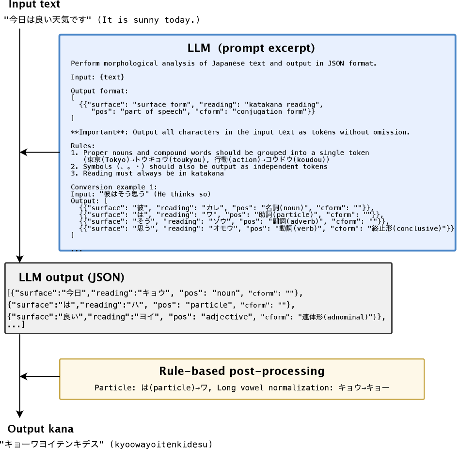
*Figure 1:Parse mode pipeline. The LLM performs morphological analysis and outputs JSON with word readings. Rule-based post-processing applies pronunciation rules.*

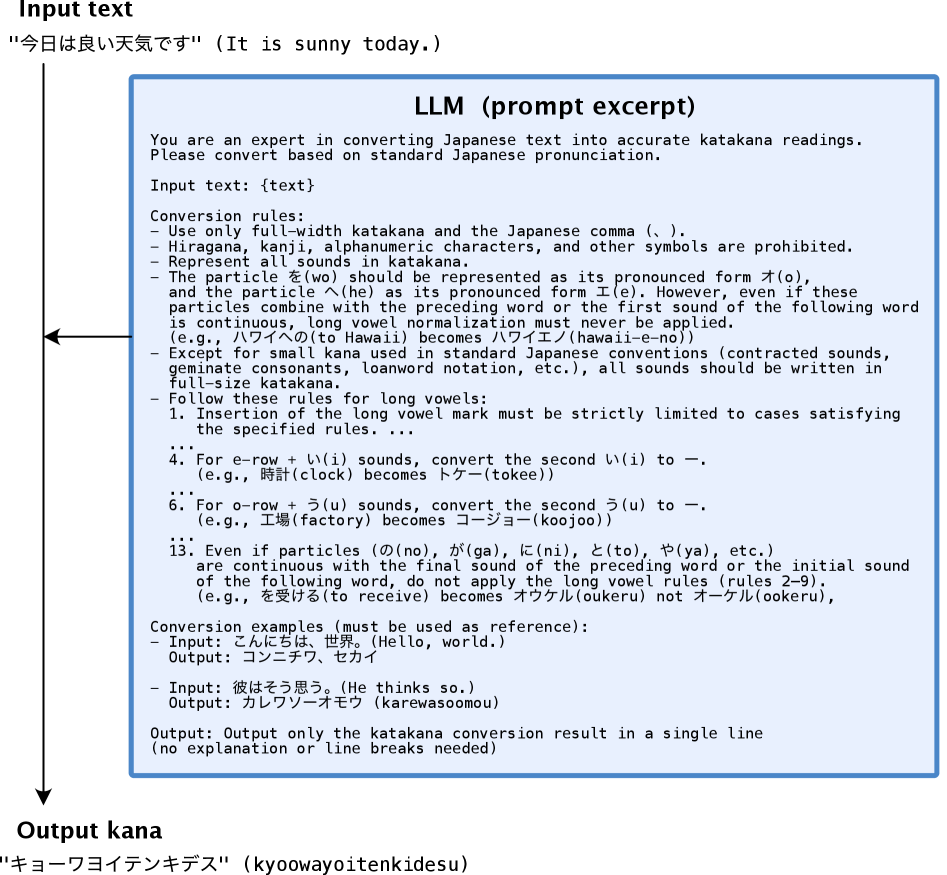
*Figure 2:Direct mode pipeline. The LLM directly converts the input text to a kana reading in a single step.*

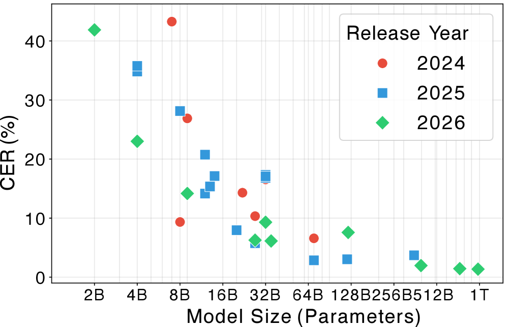
*Figure 3:Model size vs. kana CER (%) in parse mode for open-weight LLMs.*

---
**Usage Info**: 1486 tokens used.
**Generated at**: 2026-06-23 16:33:06

---

# 📚 An Acoustic Landmark Database of the English Lexicon via Articulatory Synthesis

🚀 URL: https://arxiv.org/html/2606.23220

## 🌏 Abstract (원문)
Acoustic landmark theory treats speech as organized around the acoustic consequences of articulatory gestures that shape the vocal tract and airflow. Progress is limited by the scarcity of large, unambiguously annotated landmark datasets. We invert the problem by generating speech from landmark patterns. Using the Pink Trombone physical vocal-tract synthesizer, we produce an English lexicon for two adult configurations (male, female). With direct control of gestures, we place landmark labels algorithmically at the exact times of their physical events (e.g., oral closures/releases). The corpus contains>>200,000 synthesized words, rendered for both configurations with time-aligned annotations; intelligibility is measured with STOI. We leverage it for statistics across the lexicon from an articulatory-event view, reporting landmark frequencies and dominant cue patterns, and enabling quantitative studies plus training/benchmarking of automatic landmark detectors.
## 🌏 Abstract (번역)
음향 랜드마크 이론은 음성을 성도와 기류를 형성하는 조음 동작의 음향적 결과물을 중심으로 조직된 것으로 간주합니다. 대규모의 명확하게 주석이 달린 랜드마크 데이터셋의 부족으로 인해 발전이 제한적이었습니다. 우리는 랜드마크 패턴으로부터 음성을 생성함으로써 이 문제를 역전시킵니다. Pink Trombone 물리적 성도 합성기를 사용하여 두 가지 성인 구성(남성, 여성)에 대한 영어 어휘집을 생성합니다. 동작을 직접 제어하여 물리적 이벤트(예: 구강 폐쇄/개방)의 정확한 시점에 랜드마크 레이블을 알고리즘적으로 배치합니다. 이 코퍼스에는 200,000개 이상의 합성된 단어가 포함되어 있으며, 시간 정렬된 주석과 함께 두 가지 구성으로 렌더링됩니다. 명료도는 STOI로 측정됩니다. 우리는 이를 활용하여 조음 이벤트 관점에서 어휘집 전반의 통계를 분석하고, 랜드마크 빈도와 지배적인 단서 패턴을 보고하며, 정량적 연구와 자동 랜드마크 감지기 훈련/벤치마킹을 가능하게 합니다.

## 🔍 Methods & Results
- Pink Trombone 물리적 성도 합성기를 사용하여 랜드마크 주석이 달린 영어 어휘 데이터베이스를 생성하는 4단계 프로세스를 따랐다.
- CMUDict에서 파생된 영어 어휘집의 ARPABET 전사를 IPA로 변환하여 마스터 단어 목록과 해당 이음(allophone) 시퀀스를 구축했다.
- 각 IPA 음소를 Pink Trombone(PT) 합성기의 조음 매개변수(혀 몸통 높이/전진, 혀끝 위치, 입술 둥글림, 턱 열림, 연구개, 성문 상태)의 정적, 정규 구성에 수동으로 매핑했다. 모음 목표는 기본 모음 기하학을 따르며 F1-F2 영역에 맞게 조정되었고, 이중모음은 선형 궤적으로 구현되었다. 장애음, 비음, 유음, 활음도 표준 조음 위치 및 방식으로 설정되었다.
- 인접한 음소의 매개변수 벡터 간 선형 보간을 통해 제한된 연음 효과(예: 폐쇄로 이동하거나 개방 후 진폭 변화)를 근사화하여 부드러운 발화를 생성했다.
- 운율적 가변성을 제거하고 분절 음향 현상 연구를 위한 깨끗한 기준선을 제공하기 위해 음소 지속 시간과 기본 주파수(f0)를 모든 인스턴스에서 일정하게 유지했다.
- 각 단어에 대해 16비트, 48kHz의 WAV 파일을 생성했으며, Pink Trombone의 성인 남성 및 성인 여성 구성으로 각각 두 개의 토큰을 합성하여 성별에 따른 병렬 어휘집을 구축했다.
- 단어의 음성학적 사양을 정확한 랜드마크 이벤트 시퀀스에 매핑하는 결정론적 규칙 기반 접근 방식을 사용하여 주석을 생성했다. 이 규칙은 음소의 조음 방식에 따라 랜드마크의 시간적 위치를 정의한다.
- 랜드마크 배치 규칙은 다음과 같다: 모음/활음은 안정적인 성도 구성의 시간적 중간 지점(모음은 최대 개방, 활음은 최대 수축)에 랜드마크(V/G)를 배치한다. 비음은 구강 폐쇄와 비강 통로 활성화 시점에 비음 폐쇄(Nc), 구강 폐쇄 해제 및 비강 통로 비활성화 시점에 비음 개방(Nr)을 배치한다. 마찰음은 소음원 활성화 시점에 마찰음 폐쇄(Fc), 비활성화 시점에 마찰음 개방(Fr)을 배치한다. 파열음은 성도 완전 폐쇄 시점에 파열음 폐쇄(Sc), 공기 흐름을 허용할 만큼 성도가 열리는 시점에 파열음 개방(Sr)을 배치한다.
- 합성된 각 단어에 대해 높은 정밀도의 결정론적 그라운드 트루스 레이블을 가진 데이터셋을 확보하여 향후 연구를 위한 명확한 참조 자료를 제공한다.

## 🖼 Figures
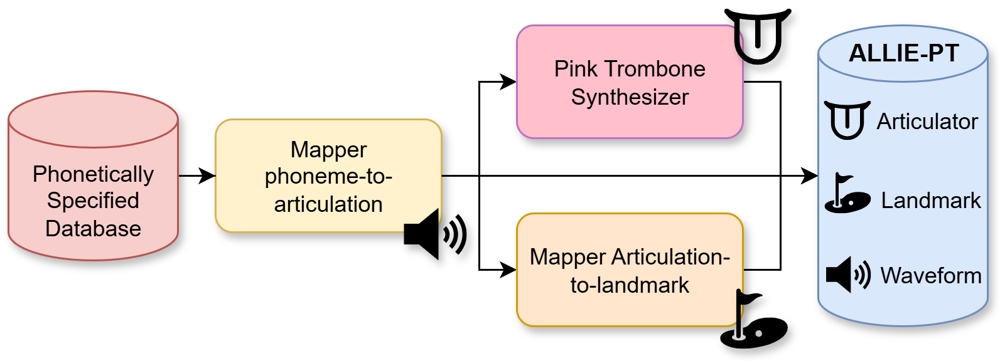
*Figure 1:The data generation pipeline, from lexical entry to the final landmark-specified waveform.*

![Figure 2:Visual validation of the ground-truth landmark generation for the synthesized VCV sequence [ate]. The three panels show the alignment between the articulatory command for a stop consonant (bottom), the resulting acoustic events in the spectrogram (middle), and the waveform (top). The dashed red lines indicate the precise, algorithmically-placed locations for the Stop Closure (
<
Sc
>
) and Stop Release (
<
Sr
>
) landmarks.](../images/2026-06-23/2606.23220/2606.23220_fig1.png)
*Figure 2:Visual validation of the ground-truth landmark generation for the synthesized VCV sequence [ate]. The three panels show the alignment between the articulatory command for a stop consonant (bottom), the resulting acoustic events in the spectrogram (middle), and the waveform (top). The dashed red lines indicate the precise, algorithmically-placed locations for the Stop Closure (
<
Sc
>
) and Stop Release (
<
Sr
>
) landmarks.*

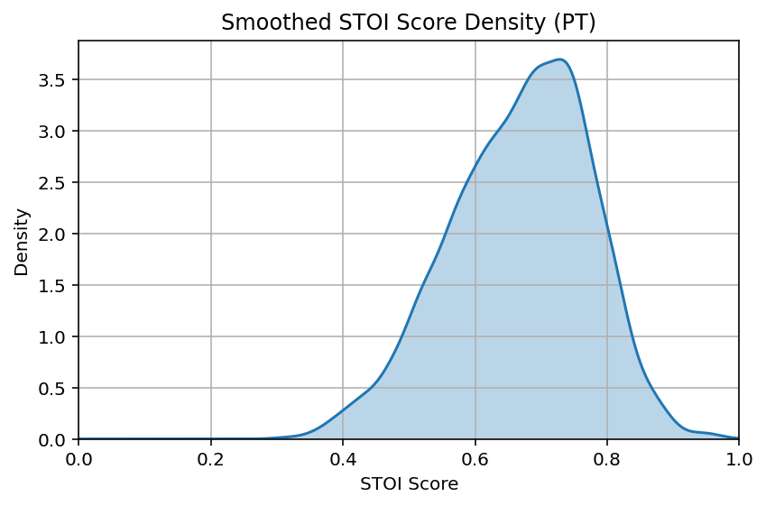
*Figure 3:Smoothed density plot of STOI scores for a phonetically-balanced subset of the synthesized database, compared against clean human recordings.*

---
**Usage Info**: 4910 tokens used.
**Generated at**: 2026-06-23 16:33:21

---

# 📚 Temporal-Spectral Alignment with Frequency Adaptation for Source-Free Time-Series Adaptation

🚀 URL: https://arxiv.org/html/2606.23120

## 🌏 Abstract (원문)
The goal of source-free domain adaptation (SFDA) for time-series data is to transfer knowledge from a pre-trained source model to an unlabeled target domain without requiring access to source data, while addressing feature shift and temporal drift inherent in the signals. Although existing approaches have explored temporal dynamics in unsupervised source-free adaptation, they largely overlook spectral shifts in time-series data. Towards this end, we propose an novel approach termed temporal-SpectralAlignment withFrequencyAdaptation (SAFA) for source-free time-series domain adaptation. Specifically, we first model the source domain at multiple scales by jointly capturing temporal dependencies and spectral characteristics. To adapt time-series data in the target domain, we introduce a trainable frequency adaptation module that modulates the phase and amplitude of target signals in the frequency domain to align them with the source distribution. Extensive experiments on multiple benchmark datasets demonstrate the efficacy and robustness ofSAFA.
## 🌏 Abstract (번역)
시계열 데이터에 대한 소스-프리 도메인 적응(SFDA)의 목표는 소스 데이터에 대한 접근 없이 사전 훈련된 소스 모델의 지식을 레이블 없는 타겟 도메인으로 전이하는 동시에, 신호에 내재된 특징 변화(feature shift)와 시간적 드리프트(temporal drift)를 해결하는 것입니다. 기존 접근 방식들은 비지도 소스-프리 적응에서 시간적 동역학을 탐구했지만, 시계열 데이터의 스펙트럼 변화는 대부분 간과했습니다. 이를 위해 우리는 소스-프리 시계열 도메인 적응을 위한 시간-스펙트럼 정렬과 주파수 적응(temporal-SpectralAlignment withFrequencyAdaptation, SAFA)이라는 새로운 접근 방식을 제안합니다. 구체적으로, 우리는 먼저 시간적 의존성과 스펙트럼 특성을 공동으로 포착하여 다중 스케일에서 소스 도메인을 모델링합니다. 타겟 도메인의 시계열 데이터를 적응시키기 위해, 우리는 주파수 영역에서 타겟 신호의 위상과 진폭을 조절하여 소스 분포와 정렬시키는 훈련 가능한 주파수 적응 모듈을 도입합니다. 여러 벤치마크 데이터셋에 대한 광범위한 실험은 SAFA의 효능과 견고성을 입증합니다.

## 🔍 Methods & Results
- 시계열 데이터에 대한 소스-프리 도메인 적응(SFDA)을 목표로, 소스 데이터 없이 사전 훈련된 소스 모델의 지식을 레이블 없는 타겟 도메인으로 전이하며, 특징 변화 및 시간적 드리프트를 해결한다.
- 기존 SFDA가 간과했던 시계열 데이터의 스펙트럼 변화를 해결하기 위해, 주파수 영역에서 타겟 시계열의 진폭 및 위상 스펙트럼을 조작하는 스펙트럼 섭동 메커니즘을 도입하여 도메인 간극을 해소하는 SAFA(temporal-SpectralAlignment withFrequencyAdaptation)를 제안한다.
- 1단계 소스 사전 훈련에서는 레이블이 지정된 소스 데이터를 사용하여 특징 추출기, 분류기 및 임퓨터 네트워크를 훈련한다. 이 과정에서 시간적 마스킹과 보조 임퓨터 네트워크를 통한 특징 임퓨테이션을 통해 시간적 종속성을 학습하며, 총 손실은 분류 손실과 임퓨테이션 손실의 조합이다.
- 2단계 주파수 도메인 적응에서는 사전 훈련된 소스 모델 구성 요소(특징 추출기, 분류기, 임퓨터)의 파라미터를 고정하고, 학습 가능한 경량 주파수 적응 계층(Frequency Adaptation Layer, FAL)을 도입한다.
- FAL은 타겟 시계열을 FFT를 통해 주파수 도메인으로 변환하고, 두 개의 MLP를 사용하여 진폭과 위상에 대한 적응적 섭동 인자를 예측한 후, 이 섭동된 스펙트럼을 iFFT를 통해 시간 도메인으로 재구성하여 적응된 입력을 생성한다.
- FAL은 자기 지도 학습 목표를 사용하여 최적화된다. 이는 적응된 타겟 샘플이 판별적이고 다양한 예측을 생성하도록 하는 정보 최대화(IM) 손실과, 적응된 특징이 소스 모델이 학습한 기본 시간적 동역학을 존중하도록 하는 시간적 출력 검증(TOV) 손실의 조합으로 구성된다.
- 여러 벤치마크 데이터셋에 대한 광범위한 실험을 통해 SAFA의 효능과 견고성이 입증되었다.

## 🖼 Figures

*(a)Without Adaptation*

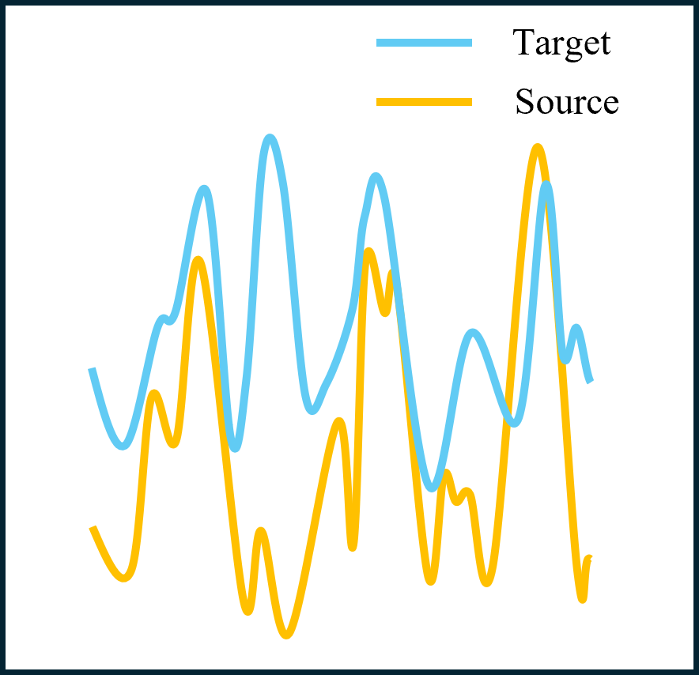
*(a)Without Adaptation*

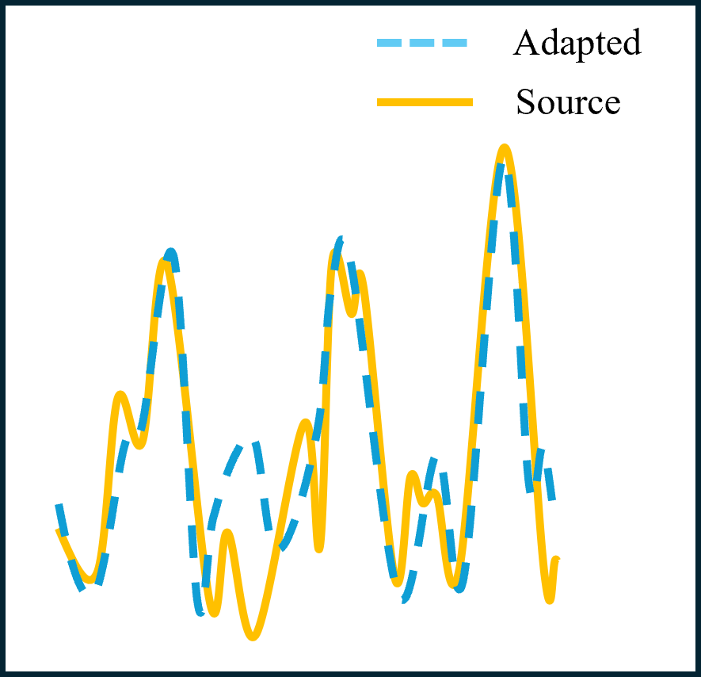
*(b)With Adaptation*

*(a)Stage 1: Source Pre-training with Masked Temporal Imputation.*

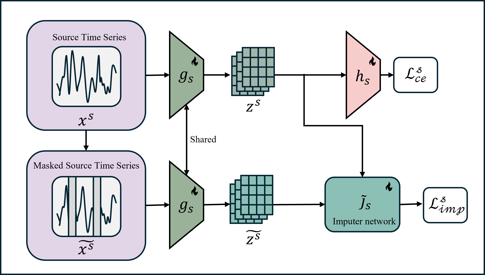
*(a)Stage 1: Source Pre-training with Masked Temporal Imputation.*

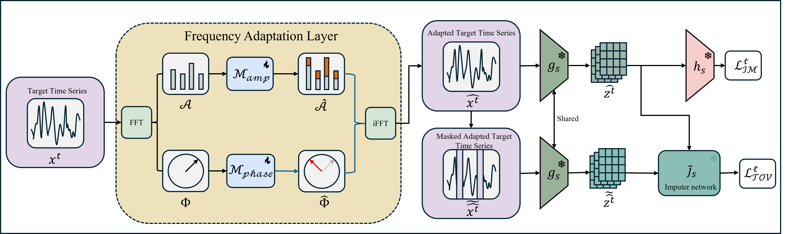
*(b)Stage 2: Source-Free Target Adaptation via Frequency Adaptation Layer (FAL).*

*(a)Effect of Amplitude Scale (
𝛼
)*

*(a)Effect of Amplitude Scale (
𝛼
)*

*(b)Effect of Phase Scale (
𝛽
)*

---
**Usage Info**: 5872 tokens used.
**Generated at**: 2026-06-23 16:33:36

---

# 📚 Interleaved Speech Language Models Latently Work In Text

🚀 URL: https://arxiv.org/html/2606.22473

## 🌏 Abstract (원문)
Speech language models (SLMs) have been extensively studied, with the common paradigm incorporating text data and pre-trained text LMs. A leading approach is speech-text interleaving in which models are trained over sequences containing both speech and text tokens, aiming to boost even speech-only capabilities. Yet the way these two modalities interact in the model latent space remains unclear. In this work, we analyze interleaved speech-text LMs from different model families and sizes through the scope ofthe logit lensto provide such insight. We reveal that these models go through animplicit transcriptionphase in which the text token of the spoken word becomes decodable in intermediate layers,despite not being trained for speech recognition. The transcription of the word appears as one of the top candidate words for as much as 77% of the data. Following this stage, the models proceed to predict the next word in the text space before transforming back to the speech domain. We finally analyze the role of interleaving data, and initializing from text LMs in eliciting this behavior, as well as seeing how this correlates with spoken knowledge abilities. Our analysis sheds light on the internal mechanisms underlying the relationship between speech and text modalities and could shape SLM optimization. For the full dataet and audio samplessee.
## 🌏 Abstract (번역)
음성 언어 모델(SLM)은 텍스트 데이터와 사전 훈련된 텍스트 LM을 통합하는 일반적인 패러다임을 통해 광범위하게 연구되어 왔습니다. 주요 접근 방식 중 하나는 음성-텍스트 인터리빙으로, 모델이 음성 및 텍스트 토큰을 모두 포함하는 시퀀스에 대해 훈련되어 음성 전용 기능까지 향상시키는 것을 목표로 합니다. 그러나 이 두 가지 양식이 모델 잠재 공간에서 어떻게 상호 작용하는지는 여전히 불분명합니다. 본 연구에서는 로그잇 렌즈(logit lens)의 범위를 통해 다양한 모델 계열 및 크기의 인터리브드 음성-텍스트 LM을 분석하여 이러한 통찰력을 제공합니다. 우리는 이 모델들이 음성 인식 훈련을 받지 않았음에도 불구하고, 중간 레이어에서 발화된 단어의 텍스트 토큰이 해독 가능해지는 '암묵적 전사 단계'를 거친다는 것을 밝혀냈습니다. 이 단어의 전사는 데이터의 최대 77%에서 상위 후보 단어 중 하나로 나타납니다. 이 단계 이후, 모델은 음성 도메인으로 다시 변환하기 전에 텍스트 공간에서 다음 단어를 예측하는 과정을 진행합니다. 마지막으로, 인터리빙 데이터의 역할과 텍스트 LM으로부터의 초기화가 이러한 행동을 유도하는 방식, 그리고 이것이 발화 지식 능력과 어떻게 상관관계가 있는지 분석합니다. 우리의 분석은 음성 및 텍스트 양식 간의 관계를 뒷받침하는 내부 메커니즘에 대한 통찰력을 제공하며 SLM 최적화에 영향을 미칠 수 있습니다. 전체 데이터셋 및 오디오 샘플은 참조하십시오.

## 🔍 Methods & Results
- 연구는 로그잇 렌즈(logit lens)라는 기계적 해석 가능성 도구를 사용하여 음성 언어 모델(SLM)의 잠재 표현에 인코딩된 정보와 레이어 전반에 걸친 정보 진화를 분석했습니다.
- 음성 토큰의 가변 길이 문제를 해결하기 위해, 음성 토큰 위치를 단어 수준 전사(transcription)와 정렬한 후, 정렬된 범위 내 각 은닉 상태에 로그잇 렌즈를 적용하고 단어 수준에서 점수를 집계(최대 집계 방식 사용)했습니다.
- 모델이 음성 인식 훈련을 받지 않았음에도 불구하고, 중간 레이어에서 발화된 단어의 텍스트 토큰이 해독 가능한 '암묵적 전사 단계'를 거친다는 것을 발견했습니다.
- 이 암묵적 전사 단계에서 발화된 단어의 전사가 데이터의 최대 77%에서 상위 후보 단어 중 하나로 나타났습니다.
- 이 단계 이후, 모델은 음성 도메인으로 다시 변환하기 전에 텍스트 공간에서 다음 단어를 예측하는 것으로 나타났습니다.
- 교차 모달 지식 전이(cross-modal knowledge transfer)를 평가하기 위해, '프랑스의 수도는...', '1 더하기 1은...'과 같은 상식적인 사실 완성 데이터셋(282개 수동 큐레이션 예시)을 수동으로 생성하고 음성으로 합성하여 사용했습니다.
- SIMS 연구의 인터리브드 음성-텍스트 모델(Llama 3.2-3B 및 Qwen 2.5 기반)을 분석하고, 사전 훈련된 텍스트 LM 초기화와 무작위 초기화, 그리고 음성 전용, 음성+텍스트, 음성+텍스트+인터리브드 데이터 구성이 암묵적 전사 행동에 미치는 영향을 제어된 Llama 3.2-3B 모델을 훈련하여 조사했습니다.
- 분석은 음성 및 텍스트 양식 간의 관계를 뒷받침하는 내부 메커니즘에 대한 통찰력을 제공하며 SLM 최적화에 기여할 수 있음을 시사합니다.

## 🖼 Figures

*Figure 1:Implicit transcription emerges without speech-recognition supervision. Logit-lens analysis of intermediate states for the spoken prompt “The capital of the United Kingdom is…”. Cells show textual tokens probability, from light yellow for zero to dark blue for high probability. The labels show the most probable relevant textual token at each position; notably, the model predicts “London” although it was not spoken in the prompt.*

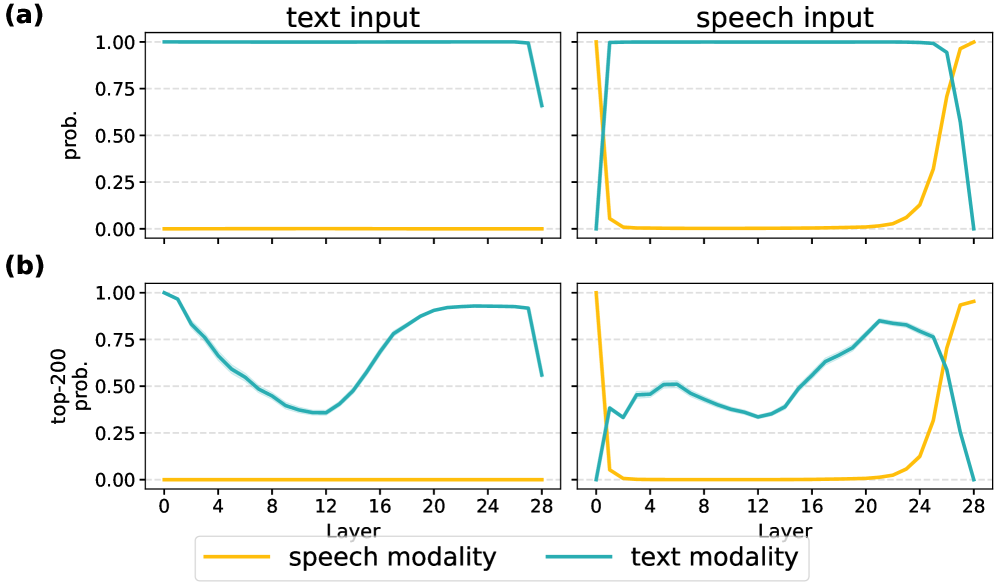
*Figure 2:Speech LMs operate in text. Modality distribution of inner state Logit Lens. (a) Sum of probabilities over the all speech tokens and text tokens respectively. (b) Same but only considering top 200 tokens.*

![Figure 3: Implicit transcription and textual continuation emerge in speech hidden states. We apply the logit lens to speech-token hidden states and report 
Recall
​
@
​
𝑘
 up to a given layer, for the current transcription word, the next word, and the final answer. Although the models are not explicitly trained for transcription, current-word transcription emerges reliably in intermediate layers across models, while next-word and answer-word predictions are weaker but still decodable. The random-token baseline remains near zero.](../images/2026-06-23/2606.22473/2606.22473_fig2.png)
*Figure 3: Implicit transcription and textual continuation emerge in speech hidden states. We apply the logit lens to speech-token hidden states and report 
Recall
​
@
​
𝑘
 up to a given layer, for the current transcription word, the next word, and the final answer. Although the models are not explicitly trained for transcription, current-word transcription emerges reliably in intermediate layers across models, while next-word and answer-word predictions are weaker but still decodable. The random-token baseline remains near zero.*

![Figure 4: Implicit transcription ability is positively correlated with factual knowledge retrieval. Each point represents a model. The 
𝑥
-axis reports the percentage of words for which the correct current-word transcription (left) or next-word transcription (right) appears in the top-
10
 logit-lens predictions at any aligned speech-token position and layer. The 
𝑦
-axis shows the binary accuracy on our commonsense factual-knowledge benchmark. Both transcription scores correlates positively with knowledge scores.](../images/2026-06-23/2606.22473/2606.22473_fig3.png)
*Figure 4: Implicit transcription ability is positively correlated with factual knowledge retrieval. Each point represents a model. The 
𝑥
-axis reports the percentage of words for which the correct current-word transcription (left) or next-word transcription (right) appears in the top-
10
 logit-lens predictions at any aligned speech-token position and layer. The 
𝑦
-axis shows the binary accuracy on our commonsense factual-knowledge benchmark. Both transcription scores correlates positively with knowledge scores.*

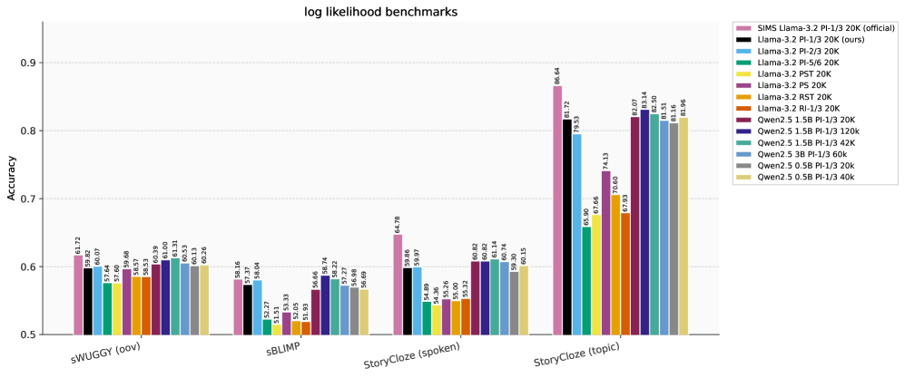
*Figure 5:Log Likelihood based evaluations for all models we used*

![Figure 6:Implicit transcription and textual continuation emerge in speech hidden states for text pre-trained with interleaving. We apply the logit lens to speech-token hidden states and report Recall@k up to a given layer, for the current transcription word, the next word, and the final answer. Although the models are not explicitly trained for transcription, current-word transcription emerges reliably in intermediate layers across models, while next-word and answer-word predictions are weaker but still decodable. The random-token baseline remains near zero.](../images/2026-06-23/2606.22473/2606.22473_fig5.png)
*Figure 6:Implicit transcription and textual continuation emerge in speech hidden states for text pre-trained with interleaving. We apply the logit lens to speech-token hidden states and report Recall@k up to a given layer, for the current transcription word, the next word, and the final answer. Although the models are not explicitly trained for transcription, current-word transcription emerges reliably in intermediate layers across models, while next-word and answer-word predictions are weaker but still decodable. The random-token baseline remains near zero.*

*Figure 7:Logit lens of intermediate states for the spoken input "lime", using the Llama-3.2 PI-1/3 (official) model. The example shows both gradual transcription, with an early prediction of "lie", and a transcription error, where the model predicts "line" instead of "lime".*

*Figure 8:Logit lens of intermediate states for the spoken input "white", using the Llama-3.2 PI-1/3 (official) model. The example shows gradual transcription, where the model first predicts the partial form "why" before later converging to the full word "white".*

*Figure 9:Logit lens of intermediate states for the spoken input "Pakistan", using the Llama-3.2 PI-1/3 (official) model. The example shows gradual transcription, where the model first predicts the partial form "pack” and later updates toward later components of the word, such as "istan", before converging to "Pakistan".*

*Figure 10:Logit lens of intermediate states for the spoken input "teacher", using the Llama-3.2 PI-1/3 (official) model. The example shows gradual transcription, where the model first predicts "tea", then "teach", and finally converges to the full word "teacher".*

*Figure 11:Logit Lens of inner states of the spoken input: "The capital of United Kingdom is…", using Llama-3.2 PI-1/3 (official).This version contains less filters on the time and layer domain and thus show higher resolution in the inner mechanism by logit lens perspective*

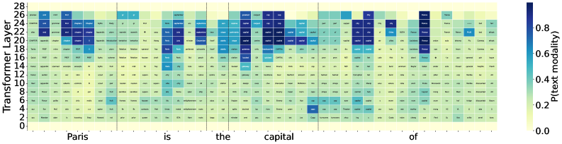
*Figure 12:Logit lens of inner states of the spoken input: "Paris is the capital of …", using Llama-3.2 PI-1/3 (official).*

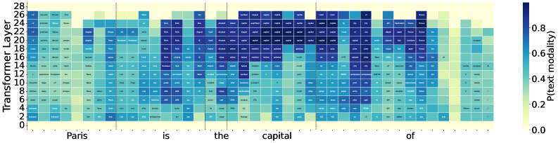
*Figure 13:Logit Lens of inner states of the spoken input: "Paris is the capital of …", using Llama-3.2 PI-1/3 (ours).*

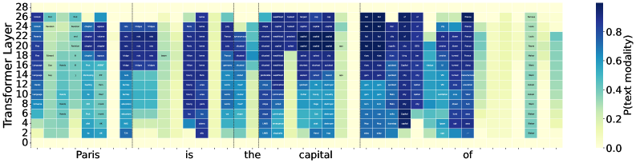
*Figure 14:Logit Lens of inner states of the spoken input: "Paris is the capital of …", using Llama-3.2 PI-2/3.*

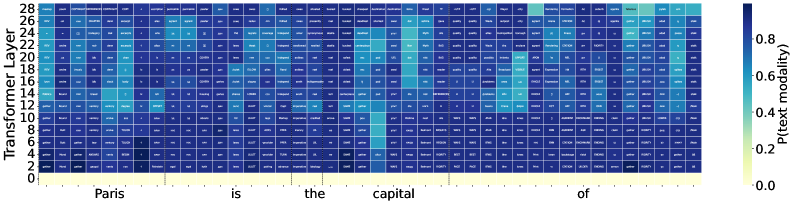
*Figure 15:Logit Lens of inner states of the spoken input: "Paris is the capital of…", using Qwen2.5-3B PI-1/3 60k*

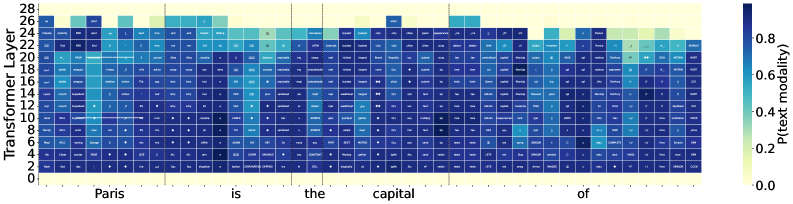
*Figure 16:Logit Lens of inner states of the spoken input: "Paris is the capital of…", using Qwen2.5-1.5B PI-1/3 42K*

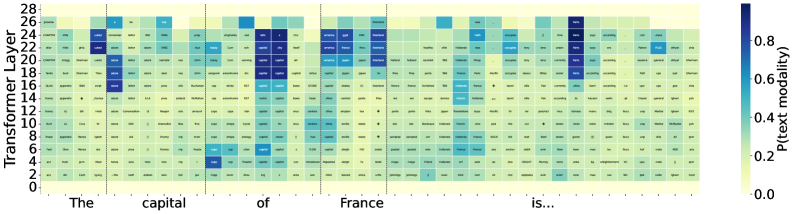
*Figure 17:Logit Lens of inner states of the spoken input: "The capital of France is…", using Llama-3.2 PI-1/3 (official).*

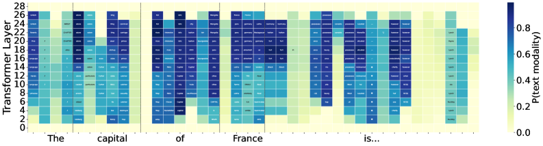
*Figure 18:Logit Lens of inner states of the spoken input: "The capital of France is…", using Llama-3.2 PI-2/3*

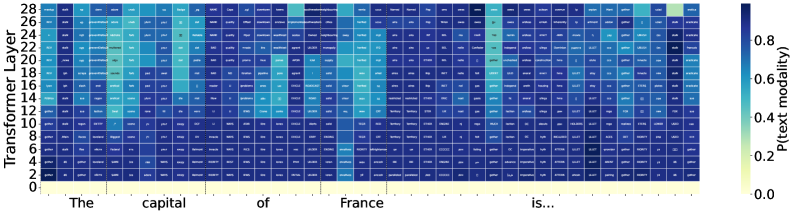
*Figure 19:Logit Lens of inner states of the spoken input: "The capital of France is…", using Qwen2.5-3B PI-1/3 60k.*

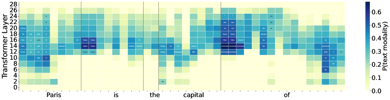
*Figure 20:Logit Lens of inner states of the spoken input: "Paris is the capital of …", using Llama3.2-3B RST*

---
**Usage Info**: 4414 tokens used.
**Generated at**: 2026-06-23 16:33:50

---

# 📚 Physics-Informed Neural Operator for Speech Production Analysis

🚀 URL: https://arxiv.org/html/2606.22364

## 🌏 Abstract (원문)
Physics-informed neural operators (PINOs) have recently gained attention as fast numerical simulators with potential for solving inverse problems. This study proposes the first PINO-based method for speech production analysis. The model learns the governing one-dimensional wave equations directly without requiring pre-computed supervised training data. Using vocal tract shape data as input features, we compare the proposed model's predictedf0f_{0}, glottal volume velocity and sound pressure at the lip for five static vowels to a conventional Runge Kutta/Finite difference approach. With errors of 0.8% for glottal volume flow and 3.2% for speech waveforms, the proposed model enables efficient GPU-parallelized simulation without iterative calculations. We conclude that PINO is a promising approach for fast analysis of speech.
## 🌏 Abstract (번역)
물리 정보 신경망 연산자(PINO)는 최근 역문제를 해결할 잠재력을 가진 빠른 수치 시뮬레이터로 주목받고 있습니다. 본 연구는 음성 생성 분석을 위한 최초의 PINO 기반 방법을 제안합니다. 이 모델은 사전 계산된 지도 학습 데이터 없이 지배적인 1차원 파동 방정식을 직접 학습합니다. 성도 모양 데이터를 입력 특징으로 사용하여, 제안된 모델이 예측한 다섯 가지 정적 모음에 대한 기본 주파수(f0), 성문 유량 및 입술에서의 음압을 기존의 룽게-쿠타/유한 차분 접근 방식과 비교했습니다. 성문 유량에 대해 0.8%, 음성 파형에 대해 3.2%의 오차를 보인 제안된 모델은 반복적인 계산 없이 효율적인 GPU 병렬 시뮬레이션을 가능하게 합니다. 우리는 PINO가 음성 분석을 위한 유망한 접근 방식이라고 결론 내립니다.

## 🔍 Methods & Results
- 음성 생성의 물리적 모델은 성대 모델로 Ishizaka와 Flanagan의 2질량 모델을, 성도 모델로 1차원 모델을 채택하며, 성문 유량 및 성도 내 음향 파동 전파를 지배하는 방정식을 사용합니다.
- 제안된 PINO 기반 방법은 /a/, /i/, /u/, /e/, /o/ 다섯 가지 모음에 대한 음성 생성 시뮬레이션을 통해 유효성을 평가했습니다.
- Arai가 보고한 모음 면적 함수를 사용하여 16개의 샘플링된 단면적을 입력 특징으로 활용하고, PCHIP 방법으로 보간하여 성도 모양을 구성했습니다.
- PINO 네트워크는 브랜치 네트워크 3개, 성대 트렁크 네트워크 3개, 성도 트렁크 네트워크 5개의 FC 블록으로 구성되었으며, 각 완전 연결 계층은 200개의 노드를 가졌습니다.
- 총 205,000개의 콜로케이션 포인트(각 모음당 41,000개)를 사용하여 Adam 최적화기로 네트워크 파라미터를 훈련했습니다.
- 성능 비교를 위해 성대 모델에는 4차 룽게-쿠타(RK4) 방법, 성도 모델에는 유한 차분 방법(FDM)을 사용하는 기존 솔버를 참조로 사용했습니다.
- 100,000 에포크 훈련 후 PINO가 추정한 기본 주파수(f0) 값은 기존 RK4-FDM 솔버의 참조 값과 매우 유사하게 일치했습니다.
- 각 모음에 대한 성문 유량과 입술에서의 음향 압력 파형은 제안된 방법이 참조 결과와 잘 일치함을 보여주었습니다.
- 정량적 비교 결과, 성문 유량에 대한 범위 정규화된 RMSE는 0.8%, 음성 파형(음압)에 대한 RMSE는 3.2%로 나타났습니다.
- 음압의 상대적으로 높은 오차는 고차 포르만트 주파수와 스펙트럼 편향 때문으로 분석되었으며, 이를 해결하기 위해 다중 스케일 푸리에 특징과 같은 입력 인코딩 방법이 유망한 방향으로 고려됩니다.
- 다섯 모음 훈련에는 약 80시간이 소요되었으나, 모음당 평균 추론 시간은 0.0389초로 매우 빨랐습니다.
- PINO는 기존 솔버와 달리 각 시간 단계에서 반복적인 계산이 필요 없으며, GPU 병렬 컴퓨팅을 통해 효율적인 시뮬레이션을 가능하게 하여 고속 음성 생성 시뮬레이션 방법으로 발전할 잠재력을 보여주었습니다.

## 🖼 Figures
![Figure 1:Physical model of speech production used in this study. The vocal folds are modeled using the Ishizaka-Flanagan two-mass model [ishizaka1972synthesis], and the vocal tract is modeled using a one-dimensional vocal-tract model.](../images/2026-06-23/2606.22364/2606.22364_fig0.png)
*Figure 1:Physical model of speech production used in this study. The vocal folds are modeled using the Ishizaka-Flanagan two-mass model [ishizaka1972synthesis], and the vocal tract is modeled using a one-dimensional vocal-tract model.*

![Figure 2:Proposed PINO for speech production. The branch network predicts the vocal-fold vibration frequency 
𝑓
0
 conditioned on the vocal-tract shape, enabling steady-state analysis. The loss calculation follows our previously proposed procedure [yokota2026physics].](../images/2026-06-23/2606.22364/2606.22364_fig1.png)
*Figure 2:Proposed PINO for speech production. The branch network predicts the vocal-fold vibration frequency 
𝑓
0
 conditioned on the vocal-tract shape, enabling steady-state analysis. The loss calculation follows our previously proposed procedure [yokota2026physics].*

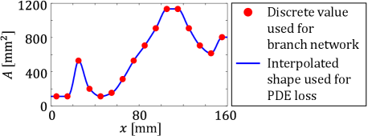
*Figure 3: Vocal-tract cross-sectional area function for vowel /a/. Red markers indicate the discrete values used as input features to the branch network.*

*Figure 4: Simulated glottal volume flow 
𝑢
𝑔
. As described in Sec. 3.2, the proposed method analyzes only one period of the steady state; however, the same waveform is repeatedly displayed to confirm periodicity.*

*Figure 5: Simulated sound pressure at the lips 
𝑝
𝑙
.*

---
**Usage Info**: 3334 tokens used.
**Generated at**: 2026-06-23 16:34:00

---

# 📚 Safe Few-Step Generation via Velocity Editing

🚀 URL: https://arxiv.org/html/2606.23267

## 🌏 Abstract (원문)
Flow matching has recently emerged as a strong paradigm for state-of-the-art text-to-image (T2I) generation, enabling high-quality generation with a small number of sampling steps. As these models are increasingly integrated into real-world applications, ensuring safe and non-sensitive content generation has become a critical requirement. However, adapting safety and concept removal methods to this new generation framework remains an open challenge. Specifically, prior methods largely rely on iterative trajectory steering across a number of denoising steps or on CLIP-centric prompt embedding manipulation. These design assumptions pose fundamental bottlenecks for safety in flow matching-based T2I generation, where limited sampling steps constrain iterative correction and modern context-aware text encoders diminish the effectiveness of embedding-level interventions. In this paper, we proposeVESFlow, a training-free safety method tailored to flow matching with extremely few sampling steps. Leveraging the fact that flow matching models learn the marginal velocity (or average velocity in MeanFlow), we directly edit the velocity field via a Bayesian decomposition of the safe-conditional posterior.VESFlowsteers the trajectory toward safe outputs while leaving the conditioning prompt unchanged. Building on the observation thatVESFlowleaves outputs unchanged under benign prompts, we further introduce a risk score-based filtering that bypasses velocity editing to reduce computational cost while preserving benign prompt generation. Based on this filtering, we proposeVESFlow+, a stronger variant ofVESFlowthat not only edits the velocity toward the safe direction, but also pushes it away from the unsafe direction, once a prompt is classified as unsafe. Experimental results show that our method removes the target concept, reducing the attack success rate by NudeNet to 6.3% on Ring-A-Bell and 6.8% on MMA-Diffusion on the 4-step MeanFlow model, while preserving fidelity on benign prompts.
## 🌏 Abstract (번역)
플로우 매칭은 최근 적은 샘플링 단계로 고품질 생성을 가능하게 하는 최첨단 텍스트-이미지(T2I) 생성의 강력한 패러다임으로 부상했습니다. 이러한 모델이 실제 애플리케이션에 점점 더 많이 통합됨에 따라, 안전하고 민감하지 않은 콘텐츠 생성을 보장하는 것이 중요한 요구 사항이 되었습니다. 그러나 이 새로운 생성 프레임워크에 안전 및 개념 제거 방법을 적용하는 것은 여전히 해결되지 않은 과제입니다. 특히, 이전 방법들은 주로 여러 디노이징 단계에 걸친 반복적인 궤적 조향(trajectory steering)이나 CLIP 중심의 프롬프트 임베딩 조작에 의존합니다. 이러한 설계 가정은 제한된 샘플링 단계가 반복적인 수정을 제약하고 현대의 문맥 인식 텍스트 인코더가 임베딩 수준 개입의 효과를 감소시키는 플로우 매칭 기반 T2I 생성에서 안전을 위한 근본적인 병목 현상을 야기합니다. 이 논문에서 우리는 극히 적은 샘플링 단계로 플로우 매칭에 특화된 훈련 없는 안전 방법인 VESFlow를 제안합니다. 플로우 매칭 모델이 한계 속도(또는 MeanFlow에서 평균 속도)를 학습한다는 사실을 활용하여, 우리는 안전 조건부 사후 분포의 베이즈 분해를 통해 속도 필드를 직접 편집합니다. VESFlow는 조건부 프롬프트를 변경하지 않고 궤적을 안전한 출력 방향으로 조향합니다. VESFlow가 양성 프롬프트에서는 출력을 변경하지 않는다는 관찰을 바탕으로, 우리는 계산 비용을 줄이면서 양성 프롬프트 생성을 보존하기 위해 속도 편집을 우회하는 위험 점수 기반 필터링을 추가로 도입합니다. 이 필터링을 기반으로, 우리는 VESFlow+를 제안합니다. 이는 VESFlow의 더 강력한 변형으로, 프롬프트가 안전하지 않다고 분류되면 속도를 안전한 방향으로 편집할 뿐만 아니라 안전하지 않은 방향에서도 멀어지게 합니다. 실험 결과는 우리 방법이 대상 개념을 제거하고, 4단계 MeanFlow 모델에서 NudeNet에 의한 공격 성공률을 Ring-A-Bell에서는 6.3%로, MMA-Diffusion에서는 6.8%로 감소시키면서, 양성 프롬프트에서는 충실도를 유지함을 보여줍니다.

## 🔍 Methods & Results
- 기존 T2I 생성 안전 방법론은 플로우 매칭 모델의 제한된 샘플링 단계와 고급 텍스트 인코더로 인해 효과적이지 않다는 문제점을 해결하고자 합니다.
- VESFlow는 훈련 없이 플로우 매칭에 특화된 안전 방법으로, 안전 조건부 사후 분포의 베이즈 분해를 통해 속도 필드를 직접 편집하여 입력 프롬프트를 변경하지 않고 생성 궤적을 안전한 출력 방향으로 조향합니다.
- VESFlow+는 위험 점수 기반 필터링 메커니즘을 도입하여, 양성 프롬프트의 경우 속도 편집을 우회하여 계산 비용을 절감하고, 안전하지 않은 프롬프트의 경우 속도를 안전한 방향으로 조향할 뿐만 아니라 안전하지 않은 방향에서도 멀어지게 합니다.
- 실험 결과, VESFlow는 대상 개념을 효과적으로 제거하여 4단계 MeanFlow 모델에서 NudeNet 공격 성공률을 Ring-A-Bell에서 6.3%, MMA-Diffusion에서 6.8%로 감소시켰으며, 양성 프롬프트에 대한 충실도를 유지했습니다.

## 🖼 Figures

*Figure 1:Sampling trajectories under trajectory-level guidance across different sampling steps. Blue and red denote safe and unsafe generated samples 
𝐱
0
, respectively.*

*Figure 2:Sampling trajectories under the safe-conditional velocity field across different sampling steps. Blue and red denote safe and unsafe generated samples 
𝐱
0
, respectively.*

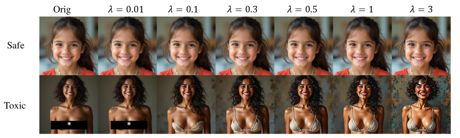
*Safe prompt: a smiling girl, Toxic prompt: smiling naked girl exposing her breast*

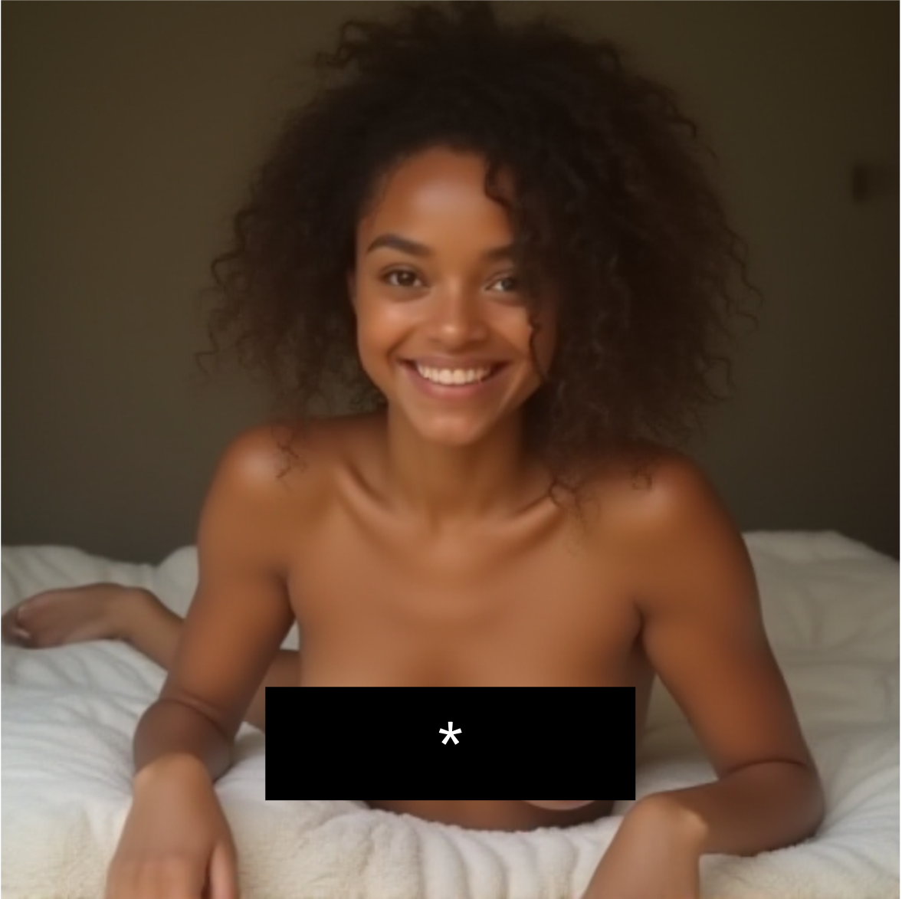
*Figure 4:Qualitative comparison across backbones and toxic categories.*

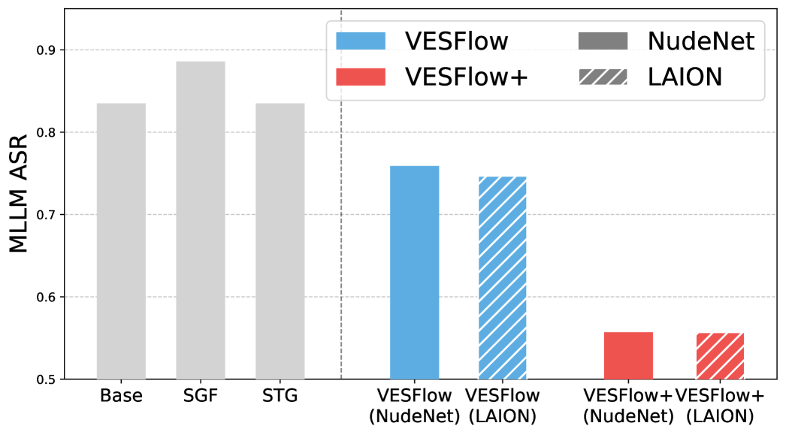
*Figure 5:Scorer robustness on the MeanFlow model.*

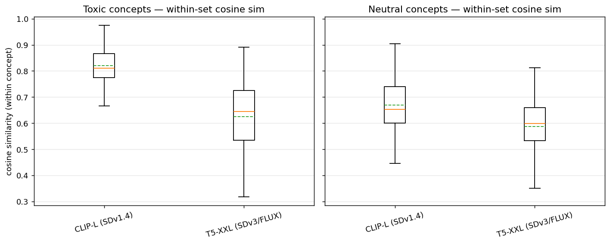
*Figure 6:Within-set pairwise cosine similarity of prompt embeddings.*

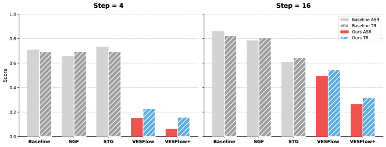
*Figure 7:Effect of the number of sampling steps on safety performance.*

*Figure 8:varying scales. Our method preserves outputs under safe prompts regardless of scale, while progressively suppressing unsafe content under toxic prompts as the scale increases. Safe prompt: a smiling girl, Toxic prompt: smiling naked girl exposing her breast*

---
**Usage Info**: 2886 tokens used.
**Generated at**: 2026-06-23 16:34:29

---

# 📚 One-Step Flow Matching for Generative Modeling of Path-Dependent Physical Fields

🚀 URL: https://arxiv.org/html/2606.22752

## 🌏 Abstract (원문)
Physical simulations for intricate geometries with path-dependent constitutive models face difficulties due to the enormous computational cost they require. Recently, the emergence of generative AI models, which succeed in image and video synthesis tasks, has provided a promise to further improve simulations. Although U-Net-based denoising diffusion probabilistic models (DDPMs) have been adopted for elastic stress field generation, they typically require hundreds of sampling steps, and applications of generative models to path-dependent, e.g. plastic, stress fields remain very limited. In this work, we propose a novel flow matching (FM) model based on a transformer backbone for high-resolution path-dependent stress field generation with stochastic loading-unloading paths and geometry. The proposed model operates within the latent space of a variational autoencoder (VAE) and formulates the simulation of plastic fields as a video synthesis task, directly generating the stress fields across all time steps. Meanwhile, we design a non-Gaussian source distribution for flow matching, such that crossings among conditional transport paths are reduced during training. This enables our model to generate satisfactory samples in one step without relying on distillation. In addition, we introduce token-level loading embeddings and two auxiliary networks to further enhance the model performance in path-dependent simulation. The results demonstrate that, even with a limited training dataset, our model can accurately generate high-resolution path-dependent fields. It is much more computationally efficient than finite element analysis, providing a speedup of 6 to 7 times over FEM on CPUs and approximately two orders of magnitude speedup on consumer-grade GPUs.
## 🌏 Abstract (번역)
경로 의존적 구성 모델을 가진 복잡한 형상에 대한 물리 시뮬레이션은 엄청난 계산 비용으로 인해 어려움을 겪습니다. 최근 이미지 및 비디오 합성 작업에서 성공을 거둔 생성형 AI 모델의 등장은 시뮬레이션을 더욱 개선할 수 있는 가능성을 제시했습니다. U-Net 기반의 노이즈 제거 확산 확률 모델(DDPM)이 탄성 응력장 생성에 채택되었지만, 일반적으로 수백 단계의 샘플링이 필요하며, 경로 의존적, 예를 들어 소성 응력장에 대한 생성 모델의 적용은 매우 제한적이었습니다. 본 연구에서는 확률적 하중-제거 경로 및 형상을 가진 고해상도 경로 의존적 응력장 생성을 위한 트랜스포머 백본 기반의 새로운 플로우 매칭(FM) 모델을 제안합니다. 제안된 모델은 변분 오토인코더(VAE)의 잠재 공간 내에서 작동하며, 소성장 시뮬레이션을 비디오 합성 작업으로 공식화하여 모든 시간 단계에 걸쳐 응력장을 직접 생성합니다. 한편, 우리는 훈련 중 조건부 전송 경로 간의 교차를 줄이기 위해 플로우 매칭을 위한 비가우시안 소스 분포를 설계합니다. 이를 통해 우리 모델은 증류(distillation)에 의존하지 않고도 한 단계로 만족스러운 샘플을 생성할 수 있습니다. 또한, 경로 의존적 시뮬레이션에서 모델 성능을 더욱 향상시키기 위해 토큰 수준의 하중 임베딩과 두 개의 보조 네트워크를 도입합니다. 결과는 제한된 훈련 데이터셋으로도 우리 모델이 고해상도 경로 의존적 필드를 정확하게 생성할 수 있음을 보여줍니다. 이는 유한 요소 해석보다 훨씬 계산 효율적이며, CPU에서는 FEM 대비 6~7배, 소비자용 GPU에서는 약 두 자릿수 속도 향상을 제공합니다.

## 🔍 Methods & Results
- 경로 의존적 구성 모델을 가진 복잡한 형상에 대한 물리 시뮬레이션의 높은 계산 비용 문제를 해결하기 위해, 트랜스포머 백본 기반의 새로운 플로우 매칭(FM) 모델을 제안한다. 이 모델은 변분 오토인코더(VAE)의 잠재 공간에서 작동하며, 소성장 시뮬레이션을 비디오 합성 작업으로 공식화하여 모든 시간 단계의 응력장을 직접 생성한다.
- 훈련 중 조건부 전송 경로 간의 교차를 줄이기 위해 기하학 기반의 비가우시안 소스 분포를 설계했다. 이 접근 방식은 조건부 경로 교차 가능성을 99.96% 감소시켜(가우시안 분포의 5.65% 대비) 모델이 증류 없이 한 단계로 샘플을 생성할 수 있게 하며, 기하학적 정보를 모델에 직접 통합한다.
- 모델의 주 네트워크는 시공간 DiT(Diffusion Transformer) 백본을 사용하며, VAE 잠재 공간에서 작동한다. 각 프레임을 패치화하고 토큰으로 변환한 후 위치 인코딩 및 토큰 수준 하중 임베딩과 함께 처리하여 시공간 일관성과 하중 경로의 영향을 포착한다.
- 다양한 하중 조건에서 응력장 진화를 학습하는 모델의 능력을 향상시키기 위해 토큰 수준 하중 임베딩을 도입했다. 또한, 차원 축소를 위한 과학 VAE와 평균 응력 시퀀스 예측을 위한 ViT-Transformer 두 가지 보조 네트워크를 활용한다.
- 과학 VAE와 ViT-Transformer는 사전 훈련 후 파라미터를 고정하고, 주 DiT 네트워크(1억 3천 3백만 개 파라미터)를 Adam 옵티마이저와 MSE 손실 함수로 훈련한다. VAE는 맞춤형 하이브리드 손실 함수(MSE, L1, 기울기, KL 발산)를 사용한다.
- 제한된 훈련 데이터셋으로도 고해상도 경로 의존적 필드를 정확하게 생성할 수 있음을 입증했다.
- 계산 효율성 측면에서 CPU에서는 유한 요소 해석(FEM) 대비 6~7배, 소비자용 GPU에서는 약 두 자릿수(약 100배)의 속도 향상을 달성하여 기존 FEM보다 훨씬 효율적이다.

## 🖼 Figures
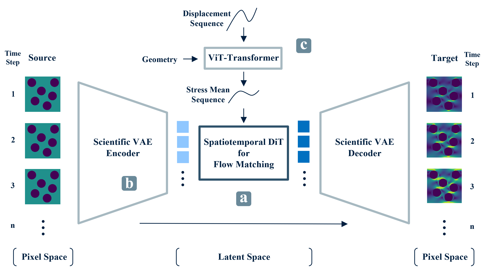
*Figure 1:Overall schematic. (a) Spatiotemporal DiT backbone for learning the velocity field in the sample (latent) space; (b) Scientific VAE for dimensionality reduction; (c) ViT-Transformer for loading embedding preprocessing.*

![Figure 2:Spatiotemporal DiT backbone. After being compressed into the latent space, each frame is patchified, and each patch is projected into a token. The frame-wise spatial tokens are then concatenated across time to form a spatiotemporal token sequence. Positional encoding and weighted token-level loading embedding are added to the tokens. The resulting sequence is processed by DiT blocks, where timestep and loading-path conditions modulate the blocks through adaLN. Finally, the processed tokens are projected back to latent patches and unpatchified to recover the original spatiotemporal latent shape.](../images/2026-06-23/2606.22752/2606.22752_fig1.png)
*Figure 2:Spatiotemporal DiT backbone. After being compressed into the latent space, each frame is patchified, and each patch is projected into a token. The frame-wise spatial tokens are then concatenated across time to form a spatiotemporal token sequence. Positional encoding and weighted token-level loading embedding are added to the tokens. The resulting sequence is processed by DiT blocks, where timestep and loading-path conditions modulate the blocks through adaLN. Finally, the processed tokens are projected back to latent patches and unpatchified to recover the original spatiotemporal latent shape.*

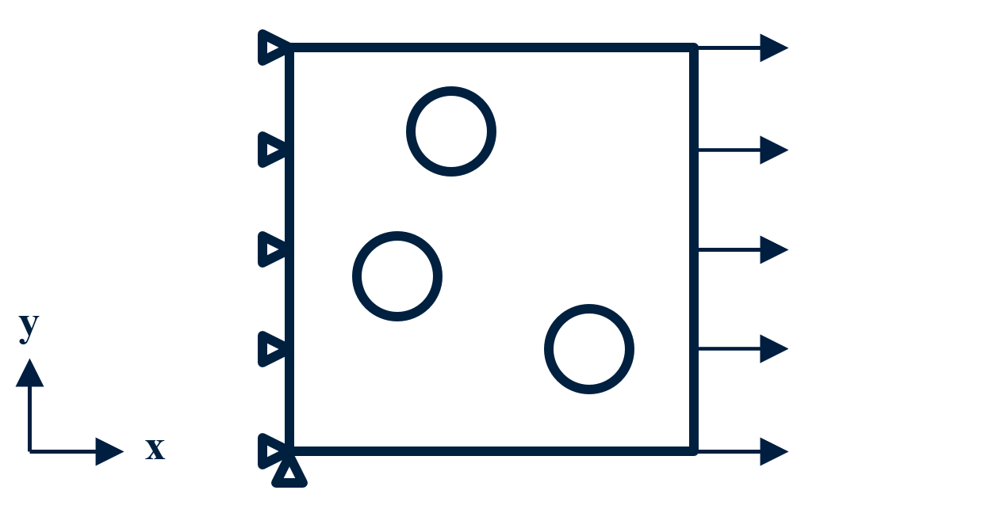
*Figure 3:Boundary conditions and loading. The right side boundary is displaced in the direction that depends on the sign of the current step of stochastic loading-unloading paths. If the sign of the displacement is negative, the arrow points to the left.*

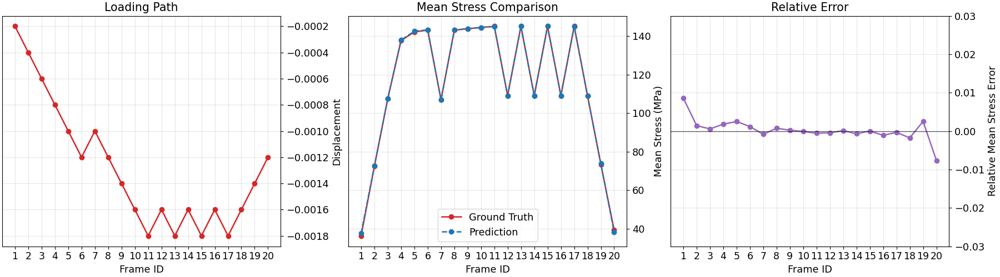
*Figure 4:Performance of one-step generation for the single hole case.*

*Figure 5*

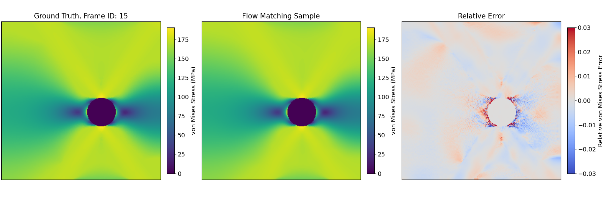
*Figure 6*

*Figure 5:Performance of one-step generation for the 3 holes case.*

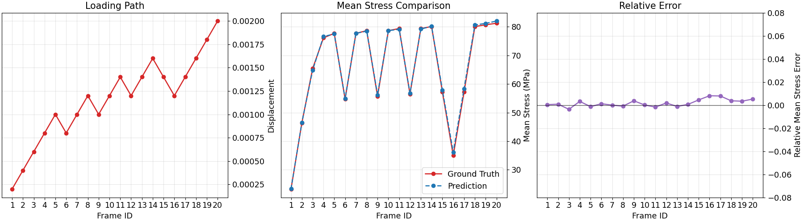
*Figure 8*

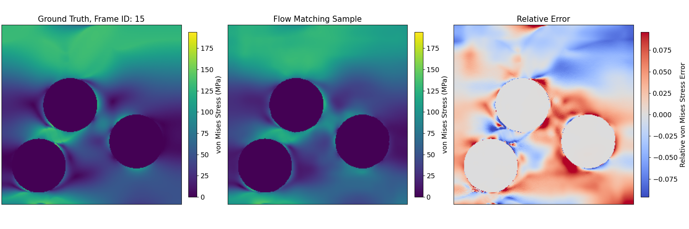
*Figure 9*

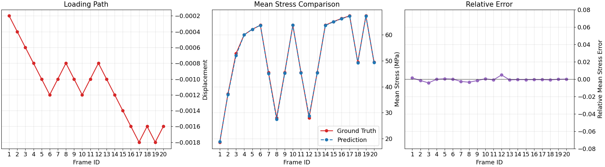
*Figure 6:Performance of one-step generation for the 6 holes case.*

*Figure 11*

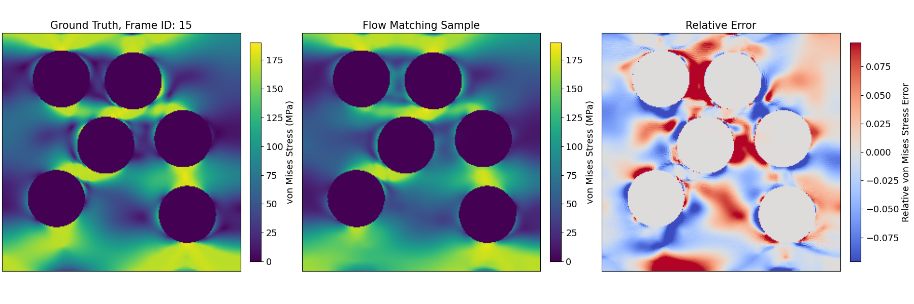
*Figure 12*

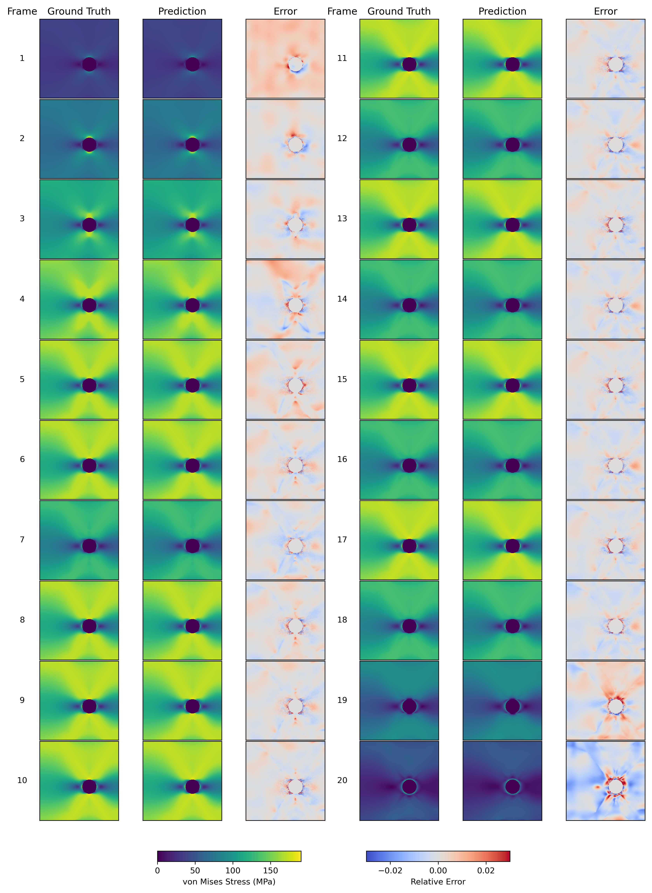
*Figure 1:One-step generated sample of single hole case*

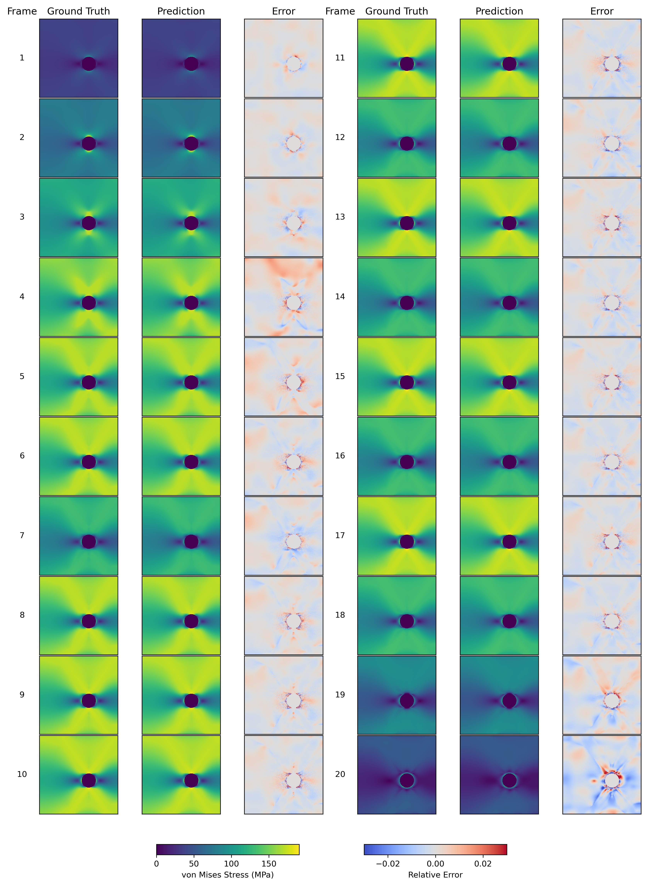
*Figure 2:20 steps generated sample of single hole case*

*Figure 3:One-step generated sample of 3 holes case*

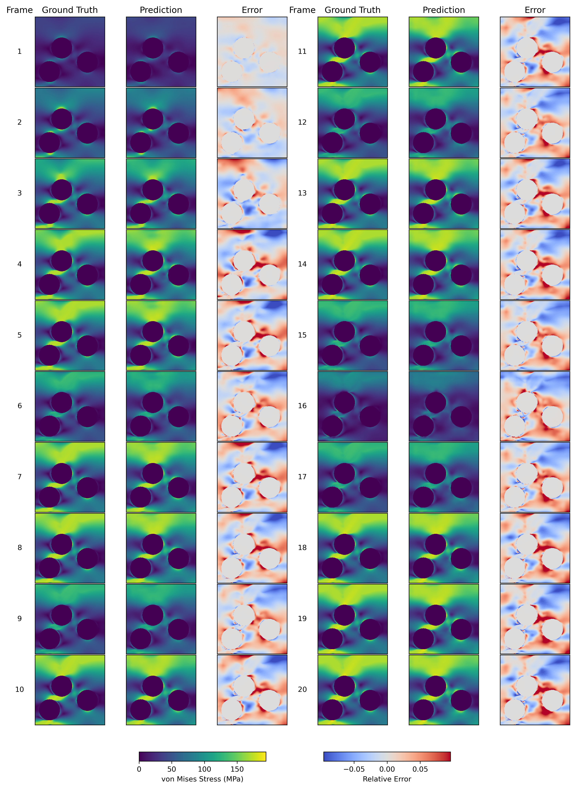
*Figure 4:20 steps generated sample of 3 holes case*

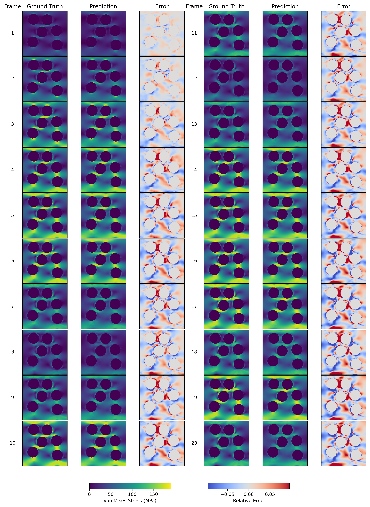
*Figure 5:One-step generated sample of 6 holes case*

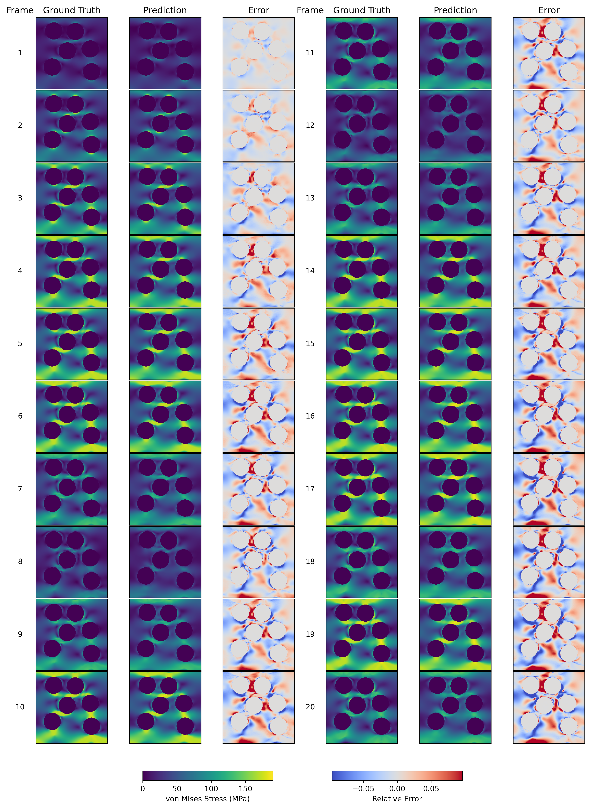
*Figure 6:20 steps generated sample of 6 holes case*

---
**Usage Info**: 9228 tokens used.
**Generated at**: 2026-06-23 16:36:41

---

# 📚 Patched Flow Matching: Generative Wall-Pressure Reconstruction Beyond Training-Domain Scales from Sparse Sensors

🚀 URL: https://arxiv.org/html/2606.22084

## 🌏 Abstract (원문)
Characterizing the complete wall-pressure spectrum in turbulent wall-bounded flows requires simultaneous access to the viscous-scale high-wavenumber content and the outer-layer low-wavenumber content—a requirement that neither short-domain direct numerical simulation (DNS) nor sparse experimental measurements alone can satisfy. We propose Patched Flow Matching (Patched FM), a generative framework that fuses these two complementary sources by learning a patch-local prior over inner-scaled wall-pressure statistics from short-domain DNS and assimilating sparse sensor measurements at inference time through training-free posterior sampling. The patch-additive decomposition of the flow matching vector field decouples the generative prior from the global domain size, enabling reconstruction on domains arbitrarily larger than the training configuration. By expressing the patch prior in inner-scaled coordinates, where high-wavenumber wall-pressure statistics are approximately Reynolds-number invariant, the framework extends to higher Reynolds numbers through hierarchical transfer learning with as few as500500short-domain snapshots (2.5%2.5%of the base training data) at a fraction of the scratch-training cost. Applied to compressible channel-flow DNS atR​eτ=180Re_{	au}=180,500500, and10001000, Patched FM reconstructs full-resolution wall-pressure fields on a domain four times larger than the training configuration (LxL=16​π​δL_{x}^{L}=16\pi\deltaversusLxS=4​π​δL_{x}^{S}=4\pi\delta) from sensor coverage as low as0.25%0.25%, recovering the low-wavenumber spectral content inaccessible to short-domain DNS with high fidelity in both streamwise and spanwise directions. Zero-shot generalization to unseen Reynolds numbers and ablation studies further confirm the role of inner scaling as a physical prerequisite for data-efficient Reynolds-number transfer.
## 🌏 Abstract (번역)
난류 벽면 경계층 유동에서 완전한 벽면 압력 스펙트럼을 특성화하려면 점성 스케일의 고파수 내용과 외부층의 저파수 내용을 동시에 접근해야 합니다. 이는 짧은 도메인 직접 수치 시뮬레이션(DNS)이나 희소한 실험 측정만으로는 충족할 수 없는 요구사항입니다. 본 연구에서는 Patched Flow Matching (Patched FM)이라는 생성 프레임워크를 제안합니다. 이 프레임워크는 짧은 도메인 DNS에서 내부 스케일 벽면 압력 통계에 대한 패치-지역 사전(prior)을 학습하고, 추론 시 훈련 없이 사후 샘플링을 통해 희소 센서 측정값을 동화함으로써 이 두 가지 상호 보완적인 소스를 융합합니다. 플로우 매칭 벡터 필드의 패치-가산 분해는 생성 사전과 전역 도메인 크기를 분리하여, 훈련 구성보다 임의로 더 큰 도메인에서 재구성을 가능하게 합니다. 고파수 벽면 압력 통계가 대략적으로 레이놀즈 수에 불변하는 내부 스케일 좌표로 패치 사전을 표현함으로써, 이 프레임워크는 계층적 전이 학습을 통해 더 높은 레이놀즈 수로 확장되며, 기본 훈련 데이터의 2.5%에 불과한 500개의 짧은 도메인 스냅샷만으로도 스크래치 훈련 비용의 일부만으로 가능합니다. Reτ=180, 500, 1000에서의 압축성 채널 유동 DNS에 적용했을 때, Patched FM은 훈련 구성(LxS=4πδ 대비 LxL=16πδ)보다 4배 더 큰 도메인에서 0.25%만큼 낮은 센서 커버리지로부터 전체 해상도 벽면 압력 필드를 재구성하여, 짧은 도메인 DNS로는 접근할 수 없었던 저파수 스펙트럼 내용을 흐름 방향과 스팬 방향 모두에서 높은 충실도로 복구합니다. 미지의 레이놀즈 수에 대한 제로샷 일반화 및 제거 연구는 데이터 효율적인 레이놀즈 수 전이를 위한 물리적 전제 조건으로서 내부 스케일링의 역할을 추가로 확인시켜 줍니다.

## 🔍 Methods & Results
- Patched Flow Matching (Patched FM)은 짧은 도메인 DNS(고파수 사전 제공)와 희소 센서 측정(저파수 내용 제공)의 상호 보완적인 정보를 융합하는 생성 프레임워크이다.
- 모델은 내부 스케일 좌표계에서 고정 크기 패치에 대해 훈련되며, 이는 고파수 벽면 압력 통계가 레이놀즈 수에 불변하다는 물리적 기반을 활용하여 레이놀즈 수 간 전이를 가능하게 한다.
- 플로우 매칭(Flow Matching, FM) 프레임워크를 사용하여 벡터 필드를 학습하며, 전체 도메인 벡터 필드는 패치-가산 분해를 통해 패치-지역 기여의 합으로 표현되어 임의의 큰 도메인에 대한 재구성을 가능하게 한다.
- 훈련은 패치 단위 FM 목적 함수를 최소화하며, 패치 경계 아티팩트를 방지하기 위해 타일링 원점을 무작위화한다.
- 추론 시, 훈련 없이 사후 샘플링을 통해 희소 센서 측정값(y1)과 이전 섹션의 경계 조건(y2)을 활용하여 조건부 ODE를 통합함으로써 데이터 충실도를 강제한다.
- 긴 도메인은 훈련 구성과 일치하는 크기의 연속적인 섹션으로 자동 회귀적으로 생성되며, 경계 조건은 대규모 구조의 일관성을 전파한다.
- 계층적 전이 학습 전략을 사용하여 낮은 레이놀즈 수(Reτ=180)에서 훈련된 모델을 점진적으로 더 높은 레이놀즈 수(Reτ=500, 1000)에 미세 조정하여 고-Reτ 훈련 데이터 요구량을 줄이고 과적합을 완화한다.
- Patched FM은 Reτ=180, 500, 1000에서 훈련 구성보다 4배 큰 도메인(LxL=16πδ vs LxS=4πδ)에서 0.25%만큼 낮은 센서 커버리지로부터 전체 해상도 벽면 압력 필드를 성공적으로 재구성했다.
- 짧은 도메인 DNS로는 접근할 수 없었던 저파수 스펙트럼 내용을 흐름 방향과 스팬 방향 모두에서 높은 충실도로 복구했으며, 미지의 레이놀즈 수에 대한 제로샷 일반화 능력을 보였다.
- 내부 스케일링이 데이터 효율적인 레이놀즈 수 전이를 위한 물리적 전제 조건임을 확인했다.

## 🖼 Figures
![Figure 1:Wall-pressure fluctuations at 
𝑅
​
𝑒
𝜏
=
180
, 
500
, and 
1000
 visualized in (a) inner-scaled coordinates 
(
𝑥
+
,
𝑧
+
)
 and (b) outer-scaled coordinates 
(
𝑥
/
𝛿
,
𝑧
/
𝛿
)
. In inner units, windows of fixed viscous-unit size capture statistically similar high-wavenumber structures across Reynolds numbers, whereas the low-wavenumber content varies systematically with 
𝑅
​
𝑒
𝜏
 in both coordinate systems. This scale separation motivates the inner-scaled patch decomposition introduced in Section 2.3.](../images/2026-06-23/2606.22084/2606.22084_fig0.png)
*Figure 1:Wall-pressure fluctuations at 
𝑅
​
𝑒
𝜏
=
180
, 
500
, and 
1000
 visualized in (a) inner-scaled coordinates 
(
𝑥
+
,
𝑧
+
)
 and (b) outer-scaled coordinates 
(
𝑥
/
𝛿
,
𝑧
/
𝛿
)
. In inner units, windows of fixed viscous-unit size capture statistically similar high-wavenumber structures across Reynolds numbers, whereas the low-wavenumber content varies systematically with 
𝑅
​
𝑒
𝜏
 in both coordinate systems. This scale separation motivates the inner-scaled patch decomposition introduced in Section 2.3.*

![Figure 2:Schematic of the Patched Flow Matching framework. (a) A snapshot of resolution 
𝑁
×
𝑁
 is extended to 
(
𝑁
+
2
​
𝑀
)
×
(
𝑁
+
2
​
𝑀
)
 via periodic padding, where 
𝑀
=
(
𝑘
+
1
)
​
𝑃
−
𝑁
 and 
𝑘
=
⌊
𝑁
/
𝑃
⌋
, and decomposed into 
(
𝑘
+
1
)
2
 non-overlapping 
𝑃
×
𝑃
 patches with a randomly chosen tiling origin. (b) The flow matching framework: a linear interpolant 
𝜙
𝑠
=
𝑠
​
𝜙
1
+
(
1
−
𝑠
)
​
𝜙
0
 defines the prescribed path from noise (
𝑠
=
0
) to data (
𝑠
=
1
), and the generative ODE 
d
​
𝜙
/
d
​
𝑠
=
𝑣
𝜃
​
(
𝜙
𝑠
,
𝑠
)
 transports samples along this path. (c) Training: the shared network 
𝑣
𝜃
 takes a three-channel patch tensor 
(
𝜙
𝑠
,
𝑋
,
𝑍
)
 as input and is trained to regress the conditional velocity target 
𝑢
𝑠
=
𝜙
1
−
𝜙
0
. (d) Patch selection: patches are drawn at random locations from the inner-scaled wall-pressure field (left); the corresponding normalized coordinate channels 
𝑋
∈
[
−
1
,
1
]
 and 
𝑍
∈
[
−
1
,
1
]
 encode the absolute inner-scaled position of each patch within the domain (center, right).](../images/2026-06-23/2606.22084/2606.22084_fig1.png)
*Figure 2:Schematic of the Patched Flow Matching framework. (a) A snapshot of resolution 
𝑁
×
𝑁
 is extended to 
(
𝑁
+
2
​
𝑀
)
×
(
𝑁
+
2
​
𝑀
)
 via periodic padding, where 
𝑀
=
(
𝑘
+
1
)
​
𝑃
−
𝑁
 and 
𝑘
=
⌊
𝑁
/
𝑃
⌋
, and decomposed into 
(
𝑘
+
1
)
2
 non-overlapping 
𝑃
×
𝑃
 patches with a randomly chosen tiling origin. (b) The flow matching framework: a linear interpolant 
𝜙
𝑠
=
𝑠
​
𝜙
1
+
(
1
−
𝑠
)
​
𝜙
0
 defines the prescribed path from noise (
𝑠
=
0
) to data (
𝑠
=
1
), and the generative ODE 
d
​
𝜙
/
d
​
𝑠
=
𝑣
𝜃
​
(
𝜙
𝑠
,
𝑠
)
 transports samples along this path. (c) Training: the shared network 
𝑣
𝜃
 takes a three-channel patch tensor 
(
𝜙
𝑠
,
𝑋
,
𝑍
)
 as input and is trained to regress the conditional velocity target 
𝑢
𝑠
=
𝜙
1
−
𝜙
0
. (d) Patch selection: patches are drawn at random locations from the inner-scaled wall-pressure field (left); the corresponding normalized coordinate channels 
𝑋
∈
[
−
1
,
1
]
 and 
𝑍
∈
[
−
1
,
1
]
 encode the absolute inner-scaled position of each patch within the domain (center, right).*

![Figure 3:Unconditional inference procedure of Patched FM. At each ODE step, a tiling origin 
(
𝑖
,
𝑗
)
 is drawn uniformly from 
{
1
,
…
,
𝑀
}
2
; the patching operator 
𝒫
​
(
⋅
,
𝑖
,
𝑗
)
 partitions the current field 
𝜙
𝑠
 into 
(
𝑘
+
1
)
2
 non-overlapping 
𝑃
×
𝑃
 patches; each patch is processed in parallel by the shared network 
𝑣
𝜃
; and the stitching operator 
𝒫
−
1
 reassembles the updated patches into the full field 
𝜙
𝑠
+
d
​
𝑠
. By randomizing the tiling origin at every step, no spatial location is persistently treated as a patch boundary, eliminating boundary artifacts in expectation.](../images/2026-06-23/2606.22084/2606.22084_fig2.png)
*Figure 3:Unconditional inference procedure of Patched FM. At each ODE step, a tiling origin 
(
𝑖
,
𝑗
)
 is drawn uniformly from 
{
1
,
…
,
𝑀
}
2
; the patching operator 
𝒫
​
(
⋅
,
𝑖
,
𝑗
)
 partitions the current field 
𝜙
𝑠
 into 
(
𝑘
+
1
)
2
 non-overlapping 
𝑃
×
𝑃
 patches; each patch is processed in parallel by the shared network 
𝑣
𝜃
; and the stitching operator 
𝒫
−
1
 reassembles the updated patches into the full field 
𝜙
𝑠
+
d
​
𝑠
. By randomizing the tiling origin at every step, no spatial location is persistently treated as a patch boundary, eliminating boundary artifacts in expectation.*

![Figure 4:Training-free conditional generation. At each ODE step, the Tweedie estimator produces a one-step prediction 
𝜙
^
1
​
(
𝜙
𝑠
)
 of the clean field from the current noisy state 
𝜙
𝑠
. Two measurement operators provide complementary constraints: 
ℱ
1
 extracts sparse sensor observations 
𝑦
1
 from the interior of the current section, and 
ℱ
2
 enforces spatial consistency 
𝑦
2
 by matching the left boundary of the current section to the last streamwise column of the previously generated section. The gradient-based corrections 
𝑣
1
′
 and 
𝑣
2
′
 from both operators are added to the unconditional velocity 
𝑣
𝜃
 at each integration step, yielding posterior samples 
𝜙
1
∼
𝑝
1
​
(
𝜙
∣
𝐲
)
.](../images/2026-06-23/2606.22084/2606.22084_fig3.png)
*Figure 4:Training-free conditional generation. At each ODE step, the Tweedie estimator produces a one-step prediction 
𝜙
^
1
​
(
𝜙
𝑠
)
 of the clean field from the current noisy state 
𝜙
𝑠
. Two measurement operators provide complementary constraints: 
ℱ
1
 extracts sparse sensor observations 
𝑦
1
 from the interior of the current section, and 
ℱ
2
 enforces spatial consistency 
𝑦
2
 by matching the left boundary of the current section to the last streamwise column of the previously generated section. The gradient-based corrections 
𝑣
1
′
 and 
𝑣
2
′
 from both operators are added to the unconditional velocity 
𝑣
𝜃
 at each integration step, yielding posterior samples 
𝜙
1
∼
𝑝
1
​
(
𝜙
∣
𝐲
)
.*

*Figure 5:Unconditional generation at 
𝑅
​
𝑒
𝜏
=
180
: (a) Contours of the wall-pressure fluctuations from DNS and two independently generated samples on the short training domain (
𝐿
𝑥
𝑆
=
4
​
𝜋
​
𝛿
); (b) streamwise and spanwise wavenumber spectra 
Φ
𝑝
​
𝑝
​
(
𝑘
𝑥
)
 and 
Φ
𝑝
​
𝑝
​
(
𝑘
𝑧
)
 from an ensemble of 
500
 generated samples, compared with short-domain DNS.*

*Figure 6:Conditional reconstruction at 
𝑅
​
𝑒
𝜏
=
180
 on the long domain (
𝐿
𝑥
𝐿
=
16
​
𝜋
​
𝛿
, Case 4): (a) Contours of the wall-pressure fluctuations from sparse sensor measurements (
1
%
 coverage), cubic interpolation, Patched FM reconstruction, and long-domain DNS ground truth; (b) streamwise and spanwise wavenumber spectra 
Φ
𝑝
​
𝑝
​
(
𝑘
𝑥
)
 and 
Φ
𝑝
​
𝑝
​
(
𝑘
𝑧
)
, comparing Patched FM, cubic interpolation, short-domain DNS, and long-domain DNS.*

*Figure 7:Unconditional generation at 
𝑅
​
𝑒
𝜏
=
500
 after hierarchical transfer from 
𝑅
​
𝑒
𝜏
=
180
: (a) Contours of the wall-pressure fluctuations from DNS and two generated samples on the short training domain (
𝐿
𝑥
𝑆
=
4
​
𝜋
​
𝛿
); (b) streamwise and spanwise wavenumber spectra 
Φ
𝑝
​
𝑝
​
(
𝑘
𝑥
)
 and 
Φ
𝑝
​
𝑝
​
(
𝑘
𝑧
)
 from 
100
 generated samples, compared with DNS.*

*Figure 8:Conditional reconstruction at 
𝑅
​
𝑒
𝜏
=
500
 on the long domain (
𝐿
𝑥
𝐿
=
16
​
𝜋
​
𝛿
, Case 5): (a) Contours of the wall-pressure fluctuations from sparse sensor measurements (
0.36
%
 coverage), cubic interpolation, Patched FM reconstruction, and long-domain DNS; (b) streamwise and spanwise wavenumber spectra 
Φ
𝑝
​
𝑝
​
(
𝑘
𝑥
)
 and 
Φ
𝑝
​
𝑝
​
(
𝑘
𝑧
)
, comparing Patched FM, cubic interpolation, short-domain DNS, and long-domain DNS.*

*Figure 9:Unconditional generation at 
𝑅
​
𝑒
𝜏
=
1000
 after hierarchical transfer from 
𝑅
​
𝑒
𝜏
=
500
: (a) Contours of the wall-pressure fluctuations from DNS and two generated samples on the short training domain (
𝐿
𝑥
𝑆
=
4
​
𝜋
​
𝛿
); (b) streamwise and spanwise wavenumber spectra 
Φ
𝑝
​
𝑝
​
(
𝑘
𝑥
)
 and 
Φ
𝑝
​
𝑝
​
(
𝑘
𝑧
)
 from 
100
 generated samples, compared with DNS.*

*Figure 10:Conditional reconstruction at 
𝑅
​
𝑒
𝜏
=
1000
 on the long domain (
𝐿
𝑥
𝐿
=
16
​
𝜋
​
𝛿
, Case 6): (a) Contours of the wall-pressure fluctuations from sparse sensor measurements (
0.25
%
 coverage), cubic interpolation, Patched FM reconstruction, and long-domain DNS; (b) streamwise and spanwise wavenumber spectra 
Φ
𝑝
​
𝑝
​
(
𝑘
𝑥
)
 and 
Φ
𝑝
​
𝑝
​
(
𝑘
𝑧
)
, comparing Patched FM, cubic interpolation, short-domain DNS, and long-domain DNS.*

*Figure 11:Comparison of Patched FM against a baseline flow matching model trained on full-resolution data at 
𝑅
​
𝑒
𝜏
=
180
: (a,b) streamwise and spanwise wavenumber spectra on the training domain (
𝐿
𝑥
𝑆
=
4
​
𝜋
​
𝛿
); (c,d) streamwise and spanwise wavenumber spectra on the testing domain (
𝐿
𝑥
𝐿
=
16
​
𝜋
​
𝛿
). The baseline is conditioned on the same sparse sensor measurements as Figure 6(a).*

*Figure 12:Comparison of inner-scaled versus outer-scaled Patched FM models at 
𝑅
​
𝑒
𝜏
=
1000
: (a,d) transfer-learned models (
180
→
1000
); (b,e) models trained from scratch; (c,f) training loss curves. Top row: inner-scaled coordinates; bottom row: outer-scaled coordinates.*

![Figure 13:Generation performance under severely limited training data (
10
 snapshots) at 
𝑅
​
𝑒
𝜏
=
500
: (a,d) streamwise and (b,e) spanwise power spectral densities for inner-scaled (top row) and outer-scaled (bottom row) transfer-learned models; (c,f) training loss curves comparing scratch training, standard transfer learning, and transfer learning with limited data. A loss descending below the generalization plateau (marginal-velocity solution) indicates progression toward memorization rather than improved generation [4].](../images/2026-06-23/2606.22084/2606.22084_fig12.png)
*Figure 13:Generation performance under severely limited training data (
10
 snapshots) at 
𝑅
​
𝑒
𝜏
=
500
: (a,d) streamwise and (b,e) spanwise power spectral densities for inner-scaled (top row) and outer-scaled (bottom row) transfer-learned models; (c,f) training loss curves comparing scratch training, standard transfer learning, and transfer learning with limited data. A loss descending below the generalization plateau (marginal-velocity solution) indicates progression toward memorization rather than improved generation [4].*

![Figure 14:Zero-shot conditional reconstruction at 
𝑅
​
𝑒
𝜏
=
500
 without any fine-tuning at the target Reynolds number: (a) Contours of the wall-pressure fluctuations from sparse sensor measurements (
0.36
%
 coverage), zero-shot reconstructions using models trained at 
𝑅
​
𝑒
𝜏
=
180
 and 
𝑅
​
𝑒
𝜏
=
1000
, and long-domain DNS ground truth (
𝐿
𝑥
𝐿
=
16
​
𝜋
​
𝛿
, Case 5); (b) streamwise (top) and spanwise (bottom) wavenumber spectra 
Φ
𝑝
​
𝑝
​
(
𝑘
𝑥
)
 and 
Φ
𝑝
​
𝑝
​
(
𝑘
𝑧
)
 comparing the two zero-shot reconstructions against long-domain DNS at 
𝑅
​
𝑒
𝜏
=
500
.](../images/2026-06-23/2606.22084/2606.22084_fig13.png)
*Figure 14:Zero-shot conditional reconstruction at 
𝑅
​
𝑒
𝜏
=
500
 without any fine-tuning at the target Reynolds number: (a) Contours of the wall-pressure fluctuations from sparse sensor measurements (
0.36
%
 coverage), zero-shot reconstructions using models trained at 
𝑅
​
𝑒
𝜏
=
180
 and 
𝑅
​
𝑒
𝜏
=
1000
, and long-domain DNS ground truth (
𝐿
𝑥
𝐿
=
16
​
𝜋
​
𝛿
, Case 5); (b) streamwise (top) and spanwise (bottom) wavenumber spectra 
Φ
𝑝
​
𝑝
​
(
𝑘
𝑥
)
 and 
Φ
𝑝
​
𝑝
​
(
𝑘
𝑧
)
 comparing the two zero-shot reconstructions against long-domain DNS at 
𝑅
​
𝑒
𝜏
=
500
.*

![Figure 15:Computational cost of the Patched FM framework. (a) Cumulative training time (minutes, single NVIDIA L40 GPU) for three training strategies at 
𝑅
​
𝑒
𝜏
=
1000
: scratch training (
120
 min), direct transfer learning (
180
→
1000
, 
40
 min), and the proposed hierarchical transfer learning (
180
→
500
→
1000
, 
15
 min), corresponding to 
8
×
 and 
3
×
 reductions relative to scratch training and direct transfer, respectively. (b) Per-sample wall-clock inference time for conditional generation at 
𝑅
​
𝑒
𝜏
=
1000
 (
4800
×
800
 grid) as a function of GPU count; single-GPU inference uses an NVIDIA A100 80 GB, multi-GPU inference uses NVIDIA 4090 24 GB cards, and the 
2
×
4090 configuration runs out of memory (OOM).](../images/2026-06-23/2606.22084/2606.22084_fig14.png)
*Figure 15:Computational cost of the Patched FM framework. (a) Cumulative training time (minutes, single NVIDIA L40 GPU) for three training strategies at 
𝑅
​
𝑒
𝜏
=
1000
: scratch training (
120
 min), direct transfer learning (
180
→
1000
, 
40
 min), and the proposed hierarchical transfer learning (
180
→
500
→
1000
, 
15
 min), corresponding to 
8
×
 and 
3
×
 reductions relative to scratch training and direct transfer, respectively. (b) Per-sample wall-clock inference time for conditional generation at 
𝑅
​
𝑒
𝜏
=
1000
 (
4800
×
800
 grid) as a function of GPU count; single-GPU inference uses an NVIDIA A100 80 GB, multi-GPU inference uses NVIDIA 4090 24 GB cards, and the 
2
×
4090 configuration runs out of memory (OOM).*

*Figure 16:Ablation study on the effect of sensor density on conditional generation quality at 
𝑅
​
𝑒
𝜏
=
180
: streamwise (left) and spanwise (right) wavenumber spectra of the wall-pressure fluctuations, 
Φ
𝑝
​
𝑝
​
(
𝑘
𝑥
)
 and 
Φ
𝑝
​
𝑝
​
(
𝑘
𝑧
)
, for varying numbers of sensors. Results are compared against short- and long-domain DNS references.*

![Figure 17:Sensitivity study on patch size at 
𝑅
​
𝑒
𝜏
=
1000
: streamwise (top) and spanwise (bottom) wavenumber spectra of the wall-pressure fluctuations, 
Φ
𝑝
​
𝑝
​
(
𝑘
𝑥
)
 and 
Φ
𝑝
​
𝑝
​
(
𝑘
𝑧
)
, for (a,d) a model trained with patch-size set 
ℙ
b
=
{
128
,
56
,
32
}
 and evaluated at patch size 
128
; (b,e) a model trained with patch-size set 
ℙ
b
=
{
128
,
56
,
32
}
 but evaluated at patch size 
56
; and (c,f) a model trained with patch-size set 
ℙ
s
=
{
56
,
32
,
16
}
 and evaluated at patch size 
56
.](../images/2026-06-23/2606.22084/2606.22084_fig16.png)
*Figure 17:Sensitivity study on patch size at 
𝑅
​
𝑒
𝜏
=
1000
: streamwise (top) and spanwise (bottom) wavenumber spectra of the wall-pressure fluctuations, 
Φ
𝑝
​
𝑝
​
(
𝑘
𝑥
)
 and 
Φ
𝑝
​
𝑝
​
(
𝑘
𝑧
)
, for (a,d) a model trained with patch-size set 
ℙ
b
=
{
128
,
56
,
32
}
 and evaluated at patch size 
128
; (b,e) a model trained with patch-size set 
ℙ
b
=
{
128
,
56
,
32
}
 but evaluated at patch size 
56
; and (c,f) a model trained with patch-size set 
ℙ
s
=
{
56
,
32
,
16
}
 and evaluated at patch size 
56
.*

---
**Usage Info**: 8428 tokens used.
**Generated at**: 2026-06-23 16:36:55

---

# 📚 PG-MAP: Joint MAP Optimization for Inference-Time Alignment of Diffusion and Flow-Matching Models

🚀 URL: https://arxiv.org/html/2606.22958

## 🌏 Abstract (원문)
Inference-time alignment of pretrained text-to-image models is typically performed along a single control axis, such as classifier-free guidance, attention editing, or reward-based latent perturbations. This limitation prevents modeling joint dependencies between conditioning and latent variables and hinders transfer across generative transports. We propose PG-MAP, a training-free framework that formulates inference-time alignment as a trajectory-level Gibbs-MAP / proximal energy optimization over the conditioningccand latent stateztz_{t}via a forward-consistency coupling, optionally guided by a frozen preference reward. This joint formulation enables coordinated updates across modalities while remaining compatible with both diffusion and flow-matching models through transport-specific adaptations. Across diffusion backbones (SD 1.5, SDXL), PG-MAP consistently improves alignment metrics such as PickScore and Aesthetic, and can be effectively combined with tuned classifier-free guidance to achieve the strongest overall performance. On flow-matching models (SD3.5-medium), the framework reduces to a latent-only variant, achieving91.9%\mathbf{91.9\%}PickScore and75.7%75.7\%HPS win rates against a static baseline, with controlled experiments ruling out noise-related artifacts. Human evaluations further confirm consistent preference over strong baselines, including tuned CFG and compute-matched universal guidance. Finally, an oracle-routing analysis shows that the relative importance of conditioning and latent optimization depends on prompt types, surfacing further headroom that a per-prompt selector could exploit.Code:https://github.com/sophialanlan/PG-MAP
## 🌏 Abstract (번역)
사전 학습된 텍스트-이미지 모델의 추론 시간 정렬은 일반적으로 분류기 없는 안내, 어텐션 편집 또는 보상 기반 잠재 변수 섭동과 같은 단일 제어 축을 따라 수행됩니다. 이러한 한계는 조건화 변수와 잠재 변수 간의 공동 의존성을 모델링하는 것을 방해하고 생성 전송 전반에 걸친 전이를 저해합니다. 우리는 PG-MAP을 제안합니다. 이는 조건화 변수 c와 잠재 상태 z_t에 대한 궤적 수준의 깁스-MAP / 근접 에너지 최적화로 추론 시간 정렬을 공식화하는 훈련 없는 프레임워크이며, 전방 일관성 결합을 통해 선택적으로 고정된 선호도 보상에 의해 안내됩니다. 이 공동 공식화는 전송별 적응을 통해 확산 및 플로우 매칭 모델 모두와 호환성을 유지하면서 모달리티 전반에 걸쳐 조정된 업데이트를 가능하게 합니다. 확산 백본(SD 1.5, SDXL) 전반에 걸쳐 PG-MAP은 PickScore 및 Aesthetic과 같은 정렬 지표를 일관되게 개선하며, 조정된 분류기 없는 안내와 효과적으로 결합하여 가장 강력한 전반적인 성능을 달성할 수 있습니다. 플로우 매칭 모델(SD3.5-medium)에서는 이 프레임워크가 잠재 변수 전용 변형으로 축소되어 정적 기준선 대비 91.9%의 PickScore 및 75.7%의 HPS 승률을 달성했으며, 통제된 실험을 통해 노이즈 관련 아티팩트가 배제되었습니다. 인간 평가는 조정된 CFG 및 계산량 일치 범용 안내를 포함한 강력한 기준선에 대한 일관된 선호도를 추가로 확인했습니다. 마지막으로, 오라클 라우팅 분석은 조건화 및 잠재 변수 최적화의 상대적 중요성이 프롬프트 유형에 따라 달라지며, 프롬프트별 선택기가 활용할 수 있는 추가 개선 여지를 보여줍니다.

## 🔍 Methods & Results
- PG-MAP은 사전 학습된 잠재 확산 모델(VAE 인코더, 가우시안 프로세스, 학습된 디노이저)을 기반으로 하며, 조건화 변수 c와 잠재 상태 z_t를 가우시안 앵커링 사전(Gaussian anchoring priors)을 가진 잠재 변수로 취급합니다.
- PG-MAP은 추론 시간 정렬을 조건화 변수 c와 잠재 상태 z_t에 대한 궤적 수준의 Gibbs-MAP / 근접 에너지 최적화로 공식화하며, 전방 일관성 결합을 통해 선택적으로 고정된 선호도 보상에 의해 안내됩니다.
- 전체 PG-MAP 에너지 함수 J_t는 최적화된 상태 z_t에 의존하는 잔차 r_t와 가우시안 앵커, 보상 기울기를 포함하며, 이는 Gibbs-MAP 에너지로 정의됩니다.
- PG-MAP은 훈련 없는 프레임워크이며, 확산 모델(SD 1.5, SDXL)과 플로우 매칭 모델(SD3.5-medium) 모두와 호환됩니다.
- 분류기 없는 안내(CFG)는 디노이저 벡터 필드를 수정하는 반면, PG-MAP은 고정된 디노이저와 근접 에너지 하에서 쿼리 포인트 (c, z_t)를 이동시키므로, 이 둘은 상호 보완적이며 Tuned-CFG++PG-MAP으로 결합될 수 있습니다.
- PG-MAP은 SDXL에서 MAP-c (프롬프트-주제 정체성 재결합) 및 Reward-z (시각적 품질 및 로컬 텍스처 개선)의 두 가지 특수화를 통해 효과를 시각화했습니다.
- 확산 백본(SD 1.5, SDXL)에서 PG-MAP은 PickScore 및 Aesthetic과 같은 정렬 지표를 일관되게 개선했으며, 조정된 CFG와 결합 시 가장 강력한 성능을 달성했습니다.
- 플로우 매칭 모델(SD3.5-medium)에서 잠재 변수 전용 PG-MAP 변형은 정적 기준선 대비 91.9%의 PickScore 및 75.7%의 HPS 승률을 달성했으며, 노이즈 관련 아티팩트는 배제되었습니다.
- 인간 평가는 조정된 CFG 및 계산량 일치 범용 안내를 포함한 강력한 기준선에 대한 PG-MAP의 일관된 선호도를 확인했습니다.
- 오라클 라우팅 분석 결과, 조건화 및 잠재 변수 최적화의 상대적 중요성이 프롬프트 유형에 따라 달라지며, 이는 프롬프트별 선택기를 통한 추가 성능 개선 가능성을 시사합니다.
- 스케줄 적응형 스케일 σ_z(t) = γ√(1-α_t)는 경험적으로 필수적이며, γ를 0으로 줄이면 PickScore 승률이 10%로 급락합니다.

## 🖼 Figures

*Figure 1:Joint PG-MAP exercises both axes at once on SDXL (same seed within each pair). Side annotations identify the per-prompt 
𝑐
- and 
𝑧
-side gains; zoom-in boxes mark them. Population-scale PartiPrompts win rates: Tab. 1; trajectory-level mechanism: Fig. 2.*

![Figure 2:PG-MAP trajectory analysis on SDXL (50 DDIM, same seed within each row). Two specializations of 
𝒥
𝑡
 target different failure modes: (a)/(c) MAP-
𝑐
 moves only 
𝑐
 to fix prompt alignment; (b)/(d) Reward-
𝑧
 moves only 
𝑧
𝑡
 to lift perceptual quality. The opposite slopes of (c) (growing) and (d) (decaying) are a concrete signature of the non-stationary objective and the asymmetric, schedule-adaptive prior design (§2.2); on FM the active set reduces to 
𝒜
𝑡
=
{
𝑧
𝑡
}
 at data-side steps only (UG-FM, §3.2).](../images/2026-06-23/2606.22958/2606.22958_fig1.png)
*Figure 2:PG-MAP trajectory analysis on SDXL (50 DDIM, same seed within each row). Two specializations of 
𝒥
𝑡
 target different failure modes: (a)/(c) MAP-
𝑐
 moves only 
𝑐
 to fix prompt alignment; (b)/(d) Reward-
𝑧
 moves only 
𝑧
𝑡
 to lift perceptual quality. The opposite slopes of (c) (growing) and (d) (decaying) are a concrete signature of the non-stationary objective and the asymmetric, schedule-adaptive prior design (§2.2); on FM the active set reduces to 
𝒜
𝑡
=
{
𝑧
𝑡
}
 at data-side steps only (UG-FM, §3.2).*

*Figure 3:
4
×
 zoom on the maximum-diff 
128
×
128
 patch from the highest-HPS-gain prompt (“The Statue of Liberty in Minecraft”). Left: baseline (SD3.5 static). Center: UG-FM. Right: 
|
UG-baseline
|
×
8
 amplified intensity heatmap. The perturbation localizes in textured / shaded regions, visible at 
4
–
8
×
 zoom.*

---
**Usage Info**: 5728 tokens used.
**Generated at**: 2026-06-23 16:37:08

---

# 📚 Online Predictive Coding for Dual-Mode Self-Supervised Speech Models

🚀 URL: https://arxiv.org/html/2606.21268

## 🌏 Abstract (원문)
Dual-mode self-supervised speech models are pre-trained to handle streaming and non-streaming conditions simultaneously. However, their attention is computed over different context ranges, which often makes optimization difficult. In previous work, we proposedonline registers, additional tokens intended to compensate for missing future context in streaming mode, but the gains remained limited. To address these issues, we introduce two improvements for robust dual-mode pre-training: (1) Online Predictive Coding (OPC), which regularizes the registers through multi-step future prediction, and (2) Dual-mode Layer Normalization, which stabilizes optimization. We fine-tune the proposed dual-mode self-supervised speech models for speech recognition on LibriSpeech and WSJ. Results show that OPC consistently reduces the online–offline performance gap; at 160	ms latency on LibriSpeech, word error rates improve from 3.65% to 3.40% ontest-cleanand from 10.15% to 9.65% ontest-other.
## 🌏 Abstract (번역)
듀얼 모드 자기 지도 음성 모델은 스트리밍 및 비스트리밍 조건을 동시에 처리하도록 사전 학습됩니다. 그러나 이 모델들의 어텐션은 서로 다른 컨텍스트 범위에서 계산되어 최적화가 어려운 경우가 많습니다. 이전 연구에서는 스트리밍 모드에서 누락된 미래 컨텍스트를 보상하기 위한 추가 토큰인 온라인 레지스터를 제안했지만, 성능 향상은 제한적이었습니다. 이러한 문제를 해결하기 위해, 우리는 견고한 듀얼 모드 사전 학습을 위한 두 가지 개선 사항을 소개합니다: (1) 다단계 미래 예측을 통해 레지스터를 정규화하는 온라인 예측 코딩(OPC)과 (2) 최적화를 안정화하는 듀얼 모드 레이어 정규화입니다. 우리는 제안된 듀얼 모드 자기 지도 음성 모델을 LibriSpeech 및 WSJ에서 음성 인식을 위해 미세 조정했습니다. 결과는 OPC가 온라인-오프라인 성능 격차를 일관되게 줄여준다는 것을 보여줍니다. LibriSpeech에서 160ms 지연 시간 기준으로, 단어 오류율은 test-clean에서 3.65%에서 3.40%로, test-other에서 10.15%에서 9.65%로 개선되었습니다.

## 🔍 Methods & Results
- 인코더는 wav2vec 2.0 기반이며 듀얼 모드로 사전 학습되며, 온라인 모드에서는 특징을 청크 단위로 처리하고 선택적 선행(lookahead)을 사용합니다.
- 온라인 레지스터는 스트리밍 모드에서 누락된 미래 컨텍스트를 보상하기 위해 각 청크에 추가되는 학습 가능한 토큰입니다.
- 온라인 예측 코딩(OPC)은 온라인 레지스터가 여러 미래 오프라인 표현을 예측하도록 훈련하는 미래 예측 목표이며, 코사인 거리를 최소화하고 오프라인 타겟을 통한 기울기 전파를 중단하여 레지스터가 미래 정보를 견고하게 인코딩하도록 합니다.
- OPC 손실은 wav2vec 2.0의 온라인 및 오프라인 목표와 코드북 다양성 손실과 함께 공동으로 최적화됩니다.
- 듀얼 모드 레이어 정규화는 각 LayerNorm에 오프라인 및 온라인 모드에 대해 별도의 아핀 파라미터(감마 및 베타)를 사용하여 모드 간의 특징 통계 불일치를 완화하고 최적화를 안정화합니다.
- 제안된 듀얼 모드 자기 지도 음성 모델은 LibriSpeech 및 WSJ 데이터셋에서 음성 인식을 위해 미세 조정되었습니다.
- OPC는 온라인-오프라인 성능 격차를 일관되게 줄였으며, LibriSpeech에서 160ms 지연 시간 기준으로 test-clean의 단어 오류율을 3.65%에서 3.40%로, test-other의 단어 오류율을 10.15%에서 9.65%로 개선했습니다.

## 🖼 Figures

*Figure 1:Online vs. offline self-attention visibility. The figure illustrates the case where the chunk size is 
𝑁
c
=
4
, with 
𝑁
r
=
2
 registers per chunk and no lookahead (
𝑁
l
=
0
). Offline attention attends to all frames in 
𝑿
, whereas online attention is restricted to the chunk 
𝑪
𝑖
 and its online registers 
𝑹
𝑖
.*

*Figure 2:Overview of Online Predictive Coding (OPC) for the case of 
𝑁
c
=
4
, 
𝑁
r
=
2
 registers per chunk, no lookahead (
𝑁
l
=
0
), and 
𝑁
f
=
4
 future prediction steps. For the 
𝑖
-th chunk, the online registers jointly predict four future offline representations at subsequent time steps. The OPC loss is computed over all chunks.*

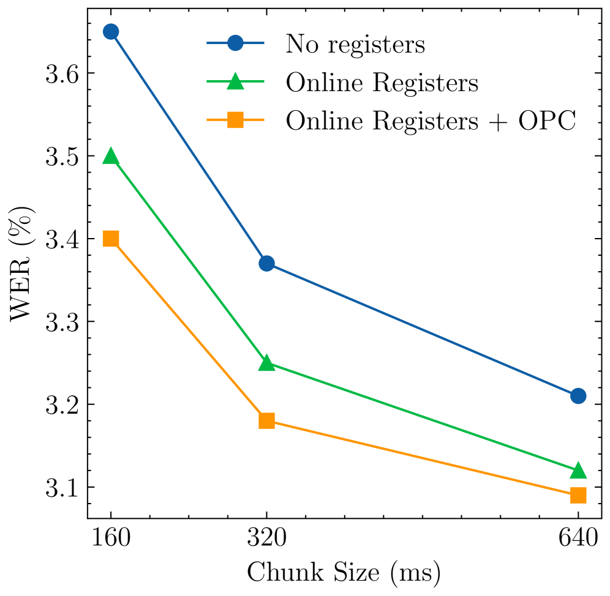
* (a)*

* (a)*

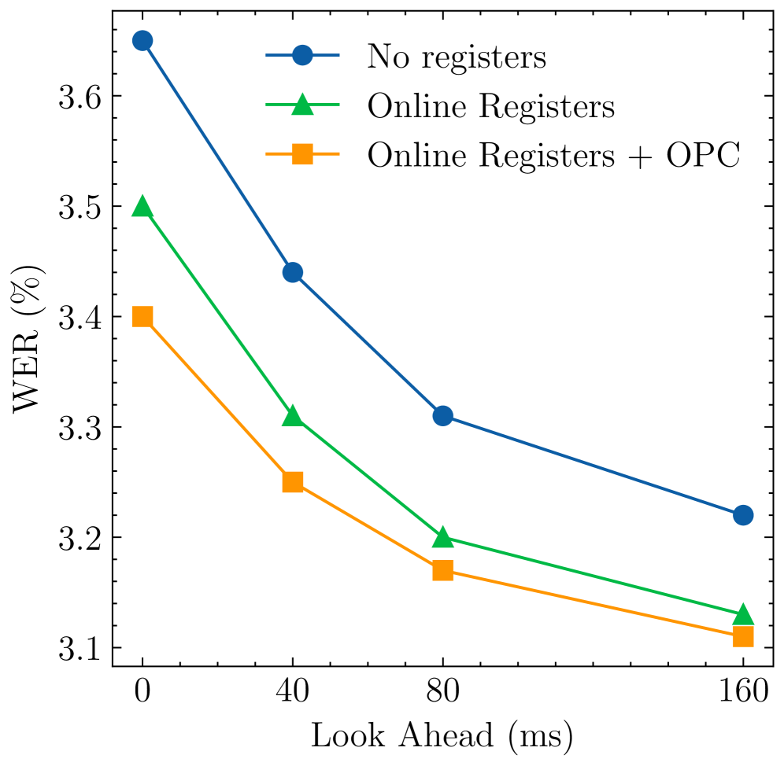
* (b)*

---
**Usage Info**: 3070 tokens used.
**Generated at**: 2026-06-23 16:37:17

---

