# 🚩 (2026-06-25) Scholar Inbox 추천 논문 

# 📚 Joint Residual Reweighting for Classifier Free Guidance in Flow-Matching Zero-Shot TTS

🚀 URL: https://arxiv.org/html/2606.25672

## 🌏 Abstract (원문)
Classifier-free guidance (CFG) is widely used in flow-matching-based zero-shot text-to-speech (TTS), where generation is typically controlled by two conditions: the target text and a prompt speech signal. Standard CFG strengthens these conditions jointly, while recent branch-selective guidance methods attempt to enhance text or speaker conditioning separately, often leading to a trade-off between text correctness and speaker similarity. In this paper, we revisit the CFG under independently masked text and speech-prompt conditions, and decompose the guidance field into text, speaker, and joint residuals. We show that conventional speaker-selective guidance entangles the speaker residual with the joint residual, which may disturb text-related generation. Based on this observation, we propose joint residual reweighting, which independently controls the speaker and joint residuals within the standard CFG framework. Experiments on F5-TTS and CosyVoice2 show that the proposed method improves speaker similarity while maintaining competitive text correctness, demonstrating the usefulness of the joint residual for balancing speaker fidelity and text accuracy in zero-shot TTS.
## 🌏 Abstract (번역)
Classifier-free guidance (CFG)는 플로우 매칭 기반의 제로샷 텍스트-음성 변환(TTS)에서 널리 사용되며, 여기서 생성은 일반적으로 두 가지 조건, 즉 목표 텍스트와 프롬프트 음성 신호에 의해 제어됩니다. 표준 CFG는 이러한 조건을 함께 강화하는 반면, 최근의 분기 선택적 가이던스 방법은 텍스트 또는 화자 조건을 개별적으로 향상시키려고 시도하며, 종종 텍스트 정확성과 화자 유사성 사이에 절충을 초래합니다. 본 논문에서는 독립적으로 마스킹된 텍스트 및 음성 프롬프트 조건 하에서 CFG를 재검토하고, 가이던스 필드를 텍스트, 화자 및 공동 잔차로 분해합니다. 우리는 기존의 화자 선택적 가이던스가 화자 잔차를 공동 잔차와 얽히게 하여 텍스트 관련 생성을 방해할 수 있음을 보여줍니다. 이러한 관찰을 바탕으로, 우리는 표준 CFG 프레임워크 내에서 화자 및 공동 잔차를 독립적으로 제어하는 공동 잔차 재가중치를 제안합니다. F5-TTS 및 CosyVoice2에 대한 실험은 제안된 방법이 경쟁력 있는 텍스트 정확성을 유지하면서 화자 유사성을 향상시켜, 제로샷 TTS에서 화자 충실도와 텍스트 정확성의 균형을 맞추는 데 공동 잔차의 유용성을 입증함을 보여줍니다.

## 🔍 Methods & Results
- 플로우 매칭 TTS 모델의 벡터 필드 예측기 v = f(xt, t, cspk, ctext)를 사용하며, 텍스트(ctext)와 음성 프롬프트(cspk) 조건을 고려한다.
- 조건 마스킹을 통해 vnull, vtext, vspk, vfull의 네 가지 벡터 필드 브랜치를 정의한다.
- 표준 CFG는 vfull과 vnull을 가이던스 강도 λ로 결합한다.
- 본 연구는 전체 조건부 방향을 텍스트 잔차(Δvtext), 화자 잔차(Δvspk), 그리고 공동 잔차(rjoint = vfull - vtext - vspk + vnull)로 분해한다.
- 표준 CFG는 이 세 가지 잔차 구성 요소를 동일한 가이던스 강도로 증폭한다.
- 제안하는 '공동 잔차 재가중치(joint residual reweighting)' 방법은 표준 CFG 프레임워크 내에서 화자 및 공동 잔차를 독립적으로 제어한다.
- 특히 화자 지향 변형(speaker-oriented variant)에 초점을 맞추어 Δvspk와 rjoint에 γspk와 γjoint를 추가적으로 적용한다.
- 이 재가중치는 네 가지 속도 브랜치(vfull, vtext, vspk, vnull)의 상대적 기여도를 변경하여 공동 잔차 구성 요소를 독립적으로 조정할 수 있게 한다.
- F5-TTS 및 CosyVoice2 데이터셋에 대한 실험 결과, 제안된 방법은 경쟁력 있는 텍스트 정확성을 유지하면서 화자 유사성을 향상시켰다.
- 이 방법은 표준 CFG(두 개 브랜치)보다 많은 네 개 브랜치 계산을 요구하지만, 샘플링 단계 수는 증가시키지 않으며 병렬 처리가 가능하다.

## 🖼 Figures
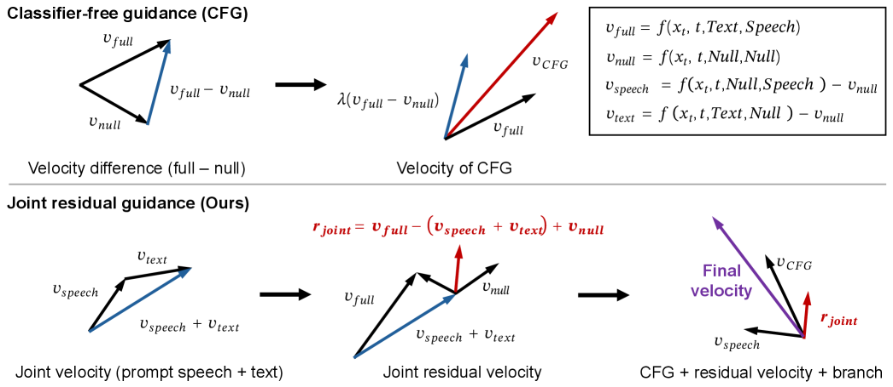
*Figure 1:Comparison between CFG and our proposed Joint residual guidance.*

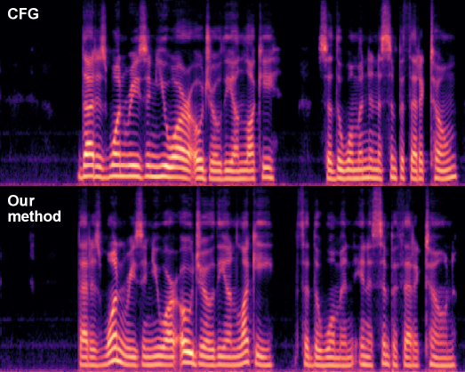
*Figure 2:CosyVoice2 case study on a LibriSpeech utterance. The target text is ”That is one reason you are Ojo the Unlucky, said the woman, in a sympathetic tone”.*

---
**Usage Info**: 4013 tokens used.
**Generated at**: 2026-06-25 16:21:08

---

# 📚 Sarashina2.2-TTS: Tackling Kanji Polyphony in Japanese Speech Generation via Data Scaling and Targeted Data Synthesis

🚀 URL: https://arxiv.org/html/2606.25369

## 🌏 Abstract (원문)
While large language model (LLM)-based text-to-speech (TTS) systems have achieved high-quality speech synthesis, most existing systems focus on English and Chinese. Japanese, however, remains under-explored, and its unique linguistic challenges, such as widespread context-dependent kanji polyphony, have yet to be adequately tackled. Here we introduce Sarashina2.2-TTS333Model weights and code are available athttps://github.com/sbintuitions/sarashina2.2-tts, a Japanese-centric LLM-TTS system that tackles these challenges through a dual approach: data strategy and evaluation methodology. First, we scale training to approximately 361k hours of speech, incorporating a balanced mix of Japanese and English data. Furthermore, we design a targeted data augmentation pipeline covering all 2,136 Joyo (regular-use) kanji designated by Japan’s Agency for Cultural Affairs to efficiently address kanji polyphony disambiguation. Second, we introduce the Joyo Kanji Yomi Benchmark444Code and data are available athttps://github.com/sbintuitions/JoyoKanji-Yomi-Benchmark, covering all 2,136 Joyo kanji and their 4,378 readings. Alongside this benchmark, we propose Kana-CER, a metric that compares synthesized speech against reference readings in the kana space, eliminating orthographic variations to directly measure pronunciation correctness. Experiments demonstrate that our targeted data augmentation significantly improves reading accuracy. Overall, Sarashina2.2-TTS achieves state-of-the-art kanji-level reading accuracy and matches top baselines on general sentence-level pronunciation, while delivering the highest speaker similarity in zero-shot Japanese speech synthesis. Furthermore, cross-lingual evaluation reveals that Sarashina2.2-TTS is the only system that maintains stable Japanese pronunciation regardless of the prompt language, confirming that our balanced training approach improves cross-lingual robustness.
## 🌏 Abstract (번역)
대규모 언어 모델(LLM) 기반의 텍스트 음성 변환(TTS) 시스템은 고품질 음성 합성을 달성했지만, 대부분의 기존 시스템은 영어와 중국어에 중점을 둡니다. 그러나 일본어는 아직 충분히 탐구되지 않았으며, 광범위한 문맥 의존적인 한자 다의어와 같은 고유한 언어적 난제들은 아직 적절하게 다루어지지 않았습니다. 본 논문에서는 데이터 전략 및 평가 방법론이라는 이중 접근 방식을 통해 이러한 난제를 해결하는 일본어 중심 LLM-TTS 시스템인 Sarashina2.2-TTS를 소개합니다. 첫째, 우리는 약 361k 시간의 음성 데이터로 훈련을 확장하고, 일본어와 영어 데이터를 균형 있게 혼합하여 사용합니다. 또한, 한자 다의어 모호성 해소를 효율적으로 다루기 위해 일본 문화청이 지정한 2,136개의 모든 상용 한자를 포괄하는 맞춤형 데이터 증강 파이프라인을 설계합니다. 둘째, 우리는 2,136개의 모든 상용 한자와 4,378개의 읽기를 포함하는 상용 한자 요미 벤치마크를 소개합니다. 이 벤치마크와 함께, 우리는 정자법 변형을 제거하고 발음 정확도를 직접 측정하기 위해 합성된 음성을 가나 공간의 참조 읽기와 비교하는 지표인 Kana-CER을 제안합니다. 실험 결과, 우리의 맞춤형 데이터 증강이 읽기 정확도를 크게 향상시키는 것으로 나타났습니다. 전반적으로 Sarashina2.2-TTS는 최첨단 한자 수준 읽기 정확도를 달성하고 일반 문장 수준 발음에서 최고 기준선과 일치하며, 제로샷 일본어 음성 합성에서 가장 높은 화자 유사성을 제공합니다. 또한, 교차 언어 평가를 통해 Sarashina2.2-TTS는 프롬프트 언어와 관계없이 안정적인 일본어 발음을 유지하는 유일한 시스템임을 확인했으며, 이는 우리의 균형 잡힌 훈련 접근 방식이 교차 언어 견고성을 향상시킨다는 것을 입증합니다.

## 🔍 Methods & Results
- 약 361k 시간의 일본어 및 영어 데이터를 균형 있게 혼합하여 훈련 데이터를 확장했습니다.
- 일본 문화청이 지정한 2,136개 상용 한자 전체를 포괄하는 맞춤형 데이터 증강 파이프라인을 설계하여 한자 다의어 모호성 해소를 효율적으로 처리했습니다.
- 2,136개 상용 한자와 4,378개 읽기를 포함하는 '상용 한자 요미 벤치마크'를 도입했습니다.
- 합성된 음성을 가나 공간의 참조 읽기와 비교하여 발음 정확도를 직접 측정하는 'Kana-CER' 지표를 제안했습니다.
- 맞춤형 데이터 증강이 읽기 정확도를 크게 향상시키는 것으로 나타났습니다.
- Sarashina2.2-TTS는 최첨단 한자 수준 읽기 정확도를 달성하고 일반 문장 수준 발음에서 최고 기준선과 일치했습니다.
- 제로샷 일본어 음성 합성에서 가장 높은 화자 유사성을 제공했습니다.
- 교차 언어 평가 결과, Sarashina2.2-TTS는 프롬프트 언어와 관계없이 안정적인 일본어 발음을 유지하는 유일한 시스템으로, 균형 잡힌 훈련 접근 방식이 교차 언어 견고성을 향상시킴을 확인했습니다.

## 🖼 Figures

*Figure 1:Sarashina2.2-TTS architecture. The semantic stage (backbone LLM) autoregressively maps the prompt and target text, together with prompt semantic tokens from the reference speech, to semantic tokens. The acoustic stage (flow-matching decoder + vocoder) reconstructs the waveform from these semantic tokens, conditioned on the prompt semantic tokens, a speaker embedding and a reference mel-spectrogram.*

*Figure 2:Cumulative distribution of per-reading error counts across all 4,378 kanji-reading pairs. Each point shows the percentage of readings with error count 
≤
 the threshold (out of 15 trials). Higher and more left-shifted curves indicate better kanji reading accuracy.*

---
**Usage Info**: 2168 tokens used.
**Generated at**: 2026-06-25 16:21:17

---

# 📚 Adaptive Oscillatory Inductive Bias for Modeling Sharp Prosodic Dynamics in Diffusion-Based TTS

🚀 URL: https://arxiv.org/html/2606.25424

## 🌏 Abstract (원문)
Diffusion-based text-to-speech (TTS) models have achieved significant improvements in speech quality. However, modeling sharp prosodic transitions and rapid pitch variations in expressive speech remains challenging. Existing diffusion-based TTS decoders commonly utilize periodic nonlinearities such as Snake activation function to capture harmonic structures, but this activation funcation provides limited adaptability when modeling abrupt amplitude and frequency variations. In this paper, we investigate the role of oscillatory inductive bias in diffusion-based TTS decoders and introduce an adaptive oscillatory nonlinearity that enables controllable periodic modulation while maintaining signal stability through a linear bypass component. We refer the resulting TTS system as OscillaTTS. Experiments on the LJSpeech and Emotional Speech Dataset show consistent improvements across objective and subjective evaluations, indicating improved modeling of expressive prosodic dynamics.
## 🌏 Abstract (번역)
확산 기반 텍스트 음성 변환(TTS) 모델은 음성 품질에서 상당한 개선을 이루었습니다. 그러나 표현력이 풍부한 음성에서 급격한 운율 전환과 빠른 피치 변화를 모델링하는 것은 여전히 어렵습니다. 기존의 확산 기반 TTS 디코더는 고조파 구조를 포착하기 위해 Snake 활성화 함수와 같은 주기적 비선형성을 일반적으로 사용하지만, 이 활성화 함수는 갑작스러운 진폭 및 주파수 변화를 모델링할 때 제한적인 적응성을 제공합니다. 본 논문에서는 확산 기반 TTS 디코더에서 진동 유도 편향의 역할을 조사하고, 선형 바이패스 구성 요소를 통해 신호 안정성을 유지하면서 제어 가능한 주기적 변조를 가능하게 하는 적응형 진동 비선형성을 도입합니다. 우리는 결과적인 TTS 시스템을 OscillaTTS라고 부릅니다. LJSpeech 및 Emotional Speech Dataset에 대한 실험은 객관적 및 주관적 평가 전반에 걸쳐 일관된 개선을 보여주며, 표현력이 풍부한 운율 역학 모델링이 향상되었음을 나타냅니다.

## 🔍 Methods & Results
- 기존 확산 기반 TTS 디코더의 주기적 비선형성(예: Snake 활성화 함수)이 급격한 진폭 및 주파수 변화 모델링에 제한적인 적응성을 보이는 문제를 해결하고자 함.
- 확산 기반 TTS 디코더에서 진동 유도 편향의 역할을 조사하고, 적응형 진동 비선형성을 도입함.
- 제안된 적응형 진동 비선형성은 제어 가능한 주기적 변조를 가능하게 하며, 선형 바이패스 구성 요소를 통해 신호 안정성을 유지함.
- 이러한 접근 방식을 적용한 TTS 시스템을 OscillaTTS라고 명명함.
- LJSpeech 및 Emotional Speech Dataset에 대한 실험을 수행함.
- 객관적 및 주관적 평가 모두에서 일관된 성능 향상을 달성함.
- 향상된 결과는 표현력이 풍부한 운율 역학 모델링 능력이 개선되었음을 시사함.

## 🖼 Figures
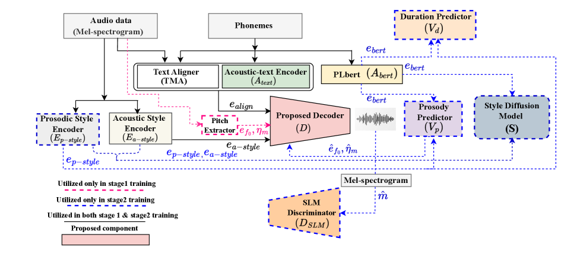
*Figure 1:Schematic overview of the proposed OscillaTTS architecture based on StyleTTS2.*

![(a)Comparison of Oscilla, Snake, and HOSC activation functions for 
𝑎
,
𝛼
, 
𝛽
[HOSC] 
∈
{
5
}](../images/2026-06-25/2606.25424/2606.25424_fig1.png)
*(a)Comparison of Oscilla, Snake, and HOSC activation functions for 
𝑎
,
𝛼
, 
𝛽
[HOSC] 
∈
{
5
}*

![(a)Comparison of Oscilla, Snake, and HOSC activation functions for 
𝑎
,
𝛼
, 
𝛽
[HOSC] 
∈
{
5
}](../images/2026-06-25/2606.25424/2606.25424_fig2.png)
*(a)Comparison of Oscilla, Snake, and HOSC activation functions for 
𝑎
,
𝛼
, 
𝛽
[HOSC] 
∈
{
5
}*

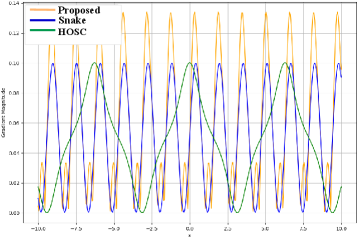
*(b)Gradient magnitude comparison of Oscilla, Snake, and HOSC activation functions*

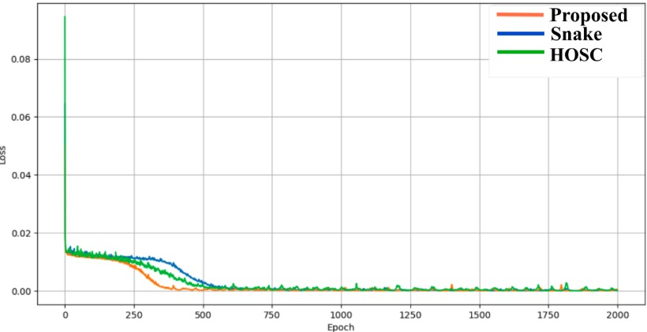
*(c)Loss convergence analysis of a neural network using different activation functions*

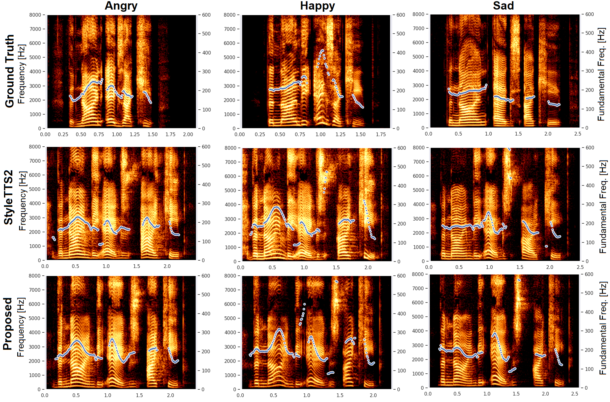
*Figure 3:Visualization of Mel-spectrogram along with pitch variation for Angry, Happy and Sad Emotional synthesis.*

---
**Usage Info**: 1199 tokens used.
**Generated at**: 2026-06-25 16:21:22

---

# 📚 CrossAccent-TTS: Cross-Lingual Accent-Intensity Controllable Text-to-Speech via Disentangled Speaker and Accent Representations

🚀 URL: https://arxiv.org/html/2606.25403

## 🌏 Abstract (원문)
Accent conversion and controllability remain fundamental challenges in cross-lingual text-to-speech (TTS), particularly for low-resource and phonetically diverse Indic languages. While recent large language model (LLM)-based TTS systems exhibit strong cross-lingual generalization, they provide limited explicit control over accent characteristics and intensity. In this paper, we propose CrossAccentTTS, a framework that enables both accent control and conversion while preserving speaker identity. Specifically, we introduce an Accent Intensity Controller (AIC) that injects weighted language embeddings into the accent subspace, allowing smooth interpolation between accents and fine-grained modulation of accent strength at inference time. Experiments on the Indic Multilingual and L2-arctic datasets shows that CrossAccent-TTS achieves precise control of accent intensity, outperforming strong baselines in accent similarity and controllability by maintaining speaker similarity and naturalness.
## 🌏 Abstract (번역)
악센트 변환 및 제어 가능성은 특히 저자원 및 음성학적으로 다양한 인도 언어의 경우 교차 언어 텍스트 음성 변환(TTS)에서 여전히 근본적인 과제로 남아 있습니다. 최근 대규모 언어 모델(LLM) 기반 TTS 시스템은 강력한 교차 언어 일반화 능력을 보여주지만, 악센트 특성 및 강도에 대한 명시적인 제어는 제한적입니다. 본 논문에서는 화자 정체성을 보존하면서 악센트 제어 및 변환을 모두 가능하게 하는 프레임워크인 CrossAccentTTS를 제안합니다. 특히, 우리는 가중치 부여된 언어 임베딩을 악센트 부분 공간에 주입하여 악센트 간의 부드러운 보간과 추론 시 악센트 강도의 미세 조정을 가능하게 하는 악센트 강도 컨트롤러(AIC)를 도입합니다. Indic Multilingual 및 L2-arctic 데이터셋에 대한 실험 결과, CrossAccent-TTS는 악센트 강도를 정밀하게 제어하며, 화자 유사성 및 자연스러움을 유지하면서 악센트 유사성 및 제어 가능성에서 강력한 기준선보다 뛰어난 성능을 달성함을 보여줍니다.

## 🔍 Methods & Results
- CrossAccentTTS는 Neucodec를 사용한 음성 토큰화, 화자 및 스타일 인코딩을 위한 Perceiver Resampler, 악센트 및 언어 특징의 적대적 억제, 제어 가능한 악센트 렌더링을 위한 명시적 언어 임베딩 조건화, 그리고 음향 토큰 생성 및 파형 합성을 포함하는 4가지 주요 구성 요소로 이루어져 있습니다.
- Neucodec는 원시 오디오 파형을 이산 음향 토큰으로 변환하여 지각적 음성 품질을 보존하면서 시퀀스 모델링에 적합한 압축된 토큰 기반 표현을 제공합니다.
- Perceiver Resampler는 가변 길이 음향 토큰 시퀀스를 고정 길이 화자 및 스타일 임베딩으로 매핑하며, 발화 수준의 언어적 내용에 대한 과적합을 줄이고 화자 관련 특성에 집중하도록 훈련됩니다.
- 화자 및 스타일 임베딩에서 잔여 악센트 및 언어 정보를 억제하기 위해 기울기 역전 계층(GRL)을 사용한 적대적 훈련을 적용하여, 인코더가 악센트 및 언어 불변의 화자 및 스타일 임베딩을 생성하도록 유도합니다.
- 각 지원 언어 또는 악센트에 대해 학습된 언어 임베딩을 도입하고, 이를 화자 및 스타일 표현에 추가하여 언어 및 악센트 관련 요소를 화자 및 스타일과 독립적으로 명시적으로 제어할 수 있도록 합니다.
- Accent Intensity Controller(AIC)는 가중치 부여된 언어 임베딩을 악센트 부분 공간에 주입하여 악센트 간의 부드러운 보간과 추론 시 악센트 강도의 미세 조정을 가능하게 합니다.
- Qwen 아키텍처 기반의 자기회귀 디코더는 텍스트 토큰 임베딩과 결합된 화자-언어 임베딩을 조건으로 음향 토큰 시퀀스를 예측합니다.
- 훈련 목표는 자기회귀 음향 토큰 예측 손실과 악센트 및 언어 억제를 위한 적대적 분류 손실(GRL)로 구성됩니다.
- 실험 결과, CrossAccentTTS는 Indic Multilingual 및 L2-arctic 데이터셋에서 악센트 강도를 정밀하게 제어하며, 화자 유사성 및 자연스러움을 유지하면서 악센트 유사성 및 제어 가능성에서 강력한 기준선보다 뛰어난 성능을 달성했습니다.

## 🖼 Figures
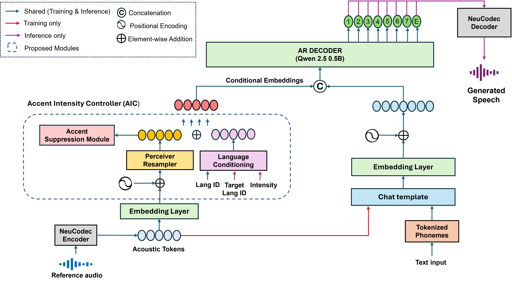
*Figure 1:Model architecture of the proposed CrossAccent TTS*

*Figure 2:Accent Similarity MOS of Indic Accents*

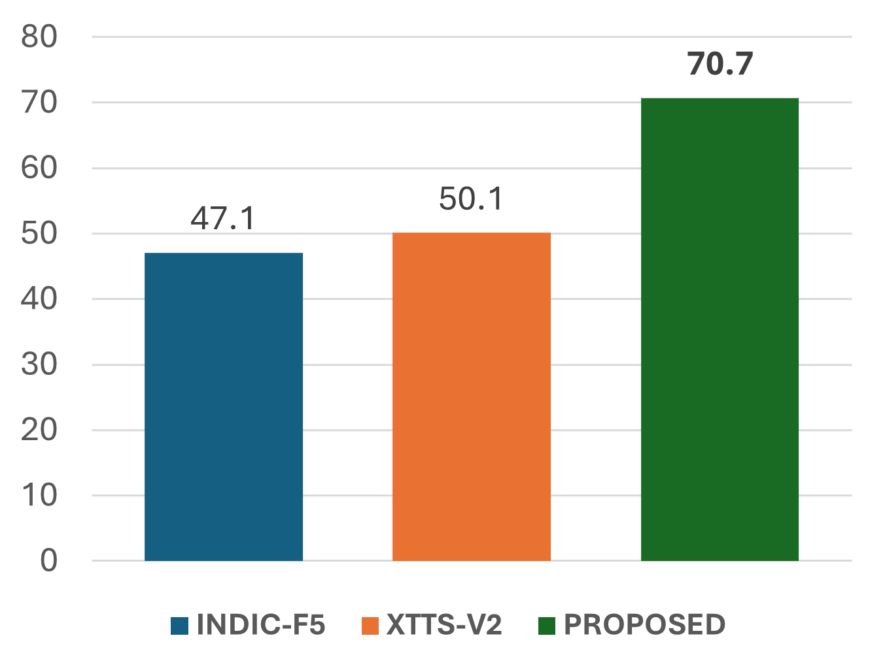
*Figure 2:Accent Similarity MOS of Indic Accents*

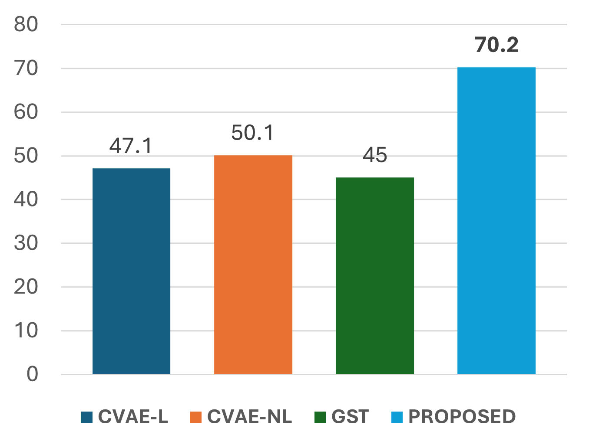
*Figure 3:Accent Similarity MOS of Foreign Accents*

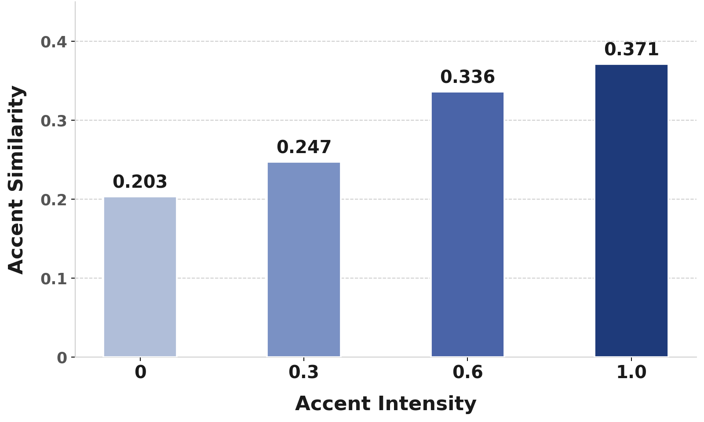
*Figure 4:Effect of Accent Intensity on Accent Similarity score*

---
**Usage Info**: 2766 tokens used.
**Generated at**: 2026-06-25 16:21:31

---

# 📚 STEB: A Speech-to-Speech Translation Expressiveness Benchmark for Evaluating Beyond Translation Fidelity

🚀 URL: https://arxiv.org/html/2606.25529

## 🌏 Abstract (원문)
Speech-to-speech translation (S2ST) should preserve not only lexical meaning, but also expressive attributes: emotion, scenario style (e.g., news reporting vs. dramatic dialogue), and nonverbal vocalizations (NVs). Moreover, collecting cross-lingual target speech that is both translation-faithful and expressively aligned with the source is difficult at scale, making reference-based evaluation impractical. We introduceSTEB(Speech-to-SpeechTranslationExpressivenessBenchmark), a 32.6-hour Chinese–English benchmark that evaluates both standard dimensions (translation fidelity, speaker similarity, duration alignment) and expressiveness dimensions (emotion, scenario style, NV preservation). For expressiveness evaluation,STEBuses a caption-then-summarize framework that converts speech into structured expressive attributes and compares source and hypothesis attributes with an LLM judge. Human validation shows statistically significant correlations with listener judgments across all expressive dimensions. We evaluate six S2ST systems covering cascaded systems, end-to-end models, and speech large language models. Many systems, especially cascaded ones, achieve strong translation fidelity, but they still struggle with emotion preservation (best: 3.82/5) and NV preservation (best: 2.31/5). These results reveal a gap between semantic transfer and expressive transfer, identifying expressiveness preservation as an open challenge for S2ST. Audio samples are available athttps://cmots.github.io/steb.github.io/.
## 🌏 Abstract (번역)
음성-음성 번역(S2ST)은 어휘적 의미뿐만 아니라 감정, 시나리오 스타일(예: 뉴스 보도 대 극적인 대화), 비언어적 발성(NV)과 같은 표현적 속성도 보존해야 합니다. 또한, 번역에 충실하면서도 원본과 표현적으로 일치하는 교차 언어 대상 음성을 대규모로 수집하는 것은 어렵기 때문에 참조 기반 평가가 비실용적입니다. 우리는 표준 차원(번역 충실도, 화자 유사성, 길이 정렬)과 표현성 차원(감정, 시나리오 스타일, NV 보존)을 모두 평가하는 32.6시간 분량의 중국어-영어 벤치마크인 STEB(Speech-to-Speech Translation Expressiveness Benchmark)를 소개합니다. 표현성 평가를 위해 STEB는 음성을 구조화된 표현 속성으로 변환하고 LLM 심사위원을 통해 원본과 가설 속성을 비교하는 '캡션-요약' 프레임워크를 사용합니다. 인간 검증 결과, 모든 표현 차원에서 청취자 판단과 통계적으로 유의미한 상관관계를 보였습니다. 우리는 계단식 시스템, 종단 간 모델, 음성 대규모 언어 모델을 포함하는 6가지 S2ST 시스템을 평가했습니다. 많은 시스템, 특히 계단식 시스템은 강력한 번역 충실도를 달성했지만, 감정 보존(최고: 3.82/5) 및 NV 보존(최고: 2.31/5)에는 여전히 어려움을 겪고 있습니다. 이러한 결과는 의미 전달과 표현 전달 사이의 격차를 드러내며, 표현성 보존이 S2ST의 미해결 과제임을 밝혀냅니다. 오디오 샘플은 https://cmots.github.io/steb.github.io/에서 확인할 수 있습니다.

## 🔍 Methods & Results
- STEB 벤치마크는 데이터 수집 및 전처리, 표현성 주석, 품질 보증으로 구성된 파이프라인을 통해 구축되었습니다.
- 데이터는 드라마, 오디오북, 광고, 인터뷰, 뉴스 방송, 해설 등 6가지 실제 시나리오의 공개 웹 소스에서 수집되었으며, BS-Roformer를 이용한 소스 분리, Silero VAD 및 pyannote를 이용한 화자 분할, 3-30초 길이 및 SNR, DNSMOS 필터링, Whisper를 이용한 중국어/영어 언어 식별 등의 전처리 과정을 거쳤습니다.
- 표현성 주석은 Qwen3-ASR로 전사, Qwen3-ForceAlign으로 단어 수준 타임스탬프 획득, Qwen3-30B-A3B로 번역, BEATs를 이용한 NV 감지 및 전사에 삽입하는 자동 파이프라인을 사용합니다.
- 감정 및 시나리오 스타일 주석은 Qwen3-Omni-Captioner가 오디오 캡션을 생성하고 Qwen3-30B-A3B가 이를 요약하는 '캡션-요약' 방식으로 이루어집니다.
- 주석의 정확성을 위해 자동 품질 심사(멀티모달 LLM 사용, 1-5점 척도)와 인간 검증을 수행했으며, 최종 벤치마크는 32.6시간 분량으로 일반 서브셋(32.27시간)과 NV 서브셋(1.26시간)으로 구성됩니다.
- 표현성 평가는 참조 없는 LLM 심사위원 접근 방식을 채택하여, 시스템 출력 음성을 동일한 캡션-요약 파이프라인으로 처리한 후 원본과 가설의 구조화된 텍스트 설명을 1-5점 척도로 비교합니다.
- 평가 기준은 감정(핵심 감정 범주, 강도, 태도), 시나리오 스타일(일관성, 격식, 전달 방식), NV 보존(유형, 개수, 순서, 대략적인 위치)을 포함하며, 각 샘플은 3회 독립적으로 평가됩니다.
- 6가지 S2ST 시스템(계단식, 종단 간, 음성 LLM)을 평가한 결과, 많은 시스템, 특히 계단식 시스템은 높은 번역 충실도를 보였으나, 감정 보존(최고 3.82/5)과 NV 보존(최고 2.31/5)에서는 여전히 어려움을 겪는 것으로 나타났습니다.
- 이러한 결과는 의미 전달과 표현 전달 사이의 격차를 보여주며, 표현성 보존이 S2ST의 미해결 과제임을 시사합니다.

## 🖼 Figures

*Figure 1:Overview of STEB. (a) Benchmark example showing annotation dimensions: transcription, translation, rich audio description, emotion, scenario style, and text with NVs. (b) The automatic expressiveness judge: A Captioner–Summary pipeline and NV detection extract hypothesis annotations, which an LLM Scorer compares against source annotations. (c) Radar chart comparing baseline systems across six dimensions.*

![Figure 2:Overview of the STEB data curation pipeline. The pipeline consists of six stages: (A) data collection from six real-world scenarios; (B) preprocessing for clean single-speaker utterance extraction; (C) speech quality filtering; (D) transcription, language identification, and translation; (E) expressive annotation for emotion, scenario style, and NVs; and (F) annotation quality checking. The right panels show the scenario-source distribution and utterance-duration distribution of the final benchmark.](../images/2026-06-25/2606.25529/2606.25529_fig1.png)
*Figure 2:Overview of the STEB data curation pipeline. The pipeline consists of six stages: (A) data collection from six real-world scenarios; (B) preprocessing for clean single-speaker utterance extraction; (C) speech quality filtering; (D) transcription, language identification, and translation; (E) expressive annotation for emotion, scenario style, and NVs; and (F) annotation quality checking. The right panels show the scenario-source distribution and utterance-duration distribution of the final benchmark.*

---
**Usage Info**: 4667 tokens used.
**Generated at**: 2026-06-25 16:21:42

---

# 📚 Does Translation-Enhanced Speech Encoder Pre-training Affect Speech LLMs?

🚀 URL: https://arxiv.org/html/2606.25444

## 🌏 Abstract (원문)
Connecting a pre-trained speech encoder to a Large Language Model (LLM) is the standard architecture for building Speech LLMs. However, a structural misalignment exists between the encoder and the LLM. Unlike encoders based on automatic speech recognition, which often produce representations in separate language-specific spaces, LLMs operate within a unified language-agnostic space. A mechanism is required to align the encoder's language-specific representations with the LLM's shared space. We argue that speech translation provides a principled way to achieve this. Unlike monolingual transcription, translation requires the model to bridge different languages and learn language-agnostic representations. We experimentally evaluate the impact of incorporating translation objectives into speech encoder pre-training. Our results demonstrate that translation-enhanced pre-training improves cross-modal integration and leads to superior performance across downstream Speech LLM tasks.
## 🌏 Abstract (번역)
사전 학습된 음성 인코더를 대규모 언어 모델(LLM)에 연결하는 것은 음성 LLM을 구축하기 위한 표준 아키텍처입니다. 그러나 인코더와 LLM 사이에는 구조적 불일치가 존재합니다. 자동 음성 인식 기반 인코더는 종종 언어별로 분리된 공간에서 표현을 생성하는 반면, LLM은 통합된 언어 불가지론적 공간에서 작동합니다. 인코더의 언어별 표현을 LLM의 공유 공간과 정렬하기 위한 메커니즘이 필요합니다. 우리는 음성 번역이 이를 달성하는 원칙적인 방법을 제공한다고 주장합니다. 단일 언어 전사와 달리 번역은 모델이 다른 언어를 연결하고 언어 불가지론적 표현을 학습하도록 요구합니다. 우리는 음성 인코더 사전 학습에 번역 목표를 통합하는 영향을 실험적으로 평가합니다. 우리의 결과는 번역 강화 사전 학습이 교차 모달 통합을 개선하고 다운스트림 음성 LLM 작업 전반에 걸쳐 우수한 성능을 이끌어낸다는 것을 보여줍니다.

## 🔍 Methods & Results
- 본 연구의 목표는 음성 인코더 사전 학습 중 번역 작업을 통합하는 것이 인코더와 LLM 간의 교차 모달 통합에 미치는 영향을 조사하는 것입니다.
- 표준 음성 LLM 아키텍처(음성 인코더, 학습 가능한 어댑터, 고정된 LLM)를 사용했으며, LLM은 고정하여 성능 차이가 음성 인코더에서 비롯되도록 했습니다.
- 음성 인코더는 다국어 전사 및 교차 언어 번역의 두 가지 생성 작업에 대해 Seq2Seq 아키텍처(Whisper와 유사)를 사용하여 사전 학습되었습니다.
- 사전 학습 완료 후, 디코더는 폐기하고 학습된 인코더만 음성 LLM 파이프라인에 통합되었습니다.
- 실험은 영어, 일본어, 중국어, 독일어의 네 가지 언어에 초점을 맞추어 진행되었습니다.
- 세 가지 사전 학습 구성이 비교되었습니다: ASR-Only (다국어 전사만), ASR & ST (X→en, 비영어권에서 영어로의 번역 포함), ASR & ST (X↔en, 영어와 다른 언어 간의 양방향 번역 포함).
- 양방향 번역을 가능하게 하기 위해 `<|BOS|><|en|><|translate|><|de|>`와 같이 대상 언어 토큰을 작업 토큰 앞에 배치하는 재설계된 디코더 프롬프트가 도입되었습니다.
- 결과적으로, 번역 강화 사전 학습은 교차 모달 통합을 개선하고 다운스트림 음성 LLM 작업에서 우수한 성능을 보였습니다.

---
**Usage Info**: 2625 tokens used.
**Generated at**: 2026-06-25 16:21:50

---

# 📚 Supervised Post-training of Speech Foundation Models for Robust Adaptation in Speech Deepfake Detection

🚀 URL: https://arxiv.org/html/2606.25328

## 🌏 Abstract (원문)
Large speech foundation models have shown strong potential for speech deepfake detection, but direct fine-tuning is limited by a mismatch between self-supervised pre-training objectives and spoof-specific artifacts. To address this, we propose a mix-frame post-training strategy to create localized spoof-oriented perturbations and use frame-level supervision to encourage the SSL model to learn local inconsistencies that are critical for robust spoof detection. On ASVspoof5, we achieve state-of-the-art EER 4.50% for a single model without data augmentation. On ASVspoof2021 LA/DF, it further achieves only 0.16% absolute EER gap between LA and DF, indicating strong and balanced robustness across distinct distortion conditions. These results show that supervised post-training provides an effective and practical way to adapt speech foundation models for robust deepfake detection.
## 🌏 Abstract (번역)
대규모 음성 파운데이션 모델은 음성 딥페이크 탐지에 강력한 잠재력을 보여주었지만, 자기 지도 학습 사전 훈련 목표와 스푸핑 특정 아티팩트 간의 불일치로 인해 직접적인 미세 조정에는 한계가 있습니다. 이를 해결하기 위해 우리는 국소화된 스푸핑 지향 교란을 생성하고 프레임 수준 감독을 사용하여 SSL 모델이 강력한 스푸핑 탐지에 중요한 국소적 불일치를 학습하도록 장려하는 믹스-프레임(mix-frame) 후처리 훈련 전략을 제안합니다. ASVspoof5에서 우리는 데이터 증강 없이 단일 모델로 4.50%의 최첨단 EER을 달성했습니다. ASVspoof2021 LA/DF에서는 LA와 DF 간에 단 0.16%의 절대 EER 차이를 달성하여, 서로 다른 왜곡 조건에서 강력하고 균형 잡힌 견고성을 나타냈습니다. 이러한 결과는 지도 학습 기반의 후처리 훈련이 강력한 딥페이크 탐지를 위해 음성 파운데이션 모델을 적용하는 효과적이고 실용적인 방법을 제공함을 보여줍니다.

## 🔍 Methods & Results
- 음성 딥페이크 탐지를 위해 자기 지도 학습(SSL) 기반의 대규모 음성 파운데이션 모델을 활용하며, 사전 훈련 목표와 스푸핑 아티팩트 간의 불일치를 해결하기 위해 믹스-프레임(Mix-Frames) 후처리 훈련 전략을 제안한다.
- 믹스-프레임은 발화 내에서 반대 클래스의 발화를 사용하여 잘라내기-붙여넣기(cut-and-paste) 작업을 수행하여 국소화된 스푸핑 지향 교란을 생성한다.
- 훈련 샘플의 파형을 고정된 길이(T=64600)로 자르거나 패딩한 후, 스플라이스 혼합 비율(rmix)과 시작 인덱스(α)를 샘플링하여 기본 발화의 특정 세그먼트를 인젝터 발화의 세그먼트로 대체하여 혼합 파형(x~)을 생성한다.
- SSL 인코더의 프레임 수준 감독을 위해, 각 프레임의 중심이 삽입된 세그먼트 내에 속하는지 여부에 따라 프레임 레이블을 할당하여 스푸핑 식별에 중요한 국소적 불일치를 학습하도록 유도한다.
- SSL 프레임 표현 위에 경량 프레임 분류기(선형 헤드)를 부착하고 이진 교차 엔트로피 손실을 사용하여 인코더를 최적화한다.
- 트랜스포머 인코더 업데이트에는 LoRA(Low-Rank Adaptation) 어댑터를 사용하여 셀프-어텐션 투영 및 덴스 레이어에 삽입하고, 원본 백본 가중치는 고정시킨 채 LoRA 업데이트만 최적화한다.
- 후처리 훈련 후에는 프레임 분류기를 제거하고 적응된 인코더(fθ)를 최종 미세 조정 단계에 사용하며, 동일한 LoRA 파라미터화를 적용하여 발화 수준 레이블로 하위 작업 헤드(Attentive Merging Module + 분류기)를 훈련한다.
- ASVspoof5 데이터셋에서 데이터 증강 없이 단일 모델로 4.50%의 최첨단 EER(Equal Error Rate)을 달성했다.
- ASVspoof2021 LA/DF 데이터셋에서 LA(Logical Access)와 DF(Deepfake) 조건 간에 단 0.16%의 절대 EER 차이를 보여, 서로 다른 왜곡 조건에 걸쳐 강력하고 균형 잡힌 견고성을 입증했다.

## 🖼 Figures
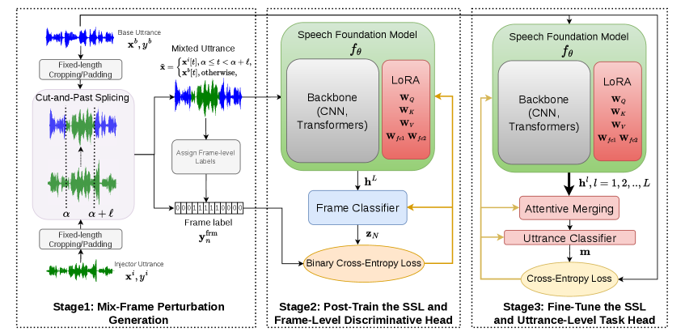
*Figure 1:Overview of the proposed framework. The SSL encoder is first post-trained with mix-frames and frame-level supervision, and then fine-tuned for utterance-level deepfake detection.*

---
**Usage Info**: 3478 tokens used.
**Generated at**: 2026-06-25 16:21:58

---

# 📚 Velocity Prediction in Automatic Guitar Transcription This work is supported by Innovate UK (Project no. 10105279) and the UKRI Centre for Doctoral Training in Artificial Intelligence and Music (Grant no. EP/S022694/1). This research utilised Queen Mary’s Apocrita HPC facility, supported by QMUL Research-IT. http://doi.org/10.5281/zenodo.438045

🚀 URL: https://arxiv.org/html/2606.24912

## 🌏 Abstract (원문)
Automatic Music Transcription (AMT) models have achieved a high level of success in polyphonic transcription of various instruments. Velocity, typically a measure of note intensity, is less commonly predicted in these models due to the absence of velocity labels in available datasets and lack of a proper definition for instruments other than piano. We present a methodology and model for velocity prediction in Automatic Guitar Transcription (AGT) which uses virtual instruments to generate synthetic training data with velocity labels. We first pretrain a model on this synthetic data. These weights are then transferred to a different model and trained on real guitar audio, allowing the model to retain the working velocity prediction while also achieving high performance and generalisability from the real training data. The velocity prediction is shown to outperform a baseline model which does not use the pretrained velocity weights, when evaluated on synthetic data. In addition, using the pretrained velocity weights offers a small improvement in note transcription, though the magnitude of this improvement is limited and not always significant depending on the testing data. Overall the model achieves results comparable to the state of the art in guitar transcription, while also successfully predicting velocity.
## 🌏 Abstract (번역)
자동 음악 전사(AMT) 모델은 다양한 악기의 다성 전사에서 높은 수준의 성공을 거두었습니다. 일반적으로 음표 강도 측정치인 벨로시티는 사용 가능한 데이터셋에 벨로시티 레이블이 없거나 피아노 외의 악기에 대한 적절한 정의가 부족하여 이러한 모델에서 덜 일반적으로 예측됩니다. 본 논문에서는 가상 악기를 사용하여 벨로시티 레이블이 있는 합성 훈련 데이터를 생성하는 자동 기타 전사(AGT)에서 벨로시티 예측을 위한 방법론과 모델을 제시합니다. 우리는 먼저 이 합성 데이터로 모델을 사전 훈련합니다. 이 가중치는 다른 모델로 전이되어 실제 기타 오디오로 훈련되며, 이를 통해 모델은 작동하는 벨로시티 예측을 유지하면서 실제 훈련 데이터로부터 높은 성능과 일반화 가능성을 달성합니다. 벨로시티 예측은 합성 데이터로 평가했을 때 사전 훈련된 벨로시티 가중치를 사용하지 않는 기준 모델보다 우수한 성능을 보이는 것으로 나타났습니다. 또한, 사전 훈련된 벨로시티 가중치를 사용하면 음표 전사에서 약간의 개선을 제공하지만, 이 개선의 정도는 제한적이며 테스트 데이터에 따라 항상 유의미하지는 않습니다. 전반적으로 이 모델은 기타 전사에서 최첨단 기술과 필적하는 결과를 달성하며, 동시에 벨로시티를 성공적으로 예측합니다.

## 🔍 Methods & Results
- 가상 악기를 사용하여 FrançoisLeduc 데이터셋 기반으로 약 20시간 분량의 벨로시티 레이블이 있는 합성 기타 오디오 데이터를 생성했으며, 이는 모델이 학습할 '참' 벨로시티 곡선을 정의함.
- GAPS 및 GOAT 데이터셋을 실제 기타 데이터 미세 조정에 사용하고, GuitarSet 및 EGDB를 테스트에 활용했으며, 이들 실제 데이터셋의 벨로시티는 일반적으로 상수 값(예: 100)으로 설정됨.
- Kong et al.의 고해상도 피아노 전사 모델(CRNN)을 채택하여 10초 로그 멜 스펙트로그램 입력에서 음높이별 온셋, 오프셋, 벨로시티 및 프레임 활성화를 예측하며, 벨로시티 값은 MIDI 표준에 따라 0-127 범위임.
- 2단계 훈련 방법론을 사용: 1단계에서는 합성 데이터로 모델을 사전 훈련하여 벨로시티 곡선을 학습하고, 2단계에서는 사전 훈련된 벨로시티 서브모듈의 가중치를 고정하고 실제 데이터로 나머지 서브모듈을 훈련하며, 실제 데이터에 벨로시티 레이블이 없으므로 손실 함수에서 벨로시티 항을 제거함.
- 훈련 중 두 개의 피크 필터, 리버브, 무작위 임펄스 응답을 적용하여 데이터를 증강함.
- 모든 모델은 사전 훈련된 피아노 전사 체크포인트에서 시작했으며, 1단계에서는 150,000회 반복, 학습률 0.0001, 배치 크기 6으로 훈련하고, 2단계에서는 학습률을 0.00001로 변경하여 훈련함.

## 🖼 Figures
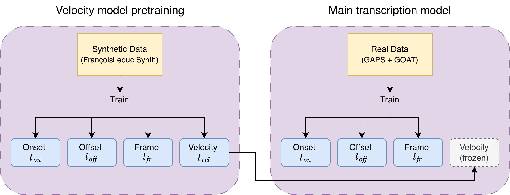
*Figure 1:Visualization of the training methodology.*

---
**Usage Info**: 4751 tokens used.
**Generated at**: 2026-06-25 16:22:17

---

# 📚 One Model, Many Latencies: Universal Speech Enhancement for Diverse Real-Time Applications

🚀 URL: https://arxiv.org/html/2606.25621

## 🌏 Abstract (원문)
Different real-time speech applications impose distinct latency budgets, often requiring separately trained enhancement models for each scenario. In this paper, we propose a one-for-all, real-time universal speech enhancement model that provides explicit control over both algorithmic and computational latency. Algorithmic latency is flexibly adjusted via configurable look-ahead frames. To avoid learning inefficiency caused by varying padding configurations, we introduce parallel convolutional layers corresponding to different look-ahead settings. Computational latency is controlled through an early-exit mechanism, enabling inference at different network depths. To narrow the performance gap between specialized and flexible models, we propose a two-stage training strategy with a shared-to-multiple decoder transition. Overall, the proposed framework enables a single model to be deployed across diverse latency budgets without retraining separate models.
## 🌏 Abstract (번역)
다양한 실시간 음성 애플리케이션은 각기 다른 지연 시간 예산을 요구하며, 종종 각 시나리오에 대해 별도로 훈련된 향상 모델이 필요합니다. 본 논문에서는 알고리즘적 지연 시간과 계산적 지연 시간 모두에 대한 명시적인 제어를 제공하는 '하나로 모든 것을 처리하는' 실시간 범용 음성 향상 모델을 제안합니다. 알고리즘적 지연 시간은 구성 가능한 미리 보기 프레임을 통해 유연하게 조정됩니다. 다양한 패딩 구성으로 인한 학습 비효율성을 피하기 위해, 우리는 다른 미리 보기 설정에 해당하는 병렬 컨볼루션 레이어를 도입합니다. 계산적 지연 시간은 조기 종료 메커니즘을 통해 제어되며, 다양한 네트워크 깊이에서 추론을 가능하게 합니다. 특수 모델과 유연한 모델 간의 성능 격차를 줄이기 위해, 우리는 공유 디코더에서 다중 디코더로 전환하는 2단계 훈련 전략을 제안합니다. 전반적으로, 제안된 프레임워크는 별도의 모델을 재훈련할 필요 없이 단일 모델이 다양한 지연 시간 예산에 걸쳐 배포될 수 있도록 합니다.

## 🔍 Methods & Results
- 조정 가능한 알고리즘적 지연 시간을 위해 STFT 윈도우 크기나 홉 길이를 변경하는 대신 미리 보기 프레임 수를 제어하며, 이는 컨볼루션 레이어의 좌우 패딩을 적절히 설정하여 구현됩니다.
- 단일 컨볼루션 레이어에 다양한 패딩 구성을 사용하면 시퀀스 모델링을 방해하여 학습 효율성을 저하시킬 수 있습니다 (그림 3의 UTMOS 점수 녹색 학습 곡선 참조).
- 이 문제를 해결하기 위해, MoE(Mixture-of-Experts) 패러다임에서 영감을 받아 특정 미리 보기 프레임 수(특정 패딩 구성)에 해당하는 병렬 컨볼루션 레이어를 사용하며, 학습된 라우팅 메커니즘 없이 사용자가 지연 시간 예산에 따라 전문가를 명시적으로 선택합니다.
- 계산적 지연 시간은 조기 종료(early-exit) 메커니즘을 통해 제어되어 다양한 네트워크 깊이에서 추론이 가능합니다.
- 조기 종료 메커니즘의 성능 격차를 줄이기 위해 2단계 훈련 전략을 제안합니다: 1단계에서는 공유 디코더로 모델을 훈련하고, 2단계에서는 수렴 후 각 출력 레이어에 대해 독립적인 디코더를 인스턴스화하고 공유 디코더의 가중치로 초기화한 다음, 인코더와 시퀀스 모델링 모듈을 더 작은 학습률로 미세 조정합니다.
- 이 2단계 훈련 설정은 중간 레이어들이 유사한 표현 공간을 유지하면서도 각자의 출력을 최적화할 수 있는 충분한 유연성을 제공합니다.

## 🖼 Figures
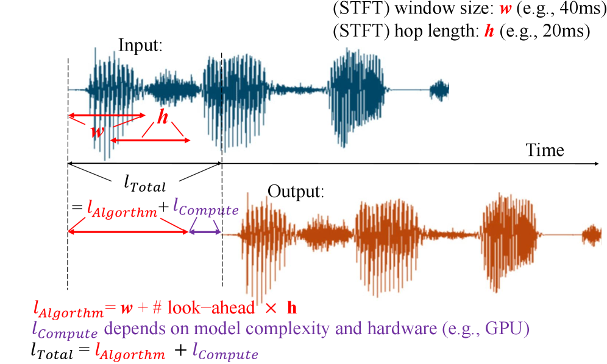
*Figure 1:The latency of a speech enhancement system can be categorized into algorithmic latency and computational latency.*

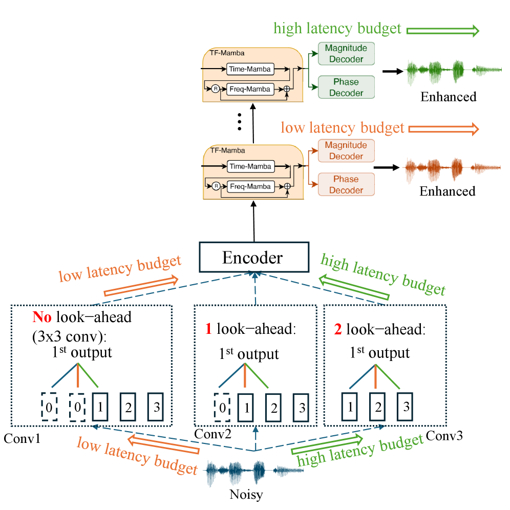
*Figure 2:Our proposed one-for-all model enables adjustable algorithmic latency through configurable look-ahead frames and computational latency via early exit. For example, under a low-latency budget, inference can follow the orange arrows.*

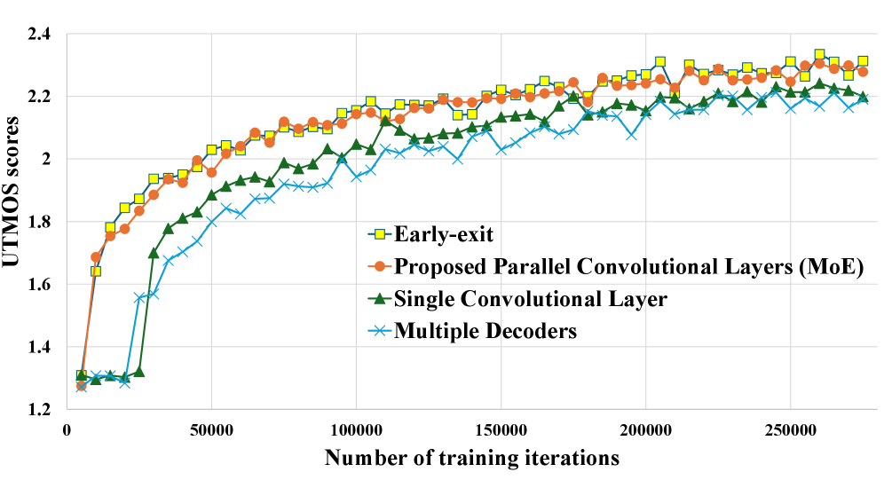
*Figure 3:Learning curves of UTMOS scores on the validation set under different model architectures.*

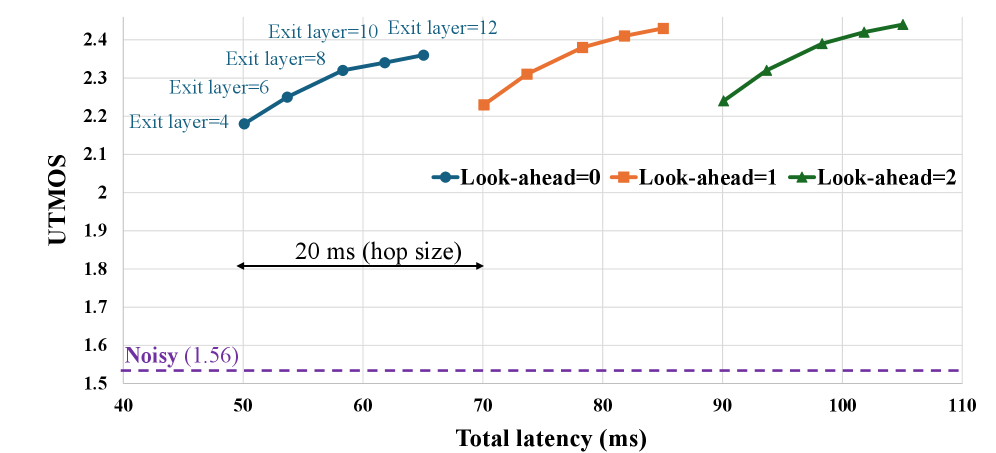
*(a)UTMOS vs. Total latency*

*(a)UTMOS vs. Total latency*

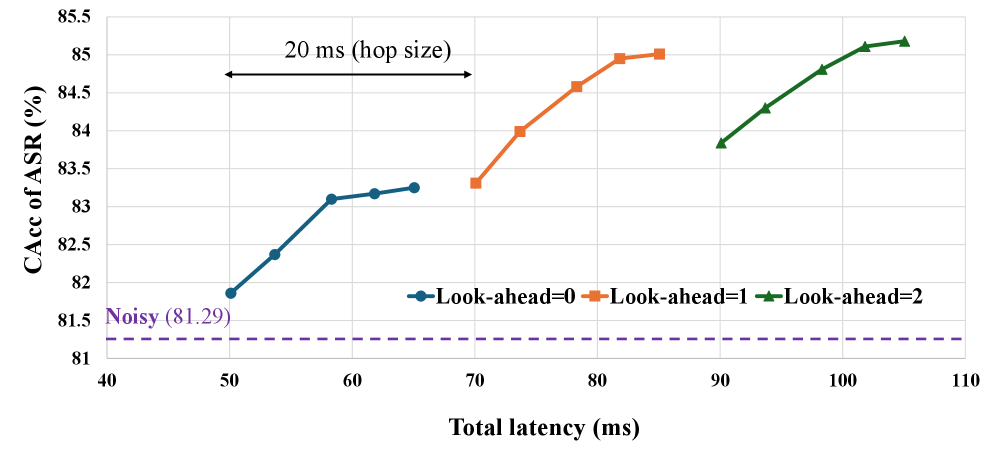
*(b)CAcc vs. Total latency*

---
**Usage Info**: 2225 tokens used.
**Generated at**: 2026-06-25 16:22:25

---

# 📚 Fully Differentiable Neural Forced Alignment via Soft Dynamic Programming

🚀 URL: https://arxiv.org/html/2606.25460

## 🌏 Abstract (원문)
Recent advances in sequence modeling have significantly improved ASR systems, bringing them close to human-level recognition accuracy and enhancing robustness across diverse acoustic conditions and languages. In contrast, Forced Alignment has not experienced comparable progress, and traditional HMM-GMM frameworks remain widely adopted and highly competitive. To address this gap, we propose an end-to-end, fully differentiable neural architecture specifically designed for phoneme alignment. The model consists of an encoder that processes the input signal and a decoder that produces alignment decisions. The encoder is structured into two complementary branches: one dedicated to phoneme identity verification and the other to phoneme boundary detection. The decoder is implemented as a trainable module based on differentiable soft dynamic programming. The entire system is optimized end-to-end using a novel contrastive loss that encourages clear separation between steady-state phoneme regions and transition boundaries. The proposed approach outperforms the current state of the art in phoneme alignment on hand-annotated English benchmarks, achieves strong word-level generalization results, and demonstrates generalization on unseen languages.
## 🌏 Abstract (번역)
최근 시퀀스 모델링의 발전은 ASR 시스템을 크게 개선하여 인간 수준의 인식 정확도에 근접하게 만들고 다양한 음향 조건 및 언어 전반에 걸쳐 견고성을 향상시켰습니다. 대조적으로, 강제 정렬(Forced Alignment)은 그에 필적하는 발전을 경험하지 못했으며, 전통적인 HMM-GMM 프레임워크는 여전히 널리 채택되고 높은 경쟁력을 유지하고 있습니다. 이러한 격차를 해소하기 위해, 우리는 음소 정렬을 위해 특별히 설계된 종단 간(end-to-end), 완전 미분 가능한 신경 아키텍처를 제안합니다. 이 모델은 입력 신호를 처리하는 인코더와 정렬 결정을 생성하는 디코더로 구성됩니다. 인코더는 두 개의 상호 보완적인 브랜치로 구성됩니다: 하나는 음소 식별 검증 전용이고 다른 하나는 음소 경계 감지 전용입니다. 디코더는 미분 가능한 소프트 동적 프로그래밍(soft dynamic programming)을 기반으로 하는 학습 가능한 모듈로 구현됩니다. 전체 시스템은 정상 상태 음소 영역과 전이 경계 간의 명확한 분리를 장려하는 새로운 대조 손실(contrastive loss)을 사용하여 종단 간 최적화됩니다. 제안된 접근 방식은 수동으로 주석이 달린 영어 벤치마크에서 음소 정렬 분야의 현재 최첨단 성능을 능가하며, 강력한 단어 수준 일반화 결과를 달성하고, 이전에 보지 못한 언어에 대한 일반화 능력을 보여줍니다.

## 🔍 Methods & Results
- 음성 파형(x)과 음소 시퀀스(p)가 주어졌을 때, 정렬 시퀀스(y_hat)를 정확하게 추정하는 것을 목표로 하는 종단 간(end-to-end), 완전 미분 가능한 신경 아키텍처를 제안합니다.
- 시스템은 세 가지 주요 구성 요소로 이루어져 있습니다: 입력 음성 파형을 잠재 표현(Z)으로 매핑하는 '표현 인코더(f_theta)', 잠재 표현과 음소 시퀀스를 입력으로 받아 프레임별 음소 확률 분포(U)를 계산하는 '컨텍스트 인코더(g_psi)', 그리고 잠재 표현, 프레임별 음소 분포, 음소 시퀀스를 입력으로 받아 학습된 소프트 동적 프로그래밍(soft dynamic programming) 절차를 사용하여 예측된 정렬 벡터(y_hat*)를 생성하는 '디코더(h_W)'입니다.
- 인코더는 음소 식별 검증과 음소 경계 감지를 위한 두 개의 상호 보완적인 브랜치로 구성됩니다.
- 전체 시스템은 세 가지 손실 함수(L_MNCE, L_CE, L_SoftDP)로 구성된 결합된 목적 함수를 사용하여 종단 간 공동으로 훈련됩니다. L_MNCE는 인코더가 음소 내 프레임과 경계 프레임을 구별하도록 유도하고, L_CE는 컨텍스트 인코더가 정확한 프레임별 음소 확률을 생성하도록 감독하며, L_SoftDP는 디코더가 미분 가능한 동적 프로그래밍을 통해 정확한 음소 경계를 예측하도록 안내합니다.
- 제안된 접근 방식은 수동으로 주석이 달린 영어 벤치마크에서 음소 정렬 분야의 현재 최첨단 성능을 능가하는 결과를 달성했습니다.
- 강력한 단어 수준 일반화 결과와 이전에 보지 못한 언어에 대한 일반화 능력을 입증했습니다.

## 🖼 Figures

*Figure 1:Overview of the proposed phoneme alignment system. The representation encoder extracts latent features from the input waveform, the context encoder produces frame-wise phoneme probabilities, and the decoder predicts the phoneme alignment using differentiable dynamic programming.*

*Figure 2:Sampling procedure for the representation encoder. Positive samples (green) are drawn from the steady-state region of the anchor’s corresponding phoneme 
𝑝
𝜋
​
(
𝜏
)
, while negative samples (yellow) are sampled from the transition region surrounding the boundary 
𝑦
𝜋
​
(
𝜏
)
.*

*Figure 3:Visualization of the learned latent space: (a) the original spectrogram; (b) the resulting representation 
𝐳
. Red dashed lines indicate ground truth phoneme boundaries 
𝐲*

*Figure 4:Frame-wise cosine similarity (red) and its temporal derivative (pink) computed over the learned latent representation 
𝐳
, used by the decoder via feature 
𝜙
1
. Red dashed lines indicate ground-truth phoneme boundaries, and green shows the final alignment predicted by the full system. Peaks in the derivative correspond to likely phoneme boundaries.*

*Figure 5:Frame-wise phoneme probability map 
𝐔
 produced by the contextual encoder. The map encodes soft linguistic constraints used by the decoder via feature 
𝜙
2
. Red dashed lines indicate ground-truth phoneme boundaries, and the phoneme sequence 
𝐩
 is shown along the x-axis. The x-axis corresponds to latent frames, and the y-axis corresponds to phoneme classes 
𝒫*

*Figure 6:Soft Dynamic Programming (Soft-DP) boundary selection. The matrix shows accumulated scores 
𝑉
𝑖
,
𝑡
𝑒
,
𝑡
𝑠
 for candidate boundaries, and the highlighted path indicates the differentiable expected boundary estimation used during training and inference.*

---
**Usage Info**: 3992 tokens used.
**Generated at**: 2026-06-25 16:22:38

---

