# 🚩 (2026-06-29) Scholar Inbox 추천 논문 

# 📚 A Survey of Automated Presentation Coaching: Systems, Methods, and Open Challenges

🚀 URL: https://arxiv.org/html/2606.27380

## 🌏 Abstract (원문)
Automated coaching for oral presentations sits at the intersection of computer-assisted pronunciation training (CAPT), prosody modeling, and speech synthesis, yet no prior work has systematically surveyed and compared existing systems along these dimensions. This survey reviews and categorizes automated presentation coaching systems, spanning pronunciation tutors, fluency and prosody coaches, multimodal trainers, and conference Q&A practice tools. We introduce a five-dimensional task taxonomy—covering segmental pronunciation, lexical stress, suprasegmental prosody, pacing, and content faithfulness—and explicitly map surveyed systems onto it to reveal coverage gaps. We further review the core technical methods these systems employ: TTS-based exemplar generation and diagnostic methods for pronunciation, prosody, and fluency assessment. Key open challenges include the scarcity of annotated presentation corpora, achieving accent-fair feedback across diverse L1 backgrounds, and delivering low-latency diagnostics for real-time rehearsal.
## 🌏 Abstract (번역)
구두 발표를 위한 자동화된 코칭은 컴퓨터 지원 발음 훈련(CAPT), 운율 모델링, 음성 합성의 교차점에 있지만, 이러한 차원을 따라 기존 시스템을 체계적으로 조사하고 비교한 선행 연구는 없습니다. 이 조사는 발음 튜터, 유창성 및 운율 코치, 다중 모드 트레이너, 컨퍼런스 Q&A 연습 도구를 포함하는 자동화된 발표 코칭 시스템을 검토하고 분류합니다. 우리는 분절음 발음, 어휘 강세, 초분절음 운율, 속도 조절, 내용 충실도를 포함하는 5차원 작업 분류 체계를 도입하고, 조사된 시스템을 이 체계에 명시적으로 매핑하여 커버리지 격차를 밝힙니다. 또한 이러한 시스템이 사용하는 핵심 기술 방법인 TTS 기반 예시 생성과 발음, 운율, 유창성 평가를 위한 진단 방법을 검토합니다. 주요 미해결 과제로는 주석이 달린 발표 코퍼스의 부족, 다양한 L1 배경에 걸쳐 악센트에 공정한 피드백 제공, 실시간 리허설을 위한 저지연 진단 제공 등이 있습니다.

## 🔍 Methods & Results
- 기존 발표 코칭 시스템은 CAPT 기반 발음 시스템, 운율 및 유창성 코치, 다중 모드 트레이너, Q&A/상호작용 코치로 분류됩니다.
- 5차원 작업 분류 체계(분절음 발음, 어휘 강세, 초분절음 운율, 속도 조절, 내용 충실도)를 사용하여 시스템들을 매핑했으며, 어휘 강세가 거의 무시되고 실시간 피드백이 드물며, 내용 충실도와 속도 조절이 분리되어 있고, 모든 5가지 차원을 동시에 다루는 시스템이 없다는 점을 발견했습니다.
- PresentCoach(Chen et al., 2025)는 발음, 운율, 속도 조절, 내용 충실도 4가지 차원을 다루지만 어휘 강세는 제외하여 통합된 다차원 코칭이 여전히 과제임을 보여줍니다.
- 코칭 시스템은 TTS(Text-to-Speech) 기반 예시 생성과 진단 기술이라는 두 가지 상호 보완적인 방법을 사용합니다.
- TTS 기반 예시 생성은 속도, 일시 정지, 강조에 대한 제어 가능성, 전문 용어에 대한 코드 스위칭 지원, 짧은 등록 클립에서 제로샷 음성 전송과 같은 현대 신경망 TTS 기능을 활용하며, 실시간 리허설 중에도 즉석에서 예시를 렌더링할 수 있습니다.
- 일반적인 TTS 기반 코칭 파이프라인은 기준 예시 렌더링, 학습자 오디오 녹음, 참조와 정렬 및 편차 계산, 오류 기반 드릴 제공 순으로 진행됩니다.
- 진단 방법에는 발음 정확도를 위한 GOP(Goodness of Pronunciation)가 포함되며, 이는 CTC 포스테리어 또는 wav2vec 2.0, HuBERT, WavLM과 같은 자기 지도 모델을 사용하여 개선되었습니다.
- 음색 및 화자 스타일 제어를 위해 학습자의 목소리로 이상적인 렌더링을 합성한 후 MFCC/SSL 거리 곡선을 계산하여 발음 오류를 식별하는 방법이 사용됩니다.
- 운율 품질은 log-F0를 사용하여 억양 일치(RMSE, Pearson r)를 측정하고, 단어 또는 구문 수준의 지속 시간 RMSE를 사용하여 리듬 정렬을 측정합니다.
- 속도 조절(WPM 편차, 발화 속도, 일시 정지 정밀도/재현율) 및 내용 충실도(용어집 보너스가 있는 제한된 LM ASR, WER, 누락된 키워드 플래그)는 다른 주요 진단 지표입니다.

---
**Usage Info**: 5045 tokens used.
**Generated at**: 2026-06-29 22:40:45

---

# 📚 HPRO: Hierarchical Progressive Reward Optimization via Preference Extraction for Emotional Text-to-Speech

🚀 URL: https://arxiv.org/html/2606.28249

## 🌏 Abstract (원문)
Recently, Large Language Model (LLM)-based Text-to-Speech (TTS) models have achieved remarkable naturalness. However, the standard Supervised Fine-Tuning paradigm often converges to statistically averaged prosody, limiting emotional expressiveness. While preference-driven optimization offers a promising alternative, existing approaches suffer from two structural mismatches: information conflict, where content and emotion in a shared latent space produce conflicting gradients, leading to reward hacking and semantic degradation; and scale gap, where sparse sentence-level rewards struggle to guide dense frame-level generation. To overcome these challenges, we propose HPRO, a hierarchical progressive reward optimization framework. Within HPRO, we introduce the HD-Emo codec as a novel differentiable reward model to resolve the information conflict. It extracts speech into distinct content and style preference tokens, structurally isolating emotional optimization from semantic content. Building upon this structured preference space, HPRO bridges the scale gap by progressively aligning frame-, word- and sentence-level objectives. Experiments demonstrate that HPRO significantly enhances emotional expressiveness, while effectively preserving linguistic intelligibility. The code and audio samples are publicly available athttps://xxh333.github.io/hpro-demo/.
## 🌏 Abstract (번역)
최근 대규모 언어 모델(LLM) 기반의 Text-to-Speech(TTS) 모델은 놀라운 자연스러움을 달성했습니다. 그러나 표준 지도 미세 조정(Supervised Fine-Tuning) 패러다임은 종종 통계적으로 평균화된 운율로 수렴하여 감정 표현력을 제한합니다. 선호도 기반 최적화는 유망한 대안을 제공하지만, 기존 접근 방식은 두 가지 구조적 불일치로 인해 어려움을 겪습니다. 첫째, 정보 충돌은 공유된 잠재 공간에서 내용과 감정이 상충하는 기울기를 생성하여 보상 해킹(reward hacking) 및 의미론적 저하를 초래합니다. 둘째, 스케일 격차는 희소한 문장 수준 보상이 밀집된 프레임 수준 생성을 안내하는 데 어려움을 겪는 문제입니다. 이러한 문제를 극복하기 위해 우리는 계층적 점진적 보상 최적화 프레임워크인 HPRO를 제안합니다. HPRO 내에서 우리는 정보 충돌을 해결하기 위한 새로운 미분 가능한 보상 모델로 HD-Emo 코덱을 도입합니다. 이 코덱은 음성을 별개의 내용 및 스타일 선호 토큰으로 추출하여 감정 최적화를 의미론적 내용으로부터 구조적으로 분리합니다. 이 구조화된 선호 공간을 기반으로 HPRO는 프레임, 단어 및 문장 수준 목표를 점진적으로 정렬하여 스케일 격차를 해소합니다. 실험 결과 HPRO가 언어적 명료성을 효과적으로 유지하면서 감정 표현력을 크게 향상시키는 것으로 나타났습니다. 코드와 오디오 샘플은 https://xxh333.github.io/hpro-demo/에서 공개적으로 이용 가능합니다.

## 🔍 Methods & Results
- HPRO는 LLM 기반 TTS 모델의 감정 표현력 향상을 위한 계층적 점진적 보상 최적화 프레임워크를 제안한다.
- 정보 충돌 해결을 위해 HD-Emo 코덱을 미분 가능한 보상 모델로 도입하며, 이는 음성을 내용(content) 및 스타일(style) 선호 토큰으로 분리 추출한다.
- 내용 토큰(Tc)은 ASR 목표(Whisper 기반)와 stop-gradient 메커니즘을 통해 언어적 의미에 고정되며, 스타일 토큰(Ts)은 계층적 감독(문장 수준 emotion2vec, 단어 수준 wVAD)을 통해 표현적 특징을 포착한다.
- HD-Emo 코덱은 동적 특징 변조(dynamic feature modulation)를 사용하여 추출된 선호 토큰을 재구성하며, 내용과 스타일의 구조적 분리를 유지한다.
- HPRO는 프레임, 단어, 문장 수준의 목표를 점진적으로 정렬하여 스케일 격차를 해소한다.
- 계층적 보상 함수는 프레임 수준(L1 회귀), 단어 수준(wVAD CCC 및 ASR CE 손실), 문장 수준(감정 분류 CE 손실)으로 구성되며, LLM 출력 정규화를 위한 KL 발산 손실도 포함한다.
- 안정적인 수렴을 위해 3단계의 점진적 최적화 전략을 사용한다: 1단계는 프레임 수준 정렬, 2단계는 단어 수준 정제, 3단계는 문장 수준 정렬을 도입한다.
- 실험 결과, HPRO는 언어적 명료성을 효과적으로 보존하면서 감정 표현력을 크게 향상시키는 것으로 나타났다.

## 🖼 Figures
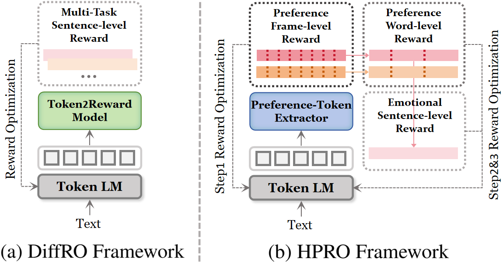
*Figure 1:Motivation. (a) DiffRO Framework. Single-scale reward optimization for monolithic speech representation. (b) HPRO Framework. Hierarchical progressive reward optimization for structured preference spaces.*

*Figure 2:Overview of the HD-Emo Codec. Monotonic speech tokens are processed by dual preference extractors with FSQ bottlenecks to obtain content and style preference tokens. The two streams are respectively supervised by ASR and hierarchical emotional objectives (SER and wVAD), and subsequently fused via dynamic feature modulation for speech token reconstruction.*

*Figure 3:Overview of the HPRO framework. The LLM generates differentiable speech tokens via Gumbel-Softmax, which are mapped by HD-Emo codec into preference spaces. Hierarchical frame-, word- and sentence-level rewards are progressively applied to update the LLM.*

---
**Usage Info**: 3898 tokens used.
**Generated at**: 2026-06-29 22:40:53

---

# 📚 Masked Language Flow Models

🚀 URL: https://arxiv.org/html/2606.27617

## 🌏 Abstract (원문)
Masked Diffusion Models(MDMs) promise fast, parallel language generation, but their reverse transition factorises across token positions—an approximation that breaks down in the few-step sampling regime where parallel generation ought to provide the greatest efficiency gains.Flow Language Models(FLMs) sidestep this limitation by learning a continuous flow that transports noise toward clean sequences represented in Euclidean space, inducing a flow map that can be distilled for single-step generation.However, this makes complex tasks requiring multi-step reasoning problematic for FLMs, as FLMs are forced to decode every token during generation.To address this, we introduceMasked Language Flow Models (MLFMs), which incorporate masking into FLMs using a continuous stochastic interpolant to bridge partially masked and clean sequences.This design enables conditional generation via continuous flows and allows pretrained MDMs to be converted into MLFMs through a simple, lightweight adaptation.Leveraging this flexibility, we propose a novel sampler that alternates continuous denoising with the discrete unmasking of confident tokens to better support multi-step reasoning.We evaluate our approach on GSM8K and MT-Bench and find, for the first time, that flow-based language models can be scaled to solve downstream reasoning and instruction-following tasks.Code is available at:github.com/imbirik/mlfm.
## 🌏 Abstract (번역)
마스크드 확산 모델(MDM)은 빠르고 병렬적인 언어 생성을 약속하지만, 토큰 위치에 걸쳐 역전이(reverse transition)가 분해되는 근사치를 사용합니다. 이는 병렬 생성이 가장 큰 효율성 이점을 제공해야 하는 소수 단계 샘플링 체제에서 문제가 됩니다. 플로우 언어 모델(FLM)은 유클리드 공간에 표현된 깨끗한 시퀀스로 노이즈를 전달하는 연속적인 플로우를 학습하여 이러한 한계를 회피하며, 단일 단계 생성을 위해 증류될 수 있는 플로우 맵을 유도합니다. 그러나 이로 인해 FLM은 생성 중에 모든 토큰을 디코딩해야 하므로 다단계 추론이 필요한 복잡한 작업에 문제가 발생합니다. 이를 해결하기 위해 우리는 부분적으로 마스킹된 시퀀스와 깨끗한 시퀀스를 연결하기 위해 연속적인 확률적 보간법을 사용하여 마스킹을 FLM에 통합한 마스크드 언어 플로우 모델(MLFM)을 소개합니다. 이 설계는 연속적인 플로우를 통한 조건부 생성을 가능하게 하며, 사전 훈련된 MDM을 간단하고 경량화된 적응을 통해 MLFM으로 변환할 수 있도록 합니다. 이러한 유연성을 활용하여, 우리는 다단계 추론을 더 잘 지원하기 위해 연속적인 노이즈 제거와 확신 있는 토큰의 이산적 마스크 해제를 번갈아 수행하는 새로운 샘플러를 제안합니다. 우리는 GSM8K 및 MT-Bench에서 우리의 접근 방식을 평가했으며, 플로우 기반 언어 모델이 다운스트림 추론 및 지시 따르기 작업을 해결하도록 확장될 수 있음을 처음으로 발견했습니다. 코드는 github.com/imbirik/mlfm에서 확인할 수 있습니다.

## 🔍 Methods & Results
- MLFM(Masked Language Flow Models)은 유클리드 공간에서 마스킹 확률(s)과 노이즈 시간(t)으로 매개변수화된 순방향 프로세스 `z_s,t`를 정의하며, 깨끗한 토큰은 고정하고 마스킹된 토큰은 확률적 보간법(브라운 운동 다리)을 통해 구성하여 마스킹과 노이즈 생성을 분리합니다.
- MLFM은 마스킹된 토큰의 부분 집합에 대해서만 교차 엔트로피를 통해 훈련되며, `p_theta`는 샘플링을 위한 속도 필드를 추정하는 데 사용되는 사후 평균 임베딩을 유도합니다.
- 마스크의 통합은 MLFM에서 조건부 생성을 자연스럽게 가능하게 하며, `t=0`에서 MLFM 예측 문제가 MDM 예측 문제와 일치하여 사전 훈련된 MDM을 MLFM 훈련을 위한 강력한 초기화로 활용할 수 있습니다.
- 사전 훈련된 MDM을 MLFM으로 적응시키기 위해 MDM 토큰 임베딩 레이어는 고정하고, MDM 트랜스포머 블록은 AdaLN과 LoRA 어댑터를 사용하여 연속적인 손상된 임베딩에 적응시키며, MDM 헤드도 LoRA 어댑터로 적응시킨 후 MLFM 목적 함수 `L_MLFM`으로 훈련을 계속합니다.
- MLFM은 프롬프트(p)와 답변(a)으로 구성된 시퀀스 `X`를 사용하여 지도 미세 조정(SFT)을 수행하며, 답변 위치는 확률 `alpha`로 모두 마스킹하거나 `1-alpha`로 부분적으로 마스킹하고, 프롬프트 위치는 항상 깨끗하게 유지하여 조건부 생성을 장려합니다.

## 🖼 Figures
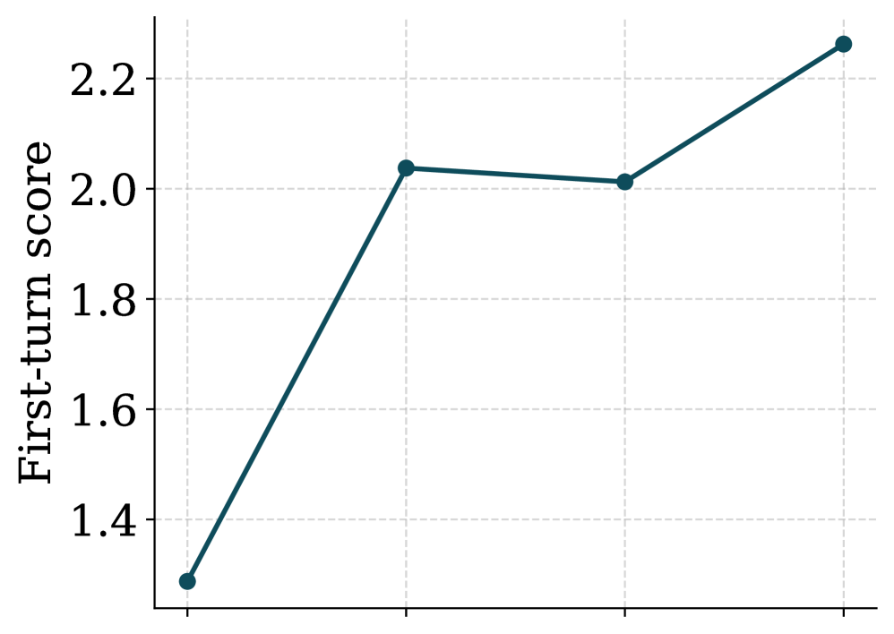
*Figure 1:MT-Bench and GSM8K results across different guidance scales (left) and sampler steps (right). The plots on the right use the optimal guidance scales given by the corresponding plots on the left.*

*Figure 2*

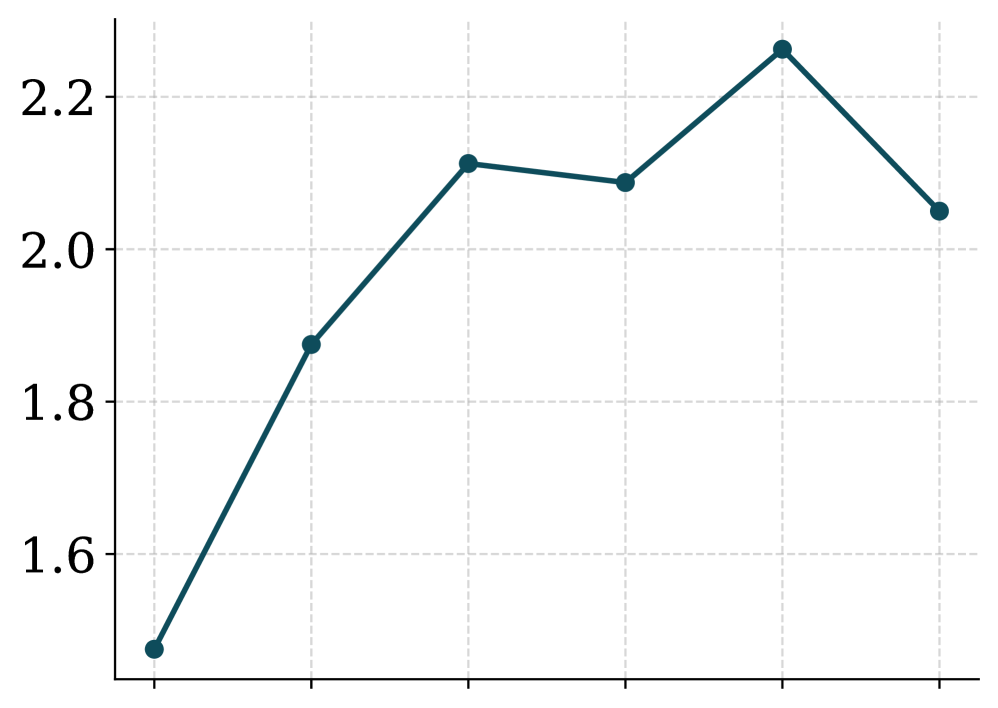
*Figure 3*

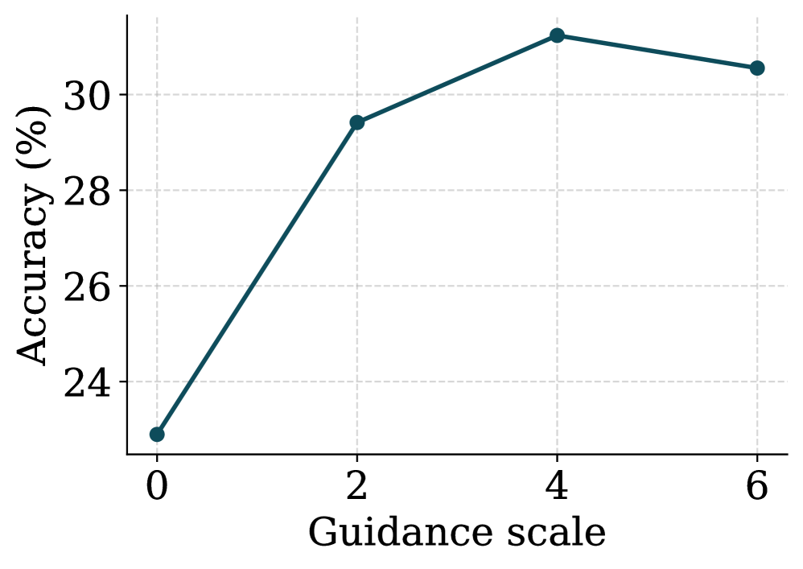
*Figure 4*

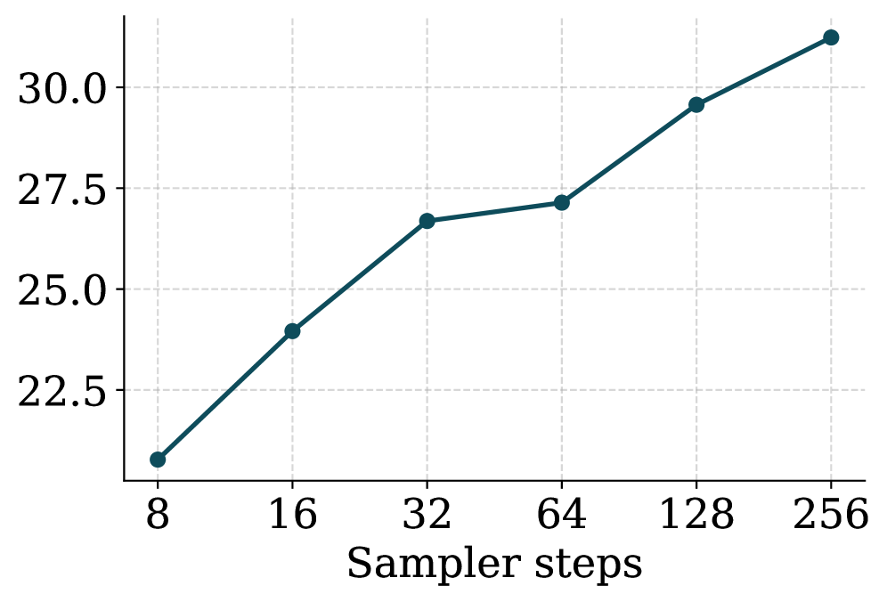
*Figure 5*

---
**Usage Info**: 4103 tokens used.
**Generated at**: 2026-06-29 22:41:02

---

# 📚 HybridCodec: Modeling Discrete and Continuous Representations For Efficient Speech Language Models

🚀 URL: https://arxiv.org/html/2606.27627

## 🌏 Abstract (원문)
Discrete audio representations have become increasingly popular for building multimodal text-audio systems and integrating audio capabilities into Large Language Models (LLMs). However, numerous studies report performance degradation on various downstream tasks due to information loss during discretization. To address this, we propose a novel approach combining temporally compressed discrete tokens with dimensionality-reduced continuous residuals. Our framework consists of a hybridized discrete-continuous focal modulation codec and a hybrid Transformer. This architecture performs autoregressive inference in the discrete domain, coupled with non-autoregressive prediction and continuous residual upsampling. Experimental results show that our approach significantly improves the retention of speaker characteristics compared to discrete-only methods, while simultaneously reducing the number of required autoregressive steps.
## 🌏 Abstract (번역)
이산 오디오 표현은 다중 모달 텍스트-오디오 시스템을 구축하고 대규모 언어 모델(LLM)에 오디오 기능을 통합하는 데 점점 더 인기를 얻고 있습니다. 그러나 수많은 연구에서 이산화 과정 중 정보 손실로 인해 다양한 다운스트림 작업에서 성능 저하가 보고되고 있습니다. 이를 해결하기 위해 우리는 시간적으로 압축된 이산 토큰과 차원 축소된 연속 잔차를 결합하는 새로운 접근 방식을 제안합니다. 우리의 프레임워크는 하이브리드 이산-연속 초점 변조 코덱과 하이브리드 트랜스포머로 구성됩니다. 이 아키텍처는 이산 도메인에서 자기회귀 추론을 수행하며, 비자기회귀 예측 및 연속 잔차 업샘플링과 결합됩니다. 실험 결과에 따르면 우리의 접근 방식은 이산 전용 방식에 비해 화자 특성 유지율을 크게 향상시키면서 동시에 필요한 자기회귀 단계 수를 줄이는 것으로 나타났습니다.

## 🔍 Methods & Results
- 제안된 HybridCodec은 기존 FocalCodec(비대칭 VQ-VAE, WavLM 인코더, 초점 변조, BSQ, Vocos 디코더 사용)을 확장하여 이산화 과정에서 손실된 연속 잔차 정보를 포착하고 압축하는 보조 경로를 추가합니다.
- 인코딩 과정은 기본 표현을 이산-연속 이중 잠재 공간으로 매핑하며, 이산 경로는 양자화된 인덱스를 추출하고 연속 경로는 잔차 오류를 계산 및 압축합니다. 이 잔차는 전용 초점 인코더(FE_res)를 통해 시간적 다운샘플링 스트라이드(예: 50Hz, 25Hz, 12.5Hz, 6.25Hz)를 조절하여 처리됩니다.
- 디코딩 과정은 이산 인덱스를 연속 임베딩 공간으로 투영하고 압축된 연속 잔차를 잔차 초점 디코더(FD_res)를 통해 업샘플링한 후, 두 스트림을 합산하여 Vocos 디코더로 전달함으로써 완전한 하이브리드 신호를 재구성합니다.
- HybridLM은 HybridCodec의 이중 표현을 처리하도록 설계된 GPT 스타일의 디코더 전용 트랜스포머로, 이산 토큰에 대한 자기회귀(AR) 디코딩(의미 구조)과 연속 잔차에 대한 비자기회귀(NAR) 예측(고음질 음향 세부 정보)을 단일 네트워크 내에서 통합합니다.
- AR 및 NAR 모드 간의 목표 간섭을 방지하기 위해 Adaptive Layer Normalization(AdaLN)을 사용하여 모드별 임베딩을 주입함으로써 공유 백본 내에 두 개의 특화된 서브 모델을 효과적으로 생성합니다. 모델은 12개 레이어, 4개 어텐션 헤드, d_model=d_emb=512, d_ffn=2048로 구성됩니다.
- 사전 학습된 ECAPA-TDNN 화자 임베딩은 선형 투영 및 추가를 통해 모든 토큰 임베딩에 통합되어 특정 음성에 대한 생성을 조건화합니다.
- 훈련 절차는 이산 경로와 연속 경로 모두 교사 강요(teacher forcing) 방식으로 진행되며, 이산 토큰에 대한 NLL 손실과 연속 잔차에 대한 MSE 손실이 결합됩니다. 훈련 역학 개선을 위해 signed-log 변환이 사용됩니다.
- 추론 단계에서는 이산 토큰이 먼저 자기회귀적으로 생성된 후, 연속 잔차가 단일 비자기회귀 전달로 예측되는 캐스케이드 방식이 사용됩니다. 이 방식은 이산 전용 모델의 상당한 품질 손실 없이 생성 시간을 크게 단축합니다(예: 12.5Hz에서 10초 샘플 생성 시 500단계 대신 126단계 소요).

## 🖼 Figures
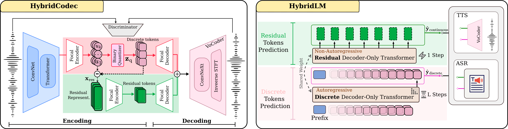
*Figure 1:Overview of the proposed architecture: HybridCodec (left) provides dual-path discrete-continuous compression, and HybridLM (right) unifies these representations through interleaved autoregressive and non-autoregressive decoding.*

---
**Usage Info**: 5066 tokens used.
**Generated at**: 2026-06-29 22:41:15

---

# 📚 MixTTA: Low-Rank Cross-Channel Mixing for Reliable Test-Time Adaptation

🚀 URL: https://arxiv.org/html/2606.28142

## 🌏 Abstract (원문)
Test-Time Adaptation (TTA) methods commonly update the affine parameters of normalization layers to adapt deployed models under distribution shifts. However, per-channel affine parameters perform axis-aligned scaling and shifting, making them geometrically incapable of correcting cross-channel structural changes induced by distribution shift. To address this limitation, we propose MixTTA, a lightweight plug-in module that equips normalization layers with a low-rank cross-channel transformation, enabling inter-channel mixing at each layer. To ensure that the low-rank branch captures only cross-channel interactions, we also propose Decoupling Projection that enforces strict separation from the diagonal affine path, along with Spectral Projection that prevents rank-1 collapse under non-stationary test streams. MixTTA can be seamlessly integrated into any existing normalization-based TTA method. Experiments in both standard and wild TTA settings show consistent improvements over strong baselines while mitigating adaptation failure under challenging conditions. The source code is publicly available athttps://github.com/delta6189/MixTTA.
## 🌏 Abstract (번역)
테스트 시간 적응(TTA) 방법은 분포 변화에 따라 배포된 모델을 적응시키기 위해 정규화 레이어의 아핀 파라미터를 일반적으로 업데이트합니다. 그러나 채널별 아핀 파라미터는 축 정렬 스케일링 및 시프팅을 수행하여, 분포 변화로 인해 발생하는 채널 간 구조적 변화를 기하학적으로 수정할 수 없습니다. 이러한 한계를 해결하기 위해, 우리는 각 레이어에서 채널 간 혼합을 가능하게 하는 저랭크 채널 간 변환을 정규화 레이어에 장착하는 경량 플러그인 모듈인 MixTTA를 제안합니다. 저랭크 브랜치가 채널 간 상호작용만을 포착하도록 보장하기 위해, 우리는 대각 아핀 경로로부터 엄격한 분리를 강제하는 디커플링 프로젝션(Decoupling Projection)과 비정상 테스트 스트림에서 랭크-1 붕괴를 방지하는 스펙트럼 프로젝션(Spectral Projection)을 제안합니다. MixTTA는 기존의 모든 정규화 기반 TTA 방법에 원활하게 통합될 수 있습니다. 표준 및 와일드 TTA 설정 모두에서 수행된 실험은 강력한 기준선 대비 일관된 개선을 보여주며, 어려운 조건에서도 적응 실패를 완화합니다. 소스 코드는 https://github.com/delta6189/MixTTA에서 공개적으로 이용 가능합니다.

## 🔍 Methods & Results
- 기존 TTA 방법(예: Tent)은 정규화 레이어의 채널별 아핀 파라미터만 업데이트하여 축 정렬 스케일링 및 시프팅을 수행하므로, 채널 간 구조적 변화를 명시적으로 포착할 수 없습니다.
- 이러한 한계를 해결하기 위해, MixTTA는 Tent의 대각 스케일링을 확장하는 저랭크 채널 혼합(W = Γ + Δ, 여기서 Δ = AB)을 도입하여 채널 간 종속성을 포착하고, 파라미터 오버헤드를 최소화합니다.
- 디커플링 프로젝션(Decoupling Projection)은 저랭크 브랜치(Δ)가 채널 간 상호작용만을 포착하도록 보장하기 위해, Δ의 대각 요소가 0이 되도록 강제하여 대각 아핀 경로(Γ)와의 기능적 분리를 엄격하게 시행합니다.
- 비정상 테스트 스트림에서 MixTTA가 지배적인 랭크-1 방향으로 붕괴되는 것을 방지하기 위해, 스펙트럼 프로젝션(Spectral Projection)을 도입합니다.
- 스펙트럼 프로젝션은 부분 공간 특징의 공분산에서 지배적인 고유 벡터를 계산하고, 이를 사용하여 저랭크 기울기에서 지배적인 랭크-1 방향을 억제하는 투영 연산자 P를 구성하여 적응을 안정화합니다.
- MixTTA는 기존의 모든 정규화 기반 TTA 방법에 원활하게 통합될 수 있으며, 표준 및 와일드 TTA 설정 모두에서 강력한 기준선 대비 일관된 성능 향상을 보이고, 어려운 조건에서 적응 실패를 완화합니다.

## 🖼 Figures
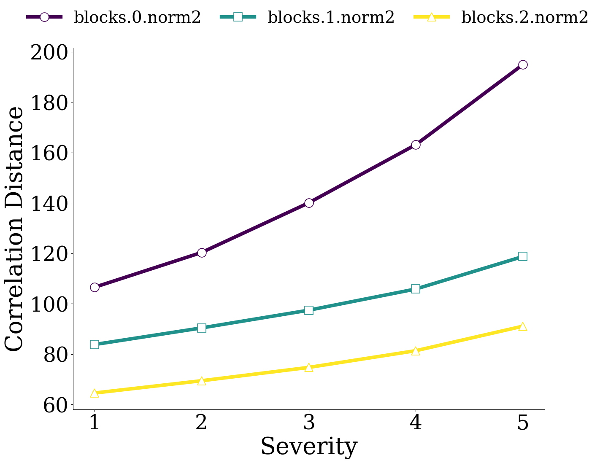
*(a)Correlation Distance*

*(a)Correlation Distance*

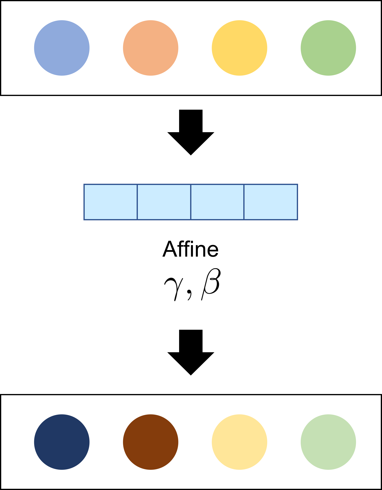
*(b)Tent*

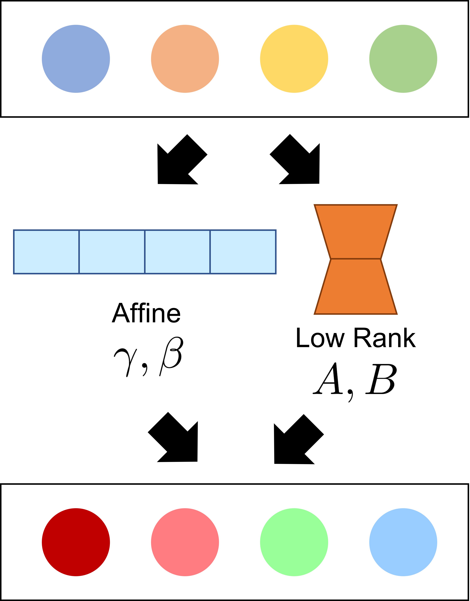
*(c)MixTTA (Ours)*

*Figure 2: Overall structure of MixTTA module, which operates within normalization layers of the backbone network. Standardized features are modulated through both the affine and residual low-rank branches. Decoupling Projection ensures strict separation between diagonal and off-diagonal updates, while Spectral Projection filters collapse-prone directions during adaptation.*

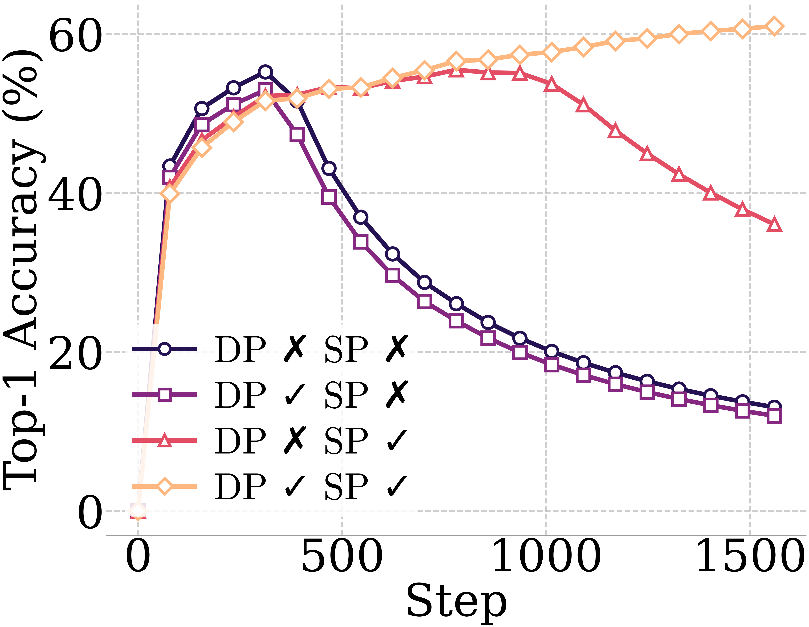
*(a)Accuracy*

*(a)Accuracy*

*(b)
𝜅*

*(c)
‖
diag
​
(
Δ
)
‖
2*

*(a)Correlation Distance*

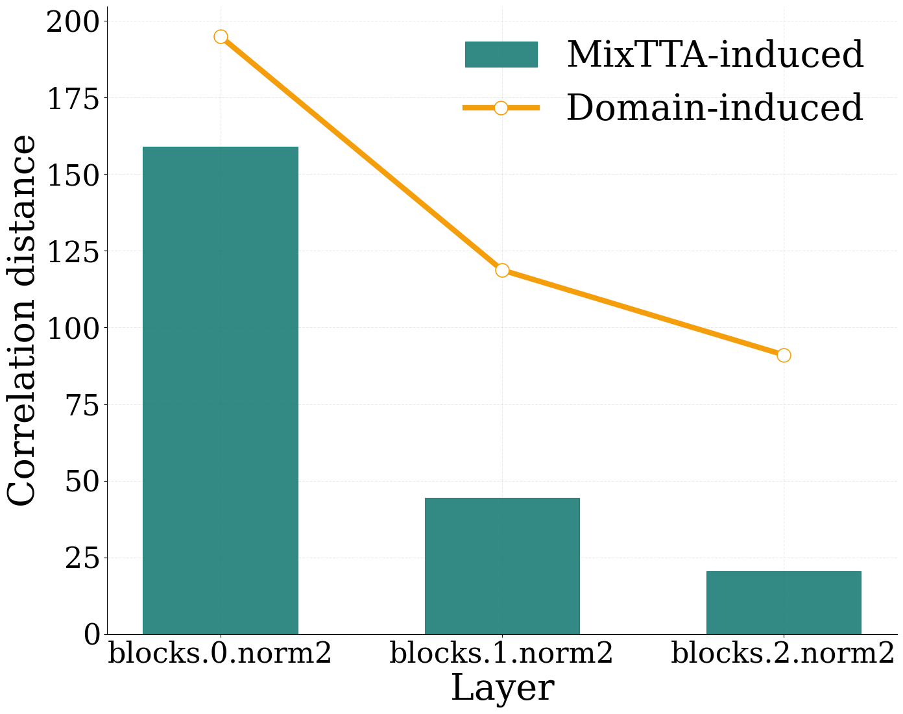
*(a)Correlation Distance*

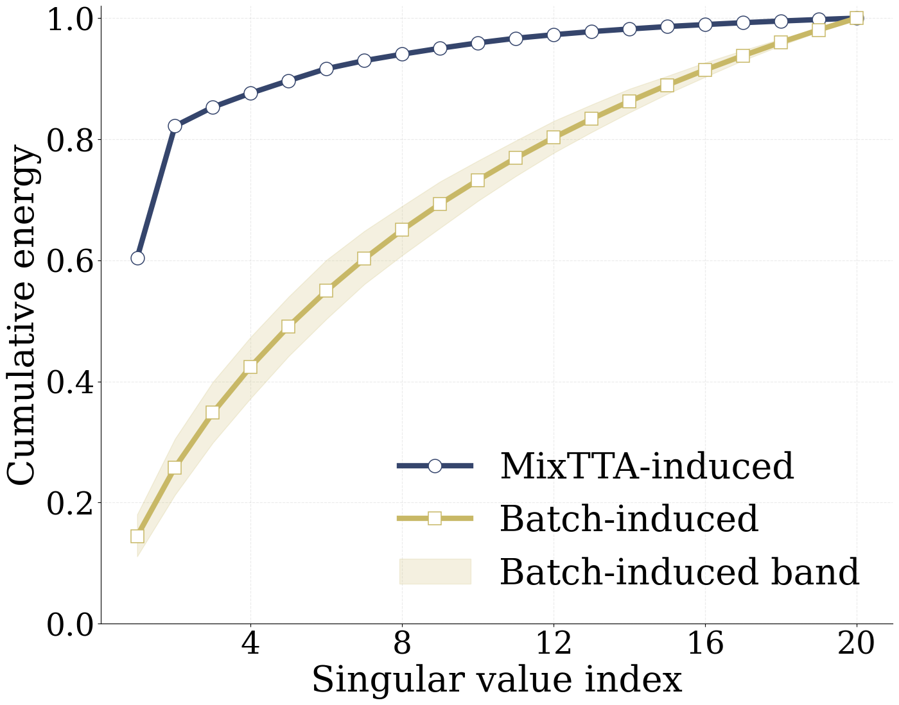
*(b)Cumulative Energy*

---
**Usage Info**: 3486 tokens used.
**Generated at**: 2026-06-29 22:41:23

---

