# 🚩 (2026-06-30) Scholar Inbox 추천 논문 

# 📚 VeRe-Flow: Guiding Flow Matching toward Clean Speech via Velocity Contrastive Regularization and Representation Alignment for Noise-Robust Bandwidth Expansion

🚀 URL: https://arxiv.org/html/2606.29450

## 🌏 Abstract (원문)
Noise-robust bandwidth expansion aims to reconstruct high-fidelity wideband speech from noisy low-resolution inputs. While flow matching has shown strong performance in speech generation, accurately recovering clean speech from noisy inputs remains challenging due to the ambiguity of velocity estimation under noise. In this work, we proposeVeRe-Flow, a clean-guided flow matching framework that introduces multi-level clean supervision to guide the generative process toward clean speech. At the velocity level, we introduce velocity contrastive regularization, which attracts the predicted velocity toward the clean trajectory while repelling it from noisy trajectories. At the representation level, we incorporate representation alignment that aligns intermediate features with clean self-supervised learning representations. The results demonstrate that the proposed method achieves the lowest LSD and highest DNSMOS OVRL among all baselines, and the highest MOS among generative baselines.
## 🌏 Abstract (번역)
노이즈에 강인한 대역폭 확장(Noise-robust bandwidth expansion)은 노이즈가 있는 저해상도 입력으로부터 고음질의 광대역 음성을 재구성하는 것을 목표로 합니다. 플로우 매칭(flow matching)이 음성 생성에서 강력한 성능을 보여주었지만, 노이즈 하에서 속도 추정의 모호성 때문에 노이즈가 있는 입력으로부터 깨끗한 음성을 정확하게 복구하는 것은 여전히 어렵습니다. 본 연구에서는 깨끗한 음성으로의 생성 과정을 안내하기 위해 다단계 깨끗한 지도(clean supervision)를 도입하는 깨끗한 지도 기반 플로우 매칭 프레임워크인 VeRe-Flow를 제안합니다. 속도 수준에서는 예측된 속도를 깨끗한 궤적으로 끌어당기고 노이즈가 있는 궤적으로부터 밀어내는 속도 대조 정규화(velocity contrastive regularization)를 도입합니다. 표현 수준에서는 중간 특징을 깨끗한 자기 지도 학습(self-supervised learning) 표현과 정렬시키는 표현 정렬(representation alignment)을 통합합니다. 결과는 제안된 방법이 모든 기준선 중에서 가장 낮은 LSD와 가장 높은 DNSMOS OVRL을 달성했으며, 생성 모델 기준선 중에서는 가장 높은 MOS를 달성했음을 보여줍니다.

## 🔍 Methods & Results
- VeRe-Flow는 노이즈가 있는 저해상도 입력으로부터 고음질 광대역 음성을 재구성하는 노이즈 강인 대역폭 확장(NR-BWE)을 위한 깨끗한 지도 기반 플로우 매칭 프레임워크이다.
- 플로우 매칭은 간단한 소스 분포에서 타겟 분포로 샘플을 변환하는 연속적인 속도 필드를 학습하는 생성 모델링 프레임워크이며, 조건부 플로우 매칭(CFM)은 타겟 샘플에 조건을 부여하여 최적의 조건부 속도 필드를 학습한다.
- NR-BWE 태스크를 위해, 가우시안 사전(x0~N(0,I))을 사용하고 타겟은 깨끗한 고해상도 멜-스펙트로그램(x1=xHR^clean)으로 설정하며, 노이즈가 있는 저해상도 멜-스펙트로그램과 SSL 특징을 속도 네트워크의 외부 조건으로 제공한다.
- 모델 아키텍처는 DiC 스타일의 컨볼루션 블록과 트랜스포머 블록을 컨볼루션 사전 단계, 중앙 트랜스포머 단계, 컨볼루션 사후 단계의 샌드위치 구조로 배열하며, 노이즈 강인한 지도를 위해 XEUS에서 추출된 프레임 단위 SSL 특징을 통합한다.
- 표현 정렬(Representation Alignment)은 모델의 중간 은닉 상태(첫 번째 트랜스포머 레이어 출력)가 3계층 MLP 투영 헤드를 통해 깨끗한 SSL 표현과 정렬되도록 유도하여, 손상된 입력 조건에서도 깨끗한 음성 특성과 일치하는 내부 표현을 생성하도록 한다.
- 속도 대조 정규화(Velocity Contrastive Regularization, VeCoR)는 예측된 속도를 깨끗한 타겟 속도 방향으로 끌어당기고 노이즈가 있는 타겟 속도 방향으로부터 밀어내는 방식으로 플로우를 깨끗한 음성으로 명시적으로 유도한다.
- 최종 훈련 목표는 깨끗한 플로우 매칭 지도와 노이즈 속도로부터의 대조적 반발을 포함하는 VeCoR 손실과 표현 정렬 손실을 결합하여 구성된다.
- 제안된 방법은 모든 기준선 중에서 가장 낮은 LSD(Log-Spectral Distortion)와 가장 높은 DNSMOS OVRL(Overall Mean Opinion Score)을 달성했으며, 생성 모델 기준선 중에서는 가장 높은 MOS(Mean Opinion Score)를 기록했다.

## 🖼 Figures
![Figure 1:(a) Training process of the VeRe-Flow. The model predicts the velocity 
𝑣
𝜃
​
(
𝑥
𝑡
,
𝑡
)
 conditioned on a noisy low-resolution mel-spectrogram and noise-robust self-supervised learning (SSL) features. Velocity Contrastive Regularization aligns 
𝑣
𝜃
 with the clean trajectory and repels it from the noisy trajectories, guiding the predicted trajectory toward the clean speech manifold. Meanwhile, Representation Alignment aligns intermediate representations with clean SSL embeddings. (b) Architecture of the Conv ResBlock.](../images/2026-06-30/2606.29450/2606.29450_fig0.png)
*Figure 1:(a) Training process of the VeRe-Flow. The model predicts the velocity 
𝑣
𝜃
​
(
𝑥
𝑡
,
𝑡
)
 conditioned on a noisy low-resolution mel-spectrogram and noise-robust self-supervised learning (SSL) features. Velocity Contrastive Regularization aligns 
𝑣
𝜃
 with the clean trajectory and repels it from the noisy trajectories, guiding the predicted trajectory toward the clean speech manifold. Meanwhile, Representation Alignment aligns intermediate representations with clean SSL embeddings. (b) Architecture of the Conv ResBlock.*

---
**Usage Info**: 3212 tokens used.
**Generated at**: 2026-06-30 14:08:59

---

# 📚 wav2VOT: automatic estimation of voice onset time, closure duration, and burst realisation with wav2vec2

🚀 URL: https://arxiv.org/html/2606.28857

## 🌏 Abstract (원문)
While automatic tools for speech annotation are now commonplace within phonetic research pipelines, many tasks require substantial manual correction or training sets to perform accurately. Simultaneously, large speech models such as wav2vec2 have been shown to perform well at speech classification tasks, raising the question of how these models may be applied to phonetic annotation tasks. We introduce wav2VOT: a tool for the automatic estimation of voice onset time, closure duration, and burst realisation using wav2vec2. We demonstrate that wav2VOT performs comparably with current approaches on unseen datasets, and can estimate with high accuracy with fine-tuning. Analysis of wav2VOT predictions demonstrate high fidelity across stop voicing and place of articulation. These results demonstrate that large speech models are capable of producing accurate annotations, and further motivate exploration of large speech models as tools in phonetic research pipelines.
## 🌏 Abstract (번역)
음성 주석을 위한 자동화 도구는 음성학 연구 파이프라인에서 흔히 사용되지만, 많은 작업은 정확하게 수행하기 위해 상당한 수동 수정이나 훈련 세트를 필요로 합니다. 동시에 wav2vec2와 같은 대규모 음성 모델이 음성 분류 작업에서 우수한 성능을 보이는 것으로 나타나, 이러한 모델이 음성학적 주석 작업에 어떻게 적용될 수 있는지에 대한 의문이 제기됩니다. 본 논문에서는 wav2vec2를 사용하여 음성 개시 시간(VOT), 폐쇄 지속 시간 및 파열 실현을 자동으로 추정하는 도구인 wav2VOT를 소개합니다. wav2VOT가 미지의 데이터셋에서 현재 접근 방식과 유사한 성능을 보이며, 미세 조정을 통해 높은 정확도로 추정할 수 있음을 입증합니다. wav2VOT 예측 분석은 파열음의 유성음 여부 및 조음 위치 전반에 걸쳐 높은 충실도를 보여줍니다. 이러한 결과는 대규모 음성 모델이 정확한 주석을 생성할 수 있음을 보여주며, 음성학 연구 파이프라인에서 대규모 음성 모델을 도구로 활용하는 추가 탐색을 촉진합니다.

## 🔍 Methods & Results
- wav2VOT는 wav2vec2의 Feature Encoder(FE)와 Transformer Encoder(TE) 블록 아키텍처를 활용한다.
- 기존 wav2vec2의 20ms 시간 해상도 대신, wav2VOT는 4개의 컨볼루션 레이어(stride: 2, 2, 2, 2)를 사용하여 16배 다운샘플링하고 1ms의 더 미세한 시간 해상도를 달성한다.
- 모델은 각 출력 프레임에 대해 {주변 컨텍스트 창, 폐쇄, VOT, 약화}의 4가지 레이블 중 하나를 예측하는 프레임 단위 분류를 수행한다.
- 훈련을 위해, 폐쇄 시작, VOT 시작, VOT 종료 및 약화 여부를 나타내는 메타데이터와 함께 정지 토큰이 주변 컨텍스트 창과 함께 추출된다.
- 추출된 정지 토큰의 각 1ms에 해당하는 레이블 시퀀스(예: [0, 0, 0, 0, 1, 1, 1, 1, 2, 2, 2, 2, 2, 0, 0, 0, 0])가 생성된다.
- 훈련 안정화 및 유효한 시퀀스 학습을 위해, 프레임 단위 교차 엔트로피 손실에 0.05로 스케일링된 Connectionist Temporal Classification (CTC) 손실이 추가된다.
- 추론 시, wav2VOT는 프레임 단위 소프트맥스 예측 레이블 시퀀스를 반환하며, 프레임 길이 간격 생성을 방지하기 위해 최소 간격 크기(기본 5ms)를 적용하여 짧은 간격은 이전 레이블과 결합된다.

## 🖼 Figures
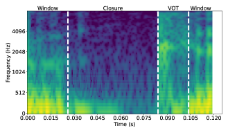
*Figure 1:Spectograms of three stop tokens from the Corpus of Spontaneous Japanese-Core (CSJ-C), overlaid with Closure + VOT (left), VOT (middle), and lenition (right) predicted from wav2VOT model trained in Section 3.1.*

*Figure 2:Performance of CSJ-C-trained wav2VOT model for the CSJ-C training set, reported as a percentage of the test corpora that fall within a set of fixed tolerances (e.g., 
<
2ms refers to a proportion of predictions within 2ms of the manual annotations).*

*Figure 3:Performance of wav2VOT VOT (top) and closure duration (bottom left) predictions, reported as a percentage of the test corpora that fall within a set of fixed tolerances. Lenition predictions (bottom right) reported as predictive accuracy (with horizontal jitter). Purple squares lines indicate the CSJ-C-trained model (i.e. no finetuning), with circles corresponding to models finetuned with different amounts of training data from the given corpus.*

![Figure 4:Model-estimated VOT (left) and closure duration (right) for manually-annotated stops (purple circles) and wav2VOT predictions (green triangles), separated by phoneme label. Points indicate posterior median, with lines indicating the 95% Highest Posterior Density (HPD) interval [emmeans2024].](../images/2026-06-30/2606.28857/2606.28857_fig3.png)
*Figure 4:Model-estimated VOT (left) and closure duration (right) for manually-annotated stops (purple circles) and wav2VOT predictions (green triangles), separated by phoneme label. Points indicate posterior median, with lines indicating the 95% Highest Posterior Density (HPD) interval [emmeans2024].*

---
**Usage Info**: 2199 tokens used.
**Generated at**: 2026-06-30 14:09:05

---

# 📚 Predicting Timbre Traits for Interpretable Assessment of Musical Sound Synthesizers

🚀 URL: https://arxiv.org/html/2606.30369

## 🌏 Abstract (원문)
Measuring neural audio synthesizers’ performance is now routinely conducted using distribution based metrics such as the Fréchet Audio Distance (FAD). Although this metric can be correlated with human perception, it offers limited interpretability beyond ranking different approaches. In this paper, we introduce a deep neural timbre trait predictor composed of a pretrained audio neural embedding (CLAP), and a shallow learnable component. The latter is trained using the RWC musical instrument database and human judgments of 20 timbre descriptions (e.g., woody, percussive, rumbling, etc.) for 31 instruments. The resulting model shows strong correlation with average human ratings (r= 0.66,p<<0.001). We then demonstrate the benefit of this predictor for evaluating the performance of TokenSynth, a neural sound synthesizer. First, the Mean Absolute Error (MAE) computed over the set of generated sounds under different conditioning modalities of the model provides the same ranking as a FAD computed with the RWC database as a reference, suggesting that the proposed predictors are able to provide equivalent information on a distributional basis. Second, because the model is able to qualitatively analyze isolated sounds, we can determine which generated sounds could be improved and identify specific timbral dimensions that need adjustment.
## 🌏 Abstract (번역)
신경 오디오 신시사이저의 성능 측정은 이제 프레셰 오디오 거리(FAD)와 같은 분포 기반 지표를 사용하여 일상적으로 수행됩니다. 이 지표는 인간의 인지와 상관관계가 있을 수 있지만, 다양한 접근 방식을 순위 매기는 것 외에는 제한적인 해석 가능성을 제공합니다. 본 논문에서는 사전 학습된 오디오 신경 임베딩(CLAP)과 얕은 학습 가능한 구성 요소로 구성된 심층 신경 음색 특성 예측기를 소개합니다. 후자는 RWC 악기 데이터베이스와 31개 악기에 대한 20가지 음색 설명(예: 나무 같은, 타악기 같은, 웅웅거리는 등)에 대한 인간의 판단을 사용하여 훈련됩니다. 결과 모델은 평균 인간 평가와 강력한 상관관계(r=0.66, p<<0.001)를 보입니다. 우리는 이 예측기가 신경 사운드 신시사이저인 TokenSynth의 성능을 평가하는 데 유용함을 입증합니다. 첫째, 모델의 다양한 조건화 양식에서 생성된 사운드 세트에 대해 계산된 평균 절대 오차(MAE)는 RWC 데이터베이스를 참조로 사용하여 계산된 FAD와 동일한 순위를 제공하며, 이는 제안된 예측기가 분포 기반으로 동등한 정보를 제공할 수 있음을 시사합니다. 둘째, 모델이 개별 사운드를 정성적으로 분석할 수 있기 때문에 어떤 생성된 사운드를 개선할 수 있는지 결정하고 조정이 필요한 특정 음색 차원을 식별할 수 있습니다.

## 🔍 Methods & Results
- 사전 학습된 오디오 신경 임베딩(CLAP)과 얕은 학습 가능한 구성 요소로 구성된 심층 신경 음색 특성 예측기가 도입되었습니다.
- 얕은 학습 가능한 구성 요소는 RWC 악기 데이터베이스와 31개 악기에 대한 20가지 음색 설명에 대한 인간의 판단을 사용하여 훈련되었습니다.
- 개발된 음색 특성 예측 모델은 평균 인간 평가와 강력한 상관관계(r=0.66, p<<0.001)를 보였습니다.
- 이 예측기는 신경 사운드 신시사이저인 TokenSynth의 성능을 평가하는 데 활용되었습니다.
- 모델의 다양한 조건화 양식에서 생성된 사운드에 대해 계산된 평균 절대 오차(MAE)는 RWC 데이터베이스를 참조로 사용한 FAD와 동일한 순위를 제공하여, 분포 기반 평가에서 동등한 정보를 제공할 수 있음을 입증했습니다.
- 모델의 정성적 분석 능력을 통해 개선이 필요한 특정 생성 사운드를 식별하고 조정이 필요한 음색 차원을 정확히 찾아낼 수 있었습니다.

## 🖼 Figures

*Figure 1:Timbre Traits Profiles - Reweighted Audio Neural Embedding (TTP-RANE): First, the frozen neural embedding model computes each audio sample embedding. Second, the trained MLP assigns values for the 20 timbre traits. During training, the loss function between predictions and ground truth (Timbre Trait Profiles) is computed to update the weights of the MLP. Solid lines indicates the process of the approach, dashed lines indicates where the dataset information is used.*

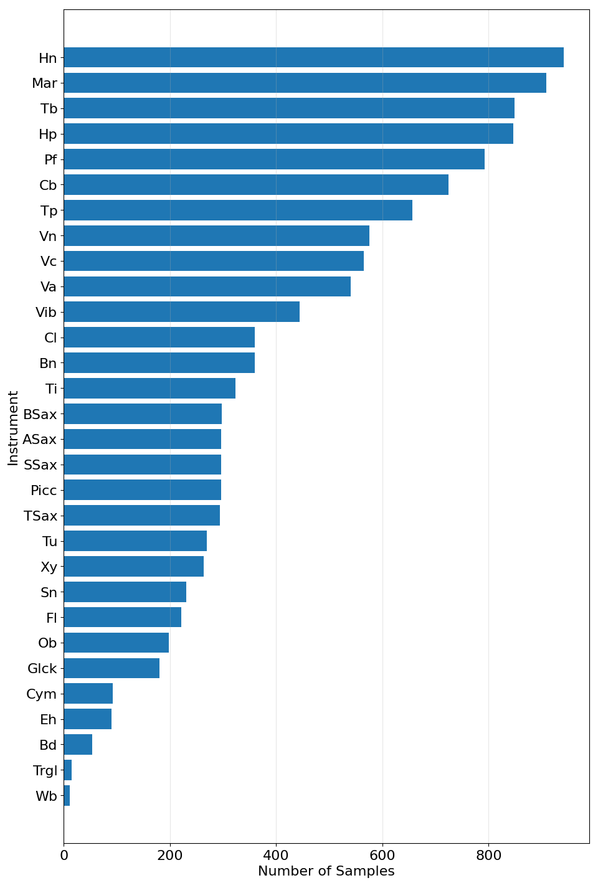
*Figure 2:Musical instruments and their number of samples from RWC dataset.*

*((a))*

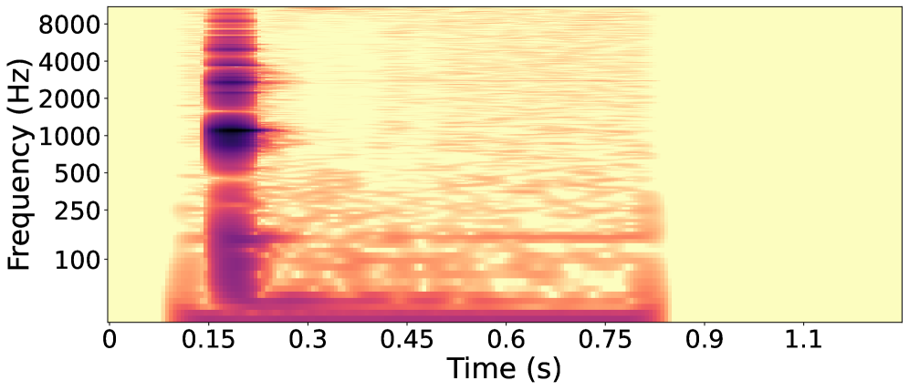
*((a))*

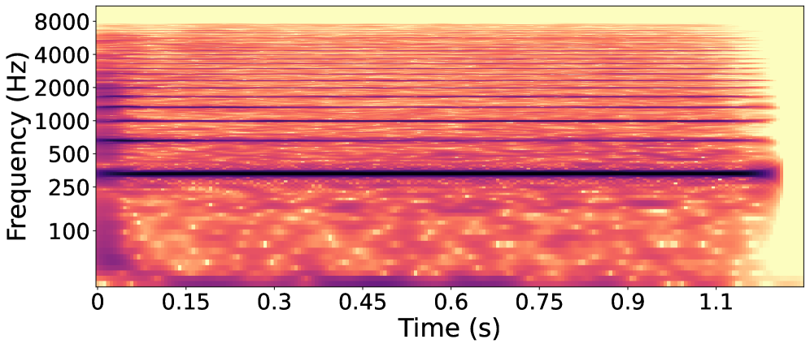
*((b))*

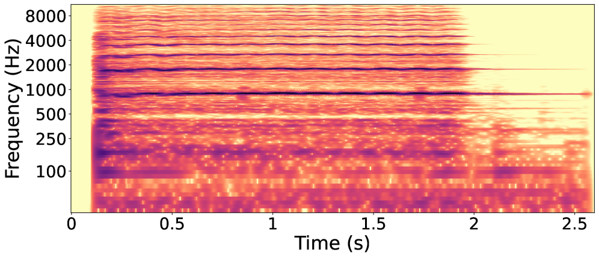
*((a))*

*((a))*

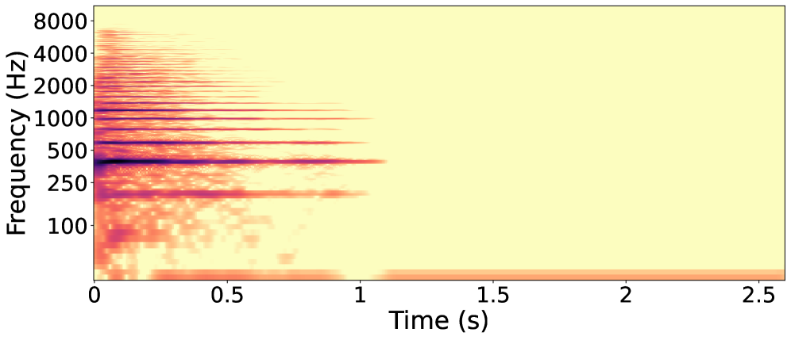
*((b))*

---
**Usage Info**: 1908 tokens used.
**Generated at**: 2026-06-30 14:09:14

---

# 📚 CTC-Seeded Token Edit Refinement for Non-Autoregressive Speech Recognition

🚀 URL: https://arxiv.org/html/2606.28732

## 🌏 Abstract (원문)
Non-autoregressive automatic speech recognition (ASR) enables parallel decoding, but many refinement-based methods begin from random, fully masked, or fixed-length token sequences, requiring multiple iterations to reconstruct the complete transcript. We instead formulate ASR decoding as a variable-length edit refinement of a greedy connectionist temporal classification (CTC) hypothesis. An acoustic-conditioned Edit Flow decoder operates directly on the collapsed CTC hypothesis, predicting insertion, deletion, and substitution operations in parallel. The Edit Flow decoder is jointly trained with a CTC model using a continuous-time discrete diffusion loss. During inference, we find that just two edit steps yield substantial Word Error Rate (WER) reductions, and classifier-free guidance (CFG) further enhances recognition quality by focusing the model on audio features. We also constrain edit proposals using CTC confidence to improve accuracy. Finally, ablation studies validate our design choices, while decoder pretraining and pretrained encoder integration yield significant additional performance gains.
## 🌏 Abstract (번역)
비자기회귀 자동 음성 인식(ASR)은 병렬 디코딩을 가능하게 하지만, 많은 개선 기반 방법들은 무작위, 완전히 마스킹되거나 고정 길이 토큰 시퀀스에서 시작하여 완전한 전사본을 재구성하는 데 여러 반복이 필요합니다. 우리는 대신 ASR 디코딩을 탐욕적인 연결주의 시간 분류(CTC) 가설의 가변 길이 편집 개선으로 공식화합니다. 음향 조건부 Edit Flow 디코더는 축소된 CTC 가설에 직접 작동하여 삽입, 삭제 및 대체 작업을 병렬로 예측합니다. Edit Flow 디코더는 연속 시간 이산 확산 손실을 사용하여 CTC 모델과 공동으로 훈련됩니다. 추론 시, 단 두 번의 편집 단계만으로도 상당한 단어 오류율(WER) 감소를 가져오며, 분류기 없는 안내(CFG)는 모델을 오디오 기능에 집중시켜 인식 품질을 더욱 향상시킨다는 것을 발견했습니다. 또한 정확도를 높이기 위해 CTC 신뢰도를 사용하여 편집 제안을 제한합니다. 마지막으로, 제거 연구는 우리의 설계 선택을 검증하며, 디코더 사전 훈련 및 사전 훈련된 인코더 통합은 상당한 추가 성능 향상을 가져옵니다.

## 🔍 Methods & Results
- ASR 디코딩을 탐욕적인 연결주의 시간 분류(CTC) 가설의 가변 길이 편집 개선으로 공식화했습니다.
- 음향 조건부 Edit Flow 디코더는 축소된 CTC 가설에 직접 작동하여 삽입, 삭제, 대체 작업을 병렬로 예측합니다.
- Edit Flow 디코더는 연속 시간 이산 확산 손실을 사용하여 CTC 모델과 공동으로 훈련됩니다.
- 추론 시, 단 두 번의 편집 단계만으로도 상당한 단어 오류율(WER) 감소를 달성했습니다.
- 분류기 없는 안내(CFG)를 통해 모델을 오디오 기능에 집중시켜 인식 품질을 더욱 향상시켰습니다.
- CTC 신뢰도를 사용하여 편집 제안을 제한함으로써 정확도를 개선했습니다.
- 디코더 사전 훈련 및 사전 훈련된 인코더 통합을 통해 상당한 추가 성능 향상을 얻었습니다.

## 🖼 Figures
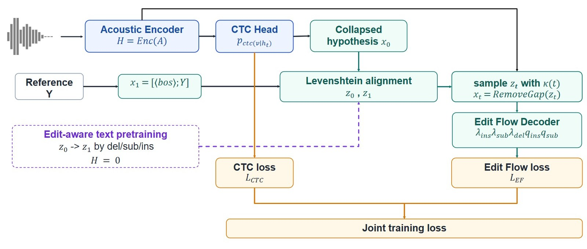
*Figure 1: Overview of the proposed CTC-seeded Edit Flow training procedure.*

---
**Usage Info**: 2050 tokens used.
**Generated at**: 2026-06-30 14:09:22

---

# 📚 How to Leverage Synthetic Speech for LLM-Based ASR Systems?

🚀 URL: https://arxiv.org/html/2606.29031

## 🌏 Abstract (원문)
In regulated domains such as banking and healthcare, where privacy constraints make real speech costly to collect and retain, synthetic speech from modern text-to-speech (TTS) is an appealing alternative for training automatic speech recognition (ASR) without exposing sensitive customer recordings. Yet a persistent distributional gap between synthetic and real data limits how far it can replace genuine recordings. Prior work largely treats this gap as a black box to be engineered around, but in our work, we instead examine its origin directly by probing a SLAM-ASR architecture. Then, we localise where its LLM backbone separates real from synthetic speech and find the discriminative signal concentrated in the early-to-middle layers, where temporal and prosodic perturbations disrupt it most. We further show that representation-level separability, help, but does not directly predict downstream ASR gains. On the other hand, convolving synthetic audio with room impulse responses (RIRs) narrows the gap not by making synthetic speech sound cleaner or more natural, but by reproducing the acoustic irregularities of real recordings. Translating these findings into the training procedure, by adding a layer-selection module combined with RIR augmentation matches a fully real-data baseline using only 25% of the real speech (13.6 h) and surpasses it at all higher proportions.
## 🌏 Abstract (번역)
은행 및 의료와 같이 개인 정보 보호 제약으로 인해 실제 음성 수집 및 보관 비용이 많이 드는 규제 분야에서, 최신 TTS(Text-to-Speech)의 합성 음성은 민감한 고객 녹음을 노출하지 않고 ASR(Automatic Speech Recognition)을 훈련하기 위한 매력적인 대안입니다. 그러나 합성 데이터와 실제 데이터 간의 지속적인 분포적 차이는 실제 녹음을 대체할 수 있는 정도를 제한합니다. 이전 연구는 이 차이를 주로 우회해야 할 블랙박스로 취급했지만, 본 연구에서는 SLAM-ASR 아키텍처를 탐색하여 그 기원을 직접 조사합니다. 그런 다음, LLM 백본이 실제 음성과 합성 음성을 분리하는 위치를 찾아내고, 식별 신호가 초기-중간 레이어에 집중되어 있으며, 시간적 및 운율적 교란이 이를 가장 많이 방해한다는 것을 발견합니다. 우리는 또한 표현 수준의 분리 가능성이 도움이 되지만, 다운스트림 ASR 성능 향상을 직접적으로 예측하지는 않는다는 것을 보여줍니다. 반면에, 합성 오디오를 RIR(Room Impulse Response)과 컨볼루션하는 것은 합성 음성을 더 깨끗하거나 자연스럽게 들리게 함으로써가 아니라 실제 녹음의 음향적 불규칙성을 재현함으로써 차이를 좁힙니다. 이러한 발견을 훈련 절차에 적용하여, 레이어 선택 모듈을 RIR 증강과 결합함으로써 실제 음성(13.6시간)의 25%만을 사용하여 완전한 실제 데이터 기준선과 일치하고, 모든 더 높은 비율에서는 이를 능가합니다.

## 🔍 Methods & Results
- SLAM-ASR 아키텍처를 탐색하여 합성 및 실제 음성 데이터 간의 분포적 차이의 기원을 직접 조사했습니다.
- LLM 백본에서 실제 음성과 합성 음성을 분리하는 식별 신호가 초기-중간 레이어에 집중되어 있으며, 시간적 및 운율적 교란에 의해 가장 많이 방해받는다는 것을 발견했습니다.
- 표현 수준의 분리 가능성이 ASR 성능 향상에 도움이 되지만 직접적으로 예측하지는 않는다는 것을 확인했습니다.
- 합성 오디오에 RIR(Room Impulse Response)을 컨볼루션하여 실제 녹음의 음향적 불규칙성을 재현함으로써 합성-실제 데이터 간의 차이를 좁혔습니다.
- 레이어 선택 모듈과 RIR 증강을 결합한 훈련 절차를 통해 실제 음성 데이터의 25%(13.6시간)만으로 완전한 실제 데이터 기준선과 일치하는 성능을 달성했으며, 더 높은 비율에서는 이를 능가했습니다.

## 🖼 Figures

*(a)*

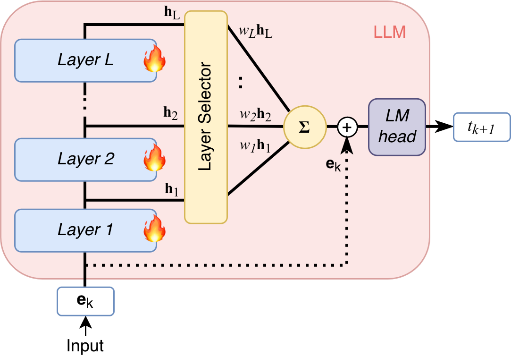
*(a)*

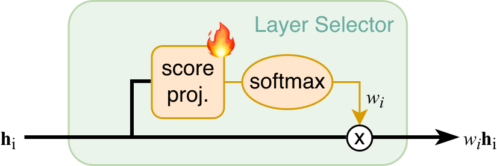
*(b)*

![Figure 2:Within-corpus speaker diversity (pairwise cosine distance between pyannote/embedding [41] vectors; higher = more spread).](../images/2026-06-30/2606.29031/2606.29031_fig3.png)
*Figure 2:Within-corpus speaker diversity (pairwise cosine distance between pyannote/embedding [41] vectors; higher = more spread).*

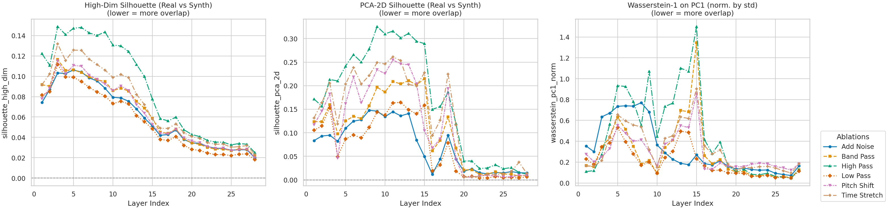
*Figure 3:Layer-wise overlap metrics across all ablation conditions for 28 Llama layers. Lower values indicate greater real/synthetic overlap.*

---
**Usage Info**: 1796 tokens used.
**Generated at**: 2026-06-30 14:09:30

---

# 📚 GigaSpeechBench: A Real-World Multilingual Speech-to-Text Benchmark

🚀 URL: https://arxiv.org/html/2606.28884

## 🌏 Abstract (원문)
While modern ASR systems achieve low error rates on high-resource benchmarks, such performance often overestimates real-world robustness. Existing evaluations address challenges in isolation, lacking a unified benchmark for domain terminology, age variation, dialects, accents, and low-resource languages, particularly across the Middle East and Southeast Asia, representing over one billion under-evaluated speakers. To address this gap, we introduceGigaSpeechBench, a comprehensive multilingual and multidimensional in-the-wild ASR & AST benchmark comprising 680 hours of human-annotated speech. It features five modules: (1) 12 low-resource Middle Eastern and Southeast Asian languages, plus challenging Japanese and Korean; (2) 6 Chinese dialects; (3) 6 English accents; (4) dense terminology across 12 vertical domains for Chinese and English; and (5) older adult and child speech. We further provide human-annotated Chinese and English translations for 11 languages to support AST evaluation. Extensive evaluations of leading foundation models and commercial APIs reveal significant performance degradation in these challenging settings, exposing critical evaluation blind spots.
## 🌏 Abstract (번역)
최신 ASR 시스템은 고자원 벤치마크에서 낮은 오류율을 달성하지만, 이러한 성능은 종종 실제 환경에서의 견고성을 과대평가합니다. 기존 평가는 개별적인 문제에만 초점을 맞춰, 도메인 용어, 연령대별 차이, 방언, 억양, 그리고 저자원 언어(특히 중동 및 동남아시아 지역으로, 10억 명 이상의 평가 부족 화자를 대표함)에 대한 통합된 벤치마크가 부족합니다. 이러한 격차를 해소하기 위해, 우리는 680시간의 사람이 주석을 단 음성으로 구성된 포괄적인 다국어 및 다차원 실제 환경 ASR 및 AST 벤치마크인 GigaSpeechBench를 소개합니다. 이 벤치마크는 다섯 가지 모듈을 특징으로 합니다: (1) 12개의 저자원 중동 및 동남아시아 언어와 도전적인 일본어 및 한국어; (2) 6개의 중국어 방언; (3) 6개의 영어 억양; (4) 중국어 및 영어를 위한 12개 수직 도메인에 걸친 밀도 높은 용어; 그리고 (5) 노년층 및 아동 음성. 또한, AST 평가를 지원하기 위해 11개 언어에 대한 사람이 주석을 단 중국어 및 영어 번역을 제공합니다. 선도적인 기반 모델과 상용 API에 대한 광범위한 평가는 이러한 도전적인 환경에서 상당한 성능 저하를 드러내며, 중요한 평가 사각지대를 노출합니다.

## 🔍 Methods & Results
- GigaSpeechBench는 680시간 분량의 사람이 주석을 단 음성으로 구성된 포괄적인 다국어 및 다차원 실제 환경 ASR 및 AST 벤치마크로 도입되었습니다.
- 벤치마크는 다음 다섯 가지 모듈을 포함합니다: 12개 저자원 언어(중동 및 동남아시아, 일본어, 한국어 포함), 6개 중국어 방언, 6개 영어 억양, 12개 수직 도메인에 걸친 중국어 및 영어 용어, 그리고 노년층 및 아동 음성.
- AST 평가를 위해 11개 언어에 대한 사람이 주석을 단 중국어 및 영어 번역이 추가로 제공됩니다.
- 선도적인 기반 모델과 상용 API에 대한 광범위한 평가 결과, 이러한 도전적인 설정에서 상당한 성능 저하가 확인되었습니다.
- GigaSpeechBench를 통한 평가는 기존 ASR/AST 시스템의 중요한 평가 사각지대를 노출했습니다.

## 🖼 Figures
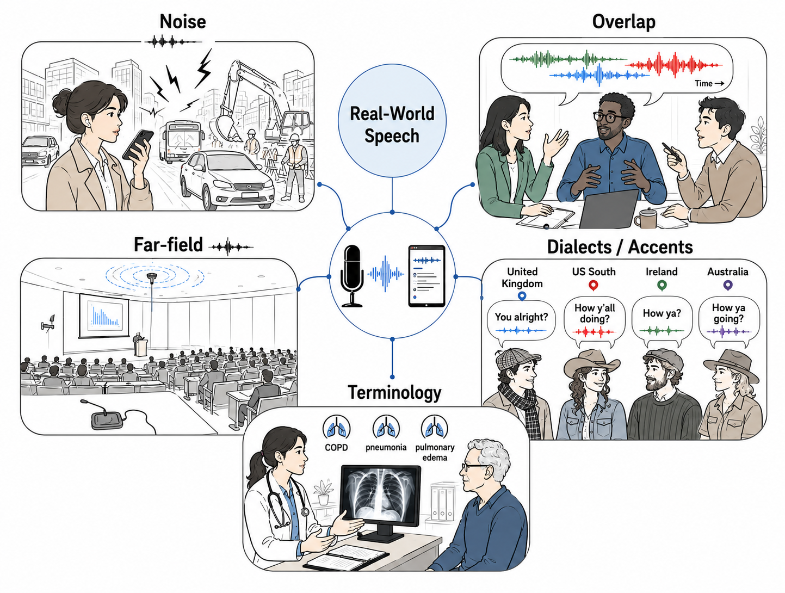
*Figure 1: Real-world speech presents diverse acoustic, linguistic, and lexical challenges, ranging from noise, speaker overlap, and far-field recordings to dialects, accents, and domain-specific terminology.*

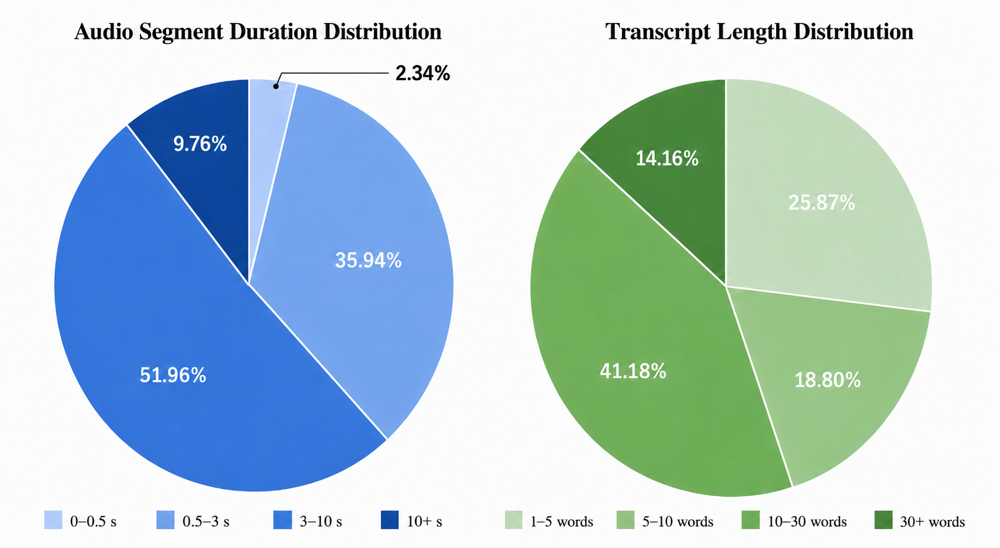
*Figure 2: Distribution of audio segment duration and transcript length.*

---
**Usage Info**: 1694 tokens used.
**Generated at**: 2026-06-30 14:09:38

---

# 📚 OLIVE: View-Augmented Latent Prediction with Waveform Reconstruction for Speech SSL

🚀 URL: https://arxiv.org/html/2606.30356

## 🌏 Abstract (원문)
We proposeOnlineLatent prediction withInvariantViews and rEconstruction (OLIVE), a self-supervised speech representation learning framework that jointly optimizes analysis and synthesis objectives. OLIVE combines view-augmented masked latent prediction with waveform reconstruction under a unified objective. Reconstruction constrains early encoder features to retain signal-level information, while masked latent prediction shapes later contextual representations toward invariance for robust downstream performance. We show that these objectives enable representations that support a broad range of tasks. In particular, OLIVE improves results on generation and speaker tasks, maintains competitive performance on recognition and semantic tasks, and improves waveform reconstruction.
## 🌏 Abstract (번역)
저희는 분석 및 합성 목표를 공동으로 최적화하는 자기 지도 음성 표현 학습 프레임워크인 OLIVE(OnlineLatent prediction withInvariantViews and rEconstruction)를 제안합니다. OLIVE는 뷰 증강 마스크된 잠재 예측과 파형 재구성을 통합된 목표 아래 결합합니다. 재구성은 초기 인코더 특징이 신호 수준 정보를 유지하도록 제약하는 반면, 마스크된 잠재 예측은 견고한 다운스트림 성능을 위해 후기 문맥 표현을 불변성 방향으로 형성합니다. 이러한 목표들이 광범위한 작업을 지원하는 표현을 가능하게 함을 보여줍니다. 특히, OLIVE는 생성 및 화자 작업에서 결과를 개선하고, 인식 및 의미론적 작업에서 경쟁력 있는 성능을 유지하며, 파형 재구성을 향상시킵니다.

## 🔍 Methods & Results
- OLIVE는 분석(analysis)과 합성(synthesis)이라는 두 가지 자기 지도 학습 작업을 공동으로 해결하여 음성 표현을 학습합니다.
- 분석 작업은 인코더가 증강으로 인한 가변성에 불변하는 문맥 표현을 생성하도록 유도하며, data2vec 2.0의 교사-학생 마스크 예측 목표를 따르고, 학생 및 교사 뷰에 대해 독립적으로 샘플링된 파형 증강을 추가합니다.
- 학생은 마스크된 뷰를 처리하고 교사는 마스크되지 않은 뷰를 처리하며, 학생은 마스크된 위치에서 교사가 제공하는 문맥 잠재 목표를 평균 제곱 오차(MSE)로 예측하도록 훈련됩니다.
- 교사 매개변수는 학생 매개변수의 지수 이동 평균(EMA)으로 업데이트되며, 교사 목표는 상위 K개 교사 레이어 출력을 인스턴스 정규화하고 평균하여 구성됩니다.
- 합성 작업은 중간 인코더 특징이 파형 재구성에 관련된 음향 정보를 보존하도록 유도하며, HiFi-GAN vocoder 아키텍처를 따르는 신경 보코더를 사용하여 중간 인코더 특징으로부터 파형을 재구성합니다.
- 보코더는 멜-스펙트로그램 조건화 대신 학습된 OLIVE 인코더 표현을 사용하며, 다중 주기 판별자(MPD)와 다중 스케일 판별자(MSD)를 포함하는 적대적 구성 요소를 사용합니다.
- 합성 목표는 멜-스펙트로그램 재구성 손실, 적대적 손실, 그리고 특징 매칭 손실을 결합합니다.
- 최종 목표는 불변 표현 학습(분석)과 파형 재구성(합성)의 균형을 맞추며, 학생 인코더, 예측 헤드, 생성자를 업데이트하고, 교사는 EMA로, 판별자 매개변수는 별도로 업데이트됩니다.
- 분석 브랜치는 불변 문맥 예측 신호를 제공하고, 합성 브랜치는 초기 인코더 특징을 제약하는 파형 수준 재구성 신호를 제공하여 후기 문맥 표현은 주로 분석 목표에 의해 형성됩니다.

## 🖼 Figures

*Figure 1: OLIVE pre-training framework. Two independently augmented waveform views are passed through a shared local feature extractor. The analysis branch performs view-augmented masked distillation: the student predicts contextual teacher targets from masked input features. The synthesis branch performs waveform reconstruction by conditioning a neural vocoder on the local student features. The final objective combines the analysis loss with a weighted synthesis loss.*

*Figure 3:Representative SUPERB layer-combination weights. Automatic speech recognition (ASR) and slot filling (SF) emphasize later contextual layers, while automatic speaker verification (ASV) and speech enhancement (SE) place more weight on earlier layers.*

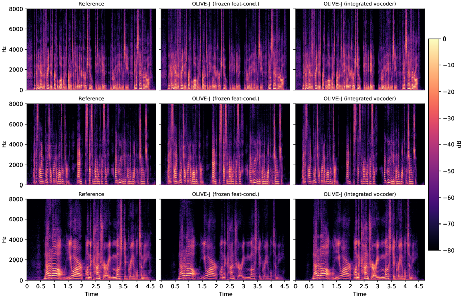
*Figure 4:Spectrograms for three reference utterances and reconstructions from the frozen feature-conditioned OLIVE-J vocoder and the integrated OLIVE-J vocoder.*

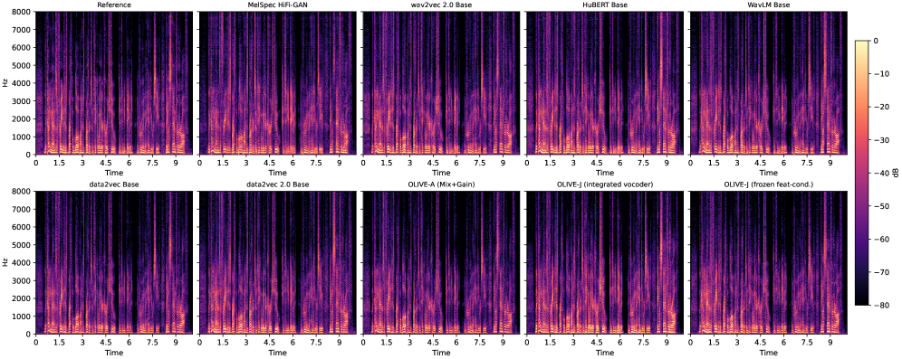
*Figure 5:Spectrograms for one reference utterance and reconstructions from HiFi-GAN V2 vocoders conditioned on local features from the baseline and OLIVE models.*

---
**Usage Info**: 2788 tokens used.
**Generated at**: 2026-06-30 14:09:45

---

# 📚 MeloDISinger: Melody-Aware & Duration-Preserving Singing Voice Editing with Audio Infilling

🚀 URL: https://arxiv.org/html/2606.30580

## 🌏 Abstract (원문)
Text-based singing voice editing (SVE) aims to revise sung lyrics while preserving the original melody, total duration, and non-edited regions. In this paper, we propose MeloDISinger, a flow-matching-based SVE model for melody-aware and duration-preserving editing. Its core module, MeloDRP, predicts fixed-budget duration ratios, enabling explicit span-wise duration control. For melody-aware duration allocation, MeloDRP fuses phonetic cues with pseudo-MIDI melodic context through cross-attention, while temporal-overlap supervision encourages soft phoneme–note correspondences. We further use a flow-matching mel decoder for audio infilling to synthesize edited regions while preserving surrounding context. In addition, we introduce a duration-aware edited-lyric generation pipeline using WhisperX and an LLM to construct feasible evaluation scenarios. Experiments demonstrate state-of-the-art performance in both objective and subjective evaluations.
## 🌏 Abstract (번역)
텍스트 기반 노래 음성 편집(SVE)은 원본 멜로디, 총 길이, 편집되지 않은 영역을 보존하면서 노래 가사를 수정하는 것을 목표로 합니다. 본 논문에서는 멜로디 인식 및 길이 보존 편집을 위한 플로우 매칭 기반 SVE 모델인 MeloDISinger를 제안합니다. 핵심 모듈인 MeloDRP는 고정 예산 길이 비율을 예측하여 명시적인 스팬별 길이 제어를 가능하게 합니다. 멜로디 인식 길이 할당을 위해 MeloDRP는 음성 단서와 의사-MIDI 멜로디 컨텍스트를 교차 어텐션을 통해 융합하며, 시간적 중첩 감독은 부드러운 음소-음표 대응을 유도합니다. 또한, 주변 컨텍스트를 보존하면서 편집된 영역을 합성하기 위해 오디오 인필링을 위한 플로우 매칭 멜 디코더를 사용합니다. 더불어, 실현 가능한 평가 시나리오를 구축하기 위해 WhisperX와 LLM을 활용한 길이 인식 편집 가사 생성 파이프라인을 소개합니다. 실험 결과는 객관적 및 주관적 평가 모두에서 최첨단 성능을 보여줍니다.

## 🔍 Methods & Results
- MeloDISinger는 피처 추출, 파싱 작업, 모델링의 세 단계 파이프라인을 따르며, 멜 스펙트로그램, 화자 임베딩, F0, 의사 스코어 등의 음향 피처와 음소 길이, 음소 유형 등의 언어 피처를 추출합니다.
- 핵심 모듈인 MeloDRP(Melody-aware Duration Ratio Predictor)는 고정된 총 길이 예산 내에서 스팬별 길이 재할당을 통해 편집된 음소 길이를 예측합니다. 이는 각 편집 스팬의 길이를 보존하며, 음성 단서와 의사-MIDI 멜로디 표현을 교차 어텐션을 통해 융합하여 멜로디 인식 길이 예측을 가능하게 합니다.
- MeloDRP는 음성 단서, 시작 단서, 음표 타이밍, 길이 비율 손실 및 음소-음표 시간적 중첩에 기반한 가이드 어텐션 손실을 통해 부드러운 음소-음표 대응을 학습합니다.
- 편집된 멜 스펙트로그램 생성을 위해 오디오 인필링 방식을 채택한 비자기회귀 조건부 플로우 매칭 멜 디코더를 사용합니다. 이는 편집 경계에서 매끄러운 전환을 가능하게 하고 편집되지 않은 주변 컨텍스트를 보존합니다.
- 평가를 위해 길이 인식 편집 가사 생성 파이프라인을 제안합니다. WhisperX로 단어 수준의 시작 및 종료 시간을 추정하고, 이를 음절 용량으로 변환한 후, LLM(Gemini-2.5-flash)에 제공하여 시간적으로 실현 가능한 편집 가사를 생성합니다.
- 실험 결과, MeloDISinger는 객관적 및 주관적 평가 모두에서 최첨단 성능을 달성했습니다.

## 🖼 Figures
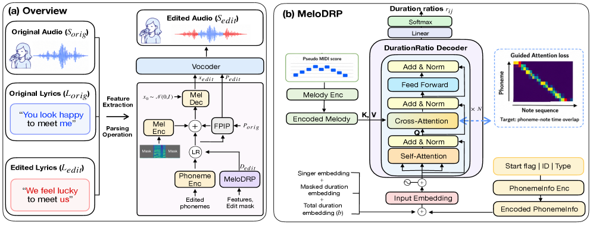
*Figure 1:Overview of MeloDISinger: (a) overall text-based SVE pipeline and (b) MeloDRP architecture for melody-aware duration-ratio prediction.*

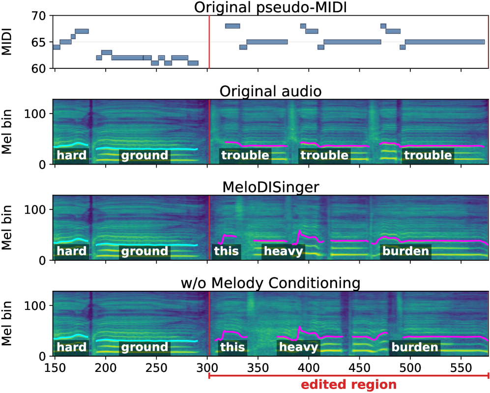
*Figure 2:Qualitative effect of melody conditioning.*

---
**Usage Info**: 4972 tokens used.
**Generated at**: 2026-06-30 14:09:57

---

# 📚 LeVo 2: Stable and Melodious Song Generation via Hierarchical Representation Modeling and Progressive Post-Training

🚀 URL: https://arxiv.org/html/2606.30642

## 🌏 Abstract (원문)
Full-length song generation must preserve coherence and musicality, render detailed vocal and accompaniment acoustics, and follow lyrics and prompts. Existing language model-based systems face a structural trade-off: mixed-token modeling preserves vocal-instrument coordination but obscures track-specific details, whereas dual-track prediction improves acoustics but requires longer sequences and weakens global planning. We present LeVo 2, a hybrid LLM-Diffusion framework for controllable full-length song generation. LeVo 2 formulates this trade-off as hierarchical modeling: LeLM first predicts mixed tokens for semantic planning, then predicts vocal and accompaniment tokens in parallel for track-specific refinement, while a diffusion-based Music Codec reconstructs full-length waveforms. A central contribution of this extended version is an aesthetics-guided training schedule for alignment. During pre-training, an automated music aesthetic evaluation framework assigns musicality-tier conditions to large-scale data, providing musicality priors before preference alignment. Progressive post-training applies SFT, large-scale offline DPO, and closed-loop semi-online DPO to separately improve generation quality, controllability, and musicality. Modular extension then trains the Track-Specific LM for acoustic refinement while preserving the aligned semantic planner. This schedule separates musicality learning, controllability alignment, and acoustic refinement, mitigating optimization conflict and the limitations of static offline preference pairs. Expert listening tests and objective evaluations show that LeVo 2 outperforms open-source baselines across six subjective dimensions, and approaches leading commercial systems on several listening metrics. Ablations validate the effects of the training strategy, aesthetics guidance, scaling, and hierarchical architecture.
## 🌏 Abstract (번역)
전체 길이의 노래 생성은 일관성과 음악성을 유지하고, 상세한 보컬 및 반주 음향을 구현하며, 가사와 프롬프트를 따라야 합니다. 기존 언어 모델 기반 시스템은 구조적 절충에 직면합니다. 혼합 토큰 모델링은 보컬-악기 조화를 유지하지만 트랙별 세부 사항을 모호하게 하는 반면, 듀얼 트랙 예측은 음향을 개선하지만 더 긴 시퀀스를 필요로 하고 전역 계획을 약화시킵니다. 우리는 제어 가능한 전체 길이 노래 생성을 위한 하이브리드 LLM-확산 프레임워크인 LeVo 2를 제시합니다. LeVo 2는 이러한 절충을 계층적 모델링으로 공식화합니다. LeLM은 먼저 의미론적 계획을 위해 혼합 토큰을 예측한 다음, 트랙별 정제를 위해 보컬 및 반주 토큰을 병렬로 예측하고, 확산 기반 음악 코덱은 전체 길이 파형을 재구성합니다. 이 확장 버전의 핵심 기여는 정렬을 위한 미학 기반 훈련 스케줄입니다. 사전 훈련 동안, 자동화된 음악 미학 평가 프레임워크는 대규모 데이터에 음악성 등급 조건을 할당하여 선호도 정렬 전에 음악성 사전 지식을 제공합니다. 점진적 후속 훈련은 SFT, 대규모 오프라인 DPO, 폐쇄 루프 준온라인 DPO를 적용하여 생성 품질, 제어 가능성 및 음악성을 개별적으로 개선합니다. 모듈식 확장은 정렬된 의미론적 플래너를 보존하면서 음향 정제를 위한 트랙별 LM을 훈련합니다. 이 스케줄은 음악성 학습, 제어 가능성 정렬 및 음향 정제를 분리하여 최적화 충돌과 정적 오프라인 선호도 쌍의 한계를 완화합니다. 전문가 청취 테스트 및 객관적 평가는 LeVo 2가 6가지 주관적 차원에서 오픈 소스 기준선을 능가하고 여러 청취 지표에서 선도적인 상업 시스템에 근접함을 보여줍니다. 어블레이션(Ablation) 연구는 훈련 전략, 미학적 지침, 스케일링 및 계층적 아키텍처의 효과를 검증합니다.

## 🔍 Methods & Results
- LeVo 2는 LeLM(의미론적 계획)과 확산 기반 Music Codec(고음질 렌더링)으로 구성된 하이브리드 LLM-Diffusion 아키텍처를 사용한다.
- Music Codec 인코더는 노래 오디오를 혼합 토큰(Sm), 보컬 토큰(Sv), 반주 토큰(Sa)으로 이산화한다.
- LeLM은 계층적 아키텍처를 가지며, Mixed Semantic LM과 Track-Specific LM으로 구성된다.
- Mixed Semantic LM은 디코더 전용 Transformer로, 전역 의미론적 플래너 역할을 하며 혼합 토큰을 예측하여 멜로디, 리듬, 템포와 같은 고수준 구조 정보를 제공하고 보컬-악기 조화를 보장한다.
- Track-Specific LM은 Mixed Semantic LM의 은닉 상태에 조건화되어 보컬 토큰(Sv)과 반주 토큰(Sa)을 병렬로 예측하여 음향 세부 사항을 정제하며, 지연 패턴 메커니즘을 도입한다.
- Music Codec은 MuCodec을 기반으로 하며, MuEncoder와 특수 Vector Quantizer(VQ)로 구성된 인코더와 확산 Transformer 및 VAE 디코더로 구성된 디코더를 포함한다.
- Codec은 혼합 오디오에서 혼합 토큰을 추출하고, 사전 훈련된 음악 분리 모델을 사용하여 분리된 보컬 및 반주 트랙에서 듀얼 트랙 토큰을 추출하여 계층적 모델링을 지원한다.
- Music Codec 훈련은 VAE 사전 훈련(48kHz 오디오를 25Hz 프레임 속도의 64차원 잠재 공간으로 압축)과 VQ 모듈 및 디코더의 공동 훈련(토큰 이산화 및 VAE 잠재 재구성)의 2단계로 진행된다.
- LeLM 아키텍처의 성능 향상을 위해 미학 기반 3단계 훈련 패러다임(사전 훈련, 점진적 후속 훈련, 모듈식 확장)을 제안한다.
- 자동화된 음악 미학 평가 프레임워크는 MuQ 모델에서 추출된 표현을 활용하여 보컬/반주 음질, 멜로디, 구조, 편곡, 믹싱, 음악성 등 여러 성능 지표를 예측하며, 인간 전문가 평가와 높은 상관관계를 보인다.
- 1단계 사전 훈련에서는 Mixed Semantic LM을 대규모 음악 데이터로 훈련하여 다양한 조건 입력과 혼합 토큰 간의 양식을 정렬하고, 미학 프레임워크로 평가된 '음악성 등급 태그'를 조건으로 주입하여 음악성 사전 지식을 학습시킨다.
- 2단계 점진적 후속 훈련에서는 Mixed Semantic LM을 인간 선호도에 정렬한다. SFT(Supervised Fine-Tuning)는 최고 음악성 등급(상위 0.5%)의 노래를 사용하여 고품질 생성 기준선을 확립한다.
- 대규모 오프라인 DPO(Direct Preference Optimization)는 150,000개의 가사로 8개의 후보 샘플을 생성하고, 가사 정렬(ASR 및 편집 거리), 프롬프트 일관성(MuQ-MuLan), 미학 점수를 평가하여 제어 가능성을 개선하고 가사 환각을 줄인다.
- 폐쇄 루프 준온라인 DPO는 주기적으로 업데이트되는 생성기 모델을 사용하여 160,000개의 새로운 가사로 10개의 후보 샘플을 동적으로 샘플링하고, 음악성 점수 차이(0.2 이상)를 기준으로 선호도 쌍을 구성하여 예술적 표현력과 음악성을 개선한다.
- 3단계 모듈식 확장에서는 Mixed Semantic LM의 가중치를 고정하고 Track-Specific LM만 훈련하여 듀얼 트랙 토큰을 모델링하며, 음향 증강 전략(저품질 오디오에서 혼합 토큰 추출)을 통해 미세한 음향 뉘앙스 복구를 학습시킨다.
- 전문가 청취 테스트와 객관적 평가는 LeVo 2가 6가지 주관적 차원에서 오픈 소스 기준선을 능가하고, 여러 청취 지표에서 선도적인 상업 시스템에 근접함을 보여준다.
- 어블레이션 연구를 통해 훈련 전략, 미학적 지침, 스케일링 및 계층적 아키텍처의 효과가 검증되었다.

## 🖼 Figures
![Figure 1:Overview of LeVo 2. LeLM performs hierarchical semantic planning over mixed and dual-track tokens, while the diffusion-based Music Codec reconstructs the generated tokens into full-length song audio. The bottom panel summarizes the training paradigm: pre-training establishes global semantic planning, decoupled progressive post-training improves controllability and musicality through SFT, large-scale offline DPO, and closed-loop semi-online DPO, and modular extension refines track-specific acoustics.](../images/2026-06-30/2606.30642/2606.30642_fig0.png)
*Figure 1:Overview of LeVo 2. LeLM performs hierarchical semantic planning over mixed and dual-track tokens, while the diffusion-based Music Codec reconstructs the generated tokens into full-length song audio. The bottom panel summarizes the training paradigm: pre-training establishes global semantic planning, decoupled progressive post-training improves controllability and musicality through SFT, large-scale offline DPO, and closed-loop semi-online DPO, and modular extension refines track-specific acoustics.*

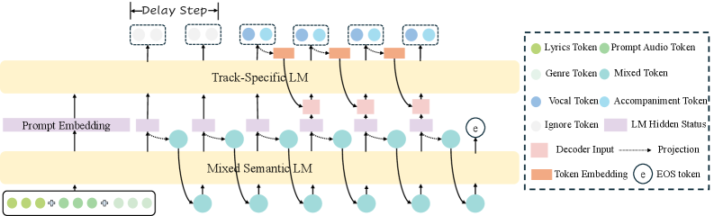
*Figure 2: The architecture of LeLM, which consists of a Mixed Semantic LM for global semantic modeling and a Track-Specific LM for parallel track refinement.*

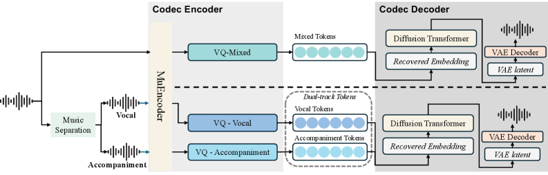
*Figure 3: The framework of the Music Codec in LeVo 2.*

---
**Usage Info**: 7180 tokens used.
**Generated at**: 2026-06-30 14:10:12

---

