# 🚩 (2026-07-04) Scholar Inbox 추천 논문 

# 📚 An Efficient vLLM-Based Inference Pipeline for Unified Audio Understanding and Generation

🚀 URL: https://arxiv.org/html/2607.02119

## 🌏 Abstract (원문)
While Large Multimodal Models excel in comprehension, high-throughput inference engines lack native support for multimodal generation. This is severe in Speech Language Models, where generating multi-layered audio tokens via decoupled AR+NAR or synchronous Multi-Token Prediction (MTP) with delay-pattern interleaving conflicts with standard single-stream loops. We present a vLLM-based inference pipeline for unified speech understanding and generation. We extend autoregressive decoding to natively execute delay-pattern de-interleaving and coordinated multi-stream sampling, integrating an on-GPU acoustic decoder for end-to-end waveform synthesis. Crucially, we overcome the shared intuition that Classifier-Free Guidance (CFG) halves throughput. By co-scheduling paired conditional and unconditional requests within a continuous batch, our CFG implementation sustains 80% of non-CFG throughput, absorbing dual-request and logit merging overheads. We open-source our framework111https://github.com/whr-a/vllm/tree/opuslm.
## 🌏 Abstract (번역)
대규모 멀티모달 모델은 이해 능력에서 뛰어나지만, 고처리량 추론 엔진은 멀티모달 생성에 대한 기본 지원이 부족합니다. 이는 음성 언어 모델에서 특히 심각한데, 분리된 AR+NAR 또는 지연 패턴 인터리빙을 사용하는 동기식 멀티 토큰 예측(MTP)을 통해 다층 오디오 토큰을 생성하는 것이 표준 단일 스트림 루프와 충돌하기 때문입니다. 본 논문에서는 통합된 음성 이해 및 생성을 위한 vLLM 기반 추론 파이프라인을 제시합니다. 우리는 지연 패턴 디인터리빙 및 조정된 멀티 스트림 샘플링을 기본적으로 실행하도록 자기회귀 디코딩을 확장하고, 종단 간 파형 합성을 위해 온-GPU 음향 디코더를 통합합니다. 결정적으로, Classifier-Free Guidance(CFG)가 처리량을 절반으로 줄인다는 일반적인 직관을 극복합니다. 연속 배치 내에서 조건부 및 무조건부 요청 쌍을 공동 스케줄링함으로써, 우리의 CFG 구현은 이중 요청 및 로짓 병합 오버헤드를 흡수하며 비-CFG 처리량의 80%를 유지합니다. 우리는 프레임워크를 오픈 소스로 공개합니다.

## 🔍 Methods & Results
- 기존 토큰 수준 연속 배치 엔진 내에서 통합 오디오 이해 및 생성을 위한 고처리량 추론 프레임워크를 제시하며, delay-pattern SpeechLM 아키텍처를 목표로 한다.
- LLM은 텍스트 및 오디오 하위 어휘로 분할된 통합 어휘를 사용하여 멀티 토큰 예측을 수행하며, 병렬 코드북 헤드가 은닉 상태를 투영하여 로짓과 토큰을 생성한다.
- delay-pattern에 따라 각 스트림이 오프셋되며, 생성 후 S x T 코드북 행렬은 디인터리브되어 온-GPU 음향 디코더로 전달되어 파형 합성을 수행한다.
- 기존 단일 스트림 LLM 엔진의 제약을 해결하기 위해, 하나의 코드북 스트림을 '기본'으로 지정하고 나머지 S-1개 '보조' 스트림은 모델 내부에서 샘플링하여 엔진에는 단일 토큰 LM처럼 보이게 하는 '기본-보조 분해' 방식을 도입했다.
- 요청 완료 시 버퍼링된 행렬은 디인터리브되어 온-GPU 음향 디코더로 전달되어 파형 합성이 직접 수행된다.
- 혼합 양식 출력을 관리하기 위해 동적 어휘 마스킹을 통해 텍스트, 전환, 오디오, 드레인 하위 단계로 구성된 요청별 '단계 상태 머신'을 구현했다.
- Classifier-Free Guidance (CFG)의 처리량 저하 문제를 해결하기 위해 '쌍 요청 공동 스케줄링'을 도입하여 조건부 및 무조건부 요청을 단일 원자 스케줄링 단위로 처리하고, 동일한 연속 배치에서 공동 스케줄링하며 단일 순방향 패스를 공유한다.
- CFG 병합은 오디오 단계에서만 수행되며, 병합된 분포에서 샘플링된 토큰은 다음 단계를 위해 동기적으로 동반 요청에 추가된다.
- 이 CFG 구현은 비-CFG 처리량의 80%를 유지하여, 이중 요청 및 로짓 병합 오버헤드를 흡수함으로써 CFG가 성능을 절반으로 줄인다는 통념을 극복했다.
- 본 프레임워크는 오픈 소스로 공개되었다.

## 🖼 Figures

*Figure 1:Speech language model architecture. The unified autoregressive transformer processes encoded audio and text. During audio generation, hidden states 
ℎ
𝑡
 and stream embeddings 
𝑒
𝑖
 (where 
1
≤
𝑖
≤
𝑆
) are projected via 
𝑆
 codebook heads into parallel delayed streams, which are subsequently de-interleaved for acoustic decoding.*

*Figure 2:Unified serving framework for SpeechLMs. (Left) Overall pipeline: The engine manages continuous batching, primary-auxiliary token generation, and fused on-GPU acoustic decoding for mixed-modality streaming. (Right) Paired co-scheduling for CFG: Conditional and unconditional requests share a batched forward pass, merging logits before sampling and synchronizing the sampled token for the next step.*

---
**Usage Info**: 4344 tokens used.
**Generated at**: 2026-07-04 15:03:39

---

# 📚 Enhancing Acoustic-to-Articulatory Inversion with Multi-Target Pretraining for Low-Resource Settings

🚀 URL: https://arxiv.org/html/2607.01594

## 🌏 Abstract (원문)
Acoustic-to-Articulatory Inversion (AAI) estimates vocal tract articulator movements from speech, benefiting tasks like ASR, speech synthesis, and speaker verification. While deep learning-based methods (CNNs, RNNs, Transformers) have advanced AAI, recent studies show that Self-Supervised Learning (SSL) features further enhance performance, particularly in low-resource settings. However, SSL feature extractors introduce inference latency and computational overhead. To address this, we propose a novel pretraining method leveraging three target representations—Phoneme Labels, Articulatory Feature Labels, and Critical-articulator Labels—eliminating the need for an SSL extractor during inference. We evaluate our approach against both baseline and SSL-based models across various data conditions. Results demonstrate that our method consistently improves AAI performance, particularly in low-resource scenarios, while significantly reducing inference costs without sacrificing accuracy.
## 🌏 Abstract (번역)
음향-조음 반전(AAI)은 음성으로부터 성도 조음기관 움직임을 추정하며, ASR, 음성 합성, 화자 검증과 같은 작업에 이점을 제공합니다. 딥러닝 기반 방법(CNN, RNN, Transformer)이 AAI를 발전시켰지만, 최근 연구들은 자기지도학습(SSL) 특징이 특히 저자원 환경에서 성능을 더욱 향상시킨다는 것을 보여줍니다. 그러나 SSL 특징 추출기는 추론 지연 시간과 계산 오버헤드를 발생시킵니다. 이를 해결하기 위해, 우리는 추론 시 SSL 추출기가 필요 없는 세 가지 목표 표현—음소 레이블, 조음 특징 레이블, 핵심 조음기관 레이블—을 활용하는 새로운 사전 학습 방법을 제안합니다. 우리는 다양한 데이터 조건에서 우리의 접근 방식을 기준 모델 및 SSL 기반 모델과 비교 평가합니다. 결과는 우리의 방법이 특히 저자원 시나리오에서 AAI 성능을 지속적으로 향상시키면서 정확도를 희생하지 않고 추론 비용을 크게 줄임을 보여줍니다.

## 🔍 Methods & Results
- 음향-조음 반전(AAI)을 위한 새로운 사전 학습 방법을 연구했으며, 추론 시 SSL 추출기 필요성을 없애고 계산 오버헤드를 줄이기 위해 세 가지 목표 표현을 활용했습니다.
- 세 가지 사전 학습 목표는 다음과 같습니다: 1) 음소 레이블: 교차 엔트로피 손실을 사용한 프레임 정렬 음소 분류. 2) 조음 특징 레이블: IPA 차트에서 파생된 네 가지 조음 속성(위치, 방식, 높이, 후방성) 예측, 교차 엔트로피 손실 사용. 3) 핵심 조음기관 레이블: 특정 음소에 대한 핵심 조음기관을 나타내는 12차원 이진 벡터 예측, 이진 교차 엔트로피 손실 및 손실 마스킹 사용.
- 사전 학습 후, 모델의 출력 레이어는 AAI 작업을 위한 EMA 궤적을 예측하는 12차원 선형 레이어로 교체되었습니다.
- 모델 아키텍처는 비자기회귀 트랜스포머 기반 신경망을 채택했습니다.
- 실험 결과, 제안된 방법은 특히 저자원 환경에서 AAI 성능을 지속적으로 향상시켰으며, 정확도 손실 없이 추론 비용을 크게 절감했습니다.

---
**Usage Info**: 2769 tokens used.
**Generated at**: 2026-07-04 15:03:49

---

# 📚 SPARCLE: SPeaker-aware Aligned Representations via Contrastive Language Embeddings

🚀 URL: https://arxiv.org/html/2607.01238

## 🌏 Abstract (원문)
Recent advances in speech synthesis have shifted from phoneme representations to direct grapheme modeling. While phonemes address the one-to-many mapping between text and acoustics, they rely on grapheme-to-phoneme (G2P) systems that fail to capture speaker-specific acoustic variation. Prior work demonstrates that grapheme-based models outperform phoneme-based systems at scale, but not in low-resource settings. In this paper, we propose SPARCLE, a speaker-aware grapheme representation model that enriches characters with their precise acoustic realizations. SPARCLE is trained with a contrastive objective to align graphemes with corresponding Wav2Vec2 acoustic representations while conditioned on speaker identity. The resulting model serves as a replacement to G2P systems for downstream text-to-speech (TTS) tasks. We demonstrate that SPARCLE improves generation quality, reducing word error rates by half in extreme low-resource settings compared to standard grapheme-based models.
## 🌏 Abstract (번역)
음성 합성의 최근 발전은 음소 표현에서 직접적인 문자소 모델링으로 전환되었습니다. 음소는 텍스트와 음향 간의 일대다 매핑을 처리하지만, 화자별 음향 변이를 포착하지 못하는 문자소-음소(G2P) 시스템에 의존합니다. 이전 연구에서는 문자소 기반 모델이 대규모 환경에서는 음소 기반 시스템보다 우수하지만, 저자원 환경에서는 그렇지 않음을 보여줍니다. 이 논문에서 우리는 문자를 정확한 음향 실현으로 풍부하게 하는 화자 인식 문자소 표현 모델인 SPARCLE을 제안합니다. SPARCLE은 화자 정체성에 따라 조건화되면서 문자소를 해당 Wav2Vec2 음향 표현과 정렬하기 위한 대조 목표로 훈련됩니다. 결과 모델은 다운스트림 텍스트-음성 변환(TTS) 작업을 위한 G2P 시스템을 대체합니다. 우리는 SPARCLE이 표준 문자소 기반 모델과 비교하여 극심한 저자원 환경에서 단어 오류율을 절반으로 줄여 생성 품질을 향상시킨다는 것을 입증합니다.

## 🔍 Methods & Results
- SPARCLE은 TTS 시스템에서 발음 모호성 및 G2P 시스템의 방언 특이성 문제를 해결하기 위해, 명시적인 음소 주석 없이 문맥에 민감한 발음 패턴을 학습하도록 대조 사전 훈련을 통해 문자 수준 모델에 음향 정보를 직접 주입한다.
- 음향 임베딩 추출을 위해 Wav2Vec2 모델을 활용했으며, 각 문자에 해당하는 음향 임베딩을 얻기 위해 Librispeech-960h 데이터셋에서 전사본을 오디오에 강제 정렬했다.
- 화자 인식 모델을 위해 FaCodec 팀브르 임베딩을 채택하여 화자 정체성을 포착하며, 이는 사전 훈련되고 화자 불가지론적이며 새로운 화자에 대한 강력한 조건화를 가능하게 한다.
- 문자 변환기는 표준 인코더 스타일 변환기로, 문자 임베딩에 1D 컨볼루션(커널 크기 3)을 적용하여 지역적 문맥을 모델링하고, 화자 임베딩을 문자 임베딩 앞에 추가하여 화자 정체성에 따라 모델을 조건화한다.
- 문자 임베딩과 해당 음향 임베딩을 정렬하기 위해 대조 학습을 활용하며, 문자-음향 프레임 간의 가변 길이 매핑을 처리하기 위해 Wav2Vec2 임베딩에 대한 어텐션 풀링 메커니즘을 사용한다.
- 모델은 200K 스텝 동안 1024 배치 크기로 훈련되었으며, 학습률은 1e-4(코사인 감쇠), 가중치 감쇠는 0.1이었다.
- SPARCLE은 극심한 저자원 환경에서 표준 문자소 기반 모델에 비해 단어 오류율을 절반으로 줄여 생성 품질을 향상시켰다.

## 🖼 Figures
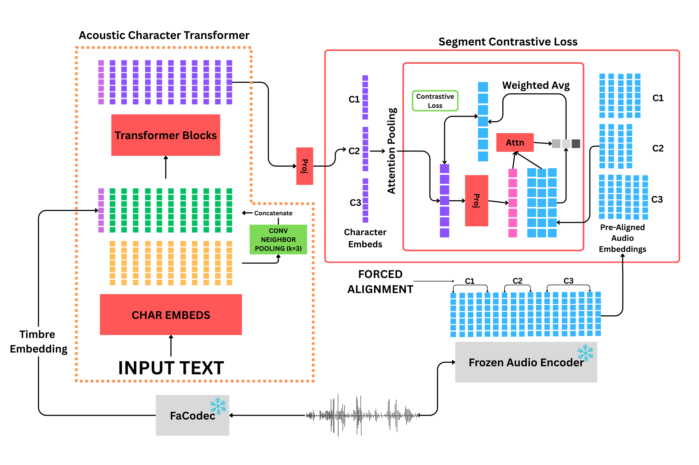
*Figure 1:SPARCLE Architecture*

---
**Usage Info**: 4132 tokens used.
**Generated at**: 2026-07-04 15:04:02

---

# 📚 Towards a Phonology-Informed Evaluation of Multilingual TTS

🚀 URL: https://arxiv.org/html/2607.01965

## 🌏 Abstract (원문)
Neural TTS systems can sound natural across languages, but naturalness does not guarantee the preservation of sound contrasts that distinguish words from their grammatical forms. Standard metrics like MOS do not test for this. We propose a classifier-based framework that audits TTS output against language-specific phonological patterns using human speech as a benchmark. Testing Assamese advanced tongue root (ATR) vowel harmony with Meta's MMS TTS, we show that a classifier trained on human speech transfers to synthesized speech with minimal loss. The faithfulness audit reveals that [+ATR] mid vowels are realized as [-ATR] in 1/3 tokens despite an underlying [+ATR] specification, a bias absent in human speech. At the word level, predicted ATR labels classify harmony more accurately than transcription labels, indicating a gap between intended and produced phonology. The framework offers task-specific diagnostics and generalizes to other phonological contrasts with measurable acoustic cues.
## 🌏 Abstract (번역)
신경망 TTS 시스템은 여러 언어에서 자연스러운 소리를 낼 수 있지만, 자연스러움이 단어를 문법적 형태와 구별하는 음성 대조를 보존한다는 것을 보장하지는 않습니다. MOS와 같은 표준 측정 지표는 이를 테스트하지 않습니다. 본 연구에서는 인간 음성을 벤치마크로 사용하여 TTS 출력을 언어별 음운 패턴에 대해 감사하는 분류기 기반 프레임워크를 제안합니다. Meta의 MMS TTS를 사용하여 아삼어의 전설모음(ATR) 모음 조화를 테스트한 결과, 인간 음성으로 훈련된 분류기가 합성 음성으로 최소한의 손실로 전이됨을 보여줍니다. 충실도 감사 결과, [+ATR] 중간 모음이 기저 [+ATR] 사양에도 불구하고 토큰의 1/3에서 [-ATR]로 실현되며, 이는 인간 음성에는 없는 편향입니다. 단어 수준에서는 예측된 ATR 레이블이 전사 레이블보다 조화를 더 정확하게 분류하여 의도된 음운론과 생성된 음운론 사이의 간극을 나타냅니다. 이 프레임워크는 작업별 진단을 제공하며 측정 가능한 음향 단서가 있는 다른 음운 대조에도 일반화될 수 있습니다.

## 🔍 Methods & Results
- 인간 벤치마크 코퍼스는 아삼어 원어민 성인 14명(여성 8명, 남성 6명)의 음성을 녹음하여 구축되었으며, 참가자들은 캐리어 프레임에 포함된 목표 단어를 읽었습니다.
- Praat으로 모음을 분할하고 FormantPro를 사용하여 F1, F2, F3, B1, 모음 지속 시간과 같은 음향 특징을 추출했으며, 화자 수준의 Lobanov-normalization을 적용했습니다.
- 각 모음 토큰에 이진 ATR 레이블([+ATR], [-ATR]), 모음 높이, 후설성을 할당하고, 이상치 토큰을 제외하여 총 8125개의 모음 토큰을 확보했습니다.
- TTS 데이터셋은 Meta의 아삼어용 MMS TTS 모델(mms-tts-asm)을 사용하여 목표 단어를 합성했으며, 인간 데이터셋과 80개가 겹치고 34개가 고유한 총 114개의 단어로 구성됩니다.
- TTS 데이터셋에도 인간 음성과 동일한 주석 및 음향 측정 프로토콜을 적용하고 전역 z-normalization을 수행했으며, 이상치 토큰을 제외하여 총 281개의 모음 토큰을 확보했습니다.
- 자극 설계에서는 표면 ATR 일치 패턴과 기저 ATR 혼합 여부에 따라 목표 단어에 세 가지 조화 범주(AgrYesMixNo, AgrYesMixYes, AgrNoMixYes)를 할당했습니다.
- 첫 번째 분류 작업(Task 1)은 인간 음성에서 학습된 음향-ATR 매핑이 합성 음성으로 전이되는지 특성화하는 것을 목표로 하며, 로지스틱 회귀(LR) 및 랜덤 포레스트(RF) 분류기를 사용했습니다.
- Task 1에서는 7가지 특징(정규화된 F1, F2, F3, B1, 지속 시간, 높이, 후설성)을 사용하여 이진 ATR 클래스를 예측했으며, Human→Human, Human→TTS, TTS→TTS, TTS→Human의 네 가지 교차 도메인 전이 방향을 평가했습니다.
- 음운론적 충실도 감사는 TTS 시스템의 음향 출력이 입력 텍스트의 음운론적 진실에 의해 지정된 범주 수준 대조를 얼마나 잘 보존하는지 측정하며, 금(gold) ATR 레이블과 Task 1 분류기에 의해 추론된 ATR 레이블을 비교했습니다.
- 불일치는 과잉 생성(underlying [-ATR]이 [+ATR]로 실현)과 과소 생성(underlying [+ATR]이 [-ATR]로 실현되지 못함)으로 구분되었으며, TTS 예측은 모든 인간 토큰으로 훈련된 LR 분류기를 사용했습니다.
- 두 번째 작업(Task 2)은 각 단어 인스턴스를 모음 시퀀스를 기반으로 세 가지 조화 유형 중 하나로 분류하는 것을 목표로 하며, 단어 수준 특징으로 음향 집계(Set A)와 ATR 시퀀스 요약(Set B_gold, B_pred)을 사용했습니다.
- Task 2 평가에는 인간 데이터의 경우 5겹 화자 분리 교차 검증을, TTS 데이터의 경우 Human→TTS 전이를 사용했으며, 랜덤 포레스트(RF) 분류기를 활용했습니다.

## 🖼 Figures
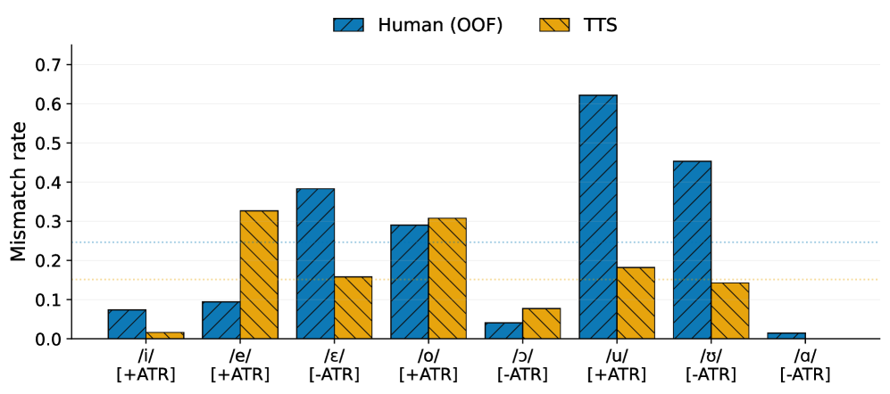
*(a)Per-vowel mismatch rate.*

*(a)Per-vowel mismatch rate.*

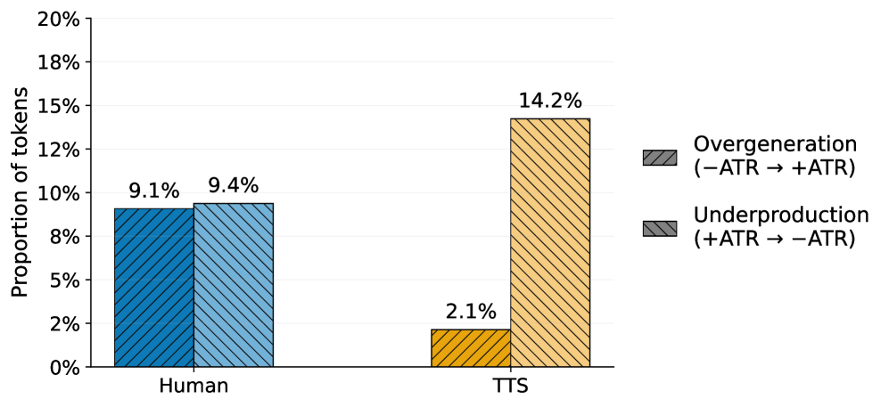
*(b)Aggregate error directionality.*

![Figure 2:Spectrograms (
0
−
1500
 Hz) of [leteku] (AgrYesMixNo) produced by a human speaker (left) and MMS TTS (right), with F1 tracks (yellow) and the approximate [+ATR]/[-ATR] boundary derived from the human benchmark (dashed white). In TTS, the F1 of both /e/ tokens sits near or above the boundary, consistent with the underproduction pattern reported in Table 3.](../images/2026-07-04/2607.01965/2607.01965_fig3.png)
*Figure 2:Spectrograms (
0
−
1500
 Hz) of [leteku] (AgrYesMixNo) produced by a human speaker (left) and MMS TTS (right), with F1 tracks (yellow) and the approximate [+ATR]/[-ATR] boundary derived from the human benchmark (dashed white). In TTS, the F1 of both /e/ tokens sits near or above the boundary, consistent with the underproduction pattern reported in Table 3.*

---
**Usage Info**: 4575 tokens used.
**Generated at**: 2026-07-04 15:04:14

---

# 📚 Neural Audio Codec with Adjustable Token Temporal Resolution Using Sampling-Frequency-Independent Convolutional Layers

🚀 URL: https://arxiv.org/html/2607.01865

## 🌏 Abstract (원문)
Discrete tokens obtained from neural audio codecs (NACs) have been used as compact representations in audio generation and understanding models. In such token-based systems, token temporal resolution (TTR), defined as the time interval between adjacent token frames, is important because it controls the trade-off between representing rapid acoustic events and reducing token-sequence length. However, most NACs are trained at a single TTR and require separate training for each TTR. This paper proposes a mechanism that enables a single NAC to operate at multiple TTRs using sampling-frequency-independent convolutional layers. The mechanism regards TTR as the sampling period of the token sequence and generates TTR-dependent convolutional kernels from a shared parameter set, while adjusting the kernel size and stride for each TTR. We incorporate the mechanism into Descript Audio Codec, leaving the quantizer unchanged. Experiments on environmental sound reconstruction show that the proposed model outperforms a single-model baseline that switches TTR-specific layers for each TTR.
## 🌏 Abstract (번역)
신경 오디오 코덱(NAC)에서 얻은 이산 토큰은 오디오 생성 및 이해 모델에서 압축된 표현으로 사용되어 왔습니다. 이러한 토큰 기반 시스템에서 인접 토큰 프레임 간의 시간 간격으로 정의되는 토큰 시간 해상도(TTR)는 빠른 음향 이벤트를 표현하는 것과 토큰 시퀀스 길이를 줄이는 것 사이의 균형을 제어하기 때문에 중요합니다. 그러나 대부분의 NAC는 단일 TTR에서 훈련되며 각 TTR마다 별도의 훈련이 필요합니다. 본 논문은 샘플링 주파수 독립 컨볼루션 레이어를 사용하여 단일 NAC가 여러 TTR에서 작동할 수 있도록 하는 메커니즘을 제안합니다. 이 메커니즘은 TTR을 토큰 시퀀스의 샘플링 주기로 간주하고, 공유 매개변수 세트에서 TTR 종속 컨볼루션 커널을 생성하며, 각 TTR에 대해 커널 크기와 스트라이드를 조정합니다. 우리는 이 메커니즘을 Descript Audio Codec에 통합했으며, 양자화기는 변경하지 않았습니다. 환경음 재구성 실험 결과, 제안된 모델은 각 TTR에 대해 TTR별 레이어를 전환하는 단일 모델 기준선보다 우수한 성능을 보였습니다.

## 🔍 Methods & Results
- 제안된 TTR(Token Temporal Resolution) 조정 메커니즘은 SFI(Sampling-Frequency-Independent) 컨볼루션 레이어를 사용하여 단일 신경 오디오 코덱(NAC)이 여러 TTR에서 작동하도록 합니다.
- SFI 컨볼루션 레이어는 고정된 가중치 대신 지정된 샘플링 주기에 따라 가중치를 생성하며, 이는 잠재 아날로그 필터에서 파생된 이산 시간 임펄스 응답으로 해석됩니다.
- 이 메커니즘은 Descript Audio Codec(DAC)에 통합되었으며, 인코더의 마지막 컨볼루션 레이어와 디코더의 첫 번째 전치 컨볼루션 레이어를 SFI 레이어로 대체합니다.
- 양자화기 및 다른 DAC 레이어는 변경되지 않아 원래의 양자화 체계를 유지합니다.
- SFI 레이어의 샘플링 주기, 스트라이드, 커널 크기 조정은 가상 토큰 샘플링 주기(Δ~tokout)를 도입하고, 이 가상 스케일과 목표 TTR에 따라 커널 크기(K(S))와 스트라이드(S)를 조정하여 이루어집니다.
- 가중치 생성에는 가상 입력 샘플링 주기(Δ~tokin(S))가 사용되며, 커널 크기 K(S)는 K(S)/S가 일정하게 유지되도록 조정됩니다. 스트라이드 S는 Δtokout = Δtokin / S를 만족하도록 선택됩니다.
- 이 메커니즘은 양자화기 주변의 컨볼루션 레이어를 SFI 레이어로 대체하거나 삽입함으로써 다양한 NAC 아키텍처에 적용 가능합니다.
- 환경음 재구성 실험에서 제안된 모델은 각 TTR에 대해 TTR별 레이어를 전환하는 단일 모델 기준선보다 우수한 성능을 보였습니다.

## 🖼 Figures
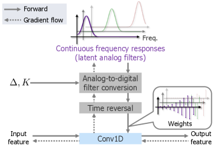
*Fig. 1: Overview of the SFI convolutional layer based on frequency-domain filter design. Conv1D denotes a 1D convolutional layer.*

*Fig. 2: DAC architecture equipped with the proposed TTR-adjustment mechanism. The upper part shows the entire architecture, and the lower part illustrates two examples for different target TTRs. The notation Conv1D follows Fig. 1, and TConv1D denotes a 1D transposed convolutional layer. SFI Conv1D and SFI TConv1D denote their SFI counterparts. DS and US blocks denote downsampling and upsampling blocks, respectively.*

*(a)Mel distance*

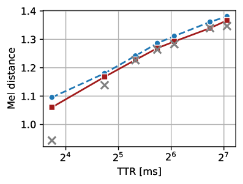
*(a)Mel distance*

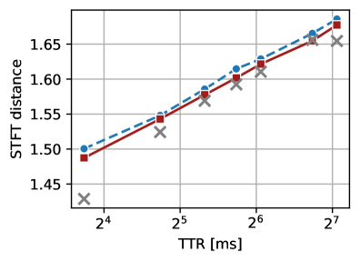
*(b)STFT distance*

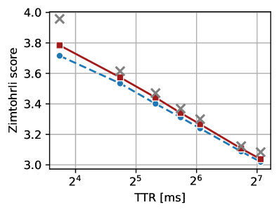
*(c)Zimtohrli score*

---
**Usage Info**: 4213 tokens used.
**Generated at**: 2026-07-04 15:04:24

---

# 📚 Unlocking Speech–Text Compositional Powers: Instruction-Following Speech Language Models without Instruction Tuning

🚀 URL: https://arxiv.org/html/2607.02214

## 🌏 Abstract (원문)
Instruction tuning for speech language models (SLMs) is substantially more challenging than for text-based large language models (LLMs), as it requires learning a new modality and a wide range of speech-specific instructions in addition to those supported by text LLMs. Existing SLM training approaches largely replicate the text LLM training paradigm by synthesizing large-scale speech pre-training and instruction-tuning datasets. However, this strategy is difficult to scale, since speech sequences are significantly longer than text sequences. In this paper, we proposeSpeechCombine, an instruction-following speech language model trainedwithout any instruction tuning, using only a single round of speech pre-training on 30k hours of data. Starting from a text LLM base model, we perform continuous pre-training on speech utterances to obtain a speech-adapted model, and then directly combine its weights with the weight difference between the instruction-tuned and base versions of the text LLM. Our results show that this simple combination strategy not only preserves the knowledge and capabilities of the original text LLM, but also effectively transfers them to the speech domain. These findings suggest a new direction for SLM training that avoids reliance on massive speech data.
## 🌏 Abstract (번역)
음성 언어 모델(SLM)에 대한 명령어 튜닝은 텍스트 기반 대규모 언어 모델(LLM)보다 훨씬 더 어렵습니다. 이는 텍스트 LLM이 지원하는 명령어 외에도 새로운 양식과 광범위한 음성 특정 명령어를 학습해야 하기 때문입니다. 기존 SLM 훈련 접근 방식은 대규모 음성 사전 훈련 및 명령어 튜닝 데이터셋을 합성하여 텍스트 LLM 훈련 패러다임을 대체로 복제합니다. 그러나 음성 시퀀스는 텍스트 시퀀스보다 훨씬 길기 때문에 이 전략은 확장하기 어렵습니다. 본 논문에서는 명령어 튜닝 없이 3만 시간의 데이터에 대한 단일 음성 사전 훈련 라운드만을 사용하여 훈련된 명령어 추종 음성 언어 모델인 SpeechCombine을 제안합니다. 텍스트 LLM 기본 모델에서 시작하여 음성 발화에 대한 연속적인 사전 훈련을 수행하여 음성 적응 모델을 얻은 다음, 이 모델의 가중치를 명령어 튜닝된 텍스트 LLM과 기본 텍스트 LLM 간의 가중치 차이와 직접 결합합니다. 우리의 결과는 이 간단한 결합 전략이 원래 텍스트 LLM의 지식과 능력을 보존할 뿐만 아니라 이를 음성 도메인으로 효과적으로 전이시킨다는 것을 보여줍니다. 이러한 발견은 방대한 음성 데이터에 의존하지 않는 SLM 훈련의 새로운 방향을 제시합니다.

## 🔍 Methods & Results
- SpeechCombine은 텍스트 LLM의 지식과 명령어 추종 능력을 유지하면서 음성 관련 명령어를 따르도록 모델을 훈련하는 것을 목표로 합니다.
- 모델은 텍스트 LLM 기본 모델(θ_base)에서 시작하여 3만 시간의 음성 데이터로 연속 사전 훈련을 수행하여 음성 적응 모델(θ_speech)을 얻습니다.
- 최종 SpeechCombine 모델(θ_SC)은 텍스트 LLM 기본 모델, 음성 적응 모델, 그리고 명령어 튜닝된 텍스트 LLM(θ_inst)과 기본 텍스트 LLM 간의 가중치 차이를 선형적으로 결합하여 얻어집니다: θ_SC = θ_base + λΔθ_speech + Δθ_inst (여기서 Δθ_inst = θ_inst - θ_base, Δθ_speech = θ_speech - θ_base).
- Δθ_inst는 명령어 추종 행동을 인코딩하지만 음성 지식은 없으며, Δθ_speech는 음성 양식의 지식을 포착하지만 자연어 명령어를 따르는 능력은 부족합니다.
- 사전 훈련은 음성 토큰 시퀀스에 익숙해지고 음성 정보(내용 및 운율)를 이해하는 두 가지 목표를 달성하기 위해 설계되었습니다.
- 사전 훈련 데이터 구조는 `[S1 cap] [S1 text] [S1 speech] [S1 cap] ...` 형식으로 구성되며, 여기서 `[cap]`은 음성 캡션, `[text]`는 정확한 전사, `[speech]`는 음성 토큰 시퀀스를 나타냅니다.
- 음성 캡션은 GPT-OSS 120B를 사용하여 생성되며, 음성 발화에서 추출된 속성(평균 피치, 말하기 속도, 강조된 단어, 감정, 감정 각성, 전사)의 하위 집합을 포함합니다.
- 음성 토큰화는 텍스트 전사와의 중복을 줄이기 위해 운율 정보만 인코딩하는 '운율 토큰화' 방식을 채택하여, 각 단어의 피치, 범위, 기울기, 지속 시간, 에너지를 512개의 이산 레벨로 양자화합니다.
- 추론 시에는 텍스트 LLM 명령어 모델과 동일한 답변 템플릿을 사용하며, `[text]` 및 `[speech]` 섹션을 포함하여 음성 모드 상호작용을 가능하게 합니다. 입력 음성 쿼리는 외부 ASR 시스템을 통해 `[text]` 섹션으로 전사됩니다.
- 포맷 강제(format forcing) 기법을 도입하여 `[text]` 섹션 생성 시 음성 토큰 어휘를 마스킹하고, 음성 모드 활성화 시 `<speech>` 구분 기호의 생성 확률을 높여 각 텍스트 섹션 끝에 음성 섹션이 생성되도록 합니다.
- SpeechCombine은 훈련 절차나 가중치 결합 변경 없이 답변 템플릿 변경만으로 텍스트 LLM의 '긴 사고(long thinking)'와 같은 다른 능력도 거의 '무료로' 획득할 수 있음을 보여줍니다.

## 🖼 Figures
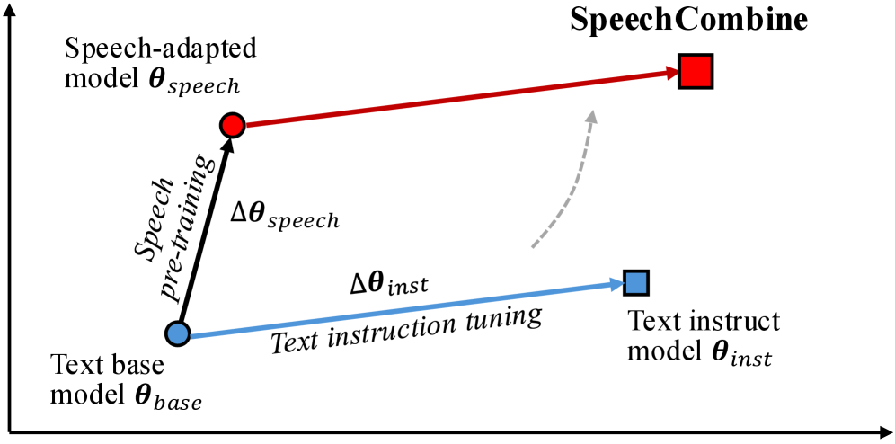
*Figure 1:Illustration of SpeechCombine in weight space.*

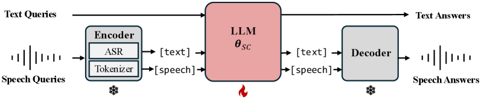
*Figure 2:The SpeechCombine framework and inference pipeline.*

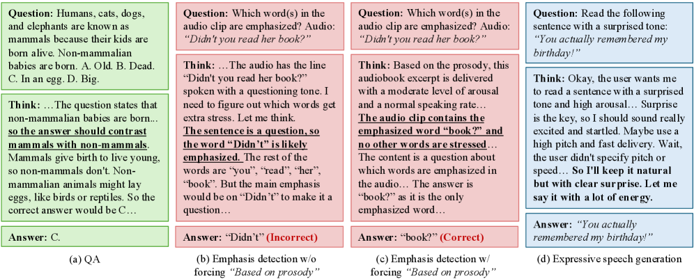
*Figure 3:Excerpts of thinking processes of SpeechCombine. Non-text sections are removed for readability.*

*(a)QA*

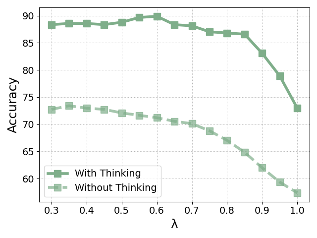
*(a)QA*

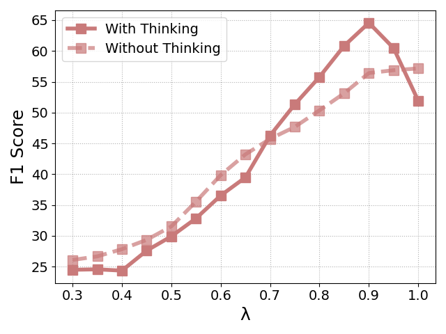
*(b)Emphasis Detection*

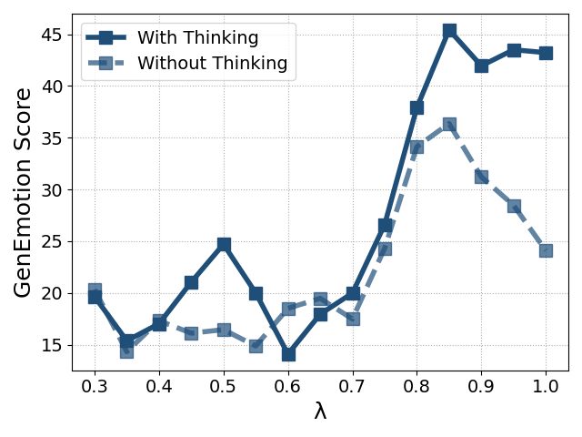
*(c)Expressive Speech Generation*

---
**Usage Info**: 4886 tokens used.
**Generated at**: 2026-07-04 15:04:35

---

# 📚 Multi-Resolution Flow Matching: Training-Free Diffusion Acceleration via Staged Sampling

🚀 URL: https://arxiv.org/html/2607.01642

## 🌏 Abstract (원문)
Hardware-agnostic strategies for accelerating text-to-image diffusion, such as timestep distillation and feature caching, can reduce inference time without custom kernels or system-level optimization. Among them, multi-resolution generation strategies have recently received broad attention, attaining more than5×5\timesspeedup without any training. However, the design of performing upsampling in the latent space, together with the selective modification of partial regions, causes these methods to exhibit noticeable blurring or artifacts. To this end, we proposeMrFlow, a training-free multi-resolution acceleration strategy for pretrained flow-matching models built upon a staged low-to-high-resolution pipeline. MrFlow first rapidly generates the main structure at low resolution, then performs super-resolution in the pixel space using a lightweight pretrained GAN-based model, subsequently injects low-strength noise to enable high-frequency resampling, and finally refines the details at high resolution. Quantitative and qualitative results on FLUX.1-dev and Qwen-Image show that MrFlow exploits the quadratic token reduction and reduced step requirement of low-resolution sampling to achieve10×10\timesend-to-end acceleration while keeping OneIG within a1%1\%gap relative to that before acceleration, significantly surpassing other training-free acceleration strategies, and requiring no training or runtime dynamic identification whatsoever. MrFlow can further be directly combined orthogonally with pre-trained timestep distillation strategies, achieving even higher generation acceleration of up to25×25\times.
## 🌏 Abstract (번역)
타임스텝 증류(timestep distillation) 및 특징 캐싱(feature caching)과 같은 하드웨어 비의존적 전략은 사용자 정의 커널이나 시스템 수준 최적화 없이 텍스트-이미지 확산의 추론 시간을 단축할 수 있습니다. 이 중 다중 해상도 생성 전략은 최근 광범위한 주목을 받으며, 어떠한 훈련 없이도 5배 이상의 속도 향상을 달성했습니다. 그러나 잠재 공간에서 업샘플링을 수행하고 부분 영역을 선택적으로 수정하는 방식은 이러한 방법들이 눈에 띄는 흐림이나 아티팩트를 나타내게 합니다. 이를 위해 우리는 단계별 저해상도-고해상도 파이프라인을 기반으로 하는 사전 훈련된 플로우 매칭 모델을 위한 훈련 없는 다중 해상도 가속 전략인 MrFlow를 제안합니다. MrFlow는 먼저 저해상도에서 주요 구조를 빠르게 생성한 다음, 경량 사전 훈련된 GAN 기반 모델을 사용하여 픽셀 공간에서 초해상도를 수행하고, 이어서 고주파 리샘플링을 가능하게 하기 위해 낮은 강도의 노이즈를 주입하며, 마지막으로 고해상도에서 세부 사항을 정제합니다. FLUX.1-dev 및 Qwen-Image에 대한 정량적 및 정성적 결과는 MrFlow가 저해상도 샘플링의 이차 토큰 감소 및 감소된 스텝 요구 사항을 활용하여 10배의 종단 간 가속을 달성하면서도 OneIG를 가속 전 대비 1% 이내의 차이로 유지하며, 다른 훈련 없는 가속 전략을 크게 능가하고, 어떠한 훈련이나 런타임 동적 식별도 필요하지 않음을 보여줍니다. MrFlow는 사전 훈련된 타임스텝 증류 전략과 직교적으로 직접 결합하여 최대 25배의 훨씬 더 높은 생성 가속을 달성할 수 있습니다.

## 🔍 Methods & Results
- MrFlow는 저해상도에서 전체 이미지 구조를 빠르게 생성한 후 픽셀 공간에서 초해상도를 수행하고, 낮은 강도의 노이즈를 주입하여 고주파 리샘플링을 가능하게 하며, 마지막으로 고해상도에서 세부 사항을 정제하는 단계별 파이프라인으로 구성됩니다.
- MrFlow의 구체적인 절차는 저해상도 잠재 공간 샘플링, VAE 디코딩, 픽셀 공간 초해상도, VAE 인코딩, 노이즈 주입, 고해상도 잠재 공간 샘플링, VAE 디코딩을 포함합니다.
- 일반적인 구성으로, MrFlow는 저해상도 단계에서 12단계의 샘플링, 초해상도 후 0.1의 노이즈 강도 주입, 그리고 고해상도 단계에서 1단계의 노이즈 제거만 필요합니다.
- 저해상도 단계의 가속은 이미지 토큰 수에 거의 선형적으로 비례하는 단일 단계 추론 비용(각 측면이 2배 축소될 때 약 4배 속도 향상)과 더 적은 샘플링 단계 요구 사항(10단계 저해상도 + 1단계 고해상도가 11단계 고해상도 직접 생성보다 우수하며, 대기 시간 절반 이상 감소 및 CLIP 일관성 향상)에서 비롯됩니다.
- 픽셀 공간 초해상도 단계에서는 사전 훈련된 Real-ESRGAN과 같은 GAN 기반 모델을 사용하여 픽셀 공간에서 업샘플링(일반적으로 2배)을 수행하여 전체 구조를 보존하고 고주파 정보를 보완합니다. 픽셀 공간에서의 업샘플링은 견고하며, GAN 기반 SR은 선명하고 자연스러운 이미지와 같은 세부 정보를 생성하여 후속 정제에 적합합니다.
- 노이즈 주입 단계에서는 초해상도된 이미지를 고해상도 잠재 공간으로 다시 인코딩한 후, 낮은 강도의 노이즈(예: σt ∈ [0.1, 0.15])를 주입하여 저주파 구조를 높은 SNR로 유지하면서 고주파 SNR을 낮춰 다음 노이즈 제거 단계에서 고해상도 플로우 사전(prior)에 따라 리샘플링할 수 있도록 합니다.
- 고해상도 정제 단계는 노이즈가 주입된 고해상도 잠재 값을 초기 값으로 사용하여 동일한 속도 추정 네트워크에서 플로우 맵을 적용하며, 기본적으로 1단계(KH=1)로 최종 세부 사항을 정제합니다. 이는 노이즈가 주입된 SR 잠재 값이 이미 깨끗한 종점과 가깝기 때문에 단일 단계로도 높은 CLIP 일관성을 달성할 수 있습니다.
- MrFlow는 FLUX.1-dev 및 Qwen-Image에서 10배의 종단 간 가속을 달성하며, OneIG를 가속 전 대비 1% 이내의 차이로 유지합니다.
- MrFlow는 다른 훈련 없는 가속 전략을 크게 능가하며, 어떠한 훈련이나 런타임 동적 식별도 필요하지 않습니다.
- MrFlow는 사전 훈련된 타임스텝 증류 전략과 직교적으로 결합하여 최대 25배의 더 높은 생성 가속을 달성할 수 있습니다.

## 🖼 Figures

*Figure 1:Qualitative comparison between MrFlow and various methods on Qwen-Image. The dashed lines separate the pretrained model, training-free strategies, and strategies that rely on or exploit timestep distillation.*

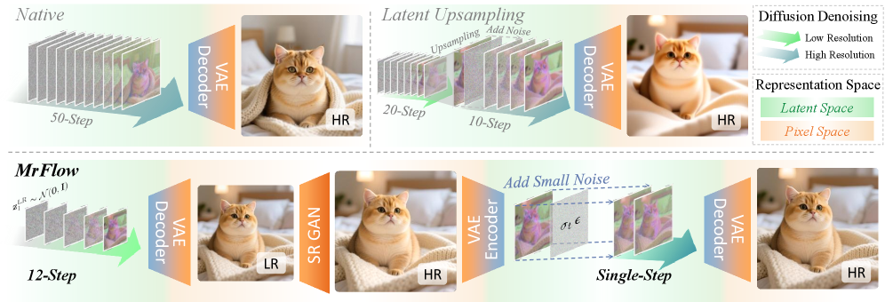
*Figure 2:The framework of MrFlow. The compared strategies include the native inference scheme and methods that perform upsampling in the latent space such as LSSGen, RALU and SPEED.*

*Figure 3:Example comparison of MrFlow adopting different super-resolution strategies on Qwen-Image, where Low Resolution denotes the image after low-resolution generation followed by VAE decoding to the pixel space, with a resolution of 
512
×
512
. The rows of SR and High Resolution Refine are respectively the super-resolved image and the final image after high-resolution refinement, with a resolution of 
1024
×
1024
.*

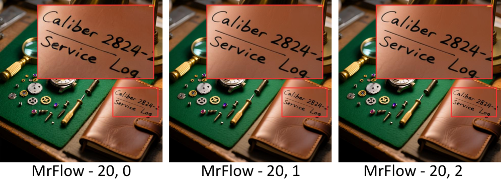
*Figure 4:Images generated by MrFlow under different high-resolution step configurations on Qwen-Image.*

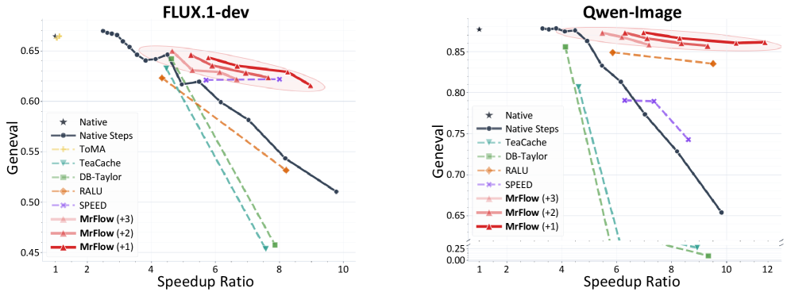
*Figure 5:Trade-off curves between GenEval score and speedup for various training-free methods on FLUX.1-dev and Qwen-Image. Different shades of MrFlow correspond to different numbers of steps used in the high-resolution refinement stage.*

*Figure 6:Stage-wise runtime breakdown of native Qwen-Image and MrFlow-
12
,
1
.*

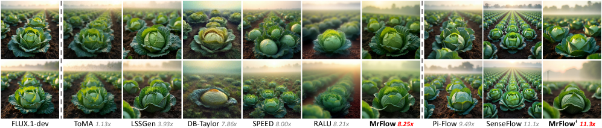
*Figure 7:Comparison of the effects of various methods on FLUX.1-dev. The dashed lines separate the pretrained model, training-free strategies, and strategies that rely on or exploit timestep distillation.*

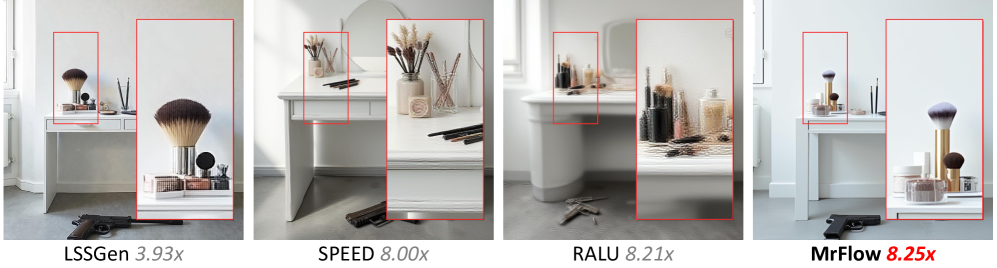
*Figure 8:Detail comparison of multi-resolution acceleration methods on FLUX.1-dev.*

*Figure 9:Generation examples of MrFlow on Qwen-Image. The configuration is 
12
 steps at the low-resolution stage and 
1
 step at the high-resolution stage, with speedups all above 
10
×
.*

*Figure 10:Generation examples of MrFlow on FLUX. The configuration is 
12
 steps at the low-resolution stage and 
1
 step at the high-resolution stage, with speedups all above 
8
×
.*

---
**Usage Info**: 5226 tokens used.
**Generated at**: 2026-07-04 15:04:52

---

# 📚 Self-Supervised Test-Time Tuning for Packet Loss Concealment

🚀 URL: https://arxiv.org/html/2607.01823

## 🌏 Abstract (원문)
Packet loss concealment (PLC) reconstructs audio packets that are missing at the receiver, usually with a trained model whose parameters remain fixed at deployment time. This treats the PLC model as static, even though each call or recording exposes signal-specific information through the packets that did arrive. We present TTT-PLC, a self-supervised test-time tuning framework that adapts existing PLC models using only those received packets. The method creates supervision by synthetically masking portions of the available signal, training the model to conceal them with its native PLC objective, and then using the adapted model to reconstruct the true packet losses. No clean reference signal, external adaptation data, or architectural modification is required.We study TTT-PLC in two deployment settings. In the non-causal setting, the received file is available before reconstruction, allowing repeated self-supervised adaptation passes and providing a per-file adaptation ceiling. In the causal setting, audio is streamed without revising emitted samples; adaptation is performed only on completed past blocks, and updated parameters affect only future audio. We instantiate the framework on two public PLC backbones, FRN, a recurrent full-band speech PLC model, and PARCnet, a hybrid autoregressive-neural model for networked music. Across these settings, the results show that pretrained PLC systems do not need to be treated as fixed at inference time, the still-observed portions of a lossy signal can provide an effective training signal for improving concealment on that same signal.
## 🌏 Abstract (번역)
패킷 손실 은닉(PLC)은 수신 측에서 누락된 오디오 패킷을 재구성하며, 일반적으로 배포 시 매개변수가 고정된 훈련된 모델을 사용합니다. 이는 PLC 모델을 정적으로 취급하지만, 각 통화 또는 녹음은 도착한 패킷을 통해 신호별 정보를 노출합니다. 본 논문에서는 수신된 패킷만을 사용하여 기존 PLC 모델을 적응시키는 자체 지도 테스트 시간 튜닝 프레임워크인 TTT-PLC를 제시합니다. 이 방법은 사용 가능한 신호의 일부를 인위적으로 마스킹하여 감독을 생성하고, 모델이 자체 PLC 목표를 사용하여 이를 은닉하도록 훈련한 다음, 적응된 모델을 사용하여 실제 패킷 손실을 재구성합니다. 깨끗한 참조 신호, 외부 적응 데이터 또는 아키텍처 수정이 필요하지 않습니다. 우리는 두 가지 배포 설정에서 TTT-PLC를 연구합니다. 비인과적 설정에서는 재구성 전에 수신된 파일이 사용 가능하여 반복적인 자체 지도 적응 패스를 허용하고 파일당 적응 상한을 제공합니다. 인과적 설정에서는 오디오가 방출된 샘플을 수정하지 않고 스트리밍됩니다. 적응은 완료된 과거 블록에서만 수행되며, 업데이트된 매개변수는 미래 오디오에만 영향을 미칩니다. 우리는 두 가지 공개 PLC 백본, 즉 순환 전대역 음성 PLC 모델인 FRN과 네트워크 음악을 위한 하이브리드 자동회귀-신경망 모델인 PARCnet에 프레임워크를 인스턴스화합니다. 이러한 설정 전반에 걸쳐 결과는 사전 훈련된 PLC 시스템이 추론 시 고정된 것으로 취급될 필요가 없으며, 손실된 신호의 여전히 관찰되는 부분이 동일한 신호에 대한 은닉을 개선하기 위한 효과적인 훈련 신호를 제공할 수 있음을 보여줍니다.

## 🔍 Methods & Results
- TTT-PLC는 기존 PLC 모델의 아키텍처나 추가 훈련 데이터 없이 성능을 개선하는 자체 지도 테스트 시간 적응 프레임워크를 제안한다.
- 이 방법은 수신된 패킷에서 자체 지도 PLC 작업을 구성한다: 사용 가능한 패킷의 일부를 인위적으로 마스킹하고, 모델이 자체 PLC 목표를 사용하여 이를 재구성하도록 훈련한 다음, 적응된 모델을 사용하여 실제 패킷 손실을 은닉한다.
- **비인과적 설정**: 전체 수신 파일이 재구성 전에 사용 가능하며, 각 테스트 파일에 대해 사전 훈련된 모델의 별도 복사본을 적응시킨다. 관찰된 패킷을 검증 세트와 적응 풀로 나누고, 적응 풀을 합성 마스킹 폴드와 컨텍스트 세트로 분할하여 훈련한다. 모델 선택은 검증 세트에 대한 손실을 기반으로 한다.
- **인과적 설정**: 오디오가 스트리밍되며, 이미 방출된 샘플은 수정되지 않고, 매개변수 업데이트는 미래 출력에만 영향을 미친다.
- **FRN 모델 (인과적)**: 순환 PLC 모델의 경우, 버스트 인식 재생(burst-aware replay)을 사용하여 짧은 관찰된 패킷 버스트를 마스킹하고 모델을 훈련시킨다. 이는 완료된 블록에 대해서만 수행된다.
- **PARCnet 모델 (인과적)**: 스트리밍 방식의 매 패킷 적응 절차를 사용한다. 관찰된 패킷을 훈련 세트와 검증 세트로 나누고, 훈련 세트에 속하는 패킷에 대해 마스킹 및 예측을 수행하여 모델을 업데이트한다. PARCnet의 고유 손실 함수와 샘플 레벨 마스크를 사용하여 훈련 및 검증을 수행한다.
- 두 설정 모두에서, 실제 손실된 패킷은 훈련이나 검증에 사용되지 않고 최종 평가에만 사용된다.

## 🖼 Figures
![Figure 1:Causal FRN block replay improves after the first completed block and remains stable over time. Curves show per-window metric deltas relative to frozen FRN on LibriSpeech-40 speaker files; shaded bands denote 
±
 one standard error. The first 30 s block is shaded because no replay has fired yet, so the output matches the frozen baseline. Dotted vertical lines mark subsequent 30 s block boundaries; each completed block is replayed for six self-supervised epochs before updating the weights for future blocks.](../images/2026-07-04/2607.01823/2607.01823_fig0.png)
*Figure 1:Causal FRN block replay improves after the first completed block and remains stable over time. Curves show per-window metric deltas relative to frozen FRN on LibriSpeech-40 speaker files; shaded bands denote 
±
 one standard error. The first 30 s block is shaded because no replay has fired yet, so the output matches the frozen baseline. Dotted vertical lines mark subsequent 30 s block boundaries; each completed block is replayed for six self-supervised epochs before updating the weights for future blocks.*

![Figure 2:Per-file TTT concealment gain over normalized file position on out-of-domain LibriSpeech at 
𝑟
=
0.10
, averaged over 40 speakers. Values are packet-NMSE changes relative to frozen PARCnet, so lower is better. Causal best-val has a cold-start cost near the beginning of the file because only early snapshots are available, but it approaches the two-pass result by the end. Multi-epoch adaptation gives the strongest improvement throughout the file. Shaded regions denote 
±
 one standard error across files.](../images/2026-07-04/2607.01823/2607.01823_fig1.png)
*Figure 2:Per-file TTT concealment gain over normalized file position on out-of-domain LibriSpeech at 
𝑟
=
0.10
, averaged over 40 speakers. Values are packet-NMSE changes relative to frozen PARCnet, so lower is better. Causal best-val has a cold-start cost near the beginning of the file because only early snapshots are available, but it approaches the two-pass result by the end. Multi-epoch adaptation gives the strongest improvement throughout the file. Shaded regions denote 
±
 one standard error across files.*

---
**Usage Info**: 5985 tokens used.
**Generated at**: 2026-07-04 15:05:06

---

# 📚 UT-AISTimprt submission for ICME 2026 Grand Challenge on Academic Text-to-Music Generation

🚀 URL: https://arxiv.org/html/2607.01669

## 🌏 Abstract (원문)
This work investigates the effect of batch sampling strategies during training for text-to-audio music generation under low-data and small-scale model settings. This paper describes our approach and findings for the ICME 2026 Grand Challenge on Academic Text-to-Music Generation. Training data are clustered using either text embeddings or audio embeddings, and samples with similar characteristics are grouped within the same mini-batch to mitigate gradient interference. The effects of modality and cluster granularity on clustering are analyzed. Results show that clustering based on text embeddings achieves better performance on objective evaluation metrics than clustering based on audio embeddings. In addition, different cluster granularity leads to different behaviors across evaluation criteria: a moderate number of clusters performs best on objective metrics, while a larger number of clusters tends to exhibit music with more coherent structure in listening tests.
## 🌏 Abstract (번역)
본 연구는 저데이터 및 소규모 모델 환경에서 텍스트-오디오 음악 생성 훈련 중 배치 샘플링 전략의 효과를 조사합니다. 이 논문은 ICME 2026 학술 텍스트-음악 생성 그랜드 챌린지에 대한 우리의 접근 방식과 발견을 설명합니다. 훈련 데이터는 텍스트 임베딩 또는 오디오 임베딩을 사용하여 클러스터링되며, 유사한 특성을 가진 샘플들은 기울기 간섭을 완화하기 위해 동일한 미니 배치 내에 그룹화됩니다. 클러스터링에 대한 양식(모달리티) 및 클러스터 세분화의 효과가 분석됩니다. 결과는 텍스트 임베딩 기반 클러스터링이 오디오 임베딩 기반 클러스터링보다 객관적인 평가 지표에서 더 나은 성능을 달성함을 보여줍니다. 또한, 다른 클러스터 세분화는 평가 기준에 따라 다른 동작을 유발합니다. 즉, 적당한 수의 클러스터는 객관적인 지표에서 가장 좋은 성능을 보이는 반면, 더 많은 수의 클러스터는 청취 테스트에서 더 일관된 구조를 가진 음악을 나타내는 경향이 있습니다.

## 🔍 Methods & Results
- 저데이터 및 소규모 모델 환경에서 텍스트-오디오 음악 생성 시 배치 샘플링 전략의 효과를 조사했습니다.
- 훈련 데이터는 텍스트 임베딩 또는 오디오 임베딩을 사용하여 클러스터링되었으며, 유사한 특성을 가진 샘플들은 기울기 간섭 완화를 위해 동일한 미니 배치로 그룹화되었습니다.
- 클러스터링에 대한 양식(텍스트 vs. 오디오 임베딩) 및 클러스터 세분화의 효과를 분석했습니다.
- 텍스트 임베딩 기반 클러스터링이 오디오 임베딩 기반 클러스터링보다 객관적인 평가 지표에서 더 나은 성능을 달성했습니다.
- 클러스터 세분화 정도에 따라 평가 기준별로 다른 결과가 나타났습니다.
- 적당한 수의 클러스터는 객관적인 지표에서 최상의 성능을 보였습니다.
- 더 많은 수의 클러스터는 청취 테스트에서 더 일관된 구조를 가진 음악을 생성하는 경향을 보였습니다.

---
**Usage Info**: 1357 tokens used.
**Generated at**: 2026-07-04 15:05:23

---

