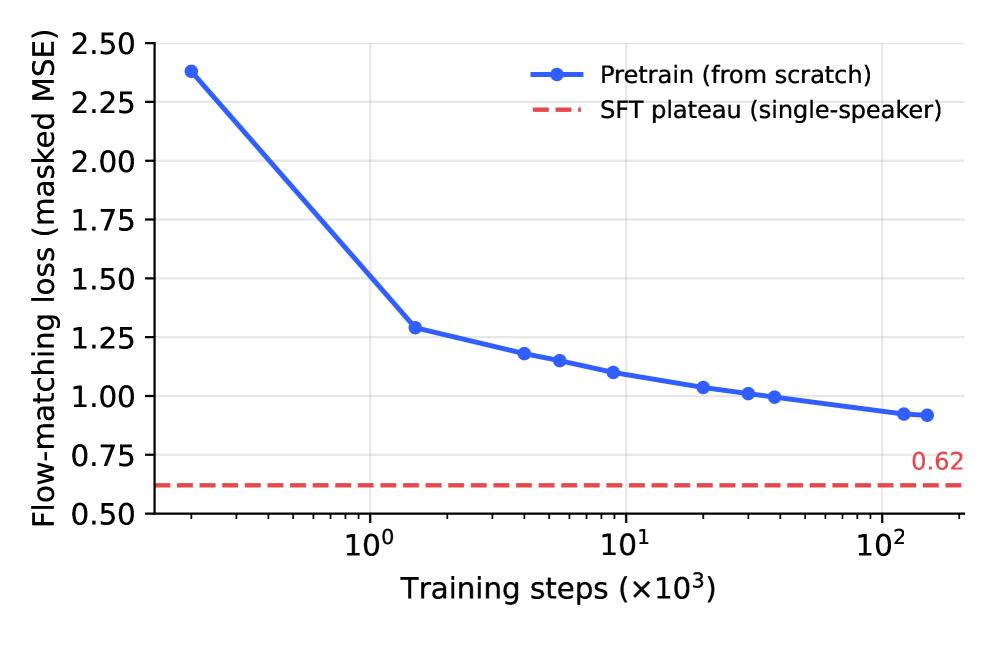
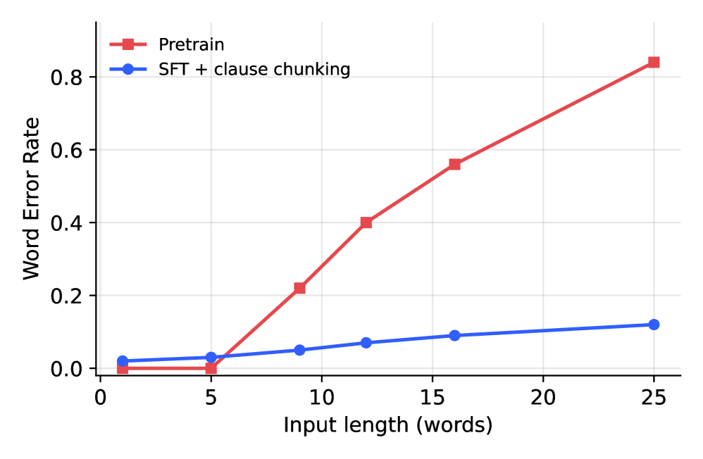

# 🚩 (2026-07-13) Scholar Inbox 추천 논문 

# 📚 FreyaTTS Technical Report

🚀 URL: https://arxiv.org/html/2607.09530

## 🌏 Abstract (원문)
We introduce FreyaTTS, a compact, tokenizer-free, Turkish-first text-to-speech model designed for highly reliable and efficient conversational synthesis. FreyaTTS is a183.2183.2M-parameter non-autoregressive conditional flow-matching Diffusion Transformer (DiT) that operates in the frozen continuous-latent space of the frozen AudioVAE2(Zhouet al.,2026), reused unmodified (1616kHz encode,4848kHz decode); holding the codec fixed lets the model devote all of its capacity to the text-to-latent map while inheriting4848kHz reconstruction for free. We advance the framework across three key dimensions: (i)Rule-Free End-to-End Modeling, by driving generation end-to-end from a9292-symbol Turkish character vocabulary with no phonemizer, grapheme-to-phoneme frontend, or discrete speech tokenizer, so that agglutinative morphology, vowel harmony, and the spoken form of numbers and acronyms are learned directly from audio; (ii)Non-Autoregressive Parallel Denoising, which avoids the left-to-right error accumulation of autoregressive decoders by predicting and denoising the entire latent sequence in parallel over a predicted duration; and (iii)Production-Hardening Post-Training, utilizing a two-stage post-training recipe–a single-speaker voice lock that stabilizes speaker identity (collapsing cross-generationF0F_{0}standard deviation from74.974.9Hz to5.05.0Hz) followed by short-utterance coverage to resolve isolated-token and short-phrase failures. On our Freya-TR-Eval benchmark, FreyaTTS achieves a band-matched WER of8.08.0% and CER of3.03.0%, outperforming larger open-source systems at a fraction of their parameter size. With a real-time factor of0.110.11on consumer GPUs and the ability to run faster than real time on a laptop CPU, the model is highly optimized for resource-constrained edge deployment. We release the model weights, the training and inference code, and the evaluation benchmark under the Apache-2.0 license.
## 🌏 Abstract (번역)
본 논문은 매우 신뢰할 수 있고 효율적인 대화형 합성을 위해 설계된 작고 토크나이저가 없는 튀르키예어 우선 텍스트-음성 변환(TTS) 모델인 FreyaTTS를 소개합니다. FreyaTTS는 183.2M 파라미터를 가진 비자기회귀 조건부 플로우 매칭 확산 트랜스포머(DiT)로, 수정 없이 재사용된 동결된 AudioVAE2(Zhou et al., 2026)의 동결된 연속 잠재 공간에서 작동합니다(16kHz 인코딩, 48kHz 디코딩). 코덱을 고정함으로써 모델은 모든 용량을 텍스트-잠재 매핑에 할애하면서 48kHz 재구성을 무료로 상속받습니다. 우리는 세 가지 주요 차원에서 프레임워크를 발전시킵니다: (i) 규칙 없는 종단 간 모델링: 음소 변환기, 음소 변환 프론트엔드 또는 이산 음성 토크나이저 없이 92개 기호의 튀르키예어 문자 어휘에서 종단 간 생성을 구동하여 교착어 형태론, 모음 조화, 숫자 및 약어의 음성 형태를 오디오에서 직접 학습합니다. (ii) 비자기회귀 병렬 노이즈 제거: 예측된 지속 시간 동안 전체 잠재 시퀀스를 병렬로 예측하고 노이즈를 제거하여 자기회귀 디코더의 좌우 오류 누적을 방지합니다. (iii) 생산 강화를 위한 후처리 훈련: 두 단계의 후처리 훈련 방식을 활용합니다. 첫째, 화자 정체성을 안정화하는 단일 화자 음성 잠금(교차 생성 F0 표준 편차를 74.9Hz에서 5.0Hz로 감소)을 수행하고, 이어서 고립된 토큰 및 짧은 구문 실패를 해결하기 위한 짧은 발화 커버리지를 적용합니다. Freya-TR-Eval 벤치마크에서 FreyaTTS는 8.0%의 대역 일치 WER과 3.0%의 CER을 달성하여, 더 큰 오픈 소스 시스템보다 훨씬 적은 파라미터 크기로 더 나은 성능을 보입니다. 소비자 GPU에서 0.11의 실시간 계수(RTF)와 노트북 CPU에서 실시간보다 빠르게 실행될 수 있는 능력을 갖춘 이 모델은 자원 제약이 있는 엣지 배포에 최적화되어 있습니다. 우리는 Apache-2.0 라이선스 하에 모델 가중치, 훈련 및 추론 코드, 평가 벤치마크를 공개합니다.

## 🔍 Methods & Results
- FreyaTTS는 동결된 AudioVAE2의 연속 잠재 공간에서 작동하는 토크나이저 없는 비자기회귀(NAR) 조건부 플로우 매칭 확산 트랜스포머(DiT)입니다.
- VoxCPM과 달리, FreyaTTS는 자기회귀 스택(텍스트-의미 LM, FSQ, 잔여 음향 LM, 로컬 확산 트랜스포머)을 제거하고 단일 NAR DiT를 사용하여 발화의 모든 잠재 프레임을 병렬로 노이즈 제거합니다.
- NAR 설계는 대화형 튀르키예어에서 숫자, 날짜 등의 시퀀스에서 발생할 수 있는 자기회귀 모델의 좌우 오류 누적을 방지하여 신뢰성을 높입니다.
- 모델은 AudioVAE2 인코더에서 생성된 깨끗한 잠재 시퀀스(16kHz 파형을 25Hz에서 64차원 잠재 공간으로 매핑)와 텍스트 인코더에서 생성된 문자 특징 메모리를 사용합니다.
- 선형 확률 경로를 가진 조건부 플로우 매칭 목표를 채택하여 가우시안 사전과 데이터 사이를 보간하고 속도 필드(vθ)를 훈련시킵니다.
- AudioVAE2는 16kHz 입력/48kHz 출력으로 동결되어 재사용되며, 고충실도 재구성을 담당하여 생성기가 텍스트 조건부 사전 모델링에 집중할 수 있도록 합니다.
- 텍스트 인코더는 92개 기호의 튀르키예어 문자 어휘(29개 문자, 숫자, 구두점, 공백 포함)를 임베딩하고 ConvNeXt-1d 블록으로 정제하여 튀르키예어 정서법 현상(모음 조화, 약어 발음 등)을 종단 간 학습합니다.
- 지속 시간 헤드는 문자 특징의 마스크 평균을 기반으로 잠재 길이(T_hat)를 예측합니다.
- DiT는 16개 레이어로 구성되며, 각 레이어는 RoPE 자기 주의, 텍스트 교차 주의, SwiGLU 피드포워드 네트워크를 포함하고 adaLN-zero를 통해 타임스텝에 의해 변조됩니다.
- 모델은 대규모 고품질 내부 다중 화자 튀르키예어 음성 코퍼스(AudioVAE2 잠재 공간으로 사전 인코딩됨)에서 무작위 초기화로 훈련됩니다.
- 훈련 후처리(Production-Hardening)는 두 단계로 진행됩니다: 1) 단일 화자 코퍼스에 대한 미세 조정을 통해 화자 정체성을 안정화(F0 표준 편차 74.9Hz에서 5.0Hz로 감소, 내용 유사성 0.923 달성). 2) 짧은 발화(한두 단어 구문, 숫자, 인정)로 증강된 코퍼스에 대한 추가 미세 조정을 통해 고립된 토큰 및 짧은 구문 실패를 해결합니다.
- 추론 시, 텍스트 인코더와 지속 시간 헤드가 잠재 길이를 예측하고, 32단계 Euler 솔버를 사용하여 플로우 매칭 ODE를 통합한 후, 동결된 AudioVAE2가 48kHz 파형으로 디코딩합니다.
- FreyaTTS는 Freya-TR-Eval 벤치마크에서 8.0%의 대역 일치 WER과 3.0%의 CER을 달성하여, 더 큰 오픈 소스 시스템보다 적은 파라미터로 우수한 성능을 보였습니다.
- 소비자 GPU에서 평균 0.11의 실시간 계수(RTF)를 달성하며, 노트북 CPU에서도 실시간보다 빠르게 실행 가능하여 자원 제약이 있는 환경에 최적화되어 있습니다.

## 🖼 Figures
![Figure 1:Overall architecture of FreyaTTS. Character-level Turkish text (a 
92
-symbol vocabulary; no byte-pair encoding, phonemizer, or grapheme-to-phoneme frontend) is embedded and refined by a ConvNeXt-1d encoder into a character-feature sequence 
𝑐
, which (i) drives a duration head that predicts the total latent length 
𝑇
^
 and (ii) serves as the key/value memory for the cross-attention layers of a non-autoregressive Diffusion Transformer (DiT). Conditioned on the flow-matching timestep 
𝑡
 through adaLN-zero modulation, the DiT denoises a length-
𝑇
^
 sequence of 
64
-dimensional latent frames drawn from Gaussian noise; the resulting clean latents are rendered to 
48
 kHz audio by the frozen AudioVAE2 decoder. The autoregressive TSLM/FSQ/RALM backbone is discarded; only AudioVAE2 is reused.](../images/2026-07-13/2607.09530/2607.09530_fig0.png)
*Figure 1:Overall architecture of FreyaTTS. Character-level Turkish text (a 
92
-symbol vocabulary; no byte-pair encoding, phonemizer, or grapheme-to-phoneme frontend) is embedded and refined by a ConvNeXt-1d encoder into a character-feature sequence 
𝑐
, which (i) drives a duration head that predicts the total latent length 
𝑇
^
 and (ii) serves as the key/value memory for the cross-attention layers of a non-autoregressive Diffusion Transformer (DiT). Conditioned on the flow-matching timestep 
𝑡
 through adaLN-zero modulation, the DiT denoises a length-
𝑇
^
 sequence of 
64
-dimensional latent frames drawn from Gaussian noise; the resulting clean latents are rendered to 
48
 kHz audio by the frozen AudioVAE2 decoder. The autoregressive TSLM/FSQ/RALM backbone is discarded; only AudioVAE2 is reused.*

*(a)Training loss.*

*(a)Training loss.*

*(b)Voice-lock (
𝐹
0
).*

*(c)WER vs. length.*

---
**Usage Info**: 6675 tokens used.
**Generated at**: 2026-07-13 16:28:18

---

# 📚 Clean2FX: Label-Conditioned Modeling for Clean-to-Effect Guitar Audio Transformations

🚀 URL: https://arxiv.org/html/2607.08863

## 🌏 Abstract (원문)
We present Clean2FX, a study and demo of label-conditioned clean-to-effect transformation for electric guitar audio. Given a clean guitar input and a target effect label, the task is to synthesize the corresponding effected signal while preserving the musical content. Training and evaluation pairs are constructed from EGFxSet real, single-tone recordings by assembling matched clean/effected chords, melodies, and mixed timelines. This allows for controlled comparison across effects. We evaluate four neural approaches under a common spectrogram-based transformation setting: two variational autoencoders and two U-Net models that differ in whether they operate on linear or log-magnitude representations. Performance is measured using linear-magnitude spectrogram MSE and Fréchet Audio Distance. The U-Net models outperform the variational autoencoder variants. Per-effect results show that distortion effects are most readily improved, whereas delay and reverb effects exhibit weaker FAD gains despite substantial spectral-error reductions. A conditioning-sensitivity diagnostic provides evidence that the best model responds to target labels rather than collapsing to a single transformation. Our demo website compares two models applied on real-world guitar performances outside training and validation data, providing audio and spectrogram examples of the practical clean-to-effect behavior.
## 🌏 Abstract (번역)
저희는 일렉트릭 기타 오디오를 위한 레이블 조건부 클린-이펙트 변환에 대한 연구 및 데모인 Clean2FX를 소개합니다. 클린 기타 입력과 대상 이펙트 레이블이 주어졌을 때, 음악적 내용을 보존하면서 해당 이펙트가 적용된 신호를 합성하는 것이 목표입니다. 훈련 및 평가 쌍은 EGFxSet의 실제 단일 톤 녹음에서 일치하는 클린/이펙트 코드, 멜로디 및 혼합 타임라인을 조립하여 구성됩니다. 이를 통해 이펙트 간의 제어된 비교가 가능합니다. 저희는 일반적인 스펙트로그램 기반 변환 설정에서 네 가지 신경망 접근 방식을 평가합니다: 선형 또는 로그-크기 표현에서 작동하는지 여부가 다른 두 가지 변이형 오토인코더와 두 가지 U-Net 모델입니다. 성능은 선형-크기 스펙트로그램 MSE와 Fréchet Audio Distance를 사용하여 측정됩니다. U-Net 모델이 변이형 오토인코더 변형보다 우수한 성능을 보였습니다. 이펙트별 결과는 디스토션 이펙트가 가장 쉽게 개선되는 반면, 딜레이 및 리버브 이펙트는 상당한 스펙트럼 오류 감소에도 불구하고 FAD(Fréchet Audio Distance) 개선이 약하다는 것을 보여줍니다. 조건화 민감도 진단은 최상의 모델이 단일 변환으로 수렴하지 않고 대상 레이블에 반응한다는 증거를 제공합니다. 저희 데모 웹사이트는 훈련 및 검증 데이터 외부의 실제 기타 연주에 적용된 두 가지 모델을 비교하여 실제 클린-이펙트 동작의 오디오 및 스펙트로그램 예시를 제공합니다.

## 🔍 Methods & Results
- 훈련 데이터는 EGFxSet의 실제 단일 기타 톤 녹음을 사용하여 프로그래밍 방식으로 코드, 멜로디, 혼합 이벤트 타임라인을 합성하여 구축되었으며, 클린 및 이펙트 버전 모두에 동일한 이벤트 시퀀스를 적용하여 음악적 내용을 일정하게 유지했습니다.
- 오디오는 16kHz에서 nfft=512, hop=128인 크기 STFT 스펙트로그램으로 표현되며, 4.9초 클립은 257x613 스펙트로그램을 생성합니다. 입력 표현으로는 선형 크기(x)와 로그 압축 변형(y=ln(1+200x))이 비교됩니다.
- 네 가지 신경망 아키텍처(두 가지 변이형 오토인코더(VAE)와 두 가지 U-Net 모델)를 평가했으며, 모두 학습된 이펙트 임베딩에 조건화됩니다.
- U-Net 모델은 5단계 잔차 U-Net 구조를 사용하며, 인코더는 DoubleConv 블록과 Max-pooling으로 구성되고 디코더는 Nearest-neighbor 업샘플링과 스킵 연결을 통해 인코더를 미러링합니다. 이 모델은 입력에 더해지는 잔차를 예측합니다.
- U-Net의 조건화는 각 10개 이펙트 레이블에 대한 64차원 학습 임베딩을 사용하며, 병목 지점과 4개 디코더 레벨에서 Feature-wise Linear Modulation(FiLM)을 통해 주입됩니다. 훈련 중에는 조건화 드롭아웃(확률 0.15)이 적용됩니다.
- U-Net 변형은 스펙트럼 수렴(SC)을 기본 항으로 하는 복합 스펙트럼 손실을 최적화합니다. 로그-크기 변형은 SC + 10 * L1_log를 사용하고, 선형 변형은 SC + 10 * L1_lin + 5 * L1_log를 사용하며, 각 샘플의 손실에는 이펙트별 가중치가 적용됩니다.
- U-Net 모델은 AdamW 옵티마이저와 ReduceLROnPlateau 스케줄러를 사용하여 90/10 훈련/검증 분할 데이터셋에서 훈련되었으며, VAE는 Adam 옵티마이저를 사용했습니다.
- 평가는 200개의 보류된 쌍 샘플(이펙트당 20개)에 대해 선형-크기 스펙트로그램 MSE와 Fréchet Audio Distance(FAD)를 사용하여 수행되었으며, 복사-입력 기준선 대비 개선도를 측정했습니다.
- 실험 결과, U-Net 모델이 변이형 오토인코더 변형보다 우수한 성능을 보였습니다.
- 이펙트별 결과에서는 디스토션 이펙트가 가장 크게 개선되었으며, 딜레이 및 리버브 이펙트는 상당한 스펙트럼 오류 감소에도 불구하고 FAD 개선이 상대적으로 약했습니다.
- 조건화 민감도 진단 결과, 최상의 모델은 단일 변환으로 수렴하지 않고 대상 레이블에 적절히 반응하는 것으로 나타났습니다.

## 🖼 Figures
![Figure 1:The three model families compared in this work. The U-Net and ConvVAE have a convolutional encoder–decoder structure, conditioned on the target effect label. (a) Residual U-Net: skip connections link encoder and decoder, FiLM modulates the decoder levels and the skip connections, and a global residual path adds the clean input. (b) ConvVAE: a deterministic latent 
𝑧
 and no skip connections. (c) VAE: uses dense layers, and the latent 
𝑧
 is sampled from 
𝑝
​
(
𝑧
)
. 
𝑥
 and 
𝑥
^
 are the input and output magnitude spectrograms, respectively.](../images/2026-07-13/2607.08863/2607.08863_fig0.png)
*Figure 1:The three model families compared in this work. The U-Net and ConvVAE have a convolutional encoder–decoder structure, conditioned on the target effect label. (a) Residual U-Net: skip connections link encoder and decoder, FiLM modulates the decoder levels and the skip connections, and a global residual path adds the clean input. (b) ConvVAE: a deterministic latent 
𝑧
 and no skip connections. (c) VAE: uses dense layers, and the latent 
𝑧
 is sampled from 
𝑝
​
(
𝑧
)
. 
𝑥
 and 
𝑥
^
 are the input and output magnitude spectrograms, respectively.*

---
**Usage Info**: 4389 tokens used.
**Generated at**: 2026-07-13 16:28:30

---

