# 🚩 (2026-07-14) Scholar Inbox 추천 논문 

# 📚 FdAudio: MeanFlow-Anchored Fréchet-Distance Post-Training for One-Step Text-to-Audio Generation

🚀 URL: https://arxiv.org/html/2607.10421

## 🌏 Abstract (원문)
While recent few-step sampling text-to-audio generation models like MeanAudio substantially accelerate generation by modeling average velocities, their strict one-step generation quality still lags significantly behind multi-step counterparts. We propose FdAudio to bridge this gap. Unlike MeanAudio, which relies solely on regression against target velocity fields, our post-training approach optimizes the final one-step distribution directly across pre-trained embedding spaces via a multi-representation Fréchet-distance (FD) loss. Crucially, to prevent the multi-step degradation that naive post-training with FD-loss causes, we introduce a MeanFlow consistency objective as a structural anchor. Results demonstrate that FdAudio establishes state-of-the-art one-step T2A generation quality among few-step systems, yielding an 11.4% reduction in FD score and a 28.8% improvement in FAD score relative to the baseline MeanAudio framework. Notably, we solve FD post-training’s naive multi-step degradation issue by proposing the MeanFlow anchor, enabling a 25-step sampling path to maintain high-fidelity audio synthesis that matches or surpasses strong multi-step models at a fraction of their computational latency.
## 🌏 Abstract (번역)
MeanAudio와 같은 최근의 소수 단계 샘플링 텍스트-오디오 생성 모델은 평균 속도를 모델링하여 생성 속도를 크게 향상시키지만, 엄격한 단일 단계 생성 품질은 여전히 다단계 모델에 비해 현저히 뒤떨어집니다. 우리는 이러한 격차를 해소하기 위해 FdAudio를 제안합니다. 목표 속도 필드에 대한 회귀에만 의존하는 MeanAudio와 달리, 우리의 후처리 학습 접근 방식은 다중 표현 Fréchet-distance (FD) 손실을 통해 사전 학습된 임베딩 공간 전반에 걸쳐 최종 단일 단계 분포를 직접 최적화합니다. 결정적으로, FD 손실을 사용한 순진한 후처리 학습이 야기하는 다단계 성능 저하를 방지하기 위해, 우리는 구조적 앵커로서 MeanFlow 일관성 목표를 도입합니다. 결과는 FdAudio가 소수 단계 시스템 중에서 최첨단 단일 단계 T2A 생성 품질을 확립하며, 기준 MeanAudio 프레임워크 대비 FD 점수에서 11.4% 감소, FAD 점수에서 28.8% 향상을 달성함을 보여줍니다. 특히, 우리는 MeanFlow 앵커를 제안함으로써 FD 후처리 학습의 순진한 다단계 성능 저하 문제를 해결하여, 25단계 샘플링 경로가 강력한 다단계 모델과 동등하거나 그 이상인 고음질 오디오 합성을 훨씬 적은 계산 지연 시간으로 유지할 수 있도록 합니다.

## 🔍 Methods & Results
- FdAudio는 단일 단계 T2A 생성의 고품질과 추론 효율성을 목표로 하며, 다단계 샘플링 옵션도 유지한다.
- Fréchet-distance (FD) 후처리 학습을 기반으로 하며, 고정된 표현 공간 내에서 생성 모델이 실제 데이터와 얼마나 유사한지 분포 수준에서 평가한다.
- FD 손실 계산의 높은 비용을 해결하기 위해 큐 기반 추정기를 사용하며, 여러 독립적인 표현 공간에 걸쳐 최적화하기 위해 다중 표현 FD 손실과 동적 정규화를 도입한다.
- 순진한 FD 후처리 학습은 모델의 학습된 속도 필드를 덮어쓰기 때문에 다단계 샘플링 시 심각한 성능 저하를 유발하는 문제를 해결하기 위해 MeanFlow 일관성 목표를 구조적 앵커로 도입한다.
- MeanFlow 일관성 목표는 FD 분포 매칭 과정과 함께 모델의 다단계 궤적 일관성을 유지하는 강력한 정규화 역할을 한다.
- 최적화는 단일 단계 분포 정렬을 위한 FD 손실과 연속 궤적 제약을 위한 MeanFlow 손실을 결합한 공동 목표 함수(L_total = L_FD + λ * L_MF)를 최소화한다.
- 실제 학습에서는 MeanFlow 손실(중간 타임스텝)과 FD 손실(노이즈에서 데이터로의 단일 단계) 계산을 분리하는 이중 스트림 접근 방식을 사용하여, 단일 단계 오디오 생성과 고음질 다단계 샘플링 능력을 동시에 학습한다.
- FdAudio는 소수 단계 시스템 중 최첨단 단일 단계 T2A 생성 품질을 달성했으며, 기준 MeanAudio 대비 FD 점수 11.4% 감소, FAD 점수 28.8% 향상을 보였다.
- MeanFlow 앵커를 통해 FD 후처리 학습의 다단계 성능 저하 문제를 해결하여, 25단계 샘플링 경로로도 강력한 다단계 모델과 동등하거나 그 이상의 고음질 오디오 합성을 훨씬 적은 계산 지연 시간으로 가능하게 했다.

## 🖼 Figures
![Figure 1:Overview of the post-training framework for FdAudio. (a) FD-Loss calculation pipeline: Ground truth audio statistics (
𝜇
𝑔
​
𝑡
, 
Σ
𝑔
​
𝑡
) are precomputed prior to training. During the optimization step, a one-step forward pass synthesizes a generated sample 
𝑎
^
. This sample is processed through frozen, pretrained encoders (
𝜓
) to compute and maintain the generated statistics (
𝜇
𝑔
, 
Σ
𝑔
) via a queue-based estimator. (b) MeanFlow Anchor: To prevent the multi-step collapse associated with naive FD post-training, the framework computes the MeanFlow consistency loss (
ℒ
𝑀
​
𝐹
) over uniformly sampled intermediate timesteps (
𝑟
<
𝑡
∈
[
0
,
1
]
), preserving the continuous sampling trajectory for high-fidelity multi-step generation.](../images/2026-07-14/2607.10421/2607.10421_fig0.png)
*Figure 1:Overview of the post-training framework for FdAudio. (a) FD-Loss calculation pipeline: Ground truth audio statistics (
𝜇
𝑔
​
𝑡
, 
Σ
𝑔
​
𝑡
) are precomputed prior to training. During the optimization step, a one-step forward pass synthesizes a generated sample 
𝑎
^
. This sample is processed through frozen, pretrained encoders (
𝜓
) to compute and maintain the generated statistics (
𝜇
𝑔
, 
Σ
𝑔
) via a queue-based estimator. (b) MeanFlow Anchor: To prevent the multi-step collapse associated with naive FD post-training, the framework computes the MeanFlow consistency loss (
ℒ
𝑀
​
𝐹
) over uniformly sampled intermediate timesteps (
𝑟
<
𝑡
∈
[
0
,
1
]
), preserving the continuous sampling trajectory for high-fidelity multi-step generation.*

---
**Usage Info**: 4682 tokens used.
**Generated at**: 2026-07-14 15:23:38

---

# 📚 AnySynth: Zero-Shot Instrument Cloning via In-Context Learning and Asymmetric Hierarchical Guidance

🚀 URL: https://arxiv.org/html/2607.11143

## 🌏 Abstract (원문)
Zero-shot instrument cloning aims to render an arbitrary[Target MIDI]sequence with the acoustic identity of an unseen instrument given only a short[Reference Audio, Reference MIDI]pair. Existing methods rely on pre-trained embeddings (e.g., CLAP) that compress the reference audio into a fixed-length vector, discarding fine-grained acoustic cues essential for faithful timbre reconstruction. We presentAnySynth, an embedding-free neural synthesizer based on in-context flow matching. By conditioning a Diffusion Transformer (DiT) directly on the uncompressed reference audio and target MIDI, our model allows self-attention to dynamically retrieve acoustic details at generation time. Experiments show thatAnySynthoutperforms embedding-based and auto-regressive baselines in audio quality, timbre similarity, and melody adherence. Notably, the model exhibitsprompt-length scaling: longer reference prompts yield steadily better timbre fidelity, a property absent in embedding-based systems. To optimize controllability, we further proposeAsymmetric Hierarchical CFG, which structurally decouples MIDI and reference-timbre guidance based on their natural semantic-acoustic dependency. This asymmetric formulation avoids gradient conflicts and improves both note accuracy and timbre fidelity, pushing the boundary of expressive, zero-shot instrument cloning. Demo audios are available athttps://anysynth-demo.github.io/
## 🌏 Abstract (번역)
제로샷 악기 클로닝은 짧은 [참조 오디오, 참조 MIDI] 쌍만으로 보이지 않는 악기의 음향적 정체성을 가진 임의의 [대상 MIDI] 시퀀스를 렌더링하는 것을 목표로 합니다. 기존 방법들은 참조 오디오를 고정 길이 벡터로 압축하여 충실한 음색 재구성에 필수적인 미세한 음향 단서를 버리는 사전 훈련된 임베딩(예: CLAP)에 의존합니다. 우리는 인컨텍스트 플로우 매칭 기반의 임베딩 없는 신경 신디사이저인 AnySynth를 제시합니다. 압축되지 않은 참조 오디오와 대상 MIDI에 Diffusion Transformer (DiT)를 직접 조건화함으로써, 우리 모델은 생성 시점에 자기 주의(self-attention)를 통해 음향 세부 정보를 동적으로 검색할 수 있습니다. 실험 결과 AnySynth는 오디오 품질, 음색 유사성 및 멜로디 준수 측면에서 임베딩 기반 및 자기회귀(auto-regressive) 기준선보다 우수한 성능을 보였습니다. 특히, 이 모델은 프롬프트 길이 스케일링을 나타내는데, 더 긴 참조 프롬프트는 꾸준히 더 나은 음색 충실도를 제공하며, 이는 임베딩 기반 시스템에는 없는 특성입니다. 제어 가능성을 최적화하기 위해, 우리는 MIDI와 참조 음색 안내를 그들의 자연스러운 의미-음향 의존성에 기반하여 구조적으로 분리하는 비대칭 계층적 CFG를 추가로 제안합니다. 이 비대칭 공식화는 그래디언트 충돌을 피하고 음표 정확도와 음색 충실도를 모두 향상시켜, 표현력이 풍부한 제로샷 악기 클로닝의 경계를 확장합니다. 데모 오디오는 https://anysynth-demo.github.io/ 에서 확인할 수 있습니다.

## 🔍 Methods & Results
- AnySynth는 인컨텍스트 플로우 매칭 기반의 임베딩 없는 신경 신디사이저로, 압축되지 않은 참조 오디오와 대상 MIDI에 Diffusion Transformer (DiT)를 직접 조건화하여 자기 주의를 통해 음향 세부 정보를 동적으로 검색합니다.
- 제어 가능성을 최적화하기 위해, MIDI와 참조 음색 안내를 자연스러운 의미-음향 의존성에 따라 구조적으로 분리하는 비대칭 계층적 CFG(Asymmetric Hierarchical CFG)를 제안합니다.
- AnySynth는 오디오 품질, 음색 유사성 및 멜로디 준수 측면에서 기존 임베딩 기반 및 자기회귀 기준선보다 우수한 성능을 보였습니다.
- 모델은 프롬프트 길이 스케일링 특성을 보여주며, 더 긴 참조 프롬프트가 꾸준히 더 나은 음색 충실도를 제공합니다.
- 비대칭 계층적 CFG 공식화는 그래디언트 충돌을 피하고 음표 정확도와 음색 충실도를 모두 향상시킵니다.

## 🖼 Figures
![Figure 1:Overview of the AnySynth model architecture. The model performs in-context flow matching, conditioning on both [Reference Audio, Reference MIDI] and the [Target MIDI] to generate a mel spectrogram that is subsequently decoded by a vocoder. During inference, we apply an Asymmetric Hierarchical CFG strategy to dynamically balance MIDI (semantic) guidance and reference-timbre (acoustic) guidance along the generation process.](../images/2026-07-14/2607.11143/2607.11143_fig0.png)
*Figure 1:Overview of the AnySynth model architecture. The model performs in-context flow matching, conditioning on both [Reference Audio, Reference MIDI] and the [Target MIDI] to generate a mel spectrogram that is subsequently decoded by a vocoder. During inference, we apply an Asymmetric Hierarchical CFG strategy to dynamically balance MIDI (semantic) guidance and reference-timbre (acoustic) guidance along the generation process.*

*(a)Ground Truth*

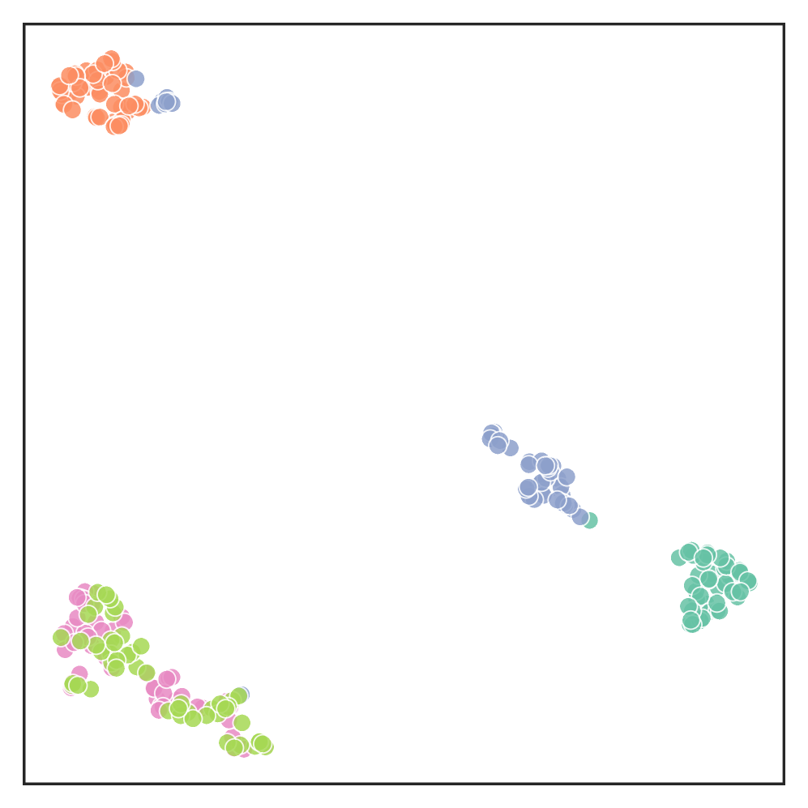
*(a)Ground Truth*

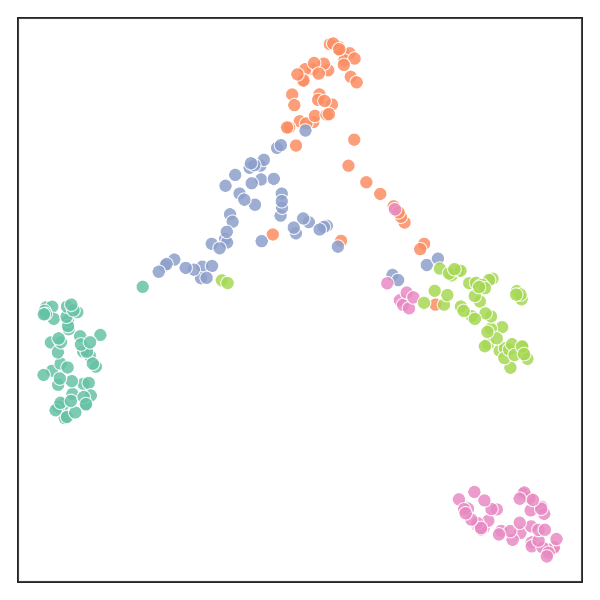
*(b)AnySynth*

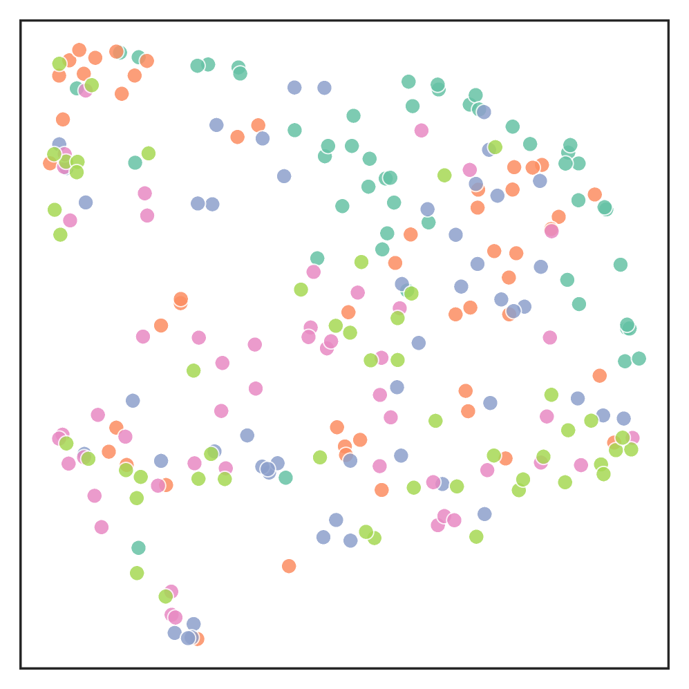
*(c)AnySynth (CLAP)*

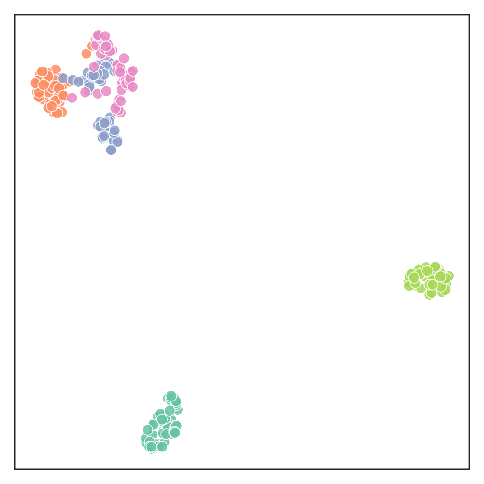
*(d)CTD*

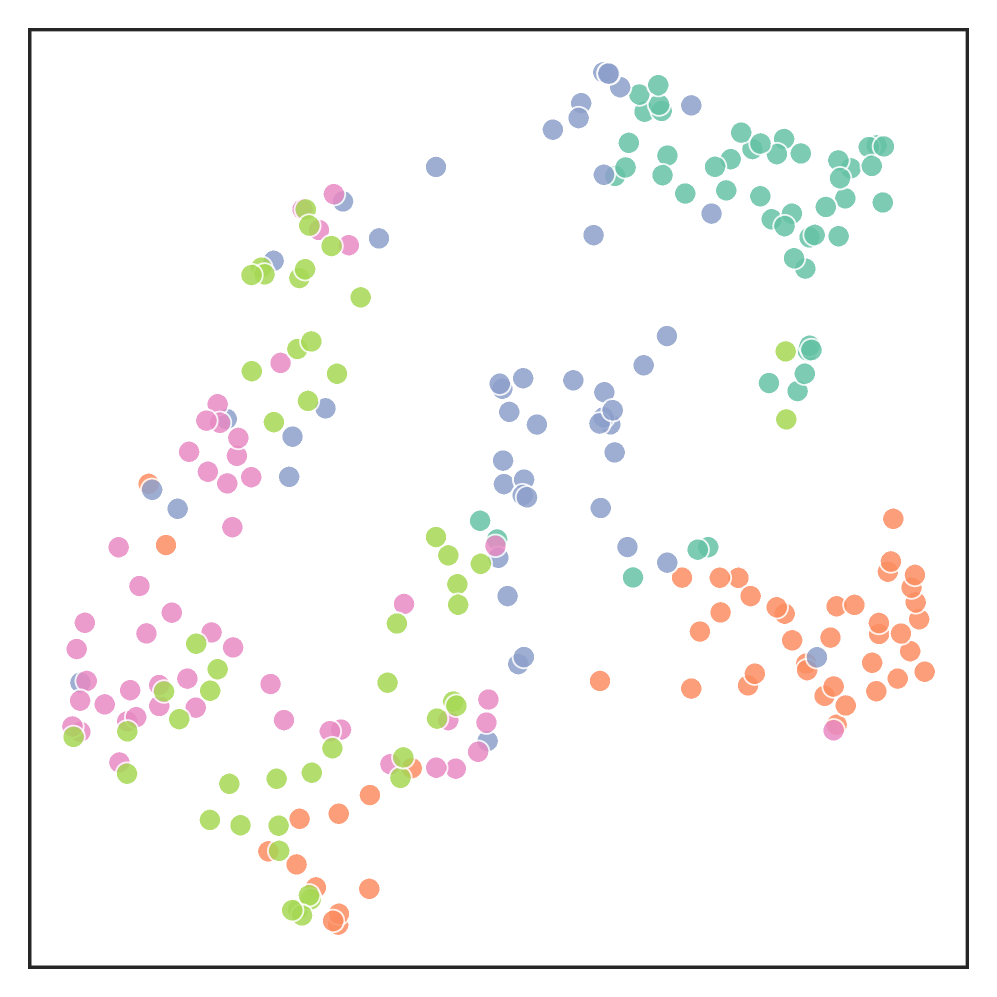
*(e)TokenSynth*

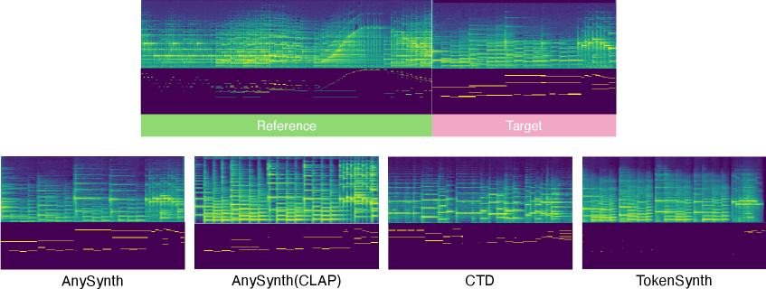
*Figure 3:Spectrogram and transcribed MIDI visualizations. Top: The reference and target audio-MIDI pairs. Bottom: Model predictions from the same target MIDI conditioning.*

*(a)PANNs*

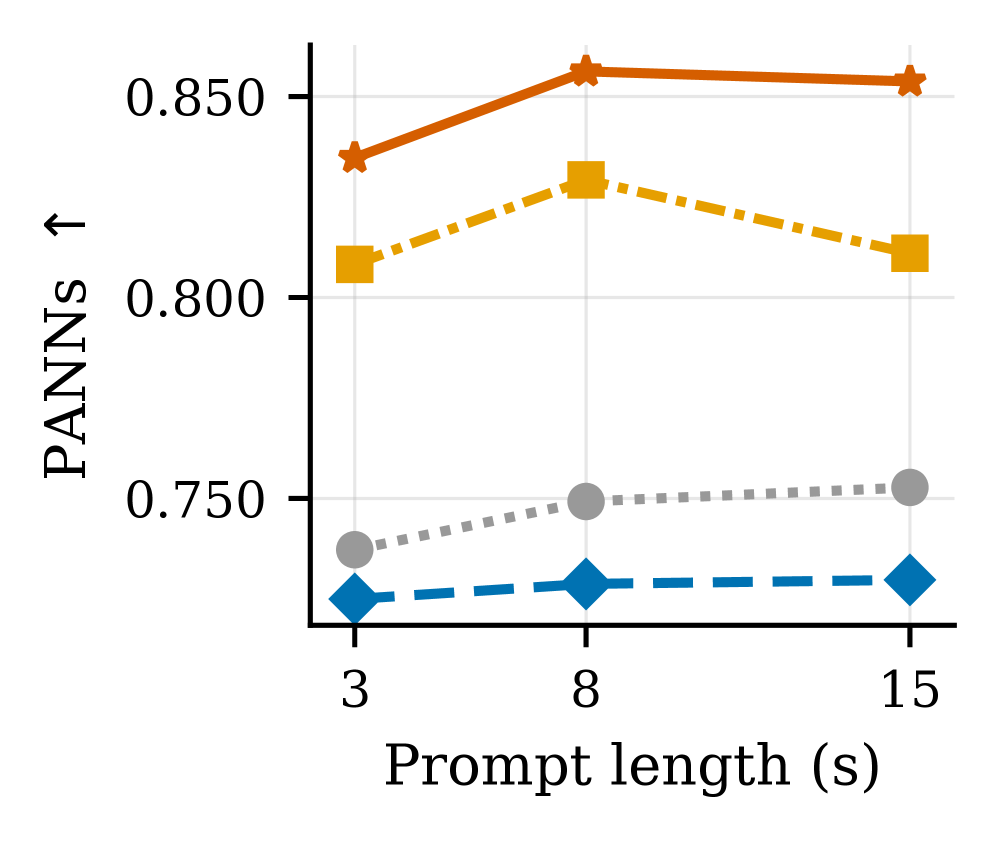
*(a)PANNs*

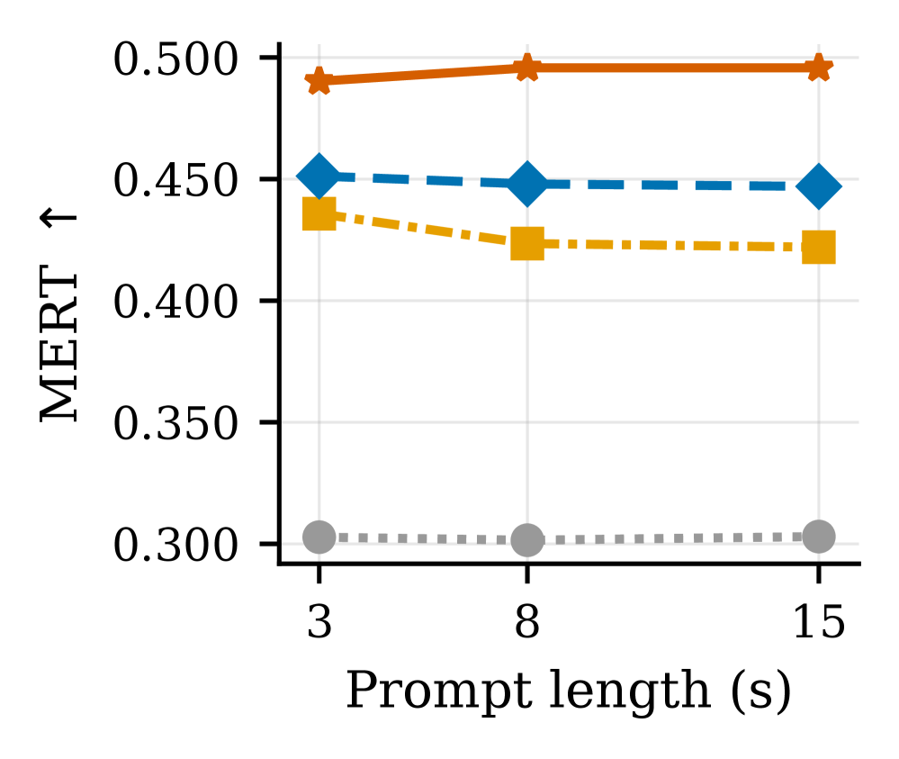
*(b)MERT*

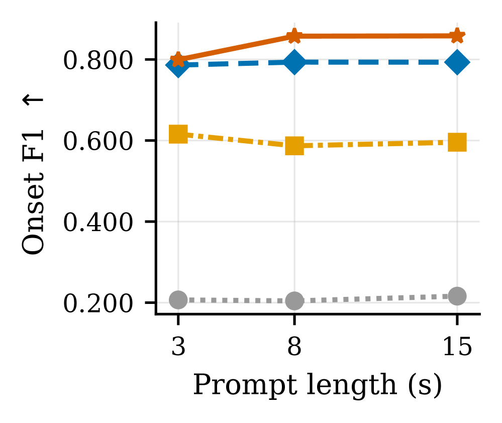
*(c)Onset F1*

---
**Usage Info**: 1897 tokens used.
**Generated at**: 2026-07-14 15:23:47

---

# 📚 Qwen-Audio-VAE Technical Report

🚀 URL: https://arxiv.org/html/2607.11738

## 🌏 Abstract (원문)
We introduceQwen-Audio-VAE, a suite of low-bitrate, fast-encoding continuous audio autoencoders designed for scalable general audio generation. The model is built around a simple but important principle: an audio VAE should not only reconstruct diverse audio with high fidelity, but also produce compact latent representations fast enough to support large-scale text-to-audio training. Qwen-Audio-VAE combines a causal encoder-decoder, window Transformer blocks, and multi-discriminator training to achieve a strong balance between reconstruction quality and compression rate. The model is trained at scale on 5 million hours of multi-domain audio, enabling robust reconstruction across heterogeneous acoustic conditions. To further improve computational efficiency, we adopt an asymmetric encoder-decoder backbone and introduce latency-aware encoder pruning to maximize encoding throughput. Experiments on public speech, music, and sound reconstruction benchmarks show that Qwen-Audio-VAE generalizes well across diverse audio domains and is particularly efficient, requiring only 541 ms to encode 32 minutes of audio. Overall, Qwen-Audio-VAE provides a high-quality, compact, and high-throughput representation backbone for efficient general audio generation.
## 🌏 Abstract (번역)
저희는 확장 가능한 일반 오디오 생성을 위해 설계된 저비트레이트, 고속 인코딩 연속 오디오 오토인코더 제품군인 Qwen-Audio-VAE를 소개합니다. 이 모델은 간단하지만 중요한 원칙을 기반으로 합니다: 오디오 VAE는 다양한 오디오를 높은 충실도로 재구성할 뿐만 아니라, 대규모 텍스트-오디오 훈련을 지원할 만큼 충분히 빠른 속도로 압축된 잠재 표현을 생성해야 합니다. Qwen-Audio-VAE는 인과적 인코더-디코더, 윈도우 트랜스포머 블록, 그리고 다중 판별자 훈련을 결합하여 재구성 품질과 압축률 사이의 강력한 균형을 달성합니다. 이 모델은 5백만 시간의 다중 도메인 오디오로 대규모 훈련되어 이질적인 음향 조건 전반에 걸쳐 견고한 재구성을 가능하게 합니다. 계산 효율성을 더욱 향상시키기 위해, 우리는 비대칭 인코더-디코더 백본을 채택하고 인코딩 처리량을 최대화하기 위해 지연 시간 인식 인코더 가지치기를 도입합니다. 공개 음성, 음악 및 사운드 재구성 벤치마크에 대한 실험은 Qwen-Audio-VAE가 다양한 오디오 도메인에 걸쳐 잘 일반화되며 특히 효율적이어서 32분 분량의 오디오를 인코딩하는 데 단 541ms만 필요함을 보여줍니다. 전반적으로 Qwen-Audio-VAE는 효율적인 일반 오디오 생성을 위한 고품질, 압축적이고 고처리량 표현 백본을 제공합니다.

## 🔍 Methods & Results
- Qwen-Audio-VAE는 24kHz 모노 오디오를 위한 연속 변분 오토인코더(VAE)로, 확장 가능한 일반 오디오 생성을 위한 표현 백본으로 설계되었습니다.
- 인코더는 파형을 480배 다운샘플링하여 50Hz로 만들고, 병목 지점에서 추가로 4배 압축하여 총 1920배 감소된 12.5Hz의 잠재 표현을 생성합니다. 이는 다운스트림 훈련 비용을 크게 줄입니다.
- 모델은 생성자(인과적 인코더-디코더)와 판별자(discriminator) 뱅크를 포함하는 VAE-GAN 설계를 따릅니다.
- 생성자는 DAC 스타일의 인과적 컨볼루션 인코더, 연속적인 대각 가우시안 잠재 병목, 그리고 12.5Hz에서 작동하는 두 개의 윈도우 트랜스포머 블록으로 구성됩니다.
- 디코더는 인코더보다 훨씬 더 많은 용량을 가진 비대칭 전치 컨볼루션 구조를 사용하여 1920배 압축을 24kHz로 역변환합니다.
- 훈련 중에는 다중 주기 판별자, 다중 해상도 STFT 판별자, 다중 스케일 STFT 판별자, 서브밴드 CQT 판별자로 구성된 판별자 뱅크가 재구성된 신호를 평가합니다.
- 생성자는 스펙트럼 재구성 손실(log-mel 및 magnitude-STFT), 적대적 손실, 특징 매칭 손실, 그리고 KL 발산 항의 가중 합계를 최소화하여 훈련됩니다.
- 인코더 지연 시간 최적화를 위해 스트라이드 재할당, 잔여 유닛 가지치기, 첫 번째 레이어 채널 감소의 세 단계를 거쳐 인코딩 처리량을 최대화했습니다.
- 이러한 최적화를 통해 32분 분량의 오디오를 인코딩하는 데 필요한 시간이 1957ms에서 541ms로 3.62배 단축되었으며, 재구성 품질은 거의 변하지 않았습니다.
- Qwen-Audio-VAE는 다양한 오디오 도메인에서 잘 일반화되며, 특히 효율적이어서 고품질, 압축적이고 고처리량의 표현 백본을 제공합니다.

## 🖼 Figures

*Figure 1:Qwen-Audio-VAE: a low-bitrate, fast-encoding continuous audio autoencoder with high-fidelity reconstruction across speech, music, and sound and fast encoding (541 ms  for 32 min of audio), making it an efficient backbone for general audio generation.*

*Figure 3:Qwen-Audio-VAE data pipeline. The multi-domain raw audio pool flows through accessibility, duration, decode/sample-rate, and content-quality stages; abnormal samples are skipped, repacked, filtered, or down-weighted rather than silently entering training. Retained samples are grouped into tar shards with offset-based reading, improving training throughput from 0.90 to 1.07 it/s.*

*Figure 4:Spectrogram reconstruction comparison on LibriSpeech. Columns: ground truth, Stable Audio Open (20 Hz), and Qwen-Audio-VAE (Ours, 12.5 Hz); the green box marks the highlighted high-frequency region. Despite its lower latent frame rate, Qwen-Audio-VAE preserves harmonic structure and high-frequency texture close to the ground truth, whereas Stable Audio Open blurs high-frequency detail.*

---
**Usage Info**: 5205 tokens used.
**Generated at**: 2026-07-14 15:23:59

---

# 📚 VoxENES 2026: Benchmarking Generalization of Speech Spoofing Detectors Against LLM-Era TTS and Voice Conversion

🚀 URL: https://arxiv.org/html/2607.11706

## 🌏 Abstract (원문)
Modern LLM-driven text-to-speech (TTS) and voice conversion (VC) systems produce synthetic speech that differs from the generators represented in many legacy spoofing benchmarks. This mismatch creates a temporal generalization gap that can overestimate detector robustness under real-world post-processing conditions. We bridge this gap by introducing VoxENES 2026, a bilingual (English and Spanish) benchmark of 53,628 audio samples generated using 10 contemporary speech synthesis methods and evaluated under 10 standardized post-processing conditions. Using VoxENES 2026, we benchmark eight pretrained detectors without fine-tuning and observe substantial performance degradation: the best model achieves 28.98% EER overall, while most perform near or below random chance across modern generators and perturbations. Our results highlight the reliance on brittle artifacts in current detectors and establish VoxENES 2026 as a practical testbed for developing robust audio spoofing countermeasures.
## 🌏 Abstract (번역)
최신 LLM 기반 텍스트 음성 변환(TTS) 및 음성 변환(VC) 시스템은 기존의 많은 스푸핑 벤치마크에 나타난 생성기와는 다른 합성 음성을 생성합니다. 이러한 불일치는 시간적 일반화 격차를 만들어 실제 후처리 조건에서 탐지기의 견고성을 과대평가할 수 있습니다. 우리는 10가지 최신 음성 합성 방법을 사용하여 생성되고 10가지 표준화된 후처리 조건에서 평가된 53,628개의 오디오 샘플로 구성된 이중 언어(영어 및 스페인어) 벤치마크인 VoxENES 2026을 도입하여 이 격차를 해소합니다. VoxENES 2026을 사용하여 미세 조정 없이 8개의 사전 훈련된 탐지기를 벤치마킹한 결과 상당한 성능 저하를 관찰했습니다. 최고의 모델은 전체적으로 28.98%의 EER을 달성했지만, 대부분의 모델은 최신 생성기와 교란 조건에서 무작위 확률에 가깝거나 그 이하의 성능을 보였습니다. 우리의 결과는 현재 탐지기들이 취약한 아티팩트에 의존하고 있음을 강조하며, VoxENES 2026이 견고한 오디오 스푸핑 방어책을 개발하기 위한 실용적인 테스트베드임을 확립합니다.

## 🔍 Methods & Results
- 기존 스푸핑 벤치마크와 최신 LLM 기반 TTS/VC 시스템 간의 합성 음성 불일치로 인해 탐지기 견고성 과대평가 문제가 발생함을 확인했습니다.
- 이러한 격차를 해소하기 위해 이중 언어(영어 및 스페인어) 벤치마크인 VoxENES 2026을 도입했습니다.
- VoxENES 2026은 10가지 최신 음성 합성 방법으로 생성된 53,628개의 오디오 샘플과 10가지 표준화된 후처리 조건을 포함합니다.
- 미세 조정 없이 8개의 사전 훈련된 탐지기를 VoxENES 2026으로 벤치마킹한 결과 상당한 성능 저하가 관찰되었습니다.
- 최고 성능 모델은 전체적으로 28.98%의 EER을 기록했으며, 대부분의 모델은 최신 생성기와 교란 조건에서 무작위 확률에 가깝거나 그 이하의 성능을 보였습니다.
- 이 결과는 현재 탐지기들이 취약한 아티팩트에 의존하고 있음을 시사하며, VoxENES 2026이 견고한 오디오 스푸핑 방어책 개발을 위한 실용적인 테스트베드임을 입증합니다.

## 🖼 Figures
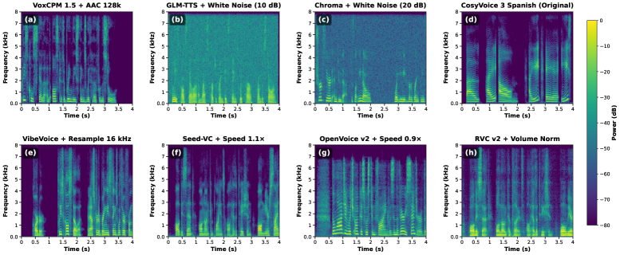
*Figure 1:Representative spectrograms across multiple TTS and VC systems and augmentation conditions in VoxENES 2026.*

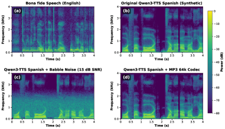
*Figure 2:Qualitative spectrogram comparison.*

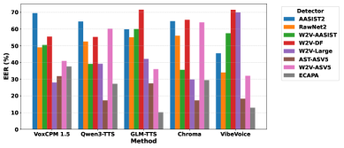
*Figure 3:Per-method EER on Original Samples*

---
**Usage Info**: 1577 tokens used.
**Generated at**: 2026-07-14 15:24:05

---

# 📚 Synchronized Three-Dimensional Vocal-Tract Motion for Speech Synchronization via Joint-Embedding Predictive Architecture Alignment

🚀 URL: https://arxiv.org/html/2607.11772

## 🌏 Abstract (원문)
Modern neural speech systems can generate intelligible waveforms, but they usually hide the physical speech-production state that produced the sound. Conversely, biomechanical vocal-tract models expose articulatory structure, contact behavior, airflow routing, and geometric constraints, but direct physical waveform synthesis remains less robust than modern neural vocoders. A duration-preserving acoustic carrier supplies the listening waveform, while a corrected three-dimensional vocal-tract model supplies synchronized jaw, lip, tongue, velum, laryngeal, oral-airflow, and nasal-airflow motion. A joint-embedding predictive architecture (JEPA)-style representation and a reinforcement learning/cross-entropy method (RL/CEM) trajectory-selection loop align articulatory actions to the acoustic carrier and to physical-plausibility constraints. The evaluation contains 12 3D recordings covering 24 minimal-pair stimuli. On the 24-word set, the carrier obtains good automatic speech recognition (ASR) results (an 8.33% WER, a 4.17% CER), a UTMOS score of 3.174, a mean JEPA score of 0.864, and a mean timbre-guard score of 0.947.
## 🌏 Abstract (번역)
현대 신경 음성 시스템은 이해 가능한 파형을 생성할 수 있지만, 일반적으로 소리를 생성한 물리적 음성 생성 상태를 숨깁니다. 반대로, 생체 역학적 성도 모델은 조음 구조, 접촉 행동, 기류 경로 및 기하학적 제약을 노출하지만, 직접적인 물리적 파형 합성은 현대 신경 보코더보다 견고성이 떨어집니다. 본 연구에서는 지속 시간을 보존하는 음향 캐리어가 청취 파형을 제공하고, 보정된 3차원 성도 모델이 동기화된 턱, 입술, 혀, 연구개, 후두, 구강 기류 및 비강 기류 움직임을 제공합니다. JEPA(Joint-Embedding Predictive Architecture) 스타일 표현과 RL/CEM(Reinforcement Learning/Cross-Entropy Method) 궤적 선택 루프는 조음 동작을 음향 캐리어 및 물리적 타당성 제약에 정렬합니다. 평가는 24개의 최소 대립쌍 자극을 포함하는 12개의 3D 녹음으로 구성됩니다. 24단어 세트에서 캐리어는 우수한 자동 음성 인식(ASR) 결과(8.33% WER, 4.17% CER), 3.174의 UTMOS 점수, 0.864의 평균 JEPA 점수, 0.947의 평균 음색 보호 점수를 얻었습니다.

## 🔍 Methods & Results
- 텍스트, 음소 시퀀스, 지속 시간을 입력으로 받아 조음 기관 및 시각화 채널을 제어하는 조음 동작 시퀀스를 생성하는 컨트롤러를 사용한다.
- 생성된 조음 동작 시퀀스를 타이밍, 부드러움, 접촉, 가시성, 기하학적 제약을 포함하는 3D 상태 궤적으로 매핑하는 조음 모델을 사용한다.
- 청취 파형은 지속 시간을 보존하는 음향 캐리어로 제공되며, 물리적 음향 분기는 진단용으로만 사용된다.
- 시스템 파이프라인은 텍스트 및 지속 시간 준비, 조음 동작 생성, 조음 모델 시뮬레이션, 캐리어 파형 준비, 녹화된 시청각 준비의 5단계로 구성된다.
- 턱, 입술, 혀, 연구개 등 해부학적으로 관련된 상태 변수에 매핑된 시간 색인화된 동작을 통해 조음 기관을 제어한다.
- 피부, 턱, 혀, 구강, 인두관, 비강 등 다양한 해부학적 구조를 노출하는 3D 모델을 사용하며, 투명한 내부 검사 뷰를 통해 혀 움직임, 접촉 영역, 기하학적 구조를 시각화한다.
- OpenGL 뷰어에서 조음 움직임을 녹화하고, 자막을 오버레이하며, 캐리어 오디오와 동기화하여 시청각 증거를 생성한다.
- 24단어 세트에서 8.33% WER, 4.17% CER의 ASR 성능, 3.174 UTMOS, 0.864 평균 JEPA, 0.947 평균 음색 보호 점수를 달성했다.

---
**Usage Info**: 4096 tokens used.
**Generated at**: 2026-07-14 15:24:20

---

# 📚 Evaluating SSL and ViViT Architectures for Cross-Corpus Audio MOS Prediction via LODO Validation

🚀 URL: https://arxiv.org/html/2607.10146

## 🌏 Abstract (원문)
Automatic Mean Opinion Score (MOS) prediction is essential for evaluating large-scale synthetic speech and audio enhancement systems, yet models frequently struggle with domain shift. This study presents a comprehensive benchmarking of three architectural frameworks: Frozen Self-Supervised Learning (SSL-FRZ), Fine-Tuned SSL (SSL-FT), and a Video Vision Transformer (ViViT). Evaluation is conducted in two phases: Part I utilizes a consolidated corpus of 130,000 samples across 19 diverse datasets, while Part II focuses on a purified 17-dataset English-only corpus. To assess robustness, a systematic Leave-One-Dataset-Out (LODO) protocol is employed to quantify the generalization gap between seen and unseen distributions. Finally, the top-performing model is benchmarked against 18 state-of-the-art (SOTA) metrics using the ARECHO framework.Results demonstrate that an English-only purified corpus consistently yields higher predictive precision across all architectures. While SSL-FT achieves the highest performance on seen validation data, the SSL-FRZ model provides superior robustness on unseen distributions, achieving a competitive Mean Squared Error (MSE) of 0.36 on the URGENT 2024 benchmark—closely matching domain-optimized SOTA metrics (MSE 0.30). Although the ViViT architecture remains below SSL-based models in total capacity, it delivers stable results in English-only trials. LODO results confirm that while models perform significantly better on seen samples, frozen SSL embeddings combined with deep Transformer encoders offer the most stable and scalable solution for universal speech quality assessment. To support further research, the top-performing English-only SSL-Transformer model and weights are made publicly available via Hugging Face.
## 🌏 Abstract (번역)
자동 평균 의견 점수(MOS) 예측은 대규모 합성 음성 및 오디오 향상 시스템을 평가하는 데 필수적이지만, 모델은 도메인 변화에 자주 어려움을 겪습니다. 본 연구는 세 가지 아키텍처 프레임워크인 Frozen Self-Supervised Learning (SSL-FRZ), Fine-Tuned SSL (SSL-FT), 그리고 Video Vision Transformer (ViViT)에 대한 포괄적인 벤치마킹을 제시합니다. 평가는 두 단계로 진행됩니다. 1부에서는 19개 다양한 데이터셋에 걸쳐 130,000개 샘플로 구성된 통합 코퍼스를 활용하고, 2부에서는 정제된 17개 데이터셋의 영어 전용 코퍼스에 중점을 둡니다. 견고성을 평가하기 위해 체계적인 Leave-One-Dataset-Out (LODO) 프로토콜을 사용하여 학습된 분포와 학습되지 않은 분포 간의 일반화 격차를 정량화합니다. 마지막으로, 최고 성능 모델은 ARECHO 프레임워크를 사용하여 18가지 최첨단(SOTA) 지표와 비교 벤치마킹됩니다. 결과는 영어 전용 정제 코퍼스가 모든 아키텍처에서 일관되게 더 높은 예측 정밀도를 제공함을 보여줍니다. SSL-FT가 학습된 검증 데이터에서 가장 높은 성능을 달성했지만, SSL-FRZ 모델은 학습되지 않은 분포에서 우수한 견고성을 제공하여 URGENT 2024 벤치마크에서 경쟁력 있는 평균 제곱 오차(MSE) 0.36을 달성했으며, 이는 도메인 최적화된 SOTA 지표(MSE 0.30)와 거의 일치합니다. ViViT 아키텍처는 전체 용량 면에서 SSL 기반 모델보다 낮지만, 영어 전용 실험에서 안정적인 결과를 제공합니다. LODO 결과는 모델이 학습된 샘플에서 훨씬 더 나은 성능을 보이지만, 깊은 트랜스포머 인코더와 결합된 고정된 SSL 임베딩이 보편적인 음성 품질 평가를 위한 가장 안정적이고 확장 가능한 솔루션을 제공함을 확인합니다. 추가 연구를 지원하기 위해 최고 성능의 영어 전용 SSL-트랜스포머 모델과 가중치는 Hugging Face를 통해 공개적으로 제공됩니다.

## 🔍 Methods & Results
- 연구는 130,652개의 발화로 구성된 통합 코퍼스(Part I)와 123,405개의 영어 전용 발화로 정제된 코퍼스(Part II)를 구축하여 진행되었습니다.
- 데이터는 Blizzard Challenge, VCC 2020, VoiceMOS 시리즈(2022-2025), URGENT 2024, TTSDS2, CHiME-7 UDASE, TCD-VoIP, PSTN, NISQA Corpus, SOMOS 등 19개 이상의 다양한 출처에서 수집되었습니다.
- 모든 오디오는 16kHz로 리샘플링되고 5초 길이의 고정 세그먼트로 분할되었으며, ViViT 모델을 위해 MFCC 특징이 추출되거나 SSL 모델을 위해 WavLM-Large 백본을 통해 1024차원 잠재 벡터가 생성되었습니다.
- 제안된 아키텍처는 WavLM-Large 백본(고정 또는 미세 조정)과 2계층 트랜스포머 인코더를 사용하는 SSL-Transformer와, MFCC 스펙트로그램을 처리하는 ViViT-MFCC로 구성됩니다.
- 실험은 데이터 다양성(Part I: 전체 코퍼스)과 언어적 일관성(Part II: 영어 전용 코퍼스)이 MOS 예측에 미치는 영향을 체계적으로 평가하기 위해 두 부분으로 나뉘어 진행되었습니다.
- 모델의 일반화 및 도메인 견고성을 평가하기 위해 Leave-One-Dataset-Out (LODO) 프로토콜이 사용되었으며, URGENT 2024 데이터셋을 주요 벤치마크로 활용했습니다.
- 최고 성능 모델은 ARECHO 프레임워크를 사용하여 DNSMOS, UTMOS, NISQA 등 18가지 최첨단(SOTA) 지표와 비교 평가되었습니다.
- 영어 전용 정제 코퍼스가 모든 아키텍처에서 일관되게 더 높은 예측 정밀도를 보였습니다.
- SSL-FT는 학습된 검증 데이터에서 가장 높은 성능을 달성했지만, SSL-FRZ 모델은 학습되지 않은 분포에서 우수한 견고성을 제공하여 URGENT 2024 벤치마크에서 MSE 0.36을 달성했습니다.
- ViViT 아키텍처는 SSL 기반 모델보다 전체 용량은 낮지만, 영어 전용 실험에서 안정적인 결과를 제공했습니다.
- LODO 결과는 모델이 학습된 샘플에서 더 나은 성능을 보이지만, 고정된 SSL 임베딩과 깊은 트랜스포머 인코더의 조합이 보편적인 음성 품질 평가를 위한 가장 안정적이고 확장 가능한 솔루션임을 확인했습니다.
- 최고 성능의 영어 전용 SSL-Transformer 모델과 가중치는 추가 연구를 위해 Hugging Face를 통해 공개되었습니다.

## 🖼 Figures

*Figure 1:Proposed experimental pipeline for large-scale MOS prediction and multi-metric benchmarking. The framework illustrates the flow from data acquisition and deduplication to parallel model training (SSL-Transformer and ViViT) and final evaluation against ARECHO SOTA.*

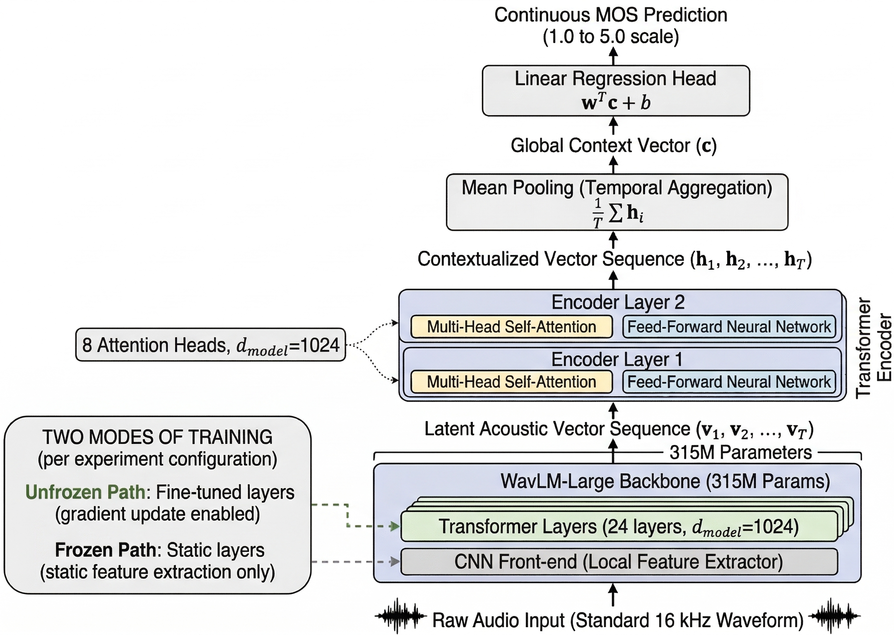
*Figure 2:Architecture of the proposed SSL-Transformer Encoder framework.*

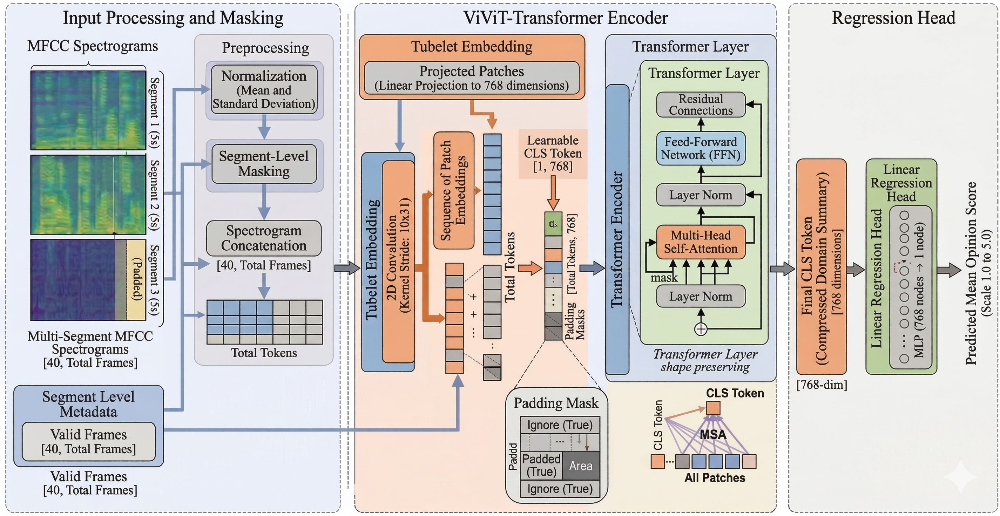
*Figure 3:Architecture of the proposed ViViT-Transformer Encoder framework.*

---
**Usage Info**: 8928 tokens used.
**Generated at**: 2026-07-14 15:24:34

---

# 📚 BackgroundMellow: A Multi-Modal Cohesive Framework for Narrative-Driven Rich Cinematic Soundscape Generation

🚀 URL: https://arxiv.org/html/2607.11364

## 🌏 Abstract (원문)
Generating immersive, synchronized and cinematic audio for long-form textual narratives remains a significant challenge in multi-modal AI. While current Text-to-Audio (TTA) frameworks successfully synthesize isolated sound effects, they struggle with narrative cohesion, temporal alignment, and cinematic emotional depth. We presentBackgroundMellow, a framework that treats story-to-audio generation as a precise orchestration and signal processing problem. This framework is enabled without ground-truth through a master-specialist agent architecture that decomposes text into precise and multi-layered audio cues, generates each category of sounds with suitable specialist model, and superimposes the soundscapes to create a unified and aligned audio segment. Our pipeline is built over Tango2 latent diffusion model for environmental synthesis alongside a novel Cinematic BGM Retriever mined from professional soundtracks. To automate the sound mixing process, we use an NLP based module that predicts precise audio parameters, like start time, duration, and relative loudness, based on the narrative timeline. We further empirically evaluate and show the efficacy of the proposed framework leveraging nearest-neighbor retrieval against a curated dataset of YouTube cinematic trailers to measure temporal synchronization, coverage, and spectral richness.
## 🌏 Abstract (번역)
긴 형식의 텍스트 내러티브를 위한 몰입감 있고, 동기화되며, 영화적인 오디오를 생성하는 것은 다중 모달 AI에서 여전히 중요한 과제로 남아 있습니다. 현재의 텍스트-오디오(TTA) 프레임워크는 개별적인 음향 효과를 성공적으로 합성하지만, 내러티브의 응집력, 시간적 정렬, 그리고 영화적인 감정적 깊이 측면에서는 어려움을 겪습니다. 우리는 스토리-오디오 생성을 정밀한 오케스트레이션 및 신호 처리 문제로 다루는 프레임워크인 BackgroundMellow를 제시합니다. 이 프레임워크는 마스터-전문가 에이전트 아키텍처를 통해 그라운드 트루스 없이 구현되며, 텍스트를 정밀하고 다층적인 오디오 큐로 분해하고, 각 사운드 범주를 적합한 전문가 모델로 생성한 다음, 사운드스케이프를 중첩하여 통일되고 정렬된 오디오 세그먼트를 만듭니다. 우리의 파이프라인은 환경 합성을 위한 Tango2 잠재 확산 모델과 전문 사운드트랙에서 추출한 새로운 시네마틱 BGM 검색기를 기반으로 구축되었습니다. 사운드 믹싱 프로세스를 자동화하기 위해, 내러티브 타임라인을 기반으로 시작 시간, 지속 시간, 상대적 음량과 같은 정확한 오디오 매개변수를 예측하는 NLP 기반 모듈을 사용합니다. 우리는 또한 YouTube 시네마틱 트레일러의 큐레이션된 데이터셋에 대한 최근접 이웃 검색을 활용하여 시간 동기화, 커버리지 및 스펙트럼 풍부도를 측정함으로써 제안된 프레임워크의 효능을 경험적으로 평가하고 보여줍니다.

## 🔍 Methods & Results
- BackgroundMellow 프레임워크는 마스터-전문가 패러다임을 사용하여 내러티브의 의미론적 계획과 오디오 구성 요소의 원시 합성을 분리합니다.
- 마스터 대규모 언어 모델(LLM)은 텍스트를 오디오 클래스, 오디오 유형, 시작 시간, 지속 시간, 음량, 페이드 시간 등을 포함하는 오디오 큐 시퀀스로 분해합니다.
- 마스터 에이전트는 단어 수준 인덱싱을 사용하여 큐를 내레이터의 타임라인에 정렬하고, 의미론적 강도와 중첩 트랙 밀도를 기반으로 음량을 동적으로 계산합니다.
- 전문가 생성기(Specialist Generators)는 SFX, 환경, 음악, 시네마틱 BGM 검색기, 내레이터 AI(Parler-TTS)를 포함하며, 각 오디오 클래스에 최적화된 모델을 사용합니다.
- 고정 길이 출력을 가진 잠재 확산 모델(예: Tango2)의 한계를 극복하기 위해, 10초 미만 지속 시간은 CLAP 모델을 이용한 의미론적 정렬을 통해 잘라내고, 10초 초과 지속 시간은 루핑 및 크로스페이딩을 통해 확장합니다.
- "Gap-Filler" 에이전트라는 보조 LLM은 생성된 트랙을 원본 텍스트와 교차 참조하여 놓친 청각적 기회(예: 날카로운 숨소리 SFX 추가)를 합성합니다.
- 평가 방법론은 그라운드 트루스 없이 중첩된 다중 트랙 오디오를 평가하기 위한 새로운 최근접 이웃 검색 평가 프레임워크를 제안합니다.
- YT 커버리지 점수(의미론적 재현율)는 생성 모델이 장면의 필요한 음향 요소를 성공적으로 합성했는지 측정하며, 그라운드 트루스 큐의 재현율로 계산됩니다.
- YT 동기화 점수(시간적 IoU)는 일치하는 쌍에 대한 1차원 IoU를 계산하여 생성된 음악 및 환경 사운드의 리듬 및 영화적 페이싱을 평가합니다.
- 주관적 평가를 위해 인간의 지각 점수를 수집하는 오픈 소스 웹 플랫폼을 개발했으며, 이는 개별 모델 성능(전문가 수준)과 최종 믹스 오케스트레이션(마스터 수준)을 모두 평가합니다.

## 🖼 Figures
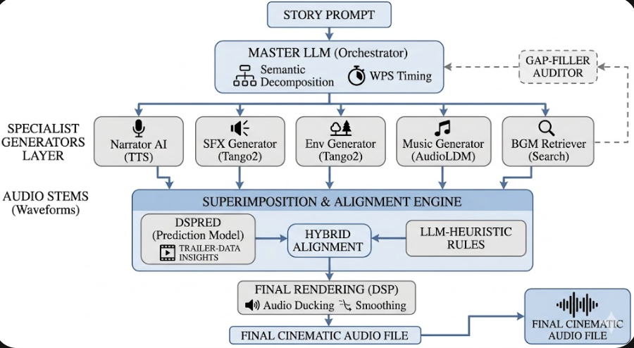
*Figure 1:Hierarchical Master-Specialist Architecture of BackgroundMellow Framework*

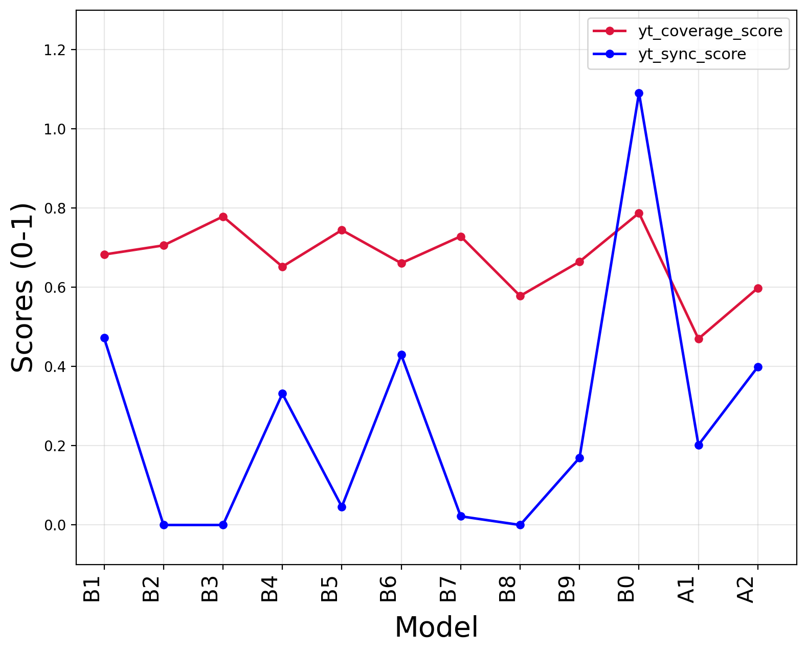
*(a)YouTube Metrics*

*(a)YouTube Metrics*

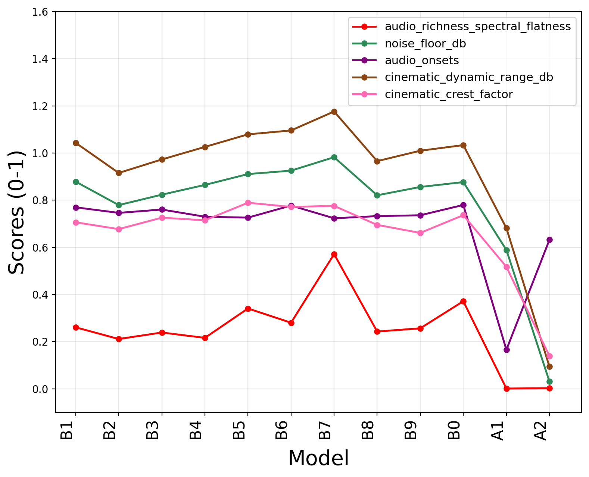
*(b)Ablation Results*

---
**Usage Info**: 4015 tokens used.
**Generated at**: 2026-07-14 15:24:44

---

# 📚 A Production-Oriented Framework for Evaluation of SFX Generation

🚀 URL: https://arxiv.org/html/2607.09973

## 🌏 Abstract (원문)
Industrial sound design requires audio generation systems that not only produce realistic audio, but also preserve the perceptual identity of a reference, support controllable variation, and remain efficient for practical workflows. Existing evaluations are usually tied to text-to-audio (TTA), unconditional, or task-specific settings, limiting assessment for reference-guided sound effects (SFX) variation. To address this gap, we present a production-oriented evaluation framework for structured comparison of heterogeneous audio generation and editing methods. Our framework identifies nine production requirements and explicitly accounts for differences in model capabilities, enabling comparison under a common production objective. A two-stage protocol is introduced: (1) a reference-guided audio-to-audio (ATA) variation task, in which all methods are evaluated under the same ESC-50 SFX adaptation setup, and (2) capability-specific analyses of native operations such as SFX morphing, temporal and energy alignment, inpainting, and targeted editing. This framework combines objective metrics (including FAD, ImageBind-based reference alignment, and diversity across generated variants), together with a human study of perceptual identity preservation and transient diagnosis. Our study reveals complementary strengths and trade-offs across baselines for different production needs. Among the full-generation baselines evaluated under a shared ATA setting, AudioX provides the strongest overall trade-off between reference alignment and diversity while still supporting SFX morphing. Other baselines remain most suitable for specific editing operations. Our framework establishes a structured evaluation and decision protocol for reference-guided SFX variation and provides a practical basis for designing future unified industrial audio generation pipelines. Audio demos and further details can be found on the accompanying web page111https://melodiedesbos.github.io/sfx-eval-framework.
## 🌏 Abstract (번역)
산업용 사운드 디자인은 사실적인 오디오를 생성할 뿐만 아니라, 참조 오디오의 지각적 정체성을 보존하고, 제어 가능한 변형을 지원하며, 실용적인 워크플로우를 위해 효율적인 오디오 생성 시스템을 요구합니다. 기존 평가는 일반적으로 텍스트-오디오(TTA), 무조건적 또는 특정 작업 설정에 묶여 있어, 참조 기반 음향 효과(SFX) 변형에 대한 평가를 제한합니다. 이 격차를 해소하기 위해, 우리는 이질적인 오디오 생성 및 편집 방법을 구조적으로 비교하기 위한 생산 지향적 평가 프레임워크를 제시합니다. 우리의 프레임워크는 아홉 가지 생산 요구사항을 식별하고 모델 기능의 차이를 명시적으로 고려하여, 공통된 생산 목표 하에 비교를 가능하게 합니다. 두 단계 프로토콜이 도입됩니다: (1) 모든 방법이 동일한 ESC-50 SFX 적응 설정 하에 평가되는 참조 기반 오디오-오디오(ATA) 변형 작업, 그리고 (2) SFX 모핑, 시간 및 에너지 정렬, 인페인팅, 타겟 편집과 같은 고유 작업에 대한 기능별 분석입니다. 이 프레임워크는 객관적인 지표(FAD, ImageBind 기반 참조 정렬, 생성된 변형 간 다양성 포함)와 지각적 정체성 보존 및 과도 현상 진단에 대한 인간 연구를 결합합니다. 우리의 연구는 다양한 생산 요구사항에 대한 기준선들 간의 상호 보완적인 강점과 절충점을 밝혀냅니다. 공유된 ATA 설정 하에 평가된 전체 생성 기준선 중에서 AudioX는 참조 정렬과 다양성 사이에서 가장 강력한 전반적인 절충점을 제공하며 SFX 모핑을 여전히 지원합니다. 다른 기준선들은 특정 편집 작업에 가장 적합합니다. 우리의 프레임워크는 참조 기반 SFX 변형을 위한 구조화된 평가 및 결정 프로토콜을 수립하고, 미래의 통합된 산업용 오디오 생성 파이프라인 설계를 위한 실용적인 기반을 제공합니다. 오디오 데모 및 추가 세부 정보는 첨부된 웹 페이지111https://melodiedesbos.github.io/sfx-eval-framework에서 확인할 수 있습니다.

## 🔍 Methods & Results
- 이질적인 오디오 생성 및 편집 방법을 구조적으로 비교하기 위한 생산 지향적 평가 프레임워크를 제시했습니다.
- 프레임워크는 9가지 생산 요구사항을 식별하고 모델 기능의 차이를 명시적으로 고려하여 공통된 생산 목표 하에 비교를 가능하게 합니다.
- 두 단계 프로토콜을 도입했습니다: (1) 참조 기반 오디오-오디오(ATA) 변형 작업 (ESC-50 SFX 적응 설정 하에 평가), (2) SFX 모핑, 시간 및 에너지 정렬, 인페인팅, 타겟 편집과 같은 고유 작업에 대한 기능별 분석.
- 객관적인 지표(FAD, ImageBind 기반 참조 정렬, 생성된 변형 간 다양성)와 지각적 정체성 보존 및 과도 현상 진단에 대한 인간 연구를 결합하여 평가를 수행했습니다.
- 연구 결과, 다양한 생산 요구사항에 대한 기준선들 간의 상호 보완적인 강점과 절충점이 밝혀졌습니다.
- 공유된 ATA 설정 하에 평가된 전체 생성 기준선 중에서 AudioX는 참조 정렬과 다양성 사이에서 가장 강력한 전반적인 절충점을 제공하며 SFX 모핑을 지원하는 것으로 나타났습니다.
- 다른 기준선들은 특정 편집 작업에 가장 적합한 것으로 확인되었습니다.
- 이 프레임워크는 참조 기반 SFX 변형을 위한 구조화된 평가 및 결정 프로토콜을 수립하고, 미래의 통합된 산업용 오디오 생성 파이프라인 설계를 위한 실용적인 기반을 제공합니다.

## 🖼 Figures
![Figure 1:Overview of the proposed production-oriented evaluation framework for reference-guided SFX variation. A. In production settings, a reference sound often requires multiple diverse variations (Sec. 3.1); B. Existing baselines address complementary capabilities (17; 5; 19; 12; 28), including full variation generation (Sec. 3.2); C. We propose an evaluation framework to assess models’ abilities at generating variations of SFX in production settings (Sec. 3) and report a full capability profile for each baseline on our web page LABEL:fn:web.](../images/2026-07-14/2607.09973/2607.09973_fig0.png)
*Figure 1:Overview of the proposed production-oriented evaluation framework for reference-guided SFX variation. A. In production settings, a reference sound often requires multiple diverse variations (Sec. 3.1); B. Existing baselines address complementary capabilities (17; 5; 19; 12; 28), including full variation generation (Sec. 3.2); C. We propose an evaluation framework to assess models’ abilities at generating variations of SFX in production settings (Sec. 3) and report a full capability profile for each baseline on our web page LABEL:fn:web.*

*Figure 2:Diversity–identity alignment (R3-R2) trade-off across reference-guided SFX variation methods. Each point represents a model positioned according to its ability to preserve reference identity and generate diverse variations. Higher diversity and alignment are better.*

*Figure 3:Qualitative comparison for the ATA variation task on the human-sound example laughing. For A2SB inpainting, the masked and regenerated sections between 0.3 s and 1 s are outlined. Similar texture to reference is outlined in white. Top: mel-spectrogram. Bottom: energy curve.*

*Figure 4:Ablations on SFX Morphing task for AudioLDM (17) and AudioX (28) on ESC-50 (25). From left to right: the reference audio (e.g., sheep, toilet_flush, cough) and four generated samples conditioned on the target text prompt with different initialization noise levels 
𝜎
 (transfer strength).*

![Figure 5:Ablation of ThinkSound on object-centric local editing over masked regions of the reference (e.g. crow class from ESC-50 (25)). Three instructions are evaluated: a. Attenuation, "reduce the {class_name} volume to sound far away and muffled, in the target region only."; b. Enhancement, "make {class_name} sound in the target region stronger and sharper."; and c. Reverberation, "make {class_name} event more distant and reverberant in the target region only.". Masked and edited sections [1 s; 3 s] are outlined.](../images/2026-07-14/2607.09973/2607.09973_fig4.png)
*Figure 5:Ablation of ThinkSound on object-centric local editing over masked regions of the reference (e.g. crow class from ESC-50 (25)). Three instructions are evaluated: a. Attenuation, "reduce the {class_name} volume to sound far away and muffled, in the target region only."; b. Enhancement, "make {class_name} sound in the target region stronger and sharper."; and c. Reverberation, "make {class_name} event more distant and reverberant in the target region only.". Masked and edited sections [1 s; 3 s] are outlined.*

*Figure 6:Pareto-Inspired Analysis across reference-guided SFX variation methods. We claim for pareto-inspired as for b) methods may not be direct equals in inference efficiency due to different backbones, batch size and audio representations. For all evaluated values; higher is better.*

![Figure 7:Additional qualitative comparison of ATA variations using mel-spectrograms on three representative ESC-50 classes: crow, chirping birds, and hand_saw. Each row corresponds to one baseline and each column to one reference class. The figure highlights differences in local texture preservation, temporal organization, and variation behavior across methods. For A2SB inpainting, the masked and regenerated regions are outlined, since only a localized segment of the reference is modified. Black boxes indicate prominent texture regions in the reference, while white boxes highlight similar texture patterns preserved in the generated outputs.](../images/2026-07-14/2607.09973/2607.09973_fig6.png)
*Figure 7:Additional qualitative comparison of ATA variations using mel-spectrograms on three representative ESC-50 classes: crow, chirping birds, and hand_saw. Each row corresponds to one baseline and each column to one reference class. The figure highlights differences in local texture preservation, temporal organization, and variation behavior across methods. For A2SB inpainting, the masked and regenerated regions are outlined, since only a localized segment of the reference is modified. Black boxes indicate prominent texture regions in the reference, while white boxes highlight similar texture patterns preserved in the generated outputs.*

---
**Usage Info**: 3132 tokens used.
**Generated at**: 2026-07-14 15:24:58

---

# 📚 Breaking the Quality–Intelligibility Trade-off in Streaming Target Speaker Extraction via Deep-Feature-Anchored Preference Optimization

🚀 URL: https://arxiv.org/html/2607.10191

## 🌏 Abstract (원문)
Generative streaming models for Target Speaker Extraction (TSE) commonly exhibit a quality–intelligibility trade-off, wherein naive optimization for perceptual audio quality tends to degrade speech intelligibility, and conversely. We reveal that this trade-off arises not from the constraints of streaming architectures, but from an inappropriate choice of optimization anchor. Directly optimizing against audio quality metrics induces catastrophic reward hacking, where content critical to pronunciation and intelligibility is systematically erased to maximize a proxy score. To break this bottleneck, we propose two complementary improvements: an enlarged Conformer convolution kernel for richer local spectro-temporal modeling, and WavLM-anchored Direct Preference Optimization (DPO) fine-tuning strategy. DPO preference pairs are ranked by WavLM cosine similarity, a deep acoustic feature encoding both phonetic structure and speaker identity, providing an optimization anchor that resists hacking. Under a 560
ms streaming chunk size, the proposed method achieves a 10.9% relative intelligibility improvement (word error rate: 0.138→0.123), with marginal simultaneous gains in audio quality and speaker similarity.
## 🌏 Abstract (번역)
타겟 화자 추출(TSE)을 위한 생성 스트리밍 모델은 일반적으로 품질-명료도 트레이드오프를 보인다. 즉, 지각적 오디오 품질에 대한 순진한 최적화는 음성 명료도를 저하시키는 경향이 있으며, 그 반대도 마찬가지이다. 우리는 이러한 트레이드오프가 스트리밍 아키텍처의 제약에서 발생하는 것이 아니라, 부적절한 최적화 앵커 선택에서 비롯된다는 것을 밝혀냈다. 오디오 품질 지표에 대해 직접 최적화하는 것은 발음과 명료도에 중요한 내용이 프록시 점수를 최대화하기 위해 체계적으로 지워지는 치명적인 보상 해킹을 유발한다. 이러한 병목 현상을 해결하기 위해 우리는 두 가지 보완적인 개선 사항을 제안한다: 더 풍부한 지역 스펙트로-시간 모델링을 위한 확장된 Conformer 컨볼루션 커널, 그리고 WavLM 기반의 직접 선호 최적화(DPO) 미세 조정 전략이다. DPO 선호 쌍은 음성 구조와 화자 정체성을 모두 인코딩하는 심층 음향 특징인 WavLM 코사인 유사도에 의해 순위가 매겨지며, 해킹에 저항하는 최적화 앵커를 제공한다. 560ms 스트리밍 청크 크기에서 제안된 방법은 오디오 품질 및 화자 유사성에서 미미한 동시 개선과 함께 10.9%의 상대적 명료도 향상(단어 오류율: 0.138→0.123)을 달성한다.

## 🔍 Methods & Results
- 제안된 방법은 StarTSE 스트리밍 백본을 기반으로 하며, Conformer 컨볼루션 커널을 확장하여 더 풍부한 지역 시간적 컨텍스트를 제공하고, WavLM 기반 DPO 미세 조정을 적용하여 품질-명료도 트레이드오프를 해결한다.
- 모델은 엄격한 인과적 스트리밍 제약 하에 작동하는 인코더-디코더 백본을 채택하며, 선호도에 민감한 이산 토큰 생성을 담당하는 의미 경로와 연속 도메인 코덱 임베딩 재구성 및 파형 합성을 담당하는 음향 경로로 구성된다.
- 의미 경로에는 공유 Conformer 음성 인코더(확장된 컨볼루션 커널 k 사용)와 청크 단위 인터리브 스플라이싱 패러다임을 사용하는 의미 추출 언어 모델(SELM)이 포함된다.
- 음향 경로에는 SELM의 출력에서 미세한 음향 세부 정보를 복구하는 음향 정제 언어 모델(ARLM)과 이전 청크의 출력을 명시적으로 활용하여 경계 불연속성을 해결하는 코덱 디코더(Historical Context Refinement 포함)가 포함된다.
- DPO(Direct Preference Optimization)는 토큰 수준 교차 엔트로피 손실과 인간 지각 판단 간의 불일치를 해결하기 위해 선호도 정렬을 대조 분류 문제로 재구성하며, 최적화는 의미 경로(공유 인코더 및 SELM)에 한정된다.
- 각 혼합 입력에 대해 사전 훈련된 StarTSE 모델은 16개의 후보 출력을 생성하며, 이들은 지각 품질(DNSMOS), 명료도(WER), 화자 유사성(WavLM 코사인 유사도)의 세 가지 차원에서 평가된다.
- DPO 선호 쌍을 순위 매기는 데 사용되는 지표의 선택이 보상 해킹을 방지하는 데 중요하며, DNSMOS, WER, WavLM 코사인 유사도에 따라 순위가 매겨진 세 가지 DPO 변형이 테스트되었다.
- WavLM 코사인 유사도로 순위가 매겨진 DPO는 음성 구조와 화자 정체성을 인코딩하여 보상 해킹에 저항하는 최적화 앵커를 제공하는 것으로 나타났다.
- 560ms 스트리밍 청크 크기에서 제안된 방법은 10.9%의 상대적 명료도 향상(단어 오류율: 0.138→0.123)을 달성했으며, 오디오 품질 및 화자 유사성에서도 미미한 동시 개선을 보였다.
- 제안된 DPO 정렬 모델(k=15 Conformer 커널 사용)은 NVIDIA L40S GPU에서 0.181, NVIDIA V100 GPU에서 0.373의 실시간 계수(RTF)를 달성하여 실시간 스트리밍 배포를 위한 1.0 임계값보다 훨씬 낮다.

## 🖼 Figures

*Figure 1:Overview of the StarTSE architecture with the proposed DPO alignment strategy. The semantic pathway (Shared Conformer Encoder and SELM, highlighted in blue) receives gradient updates during DPO, while the acoustic pathway (ARLM and Codec Decoder, shaded in gray) remains frozen.*

*Figure 2:Preference pair construction pipeline. For each mixture, 16 candidates are generated via stochastic decoding and evaluated along three dimensions (DNSMOS, WER, WavLM). The candidates are ranked independently by each of the three criteria; the top-ranked candidate is selected as 
𝑦
𝑤
 and the bottom-ranked as 
𝑦
𝑙
, producing three distinct preference pairs from the same underlying outputs.*

![Figure 3:Mel spectrograms of the same utterance under three conditions (same sample as Table 2). DPO
WavLM
 (b) closely matches the ground truth (a), preserving low-frequency fundamentals and the mid-frequency harmonic series. DPO
DNSMOS
 (c) shows severe low-frequency attenuation (0–512 Hz region darkened) and erased consonantal transients (black voids at mid-to-high frequencies): the reward-hacking policy suppresses acoustic content that the DNSMOS evaluator misidentifies as distortion, yielding spectrally smooth but semantically vacuous speech—directly explaining the WER collapse reported in Table 2.](../images/2026-07-14/2607.10191/2607.10191_fig2.png)
*Figure 3:Mel spectrograms of the same utterance under three conditions (same sample as Table 2). DPO
WavLM
 (b) closely matches the ground truth (a), preserving low-frequency fundamentals and the mid-frequency harmonic series. DPO
DNSMOS
 (c) shows severe low-frequency attenuation (0–512 Hz region darkened) and erased consonantal transients (black voids at mid-to-high frequencies): the reward-hacking policy suppresses acoustic content that the DNSMOS evaluator misidentifies as distortion, yielding spectrally smooth but semantically vacuous speech—directly explaining the WER collapse reported in Table 2.*

---
**Usage Info**: 3924 tokens used.
**Generated at**: 2026-07-14 15:25:08

---

# 📚 Velocity Scheduled Flow Matching

🚀 URL: https://arxiv.org/html/2607.11442

## 🌏 Abstract (원문)
Flow matching trains a neural network to regress the conditional velocity along a linear interpolant between noise and data, and the number of network evaluations (NFE) sets the cost of sampling. The straight-line interpolant carries an implicit choice: the sample moves at constant speed throughout the trajectory. We relax this choice and introduce Velocity Scheduled Flow Matching (VSFM), which replaces the conditional targetx1−x0x_{1}-x_{0}withv​(t)​(x1−x0)v(t)(x_{1}-x_{0})for any nonnegative profilev:[0,1]→ℝ≥0v:[0,1]\to\mathbb{R}_{\geq 0}satisfying∫01v​𝑑t=1\int_{0}^{1}v\,dt=1. We study six polynomial profiles drawn from motion planning. The first use of VSFM is at inference time: a pretrained linear flow-matching model can be sampled under any admissible profile by integrating its ODE on a non-uniformτ\tau-schedule, with no retraining and no additional computation; on CIFAR-10 this lowers FID by up to19.8%19.8\%. Training from scratch under a braking profile gives a further reduction of17.4%17.4\%at44NFE. Both gains follow from the local truncation error of the Euler integrator on the induced grid.
## 🌏 Abstract (번역)
플로우 매칭은 노이즈와 데이터 사이의 선형 보간을 따라 조건부 속도를 회귀하도록 신경망을 훈련시키며, 네트워크 평가 횟수(NFE)가 샘플링 비용을 결정합니다. 직선 보간은 암묵적인 선택을 내포합니다: 샘플은 궤적 전체에 걸쳐 일정한 속도로 움직입니다. 우리는 이러한 선택을 완화하고, ∫01v dt=1을 만족하는 임의의 음이 아닌 프로파일 v:[0,1]→ℝ≥0에 대해 조건부 목표 x1−x0를 v(t)(x1−x0)로 대체하는 Velocity Scheduled Flow Matching (VSFM)을 소개합니다. 우리는 모션 플래닝에서 가져온 6가지 다항식 프로파일을 연구합니다. VSFM의 첫 번째 활용은 추론 시점입니다: 사전 훈련된 선형 플로우 매칭 모델은 재훈련이나 추가 계산 없이 비균일 τ-스케줄에서 ODE를 통합함으로써 어떤 허용 가능한 프로파일로도 샘플링될 수 있습니다; CIFAR-10에서 이는 FID를 최대 19.8%까지 낮춥니다. 브레이킹 프로파일 하에서 처음부터 훈련하면 44 NFE에서 17.4%의 추가 감소를 가져옵니다. 두 가지 개선 모두 유도된 그리드에서 오일러 적분기의 국부 절단 오차에서 비롯됩니다.

## 🔍 Methods & Results
- 기존 플로우 매칭의 선형 보간에서 샘플이 일정한 속도로 움직이는 제약을 완화하고, 조건부 목표 x1−x0를 ∫01v dt=1을 만족하는 임의의 음이 아닌 속도 프로파일 v(t)에 대해 v(t)(x1−x0)로 대체하는 Velocity Scheduled Flow Matching (VSFM)을 제안합니다.
- VSFM 훈련 목표는 네트워크를 프로파일에 따라 달라지는 위치 xt에서 변위 x1−x0에 대해 회귀하도록 훈련시키며, 속도 프로파일 v(t)는 xt의 분포를 통해 훈련에 영향을 미쳐 v(t)가 가장 빠른 곳에 훈련 예제를 집중시킵니다.
- 모션 플래닝에서 가져온 선형, 3가지 브레이킹(균일 감속, 코스팅, 스무스 랜딩), 2가지 대칭(이지-인-아웃, 미니멈 저크)을 포함한 6가지 다항식 속도 프로파일을 연구했습니다.
- 사전 훈련된 선형 플로우 매칭 모델은 재훈련 없이 비균일 τ-스케줄(τ=α(t))에서 ODE를 통합하여 어떤 허용 가능한 속도 프로파일로도 추론 시점 샘플링이 가능합니다.
- 오일러 적분기의 국부 절단 오차는 (Δτi)^2에 비례하며, 이는 대략 v(ti)^2 * (Δt)^2에 비례함을 분석했습니다.
- 브레이킹 프로파일은 t=1 (데이터 매니폴드 근처)에서 v(t)가 0으로 수렴하여 Δτi가 줄어들기 때문에, 학습된 필드 vθ가 가장 빠르게 변하는 영역에서 절단 오차를 효과적으로 감소시킵니다.
- 사전 훈련된 선형 플로우 매칭 모델을 VSFM 추론에 적용 시, CIFAR-10에서 FID를 최대 19.8% 개선했습니다.
- 브레이킹 프로파일로 처음부터 훈련 시, 44 NFE에서 FID를 17.4% 추가 감소시켰으며, 이는 유도된 그리드에서 오일러 적분기의 국부 절단 오차 감소에서 기인합니다.
- 코스팅 프로파일은 균일 감속보다 우수한 성능을 보였고, 스무스 랜딩은 초기 단계에서 큰 오차를 유발할 수 있으나 t=1 근처에서 가장 빠른 오차 억제를 보였습니다.
- 대칭 프로파일은 노이즈-데이터 생성에서 선형 기준선 대비 작지만 균일한 개선을 보였습니다.

## 🖼 Figures

*Figure 1:Velocity profiles 
𝑣
​
(
𝑡
)
 (top) and the corresponding movement profiles 
𝛼
​
(
𝑡
)
=
∫
0
𝑡
𝑣
​
(
𝑠
)
​
𝑑
𝑠
 (bottom) for the six profiles of Table 1.*

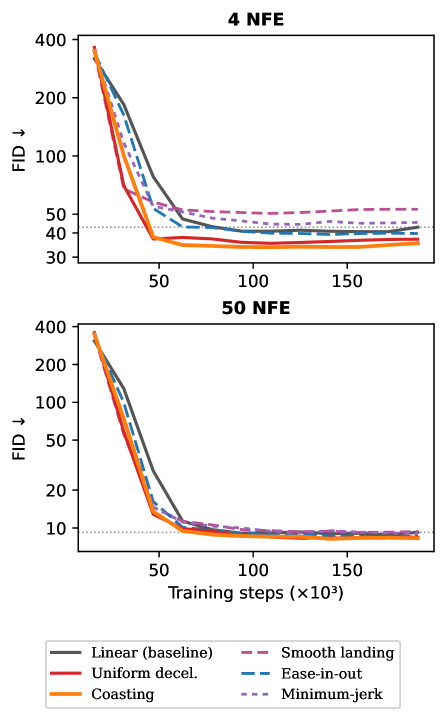
*Figure 2:FID vs. training steps on CIFAR-10 (training from scratch). Top: 4 NFE; bottom: 50 NFE; log scale. The dotted line marks the linear baseline’s final FID.*

![Figure 3:Inference-time FID vs. NFE on CIFAR-10 (pretrained TorchCFM [30], Euler integration of Algorithm 2, no retraining), for the linear baseline, the three braking profiles, and the best-performing symmetric profile (ease-in-out).](../images/2026-07-14/2607.11442/2607.11442_fig2.png)
*Figure 3:Inference-time FID vs. NFE on CIFAR-10 (pretrained TorchCFM [30], Euler integration of Algorithm 2, no retraining), for the linear baseline, the three braking profiles, and the best-performing symmetric profile (ease-in-out).*

---
**Usage Info**: 8997 tokens used.
**Generated at**: 2026-07-14 15:25:26

---

# 📚 The SonicAGI System for the REAL-TSE Challenge

🚀 URL: https://arxiv.org/html/2607.11083

## 🌏 Abstract (원문)
Real-world target speaker extraction (TSE) remains challenging because target speech, interference, and enrollment are recorded under mismatched acoustic conditions with reverberation, noise, and irregular conversational overlap. This paper describes the SonicAGI submission to the REAL-TSE Challenge (IEEE SLT 2026). We take a data-centric approach that combines fully simulated mixtures from clean speech with real meeting overlaps, and use a frozen offline enhancer to provide a denoised mirror of real targets for auxiliary supervision. For the online track, we introduce SwiftNet-Lookahead, which inserts a single bounded-lookahead module before a strictly causal iterative separator and keeps the total system latency at 96 ms. For the offline track, we use a frame-level enrollment cross-attention USEF-TFGridNet with a magnitude-domain fusion stage that trades off perceptual quality and speaker fidelity. In the official evaluation, SwiftNet-Lookahead ranks second in Track 1 and USEF-TFGridNet ranks fifth in Track 2, both exceeding the challenge baselines. These results suggest that real-data-oriented training and track-specific modeling are effective for conversational TSE.
## 🌏 Abstract (번역)
실제 환경의 목표 화자 추출(TSE)은 목표 음성, 간섭음, 등록 음성이 잔향, 잡음, 불규칙한 대화 중첩 등 불일치하는 음향 조건에서 녹음되기 때문에 여전히 어렵습니다. 본 논문은 REAL-TSE 챌린지(IEEE SLT 2026)에 제출된 SonicAGI의 내용을 설명합니다. 우리는 깨끗한 음성에서 완전히 시뮬레이션된 혼합음과 실제 회의 중첩을 결합하고, 보조 감독을 위해 실제 목표 음성의 잡음 제거된 미러를 제공하는 고정된 오프라인 인핸서를 사용하는 데이터 중심 접근 방식을 취합니다. 온라인 트랙의 경우, 엄격하게 인과적인 반복 분리자 앞에 단일 경계-미리보기 모듈을 삽입하여 총 시스템 지연 시간을 96ms로 유지하는 SwiftNet-Lookahead를 소개합니다. 오프라인 트랙의 경우, 인지 품질과 화자 충실도를 절충하는 크기 도메인 융합 단계를 갖춘 프레임 수준 등록 교차-어텐션 USEF-TFGridNet을 사용합니다. 공식 평가에서 SwiftNet-Lookahead는 트랙 1에서 2위를, USEF-TFGridNet은 트랙 2에서 5위를 차지했으며, 둘 다 챌린지 기준선을 넘어섰습니다. 이러한 결과는 실제 데이터 지향 훈련과 트랙별 모델링이 대화형 TSE에 효과적임을 시사합니다.

## 🔍 Methods & Results
- 두 트랙 모두 동일한 데이터 파이프라인을 사용하지만, 분리자 아키텍처와 등록 조건화 방식이 다릅니다.
- 온라인 트랙(Track 1)을 위해 SwiftNet-Lookahead를 도입했습니다. 이는 인과적 TSE 모델에 경계가 있는 미래 컨텍스트를 통합합니다.
- SwiftNet-Lookahead의 백본은 12개의 반복 업데이트를 가진 가중치 공유 Swift-Net 분리자이며, 각 업데이트는 다중 스케일 인과적 컨볼루션, 주파수 축 양방향 모델링, 시간 축 단방향 모델링, 인과적으로 마스킹된 셀프 어텐션을 결합합니다.
- 타겟 표현은 WeSpeaker의 고정된 ResNet-34 화자 인코더에서 제공되며, 첫 번째 반복에서만 FiLM을 통해 주입됩니다.
- SwiftNet-Lookahead는 오디오 병목 현상과 인과적 분리자 사이에 단일 LookaheadModule을 삽입하여, 비중첩 청크 내에서 양방향 LSTM을 사용하여 최대 80ms의 미리보기를 제공합니다.
- SwiftNet-Lookahead의 총 시스템 지연 시간은 96ms (8ms STFT 지연 + 80ms 미리보기 + 8ms 홉 버퍼)입니다.
- 오프라인 트랙(Track 2)을 위해 USEF 스타일의 TFGridNet 추출기를 사용하는 전체 컨텍스트 모델링을 사용합니다.
- Track 2 모델은 프레임 수준 등록 특징을 유지하고, 주파수별 교차 어텐션(혼합 프레임을 쿼리로, 유효 등록 프레임을 키와 값으로 사용)을 통해 혼합음을 조건화합니다.
- 추출 후, 인지 품질과 화자 충실도의 균형을 맞추기 위해 검증-튜닝된 크기 도메인 융합을 적용합니다. 이는 RMS 정렬, 프레임 수준 음성 활동 추정, 그리고 원본 및 향상된 크기의 가중 평균을 기반으로 한 융합을 포함합니다.
- 공식 평가에서 SwiftNet-Lookahead는 Track 1에서 2위를 차지했고, USEF-TFGridNet은 Track 2에서 5위를 차지했으며, 둘 다 챌린지 기준선을 초과했습니다.
- 이러한 결과는 실제 데이터 지향 훈련과 트랙별 모델링이 대화형 TSE에 효과적임을 시사합니다.

---
**Usage Info**: 3410 tokens used.
**Generated at**: 2026-07-14 15:25:35

---

# 📚 Teaching Speech Enhancement Models To Sing: Domain Adaptation from Speech Enhancement to Singing Voice Separation

🚀 URL: https://arxiv.org/html/2607.11630

## 🌏 Abstract (원문)
State-of-the-art speech enhancement models benefit from large-scale labeled datasets, whereas singing voice separation models suffer from limited available training data. To address this limitation, we formulate singing voice separation as domain adaptation from speech enhancement to singing voice separation. We investigate two fine-tuning strategies: full fine-tuning and parameter-efficient fine-tuning using Low-Rank Adaptation (LoRA) on a discriminative and a generative model. Models with either adaptation strategy outperform the same architectures trained from scratch by0.29	ext{-}1.8	ext{ dB}in Signal-to-Distortion-Ratio. Full fine-tuning yields the highest singing voice separation performance, but catastrophic forgetting degrades speech enhancement performance. LoRA fine-tuning achieves competitive singing voice separation performance while preserving the original speech enhancement capability with only6	ext{-}12\%additional parameters compared to the base speech enhancement model. Furthermore, the generative model shows improved generalization to an unseen test set. The results demonstrate that adapting pretrained speech enhancement models is an effective strategy for training singing voice separation models in data-scarce scenarios.
## 🌏 Abstract (번역)
최첨단 음성 향상 모델은 대규모 레이블링된 데이터셋의 이점을 얻는 반면, 노래 음성 분리 모델은 사용 가능한 훈련 데이터가 제한적이라는 문제에 직면합니다. 이러한 한계를 해결하기 위해 본 연구에서는 노래 음성 분리를 음성 향상에서 노래 음성 분리로의 도메인 적응 문제로 공식화합니다. 우리는 판별 모델과 생성 모델에 대해 전체 미세 조정(full fine-tuning)과 저랭크 적응(LoRA)을 사용한 파라미터 효율적 미세 조정(parameter-efficient fine-tuning)이라는 두 가지 미세 조정 전략을 조사합니다. 두 적응 전략을 사용한 모델은 신호 대 왜곡비(SDR)에서 0.29-1.8 dB 더 높은 성능을 보여, 처음부터 훈련된 동일한 아키텍처보다 우수합니다. 전체 미세 조정은 가장 높은 노래 음성 분리 성능을 제공하지만, 치명적인 망각(catastrophic forgetting)으로 인해 음성 향상 성능이 저하됩니다. LoRA 미세 조정은 기본 음성 향상 모델에 비해 6-12%의 추가 파라미터만으로 경쟁력 있는 노래 음성 분리 성능을 달성하면서 원래의 음성 향상 기능을 보존합니다. 또한, 생성 모델은 이전에 보지 못한 테스트 세트에 대한 일반화 능력이 향상됨을 보여줍니다. 이 결과는 사전 훈련된 음성 향상 모델을 적응시키는 것이 데이터 부족 시나리오에서 노래 음성 분리 모델을 훈련하는 효과적인 전략임을 입증합니다.

## 🔍 Methods & Results
- 음성 향상(SE)과 노래 음성 분리(SVS)는 모두 보컬 신호 분리 문제로 공식화될 수 있으며, 본 연구는 SVS 목표에 초점을 맞춥니다.
- 제한된 음악 훈련 데이터를 사용하여 사전 훈련된 SE 모델을 노래 음성 도메인에 적응시키는 방식으로 SVS를 SE로부터의 도메인 적응 문제로 공식화했습니다.
- 두 가지 적응 전략을 조사했습니다: 모든 파라미터를 업데이트하는 '전체 미세 조정(full fine-tuning)'과 저랭크 적응(LoRA)을 사용하여 파라미터 효율적으로 미세 조정하는 방법입니다.
- LoRA는 사전 훈련된 가중치 행렬을 고정하고, 선형 변환을 수행하는 레이어에 훈련 가능한 저랭크 행렬(B와 A)을 주입하여 적응하며, 이는 기본 모델 대비 6-12%의 추가 파라미터만 사용합니다.
- 미세 조정에는 MUSDB18-HQ와 MoisesDB 데이터셋을 결합하여 사용했습니다.
- 판별 모델로는 Band-Split Recurrent Neural Network (BSRNN)를, 생성 모델로는 Score-based Generative Model for Speech Enhancement (SGMSE)를 사용했습니다.
- 두 적응 전략 모두 처음부터 훈련된 모델보다 0.29-1.8 dB의 신호 대 왜곡비(SDR) 향상을 보였습니다.
- 전체 미세 조정은 가장 높은 SVS 성능을 달성했지만, 치명적인 망각으로 인해 SE 성능이 저하되었습니다.
- LoRA 미세 조정은 경쟁력 있는 SVS 성능을 달성하면서 원래의 SE 기능을 보존했습니다.
- 생성 모델은 보지 못한 테스트 세트에 대한 일반화 능력이 향상됨을 보여주었습니다.

## 🖼 Figures
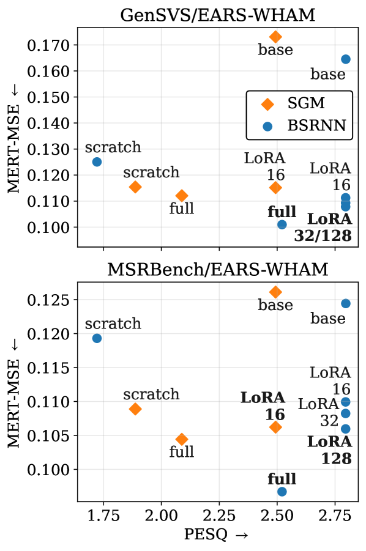
*Fig. 1:Trade-off between MERT-MSE and PESQ for SE on the EARS-WHAM test set. MERT-MSE was evaluated on the GenSVS (top) and on the MSRBench test set (bottom). Models in the lower right corner indicate a better trade-off.*

---
**Usage Info**: 2979 tokens used.
**Generated at**: 2026-07-14 15:25:43

---

# 📚 Encoder-Side Neuron Identification and Amplification for Acoustic Perception in Large Audio-Language Models

🚀 URL: https://arxiv.org/html/2607.11801

## 🌏 Abstract (원문)
Large audio-language models (LALMs) often underperform on fine-grained, non-semantic attributes of speech, such as a speaker’s emotion, despite strong performance on speech content. Improving this without the cost of retraining calls for an effective inference-time intervention, yet most existing methods intervene only after the audio encoder and operate at a relatively coarse granularity. The encoder itself, where acoustic information is first extracted from the waveform, remains largely unexplored, especially at the level of individual neurons. To this end, we introduce IAAN, Identifying and Amplifying Acoustic Neurons, a training-free and label-free method that scores each feed-forward neuron in the audio encoder by contrasting its activation on the real waveform with that on a noise reference lacking the real audio’s acoustic information. IAAN then amplifies a small set of the highest-scoring neurons at inference. Across ten non-semantic speech attributes, IAAN improves average accuracy by 25.7 points on Audio-Flamingo-3, 21.4 on Qwen2.5-Omni, and 9.7 on Kimi-Audio. It also continues to improve a model that has already been explicitly fine-tuned to prioritize acoustic evidence. In controlled comparisons, both the encoder locus and neuron-level selectivity prove necessary for this gain. Intervening after the encoder, at the decoding side or inside the language model, yields little to no improvement, or even deteriorates accuracy. The improvement also depends on which specific neurons are amplified, not merely on their number, confirming that IAAN’s acoustic score succeeds in identifying the neurons that matter. These results show that a small, precisely targeted intervention inside the audio encoder is an effective and largely untapped way to strengthen the acoustic understanding of LALMs, opening a new direction for inference-time methods that improve acoustic perception through neuron-level access to the encoder.
## 🌏 Abstract (번역)
대규모 오디오-언어 모델(LALMs)은 음성 내용에 대해서는 강력한 성능을 보이지만, 화자의 감정과 같은 미세하고 비의미론적인 음성 속성에서는 종종 저조한 성능을 보입니다. 재훈련 비용 없이 이를 개선하려면 효과적인 추론 시간 개입이 필요하지만, 대부분의 기존 방법은 오디오 인코더 이후에만 개입하며 상대적으로 거친 세분성으로 작동합니다. 음향 정보가 파형에서 처음 추출되는 인코더 자체는 특히 개별 뉴런 수준에서는 거의 탐색되지 않았습니다. 이를 위해 우리는 IAAN(Identifying and Amplifying Acoustic Neurons)을 소개합니다. IAAN은 실제 오디오의 음향 정보가 없는 노이즈 참조와 실제 파형에서의 활성화를 대조하여 오디오 인코더의 각 피드포워드 뉴런에 점수를 매기는 훈련 및 레이블 없는 방법입니다. IAAN은 추론 시 가장 높은 점수를 받은 소수의 뉴런을 증폭합니다. 10가지 비의미론적 음성 속성에서 IAAN은 Audio-Flamingo-3에서 평균 정확도를 25.7점, Qwen2.5-Omni에서 21.4점, Kimi-Audio에서 9.7점 향상시켰습니다. 또한 음향 증거를 우선시하도록 이미 명시적으로 미세 조정된 모델도 계속해서 개선합니다. 통제된 비교에서 인코더 위치와 뉴런 수준의 선택성 모두 이러한 이득에 필수적임이 입증되었습니다. 인코더 이후, 디코딩 측 또는 언어 모델 내부에서 개입하는 것은 개선 효과가 거의 없거나 전혀 없었으며, 심지어 정확도를 저하시키기도 했습니다. 개선 효과는 단순히 뉴런의 수뿐만 아니라 어떤 특정 뉴런이 증폭되는지에 따라 달라지며, 이는 IAAN의 음향 점수가 중요한 뉴런을 식별하는 데 성공했음을 확인시켜 줍니다. 이러한 결과는 오디오 인코더 내부의 작고 정밀하게 목표화된 개입이 LALM의 음향 이해를 강화하는 효과적이고 크게 활용되지 않은 방법임을 보여주며, 인코더에 대한 뉴런 수준 접근을 통해 음향 인식을 개선하는 추론 시간 방법의 새로운 방향을 제시합니다.

## 🔍 Methods & Results
- 대규모 오디오-언어 모델(LALMs)이 화자 감정과 같은 미세하고 비의미론적인 음성 속성에서 저조한 성능을 보이는 문제를 해결하기 위해, 재훈련 없이 추론 시 개입하는 방법을 모색했습니다.
- 기존 방법들이 오디오 인코더 이후에 개입하고 거친 세분성으로 작동하는 한계를 극복하고자, 음향 정보가 처음 추출되는 인코더 내부의 개별 뉴런 수준에 주목했습니다.
- IAAN(Identifying and Amplifying Acoustic Neurons)이라는 훈련 및 레이블 없는 방법을 제안했습니다. 이 방법은 실제 파형과 음향 정보가 없는 노이즈 참조 간의 활성화를 대조하여 오디오 인코더의 각 피드포워드 뉴런에 점수를 매깁니다.
- 추론 시 가장 높은 점수를 받은 소수의 뉴런을 증폭함으로써 LALM의 음향 이해를 개선합니다.
- 10가지 비의미론적 음성 속성에서 IAAN은 Audio-Flamingo-3에서 평균 정확도를 25.7점, Qwen2.5-Omni에서 21.4점, Kimi-Audio에서 9.7점 향상시켰습니다.
- 음향 증거를 우선시하도록 이미 명시적으로 미세 조정된 모델에서도 IAAN은 성능을 지속적으로 개선했습니다.
- 통제된 비교를 통해 인코더 내부의 개입 위치(locus)와 뉴런 수준의 선택성(selectivity)이 성능 향상에 필수적임을 확인했습니다.
- 인코더 이후(디코딩 측 또는 언어 모델 내부)에 개입하는 것은 개선 효과가 거의 없거나 전혀 없었으며, 심지어 정확도를 저하시키는 결과를 보였습니다.
- 성능 향상은 단순히 증폭되는 뉴런의 수가 아니라 어떤 특정 뉴런이 증폭되는지에 따라 달라지며, 이는 IAAN의 음향 점수가 중요한 뉴런을 성공적으로 식별함을 입증합니다.

## 🖼 Figures

*Figure 1:Overview of IAAN. The encoder first runs on the real audio 
𝑥
 and on a noise reference 
𝑟
 to score each feed-forward neuron by its acoustic score 
𝑠
𝑖
 (Eq. (1)); the top-
𝐾
 neurons are then amplified during the encoder pass on the real audio that produces the answer.*

*(a)Acoustic-score distribution*

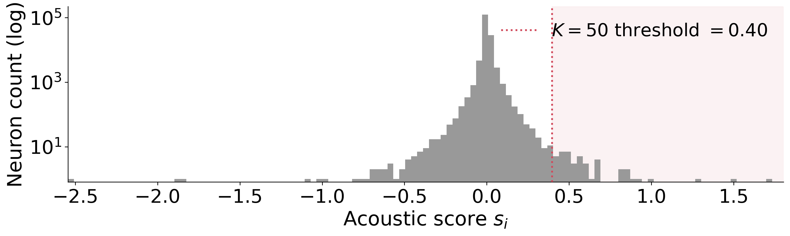
*(a)Acoustic-score distribution*

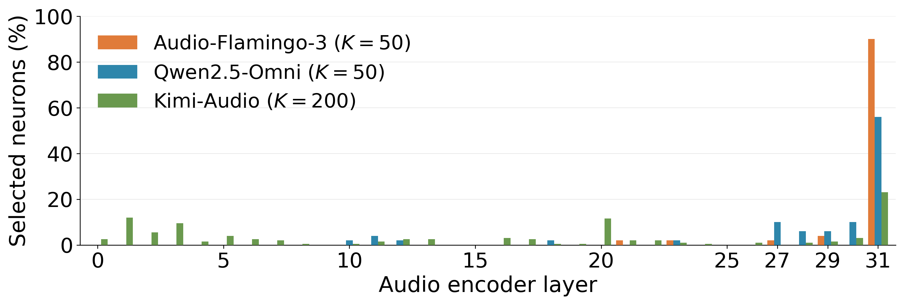
*(b)Selected neurons per encoder layer*

---
**Usage Info**: 2358 tokens used.
**Generated at**: 2026-07-14 15:25:53

---

# 📚 Dance to Music Generation leveraging Pre-training with Unpaired data and Contrastive Alignment

🚀 URL: https://arxiv.org/html/2607.10537

## 🌏 Abstract (원문)
Dance-to-music generation is a promising task for applications such as choreography support and automatic accompaniment, where temporal coordination between body movement and sound is essential. In particular, using human joint positions as the motion representation is attractive because they explicitly capture body dynamics while being lightweight, privacy-preserving, and easy to integrate with motion capture and pose-estimation pipelines. A central challenge in this setting, however, is the scarcity of high-quality paired dance–music data, since collecting accurately synchronized pairs is costly and often constrained by copyright and performance rights. This makes it difficult to train end-to-end models solely from paired data. To address this issue, we propose a dance-conditioned music generation framework that efficiently exploits both unpaired and paired data. Our method combines pretrained unimodal encoders for motion and music, beat-guided contrastive pretraining to align their feature spaces, and a ControlNet-style conditioning module on top of a pretrained text-to-audio diffusion model. Experiments on AIST++ demonstrate that the proposed techniques improve both dance–music alignment and audio quality, as confirmed by quantitative and qualitative evaluations. Compared to a state-of-the-art method, our approach achieves superior dance alignment performance and competitive audio quality. Code is available athttps://github.com/kmraven/AudioLDM-ControlNet.
## 🌏 Abstract (번역)
춤-음악 생성은 안무 지원 및 자동 반주와 같은 응용 분야에서 유망한 작업이며, 신체 움직임과 소리 간의 시간적 조화가 필수적입니다. 특히, 인간 관절 위치를 동작 표현으로 사용하는 것은 신체 역학을 명시적으로 포착하면서도 경량이고, 프라이버시를 보호하며, 모션 캡처 및 자세 추정 파이프라인과 통합하기 쉽다는 점에서 매력적입니다. 그러나 이 설정의 주요 과제는 고품질의 짝지어진 춤-음악 데이터가 부족하다는 점입니다. 정확하게 동기화된 쌍을 수집하는 것은 비용이 많이 들고 종종 저작권 및 공연권에 의해 제약을 받기 때문입니다. 이로 인해 짝지어진 데이터만으로 종단 간 모델을 훈련하기 어렵습니다. 이 문제를 해결하기 위해, 우리는 짝지어지지 않은 데이터와 짝지어진 데이터를 모두 효율적으로 활용하는 춤 조건부 음악 생성 프레임워크를 제안합니다. 우리의 방법은 동작 및 음악을 위한 사전 훈련된 단일 모드 인코더, 특징 공간을 정렬하기 위한 비트 가이드 대조 학습 사전 훈련, 그리고 사전 훈련된 텍스트-오디오 확산 모델 위에 ControlNet 스타일의 조건화 모듈을 결합합니다. AIST++에 대한 실험은 제안된 기술이 정량적 및 정성적 평가를 통해 확인된 바와 같이 춤-음악 정렬 및 오디오 품질을 모두 향상시킨다는 것을 보여줍니다. 최첨단 방법과 비교하여, 우리의 접근 방식은 우수한 춤 정렬 성능과 경쟁력 있는 오디오 품질을 달성합니다. 코드는 https://github.com/kmraven/AudioLDM-ControlNet 에서 확인할 수 있습니다.

## 🔍 Methods & Results
- 제안된 프레임워크는 춤-음악 생성을 두 단계로 분리합니다: (1) 교차 모달 표현 학습 (Cross-modal Representation Learning)과 (2) 조건부 생성 (Conditional Generation).
- 교차 모달 표현 학습 단계에서는 MotionBERT(동작) 및 MERT(음악)와 같은 사전 훈련된 단일 모드 인코더를 사용하여 각 모달리티에서 특징을 추출합니다.
- 동작 시퀀스에서 프레임별 동작 특징(fD)과 운동학적 비트 특징(fBD)을 추출하고, 음악 파형에서 음향 임베딩 시퀀스(fM)와 음악 비트(fBM)를 추출합니다.
- 비트 가이드 대조 학습 사전 훈련을 통해 동작과 음악의 특징 공간을 공유 잠재 공간에 정렬하며, 이를 위해 듀얼 패스 트랜스포머를 사용하고 짧은 클립의 시간적 순서를 더 잘 포착하기 위해 비트 스트림에 명시적인 위치 인코딩(PE) 레이어를 추가합니다.
- 대조 손실(L_NCE)을 구동하기 위해 배치된 프레임별 정규화된 임베딩에서 세그먼트 수준 유사도를 계산하며, 이는 최대 프레임별 내적(dot product)으로 정의됩니다.
- 조건부 생성 단계에서는 사전 훈련된 AudioLDM 백본을 ControlNet 스타일 어댑터로 확장합니다.
- AudioLDM의 원래 노이즈 제거 U-Net은 고정하고, 학습 가능한 조건부 브랜치(ControlNet)를 연결합니다.
- 대조 학습으로 사전 훈련된 춤 인코더에서 얻은 동작 조건화 신호(f^D)는 AudioLDM의 입력 특징 공간으로 투영된 후, 0으로 초기화된 컨볼루션을 통해 ControlNet에 주입됩니다.
- ControlNet은 각 제어 블록에서 조건 의존적 잔차 특징을 예측하고, 이 잔차는 0으로 초기화된 컨볼루션을 통해 고정된 백본에 주입됩니다.
- 조건부 생성기는 AudioLDM의 잠재 공간에서 표준 확산 노이즈 예측 목표를 사용하여 훈련되며, 추론 시 텍스트 유무에 관계없이 생성을 가능하게 하기 위해 훈련 중 분류기 없는 안내(classifier-free guidance)를 위해 텍스트 프롬프트를 무작위로 드롭합니다.
- AIST++ 데이터셋에 대한 실험 결과, 제안된 기술은 춤-음악 정렬 및 오디오 품질을 모두 향상시키는 것으로 정량적 및 정성적 평가를 통해 확인되었습니다.
- 최첨단 방법과 비교하여, 우리의 접근 방식은 우수한 춤 정렬 성능과 경쟁력 있는 오디오 품질을 달성했습니다.

## 🖼 Figures

*Figure 1:Overview of the proposed two-stage dance-to-music generation framework. In the first stage, dance and music features are extracted using pretrained encoders with beat information and aligned through beat-guided contrastive learning. In the second stage, the pretrained dance encoder provides motion features that are projected and injected into a ControlNet-style adapter to condition a frozen AudioLDM backbone for motion-controlled music generation.*

---
**Usage Info**: 4290 tokens used.
**Generated at**: 2026-07-14 15:26:04

---

# 📚 Qwen-Music Technical Report

🚀 URL: https://arxiv.org/html/2607.11699

## 🌏 Abstract (원문)
In this report, we introduce Qwen-Music, a powerful music generation model capable of producing highly musical and high-fidelity songs with complete vocal singing. Qwen-Music supports two core tasks:Text to Music Generation, which create entirely new songs from text descriptions, lyrics, and musical attributes, andCover Song Generation, which reinterprets existing songs with different styles and vocal characteristics. Architecturally, Qwen-Music integrates three core components:Qwen-Music-Tokenizer,Qwen-Music-LLM, andQwen-Music-Render. Qwen-Music-Tokenizer compresses audio into a 25 Hz single-codebook stream of Music Semantic Tokens that preserve semantic and melodic information for LLM prediction. Based on these tokens, Qwen-Music-LLM performs autoregressive music semantic modeling, with a key novelty being a melody-token-based chain-of-thought (Melody-CoT) mechanism that plans melodies before full-song generation, improving creativity, musicality, structural coherence, and reference-audio-based melody cloning. To overcome the fidelity limitations of discrete semantic tokens, Qwen-Music-Render performs generative stereo rendering, enriching acoustic details and producing high-fidelity stereo waveforms. Finally, we train Qwen-Music-LLM on more than 5 million hours of multilingual music data covering hundreds of languages. We first apply quality-aware pre-training curriculum, then use progressive post-training, comprising supervised initialization, offline DPO, and online GSPO, to further improve musicality and instruction-following ability. Across 600 Chinese and English prompts, Qwen-Music achieves state-of-the-art results in 13 of 16 objective musicality and audio-quality metrics. Professional evaluators also prefer Qwen-Music over leading proprietary systems. For cover song generation, Qwen-Music preserves reference melodies more accurately than Suno V5.5, Suno V5, and MiniMax Cover on the AI-generated reference set, and outperforms MiniMax Cover on most metrics in the real-world popular-song reference set.
## 🌏 Abstract (번역)
본 보고서에서는 완전한 보컬 노래와 함께 매우 음악적이고 고음질의 곡을 생성할 수 있는 강력한 음악 생성 모델인 Qwen-Music을 소개합니다. Qwen-Music은 두 가지 핵심 작업을 지원합니다: 텍스트 설명, 가사 및 음악적 속성으로부터 완전히 새로운 곡을 생성하는 텍스트-음악 생성(Text to Music Generation)과, 기존 곡을 다른 스타일과 보컬 특성으로 재해석하는 커버곡 생성(Cover Song Generation)입니다. Qwen-Music은 Qwen-Music-Tokenizer, Qwen-Music-LLM, Qwen-Music-Render의 세 가지 핵심 구성 요소를 통합합니다. Qwen-Music-Tokenizer는 오디오를 LLM 예측을 위한 의미론적 및 멜로디 정보를 보존하는 25Hz 단일 코드북 스트림의 음악 의미 토큰으로 압축합니다. 이 토큰을 기반으로 Qwen-Music-LLM은 자동회귀 음악 의미 모델링을 수행하며, 주요 혁신은 전체 곡 생성 전에 멜로디를 계획하여 창의성, 음악성, 구조적 일관성 및 참조 오디오 기반 멜로디 클로닝을 향상시키는 멜로디 토큰 기반 사고 연쇄(Melody-CoT) 메커니즘입니다. 이산 의미 토큰의 충실도 한계를 극복하기 위해 Qwen-Music-Render는 생성형 스테레오 렌더링을 수행하여 음향 세부 사항을 풍부하게 하고 고음질 스테레오 파형을 생성합니다. 마지막으로, 우리는 수백 가지 언어를 포괄하는 5백만 시간 이상의 다국어 음악 데이터로 Qwen-Music-LLM을 훈련시켰습니다. 먼저 품질 인식 사전 훈련 커리큘럼을 적용한 다음, 지도 초기화, 오프라인 DPO 및 온라인 GSPO로 구성된 점진적 사후 훈련을 사용하여 음악성과 지시 따르기 능력을 더욱 향상시켰습니다. 600개의 중국어 및 영어 프롬프트에 걸쳐 Qwen-Music은 16가지 객관적인 음악성 및 오디오 품질 측정 항목 중 13가지에서 최첨단 결과를 달성했습니다. 전문 평가자들도 Qwen-Music을 선도적인 독점 시스템보다 선호했습니다. 커버곡 생성의 경우, Qwen-Music은 AI 생성 참조 세트에서 Suno V5.5, Suno V5 및 MiniMax Cover보다 참조 멜로디를 더 정확하게 보존하며, 실제 인기곡 참조 세트에서는 대부분의 측정 항목에서 MiniMax Cover를 능가합니다.

## 🔍 Methods & Results
- Qwen-Music은 사용자 요청을 고음질 스테레오 곡으로 변환하는 추론 파이프라인을 따르며, 이는 Qwen-Music-Tokenizer, Qwen-Music-LLM, Qwen-Music-Render의 세 가지 핵심 구성 요소로 지원됩니다.
- Qwen-Music-Tokenizer는 Conformer 기반 인코더를 사용하여 원본 음악 오디오를 25Hz 음악 의미 토큰의 단일 스트림으로 매핑하며, 자기 지도 사전 훈련, 인과적 적응, 다중 작업 지도 미세 조정, VQ 토크나이저 훈련의 4단계 레시피로 훈련됩니다.
- Qwen-Music-LLM은 Qwen3.5-Omni(33B)에서 초기화된 자동회귀 백본으로, 텍스트 설명, 가사, 음악적 속성 및 선택적 멜로디 토큰을 조건으로 음악 의미 토큰을 생성합니다.
- Qwen-Music-LLM의 핵심 혁신은 Melody-CoT(Melody-token-based Chain-of-Thought) 메커니즘으로, 전체 곡 생성 전에 멜로디를 계획하여 창의성, 음악성, 구조적 일관성을 향상시키며, 텍스트-음악 생성 및 커버곡 생성 모두에 사용됩니다.
- 멜로디 토크나이저는 RMVPE로 추출된 보컬 피치 곡선을 6.25Hz로 다운샘플링한 후 상대 MIDI 표현으로 변환하여 256개 항목의 어휘로 이산화하며, 절대 피치 범위, 키 또는 가수 종속적인 음색 정보 유출을 방지합니다.
- Qwen-Music-Render는 언어 모델이 생성한 이산 토큰 출력을 고음질 파형으로 변환하는 3단계 신경 렌더러로, Diffusion Transformer(DiT), Spec-VAE, Band-Mode Refiner로 구성됩니다.
- Diffusion Transformer(DiT)는 1.3B 모델로, 이산 토큰과 텍스트 조건(재작성된 프롬프트, 가사)을 조건으로 연속 잠재 표현을 생성하며, Qwen3-Embedding-0.6B 텍스트 인코더를 사용하여 텍스트 특징을 추출합니다.
- Spec-VAE는 48kHz 스테레오 오디오를 25Hz의 128차원 잠재 표현으로 압축하고(192배 압축), coarse한 복소수 STFT를 재구성하며, 주파수 인식 SnakeBeta 활성화 함수인 Spec-SnakeBeta를 사용합니다.
- Band-Mode Refiner는 Spec-VAE 디코더 출력의 잔여 스펙트럼 아티팩트를 수정하는 경량 ConvNeXt-1D 모듈로, 저주파 대역에서는 위상만, 중주파 대역에서는 크기 및 위상, 고주파 대역에서는 크기만 수정하는 대역별 보정을 적용합니다.
- Qwen-Music-Render는 재구성 전용 Spec-VAE 사전 훈련, 파형 도메인 적대적 훈련, Band-Mode Refiner 훈련의 3단계로 훈련되며, 고품질 훈련 데이터를 위해 자동화된 품질 인식 데이터 필터링 파이프라인을 사용합니다.
- Qwen-Music-LLM은 5백만 시간 이상의 다국어 음악 데이터로 훈련되었으며, 품질 인식 사전 훈련 커리큘럼과 지도 초기화, 오프라인 DPO, 온라인 GSPO를 포함하는 점진적 사후 훈련을 통해 음악성과 지시 따르기 능력을 향상시켰습니다.
- 600개의 중국어 및 영어 프롬프트에 대한 평가에서 Qwen-Music은 16가지 객관적인 음악성 및 오디오 품질 측정 항목 중 13가지에서 최첨단 결과를 달성했으며, 전문 평가자들은 선도적인 독점 시스템보다 Qwen-Music을 선호했습니다.
- 커버곡 생성에서 Qwen-Music은 AI 생성 참조 세트에서 Suno V5.5, Suno V5, MiniMax Cover보다 참조 멜로디를 더 정확하게 보존했으며, 실제 인기곡 참조 세트에서는 MiniMax Cover보다 대부분의 측정 항목에서 우수한 성능을 보였습니다.

## 🖼 Figures

*Figure 1:Qwen-Music is a powerful and controllable music generation model capable of producing songs with complete vocal singing. It generates complete songs from text descriptions, lyrics, and musical attributes, and uses reference audio for cover song generation with different styles and vocal characteristics.*

*Figure 2:Blind A/B preference results between Qwen-Music and leading proprietary systems, including MiniMax Music 2.5+, MiniMax Music 2.6, Mureka V8, Suno V5, and Suno V5.5, judged by professional human raters. Each pair is evaluated under anonymized and randomized presentation, and values indicate the percentage of expert votes preferring each system.*

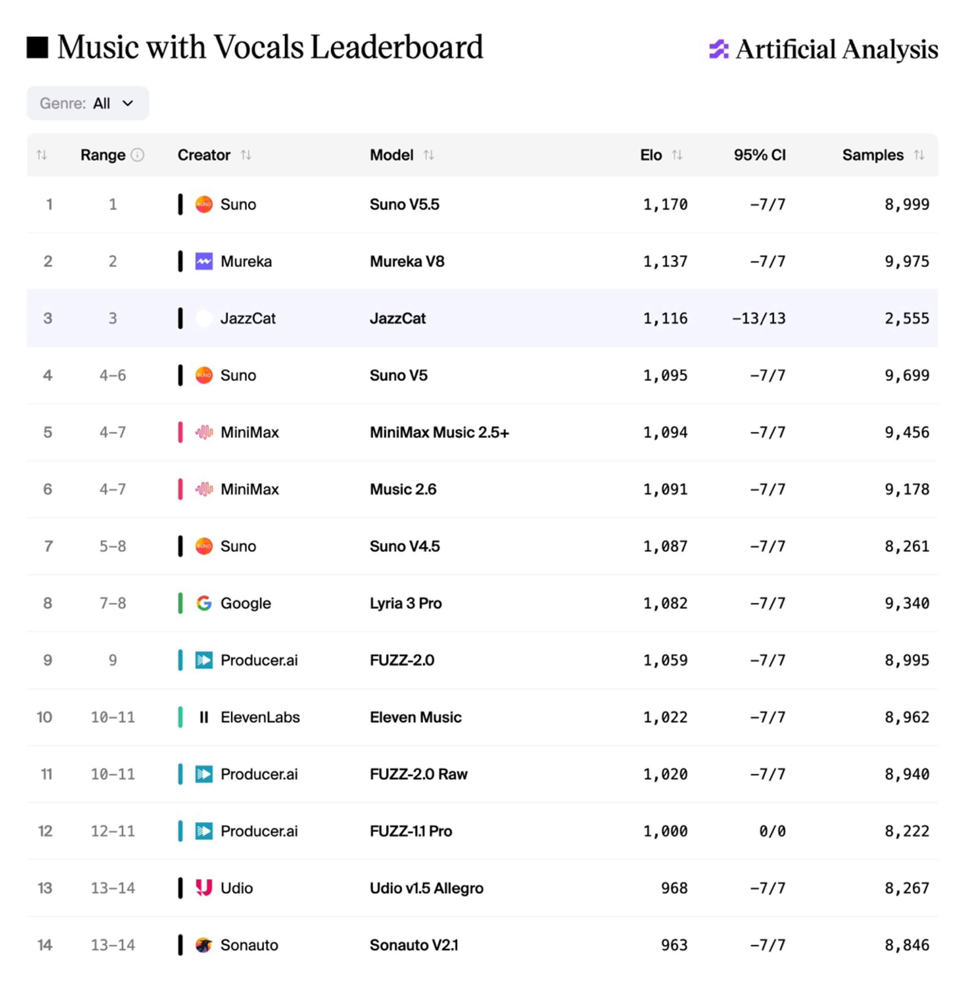
*Figure 3:External leaderboard result on the Artificial Analysis Music with Vocals Leaderboard. Qwen-Music participated as JazzCat and ranked among the leading English vocal music generation systems.*

![Figure 4: Overview of the Qwen-Music inference pipeline. Given a user request, Qwen-Music first rewrites the natural-language description into a structured textual condition, including musical tags (such as genre, singer characteristics, instrumental arrangement, etc.) and generated lyrics. Qwen-Music-LLM then generates Music Semantic Tokens, optionally using melody tokens extracted from a reference song for melody cloning. Finally, Qwen-Music-Render takes both the rewritten textual condition and the generated Music Semantic Tokens as input and performs generative rendering to produce high-fidelity 48 kHz stereo waveforms.](../images/2026-07-14/2607.11699/2607.11699_fig3.png)
*Figure 4: Overview of the Qwen-Music inference pipeline. Given a user request, Qwen-Music first rewrites the natural-language description into a structured textual condition, including musical tags (such as genre, singer characteristics, instrumental arrangement, etc.) and generated lyrics. Qwen-Music-LLM then generates Music Semantic Tokens, optionally using melody tokens extracted from a reference song for melody cloning. Finally, Qwen-Music-Render takes both the rewritten textual condition and the generated Music Semantic Tokens as input and performs generative rendering to produce high-fidelity 48 kHz stereo waveforms.*

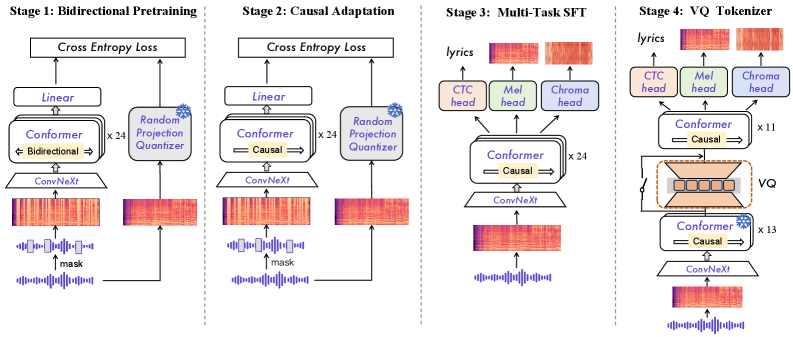
*Figure 5: Overview of Qwen-Music-Tokenizer. The tokenizer maps music waveforms to 25 Hz Music Semantic Tokens through BestRQ pretraining, causal adaptation, multi-task SFT, and VQ tokenizer training.*

*Figure 6:Overview of Qwen-Music-Render. Music Semantic Tokens and text conditions guide a semantic-conditioned DiT that predicts acoustic latents. Spec-VAE decodes the latents into complex spectrograms, and the Band-Mode Refiner corrects band-dependent magnitude and phase details before inverse STFT synthesis to 48 kHz stereo waveforms.*

![Figure 7:Spec-SnakeBeta analysis. (a) Activation curves: the standard SnakeBeta (black dashed) applies a single shared 
𝛼
 to all frequency bins; Spec-SnakeBeta adapts the periodic modulation per frequency, producing distinct nonlinear shapes at 0.5, 3, 10, and 20 kHz. (b) Deviation of learned 
𝛼
𝑓
 from log-frequency initialization (
Δ
​
𝛼
𝑓
=
𝛼
learned
−
𝛼
init
) across encoder layers—positive values indicate the network increases periodic modulation beyond the physical prior, with the strongest deviations concentrated in 0–5 kHz.](../images/2026-07-14/2607.11699/2607.11699_fig6.png)
*Figure 7:Spec-SnakeBeta analysis. (a) Activation curves: the standard SnakeBeta (black dashed) applies a single shared 
𝛼
 to all frequency bins; Spec-SnakeBeta adapts the periodic modulation per frequency, producing distinct nonlinear shapes at 0.5, 3, 10, and 20 kHz. (b) Deviation of learned 
𝛼
𝑓
 from log-frequency initialization (
Δ
​
𝛼
𝑓
=
𝛼
learned
−
𝛼
init
) across encoder layers—positive values indicate the network increases periodic modulation beyond the physical prior, with the strongest deviations concentrated in 0–5 kHz.*

*Figure 8:High-frequency cutoff detector examples. The blue curve is the Welch spectrum of a 10 s verification segment, the red dashed line is the detected cutoff 
𝑓
𝑐
, and the gray dotted line is the independently estimated edge noise floor.*

---
**Usage Info**: 9225 tokens used.
**Generated at**: 2026-07-14 15:26:19

---

