# 🚩 (2026-07-15) Scholar Inbox 추천 논문 

# 📚 ZipL-Dialog: Memory-Efficient Long-Form Spoken Dialog Synthesis via Latent Flow Matching

🚀 URL: https://arxiv.org/html/2607.12496

## 🌏 Abstract (원문)
Zero-shot dialog TTS benefits from flow-matching, but minute-scale generation on dense mel-spectrograms causes severe memory bottlenecks, often forcing unnatural chunked synthesis. We propose ZipL-Dialog, which shifts conditional flow-matching into a 4x time-compressed (25 Hz) latent space. To preserve acoustic fidelity under compression, we employ a deterministic mel autoencoder with auxiliary mel-domain supervision and optimize the ZipFormer's hierarchical downsampling schedule. Experiments show that ZipL-Dialog reduces maximum peak GPU memory by 11.22x and accelerates inference by 2.23x over the baseline, substantially lowering the memory footprint of single-pass multi-minute dialog synthesis while maintaining perceptual naturalness. Audio samples are available athttps://speechdemos.github.io/.
## 🌏 Abstract (번역)
제로샷 대화 TTS는 플로우 매칭의 이점을 얻지만, 밀도 높은 멜-스펙트로그램에서 분 단위 생성을 할 경우 심각한 메모리 병목 현상이 발생하여 종종 부자연스러운 청크 합성으로 이어진다. 본 논문에서는 조건부 플로우 매칭을 4배 시간 압축된 (25Hz) 잠재 공간으로 전환하는 ZipL-Dialog를 제안한다. 압축 상태에서 음향 충실도를 보존하기 위해, 보조 멜-도메인 감독을 사용하는 결정론적 멜 오토인코더를 활용하고 ZipFormer의 계층적 다운샘플링 스케줄을 최적화한다. 실험 결과, ZipL-Dialog는 기준선 대비 최대 피크 GPU 메모리를 11.22배 감소시키고 추론 속도를 2.23배 가속화하여, 단일 패스 다중 분 대화 합성의 메모리 사용량을 크게 줄이면서 지각적 자연스러움을 유지함을 보여준다. 오디오 샘플은 https://speechdemos.github.io/ 에서 확인할 수 있다.

## 🔍 Methods & Results
- ZipL-Dialog는 프레임 레벨 멜-스펙트로그램 대신 4배 시간 압축된 (25Hz) 잠재 음향 공간에서 대화 생성을 수행한다.
- 프레임 레벨 멜-스펙트로그램을 저속 연속 잠재 시퀀스로 인코딩하고, 잠재 도메인에서 마스크된 조건부 플로우 매칭을 적용한 후, 예측된 잠재를 멜 도메인으로 디코딩하여 파형을 합성한다.
- 음향 오토인코더는 프레임 레벨 멜-스펙트로그램을 시간 압축된 잠재 시퀀스로 매핑하며, 지역 음성 세부 정보를 보존하고 재구성 충실도에 집중하기 위해 변이형 대신 결정론적 병목을 사용한다.
- 인코더는 2D 컨볼루션 패치 임베딩, 1D 컨볼루션, 트랜스포머 인코더 레이어를 거쳐 잠재 시퀀스 Z를 생성하고, 디코더는 Z를 멜 도메인으로 복원한다 (압축률 r=4, 잠재 차원 D=100).
- 조건부 플로우 매칭 과정에서 잠재 시퀀스 Z는 관찰된 접두사 컨텍스트와 생성될 목표 영역으로 나뉘며, 목표 영역에만 가우시안 노이즈가 적용된 잠재 상태 Z_t가 정의된다.
- 텍스트 입력(화자 및 턴 토큰 포함)은 인코딩되어 잠재 프레임 레벨 임베딩 E로 정렬되고, ZipFormer 기반 플로우 디코더는 Z_t, Z_masked, E를 입력으로 받아 목표 속도 v_hat_theta를 예측한다.
- 모델은 목표 영역에 대한 마스크된 속도 매칭 목표로 최적화되며, 음향 세부 정보를 보존하기 위해 멜 도메인에서 보조 마스크된 재구성 항(L_rec)이 적용된다.
- 추론 시, 관찰된 대화 접두사는 잠재 도메인으로 인코딩되고, 목표 영역은 가우시안 노이즈로 초기화되며, 학습된 속도 필드를 통합하여 목표 잠재 시퀀스를 생성한 후 멜-스펙트로그램으로 디코딩되고 파형으로 변환된다.
- 압축된 잠재 시퀀스에 최적화된 ZipFormer 계층 구조를 찾기 위해 다양한 다운샘플링 스케줄을 비교했으며, 기본 ZipVoice-Dialog 계층 구조는 비최적적이며 더 완화된 계층 구조가 효율성-품질 균형에서 더 나은 성능을 보였다.
- 실험 결과, ZipL-Dialog는 기준선 대비 최대 피크 GPU 메모리를 11.22배 감소시키고 추론 속도를 2.23배 가속화하여, 단일 패스 다중 분 대화 합성의 메모리 사용량을 크게 줄이면서 지각적 자연스러움을 유지했다.

## 🖼 Figures

*Figure 1:Training overview of ZipL-Dialog. A ground-truth mel-spectrogram is encoded into a 
4
×
 time-compressed latent sequence (25 Hz). The ZipFormer decoder predicts the CFM velocity on the masked target region, conditioned on text embeddings and noisy latents. The model is jointly optimized with a latent velocity loss and an auxiliary mel-domain reconstruction loss.*

---
**Usage Info**: 4229 tokens used.
**Generated at**: 2026-07-15 15:25:11

---

# 📚 AutoSIFT: Automatic Style Sifting for Controllable Speech Generation with Arbitrary Style Infilling

🚀 URL: https://arxiv.org/html/2607.12706

## 🌏 Abstract (원문)
State-of-the-art text-to-speech (TTS) models achieve impressive naturalness and expressiveness, yet fine-grained, disentangled control over speaking styles remains challenging. In professional scenarios such as film dubbing, game voice acting, and video content generation, users often need to modify a specific style category, such as emotion, age, or gender, while preserving all others. Existing style-controllable TTS methods typically rely on either text-described styles or speech-reference style transfer, making it difficult to jointly control explicit semantic attributes and preserve subtle, text-undescribed prosodic details.We propose AutoSIFT, a controllable speech generation framework for category-level style editing. AutoSIFT decomposes speaking style into known text-describable categories and unknown residual styles that capture non-verbal prosody and speaker-specific nuances. It consists of a generalized Style Disentangler, which extracts category-aware style prototypes from reference speech, and an Arbitrary Style Infiller, which selectively infills unspecified style categories from the reference. By replacing only text-specified style categories while preserving residual speech-derived styles, AutoSIFT enables natural, expressive, and highly customizable speech generation.
## 🌏 Abstract (번역)
최첨단 텍스트-음성 변환(TTS) 모델은 인상적인 자연스러움과 표현력을 달성했지만, 발화 스타일에 대한 세밀하고 분리된 제어는 여전히 어렵습니다. 영화 더빙, 게임 성우, 비디오 콘텐츠 생성과 같은 전문적인 시나리오에서 사용자는 감정, 나이, 성별과 같은 특정 스타일 범주를 수정하면서 다른 모든 범주를 보존해야 하는 경우가 많습니다. 기존의 스타일 제어 가능한 TTS 방법은 일반적으로 텍스트로 설명된 스타일 또는 음성 참조 스타일 전송에 의존하므로 명시적인 의미 속성을 공동으로 제어하고 미묘하며 텍스트로 설명되지 않은 운율 세부 사항을 보존하기 어렵습니다.저희는 범주 수준 스타일 편집을 위한 제어 가능한 음성 생성 프레임워크인 AutoSIFT를 제안합니다. AutoSIFT는 발화 스타일을 알려진 텍스트 설명 가능한 범주와 비언어적 운율 및 화자별 뉘앙스를 포착하는 알려지지 않은 잔여 스타일로 분해합니다. 이 프레임워크는 참조 음성에서 범주 인식 스타일 프로토타입을 추출하는 일반화된 스타일 분리자(Style Disentangler)와 참조에서 지정되지 않은 스타일 범주를 선택적으로 채우는 임의 스타일 채우기(Arbitrary Style Infiller)로 구성됩니다. AutoSIFT는 텍스트로 지정된 스타일 범주만 교체하고 잔여 음성 파생 스타일을 보존함으로써 자연스럽고 표현력이 풍부하며 고도로 맞춤화 가능한 음성 생성을 가능하게 합니다.

## 🔍 Methods & Results
- AutoSIFT는 범주 수준 스타일 편집을 위한 제어 가능한 음성 생성 프레임워크로, 발화 스타일을 텍스트 설명 가능한 범주와 비언어적 운율 및 화자별 뉘앙스를 포착하는 잔여 스타일로 분해한다.
- 훈련은 세 단계의 계층적 파이프라인을 따른다: 1단계에서는 TTS 백본과 스타일 추출기를 최적화하여 고충실도 음성 재구성을 위한 포괄적인 스타일 임베딩을 생성한다.
- 2단계에서는 스타일 추출기를 고정하고 스타일 분리기를 훈련하여 스타일 임베딩을 텍스트 설명 가능한 범주 임베딩과 잔여 스타일 임베딩으로 분리한다.
- 3단계에서는 임의 스타일 채우기(Arbitrary Style Infiller, ASI)를 도입하여 텍스트로 설명된 범주를 따르면서 참조 음성에서 텍스트로 설명되지 않은 범주와 잔여 스타일을 채우도록 훈련한다.
- 스타일 추출기는 Transformer 기반 인코더와 주의 풀링 레이어로 구성되며, Flow-Matching Diffusion Transformer(FM-DiT)에 통합되어 비지도 방식으로 전역 음성 스타일 임베딩을 추출한다.
- 스타일 분리기는 스타일 임베딩을 N+1개의 범주별 선형 프로젝터를 사용하여 텍스트 설명 가능한 범주 임베딩과 잔여 스타일 임베딩으로 분해한다.
- 스타일 분리기는 학습 가능한 스타일 프로토타입과 프로토타입 정렬 손실(Prototypical Alignment Loss, PAL)을 사용하여 분리를 강화하고, 잔여 임베딩은 벡터 양자화(VQ) 레이어를 통해 정규화된다.
- 임의 스타일 채우기(ASI)는 텍스트 설명된 스타일을 주요 제어 신호로 사용하고 참조 음성을 지정되지 않은 및 잔여 스타일 정보의 저장소로 활용하여 텍스트 프롬프트와 음성 프롬프트 간의 격차를 해소한다.
- ASI는 조건부 게이트를 통해 텍스트 파생 및 음성 파생 스타일 범주 프로토타입을 선택적으로 융합하며, 잔여 스타일 임베딩은 항상 음성 임베딩에서 직접 상속된다.
- 모델은 스타일 재구성 손실(Style Reconstruction Loss)로 최적화되며, 훈련 중 범주형 텍스트 프롬프트가 누락된 시나리오를 시뮬레이션하기 위해 25%의 비율로 범주형 레이블을 무작위로 삭제하는 검열 학습(Censored Learning) 전략을 사용한다.

## 🖼 Figures

*Figure 1:Overview of AutoSIFT. 1) A FM-DiT-based SC-TTS extracts a style embedding from speech. 2) A Style Disentangler decomposes style embedding 
𝑆
 into category-specific and residual style embeddings. 3) An Arbitrary Style Infiller performs the ASI task by following text-specified categories and preserving text-undescribed and residual styles from 
𝑆
.*

*Figure 2:Comprehensive evaluation of style control performance. (a) AutoSIFT vs. SOTA SC-TTS baselines across Language, Age, Gender, and Emotion style categories. (b) Impact of varying the text-descriptive style rate on control performance. AutoSIFT (ASI) demonstrates superior balance and robustness compared to existing methods across both dimensions (RSA and DSA).*

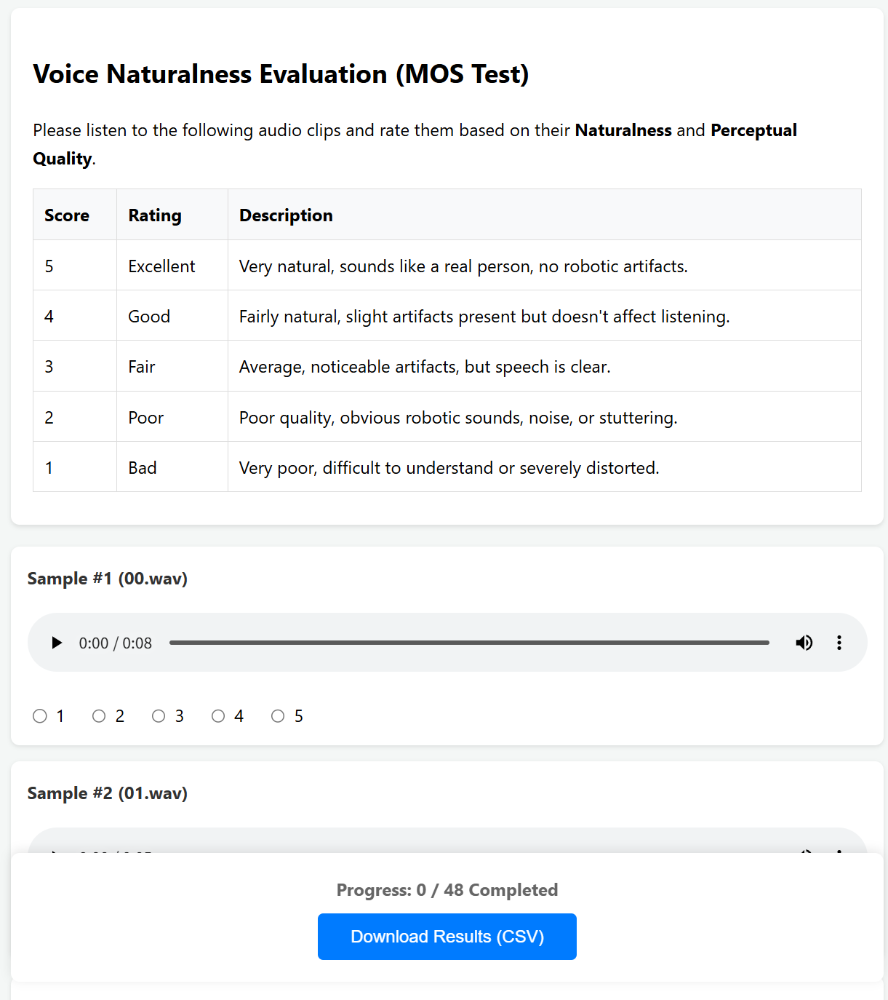
*Figure 3:Screenshot of MOS Evaluation*

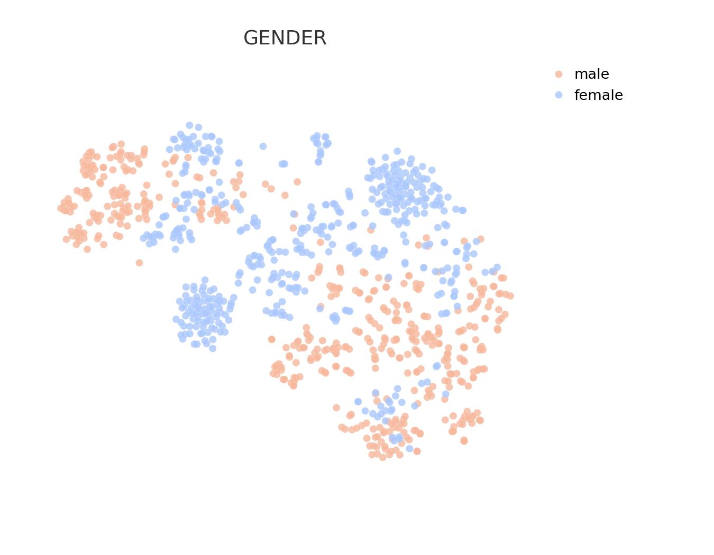
*(a)Raw Gender*

*(a)Raw Gender*

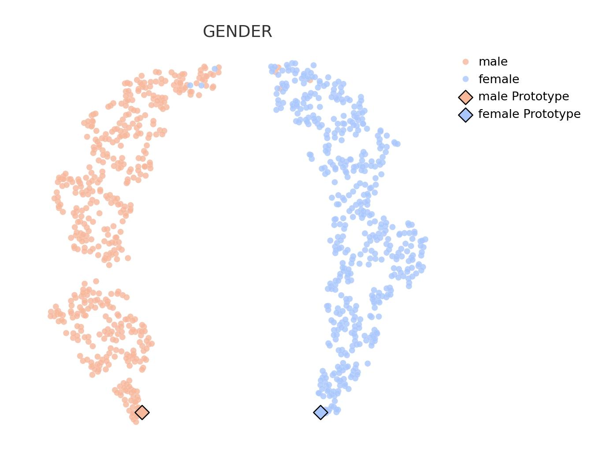
*(b)Disentangled Gender*

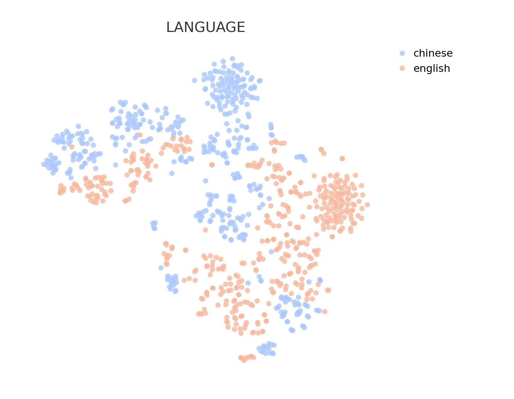
*(a)Raw Language*

*(a)Raw Language*

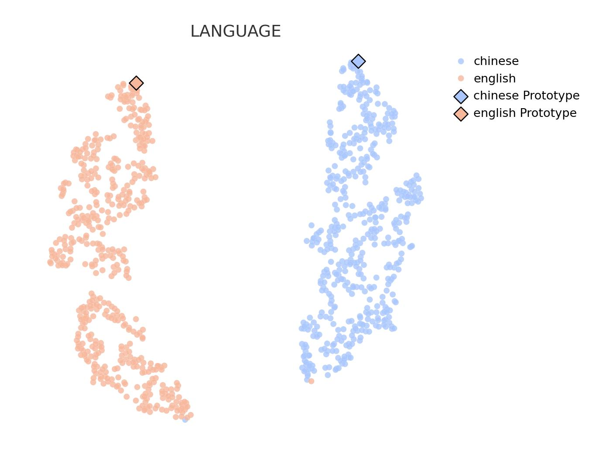
*(b)Disentangled Language*

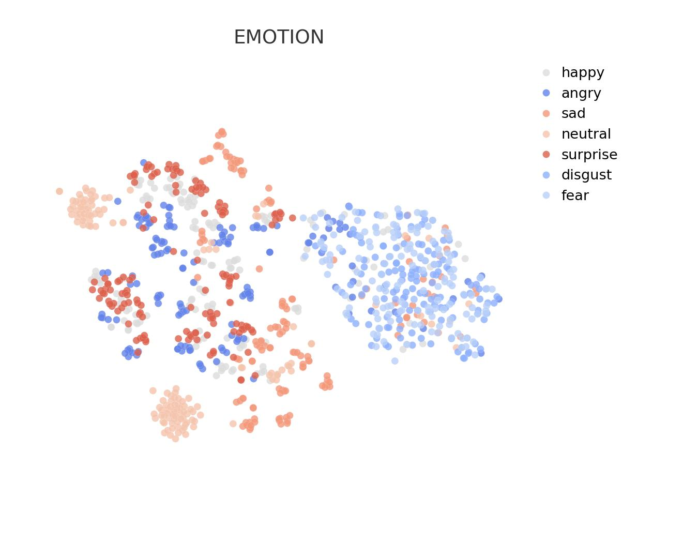
*(a)Raw Emotion*

*(a)Raw Emotion*

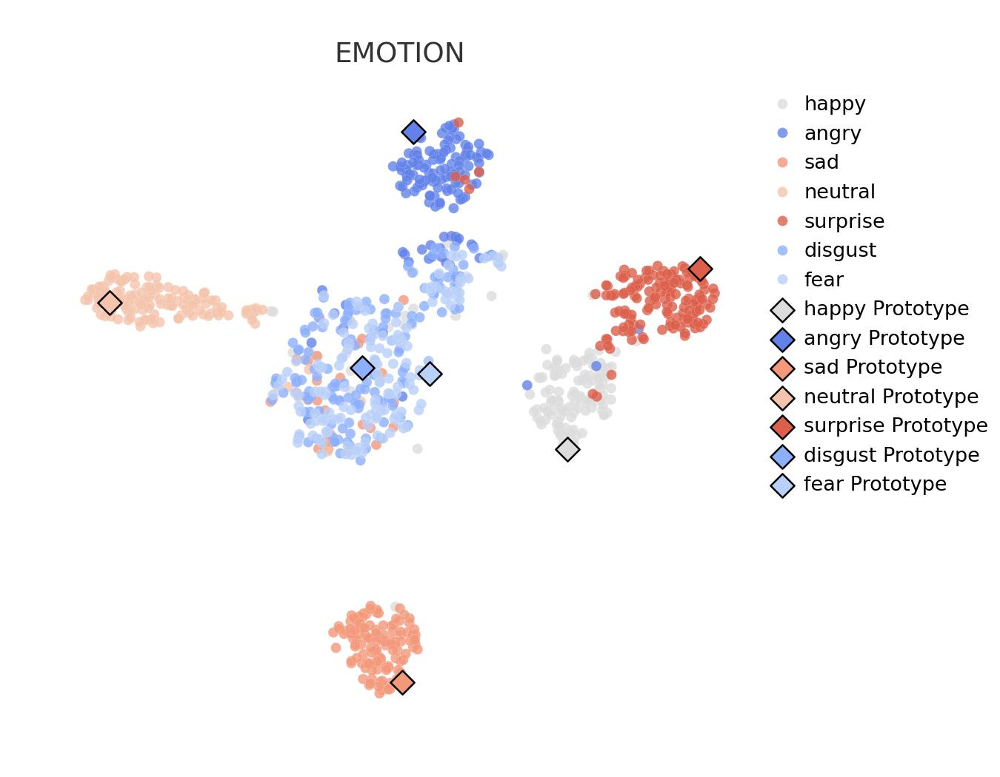
*(b)Disentangled Emotion*

*(a)Raw Age*

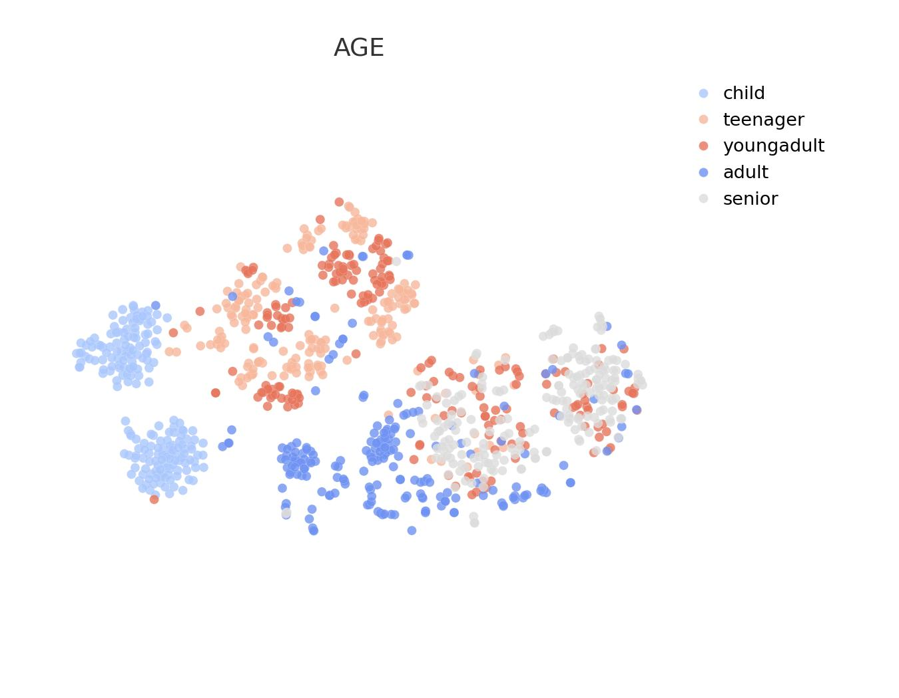
*(a)Raw Age*

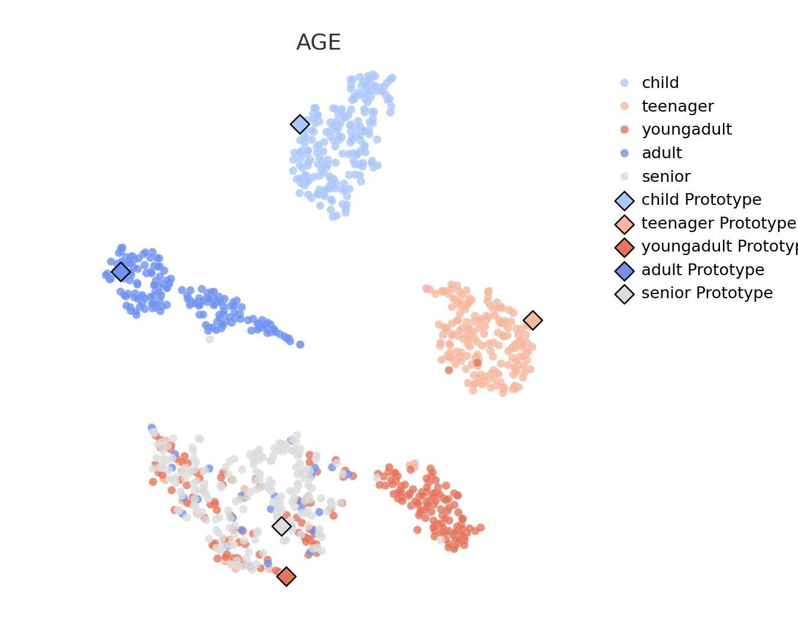
*(b)Disentangled Age*

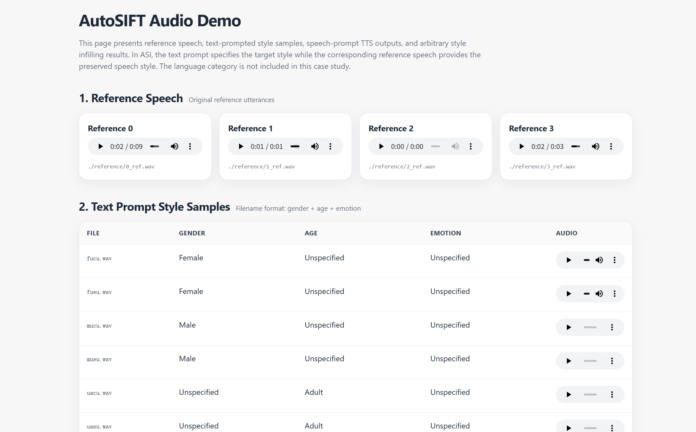
*Figure 8:Screenshot of the supplementary AutoSIFT audio demo page. The demo includes reference speech, text-prompted style samples, speech-prompted TTS outputs, and Arbitrary Style Infilling (ASI) results.*

---
**Usage Info**: 4896 tokens used.
**Generated at**: 2026-07-15 15:25:24

---

# 📚 Neural Morphing: Sequence-Optimized Token-Level Morphing in Neural Audio Codecs

🚀 URL: https://arxiv.org/html/2607.12725

## 🌏 Abstract (원문)
Neural audio codecs were originally developed for high-fidelity compression; however, their latent token representations and expressive decoders also constitute a powerful substrate for controllable audio transformation. This work introduces Neural Morphing, a training-free token-domain audio effect that selects residual-vector-quantized (RVQ) token grains from a user palette and decodes the edited stream through a pretrained codec. The method combines an RVQ-group transfer policy that separates coarse, middle, and fine codebook groups with a continuity-constrained sequence matcher that replaces independent greedy selection with bounded beam search. The intended output is a controlled hybrid: the source preserves rhythmic organization while the palette contributes timbral color and residual detail. We focus on the implementation and realtime behavior of a deployable VST3/AU system, including chunked rendering, palette-size scaling, and backend health checks.
## 🌏 Abstract (번역)
신경망 오디오 코덱은 원래 고음질 압축을 위해 개발되었지만, 그 잠재 토큰 표현과 표현력이 풍부한 디코더는 제어 가능한 오디오 변환을 위한 강력한 기반을 제공합니다. 본 연구는 사용자가 제공하는 팔레트에서 잔여 벡터 양자화(RVQ) 토큰 그레인을 선택하고 사전 훈련된 코덱을 통해 편집된 스트림을 디코딩하는 훈련 없는 토큰 도메인 오디오 효과인 Neural Morphing을 소개합니다. 이 방법은 거친(coarse), 중간(middle), 미세(fine) 코드북 그룹을 분리하는 RVQ 그룹 전송 정책과 독립적인 탐욕적 선택을 제한된 빔 탐색으로 대체하는 연속성 제약 시퀀스 매처를 결합합니다. 의도된 출력은 제어된 하이브리드입니다: 원본은 리듬 조직을 유지하면서 팔레트는 음색과 잔여 디테일을 제공합니다. 우리는 청크 렌더링, 팔레트 크기 조정, 백엔드 상태 확인을 포함하여 배포 가능한 VST3/AU 시스템의 구현 및 실시간 동작에 중점을 둡니다.

## 🔍 Methods & Results
- Neural Morphing은 신경망 코덱(인코더 E, 디코더 D)을 활용하여 입력 파형을 토큰 프레임으로 인코딩합니다.
- DAC(Digital-to-Analog Converter)는 44.1 kHz에서 9개의 RVQ 코드북과 초당 약 87개의 토큰 프레임을 사용하며, 소스 및 팔레트 스트림은 G=7 프레임과 H=2 홉을 가진 고정 길이 토큰 그레인으로 분할됩니다.
- 각 그레인은 코덱으로 학습된 디스크립터(코드북 임베딩 평균 또는 토큰 통계)로 표현됩니다.
- RVQ 스택은 거친(1-3), 중간(4-6), 미세(7-9) 코드북 그룹으로 분할되며, 제어 변수 ρ (DAC 평가에서는 ρ=0.30)를 사용하여 그룹별 가중치를 부여하고 그레인당 방출 비용을 계산합니다.
- 런타임 시 상위 K=96개의 팔레트 후보만 유지되며, 이 방법은 RVQ 그룹 전송 정책과 연속성 제약 시퀀스 매처(제한된 빔 탐색)를 결합하여 원본의 리듬 조직을 유지하면서 팔레트의 음색과 디테일을 부여하는 제어된 하이브리드 오디오를 생성합니다.
- 배포 가능한 VST3/AU 시스템으로 구현되었으며, 청크 렌더링, 팔레트 크기 조정, 백엔드 상태 확인 등의 실시간 동작에 중점을 둡니다.

## 🖼 Figures

*Figure 1:Neural Morphing pipeline. Source and palette audio are encoded into neural-codec tokens, segmented into grains, matched in a codec-induced descriptor space, optimized as a continuity-constrained palette path, edited with full-layer or RVQ-group token transfer, and decoded back to audio.*

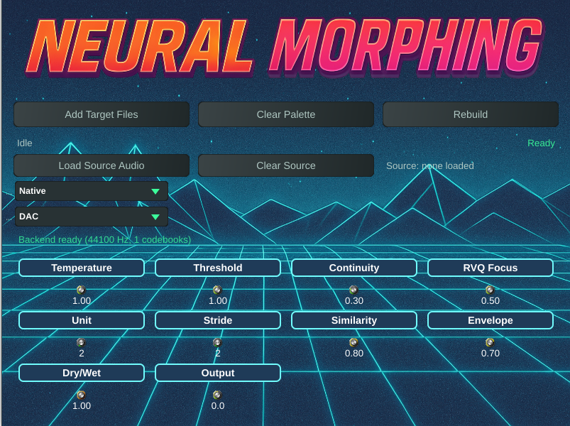
*Figure 2:Standalone Neural Morphing interface. The plugin exposes palette selection, dry/wet balance, grain/search parameters, and RVQ transfer controls while hiding codec-token operations.*

---
**Usage Info**: 2840 tokens used.
**Generated at**: 2026-07-15 15:25:34

---

# 📚 Audio-Native Speech Recognition with a Frozen Discrete-Diffusion Language Model

🚀 URL: https://arxiv.org/html/2607.13013

## 🌏 Abstract (원문)
Automatic speech recognition is dominated by autoregressive decoders that emit one token at a time. We ask whether a discrete diffusion language model can transcribe speech instead, refining a whole transcript in parallel over a small number of denoising steps. We train an audio-native interface for DiffusionGemma, a 26B mixture-of-experts model that generates text by uniform, random-token discrete diffusion rather than the absorbing-mask scheme common to recent diffusion language models. A frozen Whisper encoder supplies acoustic features, a lightweight projector maps them into the model embedding space, and low-rank adapters let the frozen backbone attend to the new modality. About 42M parameters are trained, which is 0.16 percent of the backbone. We find that the natural training objectives fail to ground the audio, because their gradient reaches the projector only through attention that has already dismissed it. A connectionist temporal classification loss applied through the frozen output head breaks this deadlock. The resulting model reaches 6.6 percent word error rate on LibriSpeech test-clean, transcribes in roughly eight parallel steps regardless of utterance length, and uses a single adapter trained on six languages, which we evaluate here on English, Hindi, and Mandarin.
## 🌏 Abstract (번역)
자동 음성 인식은 한 번에 하나의 토큰을 방출하는 자기회귀 디코더가 지배적입니다. 본 연구는 이산 확산 언어 모델이 대신 음성을 전사할 수 있는지, 즉 적은 수의 노이즈 제거 단계를 거쳐 전체 전사문을 병렬로 정제할 수 있는지 질문합니다. 우리는 최근 확산 언어 모델에 흔한 흡수 마스크 방식 대신 균일한 무작위 토큰 이산 확산을 통해 텍스트를 생성하는 26B 전문가 혼합 모델인 DiffusionGemma를 위한 오디오 네이티브 인터페이스를 훈련합니다. 고정된 Whisper 인코더가 음향 특징을 제공하고, 경량 프로젝터가 이를 모델 임베딩 공간으로 매핑하며, 저랭크 어댑터는 고정된 백본이 새로운 양식에 주의를 기울이도록 합니다. 백본의 0.16%에 해당하는 약 4,200만 개의 매개변수가 훈련됩니다. 우리는 자연스러운 훈련 목표가 오디오를 기반으로 하는 데 실패한다는 것을 발견했습니다. 이는 기울기가 이미 오디오를 무시한 어텐션을 통해서만 프로젝터에 도달하기 때문입니다. 고정된 출력 헤드를 통해 적용된 연결주의 시간 분류(CTC) 손실이 이 교착 상태를 해결합니다. 결과 모델은 LibriSpeech test-clean에서 6.6%의 단어 오류율을 달성하고, 발화 길이에 관계없이 약 8개의 병렬 단계로 전사하며, 6개 언어로 훈련된 단일 어댑터를 사용하며, 본 연구에서는 영어, 힌디어, 만다린어에 대해 평가합니다.

## 🔍 Methods & Results
- 본 연구는 자기회귀 디코더 대신 이산 확산 언어 모델을 사용하여 음성을 전사하는 새로운 접근 방식을 제안하며, 적은 수의 노이즈 제거 단계로 전체 전사문을 병렬로 정제합니다.
- DiffusionGemma(26B 전문가 혼합 모델)를 백본으로 사용하고, 고정된 Whisper-small 인코더를 음향 특징 추출기로 활용하며, 경량 프로젝터와 저랭크 어댑터(LoRA, 랭크 16)를 훈련하여 오디오 모달리티를 통합합니다.
- 훈련 가능한 매개변수는 프로젝터와 어댑터를 포함하여 약 4,230만 개로, DiffusionGemma 백본의 0.16%에 해당합니다.
- 초기 훈련 시, 확산 및 자기회귀 손실만으로는 오디오에 대한 어텐션이 0으로 수렴하여 기울기가 소실되는 '교착 상태'가 발생했습니다.
- 이 교착 상태를 해결하기 위해 고정된 출력 헤드를 통해 연결주의 시간 분류(CTC) 손실을 추가했으며, 이는 어텐션 없이 프로젝터에 직접 기울기를 제공하여 모델이 오디오 콘텐츠를 학습하도록 유도했습니다.
- 모델은 LibriSpeech test-clean 데이터셋에서 6.6%의 단어 오류율(WER)을 달성했습니다.
- 전사 과정은 발화 길이에 관계없이 약 8개의 병렬 노이즈 제거 단계로 이루어지며, 이는 기존 자기회귀 디코더의 순차적 토큰 방출 방식보다 훨씬 빠릅니다.
- 단일 어댑터가 6개 언어(영어, 힌디어, 만다린어 포함)로 훈련되었으며, 본 연구에서는 영어, 힌디어, 만다린어에 대해 평가되었습니다.
- 긴 오디오는 30초 창으로 고정된 Whisper 인코더의 제약으로 인해 무음 구간을 기준으로 분할되며, 각 세그먼트는 L=192 슬롯의 캔버스에서 병렬로 노이즈 제거됩니다.
- 샘플러는 균일 확산 프로세스를 사용하며, 각 단계에서 예측 엔트로피가 임계값 이하인 위치를 수락하고 나머지는 새로운 균일 토큰으로 재노이즈합니다. 선택적으로 분류기 없는 가이던스(classifier-free guidance)를 사용하여 오디오의 효과를 강화할 수 있습니다.

## 🖼 Figures

*Figure 1:Uniform discrete diffusion in DiffusionGemma. Generation starts from a canvas of random vocabulary tokens and, over a few steps, keeps the confident predictions and renoises the rest until the canvas anneals into text. There is no absorbing mask state.*

![Figure 2:The audio-native pathway. A frozen Whisper encoder produces acoustic features, a trainable projector maps them to 
𝑇
=
188
 audio tokens in the model embedding space, and these are scattered into the placeholder positions of the encoder prompt. The frozen DiffusionGemma encoder reads the prompt into a key-value cache, and the decoder denoises the transcript canvas in parallel while attending to that cache. Three losses train the projector and the low-rank adapters. The diffusion loss and the autoregressive auxiliary loss route through attention, and the connectionist temporal classification loss is applied directly through the frozen output head.](../images/2026-07-15/2607.13013/2607.13013_fig1.png)
*Figure 2:The audio-native pathway. A frozen Whisper encoder produces acoustic features, a trainable projector maps them to 
𝑇
=
188
 audio tokens in the model embedding space, and these are scattered into the placeholder positions of the encoder prompt. The frozen DiffusionGemma encoder reads the prompt into a key-value cache, and the decoder denoises the transcript canvas in parallel while attending to that cache. Three losses train the projector and the low-rank adapters. The diffusion loss and the autoregressive auxiliary loss route through attention, and the connectionist temporal classification loss is applied directly through the frozen output head.*

---
**Usage Info**: 4626 tokens used.
**Generated at**: 2026-07-15 15:25:42

---

