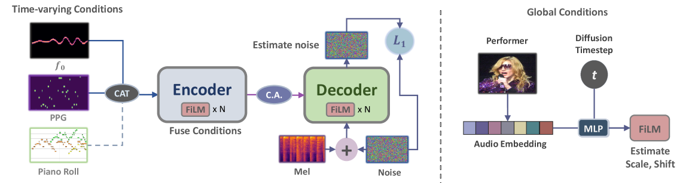
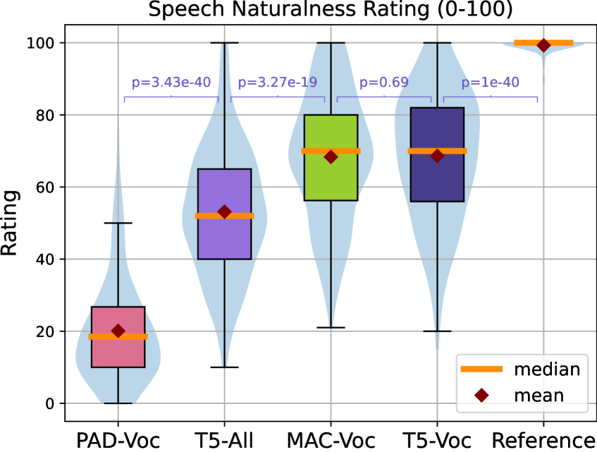
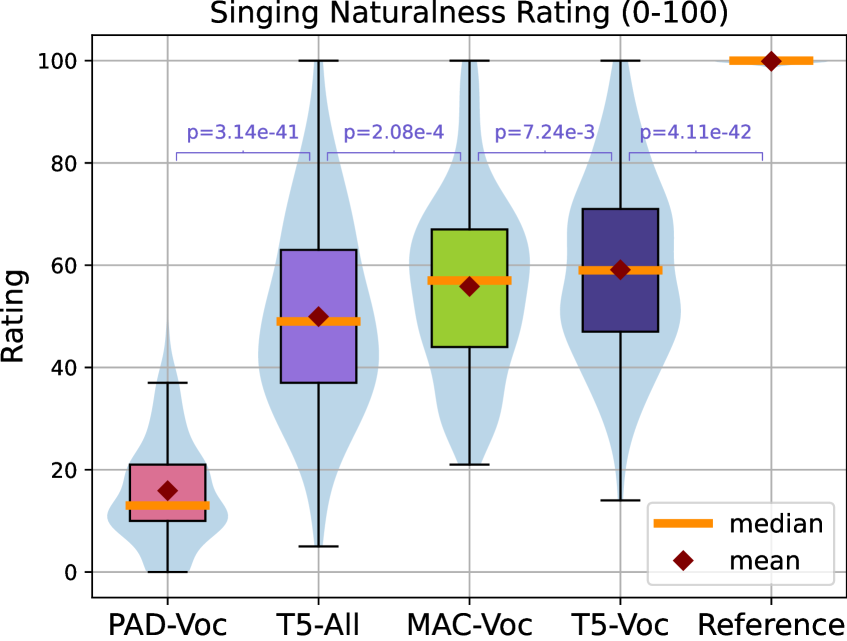
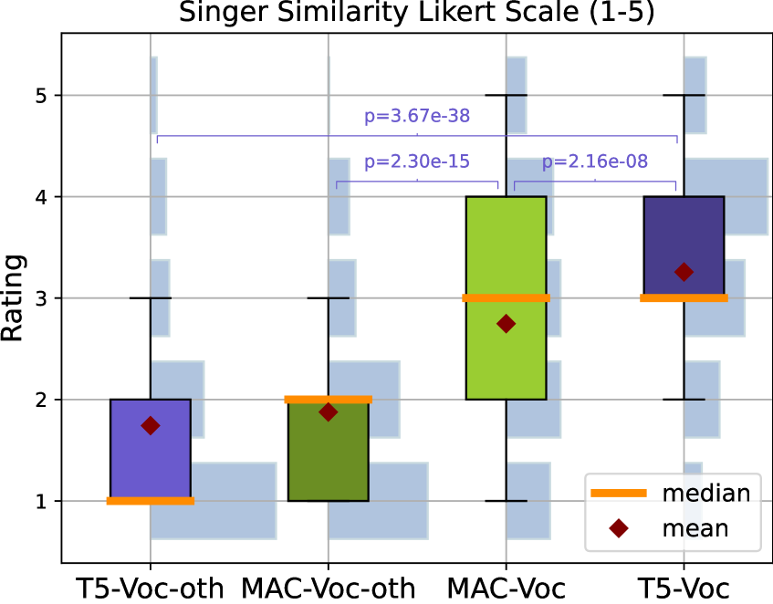
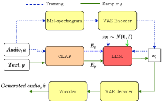
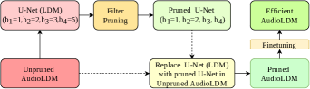
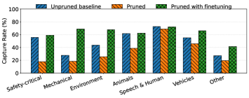
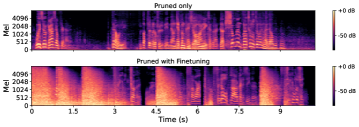
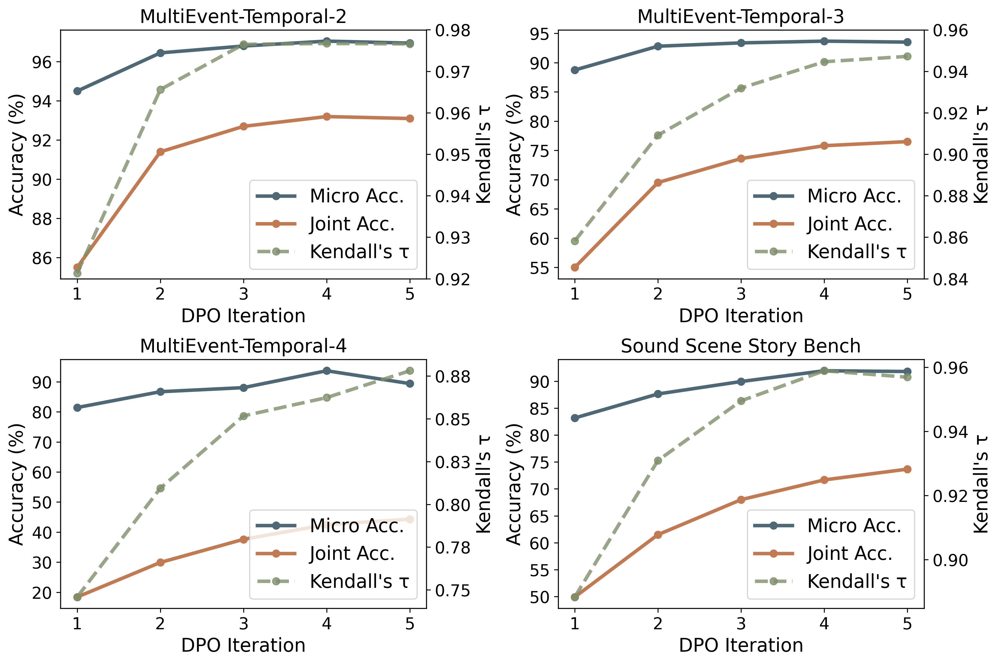

# 🚩 (2026-07-16) Scholar Inbox 추천 논문 

# 📚 Adapting a Diffusion-Based Music Synthesis Model to Human Voice Conversion

🚀 URL: https://arxiv.org/html/2607.13278

## 🌏 Abstract (원문)
Recent diffusion-based generative models have achieved strong results in domain-specific audio generation tasks such as speech, singing, and instrumental music synthesis. However, these models are typically specialized and do not generalize well to mixed or intermediate audio types. In this work, we adapt a diffusion-based model originally designed for multi-instrument music synthesis to voice conversion, covering both speech and singing within a unified framework. Specifically, we extend musical note-based conditioning to include phonetic posteriorgrams (PPGs) and pitch contours, and reinterpret timbre conditioning as speaker or singer identity via feature-wise linear modulation. Experiments show that the adapted model matches or surpasses a dedicated voice conversion system in terms of naturalness and performer similarity, while maintaining accurate pitch control across speech and singing. At the same time, we observe limitations in phonetic fidelity and a degradation in vocal quality when incorporating instrumental training data. Furthermore, we demonstrate that off-the-shelf feature extractors provide effective conditioning signals, enabling large-scale self-supervised training without manual annotations. These results highlight the potential of cross-domain model transfer towards unified audio generation systems capable of handling speech, singing, and music. Qualitative samples can be found on our project page:https://benadar293.github.io/voice-conversion
## 🌏 Abstract (번역)
최근 확산 기반 생성 모델은 음성, 노래, 악기 음악 합성 등 도메인 특정 오디오 생성 작업에서 강력한 결과를 달성했습니다. 그러나 이러한 모델은 일반적으로 전문화되어 혼합되거나 중간 오디오 유형에는 잘 일반화되지 않습니다. 본 연구에서는 다중 악기 음악 합성을 위해 원래 설계된 확산 기반 모델을 음성 변환에 적용하여, 음성과 노래를 통합된 프레임워크 내에서 다룹니다. 특히, 우리는 음악 노트 기반 컨디셔닝을 확장하여 음성 후방확률(PPG) 및 피치 윤곽을 포함하고, 팀버 컨디셔닝을 특징별 선형 변조를 통해 화자 또는 가수 정체성으로 재해석합니다. 실험 결과, 적응된 모델은 자연스러움과 연주자 유사성 측면에서 전용 음성 변환 시스템과 동등하거나 능가하며, 음성과 노래 전반에 걸쳐 정확한 피치 제어를 유지합니다. 동시에, 악기 훈련 데이터를 통합할 때 음성 충실도(phonetic fidelity)의 한계와 보컬 품질 저하를 관찰했습니다. 또한, 상용 특징 추출기가 효과적인 컨디셔닝 신호를 제공하여 수동 주석 없이 대규모 자기 지도 학습을 가능하게 함을 보여줍니다. 이러한 결과는 음성, 노래 및 음악을 처리할 수 있는 통합 오디오 생성 시스템을 향한 도메인 간 모델 전이의 잠재력을 강조합니다. 정성적 샘플은 프로젝트 페이지(https://benadar293.github.io/voice-conversion)에서 확인할 수 있습니다.

## 🔍 Methods & Results
- 본 연구의 음향 모델은 멜 스펙트로그램 확산(mel spectrogram diffusion)을 기반으로 하며, 파형 변환을 위해 상용 BigVGAN 보코더를 사용합니다.
- 생성은 스펙트로그램 생성(확산 기반 스펙트럼 디코더), 시간 가변 컨디셔닝, 전역 컨디셔닝의 세 가지 구성 요소로 분해됩니다.
- 시간 가변 컨디셔닝은 음악 노트 기반 컨디셔닝을 음성 후방확률(PPG) 및 피치 윤곽(f0)으로 확장하며, 전역 컨디셔닝은 TRILL 오디오 임베딩을 통한 특징별 선형 변조(FiLM)를 사용하여 화자 또는 가수 정체성을 제어합니다.
- 견고성 및 분류기 없는 안내(classifier-free guidance)를 위해 컨디션 드롭아웃(condition dropout)을 적용하고, 대상 가수의 자연스러운 음역대에 맞추기 위해 피치 범위 적응을 수행합니다.
- f0는 CREPE를 사용하여, PPG는 wav2vec 2.0 변형을 사용하여 추정됩니다.
- 제안된 모델은 악기 음악 합성을 위한 T5 기반 확산 모델과 음성 변환을 위한 FlowMAC(MatchaTTS 및 PAD-VC 기반)과 비교됩니다.
- 실험 결과, 적응된 모델은 자연스러움과 연주자 유사성 측면에서 전용 음성 변환 시스템과 동등하거나 능가하며, 음성과 노래 전반에 걸쳐 정확한 피치 제어를 유지합니다.
- 악기 훈련 데이터를 통합할 때 음성 충실도(phonetic fidelity)의 한계와 보컬 품질 저하가 관찰되었습니다.
- 상용 특징 추출기가 효과적인 컨디셔닝 신호를 제공하여 수동 주석 없이 대규모 자기 지도 학습이 가능함을 입증했습니다.
- 이러한 결과는 음성, 노래 및 음악을 처리할 수 있는 통합 오디오 생성 시스템을 향한 도메인 간 모델 전이의 잠재력을 강조합니다.

## 🖼 Figures

*Fig. 1:Overview of our model. “CAT”: Concatenation along the channel axis, “C.A.”: Cross-attention, ‘N’: Number of stacked blocks.*

*Fig. 2:Speech naturalness listening test results.*

*Fig. 3:Singing naturalness listening test results.*

*Fig. 4:Singer similarity listening test results.*

---
**Usage Info**: 4576 tokens used.
**Generated at**: 2026-07-16 15:31:45

---

# 📚 Efficient Text-to-Audio Generation via Pruning

🚀 URL: https://arxiv.org/html/2607.13330

## 🌏 Abstract (원문)
Diffusion-based text-to-audio generative models such as AudioLDM achieve high perceptual quality and strong semantic consistency; however, their practical deployment is hindered by the substantial computational cost of the U-Net denoising backbone. In this work, we apply model pruning to improve the computational efficiency of AudioLDM, a U-Net based text-conditioned audio latent diffusion model. We analyse parameter redundancy across U-Net convolutional blocks and evaluate a filter-pruning strategy. Pruning is guided by norm-based criteria and followed by lightweight finetuning to recover performance losses. Experimental results demonstrate that up to 83% of the parameters and 39% of the multiply–accumulate operations of U-Net have been reduced while maintaining, and in some cases improving, generation quality compared to the baseline unpruned network. We find that pruning affects AudioLDM’s ability to generate certain sound events including safety-critical sounds such as gunshots, sirens, and explosions, as well as mechanical sounds such as drills and sewing machines, and other sounds such as sprays and tick-tocks, which are mostly recovered by lightweight finetuning of the pruned model.
## 🌏 Abstract (번역)
AudioLDM과 같은 확산 기반 텍스트-오디오 생성 모델은 높은 지각 품질과 강력한 의미론적 일관성을 달성하지만, U-Net 디노이징 백본의 상당한 계산 비용으로 인해 실제 배포에 어려움이 있습니다. 본 연구에서는 U-Net 기반 텍스트 조건부 오디오 잠재 확산 모델인 AudioLDM의 계산 효율성을 개선하기 위해 모델 가지치기(pruning)를 적용합니다. U-Net 컨볼루션 블록 전반의 매개변수 중복성을 분석하고 필터 가지치기 전략을 평가합니다. 가지치기는 노름(norm) 기반 기준에 따라 수행되며, 성능 손실을 복구하기 위해 경량 미세 조정(finetuning)이 뒤따릅니다. 실험 결과, U-Net 매개변수의 최대 83%와 곱셈-누산(multiply–accumulate) 연산의 39%가 감소되었음에도 불구하고, 가지치기되지 않은 기준 네트워크와 비교하여 생성 품질을 유지하거나 일부 경우 개선하는 것으로 나타났습니다. 가지치기가 AudioLDM의 특정 사운드 이벤트 생성 능력에 영향을 미친다는 것을 발견했습니다. 여기에는 총성, 사이렌, 폭발과 같은 안전에 중요한 소리, 드릴, 재봉틀과 같은 기계음, 스프레이, 째깍거리는 소리 등이 포함되며, 이러한 영향은 가지치기된 모델의 경량 미세 조정을 통해 대부분 복구되었습니다.

## 🔍 Methods & Results
- U-Net 기반 텍스트 조건부 오디오 잠재 확산 모델인 AudioLDM의 계산 효율성을 개선하기 위해 모델 가지치기(pruning)를 적용했습니다.
- U-Net 컨볼루션 블록 전반의 매개변수 중복성을 분석하고 필터 가지치기 전략을 평가했습니다.
- 가지치기는 노름(norm) 기반 기준에 따라 수행되었으며, 성능 손실 복구를 위해 경량 미세 조정(finetuning)을 적용했습니다.
- 실험 결과, U-Net 매개변수의 최대 83%와 곱셈-누산(MAC) 연산의 39%를 감소시키면서도 기준 모델 대비 생성 품질을 유지하거나 개선했습니다.
- 가지치기는 총성, 사이렌, 폭발 등 안전에 중요한 소리, 드릴, 재봉틀 등 기계음, 스프레이, 째깍거리는 소리 등 특정 사운드 이벤트 생성 능력에 영향을 미쳤으나, 경량 미세 조정을 통해 대부분 복구되었습니다.

## 🖼 Figures

*Figure 1:An overview of the AudioLDM pipeline.*

*Figure 2:An overall framework to obtain efficient AudioLDM.*

*Figure 3:Absolute change in FAD and KL of pruned models relative to the unpruned baseline model after applying pruning with and without any finetuning at different 
(
𝑏
1
,
𝑏
2
,
𝑏
3
,
𝑏
4
)
 configurations within U-Net. Parameters count and MACs are also shown.*

*Figure 4:FAD and KL performance during finetuning for different 
(
𝑏
1
,
𝑏
2
,
𝑏
3
,
𝑏
4
)
 configurations.*

*Figure 5:Performance comparison of our efficient pruned models with existing models. Ours (
𝑏
1
,
𝑏
2
,
𝑏
3
,
𝑏
4
)
 denotes channel scaling parameters across four blocks of U-Net.*

*Figure 6:Capture rate across different sound event families generated using unpruned, pruned and pruned with finetuning models.*

*Figure 7:Spectrograms of audio generated using pruned models with/without finetuning given text input “Men speak with gunshots and booms”.*

---
**Usage Info**: 1648 tokens used.
**Generated at**: 2026-07-16 15:31:53

---

# 📚 Improving Text-to-Audio Instruction Following via Fine-Grained Feedback from Audio-Aware Large Language Models

🚀 URL: https://arxiv.org/html/2607.13408

## 🌏 Abstract (원문)
Recent text-to-audio models generate high-quality audio, but often fail to follow instructions involving multiple sound events and temporal ordering. This gap arises because existing evaluation and training signals mainly emphasize global similarity or perceptual quality, with limited supervision on instruction-level correctness. We propose an instruction-level framework that uses audio-aware large language models (ALLMs) as fine-grained judges to verify target event presence and temporal relations in generated audio. After validating ALLM judgments on benchmarks and through human verification, we use their feedback to construct preference pairs for direct preference optimization. We further introduce S3Bench, a narrative benchmark for evaluating multi-event temporal instruction following. Experiments show that our method improves event completeness, temporal ordering, and joint instruction-following accuracy across existing benchmarks and S3Bench, while maintaining audio quality.
## 🌏 Abstract (번역)
최근 텍스트-오디오 모델은 고품질 오디오를 생성하지만, 여러 사운드 이벤트와 시간적 순서가 포함된 지시를 따르는 데 종종 실패합니다. 이러한 격차는 기존 평가 및 훈련 신호가 주로 전역적 유사성 또는 지각적 품질을 강조하며, 지시 수준의 정확성에 대한 감독이 제한적이기 때문에 발생합니다. 우리는 생성된 오디오에서 목표 이벤트 존재 여부와 시간적 관계를 확인하기 위해 오디오 인식 대규모 언어 모델(ALLM)을 미세 조정된 심사관으로 사용하는 지시 수준 프레임워크를 제안합니다. 벤치마크 및 인간 검증을 통해 ALLM 판단의 유효성을 검증한 후, 이들의 피드백을 사용하여 직접 선호도 최적화를 위한 선호도 쌍을 구성합니다. 또한 다중 이벤트 시간적 지시 따르기를 평가하기 위한 서술형 벤치마크인 S3Bench를 소개합니다. 실험 결과, 우리의 방법은 기존 벤치마크와 S3Bench 전반에 걸쳐 이벤트 완전성, 시간적 순서, 그리고 공동 지시 따르기 정확도를 향상시키면서 오디오 품질을 유지함을 보여줍니다.

## 🔍 Methods & Results
- 텍스트-오디오(TTA) 생성에서 지시 따르기 능력을 향상시키기 위해 ALLM-Judged Preference Optimization (AJPO) 프레임워크를 제안했습니다.
- ALLM을 활용하여 생성된 오디오에 대해 (i) 목표 사운드 이벤트 존재 여부 및 (ii) 지정된 시간적 순서 만족 여부를 평가하는 미세 조정된 지시 수준 판단을 수행합니다.
- ALLM 판단(사운드 이벤트 존재 점수 및 시간적 순서 점수)을 기반으로 선호도 쌍(a+, a-)을 구성하여 직접 선호도 최적화(DPO)에 사용합니다. 여기서 a+는 완벽한 이벤트 커버리지와 시간적 정확성을 만족하고, a-는 시간적 순서 위반 또는 불완전한 이벤트 생성을 나타냅니다.
- ALLM의 판단 신뢰성을 검증하기 위해 AudioCaps, CompA, AudioTime 및 자체 구성한 MultiEvent-Temporal-2/3/4 합성 데이터셋에서 사운드 이벤트 존재 및 시간적 순서 평가 능력을 벤치마킹했으며, 인간 평가와도 상관관계를 확인했습니다.
- 다중 이벤트 및 명시적 시간 구조를 가진 서술형 지시를 포함하는 새로운 평가 벤치마크인 Sound Scene Story Benchmark (S3Bench)를 도입했습니다. S3Bench는 1,200개의 인스턴스로 구성되며, 모델 훈련에는 사용되지 않습니다.
- AJPO는 기존 유사성 기반 목표가 다루지 못하는 다중 이벤트 생성 및 시간 순서 제어를 직접적으로 목표로 합니다.
- 실험 결과, AJPO는 기존 벤치마크 및 S3Bench에서 이벤트 완전성, 시간적 순서, 공동 지시 따르기 정확도를 향상시키면서 오디오 품질을 유지함을 입증했습니다.

## 🖼 Figures

*Figure 1: Overview of the proposed ALLM-Judged Preference Optimization framework. Given a text instruction, a TTA model generates multiple candidate audio clips, which are then evaluated by an audio-aware large language model for sound event existence and temporal ordering. The resulting fine-grained judgments are converted into preference pairs for direct preference optimization.*

*Figure 2: Online DPO progressively improves event existence, temporal reasoning, and overall joint accuracy.*

---
**Usage Info**: 4878 tokens used.
**Generated at**: 2026-07-16 15:32:06

---

# 📚 Rethinking Speech Foundation Model Fine-tuning: Better SFT or Better Match?

🚀 URL: https://arxiv.org/html/2607.13864

## 🌏 Abstract (원문)
Supervised fine-tuning (SFT) is widely used to adapt self-supervised speech representations to downstream classification tasks. Small gains observed under a single pretrained checkpoint are often interpreted as method-level improvements, i.e., a higher attainable performance ceiling. We show that such conclusions are not always reliable because SFT outcomes depend strongly on the specific pretrained instance. We conduct a systematic study on 3 SUPERB classification tasks, evaluating 8 SFT variants across 9 pretrained checkpoints from wav2vec 2.0, HuBERT, and WavLM, with multi-seed repetitions on representative base-scale models. We find that the identity of the statistically indistinguishable top-group SFT recipe is often checkpoint-dependent, with limited transferability across pretrained instances. These findings suggest that many reported downstream gains reflect instance and seed dependentelicitation match, rather than universally improving the attainable performance ceiling.
## 🌏 Abstract (번역)
지도 학습 미세 조정(SFT)은 자기 지도 음성 표현을 다운스트림 분류 작업에 적용하는 데 널리 사용됩니다. 단일 사전 훈련된 체크포인트에서 관찰되는 작은 성능 향상은 종종 방법론적 개선, 즉 더 높은 달성 가능한 성능 상한으로 해석됩니다. 우리는 SFT 결과가 특정 사전 훈련된 인스턴스에 강하게 의존하기 때문에 이러한 결론이 항상 신뢰할 수 있는 것은 아님을 보여줍니다. 우리는 3가지 SUPERB 분류 작업에 대해 체계적인 연구를 수행했으며, wav2vec 2.0, HuBERT, WavLM의 9가지 사전 훈련된 체크포인트에 걸쳐 8가지 SFT 변형을 평가하고, 대표적인 기본 스케일 모델에 대해 다중 시드 반복을 수행했습니다. 우리는 통계적으로 구별할 수 없는 최고 그룹 SFT 레시피의 정체가 종종 체크포인트에 따라 다르며, 사전 훈련된 인스턴스 간에 전이 가능성이 제한적임을 발견했습니다. 이러한 결과는 보고된 많은 다운스트림 성능 향상이 보편적으로 달성 가능한 성능 상한을 개선하기보다는 인스턴스 및 시드에 의존하는 유도 일치(elicitation match)를 반영한다는 것을 시사합니다.

## 🔍 Methods & Results
- SFT 결과가 특정 사전 훈련된 인스턴스에 강하게 의존하여, 단일 체크포인트에서 관찰된 성능 향상이 항상 신뢰할 수 있는 방법론적 개선으로 해석될 수 없음을 보였다.
- 3가지 SUPERB 분류 작업에 대해 8가지 SFT 변형을 wav2vec 2.0, HuBERT, WavLM의 9가지 사전 훈련된 체크포인트에 걸쳐 체계적으로 연구했다.
- 대표적인 기본 스케일 모델에 대해 다중 시드 반복을 수행하여 실험의 견고성을 확보했다.
- 통계적으로 구별할 수 없는 최고 성능 SFT 레시피가 종종 체크포인트에 따라 다르며, 사전 훈련된 인스턴스 간에 전이 가능성이 제한적임을 발견했다.
- 보고된 많은 다운스트림 성능 향상이 보편적으로 달성 가능한 성능 상한을 개선하기보다는 인스턴스 및 시드에 의존하는 유도 일치(elicitation match)를 반영한다는 결론을 제시했다.

---
**Usage Info**: 2251 tokens used.
**Generated at**: 2026-07-16 15:32:15

---

# 📚 Do LLMs Need Architectural Changes for Simultaneous Speech Translation? A Prefix-to-Prefix Data Driven Approach

🚀 URL: https://arxiv.org/html/2607.13158

## 🌏 Abstract (원문)
Simultaneous speech translation (SimulST) requires incremental translation under strict latency constraints, yet remains challenging for decoder-only LLM systems due to limited context and cross-lingual reordering. Recent approaches often introduce architectural changes or explicit read/write policies to control output timing, which can be brittle in conversational speech where segmentation boundaries are ambiguous. We present a simple data-driven alternative: fixed-length chunks for cumulative streaming decoding with a rewind-based committed prefix, and teacher-labeled prefix-to-prefix (P2P) targets with bounded waiting for fine-tuning, yielding CSSEL-P2P, where CSSEL is our proposed chunked streaming speech encoder LLM. In our in-house conversational speech evaluation, CSSEL-P2P improves streaming quality by +1.54 COMETKiwi over the CSSEL streaming baseline at comparable latency (+0.15s Average Lagging), suggesting effective SimulST without architectural changes via P2P supervision.
## 🌏 Abstract (번역)
동시 음성 번역(SimulST)은 엄격한 지연 시간 제약 하에 점진적인 번역을 요구하지만, 제한된 문맥과 교차 언어 재배열로 인해 디코더 전용 LLM 시스템에는 여전히 어려운 과제입니다. 최근 접근 방식들은 출력 타이밍을 제어하기 위해 아키텍처 변경이나 명시적인 읽기/쓰기 정책을 도입하는 경우가 많지만, 대화형 음성에서 분할 경계가 모호할 때 취약할 수 있습니다. 우리는 간단한 데이터 기반 대안을 제시합니다: 되감기 기반 커밋된 접두사를 사용한 누적 스트리밍 디코딩을 위한 고정 길이 청크와, 미세 조정을 위한 대기 시간 제한이 있는 교사 레이블링된 접두사-대-접두사(P2P) 타겟을 통해 CSSEL-P2P를 개발했습니다. 여기서 CSSEL은 우리가 제안하는 청크 기반 스트리밍 음성 인코더 LLM입니다. 자체 대화형 음성 평가에서 CSSEL-P2P는 CSSEL 스트리밍 기준선에 비해 유사한 지연 시간(+0.15초 평균 지연)에서 스트리밍 품질을 +1.54 COMETKiwi 향상시켰으며, 이는 P2P 감독을 통해 아키텍처 변경 없이 효과적인 SimulST가 가능함을 시사합니다.

## 🔍 Methods & Results
- 고정 길이 청크(Δ초)를 사용하여 스트리밍 음성을 처리하며, 각 단계에서 전체 음성 접두사를 모델에 입력하는 누적 청크 디코딩 방식을 제안합니다.
- 이전 단계에서 커밋된 접두사(y_emit_i)부터 디코더가 시작하도록 강제하여 출력의 단조로운 증가를 보장하고 수정(revision)을 제거하는 '하드 접두사 고정 디코딩'을 사용합니다.
- 불안정한 경계 결정을 방지하기 위해 예측된 출력의 마지막 k 토큰을 되감아 커밋에서 제외하고, 이를 숨겨진 편집 가능한 버퍼로 취급하여 사용자에게는 수정이 없는 것처럼 보이게 합니다.
- 모델이 접두사 전용 제약 조건 하에서 훈련되지 않아 발생하는 차선책의 조기 커밋 문제를 해결하기 위해, 강력한 지시 따르기 LLM을 교사로 사용하여 '커밋 준비된' 접두사 타겟을 구축합니다.
- 교사는 각 청크에 대해 사용 가능한 접두사 문맥만으로 즉시 번역할지, 또는 문맥이 불충분할 경우 대기(빈 번역 출력)할지 결정하며, 최대 K=3 청크의 대기 예산을 설정하여 지연 시간을 제한합니다.
- 교사가 생성한 커밋 준비된 접두사-대-접두사(P2P) 데이터를 사용하여 LLM 기반 음성 번역 모델을 미세 조정하며, 음성 접두사(s_<=t_i)와 교사가 정의한 번역 접두사(y_tilde_i) 쌍을 훈련 인스턴스로 사용합니다.
- P2P 목표는 배포 시 스트리밍 인터페이스와 미세 조정 목표를 일치시켜, 모델이 언제 출력하고 언제 대기하며, 미래 문맥에서도 확장 가능한 접두사를 생성하는 스트리밍 동작을 학습하도록 합니다.
- 자체 대화형 음성 평가에서 CSSEL-P2P는 CSSEL 스트리밍 기준선 대비 스트리밍 품질을 +1.54 COMETKiwi 향상시켰으며, 평균 지연 시간은 +0.15초로 유사한 수준을 유지했습니다.

## 🖼 Figures

*Figure 1:Prefix-to-prefix supervision enables decoder-only LLMs for SimulST without architectural changes. A teacher LLM plans incremental, commit-ready translations from chunk-level transcriptions. The student LLM model is fine-tuned on these prefix targets and decoded online by anchoring on the emitted prefix while consuming cumulative audio chunks.*

---
**Usage Info**: 3370 tokens used.
**Generated at**: 2026-07-16 15:32:24

---

# 📚 Self-supervised Speech Comparison for L2 Phone, Rhythm, and Intonation Scoring

🚀 URL: https://arxiv.org/html/2607.13721

## 🌏 Abstract (원문)
L2 speech assessment has traditionally focused on phonetic assessment, leaving the scoring of suprasegmental features such as rhythm and intonation underexplored. Moreover, assessment methods often require training with labeled L2 speech data, making them difficult to apply in low-resource settings. We investigate whether DTW over self-supervised WavLM representations can provide a text-free framework for assessing phonetic accuracy, rhythm, and intonation in English and Japanese L2 speech. Results show that a basic DTW-based approach that compares learner speech to native templates exceeds human agreement on holistic and sentence-level phonetic scoring. For rhythm, we introduce methods that measure the degree of warping in the DTW alignment path; our best method approaches human-level performance. For intonation, we combine DTW distance over prosodic residuals with pitch and intensity features, but performance remains more modest on some tasks. Our results point to self-supervised representations as a promising, text-free basis for multi-aspect pronunciation assessment.
## 🌏 Abstract (번역)
제2언어(L2) 음성 평가는 전통적으로 음성학적 평가에 중점을 두었으며, 리듬 및 억양과 같은 초분절적 특징의 점수화는 충분히 탐구되지 않았습니다. 또한, 평가 방법은 종종 레이블이 지정된 L2 음성 데이터로 훈련해야 하므로 저자원 환경에서는 적용하기 어렵습니다. 본 연구에서는 자기 지도 학습(self-supervised) WavLM 표현에 대한 동적 시간 왜곡(DTW)이 영어 및 일본어 L2 음성에서 음성학적 정확도, 리듬 및 억양을 평가하기 위한 텍스트 없는 프레임워크를 제공할 수 있는지 조사합니다. 결과에 따르면 학습자의 음성을 원어민 템플릿과 비교하는 기본적인 DTW 기반 접근 방식이 전체적 및 문장 수준의 음성학적 점수화에서 인간의 일치도를 능가하는 것으로 나타났습니다. 리듬의 경우, DTW 정렬 경로의 왜곡 정도를 측정하는 방법을 도입했으며, 본 연구의 최적 방법은 인간 수준의 성능에 근접합니다. 억양의 경우, 운율 잔차에 대한 DTW 거리와 피치 및 강도 특징을 결합했지만, 일부 작업에서는 성능이 여전히 미미했습니다. 본 연구의 결과는 자기 지도 학습 표현이 다면적인 발음 평가를 위한 유망한 텍스트 없는 기반이 될 수 있음을 시사합니다.

## 🔍 Methods & Results
- 본 연구는 자기 지도 학습(SSL) WavLM-Large 표현에 대한 동적 시간 왜곡(DTW)을 사용하여 영어 및 일본어 L2 음성의 음성학, 리듬, 억양을 텍스트 없이 평가하는 프레임워크를 제안합니다.
- 음성학 평가를 위해 WavLM-Large의 최종 레이어 표현에 대한 정규화된 DTW 거리를 사용했으며, 이는 문장 수준의 전체적 및 음성학적 점수화에서 인간 평가자 일치도(r=57.6)를 유의미하게 초과했습니다(인간 r=53.6).
- 리듬 평가를 위해 DTW 정렬 경로의 왜곡 정도를 측정하는 '템포 불규칙성(tempo irregularity)'과 '간격 왜곡(interval distortion)' 두 가지 방법을 도입했습니다. 최적의 리듬 모델은 인간 수준의 성능에 근접했습니다(예: 문장 리듬 r=44.9).
- 억양 평가를 위해 WavLM-Large의 k-평균 잔차에 대한 DTW 거리와 피치(F0) 및 강도 특징을 결합했지만, 성능은 인간 일치도(r=32.9 vs 인간 r=45.3)에 미치지 못했습니다.
- 평가는 영어(ERJ) 및 일본어(JRF) L2 음성 데이터셋을 사용하여 스피커 분리 5겹 교차 검증 방식으로 수행되었으며, Pearson 상관 계수(r) 및 Spearman 순위 상관(ρ)을 주요 지표로 사용했습니다.
- 전반적으로, DTW 기반 SSL 방법은 기준선보다 뛰어난 성능을 보였으며, 특히 문장 수준의 전체적 및 음성학적 점수화에서 인간 평가자 일치도를 능가했습니다.
- 리듬 평가 방법은 인간 성능에 근접했으며, 리듬 지각이 의존하는 시간적 편차를 DTW 왜곡 경로가 직접 반영함을 보여주었습니다.
- 억양 평가는 가장 어려운 과제로 남아 있으며, 현재의 피치 기반 특징이나 SSL 운율 잔차로는 전문가 평가자의 지각적 차원을 충분히 포착하지 못하는 것으로 나타났습니다.
- 일본어 문장 전체 점수화의 경우, 잔차 특징과 DTW_SSL을 결합한 앙상블 모델이 인간 일치도(r=66.0 vs r=60.4)를 유의미하게 초과했으며, DTW_norm.res가 가장 예측력이 높은 특징으로 나타났습니다.

## 🖼 Figures

*Figure 1:Our L2 pronunciation assessment approach. Self-supervised speech representations from second-language learners are compared with native references to identify differences in phones, rhythm, and intonation. The raw scores are then converted to ordinal scores.*

*Figure 2:Our method for determining the warp angle of a DTW path. To smooth quantization noise in the warping path (left), we calculate the average of overlapping frame windows, resulting in a smoothed warping path. We then calculate the angle in radians over 3-frame windows (right). Our tempo irregularity is the average distance of the angles from the utterance mean.*

*Figure 3:An example of our two rhythm assessment methods. For tempo irregularity, we smooth the warping path over 5-frame windows and calculate the deviation of the angle of that path from its mean (red line). For the interval deviation method, frames of speech are classified as silence, vowels, or consonants. We group contiguous phones of each class, and calculate the difference in log-duration between each native and learner interval.*

*Figure 4:Our method for extracting prosodic information from SSL representations. The 
𝑘
-means cluster centers corresponding to each feature are subtracted from the original features, resulting in residual vectors.*

*Figure 5:Best model vs. the human benchmark on each task. Dots are blue when the model exceeds human agreement and red otherwise. Whiskers show the 
95
%
 confidence interval of 
model
−
human
; a whisker clear of the benchmark tick indicates a statistically significant difference.*

---
**Usage Info**: 6478 tokens used.
**Generated at**: 2026-07-16 15:32:34

---

