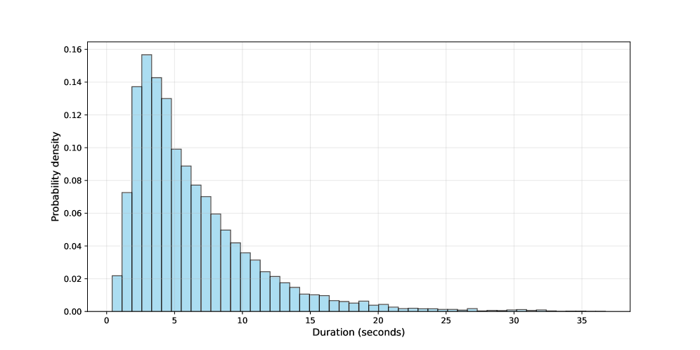
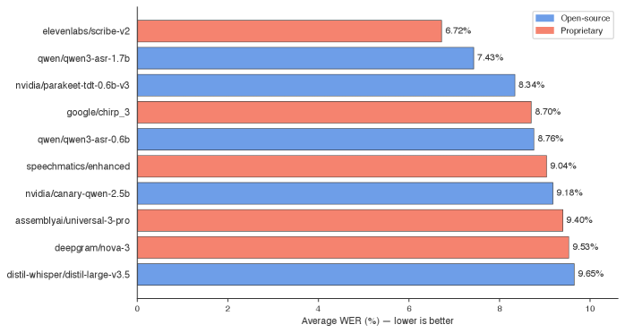
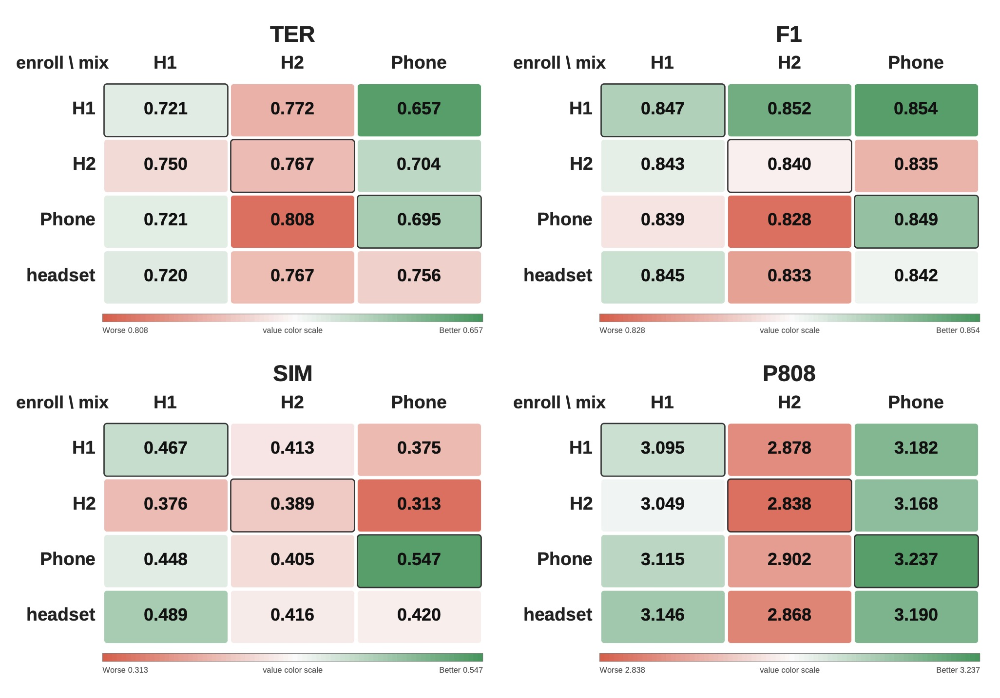
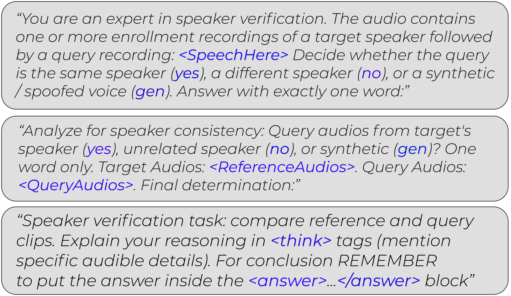

# 🚩 (2026-07-17) Scholar Inbox 추천 논문 

# 📚 WanSong v1.0 Technical Report

🚀 URL: https://arxiv.org/html/2607.14749

## 🌏 Abstract (원문)
Music generation foundation models have recently attracted significant industry attention. However, achieving efficient generation and high-fidelity long-form audio while supporting controllability remains challenging. To address these needs, we presentWanSong, a simple yet powerful approach for long-form, commercial-grade song generation. Unlike autoregressive (AR) and cascaded multi-stage pipelines (e.g., AR followed by diffusion),WanSongis a pure diffusion-based model that directly generates high-fidelity, multilingual songs up to 5 minutes and outputs dual stems (vocals and background music) in a single run. In addition, our diffusion framework enables faster inference through step-distillation, and offers an efficient pathway for fine-tuning and customization to support downstream editing tasks.
## 🌏 Abstract (번역)
음악 생성 파운데이션 모델은 최근 상당한 산업적 관심을 받고 있습니다. 그러나 제어 가능성을 지원하면서 효율적인 생성과 고음질의 장시간 오디오를 달성하는 것은 여전히 어렵습니다. 이러한 요구 사항을 해결하기 위해 우리는 장시간 상업용 등급의 노래 생성을 위한 간단하면서도 강력한 접근 방식인 WanSong을 제시합니다. 자기회귀(AR) 및 계단식 다단계 파이프라인(예: AR 다음에 확산)과 달리, WanSong은 최대 5분 길이의 고음질 다국어 노래를 직접 생성하고 단일 실행으로 듀얼 스템(보컬 및 배경 음악)을 출력하는 순수 확산 기반 모델입니다. 또한, 우리의 확산 프레임워크는 스텝 증류(step-distillation)를 통해 더 빠른 추론을 가능하게 하며, 후속 편집 작업을 지원하기 위한 미세 조정 및 사용자 정의를 위한 효율적인 경로를 제공합니다.

## 🔍 Methods & Results
- 연속 1D 변이형 오토인코더(VAE)를 사용하여 스테레오 오디오를 압축된 잠재 스트림으로 변환하며, Stable Audio 2 대비 압축률을 절반으로 줄여 고음질 및 소스 분리에 중요한 시간-주파수 세부 정보를 보존합니다.
- VAE는 44.1kHz 스테레오 오디오를 잠재 텐서(Cz=64, T'=T/1024)로 매핑하며, 다중 해상도 STFT 크기 손실, L1 특징 매칭 손실, 힌지 적대적 손실, KL 발산 등을 사용하여 적대적으로 훈련됩니다.
- 약 2.6억 개의 품질 필터링된 오디오 클립(음악:음성:사운드 = 50%:40%:10% 비율로 균형)으로 훈련되었으며, 44.1kHz 스테레오로 리샘플링하고 AdamW 옵티마이저를 사용하여 32개의 NVIDIA A100 GPU에서 150만 스텝 동안 훈련되었습니다.
- 텍스트 토큰(LLM 인코딩)과 듀얼 스템 오디오 토큰(VAE 인코딩)을 시퀀스로 연결하여 트랜스포머 기반 확산 백본에 입력하며, 효율성을 위해 토큰 패킹을 활용합니다.
- 음성 정확도와 배경 음악(BGM) 복원 간의 균형 문제를 해결하기 위해, 블록 학습 중 보컬과 BGM 토큰을 동일 토큰의 다른 채널로 처리하여 독립적인 스트림을 유지하면서 내재적 종속성을 학습하는 '레이어 내 공동 학습' 전략을 통해 듀얼 스템 출력을 구현합니다.
- 장시간 노래의 미세한 세부 사항을 학습하기 위해 3단계 사전 훈련(90초, 300초 길이 훈련 및 지도 미세 조정)과 플로우 매칭 프레임워크를 사용하여 노이즈 제거를 모델링하며, 보컬/BGM 학습 강도와 텍스트 조건을 균형 있게 조절하는 MSE 손실 함수로 속도(Vt)를 예측합니다.
- 음악성, 가사 정확도, 프롬프트 정렬 등 인간의 선호도에 모델을 정렬하여 노래 품질을 향상시키기 위해 인간 피드백 기반 강화 학습(RLHF)을 사용하며, 인간 주석으로 훈련된 보상 모델을 활용합니다.
- RLHF를 위해 DPO(Diffusion Policy Optimization)를 먼저 적용하여 오디오의 전역 구조를 최적화하고, 이어서 ReFL(Reward-conditioned Flow Learning)을 사용하여 저노이즈 단계에서 미세한 세부 사항을 최적화하여 상호 보완적인 강점을 활용합니다.

## 🖼 Figures

*Figure 1:Data pipeline overview.*

*Figure 2:Our hybrid-transformer backbone.*

---
**Usage Info**: 4987 tokens used.
**Generated at**: 2026-07-17 15:11:42

---

# 📚 Dialogs: a studio-quality expressive conversational Russian speech corpus for dialog assistants

🚀 URL: https://arxiv.org/html/2607.14310

## 🌏 Abstract (원문)
We introduce Dialogs, a studio-quality Russian conversational speech corpus for dialog assistants. The dataset contains 20.6 hours of face-to-face acted dialogs recorded in a professional studio (44.1 kHz stereo) and segmented into 11,796 utterances across 3 speakers. Unlike read-speech resources, Dialogs captures turn-taking rhythm and expressive prosody, and provides per-utterance style/emotion labels spanning 12 categories. We validate corpus quality with crowd MOS tests, showing comparable audio quality and intelligibility to strong Russian studio baselines while achieving higher ratings for expressiveness and conversational naturalness. Finally, we train a VITS2 model as a proof of concept, demonstrating that Dialogs supports training expressive, dialog-like TTS despite limited per-speaker data.
## 🌏 Abstract (번역)
대화형 비서용 스튜디오 품질의 러시아어 대화 음성 코퍼스인 Dialogs를 소개합니다. 이 데이터셋은 전문 스튜디오에서 녹음된(44.1 kHz 스테레오) 20.6시간 분량의 대면 연기 대화를 포함하며, 3명의 화자에 걸쳐 11,796개의 발화로 분할되었습니다. 낭독 음성 자료와 달리, Dialogs는 발화 교환 리듬과 표현적인 운율을 포착하며, 12가지 범주에 걸친 발화별 스타일/감정 레이블을 제공합니다. 우리는 크라우드 MOS 테스트를 통해 코퍼스 품질을 검증했으며, 강력한 러시아어 스튜디오 기준선과 유사한 오디오 품질 및 명료도를 보이면서도 표현력과 대화의 자연스러움에서 더 높은 평가를 받았습니다. 마지막으로, 개념 증명으로 VITS2 모델을 훈련하여, Dialogs가 제한된 화자별 데이터에도 불구하고 표현력이 풍부하고 대화와 유사한 TTS 훈련을 지원함을 입증했습니다.

## 🔍 Methods & Results
- 대화형 비서용 스튜디오 품질의 러시아어 대화 음성 코퍼스인 'Dialogs'를 구축했습니다.
- 데이터셋은 전문 스튜디오에서 녹음된 20.6시간 분량의 대면 연기 대화로 구성되며, 3명의 화자에 걸쳐 11,796개의 발화로 분할되었습니다.
- Dialogs는 발화 교환 리듬, 표현적인 운율을 포착하며, 12가지 범주의 발화별 스타일/감정 레이블을 제공합니다.
- 크라우드 MOS 테스트를 통해 코퍼스 품질을 검증한 결과, 기존 러시아어 스튜디오 기준선과 유사한 오디오 품질 및 명료도를 보였으며, 표현력과 대화의 자연스러움에서 더 높은 평가를 받았습니다.
- 개념 증명으로 VITS2 모델을 훈련하여, Dialogs가 제한된 화자별 데이터로도 표현력이 풍부하고 대화와 유사한 TTS 훈련을 지원함을 입증했습니다.

## 🖼 Figures

*Figure 1:Audio recording duration distribution density.*

---
**Usage Info**: 1273 tokens used.
**Generated at**: 2026-07-17 15:11:48

---

# 📚 RW-Voice-EQ Bench: A Real World Benchmark for Evaluating Voice AI Systems

🚀 URL: https://arxiv.org/html/2607.14846

## 🌏 Abstract (원문)
Current voice AI benchmarks typically evaluate isolated capabilities such as speech intelligibility, word error rate, or text-based dialogue quality, but they rarely test whether systems harness the acoustic information that distinguishes spoken language from its textual representation. To this end, we introduce the Real World Voice EQ Bench222huggingface.co/spaces/HumeAI/rw-voice-eq, a multidimensional benchmark for evaluating voice AI across text-to-speech (TTS), speech-to-speech (STS), speech understanding (SU), and automatic speech recognition (ASR). Our evaluations indicate that performance is highly dimension-specific. For TTS, naturalness, expressiveness, identity stability, and reliability are largely independent evaluation dimensions. For STS, access to audio does not guarantee use of vocal affect, and some agents remain largely transcript-driven. For SU, models perform unevenly across paralinguistic tasks. For ASR, real world accent, emotion, noise, and conversational conditions expose failures that are not captured by established clean-speech benchmarks. Together, these results show that voice AI should be evaluated as a profile of acoustic, expressive, interactional, and robustness capabilities rather than by a single aggregate score.
## 🌏 Abstract (번역)
현재 음성 AI 벤치마크는 일반적으로 음성 명료도, 단어 오류율 또는 텍스트 기반 대화 품질과 같은 개별적인 기능들을 평가하지만, 시스템이 음성 언어를 텍스트 표현과 구별하는 음향 정보를 활용하는지 여부는 거의 테스트하지 않습니다. 이를 위해 우리는 텍스트-음성 변환(TTS), 음성-음성 변환(STS), 음성 이해(SU) 및 자동 음성 인식(ASR) 전반에 걸쳐 음성 AI를 평가하기 위한 다차원 벤치마크인 Real World Voice EQ Bench222huggingface.co/spaces/HumeAI/rw-voice-eq를 소개합니다. 우리의 평가는 성능이 차원별로 매우 다르다는 것을 나타냅니다. TTS의 경우, 자연스러움, 표현력, 정체성 안정성 및 신뢰성은 대체로 독립적인 평가 차원입니다. STS의 경우, 오디오 접근이 음성 감정의 사용을 보장하지 않으며, 일부 에이전트는 여전히 주로 스크립트 기반으로 작동합니다. SU의 경우, 모델은 주변 언어 작업에서 고르지 않은 성능을 보입니다. ASR의 경우, 실제 세계의 억양, 감정, 소음 및 대화 조건은 기존의 깨끗한 음성 벤치마크로는 포착되지 않는 실패를 드러냅니다. 종합적으로, 이러한 결과는 음성 AI가 단일 집계 점수보다는 음향, 표현, 상호작용 및 견고성 기능의 프로필로 평가되어야 함을 보여줍니다.

## 🔍 Methods & Results
- Real World Voice EQ Bench는 텍스트-음성 변환(TTS), 음성-음성 변환(STS), 음성 이해(SU), 자동 음성 인식(ASR) 전반에 걸쳐 음성 AI를 평가하는 다차원 벤치마크로 도입되었습니다.
- 평가 결과, 음성 AI의 성능은 각 차원(TTS, STS, SU, ASR)에 따라 매우 다르게 나타났습니다.
- TTS의 경우, 자연스러움, 표현력, 정체성 안정성, 신뢰성은 서로 독립적인 평가 차원임이 확인되었습니다.
- STS의 경우, 오디오에 접근할 수 있다고 해서 음성 감정을 반드시 활용하는 것은 아니며, 일부 에이전트는 여전히 주로 텍스트 스크립트에 의존하는 경향을 보였습니다.
- SU의 경우, 모델들은 주변 언어(paralinguistic) 작업에서 고르지 않은 성능을 나타냈습니다.
- ASR의 경우, 실제 환경의 억양, 감정, 소음, 대화 조건 등은 기존의 깨끗한 음성 벤치마크로는 포착되지 않는 시스템의 실패 지점을 드러냈습니다.
- 결론적으로, 음성 AI는 단일 총점보다는 음향적, 표현적, 상호작용적, 견고성 등 다양한 능력의 프로필로 평가되어야 함을 시사합니다.

## 🖼 Figures

*Figure 1:Overview of the RW-Voice-EQ benchmark. RW-Voice-EQ evaluates voice AI along four domains: (1) Text-to-Speech (TTS), (2) Speech-to-Speech (STS), (3) Speech Understanding (SU), (4) ASR Robustness. Together the four domains characterize a voice system as a capability profile rather than a single aggregate score.*

*Figure 2:The RW-Voice-EQ evaluation methodology. Human evaluation (TTS, STS) generates audio per model-item, presents it to multiple raters against a task-specific rubric, and aggregates into per-evaluation scores. Label-based scoring (SU, ASR) compares model predictions against ground-truth labels, pairwise targets, or reference transcripts using accuracy or word error rate. The two paradigms respectively cover perceptual/interactional constructs and objective target-based tasks.*

*Figure 3:Human–SLM agreement across TTS dimension groups. For each SLM judge and dimension group, agreement is reported as the mean Spearman rank correlation (
𝜌
) between SLM judge scores and human ratings across the constituent evaluations. The three highest-scoring judges within each dimension group are shown. Higher values indicate closer agreement with human system rankings.*

![Figure 4:Cross-model audit on VoxPopuli-English. WER (%) from the June 2026 Open ASR Leaderboard [26]. Bad-reference acceptance: the rate at which each model returned reference transcripts verbatim on cases where the reference was identified as requiring a correction](../images/2026-07-17/2607.14846/2607.14846_fig3.png)
*Figure 4:Cross-model audit on VoxPopuli-English. WER (%) from the June 2026 Open ASR Leaderboard [26]. Bad-reference acceptance: the rate at which each model returned reference transcripts verbatim on cases where the reference was identified as requiring a correction*

*Figure 5:Top-five TTS system configurations by capability group. Cells report the capability-level mean 
±
 standard deviation. Shading indicates within-capability rank, with darker cells denoting higher rank. Systems are ordered by the number of top-five appearances; the horizontal rule separates systems appearing in multiple top-five lists from those appearing in only one.*

![Figure 6:Top-performing speech-to-speech systems by evaluation dimension. Each column shows the five highest-scoring systems within an evaluation dimension, with cells reporting mean human rating ± standard deviation. Darker coral indicates a higher within-dimension rank (rank 1 darkest; rank 5 lightest), while blank cells indicate that the system did not place in the top five. Emotion Understanding maps to a single constituent evaluation, so no across-evaluation standard deviation is defined for that dimension. The horizontal line separates systems appearing in multiple top-five lists from those appearing in only one.](../images/2026-07-17/2607.14846/2607.14846_fig5.png)
*Figure 6:Top-performing speech-to-speech systems by evaluation dimension. Each column shows the five highest-scoring systems within an evaluation dimension, with cells reporting mean human rating ± standard deviation. Darker coral indicates a higher within-dimension rank (rank 1 darkest; rank 5 lightest), while blank cells indicate that the system did not place in the top five. Emotion Understanding maps to a single constituent evaluation, so no across-evaluation standard deviation is defined for that dimension. The horizontal line separates systems appearing in multiple top-five lists from those appearing in only one.*

*Figure 7:Top-performing speech-understanding systems across three evaluation dimensions. Panels show the five highest-scoring systems for speech-emotion recognition (chance-adjusted skill), speaker verification (accuracy), and synthetic-speech detection (threshold-derived accuracy). Colors distinguish general speech-language models from dedicated speaker-verification models.*

*Figure 8:Performance of the top 10 ASR systems by average word error rate (WER) across four human-curated evaluation datasets. Colors distinguish proprietary and open-source models.*

---
**Usage Info**: 1608 tokens used.
**Generated at**: 2026-07-17 15:11:55

---

# 📚 SLT 2026 REAL-TSE Challenge: Real-world Target Speaker Extraction from Conversational Recordings

🚀 URL: https://arxiv.org/html/2607.15198

## 🌏 Abstract (원문)
We introduce theREAL-TSE Challenge111https://real-tse.github.io/challenge/, an IEEE SLT 2026 satellite challenge on target speaker extraction (TSE) from real conversational recordings. Given a multi-speaker mixture and one or more enrollment utterances from a target speaker, participating systems must recover only the target speech. Unlike simulated read-speech benchmarks, REAL-TSE evaluates Mandarin and English recordings that contain natural overlap, reverberation, noise, channel mismatch, and conversational dynamics. The challenge defines two complementary tracks: anOnlinetrack for low-latency streaming extraction and anOfflinetrack for full-context processing. Systems are evaluated with Token Error Rate (TER), Speaker Similarity (SpkSim), DNSMOS, and target-speaker activity F1. This overview paper describes the task definition, datasets, baselines, evaluation protocol, submitted systems, condition-wise findings, and lessons for future real-world TSE benchmarks.
## 🌏 Abstract (번역)
REAL-TSE 챌린지(IEEE SLT 2026 위성 챌린지)를 소개합니다. 이 챌린지는 실제 대화 녹음에서 목표 화자 추출(TSE)을 다룹니다. 다중 화자 혼합음과 목표 화자의 하나 이상의 등록 발화가 주어졌을 때, 참여 시스템은 목표 화자의 음성만을 복구해야 합니다. 시뮬레이션된 낭독 음성 벤치마크와 달리, REAL-TSE는 자연스러운 중첩, 잔향, 노이즈, 채널 불일치 및 대화 역학을 포함하는 만다린어 및 영어 녹음을 평가합니다. 이 챌린지는 낮은 지연 시간 스트리밍 추출을 위한 온라인 트랙과 전체 컨텍스트 처리를 위한 오프라인 트랙이라는 두 가지 보완적인 트랙을 정의합니다. 시스템은 토큰 오류율(TER), 화자 유사성(SpkSim), DNSMOS 및 목표 화자 활동 F1으로 평가됩니다. 이 개요 논문은 작업 정의, 데이터셋, 베이스라인, 평가 프로토콜, 제출된 시스템, 조건별 발견 사항 및 향후 실제 TSE 벤치마크를 위한 교훈을 설명합니다.

## 🔍 Methods & Results
- 네 가지 BSRNN 기반 베이스라인(WeSep 구현)이 Libri2Mix-100으로 훈련되었으며, ECAPA-TDNN 임베딩을 사용하는 BSRNN_EMB와 TF-Map 특징을 사용하는 BSRNN_TFMAP의 두 가지 등록 조건화 방법을 인과적 및 비인과적 추출기에서 비교했습니다. 이들은 합성 영어 데이터로만 훈련되어 최적화된 시스템이라기보다는 하한 참조로 사용되었습니다.
- 각 트랙에 12개 팀이 유효한 시스템을 제출했으며, 주요 성능 영향 요인은 (i) 실제 대화 데이터의 시뮬레이션 및 적응을 통한 활용, (ii) 지연 시간 예산 내(또는 없이) 추출기 설계 및 조건화, (iii) 훈련 목표, 후처리 및 테스트 시간 동작이 자동 측정 지표와 상호작용하는 방식이었습니다.
- 상위 시스템들은 대부분의 지표에서 베이스라인을 크게 능가했지만, 단일 시스템이 모든 평가 차원에서 균일하게 우수하지는 않아 실제 TSE의 다목적 특성을 강조했습니다.
- 대부분의 팀은 공개 음성 코퍼스에서 혼합음을 합성하고 노이즈와 잔향을 추가했으며, 특히 실제 대화 데이터에 대한 적응(pseudo-label 생성 및 다단계 반복 학습)이 합성 데이터만으로 훈련하는 것보다 일관되게 우수한 성능을 보였습니다. 상위 3개 팀은 훈련 파이프라인에 실제 녹음을 통합하거나 실제 데이터만 사용했습니다.
- 온라인 트랙(Track 1) 시스템은 주로 컴팩트하고 인과적인 BSRNN 및 TF-GridNet 변형이었으며, 오프라인 트랙(Track 2)은 SSL 기반 어트랙터 초기화, 대화 분할 인식 프론트엔드, 확산 모델 기반 생성적 개선 등 더 넓은 범위의 접근 방식을 탐색했습니다.
- 현재 제출된 시스템을 넘어 상당한 개선 여지가 있으며, 현실적인 데이터 시뮬레이션, 실제 데이터 적응, 의사 레이블 생성 및 필터링, 손실 설계, 지표 인식 훈련 및 후처리가 기존 백본의 성능을 크게 향상시킬 수 있음을 시사합니다.
- 재구성 손실(SI-SDR/SI-SNR)은 화자 유사성, DNSMOS 관련, ASR/토큰 수준, VAD/활동 손실 등 공식 지표에 맞춰 보조 항과 결합되어 다목적 최적화로의 전환을 보여주었습니다. 후처리는 DNSMOS를 개선할 수 있지만 SpkSim을 감소시키거나 목표 활동을 변경할 수 있어 트레이드오프 관계를 가집니다.
- 신경망 지표 최적화가 인지 품질 개선 없이 점수를 높이는 아티팩트를 생성할 수 있다는 점이 드러났으며, 자동 점수를 기반으로 한 분기 선택, 개발 중 공식 검증 스크립트 반복 사용, 적대적 파형 교란과 같은 사례가 발견되어 향후 챌린지에서 더 엄격한 규칙이 필요함을 시사합니다.
- 온라인 트랙(Track 1)의 알고리즘 지연 시간(20-100ms)은 STFT/iSTFT 지연, 홉 버퍼링, 미리보기 등으로 발생했으며, 분석적 추정치와 측정된 지연 시간이 항상 일치하지 않아 향후 온라인 TSE 벤치마크에서는 투명한 분석적 지연 시간 분석과 표준화된 측정 절차가 필요함을 제안합니다.

## 🖼 Figures

*Figure 1:Metric balance of the top-5 valid systems in each track.*

*Figure 2:Scenario-wise performance on the EVAL-2 set, computed by averaging all valid submissions separately for CN and EN and then taking a CN/EN macro average over shared scenarios.*

*Figure 3:Enrollment-device by mixture-device performance matrix on EVAL-2.*

*Figure 4:Relationship between target ratio and F1/TER on EVAL-2.*

*Figure 5:Relationship between DNSMOS OVRL and DNSMOS P808 on participant submissions. The high-OVRL outliers do not show corresponding gains in P808, indicating metric-specific over-optimization rather than a consistent improvement in perceptual quality.*

---
**Usage Info**: 5464 tokens used.
**Generated at**: 2026-07-17 15:12:12

---

# 📚 Large Audio Language Models for Spoofing-Aware Speaker Verification

🚀 URL: https://arxiv.org/html/2607.14753

## 🌏 Abstract (원문)
Recent advances in text-to-speech and voice cloning make high-quality spoofing inexpensive and scalable, threatening voice authentication systems, especially automatic speaker verification (ASV). Existing defenses mainly address this threat through binary countermeasures (CMs) for deepfake detection or spoofing-aware speaker verification (SASV), where current systems are dominated by modular ASV-CM fusion and cascaded pipelines. Although large audio language models (LALMs) have shown promise on related audio tasks, including CM and ASV, their use for SASV remains unexplored, despite their capacity to produce natural-language rationales for auditing and robustness beyond discriminative predictions. This work systematically evaluates LALMs for SASV against conventional pipelines under zero-shot prompting, supervised adaptation, reasoning-oriented training, and reinforcement-learning-based optimization. Our results show that pretrained LALMs are near chance in the zero-shot setting, confirming that they are not natively suited to SASV, but that task-specific adaptation closes this gap. We further find that competitive SASV performance can be achieved through several distinct routes. These findings position LALMs as a promising and auditable foundation for unified SASV, while clarifying where conventional cascade systems still lead.
## 🌏 Abstract (번역)
최근 텍스트 음성 변환 및 음성 복제 기술의 발전으로 고품질 스푸핑이 저렴하고 확장 가능해지면서 음성 인증 시스템, 특히 자동 화자 확인(ASV)을 위협하고 있습니다. 기존 방어책은 주로 딥페이크 탐지를 위한 이진 대책(CM) 또는 스푸핑 인식 화자 확인(SASV)을 통해 이러한 위협에 대처하며, 현재 시스템은 모듈형 ASV-CM 융합 및 계단식 파이프라인이 지배적입니다. 대규모 오디오 언어 모델(LALM)은 CM 및 ASV를 포함한 관련 오디오 작업에서 가능성을 보여주었지만, 판별적 예측을 넘어 감사 및 견고성을 위한 자연어 설명을 생성할 수 있는 능력에도 불구하고 SASV에 대한 활용은 아직 탐구되지 않았습니다. 본 연구는 제로샷 프롬프트, 지도 학습 적응, 추론 지향 훈련 및 강화 학습 기반 최적화 하에서 LALM을 기존 파이프라인과 비교하여 SASV에 대해 체계적으로 평가합니다. 우리의 결과는 사전 훈련된 LALM이 제로샷 설정에서 우연에 가까운 성능을 보여 SASV에 본질적으로 적합하지 않음을 확인했지만, 작업별 적응이 이 격차를 해소한다는 것을 보여줍니다. 우리는 또한 경쟁력 있는 SASV 성능이 여러 가지 다른 경로를 통해 달성될 수 있음을 발견했습니다. 이러한 발견은 LALM을 통합 SASV를 위한 유망하고 감사 가능한 기반으로 자리매김하는 동시에 기존 캐스케이드 시스템이 여전히 우위를 점하는 부분을 명확히 합니다.

## 🔍 Methods & Results
- SASV를 등록 발화와 시험 발화에 대한 세 가지 결정(대상, 비대상, 스푸핑) 문제로 공식화하고, 화자 확인 및 스푸핑 대책 목표를 개별적으로 최적화하는 기존 캐스케이드 ASV-CM 파이프라인과 달리 단일 종단 간 모델을 훈련합니다.
- 사전 훈련된 LALM(SALMONN, Qwen-Audio)이 SASV에 적합한지, 기존 시스템과 비교하여 성능은 어떤지, 적응 및 훈련 전략이 성능 향상 및 화자 판별과 스푸핑 탐지 간의 균형에 어떻게 기여하는지, 명시적 추론 감독이 LALM 기반 SASV의 견고성과 해석 가능성을 향상시킬 수 있는지에 대한 연구 질문을 제시합니다.
- 제로샷 성능이 약할 것으로 예상하여, LALM의 일반적인 음향 지식을 방해하지 않으면서 SASV 공식에 모델을 맞추기 위해 LoRA 매개변수 효율적 미세 조정(SFT)을 사용하여 LALM을 지도 학습 방식으로 미세 조정합니다.
- SALMONN은 등록 및 시험 발화를 파형 수준에서 순차적으로 연결하여 단일 프롬프트로 처리하며, Qwen-Audio는 등록 및 시험 발화를 별도의 오디오 입력으로 받습니다.
- SASV 결정을 위한 세 가지 클래스 교차 엔트로피(L1), 화자 분리 가능성을 향상시키는 Additive Angular Margin(AAM) 손실(L2, 본인 샘플에만 적용), 스푸핑 민감도를 높이는 이진 교차 엔트로피(L3)의 세 가지 감독 헤드를 포함하는 복합 목적 함수를 사용하여 동시 최적화를 수행합니다.
- 훈련 진행에 따라 가장 유익한 샘플 쌍(동일 화자, 낮은 임베딩 유사성; 다른 화자, 높은 유사성; 등록 화자와 가장 가까운 스푸핑 시험)에 샘플러를 집중시키는 하드 샘플 마이닝을 통해 견고성을 향상시킵니다.
- 모델이 결정뿐만 아니라 결정을 설명하고 뒷받침하는 텍스트 추론을 제공하도록 명시적 추론 감독(chain-of-thought traces)을 적용하며, 이는 CoLMbo(화자 프로파일링), emotion2vec(감정), Parselmouth(운율 기술자)와 같은 기존 특징을 추가하여 추론 품질을 향상시킵니다.
- 그룹 상대 정책 최적화(GRPO)를 적용하여 CoT 품질과 다양성을 개선하고, 답변 정확성과 요구되는 <think>, <reasons>, <answer> 형식 준수를 장려합니다.

## 🖼 Figures

*Figure 1:Prompt variants for LALM-based SASV. Top: direct decision over concatenated audio. Middle: multi-audio prompting with separate enrollment/trial tokens. Bottom: reasoning-augmented prompt.*

*Figure 2:Overview of the proposed SALMONN-based SASV model.*

---
**Usage Info**: 3498 tokens used.
**Generated at**: 2026-07-17 15:12:22

---

