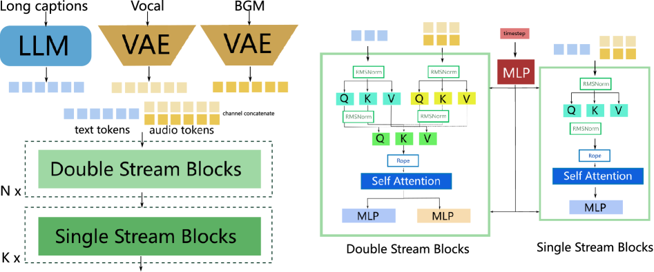
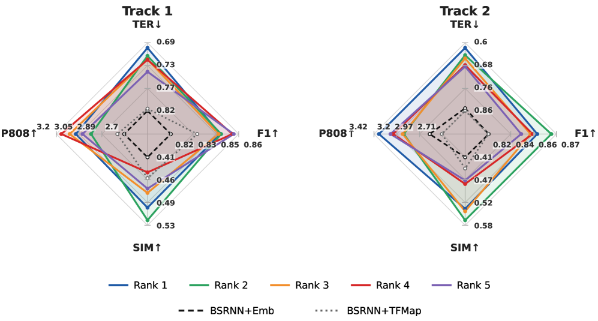
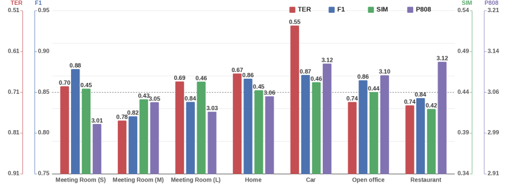
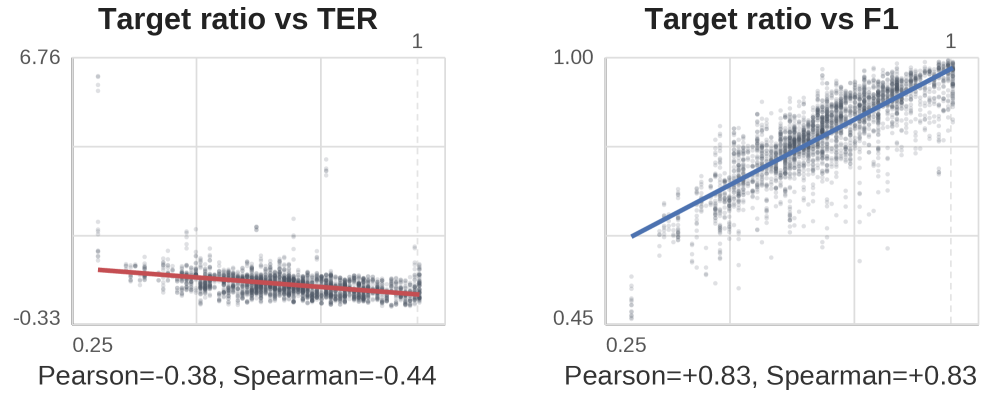
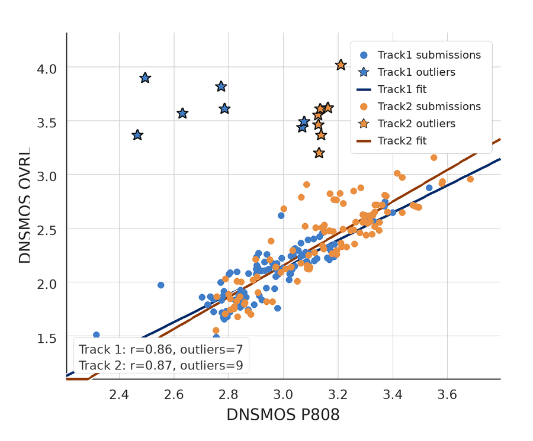
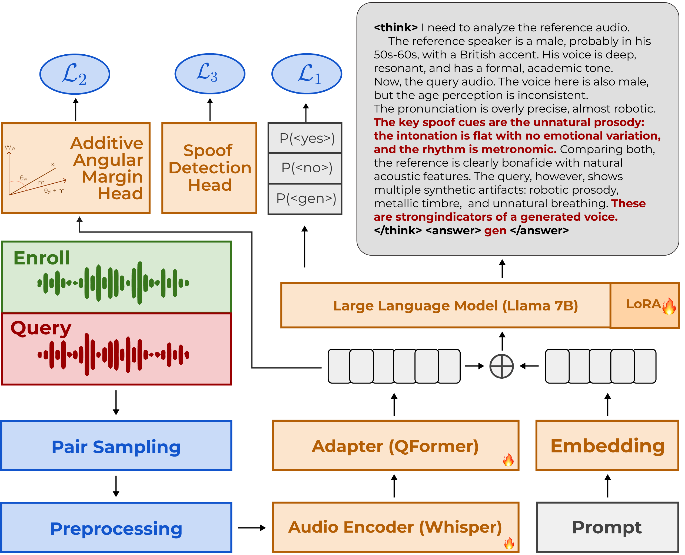

# 🚩 (2026-07-18) Scholar Inbox 추천 논문 

# 📚 WanSong v1.0 Technical Report

🚀 URL: https://arxiv.org/html/2607.14749

## 🌏 Abstract (원문)
Music generation foundation models have recently attracted significant industry attention. However, achieving efficient generation and high-fidelity long-form audio while supporting controllability remains challenging. To address these needs, we presentWanSong, a simple yet powerful approach for long-form, commercial-grade song generation. Unlike autoregressive (AR) and cascaded multi-stage pipelines (e.g., AR followed by diffusion),WanSongis a pure diffusion-based model that directly generates high-fidelity, multilingual songs up to 5 minutes and outputs dual stems (vocals and background music) in a single run. In addition, our diffusion framework enables faster inference through step-distillation, and offers an efficient pathway for fine-tuning and customization to support downstream editing tasks.
## 🌏 Abstract (번역)
음악 생성 파운데이션 모델은 최근 상당한 산업적 관심을 끌고 있습니다. 그러나 제어 가능성을 지원하면서 효율적인 생성과 고음질의 장시간 오디오를 달성하는 것은 여전히 어렵습니다. 이러한 요구 사항을 해결하기 위해 우리는 장시간의 상업용 수준의 노래 생성을 위한 간단하면서도 강력한 접근 방식인 WanSong을 제시합니다. 자기회귀(AR) 및 계단식 다단계 파이프라인(예: AR 후 확산)과 달리, WanSong은 단일 실행으로 최대 5분 길이의 고음질 다국어 노래를 직접 생성하고 듀얼 스템(보컬 및 배경 음악)을 출력하는 순수 확산 기반 모델입니다. 또한, 우리의 확산 프레임워크는 스텝 증류(step-distillation)를 통해 더 빠른 추론을 가능하게 하며, 후속 편집 작업을 지원하기 위한 미세 조정 및 사용자 정의를 위한 효율적인 경로를 제공합니다.

## 🔍 Methods & Results
- 스테레오 오디오 신호를 압축하여 시간-주파수 세부 정보를 보존하는 연속 1D VAE(Variational Autoencoder)를 사용하며, Stable Audio 2 대비 압축률을 절반으로 줄여 고음질 및 소스 분리에 유리하게 설계되었습니다.
- 텍스트 토큰과 듀얼 스템 오디오 토큰을 결합하여 트랜스포머 기반 확산 백본에 입력하며, MMDit 및 Flux에서 영감을 받은 하이브리드 트랜스포머 아키텍처를 채택하고 AdaLN을 사용하여 파라미터 효율성을 높였습니다.
- 보컬과 배경 음악(BGM)을 독립적으로 출력하면서도 블록 학습 시 동일 토큰의 다른 채널로 처리하여 상호 의존성을 학습하는 '레이어 내 공동 학습' 전략을 통해 CFG(Classifier-Free Guidance) 사용 시 보컬 정확도와 BGM 복원 간의 균형 문제를 해결합니다.
- 90초, 300초 길이 훈련 및 SFT(Supervised Fine-Tuning)를 포함한 3단계 사전 훈련을 통해 장시간 노래의 미세한 디테일을 학습하며, 오디오 도메인 내에서 노이즈 제거 확산 프로세스를 모델링하기 위해 플로우 매칭 프레임워크를 사용합니다.
- 음악성, 가사 정확도, 프롬프트 정렬의 세 가지 핵심 차원에서 인간 선호도에 모델을 정렬하기 위해 인간 피드백 기반 강화 학습(RLHF)을 적용합니다.
- 보상 모델을 훈련한 후, 오디오의 전역 구조 최적화를 위해 DPO(Diffusion Policy Optimization)를 먼저 적용하고, 이어서 미세한 디테일 최적화를 위해 ReFL(Reward-conditioned Flow Learning)을 적용하는 보완적인 전략을 사용합니다.

## 🖼 Figures

*Figure 1:Data pipeline overview.*

*Figure 2:Our hybrid-transformer backbone.*

---
**Usage Info**: 4584 tokens used.
**Generated at**: 2026-07-18 14:48:31

---

# 📚 Dialogs: a studio-quality expressive conversational Russian speech corpus for dialog assistants

🚀 URL: https://arxiv.org/html/2607.14310

## 🌏 Abstract (원문)
We introduce Dialogs, a studio-quality Russian conversational speech corpus for dialog assistants. The dataset contains 20.6 hours of face-to-face acted dialogs recorded in a professional studio (44.1 kHz stereo) and segmented into 11,796 utterances across 3 speakers. Unlike read-speech resources, Dialogs captures turn-taking rhythm and expressive prosody, and provides per-utterance style/emotion labels spanning 12 categories. We validate corpus quality with crowd MOS tests, showing comparable audio quality and intelligibility to strong Russian studio baselines while achieving higher ratings for expressiveness and conversational naturalness. Finally, we train a VITS2 model as a proof of concept, demonstrating that Dialogs supports training expressive, dialog-like TTS despite limited per-speaker data.
## 🌏 Abstract (번역)
저희는 대화형 어시스턴트를 위한 스튜디오 품질의 러시아어 대화 음성 코퍼스인 Dialogs를 소개합니다. 이 데이터셋은 전문 스튜디오에서 녹음된 20.6시간 분량의 대면 연기 대화(44.1 kHz 스테레오)를 포함하며, 3명의 화자에 걸쳐 11,796개의 발화로 분할됩니다. 읽기 음성 자료와 달리, Dialogs는 턴-테이킹 리듬과 표현적인 운율을 포착하며, 12가지 범주에 걸친 발화별 스타일/감정 레이블을 제공합니다. 우리는 크라우드 MOS 테스트를 통해 코퍼스 품질을 검증했으며, 강력한 러시아어 스튜디오 기준선과 유사한 오디오 품질 및 명료도를 보이면서도 표현력과 대화의 자연스러움에서 더 높은 평가를 받았습니다. 마지막으로, 개념 증명으로 VITS2 모델을 훈련하여, Dialogs가 화자별 데이터가 제한적임에도 불구하고 표현력이 풍부하고 대화와 유사한 TTS 훈련을 지원함을 입증했습니다.

## 🔍 Methods & Results
- Dialogs 데이터셋은 전문 스튜디오에서 녹음된 20.6시간 분량의 러시아어 대화형 음성 코퍼스로, 3명의 화자로부터 11,796개의 발화로 구성됩니다.
- 이 데이터셋은 12가지 범주의 발화별 스타일/감정 레이블을 제공하며, 읽기 음성 자료와 달리 대화의 턴-테이킹 리듬과 표현적인 운율을 포착합니다.
- 크라우드 MOS 테스트를 통해 코퍼스의 품질을 검증한 결과, 기존 러시아어 스튜디오 기반 데이터셋과 유사한 오디오 품질 및 명료도를 보였으며, 표현력과 대화의 자연스러움에서 더 높은 평가를 받았습니다.
- 개념 증명으로 VITS2 모델을 훈련하여, 제한된 화자별 데이터에도 불구하고 Dialogs가 표현력이 풍부하고 대화와 유사한 TTS 훈련을 지원함을 입증했습니다.

## 🖼 Figures

*Figure 1:Audio recording duration distribution density.*

---
**Usage Info**: 1528 tokens used.
**Generated at**: 2026-07-18 14:48:37

---

# 📚 RW-Voice-EQ Bench: A Real World Benchmark for Evaluating Voice AI Systems

🚀 URL: https://arxiv.org/html/2607.14846

## 🌏 Abstract (원문)
Current voice AI benchmarks typically evaluate isolated capabilities such as speech intelligibility, word error rate, or text-based dialogue quality, but they rarely test whether systems harness the acoustic information that distinguishes spoken language from its textual representation. To this end, we introduce the Real World Voice EQ Bench222huggingface.co/spaces/HumeAI/rw-voice-eq, a multidimensional benchmark for evaluating voice AI across text-to-speech (TTS), speech-to-speech (STS), speech understanding (SU), and automatic speech recognition (ASR). Our evaluations indicate that performance is highly dimension-specific. For TTS, naturalness, expressiveness, identity stability, and reliability are largely independent evaluation dimensions. For STS, access to audio does not guarantee use of vocal affect, and some agents remain largely transcript-driven. For SU, models perform unevenly across paralinguistic tasks. For ASR, real world accent, emotion, noise, and conversational conditions expose failures that are not captured by established clean-speech benchmarks. Together, these results show that voice AI should be evaluated as a profile of acoustic, expressive, interactional, and robustness capabilities rather than by a single aggregate score.
## 🌏 Abstract (번역)
현재 음성 AI 벤치마크는 일반적으로 음성 명료도, 단어 오류율 또는 텍스트 기반 대화 품질과 같은 개별적인 기능들을 평가하지만, 시스템이 음성 언어를 텍스트 표현과 구별하는 음향 정보를 활용하는지 여부는 거의 테스트하지 않습니다. 이를 위해 우리는 텍스트-음성 변환(TTS), 음성-음성 변환(STS), 음성 이해(SU) 및 자동 음성 인식(ASR) 전반에 걸쳐 음성 AI를 평가하기 위한 다차원 벤치마크인 Real World Voice EQ Bench222huggingface.co/spaces/HumeAI/rw-voice-eq를 소개합니다. 우리의 평가는 성능이 차원별로 매우 특이하다는 것을 나타냅니다. TTS의 경우, 자연스러움, 표현력, 정체성 안정성 및 신뢰성은 대체로 독립적인 평가 차원입니다. STS의 경우, 오디오 접근이 음성적 감정의 사용을 보장하지 않으며, 일부 에이전트는 여전히 주로 스크립트 기반으로 작동합니다. SU의 경우, 모델은 주변 언어적 작업에서 고르지 않게 수행됩니다. ASR의 경우, 실제 세계의 억양, 감정, 소음 및 대화 조건은 기존의 깨끗한 음성 벤치마크로는 포착되지 않는 실패를 드러냅니다. 종합적으로, 이러한 결과는 음성 AI가 단일 집계 점수보다는 음향적, 표현적, 상호작용적 및 견고성 능력의 프로필로 평가되어야 함을 보여줍니다.

## 🔍 Methods & Results
- Real World Voice EQ Bench는 TTS, STS, SU, ASR 전반에 걸쳐 음성 AI를 평가하는 다차원 벤치마크로 도입되었습니다.
- 평가 결과, 음성 AI의 성능은 차원별로 매우 특이하게 나타났습니다.
- TTS의 경우, 자연스러움, 표현력, 정체성 안정성, 신뢰성은 대체로 독립적인 평가 차원임이 확인되었습니다.
- STS의 경우, 오디오 접근이 음성적 감정의 사용을 보장하지 않으며, 일부 에이전트는 여전히 주로 스크립트 기반으로 작동하는 경향을 보였습니다.
- SU의 경우, 모델들은 주변 언어적(paralinguistic) 작업에서 고르지 않은 성능을 보였습니다.
- ASR의 경우, 실제 세계의 억양, 감정, 소음 및 대화 조건은 기존의 깨끗한 음성 벤치마크로는 포착되지 않는 실패 사례들을 드러냈습니다.
- 결론적으로, 음성 AI는 단일 집계 점수가 아닌 음향적, 표현적, 상호작용적, 견고성 능력의 프로필로 평가되어야 함을 시사합니다.

## 🖼 Figures

*Figure 1:Overview of the RW-Voice-EQ benchmark. RW-Voice-EQ evaluates voice AI along four domains: (1) Text-to-Speech (TTS), (2) Speech-to-Speech (STS), (3) Speech Understanding (SU), (4) ASR Robustness. Together the four domains characterize a voice system as a capability profile rather than a single aggregate score.*

*Figure 2:The RW-Voice-EQ evaluation methodology. Human evaluation (TTS, STS) generates audio per model-item, presents it to multiple raters against a task-specific rubric, and aggregates into per-evaluation scores. Label-based scoring (SU, ASR) compares model predictions against ground-truth labels, pairwise targets, or reference transcripts using accuracy or word error rate. The two paradigms respectively cover perceptual/interactional constructs and objective target-based tasks.*

*Figure 3:Human–SLM agreement across TTS dimension groups. For each SLM judge and dimension group, agreement is reported as the mean Spearman rank correlation (
𝜌
) between SLM judge scores and human ratings across the constituent evaluations. The three highest-scoring judges within each dimension group are shown. Higher values indicate closer agreement with human system rankings.*

![Figure 4:Cross-model audit on VoxPopuli-English. WER (%) from the June 2026 Open ASR Leaderboard [26]. Bad-reference acceptance: the rate at which each model returned reference transcripts verbatim on cases where the reference was identified as requiring a correction](../images/2026-07-18/2607.14846/2607.14846_fig3.png)
*Figure 4:Cross-model audit on VoxPopuli-English. WER (%) from the June 2026 Open ASR Leaderboard [26]. Bad-reference acceptance: the rate at which each model returned reference transcripts verbatim on cases where the reference was identified as requiring a correction*

*Figure 5:Top-five TTS system configurations by capability group. Cells report the capability-level mean 
±
 standard deviation. Shading indicates within-capability rank, with darker cells denoting higher rank. Systems are ordered by the number of top-five appearances; the horizontal rule separates systems appearing in multiple top-five lists from those appearing in only one.*

![Figure 6:Top-performing speech-to-speech systems by evaluation dimension. Each column shows the five highest-scoring systems within an evaluation dimension, with cells reporting mean human rating ± standard deviation. Darker coral indicates a higher within-dimension rank (rank 1 darkest; rank 5 lightest), while blank cells indicate that the system did not place in the top five. Emotion Understanding maps to a single constituent evaluation, so no across-evaluation standard deviation is defined for that dimension. The horizontal line separates systems appearing in multiple top-five lists from those appearing in only one.](../images/2026-07-18/2607.14846/2607.14846_fig5.png)
*Figure 6:Top-performing speech-to-speech systems by evaluation dimension. Each column shows the five highest-scoring systems within an evaluation dimension, with cells reporting mean human rating ± standard deviation. Darker coral indicates a higher within-dimension rank (rank 1 darkest; rank 5 lightest), while blank cells indicate that the system did not place in the top five. Emotion Understanding maps to a single constituent evaluation, so no across-evaluation standard deviation is defined for that dimension. The horizontal line separates systems appearing in multiple top-five lists from those appearing in only one.*

*Figure 7:Top-performing speech-understanding systems across three evaluation dimensions. Panels show the five highest-scoring systems for speech-emotion recognition (chance-adjusted skill), speaker verification (accuracy), and synthetic-speech detection (threshold-derived accuracy). Colors distinguish general speech-language models from dedicated speaker-verification models.*

*Figure 8:Performance of the top 10 ASR systems by average word error rate (WER) across four human-curated evaluation datasets. Colors distinguish proprietary and open-source models.*

---
**Usage Info**: 1561 tokens used.
**Generated at**: 2026-07-18 14:48:44

---

# 📚 SLT 2026 REAL-TSE Challenge: Real-world Target Speaker Extraction from Conversational Recordings

🚀 URL: https://arxiv.org/html/2607.15198

## 🌏 Abstract (원문)
We introduce theREAL-TSE Challenge111https://real-tse.github.io/challenge/, an IEEE SLT 2026 satellite challenge on target speaker extraction (TSE) from real conversational recordings. Given a multi-speaker mixture and one or more enrollment utterances from a target speaker, participating systems must recover only the target speech. Unlike simulated read-speech benchmarks, REAL-TSE evaluates Mandarin and English recordings that contain natural overlap, reverberation, noise, channel mismatch, and conversational dynamics. The challenge defines two complementary tracks: anOnlinetrack for low-latency streaming extraction and anOfflinetrack for full-context processing. Systems are evaluated with Token Error Rate (TER), Speaker Similarity (SpkSim), DNSMOS, and target-speaker activity F1. This overview paper describes the task definition, datasets, baselines, evaluation protocol, submitted systems, condition-wise findings, and lessons for future real-world TSE benchmarks.
## 🌏 Abstract (번역)
저희는 실제 대화 녹음에서 목표 화자 추출(TSE)을 위한 IEEE SLT 2026 위성 챌린지인 REAL-TSE 챌린지(https://real-tse.github.io/challenge/)를 소개합니다. 다중 화자 혼합음과 목표 화자의 하나 이상의 등록 발화가 주어졌을 때, 참여 시스템은 목표 화자의 음성만을 복구해야 합니다. 시뮬레이션된 낭독 음성 벤치마크와 달리, REAL-TSE는 자연스러운 중첩, 잔향, 노이즈, 채널 불일치 및 대화 역학을 포함하는 만다린어 및 영어 녹음을 평가합니다. 이 챌린지는 두 가지 보완적인 트랙을 정의합니다: 낮은 지연 시간 스트리밍 추출을 위한 온라인 트랙과 전체 컨텍스트 처리를 위한 오프라인 트랙입니다. 시스템은 토큰 오류율(TER), 화자 유사도(SpkSim), DNSMOS 및 목표 화자 활동 F1으로 평가됩니다. 이 개요 논문은 작업 정의, 데이터셋, 기준선, 평가 프로토콜, 제출된 시스템, 조건별 발견 사항 및 향후 실제 TSE 벤치마크를 위한 교훈을 설명합니다.

## 🔍 Methods & Results
- REAL-TSE 챌린지는 실제 대화 녹음에서 목표 화자 추출(TSE)을 위한 IEEE SLT 2026 위성 챌린지로, 온라인(저지연 스트리밍) 및 오프라인(전체 컨텍스트 처리) 두 가지 트랙으로 구성됩니다.
- 평가는 TER, SpkSim, DNSMOS, 목표 화자 활동 F1을 포함한 다중 지표를 사용하며, 이는 실제 TSE의 다중 목표적 특성을 반영합니다.
- 네 가지 BSRNN 기반 기준선이 WeSep으로 구현되었으며, Libri2Mix-100에서 훈련되었고, ECAPA-TDNN 기반 고정 화자 임베딩(BSRNN_EMB)과 스펙트럼 TF-Map 특징 및 문맥 임베딩(BSRNN_TFMAP)을 비교했습니다.
- 기준선은 합성 영어 전용 데이터로만 훈련되었기 때문에 최적화된 시스템이라기보다는 하한 참조로 사용됩니다.
- 각 트랙에 12개 팀이 유효한 시스템을 제출했으며, 성능에 영향을 미치는 주요 설계 선택 사항은 실제 대화 데이터 활용(시뮬레이션 및 적응), 지연 시간 예산 내(또는 없이) 추출기 설계 및 조건화, 훈련 목표, 후처리 및 테스트 시간 동작과 자동 지표 간의 상호 작용이었습니다.
- 상위 시스템들은 대부분의 지표에서 기준선을 크게 능가했지만, 단일 시스템이 모든 평가 차원에서 균일하게 우수하지는 않았으며, 이는 실제 TSE의 다중 목표적 특성을 강조합니다.
- 대부분의 팀은 공개 음성 코퍼스에서 혼합음을 합성하고, 노이즈와 잔향을 추가했으며, 목표 화자가 없는 세그먼트를 주입하여 비목표 음성 억제 및 오탐 방지를 훈련했습니다.
- 가장 중요한 경향은 가이드 소스 분리, 오프라인 교사 모델, 모델 평균화 또는 자기 훈련을 통해 의사 레이블을 생성하여 실제 대화 데이터에 적응하는 것이었으며, 이는 합성 데이터만으로 훈련하는 것보다 일관되게 우수한 성능을 보였습니다.
- 온라인 트랙(Track 1) 시스템은 주로 컴팩트하고 인과적인 판별 추출기(BSRNN 및 TF-GridNet 변형)였으며, 인과적 정규화, 단방향 재귀 및 제어된 예측을 사용했습니다.
- 오프라인 트랙(Track 2)은 SSL 기반 어트랙터 초기화, 화자 분리 인식 프런트 엔드, 확산, 플로우 매칭 또는 보코더 재구성을 기반으로 한 생성적 개선 등 더 넓은 범위의 접근 방식을 탐색했습니다.
- 제출된 시스템들은 BSRNN 스타일의 백본을 기반으로 했음에도 불구하고, 현실적인 데이터 시뮬레이션, 실제 데이터 적응, 의사 레이블 생성 및 필터링, 손실 설계, 지표 인식 훈련 및 후처리를 통해 기준선보다 훨씬 더 나은 점수를 달성하여 상당한 개선 여지가 있음을 시사했습니다.
- 재구성 손실(SI-SDR/SI-SNR, 다중 해상도 STFT)은 화자 유사성, DNSMOS 관련, ASR/토큰 수준, VAD/활동 손실과 같은 공식 지표에 맞춰 보조 항과 결합되어 다중 목표 최적화로의 전환을 보여주었습니다.
- 후처리(강화 또는 보코더 기반 재구성 모듈)는 DNSMOS를 개선할 수 있었지만 SpkSim을 감소시키거나 목표 활동을 변경할 수 있어 트레이드오프 관계에 있었습니다.
- 지표 인식 행동은 평가 자체의 근본적인 약점을 드러냈는데, 신경망 지표 최적화가 인지된 품질을 개선하지 않고도 점수를 높이는 아티팩트를 생성할 수 있었으며, 일부 팀은 적대적 파형 교란을 사용하여 SpkSim 및 DNSMOS를 부풀리는 사례도 있었습니다.
- 향후 챌린지에서는 개발 중 최종 평가에서 비침습적 지표 사용을 금지하는 더 엄격한 규칙이 필요하며, 온라인 TSE 벤치마크는 분석적 지연 시간의 투명한 분석과 표준화된 측정 절차를 요구해야 합니다.

## 🖼 Figures

*Figure 1:Metric balance of the top-5 valid systems in each track.*

*Figure 2:Scenario-wise performance on the EVAL-2 set, computed by averaging all valid submissions separately for CN and EN and then taking a CN/EN macro average over shared scenarios.*

*Figure 3:Enrollment-device by mixture-device performance matrix on EVAL-2.*

*Figure 4:Relationship between target ratio and F1/TER on EVAL-2.*

*Figure 5:Relationship between DNSMOS OVRL and DNSMOS P808 on participant submissions. The high-OVRL outliers do not show corresponding gains in P808, indicating metric-specific over-optimization rather than a consistent improvement in perceptual quality.*

---
**Usage Info**: 4035 tokens used.
**Generated at**: 2026-07-18 14:48:56

---

# 📚 Large Audio Language Models for Spoofing-Aware Speaker Verification

🚀 URL: https://arxiv.org/html/2607.14753

## 🌏 Abstract (원문)
Recent advances in text-to-speech and voice cloning make high-quality spoofing inexpensive and scalable, threatening voice authentication systems, especially automatic speaker verification (ASV). Existing defenses mainly address this threat through binary countermeasures (CMs) for deepfake detection or spoofing-aware speaker verification (SASV), where current systems are dominated by modular ASV-CM fusion and cascaded pipelines. Although large audio language models (LALMs) have shown promise on related audio tasks, including CM and ASV, their use for SASV remains unexplored, despite their capacity to produce natural-language rationales for auditing and robustness beyond discriminative predictions. This work systematically evaluates LALMs for SASV against conventional pipelines under zero-shot prompting, supervised adaptation, reasoning-oriented training, and reinforcement-learning-based optimization. Our results show that pretrained LALMs are near chance in the zero-shot setting, confirming that they are not natively suited to SASV, but that task-specific adaptation closes this gap. We further find that competitive SASV performance can be achieved through several distinct routes. These findings position LALMs as a promising and auditable foundation for unified SASV, while clarifying where conventional cascade systems still lead.
## 🌏 Abstract (번역)
최근 텍스트 음성 변환 및 음성 복제 기술의 발전으로 고품질 스푸핑이 저렴하고 확장 가능해지면서 음성 인증 시스템, 특히 자동 화자 확인(ASV)을 위협하고 있습니다. 기존 방어 체계는 주로 딥페이크 탐지를 위한 이진 대책(CM) 또는 스푸핑 인식 화자 확인(SASV)을 통해 이러한 위협에 대응하며, 현재 시스템은 모듈형 ASV-CM 융합 및 계단식 파이프라인이 주를 이룹니다. 대규모 오디오 언어 모델(LALM)은 CM 및 ASV를 포함한 관련 오디오 작업에서 가능성을 보여주었지만, 판별적 예측을 넘어 감사 및 견고성을 위한 자연어 추론을 생성하는 능력에도 불구하고 SASV에 대한 활용은 아직 탐구되지 않았습니다. 본 연구는 제로샷 프롬프팅, 지도 학습 적응, 추론 지향 훈련 및 강화 학습 기반 최적화 하에서 기존 파이프라인과 비교하여 SASV를 위한 LALM을 체계적으로 평가합니다. 우리의 결과는 사전 훈련된 LALM이 제로샷 설정에서 우연에 가까운 성능을 보여 SASV에 본질적으로 적합하지 않음을 확인했지만, 작업별 적응을 통해 이 격차를 해소할 수 있음을 보여줍니다. 또한 경쟁력 있는 SASV 성능이 여러 가지 다른 경로를 통해 달성될 수 있음을 발견했습니다. 이러한 결과는 LALM을 통합 SASV를 위한 유망하고 감사 가능한 기반으로 자리매김하는 동시에 기존 계단식 시스템이 여전히 우위를 점하는 부분을 명확히 합니다.

## 🔍 Methods & Results
- SASV를 등록 발화와 시험 발화에 대한 세 가지 결정(타겟, 비타겟, 스푸핑) 문제로 공식화하고, 화자 확인 및 스푸핑 대책 목표를 개별적으로 최적화하는 기존의 계단식 ASV-CM 파이프라인과 달리 단일 종단 간 모델을 훈련합니다.
- 사전 훈련된 LALM(SALMONN 및 Qwen-Audio)이 SASV에 적합한지 평가하며, LoRA(Low-Rank Adaptation) 매개변수 효율적 미세 조정을 사용하여 모델의 일반적인 음향 지식을 방해하지 않으면서 SASV 공식에 맞게 조정합니다.
- SASV의 동시 최적화를 위해 세 가지 손실 항(SASV 결정에 대한 3클래스 교차 엔트로피 L1, 화자 분리 가능성을 향상시키는 AAM(Additive Angular Margin) 손실 L2, 스푸핑 민감도를 높이는 이진 교차 엔트로피 L3)으로 구성된 복합 목적 함수를 사용합니다.
- 견고성을 향상시키기 위해 훈련 과정에서 가장 유익한 샘플 쌍(하드-예, 하드-아니오, 하드-스푸핑 쌍)에 샘플러를 집중시키는 하드 샘플 마이닝 기법을 적용합니다.
- 모델이 결정뿐만 아니라 텍스트 추론을 제공하도록 지도하는 추론 지향 훈련을 도입하며, CoLMbo, emotion2vec, Parselmouth와 같은 기존 특징을 사용하여 추론 흔적을 자동으로 구성하고 접지합니다.
- CoT(Chain-of-Thought) 품질 및 다양성을 개선하기 위해 그룹 상대 정책 최적화(GRPO)를 적용하며, 보상은 답변 정확성과 필요한 <think>, <reasons>, <answer> 형식 준수를 장려합니다.
- 사전 훈련된 LALM은 제로샷 설정에서 우연에 가까운 성능을 보였으나, 작업별 적응을 통해 이 격차를 해소하고 경쟁력 있는 SASV 성능을 달성할 수 있음을 확인했습니다.

## 🖼 Figures

*Figure 1:Prompt variants for LALM-based SASV. Top: direct decision over concatenated audio. Middle: multi-audio prompting with separate enrollment/trial tokens. Bottom: reasoning-augmented prompt.*

*Figure 2:Overview of the proposed SALMONN-based SASV model.*

---
**Usage Info**: 3781 tokens used.
**Generated at**: 2026-07-18 14:49:06

---

