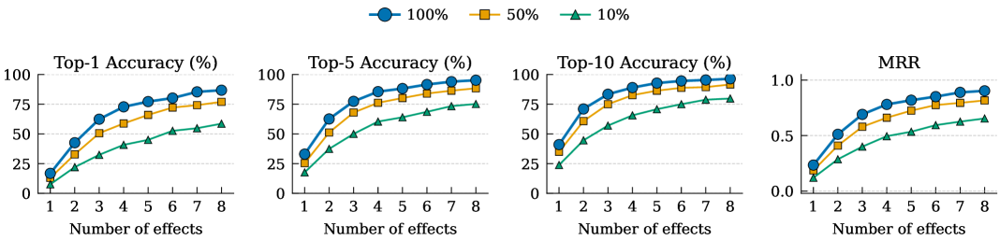

# 🚩 (2026-07-20) Scholar Inbox 추천 논문 

# 📚 StemFX: Learning Mixing Style Representations via Autoregressive FX Chain Prediction on Source-Separated Stems

🚀 URL: https://arxiv.org/html/2607.15634

## 🌏 Abstract (원문)
Audio mixing style encompasses the artistic and technical decisions a mix engineer makes, including level balancing, spatialization, and the choice, ordering, and parameterization of audio effects (FX) on each stem.FX chains are a key determinant of this style, yet existing approaches to modeling them remain limited. Some operate on stereo mixtures without explicit per-stem FX chain modeling, others fix the number or type of effects per track, and many require differentiable effect implementations or scarce multitrack datasets.We presentStemFX, a framework that learns mixing style representations by autoregressively predicting variable-length FX chains on source-separated stems.A Transformer decoder predicts tokenized FX chains autoregressively, while a band-split multi-band CNN encoder with FiLM conditioning captures per-stem spectral structure.To enable large-scale paired training, we extract pseudo-stems from about 105K songs via source separation and augment them using MultiAFx, a toolkit unifying 85 audio effects from 7 Python libraries.Evaluated on mixing style retrieval,StemFXoutperforms all baseline models across all tested chain lengths.On paired mixing style transfer,StemFXachieves the best spectral fidelity and the highest listener preference, over 4000 times faster than iterative optimization.
## 🌏 Abstract (번역)
오디오 믹싱 스타일은 믹스 엔지니어가 내리는 예술적이고 기술적인 결정들을 포함하며, 여기에는 레벨 밸런싱, 공간화, 그리고 각 스템에 대한 오디오 효과(FX)의 선택, 순서 지정 및 매개변수화가 포함됩니다. FX 체인은 이러한 스타일의 핵심 결정 요인이지만, 이를 모델링하는 기존 접근 방식은 여전히 제한적입니다. 일부는 명시적인 스템별 FX 체인 모델링 없이 스테레오 믹스에서 작동하고, 다른 일부는 트랙당 효과의 수나 유형을 고정하며, 많은 경우 미분 가능한 효과 구현이나 희귀한 멀티트랙 데이터셋을 필요로 합니다. 우리는 소스 분리된 스템에 대해 가변 길이 FX 체인을 자동 회귀적으로 예측하여 믹싱 스타일 표현을 학습하는 프레임워크인 StemFX를 제시합니다. 트랜스포머 디코더는 토큰화된 FX 체인을 자동 회귀적으로 예측하며, FiLM 컨디셔닝을 갖춘 밴드 분할 다중 밴드 CNN 인코더는 스템별 스펙트럼 구조를 포착합니다. 대규모 쌍 학습을 가능하게 하기 위해, 우리는 약 10만 5천 곡의 노래에서 소스 분리를 통해 의사 스템을 추출하고, 7개의 Python 라이브러리에서 85개의 오디오 효과를 통합하는 툴킷인 MultiAFx를 사용하여 이를 증강합니다. 믹싱 스타일 검색에서 평가했을 때, StemFX는 테스트된 모든 체인 길이에서 모든 기준 모델을 능가합니다. 쌍으로 된 믹싱 스타일 전송에서 StemFX는 반복 최적화보다 4000배 이상 빠르게 최고의 스펙트럼 충실도와 가장 높은 청취자 선호도를 달성합니다.

## 🔍 Methods & Results
- StemFX는 BSFiLM 인코더와 트랜스포머 기반 FX 체인 생성기를 엔드투엔드로 공동 훈련하는 프레임워크로, 믹싱 스타일 차이를 요약하는 컨디셔닝 벡터를 생성하고 적용된 토큰화된 FX 체인을 자동 회귀적으로 예측합니다.
- 이 프레임워크는 4개의 소스 분리된 스테레오 스템(보컬, 베이스, 드럼, 기타)에 대해 원본 오디오(x_orig)와 알려진 FX 체인으로 증강된 타겟 오디오(x_aug)가 주어졌을 때, x_orig를 x_aug와 일치시키기 위해 스템별 FX 체인(F)을 예측하는 것을 목표로 합니다.
- BSFiLM 인코더는 8채널 입력을 512차원 믹싱 스타일 임베딩으로 매핑하며, 밴드 분할 다중 밴드 CNN 디자인을 사용하고, 64개의 수작업 믹싱 특징(다이내믹스, 스펙트럼, 스테레오, 스템 간 디스크립터)을 FiLM 컨디셔닝으로 각 CNN 레이어에 주입합니다.
- FX 체인은 가변 길이의 스템별 효과-매개변수 쌍의 순서 목록으로, 자동 회귀 예측을 위해 단일 토큰 시퀀스(y)로 직렬화됩니다. 총 358개의 토큰(특수, 스템, 85개 효과 이름, 164개 매개변수 이름, 101개 양자화된 값)으로 구성된 어휘를 사용하며, 매개변수 값은 선형 또는 로그 스케일로 정규화 후 양자화됩니다.
- 트랜스포머 디코더는 6개 레이어로 구성되며, 인코더에서 생성된 원본 및 증강 오디오 임베딩(e_orig, e_aug)을 컨디셔닝 벡터(m1, m2)로 사용하여 교차 어텐션을 통해 믹싱 스타일 정보를 쿼리하고, 교차 엔트로피 손실을 최소화하며 토큰 시퀀스를 예측합니다.
- 모델은 AdamW 옵티마이저, 3e-4 학습률, 64 배치 크기로 60 에포크 동안 훈련되었으며, BSFiLM 인코더는 1.79M, 트랜스포머 디코더는 26.2M 파라미터로 총 28.0M 파라미터를 가집니다.
- 훈련 데이터는 Sep-Aug Pipeline을 통해 생성됩니다. 약 10만 5천 곡의 노래에서 소스 분리를 통해 의사 스템을 추출하고, '크로스-송 스템 믹싱'으로 음악적 내용과 믹싱 특성을 분리한 후, MultiAFx 툴킷을 사용하여 각 스템에 무작위 효과를 증강하여 쌍으로 된 훈련 데이터를 대규모로 생성합니다.
- MultiAFx는 7개의 Python 라이브러리에서 85개의 오디오 효과를 12개의 매크로 카테고리로 통합하는 Python 라이브러리 래퍼로, 체인 생성, 매개변수 범위 정의, 오류 허용 배치 처리를 지원합니다.
- 평가 결과, StemFX는 믹싱 스타일 검색에서 모든 기준 모델을 능가했으며, 쌍으로 된 믹싱 스타일 전송에서는 최고의 스펙트럼 충실도와 가장 높은 청취자 선호도를 달성했고, 반복 최적화 방식보다 4000배 이상 빠른 속도를 보였습니다.

## 🖼 Figures

*Figure 2:Mixing style retrieval vs. number of applied effects: Top-1, Top-5, Top-10 accuracy (%) and Mean Reciprocal Rank (MRR). StemFX outperforms all baselines across all chain lengths and metrics, including BSFiLM-CL (same architecture and data, contrastive training). Numbers in parentheses denote the number of effects each model was trained with.*

*Figure 3:Ablation study: retrieval performance vs. number of applied effects for each model variant. StemFX (full) is the proposed model; each variant removes one component.*

*Figure 4:Dataset scale analysis: retrieval vs. number of applied effects at training set sizes of 10%, 50%, and 100% of 105K songs. The Sep-Aug Pipeline enables training at a scale orders of magnitude beyond existing paired datasets.*

---
**Usage Info**: 5215 tokens used.
**Generated at**: 2026-07-20 15:49:31

---

# 📚 AuEmoChat: Authentic Emotion Understanding and Rendering for Conversational Speech Synthesis

🚀 URL: https://arxiv.org/html/2607.15755

## 🌏 Abstract (원문)
Conversational Speech Synthesis (CSS) aims to synthesize speech with human-like emotional expression and contextual consistency in user-agent interactions. Existing CSS methods struggle to render authentic human emotions due to limited predefined emotion label spaces (e.g., seven emotion categories), while redundant multimodal tokens in multi-turn dialogue history interfere with context understanding. To address these issues, we proposeAuEmoChat, a CSS framework for authentic emotion understanding and rendering. First, we developAuEmoCodec, which learns a discrete authentic emotion token space from large-scale emotional speech via finite scalar quantization, enabling a more authentic emotion representation than limited basic emotion categories. Furthermore, we proposeAuEmoToMe, an authentic-emotion-guided token merging algorithm that merges redundant tokens in multimodal dialogue history while preserving emotion-relevant context. We integrate it into an autoregressive text-speech model to predict the target authentic emotion token and speech tokens. Finally, we proposeAuthentic Emotion Flow Matching, which renders speech by jointly conditioning on merged dialogue context, target authentic emotion, and acoustic priors. Extensive experiments on the NCSSD-EmCap dataset demonstrate that AuEmoChat outperforms state-of-the-art CSS baselines and generates more expressive and authentic emotional speech. The code and speech demos will be available at: https://github.com/anonymous-css/AuEmoChat.
## 🌏 Abstract (번역)
대화형 음성 합성(CSS)은 사용자-에이전트 상호작용에서 인간과 유사한 감정 표현과 맥락적 일관성을 가진 음성을 합성하는 것을 목표로 합니다. 기존 CSS 방법론은 제한된 사전 정의된 감정 레이블 공간(예: 7가지 감정 범주)으로 인해 실제 인간 감정을 표현하는 데 어려움을 겪으며, 다중 턴 대화 기록의 중복된 다중 모달 토큰은 맥락 이해를 방해합니다. 이러한 문제를 해결하기 위해 우리는 실제 감정 이해 및 표현을 위한 CSS 프레임워크인 AuEmoChat을 제안합니다. 첫째, 우리는 유한 스칼라 양자화(FSQ)를 통해 대규모 감정 음성으로부터 이산적인 실제 감정 토큰 공간을 학습하는 AuEmoCodec을 개발하여, 제한된 기본 감정 범주보다 더 실제적인 감정 표현을 가능하게 합니다. 또한, 우리는 다중 모달 대화 기록에서 중복된 토큰을 병합하면서 감정 관련 맥락을 보존하는 실제 감정 기반 토큰 병합 알고리즘인 AuEmoToMe를 제안합니다. 이를 자기회귀 텍스트-음성 모델에 통합하여 목표 실제 감정 토큰과 음성 토큰을 예측합니다. 마지막으로, 병합된 대화 맥락, 목표 실제 감정, 음향 사전 정보에 공동으로 조건화하여 음성을 렌더링하는 실제 감정 흐름 매칭(Authentic Emotion Flow Matching)을 제안합니다. NCSSD-EmCap 데이터셋에 대한 광범위한 실험은 AuEmoChat이 최첨단 CSS 기준선보다 우수하며 더 표현력이 풍부하고 실제적인 감정 음성을 생성함을 보여줍니다. 코드와 음성 데모는 https://github.com/anonymous-css/AuEmoChat에서 확인할 수 있습니다.

## 🔍 Methods & Results
- AuEmoChat은 다중 모달 대화 토큰화, AuEmoToMe 기반 실제 감정 이해, 병합된 맥락 인식 실제 감정 렌더링 모듈로 구성된 전체 아키텍처를 가집니다.
- 입력 대화에서 텍스트(BPE 기반), 화자, 음성(CosyVoice2), AuEmo 토큰을 추출하며, AuEmo 토큰은 AuEmoCodec을 통해 FSQ 방식으로 학습된 1000개 크기의 감정 코드북에서 파생됩니다.
- AuEmoToMe(Authentic Emotion-driven Token Merging)는 다중 턴 대화 기록에서 중복된 텍스트 및 음성 토큰을 병합하여 긴 입력 시퀀스 문제를 해결합니다. 각 발화의 AuEmo 토큰을 감정 앵커로 사용하여 감정 관련 맥락을 보존하면서 토큰을 가중치 기반으로 병합합니다.
- 타겟 AuEmo 토큰과 음성 토큰 추론은 병합된 기록 토큰과 타겟 발화 토큰 시퀀스를 연결하여 자기회귀 방식으로 먼저 타겟 AuEmo 토큰을 예측한 다음, 예측된 감정 토큰에 조건화하여 음성 토큰 시퀀스를 생성합니다.
- Authentic Emotion Flow Matching은 병합된 대화 맥락, 타겟 AuEmo 토큰, 음향 사전 정보에 공동으로 조건화하여 실제 감정 음성을 생성합니다. Merged Context Encoder와 AuEmo Encoder를 사용하여 각각 맥락 및 감정 조건을 얻습니다.
- Flow Matching 과정에서 AuEmo 분류기 가이던스 메커니즘을 도입하여 중간 멜 상태가 타겟 실제 감정과 일치하도록 명시적으로 유도하며, 이는 중간 상태가 구조화되는 t > r 시점에 활성화됩니다.
- AuEmoCodec은 대규모 감정 음성 데이터에서 FSQ를 통해 이산적인 AuEmo 토큰을 학습하며, 7가지 기본 감정 축에 대한 인지 점수(Gemini-2.5-Flash로 주석 처리)를 재구성 목표로 사용하여 MSE를 최소화함으로써 감정적 뉘앙스를 포착합니다.
- NCSSD-EmCap 데이터셋에 대한 실험 결과, AuEmoChat은 최첨단 CSS 기준선보다 우수한 성능을 보이며, 더 표현력이 풍부하고 실제적인 감정 음성을 생성합니다.

## 🖼 Figures

*Figure 1.Previous CSS models rely on a limited emotion label space and directly model redundant multimodal context tokens, resulting in limited emotional speech expression. In contrast, AuEmoChat introduces an authentic emotion token space and models the context based on merged tokens, thereby generating more authentic emotional speech.*

*Figure 2.The left side illustrates the overall framework of the proposed AuEmoChat, which includes: Multimodal Dialogue Tokenization, AuEmoToMe-based Authentic Emotion Understanding, and Merged Context-Aware Authentic Emotion Rendering. The right side illustrates the overall framework of the proposed AuEmoCodec.*

*Figure 3.Analysis results of different token merging rates on speech quality and emotion expressiveness.*

---
**Usage Info**: 4987 tokens used.
**Generated at**: 2026-07-20 15:49:40

---

