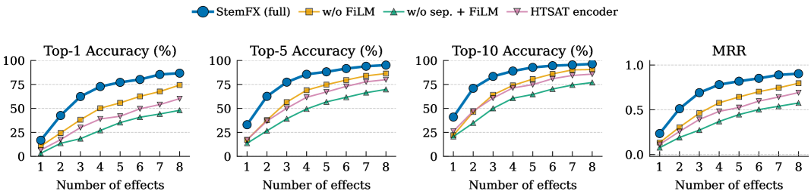
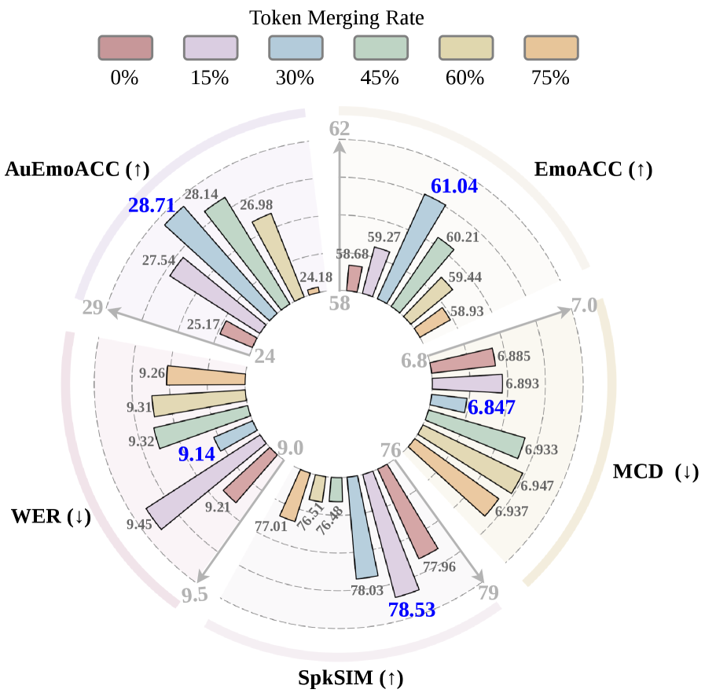

# 🚩 (2026-07-21) Scholar Inbox 추천 논문 

# 📚 StemFX: Learning Mixing Style Representations via Autoregressive FX Chain Prediction on Source-Separated Stems

🚀 URL: https://arxiv.org/html/2607.15634

## 🌏 Abstract (원문)
Audio mixing style encompasses the artistic and technical decisions a mix engineer makes, including level balancing, spatialization, and the choice, ordering, and parameterization of audio effects (FX) on each stem. FX chains are a key determinant of this style, yet existing approaches to modeling them remain limited. Some operate on stereo mixtures without explicit per-stem FX chain modeling, others fix the number or type of effects per track, and many require differentiable effect implementations or scarce multitrack datasets. We present StemFX, a framework that learns mixing style representations by autoregressively predicting variable-length FX chains on source-separated stems. A Transformer decoder predicts tokenized FX chains autoregressively, while a band-split multi-band CNN encoder with FiLM conditioning captures per-stem spectral structure. To enable large-scale paired training, we extract pseudo-stems from about 105K songs via source separation and augment them using MultiAFx, a toolkit unifying 85 audio effects from 7 Python libraries. Evaluated on mixing style retrieval, StemFX outperforms all baseline models across all tested chain lengths. On paired mixing style transfer, StemFX achieves the best spectral fidelity and the highest listener preference, over 4000 times faster than iterative optimization.
## 🌏 Abstract (번역)
오디오 믹싱 스타일은 믹스 엔지니어가 내리는 예술적, 기술적 결정을 포함하며, 여기에는 레벨 밸런싱, 공간화, 그리고 각 스템에 대한 오디오 효과(FX)의 선택, 순서 지정 및 매개변수화가 포함됩니다. FX 체인은 이러한 스타일의 핵심 결정 요인이지만, 이를 모델링하는 기존 접근 방식은 여전히 제한적입니다. 일부는 명시적인 스템별 FX 체인 모델링 없이 스테레오 믹스에서 작동하고, 다른 일부는 트랙당 효과의 수나 유형을 고정하며, 많은 경우 미분 가능한 효과 구현이나 희소한 멀티트랙 데이터셋을 필요로 합니다. 우리는 소스 분리된 스템에 대해 가변 길이 FX 체인을 자기회귀적으로 예측하여 믹싱 스타일 표현을 학습하는 프레임워크인 StemFX를 제시합니다. 트랜스포머 디코더는 토큰화된 FX 체인을 자기회귀적으로 예측하고, FiLM 컨디셔닝을 갖춘 밴드 분할 멀티밴드 CNN 인코더는 스템별 스펙트럼 구조를 포착합니다. 대규모 쌍 학습을 가능하게 하기 위해, 우리는 약 10만 5천 곡에서 소스 분리를 통해 의사 스템을 추출하고, 7개 파이썬 라이브러리의 85개 오디오 효과를 통합하는 툴킷인 MultiAFx를 사용하여 이를 증강합니다. 믹싱 스타일 검색에서 평가했을 때, StemFX는 테스트된 모든 체인 길이에서 모든 기준 모델을 능가합니다. 쌍으로 된 믹싱 스타일 전송에서 StemFX는 반복 최적화보다 4000배 이상 빠르게 최고의 스펙트럼 충실도와 가장 높은 청취자 선호도를 달성합니다.

## 🔍 Methods & Results
- StemFX는 소스 분리된 스템에 대해 가변 길이 FX 체인을 자기회귀적으로 예측하여 믹싱 스타일 표현을 학습하는 프레임워크이다.
- 이 프레임워크는 스템별 스펙트럼 구조를 포착하는 BSFiLM 인코더(밴드 분할 멀티밴드 CNN, FiLM 컨디셔닝 사용)와 토큰화된 FX 체인을 자기회귀적으로 예측하는 트랜스포머 디코더로 구성된다.
- 대규모 학습 데이터 생성을 위해 약 10만 5천 곡에서 소스 분리를 통해 의사 스템을 추출하고, MultiAFx 툴킷(7개 파이썬 라이브러리의 85개 오디오 효과 통합)을 사용하여 무작위 효과로 증강하는 Sep-Aug 파이프라인을 사용한다.
- FX 체인은 특수 토큰, 스템 토큰, 85개 효과 이름, 164개 매개변수 이름, 101개 양자화된 값 빈을 포함하는 358개의 토큰 어휘로 직렬화된다.
- 믹싱 스타일 검색 평가에서 StemFX는 모든 테스트된 체인 길이에서 모든 기준 모델을 능가했다.
- 쌍으로 된 믹싱 스타일 전송에서 StemFX는 최고의 스펙트럼 충실도와 가장 높은 청취자 선호도를 달성했으며, 반복 최적화보다 4000배 이상 빨랐다.

## 🖼 Figures

*Figure 2:Mixing style retrieval vs. number of applied effects: Top-1, Top-5, Top-10 accuracy (%) and Mean Reciprocal Rank (MRR). StemFX outperforms all baselines across all chain lengths and metrics, including BSFiLM-CL (same architecture and data, contrastive training). Numbers in parentheses denote the number of effects each model was trained with.*

*Figure 3:Ablation study: retrieval performance vs. number of applied effects for each model variant. StemFX (full) is the proposed model; each variant removes one component.*

*Figure 4:Dataset scale analysis: retrieval vs. number of applied effects at training set sizes of 10%, 50%, and 100% of 105K songs. The Sep-Aug Pipeline enables training at a scale orders of magnitude beyond existing paired datasets.*

---
**Usage Info**: 5350 tokens used.
**Generated at**: 2026-07-21 15:41:20

---

# 📚 AuEmoChat: Authentic Emotion Understanding and Rendering for Conversational Speech Synthesis

🚀 URL: https://arxiv.org/html/2607.15755

## 🌏 Abstract (원문)
Conversational Speech Synthesis (CSS) aims to synthesize speech with human-like emotional expression and contextual consistency in user-agent interactions. Existing CSS methods struggle to render authentic human emotions due to limited predefined emotion label spaces (e.g., seven emotion categories), while redundant multimodal tokens in multi-turn dialogue history interfere with context understanding. To address these issues, we proposeAuEmoChat, a CSS framework for authentic emotion understanding and rendering. First, we developAuEmoCodec, which learns a discrete authentic emotion token space from large-scale emotional speech via finite scalar quantization, enabling a more authentic emotion representation than limited basic emotion categories. Furthermore, we proposeAuEmoToMe, an authentic-emotion-guided token merging algorithm that merges redundant tokens in multimodal dialogue history while preserving emotion-relevant context. We integrate it into an autoregressive text-speech model to predict the target authentic emotion token and speech tokens. Finally, we proposeAuthentic Emotion Flow Matching, which renders speech by jointly conditioning on merged dialogue context, target authentic emotion, and acoustic priors. Extensive experiments on the NCSSD-EmCap dataset demonstrate that AuEmoChat outperforms state-of-the-art CSS baselines and generates more expressive and authentic emotional speech. The code and speech demos will be available at: https://github.com/anonymous-css/AuEmoChat.
## 🌏 Abstract (번역)
대화형 음성 합성(CSS)은 사용자-에이전트 상호작용에서 인간과 유사한 감정 표현과 맥락적 일관성을 가진 음성을 합성하는 것을 목표로 합니다. 기존 CSS 방법론은 제한된 사전 정의된 감정 레이블 공간(예: 7가지 감정 범주)으로 인해 실제 인간 감정을 표현하는 데 어려움을 겪으며, 다중 턴 대화 기록의 중복된 다중 모달 토큰은 맥락 이해를 방해합니다. 이러한 문제를 해결하기 위해 우리는 실제 감정 이해 및 렌더링을 위한 CSS 프레임워크인 AuEmoChat을 제안합니다. 첫째, 우리는 유한 스칼라 양자화를 통해 대규모 감정 음성으로부터 이산적인 실제 감정 토큰 공간을 학습하는 AuEmoCodec을 개발하여, 제한된 기본 감정 범주보다 더 실제적인 감정 표현을 가능하게 합니다. 또한, 우리는 다중 모달 대화 기록에서 중복된 토큰을 병합하면서 감정 관련 맥락을 보존하는 실제 감정 기반 토큰 병합 알고리즘인 AuEmoToMe를 제안합니다. 이를 자기회귀 텍스트-음성 모델에 통합하여 목표 실제 감정 토큰과 음성 토큰을 예측합니다. 마지막으로, 병합된 대화 맥락, 목표 실제 감정, 음향 사전 정보를 공동으로 조건화하여 음성을 렌더링하는 실제 감정 흐름 매칭(Authentic Emotion Flow Matching)을 제안합니다. NCSSD-EmCap 데이터셋에 대한 광범위한 실험은 AuEmoChat이 최첨단 CSS 기준선보다 우수하며, 더 표현력이 풍부하고 실제적인 감정 음성을 생성함을 입증합니다. 코드와 음성 데모는 https://github.com/anonymous-css/AuEmoChat에서 제공될 예정입니다.

## 🔍 Methods & Results
- AuEmoChat은 다중 모달 대화 토큰화, AuEmoToMe 기반 실제 감정 이해, 병합된 맥락 인식 실제 감정 렌더링 모듈로 구성됩니다.
- 다중 모달 토큰화는 BPE 기반 텍스트 토크나이저, 화자 임베딩, CosyVoice2의 음성 토크나이저, 그리고 AuEmoCodec으로 훈련된 AuEmo 토크나이저를 사용합니다.
- AuEmoCodec은 대규모 감정 음성 데이터에서 FSQ(유한 스칼라 양자화)를 통해 이산적인 AuEmo 토큰 공간을 학습하며, 1000개의 코드북 크기 중 750개의 활성화된 토큰을 사용합니다.
- AuEmoToMe 기반 실제 감정 이해 모듈은 다중 모달 대화 기록을 구성하고, AuEmoToMe 알고리즘을 사용하여 중복된 텍스트 및 음성 토큰을 병합합니다. 이때 AuEmo 토큰이 감정 앵커 역할을 하여 감정 관련 맥락을 보존합니다.
- AuEmoToMe는 ToMe(Bolya et al., 2022)를 기반으로 하며, 코사인 유사도를 사용하여 중복 토큰을 식별하고, AuEmo 토큰을 가이드로 사용하여 일치하는 텍스트 및 음성 토큰을 가중치 기반으로 집계합니다.
- 병합된 기록 표현을 기반으로 목표 발화의 AuEmo 토큰과 음성 토큰을 자기회귀 방식으로 추론합니다.
- 병합된 맥락 인식 실제 감정 렌더링 모듈은 병합된 대화 맥락, 목표 AuEmo 토큰, 음향 사전 정보를 공동으로 조건화하여 실제 감정 흐름 매칭(Authentic Emotion Flow Matching)을 통해 음성을 렌더링합니다.
- 병합된 맥락 인코더는 양방향 GRU를 사용하여 병합된 기록 토큰을 모델링하고, AuEmo 인코더는 예측된 AuEmo 토큰을 흐름 매칭 모델의 조건화 공간으로 투영합니다.
- 실제 감정 흐름 매칭은 예측된 목표 음성 토큰 시퀀스의 음향 사전 표현과 맥락 및 감정 조건을 Flow Matching 네트워크에 주입하여 멜 스펙트로그램을 생성합니다.
- AuEmo 분류기 가이드 메커니즘을 도입하여 중간 멜 상태가 목표 실제 감정을 보존하도록 명시적으로 제약하며, 이는 t > 0.7일 때 활성화됩니다.
- AuEmoCodec은 Speech Emotion Encoder와 FSQ-Down(levels=[8,5,5,5])을 사용하여 감정 표현을 추출하고, FSQ-Up을 통해 다중 축 인지 감정 점수(7가지 기본 감정 축)를 재구성하도록 훈련됩니다.
- Gemini-2.5-Flash를 사용하여 입력 음성의 각 감정 축에 대한 인지 점수를 주석 처리하여 AuEmoCodec 훈련의 감독 대상으로 사용하며, MSE 손실을 최소화합니다.
- NCSSD-EmCap 데이터셋에 대한 실험 결과, AuEmoChat은 최첨단 CSS 기준선보다 우수한 성능을 보이며, 더 표현력이 풍부하고 실제적인 감정 음성을 생성합니다.

## 🖼 Figures

*Figure 1.Previous CSS models rely on a limited emotion label space and directly model redundant multimodal context tokens, resulting in limited emotional speech expression. In contrast, AuEmoChat introduces an authentic emotion token space and models the context based on merged tokens, thereby generating more authentic emotional speech.*

*Figure 2.The left side illustrates the overall framework of the proposed AuEmoChat, which includes: Multimodal Dialogue Tokenization, AuEmoToMe-based Authentic Emotion Understanding, and Merged Context-Aware Authentic Emotion Rendering. The right side illustrates the overall framework of the proposed AuEmoCodec.*

*Figure 3.Analysis results of different token merging rates on speech quality and emotion expressiveness.*

---
**Usage Info**: 5457 tokens used.
**Generated at**: 2026-07-21 15:41:31

---

