# 🚩 (2026-07-23) Scholar Inbox 추천 논문 

# 📚 StellarTTS: Sparse Temporal Embedding for Low-Latency and Robust Speech Synthesis

🚀 URL: https://arxiv.org/html/2607.19859

## 🌏 Abstract (원문)
The trade-off between robustness, latency, and prosody critically challenges text-to-speech (TTS) systems. Autoregressive models, despite fidelity, are slow and error-prone; non-autoregressive (NAR) alternatives, while fast, often sacrifice prosodic naturalness via rigid alignments. This paper introduces StellarTTS, a novel mobile-optimized NAR TTS framework based on a sparse temporal embedding strategy, enabling granular control of phoneme duration, pronunciation, and prosody. Furthermore, we propose a semantic-aware codec that facilitates efficient single-stage decoding. Conditioned on the sparse temporal embedding, our 83M-parameter lightweight masked generative transformer achieves a real-time factor (RTF) of 0.08. Experiments demonstrate that StellarTTS attains lower latency and stronger robustness compared to state-of-the-art TTS systems, while maintaining competitive performance in audio quality, prosodic naturalness, and speaker similarity111Audio samples are available at:https://stellartts.github.io/.
## 🌏 Abstract (번역)
강건성, 지연 시간, 운율 간의 상충 관계는 텍스트 음성 변환(TTS) 시스템에 중요한 과제를 제기합니다. 자기회귀 모델은 충실도에도 불구하고 느리고 오류가 발생하기 쉽습니다. 비자기회귀(NAR) 대안은 빠르지만, 종종 엄격한 정렬을 통해 운율적 자연스러움을 희생합니다. 본 논문은 음소 지속 시간, 발음 및 운율에 대한 세밀한 제어를 가능하게 하는 희소 시간 임베딩 전략을 기반으로 하는 새로운 모바일 최적화 NAR TTS 프레임워크인 StellarTTS를 소개합니다. 또한, 효율적인 단일 단계 디코딩을 용이하게 하는 의미론적 인식 코덱을 제안합니다. 희소 시간 임베딩에 기반하여, 83M 매개변수의 경량 마스크 생성 트랜스포머는 0.08의 실시간 계수(RTF)를 달성합니다. 실험 결과 StellarTTS는 최신 TTS 시스템에 비해 더 낮은 지연 시간과 더 강력한 강건성을 달성하면서 오디오 품질, 운율적 자연스러움 및 화자 유사성에서 경쟁력 있는 성능을 유지함을 보여줍니다. (오디오 샘플은 https://stellartts.github.io/ 에서 확인할 수 있습니다.)

## 🔍 Methods & Results
- StellarTTS는 희소 시간 임베딩 전략을 기반으로 하는 모바일 최적화 비자기회귀(NAR) TTS 프레임워크로, 음소 지속 시간, 발음 및 운율을 세밀하게 제어할 수 있습니다.
- 의미론적 인식 코덱은 잔여 벡터 양자화(RVQ) 프레임워크를 사용하여 음성 특징을 1개의 의미 채널과 5개의 음향 채널로 계층적으로 양자화하여 단일 단계 음성 토큰 예측을 가능하게 합니다.
- 코덱의 0번째 채널은 사전 훈련된 의미 인코더(Wav2vec-Bert)와의 KL 발산 손실을 사용하여 지식 증류를 통해 최적화되어 높은 수준의 의미론적 정보를 보존합니다.
- 희소 음소 수준 시간 임베딩 전략은 각 음소 지속 시간 내에서 중앙 토큰 위치(j=⌊ti/2⌋)에만 실제 음소 임베딩을 할당하고, 다른 시간 위치에는 패딩 음소 임베딩을 채워 언어 구조와 운율 다양성 간의 균형을 이룹니다.
- 추론 시에는 음소 임베딩을 입력으로 받는 지속 시간 예측기를 사용하여 생성된 오디오 길이와 중앙 토큰의 위치를 결정하며, 이는 예측된 지속 시간과 실제 지속 시간 간의 평균 제곱 오차(MSE) 손실로 훈련됩니다.
- 마스크 생성 트랜스포머는 이중 단계 어텐션 학습과 특수 임베딩 융합을 사용하며, 입력 시퀀스 중 타겟 토큰(Xt)에 베르누이 샘플링을 통한 확률적 마스킹을 적용하고, 마스킹 확률은 추론 단계에 따라 동적으로 조절됩니다.
- 모델 입력은 프롬프트 음소, 타겟 음소, 프롬프트 음향 토큰을 연결한 조건 접두사와 마스크된 타겟 오디오 토큰, 화자 임베딩, 희소 시간 임베딩을 합산한 타겟 임베딩으로 구성됩니다.
- 디코더는 결합된 입력 표현을 처리하여 병렬 토큰 예측을 위한 분류 로짓을 생성하며, 마스크된 위치에 대해 교차 엔트로피 손실이 계산됩니다.
- 총 훈련 목표는 정렬 손실과 예측 손실을 가중 합산하여 결합합니다.
- StellarTTS는 83M 매개변수로 0.08의 실시간 계수(RTF)를 달성하며, 최신 TTS 시스템에 비해 더 낮은 지연 시간과 더 강력한 강건성을 제공하면서 오디오 품질, 운율적 자연스러움 및 화자 유사성에서 경쟁력 있는 성능을 유지합니다.

## 🖼 Figures

*Figure 1: An overview of StellarTTS. (a) demonstrates the semantic-aware codec, where the 0-th channel of RVQ is distillated with semantic feature extracted by Wav2vec-Bert. (b) is the overall architecture of the proposed model. The dashed lines denote that a subset of the generated tokens is selectively incorporated into the input sequence for next inference step. (c) illustrates the training process of masked generative paradigm.*

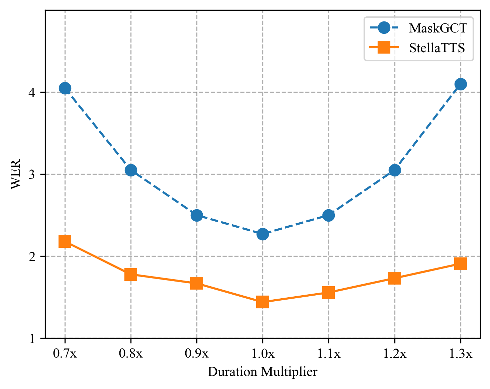
*Figure 2:Impact of Duration Control Strategies on WER: StellarTTS and MaskGCT Evaluated on Seed-TTS test-zh.*

---
**Usage Info**: 3701 tokens used.
**Generated at**: 2026-07-23 15:53:25

---

# 📚 SimulS2ST-Omni: Data-Efficient Streaming Speech-to-Speech Translation via Explicit Trajectory Supervision

🚀 URL: https://arxiv.org/html/2607.19810

## 🌏 Abstract (원문)
Long-form streaming speech-to-speech translation (S2ST) requires incremental, unbounded translation under strict latency constraints. Existing methods typically suffer from sentence-bounded supervision or demand massive paired-S2ST supervision. We introduce a training recipe enabling a speech language model for sentence-level and long-form streaming S2ST using only∼\sim2k hours of paired cross-lingual S2ST data, layered atop auxiliary supervision. Anchored by auxiliary multitask training, our approach remains robust even when the paired-S2ST budget itself is reduced by 90%. Our core contribution, joint text-code trajectory supervision, schedules target text and acoustic semantic codes as a unified commitment path, eliminating the need for separate, unstable speech-side emission controllers. Furthermore, our two-stream Thinker–Talker factorization significantly outperforms unified-decoder baselines by decoupling linguistic reasoning from dense acoustic prediction to mitigate modality interference. Finally, our system achieves highly competitive quality-latency trade-offs on RealSI and ACL60/60-dev, matching state-of-the-art, closed-source S2ST systems such as LiveInterpret
2.0 on ASR-BLEU.Demo:https://hasaki321.github.io/SimulS2ST-Omni.demo/
## 🌏 Abstract (번역)
장문 스트리밍 음성-음성 번역(S2ST)은 엄격한 지연 시간 제약 하에 점진적이고 무제한적인 번역을 요구합니다. 기존 방법들은 일반적으로 문장 단위의 감독에 의존하거나 대규모의 쌍을 이룬 S2ST 감독 데이터를 필요로 합니다. 우리는 보조 감독 위에 약 2천 시간의 쌍을 이룬 교차 언어 S2ST 데이터만을 사용하여 문장 수준 및 장문 스트리밍 S2ST를 위한 음성 언어 모델을 가능하게 하는 훈련 방식을 소개합니다. 보조 다중 작업 훈련에 기반하여, 우리의 접근 방식은 쌍을 이룬 S2ST 데이터 예산이 90% 감소하더라도 견고함을 유지합니다. 우리의 핵심 기여인 공동 텍스트-코드 궤적 감독은 목표 텍스트와 음향 의미 코드를 통합된 커밋 경로로 스케줄링하여, 별도의 불안정한 음성 측 방출 컨트롤러의 필요성을 없앱니다. 또한, 우리의 두 스트림 Thinker–Talker 분해는 언어적 추론을 밀집된 음향 예측과 분리하여 양식 간 간섭을 완화함으로써 통합 디코더 기준선보다 훨씬 뛰어난 성능을 보입니다. 마지막으로, 우리 시스템은 RealSI 및 ACL60/60-dev에서 매우 경쟁력 있는 품질-지연 시간 균형을 달성하며, ASR-BLEU에서 LiveInterpret 2.0과 같은 최첨단 비공개 S2ST 시스템과 동등한 수준을 보여줍니다. 데모: https://hasaki321.github.io/SimulS2ST-Omni.demo/

## 🔍 Methods & Results
- 목표 음성은 고정된 음성 토크나이저(Q)에 의해 추출된 이산적인 의미 코드로 표현되며, 사전 훈련된 플로우 매칭 및 보코더 백엔드(D)를 사용하여 파형으로 재구성됩니다.
- 스트리밍 생성을 위해 목표 텍스트와 코드의 공동 예측을 청크 단위 커밋 프로세스로 재구성하고, 스트리밍 궤적(τ)을 정의합니다.
- 청크 수준 궤적(τ)은 소스 및 목표 음성을 강제 정렬하여 단어 수준 경계를 얻고, SimAlign을 사용하여 교차 언어 단어 정렬을 추출함으로써 도출됩니다.
- 단조 증가하는 경계(monotonized boundary)를 사용하여 의미 코드 시퀀스를 목표 단어 경계에 따라 분할하고, 인접한 목표 단어와 코드를 1초 간격의 고정 크기 스트리밍 단계로 그룹화하여 이산 궤적(τ)을 형성합니다.
- 두 스트림 Thinker-Talker 아키텍처와 통합 디코더 기준선 간의 제어된 비교를 수행합니다.
- 두 스트림 접근 방식은 목표 텍스트 계획(Thinker θ)과 목표 코드 예측(Talker ϕ)을 분리하여 청크의 공동 확률을 분해합니다. Thinker와 Talker는 Qwen2.5-Omni에서 초기화됩니다.
- 통합 디코더 기준선은 Thinker의 어휘에 코드 토큰을 추가하고 단일 자동회귀 헤드로 공동 분포를 모델링합니다.
- 보조 다중 작업 훈련을 통해, 쌍을 이룬 S2ST 데이터 예산이 90% 감소하더라도 접근 방식의 견고성이 유지됩니다.
- 두 스트림 Thinker–Talker 분해는 언어적 추론을 밀집된 음향 예측과 분리하여 양식 간 간섭을 완화함으로써 통합 디코더 기준선보다 훨씬 뛰어난 성능을 보입니다.
- 시스템은 RealSI 및 ACL60/60-dev에서 매우 경쟁력 있는 품질-지연 시간 균형을 달성하며, ASR-BLEU에서 LiveInterpret 2.0과 같은 최첨단 비공개 S2ST 시스템과 동등한 수준을 보여줍니다.

## 🖼 Figures

*Figure 1:Streaming trajectory construction. Step 1: Word-level and cross-lingual alignments establish the earliest valid source prefix for each target word. Step 2: Target text and segmented target speech codes inherit monotonized boundaries and are grouped into discrete read/wait/write steps for joint emission.*

*Figure 2:Matched backbone comparison. Thinker–Talker (left) and Dec-only (right) share an identical speech encoder, base LLM backbone (with independent LoRA adapters), semantic-code tokenizer 
𝒬
, and frozen flow-matching/vocoder backend.*

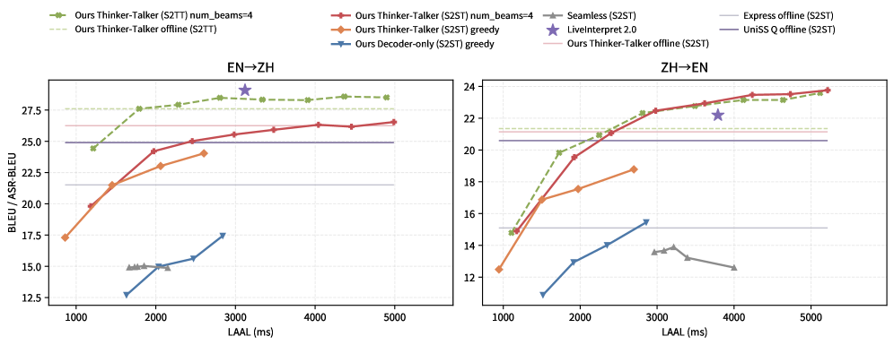
*Figure 3:RealSI sentence-level content trade-off. Dashed curves denote S2TT text BLEU, solid curves denote S2ST ASR-BLEU, and horizontal lines mark offline reference lines.*

*Figure 4:RealSI sentence-level acoustic quality trade-off: A.PCP and SIM-O against LAAL for En
→
Zh and Zh
→
En.*

*Figure 5:ACL60/60-dev long-form streaming S2TT En
→
Zh trade-off: BLEU against StreamLAAL for En
→
Zh and Zh
→
En.*

*Figure 6:Pooled NIR and Spearman distributions for NIR-stratified vs. random trajectory candidates (log-scaled density). Top row: NIR (%); bottom row: Spearman 
𝜌
. Columns: En
→
Zh (left) and Zh
→
En (right). NIR histograms use 
NIR
≤
50
%
; dashed lines are means.*

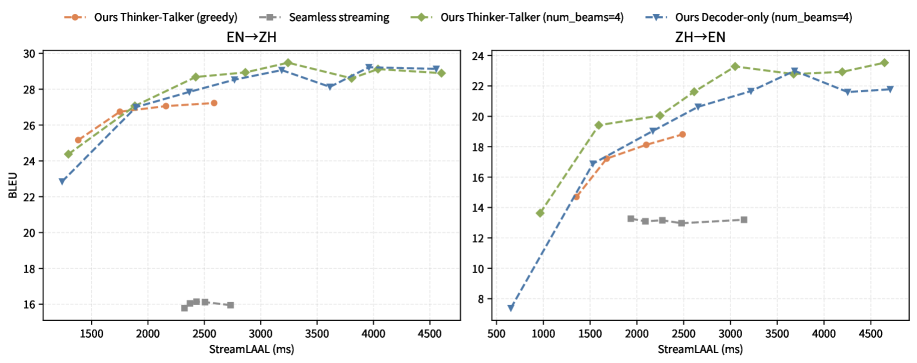
*Figure 7:RealSI long-form streaming S2TT trade-off for both directions.*

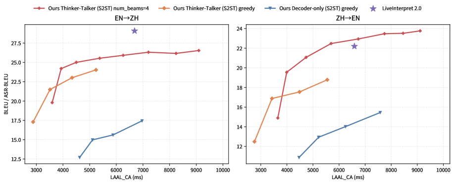
*Figure 8:RealSI Sentence-level simultaneous S2ST under LAAL_CA. ASR-BLEU is plotted against computation-aware latency on RealSI sentence test sets.*

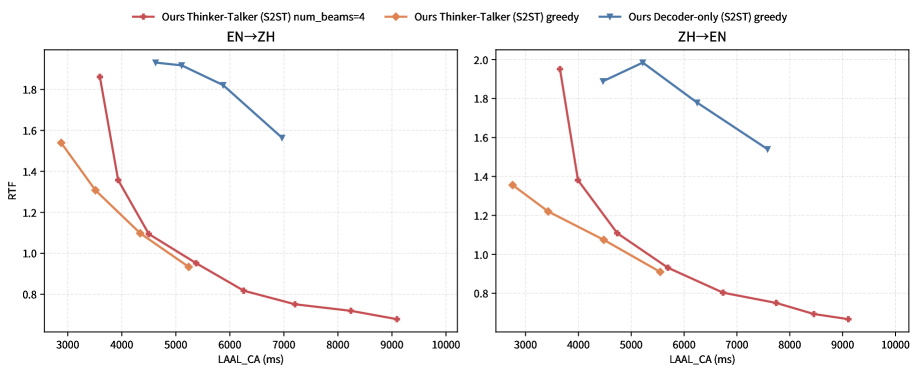
*Figure 9:RealSI sentence-level simultaneous S2ST: active compute RTF vs. LAAL_CA. RTF counts only non-idle inference time per source second.*

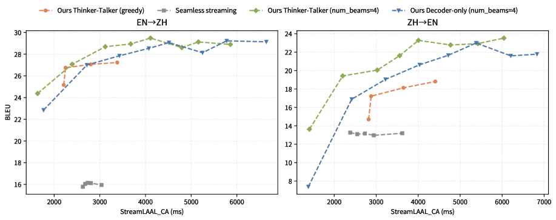
*Figure 10:RealSI long-form simultaneous S2TT under StreamLAAL_CA.*

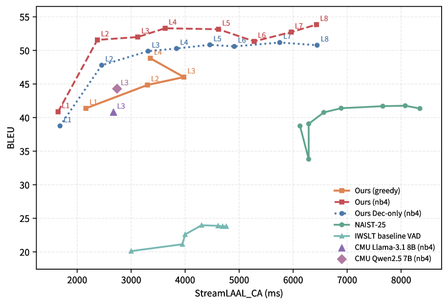
*Figure 11:ACL60/60-dev Long-form simultaneous S2TT under StreamLAAL_CA.*

*Figure 12:Anonymized rating interface used in the human listening study. Systems are randomly assigned to slots A–D and re-shuffled per sample so that raters cannot infer system identity; raters score Naturalness, Fidelity, and Translation Adequacy for each slot on a 1–5 slider.*

*Figure 13:RealSI S2ST case study: En
→
Zh, 
𝑚
=
1
.*

*Figure 14:RealSI S2ST case study: En
→
Zh, 
𝑚
=
2
.*

*Figure 15:RealSI S2ST case study: Zh
→
En, 
𝑚
=
1
.*

*Figure 16:RealSI S2ST case study: Zh
→
En, 
𝑚
=
2
.*

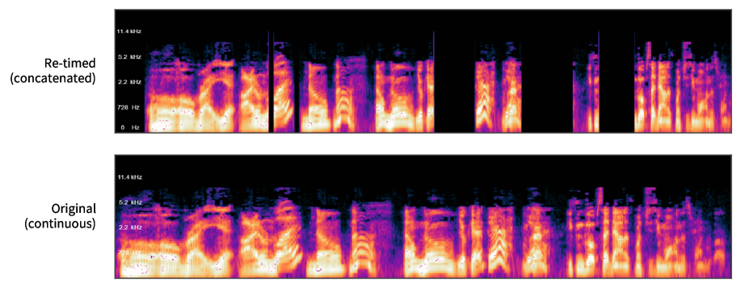
*Figure 17:Boundary concatenation artifact (mel spectrogram). Top: the causally re-timed target, showing hard cuts and silent gaps at chunk boundaries. Bottom: the continuous original recording of the same content, with smooth onsets.*

*Figure 18:FA under transcript–audio mismatch (source clip; the false start “That I I” is shaded). Aligning on the clean reference (top) collapses “I” to an 
0.08
 s sliver, so the target ready_time fires at 
0.08
 s; aligning on the ASR transcript (bottom) matches the audio, where the real content only begins after 
∼
0.96
 s.*

*Figure 19:Premature emission / wrong write (Zh
→
En), source-consumed axis. Top: source. Middle (
𝑚
=
2
): the agent commits “It’s called a podium.” at 
6.0
 s—before the disambiguating source (“sage”) arrives—then stalls in a wait. Bottom (
𝑚
=
4
): the wider read window lets it hear the full phrase first and correctly emit “It’s called the sage on the stage.”*

---
**Usage Info**: 4245 tokens used.
**Generated at**: 2026-07-23 15:53:39

---

# 📚 Pushing the Frontier of Full-Song Generation: Hierarchical Autoregressive Planning Meets Flow-Matching Rendering

🚀 URL: https://arxiv.org/html/2607.20253

## 🌏 Abstract (원문)
In this report, we present a unified song generation framework capable of producing high-quality full-length music from lyrics, text descriptions, and musical attributes. The proposed framework supports three tasks: Lyrics-to-Song Generation, which generates complete songs from text descriptions, lyrics, and musical attributes; Instrumental Music Generation, which creates music without vocals; and Cover Song Generation, which reinterprets existing songs with different styles while preserving their melodic content. Architecturally, our system consists of four main components: a semantic-aware tokenizer, hybird-LM, FullDiT, and a two-level melody module. The tokenizer encodes audio into 8-codebook RVQ tokens for efficient discrete music representation. Based on these tokens, hybird-LM performs hierarchical autoregressive audio-token modeling for full-song generation. To improve audio fidelity, FullDiT performs full-song flow matching in a continuous VAE latent space conditioned on codec tokens, lyrics, and text captions. For cover song generation, the melody module extracts and discretizes melody cues from reference audio to guide generation while preserving the original melodic content. Finally, we investigate DPO, GRPO, and OPD as reward-based post-training strategies for hybird-LM and apply flow-based GRPO to FullDiT to improve musicality and rendering quality. Experimental results on a multilingual automatic benchmark, complemented by the Artificial Analysis Music with Vocals leaderboard, show that the proposed framework achieves competitive performance in the evaluated settings.
## 🌏 Abstract (번역)
본 보고서에서는 가사, 텍스트 설명 및 음악적 속성으로부터 고품질의 전체 길이 음악을 생성할 수 있는 통합 노래 생성 프레임워크를 제시합니다. 제안된 프레임워크는 세 가지 작업을 지원합니다: 텍스트 설명, 가사 및 음악적 속성으로부터 완전한 노래를 생성하는 가사-노래 생성(Lyrics-to-Song Generation); 보컬 없이 음악을 생성하는 기악곡 생성(Instrumental Music Generation); 그리고 멜로디 콘텐츠를 보존하면서 기존 노래를 다른 스타일로 재해석하는 커버곡 생성(Cover Song Generation)입니다. 구조적으로, 저희 시스템은 의미론적 인식 토크나이저, hybird-LM, FullDiT, 그리고 2단계 멜로디 모듈의 네 가지 주요 구성 요소로 이루어져 있습니다. 토크나이저는 효율적인 이산 음악 표현을 위해 오디오를 8개의 코드북 RVQ 토큰으로 인코딩합니다. 이 토큰들을 기반으로, hybird-LM은 전체 노래 생성을 위한 계층적 자기회귀 오디오-토큰 모델링을 수행합니다. 오디오 충실도를 향상시키기 위해, FullDiT는 코덱 토큰, 가사 및 텍스트 캡션에 조건화된 연속 VAE 잠재 공간에서 전체 노래 플로우 매칭을 수행합니다. 커버곡 생성을 위해, 멜로디 모듈은 참조 오디오에서 멜로디 단서를 추출하고 이산화하여 원본 멜로디 콘텐츠를 보존하면서 생성을 안내합니다. 마지막으로, hybird-LM을 위한 보상 기반 후처리 훈련 전략으로 DPO, GRPO, OPD를 조사하고, 음악성과 렌더링 품질을 향상시키기 위해 FullDiT에 플로우 기반 GRPO를 적용합니다. 다국어 자동 벤치마크와 Artificial Analysis Music with Vocals 리더보드를 통해 보완된 실험 결과는 제안된 프레임워크가 평가된 설정에서 경쟁력 있는 성능을 달성함을 보여줍니다.

## 🔍 Methods & Results
- 제안된 통합 프레임워크는 자연어 음악 설명, 선택적 가사 및 참조 오디오를 고품질의 전체 길이 노래로 변환하며, 가사-노래 생성, 기악곡 생성, 커버곡 생성의 세 가지 주요 작업을 지원합니다.
- 시스템은 의미론적 인식 토크나이저, hybird-LM, FullDiT, 2단계 멜로디 모듈의 네 가지 핵심 구성 요소로 이루어져 있습니다.
- 의미론적 인식 RVQ 토크나이저는 원본 음악 오디오를 8개의 코드북 RVQ 토큰(25Hz 프레임 속도, 코드북당 8192개 엔트리)으로 인코딩하며, BEST-RQ 스타일 사전 훈련, 다중 작업 미세 조정, 이산 토큰 훈련의 3단계 파이프라인으로 학습되어 의미 정보 보존 및 높은 재구성 충실도를 보장합니다.
- hybird-LM은 가사, 텍스트 설명 및 음악적 속성에 조건화된 오디오 토큰을 생성하는 계층적 자기회귀 모델입니다. 이는 8B 파라미터의 전역 LLM(시간 축 모델링)과 0.4B 파라미터의 지역 LLM(RVQ 코드북 축 모델링)으로 구성되며, 수천만 곡의 대규모 데이터셋으로 다단계 훈련(사전 훈련, 스타일 균형 조정, 고품질 SFT)을 거쳐 보컬 및 기악곡 생성을 지원합니다.
- 2단계 멜로디 모듈은 참조 오디오에서 음표 수준(MIDI) 및 프레임 수준(F0) 피치 단서를 추출하여 128단계 이산 토큰으로 변환하고, 이를 hybird-LM에 제공하여 커버곡 생성 시 전반적인 멜로디 윤곽과 세부 피치 변화를 보존하도록 안내합니다.
- FullDiT는 8B 파라미터의 DiT 모델로, hybird-LM이 생성한 이산 음악 계획을 고충실도 48kHz 스테레오 파형으로 변환하기 위해 연속 VAE 잠재 공간에서 전체 노래 플로우 매칭을 수행합니다. 코덱 토큰, 가사, 텍스트 캡션에 조건화되며, 580만 곡의 무손실 품질 노래로 훈련되고, EDMC(Error-Matched Distractor Conditioning) 및 4방향 분류기 없는 안내를 활용하여 오디오 품질을 향상시킵니다.
- hybird-LM의 음악성 및 생성 안정성 향상을 위해 DPO(Direct Preference Optimization), GRPO(Group Relative Policy Optimization), OPD(On-Policy Distillation)를 포함한 보상 기반 후처리 훈련 전략이 적용되었습니다. DPO는 선호도 쌍 학습, GRPO는 정책 기반 보상 최적화, OPD는 고품질 교사 모델의 지침을 활용합니다.
- FullDiT에는 플로우 기반 GRPO(FlowTTS-GRPO)가 적용되어 오디오 충실도 및 음악적 균형을 개선합니다. 이는 SDE 샘플링을 통한 탐색과 ViSQOL 오디오 품질 및 내부 음악 보상 모델을 결합한 그룹 상대적 최종 보상 최적화를 통해 보컬-반주 균형 및 스테레오 공간 렌더링을 향상시킵니다.
- 다국어 자동 벤치마크 및 Artificial Analysis Music with Vocals 리더보드에서 수행된 실험 결과, 제안된 프레임워크는 평가된 설정에서 경쟁력 있는 성능을 달성했습니다.

## 🖼 Figures

*Figure 1:Results on the Artificial Analysis Music with Vocals leaderboard. The leaderboard entry Lucky Dolphin corresponds to the proposed system, which was submitted anonymously for evaluation. It achieves an Elo rating of 1,129 and an official rank range of 2–3. Error bars denote 95% confidence intervals.*

*Figure 2:Overview of the proposed framework. Given a text caption, optional lyrics, and optional reference audio, hybird-LM autoregressively generates audio tokens. For cover song generation, the melody module extracts and discretizes melody cues from the reference audio as additional conditions for hybird-LM. FullDiT then generates a continuous full-song VAE latent conditioned on the codec sequence, text caption, and lyrics when available, which is decoded into a high-fidelity waveform.*

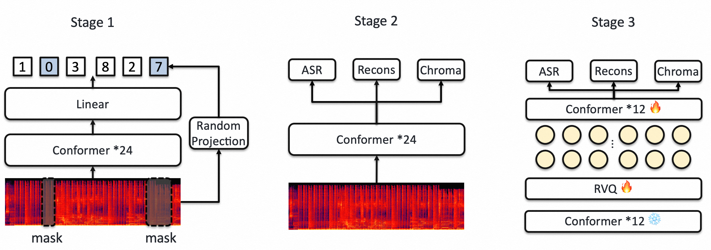
*Figure 3:Three-stage training of the proposed tokenizer, which consists of BEST-RQ-style pretraining, multi-task finetuning, and RVQ token training.*

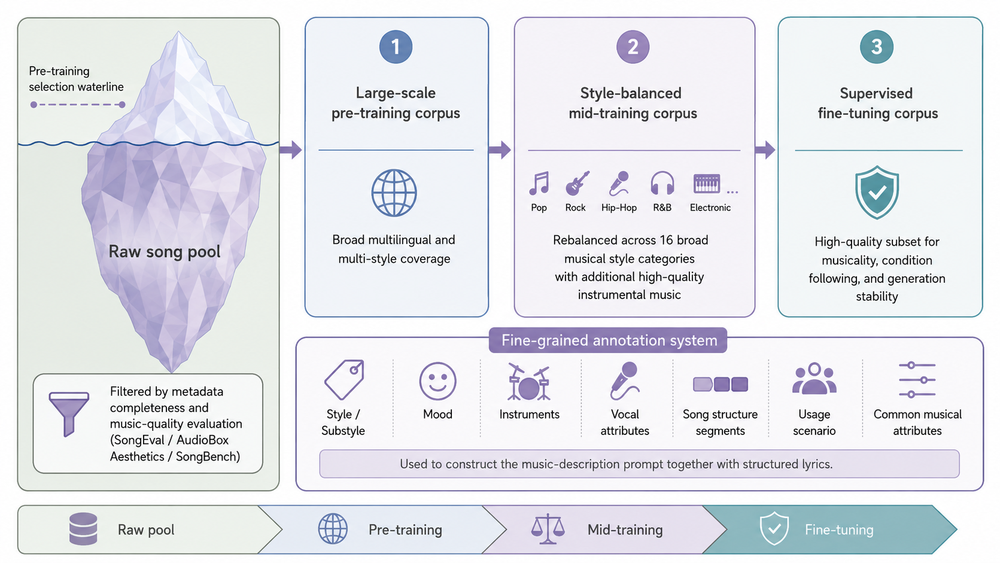
*Figure 4:Overview of the music data curation and staged training pipeline.*

*Figure 5:Overview of the hierarchical autoregressive architecture of hybird-LM. Structured music annotations and lyrics are provided as textual conditions, with optional frame-aligned melody tokens used for cover generation. The 8B global LLM predicts the first codebook token 
𝑐
𝑡
0
 once per audio frame and models long-range temporal dependencies, while the 0.4B local LLM autoregressively predicts the residual codebook tokens 
𝑐
𝑡
1
–
𝑐
𝑡
7
 within the frame.*

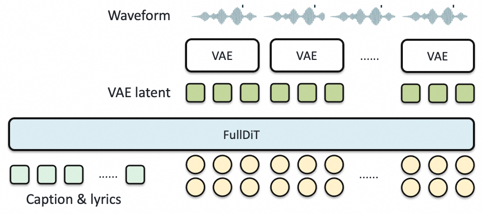
*Figure 6:Architecture of FullDiT. Given full-song RVQ tokens, lyrics, and a text caption, FullDiT injects frame-aligned codec embeddings into the audio hidden states and performs non-causal full-song flow matching to generate a continuous VAE latent.*

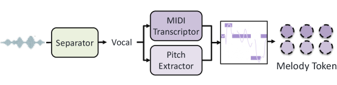
*Figure 7:The proposed two-level melody tokenizer.*

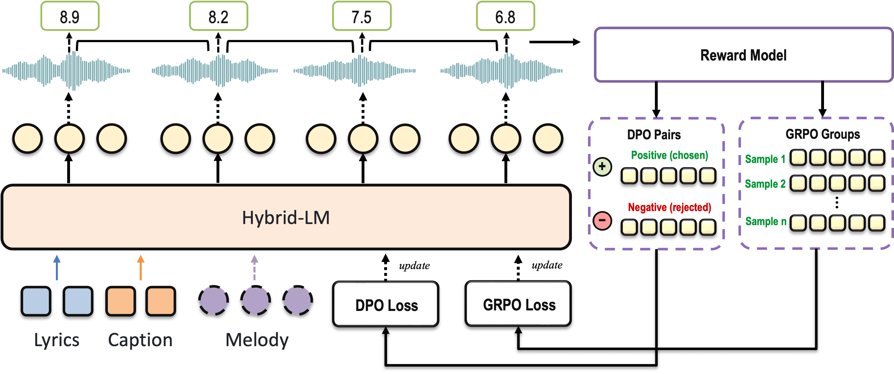
*Figure 8:Overview of the RL-based post-training pipeline, including DPO and GRPO.*

---
**Usage Info**: 10515 tokens used.
**Generated at**: 2026-07-23 15:53:58

---

# 📚 StereoFlow: Progressive Stereo Matching with StereoDiT and Transition Flow Matching

🚀 URL: https://arxiv.org/html/2607.19986

## 🌏 Abstract (원문)
Stereo matching is a fundamental task in 3D reconstruction. Despite remarkable advances, the prevailing paradigms formulate stereo matching as a deterministic regression problem, collapsing the multimodal distribution modeling into a single-point estimation. This formulation suffers from a regression-to-mean bias, frequently struggling with ambiguous regions. In contrast, we introduce a prior-guided generative framework that integrates deterministic matching regression and generative distribution modeling within a complementary formulation. Built upon this formulation, we introduceStereoFlowthrough three key components: (i) a two-stage progressive cascade matching network that progressively produces multi-resolution stereo conditions with complementary matching cues; (ii) a pixel diffusion transformer (termed StereoDiT) with a frequency-decoupled architecture for modeling correspondence ambiguity; (iii) a few-step flow matching objective (termed Transition Flow Matching) for efficient optimization. In summary,StereoFlowachieves strong geometric consistency and rich fine-grained details in ill-posed, discontinuous regions and under zero-shot generalization. Extensive experiments demonstrate that the proposedStereoFlowestablishes multiple state-of-the-art results across benchmarks, including Scene Flow, KITTI, ETH3D, and Middlebury.
## 🌏 Abstract (번역)
스테레오 매칭은 3D 재구성에 있어 기본적인 작업입니다. 놀라운 발전에도 불구하고, 지배적인 패러다임은 스테레오 매칭을 결정론적 회귀 문제로 공식화하여 다중 모드 분포 모델링을 단일 지점 추정으로 축소시킵니다. 이러한 공식화는 평균 회귀 편향으로 인해 모호한 영역에서 자주 어려움을 겪습니다. 대조적으로, 우리는 결정론적 매칭 회귀와 생성 분포 모델링을 상호 보완적인 공식화 내에서 통합하는 사전 안내 생성 프레임워크를 소개합니다. 이 공식화를 기반으로, 우리는 세 가지 핵심 구성 요소를 통해 StereoFlow를 소개합니다: (i) 상호 보완적인 매칭 단서를 사용하여 다중 해상도 스테레오 조건을 점진적으로 생성하는 2단계 점진적 캐스케이드 매칭 네트워크; (ii) 대응 모호성을 모델링하기 위한 주파수 분리 아키텍처를 갖춘 픽셀 확산 트랜스포머(StereoDiT라고 명명); (iii) 효율적인 최적화를 위한 몇 단계 흐름 매칭 목표(Transition Flow Matching이라고 명명). 요약하자면, StereoFlow는 불량 조건, 불연속 영역 및 제로샷 일반화 상황에서 강력한 기하학적 일관성과 풍부한 미세한 세부 사항을 달성합니다. 광범위한 실험을 통해 제안된 StereoFlow가 Scene Flow, KITTI, ETH3D, Middlebury를 포함한 벤치마크 전반에 걸쳐 여러 최첨단 결과를 확립했음을 입증합니다.

## 🔍 Methods & Results
- StereoFlow는 결정론적 매칭 회귀와 생성 분포 모델링을 상호 보완적으로 통합하는 사전 안내 생성 프레임워크를 제안한다.
- 이 프레임워크는 (i) 다중 해상도 스테레오 조건을 점진적으로 생성하는 2단계 점진적 캐스케이드 매칭 네트워크, (ii) 대응 모호성을 모델링하는 주파수 분리 아키텍처를 갖춘 픽셀 확산 트랜스포머(StereoDiT), (iii) 효율적인 최적화를 위한 몇 단계 흐름 매칭 목표(Transition Flow Matching)로 구성된다.
- 2단계 캐스케이드 매칭 네트워크는 저해상도 4D GEV(Geometry Encoding Volume)를 사용하여 기하학적 일관성을 확보하고, 고해상도 3D ACV(All-pairs Correlation Volume)를 사용하여 미세한 세부 사항과 큰 시차를 복구한다.
- 각 단계에서 ConvGRU 기반 매칭 네트워크가 시차 사전 정보를 생성하고, StereoDiT 기반 생성 모델이 이 사전 정보를 중심으로 다중 모드 대응 분포를 매개변수화한다.
- StereoDiT는 기하학적 인코더(단안 깊이 특징 사용)와 스테레오 디코더(특수 스테레오 조건 사용)로 구성된 픽셀 확산 트랜스포머로, 저주파 기하학적 일관성과 고주파 미터법 세부 사항을 처리한다.
- Transition Flow Matching은 선형 보간과 선형 노이즈 스케줄러를 사용하여 학습 역학을 공식화하며, 결정론적 기하학적 전송과 확률적 섭동을 분리하여 효율적인 최적화를 가능하게 한다.
- StereoFlow는 불량 조건, 불연속 영역 및 제로샷 일반화 상황에서 강력한 기하학적 일관성과 풍부한 미세한 세부 사항을 달성하며, Scene Flow, KITTI, ETH3D, Middlebury 벤치마크에서 여러 최첨단 결과를 달성했다.

## 🖼 Figures
![Figure 1: Comparisons on KITTI-2012 [18], KITTI-2015 [55], ETH3D [67] and Middlebury [65] with the recent state-of-the-art counterparts. The proposed StereoFlow achieves comprehensive performance improvements across various benchmarks. (Zoom in for a better view.)](../images/2026-07-23/2607.19986/2607.19986_fig0.png)
*Figure 1: Comparisons on KITTI-2012 [18], KITTI-2015 [55], ETH3D [67] and Middlebury [65] with the recent state-of-the-art counterparts. The proposed StereoFlow achieves comprehensive performance improvements across various benchmarks. (Zoom in for a better view.)*

*Figure 2: The prior-guided generative stereo framework that integrates deterministic matching regression and generative distribution modeling within a complementary formulation, where the former provides disparity priors that substantially constrain the correspondence search space, and the latter explicitly parameterizes multimodal distributions anchored around these priors. (Zoom in for a better view.)*

![Figure 3:Qualitative comparisons of zero-shot generalization with the baselines IGEV-Stereo [97] and DEFOM-Stereo [29] on KITTI-2012 [18], KITTI-2015 [55], and ETH3D [67]. All models are trained on the synthetic Scene Flow [54] and evaluated directly on the realistic datasets. In contrast, the proposed StereoFlow achieves strong geometric consistency and rich fine-grained details in ambiguous regions such as occlusions, repetitive patterns, reflective surfaces, thin structures, and depth discontinuities under zero-shot generalization. (Zoom in for a better view.)](../images/2026-07-23/2607.19986/2607.19986_fig2.png)
*Figure 3:Qualitative comparisons of zero-shot generalization with the baselines IGEV-Stereo [97] and DEFOM-Stereo [29] on KITTI-2012 [18], KITTI-2015 [55], and ETH3D [67]. All models are trained on the synthetic Scene Flow [54] and evaluated directly on the realistic datasets. In contrast, the proposed StereoFlow achieves strong geometric consistency and rich fine-grained details in ambiguous regions such as occlusions, repetitive patterns, reflective surfaces, thin structures, and depth discontinuities under zero-shot generalization. (Zoom in for a better view.)*

![Figure 4:StereoFlow is a prior-guided generative stereo framework built upon three key components: (i) A two-stage progressive cascade matching network that progressively produces multi-resolution stereo conditions with complementary matching cues; (ii) A pixel diffusion transformer (termed StereoDiT) with a decoupled architecture consisting of a geometric encoder for low-frequency structural consistency and a stereo decoder for high-frequency metric details; (iii) A few-step flow matching objective (termed Transition Flow Matching) formulates the learning dynamics with a linear interpolant for directional displacement of geometric structures and a linear noise scheduler to synthesize details. (Zoom in for a better view.)](../images/2026-07-23/2607.19986/2607.19986_fig3.png)
*Figure 4:StereoFlow is a prior-guided generative stereo framework built upon three key components: (i) A two-stage progressive cascade matching network that progressively produces multi-resolution stereo conditions with complementary matching cues; (ii) A pixel diffusion transformer (termed StereoDiT) with a decoupled architecture consisting of a geometric encoder for low-frequency structural consistency and a stereo decoder for high-frequency metric details; (iii) A few-step flow matching objective (termed Transition Flow Matching) formulates the learning dynamics with a linear interpolant for directional displacement of geometric structures and a linear noise scheduler to synthesize details. (Zoom in for a better view.)*

![Figure 5:Qualitative comparisons on ETH3D and Middlebury with the baselines IGEV-Stereo [97] and DEFOM-Stereo [29]. All models are finetuned on the realistic ETH3D [67] and Middlebury [65] datasets. In contrast, the proposed StereoFlow achieves strong geometric consistency and fine-grained details across challenging ill-posed regions, including reflective surfaces, highlights, textureless, occluded and discontinuous areas. (Zoom in for a better view.)](../images/2026-07-23/2607.19986/2607.19986_fig4.png)
*Figure 5:Qualitative comparisons on ETH3D and Middlebury with the baselines IGEV-Stereo [97] and DEFOM-Stereo [29]. All models are finetuned on the realistic ETH3D [67] and Middlebury [65] datasets. In contrast, the proposed StereoFlow achieves strong geometric consistency and fine-grained details across challenging ill-posed regions, including reflective surfaces, highlights, textureless, occluded and discontinuous areas. (Zoom in for a better view.)*

*Figure 6: Sampling Visualization of Transition Flow Matching. Starting directly from the noisy degraded disparities, with only two sampling steps, the proposed Transition Flow Matching enables the displacement of geometric structures and the synthesis of high-frequency details, with improvements in challenging ill-posed regions, such as reflective surfaces, textureless, occluded and discontinuous areas. (Zoom in for a better view.)*

---
**Usage Info**: 6427 tokens used.
**Generated at**: 2026-07-23 15:54:12

---

