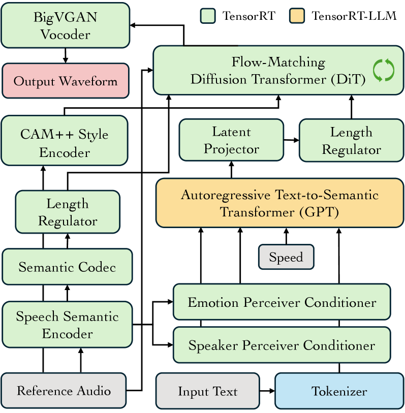
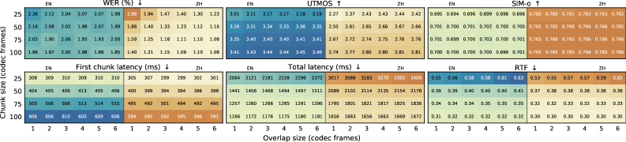
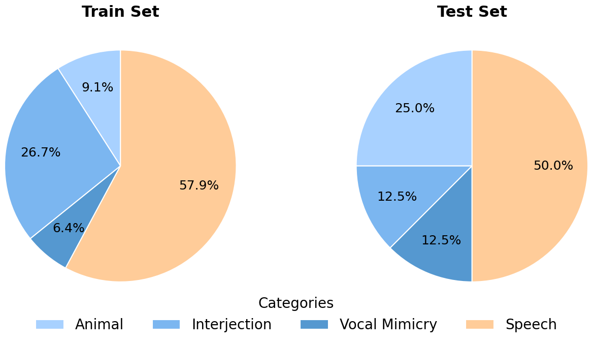

# 🚩 (2026-07-24) Scholar Inbox 추천 논문 

# 📚 Faster IndexTTS-2: Accelerating and Streaming Autoregressive Zero-Shot Text-to-Speech Synthesis on GPUs

🚀 URL: https://arxiv.org/html/2607.21042

## 🌏 Abstract (원문)
Autoregressive text-to-speech models achieve strong naturalness but suffer from slow inference due to sequential token generation, limiting their deployment in production applications that require low latency. IndexTTS-2 is a state-of-the-art autoregressive TTS model consisting of a GPT, a flow-matching Diffusion Transformer, and a vocoder. Despite its high synthesis quality, its inference speed barely reaches real-time without streaming or batching support. We present Faster IndexTTS-2, which accelerates all neural network components of IndexTTS-2 for production deployment on GPUs using NVIDIA TensorRT and TensorRT-LLM. Faster IndexTTS-2 also enables streaming synthesis for latency-sensitive interactive applications, and batched inference across all components to maximize GPU utilization. Experiments on the Seed-TTS benchmark for both English and Chinese demonstrate up to 5.0×speedup on the autoregressive GPT and 3.6×end-to-end, with minimal degradation in word error rate, speaker similarity, and naturalness. Our methodology provides a practical reference for efficiently accelerating similar autoregressive speech models on GPUs.111Audio samples:https://faster-indextts-2.github.io
## 🌏 Abstract (번역)
자기회귀 텍스트-음성 변환(TTS) 모델은 뛰어난 자연스러움을 달성하지만, 순차적인 토큰 생성으로 인해 추론 속도가 느려 낮은 지연 시간을 요구하는 프로덕션 애플리케이션 배포에 제약이 있습니다. IndexTTS-2는 GPT, 플로우 매칭 확산 트랜스포머, 보코더로 구성된 최첨단 자기회귀 TTS 모델입니다. 높은 합성 품질에도 불구하고, 스트리밍이나 배치 지원 없이는 추론 속도가 실시간에 거의 미치지 못합니다. 본 논문에서는 NVIDIA TensorRT 및 TensorRT-LLM을 사용하여 GPU에서 IndexTTS-2의 모든 신경망 구성 요소를 가속화하여 프로덕션 배포를 위한 Faster IndexTTS-2를 제안합니다. Faster IndexTTS-2는 또한 지연 시간에 민감한 대화형 애플리케이션을 위한 스트리밍 합성을 가능하게 하며, GPU 활용도를 극대화하기 위해 모든 구성 요소에 걸쳐 배치 추론을 지원합니다. 영어와 중국어 모두에 대한 Seed-TTS 벤치마크 실험 결과, 자기회귀 GPT에서 최대 5.0배, 종단 간(end-to-end)으로 3.6배의 속도 향상을 보였으며, 단어 오류율, 화자 유사성 및 자연스러움에서 최소한의 저하를 나타냈습니다. 우리의 방법론은 GPU에서 유사한 자기회귀 음성 모델을 효율적으로 가속화하기 위한 실용적인 참고 자료를 제공합니다.

## 🔍 Methods & Results
- IndexTTS-2는 텍스트-의미(GPT), 의미-멜(Diffusion Transformer), 보코더의 세 가지 핵심 모듈로 구성된 계단식 자기회귀 제로샷 TTS 모델이다.
- Faster IndexTTS-2는 NVIDIA TensorRT 및 TensorRT-LLM을 사용하여 IndexTTS-2의 모든 신경망 구성 요소를 GPU에서 가속화한다.
- TensorRT-LLM은 IndexTTS-2의 GPT에 맞게 프롬프트 튜닝을 통한 조건 신호 주입, 텍스트 및 코덱 임베딩 테이블 병합, 사용자 정의 위치 ID 구성, 단계별 은닉 상태 출력 지원 등의 여러 가지 수정 사항을 적용했다.
- Faster IndexTTS-2는 지연 시간에 민감한 애플리케이션을 위해 청크 스트리밍 합성을 지원하며, 청크 간 오버랩 영역은 Hann 윈도우 교차 페이딩으로 부드럽게 전환된다.
- 모든 구성 요소에 걸쳐 배치 추론을 지원하여 GPU 활용도를 극대화하며, 배치 스트리밍도 가능하다.
- Seed-TTS 벤치마크(영어 및 중국어) 실험 결과, 자기회귀 GPT에서 최대 5.0배, 종단 간(end-to-end)으로 3.6배의 속도 향상을 달성했다.
- 속도 향상에도 불구하고 단어 오류율, 화자 유사성 및 자연스러움에서 최소한의 성능 저하를 보였다.

## 🖼 Figures

*Figure 1:Overview of Faster IndexTTS-2.*

*Figure 2:Streaming synthesis quality and latency of Faster IndexTTS-2 in FP16 across chunk sizes and overlap sizes on the Seed-TTS test sets.*

---
**Usage Info**: 2580 tokens used.
**Generated at**: 2026-07-24 15:25:10

---

# 📚 Designed Vocalizations Dataset: Sound-Designed Human and Animal Voices for Non-human Voice Conversion

🚀 URL: https://arxiv.org/html/2607.20951

## 🌏 Abstract (원문)
Advances in AI-based voice conversion have enabled a wide range of media applications, including films, audiobooks, and games. However, most research and public benchmarks still focus on natural human speech, leaving designed vocalizations, such as monster growls and robotic voices, underexplored, partly due to the lack of publicly available resources. To address this gap, we introduce the Designed Vocalizations Dataset, constructed by curating diverse raw vocal sources, including speech and animal vocalizations, and applying professional vocal effects processing to produce corresponding effect-modified variants. We further provide a standardized test set with explicit seen/unseen splits over source timbre groups and preset styles to assess generalization under controlled conditions. Finally, we report baseline benchmark results to support reproducible evaluation and future research. The dataset and demo samples are available online.111https://ncai-official.github.io/speech/publications/designed-vocalizations-dataset/
## 🌏 Abstract (번역)
AI 기반 음성 변환의 발전은 영화, 오디오북, 게임을 포함한 광범위한 미디어 애플리케이션을 가능하게 했습니다. 그러나 대부분의 연구와 공개 벤치마크는 여전히 자연스러운 인간 음성에 초점을 맞추고 있어, 괴물 울음소리나 로봇 음성과 같은 디자인된 발성은 공개적으로 사용 가능한 리소스 부족으로 인해 충분히 탐구되지 않고 있습니다. 이러한 격차를 해소하기 위해, 우리는 음성 및 동물 발성을 포함한 다양한 원시 발성 소스를 큐레이션하고 전문적인 보컬 효과 처리를 적용하여 해당 효과 변형을 생성함으로써 구축된 '디자인된 발성 데이터셋(Designed Vocalizations Dataset)'을 소개합니다. 우리는 또한 통제된 조건에서 일반화 능력을 평가하기 위해 소스 음색 그룹과 사전 설정 스타일 전반에 걸쳐 명시적인 '보이는/보이지 않는(seen/unseen)' 분할을 포함하는 표준화된 테스트 세트를 제공합니다. 마지막으로, 재현 가능한 평가와 향후 연구를 지원하기 위해 기준 벤치마크 결과를 보고합니다. 데이터셋과 데모 샘플은 온라인에서 이용 가능합니다.

## 🔍 Methods & Results
- AI 기반 음성 변환 연구의 미개척 분야인 괴물 울음소리, 로봇 음성 등 '디자인된 발성'을 위한 공개 데이터셋인 'Designed Vocalizations Dataset'을 소개합니다.
- 데이터셋은 음성 및 동물 발성을 포함한 다양한 원시 발성 소스에 전문적인 보컬 효과 처리를 적용하여 생성된 디자인된 발성 변형으로 구성됩니다.
- 원시 소스는 VCTK에서 추출한 언어적 샘플(3,270개)과 Freesound에서 수집한 비언어적 샘플(동물 소리, 감탄사, 보컬 모방 등)을 포함하며, 태그 기반 필터링 및 수동 검토, 자동 노이즈 제거, 볼륨 정규화를 거쳤습니다.
- 디자인된 발성은 Dehumaniser 2의 30가지 내장 프리셋과 Cubase 후처리가 포함된 17가지 자체 제작 프리셋을 사용하여 생성되었으며, 딜레이 피치 시프팅, 플랜저/코러스, 그래뉼러, 노이즈 생성기, 피치 시프팅, 링 모듈레이터, 스펙트럼 시프팅 등의 핵심 효과 모듈이 활용되었습니다.
- 데이터셋은 총 237,574개의 44.1kHz, 16비트 WAV 샘플로 구성되며, 훈련 세트(비병렬 원시/디자인된 오디오)와 테스트 세트(정량적 평가를 위한 정렬된 소스/참조 쌍)로 나뉩니다.
- 테스트 세트는 소스 음색 그룹(훈련 세트에서 '보이는' 20개 유형 및 '보이지 않는' 20개 유형)과 프리셋 스타일(훈련 세트에서 '보이는' 40개 프리셋 및 '보이지 않는' 7개 프리셋)에 대한 명시적인 seen/unseen 분할을 제공하여 일반화 능력을 평가합니다.
- 훈련 데이터는 음성(57.9%), 감탄사(26.7%), 동물 소리(9.1%), 보컬 모방(6.4%)으로 구성되며, 테스트 데이터는 음성(50.0%), 동물 소리(25.0%), 감탄사(12.5%), 보컬 모방(12.5%)으로 구성되어 대표성과 다양성을 유지합니다.
- 모델은 참조의 디자인된 음색(스타일)을 재현하면서 소스의 내용을 보존하는 능력을 기준으로 평가됩니다.

## 🖼 Figures

*Figure 1:Representative audio effect chain structures for preset-specific DSP operators 
𝐺
𝑝
. Each operator maps a raw vocal source 
𝑥
raw
 to a designed vocalization 
𝑥
(
𝑝
)
 using selected effect modules 
ℳ
𝑝
 connected in serial, parallel, or hybrid forms.*

*Figure 2:Source category distribution of train and test sets.*

![Figure 3:Effect usage distribution across seen and unseen preset groups. Top: seven Dehumaniser [dehumaniser] base effects; bottom: six additional effects in in-house-designed presets.](../images/2026-07-24/2607.20951/2607.20951_fig2.png)
*Figure 3:Effect usage distribution across seen and unseen preset groups. Top: seven Dehumaniser [dehumaniser] base effects; bottom: six additional effects in in-house-designed presets.*

---
**Usage Info**: 5792 tokens used.
**Generated at**: 2026-07-24 15:25:25

---

# 📚 VibeVoice-ASR-BitNet Technical Report

🚀 URL: https://arxiv.org/html/2607.21075

## 🌏 Abstract (원문)
We present VibeVoice-ASR-BitNet, a compressed variant of VibeVoice-ASR optimized for real-time inference on edge CPUs. We apply heterogeneous quantization tailored to the computational characteristics of each stage: the VAE acoustic tokenizer uses full-pipeline INT8 quantization (I8_S) with kernel fusion and SIMD optimization, while the autoregressive language model adopts BitNet-style ternary weights (I2_S). To preserve accuracy under aggressive compression, we employ a progressive quantization-aware training strategy. For inference, we implement custom SIMD kernels and fused operators within the ggml framework targeting both ARM and x86 platforms, achieving real-time recognition with RTF<1 using as few as 3 CPU threads. VibeVoice-ASR-BitNet is 1.6–2.3× faster than Whisper.cpp at comparable model sizes (∼1.6 GB), with only modest accuracy degradation compared to the FP16 baseline.
## 🌏 Abstract (번역)
저희는 엣지 CPU에서의 실시간 추론에 최적화된 VibeVoice-ASR의 압축 변형인 VibeVoice-ASR-BitNet을 소개합니다. 각 단계의 계산 특성에 맞춰 이기종 양자화를 적용했습니다. VAE 음향 토크나이저는 커널 퓨전 및 SIMD 최적화를 통해 전체 파이프라인 INT8 양자화(I8_S)를 사용하며, 자기회귀 언어 모델은 BitNet 스타일의 3진 가중치(I2_S)를 채택합니다. 공격적인 압축 하에서도 정확도를 유지하기 위해 점진적인 양자화 인식 훈련 전략을 사용합니다. 추론을 위해 ARM 및 x86 플랫폼을 대상으로 하는 ggml 프레임워크 내에서 사용자 정의 SIMD 커널과 융합된 연산자를 구현하여, 최소 3개의 CPU 스레드를 사용하여 RTF<1로 실시간 인식을 달성했습니다. VibeVoice-ASR-BitNet은 유사한 모델 크기(약 1.6GB)에서 Whisper.cpp보다 1.6~2.3배 빠르며, FP16 기준선에 비해 정확도 저하가 미미합니다.

## 🔍 Methods & Results
- VibeVoice-ASR-BitNet은 VAE 토크나이저(음향 인코더 + 의미 인코더)와 자기회귀 언어 모델 디코더로 구성된 VibeVoice-ASR 아키텍처를 계승하며, 엣지 CPU 배포를 위해 Qwen2.5-7B 디코더를 Qwen2.5-1.5B로 교체하여 메모리 사용량을 줄였습니다.
- 계산 프로파일이 다른 두 단계에 대해 이기종 양자화 전략을 적용했습니다: VAE 토크나이저는 전체 파이프라인 INT8 양자화(I8_S)를, LM 디코더는 BitNet 스타일의 3진 가중치(I2_S)를 사용합니다.
- I8_S는 전체 순방향 패스(가중치, 활성화, 중간 버퍼)에 걸쳐 균일한 INT8 데이터 경로를 강제하여 정밀도 형식 변환 오버헤드를 제거하고, 네이티브 하드웨어 지원(AVX2/NEON)과 낮은 정확도 손실 때문에 INT8을 선택했습니다.
- I2_S는 가중치를 2비트 3진수({-1, 0, +1})로 양자화하고 활성화를 토큰별로 INT8로 온라인 양자화하여 FP16 대비 가중치 메모리 트래픽을 8배 감소시킵니다. 임베딩 및 LM 헤드 레이어는 Q6_K(6비트)를 사용합니다.
- 공격적인 압축 하에서도 정확도를 보존하기 위해, 블렌딩 매개변수 α를 0에서 1로 선형적으로 증가시키는 점진적 양자화 인식 훈련(QAT) 전략을 사용했습니다. 이는 직접 QAT가 수렴에 실패하는 문제를 해결하여 안정적인 손실 감소를 보장합니다.
- VAE 토크나이저의 GELU 활성화 함수를 ReLU로 대체하여 INT8 연산 효율성을 높였으며, 정확도 회복을 위해 대체 후 미세 조정했습니다.
- 중간 메모리 트래픽을 줄이기 위해 `im2col_asym`, `mul_mat_add_relu`, `add_scaled`, `rms_norm_scaled`와 같은 VAE 토크나이저의 자주 발생하는 연산자를 단일 커널로 융합했습니다.
- ARM 및 x86 플랫폼을 대상으로 하는 ggml 프레임워크 내에서 사용자 정의 SIMD 커널과 융합된 연산자를 구현했습니다. I8_S 커널은 `_mm256_maddubs_epi16` (AVX2) 또는 NEON `smull/sadalp`를 사용하고, I2_S 커널은 2비트 3진 값을 INT8로 언팩한 후 동일한 `maddubs` 파이프라인을 사용합니다.
- VibeVoice-ASR-BitNet은 최소 3개의 CPU 스레드를 사용하여 RTF<1로 실시간 인식을 달성했으며, 유사한 모델 크기(약 1.6GB)에서 Whisper.cpp보다 1.6~2.3배 빠르면서도 FP16 기준선 대비 정확도 저하가 미미합니다.

## 🖼 Figures

*Figure 1:Overview of the VibeVoice-ASR-BitNet system: heterogeneous quantization enables real-time CPU inference with 
2.9
×
 model compression relative to FP16.*

*Figure 2:Model architecture of VibeVoice-ASR-BitNet. Left: VAE tokenizer, 7-stage ConvNeXt with I8_S fused operators. Right: LM decoder, 28-layer Transformer with I2_S ternary weights.*

*Figure 3:Training loss comparison: direct QAT fails to converge (loss 
≈
3.3
), while progressive QAT converges to 
≈
0.91
 in three stages (GELU
→
ReLU finetune, 
𝛼
: 0
→
1 blending, 
𝛼
=
1
 full quantization).*

*Figure 4:I8_S and I2_S GEMM kernel: N
×
1 parallel vec_dot with SIMD multiply-add instructions. Both share the same maddubs 
→
 madd 
→
 hsum accumulation pipeline; I8_S uses the sign trick for signed multiplication, while I2_S adds an online unpack stage to convert 2-bit packed weights to INT8 before entering the same pipeline.*

*Figure 5:VAE tokenizer inference time (s) vs. thread count (20 s audio). Numbers above I8_S bars indicate speedup over FP16.*

*Figure 6:LM decoder inference time (s) vs. thread count (20 s audio). (a) Prefill stage. (b) Decode stage. Numbers above I2_S bars indicate speedup over FP16.*

---
**Usage Info**: 4069 tokens used.
**Generated at**: 2026-07-24 15:25:36

---

# 📚 TF-MossFormer: Integrating Convolution Gated Local-Global Attentions for Enhanced Time-Frequency Domain Monaural Speech Separation

🚀 URL: https://arxiv.org/html/2607.21128

## 🌏 Abstract (원문)
Transformers with global attention capture long-range dependencies but can miss the fine-grained local continuity crucial for speech separation. We propose TF-MossFormer, a time–frequency transformer that combines local and global attention to jointly model short- and long-range contexts for monaural speech separation. At its core is a content-aware sliding-window attention mechanism that dynamically adapts receptive fields for stronger local interactions, avoiding the rigidity of static convolutions. Unlike time-domain chunk-based methods, TF-MossFormer leverages the 2D spectrogram to model structure along both time and frequency axes. Convolutional gating between attention layers further improves feature selection and information flow. TF-MossFormer achieves SI-SDRi of 22.6, 24.0, and 24.4 dB on WSJ0-2Mix with 5.9M, 16.9M, and 25.4M parameters, respectively, outperforming prior approaches.
## 🌏 Abstract (번역)
전역 어텐션을 사용하는 트랜스포머는 장거리 의존성을 포착하지만, 음성 분리에 중요한 미세한 지역적 연속성을 놓칠 수 있습니다. 우리는 단일 채널 음성 분리를 위해 단거리 및 장거리 컨텍스트를 공동으로 모델링하기 위해 지역 및 전역 어텐션을 결합한 시간-주파수 트랜스포머인 TF-MossFormer를 제안합니다. 그 핵심은 정적 컨볼루션의 경직성을 피하고 더 강력한 지역적 상호작용을 위해 수용 필드를 동적으로 조정하는 내용 인식 슬라이딩 윈도우 어텐션 메커니즘입니다. 시간 도메인 청크 기반 방식과 달리, TF-MossFormer는 2D 스펙트로그램을 활용하여 시간 및 주파수 축을 따라 구조를 모델링합니다. 어텐션 레이어 간의 컨볼루션 게이팅은 특징 선택 및 정보 흐름을 더욱 개선합니다. TF-MossFormer는 WSJ0-2Mix에서 각각 5.9M, 16.9M, 25.4M 파라미터로 22.6, 24.0, 24.4 dB의 SI-SDRi를 달성하여 이전 접근 방식들을 능가합니다.

## 🔍 Methods & Results
- TF-MossFormer는 인코더-분리기-디코더 아키텍처를 유지하는 듀얼 패스 시간-주파수 분리 패러다임을 채택하며, STFT(단시간 푸리에 변환) 도메인에서 작동하여 복소 스펙트럼의 실수 및 허수 구성 요소를 직접 예측합니다.
- 입력 혼합 파형은 STFT를 통해 시간-주파수 도메인으로 변환된 후 2D 컨볼루션 인코더와 전역 레이어 정규화(gLN)를 거쳐 특징 공간으로 투영됩니다.
- 핵심 분리기는 B개의 TF-MossFormer 블록으로 구성되며, 각 블록은 주파수 모듈과 시간 모듈을 포함하여 주파수 및 시간 종속성을 교대로 모델링합니다.
- 각 TF-MossFormer 블록 내의 모듈은 Conv-SwiGLU, RMSGroupNorm, 그리고 내용 인식 슬라이딩 윈도우 어텐션(지역 어텐션)과 전역 어텐션을 통합하는 Local & Global Multi-Head Self-Attention (MHSA) 모듈로 구성됩니다.
- 지역 어텐션은 고정된 윈도우 크기 w 내에서 프레임 간의 컨텍스트를 포착하여 O(TwD)의 선형 복잡도를 가지며, 전역 어텐션은 표준 MHSA를 사용하여 O(T^2D)의 복잡도를 가집니다.
- 어텐션 레이어 간에 컨볼루션 게이팅(Conv1D + Swish 활성화)이 적용되어 특징 선택 및 정보 흐름을 개선하며, Conv-SwiGLU 블록은 어텐션 레이어 전후에 배치되어 전역 특징 혼합을 향상시킵니다.
- 디코더는 전치 컨볼루션(Deconv2D)을 사용하여 추정된 실수 및 허수 스펙트럼을 재구성하고, 역 STFT(iSTFT)를 통해 분리된 파형 신호를 얻습니다.
- TF-MossFormer는 WSJ0-2Mix 데이터셋에서 5.9M, 16.9M, 25.4M 파라미터 모델로 각각 22.6, 24.0, 24.4 dB의 SI-SDRi를 달성하여 이전 접근 방식들을 능가하는 성능을 보였습니다.

## 🖼 Figures

*Fig. 1:Illustration of the global and local attention patterns in TF-MossFormer. (a) Global attention: captures long-range dependencies across the entire spectrogram, (b) Local attention: focuses on fine-grained continuity within sliding windows.*

*Fig. 2:Overview of TF-MossFormer. (a) Model flowchart with STFT/ISTFT, Conv2D/Deconv2D, gLN, and 
𝐵
 stacked TF-MossFormer blocks for interleaved time–frequency modeling. (b) Configuration of the frequency modeling block (the temporal block adopts the same structure). (c) Three variants (V1–V3) of the gated local–global MHSA module. 
⊕
: element-wise addition, 
⊗
: element-wise multiplication.*

*Fig. 3:An overview of the local attention module, which performs multi-head self-attention using sliding windows. Each attention head operates on a fixed-size window of the input sequence.*

---
**Usage Info**: 4944 tokens used.
**Generated at**: 2026-07-24 15:25:49

---

# 📚 Investigating Codec-Internal Latent Audio Watermarking for Neural Codec Robustness

🚀 URL: https://arxiv.org/html/2607.21132

## 🌏 Abstract (원문)
Neural audio codecs are challenging transformations for audio watermarking because they re-encode, quantize, and resynthesize speech. This paper investigates continuous latent-space watermarking for codec robustness. Instead of adding a watermark only to the waveform or spectrogram, we embed a 32-bit message into the continuous latent representation of a codec-like speech autoencoder. The pipeline uses a SEANet-style encoder-decoder, a Conformer-based message embedder, RVQ-guided latent decomposition, and a latent-domain detector trained under signal-processing and neural-codec transformations. Rather than proposing a final universal watermarking baseline, we characterize the trade-offs that appear when the watermark carrier is moved before neural decoding. On 48 kHz speech, EnCodec-aware training improves EnCodec-24k bit accuracy from 78.8% to 95.6% and 97.1%, while PESQ decreases from 3.727 to 3.514 and 3.427.
## 🌏 Abstract (번역)
신경망 오디오 코덱은 음성 재인코딩, 양자화 및 재합성을 수행하기 때문에 오디오 워터마킹에 있어 어려운 변환입니다. 본 논문은 코덱 견고성을 위한 연속 잠재 공간 워터마킹을 연구합니다. 워터마크를 파형이나 스펙트로그램에만 추가하는 대신, 코덱과 유사한 음성 오토인코더의 연속 잠재 표현에 32비트 메시지를 삽입합니다. 이 파이프라인은 SEANet 스타일의 인코더-디코더, Conformer 기반 메시지 임베더, RVQ(Residual Vector Quantization) 유도 잠재 분해, 그리고 신호 처리 및 신경망 코덱 변환 하에서 훈련된 잠재 도메인 탐지기를 사용합니다. 최종적인 범용 워터마킹 기준선을 제안하기보다는, 워터마크 캐리어가 신경망 디코딩 전에 이동될 때 나타나는 트레이드오프를 특성화합니다. 48kHz 음성에서 EnCodec 인식 훈련은 EnCodec-24k 비트 정확도를 78.8%에서 95.6% 및 97.1%로 향상시키는 반면, PESQ는 3.727에서 3.514 및 3.427로 감소합니다.

## 🔍 Methods & Results
- 본 연구는 신경망 오디오 코덱에 대한 견고성을 위해 연속 잠재 공간 워터마킹을 제안하며, 32비트 메시지를 코덱과 유사한 음성 오토인코더의 연속 잠재 표현에 삽입합니다.
- 파이프라인은 SEANet 스타일의 인코더-디코더, Conformer 기반 메시지 임베더, RVQ(Residual Vector Quantization) 유도 잠재 분해, 그리고 잠재 도메인 탐지기로 구성됩니다.
- 워터마크는 연속 잠재 표현에 가산 잔여 섭동(additive residual perturbation) 형태로 삽입되며, 이는 안정성과 제어 용이성 때문에 곱셈 마스킹(multiplicative masking)보다 선호됩니다.
- RVQ는 잠재 표현의 전면 및 후면 부분을 분해하고 워터마크 삽입을 안내하는 데 사용되지만, 필수적인 재구성 병목 현상으로는 작용하지 않습니다. 워터마크는 신경망 디코딩 전에 삽입되어 연속적인 잠재 경로를 유지합니다.
- 탐지기는 공격받은 파형이 오토인코더의 인코더에 의해 재인코딩된 후 잠재 공간에서 이진 페이로드(K=32비트)를 예측합니다.
- 훈련은 지각적 재구성 품질과 메시지 복구 정확도의 균형을 맞추기 위해 단계적으로 진행되며, 신호 처리 및 신경망 오디오 코덱 변환을 포함한 다양한 공격 시뮬레이션을 포함합니다.
- 생성기는 다중 스케일 멜-스펙트로그램, 다중 해상도 STFT, 시간-주파수 라우드니스 비율 손실을 포함한 재구성 손실, 지각 손실, 잠재 일관성 손실, 적대적 손실, RVQ 손실, 그리고 메시지 복구를 위한 이진 교차 엔트로피 손실로 훈련됩니다.
- EnCodec-24k 인식 훈련은 48kHz 음성에서 EnCodec-24k 비트 정확도를 78.8%에서 95.6% 및 97.1%로 크게 향상시켰지만, PESQ 점수는 3.727에서 3.514 및 3.427로 감소하여 지각 품질 저하가 동반됨을 보여줍니다.
- 초기 설계에서 RVQ를 인코더와 디코더 사이에 직접 배치하여 양자화된 경로를 강제했을 때는 코드북 할당이 작은 워터마크 섭동을 흡수하거나 지워버려 안정적인 페이로드 복구(비트 정확도 70% 미만)에 실패했습니다. 이로 인해 현재의 연속 잠재 공간 설계가 채택되었습니다.

## 🖼 Figures

*Figure 1:Overview of the proposed continuous latent-space audio watermarking pipeline.*

---
**Usage Info**: 5688 tokens used.
**Generated at**: 2026-07-24 15:26:03

---

