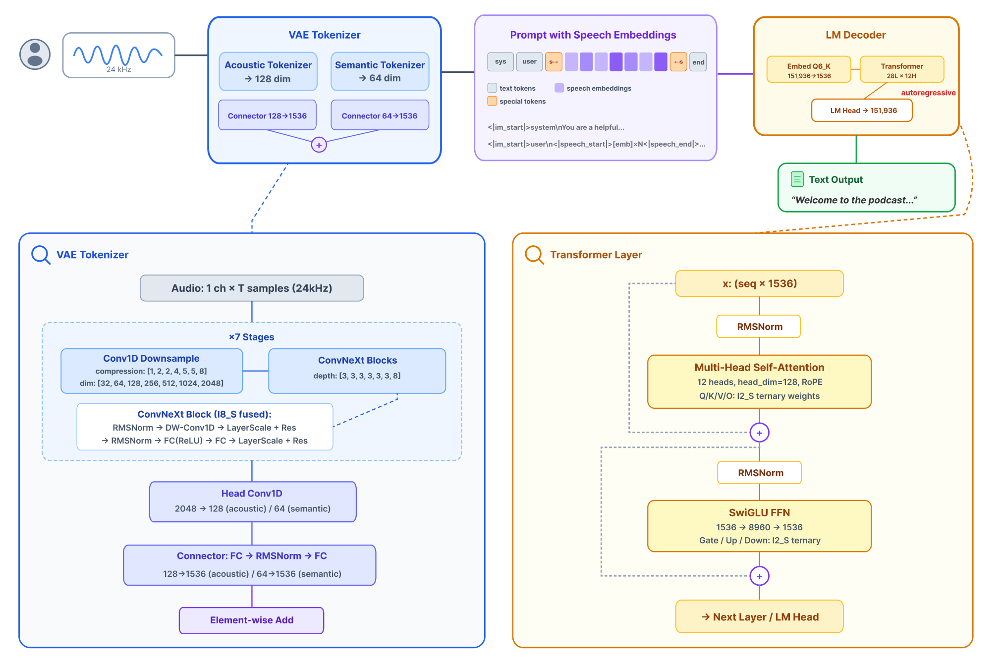
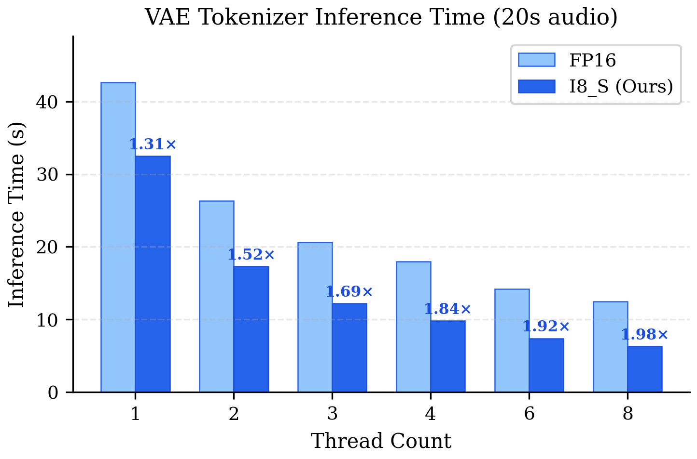
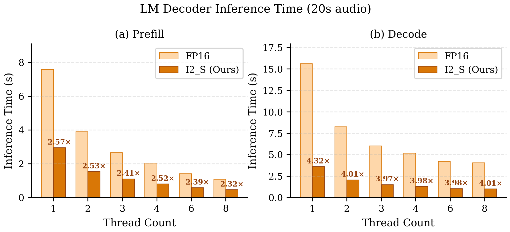
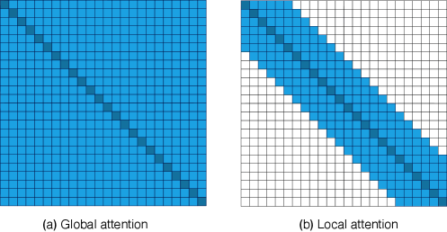
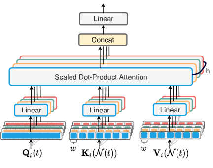
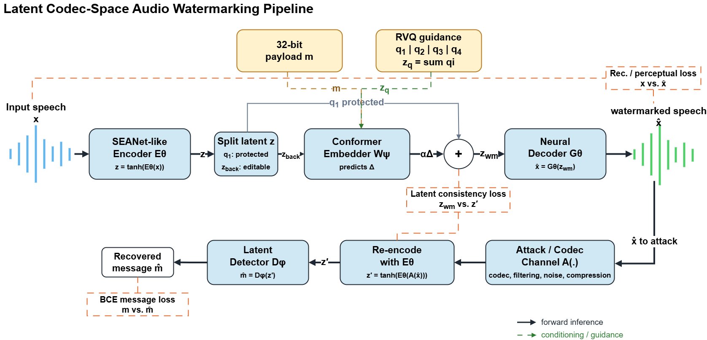

# 🚩 (2026-07-25) Scholar Inbox 추천 논문 

# 📚 Faster IndexTTS-2: Accelerating and Streaming Autoregressive Zero-Shot Text-to-Speech Synthesis on GPUs

🚀 URL: https://arxiv.org/html/2607.21042

## 🌏 Abstract (원문)
Autoregressive text-to-speech models achieve strong naturalness but suffer from slow inference due to sequential token generation, limiting their deployment in production applications that require low latency. IndexTTS-2 is a state-of-the-art autoregressive TTS model consisting of a GPT, a flow-matching Diffusion Transformer, and a vocoder. Despite its high synthesis quality, its inference speed barely reaches real-time without streaming or batching support. We present Faster IndexTTS-2, which accelerates all neural network components of IndexTTS-2 for production deployment on GPUs using NVIDIA TensorRT and TensorRT-LLM. Faster IndexTTS-2 also enables streaming synthesis for latency-sensitive interactive applications, and batched inference across all components to maximize GPU utilization. Experiments on the Seed-TTS benchmark for both English and Chinese demonstrate up to 5.0×speedup on the autoregressive GPT and 3.6×end-to-end, with minimal degradation in word error rate, speaker similarity, and naturalness. Our methodology provides a practical reference for efficiently accelerating similar autoregressive speech models on GPUs.111Audio samples:https://faster-indextts-2.github.io
## 🌏 Abstract (번역)
자기회귀 텍스트-음성 변환(TTS) 모델은 뛰어난 자연스러움을 달성하지만, 순차적인 토큰 생성으로 인해 추론 속도가 느려 낮은 지연 시간을 요구하는 프로덕션 애플리케이션 배포에 한계가 있습니다. IndexTTS-2는 GPT, 플로우 매칭 확산 트랜스포머, 보코더로 구성된 최첨단 자기회귀 TTS 모델입니다. 높은 합성 품질에도 불구하고, 스트리밍 또는 배치 지원 없이는 추론 속도가 실시간에 거의 미치지 못합니다. 본 논문에서는 NVIDIA TensorRT 및 TensorRT-LLM을 사용하여 IndexTTS-2의 모든 신경망 구성 요소를 GPU에서 프로덕션 배포를 위해 가속화하는 Faster IndexTTS-2를 소개합니다. Faster IndexTTS-2는 또한 지연 시간에 민감한 대화형 애플리케이션을 위한 스트리밍 합성과 GPU 활용을 극대화하기 위한 모든 구성 요소에 걸친 배치 추론을 가능하게 합니다. 영어 및 중국어 Seed-TTS 벤치마크에 대한 실험 결과, 자기회귀 GPT에서 최대 5.0배, 엔드투엔드에서 3.6배의 속도 향상을 보였으며, 단어 오류율, 화자 유사성 및 자연스러움의 저하는 최소화되었습니다. 우리의 방법론은 GPU에서 유사한 자기회귀 음성 모델을 효율적으로 가속화하기 위한 실용적인 참고 자료를 제공합니다.

## 🔍 Methods & Results
- IndexTTS-2는 텍스트-의미(GPT), 의미-멜(CFM 기반 DiT), 보코더(BigVGAN)의 세 가지 핵심 모듈로 구성된 캐스케이드 자기회귀 제로샷 TTS 모델이다.
- Faster IndexTTS-2는 NVIDIA TensorRT 및 TensorRT-LLM을 사용하여 IndexTTS-2의 모든 신경망 구성 요소를 GPU에서 가속화한다.
- 대부분의 구성 요소는 PyTorch-ONNX-TensorRT 워크플로우를 통해 변환되며, GPT는 TensorRT-LLM으로 가속화된다.
- Faster IndexTTS-2는 스트리밍 합성 및 가변 길이 패딩 및 마스킹을 통한 모든 단계에서의 배치 추론을 지원하여 단일 GPU에서 여러 발화의 동시 합성을 가능하게 한다.
- TensorRT-LLM의 프롬프트 튜닝 메커니즘을 활용하여 화자 잠재 변수, 감정 임베딩, 속도 임베딩과 같은 컨디셔닝 신호를 주입한다.
- IndexTTS-2의 GPT를 위해 텍스트 및 코덱 임베딩 테이블을 단일 테이블로 병합하고, 사용자 정의 위치 ID를 구성하며, 다운스트림 DiT를 위한 단계별 은닉 상태 출력을 지원하도록 TensorRT-LLM을 수정했다.
- TTFA(첫 번째 청크 지연 시간)를 줄이기 위해 청크 스트리밍 합성을 지원하며, 충분한 토큰이 축적되면 즉시 디코딩하고, 인접 청크는 Hann 윈도우 교차 페이딩으로 부드럽게 블렌딩된다.
- 배치 스트리밍도 지원되어 GPT가 여러 발화에 대한 코덱 토큰 배치를 생성하고, 이 코덱 청크들이 배치로 파형 청크로 변환된다.
- 영어 및 중국어 Seed-TTS 벤치마크 실험에서 자기회귀 GPT에서 최대 5.0배, 엔드투엔드에서 3.6배의 속도 향상을 달성했으며, 단어 오류율, 화자 유사성 및 자연스러움의 저하는 최소화되었다.

## 🖼 Figures

*Figure 1:Overview of Faster IndexTTS-2.*

*Figure 2:Streaming synthesis quality and latency of Faster IndexTTS-2 in FP16 across chunk sizes and overlap sizes on the Seed-TTS test sets.*

---
**Usage Info**: 2807 tokens used.
**Generated at**: 2026-07-25 14:59:57

---

# 📚 Designed Vocalizations Dataset: Sound-Designed Human and Animal Voices for Non-human Voice Conversion

🚀 URL: https://arxiv.org/html/2607.20951

## 🌏 Abstract (원문)
Advances in AI-based voice conversion have enabled a wide range of media applications, including films, audiobooks, and games. However, most research and public benchmarks still focus on natural human speech, leaving designed vocalizations, such as monster growls and robotic voices, underexplored, partly due to the lack of publicly available resources. To address this gap, we introduce the Designed Vocalizations Dataset, constructed by curating diverse raw vocal sources, including speech and animal vocalizations, and applying professional vocal effects processing to produce corresponding effect-modified variants. We further provide a standardized test set with explicit seen/unseen splits over source timbre groups and preset styles to assess generalization under controlled conditions. Finally, we report baseline benchmark results to support reproducible evaluation and future research. The dataset and demo samples are available online.111https://ncai-official.github.io/speech/publications/designed-vocalizations-dataset/
## 🌏 Abstract (번역)
AI 기반 음성 변환의 발전은 영화, 오디오북, 게임을 포함한 광범위한 미디어 애플리케이션을 가능하게 했습니다. 그러나 대부분의 연구와 공개 벤치마크는 여전히 자연스러운 사람의 음성에 초점을 맞추고 있으며, 괴물 울음소리나 로봇 음성과 같은 디자인된 발성은 공개적으로 사용 가능한 리소스 부족으로 인해 충분히 탐구되지 않고 있습니다. 이러한 격차를 해소하기 위해 우리는 다양한 원본 발성 소스(음성 및 동물 발성 포함)를 선별하고 전문적인 보컬 효과 처리를 적용하여 해당 효과 변형을 생성함으로써 '디자인된 발성 데이터셋(Designed Vocalizations Dataset)'을 소개합니다. 또한, 통제된 조건에서 일반화 능력을 평가하기 위해 소스 음색 그룹과 사전 설정 스타일 전반에 걸쳐 명시적인 '본 것/보지 못한 것(seen/unseen)' 분할을 포함하는 표준화된 테스트 세트를 제공합니다. 마지막으로, 재현 가능한 평가와 향후 연구를 지원하기 위한 기준 벤치마크 결과를 보고합니다. 데이터셋과 데모 샘플은 온라인에서 이용 가능합니다.

## 🔍 Methods & Results
- AI 기반 음성 변환 연구의 미개척 분야인 디자인된 발성(괴물 울음소리, 로봇 음성 등)을 위한 'Designed Vocalizations Dataset'을 구축했습니다.
- 데이터셋은 음성 및 동물 발성을 포함한 다양한 원본 발성 소스에 전문적인 보컬 효과 처리를 적용하여 해당 효과 변형을 생성했습니다.
- 주요 처리 도구는 Dehumaniser 2이며, 일부 사내 제작 프리셋에는 Cubase를 통한 후처리도 포함되었습니다.
- 데이터셋은 47개의 프리셋(30개 내장, 17개 사내 제작)을 사용하여 생성되었으며, Delay Pitch Shifting, Flanger/Chorus, Granular, Noise Generator, Pitch Shifting, Ring Modulator, Spectral Shifting 등의 핵심 효과 모듈이 활용되었습니다.
- 훈련 세트는 비병렬 형식의 원본 및 디자인된 오디오(총 226,160개의 디자인된 발성)로 구성되며, 테스트 세트는 정량적 평가를 위한 정렬된 (소스, 참조) 쌍(총 5,640개 샘플)을 제공합니다.
- 테스트 세트는 소스 음색 그룹(본 것/보지 못한 것)과 프리셋 스타일(본 것/보지 못한 것)에 대한 명시적인 분할을 포함하여 다양한 일반화 조건에서 평가를 가능하게 합니다.
- 원본 오디오는 음성, 감탄사, 동물 소리, 보컬 모방의 네 가지 범주로 구성되며, 훈련 및 테스트 세트에서 대표적인 분포를 유지합니다.
- 재현 가능한 평가 및 향후 연구를 지원하기 위한 기준 벤치마크 결과가 보고되었습니다.

## 🖼 Figures

*Figure 1:Representative audio effect chain structures for preset-specific DSP operators 
𝐺
𝑝
. Each operator maps a raw vocal source 
𝑥
raw
 to a designed vocalization 
𝑥
(
𝑝
)
 using selected effect modules 
ℳ
𝑝
 connected in serial, parallel, or hybrid forms.*

*Figure 2:Source category distribution of train and test sets.*

![Figure 3:Effect usage distribution across seen and unseen preset groups. Top: seven Dehumaniser [dehumaniser] base effects; bottom: six additional effects in in-house-designed presets.](../images/2026-07-25/2607.20951/2607.20951_fig2.png)
*Figure 3:Effect usage distribution across seen and unseen preset groups. Top: seven Dehumaniser [dehumaniser] base effects; bottom: six additional effects in in-house-designed presets.*

---
**Usage Info**: 5580 tokens used.
**Generated at**: 2026-07-25 15:00:10

---

# 📚 VibeVoice-ASR-BitNet Technical Report

🚀 URL: https://arxiv.org/html/2607.21075

## 🌏 Abstract (원문)
We present VibeVoice-ASR-BitNet, a compressed variant of VibeVoice-ASR optimized for real-time inference on edge CPUs. We apply heterogeneous quantization tailored to the computational characteristics of each stage: the VAE acoustic tokenizer uses full-pipeline INT8 quantization (I8_S) with kernel fusion and SIMD optimization, while the autoregressive language model adopts BitNet-style ternary weights (I2_S). To preserve accuracy under aggressive compression, we employ a progressive quantization-aware training strategy. For inference, we implement custom SIMD kernels and fused operators within the ggml framework targeting both ARM and x86 platforms, achieving real-time recognition with RTF<1 using as few as 3 CPU threads. VibeVoice-ASR-BitNet is 1.6–2.3× faster than Whisper.cpp at comparable model sizes (∼1.6 GB), with only modest accuracy degradation compared to the FP16 baseline.
## 🌏 Abstract (번역)
우리는 엣지 CPU에서 실시간 추론에 최적화된 VibeVoice-ASR의 압축 변형인 VibeVoice-ASR-BitNet을 소개합니다. 각 단계의 계산 특성에 맞춰 이기종 양자화를 적용했습니다: VAE 음향 토크나이저는 커널 퓨전 및 SIMD 최적화를 통해 전체 파이프라인 INT8 양자화(I8_S)를 사용하고, 자기회귀 언어 모델은 BitNet 스타일의 삼진 가중치(I2_S)를 채택합니다. 공격적인 압축 하에서도 정확도를 유지하기 위해 점진적 양자화 인식 훈련 전략을 사용합니다. 추론을 위해 ARM 및 x86 플랫폼을 대상으로 하는 ggml 프레임워크 내에서 사용자 정의 SIMD 커널과 융합된 연산자를 구현하여, 단 3개의 CPU 스레드를 사용하여 RTF<1로 실시간 인식을 달성합니다. VibeVoice-ASR-BitNet은 유사한 모델 크기(약 1.6GB)에서 Whisper.cpp보다 1.6~2.3배 빠르며, FP16 기준선에 비해 정확도 저하가 미미합니다.

## 🔍 Methods & Results
- VibeVoice-ASR-BitNet은 VibeVoice-ASR 아키텍처를 계승하며, 엣지 CPU 배포를 위해 Qwen2.5-7B 디코더를 Qwen2.5-1.5B로 대체하여 파라미터 수를 4.7배 줄였고, 이는 ASR 작업에서 1-4%의 절대 WER 증가로 미미한 정확도 저하만을 유발했다.
- VAE 음향 토크나이저는 활성화 데이터가 지배적인 특성(Act/W 비율 최대 50,000배)을 고려하여 전체 파이프라인 INT8 양자화(I8_S)를 적용하고, 자기회귀 언어 모델 디코더는 가중치가 지배적인 특성을 고려하여 BitNet 스타일의 삼진 가중치(I2_S)를 채택하는 이기종 양자화 전략을 사용했다. 임베딩 및 LM 헤드 레이어는 Q6_K(6비트)로 양자화되었다.
- 공격적인 압축 하에서 정확도를 보존하기 위해 블렌딩 파라미터 α를 0에서 1로 선형적으로 증가시키는 점진적 양자화 인식 훈련(QAT) 전략을 사용했으며, 이는 직접 QAT의 훈련 불안정성 문제를 해결했다. VAE 토크나이저의 GELU 활성화 함수는 INT8 연산 효율성을 위해 ReLU로 대체되었다.
- ggml 프레임워크 내에서 ARM 및 x86 플랫폼을 위한 사용자 정의 SIMD 커널과 융합된 연산자를 구현했다. VAE 토크나이저를 위해 im2col_asym, mul_mat_add_relu 등 여러 연산자를 융합하여 중간 메모리 트래픽을 줄였다.
- VibeVoice-ASR-BitNet은 단 3개의 CPU 스레드를 사용하여 RTF<1로 실시간 음성 인식을 달성했으며, 유사한 모델 크기(약 1.6GB)에서 Whisper.cpp보다 1.6~2.3배 빠른 속도를 보였고, FP16 기준선 대비 정확도 저하는 미미했다.

## 🖼 Figures

*Figure 1:Overview of the VibeVoice-ASR-BitNet system: heterogeneous quantization enables real-time CPU inference with 
2.9
×
 model compression relative to FP16.*

*Figure 2:Model architecture of VibeVoice-ASR-BitNet. Left: VAE tokenizer, 7-stage ConvNeXt with I8_S fused operators. Right: LM decoder, 28-layer Transformer with I2_S ternary weights.*

*Figure 3:Training loss comparison: direct QAT fails to converge (loss 
≈
3.3
), while progressive QAT converges to 
≈
0.91
 in three stages (GELU
→
ReLU finetune, 
𝛼
: 0
→
1 blending, 
𝛼
=
1
 full quantization).*

*Figure 4:I8_S and I2_S GEMM kernel: N
×
1 parallel vec_dot with SIMD multiply-add instructions. Both share the same maddubs 
→
 madd 
→
 hsum accumulation pipeline; I8_S uses the sign trick for signed multiplication, while I2_S adds an online unpack stage to convert 2-bit packed weights to INT8 before entering the same pipeline.*

*Figure 5:VAE tokenizer inference time (s) vs. thread count (20 s audio). Numbers above I8_S bars indicate speedup over FP16.*

*Figure 6:LM decoder inference time (s) vs. thread count (20 s audio). (a) Prefill stage. (b) Decode stage. Numbers above I2_S bars indicate speedup over FP16.*

---
**Usage Info**: 4770 tokens used.
**Generated at**: 2026-07-25 15:00:24

---

# 📚 TF-MossFormer: Integrating Convolution Gated Local-Global Attentions for Enhanced Time-Frequency Domain Monaural Speech Separation

🚀 URL: https://arxiv.org/html/2607.21128

## 🌏 Abstract (원문)
Transformers with global attention capture long-range dependencies but can miss the fine-grained local continuity crucial for speech separation. We propose TF-MossFormer, a time–frequency transformer that combines local and global attention to jointly model short- and long-range contexts for monaural speech separation. At its core is a content-aware sliding-window attention mechanism that dynamically adapts receptive fields for stronger local interactions, avoiding the rigidity of static convolutions. Unlike time-domain chunk-based methods, TF-MossFormer leverages the 2D spectrogram to model structure along both time and frequency axes. Convolutional gating between attention layers further improves feature selection and information flow. TF-MossFormer achieves SI-SDRi of 22.6, 24.0, and 24.4 dB on WSJ0-2Mix with 5.9M, 16.9M, and 25.4M parameters, respectively, outperforming prior approaches.
## 🌏 Abstract (번역)
전역 어텐션을 사용하는 트랜스포머는 장거리 의존성을 포착하지만, 음성 분리에 중요한 미세한 지역적 연속성을 놓칠 수 있습니다. 본 논문에서는 단일 채널 음성 분리를 위해 단거리 및 장거리 컨텍스트를 공동으로 모델링하기 위해 지역 및 전역 어텐션을 결합한 시간-주파수 트랜스포머인 TF-MossFormer를 제안합니다. 핵심은 정적 컨볼루션의 경직성을 피하고 더 강력한 지역 상호작용을 위해 수용 필드를 동적으로 조정하는 콘텐츠 인식 슬라이딩 윈도우 어텐션 메커니즘입니다. 시간 도메인 청크 기반 방법과 달리, TF-MossFormer는 2D 스펙트로그램을 활용하여 시간 및 주파수 축을 따라 구조를 모델링합니다. 어텐션 레이어 간의 컨볼루션 게이팅은 특징 선택 및 정보 흐름을 더욱 개선합니다. TF-MossFormer는 5.9M, 16.9M, 25.4M 파라미터로 WSJ0-2Mix에서 각각 22.6, 24.0, 24.4 dB의 SI-SDRi를 달성하여 이전 접근 방식보다 뛰어난 성능을 보였습니다.

## 🔍 Methods & Results
- TF-MossFormer는 혼합된 음성 신호에서 개별 음원을 추정하는 것을 목표로 하며, 인코더-분리자-디코더 아키텍처를 따르는 이중 경로 시간-주파수 분리 패러다임을 채택합니다.
- 모델은 STFT(단시간 푸리에 변환) 도메인에서 작동하며, 복소 스펙트럼의 실수 및 허수 구성 요소를 직접 예측합니다.
- 인코더는 3x3 2D 컨볼루션 레이어와 전역 레이어 정규화(gLN)를 사용하여 입력 STFT를 D-차원 잠재 임베딩으로 변환합니다.
- 핵심 분리자는 B개의 TF-MossFormer 블록으로 구성되며, 각 블록은 주파수 모델링 모듈과 시간 모델링 모듈을 포함하여 스펙트럼 및 시간적 의존성을 교대로 모델링합니다.
- TF-MossFormer 블록은 Conv-SwiGLU, 잔여 연결, RMSGroupNorm, 그리고 핵심인 지역 및 전역 멀티 헤드 셀프 어텐션(MHSA) 모듈로 구성됩니다.
- 지역 어텐션은 콘텐츠 인식 슬라이딩 윈도우 어텐션 메커니즘을 사용하여 고정된 윈도우 크기 내에서 단거리 시간-주파수 패턴을 포착하며, 복잡도는 O(TwD)입니다.
- 전역 어텐션은 표준 MHSA 메커니즘을 사용하여 시퀀스의 모든 프레임이 다른 모든 프레임에 어텐션하며, 복잡도는 O(T^2D)입니다.
- 어텐션 레이어 사이에 Conv1D 레이어와 Swish 활성화로 구성된 컨볼루션 게이트를 적용하여 특징 선택 및 정보 흐름을 개선합니다.
- Conv-SwiGLU 블록은 어텐션 레이어 전후에 배치되어 전역 특징 혼합을 효율적으로 개선하며, RMSGroupNorm, 병렬 1D 컨볼루션, Swish-게이트 요소별 변조를 포함합니다.
- WSJ0-2Mix 데이터셋에서 5.9M, 16.9M, 25.4M 파라미터 모델에 대해 각각 22.6, 24.0, 24.4 dB의 SI-SDRi를 달성하여 이전 접근 방식보다 우수한 성능을 보였습니다.

## 🖼 Figures

*Fig. 1:Illustration of the global and local attention patterns in TF-MossFormer. (a) Global attention: captures long-range dependencies across the entire spectrogram, (b) Local attention: focuses on fine-grained continuity within sliding windows.*

*Fig. 2:Overview of TF-MossFormer. (a) Model flowchart with STFT/ISTFT, Conv2D/Deconv2D, gLN, and 
𝐵
 stacked TF-MossFormer blocks for interleaved time–frequency modeling. (b) Configuration of the frequency modeling block (the temporal block adopts the same structure). (c) Three variants (V1–V3) of the gated local–global MHSA module. 
⊕
: element-wise addition, 
⊗
: element-wise multiplication.*

*Fig. 3:An overview of the local attention module, which performs multi-head self-attention using sliding windows. Each attention head operates on a fixed-size window of the input sequence.*

---
**Usage Info**: 5132 tokens used.
**Generated at**: 2026-07-25 15:00:39

---

# 📚 Investigating Codec-Internal Latent Audio Watermarking for Neural Codec Robustness

🚀 URL: https://arxiv.org/html/2607.21132

## 🌏 Abstract (원문)
Neural audio codecs are challenging transformations for audio watermarking because they re-encode, quantize, and resynthesize speech. This paper investigates continuous latent-space watermarking for codec robustness. Instead of adding a watermark only to the waveform or spectrogram, we embed a 32-bit message into the continuous latent representation of a codec-like speech autoencoder. The pipeline uses a SEANet-style encoder-decoder, a Conformer-based message embedder, RVQ-guided latent decomposition, and a latent-domain detector trained under signal-processing and neural-codec transformations. Rather than proposing a final universal watermarking baseline, we characterize the trade-offs that appear when the watermark carrier is moved before neural decoding. On 48 kHz speech, EnCodec-aware training improves EnCodec-24k bit accuracy from 78.8% to 95.6% and 97.1%, while PESQ decreases from 3.727 to 3.514 and 3.427.
## 🌏 Abstract (번역)
신경망 오디오 코덱은 음성을 재인코딩, 양자화 및 재합성하기 때문에 오디오 워터마킹에 있어 어려운 변환입니다. 본 논문은 코덱 견고성을 위한 연속 잠재 공간 워터마킹을 연구합니다. 파형 또는 스펙트로그램에만 워터마크를 추가하는 대신, 코덱과 유사한 음성 오토인코더의 연속 잠재 표현에 32비트 메시지를 삽입합니다. 이 파이프라인은 SEANet 스타일의 인코더-디코더, Conformer 기반 메시지 임베더, RVQ(Residual Vector Quantization) 유도 잠재 분해, 그리고 신호 처리 및 신경망 코덱 변환 하에 훈련된 잠재 도메인 탐지기를 사용합니다. 최종적인 범용 워터마킹 기준선을 제안하기보다는, 워터마크 캐리어가 신경망 디코딩 전에 이동될 때 나타나는 트레이드오프를 특성화합니다. 48kHz 음성에서 EnCodec 인식 훈련은 EnCodec-24k 비트 정확도를 78.8%에서 95.6% 및 97.1%로 향상시키는 반면, PESQ는 3.727에서 3.514 및 3.427로 감소합니다.

## 🔍 Methods & Results
- 제안된 파이프라인은 SEANet 스타일의 인코더-디코더, Conformer 기반 메시지 임베더, RVQ(Residual Vector Quantization) 유도 잠재 분해, 그리고 잠재 도메인 탐지기를 사용하여 코덱 견고성을 위한 연속 잠재 공간 워터마킹을 수행한다.
- 워터마크는 코덱과 유사한 음성 오토인코더의 연속 잠재 표현(z)에 32비트 이진 페이로드(m)로 삽입되며, 메시지 조건부 임베더가 예측한 유한 잔차(Δ)를 z에 가산적으로 주입하여 워터마크된 잠재 표현(z_wm)을 생성한다.
- RVQ는 잠재 표현의 z_front (지각적으로 중요한 보호된 부분)와 z_back을 정의하는 안내 및 분해 메커니즘으로 사용되며, 워터마크는 z_front로부터 투영되어 주입될 수 있다. RVQ는 최종 모델의 필수 재구성 병목으로 사용되지 않는다.
- 탐지기는 공격받은 파형(x_hat)을 재인코딩한 후(E_theta(A(x_hat))) 잠재 공간에서 페이로드를 예측하며, 비트 정확도(1-BER)를 성능 지표로 사용한다.
- 훈련 목표는 다중 스케일 멜-스펙트로그램 손실, MRSTFT 손실, 시간-주파수 음량 비율 손실, 적대적 손실 등을 포함한 지각적 재구성 품질과 메시지 복구 정확도(이진 교차 엔트로피)의 균형을 맞춘다.
- EnCodec-24k 인식 훈련(EnCodec-aware training)은 EnCodec-24k에 대한 노출을 증가시켜 코덱 견고성을 향상시키며, 이는 스트레이트-스루 추정기(straight-through estimator)를 사용하여 시뮬레이션된다.
- 실험 결과, 48kHz 음성에서 EnCodec-24k 비트 정확도는 EnCodec 인식 훈련을 통해 78.8%에서 95.6% 및 97.1%로 향상되었으나, PESQ(지각 품질)는 3.727에서 3.514 및 3.427로 감소하여 워터마크 강도와 지각 품질 간의 트레이드오프를 보여준다.

## 🖼 Figures

*Figure 1:Overview of the proposed continuous latent-space audio watermarking pipeline.*

---
**Usage Info**: 5789 tokens used.
**Generated at**: 2026-07-25 15:00:54

---

