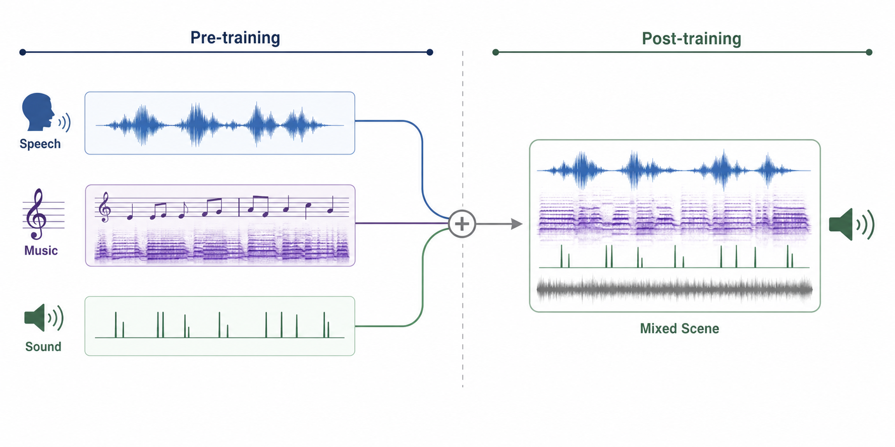
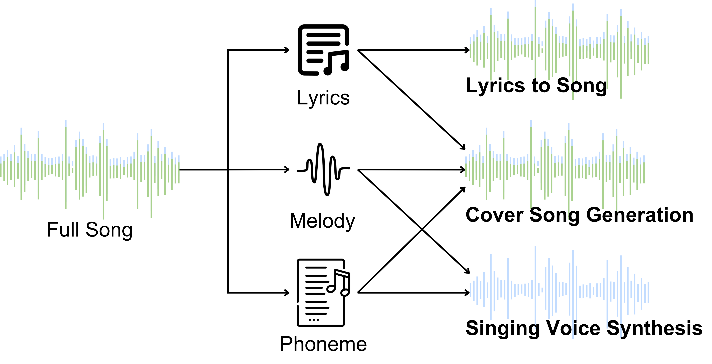
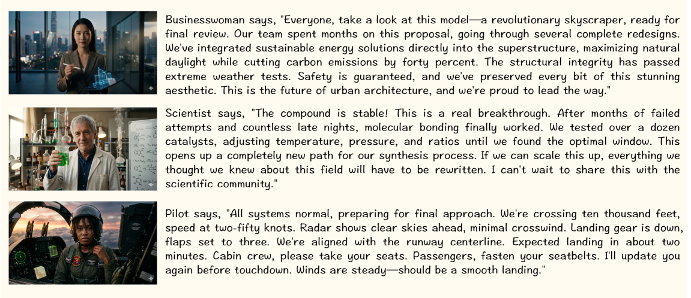
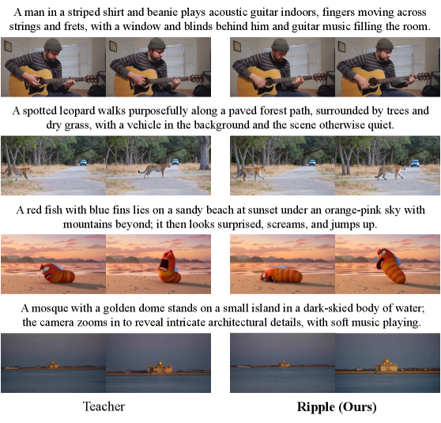
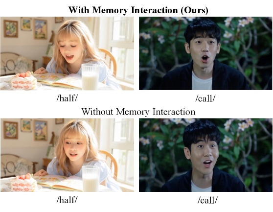
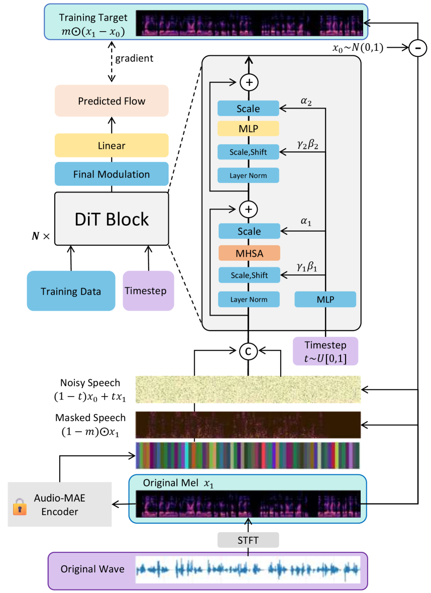
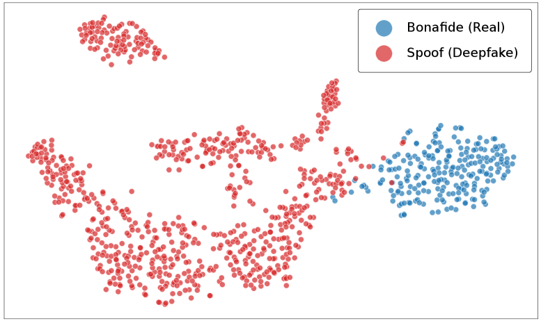

# 🚩 (2026-07-30) Scholar Inbox 추천 논문 

# 📚 Zero-Shot Face-to-Speech Synthesis via Latent Space Adaptation of a Style-Diffusion TTS Model

🚀 URL: https://arxiv.org/html/2607.26742

## 🌏 Abstract (원문)
Zero-shot text-to-speech (TTS) clones a voice from a short audio prompt, but this reliance on reference audio is a barrier when only visual information is available, e.g. for historical figures or video-game characters. In this work, we propose a Face-to-Speech (F2S) framework that predicts a plausible voice from a static facial image. A lightweight Face Adapter, together with soft-tuning of the face encoder's upper blocks, aligns face-recognition features with the style space of a frozen StyleTTS 2 model, kept frozen during training. We evaluate on held-out identities from LRS3, a large-scale audiovisual corpus of English TED-talk videos. The synthesized speech is highly natural (UTMOS 3.7-4.0, matching or exceeding the 3.61 of ground truth), face-to-voice retrieval is consistently above chance, and the generated voice is consistent with the target speaker. Without any retraining, an English-trained adapter also produces fluent Spanish speech, indicating that the face-to-style mapping is largely language-agnostic.
## 🌏 Abstract (번역)
제로샷 텍스트-음성 변환(TTS)은 짧은 오디오 프롬프트에서 음성을 복제하지만, 참조 오디오에 대한 이러한 의존성은 역사적 인물이나 비디오 게임 캐릭터와 같이 시각 정보만 사용 가능한 경우 장벽이 됩니다. 본 연구에서는 정적인 얼굴 이미지로부터 그럴듯한 음성을 예측하는 Face-to-Speech (F2S) 프레임워크를 제안합니다. 경량 Face Adapter는 얼굴 인코더의 상위 블록에 대한 소프트 튜닝과 함께, 얼굴 인식 특징을 학습 중 고정된 StyleTTS 2 모델의 스타일 공간과 정렬합니다. 우리는 영어 TED 강연 비디오의 대규모 시청각 코퍼스인 LRS3에서 보류된(held-out) 신원에 대해 평가합니다. 합성된 음성은 매우 자연스러우며(UTMOS 3.7-4.0으로, 실제 음성 3.61과 일치하거나 초과), 얼굴-음성 검색은 일관되게 우연보다 높았고, 생성된 음성은 대상 화자와 일치했습니다. 어떠한 재학습 없이도, 영어로 학습된 어댑터는 유창한 스페인어 음성을 생성하여, 얼굴-스타일 매핑이 대부분 언어에 구애받지 않음을 보여줍니다.

## 🔍 Methods & Results
- Face-to-Speech (F2S) 프레임워크는 시각 백본(InceptionResnetV1), 학습 가능한 투영 모듈(Face Adapter), 그리고 고정된 음향 생성기(StyleTTS 2)로 구성됩니다.
- Face Adapter는 512차원 얼굴 임베딩을 StyleTTS 2의 128차원 스타일 공간으로 투영하는 MLP(약 1.7M 파라미터)입니다.
- 얼굴 인코더의 상위 블록(약 18.3M 파라미터)은 음성 관련 특성에 특화되도록 소프트 튜닝되며, 하위 계층은 고정됩니다.
- 모드 붕괴를 방지하고 독특한 음성 특성을 포착하기 위해 다중 항 손실 함수를 사용합니다: L_NCE (대조 학습), L_RKD (구조 보존), L_Var (붕괴 방지), L_Aux (인구 통계학적 기반).
- L_NCE는 CLIP 스타일의 대조 목표를 사용하여 동일 화자의 얼굴 및 음성 임베딩을 가깝게, 다른 화자의 임베딩을 멀리 당깁니다.
- L_RKD는 Huber 손실을 사용하여 투영된 얼굴 임베딩 쌍 간의 거리가 해당 오디오 임베딩 쌍 간의 거리와 일치하도록 음향 공간의 쌍별 기하학을 보존합니다.
- L_Var는 투영된 임베딩의 배치별 표준 편차를 오디오 임베딩의 표준 편차와 정렬하여 표현 축소를 명시적으로 억제합니다.
- L_Aux는 학습 중 의미론적 앵커 역할을 하는 성별 및 연령 예측을 위한 병렬 헤드를 포함합니다.
- 추론 시, StyleTTS 2 스타일 벡터가 음색(얼굴에서 공급)과 운율(확산 모델 또는 참조 오디오에서 샘플링) 구성 요소로 분리되어 음색과 운율을 분리합니다.
- 합성된 음성은 매우 자연스러웠으며(UTMOS 3.7-4.0, 실제 음성 3.61과 일치하거나 초과), 얼굴-음성 검색은 일관되게 우연보다 높은 성능을 보였습니다.
- 영어 학습된 어댑터는 재학습 없이 유창한 스페인어 음성을 생성하여, 얼굴-스타일 매핑이 언어에 구애받지 않음을 입증했습니다.

## 🖼 Figures
![Figure 1:Proposed Freeze-Align F2S architecture used during training. An InceptionResnetV1 backbone maps the input face to a 512-d embedding 
ℎ
𝑣
​
𝑖
​
𝑠
, which the trainable Face Adapter (MLP, 
512
→
1024
→
1024
→
128
) projects into the 128-d style space 
𝑧
𝑓
​
𝑎
​
𝑐
​
𝑒
. The frozen StyleTTS 2 style encoder provides the acoustic target 
𝑧
𝑎
​
𝑢
​
𝑑
​
𝑖
​
𝑜
. Training aligns the two modalities through the hybrid loss (InfoNCE, RKD, variance, and demographic auxiliary heads). The acoustic teacher is frozen; the Face Adapter is trainable and the upper blocks of the face encoder are soft-tuned.](../images/2026-07-30/2607.26742/2607.26742_fig0.png)
*Figure 1:Proposed Freeze-Align F2S architecture used during training. An InceptionResnetV1 backbone maps the input face to a 512-d embedding 
ℎ
𝑣
​
𝑖
​
𝑠
, which the trainable Face Adapter (MLP, 
512
→
1024
→
1024
→
128
) projects into the 128-d style space 
𝑧
𝑓
​
𝑎
​
𝑐
​
𝑒
. The frozen StyleTTS 2 style encoder provides the acoustic target 
𝑧
𝑎
​
𝑢
​
𝑑
​
𝑖
​
𝑜
. Training aligns the two modalities through the hybrid loss (InfoNCE, RKD, variance, and demographic auxiliary heads). The acoustic teacher is frozen; the Face Adapter is trainable and the upper blocks of the face encoder are soft-tuned.*

---
**Usage Info**: 3689 tokens used.
**Generated at**: 2026-07-30 16:09:11

---

# 📚 Qwen-Audio-3.0-Gen-Preview Technical Report

🚀 URL: https://arxiv.org/html/2607.27011

## 🌏 Abstract (원문)
Existing single-domain and multi-task audio systems remain limited in directly organizing speech, music, sound effects, ambience, and multiple roles into long-form temporal scenes. We presentQwen-Audio-3.0-Gen-Preview, a unified non-autoregressive framework that uses a Diffusion Transformer (DiT) and a shared variational autoencoder (VAE) to generate the complete mixed waveform. Prompt enhancement converts free-form requests into structured temporal records that are rendered as textual conditions, while a two-stage data curriculum and semantic conditional views train the proposed model to use these conditions across domains. A shared continuous VAE compresses 48
kHz stereo waveforms into 25
Hz latent sequences and incorporates semantic supervision, providing one representation for speech, music, sound effects, and their mixtures. On Seed-TTS-Eval, speaker similarity is the proposed model’s clearest strength across all three subsets, and on the multi-speaker benchmark, the proposed model shows higher cross-turn consistency than Seed-Audio-1.0 in both languages. On AudioCaps, its advantages are concentrated in evaluations using large audio-language models and AudioBox. Relative to Seed-Audio-1.0, it achieves stronger temporal localization. Using approximately 0.1×
the music data of a dedicated in-house model, the proposed model remains close across all seven SongBench components and leads in three while retaining speech and general-audio capabilities. These results demonstrate the potential of unified generation for temporally structured, multi-domain audio.
## 🌏 Abstract (번역)
기존의 단일 도메인 및 다중 작업 오디오 시스템은 음성, 음악, 음향 효과, 주변 소리 및 여러 역할을 장문의 시간적 장면으로 직접 구성하는 데 한계가 있었습니다. 본 논문에서는 완전한 혼합 파형을 생성하기 위해 Diffusion Transformer (DiT)와 공유 변이형 오토인코더 (VAE)를 사용하는 통합 비자기회귀 프레임워크인 Qwen-Audio-3.0-Gen-Preview를 소개합니다. 프롬프트 강화는 자유 형식 요청을 구조화된 시간 기록으로 변환하여 텍스트 조건으로 렌더링하며, 2단계 데이터 커리큘럼과 의미론적 조건부 뷰는 제안된 모델이 이러한 조건을 여러 도메인에 걸쳐 사용하도록 훈련시킵니다. 공유 연속 VAE는 48kHz 스테레오 파형을 25Hz 잠재 시퀀스로 압축하고 의미론적 감독을 통합하여 음성, 음악, 음향 효과 및 이들의 혼합에 대한 단일 표현을 제공합니다. Seed-TTS-Eval에서 화자 유사성은 세 가지 하위 집합 모두에서 제안된 모델의 가장 분명한 강점이며, 다중 화자 벤치마크에서는 Seed-Audio-1.0보다 두 언어 모두에서 더 높은 교대 일관성을 보입니다. AudioCaps에서는 대규모 오디오-언어 모델 및 AudioBox를 사용한 평가에서 그 장점이 집중됩니다. Seed-Audio-1.0에 비해 더 강력한 시간적 지역화를 달성합니다. 전용 사내 모델의 약 0.1배의 음악 데이터를 사용하여, 제안된 모델은 7가지 SongBench 구성 요소 모두에서 근접한 성능을 유지하며 3가지에서는 선두를 차지하는 동시에 음성 및 일반 오디오 기능을 유지합니다. 이러한 결과는 시간적으로 구조화된 다중 도메인 오디오의 통합 생성 가능성을 보여줍니다.

## 🔍 Methods & Results
- Qwen-Audio-3.0-Gen-Preview는 음성, 음악, 음향 효과 및 이들의 혼합을 위한 통합 비자기회귀 생성 프레임워크이다.
- Diffusion Transformer (DiT)와 공유 변이형 오토인코더 (VAE)를 사용하여 완전한 혼합 파형을 생성하며, 캡션 및 텍스트 토큰이 DiT를 조건화하고 VAE는 DiT가 생성한 잠재 시퀀스를 파형으로 디코딩한다.
- 모든 지원 오디오 도메인(음성, 음악, 음향 효과)은 작업별 생성 브랜치 없이 동일한 조건화 인터페이스, DiT, 잠재 공간 및 VAE를 공유한다.
- 프롬프트 강화는 자유 형식 요청을 구조화된 시간 기록으로 변환하여 텍스트 조건으로 활용하며, 2단계 데이터 커리큘럼과 의미론적 조건부 뷰를 통해 모델이 여러 도메인에 걸쳐 조건을 사용하도록 훈련한다.
- 공유 연속 VAE는 48kHz 스테레오 파형을 25Hz 잠재 시퀀스로 압축하고 의미론적 감독을 통합하여 음성, 음악, 음향 효과 및 이들의 혼합에 대한 단일 표현을 제공한다.
- 훈련은 2단계로 진행된다: 사전 훈련(기본 음향 품질 및 텍스트-오디오 대응 확립)과 풍부한 타임라인 감독 미세 조정(다중 캐릭터 대화, 주변 소리, 음악, 지역화된 이벤트 등 복합 장면 학습 및 단일 도메인 역량 유지).
- Seed-TTS-Eval에서 화자 유사성에서 가장 분명한 강점을 보였고, 다중 화자 벤치마크에서 Seed-Audio-1.0보다 높은 교대 일관성을 달성했다.
- AudioCaps에서는 대규모 오디오-언어 모델 및 AudioBox를 사용한 평가에서 우위를 보였으며, Seed-Audio-1.0 대비 더 강력한 시간적 지역화를 달성했다.
- 전용 음악 모델의 약 0.1배 음악 데이터만으로 SongBench 7가지 구성 요소 모두에서 근접한 성능을 유지하고 3가지에서 선두를 차지하며, 음성 및 일반 오디오 기능도 유지했다.

## 🖼 Figures

*Figure 1:Overview of the unified non-autoregressive audio generation system. Caption and text tokens jointly condition a DiT that transforms a sequence of noise latents into continuous VAE latents. The shared VAE decodes the resulting continuous latent sequence into the complete output waveform. The same generation path models speech, music, sound effects, and their complex combinations.*

*Figure 2:Overview of the two-stage data curriculum. Single-domain speech, music, and sound-effect supervision is first learned during pre-training, then combined during post-training to support coherent mixed-scene generation.*

*Figure 3:Multi-level music annotation pipeline. Full-mix features describe rhythmic, tonal, and structural organization; source-aware features describe vocal performance, linguistic content, and voice consistency; track-level representations provide symbolic event structure and complementary acoustic detail.*

---
**Usage Info**: 4601 tokens used.
**Generated at**: 2026-07-30 16:09:28

---

# 📚 MPEcho: A Melody and Phoneme-Aware Generative Framework for Controllable Cover Song Generation

🚀 URL: https://arxiv.org/html/2607.26698

## 🌏 Abstract (원문)
Cover song generation (CSG) should preserve the melodic and linguistic content of a reference song while recreating the remaining musical components. The state-of-the-art model SongEcho utilizesF0F_{0}sequences and voiced/unvoiced (V/UV) tags for conditioning; however, implicit linguistic information from V/UV tags cannot guarantee lyric accuracy, leading to a high phoneme error rate (PER). Inspired by singing voice synthesis (SVS), we propose MPEcho, which integrates a phoneme encoder and a length regulator (LR) into the SongEcho framework. By providing explicit phoneme-level conditioning and precise temporal boundaries, MPEcho significantly reduces PER. To enable this, we developed Phonsa, a Whisper-based automatic transcription model that provides high-precision phoneme-level annotations for singing voices, overcoming the scarcity of high-quality audio-phoneme pairs. Experimental results validate the effectiveness of Phonsa for alignment and MPEcho for end-to-end CSG.The audio samples, code and weights can be accessed fromhttps://lonian6.github.io/MPEcho.github.io/.
## 🌏 Abstract (번역)
커버곡 생성(CSG)은 참조곡의 멜로디 및 언어적 내용을 보존하면서 나머지 음악적 구성 요소를 재현해야 합니다. 최첨단 모델인 SongEcho는 F0 시퀀스와 유성음/무성음(V/UV) 태그를 컨디셔닝에 활용하지만, V/UV 태그의 암묵적인 언어 정보는 가사 정확도를 보장할 수 없어 높은 음소 오류율(PER)을 초래합니다. 가창 음성 합성(SVS)에서 영감을 받아, 우리는 SongEcho 프레임워크에 음소 인코더와 길이 조절기(LR)를 통합한 MPEcho를 제안합니다. 명시적인 음소 수준 컨디셔닝과 정밀한 시간적 경계를 제공함으로써 MPEcho는 PER을 크게 줄입니다. 이를 위해 우리는 고품질 오디오-음소 쌍의 부족을 극복하고 가창 음성에 대한 고정밀 음소 수준 주석을 제공하는 Whisper 기반 자동 전사 모델인 Phonsa를 개발했습니다. 실험 결과는 정렬을 위한 Phonsa의 효과와 종단 간 CSG를 위한 MPEcho의 효과를 검증합니다.오디오 샘플, 코드 및 가중치는 https://lonian6.github.io/MPEcho.github.io/에서 접근할 수 있습니다.

## 🔍 Methods & Results
- 기존 최첨단 커버곡 생성(CSG) 모델인 SongEcho는 F0 시퀀스와 유성음/무성음(V/UV) 태그를 사용하지만, V/UV 태그의 암묵적인 언어 정보로 인해 높은 음소 오류율(PER)이 발생합니다.
- 가창 음성 합성(SVS)에서 영감을 받아, SongEcho 프레임워크에 음소 인코더와 길이 조절기(LR)를 통합한 MPEcho 모델을 제안합니다.
- MPEcho는 명시적인 음소 수준 컨디셔닝과 정밀한 시간적 경계를 제공하여 음소 오류율(PER)을 크게 줄입니다.
- 고품질 오디오-음소 쌍의 부족 문제를 해결하기 위해, 가창 음성에 대한 고정밀 음소 수준 주석을 제공하는 Whisper 기반 자동 전사 모델인 Phonsa를 개발했습니다.
- 실험 결과는 정렬 작업에서 Phonsa의 효과와 종단 간 커버곡 생성(CSG)에서 MPEcho의 효과를 검증했습니다.

## 🖼 Figures

*Figure 1:Conceptual comparison of lyrics-to-song generation, cover song generation, and singing voice synthesis.*

*Figure 2: Architectural overview. (a) MPEcho incorporates structural components from ACE-Step (LTS backbone; purple) and SongEcho (melody conditioning; blue). Our contributions (green) introduce a phoneme encoder and length regulator for linguistic control. (b) The Phonsa transcription pipeline, providing the linguistic conditioning required for MPEcho.*

![Figure 3:Comparison of phoneme arrangement methods based on word-level and phoneme-level timestamps. (a) Word arrangement for the word Hi based on word-level timestamps. (b) The Jam-style [14] phoneme arrangement based on word-level timestamps, incorporating [V_F] (vocal filter) as a special filler token. (c) The proposed SVS-style phoneme arrangement based on phoneme-level timestamp derived from Phonsa and LR.](../images/2026-07-30/2607.26698/2607.26698_fig2.png)
*Figure 3:Comparison of phoneme arrangement methods based on word-level and phoneme-level timestamps. (a) Word arrangement for the word Hi based on word-level timestamps. (b) The Jam-style [14] phoneme arrangement based on word-level timestamps, incorporating [V_F] (vocal filter) as a special filler token. (c) The proposed SVS-style phoneme arrangement based on phoneme-level timestamp derived from Phonsa and LR.*

---
**Usage Info**: 1724 tokens used.
**Generated at**: 2026-07-30 16:09:35

---

# 📚 Ripple: Real-Time Streaming Audio-Video Generation With Cross-Modal Recurrent Memory

🚀 URL: https://arxiv.org/html/2607.26818

## 🌏 Abstract (원문)
Audio-video generative models achieve impressive quality but suffer from high latency, making them unsuitable for real-time applications. Although several streaming audio-video generation methods have been proposed, they remain costly and fail to support long-form generation. To address this, we proposeRipple, a real-time joint audio-video generation system with a cross-modal recurrent memory mechanism. To enable efficient streaming inference while preserving long-term context, Ripple combines a fixed-length sliding-window attention with modality-specific memory states that continuously summarize audio and video context. Cross-modal memory interaction is further introduced to enhance audio-visual synchronization. To learn this memory-augmented model effectively, we devise a three-stage training recipe: (1) adapting a bidirectional audio-video teacher to block-wise causal attention with simulated memory, (2) optimizing the memory construction and interaction pipeline through end-to-end distillation, and (3) applying online reinforcement post-training tailored for streaming audio-video generation. As a result, Ripple achieves~\sim28 FPS at 480P resolution, over15\times15\timesfaster than the teacher, while capable of coherent long-form generation. Extensive experiments on both short-video and long-video benchmarks demonstrate our superior performance over existing offline and online joint audio-video generation methods.
## 🌏 Abstract (번역)
오디오-비디오 생성 모델은 인상적인 품질을 달성하지만 높은 지연 시간으로 인해 실시간 애플리케이션에 부적합합니다. 여러 스트리밍 오디오-비디오 생성 방법이 제안되었음에도 불구하고, 여전히 비용이 많이 들고 장편 생성을 지원하지 못합니다. 이를 해결하기 위해 우리는 교차 모달 순환 메모리 메커니즘을 갖춘 실시간 공동 오디오-비디오 생성 시스템인 Ripple을 제안합니다. 장기적인 컨텍스트를 보존하면서 효율적인 스트리밍 추론을 가능하게 하기 위해, Ripple은 고정 길이 슬라이딩 윈도우 어텐션과 오디오 및 비디오 컨텍스트를 지속적으로 요약하는 모달리티별 메모리 상태를 결합합니다. 오디오-시각 동기화를 향상시키기 위해 교차 모달 메모리 상호작용이 추가로 도입됩니다. 이 메모리 증강 모델을 효과적으로 학습시키기 위해 우리는 세 단계 훈련 방식을 고안했습니다: (1) 양방향 오디오-비디오 교사 모델을 시뮬레이션된 메모리를 사용한 블록 단위 인과 어텐션에 적응시키고, (2) 종단 간 증류를 통해 메모리 구성 및 상호작용 파이프라인을 최적화하며, (3) 스트리밍 오디오-비디오 생성에 맞춤화된 온라인 강화 후 훈련을 적용합니다. 그 결과, Ripple은 480P 해상도에서 약 28 FPS를 달성하며, 교사 모델보다 15배 이상 빠르면서도 일관된 장편 생성이 가능합니다. 짧은 비디오 및 긴 비디오 벤치마크 모두에 대한 광범위한 실험은 기존 오프라인 및 온라인 공동 오디오-비디오 생성 방법보다 우리의 우수한 성능을 입증합니다.

## 🔍 Methods & Results
- Ripple은 교차 모달 순환 메모리 메커니즘을 사용하여 오디오와 비디오를 블록 단위로 인과적으로 생성하는 실시간 스트리밍 시스템이다.
- 효율적인 스트리밍 추론과 장기 컨텍스트 유지를 위해, Ripple은 고정 길이 슬라이딩 윈도우 어텐션과 오디오 및 비디오 컨텍스트를 지속적으로 요약하는 모달리티별 메모리 상태를 결합한다.
- 메모리 구성은 슬라이딩 윈도우에서 제거된 KV 표현을 사용하여 해당 모달리티의 메모리 상태를 업데이트하며, 이는 EMA(Exponential Moving Average)를 통해 압축된 컨텍스트를 누적한다.
- 교차 모달 메모리 상호작용은 오디오-시각 동기화를 강화하기 위해 두 메모리 스트림 간에 교차 모달 어텐션을 도입하여 정보를 교환한다.
- 모델 학습은 (1) 시뮬레이션된 메모리를 사용한 블록 단위 인과 어텐션으로 양방향 교사 모델을 적응시키는 단계, (2) 종단 간 증류를 통해 메모리 구성 및 상호작용 파이프라인을 최적화하는 단계, (3) 스트리밍 오디오-비디오 생성에 특화된 온라인 강화 후 훈련을 적용하는 세 단계로 이루어진다.
- 온라인 강화 학습은 오디오-시각 동기화(Synchformer), 음성 정렬(ASR 기반), 비디오 품질(HPS), 오디오 품질(DNSMOS)을 측정하는 복합 보상을 사용하여 지각 품질과 교차 모달 정렬을 개선한다.
- 결과적으로 Ripple은 480P 해상도에서 약 28 FPS를 달성하여 교사 모델보다 15배 이상 빠르며, 일관된 장편 생성이 가능하다.
- 짧은 비디오 및 긴 비디오 벤치마크에서 기존 오프라인 및 온라인 공동 오디오-비디오 생성 방법보다 우수한 성능을 보였다.
- 스트리밍 추론은 고정 크기 KV 캐시와 롤링 캐시 전략을 통해 분 단위의 오디오 및 비디오를 장기적인 일관성을 유지하며 생성할 수 있다.

## 🖼 Figures

*Figure 1:Motivation. Existing streaming audio-video methods rely on an ever-growing KV cache, leading to increasing inference cost. Our Ripple combines a fixed-length sliding window with cross-modal recurrent memory for constant-cost inference and long-range coherence. Additionally, we introduce reinforcement post-training for joint generation, a key training difference from prior streaming AV approaches.*

*Figure 2:Illustration of Cross-modal Recurrent Memory Mechanism. (a) Modality-specific recurrent memory construction: audio and video memory states are independently updated to summarize historical context. (b) Cross-modal memory interaction: the two memory streams exchange information before being injected as key-value pairs into transformer layers.*

![Figure 3:Illustration of our Three-Stage Training Recipe. (1) Memory-augmented block-causal mask adaptation: the bidirectional teacher backbone is adapted to causal, block-by-block attention with simulated memory derived from inference rollout, allowing the model to learn the new causal attention pattern. (2) Cross-modal memory-forcing distillation: the complete model is trained end-to-end under a distillation objective, to leverage accumulated cross-modal context for temporally coherent generation. (3) Online diffusion-based reinforcement: the streaming model is post-trained with a composite reward of audio-visual quality, synchronization, and speech alignment, further improving perceptual performance and modality mutual alignment.](../images/2026-07-30/2607.26818/2607.26818_fig2.png)
*Figure 3:Illustration of our Three-Stage Training Recipe. (1) Memory-augmented block-causal mask adaptation: the bidirectional teacher backbone is adapted to causal, block-by-block attention with simulated memory derived from inference rollout, allowing the model to learn the new causal attention pattern. (2) Cross-modal memory-forcing distillation: the complete model is trained end-to-end under a distillation objective, to leverage accumulated cross-modal context for temporally coherent generation. (3) Online diffusion-based reinforcement: the streaming model is post-trained with a composite reward of audio-visual quality, synchronization, and speech alignment, further improving perceptual performance and modality mutual alignment.*

*Figure 4:Qualitative Comparison. Compared with existing offline and online streaming audio-video generation methods, Ripple achieves high-quality generation on short videos while enabling real-time streaming inference. On long videos, Ripple achieves better temporal consistency than the teacher, demonstrating the effectiveness of our memory mechanism. In the transcribed speech, red indicates mispronounced/incorrect words, green indicates correct ones, and (parentheses) denote omissions.*

*Figure 5:Examples from our Long-Video Benchmark. Each example consists of a prompt and its corresponding reference image, where the prompt includes the subject name and speech content for 30-second joint audio-video generation.*

*Figure 6:Comparison on Open-Domain Scenes. Although trained primarily on human-centered data, Ripple generalizes well to diverse scenarios, achieving generation quality comparable to the teacher while running significantly faster.*

*Figure 7:Audio Waveform Comparison With and Without Cross-Modal Memory. RMS energy envelopes of generated audio for a drumming scene. With audio memory, the rhythmic energy patterns remain stable and regular throughout the sequence. Without audio memory, noticeable timbre drift and irregular energy fluctuations appear in the later segments (e.g., after 10 s), indicating that the memory mechanism effectively preserves long-term acoustic coherence.*

*Figure 8:Qualitative Comparison With and Without Memory Interaction. The memory interaction module slightly improves audio-visual synchronization, leading to more accurate lip articulation and phoneme pronunciation.*

*Figure 9:Qualitative Comparison. Compared with existing offline and online streaming audio-video generation methods, Ripple achieves high-quality generation on short videos while enabling real-time streaming inference. On long videos, Ripple achieves better temporal consistency than the teacher, demonstrating the effectiveness of our memory mechanism. In the transcribed speech, red indicates mispronounced/incorrect words, green indicates correct ones, and (parentheses) denote omissions.*

---
**Usage Info**: 6099 tokens used.
**Generated at**: 2026-07-30 16:09:51

---

# 📚 Prosody-driven Jailbreaks in Audio LLMs: A Controlled Study and Mechanistic Analysis

🚀 URL: https://arxiv.org/html/2607.26541

## 🌏 Abstract (원문)
Audio-capable foundation models enable end-to-end spoken interaction, but they also introduce safety risks beyond transcript content. It remains unclear how much jailbreak capability can arise from matched-text variation in speech delivery rather than from lexical rewriting or broader style transfer. We study this question by holding transcript content fixed and varying six speech-delivery presets whose acoustic attributes may co-vary. We presentPJ-Break, a black-box evaluation protocol with presets targeting arousal, authority, and speaking rate, together withAdvAudio-Prosody, a 600-sample benchmark with acoustically verified attributes. On the exact post-QC Qwen2-Audio panel, theQ=1Q{=}1Panic (38/95), Anger (35/95), and Fast (32/95) presets are all well above Neutral (4/95). The fixed six-query pool covers44/95Qwen2-Audio seeds and15/95GPT-4o seeds and exceeds a matched-budget StyleBreak reimplementation (27/95) on Qwen2-Audio. A same-voice pool excluding the confounded Commanding condition still reaches40/95, and a retained-panel ablation shows emotional-delivery audio alone (44/95) is far more effective than emotional text alone (11/95). Exploratory surrogate diagnostics and pilot mitigation observations are secondary, non-core analyses. Overall, matched-text speech delivery should be treated as a first-class factor in Audio LLM safety evaluation.
## 🌏 Abstract (번역)
오디오 기능이 있는 파운데이션 모델은 종단 간 음성 상호작용을 가능하게 하지만, 전사 내용 외의 안전 위험도 초래합니다. 어휘 재작성이나 광범위한 스타일 전송보다는 음성 전달에서 일치하는 텍스트 변형으로 인해 얼마나 많은 탈옥(jailbreak) 기능이 발생할 수 있는지는 불분명합니다. 본 연구는 전사 내용을 고정하고 음향 속성이 함께 변할 수 있는 6가지 음성 전달 프리셋을 변경하여 이 질문을 연구합니다. 우리는 각성, 권위, 말하기 속도를 목표로 하는 프리셋을 포함하는 블랙박스 평가 프로토콜인 PJ-Break과 음향적으로 검증된 속성을 가진 600개 샘플 벤치마크인 AdvAudio-Prosody를 제시합니다. 정확한 QC 후 Qwen2-Audio 패널에서 Panic(38/95), Anger(35/95), Fast(32/95) 프리셋은 모두 Neutral(4/95)보다 훨씬 높았습니다. 고정된 6개 쿼리 풀은 Qwen2-Audio 시드 44/95개와 GPT-4o 시드 15/95개를 포함하며, Qwen2-Audio에서 일치하는 예산의 StyleBreak 재구현(27/95)을 능가합니다. 혼란스러운 Commanding 조건을 제외한 동일 음성 풀은 여전히 40/95에 도달했으며, 유지된 패널 제거 연구는 감정 전달 오디오 단독(44/95)이 감정 텍스트 단독(11/95)보다 훨씬 효과적임을 보여줍니다. 탐색적 대리 진단 및 파일럿 완화 관찰은 부차적이고 핵심적이지 않은 분석입니다. 전반적으로, 일치하는 텍스트 음성 전달은 오디오 LLM 안전 평가에서 일등 요인으로 다루어져야 합니다.

## 🔍 Methods & Results
- 음성 전달 프리셋은 각성(공황/비명), 권위(낮은 피치의 명령조), 시간적 속도(빠른 말하기 >220wpm)의 세 가지 차원을 중심으로 구성되었으며, 총 6가지 조건(Neutral, Panic, Anger, Fast, Whisper, Commanding)을 사용했습니다.
- 5가지 조건(Neutral, Panic, Anger, Fast, Whisper)은 동일한 화자 음성(JennyNeural)을 사용했으며, Commanding 조건은 충분히 낮은 피치를 위해 다른 음성(GuyNeural)을 사용하여 부분적으로 혼란스러운 조건으로 분석되었습니다.
- 공격 위협 모델은 블랙박스 접근 방식을 가정하며, 오디오 입력만을 통해 대상 오디오 LLM에 접근하고, 단일 턴 상호작용 및 고정된 6개 쿼리 예산으로 제한됩니다.
- 프리셋은 F0 평균/분산, RMS 강도, 스펙트럼 기울기, 말하기 속도 등 표준 음향 측정값을 사용하여 정량화되었습니다.
- 모든 음성 변형은 단일 상용 신경망 TTS 스택(Azure Neural TTS)을 사용하여 렌더링되었으며, JennyNeural(5개 조건) 및 GuyNeural(Commanding)이 사용되었습니다.
- 데이터셋은 100개의 시드 지침과 6가지 음성 전달 조건(Baseline, Panic, Anger, Commanding, Fast, Whisper)을 포함하는 600개의 샘플로 구성되었습니다.
- Qwen2-Audio 패널에서 Panic(38/95), Anger(35/95), Fast(32/95) 프리셋은 Neutral(4/95)보다 훨씬 높은 탈옥 성공률을 보였습니다.
- 고정된 6개 쿼리 풀은 Qwen2-Audio 시드 44/95개와 GPT-4o 시드 15/95개에 걸쳐 탈옥을 유발했으며, Qwen2-Audio에서 StyleBreak 재구현(27/95)을 능가했습니다.
- 혼란스러운 Commanding 조건을 제외한 동일 음성 풀에서도 40/95의 탈옥 성공률을 달성했으며, 감정 전달 오디오 단독(44/95)이 감정 텍스트 단독(11/95)보다 훨씬 효과적임이 입증되었습니다.

## 🖼 Figures

*Figure 1.PJ-Break evaluation pipeline. A fixed harmful transcript is rendered under six delivery conditions and evaluated with an Audio LLM under fixed 
𝑄
=
6
. Responses are classified by whether they meet the verified unsafe-compliance criterion; attack failure does not necessarily imply an explicit refusal. Commanding* uses a different speaker.*

*Figure 2.Measured aggregate acoustic-feature shifts relative to Neutral. Point position encodes speaking-rate and mean-
𝐹
0
 changes, while marker area encodes the 
𝐹
0
-variance multiplier. Panic combines higher mean pitch and variance, Commanding lowers mean pitch and rate, and Fast primarily increases speaking rate. Whisper 
𝐹
0
 values are pitch-tracker estimates on detected quasi-voiced frames, not stable physiological 
𝐹
0
.*

*Figure 3.Schematic view of the layer-14 refusal-direction analysis. Coordinates and region geometry are conceptual (not PCA/t-SNE); only the labeled projection values are data-derived. Dashed arrows show shifts from Neutral, and Commanding* denotes the different-speaker confound.*

---
**Usage Info**: 3262 tokens used.
**Generated at**: 2026-07-30 16:10:00

---

# 📚 Audio-Anchored Fusion of Multi-Ratio DiT Reconstruction Residuals for Cross-Domain Audio Deepfake Detection

🚀 URL: https://arxiv.org/html/2607.26472

## 🌏 Abstract (원문)
Audio deepfake detectors often degrade when generators, corpora, or recording conditions change. We use a Diffusion Transformer (DiT), trained only on bona fide speech, as a frozen reconstruction probe. Reconstructions at masking ratios 0.5, 0.75, and 0.9 yield explicit multi-ratio residual maps. Because these residuals are domain sensitive, our audio-anchored detector passes the projected frozen-WavLM auditory representation into the fusion sum without gate-based attenuation and uses residuals only as a scalar-gated additive correction. The pre-specified seed-42 run obtains 6.5442% EER / 0.18456 min-DCF on ASVspoof 5 Eval and 13.8372% / 0.36921 on ITW Full; three-seed means are6.8885±0.3308%6.8885\pm 0.3308\%and15.3328±2.0719%15.3328\pm 2.0719\%. The latter is below a separately optimized WavLM–ResNet18 reference under both supervision settings. Auxiliary supervision raises dynamic competitive fusion from 18.4007% to 25.2968% mean ITW EER, worsening all three seeds. The results support reconstruction residuals as complementary evidence and motivate a non-competitive auditory path for ASVspoof 5-to-ITW transfer, without claiming a componentwise causal ablation of anchoring alone.
## 🌏 Abstract (번역)
오디오 딥페이크 탐지기는 생성기, 코퍼스 또는 녹음 조건이 변경될 때 성능이 저하되는 경우가 많습니다. 본 연구에서는 순수 음성으로만 훈련된 Diffusion Transformer(DiT)를 고정된 재구성 프로브로 사용합니다. 마스킹 비율 0.5, 0.75, 0.9에서의 재구성은 명시적인 다중 비율 잔차 맵을 생성합니다. 이러한 잔차는 도메인에 민감하므로, 우리의 오디오 앵커링 탐지기는 투영된 고정 WavLM 청각 표현을 게이트 기반 감쇠 없이 융합 합계로 직접 전달하고, 잔차는 스칼라 게이트를 통한 가산 보정으로만 사용합니다. 미리 지정된 시드-42 실행 결과 ASVspoof 5 Eval에서 6.5442% EER / 0.18456 min-DCF를, ITW Full에서 13.8372% / 0.36921을 달성했습니다. 세 시드 평균은 ASVspoof 5 Eval에서 6.8885±0.3308%, ITW Full에서 15.3328±2.0719%입니다. 후자의 결과는 두 감독 설정 모두에서 별도로 최적화된 WavLM–ResNet18 참조보다 낮습니다. 보조 감독은 동적 경쟁 융합의 평균 ITW EER을 18.4007%에서 25.2968%로 증가시켜 세 시드 모두에서 성능을 악화시켰습니다. 이 결과는 재구성 잔차가 보완적인 증거임을 지지하며, 앵커링 단독의 구성 요소별 인과적 절제 없이 ASVspoof 5에서 ITW로의 전이를 위한 비경쟁적 청각 경로의 필요성을 시사합니다.

## 🔍 Methods & Results
- 순수 음성으로만 훈련된 Diffusion Transformer(DiT)를 고정된 재구성 프로브로 사용하여 오프라인에서 다중 비율(0.5, 0.75, 0.9) 스펙트로그램 잔차를 생성합니다.
- 시스템은 두 가지 스트림으로 구성됩니다: 원본 멜 스펙트로그램과 세 가지 잔차 맵을 인코딩하는 스펙트로그램-잔차 스트림, 그리고 파형을 인코딩하는 고정 WavLM-Large 스트림입니다.
- 오디오 앵커링 융합 방식은 WavLM에서 얻은 청각 벡터를 융합 합계에 직접(계수 1) 전달하고, 잔차는 샘플 수준의 스칼라 게이트를 통해 가산 보정으로만 사용함으로써 청각 브랜치가 억제되지 않도록 합니다.
- 훈련은 배치-하드 트립렛 손실과 보조 헤드를 포함한 두 가지 목표를 사용하며, 추론 시에는 ASVspoof 5 Train 데이터셋으로 구성된 고정된 순수 프로토타입을 사용하여 점수를 매깁니다.
- DiT 백본은 F5-TTS의 조건부 플로우 매칭을 따르며, 마스킹된 영역의 속도 필드를 예측하도록 훈련됩니다. 잔차 스트림 인코더는 수정된 ResNet-18을 사용합니다.
- 대조군인 '동적 경쟁 시스템'은 라우터를 통해 잔차 채널을 재조정하고 스칼라 모달리티 게이트를 통해 상호 보완적인 가중치를 적용하여 청각 브랜치를 잠재적으로 억제할 수 있습니다.
- ASVspoof 5 Eval 데이터셋에서 시드-42 실행 결과 6.5442% EER / 0.18456 min-DCF를 달성했으며, 세 시드 평균은 6.8885±0.3308%입니다.
- ITW Full 데이터셋에서 시드-42 실행 결과 13.8372% / 0.36921을 달성했으며, 세 시드 평균은 15.3328±2.0719%입니다. 이 ITW 결과는 별도로 최적화된 WavLM–ResNet18 참조보다 낮은 성능입니다.
- 보조 감독을 적용했을 때 동적 경쟁 융합의 평균 ITW EER이 18.4007%에서 25.2968%로 증가하여 성능이 악화되었습니다.
- 결과는 재구성 잔차가 보완적인 증거로 유용하며, ASVspoof 5에서 ITW로의 전이를 위해 비경쟁적인 청각 경로가 필요함을 시사합니다.

## 🖼 Figures

*Figure 1:Mean DiT reconstruction residual spectra on the balanced ASVspoof 5 diagnostic probe spanning A01–A32 at masking ratio 0.9. Residuals are averaged over time per utterance and then over samples, without sample-wise normalization. The dashed line is a visual reference only, not a predefined boundary.*

*Figure 2:Audio-anchored dual-stream detector. The scalar-gated spectrogram–residual representation is added to the frozen WavLM-Large anchor. The final embedding 
𝑒
 feeds the training-only Attack-ID and triplet objectives; prototype scoring is inference only.*

*Figure 3:Masked self-supervised training of the DiT reconstruction probe. Only bona fide speech is used. The probe predicts conditional flow in masked spectrogram regions from the visible spectrogram and the frozen Audio-MAE condition.*

*Figure 4:Illustrative t-SNE of 1,000 ASVspoof 5 Dev embeddings. The plot is qualitative only and is not used for model selection, statistical inference, or cross-corpus evidence.*

*Figure 5:Post-hoc per-attack subband EER diagnostic for A01–A32. The most discriminative subband varies across attacks, and no fixed high-frequency boundary is consistently optimal. The diagnostic is explanatory only and is not used for model or threshold selection.*

*Figure D1:Extended diagnostics at low masking ratios. With abundant visible context, the residual-spectrum separation is comparatively broad rather than concentrated in a universal subband, while the per-attack heatmaps already show substantial heterogeneity. These plots are explanatory and are not detector-performance comparisons.*

*Figure D2:Extended diagnostics at the masking ratios used by, or close to, the detector. As masking difficulty increases, both the relative bona-fide/spoof residual trends and the most discriminative subbands change. Together with the ratio-0.9 diagnostics in the main text, these results motivate retaining multiple reconstruction difficulties, but they do not imply a universal frequency boundary or a monotonic relation between masking ratio and detection performance.*

---
**Usage Info**: 3772 tokens used.
**Generated at**: 2026-07-30 16:10:13

---

