# 🚩 (2026-07-30) Scholar Inbox 추천 논문 

# 📚 Extracting Voice Styles from Frozen TTS Models via Gradient-Based Inverse Optimization

🚀 URL: https://arxiv.org/html/2607.25351

## 🌏 Abstract (원문)
Some text-to-speech systems ship a synthesis model and preset style vectors but not the reference encoder that turns audio into such a vector. The model still accepts a style vector; a user with a voice of their own cannot produce one. We solve for that input directly, inverting the released pipeline by gradient descent: every weight stays frozen and only the style vector is optimized, against time-pooled WavLM statistics of one recording. Because the objective discards the time axis, the synthesized text may differ from the recording, so no transcript and no alignment are needed. On 154 speakers from two corpora, ECAPA-TDNN similarity rises from 0.132 to 0.413 and ResNet from 0.099 to 0.401, improving for every speaker; a verifier at its equal-error point accepts 53% of the recovered voices as the target, against 1% for the presets they start from.
## 🌏 Abstract (번역)
일부 텍스트 음성 변환(TTS) 시스템은 합성 모델과 사전 설정된 스타일 벡터를 제공하지만, 오디오를 이러한 벡터로 변환하는 참조 인코더는 제공하지 않습니다. 모델은 여전히 스타일 벡터를 받지만, 자신의 목소리를 가진 사용자는 이를 생성할 수 없습니다. 우리는 이 문제를 해결하기 위해 공개된 파이프라인을 경사 하강법으로 역전시킵니다. 즉, 모든 가중치는 고정하고 스타일 벡터만 하나의 녹음에서 시간 풀링된 WavLM 통계에 대해 최적화합니다. 이 목적 함수는 시간 축을 무시하므로, 합성된 텍스트는 녹음과 다를 수 있으며, 따라서 전사본이나 정렬이 필요하지 않습니다. 두 개의 코퍼스에서 154명의 화자를 대상으로 실험한 결과, ECAPA-TDNN 유사도는 0.132에서 0.413으로, ResNet 유사도는 0.099에서 0.401로 상승하여 모든 화자에 대해 개선되었습니다. 등오류점(equal-error point)에서 검증기는 복구된 목소리의 53%를 목표로 받아들였으며, 이는 시작점인 사전 설정값의 1%와 비교됩니다.

## 🔍 Methods & Results
- 많은 TTS 시스템이 합성 모델과 사전 설정된 스타일 벡터를 제공하지만, 오디오를 스타일 벡터로 변환하는 참조 인코더는 제공하지 않아 사용자가 자신의 목소리에서 사용자 지정 스타일 벡터를 생성할 수 없는 문제를 해결합니다.
- 공개된 TTS 파이프라인을 경사 하강법을 사용하여 역전시키며, 모든 모델 가중치는 고정하고 스타일 벡터만 최적화합니다.
- 스타일 벡터는 단일 대상 오디오 녹음에서 얻은 시간 풀링된 WavLM 통계에 대해 최적화됩니다.
- 목적 함수가 시간 축을 무시하므로, 합성된 텍스트는 대상 녹음과 다를 수 있으며, 전사본이나 오디오-텍스트 정렬이 필요 없습니다.
- SupertonicTTS를 대상 시스템으로 사용했으며, ONNX 기반 추론 파이프라인을 미분 가능한 PyTorch 모듈로 변환했습니다. 특히, `s_ttl` 스타일 벡터(12,800개 매개변수)를 최적화하고 `s_dp` 및 다른 모델 매개변수는 고정했습니다.
- 합성된 오디오와 대상 오디오 간의 WavLM-Large 레이어-4 은닉 상태의 시간 풀링된 평균 및 표준 편차 통계를 비교하기 위해 평균 제곱 오차(MSE)를 목적 함수로 사용했습니다. 이는 이러한 통계가 효과적인 화자 표현이라는 점을 활용합니다.
- 최적화는 MSE가 0.30에 도달할 때 중단됩니다. 이 값은 '콘텐츠 전용 바닥값'(동일한 사전 설정에서 합성된 클립 간의 잔여 손실)에서 보정되어 벡터가 훈련되지 않은 모델 영역으로 벗어나지 않도록 합니다.
- Adam 옵티마이저를 학습률 2e-4로 사용했으며, 과적합을 방지하기 위해 5개의 회전하는 영어 프롬프트를 사용했습니다. 배치 처리를 통해 여러 화자를 동시에 효율적으로 최적화했습니다(RTX 3090에서 단일 처리 시 5-6분 대비 배치 처리 시 화자당 0.49분).
- 두 개의 코퍼스에서 154명의 화자를 대상으로 한 실험 결과, 화자 유사도 지표가 크게 향상되었습니다. ECAPA-TDNN 유사도는 0.132에서 0.413으로, ResNet 유사도는 0.099에서 0.401로 증가하여 모든 화자에 대해 개선을 보였습니다. 등오류점(equal-error point)에서 검증기는 복구된 목소리의 53%를 목표로 받아들였는데, 이는 초기 사전 설정 스타일 벡터의 1% 수용률에 비해 크게 향상된 결과입니다.

## 🖼 Figures

*Fig. 2:(a) Best-so-far loss for all 154 speakers; light curves are individual speakers, the dark curve their mean. Every speaker reaches the 0.30 threshold, on average after 375 steps and between 80 and 1275. (b) ECAPA similarity before and after extraction; the two distributions barely overlap.*

---
**Usage Info**: 4436 tokens used.
**Generated at**: 2026-07-30 01:04:55

---

# 📚 Low-Latency Generative Semantic Communication via Channel-Realization Flow Matching This work was supported in part by the National Key Research and Development Program of China under Grant No. 2023YFB2904300; and in part by the National Natural Science Foundation of China under Grant No. 62595731, No. 62293484, and No. 62325107; and in part by the Program of Jiangsu Province under Grant NTACT-2024-Z-001.

🚀 URL: https://arxiv.org/html/2607.24876

## 🌏 Abstract (원문)
Generative semantic communication receivers deliver high perceptual quality but suffer from prohibitive decoding latency. This bottleneck arises because diffusion receivers rely on stochastic iterative decoding, while existing flow matching receivers employ independent endpoint coupling that ignores the physical source–channel link, yielding unnecessarily long and curved sampling trajectories. In this paper, we reformulate receiver-side recovery as a realization-coupled bridge flow matching problem under explicit bandwidth and power constraints. Specifically, we propose Realization-Coupled Bridge Flow Matching (RC-BFM), where the decoder initializes from a channel-induced semantic state rather than isotropic noise. Crucially, training pairs are linked via a realization-coupled entropic optimal transport (RC-OT) plan that preserves the physical channel realization of each transmission while maintaining robustness to stochastic fading. Furthermore, we identify independent coupling as the fundamental source of a conditional train–test distribution shift in conditional flow matching-based receivers, and derive an end-to-end distortion bound whose discretization error decays asO​(K−2)O(K^{-2}). Experiments on CIFAR-10 and FFHQ-64×	imes64 over AWGN and Rayleigh fading channels demonstrate that RC-BFM achieves a superior fidelity–perception trade-off, reducing decoding latency by over 10×	imescompared to diffusion-based receivers.
## 🌏 Abstract (번역)
생성형 의미 통신 수신기는 높은 지각 품질을 제공하지만, 엄청난 디코딩 지연으로 어려움을 겪습니다. 이러한 병목 현상은 확산 수신기가 확률적 반복 디코딩에 의존하는 반면, 기존 플로우 매칭 수신기는 물리적 소스-채널 링크를 무시하는 독립적인 종점 결합을 사용하여 불필요하게 길고 구부러진 샘플링 궤적을 생성하기 때문에 발생합니다. 본 논문에서는 수신기 측 복구를 명시적인 대역폭 및 전력 제약 하에서 실현-결합 브리지 플로우 매칭 문제로 재구성합니다. 특히, 디코더가 등방성 노이즈 대신 채널 유도 의미 상태에서 초기화되는 실현-결합 브리지 플로우 매칭(RC-BFM)을 제안합니다. 결정적으로, 훈련 쌍은 각 전송의 물리적 채널 실현을 보존하면서 확률적 페이딩에 대한 견고성을 유지하는 실현-결합 엔트로피 최적 수송(RC-OT) 계획을 통해 연결됩니다. 또한, 우리는 독립적인 결합이 조건부 플로우 매칭 기반 수신기에서 조건부 훈련-테스트 분포 이동의 근본적인 원인임을 밝히고, 이산화 오류가 O(K^-2)로 감소하는 종단 간 왜곡 경계를 도출합니다. AWGN 및 레일리 페이딩 채널을 통한 CIFAR-10 및 FFHQ-64x64 실험은 RC-BFM이 우수한 충실도-지각 트레이드오프를 달성하며, 확산 기반 수신기에 비해 디코딩 지연을 10배 이상 줄임을 보여줍니다.

## 🔍 Methods & Results
- RC-BFM은 수신기 측 복구를 명시적인 대역폭 및 전력 제약 하에서 실현-결합 브리지 플로우 매칭 문제로 재구성한다.
- 기존 플로우 매칭 수신기가 등방성 가우시안 노이즈에서 생성 프로세스를 시작하는 것과 달리, RC-BFM 디코더는 채널 유도 의미 상태(posterior estimator D_pos에 의해 생성된 x_c)에서 직접 깨끗한 이미지 x로 확률 브리지를 구성한다.
- 훈련 시, 학습된 속도 필드 v_theta는 조건부 플로우 매칭(CFM) 손실을 통해 피팅되며, 추론 시에는 x_0 = x_c에서 시작하여 K단계 Euler 솔버로 ODE를 직접 통합하여 재구성된 이미지 x_hat을 얻는다.
- RC-BFM은 훈련 쌍을 실현-결합 엔트로피 최적 수송(RC-OT) 계획을 통해 연결한다. 이는 각 전송의 물리적 채널 실현을 보존하고, 독립적인 결합으로 인한 조건부 훈련-테스트 분포 이동 문제를 해결하며, 브리지 경로를 단축하고 직선화하여 속도 필드 곡률 M_v를 줄인다.
- 이러한 접근 방식은 Euler 이산화 오류가 O(K^-2)로 감소하는 종단 간 왜곡 경계를 가능하게 하며, 고정된 NFE(Number of Function Evaluations) 예산에서 이산화 오류를 억제한다.
- RC-BFM 시스템은 채널 없는 생성 사전 훈련(Stage 1)과 물리적 채널을 포함한 종단 간 시스템 공동 훈련(Stage 2, E_tx, D_pos, B_theta 포함)의 두 단계로 훈련된다.
- CIFAR-10 및 FFHQ-64x64 데이터셋에 대해 AWGN 및 레일리 페이딩 채널에서 수행된 실험 결과, RC-BFM은 확산 기반 수신기에 비해 우수한 충실도-지각 트레이드오프를 달성하고 디코딩 지연 시간을 10배 이상 단축함을 입증했다.

## 🖼 Figures

*Figure 1:End-to-end RC-BFM system. RC-OT pairing 
𝜋
∗
 enforces a physically grounded source–observation coupling at training time.*

*Figure 2:Coupling comparison. (a) Independent coupling pairs 
(
𝑥
𝑐
,
𝑥
)
 regardless of the channel realization 
ℎ
𝑖
, causing a channel mismatch and crossed, highly curved ODE paths. (b) RC-OT coupling concentrates mass on physical pairs that share the same source and channel realization, producing straight, non-crossing trajectories that translate into faster decoding.*

*Figure 3:(a) PSNR, (b) MS-SSIM, (c) LPIPS, and (d) FID performance versus SNR of FFHQ-64
×
64 with AWGN channel and CBR 
𝜌
=
1
/
4
.*

*Figure 4:(a) PSNR and (b) FID versus CBR 
𝜌
 of FFHQ-64
×
64 with AWGN channel at SNR 
=
9
 dB.*

*Figure 5:(a) PSNR and (b) FID versus SNR of FFHQ-64
×
64 with Rayleigh fading channel and CBR 
𝜌
=
1
/
4
.*

*Figure 6:Qualitative comparison on FFHQ-64
×
64 under AWGN at SNR 
=
10
 dB, 
𝜌
=
1
/
4
. RC-BFM is evaluated at 
4
 NFEs, DiffCom at 
100
 NFEs, and LTT at 
10
 NFEs.*

*Figure 7:
10
 NFEs qualitative comparison on FFHQ-64
×
64 under AWGN at SNR 
=
10
 dB and 
𝜌
=
1
/
4
.*

---
**Usage Info**: 6523 tokens used.
**Generated at**: 2026-07-30 01:05:12

---

# 📚 Parallel Decoding Distillation for Fast Image and Video Generation

🚀 URL: https://arxiv.org/html/2607.26004

## 🌏 Abstract (원문)
Generation in video diffusion or flow models is computationally expensive due to the slow and iterative sampling process. Current state-of-the-art (SOTA) acceleration methods heavily rely on variational score distillation (VSD) and adversarial losses to distill diffusion models into few-step generators. Albeit achieving high-quality video generation, these training losses are notoriously hard to optimize and suffer from mode collapse, leading to loss of video diversity and lack of motion. In this paper, we introduce Parallel Decoding Distillation (PDD), a simplified and scalable trajectory-based distillation method for fast inference of diffusion and flow matching models. Our architecture and training procedure are compatible with any pre-trained model and support sampling with a varying number of function evaluations (NFE). PDD accelerates generation by predicting multiple denoising steps per network evaluation. Conceptually, it learns a representation of the mean velocity without regressing its derivative using JVPs or finite-difference approximations. Our method achieves SOTA performance with 4-8 NFE on LTX-2.3 Text-to-Video/Audio, Wan 14B Text-to-Video, and Qwen-Image Text-to-Image. Moreover, PDD presents a significant improvement in generated video diversity. Project page:https://research.nvidia.com/labs/genair/pdd
## 🌏 Abstract (번역)
비디오 확산 또는 플로우 모델에서의 생성은 느리고 반복적인 샘플링 과정으로 인해 계산 비용이 많이 듭니다. 현재 최첨단(SOTA) 가속 방법은 확산 모델을 소수 단계 생성기로 증류하기 위해 변이 스코어 증류(VSD) 및 적대적 손실에 크게 의존합니다. 고품질 비디오 생성을 달성함에도 불구하고, 이러한 훈련 손실은 최적화하기 어렵고 모드 붕괴를 겪어 비디오 다양성 손실 및 움직임 부족으로 이어집니다. 본 논문에서는 확산 및 플로우 매칭 모델의 빠른 추론을 위한 단순화되고 확장 가능한 궤적 기반 증류 방법인 병렬 디코딩 증류(PDD)를 소개합니다. 우리의 아키텍처와 훈련 절차는 모든 사전 훈련된 모델과 호환되며 다양한 함수 평가 횟수(NFE)로 샘플링을 지원합니다. PDD는 네트워크 평가당 여러 디노이징 단계를 예측하여 생성을 가속화합니다. 개념적으로, PDD는 JVP 또는 유한 차분 근사를 사용하여 미분을 회귀하지 않고 평균 속도의 표현을 학습합니다. 우리의 방법은 LTX-2.3 텍스트-투-비디오/오디오, Wan 14B 텍스트-투-비디오, Qwen-이미지 텍스트-투-이미지에서 4-8 NFE로 SOTA 성능을 달성합니다. 또한, PDD는 생성된 비디오 다양성에서 상당한 개선을 보여줍니다.

## 🔍 Methods & Results
- Parallel Decoding Distillation (PDD)는 확산 및 플로우 매칭 모델의 빠른 추론을 위한 단순화되고 확장 가능한 궤적 기반 증류 방법이다.
- PDD는 네트워크 평가당 여러 디노이징 단계를 예측하여 생성을 가속화하며, JVP 또는 유한 차분 근사를 사용하지 않고 평균 속도의 표현을 학습한다.
- 생성 플로우 모델(플로우 매칭 및 확산 모델)은 속도장과 소스 분포로 정의되는 플로우로 간주되며, 훈련된 모델로부터 샘플을 얻기 위해 ODE를 시간 구간으로 이산화하고 평균 속도를 근사하여 해결한다.
- 오일러(Euler) 및 룬게-쿠타(Runge-Kutta) 계열(예: 미드포인트(Midpoint) 방법)과 같은 수치 해석 방법이 시간 구간 내에서 평균 속도를 근사하는 데 사용된다.
- PDD는 LTX-2.3 텍스트-투-비디오/오디오, Wan 14B 텍스트-투-비디오, Qwen-이미지 텍스트-투-이미지에서 4-8 NFE로 SOTA(State-of-the-Art) 성능을 달성했다.
- PDD는 생성된 비디오 다양성에서 상당한 개선을 보여주었다.

## 🖼 Figures

*Figure 2:The sampling trajectory is discretized into 
𝑁
 intervals, which are grouped into blocks of size 
𝐿
. The parallel decoder predicts the mean velocities for all intervals within a block using a single evaluation.*

![Figure 3:(left) The PDD student approximates the mean velocity across multiple consecutive intervals in a single evaluation. The pre-trained flow model (teacher) provides the mean velocity of a single interval using an ODE solver step. (right) Illustrate estimation of the PD loss given an initial state 
𝑋
𝑛
∼
𝑝
𝑡
𝑛
 and a block size 
𝐿
=
4
; i) student predicts the mean velocities 
𝑢
¯
𝑛
𝜃
(
⋅
|
𝑋
𝑛
)
∈
𝒳
𝐿
; ii) Following the student velocities yields the states 
𝑋
¯
𝑘
 in the block 
𝑘
∈
{
𝑛
,
…
,
𝑛
+
𝐿
−
1
}
; iii) one of the states is randomly selected and the student’s output velocity is matched to the teacher’s mean velocity in the corresponding interval using the PD loss (11).](../images/2026-07-30/2607.26004/2607.26004_fig1.png)
*Figure 3:(left) The PDD student approximates the mean velocity across multiple consecutive intervals in a single evaluation. The pre-trained flow model (teacher) provides the mean velocity of a single interval using an ODE solver step. (right) Illustrate estimation of the PD loss given an initial state 
𝑋
𝑛
∼
𝑝
𝑡
𝑛
 and a block size 
𝐿
=
4
; i) student predicts the mean velocities 
𝑢
¯
𝑛
𝜃
(
⋅
|
𝑋
𝑛
)
∈
𝒳
𝐿
; ii) Following the student velocities yields the states 
𝑋
¯
𝑘
 in the block 
𝑘
∈
{
𝑛
,
…
,
𝑛
+
𝐿
−
1
}
; iii) one of the states is randomly selected and the student’s output velocity is matched to the teacher’s mean velocity in the corresponding interval using the PD loss (11).*

*(a)Teacher*

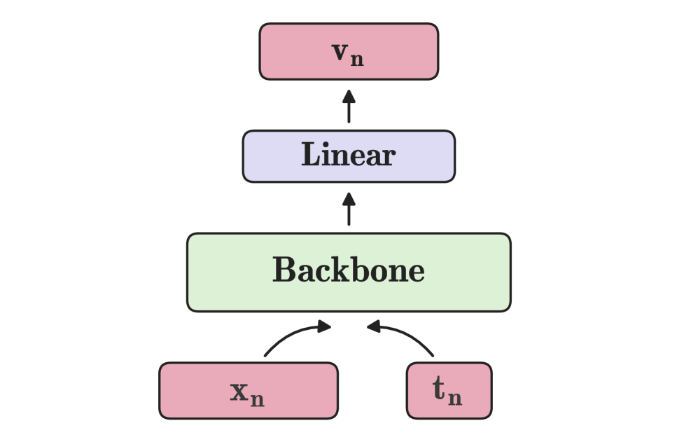
*(a)Teacher*

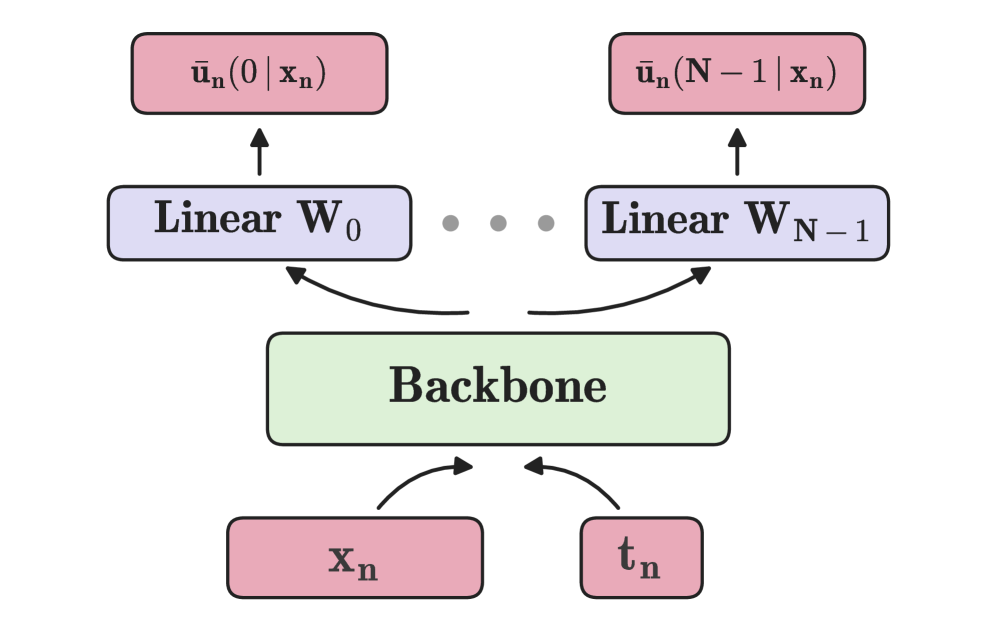
*(b)Student train*

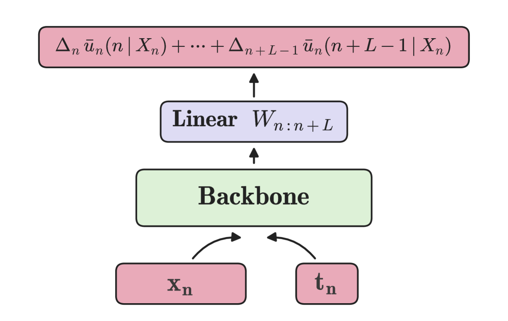
*(c)Student generation*

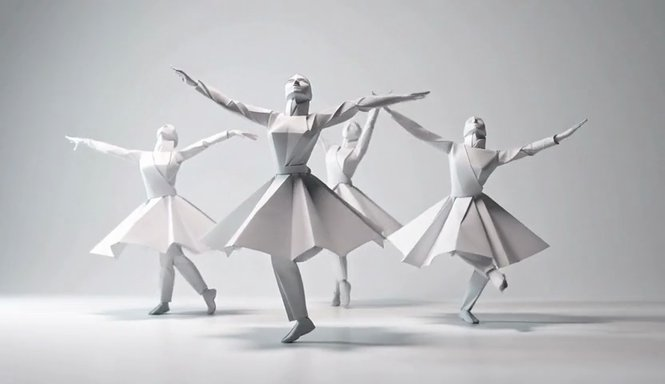
*Figure 5:PDD - Midpoint (ours) vs. DMD2, and AnyFlow on the Wan Text-to-Video 14B model. The three methods use 4 NFE. Notably, PDD achieves high-quality video while preserving better diversity.*

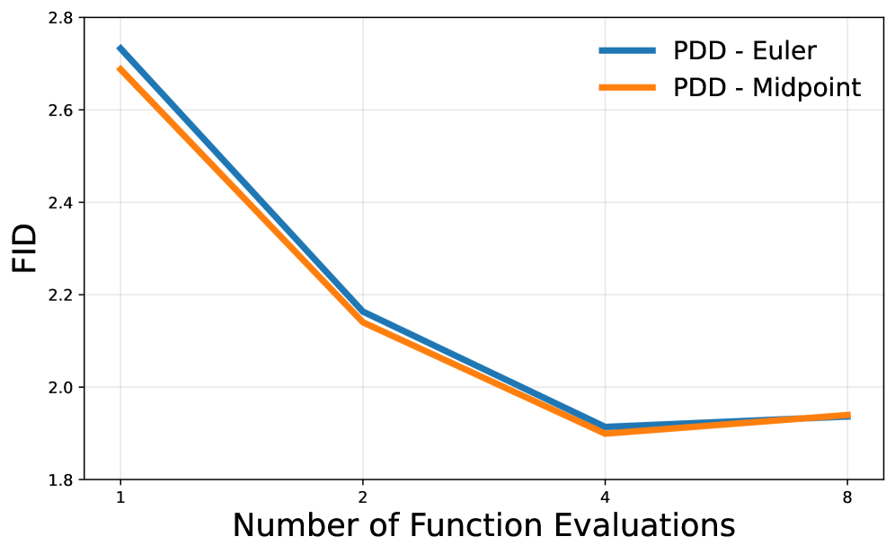
*Figure 6:FID vs. NFE of PDD with Euler and Midpoint methods for approximating the mean velocity (4) on ImageNet-256 using SiT-XL+REPA model as teacher with guidance scale 2.9.*

*Figure 7:LTX-2.3 teacher with 
4
×
30
 NFE compared to PDD (ours) and the official distilled LTX-2.3 model, both using 8 NFE.*

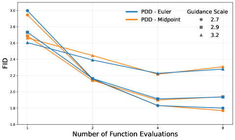
*Figure 8:FID vs. NFE of PDD with Euler and Midpoint methods for approximating the mean velocity (4) on Repa-ImageNet-256.*

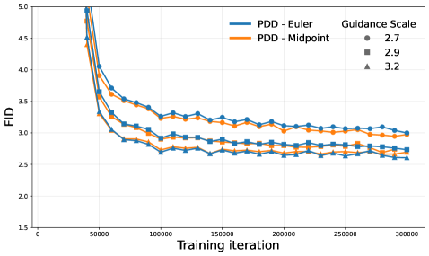
*Figure 9:FID vs. Training iteration of PDD with Euler and Midpoint methods for approximating the mean velocity (4) on Repa-ImageNet-256.*

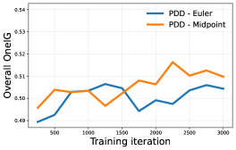
*Figure 10:Overall metrics of OneIG, DPG-Bench, and GenEval vs. Training iteration of the Qwen-Image PDD model.*

*Figure 13*

*Figure 11:Teacher uses Euler method with 2
×
50 NFE, PDD and DMD2 (Lightning-v2) use 4 NFE.*

*Figure 15*

*Figure 12:Teacher uses Euler method with 2
×
50 NFE, PDD and DMD2 (Lightning-v2) use 4 NFE.*

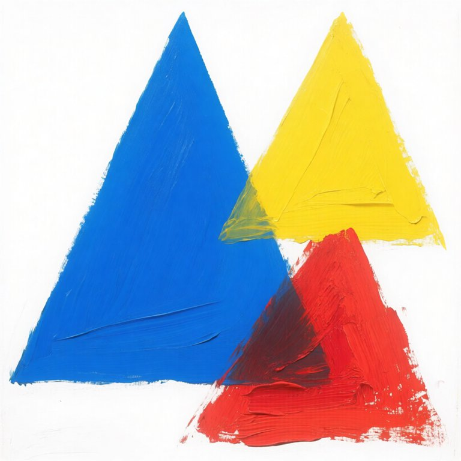
*Figure 17*

*Figure 13:Teacher uses Euler method with 2
×
50 NFE, PDD and DMD2 (Lightning-v2) use 4 NFE.*

*Figure 19*

*Figure 14:Teacher uses Euler method with 2
×
50 NFE, PDD and DMD2 (Lightning-v2) use 4 NFE.*

*Figure 21*

*Figure 15:Teacher uses Euler method with 2
×
50 NFE, PDD and DMD2 (Lightning-v2) use 4 NFE.*

*Figure 23*

*Figure 16:Teacher uses Euler method with 2
×
50 NFE, PDD and DMD2 (Lightning-v2) use 4 NFE.*

*Figure 17:Curvature of PDD vs. Teacher on the Wan2.1 14B model. We report the averaged curvature over 10 trajectories. Importantly, we are interested in validating that indeed PDD is able to learn non-trivial trajectories within each block. Thus, for PDD we report only intra-block curvature.*

*(a)4-NFE on Wan2.1 1.3B*

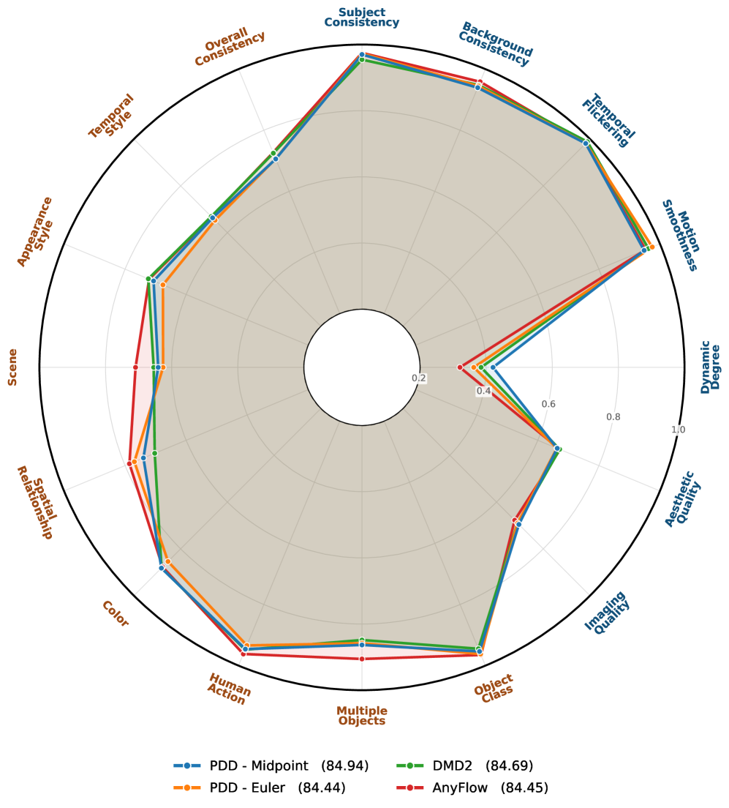
*(a)4-NFE on Wan2.1 1.3B*

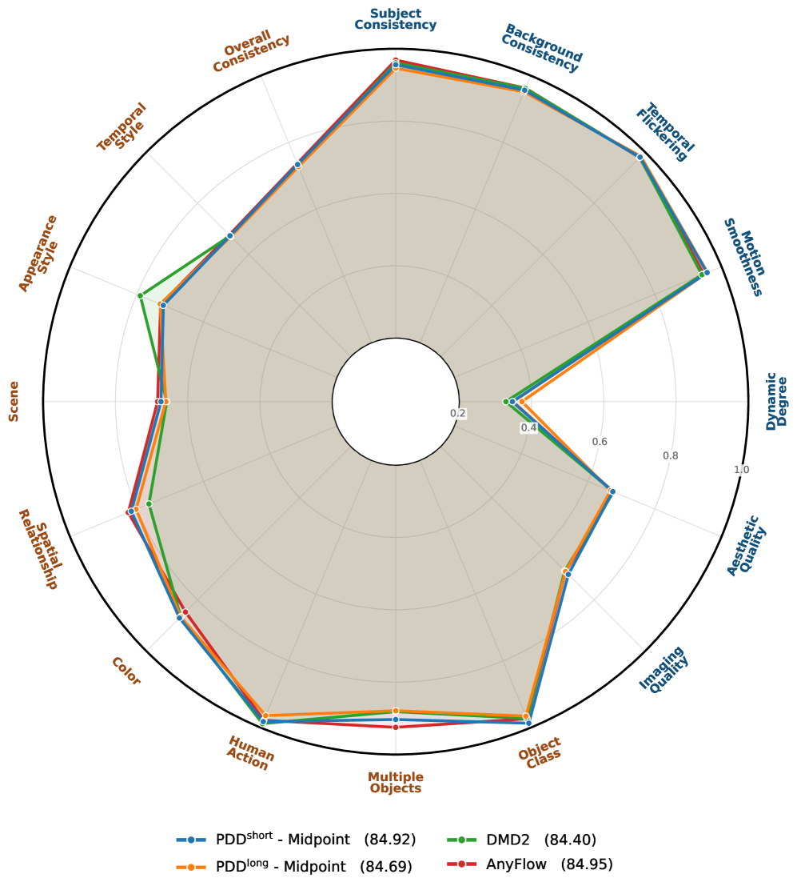
*(b)4-NFE on Wan2.1 14B*

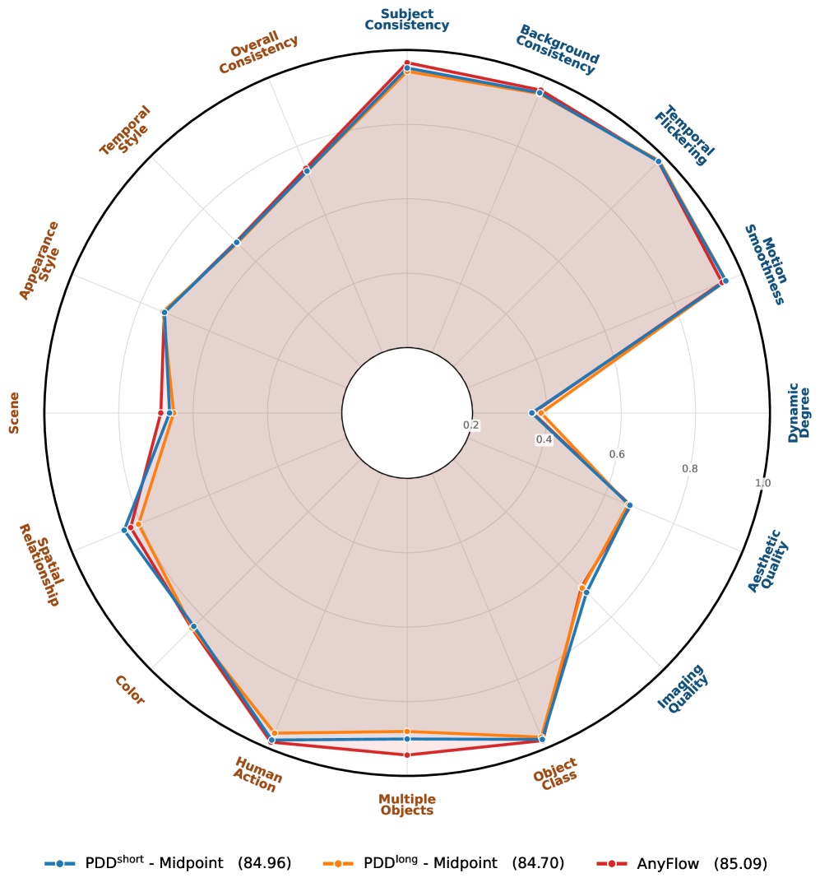
*(c)8-NFE on Wan2.1 14B*

*Figure 30*

*Figure 31*

*Figure 32*

*Figure 19:Wan2.1 14B: PDD - Midpoint (ours) vs. DMD2 (FastGen) and AnyFlow with 4 NFE.*

*Figure 34*

*Figure 35*

*Figure 36*

*Figure 20:Wan2.1 14B: PDD - Midpoint (ours) vs. DMD2 (FastGen) and AnyFlow with 4 NFE.*

*Figure 38*

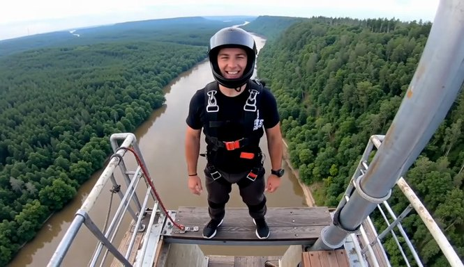
*Figure 39*

*Figure 40*

*Figure 21:Wan2.1 14B: PDD - Midpoint (ours) vs. DMD2 (FastGen) and AnyFlow with 4 NFE.*

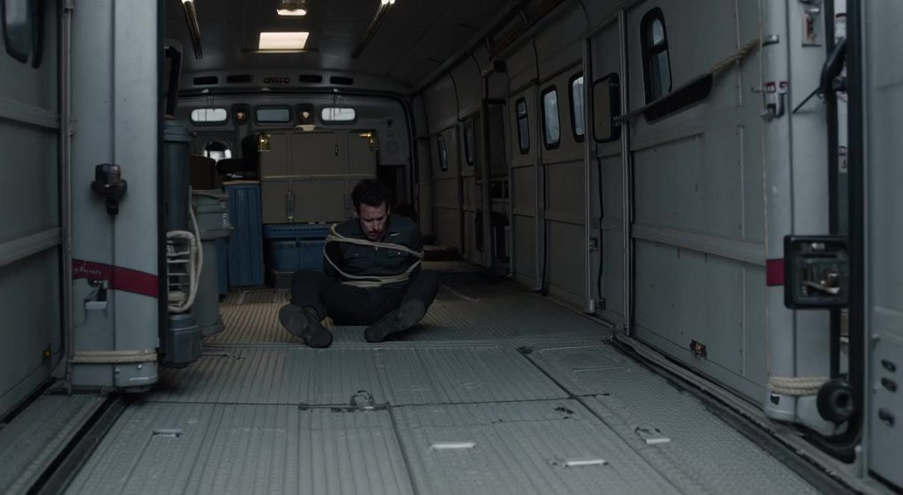
*Figure 44*

*Figure 45*

*Figure 23:LTX-2.3 teacher (
4
×
30
 NFE) vs. PDD (8 NFE) vs. official distilled model (8 NFE).*

*Figure 47*

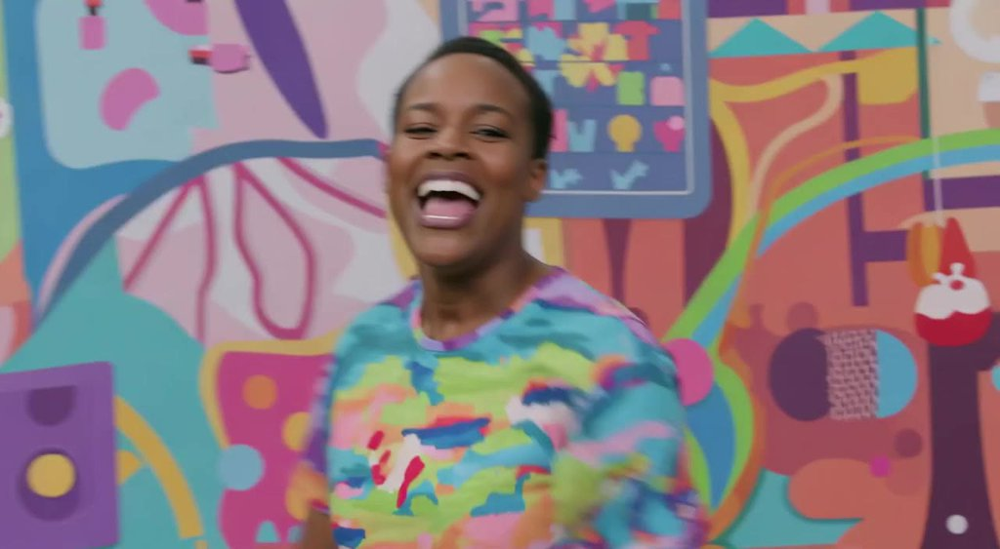
*Figure 48*

*Figure 24:LTX-2.3 teacher (
4
×
30
 NFE) vs. PDD (8 NFE) vs. official distilled model (8 NFE).*

*Figure 50*

*Figure 51*

*Figure 25:LTX-2.3 teacher (
4
×
30
 NFE) vs. PDD (8 NFE) vs. official distilled model (8 NFE).*

---
**Usage Info**: 4066 tokens used.
**Generated at**: 2026-07-30 01:05:30

---

