# 🚩 (2026-07-31) Scholar Inbox 추천 논문 

# 📚 VocalRender: Score-Native Singing Voice Synthesis for Real-World Composition

🚀 URL: https://arxiv.org/html/2607.27768

## 🌏 Abstract (원문)
Existing singing voice synthesis systems often require predefined durations, explicit duration prediction, or time-aligned acoustic guidance, which limits their compatibility with practical composition workflows. We propose VocalRender, a score-native system that directly synthesizes singing from lyrics, pitches, symbolic note values, and tempo. It uses an interleaved lyric–note representation and an autoregressive diffusion model to generate continuous acoustic latents while predicting the output length, eliminating the need for explicit duration prediction. Trained on a 2,300-hour singing dataset, VocalRender achieves strong intelligibility, strong melody control, and high speaker similarity across both in-domain and out-of-domain benchmarks. Notably, it outperforms the strongest baseline by0.420.42points in naturalness CMOS, demonstrating the effectiveness of our proposed score-native architecture.
## 🌏 Abstract (번역)
기존의 노래 음성 합성 시스템은 종종 미리 정의된 길이, 명시적인 길이 예측 또는 시간 정렬된 음향 안내를 필요로 하며, 이는 실제 작곡 워크플로우와의 호환성을 제한합니다. 우리는 가사, 피치, 기호적 음표 값 및 템포로부터 직접 노래를 합성하는 악보 기반(score-native) 시스템인 VocalRender를 제안합니다. 이 시스템은 인터리브된 가사-음표 표현과 자기회귀 확산 모델을 사용하여 출력 길이를 예측하면서 연속적인 음향 잠재 변수를 생성함으로써 명시적인 길이 예측의 필요성을 없앱니다. 2,300시간 분량의 노래 데이터셋으로 훈련된 VocalRender는 인-도메인 및 아웃-오브-도메인 벤치마크 모두에서 강력한 명료도, 강력한 멜로디 제어 및 높은 화자 유사성을 달성합니다. 특히, 자연스러움 CMOS에서 가장 강력한 기준선보다 0.42점 높은 성능을 보여, 제안된 악보 기반 아키텍처의 효과를 입증합니다.

## 🔍 Methods & Results
- 기존 노래 음성 합성 시스템의 한계점인 미리 정의된 길이, 명시적 길이 예측 또는 시간 정렬된 음향 안내의 필요성을 해결하고자 함.
- 가사, 피치, 기호적 음표 값, 템포로부터 직접 노래를 합성하는 악보 기반(score-native) 시스템인 VocalRender를 제안함.
- 인터리브된 가사-음표 표현과 자기회귀 확산 모델을 사용하여 출력 길이를 예측하면서 연속적인 음향 잠재 변수를 생성함.
- 명시적인 길이 예측의 필요성을 제거하여 실제 작곡 워크플로우와의 호환성을 높임.
- 2,300시간 분량의 노래 데이터셋으로 훈련됨.
- 인-도메인 및 아웃-오브-도메인 벤치마크에서 강력한 명료도, 강력한 멜로디 제어, 높은 화자 유사성을 달성함.
- 자연스러움 CMOS에서 가장 강력한 기준선보다 0.42점 높은 성능을 기록하여 제안된 악보 기반 아키텍처의 효과를 입증함.

## 🖼 Figures

*Figure 1:SVS with different input styles. Top: duration-based SVS Middle: reference-based SVS Bottom: score-native SVS*

*Figure 2:Overall structure of VocalRender. Left: the autoregressive diffusion framework. Right: the music score tokenization process*

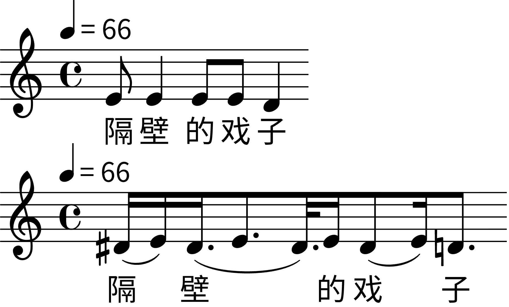
*Figure 3:Comparison between real music score and transcribed music score. Upper: intent-centric music score. Bottom: audio-centric music score*

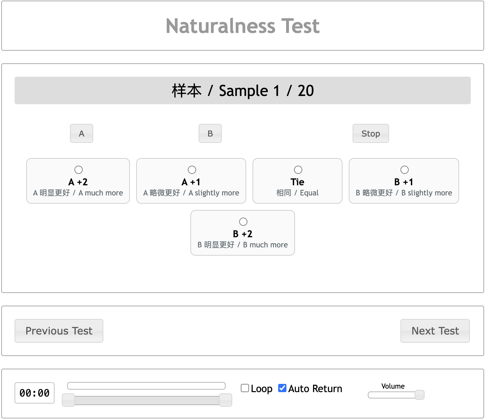
*Figure 4:Screenshot of N-CMOS test.*

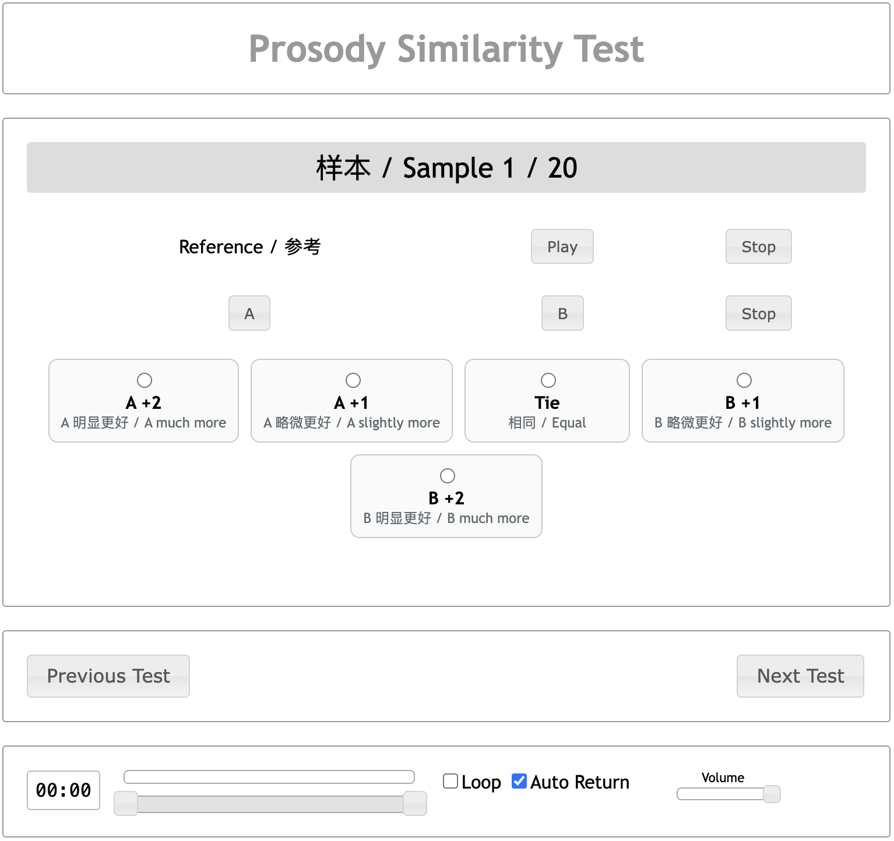
*Figure 5:Screenshot of PS-CMOS test.*

*Figure 6:Screenshot of MS-MOS test.*

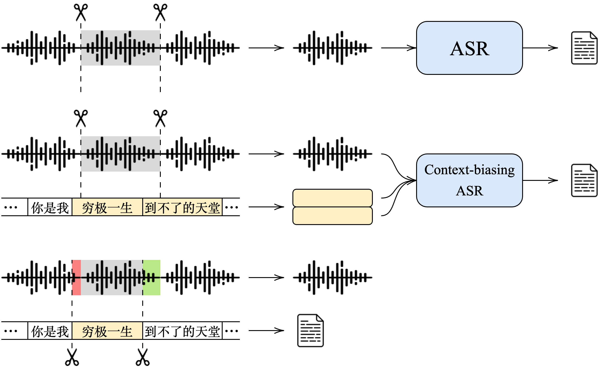
*Figure 7:Three processing branches for slicing and lyric transcription.*

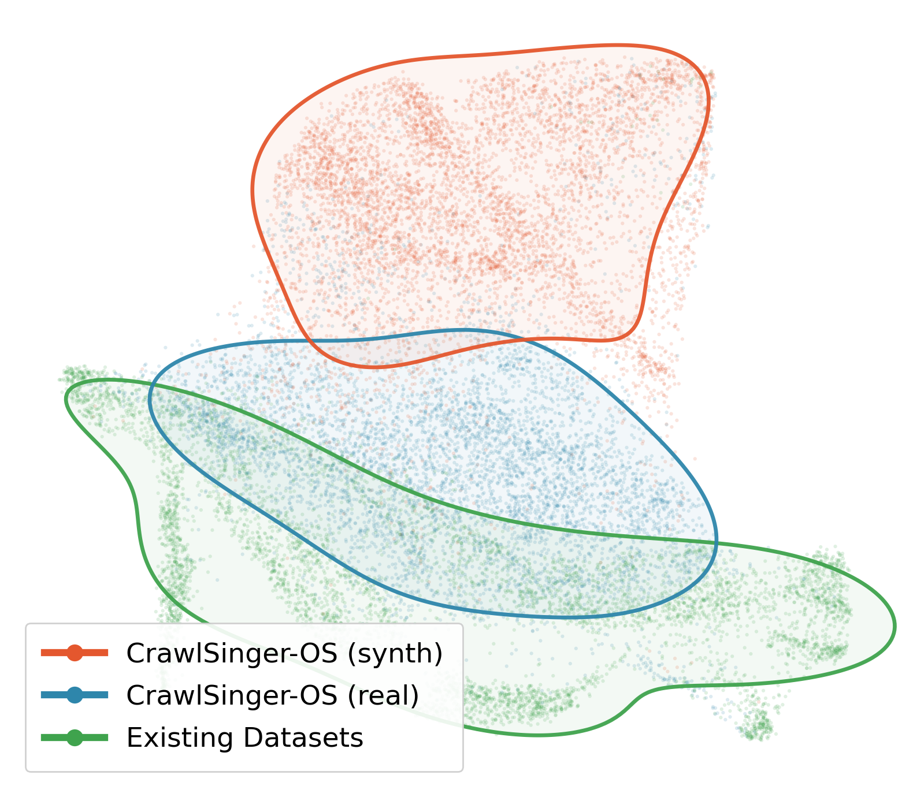
*Figure 8:Musical Diversity*

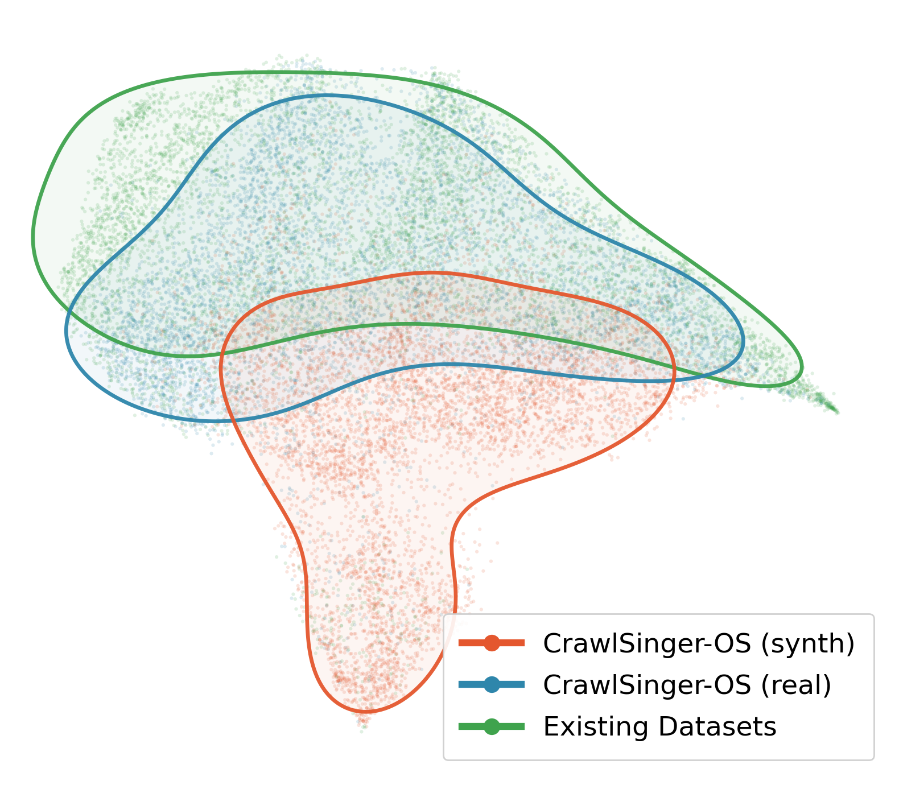
*Figure 9:Semantic Diversity*

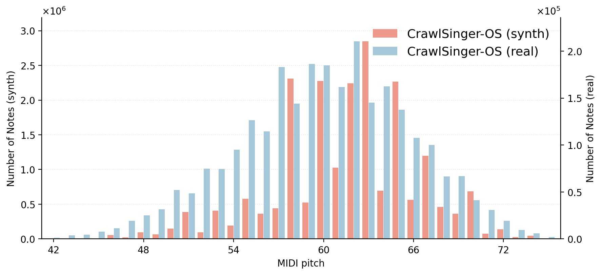
*Figure 10:Pitch Distribution of CrawlSinger-OS*

---
**Usage Info**: 1387 tokens used.
**Generated at**: 2026-07-31 16:03:21

---

# 📚 Teffic-Audio: Tell Fact from Fiction

🚀 URL: https://arxiv.org/html/2607.28351

## 🌏 Abstract (원문)
Speech deepfake detection has expanded in scope with increasingly heterogeneous spoofing mechanisms, including speech synthesis, voice conversion, vocoder reconstruction, and neural-codec resynthesis. The resulting spoofing artifacts can be further shaped by variability in source speech, recording environments, and transmission channels. This variability makes robust generalization across heterogeneous conditions a central requirement for practical detection systems. This report presents Teffic-Audio, a general speech deepfake detection system designed for comprehensive evaluation environment. Teffic-Audio adopts a straightforward detector architecture consisting of a Conformer-based speech encoder, multi-head attentive statistics pooling, and a binary classifier. Rather than relying on additional architectural complexity, the system improves generalization through its training recipe, which integrates multi-source data, attack- and source-balanced sampling, and diverse audio augmentation. Trained only with open-source data, Teffic-Audio achieves a pooled EER of 1.454% on the 14 test sets of Speech-DF-Arena, outperforming all currently public systems on the leaderboard. It also obtains the lowest EER on five individual test sets and shows a favorable performance–complexity trade-off compared with larger leading systems. Overall, Teffic-Audio provides a strong and practical reference system for general speech deepfake detection.
## 🌏 Abstract (번역)
음성 딥페이크 탐지는 음성 합성, 음성 변환, 보코더 재구성, 신경 코덱 재합성 등 점점 더 이질적인 스푸핑 메커니즘으로 범위가 확장되었습니다. 결과적으로 발생하는 스푸핑 아티팩트는 원본 음성, 녹음 환경 및 전송 채널의 가변성에 의해 더욱 형성될 수 있습니다. 이러한 가변성은 이질적인 조건 전반에 걸쳐 강력한 일반화 능력을 실용적인 탐지 시스템의 핵심 요구 사항으로 만듭니다. 이 보고서는 포괄적인 평가 환경을 위해 설계된 일반 음성 딥페이크 탐지 시스템인 Teffic-Audio를 소개합니다. Teffic-Audio는 Conformer 기반 음성 인코더, 다중 헤드 주의 통계 풀링 및 이진 분류기로 구성된 간단한 탐지기 아키텍처를 채택합니다. 시스템은 추가적인 아키텍처 복잡성에 의존하기보다는 다중 소스 데이터, 공격 및 소스 균형 샘플링, 다양한 오디오 증강을 통합하는 훈련 레시피를 통해 일반화 능력을 향상시킵니다. 오픈 소스 데이터로만 훈련된 Teffic-Audio는 Speech-DF-Arena의 14개 테스트 세트에서 1.454%의 통합 EER을 달성하여 현재 리더보드의 모든 공개 시스템을 능가합니다. 또한 5개의 개별 테스트 세트에서 가장 낮은 EER을 얻었으며, 더 큰 선도 시스템과 비교하여 유리한 성능-복잡성 균형을 보여줍니다. 전반적으로 Teffic-Audio는 일반 음성 딥페이크 탐지를 위한 강력하고 실용적인 참조 시스템을 제공합니다.

## 🔍 Methods & Results
- Teffic-Audio는 발화 수준의 음성 딥페이크 탐지를 목표로 하며, 입력 음성 발화가 스푸핑된 음성일 가능성을 나타내는 탐지 점수를 출력합니다.
- 시스템 아키텍처는 SSL로 초기화된 음성 인코더, 풀링 레이어, 이진 분류기로 구성된 종단 간 판별 모델입니다.
- 음성 인코더는 w2v-BERT 2.0에서 초기화되며, CNN 기반 특징 추출기와 24개의 Conformer 블록(각 모델 차원 1024)으로 구성되어 입력 파형을 문맥화된 프레임 수준 음성 표현으로 변환합니다.
- 프레임 수준 표현 위에 다중 헤드 주의 통계 풀링(MHASP)을 사용하여 고정 차원의 발화 수준 표현을 얻습니다. MHASP는 4개의 주의 헤드를 사용하여 시간 차원을 따라 주의 가중치를 계산하고 가중 평균 및 가중 표준 편차를 추정합니다.
- 모든 헤드의 통계는 2048차원 풀링 표현을 형성하기 위해 연결되며, 이는 2048→1536→1024 차원의 MLP에 의해 투영됩니다.
- 최종적으로, 512차원 은닉 계층을 가진 MLP 분류기가 1024차원 전역 표현을 이진 분류 로짓으로 매핑하며, 시그모이드 활성화 후 스푸핑된 음성의 사후 확률이 탐지 점수로 사용됩니다.
- 모델은 이진 교차 엔트로피(BCE) 손실로 최적화되며, 음성 인코더, 풀링 레이어, 분류기가 종단 간 방식으로 공동 최적화됩니다.
- 시스템은 다중 소스 데이터, 공격 및 소스 균형 샘플링, 다양한 오디오 증강을 통합하는 훈련 레시피를 통해 일반화 능력을 향상시킵니다.
- 오픈 소스 데이터로만 훈련된 Teffic-Audio는 Speech-DF-Arena의 14개 테스트 세트에서 1.454%의 통합 EER을 달성하여 모든 현재 공개 시스템을 능가했습니다.
- 또한 5개의 개별 테스트 세트에서 가장 낮은 EER을 기록했으며, 더 큰 선도 시스템과 비교하여 유리한 성능-복잡성 균형을 보였습니다.

## 🖼 Figures
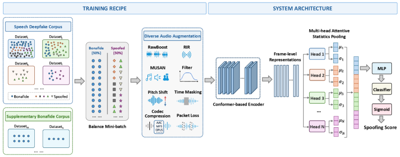
*Figure 1: Overview of the Teffic-Audio system architecture and the waveform-to-score training pipeline.*

---
**Usage Info**: 2395 tokens used.
**Generated at**: 2026-07-31 16:03:30

---

# 📚 Latent-Kernel Discrete Flow Maps for Few-Step Generation

🚀 URL: https://arxiv.org/html/2607.27529

## 🌏 Abstract (원문)
Discrete diffusion and flow-matching models denoise a sequence over many steps, but to keep each step cheap, they factorize the transition across positions and decide every tokenindependently. This makes few-step generation challenging for text when the target couples two positions, such as a subject and a verb that must agree. An independent update commits to them separately, and many function evaluations are spent repairing the mismatch. Existing few-step methods buy back the lost correlation by distilling or rectifying a slow teacher, and so inherit the teacher’s quality ceiling. We ask insteadwhether a model can express correlated steps natively, and answer with Latent-Kernel Discrete Flow Maps (LKF),a from-scratch flow-map kernel that is a mixture ofMMfactorized components tied by a single shared latent. Conditioned on the latent, each component is cheap, and the mixture is summed over the latent in closed form for smallMM. We show that a single step places mass on correlated completions with the same sampling time complexity as a factorized model, since one latent is drawn per sequence and reused across the entire denoising trajectory. We also show that the Masked Diffusion Language Model (MDLM) is a special case of our LKF model atM=1M{=}1. The experiments for unconditional text generation on the One-Billion-Word (LM1B) and WikiText-103 benchmarks show that our LKF model learns strongly heterogeneous components and improves generative perplexity by2.1×2.1\timesto3.3×3.3\timesover the likelihood baselines without losing diversity. The gain grows withMM, and atM=8M{=}8, it surpasses distilled and rectified few-step samplers. The source code is available at:https://github.com/mansoor181/lkf.git
## 🌏 Abstract (번역)
이산 확산 및 플로우 매칭 모델은 여러 단계에 걸쳐 시퀀스를 노이즈 제거하지만, 각 단계를 저렴하게 유지하기 위해 위치에 따라 전이를 분해하고 모든 토큰을 독립적으로 결정합니다. 이는 주어와 동사가 일치해야 하는 등 대상이 두 위치를 연결할 때 텍스트의 몇 단계 생성에 어려움을 줍니다. 독립적인 업데이트는 이들을 개별적으로 처리하며, 불일치를 수정하는 데 많은 함수 평가가 소요됩니다. 기존의 몇 단계 방법은 느린 교사를 증류하거나 수정하여 손실된 상관관계를 되찾으므로, 교사의 품질 한계를 계승합니다. 우리는 대신 모델이 상관된 단계를 본질적으로 표현할 수 있는지 질문하고, 단일 공유 잠재 변수에 의해 연결된 M개의 분해된 구성 요소의 혼합인 처음부터 시작하는 플로우 맵 커널인 Latent-Kernel Discrete Flow Maps (LKF)로 답합니다. 잠재 변수에 조건화되면 각 구성 요소는 저렴하며, 작은 M에 대해 혼합은 잠재 변수에 대해 닫힌 형태로 합산됩니다. 우리는 단일 단계가 분해된 모델과 동일한 샘플링 시간 복잡도로 상관된 완성에 질량을 부여한다는 것을 보여줍니다. 이는 시퀀스당 하나의 잠재 변수가 그려지고 전체 노이즈 제거 궤적에 걸쳐 재사용되기 때문입니다. 또한 Masked Diffusion Language Model (MDLM)이 M=1일 때 LKF 모델의 특수한 경우임을 보여줍니다. One-Billion-Word (LM1B) 및 WikiText-103 벤치마크에서 무조건적인 텍스트 생성에 대한 실험은 LKF 모델이 강력하게 이질적인 구성 요소를 학습하고 다양성을 잃지 않으면서 우도 기준선 대비 생성 퍼플렉시티를 2.1배에서 3.3배 향상시킨다는 것을 보여줍니다. 이득은 M에 따라 증가하며, M=8일 때 증류 및 수정된 몇 단계 샘플러를 능가합니다. 소스 코드는 https://github.com/mansoor181/lkf.git에서 확인할 수 있습니다.

## 🔍 Methods & Results
- LKF는 단일 네트워크를 사용하여 각 잠재 변수 및 위치별 토큰 로짓과 라우터 로짓을 출력하며, 샘플링 시 모든 위치에 공유되는 단일 잠재 변수 k를 추출한 후 해당 구성 요소 k에서 각 토큰을 샘플링하여 단계 내 상관관계를 구현합니다.
- 선형 스케줄을 사용하여 순방향 노이즈를 적용하고, 0 ≤ t < s ≤ 1 범위의 두 시간 훈련 목표는 마스킹된 위치를 데이터 값으로 드러내고 이미 드러난 위치는 변경하지 않습니다.
- 네트워크는 DiT와 유사한 단일 트랜스포머 트렁크로 구성되며, 두 시간 조건화, 후기 잠재 변수 주입 (마지막 Lk 블록만 M개의 잠재 변수에 복제), 풀링된 라우터 (공유 표현을 읽고 시퀀스당 하나의 혼합 가중치 출력)를 통해 차별화됩니다.
- LKF는 잠재 변수를 주변화하여 훈련되며, M개의 구성 요소에 대한 혼합 로그-우도(mixture log-likelihood)를 닫힌 형태로 합산하여 단일 공유 잠재 변수가 전체 마스킹된 세트를 공동으로 설명하는 확률을 목표로 합니다.
- 훈련 손실은 모델과 실제 전이 간의 KL 발산(KL divergence)을 최소화하며, 라우터의 실패 모드를 방지하기 위해 배치 평균 가중치의 엔트로피를 최대화하고 잠재 변수의 사전 엔트로피를 최대화하는 정규화 기법을 사용합니다.
- 샘플링은 모든 [MASK] 시퀀스에서 시작하여 J 단계를 적용하며, 각 단계는 트렁크를 한 번 포워드하고 단일 구성 요소 k에서 토큰을 샘플링합니다. 초기 [MASK] 상태에서 한 번 추출된 k는 전체 디노이징 궤적에 걸쳐 재사용되어 시퀀스 수준의 의미론을 유지합니다.
- 추론 시 'best-of-M' 디코딩 전략은 M개의 롤아웃을 병렬로 실행하고, 각 완료된 후보를 모델의 시퀀스 수준 혼합 NELBO(Negative ELBO)로 평가하여 최적의 결과를 선택합니다.
- 스코어링 과정은 각 단계에서 M개의 구성 요소를 모두 평가하여 얻는 구성 요소별 실행 증거(running evidence)를 활용하여 최약 롤아웃을 중간에 가지치기함으로써 비용을 절감할 수 있습니다.
- 무조건적인 텍스트 생성 실험 (One-Billion-Word 및 WikiText-103)에서 LKF 모델은 이질적인 구성 요소를 학습하고 다양성을 유지하면서 생성 퍼플렉시티를 기준선 대비 2.1배에서 3.3배 향상시켰습니다.
- 성능 향상은 M 값에 비례하며, M=8일 때 증류 및 수정된 몇 단계 샘플러를 능가하는 결과를 보였습니다.
- Masked Diffusion Language Model (MDLM)은 M=1일 때 LKF 모델의 특수한 경우임이 밝혀졌습니다.

## 🖼 Figures

*Figure 3:Generative perplexity (PPL) versus number of sampling steps on LM1B, comparing LKF at 
𝑀
=
{
1
,
4
,
8
}
 against the baseline methods.*

*Figure 4:Illustration of correlation and information captured by LKF on synthetic corpora. On hidden agreement, the captured information 
I
^
𝑘
 and the effective total correlation 
TC
^
 rise monotonically with 
𝑀
, tracking their ceilings (
log
⁡
𝑀
 and 
(
𝐿
−
1
)
​
log
⁡
𝑀
, dashed), and held-out NLL falls accordingly. On parity, every captured-correlation metric stays at zero for all 
𝑀
.*

![Figure 8:Diagnostics for the hidden-agreement corpus at 
𝑀
=
16
. (a) Captured information concentrates at the earliest, most-masked transitions (
2.21
 of 
2.46
 nats in 
𝑡
=
0
→
0.25
) and vanishes late, where little remains to decide. (b) Each frozen component is near deterministic (empirical TC 
0.0
–
8.4
 bits), while the routed mixture reconstructs 
26.7
 of the 
28
 bits, which evidences a genuine sixteen-way partition, and shuffling 
𝑘
 across the batch leaves the mixture-level TC unchanged. (c) The in-support rate rises from 
0.47
 at 
𝐽
=
1
 to 
0.95
 at 
𝐽
=
32
, and support recall saturates at 
1.0
 from 
𝐽
=
2
 onward.](../images/2026-07-31/2607.27529/2607.27529_fig7.png)
*Figure 8:Diagnostics for the hidden-agreement corpus at 
𝑀
=
16
. (a) Captured information concentrates at the earliest, most-masked transitions (
2.21
 of 
2.46
 nats in 
𝑡
=
0
→
0.25
) and vanishes late, where little remains to decide. (b) Each frozen component is near deterministic (empirical TC 
0.0
–
8.4
 bits), while the routed mixture reconstructs 
26.7
 of the 
28
 bits, which evidences a genuine sixteen-way partition, and shuffling 
𝑘
 across the batch leaves the mixture-level TC unchanged. (c) The in-support rate rises from 
0.47
 at 
𝐽
=
1
 to 
0.95
 at 
𝐽
=
32
, and support recall saturates at 
1.0
 from 
𝐽
=
2
 onward.*

---
**Usage Info**: 5278 tokens used.
**Generated at**: 2026-07-31 16:03:45

---

# 📚 RIPPLE: Generating Multi-Channel Phase, Not Recovering It

🚀 URL: https://arxiv.org/html/2607.27775

## 🌏 Abstract (원문)
Generative models synthesize magnitude spectra with high fidelity, while phase is delegated to a recovery module—Griffin–Lim, a vocoder, or a latent decoder—applied independently to each channel. For multi-channel waveforms this delegation is costly: the physical content of spatial audio and three-component seismograms lives in the phase relationships between channels, precisely what channel-independent recovery cannot produce. The cost is also invisible, since the magnitude-based metrics common to both fields barely move when inter-channel phase coherence collapses—so a pipeline can discard the physical information in its output while still scoring well. We argue that phase should be generated, not recovered, and present RIPPLE (Rectified Inter-channel Phase with Prior-based LEarning), which reinterprets Griffin–Lim as a phasepriorrather than a final estimator: initialized from the source phase, this prior carries the inter-channel structure to be preserved, and a rectified flow refines it toward the target under an explicit inter-channel phase loss. Tested on first-order ambisonics environment transfer and seismic cross-station translation—two physically unrelated domains—RIPPLE outperforms recovery-based pipelines on the coherence metrics that downstream analyses consume. The seismic case is decisive: across architecturally distinct generators, per-channel recovery leaves S-wave polarization error near the57.3∘57.3^{\circ}random expectation, whereas learned phase reduces it to33.8∘33.8^{\circ}.
## 🌏 Abstract (번역)
생성 모델은 크기 스펙트럼을 높은 충실도로 합성하는 반면, 위상은 각 채널에 독립적으로 적용되는 복구 모듈(Griffin-Lim, 보코더 또는 잠재 디코더)에 위임됩니다. 다중 채널 파형의 경우 이러한 위임은 비용이 많이 듭니다. 공간 오디오 및 3성분 지진계의 물리적 내용은 채널 간 위상 관계에 존재하며, 이는 채널 독립적인 복구로는 생성할 수 없는 부분입니다. 또한 이러한 비용은 보이지 않습니다. 두 분야에 공통적인 크기 기반 측정 지표는 채널 간 위상 일관성이 무너져도 거의 변동하지 않으므로, 파이프라인은 출력에서 물리적 정보를 버리면서도 좋은 점수를 얻을 수 있습니다. 우리는 위상이 복구되는 것이 아니라 생성되어야 한다고 주장하며, Griffin-Lim을 최종 추정기가 아닌 위상 사전(phase prior)으로 재해석하는 RIPPLE(Rectified Inter-channel Phase with Prior-based LEarning)을 제시합니다. 소스 위상으로 초기화된 이 사전은 보존되어야 할 채널 간 구조를 전달하며, 정류된 흐름(rectified flow)은 명시적인 채널 간 위상 손실 하에 이를 목표를 향해 정제합니다. 1차 앰비소닉스 환경 전송 및 지진 교차 스테이션 변환(물리적으로 관련 없는 두 도메인)에 대해 테스트한 결과, RIPPLE은 다운스트림 분석이 사용하는 일관성 측정 지표에서 복구 기반 파이프라인보다 뛰어난 성능을 보였습니다. 지진 사례는 결정적입니다. 아키텍처적으로 다른 생성기 전반에 걸쳐 채널별 복구는 S파 편광 오류를 무작위 기대치인 57.3° 근처에 두는 반면, 학습된 위상은 이를 33.8°로 줄입니다.

## 🔍 Methods & Results
- 다중 채널 파형(예: FOA 공간 오디오, 3성분 지진계)의 소스-타겟 변환을 목표로 하며, 복소 STFT를 크기와 위상으로 분리하여 표현한다.
- 위상 `phi`를 `(cos phi, sin phi)`로 `R^2`에 임베딩하여 랩어라운드 불연속성을 제거하고, 크기와 위상을 분리하여 크기가 위상에 대한 조건화 정보로 활용될 수 있도록 한다.
- Griffin-Lim(GL) 알고리즘을 최종 추정기가 아닌 '정보화된 사전(informed prior)'으로 재해석하며, GL은 각 채널에 독립적으로 적용되고 소스 위상으로 초기화되어 채널 간 구조를 보존한다.
- 두 개의 정류된 흐름(rectified flows)을 사용하여 크기와 위상을 모델링하며, 이들은 독립적인 보간 시간 단계와 공유 조건화 인코더를 사용한다. 위상 흐름은 타겟 크기 정보를 입력으로 활용한다.
- 훈련 목표는 두 가지 속도 회귀 손실, 크기 재구성 손실, 위상 품질 항, 그리고 채널 간 위상 차이(IPD) 손실의 가중치 합으로 구성된다. 모든 위상 관련 손실은 크기 가중치를 적용하여 저에너지 구간의 영향을 줄인다.
- IPD 손실은 예측된 채널 쌍의 상대 위상 벡터 내적을 최대화하여 명시적인 채널 간 일관성 신호를 제공하며, 이는 전역 위상 이동에 불변하다.
- 추론 시에는 크기 흐름을 먼저 통합하여 타겟 크기를 예측한 다음, 예측된 크기와 소스 위상으로부터 소스 정보 기반 Griffin-Lim 사전을 구성하고, 이 사전으로부터 위상 ODE를 통합한다.
- RIPPLE은 1차 앰비소닉스 환경 전송 및 지진 교차 스테이션 변환에서 복구 기반 파이프라인보다 우수한 성능을 보였다.
- 특히 지진 데이터에서, 채널별 복구는 S파 편광 오류를 무작위 기대치인 57.3° 근처에 두는 반면, RIPPLE의 학습된 위상은 이를 33.8°로 크게 감소시켰다.

## 🖼 Figures
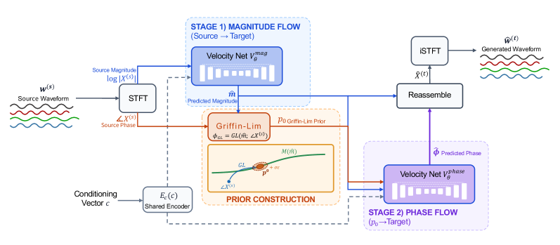
*Figure 1:Overview of RIPPLE. Stage 1 predicts the target magnitude; the source-informed Griffin–Lim prior is built from it; Stage 2 integrates the phase flow from this prior.*

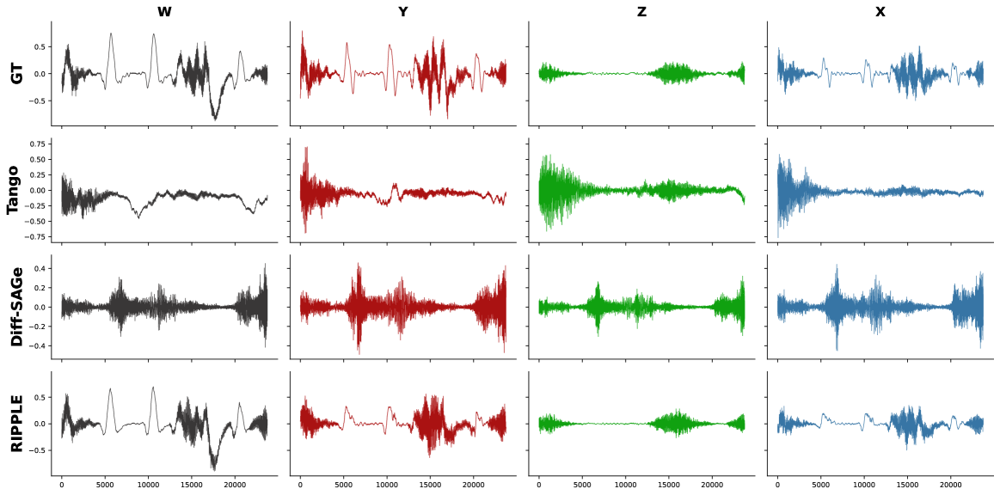
*(a)Direct baselines (no source-target adaptation).*

*(a)Direct baselines (no source-target adaptation).*

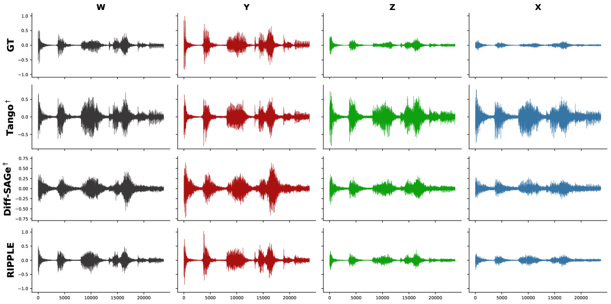
*(b)Source-target adapted baselines (marked †).*

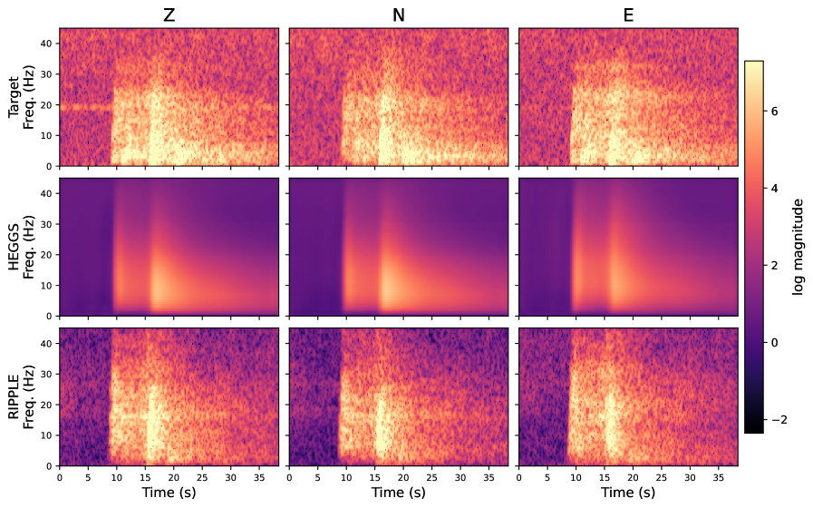
*Figure 3:Three-component (Z/N/E) log-magnitude spectrograms for an SCEDC cross-station test sample.*

*Figure 4:
Δ
Spatial-Angle
 vs. integration steps 
𝑁
 on Spatial LibriSpeech (100 test pairs; 4N network evaluations total, 2N per Heun stage). Dashed line: classical Griffin–Lim recovery.*

*Figure 5:Sensitivity of 
Δ
Spatial-Angle
 to the number of Griffin–Lim prior iterations 
𝐾
 at inference (same 100 test pairs as Figure 4, integrated with 
𝑁
=
50
 Heun steps). The flow is trained with 
𝐾
=
8
 (dashed line). Lower is better.*

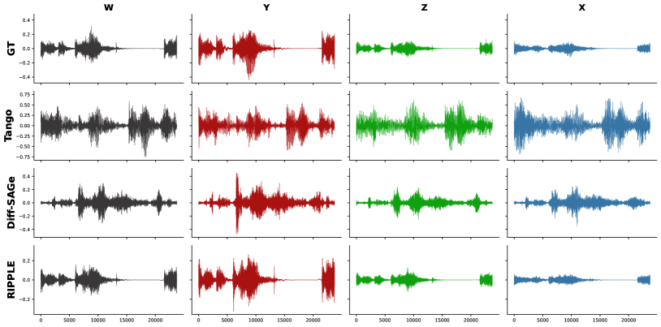
*Figure 6:No Source-Target Adaptation*

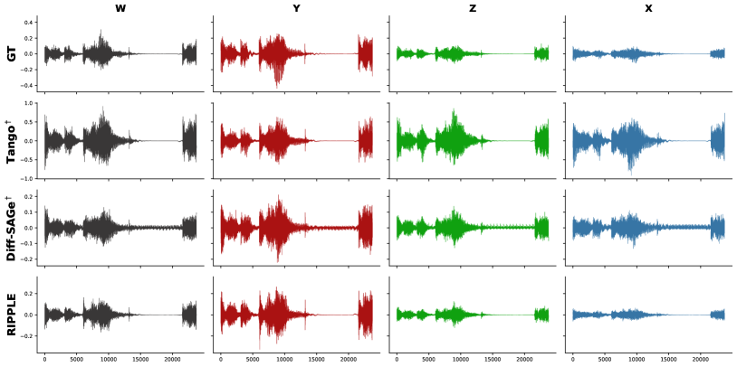
*Figure 7:Source-Target Adaptation*

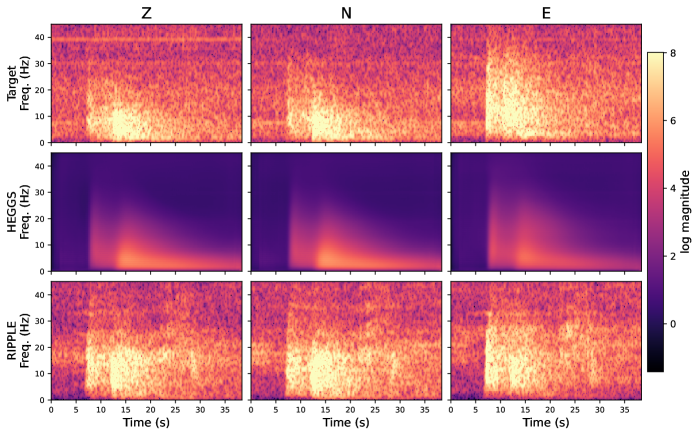
*Figure 8:Three-component (Z/N/E) log-magnitude spectrograms for three SCEDC cross-station test samples.*

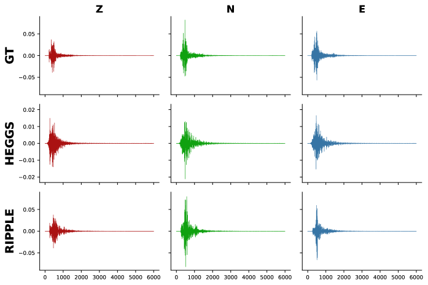
*Figure 9:Three-component waveform comparisons for three SCEDC cross-station test samples; amplitude scales are per row.*

---
**Usage Info**: 4678 tokens used.
**Generated at**: 2026-07-31 16:03:58

---

# 📚 ReGenVC: End-to-End Real-Time Generative Video Coding at Ultra-Low Bitrate

🚀 URL: https://arxiv.org/html/2607.28144

## 🌏 Abstract (원문)
We present ReGenVC (Real-time Generative Video Coding), an end-to-endgenerative video codecthat compresses talking-head video to an ultra-low bitrate and decodes it in real time. On the encoder side a source clip is reduced to a compact bitstream—a neurally compressed first frame, per-frame pose keypoints, and metadata—totalling only~26
		kB for a 77-frame sequence. On the decoder side a four-step distilled diffusion transformer reconstructs the video conditioned on the transmitted pose and reference frame. Against x264/x265, ReGenVC transmits the same clip at roughlyone order of magnitude lower bitrate(~26
		kB vs. the~250–280
		kB x264/x265 need for essentially artifact-free reconstruction); at a matched ultra-low bitrate the traditional codecs collapse into blocking artifacts while ReGenVC stays sharp by exploiting a strong generative prior. The central obstacle to deploying such a codec isdecoder latency: a multi-step sampler over a transformer and a VAE is far too slow for interactive use. We make the decoderreal-timethrough four-step distillation of the teacher and three model-preserving systems techniques: (i)		eight-GPU unified sequence parallelism (Ulysses×Ring), (ii)		a spatially-split VAE, and (iii)		a three-stage overlapped pipeline; an analytical timing modelTwin≈(wd+d)+max⁡(v+a,we+e)characterizes the real-time feasibility region. On an 8-GPU node the system sustains 24
		fps output (972
		ms per 25-frame window, within the 1000
		ms budget), driving a live browser stream with no observed frame underruns over the tested run. A hybrid CPU–GPU deployment further runs the encoder on the CPU at the same 24
		fps and holds the decoder’s one-shot CLIP/T5 conditioners on the CPU as well, cutting the per-GPU memory peak from 21.1
		GB to~7.7
		GB and leaving the GPU for the diffusion critical path. Real-time decoding has been described as “a common challenge for generative codecs”[33]; ReGenVC is, to our knowledge, the first end-to-end generative video codec to overcome this challenge—combining ultra-low-bitrate encoding withreal-timedecoding on an 8-GPU node built from consumer-class GPUs.
## 🌏 Abstract (번역)
본 논문은 초저비트레이트로 토킹 헤드 비디오를 압축하고 실시간으로 디코딩하는 종단 간 생성형 비디오 코덱인 ReGenVC(Real-time Generative Video Coding)를 소개합니다. 인코더 측에서는 소스 클립이 신경망으로 압축된 첫 프레임, 프레임별 포즈 키포인트, 메타데이터로 구성된 압축된 비트스트림으로 축소되며, 77프레임 시퀀스에 대해 총 약 26kB에 불과합니다. 디코더 측에서는 전송된 포즈와 참조 프레임을 조건으로 하는 4단계 증류 확산 트랜스포머가 비디오를 재구성합니다. x264/x265와 비교했을 때, ReGenVC는 동일한 클립을 약 10배 낮은 비트레이트(약 26kB 대 x264/x265가 거의 아티팩트 없는 재구성을 위해 필요한 약 250-280kB)로 전송합니다. 동일한 초저비트레이트에서 기존 코덱은 블록 아티팩트로 붕괴되는 반면, ReGenVC는 강력한 생성형 사전 지식을 활용하여 선명도를 유지합니다. 이러한 코덱을 배포하는 데 있어 핵심적인 장애물은 디코더 지연 시간입니다. 트랜스포머와 VAE를 사용하는 다단계 샘플러는 대화형 사용에는 너무 느립니다. 우리는 교사 모델의 4단계 증류와 세 가지 모델 보존 시스템 기술을 통해 디코더를 실시간으로 만듭니다. (i) 8-GPU 통합 시퀀스 병렬 처리(Ulysses×Ring), (ii) 공간 분할 VAE, (iii) 3단계 중첩 파이프라인이 그것입니다. 분석적 타이밍 모델 Twin≈(wd+d)+max⁡(v+a,we+e)는 실시간 가능 영역을 특성화합니다. 8-GPU 노드에서 시스템은 24fps 출력을 유지하며(25프레임 창당 972ms, 1000ms 예산 내), 테스트 실행 동안 프레임 언더런 없이 라이브 브라우저 스트림을 구동합니다. 하이브리드 CPU-GPU 배포는 인코더를 CPU에서 동일한 24fps로 실행하고, 디코더의 원샷 CLIP/T5 컨디셔너도 CPU에 유지하여 GPU당 메모리 피크를 21.1GB에서 약 7.7GB로 줄이고 GPU는 확산의 핵심 경로에 전념하게 합니다. 실시간 디코딩은 “생성형 코덱의 공통 과제”[33]로 설명되어 왔습니다. ReGenVC는 소비자 등급 GPU로 구축된 8-GPU 노드에서 초저비트레이트 인코딩과 실시간 디코딩을 결합하여 이 과제를 극복한 최초의 종단 간 생성형 비디오 코덱입니다.

## 🔍 Methods & Results
- ReGenVC는 토킹 헤드 비디오를 초저비트레이트로 압축하고 실시간으로 디코딩하는 종단 간 생성형 비디오 코덱입니다.
- 인코더는 소스 클립을 신경망으로 압축된 첫 프레임(약 10kB), 프레임별 포즈 키포인트(DWPose, 77프레임에 약 15.8kB), 메타데이터(약 0.2kB)로 구성된 총 약 26kB의 비트스트림으로 축소하며, 인코더는 전적으로 CPU에서 실행됩니다.
- 디코더는 전송된 포즈와 참조 프레임을 조건으로 하는 4단계 증류 확산 트랜스포머를 사용하여 비디오를 재구성하며, F=25 프레임의 슬라이딩 윈도우 방식으로 작동합니다.
- 실시간 디코딩을 위해 20단계 DDIM 교사 모델을 4단계 학생 확산 샘플러로 증류하여 가장 큰 지연 시간 감소를 달성했습니다.
- 디코더의 실시간 처리를 위해 (i) 8-GPU 통합 시퀀스 병렬 처리(Ulysses×Ring), (ii) 공간 분할 VAE, (iii) 3단계 중첩 파이프라인의 세 가지 시스템 기술을 적용했습니다.
- 하이브리드 CPU-GPU 배포를 통해 인코더와 디코더의 원샷 CLIP/T5 컨디셔너(대규모 모델)를 CPU에 배치하여 GPU당 메모리 사용량을 21.1GB에서 약 7.7GB로 크게 줄였습니다.
- 최적화를 위해 `torch.compile(mode=default)`를 사용하여 파이프라인의 창당 벽시계 시간을 33ms 단축했습니다.
- ReGenVC는 x264/x265 대비 약 10배 낮은 비트레이트(77프레임에 약 26kB 대 250-280kB)로 동일한 클립을 전송하며, 초저비트레이트에서도 기존 코덱이 블록 아티팩트를 보이는 반면 선명도를 유지합니다.
- 8-GPU 노드(소비자 등급 GPU)에서 24fps 출력을 유지하며(25프레임 창당 972ms, 1000ms 예산 내), 실시간 디코딩을 달성한 최초의 종단 간 생성형 비디오 코덱입니다.

## 🖼 Figures

*Figure 3:Qualitative comparison on a talking-head frame. Top: original, x264 crf 18, x264 crf 41. Bottom: x265 crf 18, x265 crf 40, ReGenVC (ours). At high quality x264/x265 need 
∼
250–280 kB (crf 18); at ultra-low bitrate (
∼
26 kB, crf 40/41, red boxes) they collapse into blocking, whereas ReGenVC (green box) stays sharp at the same 
∼
26 kB.*

*Figure 4:Live browser demo: ReGenVC decoding and streaming at 24 fps on 
8
×
RTX 5090D.*

*Figure 5:Reconstruction fidelity across the 
∼
10 s (240-frame) demo clip (Sec. 3.3). Top row: original input frames; bottom row: ReGenVC reconstructions decoded from the 
∼
60 kB bitstream, at six time instants spanning the sequence (timestamps on top). ReGenVC visibly preserves recognizable identity and facial detail across the tested clip.*

---
**Usage Info**: 7248 tokens used.
**Generated at**: 2026-07-31 16:04:11

---

