# 🚩 (2026-08-03) Scholar Inbox 추천 논문 

# 📚 Exploring Efficient Waveform Diffusion Models for Foley Sound Generation

🚀 URL: https://arxiv.org/html/2607.29148

## 🌏 Abstract (원문)
Recent advances in diffusion models have enabled high-fidelity Foley sound generation directly in the waveform space. Existing waveform diffusion models primarily rely on time-domain architectures, such as CNN-based U-Nets and DiffWave-style models, or frequency-domain Transformers modeling temporal dependencies. However, these systems are typically built with large model capacities and substantial computational costs, leaving compact and efficient waveform diffusion architectures largely underexplored. In this work, we introduce a Dual-Path (DP) architecture for waveform diffusion that performs dimension-wise self-attention along both subband and frame axes in the time–frequency domain. This DP design enables fine-grained temporal–spectral modeling while maintaining high efficiency. Based on the proposed DP backbone, we develop two variants: DP-DiT and DP-U-Net. Experiments on the DCASE and FSD-Kaggle2018 datasets demonstrate their superior performance. Notably, the 3M parameter variant achieves performance comparable to models with more than 50M parameters. Audio samples are available athttps://samplesdemo.github.io/DP-Foley/.
## 🌏 Abstract (번역)
확산 모델의 최근 발전은 파형 공간에서 직접 고음질 폴리 사운드 생성을 가능하게 했습니다. 기존 파형 확산 모델은 주로 CNN 기반 U-Net 및 DiffWave 스타일 모델과 같은 시간 도메인 아키텍처 또는 시간 종속성을 모델링하는 주파수 도메인 트랜스포머에 의존합니다. 그러나 이러한 시스템은 일반적으로 큰 모델 용량과 상당한 계산 비용으로 구축되어, 작고 효율적인 파형 확산 아키텍처는 크게 탐구되지 않았습니다. 본 연구에서는 시간-주파수 도메인에서 서브밴드 및 프레임 축을 따라 차원별 자체 주의를 수행하는 파형 확산을 위한 이중 경로(DP) 아키텍처를 소개합니다. 이 DP 설계는 높은 효율성을 유지하면서 미세한 시간-스펙트럼 모델링을 가능하게 합니다. 제안된 DP 백본을 기반으로 DP-DiT 및 DP-U-Net의 두 가지 변형을 개발했습니다. DCASE 및 FSD-Kaggle2018 데이터셋에 대한 실험은 우수한 성능을 입증합니다. 특히, 3M 매개변수 변형은 50M 이상의 매개변수를 가진 모델과 필적하는 성능을 달성합니다. 오디오 샘플은 https://samplesdemo.github.io/DP-Foley/에서 확인할 수 있습니다.

## 🔍 Methods & Results
- 두 가지 백본 패러다임인 DiT-스타일의 DP-DiT 모델과 U-Net-스타일의 DP-U-Net 모델을 설계했으며, 이들은 차원별 자체 주의(Intra-subband 및 Intra-frame attention 포함)를 갖춘 DP 모듈을 핵심으로 공유합니다.
- DP-DiT는 원래의 시간-주파수(TF) 해상도에서 특징 맵을 처리하며 다운샘플링을 사용하지 않는 반면, DP-U-Net은 두 개의 다운샘플링 단계, 하나의 잠재 병목 단계, 두 개의 대칭 업샘플링 단계로 구성된 5단계 인코더-디코더 구조를 따릅니다.
- 두 백본 모두 동일한 TF 프런트 엔드와 파형 생성 헤드를 공유하며, 입력 파형은 복소 STFT 스펙트로그램으로 변환된 후 2D 컨볼루션 프로젝션을 통해 C-채널 특징 맵으로 매핑되고, 처리 후 전치 컨볼루션 레이어 및 역 STFT를 통해 파형 도메인으로 다시 변환되어 예측된 노이즈를 생성합니다.
- DP 모듈은 시간 조건화를 위해 최적화된 Block-FiLM 메커니즘을 사용하며, 단일 레이어 구성으로 미세한 TF-빈 수준의 제어를 제공하고, 클래스 및 확산 단계 조건화를 위해 AdaLN-Zero 메커니즘을 통해 확산 타임스텝 임베딩과 학습 가능한 사운드 클래스 임베딩을 통합합니다.
- DP 모듈은 Intra-subband 및 Intra-frame attention을 번갈아 사용하여 공동 의존성을 포착하며, Intra-subband 경로는 특징을 재구성하여 시간적 역학을 모델링하고, Intra-frame 경로는 특징을 재구성하여 순간적인 스펙트럼 관계를 포착합니다.
- DCASE 및 FSD-Kaggle2018 데이터셋에 대한 실험 결과, 제안된 DP-DiT 및 DP-U-Net 모델이 우수한 성능을 보였으며, 특히 3M 매개변수 변형은 50M 이상의 매개변수를 가진 모델과 필적하는 성능을 달성하여 높은 효율성을 입증했습니다.

## 🖼 Figures

*Figure 1:Class and temporal signal guided waveform generation.*

*Figure 2:Five model variants for raw waveform generation: (a) CNN U-Net, (b) DiffWave, (c) TF temporal-attention DiT (TF-DiT), (d) TF Dual Path-attention DiT, (e) TF Dual Path-attention U-Net. Conditioning signals (class embedding, diffusion time step embedding, and RMS energy signal) are omitted for clarity.*

*Figure 3:Diagram of the DP module. The transformer block is applied twice (Intra-subband and Intra-frame), shown once for clarity. 
𝐸
𝑡
 and 
𝐸
𝑐
 mean diffusion step and class embedding.*

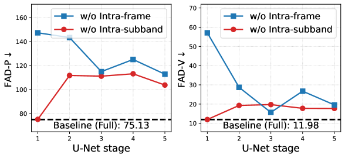
*Figure 4:Layer-wise ablation on the 5-stage DP-U-Net Small by independently omitting a single attention block at each stage.*

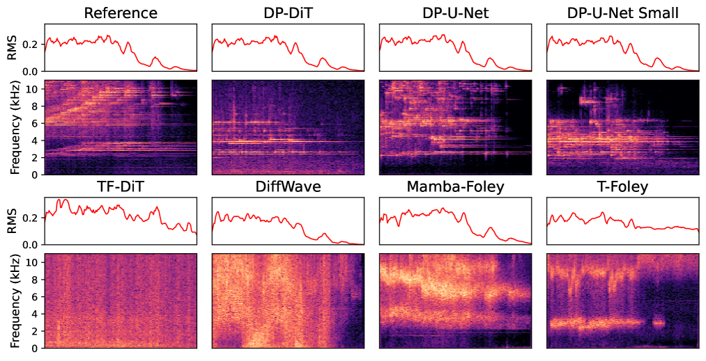
*Figure 5:Reference and generated RMS energy curves and audio examples for the Chime class from the FSD-Kaggle2018 dataset.*

---
**Usage Info**: 2690 tokens used.
**Generated at**: 2026-08-03 16:20:42

---

# 📚 Stable Autoregressive Speech Generation with Low-Frame-Rate High-Dimensional Continuous Tokens

🚀 URL: https://arxiv.org/html/2607.29363

## 🌏 Abstract (원문)
Balancing sequence length, representational capacity, and long-horizon stability is a central problem in autoregressive (AR) speech and audio generation. Representations with higher frame rates or greater capacity can preserve more signal detail, but they also make streaming generation more vulnerable to distribution drift and AR error accumulation. Conversely, shorter and more compressed representations simplify AR modeling, but their limited bandwidth may discard important components and constrain the upper bound of reconstruction fidelity and generation quality. We ask whether a low-frame-rate, high-dimensional, high-bandwidth continuous representation can be co-designed with a streaming generation framework to support robust high-fidelity reconstruction, strong single-token predictability, and superior long-horizon stability. We decompose this goal into two coupled problems: what geometric and statistical properties a high-dimensional representation space should have, and how an AR continuous-token generator should be structured to resist error accumulation. Accordingly, we proposeLocodec, a locally encoded codec that shapes its representation space to improve the interpolatability of a lower-dimensional core manifold and the identifiability of the native high-dimensional coordinates, thereby improving the predictability of high-dimensional high-bandwidth tokens. We also proposeMP-ELD, a single-token AR flow-matching framework that uses multi-path information routing and residual classifier-free guidance to mitigate error accumulation. Experiments with88-Hz,768768-dimensional tokens show that our design preserves reconstruction quality, improves single-token predictability, achieves competitive WER, and maintains stable long-form synthesis, without using external SSL/ASR models, pretrained text language models, or post-training stages.
## 🌏 Abstract (번역)
자기회귀(AR) 음성 및 오디오 생성에서 시퀀스 길이, 표현 용량, 장기 안정성 간의 균형을 맞추는 것은 핵심적인 문제입니다. 더 높은 프레임 속도 또는 더 큰 용량을 가진 표현은 더 많은 신호 세부 정보를 보존할 수 있지만, 스트리밍 생성 시 분포 드리프트 및 AR 오류 누적에 더 취약하게 만듭니다. 반대로, 더 짧고 압축된 표현은 AR 모델링을 단순화하지만, 제한된 대역폭으로 인해 중요한 구성 요소를 버리고 재구성 충실도 및 생성 품질의 상한을 제한할 수 있습니다. 우리는 낮은 프레임 속도, 고차원, 고대역폭 연속 표현이 강력한 고충실도 재구성, 강력한 단일 토큰 예측 가능성, 우수한 장기 안정성을 지원하기 위해 스트리밍 생성 프레임워크와 함께 공동 설계될 수 있는지 질문합니다. 우리는 이 목표를 두 가지 연관된 문제로 분해합니다: 고차원 표현 공간이 가져야 할 기하학적 및 통계적 특성은 무엇이며, AR 연속 토큰 생성기가 오류 누적에 저항하도록 어떻게 구성되어야 하는가. 이에 따라 우리는 저차원 코어 매니폴드의 보간 가능성과 고유 고차원 좌표의 식별 가능성을 향상시키기 위해 표현 공간을 형성하는 로컬 인코딩 코덱인 Locodec을 제안하여 고차원 고대역폭 토큰의 예측 가능성을 향상시킵니다. 또한 우리는 오류 누적을 완화하기 위해 다중 경로 정보 라우팅 및 잔여 분류기 없는 안내를 사용하는 단일 토큰 AR 흐름 매칭 프레임워크인 MP-ELD를 제안합니다. 88Hz, 768차원 토큰을 사용한 실험은 우리의 설계가 외부 SSL/ASR 모델, 사전 훈련된 텍스트 언어 모델 또는 후처리 단계 없이 재구성 품질을 보존하고, 단일 토큰 예측 가능성을 향상시키며, 경쟁력 있는 WER을 달성하고, 안정적인 장문 합성을 유지함을 보여줍니다.

## 🔍 Methods & Results
- 자기회귀(AR) 오디오 생성의 핵심 과제인 시퀀스 길이, 표현 용량, 장기 안정성 간의 균형을 해결하기 위해, 낮은 프레임 속도, 고차원, 고대역폭 연속 표현과 스트리밍 생성 프레임워크의 공동 설계를 목표로 합니다.
- 기존의 낮은 비트레이트 토크나이저의 정보 손실 및 높은 비트레이트 이산 토크나이저의 모델 복잡성 문제를 지적하며, 연속 표현이 고대역폭 모델링과 재구성 충실도 향상에 유리함을 강조합니다.
- 고차원 공간에서 AR 오류 누적을 줄이기 위해 토크나이저 프레임 속도를 낮추는 것이 중요하며, 외부 SSL/ASR 모델이나 명시적인 의미-음향 분리 없이 재구성 충실도를 최적화하는 것을 선호합니다.
- Locodec 토크나이저는 고차원 토큰 공간을 구형으로 가정하고, 명시적인 vMF 사전 분포 대신 구형 회전 노이즈 주입을 통해 디코더의 각도 견고성을 훈련합니다.
- Locodec은 '접미사 차원 드롭아웃(postfix dimension dropout)' 메커니즘을 통해 토큰 차원 간에 가용성 편향을 유도하여, 더 자주 보존되는 차원에 더 많은 에너지를 할당함으로써 토큰의 식별 가능성을 향상시킵니다.
- Locodec은 고차원 구형 토큰을 저차원 코어 매니폴드에 직교 투영하고 다시 리프팅하는 과정을 통해 보간 가능성을 유도하며, 양방향 커밋먼트 손실과 듀얼 경로 노이즈 재구성 목표를 사용하여 두 공간을 정렬하고 저차원 매니폴드가 재구성 핵심 정보를 인코딩하도록 장려합니다.
- MP-ELD(Multi-Path ELD)는 AR 흐름 매칭 프레임워크로, 정보 경로 충돌 및 음향 상태 드리프트를 완화하기 위해 조건화 정보를 기능적으로 분리된 채널로 라우팅합니다.
- MP-ELD는 세 가지 단계별 조건화 벡터를 사용합니다: 단거리 연속성을 위한 '로컬 연속성(local-continuity)', 장기 안정성을 위한 '자기 일관성(self-consistency)', 외부 제어 신호와의 정렬을 위한 '정렬 일관성(alignment-consistency)'입니다.
- 세 가지 조건화 벡터는 그람-슈미트 변환을 통해 직교화되어 각 벡터가 이전 벡터에 포함되지 않은 잔여 정보를 인코딩하도록 장려하며, 이를 통해 다중 경로 잔여 분류기 없는 안내(multi-path residual CFG)를 적용합니다.
- 추론 시에는 로컬 연속성 경로를 항상 유지하며, 자기 일관성 및 정렬 일관성 잔여에 가이던스 가중치를 적용하고, 특히 초기 시간(small-τ) 구간에서 불안정한 자기 일관성 외삽을 피하기 위해 시간 의존적인 자기 일관성 가이던스 가중치(λ_sc(τ))를 사용합니다.
- 실험은 88Hz, 768차원 토큰을 사용하여 Locodec 및 MP-ELD 설계가 재구성 품질을 보존하고, 단일 토큰 예측 가능성을 향상시키며, 경쟁력 있는 WER을 달성하고, 외부 SSL/ASR 모델이나 사전 훈련된 텍스트 언어 모델 없이 안정적인 장문 합성을 유지함을 보여줍니다.

## 🖼 Figures
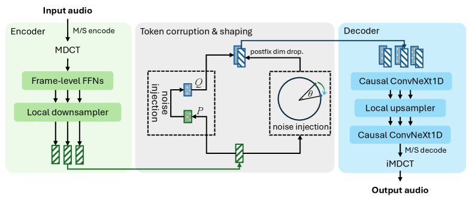
*Figure 1:Illustration of the Locodec tokenizer architecture, consisting of MDCT coefficient extraction, a fully local encoder, a token-grid refiner, a coefficient-grid predictor, and an inverse-MDCT stage for waveform reconstruction.*

*Figure 2:Illustration of the MP-ELD framework. Multiple local encoders map the same input token into distinct hidden spaces, whose functional roles are shaped by different AR information paths through training dynamics. A flow-matching decoder predicts pathwise next-token velocity fields conditioned on the corresponding path embeddings, which are combined by multi-path residual CFG during inference.*

*Figure 3:Coordinate-wise energy profiles of Locodec tokens. When combined with rotation noise injection, PDD automatically induces a stable prefix-to-postfix energy hierarchy, while models without postfix dropout keep an almost uniform energy distribution across dimensions.*

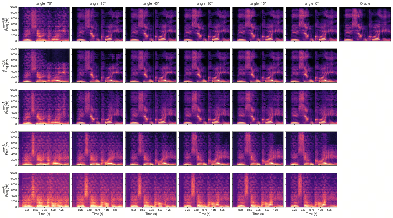
*Figure 4:Spectral visualization of Locodec reconstructions under angular token corruption and prefix restriction. Columns correspond to different rotation angles and rows correspond to different retained prefix dimensions.*

*Figure 5:Training curves of the MP-ELD cosine direction loss for different Locodec configurations. The notation 
𝑑
/
PDD
 denotes the core dimension and whether PDD is used. All MP-ELD models use the same architecture and training setup. Faster convergence and lower final loss indicate that the corresponding token representation is easier to predict under the fixed generator configuration.*

*Figure 6:WER/SIM trade-off under different CFG configurations on the internal CFG-selection set. Each point corresponds to one setting from the sweep over 
(
𝜆
sc
max
,
𝜆
ac
,
𝛾
)
. The scatter shows that alignment-consistency guidance mainly affects WER, while self-consistency guidance mainly affects SIM, and that the bridge-time schedule controls the trade-off induced by self-consistency extrapolation. Darker points indicate configurations closer to the preferred low-WER, high-SIM region.*

*Figure 7:Spectrograms of the same utterance generated under different CFG configurations. Each title reports 
(
𝜆
sc
max
,
𝜆
ac
,
𝛾
)
, WER, and SIM for the generated sample. The six examples are ordered from top-left to bottom-right by increasing SIM. The visualization shows that different CFG configurations lead to different forms of AR error accumulation, including early collapse, delayed spectral drift, harmonic repetition, and frequency-band energy drift.*

*Figure 8:Long-form segment-level SIM under representative CFG configurations. Each generated utterance is split into five non-overlapping 
10
-second segments. Each subplot fixes 
(
𝜆
sc
max
,
𝜆
ac
)
 and compares different 
𝛾
 values. Curves show dataset-level mean segment SIM, and error bars indicate 
95
%
 confidence intervals. The legend reports global WER and global SIM. The annotated values correspond to the configuration with the best overall stability–quality trade-off in each subplot.*

---
**Usage Info**: 18747 tokens used.
**Generated at**: 2026-08-03 16:21:01

---

# 📚 ParaASR: Multi-Token Prediction for Fast and Long-Context LLM-Based Speech Recognition

🚀 URL: https://arxiv.org/html/2607.29279

## 🌏 Abstract (원문)
Audio-encoder–LLM-decoder architectures have emerged as the dominant paradigm for modern automatic speech recognition (ASR), substantially improving transcription quality through large-scale language modeling. However, the computational cost of autoregressive decoding scales with decoder size, creating a fundamental trade-off between recognition quality and serving latency. This raises a central question:can LLM-based ASR attain state-of-the-art accuracy without sacrificing efficiency?We argue that this trade-off is not inherent to the problem itself. Unlike open-ended text generation, ASR outputs are strongly anchored to the input speech signal, providing a natural inductive bias toward high-parallelism decoding. Building on this observation, we introduceParaASR, an ASR system that leverages Multi-Token Prediction (MTP) to let a 4B LLM decoder emit multiple tokens per forward step. Starting from a publicly available audio-language foundation, the model first establishes a robust autoregressive recognizer and then aligns five future-token branches through a staged optimization recipe. At inference time, the system proposes a six-token continuation per step and admits only the verified prefix into the transcript, thus preserving the safety of standard autoregressive decoding. The average accepted length reaches 5.0 out of 6 proposed tokens, confirming that the deterministic structure of speech makes ASR an especially natural setting for multi-token decoding.ParaASRfurther retains a native 32K-context window and transcribes up to 30 minutes of audio in a single pass. Across diverse benchmarks, the model attains average error rates of 2.97%, 3.68%, and 3.70% on Chinese, English, and long-form evaluations, respectively, while reaching a real-time factor (RTF) as low as 0.0053. Together, these results show that decoder scaling, low-latency inference, and long-context transcription need not be competing goals when future-token proposals are anchored by the acoustic signal and guarded by autoregressive verification.
## 🌏 Abstract (번역)
오디오 인코더-LLM 디코더 아키텍처는 현대 자동 음성 인식(ASR)의 지배적인 패러다임으로 부상했으며, 대규모 언어 모델링을 통해 전사 품질을 크게 향상시켰습니다. 그러나 자기회귀 디코딩의 계산 비용은 디코더 크기에 비례하여 인식 품질과 서비스 지연 시간 사이에 근본적인 상충 관계를 만듭니다. 이는 LLM 기반 ASR이 효율성을 희생하지 않고도 최첨단 정확도를 달성할 수 있는가라는 핵심 질문을 제기합니다. 우리는 이러한 상충 관계가 문제 자체에 내재된 것이 아니라고 주장합니다. 개방형 텍스트 생성과 달리 ASR 출력은 입력 음성 신호에 강력하게 고정되어 있어 고병렬 디코딩에 대한 자연스러운 귀납적 편향을 제공합니다. 이러한 관찰을 바탕으로, 우리는 4B LLM 디코더가 각 순방향 단계에서 여러 토큰을 방출하도록 다중 토큰 예측(MTP)을 활용하는 ASR 시스템인 ParaASR을 소개합니다. 공개적으로 사용 가능한 오디오-언어 기반에서 시작하여, 모델은 먼저 강력한 자기회귀 인식기를 구축한 다음 단계별 최적화 레시피를 통해 5개의 미래 토큰 분기를 정렬합니다. 추론 시, 시스템은 단계당 6개의 토큰 연속을 제안하고 검증된 접두사만 전사본에 허용하여 표준 자기회귀 디코딩의 안전성을 유지합니다. 평균 허용 길이는 제안된 6개 토큰 중 5.0개에 달하며, 음성의 결정론적 구조가 ASR을 다중 토큰 디코딩에 특히 자연스러운 환경으로 만든다는 것을 확인시켜 줍니다. ParaASR은 또한 기본 32K 컨텍스트 창을 유지하며 단일 패스로 최대 30분 분량의 오디오를 전사합니다. 다양한 벤치마크에서 이 모델은 중국어, 영어 및 장문 평가에서 각각 2.97%, 3.68%, 3.70%의 평균 오류율을 달성했으며, 실시간 계수(RTF)는 0.0053까지 낮아졌습니다. 종합적으로, 이러한 결과는 미래 토큰 제안이 음향 신호에 고정되고 자기회귀 검증에 의해 보호될 때 디코더 스케일링, 저지연 추론 및 장문 전사가 상충하는 목표가 아닐 수 있음을 보여줍니다.

## 🔍 Methods & Results
- ParaASR은 인코더-어댑터-디코더 아키텍처를 기반으로 하며, 4B LLM 디코더가 각 순방향 단계에서 여러 토큰을 방출하도록 다중 토큰 예측(MTP)을 활용합니다.
- 0.6B 트랜스포머 오디오 인코더는 훈련 중 고정되며, 4B 덴스 트랜스포머 디코더는 사전 훈련된 텍스트 LLM으로 초기화되고 32K 컨텍스트 창을 지원합니다.
- 32K 컨텍스트 창 덕분에 최대 30분 분량의 오디오를 단일 패스로 전사할 수 있어 복잡한 청크-앤-스티치 파이프라인이 필요 없습니다.
- 추론 시, MTP-5 헤드는 단계당 6개의 토큰(메인 토큰 + 5개 미래 토큰)을 제안하며, 검증된 접두사만 전사본에 허용하여 표준 자기회귀 디코딩의 안전성을 유지합니다.
- 평균적으로 제안된 6개 토큰 중 5.0개가 허용되어 다중 토큰 디코딩에 대한 음성 신호의 적합성을 확인했습니다.
- 다양한 벤치마크에서 중국어 2.97%, 영어 3.68%, 장문 평가 3.70%의 평균 오류율을 달성했으며, 실시간 계수(RTF)는 0.0053까지 낮아졌습니다.
- 이러한 결과는 음향 신호에 고정되고 자기회귀 검증에 의해 보호되는 미래 토큰 제안을 통해 디코더 스케일링, 저지연 추론 및 장문 전사가 동시에 달성될 수 있음을 보여줍니다.

## 🖼 Figures
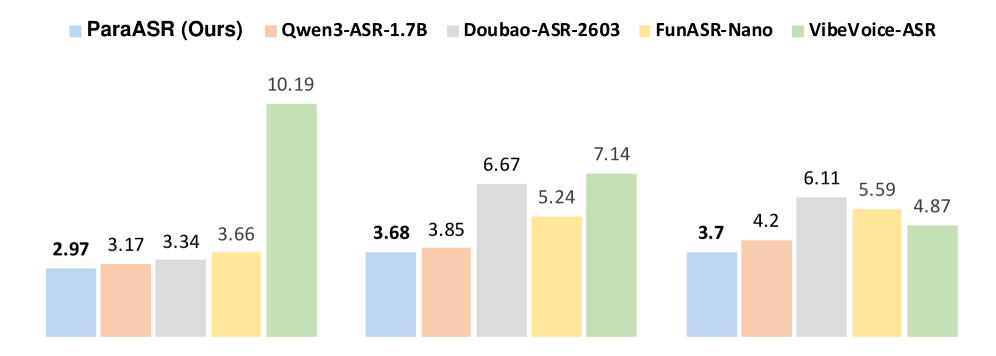
*Figure 1:Performance comparison across Chinese, English, and long-form ASR benchmarks. Chinese results are reported in CER, while English and long-form results are reported in WER. Lower is better.*

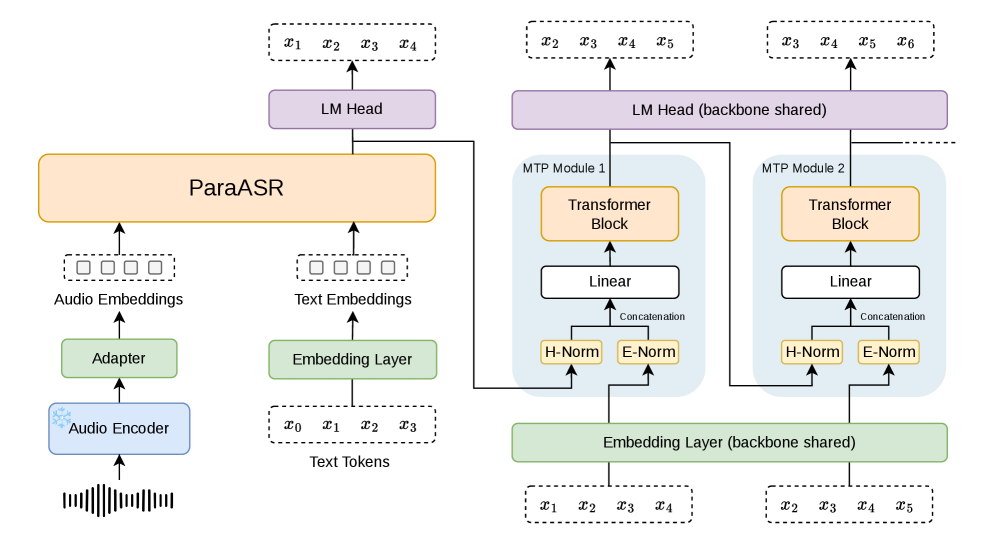
*Figure 2:Architecture of ParaASR. A frozen audio encoder produces 80 ms acoustic embeddings, a linear adapter maps them to the decoder hidden space, and multiple MTP blocks propose future transcript tokens in parallel with the main next-token prediction.*

---
**Usage Info**: 4681 tokens used.
**Generated at**: 2026-08-03 16:21:18

---

# 📚 TORUS: A Test of Rendering-Understanding Self-Coherence for Unified Audio Models https://torus-benchmark.github.io/

🚀 URL: https://arxiv.org/html/2607.28896

## 🌏 Abstract (원문)
Unified audio models capable of audio understanding, audio generation and, increasingly, audio editing are proliferating rapidly. Yet a basic question about them remains unanswered: do the two heads of a unified model agree about the same audio? Current practice evaluates each capability in isolation on specialized benchmarks, and never asks whether a model can make sense of its own generations. We present TORUS, the first self-coherence test for audio-native unified models. TORUS comprises 48 three-stage self-coherence tests carrying 432 six-option questions spanning speech, sound and music across five task families. We holistically evaluate five open unified models alongside a Cascaded Baseline that combines state-of-the-art specialized generation, editing and understanding models. The best unified model answers 50.5% of questions against the Cascaded Baseline’s 63.2% and a 16.7% chance floor. Models struggle on audio editing. Among the evaluated audio models (specialized and unified), we observe limited self-coherence, and we position self-coherence as an essential test for future audio systems.
## 🌏 Abstract (번역)
오디오 이해, 오디오 생성, 그리고 점차 오디오 편집까지 가능한 통합 오디오 모델이 빠르게 확산되고 있습니다. 그러나 이들에 대한 기본적인 질문은 여전히 답을 얻지 못하고 있습니다. 즉, 통합 모델의 두 헤드가 동일한 오디오에 대해 동의하는가 하는 것입니다. 현재의 관행은 각 기능을 전문화된 벤치마크에서 개별적으로 평가하며, 모델이 자체 생성물을 이해할 수 있는지 여부는 묻지 않습니다. 우리는 오디오 네이티브 통합 모델을 위한 최초의 자기 일관성 테스트인 TORUS를 제시합니다. TORUS는 음성, 사운드, 음악을 아우르는 5가지 작업군에 걸쳐 432개의 6지선다형 질문을 포함하는 48개의 3단계 자기 일관성 테스트로 구성됩니다. 우리는 최첨단 전문 생성, 편집 및 이해 모델을 결합한 Cascaded Baseline과 함께 5개의 공개 통합 모델을 전체적으로 평가합니다. 최고의 통합 모델은 Cascaded Baseline의 63.2%와 16.7%의 우연 수준에 비해 50.5%의 질문에 정답을 맞혔습니다. 모델들은 오디오 편집에서 어려움을 겪습니다. 평가된 오디오 모델(전문 및 통합) 중에서 제한적인 자기 일관성을 관찰했으며, 우리는 자기 일관성을 미래 오디오 시스템을 위한 필수적인 테스트로 제시합니다.

## 🔍 Methods & Results
- 통합 오디오 모델의 오디오 이해 및 생성 기능 간의 자기 일관성 부족 문제를 해결하기 위해 TORUS라는 새로운 자기 일관성 테스트를 제안했습니다.
- TORUS는 음성, 사운드, 음악을 포함하는 5가지 작업군에 걸쳐 48개의 3단계 테스트와 432개의 6지선다형 질문으로 구성됩니다.
- 5개의 공개 통합 모델과 최첨단 전문 모델을 결합한 Cascaded Baseline을 비교 평가했습니다.
- 평가 결과, 최고의 통합 모델은 50.5%의 정답률을 보인 반면, Cascaded Baseline은 63.2%의 정답률을 기록했으며, 우연 수준은 16.7%였습니다.
- 모델들은 특히 오디오 편집 작업에서 어려움을 겪는 것으로 나타났습니다.
- 평가된 모든 오디오 모델(전문 및 통합)에서 제한적인 자기 일관성이 관찰되었으며, 자기 일관성 테스트가 미래 오디오 시스템 개발에 필수적임을 강조했습니다.

## 🖼 Figures
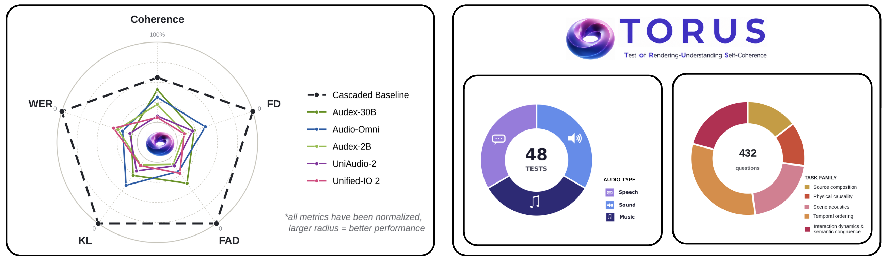
*Figure 1:Left: Self-evaluation and objective metrics of models. Larger radius = better, rim = perfect. Right: TORUS: 16 tests per audio type (left); 432 questions over five task families (right).*

![Figure 2:Benchmarking pipeline and evaluation strategy for unified audio models that are capable of audio generation, editing and understanding. A self-coherence test comprises 3 stages (Generation/Edit/Counterfactual Edit) each testing different abilities of the model. Prompts (text
+
audio) are passed to the generation head (
𝐺
) which generates/edits audio which is passed to the understanding head (
𝑈
) for answering 3 six-option MCQs per stage. Coherence is computed as % of questions answered correctly by the model. Refer to Fig. 6 for details on how models without native editing have been benchmarked.](../images/2026-08-03/2607.28896/2607.28896_fig1.png)
*Figure 2:Benchmarking pipeline and evaluation strategy for unified audio models that are capable of audio generation, editing and understanding. A self-coherence test comprises 3 stages (Generation/Edit/Counterfactual Edit) each testing different abilities of the model. Prompts (text
+
audio) are passed to the generation head (
𝐺
) which generates/edits audio which is passed to the understanding head (
𝑈
) for answering 3 six-option MCQs per stage. Coherence is computed as % of questions answered correctly by the model. Refer to Fig. 6 for details on how models without native editing have been benchmarked.*

*Figure 3:The test-generation pipeline: human-authored seed 
→
 test architect 
→
 question author 
→
 coupled gate (muted-audio + ideal-generation solvers, two repair rounds) 
→
 human verification.*

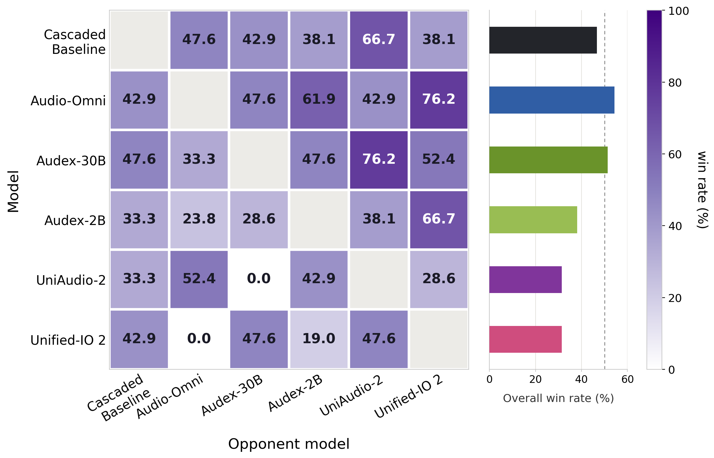
*Figure 4:Blind pairwise A/B study of human preference on model generations (7 raters, 315 judgments). Full protocol, reliability metrics and the pairwise win-rate matrix are in Appendix E.*

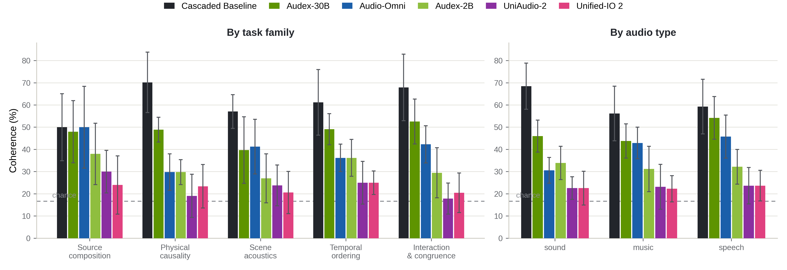
*Figure 5:Coherence by task family (left) and audio type (right). Whiskers: 95% cluster-bootstrap CIs over tests; dashed line: 16.7% chance; Audio-Omni: native-edit arm.*

*Figure 6:Benchmarking pipeline for a self-coherence test in TORUS for unified models that lack native audio-editing. We resort to a self-caption edit chain as shown above. 
𝐺
 and 
𝑈
 may be substituted with specialized models to construct the Cascaded Baseline.*

---
**Usage Info**: 1542 tokens used.
**Generated at**: 2026-08-03 16:21:25

---

# 📚 MoRAE: Flow-Friendly Self-Supervised Latents for Text-to-Motion Generation

🚀 URL: https://arxiv.org/html/2607.29180

## 🌏 Abstract (원문)
Text-to-motion generation must produce motions that are semantically correct, temporally coherent, and physically plausible. A natural approach is to first project motion data into a structured semantic space and then train a generative model within that space. Such a paradigm has been highly successful in image generation through Representation Autoencoders (RAEs) , where a frozen self-supervised encoder provides semantic features for diffusion or flow models to learn from. However, direct transfer of such a paradigm to motion space using Motion-JEPA as the frozen encoder fails dramatically. We diagnose this failure geometrically and identify two motion-specific bottlenecks: (1) the JEPA feature space is spectrally ill-conditioned, making the Gaussian-to-data transport unstable; and (2) even with a well-conditioned spectrum, flow residuals tend to align with decoder-sensitive directions, where small latent errors are amplified into large motion artifacts after decoding. Based on these insights, we propose MoRAE. MoRAE addresses the two bottlenecks separately. A compact bottleneck distills the structured JEPA representation while removing weak and redundant directions, bringing the latent spectrum into a transport-stable regime. Motion-coupled training then aligns the retained latent geometry with the decoder, making characteristic flow errors less costly after decoding. With this flow-friendly latent, a standard non-autoregressive Flow-Matching DiT achieves state-of-the-art performance.
## 🌏 Abstract (번역)
텍스트-모션 생성은 의미론적으로 정확하고, 시간적으로 일관되며, 물리적으로 타당한 모션을 생성해야 합니다. 자연스러운 접근 방식은 먼저 모션 데이터를 구조화된 의미론적 공간으로 투영한 다음, 해당 공간 내에서 생성 모델을 훈련하는 것입니다. 이러한 패러다임은 표현 오토인코더(RAE)를 통한 이미지 생성에서 큰 성공을 거두었으며, 여기서 고정된 자기 지도 인코더는 확산 또는 플로우 모델이 학습할 수 있는 의미론적 특징을 제공합니다. 그러나 고정된 인코더로 Motion-JEPA를 사용하여 이러한 패러다임을 모션 공간으로 직접 전이하는 것은 극적으로 실패합니다. 우리는 이 실패를 기하학적으로 진단하고 두 가지 모션 특정 병목 현상을 식별했습니다: (1) JEPA 특징 공간은 스펙트럼적으로 조건이 좋지 않아 가우시안-데이터 전송을 불안정하게 만들고; (2) 스펙트럼 조건이 좋더라도 플로우 잔차가 디코더에 민감한 방향과 정렬되는 경향이 있어, 작은 잠재 공간 오류가 디코딩 후 큰 모션 아티팩트로 증폭됩니다. 이러한 통찰력을 바탕으로 우리는 MoRAE를 제안합니다. MoRAE는 두 가지 병목 현상을 개별적으로 해결합니다. 컴팩트 병목은 구조화된 JEPA 표현을 증류하면서 약하고 중복되는 방향을 제거하여 잠재 스펙트럼을 전송-안정적인 영역으로 가져옵니다. 모션 결합 훈련은 유지된 잠재 기하학을 디코더와 정렬하여 디코딩 후 특성적인 플로우 오류의 비용을 줄입니다. 이 플로우 친화적인 잠재 공간을 통해 표준 비자기회귀 플로우 매칭 DiT는 최첨단 성능을 달성합니다.

## 🔍 Methods & Results
- MoRAE는 세 단계로 훈련됩니다: 1) 자기 지도 Motion-JEPA 인코더(f) 사전 훈련, 2) f를 고정한 채 컴팩트 토크나이저(변이형 인코더 E, 특징 디코더 Df, 모션 디코더 Dm) 훈련, 3) 모든 토크나이저 모듈을 고정하고 결과 잠재 시퀀스에 대해 표준 플로우 매칭 DiT 훈련.
- Motion-JEPA 사전 훈련은 마스크된 잠재 예측을 통해 시간적 역학 및 관절 간 의존성을 추론하도록 인코더를 유도하며, 이 단계에서 생성된 특징(H)은 구조적으로 유익하지만 스펙트럼적으로 조건이 좋지 않습니다.
- 토크나이저 훈련 단계에서 컴팩트 병목 현상과 모션 결합 훈련을 통해 JEPA 표현을 저차원 잠재 공간으로 압축하고, 잠재 스펙트럼을 전송-안정적인 영역으로 만들며, 잠재 기하학을 디코더와 정렬하여 디코딩 후 플로우 오류 비용을 줄입니다.
- 최종 단계에서는 사전 훈련된 모듈을 고정한 후, DiT 기반 플로우 매칭 모델을 잠재 토큰 시퀀스에 대해 훈련하여 텍스트 조건부 모션 생성을 수행합니다.
- 추론 시 가우시안 노이즈로부터 생성된 잠재 공간을 디코딩하여 모션을 생성하며, CLIP 텍스트 인코더와 분류기 없는 가이던스를 활용합니다.
- MoRAE는 이러한 플로우 친화적인 잠재 공간을 통해 텍스트-모션 생성에서 최첨단 성능을 달성합니다.

## 🖼 Figures

*Figure 1:Overview of MoRAE. (a) Motion-JEPA predicts EMA-teacher features under temporal-span and joint-group masks. (b) Frozen features are compressed into a 
32
-D latent and jointly decoded back to features and motion. (c) After freezing the tokenizer, a non-autoregressive DiT learns flow matching in the compact latent space, and the frozen decoder maps generated latents back to motion.*

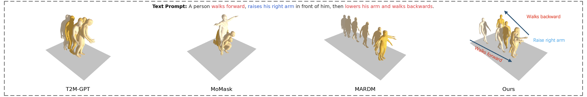
*Figure 2:Qualitative comparison on a compositional text prompt.*

---
**Usage Info**: 4850 tokens used.
**Generated at**: 2026-08-03 16:21:42

---

# 📚 WaiT for the Signal: Simple Frequency-Aware Flow-Matching

🚀 URL: https://arxiv.org/html/2607.28760

## 🌏 Abstract (원문)
As image generation models scale to ever higher resolutions, global coherence, local detail, and texture fidelity become critical axes for generation quality. However, standard flow matching treats all spatial frequencies uniformly, ignoring the natural frequency hierarchy where high-frequency bands become indistinguishable from pure noise far earlier than coarse structures. We introduceWaiT, aWavelet-awareimageTransformer that decomposes generation into coarse and fine bands via lossless wavelets. True to its name, the high-frequency bandswait for the signal: staying pure noise until coarse structure has emerged, then joining the flow for joint refinement. Since standard FID discards fine-grained detail through aggressive downsampling, we introduce a more stringent three-axis evaluation protocol to assess quality at native resolution. On ImageNet 512×	imes512, WaiT achieves a pixel-space FID of 1.43 and is Pareto-optimal across all three axes, reducing sampling compute by up to 50%.With our largest 2B model, we set a new state-of-the-art FID of 1.3 for pixel-space models on ImageNet 512 resolution.Our formulation outperforms even the strongest latent-space models on texture fidelity, and scales seamlessly to high-resolution OpenImages and to video generation, achieving a state-of-the-art FVD of 0.84 on Kinetics-600 with no algorithmic modifications.
## 🌏 Abstract (번역)
이미지 생성 모델이 점점 더 높은 해상도로 확장됨에 따라, 전역적 일관성, 지역적 세부 사항, 텍스처 충실도가 생성 품질의 중요한 축이 됩니다. 그러나 표준 플로우 매칭은 모든 공간 주파수를 균일하게 처리하여, 고주파 대역이 거친 구조보다 훨씬 일찍 순수한 노이즈와 구별할 수 없게 되는 자연스러운 주파수 계층 구조를 무시합니다. 우리는 손실 없는 웨이블릿을 통해 생성을 거친 대역과 미세 대역으로 분해하는 웨이블릿 인식 이미지 트랜스포머인 WaiT를 소개합니다. 이름 그대로 고주파 대역은 신호를 기다립니다. 즉, 거친 구조가 나타날 때까지 순수한 노이즈 상태를 유지한 다음, 공동 정제를 위해 플로우에 합류합니다. 표준 FID는 공격적인 다운샘플링을 통해 미세한 세부 사항을 버리기 때문에, 우리는 기본 해상도에서 품질을 평가하기 위한 보다 엄격한 3축 평가 프로토콜을 도입합니다. ImageNet 512x512에서 WaiT는 픽셀 공간 FID 1.43을 달성하며 모든 세 축에서 파레토 최적이며, 샘플링 계산량을 최대 50%까지 줄입니다. 가장 큰 2B 모델을 통해 ImageNet 512 해상도에서 픽셀 공간 모델에 대한 새로운 최첨단 FID 1.3을 설정했습니다. 우리의 공식은 텍스처 충실도에서 가장 강력한 잠재 공간 모델보다도 뛰어나며, 고해상도 OpenImages 및 비디오 생성으로 원활하게 확장되어 알고리즘 수정 없이 Kinetics-600에서 최첨단 FVD 0.84를 달성합니다.

## 🔍 Methods & Results
- WaiT는 이미지의 자연스러운 주파수 계층 구조와 스케일별 분해의 안정성에 기반하여, Discrete Wavelet Transform (DWT)을 사용하여 이미지를 저주파(LF) 및 고주파(HF) 대역으로 손실 없이 분해합니다.
- 표준 플로우 매칭과 달리, WaiT는 HF 대역이 거친 구조가 나타날 때까지 순수한 노이즈 상태를 유지하다가 이후 정제 과정에 합류하는 '지연된' 스케줄을 적용하여 주파수별 노이즈 스케줄을 명시적으로 제어합니다.
- LF 대역은 훈련 세트의 절대 LF 계수 95번째 백분위수로 정규화되고, HF 대역은 정규화되지 않은 상태로 유지되어 자연스러운 희소성을 보존합니다.
- 훈련 목표는 `x`-예측과 `v`-손실을 사용하며, 각 주파수 대역에 대해 별도로 적용되고 대역별 노이즈 수준에 따라 가중치가 부여됩니다.
- 추론 시에는 두 단계의 생성 과정을 거칩니다: 첫 번째 단계(`0 <= t < t*`)에서는 저해상도(LF 대역만)에서 ODE 통합을 수행하고, 두 번째 단계(`t* < t <= 1`)에서는 LF 대역을 역정규화하고 새로운 HF 노이즈를 주입한 후 IDWT를 통해 전체 해상도로 매핑하여 ODE를 계속합니다.
- 첫 번째 단계는 4배 적은 토큰으로 작동하여 샘플링 계산량을 최대 50%까지 절감합니다.
- ImageNet 512x512에서 픽셀 공간 FID 1.43을 달성했으며, 제안된 3축 평가 프로토콜에서 파레토 최적 성능을 보였습니다.
- 가장 큰 2B 모델로 ImageNet 512 해상도에서 픽셀 공간 모델 중 새로운 최첨단 FID 1.3을 기록했습니다.
- 텍스처 충실도 측면에서 강력한 잠재 공간 모델보다 우수하며, 고해상도 OpenImages 및 비디오 생성(Kinetics-600에서 최첨단 FVD 0.84)으로 원활하게 확장됩니다.

## 🖼 Figures

*Figure 1: Evaluating WaiT on ImageNet 512 and OpenImages 1024. Left: Pareto fronts of compute vs. FID, 5-crop FID, and high-frequency FWD; WaiT (green) dominates baselines at 2
×
 lower compute. Right: WaiT generates sharper textures/finer details than both JiT and RAE.*

*Figure 2:Overview of WaiT inference process. The low-frequency (LF) wavelet band is denoised first along a coarse time 
𝑡
LF
 to prioritize coarse structural coherence. The high-frequency (HF) bands wait as pure noise during this stage. At the crossover 
𝑡
LF
=
𝑡
∗
, the partially denoised LF band and the noisy HF bands are combined via the inverse DWT and jointly denoised yielding the final image.*

*Figure 3:Mutual information (MI) between noisy and clean wavelet bands. Top: Forward process on real images. Fine (HF) bands lose MI far earlier than coarse (LF). The star marks 
𝑡
∗
≈
0.25
, where fine MI drops below 0.01 nats. Bottom: The same asymmetry persists in backward process for JiT. See Appendix B for details on MI estimation.*

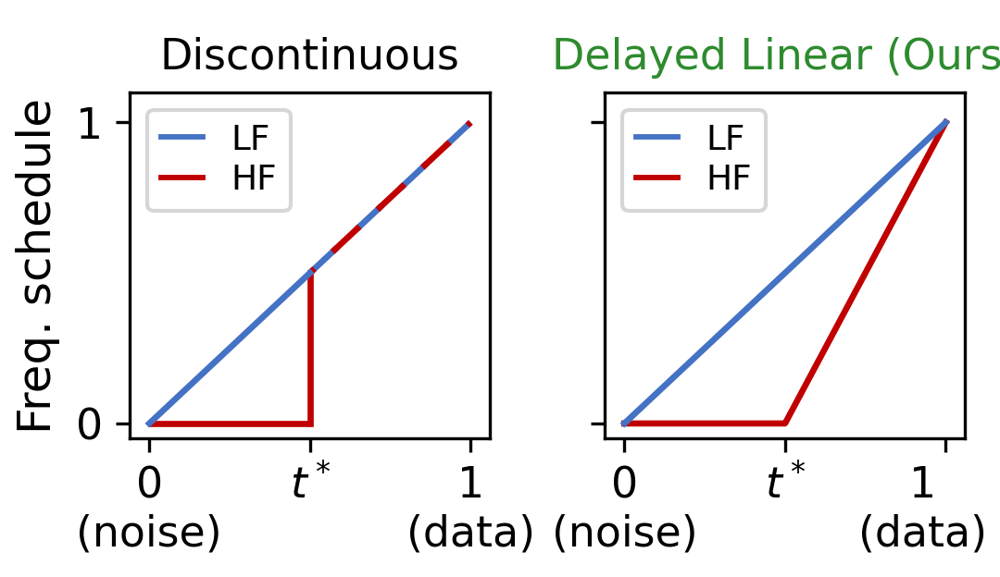
*(a)Schedule choice.*

*(a)Schedule choice.*

*(b)Optimal 
𝑡
∗
.*

![Figure 5:Qualitative comparison across state-of-the-art methods on ImageNet 512
×
512. WaiT-H/16, JiT-H/16 and RAE on three classes (strawberry, jacamar, leopard); each class displays the full resolution image with a yellow rectangle marking the zoomed crop. The crops highlight a consistent pattern: JiT visibly struggles with fine local detail (blurred strawberry seeds, jacamar eye and beak, and leopard’s facial detail), while RAE produces sharp textures but distorts high-frequency structure (with visible checkerboard artifacts). WaiT performs well on both axes, preserving fine detail and the underlying high-frequency structure.](../images/2026-08-03/2607.28760/2607.28760_fig7.png)
*Figure 5:Qualitative comparison across state-of-the-art methods on ImageNet 512
×
512. WaiT-H/16, JiT-H/16 and RAE on three classes (strawberry, jacamar, leopard); each class displays the full resolution image with a yellow rectangle marking the zoomed crop. The crops highlight a consistent pattern: JiT visibly struggles with fine local detail (blurred strawberry seeds, jacamar eye and beak, and leopard’s facial detail), while RAE produces sharp textures but distorts high-frequency structure (with visible checkerboard artifacts). WaiT performs well on both axes, preserving fine detail and the underlying high-frequency structure.*

*Figure 6:High-frequency wavelet coefficient distributions on OpenImages. At 512
×
512 our distribution already tracks the real data more closely than JiT, and the gap widens at 1024
×
1024 where JiT degrades to a markedly flatter, broader distribution – our advantage grows with resolution.*

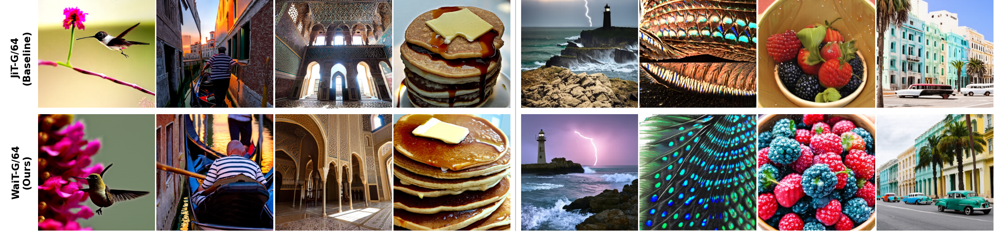
*Figure 7:Text-to-image samples at 1024 resolution. Per-column prompts and per-row method/encoder details are provided in Section˜D.5 in the Appendix.*

*Figure 8:Multi-resolution schedule variants compared in Table˜13. Blue: LF band signal coefficient; Red: HF band signal coefficient. Our Delayed Linear schedule (green title) is the only variant in which the HF band is, by construction, exactly pure 
𝒩
​
(
0
,
𝐼
)
 noise at 
𝑡
∗
, removing the train–test discontinuity present in the other variants.*

*Figure 9:Uncurated class-conditional samples from WaiT-H/16, ImageNet 512
×
512. Each row shows eight samples from a single class. From top to bottom: macaw, lion, bee, red panda, balloon, castle, ice cream, strawberry, cliff, volcano, daisy.*

*Figure 10:Single-class comparison (lighthouse) across methods on ImageNet 512
×
512. Top: WaiT-H/32 (ours). Middle: JiT baseline. Bottom: RAE latent-space model. Four different samples per method, each with zoomed-in crops of distinctive regions (sea, sky, texture, rocks).*

*Figure 11:Full-resolution starfish samples on ImageNet 512
×
512. From left to right: WaiT-H/32 (ours), JiT baseline, RAE.*

*Figure 12:OpenImages 512
×
512 Pareto fronts (5k train FID): FID, 5-Crop FID, and hFWD. WaiT (green triangles, solid line) dominates the JiT baseline (blue circles, dashed line) across all metrics and model scales, with the largest gap on high-frequency metrics. OpenImages 1024
×
1024 Pareto fronts are shown in the teaser (Figure˜1).*

*Figure 13:Uncurated WaiT-H/32 samples on OpenImages 512
×
512. Each row shows four samples from a single class. From top to bottom: butterfly, grass, leaf, rock, spider, twig.*

*Figure 14:Qualitative comparison on OpenImages 512
×
512. Each cell shows the generated image with two zoomed-in crops. Top: WaiT-H/32 (ours). Bottom: JiT baseline. Columns: brick, feather, insect, whiskers.*

*Figure 15:Single-class comparison on OpenImages 512
×
512. Four samples from the class stained glass for WaiT-H/32 (top) and JiT baseline (bottom).*

*Figure 16:Uncurated samples from WaiT-H/64 for OpenImages 1024
×
1024. Each row shows four samples from a single class, from top to bottom: car, duck, rose, sculpture, waterfall, airplane.*

*Figure 17:Single-class comparison on OpenImages 1024
×
1024. Samples for the class palm tree for WaiT-H/64 (ours, top), and JiT-H/64 baseline (bottom).*

*Figure 18:Qualitative comparison on OpenImages 1024
×
1024. Each cell shows the generated image with two zoomed-in crops. Top: WaiT-H/64 (ours). Bottom: JiT-H/64 baseline. Columns: car, cattle, cat, castle. WaiT produces sharper textures (e.g., cattle fur, cat whiskers) alongside better global structure.*

*Figure 19:Additional text-to-image samples at 1024
×
1024 (uncaptioned). See Section˜D.5 above for the per-column / per-row description.*

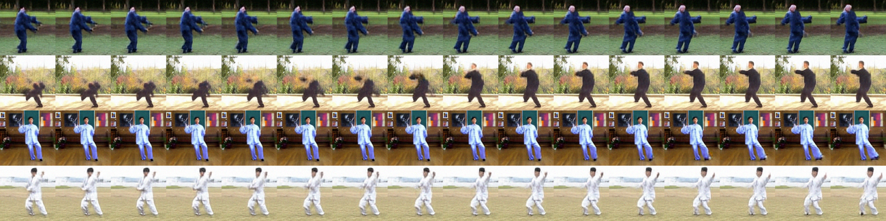
*Figure 20:Unconditional Taichi-HD samples from our wavelet-aware image transformer WaiT-B/8 model (128x128, 16 frames).*

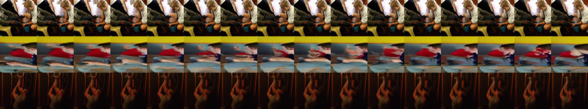
*Figure 21:Samples of WaiT-B/8 trained on Kinetics-600. Conditioned on first 5 frames, generates 16.*

---
**Usage Info**: 4691 tokens used.
**Generated at**: 2026-08-03 16:21:55

---

