# 🚩 (2026-08-04) Scholar Inbox 추천 논문 

# 📚 DLLM-TTS: Block Discrete Diffusion Language Model for Text-to-Speech Synthesis

🚀 URL: https://arxiv.org/html/2608.00011

## 🌏 Abstract (원문)
Current text-to-speech systems face a trade-off: autoregressive codec language models produce highly intelligible speech but require large-scale models and training data and decode tokens sequentially, while non-autoregressive approaches improve speed at the cost of linguistic accuracy. We present DLLM-TTS, a framework that formulates TTS as conditional block discrete diffusion over X-Codec2 neural audio codec tokens. The model decomposes sequences into blocks and applies masked diffusion within each block while processing blocks sequentially, learning both local acoustic coherence and global text-speech alignment. During inference, parallel token prediction within blocks enables efficient generation with a real-time factor (RTF) of 0.15. A 0.6B-parameter model trained on 20K hours achieves competitive performance on the Seed-TTS-eval benchmark, demonstrating that block discrete diffusion language models enable practical and data-efficient speech synthesis with parallel generation.
## 🌏 Abstract (번역)
현재 텍스트 음성 변환(TTS) 시스템은 상충 관계에 직면해 있습니다. 자기회귀 코덱 언어 모델은 매우 명료한 음성을 생성하지만 대규모 모델과 훈련 데이터가 필요하고 토큰을 순차적으로 디코딩하는 반면, 비자기회귀 방식은 언어적 정확성을 희생하여 속도를 향상시킵니다. 우리는 X-Codec2 신경 오디오 코덱 토큰에 대한 조건부 블록 이산 확산으로 TTS를 공식화하는 프레임워크인 DLLM-TTS를 제시합니다. 이 모델은 시퀀스를 블록으로 분해하고 각 블록 내에서 마스크 확산을 적용하는 동시에 블록을 순차적으로 처리하여 지역 음향 일관성과 전역 텍스트-음성 정렬을 모두 학습합니다. 추론 중에는 블록 내 병렬 토큰 예측을 통해 0.15의 실시간 계수(RTF)로 효율적인 생성이 가능합니다. 20,000시간 동안 훈련된 0.6B 매개변수 모델은 Seed-TTS-eval 벤치마크에서 경쟁력 있는 성능을 달성하여, 블록 이산 확산 언어 모델이 병렬 생성을 통해 실용적이고 데이터 효율적인 음성 합성을 가능하게 함을 보여줍니다.

## 🔍 Methods & Results
- DLLM-TTS는 X-Codec2 신경 오디오 코덱 토큰에 대한 조건부 블록 이산 확산으로 TTS를 공식화합니다.
- X-Codec2는 단일 단계 유한 스칼라 양자화(FSQ)를 사용하여 단일 토큰 스트림을 생성하여 트랜스포머 언어 모델과의 통합을 단순화합니다.
- 모델은 시퀀스를 크기 B=32 토큰(약 0.64초 오디오)의 블록으로 분해하고, 각 블록 내에서 마스크 확산을 적용하며 블록을 순차적으로 처리합니다.
- 훈련 중에는 마스크된 확산 시퀀스(z_t)와 이전 블록의 깨끗한 토큰(x_0)을 연결한 입력([x_t ⊕ x_0])을 사용하며, '계단형 어텐션 마스크'를 통해 지역적 일관성과 순차적 컨텍스트를 학습합니다.
- 모델은 텍스트 및 화자 정보에 조건화되어 마스크된 위치에 대한 교차 엔트로피 손실을 최소화하여 원본 토큰을 재구성하도록 학습됩니다.
- 가변 길이 시퀀스 처리를 위해 EOS(end-of-sequence) 토큰을 도입하여 명시적인 길이 예측 없이 합성이 완료될 때 EOS를 생성하도록 학습합니다.
- 모델은 Qwen2에서 초기화된 0.6B 매개변수 트랜스포머이며, 효율적인 장문 컨텍스트 모델링을 위해 RoPE(Rotary Position Embeddings)를 사용합니다.
- 추론 시에는 제로샷 화자 적응을 위해 참조-생성 패러다임을 사용하며, 참조 텍스트와 코덱 토큰으로 화자 특성을 제공하고, 생성 섹션은 블록 확산을 통해 반복적으로 디노이징됩니다.
- 추론 과정은 순차적인 블록 확산 디코딩을 통해 이루어지며, 각 블록 내에서 T=16개의 디노이징 단계를 병렬로 적용합니다.
- 신뢰도 기반 샘플링을 통해 모델 신뢰도가 임계값(τ=0.6)을 초과하는 토큰은 언마스크되고 고정되며, 나머지 토큰은 다음 단계에서 계속 마스크됩니다.
- 조기 종료 기능은 모든 마스크된 위치가 T 단계 이전에 언마스크되면 디노이징을 종료하여 계산량을 줄입니다.
- 생성 속도는 T=16일 때 RTF(Real-Time Factor) 0.15를 달성하며, 블록 간 KV 캐싱과 블록 순차적 설계로 스트리밍 및 낮은 첫 오디오 출력 시간을 가능하게 합니다.
- 20,000시간의 데이터로 훈련된 0.6B 매개변수 모델은 Seed-TTS-eval 벤치마크에서 경쟁력 있는 성능을 보여주었습니다.

## 🖼 Figures

*Figure 2:Visualization of the block-wise denoising process. (
𝐵
=
32
, 
𝑇
=
32
)*

---
**Usage Info**: 4204 tokens used.
**Generated at**: 2026-08-04 16:16:29

---

# 📚 SwanTale: Unified Multi-Speaker Speech and Audio Generation for Instruct and Zero-Shot Tasks

🚀 URL: https://arxiv.org/html/2608.02023

## 🌏 Abstract (원문)
Speech and audio generation is often needed in animation dubbing, audio drama, movies, advertising, games, podcasts, and short-video production. In these scenarios, creators may need to design voices without reference recordings, control speaker styles with natural language, support acoustic scenes with environments and audio effects, and later reuse the designed voices. Therefore, it is important to support multi-speaker speech and audio generation for both instruct and zero-shot tasks. The instruct task requires a caption of the environment, speaker styles, and fine-grained content, while the zero-shot task uses reference audio together with the same fine-grained content. We address these tasks from both the data and model sides. First, we proposeSwanData-Caption, which cleans raw speech and audio data, adds targeted synthetic coverage, and annotates diverse and accurate multi-level captions. Then, we proposeSwanTale, a multi-speaker expressive speech and audio generation model that supports both zero-shot and instruct tasks. We introduce SwanVAE to support high-quality multi-audio-modality generation. Then, we adopt reward-conditioned quality control and Engram conditioning, along with Unified MoE for multi-task and multi-audio-modality modeling. In addition, we use curriculum learning and GRPO post-training to let the model progressively learn and strengthen its capabilities. Experimental results show that SwanTale leads on multiple key zero-shot and instruct metrics, achieves the best expressiveness scores in both tasks, and supports complex instruct generation involving multi-speaker speech and audio.
## 🌏 Abstract (번역)
애니메이션 더빙, 오디오 드라마, 영화, 광고, 게임, 팟캐스트, 짧은 비디오 제작 등 다양한 시나리오에서 음성 및 오디오 생성이 자주 필요합니다. 이러한 상황에서 제작자는 참조 녹음 없이 음성을 디자인하고, 자연어를 사용하여 화자 스타일을 제어하며, 환경 및 오디오 효과로 음향 장면을 지원하고, 나중에 디자인된 음성을 재사용해야 할 수 있습니다. 따라서 지시(instruct) 및 제로샷(zero-shot) 작업 모두에 대해 다중 화자 음성 및 오디오 생성을 지원하는 것이 중요합니다. 지시 작업은 환경, 화자 스타일 및 세부 콘텐츠에 대한 캡션을 필요로 하는 반면, 제로샷 작업은 동일한 세부 콘텐츠와 함께 참조 오디오를 사용합니다. 우리는 데이터 및 모델 측면에서 이러한 작업을 다룹니다. 첫째, 원시 음성 및 오디오 데이터를 정제하고, 목표 합성 범위를 추가하며, 다양하고 정확한 다단계 캡션을 주석 처리하는 SwanData-Caption을 제안합니다. 다음으로, 제로샷 및 지시 작업을 모두 지원하는 다중 화자 표현 음성 및 오디오 생성 모델인 SwanTale을 제안합니다. 고품질 다중 오디오 모달리티 생성을 지원하기 위해 SwanVAE를 도입합니다. 그런 다음, 다중 작업 및 다중 오디오 모달리티 모델링을 위해 보상 조건부 품질 제어 및 Engram 조건화와 함께 Unified MoE를 채택합니다. 또한, 모델이 점진적으로 기능을 학습하고 강화할 수 있도록 커리큘럼 학습과 GRPO 후처리 학습을 사용합니다. 실험 결과는 SwanTale이 여러 주요 제로샷 및 지시 메트릭에서 선두를 차지하고, 두 작업 모두에서 최고의 표현력 점수를 달성하며, 다중 화자 음성 및 오디오를 포함하는 복잡한 지시 생성을 지원함을 보여줍니다.

## 🔍 Methods & Results
- SwanTale은 지시(instruct) 및 제로샷(zero-shot) 작업을 모두 지원하는 다중 화자 표현 음성 및 오디오 생성 모델로, SwanVAE와 플로우 기반 트랜스포머(DiT)를 핵심으로 합니다.
- SwanVAE는 48kHz 파형-잠재 오토인코더로, 48kHz 모노 오디오를 25Hz에서 96차원 잠재 벡터로 표현하며, 재구성 충실도, 표현 압축성, 다운스트림 플로우 모델의 학습 가능성 사이의 균형을 맞춥니다.
- SwanVAE는 다중 해상도 복소수 STFT 손실, 다중 해상도 다중 대역 Mel 손실, 프레임별 에너지 손실 및 KL 페널티를 사용하여 훈련되며, MPD, MRD, MBCSD와 같은 세 가지 판별자(discriminator) 계열을 통해 파형 구조를 제약합니다.
- SwanTale의 DiT 백본은 비인과적 플로우 매칭 확산 트랜스포머로, 캡션, 텍스트, 화자 턴, Engram 조건화 및 보상 조건부 품질 제어를 통해 제어됩니다.
- 보상 조건부 품질 제어는 STOI, PESQ, SI-SDR, MOS와 같은 품질 점수를 품질 캡션 및 플래그로 변환하여 모델이 생성 시 높은 품질을 지향하도록 유도합니다.
- Engram 조건화는 캡션 브랜치에 메모리 레이어를 추가하여 반복되는 캡션 패턴(n-그램) 인식을 강화하고 장거리 음향 계획의 부담을 줄입니다.
- Unified MoE는 플로우 기반 트랜스포머의 피드포워드 레이어에 적용되는 캡션 조건부 동적 용량 희소 모듈로, 태스크 라우터(샘플 수준 공유 전문가)와 오디오 라우터(프레임 수준 동적 Top-PP 라우팅)를 통해 모델 용량을 동적으로 할당합니다.
- Unified MoE는 라우팅된 오디오 전문가, 태스크 공유 전문가, 널(null) 전문가를 포함하며, 확산 시간에 따라 변화하는 전문가 예산을 통해 계산량을 조절합니다.
- SwanTale은 커리큘럼 학습을 통해 훈련됩니다: 1) 제로샷 기본 모델 훈련, 2) 깨끗한 음성 데이터에 대한 밀집 캡션 적응, 3) 전체 캡션 혼합 데이터 훈련, 4) 고표현력, 고품질 SFT(Supervised Fine-Tuning).
- GRPO(Group Relative Policy Optimization) 후처리 학습은 발음 정확도, 생성 안정성, 캡션 조건부 화자 속성 제어와 같은 반복적인 오류를 개선하기 위해 적용됩니다.
- GRPO는 Flow-GRPO를 사용하여 확률적 궤적 탐색을 수행하며, 발음 정확도, 길이 일관성, 구두점 일시정지, 오디오 경계 에너지, 파형 품질 및 태스크별 제어(지시: 속성, 제로샷: 화자 유사성)에 대한 보상을 사용합니다.
- 추론 과정은 지시 및 제로샷 생성에 대해 통합되며, 분해된 분류기 없는 안내(decomposed classifier-free guidance)와 시간 단계 의존적 안내 어닐링을 사용하여 조건부 제어를 강화합니다.

## 🖼 Figures
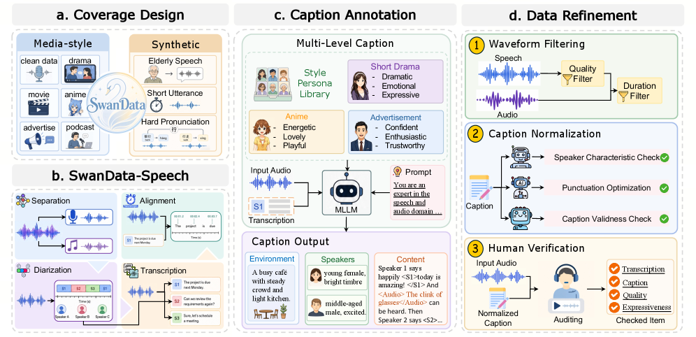
*Figure 1: Overview of the four-stage SwanData-Caption data processing pipeline, including coverage design, SwanData-Speech preprocessing, caption annotation, and data refinement.*

*Figure 2:Overview of SwanTale. Figure (a) shows the architecture of SwanTale, and Figure (b) shows Unified MoE. In (a), the zero-shot path supplies reference audio, while both tasks share text and caption. In (b), a task router selects experts at the sample level, while an audio router applies Top-
𝑃
 routing over frame-level audio and null experts.*

![Figure 3:Overview of SwanVAE. (a) The anti-aliased convolutional encoder, Gaussian variational bottleneck, and local Transformer decoder. (b) Generative alignment through flow matching and causal latent prediction. (c) Energy, multi-scale chroma, and multi-band energy readouts with waveform-derived targets. The decoder receives posterior samples 
𝐳
, while the alignment objectives operate on the posterior mean 
𝝁
𝜙
 exclusively during the SwanVAE training stage and do not enter the downstream generator at inference time.](../images/2026-08-04/2608.02023/2608.02023_fig2.png)
*Figure 3:Overview of SwanVAE. (a) The anti-aliased convolutional encoder, Gaussian variational bottleneck, and local Transformer decoder. (b) Generative alignment through flow matching and causal latent prediction. (c) Energy, multi-scale chroma, and multi-band energy readouts with waveform-derived targets. The decoder receives posterior samples 
𝐳
, while the alignment objectives operate on the posterior mean 
𝝁
𝜙
 exclusively during the SwanVAE training stage and do not enter the downstream generator at inference time.*

---
**Usage Info**: 12600 tokens used.
**Generated at**: 2026-08-04 16:16:46

---

# 📚 AnyBand: Unified Multi-Bandwidth Speech Extension via Frequency-Aware In-Context Spectral Infilling

🚀 URL: https://arxiv.org/html/2608.00572

## 🌏 Abstract (원문)
Bandwidth extension (BWE) aims to recover missing high-frequency content from band-limited speech. Existing methods often formulate BWE as a fixed or predefined bandwidth conversion problem, potentially requiring cutoff-specific models or retraining when the input bandwidth changes. This assumption limits their applicability to practical scenarios where speech may arrive with diverse cutoff frequencies. We propose AnyBand, a unified BWE framework that recasts bandwidth extension as in-context spectral infilling. Motivated by prompt-based zero-shot speech generation, AnyBand conditions high-frequency generation on the observed low-frequency spectrum, using the available band as a frequency-domain prompt that conveys content, speaker, prosodic, and spectral-envelope cues. This formulation enables a single model to perform cutoff-conditioned generation over a continuous range of input bandwidths. AnyBand is trained with missing-band conditional flow matching and an Easy-to-Balanced cutoff curriculum over continuously sampled cutoff frequencies. To better exploit the spectral prompt, we introduce a frequency-aware Diffusion Transformer that models cross-frequency interactions and long-range temporal dependencies, followed by a physically motivated multi-view adversarial refinement stage to enhance spectral realism, envelope coherence, and harmonic consistency. Experiments on multiple datasets and bandwidth settings show that AnyBand consistently improves spectral reconstruction over existing baselines while achieving competitive perceptual quality across both standard and irregular input cutoffs. Audio samples are available111https://danny-nus.github.io/AnyBand-DemoPage/.
## 🌏 Abstract (번역)
대역폭 확장(BWE)은 대역 제한된 음성에서 누락된 고주파 콘텐츠를 복구하는 것을 목표로 합니다. 기존 방법들은 종종 BWE를 고정되거나 미리 정의된 대역폭 변환 문제로 공식화하여, 입력 대역폭이 변경될 때 컷오프 특정 모델이나 재훈련을 필요로 할 수 있습니다. 이러한 가정은 음성이 다양한 컷오프 주파수로 도착할 수 있는 실제 시나리오에 대한 적용 가능성을 제한합니다. 우리는 대역폭 확장을 인컨텍스트 스펙트럼 채우기(in-context spectral infilling)로 재구성하는 통합 BWE 프레임워크인 AnyBand를 제안합니다. 프롬프트 기반 제로샷 음성 생성에서 영감을 받아, AnyBand는 관찰된 저주파 스펙트럼에 고주파 생성을 조건화하며, 사용 가능한 대역을 콘텐츠, 화자, 운율 및 스펙트럼 엔벨로프 단서를 전달하는 주파수 도메인 프롬프트로 사용합니다. 이 공식화는 단일 모델이 연속적인 입력 대역폭 범위에 걸쳐 컷오프 조건부 생성을 수행할 수 있도록 합니다. AnyBand는 누락된 대역 조건부 플로우 매칭과 연속적으로 샘플링된 컷오프 주파수에 대한 Easy-to-Balanced 컷오프 커리큘럼으로 훈련됩니다. 스펙트럼 프롬프트를 더 잘 활용하기 위해, 교차 주파수 상호작용 및 장거리 시간 종속성을 모델링하는 주파수 인식 Diffusion Transformer를 도입했으며, 이어서 스펙트럼 현실성, 엔벨로프 일관성 및 고조파 일관성을 향상시키기 위한 물리적으로 동기 부여된 다중 뷰 적대적 정제 단계를 추가했습니다. 여러 데이터셋 및 대역폭 설정에 대한 실험 결과, AnyBand는 기존 기준선 대비 스펙트럼 재구성 성능을 일관되게 향상시키면서, 표준 및 불규칙 입력 컷오프 모두에서 경쟁력 있는 지각 품질을 달성했습니다. 오디오 샘플은 111https://danny-nus.github.io/AnyBand-DemoPage/에서 확인할 수 있습니다.

## 🔍 Methods & Results
- AnyBand는 대역폭 확장(BWE)을 인컨텍스트 스펙트럼 채우기(in-context spectral infilling) 문제로 재구성하여, 관찰된 저주파 스펙트럼을 주파수 도메인 프롬프트로 활용합니다.
- 단일 모델이 연속적인 입력 대역폭 범위에 걸쳐 컷오프 조건부 생성을 수행할 수 있도록, 누락된 대역 조건부 플로우 매칭과 연속적으로 샘플링된 컷오프 주파수에 대한 Easy-to-Balanced 컷오프 커리큘럼으로 훈련됩니다.
- 주파수 프롬프트를 더 잘 활용하기 위해, 주파수 인코더 및 디코더가 추가된 주파수 인식 Diffusion Transformer를 도입하여 교차 주파수 상호작용 및 장거리 시간 종속성을 모델링합니다.
- 스펙트럼 현실성, 엔벨로프 일관성 및 고조파 일관성을 향상시키기 위해 물리적으로 동기 부여된 다중 뷰 적대적 정제 단계(multi-view adversarial refinement stage)를 도입했습니다. 이는 스펙트럼(D_spec), 교차 대역 엔벨로프(D_cross), 고조파(D_harm)의 세 가지 보완적인 판별자를 사용합니다.
- 다양한 데이터셋 및 대역폭 설정에 대한 실험 결과, AnyBand는 기존 기준선 대비 스펙트럼 재구성 성능을 일관되게 향상시키며, 표준 및 불규칙 입력 컷오프 모두에서 경쟁력 있는 지각 품질을 달성했습니다.

## 🖼 Figures
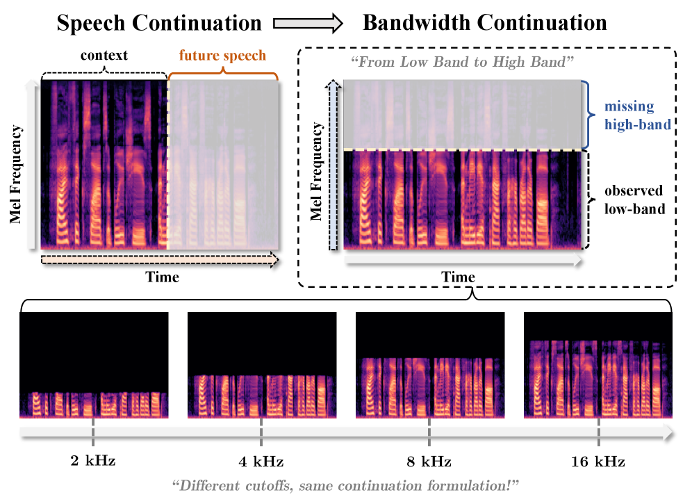
*Figure 1: Bandwidth extension as frequency-domain continuation across different cutoff frequencies.*

*Figure 2: Overview of the proposed AnyBand framework. AnyBand encodes a noisy full-band spectral state together with a clean observed low-band prompt using a frequency encoder, models temporal dependencies with a DiT backbone, and predicts the mel-frequency velocity field using a frequency decoder. The model is trained with an Easy-to-Balanced cutoff curriculum and further refined using multi-view adversarial objectives.*

*Figure 3: Overview of the proposed discriminators, which jointly assess multi-scale spectral realism, cross-band envelope dependencies, and 
𝐹
0
-aligned harmonic correspondence.*

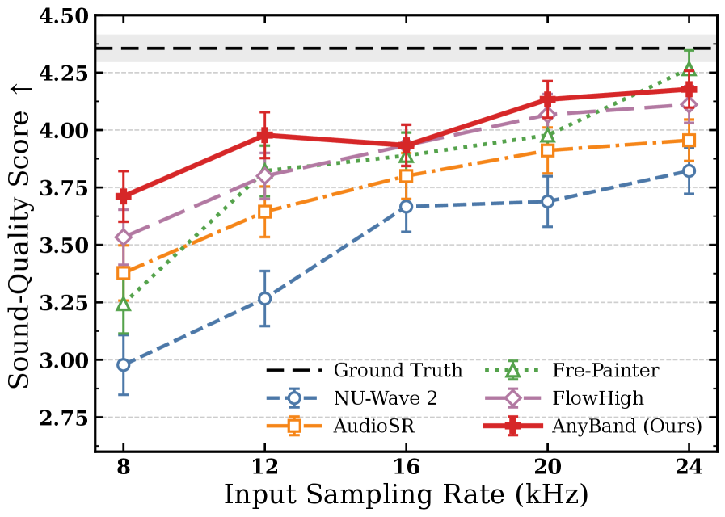
*Figure 4: Subjective scores across different input sampling rates. The dashed horizontal line denotes the ground-truth score, and error bars indicate 95% confidence intervals.*

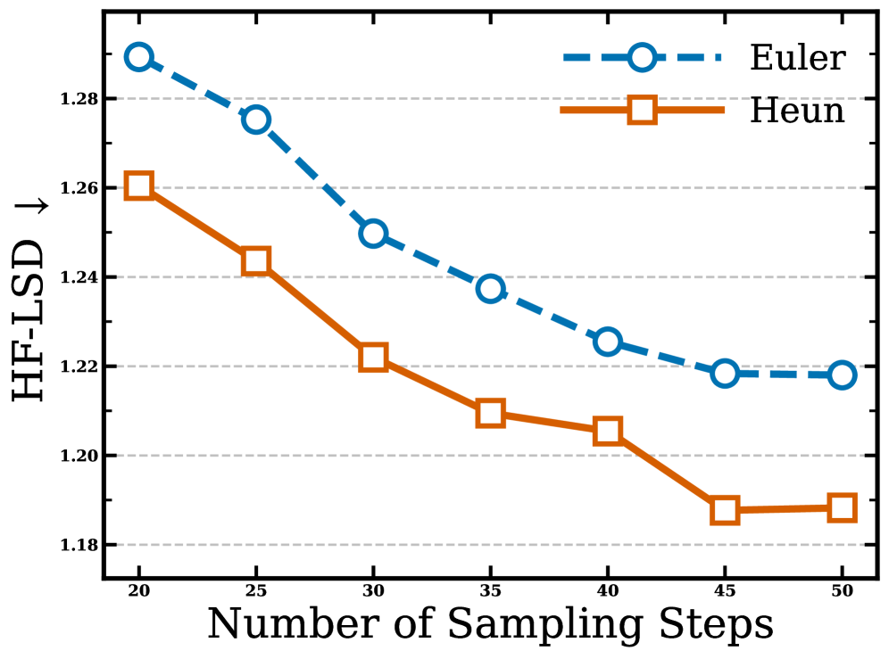
*(a)Solver and steps.*

*(a)Solver and steps.*

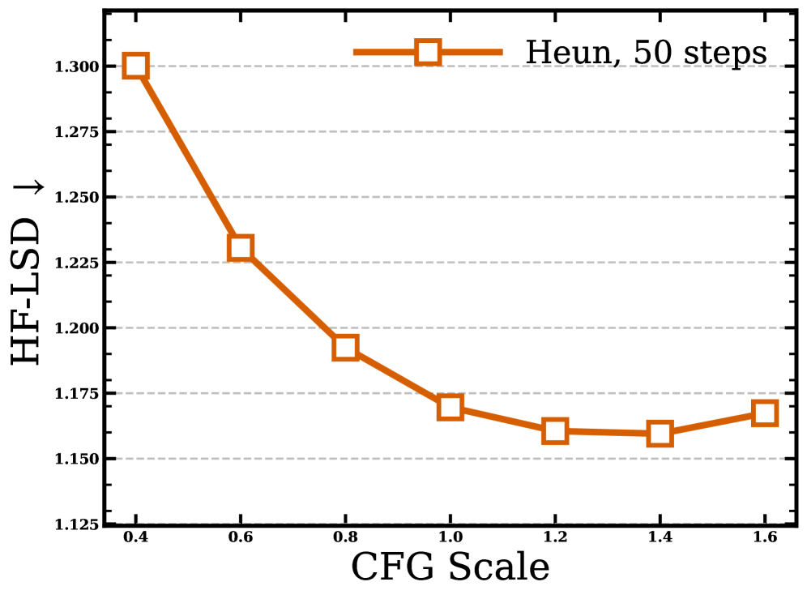
*(b)Guidance scale.*

*Figure 6:Instructions for the subjective listening test.*

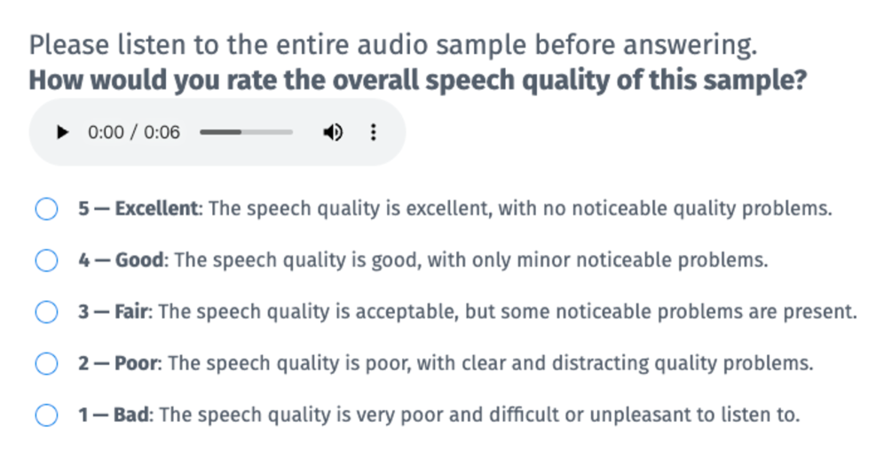
*Figure 7:Interface for rating overall speech quality.*

*Figure 8: Illustration of the Easy-to-Balanced cutoff-sampling curriculum. Early training emphasizes larger normalized cutoffs, corresponding to easier inputs with narrower missing bands. The sampling density gradually transitions to a continuous uniform distribution, which is used after 
𝑠
≥
𝜌
​
𝑆
.*

*(a)Absolute LSD.*

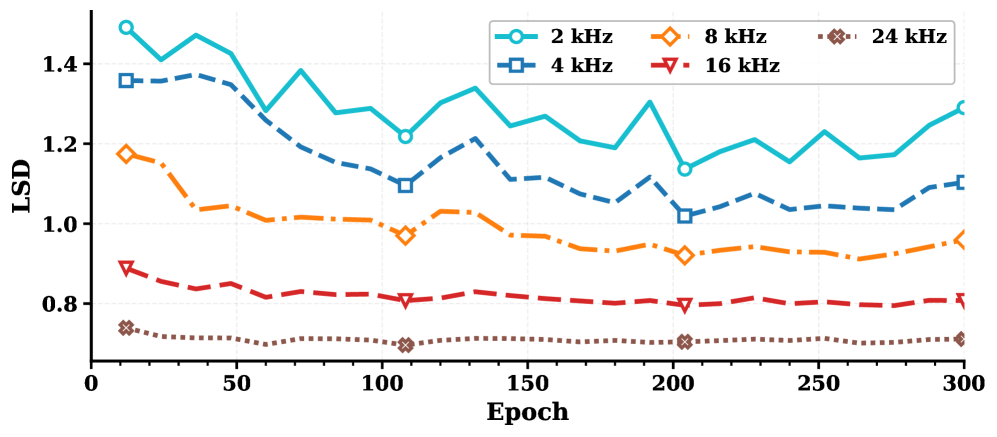
*(a)Absolute LSD.*

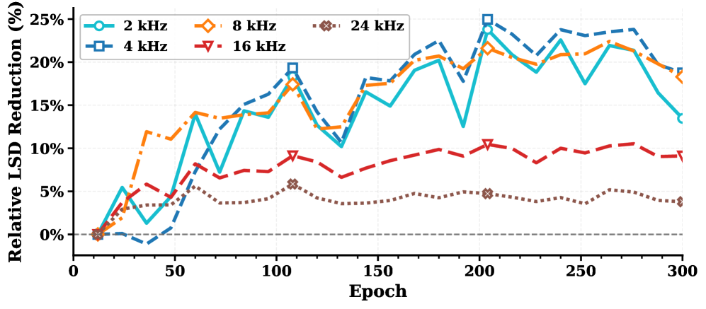
*(b)Relative LSD reduction.*

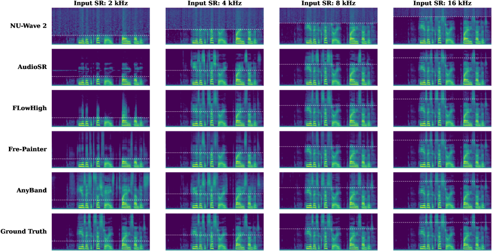
*(a)Standard input sampling rates.*

*(a)Standard input sampling rates.*

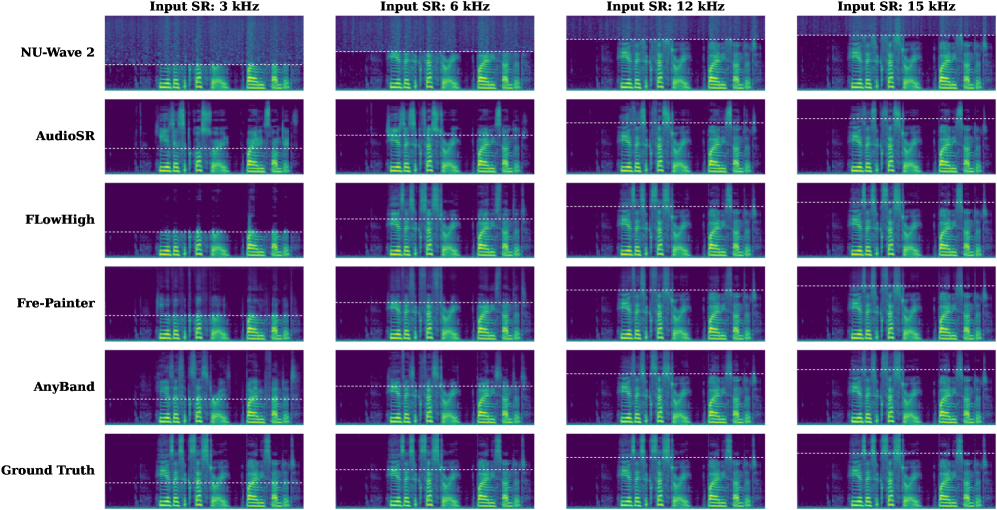
*(b)Irregular input sampling rates.*

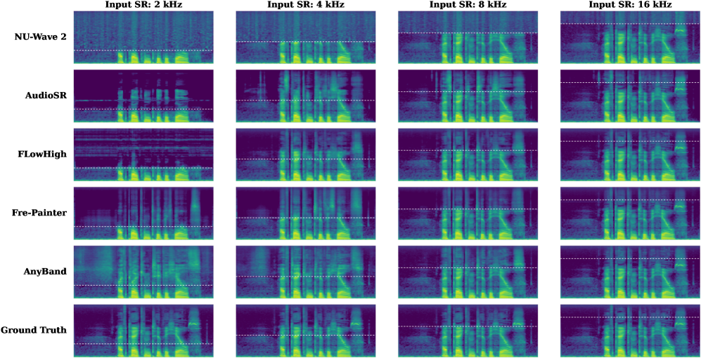
*(a)Standard input sampling rates.*

*(a)Standard input sampling rates.*

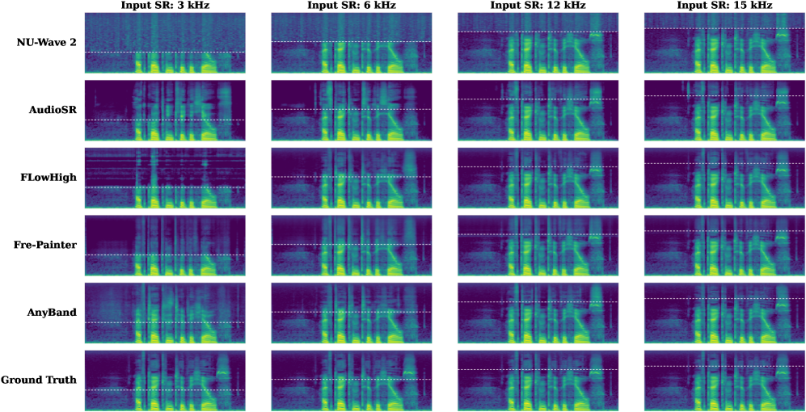
*(b)Irregular input sampling rates.*

---
**Usage Info**: 5426 tokens used.
**Generated at**: 2026-08-04 16:16:59

---

# 📚 Domain-Specific Evaluation of Text-to-Speech Systems: A Multi-Metric Benchmarking Study

🚀 URL: https://arxiv.org/html/2608.02235

## 🌏 Abstract (원문)
Recent advances in neural text-to-speech (TTS) systems have substantially improved speech naturalness and intelligibility across many languages. However, comprehensive evaluation methodologies that jointly assess perceptual quality, speaker similarity, and acoustic fidelity across diverse speech domains remain limited, particularly for low-resource and underrepresented languages. This paper presents a reproducible, multi-metric benchmarking framework for systematic evaluation of modern TTS systems through domain-specific analysis. The proposed framework integrates complementary subjective and objective evaluation protocols and is demonstrated through a comprehensive case study on a representative low-resource language spanning four speech domains: Formal, Conversational, Literary/Storytelling, and Emotional. Four state-of-the-art TTS systems—Indic-Parler-TTS, MMS-TTS, Microsoft Edge TTS, and Google Gemini TTS—are evaluated using MUSHRA listening tests, ABX discrimination tests, speaker similarity scoring with Resemblyzer, and acoustic analyses based on mel-cepstral distortion (MCD) and F0 RMSE over 960 audio pairs. Results reveal substantial variation in TTS performance across speech domains, with emotional speech consistently presenting the greatest synthesis challenge (mean MCD 12.03 dB; mean F0 RMSE 889 cents), while conversational speech achieves the highest overall acoustic fidelity. Beyond the empirical findings, this work provides a reproducible evaluation framework, publicly releasing evaluation scripts, result tables, and executable Colab notebooks to support standardized benchmarking and future research on TTS evaluation for low-resource languages. All evaluation scripts, result tables, and curated Colab notebooks arepublicly releasedathttps://github.com/Shifa402/Urdu-Synthetic-Speech-Evaluation.
## 🌏 Abstract (번역)
최근 신경망 텍스트 음성 변환(TTS) 시스템의 발전은 여러 언어에서 음성 자연스러움과 명료도를 크게 향상시켰습니다. 그러나 다양한 음성 도메인에 걸쳐 지각적 품질, 화자 유사성 및 음향 충실도를 공동으로 평가하는 포괄적인 평가 방법론은 특히 저자원 및 소외된 언어의 경우 여전히 제한적입니다. 본 논문은 도메인별 분석을 통해 최신 TTS 시스템의 체계적인 평가를 위한 재현 가능한 다중 측정 벤치마킹 프레임워크를 제시합니다. 제안된 프레임워크는 상호 보완적인 주관적 및 객관적 평가 프로토콜을 통합하며, 공식, 대화, 문학/스토리텔링, 감정의 네 가지 음성 도메인에 걸쳐 대표적인 저자원 언어에 대한 포괄적인 사례 연구를 통해 시연됩니다. Indic-Parler-TTS, MMS-TTS, Microsoft Edge TTS, Google Gemini TTS의 네 가지 최첨단 TTS 시스템은 MUSHRA 청취 테스트, ABX 식별 테스트, Resemblyzer를 사용한 화자 유사성 점수화, 멜-켑스트럼 왜곡(MCD) 및 F0 RMSE 기반 음향 분석을 통해 960쌍의 오디오에 대해 평가되었습니다. 결과는 음성 도메인에 따라 TTS 성능에 상당한 차이가 있음을 보여주며, 감정적인 음성이 일관되게 가장 큰 합성 과제를 제시하는 반면(평균 MCD 12.03 dB; 평균 F0 RMSE 889센트), 대화 음성이 전반적으로 가장 높은 음향 충실도를 달성했습니다. 경험적 발견 외에도, 본 연구는 재현 가능한 평가 프레임워크를 제공하며, 저자원 언어에 대한 TTS 평가의 표준화된 벤치마킹 및 향후 연구를 지원하기 위해 평가 스크립트, 결과 테이블 및 실행 가능한 Colab 노트북을 공개적으로 배포합니다. 모든 평가 스크립트, 결과 테이블 및 선별된 Colab 노트북은 https://github.com/Shifa402/Urdu-Synthetic-Speech-Evaluation에서 공개적으로 배포됩니다.

## 🔍 Methods & Results
- 공개 접근성, 우르두어 페르시아-아랍어 유니코드 직접 입력 지원, 그리고 대규모 다국어 종단간 합성, 설명 기반 오디오 언어 모델링, 상업용 신경망 TTS, 대규모 오디오 언어 모델 생성 등 다양한 아키텍처 패러다임을 포괄하는 세 가지 기준에 따라 MMS-TTS, Indic-Parler-TTS, Microsoft Edge TTS, Google Gemini TTS의 네 가지 최첨단 TTS 시스템이 선정되었습니다.
- 선정된 TTS 시스템은 MMS-TTS(VITS 기반, 단일 화자, 16kHz), Indic-Parler-TTS(설명 기반 오디오 언어 모델, 22개 인도어 지원, 44.1kHz), Microsoft Edge TTS(클라우드 기반 트랜스포머, 24kHz), Google Gemini TTS(Gemini 2.5 Flash 모델 기반, 24kHz)입니다.
- 평가 방법론은 지각 품질, 화자 정체성 보존, 스펙트럼 엔벨로프 충실도, 운율 정확도를 포괄하는 '측정 지표 상호 보완성'과 공식, 대화, 문학/스토리텔링, 감정의 4가지 음성 도메인별로 분석하는 '도메인 계층화' 원칙을 따랐습니다.
- 총 960쌍의 오디오(4개 시스템 x 4개 도메인 x 각 도메인당 60개 발화)를 사용하여 평가를 진행했습니다.
- 주관적 평가로는 MUSHRA 스타일 청취 테스트(20명의 우르두어 원어민이 자연스러움, 명료도, 전반적인 음성 품질을 1-5점 척도로 평가)와 상위 2개 시스템(Edge TTS, Gemini TTS)에 대한 ABX 식별 테스트를 통해 자연 음성과의 구별 불가능성을 평가했습니다.
- 객관적 평가로는 Resemblyzer를 사용한 화자 유사성(d-벡터 코사인 유사도), 멜-켑스트럼 왜곡(MCD)을 통한 스펙트럼 엔벨로프 유사도, 기본 주파수(F0) RMSE를 통한 피치 윤곽 정확도를 측정했습니다.
- 실험 결과, 감정적인 음성이 가장 큰 합성 난이도를 보였으며(평균 MCD 12.03 dB; 평균 F0 RMSE 889센트), 대화 음성이 전반적으로 가장 높은 음향 충실도를 달성했습니다.
- 본 연구는 재현 가능한 평가 프레임워크를 제공하며, 저자원 언어에 대한 TTS 평가의 표준화된 벤치마킹 및 향후 연구를 지원하기 위해 모든 평가 스크립트, 결과 테이블 및 실행 가능한 Colab 노트북을 GitHub에 공개적으로 배포했습니다.

## 🖼 Figures
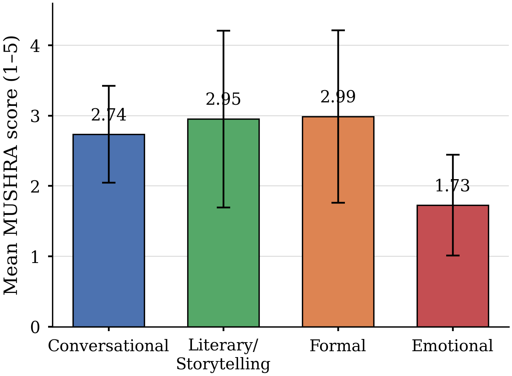
*Figure 1:Domain-level mean MUSHRA-style scores.*

---
**Usage Info**: 8394 tokens used.
**Generated at**: 2026-08-04 16:17:15

---

# 📚 LeapTalk: Breaking the Latency–Quality Trade-off in Talking Head Generation

🚀 URL: https://arxiv.org/html/2608.00079

## 🌏 Abstract (원문)
Long-form and real-time talking-head generation remains challenging due to a latency-quality trade-off: inefficient multi-step diffusion prohibits streaming generation, whereas real-time autoregressive approaches suffer from error accumulation and identity drift. To address this drawback, we propose LeapTalk, a novel framework that achieves stable and real-time talking-head generation with a single forward step, scaling to arbitrarily long videos. At the heart of our approach lies a single-step bridge distillation scheme. On the one hand, departing from the conventionalnoise-to-dataparadigm, we introduce adata-to-datatransport formulation based on a Brownian bridge. Anchored by a persistent reference, this strategy effectively mitigates identity drift and enhances long-term temporal stability. On the other hand, to enable smooth knowledge transfer from a pre-trained diffusion teacher to the student bridge model, we explore a heterogeneous distillation framework with an SNR-aligned time transformationΦ​(τ)\Phi(\tau), which bridges the functional discrepancy between the two models. Moreover, we propose an audio-driven classifier-free guidance mechanism to maintain fine-grained lip synchronization under extreme step reduction. Extensive experiments demonstrate that our method achieves high-fidelity and temporally consistent video generation with only1 stepat up to200 FPS, significantly outperforming existing approaches in both efficiency and stability.Project Page:https://zhangrongxiang.github.io/leaptalk-page/
## 🌏 Abstract (번역)
긴 길이의 실시간 토킹 헤드(talking-head) 생성은 지연 시간과 품질 간의 상충 관계로 인해 여전히 어렵습니다. 비효율적인 다단계 확산 방식은 스트리밍 생성을 방해하며, 실시간 자기회귀(autoregressive) 방식은 오류 누적 및 신원(identity) 표류 문제로 어려움을 겪습니다. 이러한 단점을 해결하기 위해 우리는 단일 전방 단계로 안정적이고 실시간 토킹 헤드 생성을 달성하며, 임의로 긴 비디오로 확장 가능한 새로운 프레임워크인 LeapTalk을 제안합니다. 우리 접근 방식의 핵심은 단일 단계 브릿지 증류(bridge distillation) 방식입니다. 한편으로는 기존의 노이즈-투-데이터(noise-to-data) 패러다임에서 벗어나 브라운 운동 브릿지(Brownian bridge) 기반의 데이터-투-데이터(data-to-data) 전송 공식을 도입합니다. 영구적인 참조에 고정된 이 전략은 신원 표류를 효과적으로 완화하고 장기적인 시간적 안정성을 향상시킵니다. 다른 한편으로는 사전 훈련된 확산 교사(diffusion teacher) 모델에서 학생 브릿지 모델로의 원활한 지식 전달을 가능하게 하기 위해, 두 모델 간의 기능적 불일치를 연결하는 SNR 정렬 시간 변환 Φ(τ)를 갖춘 이종 증류 프레임워크를 탐구합니다. 또한, 극단적인 단계 축소 상황에서도 미세한 립싱크를 유지하기 위해 오디오 기반 분류기 없는 안내(classifier-free guidance) 메커니즘을 제안합니다. 광범위한 실험을 통해 우리 방법이 단 1단계로 최대 200 FPS에서 고품질 및 시간적으로 일관된 비디오 생성을 달성하며, 효율성과 안정성 모두에서 기존 접근 방식을 크게 능가함을 입증합니다.

## 🔍 Methods & Results
- 기존 자기회귀 비디오 확산 모델의 노이즈-투-데이터 재구성은 오류 누적, 신원 표류 및 시각적 저하를 유발하여 긴 시퀀스 생성에 한계가 있습니다.
- LeapTalk은 참조 이미지에서 대상 프레임으로의 데이터-투-데이터 전송을 모델링하는 'Bridge Forcing'을 제안하며, 노이즈-투-데이터 재구성을 참조 고정 브라운 운동 브릿지로 대체하여 신원 일관성을 유지합니다.
- 청크 구성 시, 참조 이미지를 반복하여 초기화하고 이전 청크의 마지막 K 프레임을 모션 접두사로 사용하여 시간적 연속성을 유지하면서 신원 보존을 강화합니다.
- 실시간 생성을 위해 SNR 정렬 시간 변환 Φ(τ)를 통해 이종 증류 프레임워크를 도입하여, 플로우 매칭 교사 모델과 브라운 브릿지 학생 모델 간의 SNR 불일치를 해결하고 일관된 스코어 평가를 가능하게 합니다.
- 단일 단계 증류에서 고주파 역학이 억제되는 문제를 보완하기 위해 오디오 기반 분류기 없는 안내(CFG) 메커니즘을 도입하여 미세한 립싱크와 동적 움직임을 유지합니다.
- 브릿지 훈련은 얼굴 및 입술 영역에 가중치를 부여한 재구성 손실과 LPIPS 손실을 사용하여, 다단계 교사 모델이 생성한 목표 엔드포인트에 학생 모델을 일치시킵니다.
- 훈련과 추론 간의 격차를 해소하기 위해 자기회귀적 자체 롤아웃(self-rollout) 전략을 채택하여, 모델이 이전에 생성된 이력을 기반으로 비디오 청크를 순차적으로 생성합니다.
- 모델 아키텍처는 Wan2.1-T2V-1.3B 백본(Diffusion Transformer)을 기반으로 하며, WanVAE(Pro 모델) 또는 경량 TAEHV(Lite 모델)를 오토인코더로 사용하고, Wav2Vec 오디오 인코더에서 추출한 프레임 정렬 특징을 DiT에 주입합니다.
- 실험 결과, LeapTalk은 단 1단계로 최대 200 FPS에서 고품질 및 시간적으로 일관된 비디오 생성을 달성하여, 효율성과 안정성 면에서 기존 접근 방식을 크게 능가합니다.

## 🖼 Figures

*Figure 1:Overview of LeapTalk. Given audio and a reference image, our method enables open-ended streaming talking-head generation with consistent identity. It achieves 1-step inference per chunk at up to 200 FPS, delivering up to 
𝟏𝟓𝟎𝟎𝟎
×
 speedup while maintaining strong lip-sync accuracy.*

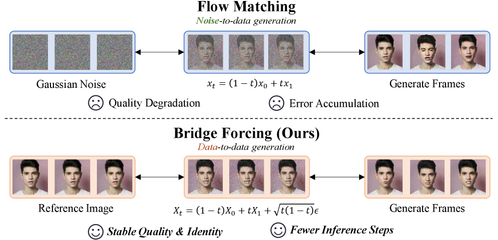
*Figure 2:Comparison between conventional noise-to-data flow matching and our Bridge Forcing paradigm. The identity consistency is preserved along bridge process, while error accumulates in the forward diffusion process.*

*Figure 3:Distillation pipeline of our approach. The one-step student generates frames conditioned on a static reference. To enable stable distillation across heterogeneous processes, we apply a time transformation 
𝑡
=
Φ
​
(
𝜏
)
 to align noise levels between the flow-matching teacher and the bridge-based student, allowing consistent score supervision and a well-defined DMD objective.*

*Figure 4:Qualitative comparison on long-video streaming generation. Frames are sampled from streaming rollouts at increasing time indices. The red boxes mark identity inconsistency and drift, and the blue boxes mark slight or incorrect lip-sync. LeapTalk maintains stable identity and lip motion as generation proceeds.*

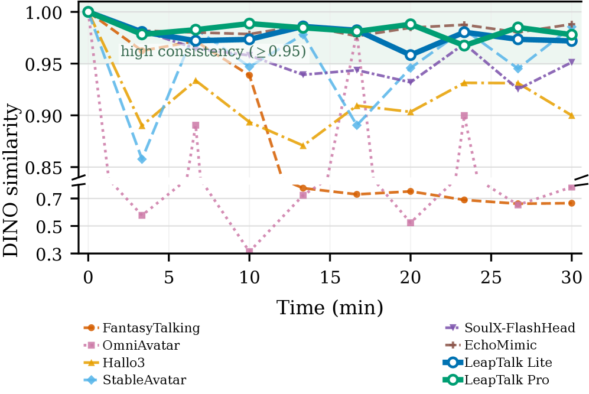
*Figure 5:DINO similarity over video time. We plot the similarity between each generated frame and the reference image as streaming generation progresses. A flatter and higher curve indicates less identity drift over long-duration generation.*

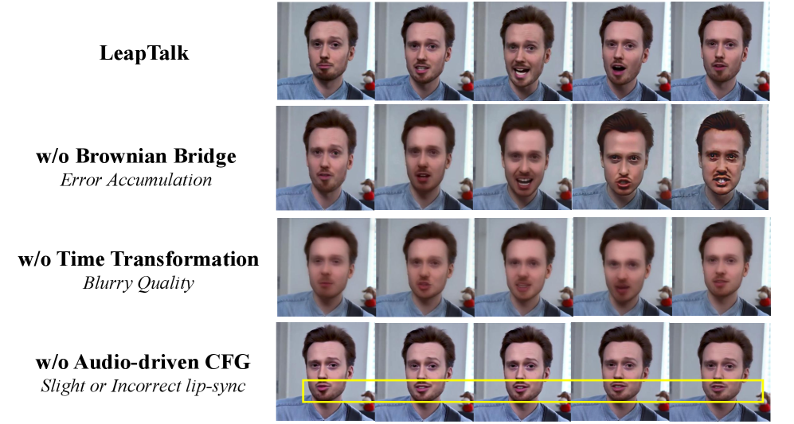
*Figure 6:Ablation results demonstrating the contribution of each component in our framework.*

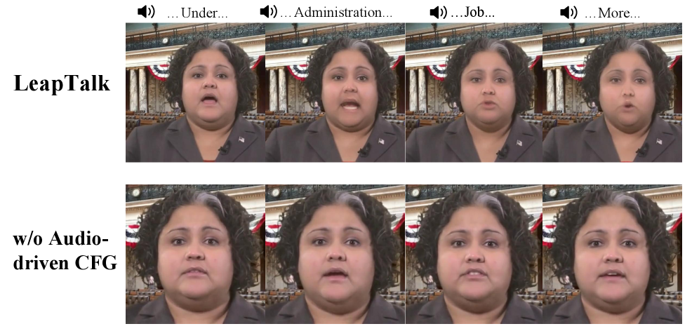
*Figure 7:Visualization of ablation effects of audio-driven CFG.*

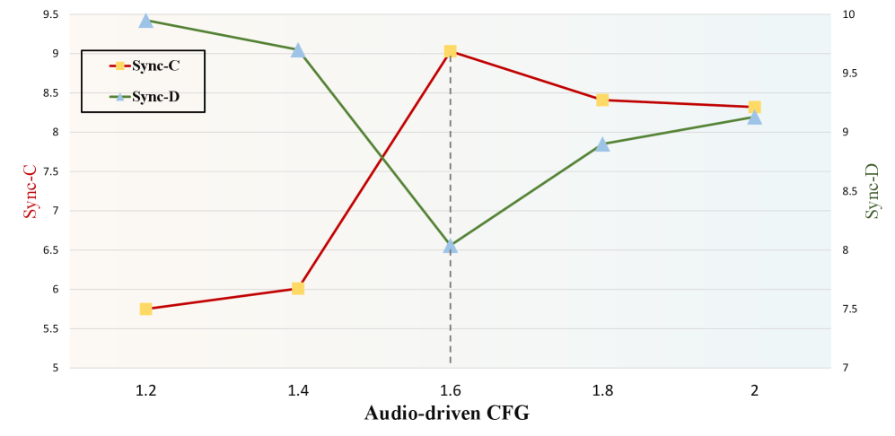
*Figure 8:Sensitivity analysis of audio-driven CFG.*

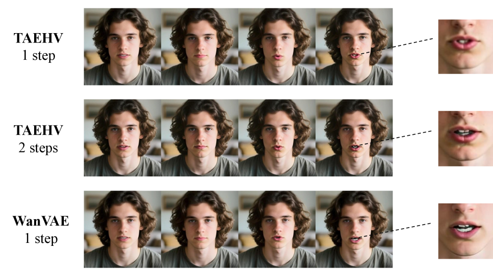
*Figure 9:Visual comparison across different VAEs.*

*Figure 10:Generated results under diverse and challenging input scenarios.*

*Figure 11:More qualitative results on challenging conditions including non-human faces (e.g., animals), artistic portraits (e.g., paintings and stylized illustrations), side-view photos, low-light conditions, partial occlusions, and even non-photorealistic objects such as sculptures.*

---
**Usage Info**: 4165 tokens used.
**Generated at**: 2026-08-04 16:17:28

---

# 📚 Beyond Prompt Adherence: Auditing Attribute-Level Voice Control in Speech Generation

🚀 URL: https://arxiv.org/html/2608.00545

## 🌏 Abstract (원문)
Natural-language descriptions have become a flexible interface for controlling generated speech. Existing evaluations largely assess whether an output matches a prompt, but prompt matching alone does not reveal whether characteristics outside the intended change remain stable. We examine this distinction through a controlled paired audit of three speech-generation systems: CosyVoice3, VoxCPM2, and Fish-Speech-S2. The evaluation contains 5,940 outputs spanning six reference speakers, ten texts, three random seeds, and eleven conditions. Using acoustic, prosodic, content, and speaker measurements, we find that responses in the expected target direction are frequently accompanied by changes outside descriptor-specific signal-level target sets. This pattern remains among outputs whose target response exceeds baseline seed variation, and the accompanying changes differ substantially across systems. We further introduce VoDER-Cal, a training-free candidate selector that retains sufficiently strong target responses while favoring smaller off-target deviations. A three-candidate pool raises the joint success rate from 4.8% under single-sample direct generation to approximately 14% for all candidate-selection policies. Within the matched three-candidate budget, VoDER-Cal reduces held-out off-target deviation from 0.344 under target-only selection to 0.276 and improves listener-rated preservation. Preservation-sensitive evaluation therefore complements prompt-adherence evaluation, while candidate reranking offers a practical inference-time improvement. Code, configuration files, and analysis scripts are available athttps://github.com/intelland/VoDER.
## 🌏 Abstract (번역)
자연어 설명은 생성된 음성을 제어하기 위한 유연한 인터페이스가 되었습니다. 기존 평가는 주로 출력이 프롬프트와 일치하는지 여부를 평가하지만, 프롬프트 일치만으로는 의도된 변경 외의 특성이 안정적으로 유지되는지 여부를 알 수 없습니다. 우리는 CosyVoice3, VoxCPM2, Fish-Speech-S2 세 가지 음성 생성 시스템에 대한 통제된 쌍별 감사를 통해 이러한 차이를 조사합니다. 이 평가는 6명의 참조 화자, 10개의 텍스트, 3개의 랜덤 시드, 11개의 조건을 포함하는 5,940개의 출력을 분석합니다. 음향, 운율, 내용 및 화자 측정을 사용하여, 우리는 예상되는 목표 방향의 응답이 기술자별 신호 수준 목표 세트 외부의 변화를 자주 동반한다는 것을 발견했습니다. 이러한 패턴은 목표 응답이 기준 시드 변동을 초과하는 출력에서도 유지되며, 동반되는 변화는 시스템마다 상당히 다릅니다. 우리는 또한 충분히 강력한 목표 응답을 유지하면서 더 작은 비목표 편차를 선호하는 훈련 없는 후보 선택기인 VoDER-Cal을 소개합니다. 세 개의 후보 풀은 단일 샘플 직접 생성 시 4.8%였던 공동 성공률을 모든 후보 선택 정책에서 약 14%로 높입니다. 일치하는 세 후보 예산 내에서 VoDER-Cal은 목표 전용 선택 시 0.344였던 비목표 편차를 0.276으로 줄이고 청취자 평가 보존을 향상시킵니다. 따라서 보존 민감 평가(preservation-sensitive evaluation)는 프롬프트 준수 평가를 보완하며, 후보 재순위화는 실용적인 추론 시간 개선을 제공합니다. 코드, 구성 파일 및 분석 스크립트는 https://github.com/intelland/VoDER에서 확인할 수 있습니다.

## 🔍 Methods & Results
- CosyVoice3, VoxCPM2, Fish-Speech-S2 세 가지 음성 생성 시스템에 대해 통제된 쌍별 감사를 수행하여 의도된 변경 외의 특성 안정성을 평가했습니다.
- 평가는 6명의 참조 화자, 10개의 텍스트, 3개의 랜덤 시드, 11개의 조건을 포함하는 총 5,940개의 출력에 대해 이루어졌습니다.
- 음향, 운율, 내용 및 화자 측정을 사용하여, 예상 목표 방향의 응답이 기술자별 신호 수준 목표 세트 외부의 의도치 않은 변화를 자주 동반함을 발견했습니다.
- 이러한 의도치 않은 변화는 목표 응답이 기준 시드 변동을 초과하는 출력에서도 나타났으며, 시스템마다 그 양상이 크게 달랐습니다.
- 훈련 없이 작동하는 후보 선택기인 VoDER-Cal을 제안했으며, 이는 강력한 목표 응답을 유지하면서 비목표 편차를 최소화하도록 설계되었습니다.
- VoDER-Cal을 사용한 세 후보 풀은 단일 샘플 직접 생성 시 4.8%였던 공동 성공률을 모든 후보 선택 정책에서 약 14%로 향상시켰습니다.
- 세 후보 예산 내에서 VoDER-Cal은 목표 전용 선택 시 0.344였던 비목표 편차를 0.276으로 감소시켰고, 청취자 평가에서 보존 품질을 개선했습니다.

## 🖼 Figures

*Fig. 1:Prompt response and a localized attribute edit answer different questions. The paired audit measures the requested change together with movement outside a descriptor-specific signal-level target set. VoDER-Cal uses candidate variability to retain the target response while favoring smaller off-target movement.*

*Fig. 2:Descriptor-induced changes. (a) Mean paired feature shifts normalized by fixed physical scales. Black boxes mark target features, and asterisks indicate request-level 95% bootstrap confidence intervals excluding zero. (b) Among outputs whose target response exceeds baseline seed variation, the fraction exhibiting at least one substantial off-target deviation. The Fish-Speech-S2 deep result is based on only two target-responsive outputs and is therefore descriptive.*

*Fig. 3: Automatic evaluation of VoDER-Cal at 
𝐵
=
3
 and 
𝜌
=
0.75
. (a) Candidates must retain a sufficient target response and pass content and speaker checks; VoDER-Cal then selects the candidate with the smallest selector-side off-target deviation. (b) Percentage of requests satisfying the target, content, speaker, and held-out preservation criteria. (c) Held-out off-target deviation of selected candidates, where lower values indicate better preservation.*

*Fig. 4: Perceptual evaluation. (a) H1 compares descriptor-conditioned outputs with their matched baselines and separately evaluates target and off-target changes. (b) H2 compares the candidates selected by VoDER-Cal and Target-only selection using the matched baseline as reference. Error bars show request-clustered 95% confidence intervals.*

---
**Usage Info**: 2072 tokens used.
**Generated at**: 2026-08-04 16:17:36

---

# 📚 AcoustiTrace: When Plausible Sound Violates Physics

🚀 URL: https://arxiv.org/html/2608.02035

## 🌏 Abstract (원문)
Recent audio–video generators can produce semantically plausible and apparently synchronized sound, yet may still violate the acoustic processes implied by visible events and environments. Existing benchmarks provide limited support for attributing such violations to particular acoustic processes and quantifying their severity. We introduce AcoustiTrace, a diagnostic benchmark that formalizes acoustic physical realism in audio–video generation. AcoustiTrace organizes text-to-audio-video (T2AV) and image-to-audio-video (I2AV) evaluation around the acoustic process, covering sound generation, propagation environment, and acoustic reception through eight dimensions grounded in measurable acoustic quantities. Based on these evaluation dimensions, we construct a large-scale dataset organized around acoustic mechanisms, comprising real-world audio–video recordings and acoustically annotated RGB-D observations, and use it to develop targeted prompt suites and validated evaluators. Experiments reveal that even leading generators still struggle with fundamental acoustic processes despite producing plausible sound events. Finally, we show that the diagnostics AcoustiTrace provides for specific acoustic relations can guide model refinement toward more physically faithful audio and open new directions for incorporating acoustic principles into training objectives, reward modeling, and candidate selection.
## 🌏 Abstract (번역)
최근 오디오-비디오 생성기는 의미론적으로 그럴듯하고 겉보기에 동기화된 사운드를 생성할 수 있지만, 여전히 가시적인 이벤트 및 환경에 의해 암시되는 음향 프로세스를 위반할 수 있습니다. 기존 벤치마크는 이러한 위반을 특정 음향 프로세스에 귀속시키고 그 심각도를 정량화하는 데 제한적인 지원을 제공합니다. 우리는 오디오-비디오 생성에서 음향 물리적 현실성을 공식화하는 진단 벤치마크인 AcoustiTrace를 소개합니다. AcoustiTrace는 측정 가능한 음향량에 기반한 8가지 차원을 통해 사운드 생성, 전파 환경 및 음향 수신을 포함하는 음향 프로세스를 중심으로 텍스트-오디오-비디오(T2AV) 및 이미지-오디오-비디오(I2AV) 평가를 구성합니다. 이러한 평가 차원을 기반으로, 우리는 음향 메커니즘을 중심으로 구성된 대규모 데이터셋을 구축했으며, 이는 실제 오디오-비디오 녹화물과 음향적으로 주석이 달린 RGB-D 관찰로 구성되어 있으며, 이를 사용하여 목표화된 프롬프트 스위트와 검증된 평가기를 개발합니다. 실험 결과, 선도적인 생성기조차도 그럴듯한 사운드 이벤트를 생성함에도 불구하고 근본적인 음향 프로세스에서 여전히 어려움을 겪고 있음이 밝혀졌습니다. 마지막으로, AcoustiTrace가 특정 음향 관계에 대해 제공하는 진단은 보다 물리적으로 충실한 오디오를 향한 모델 개선을 안내하고 훈련 목표, 보상 모델링 및 후보 선택에 음향 원리를 통합하는 새로운 방향을 열 수 있음을 보여줍니다.

## 🔍 Methods & Results
- 오디오-비디오 생성의 음향 물리적 현실성을 공식화하는 진단 벤치마크인 AcoustiTrace를 도입했습니다.
- AcoustiTrace는 측정 가능한 음향량에 기반한 8가지 차원(사운드 생성, 전파 환경, 음향 수신)을 통해 텍스트-오디오-비디오(T2AV) 및 이미지-오디오-비디오(I2AV) 평가를 음향 프로세스 중심으로 구성합니다.
- 실제 오디오-비디오 녹화물과 음향적으로 주석이 달린 RGB-D 관찰로 구성된 대규모 데이터셋을 구축하고, 이를 기반으로 목표화된 프롬프트 스위트와 검증된 평가기를 개발했습니다.
- 실험 결과, 선도적인 생성기조차도 그럴듯한 사운드 이벤트를 생성함에도 불구하고 근본적인 음향 프로세스에서 여전히 어려움을 겪는 것으로 나타났습니다.
- AcoustiTrace가 제공하는 진단은 모델 개선을 통해 물리적으로 더 충실한 오디오를 생성하고, 훈련 목표, 보상 모델링, 후보 선택에 음향 원리를 통합하는 새로운 방향을 제시할 수 있습니다.

## 🖼 Figures
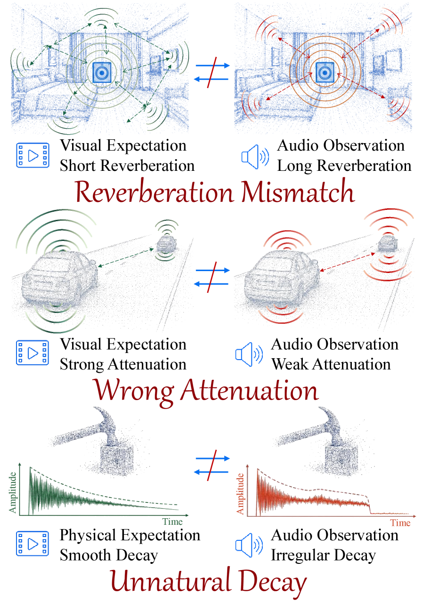
*Figure 1:Representative cases where plausible sound violates acoustic physics. AcoustiTrace systematically diagnoses these and additional acoustic failures across eight evaluation dimensions.*

*Figure 2:Framework of AcoustiTrace. The benchmark organizes acoustic physical realism into sound generation, propagation environment, and acoustic reception across eight evaluation dimensions. Real-world A/V data support prompt construction, evaluator design, and validation. By embedding acoustic priors into specialized evaluators, AcoustiTrace supports systematic diagnosis of acoustic physical realism in joint A/V generation.*

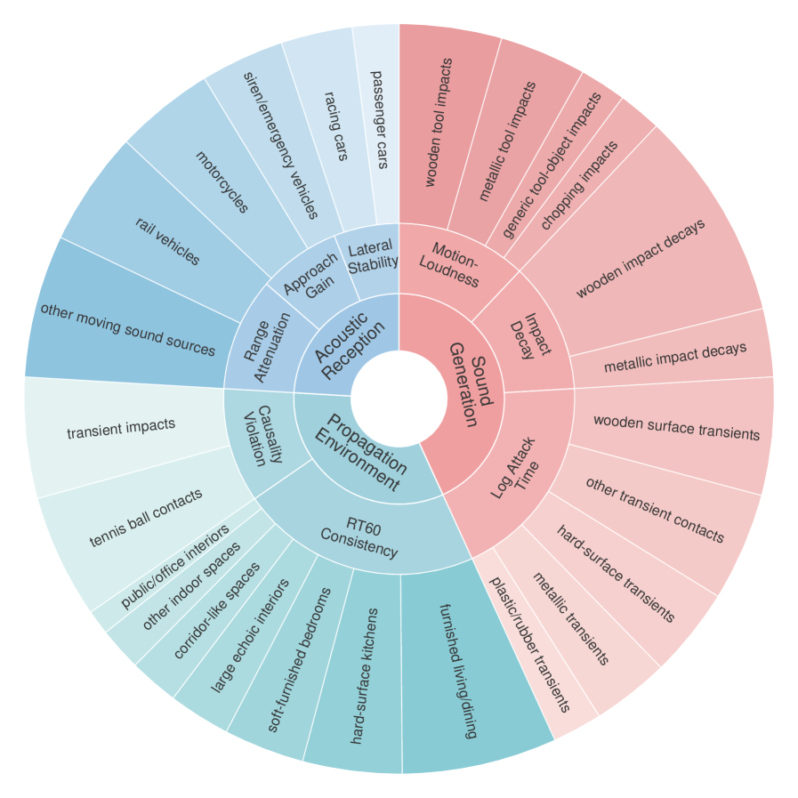
*Figure 3: Distribution of the AcoustiTrace prompt suites. The sunburst chart shows their hierarchical composition, with sector area proportional to prompt count.*

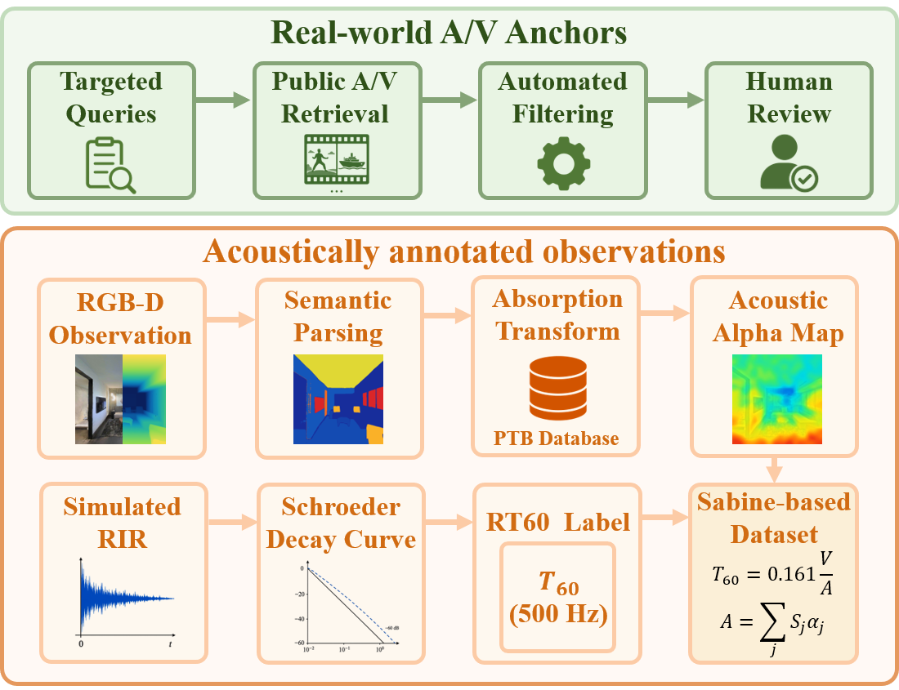
*Figure 4:Construction of the AcoustiTrace dataset from real-world audio–video anchors and acoustically annotated RGB-D observations.*

*Figure 5: From diagnosis to intervention. (a) The Range Attenuation residual from a fixed visual trajectory guides decoded-mel audio denoising. (b) A qualitative receding-source example visualizes how guidance reshapes the audio envelope toward the expected attenuation trend. (c) Aggregate results show improved Range Attenuation 
𝑅
2
 and stronger inverse range–loudness coupling over unguided audio resampling.*

![Figure 6: (a) Responses of the eight evaluators to controlled audio perturbations that selectively violate their targeted acoustic relations. The unperturbed point in each sweep corresponds to the original, unmodified real-world A/V samples. For RT60 Consistency, perturbation severity increases as the audio-to-visual RT60 ratio deviates from 1. (b) Alignment between evaluator preferences and human judgments on paired generated A/V samples. Error bars denote 95% confidence intervals. (c) AcoustiTrace Range Attenuation scores versus PhyAVBench CPRS using LAION-CLAP on 300 pairs from LTX-2.3, NAVA, and JavisDiT++.](../images/2026-08-04/2608.02035/2608.02035_fig5.png)
*Figure 6: (a) Responses of the eight evaluators to controlled audio perturbations that selectively violate their targeted acoustic relations. The unperturbed point in each sweep corresponds to the original, unmodified real-world A/V samples. For RT60 Consistency, perturbation severity increases as the audio-to-visual RT60 ratio deviates from 1. (b) Alignment between evaluator preferences and human judgments on paired generated A/V samples. Error bars denote 95% confidence intervals. (c) AcoustiTrace Range Attenuation scores versus PhyAVBench CPRS using LAION-CLAP on 300 pairs from LTX-2.3, NAVA, and JavisDiT++.*

---
**Usage Info**: 2589 tokens used.
**Generated at**: 2026-08-04 16:17:48

---

# 📚 Separate-and-Detect: Unified Drum Transcription and Stem Generation via Latent Diffusion

🚀 URL: https://arxiv.org/html/2608.01093

## 🌏 Abstract (원문)
Automatic Drum Transcription (ADT) is commonly formulated as a direct mapping from a music mixture to symbolic drum events. While effective for transcription, this formulation discards the acoustic stems that are useful for editing, remixing, and production. We revisit an alternative separate-and-detect formulation, where a drum source separation front end first produces five editable drum stems, and a fixed onset detector then converts each stem into symbolic events. The separator is built on a five-stem latent diffusion model that jointly generates kick, snare, toms, hi-hats, and cymbals in a compact VAE latent space. We further study two training-only auxiliary branches—an onset branch (OB) and a timbre branch (TB)—which shape the separator during learning but are discarded at inference. Trained on synthetic drum multitracks and evaluated on MDB Drums and ENST-Drums, the proposed pipeline consistently improves over a strong U-Net-based drum separation baseline in overall transcription F1. It also outperforms a representative end-to-end ADT system on kick and snare F1 under our evaluation protocol, while additionally providing separated audio stems. The ablation results show that OB gives the most stable transcription gains, whereas TB changes the trade-off between reconstruction, acoustic stem quality, and onset detection. These results suggest that generative drum demixing can serve not only as a source separation model, but also as a practical front end for interpretable drum transcription.
## 🌏 Abstract (번역)
자동 드럼 전사(ADT)는 일반적으로 음악 믹스에서 상징적인 드럼 이벤트로의 직접적인 매핑으로 공식화됩니다. 전사에는 효과적이지만, 이 공식화는 편집, 리믹스 및 제작에 유용한 음향 스템을 버립니다. 우리는 드럼 소스 분리 프런트 엔드가 먼저 다섯 개의 편집 가능한 드럼 스템을 생성하고, 고정된 온셋 감지기가 각 스템을 상징적인 이벤트로 변환하는 대안적인 '분리-감지' 공식화를 재검토합니다. 분리기는 킥, 스네어, 탐, 하이햇, 심벌즈를 컴팩트한 VAE 잠재 공간에서 공동으로 생성하는 5-스템 잠재 확산 모델을 기반으로 합니다. 우리는 학습 중에 분리기를 형성하지만 추론 시에는 폐기되는 두 가지 훈련 전용 보조 브랜치(온셋 브랜치(OB)와 음색 브랜치(TB))를 추가로 연구합니다. 합성 드럼 멀티트랙으로 훈련하고 MDB Drums 및 ENST-Drums에서 평가한 결과, 제안된 파이프라인은 전반적인 전사 F1에서 강력한 U-Net 기반 드럼 분리 기준선보다 지속적으로 개선되었습니다. 또한 우리의 평가 프로토콜에서 킥 및 스네어 F1에서 대표적인 종단 간 ADT 시스템보다 우수한 성능을 보였으며, 추가적으로 분리된 오디오 스템을 제공합니다. 제거 연구 결과는 OB가 가장 안정적인 전사 이득을 제공하는 반면, TB는 재구성, 음향 스템 품질 및 온셋 감지 간의 균형을 변경함을 보여줍니다. 이러한 결과는 생성적 드럼 분리가 소스 분리 모델뿐만 아니라 해석 가능한 드럼 전사를 위한 실용적인 프런트 엔드 역할도 할 수 있음을 시사합니다.

## 🔍 Methods & Results
- 드럼 전사는 '분리-감지' 파이프라인으로 구성되며, 입력 드럼 믹스를 킥, 스네어, 탐, 하이햇, 심벌즈의 5개 드럼 스템으로 분리한 후, 각 스템을 독립적인 온셋 감지기로 처리하여 상징적인 이벤트를 얻습니다.
- 파이프라인의 핵심은 5-스템 멀티트랙 잠재 확산 분리기이며, 이는 MSG-LD 프레임워크를 기반으로 VAE, U-Net 디노이저, HiFi-GAN 보코더 아키텍처를 5개 드럼 서브 스템에 맞게 조정하여 구축되었습니다.
- 훈련 시에는 두 가지 보조 브랜치(온셋 브랜치(OB)와 음색 브랜치(TB))가 U-Net의 마지막 디코더 특징 맵에 연결되어 분리기의 표현 학습을 유도하지만, 추론 시에는 폐기됩니다.
- 온셋 브랜치(OB)는 스템별 온셋 맵을 예측하여 전사에 필수적인 충격적인 에너지 엔벨로프를 우선시하도록 모델을 장려합니다.
- 음색 브랜치(TB)는 7가지 DrumGAN 디스크립터(밝기, 경도, 깊이, 거칠기, 웅장함, 따뜻함, 선명도)를 예측하여 전역적인 음향 정규화를 제공합니다.
- 분리기는 디노이징, 온셋에 대한 Focal Binary Cross-Entropy, 음색 디스크립터에 대한 L2 손실을 포함하는 다중 작업 목표를 통해 최적화됩니다.
- 추론 시, 분리된 오디오 스템은 madmom CNN 기반 온셋 프로세서를 사용하여 독립적으로 처리되며, 각 드럼 클래스에 대해 최적화된 고정 감지기 구성이 적용됩니다.
- 제안된 파이프라인은 MDB Drums 및 ENST-Drums 데이터셋에서 평가되었으며, 전반적인 전사 F1에서 강력한 U-Net 기반 드럼 분리 기준선보다 지속적으로 개선된 성능을 보였습니다.
- 이 시스템은 또한 킥 및 스네어 F1에서 대표적인 종단 간 ADT 시스템보다 우수한 성능을 보였으며, 추가적으로 편집, 리믹스 및 제작에 유용한 분리된 오디오 스템을 제공합니다.
- 제거 연구 결과, 온셋 브랜치(OB)가 가장 안정적인 전사 이득을 제공하는 반면, 음색 브랜치(TB)는 재구성, 음향 스템 품질 및 온셋 감지 간의 균형을 변경하는 것으로 나타났습니다.

## 🖼 Figures
![Figure 1:Overview of the proposed separate-and-detect pipeline. Given an input music mixture, we first obtain a drum mixture using Demucs, and then apply the MSG-LD demixer to generate separated drum stems. A per-class onset detector subsequently converts the separated stems into symbolic drum onsets, represented as a pianoroll. Solid and dashed arrows denote the data flow during inference and training, respectively, while the snowflake symbol indicates components with frozen weights. OB and TB denote the onset and timbre branches, respectively.](../images/2026-08-04/2608.01093/2608.01093_fig0.png)
*Figure 1:Overview of the proposed separate-and-detect pipeline. Given an input music mixture, we first obtain a drum mixture using Demucs, and then apply the MSG-LD demixer to generate separated drum stems. A per-class onset detector subsequently converts the separated stems into symbolic drum onsets, represented as a pianoroll. Solid and dashed arrows denote the data flow during inference and training, respectively, while the snowflake symbol indicates components with frozen weights. OB and TB denote the onset and timbre branches, respectively.*

*Figure 2:A pianoroll comparison on an unseen test excerpt. MSG-LD (+OB) preserves the kick/snare rhythmic backbone and avoids several spurious events produced by the separation-based LarsNet baseline. At the same time, ADTOF remains strong on dense hi-hat activity, illustrating the continuing challenge of broadband drum textures for separate-and-detect systems.*

![Figure 3:Acoustic analysis of the separated stems for a 5-second excerpt corresponding to the pianoroll in Figure 2. The top markers (colored triangles) denote predicted onsets, while the bottom markers (black dashed lines) indicate ground-truth events. Compared with LarsNet, MSG-LD (+OB) yields cleaner kick and snare transients and reduces cross-stem leakage in silent regions, supporting more reliable onset detection. The hi-hat and cymbal tracks also illustrate the remaining difficulty of dense broadband drum textures.](../images/2026-08-04/2608.01093/2608.01093_fig2.png)
*Figure 3:Acoustic analysis of the separated stems for a 5-second excerpt corresponding to the pianoroll in Figure 2. The top markers (colored triangles) denote predicted onsets, while the bottom markers (black dashed lines) indicate ground-truth events. Compared with LarsNet, MSG-LD (+OB) yields cleaner kick and snare transients and reduces cross-stem leakage in silent regions, supporting more reliable onset detection. The hi-hat and cymbal tracks also illustrate the remaining difficulty of dense broadband drum textures.*

---
**Usage Info**: 3312 tokens used.
**Generated at**: 2026-08-04 16:17:58

---

# 📚 Experience-Calibrated Contrastive Decoding for Mitigating Hallucinations in LM-Based Text-to-Speech

🚀 URL: https://arxiv.org/html/2608.00722

## 🌏 Abstract (원문)
Language model-based text-to-speech (LM-based TTS) remains vulnerable to speech hallucinations that deviate from the target text. Existing mitigation mainly relies on architectural changes or additional training, while decoding-time control remains underexplored. We present a conditional information view that distinguishes text-derivedalignment informationfromexperience informationsupplied by acoustic context and learned speech regularities. We hypothesize that an important class of hallucinations begins when alignment support is insufficiently reflected in the selected token at a vulnerable transition. Using predictions from the same speech LM with and without text conditions, we proposeExperience-CalibratedContrastiveDecoding (ECCD), a training-free method that strengthens alignment support while preserving useful experience information. ECCD preserves the original expert distribution, applies only positive alignment enhancement, and calibrates its strength using set-level experience compatibility. Across four models, ECCD reduces WER/CER by up to 55.6% in all SeedTTS-Eval settings and 24 of 25 multilingual CV3-Eval settings. A listening test yields a CMOS gain of+0.644+0.644while retaining strong speaker similarity. Further analysis shows that alignment influence and decision-level gain vary within linguistic units and are lower at first-error boundaries than at matched correct boundaries. Overall, these extensive experiments and analyses identify conditional information control as a promising decoding-time direction for mitigating speech hallucination.
## 🌏 Abstract (번역)
언어 모델 기반 음성 합성(LM-based TTS)은 목표 텍스트에서 벗어나는 음성 환각에 취약합니다. 기존 완화 방법은 주로 아키텍처 변경이나 추가 학습에 의존하며, 디코딩 시점 제어는 충분히 탐구되지 않았습니다. 우리는 텍스트에서 파생된 정렬 정보와 음향 맥락 및 학습된 음성 규칙성에서 제공되는 경험 정보를 구별하는 조건부 정보 관점을 제시합니다. 우리는 중요한 유형의 환각이 취약한 전환점에서 선택된 토큰에 정렬 지원이 불충분하게 반영될 때 시작된다고 가설을 세웁니다. 텍스트 조건 유무에 관계없이 동일한 음성 LM의 예측을 사용하여, 우리는 유용한 경험 정보를 보존하면서 정렬 지원을 강화하는 학습 없는 방법인 경험 보정 대조 디코딩(ECCD)을 제안합니다. ECCD는 원래의 전문가 분포를 보존하고, 양의 정렬 강화만 적용하며, 세트 수준 경험 호환성을 사용하여 강도를 보정합니다. 4가지 모델에 걸쳐 ECCD는 모든 SeedTTS-Eval 설정에서 WER/CER을 최대 55.6% 감소시키고, 25개 다국어 CV3-Eval 설정 중 24개에서 감소시킵니다. 청취 테스트 결과 강력한 화자 유사성을 유지하면서 +0.644의 CMOS 이득을 얻었습니다. 추가 분석에 따르면 정렬 영향과 결정 수준 이득은 언어 단위 내에서 다양하며, 일치하는 올바른 경계보다 첫 번째 오류 경계에서 더 낮습니다. 전반적으로, 이러한 광범위한 실험과 분석은 조건부 정보 제어가 음성 환각 완화를 위한 유망한 디코딩 시점 방향임을 확인합니다.

## 🔍 Methods & Results
- LM 기반 TTS 시스템의 음성 환각은 목표 텍스트와 내용이 일치하지 않음에도 불구하고 음성 유사성을 유지하는 출력으로 나타나며, 이는 경험 정보가 정렬 정보보다 우세할 때 발생할 수 있습니다.
- 우리는 조건부 정보를 '정렬 정보'(텍스트 조건에서 파생)와 '경험 정보'(음향 맥락 및 학습된 음성 규칙성)로 구분하며, 환각은 취약한 전환점에서 선택된 토큰에 정렬 지원이 불충분하게 반영될 때 시작된다고 가정합니다.
- 경험 지향 예측을 위한 운영 프록시로, 텍스트 조건을 제거한 동일한 LM의 예측(`p_A`)과 전체 정보 예측(`p_E`)을 비교하여 텍스트 조건의 증분 영향을 측정합니다.
- 기존 대조 디코딩(CD)의 한계는 `p_A`를 오직 부정적인 증거로만 취급하고, 고정된 대조 변환을 사용하며, `p_A`가 유용한 발음, 운율, 지속 시간 정보를 포함함에도 불구하고 이를 충분히 활용하지 못한다는 점입니다.
- 제안된 경험 보정 대조 디코딩(ECCD)은 이러한 한계를 해결하기 위해 경험 보존 및 경험 보정을 도입합니다.
- ECCD는 전문가 앵커(`log p_E(x_i)`)를 유지하고, 양의 정렬 강화(`[log p_E(x_i) / p_A(x_i)]+`)만을 적용하여 경험 정보를 보존합니다.
- 경험 호환성 계수(ECC, `C_i`)를 사용하여 강화 강도를 보정합니다. `C_i`가 높으면(경험과 정렬이 호환됨) 개입을 약화시키고, `C_i`가 낮으면(불일치) 강화를 강화하여 정렬 영향이 토큰 선택에 더 효과적으로 반영되도록 합니다.
- ECCD는 4가지 모델에 걸쳐 SeedTTS-Eval의 모든 설정에서 WER/CER을 최대 55.6% 감소시켰고, 다국어 CV3-Eval의 25개 설정 중 24개에서 WER/CER을 감소시켰습니다.
- 청취 테스트에서 ECCD는 강력한 화자 유사성을 유지하면서 CMOS(Comparative Mean Opinion Score)에서 +0.644의 이득을 보였습니다.
- 추가 분석 결과, 정렬 영향과 결정 수준 이득은 언어 단위 내에서 다양하며, 첫 번째 오류 경계에서 일치하는 올바른 경계보다 더 낮게 나타났습니다.

## 🖼 Figures

*Figure 1:Mean relative-position profiles of 
ℐ
𝑖
 (top) and 
𝒢
𝑖
 (bottom) over ASR-aligned correct and erroneous character regions. Offset 
0
 is the first token. Segments after offset 
5
 are dashed because their sample counts decrease sharply.*

*Figure 2:Hyperparameter sensitivity of ECCD on CosyVoice2 using SeedTTS-Eval test-hard. We vary the alignment-enhancement scale 
𝛼
 and plausible-set size 
𝑘
.*

---
**Usage Info**: 4770 tokens used.
**Generated at**: 2026-08-04 16:18:08

---

# 📚 JoyAI-Talker: Full-Duplex Speech Interactive Large Model Built for Empathetic Voice Agents

🚀 URL: https://arxiv.org/html/2608.01119

## 🌏 Abstract (원문)
We presentJoyAI-Talker, a full-duplex speech dialogue system that delivers robust foundation model capabilities while empoweringempathetic interaction and voice agent intelligence.JoyAI-Talker adopts a modular Thinker-Talker architecture that decouples cognitive planning, conversational state coordination, and speech generation, and further implements a unified speech-text joint training pipeline to mitigate the common "cognitive degradation" bottleneck, thereby largely preserving the model’s core textual reasoning, STEM, and logical capabilities while extending them to speech-based interaction.For expressive speech synthesis, the Talker module employs a text-controllable generation paradigm that enables natural-language instructions to flexibly control vocal attributes and localized paralinguistic events, such as laughter and sighs, supporting more expressive and fine-grained speech responses.To enhance conversational empathy, we introduce thePersona-Adaptive Empathetic Response (PAER)framework. PAER employs a hierarchical cognitive pipeline to extract non-verbal speaker cues, such as gender, age, and emotional state, from raw input audio, incorporate them into the Thinker’s CoT reasoning, and generate context-adaptive responses that align semantically appropriate text with fine-grained control over utterance-level expressiveness and localized paralinguistic events, including sighs, speaking rate, and volume. We further integrateJoy-Duplex, a state-driven, plug-and-play full-duplex framework that functions as an efficient gating engine for real-time turn control.Extensive evaluations show that JoyAI-Talker achieveshighly competitive performance on foundational text-to-text (T2T) and speech-to-text (S2T) benchmarks. In full-duplex evaluation, the system reaches a high response rate of0.880.88under user interruptions while maintaining an extremely low false-trigger rate under background speech, demonstrating its readiness for fluid and natural speech dialogue.
## 🌏 Abstract (번역)
우리는 강력한 파운데이션 모델 기능을 제공하면서 공감적 상호작용과 음성 에이전트 지능을 강화하는 전이중 음성 대화 시스템인 JoyAI-Talker를 소개합니다. JoyAI-Talker는 인지 계획, 대화 상태 조정 및 음성 생성을 분리하는 모듈형 Thinker-Talker 아키텍처를 채택하고, 일반적인 "인지적 저하" 병목 현상을 완화하기 위해 통합된 음성-텍스트 공동 훈련 파이프라인을 구현하여 모델의 핵심 텍스트 추론, STEM 및 논리적 능력을 음성 기반 상호작용으로 확장하면서도 대부분 보존합니다. 표현적인 음성 합성을 위해 Talker 모듈은 자연어 지시를 통해 음성 속성 및 웃음, 한숨과 같은 국지적 비언어적 이벤트를 유연하게 제어할 수 있는 텍스트 제어 가능한 생성 패러다임을 사용하여 더욱 표현적이고 세밀한 음성 응답을 지원합니다. 대화형 공감 능력을 향상시키기 위해 우리는 Persona-Adaptive Empathetic Response (PAER) 프레임워크를 도입합니다. PAER은 계층적 인지 파이프라인을 사용하여 원시 입력 오디오에서 성별, 연령, 감정 상태와 같은 비언어적 화자 단서를 추출하고, 이를 Thinker의 CoT 추론에 통합하며, 의미론적으로 적절한 텍스트와 발화 수준의 표현력 및 한숨, 말하기 속도, 볼륨을 포함한 국지적 비언어적 이벤트에 대한 세밀한 제어를 일치시키는 문맥 적응형 응답을 생성합니다. 우리는 또한 실시간 턴 제어를 위한 효율적인 게이팅 엔진 역할을 하는 상태 기반의 플러그 앤 플레이 전이중 프레임워크인 Joy-Duplex를 통합합니다. 광범위한 평가는 JoyAI-Talker가 기본적인 텍스트-텍스트(T2T) 및 음성-텍스트(S2T) 벤치마크에서 매우 경쟁력 있는 성능을 달성함을 보여줍니다. 전이중 평가에서 시스템은 사용자 중단 시 0.88의 높은 응답률을 달성하는 동시에 배경 음성 시 극히 낮은 오탐률을 유지하여 유연하고 자연스러운 음성 대화를 위한 준비 상태를 입증합니다.

## 🔍 Methods & Results
- JoyAI-Talker는 인지 계획, 대화 상태 조정, 음성 생성을 분리하는 모듈형 Thinker-Talker 아키텍처를 채택하여 인지적 저하를 완화하고 모델의 핵심 텍스트 추론 및 논리적 능력을 음성 기반 상호작용으로 확장합니다.
- 모델의 인지적 기반과 세계 지식을 보존하면서 음성 및 텍스트 양식의 표현 공간을 연결하기 위해 중간 훈련, 컨텍스트 확장, 지도 미세 조정(SFT), 직접 선호 최적화(DPO)의 다단계 통합 음성-텍스트 공동 훈련 패러다임을 수행합니다.
- Persona-Adaptive Empathetic Response (PAER) 프레임워크는 계층적 인지 파이프라인을 사용하여 원시 오디오에서 화자 특성(성별, 연령, 감정 상태)을 추출하고 이를 Thinker의 CoT 추론에 통합하여 문맥에 적응하는 응답을 생성함으로써 대화형 공감 능력을 향상시킵니다.
- Talker 모듈은 자연어 지시를 통해 음성 속성 및 웃음, 한숨과 같은 국지적 비언어적 이벤트를 유연하게 제어할 수 있는 텍스트 제어 가능한 생성 패러다임을 사용하여 더욱 표현적이고 세밀한 음성 응답을 지원하며, JoyVoice 프레임워크 기반의 Transformer-DiT 아키텍처를 사용합니다.
- Joy-Duplex 프레임워크는 실시간 턴 제어를 위한 효율적인 게이팅 엔진 역할을 하는 상태 기반의 플러그 앤 플레이 전이중 프레임워크를 통합하여, 사용자 중단 시 높은 응답률(0.88)과 배경 음성 시 매우 낮은 오탐률을 달성합니다.
- JoyAI-Talker는 기본적인 텍스트-텍스트(T2T) 및 음성-텍스트(S2T) 벤치마크에서 높은 경쟁력을 보였으며, 전이중 평가에서 사용자 중단 시 0.88의 높은 응답률과 배경 음성 시 극히 낮은 오탐률을 기록하여 유연하고 자연스러운 음성 대화 준비 상태를 입증했습니다.
- PAER 프레임워크는 AIR-Bench(연령, 성별) 및 MER2025(감정)에서 화자 특성 인식에 뛰어난 성능을 보였고, EchoMind 데이터셋에서 텍스트 및 음향 공감 지표 모두에서 우수한 성능을 달성했습니다.

## 🖼 Figures

*(a)T2T*

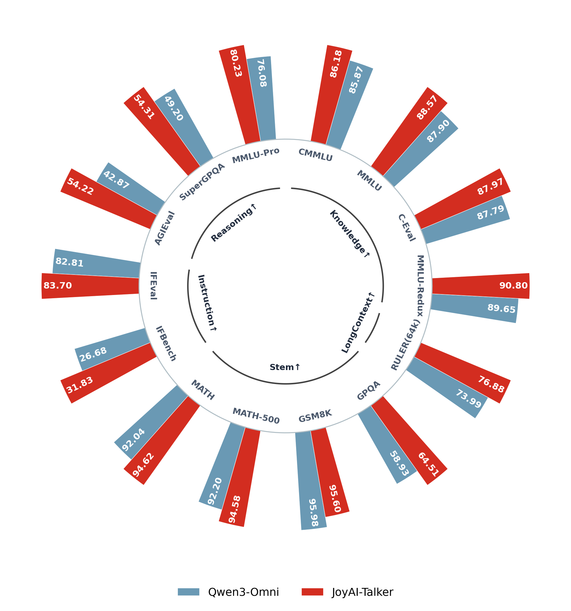
*(a)T2T*

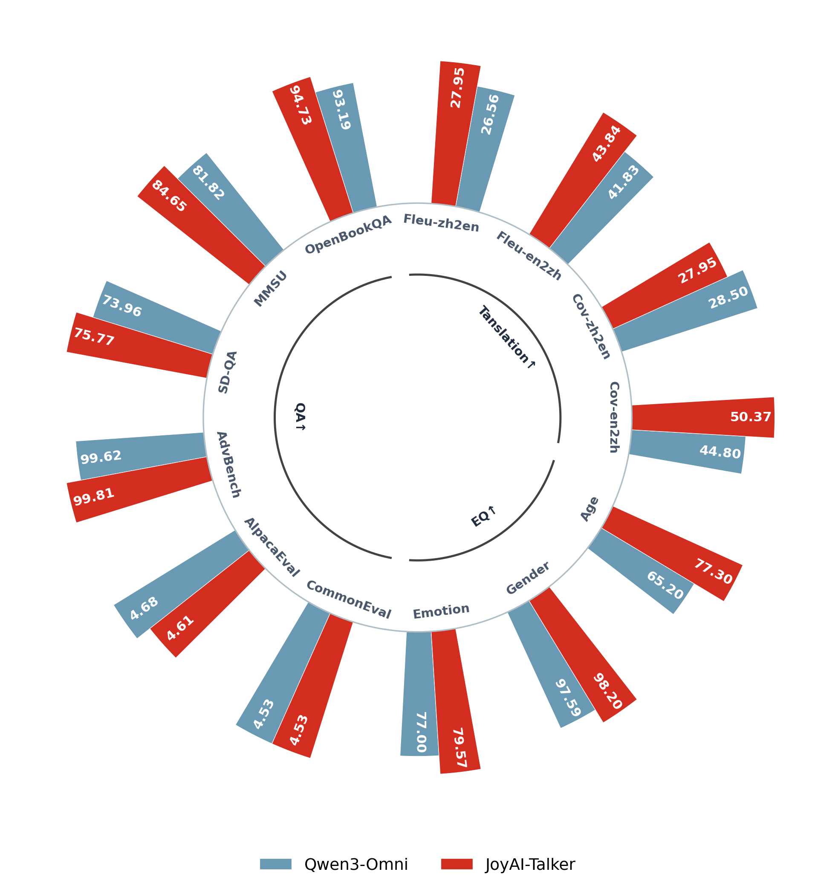
*(b)S2T - QA, Tanslation, EQ*

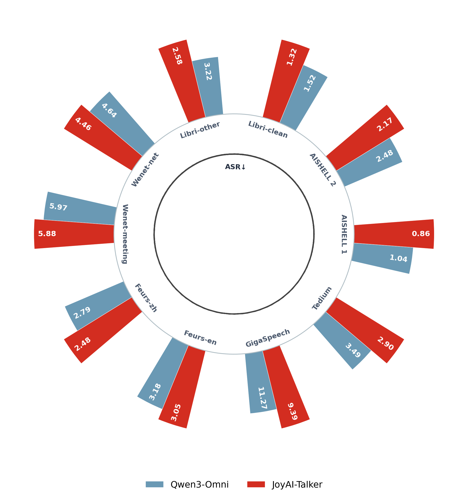
*(c)S2T - ASR*

![Figure 2:An overview of Thinker-Talker pipeline in JoyAI-Talker. It consists of several key components: 1) Audio Encoder: This module processes the input speech query and extracts continuous audio embeddings. 2) Hybrid MoE Thinker: Ingesting multimodal inputs, this cognitive core performs reasoning to predict the target text tokens and TTS instruction tokens. 3) Causal Autoregressive Transformer: This module takes the speaker embeddings, predicted TTS instruction tokens, and target text tokens as input, and predicts the discrete audio tokens. 4) Dynamic Chunk Diffusion Transformer: Using the hidden representations from the Causal Autoregressive Transformer as input, this component predicts the mel-spectrogram output. 5) Vocoder: This module is responsible for reconstructing the predicted mel-spectrogram back to continuous waveform audio.](../images/2026-08-04/2608.01119/2608.01119_fig4.png)
*Figure 2:An overview of Thinker-Talker pipeline in JoyAI-Talker. It consists of several key components: 1) Audio Encoder: This module processes the input speech query and extracts continuous audio embeddings. 2) Hybrid MoE Thinker: Ingesting multimodal inputs, this cognitive core performs reasoning to predict the target text tokens and TTS instruction tokens. 3) Causal Autoregressive Transformer: This module takes the speaker embeddings, predicted TTS instruction tokens, and target text tokens as input, and predicts the discrete audio tokens. 4) Dynamic Chunk Diffusion Transformer: Using the hidden representations from the Causal Autoregressive Transformer as input, this component predicts the mel-spectrogram output. 5) Vocoder: This module is responsible for reconstructing the predicted mel-spectrogram back to continuous waveform audio.*

*Figure 3:Unified token-interleaved streaming mechanism and state transitions of the Joy-Duplex Decoder. The streaming Audio Encoder processes continuous user audio waveforms within a sliding window. The Joy-Duplex Decoder receives continuous Audio Embeddings and autoregressively decodes interleaved Text Tokens, boundary tokens (<|asr_eos|>), and State Tokens within a single unified sequence.*

---
**Usage Info**: 11948 tokens used.
**Generated at**: 2026-08-04 16:18:38

---

# 📚 The Role of Disfluencies in Speech Translation

🚀 URL: https://arxiv.org/html/2608.02138

## 🌏 Abstract (원문)
Current speech translation systems, including SpeechLLMs, are trained on cleaned text and tend to strip disfluencies like filled pauses and false starts rather than translate them. We show this comes at a cost: disfluencies carry meaning that gets lost when speech is cleaned up. To study this systematically, we introduceUh-Mazing, a benchmark of human-translated, disfluency-annotated Switchboard speech covering English into eight target languages. Across these languages and several architectures, we find that false starts and self-repairs, not filled pauses or discourse markers, drive most of the translation-quality loss, and that models which fail to preserve a disfluency tend to omit it rather than mistranslate it. We show inference-time decoding can mitigate this without retraining, and release the benchmark and code.
## 🌏 Abstract (번역)
현재의 음성 번역 시스템은 SpeechLLM을 포함하여 정제된 텍스트로 훈련되며, 채움 중단(filled pauses)이나 잘못된 시작(false starts)과 같은 비유창성(disfluencies)을 번역하기보다는 제거하는 경향이 있습니다. 우리는 이것이 대가를 치른다는 것을 보여줍니다. 즉, 음성이 정제될 때 비유창성이 지닌 의미가 손실됩니다. 이를 체계적으로 연구하기 위해 우리는 영어에서 8개 대상 언어로 번역된, 비유창성이 주석 처리된 Switchboard 음성 데이터셋인 Uh-Mazing 벤치마크를 소개합니다. 이 언어들과 여러 아키텍처에 걸쳐, 우리는 채움 중단이나 담화 표지(discourse markers)가 아닌 잘못된 시작과 자기 수정(self-repairs)이 번역 품질 손실의 대부분을 유발하며, 비유창성을 보존하지 못하는 모델은 이를 오역하기보다는 생략하는 경향이 있음을 발견했습니다. 우리는 추론 시 디코딩이 재훈련 없이 이를 완화할 수 있음을 보여주며, 벤치마크와 코드를 공개합니다.

## 🔍 Methods & Results
- 현재 음성 번역 모델이 비유창성을 보존할 수 있는지 여부를 평가하는 것을 목표로 합니다.
- 네 가지 모델 유형(계단식, 종단 간, SpeechLLM, 상용)을 평가했으며, 종단 간 모델을 제외한 모든 모델에 표준 및 비유창성 인식 프롬프트를 사용했습니다.
- 계단식 모델은 ASR에 Canary/Whisper, 번역에 Tower/Llama를 사용했으며, 인간 주석 전사본으로도 평가되었습니다.
- 종단 간 모델은 Canary와 OWSM을 포함하며, 특정 언어 지원에 제한이 있습니다.
- SpeechLLM 모델은 Phi-4와 Qwen2.5-Omni를 사용했습니다.
- 상용 모델은 ChatGPT (GPT-5.2)와 Gemini를 사용했으며, 음성 입력과 인간 주석 전사본으로 평가되었습니다.
- 전반적인 번역 품질은 chrF (문자 수준 중첩) 및 COMET-Kiwi (참조 없는 의미론적 적절성) 지표로 평가되었습니다.
- 계단식 모델의 ASR 단계에서 비유창성 요소 유지율을 측정하기 위해 E-Scores 및 Z-Scores를 추가로 보고했습니다.
- 모델이 번역에서 비유창성을 올바르게 보존하는지 평가하기 위해 GPT-5.2를 LLM 심사위원으로 사용하여 '스타일 보존' (비유창성 존재, 유형, 배치, 느낌) 및 '의미 보존' (소스 의미의 정확성 및 완전성)의 두 가지 차원에서 점수를 매겼습니다.
- LLM 심사위원 평가에는 참조 번역 유무에 따른 두 가지 프롬프트 변형이 사용되었습니다.
- 자동 지표를 보완하기 위해 MQM 및 ESA 프로토콜에서 영감을 받은 인간 평가를 수행했습니다. 인간 평가자는 LLM 심사위원과 동일한 '스타일 보존' 및 '의미 보존' 차원에서 점수를 매기고 오류 범위를 표시 및 분류했습니다.
- 인간 평가는 Pearmut 플랫폼을 사용하여 수행되었으며, 상호 평가자 신뢰도를 확인하기 위해 일부 항목에 대해 여러 평가자가 주석을 달았습니다.

## 🖼 Figures

*Figure 1:Removing audio signal and disfluencies increases perceived intensity for seven of the eight emotions. Disgust reverses. Six of the eight increase at both steps: Audio
→
Disfluent and Disfluent
→
Fluent. A tick inside the bar marks these emotions.*

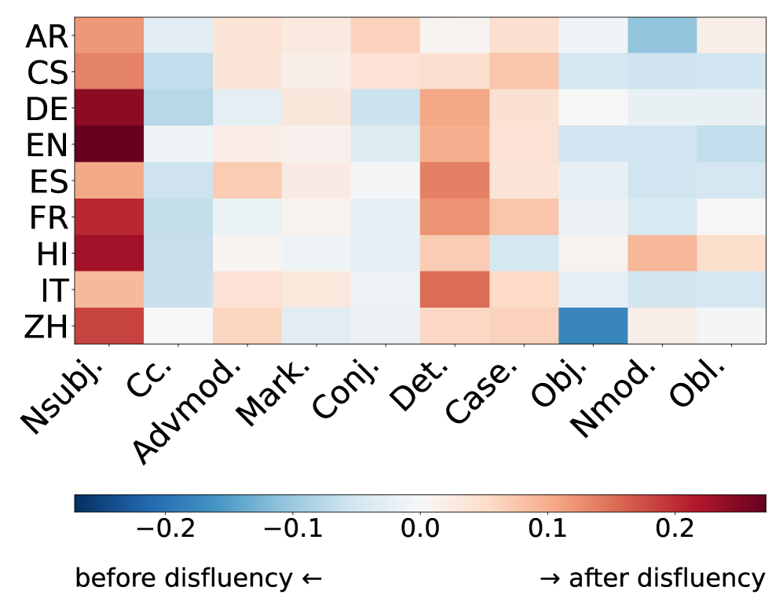
*Figure 2:Across languages, disfluencies most often follow a coordinating conjunction and precede the sentence subject. Position of disfluencies by the dependency relation of neighboring content words.*

*Figure 3:Three failure modes (
★
), incorrect language, missing content, and deletion, dominate consistently, regardless of whether error spans are broken down by language (left) or model (right). Human annotators marked the spans, assigning each a category from our taxonomy and a severity (Major/Minor).*

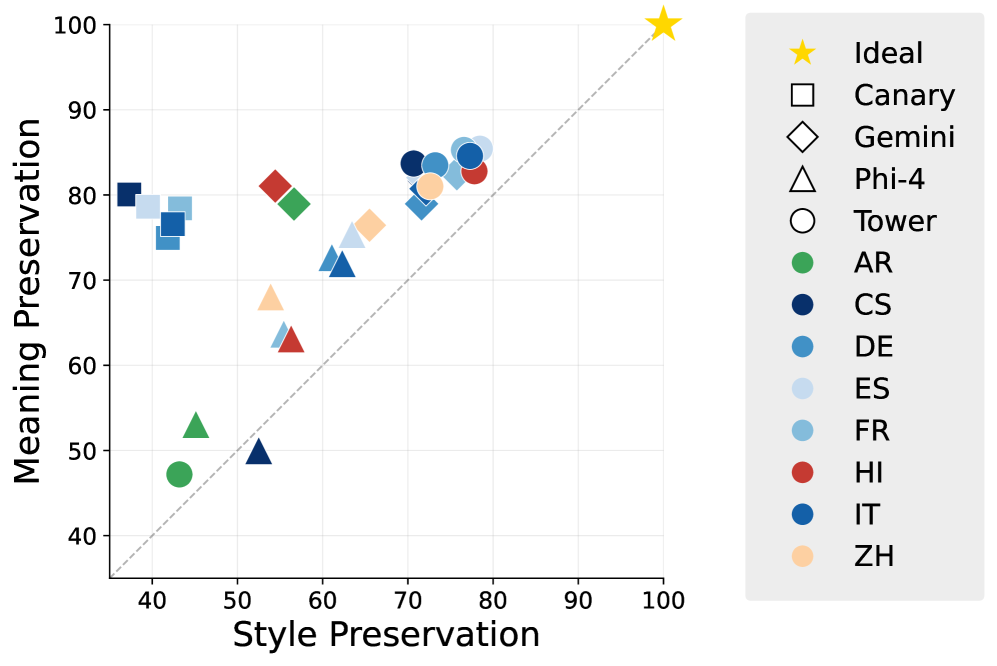
*Figure 4:All systems preserve meaning better than style in translation. Style Preservation vs. Meaning Preservation scores for one representative system per architecture category, across eight languages.*

*Figure 5:EDITED-type disfluencies drive the drop in translation performance. We show the change in COMET-Kiwi relative to the Fluent source baseline, by which disfluency type(s) the source text contains, pooled across four translation models (Llama, Tower, Gemini, ChatGPT) and eight target languages.*

*Figure 6:Decoding methods shape overall quality (COMET), while ICL improves disfluency preservation (chrF); the two interventions complement each other, as do the metrics. Decoding strategies per model (rows), in COMET (left) and chrF (right), averaged over eight EN
→
X pairs. Lines compare the standard (solid) and disfluency-aware (dashed) prompts; dotted lines are greedy baselines for the two prompt versions and 
★
 marks ICL runs.*

*Figure 7:Instructions to the annotators to identify the meaning of disfluencies using the Pearmut platform (Zouhar and Kocmi, 2026). The same example was seen by different annotators using the source speech, the fluent transcript, and the disfluent transcript.*

*Figure 8:Mean intensity ratings per NRC emotion across the three conditions (Audio, Disfluent, Fluent), with 95% confidence intervals. Each panel reports the total number of labels in that category (
𝑛
) and the overall shift 
Δ
F
−
A
=
Fluent
−
Audio
.*

*Figure 9:Mean expert
↔
Prolific cosine similarity per target language under three OpenAI embedders (text-embedding-3-small, -3-large, and -ada-002). The Latin- vs. non-Latin-script gap shrinks and eventually inverts as the embedder changes, indicating that part of the apparent non-Latin disagreement is embedder representational asymmetry rather than translator disagreement. 
Δ
 above each language shows the per-language change from text-embedding-3-small to text-embedding-ada-002.*

*Figure 9:Mean expert
↔
Prolific cosine similarity per target language under three OpenAI embedders (text-embedding-3-small, -3-large, and -ada-002). The Latin- vs. non-Latin-script gap shrinks and eventually inverts as the embedder changes, indicating that part of the apparent non-Latin disagreement is embedder representational asymmetry rather than translator disagreement. 
Δ
 above each language shows the per-language change from text-embedding-3-small to text-embedding-ada-002.*

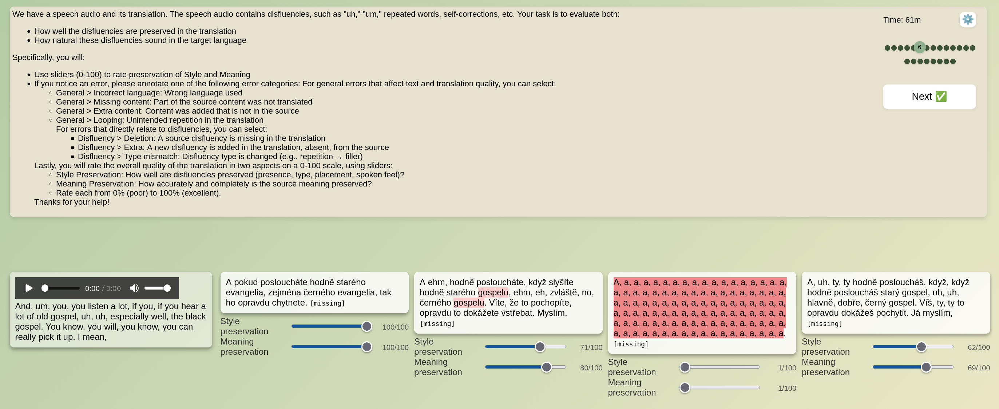
*Figure 12:Annotation guidelines for marking and categorising error spans and general judgments of translation quality, in the Pearmut system Zouhar and Kocmi (2026).*

---
**Usage Info**: 2651 tokens used.
**Generated at**: 2026-08-04 16:18:50

---

# 📚 Notebook for the ImageCLEF at CLEF 2026

🚀 URL: https://arxiv.org/html/2608.01796

## 🌏 Abstract (원문)
This paper describes the participation of team “Go-To-Germany” in the ImageCLEF 2026 Audio Deepfake Detection and Generation task. Our detection system, built on a four-backbone self-supervised learning (SSL) ensemble combining WavLM-Large, Wav2Vec2-XLS-R-300M, ECAPA-TDNN, and x-vector representations, achieved a final score of0.9522on the official ImageCLEF 2026 evaluation, with perfect accuracy (1.0000) on participant-generated deepfakes and 0.8875 on the held-out organizer ground-truth real data. For the Generation sub-task, our official team submission — an F5-TTS v1 baseline processed with a uniform reverberation pass, submitted as a deliberate anti-forensic probe — ranked first with a final score of 0.4304111By coincidence, the official Generation Final Score (0.4304) numerically equals the PCA-192 inter-region correlation reported in §6.3; the two are unrelated measurements.(word error rate (WER) 4.99%, character error rate (CER) 2.07%); details of our four-model program (GLM-TTS, F5-TTS, XTTS v2, CosyVoice3), from which the official entry was drawn, appear in §3. We present a cross-track analysis revealing a pronounced asymmetry: our detection system identifies 100% of participant-generated deepfakes, while our official generation entry — despite ranking first in the Audio Generation sub-task and evading 61.4% and 56.2% of participant and organizer detectors — attains a Final Score of 0.4304 against 0.9522 on the Detection side. We further report falsification-based ablation experiments (LOSO 56-speaker cross-validation, three-region backbone geometry, bootstrap confidence intervals, and PCA analysis) that motivate our architectural-insurance hypothesis for multi-backbone SSL ensembling. We complement these results with five cross-track insights and five pre-registered falsification experiments connecting generation-side evasion to detection-side design decisions, and we openly report an 11.25% false-positive gap on held-out organizer real recordings as the principal open challenge for deployment.
## 🌏 Abstract (번역)
본 논문은 ImageCLEF 2026 오디오 딥페이크 탐지 및 생성 태스크에 대한 “Go-To-Germany” 팀의 참여를 설명합니다. WavLM-Large, Wav2Vec2-XLS-R-300M, ECAPA-TDNN, x-vector 표현을 결합한 4개 백본 자기 지도 학습(SSL) 앙상블을 기반으로 구축된 당사의 탐지 시스템은 공식 ImageCLEF 2026 평가에서 0.9522의 최종 점수를 달성했으며, 참가자가 생성한 딥페이크에 대해서는 완벽한 정확도(1.0000)를, 주최측이 보유한 실제 데이터에 대해서는 0.8875를 기록했습니다. 생성 서브태스크의 경우, 당사의 공식 팀 제출물(균일한 잔향 처리를 거쳐 의도적인 안티-포렌식 프로브로 제출된 F5-TTS v1 베이스라인)은 0.4304의 최종 점수로 1위를 차지했습니다. (우연히도, 공식 생성 최종 점수(0.4304)는 §6.3에 보고된 PCA-192 지역 간 상관관계와 수치적으로 동일하지만, 이 둘은 관련 없는 측정값입니다.) (단어 오류율(WER) 4.99%, 문자 오류율(CER) 2.07%); 공식 제출물이 도출된 당사의 4가지 모델 프로그램(GLM-TTS, F5-TTS, XTTS v2, CosyVoice3)에 대한 자세한 내용은 §3에 나와 있습니다. 우리는 탐지 시스템이 참가자가 생성한 딥페이크를 100% 식별하는 반면, 당사의 공식 생성 제출물은 오디오 생성 서브태스크에서 1위를 차지하고 참가자 및 주최측 탐지기의 61.4% 및 56.2%를 회피했음에도 불구하고 탐지 측의 0.9522에 비해 0.4304의 최종 점수를 달성하는 뚜렷한 비대칭성을 보여주는 교차 트랙 분석을 제시합니다. 우리는 다중 백본 SSL 앙상블을 위한 아키텍처-보험 가설을 뒷받침하는 위조 기반 제거 실험(LOSO 56-화자 교차 검증, 3개 영역 백본 기하학, 부트스트랩 신뢰 구간, PCA 분석)을 추가로 보고합니다. 우리는 이러한 결과에 생성 측 회피와 탐지 측 설계 결정을 연결하는 5가지 교차 트랙 통찰력과 5가지 사전 등록된 위조 실험을 보완하며, 배포를 위한 주요 공개 과제로 주최측이 보유한 실제 녹음에서 11.25%의 오탐 간극을 공개적으로 보고합니다.

## 🔍 Methods & Results
- 탐지 시스템은 WavLM-Large, Wav2Vec2-XLS-R-300M, ECAPA-TDNN, x-vector 표현을 결합한 4개 백본 자기 지도 학습(SSL) 앙상블로 구축되었습니다.
- 탐지 시스템은 ImageCLEF 2026 평가에서 0.9522의 최종 점수를 달성했으며, 참가자가 생성한 딥페이크에 대해 1.0000의 완벽한 정확도를, 주최측 실제 데이터에 대해 0.8875를 기록했습니다.
- 생성 서브태스크의 공식 제출물은 균일한 잔향 처리를 거친 F5-TTS v1 베이스라인으로, 0.4304의 최종 점수로 1위를 차지했습니다.
- 생성 모델은 4.99%의 단어 오류율(WER)과 2.07%의 문자 오류율(CER)을 보였습니다.
- 공식 생성 제출물은 GLM-TTS, F5-TTS, XTTS v2, CosyVoice3의 4가지 모델 프로그램에서 도출되었습니다.
- 교차 트랙 분석 결과, 탐지 시스템은 참가자가 생성한 딥페이크를 100% 식별했지만, 생성 시스템은 참가자 및 주최측 탐지기의 61.4% 및 56.2%를 회피했음에도 불구하고 탐지 측 점수(0.9522)에 비해 낮은 0.4304의 최종 점수를 기록하는 비대칭성이 나타났습니다.
- 다중 백본 SSL 앙상블을 위한 아키텍처-보험 가설을 뒷받침하기 위해 LOSO 56-화자 교차 검증, 3개 영역 백본 기하학, 부트스트랩 신뢰 구간, PCA 분석을 포함한 위조 기반 제거 실험이 수행되었습니다.
- 주최측이 보유한 실제 녹음에서 11.25%의 오탐 간극이 배포를 위한 주요 공개 과제로 보고되었습니다.

---
**Usage Info**: 2985 tokens used.
**Generated at**: 2026-08-04 16:19:01

---

# 📚 StreamTalk: Streaming Co-Speech Gesture Generation with Key-Pose Anchoring

🚀 URL: https://arxiv.org/html/2608.01643

## 🌏 Abstract (원문)
Real-time co-speech gesture generation requires producing 3D motion clip by clip as speech streams in. Existing methods are fundamentallyopen-loop: each clip is synthesized conditioned only on past context, with no mechanism to verify or correct trajectory plausibility. Small per-clip errors therefore compound silently, causing the well-known drift problem—motion that gradually deviates from natural distributions over minute-scale horizons. We make a key observation: drift stems not from poor local motion quality—modern diffusion models already produce convincing short clips—but from the absence offorward constraintsthat tell each clip where it should arrive. Supplying even a single plausible key pose at a clip’s tail as a “destination anchor” is sufficient to suppress drift dramatically. Building on this insight, we propose StreamTalk, aclosed-loopstreaming framework that introduces a periodic generate–retrieve–refine feedback cycle. At inference, Streaming Pose-Guided Generation (SPG) first produces a coarse clip, retrieves a plausible tail key pose from a speaker-specific motion database, and refines the clip with this anchor before passing it to the next window. To enable the model to exploit such sparse anchors effectively, we introduce Stochastic Anchor Masking (SAM) during training, which independently masks random pose and translation frames so the model learns to inpaint complete motion from partial boundary conditions. A part-aware DiT architecture further disentangles hand, body, and translation streams to prevent global displacement from interfering with local articulation. Extensive experiments on the BEAT2 benchmark demonstrate that StreamTalk achieves state-of-the-art motion quality (FGD), significantly suppresses long-horizon drift compared to open-loop baselines, and runs in real time at 76	FPS—enabling practical minute-scale streaming co-speech gesture generation. Project page:https://xiangyue-zhang.github.io/StreamTalk/.
## 🌏 Abstract (번역)
실시간 음성 동반 제스처 생성은 음성 스트림이 들어옴에 따라 3D 모션을 클립 단위로 생성해야 합니다. 기존 방법들은 근본적으로 개방형(open-loop) 방식이어서, 각 클립은 과거 컨텍스트에만 조건화되어 합성되며 궤적의 타당성을 검증하거나 수정하는 메커니즘이 없습니다. 따라서 클립당 작은 오류들이 조용히 누적되어, 분 단위의 긴 시간 동안 자연스러운 분포에서 점진적으로 벗어나는 잘 알려진 드리프트(drift) 문제를 야기합니다. 우리는 중요한 관찰을 했습니다. 드리프트는 좋지 않은 지역 모션 품질에서 비롯되는 것이 아니라(최신 확산 모델은 이미 설득력 있는 짧은 클립을 생성함), 각 클립이 어디에 도달해야 하는지를 알려주는 전방 제약(forward constraints)이 없기 때문에 발생한다는 것입니다. 클립의 끝에 단 하나의 그럴듯한 키 포즈를 '목적지 앵커'로 제공하는 것만으로도 드리프트를 극적으로 억제하기에 충분합니다. 이 통찰력을 바탕으로 우리는 주기적인 생성-검색-정제(generate–retrieve–refine) 피드백 사이클을 도입하는 폐쇄형(closed-loop) 스트리밍 프레임워크인 StreamTalk를 제안합니다. 추론 시, 스트리밍 포즈 가이드 생성(SPG)은 먼저 거친 클립을 생성하고, 화자별 모션 데이터베이스에서 그럴듯한 꼬리 키 포즈를 검색한 다음, 이 앵커를 사용하여 클립을 정제한 후 다음 윈도우로 전달합니다. 모델이 이러한 희소한 앵커를 효과적으로 활용할 수 있도록, 우리는 훈련 중에 확률적 앵커 마스킹(SAM)을 도입하여 임의의 포즈 및 변환 프레임을 독립적으로 마스킹함으로써 모델이 부분적인 경계 조건으로부터 완전한 모션을 인페인팅하도록 학습시킵니다. 부분 인식 DiT 아키텍처는 손, 몸, 변환 스트림을 더욱 분리하여 전역 변위가 지역 관절 움직임에 간섭하는 것을 방지합니다. BEAT2 벤치마크에 대한 광범위한 실험은 StreamTalk가 최첨단 모션 품질(FGD)을 달성하고, 개방형 기준선에 비해 장기 드리프트를 현저히 억제하며, 76 FPS의 실시간으로 실행되어 실용적인 분 단위 스트리밍 음성 동반 제스처 생성을 가능하게 함을 보여줍니다. 프로젝트 페이지: https://xiangyue-zhang.github.io/StreamTalk/.

## 🔍 Methods & Results
- 스트리밍 음성 동반 제스처 생성을 순차적 모션 인페인팅으로 공식화하며, 각 시간 윈도우에서 이전 클립의 헤드 프레임과 모션 데이터베이스에서 검색된 꼬리 키 포즈를 경계 조건으로 받아 그 사이의 프레임을 인페인팅합니다.
- 입력 음성은 WavLM 인코더로 인코딩되고, 4계층 트랜스포머가 얼굴 특징을 회귀하며, 이들을 연결하여 오디오-얼굴 특징을 형성합니다. 타겟 모션은 SMPL-X 규약을 따르며 6D 조인트 회전과 루트 변환을 포함합니다.
- 생성 백본으로 플로우 매칭(flow-matching) 목표를 채택하며, Part-aware DiT는 모션을 손, 몸, 변환의 세 가지 브랜치로 분해하고 각 브랜치는 FiLM-스타일 스케일-시프트 변조를 사용하는 잔여 트랜스포머 블록으로 구현됩니다.
- Part-aware DiT는 전역 변위가 지역 관절 움직임 학습을 방해하는 것을 방지하고, SPG가 포즈 앵커만 검색하므로 포즈와 변환 프롬프트를 별도로 처리할 수 있도록 합니다.
- Streaming Pose-Guided Generation (SPG)는 추론 시 핵심 메커니즘으로, 60프레임 클립을 생성-검색-정제(generate–retrieve–refine) 사이클을 통해 생성합니다.
- SPG의 '생성' 단계에서는 Part-aware DiT가 가우시안 노이즈로부터 오디오-얼굴 특징, 스타일 벡터, 이전 클립의 꼬리 프레임에 조건화된 거친 클립을 생성합니다.
- SPG의 '검색' 단계에서는 거친 클립을 화자별 모션 데이터베이스(조인트 회전만 포함, 변환 제외)와 비교하여 가장 가까운 꼬리 키 포즈 후보를 찾습니다. 비교는 회전 공간이 아닌 조인트 공간에서 포워드 키네마틱스(FK)를 통해 수행됩니다.
- SPG의 '정제' 단계에서는 업데이트된 꼬리 키 포즈를 사용하여 캐시된 중간 지점부터 재통합하여 비용을 절반으로 줄이고, 정제된 클립의 꼬리 프레임은 다음 윈도우의 포즈 프롬프트로 전달되어 피드백 루프를 완성합니다.
- Stochastic Anchor Masking (SAM)은 훈련-추론 정렬 메커니즘으로, 훈련 중 지면 진실 모션의 포즈 및 변환 프레임에 독립적인 확률적 이진 마스크를 적용하여 모델이 부분적인 경계 조건으로부터 모션을 인페인팅하도록 학습시킵니다.
- 손실 함수는 플로우 매칭 회귀 손실, 해부학적 구조 보존을 위한 포워드 키네마틱스 손실, 예측과 가시적 앵커를 정렬하는 프롬프트 일관성 항으로 구성됩니다.
- StreamTalk는 BEAT2 벤치마크에서 최첨단 모션 품질(FGD)을 달성하고, 개방형 기준선에 비해 장기 드리프트를 현저히 억제하며, 76 FPS의 실시간으로 실행되어 실용적인 분 단위 스트리밍 음성 동반 제스처 생성을 가능하게 합니다.

## 🖼 Figures
![Figure 1: (a) Existing open-loop streaming methods generate each clip conditioned only on past context. Without forward constraints, small errors accumulate across clips, causing distributional drift—motion that progressively departs from the natural pose distribution. (b) StreamTalk introduces closed-loop streaming generation: our Streaming Pose-Guided Generation (SPG) module retrieves a plausible key pose from a motion database at each clip boundary and uses it as a destination anchor, keeping the generated motion stable over long horizons.](../images/2026-08-04/2608.01643/2608.01643_fig0.png)
*Figure 1: (a) Existing open-loop streaming methods generate each clip conditioned only on past context. Without forward constraints, small errors accumulate across clips, causing distributional drift—motion that progressively departs from the natural pose distribution. (b) StreamTalk introduces closed-loop streaming generation: our Streaming Pose-Guided Generation (SPG) module retrieves a plausible key pose from a motion database at each clip boundary and uses it as a destination anchor, keeping the generated motion stable over long horizons.*

![Figure 2:Architecture of StreamTalk. (a) Training. SAM independently masks random pose and translation frames from ground-truth motion to form sparse Pose and Trans prompts. The noised sequence 
𝐗
𝑡
 is split into hands 
𝐇
𝑡
, body 
𝐁
𝑡
, and translation 
𝐓
𝑡
 and processed by a Part-aware DiT with three branches; outputs are fused to predict 
𝐗
^
1
. This teaches the model to inpaint complete motion from partial boundary conditions. (b) Inference. SPG forms a closed-loop generate–retrieve–refine cycle: each clip is first generated, then its tail is matched against a speaker-specific motion database to retrieve a plausible key pose anchor; the clip is refined with this anchor before its tail frames seed the next window.](../images/2026-08-04/2608.01643/2608.01643_fig1.png)
*Figure 2:Architecture of StreamTalk. (a) Training. SAM independently masks random pose and translation frames from ground-truth motion to form sparse Pose and Trans prompts. The noised sequence 
𝐗
𝑡
 is split into hands 
𝐇
𝑡
, body 
𝐁
𝑡
, and translation 
𝐓
𝑡
 and processed by a Part-aware DiT with three branches; outputs are fused to predict 
𝐗
^
1
. This teaches the model to inpaint complete motion from partial boundary conditions. (b) Inference. SPG forms a closed-loop generate–retrieve–refine cycle: each clip is first generated, then its tail is matched against a speaker-specific motion database to retrieve a plausible key pose anchor; the clip is refined with this anchor before its tail frames seed the next window.*

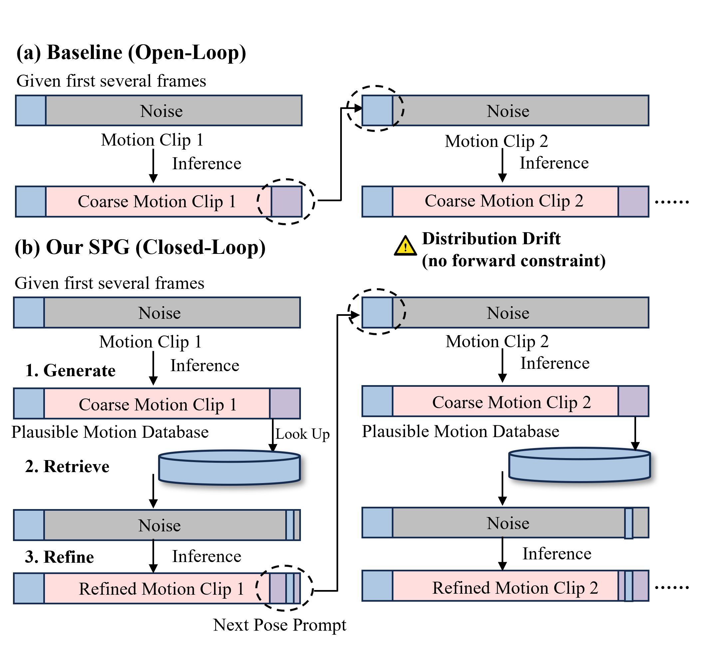
*Figure 3:Open-loop vs. closed-loop inference. (a) Open-loop errors accumulate into drift. (b) SPG closes the loop with a retrieved destination anchor.*

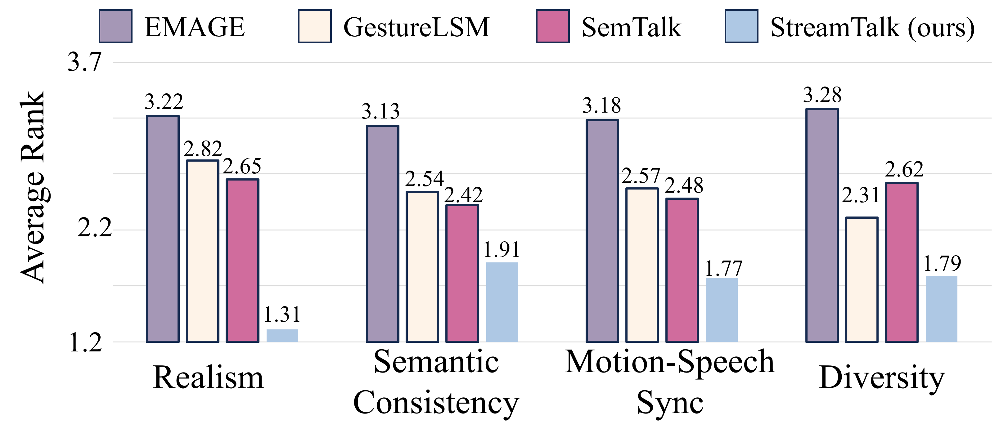
*Figure 4:User study results. StreamTalk ranks first across all four perceptual criteria.*

![Figure 5:Qualitative comparison on BEAT2 [liu2024emage]. Each column shows gestures aligned with the same speech segment. StreamTalk (bottom) produces smoother, more expressive, and rhythm-aligned gestures with consistent arm spacing, while baselines exhibit motion freezing, desynchronized gestures, or loss of spatial consistency. Red dashed ellipses highlight regions where StreamTalk better preserves rhythmic articulation and continuity.](../images/2026-08-04/2608.01643/2608.01643_fig4.png)
*Figure 5:Qualitative comparison on BEAT2 [liu2024emage]. Each column shows gestures aligned with the same speech segment. StreamTalk (bottom) produces smoother, more expressive, and rhythm-aligned gestures with consistent arm spacing, while baselines exhibit motion freezing, desynchronized gestures, or loss of spatial consistency. Red dashed ellipses highlight regions where StreamTalk better preserves rhythmic articulation and continuity.*

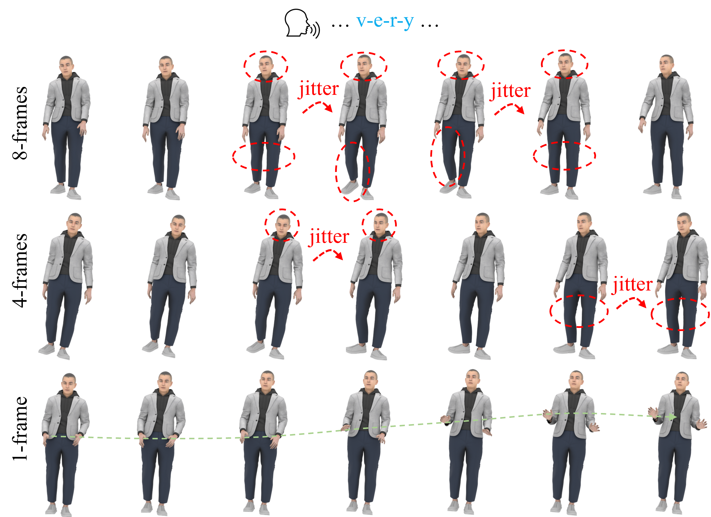
*Figure 6:Effect of key pose count. Using 8 or 4 anchors introduces visible jitter (red), while a single key pose produces smoother motion.*

*Figure 7:Long-horizon stability and refinement analysis. (a) Sliding-window FGD across 
∼
1,800 frames: all baseline methods show upward FGD drift over time, while w/ SPG remains the lowest and most stable. (b) Joint trajectory of different refinement strategies: No Refinement and Linear Refinement exhibit noticeable jitter, while SPG produces a smooth trajectory closer to the ground truth. Black arrows indicate jittering points.*

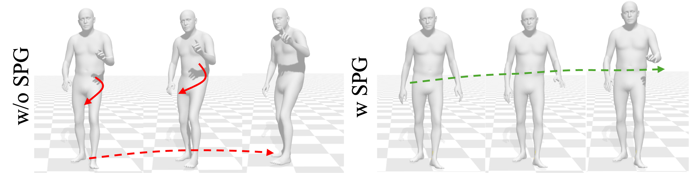
*Figure 8:SPG visual analysis. (a) Without SPG, motion shows spatial drift and abrupt corrections; with SPG, trajectories remain smooth. (b) Self-intersection artifacts are dramatically reduced by SPG.*

---
**Usage Info**: 4886 tokens used.
**Generated at**: 2026-08-04 16:19:16

---

# 📚 One-Sided Quantile Coupling for Flow Matching

🚀 URL: https://arxiv.org/html/2608.00978

## 🌏 Abstract (원문)
Flow Matching (FM) trains continuous-time generative models by regressing the velocity field of a probability path between a simple source distribution and a target data distribution. The coupling that pairs source and target samples strongly affects optimization and sample quality, but structured couplings typically rely on mini-batch transport or assignment procedures whose cost grows at least quadratically in batch size. We proposeQuantile Coupling Flow Matching (QC-FM), a lightweightone-sidedcoupling: rather than matching two pre-sampled batches, it samples only the data batch and constructs each paired source directly. Data ranks projected along a small number of random orthogonal directions are mapped to Gaussian quantiles, and the latent code is completed in the orthogonal complement by conditional Gaussian sampling. The construction is one-dimensional per slice, so the coupling requires no pairwise cost matrix and no assignment to solve. We show that, for each drawn frame, this coupling eliminates the irreducible regression variance along every selected slice and makes the ideal flow exactly straight there, while leaving the sampling prior unchanged: generation still starts from the standard Gaussian, and the training source deviates from it only through the copula of the slice codes, whose transport cost we bound. For training, we apply QC to an anchor subset and complete the remaining source slots with exact Gaussian samples, retaining the QC bias while preserving an explicit signal from the Baseline coupling. Across CIFAR-10, CelebA, FFHQ, and ImageNet-64, QC-FM improves over the Baseline under matched training budgets, reducing FID by up to12.9%12.9%, and outperforms minibatch OT-CFM on all four datasets. These results suggest that preserving projected rank structure is a simple and scalable way to inject useful geometric bias into FM couplings without solving a mini-batch transport problem.
## 🌏 Abstract (번역)
플로우 매칭(FM)은 간단한 소스 분포와 타겟 데이터 분포 사이의 확률 경로의 속도 필드를 회귀하여 연속 시간 생성 모델을 훈련합니다. 소스 및 타겟 샘플을 페어링하는 결합 방식은 최적화 및 샘플 품질에 큰 영향을 미치지만, 구조화된 결합은 일반적으로 미니 배치 전송 또는 할당 절차에 의존하며, 이들의 비용은 배치 크기에 따라 최소한 제곱에 비례하여 증가합니다. 우리는 경량의 단방향 결합인 Quantile Coupling Flow Matching (QC-FM)을 제안합니다. 이는 미리 샘플링된 두 배치를 매칭하는 대신, 데이터 배치만 샘플링하고 각 페어링된 소스를 직접 구성합니다. 소수의 무작위 직교 방향으로 투영된 데이터 순위는 가우시안 분위수에 매핑되며, 잠재 코드는 조건부 가우시시안 샘플링을 통해 직교 여집합에서 완성됩니다. 이 구성은 슬라이스당 1차원이므로, 결합은 쌍별 비용 행렬이나 해결해야 할 할당 문제를 필요로 하지 않습니다. 우리는 각 추출된 프레임에 대해 이 결합이 선택된 모든 슬라이스를 따라 환원 불가능한 회귀 분산을 제거하고 이상적인 흐름을 정확히 직선으로 만들면서도 샘플링 사전 분포를 변경하지 않음을 보여줍니다. 즉, 생성은 여전히 표준 가우시안에서 시작하며, 훈련 소스는 슬라이스 코드의 코퓰라를 통해서만 표준 가우시안에서 벗어나며, 이의 전송 비용은 우리가 제한합니다. 훈련을 위해 우리는 QC를 앵커 서브셋에 적용하고 나머지 소스 슬롯을 정확한 가우시안 샘플로 채워, QC 편향을 유지하면서도 베이스라인 결합으로부터 명시적인 신호를 보존합니다. CIFAR-10, CelebA, FFHQ 및 ImageNet-64 전반에 걸쳐 QC-FM은 동일한 훈련 예산 하에서 베이스라인보다 개선되어 FID를 최대 12.9% 감소시키고, 네 가지 데이터셋 모두에서 미니배치 OT-CFM을 능가합니다. 이러한 결과는 투영된 순위 구조를 보존하는 것이 미니 배치 전송 문제를 해결하지 않고도 FM 결합에 유용한 기하학적 편향을 주입하는 간단하고 확장 가능한 방법임을 시사합니다.

## 🔍 Methods & Results
- Flow Matching (FM)은 소스 분포(p0)와 데이터 분포(p1) 사이의 조건부 확률 경로의 속도에 맞춰 시간 의존적 벡터 필드(vθ(x,t))를 훈련합니다. 베이스라인은 선형 경로(xt=(1-t)x0+tx1)를 사용하며, x0와 x1 간의 결합 방식이 훈련 궤적의 기하학적 구조와 목표 속도 필드의 분산에 크게 영향을 미칩니다.
- Quantile Coupling Flow Matching (QC-FM)은 경량의 단방향 결합 방식으로, 데이터 배치(Bx)에서 샘플링된 데이터의 투영된 순위를 가우시안 분위수에 매핑하여 해당 잠재 배치(Be)를 구성합니다.
- QC-FM은 무작위 직교 방향(U=[u1,...,uk])을 따라 데이터를 투영하고, 각 투영된 값의 배치 내 순위(rij)를 계산한 후, 이를 역 표준 정규 CDF를 통해 가우시안 분위수(zij)로 변환합니다.
- 잠재 코드(e(i))는 U^T e(i) = z(i)에 조건화된 표준 가우시안 샘플로 정의되며, e(i) = U z(i) + (Id - U U^T) ε(i) 형태로, 선택된 투영 좌표를 강제하고 직교 여집합에 가우시안 변동성을 주입합니다.
- QC-FM은 선택된 방향을 따라 데이터 투영의 배치별 순서를 보존하며, 명시적으로 제약되지 않은 방향에서는 확률적 변동성을 유지합니다.
- QC-FM의 배치 의존적 비용은 k 방향을 따라 투영된 값을 정렬하는 데 O(kB log B)로, 기존 배치별 전송 방법의 최소 제곱 의존성보다 효율적입니다.
- 훈련 시, QC-FM은 앵커 비율(p)에 따라 데이터 배치를 앵커 서브셋(Bx,anc)과 나머지 서브셋(Bx,rest)으로 분할합니다. QC는 앵커 서브셋에 적용되고, 나머지 소스 슬롯은 정확한 가우시안 샘플로 채워집니다.
- QC-FM-Mixture는 나머지 데이터 포인트(Bx,rest)를 무작위로 가우시안 잠재 포인트(Be,rest)와 페어링하여 베이스라인 결합과 유사하게 작동합니다.
- QC-FM-Adjacency는 나머지 데이터 포인트(Bx,rest)를 구조화된 좌표(dU(a,b)=||U^T a - U^T b||2)에서 가장 가까운 앵커 타겟에 할당하고, 가우시안 잠재 포인트를 병렬 경매를 통해 앵커별 그룹 할당량에 맞춰 배분한 후, 각 그룹 내에서 무작위로 페어링합니다.
- QC-FM은 CIFAR-10, CelebA, FFHQ, ImageNet-64 데이터셋에서 베이스라인보다 성능이 향상되었으며, FID를 최대 12.9% 감소시키고 미니배치 OT-CFM을 능가했습니다.
- 이러한 결과는 투영된 순위 구조를 보존하는 것이 미니 배치 전송 문제 해결 없이 FM 결합에 유용한 기하학적 편향을 주입하는 간단하고 확장 가능한 방법임을 시사합니다.

## 🖼 Figures

*Figure 1:Learned flow trajectories on 8-Gaussians and Checkerboard. Light-gray points show the target distribution, dark-gray points are shared Gaussian initial states, red points are the corresponding model endpoints, and purple curves are 
100
-step Euler trajectories. PLR is integrated path length divided by endpoint displacement, so 
PLR
=
1
 corresponds to a straight path. Both QC-FM variants visibly straighten trajectories learned by the Baseline.*

*Figure A:Matched-noise CIFAR-10 comparisons at the common 
1600
-epoch endpoint (
NFE
=
50
). Corresponding cells use identical Gaussian initial states.*

*Figure B:Matched-noise CelebA-64 comparisons at the common 
500
-epoch endpoint (
NFE
=
50
). Corresponding cells use identical Gaussian initial states.*

*Figure C:Matched-noise FFHQ-64 comparisons at the common 
1200
-epoch endpoint (
NFE
=
50
). Corresponding cells use identical Gaussian initial states.*

*Figure D:Matched-input class-conditional ImageNet-64 comparisons at the common 
60
-epoch endpoint under the ADM center-crop protocol. Corresponding cells use identical Gaussian initial states and class labels (
NFE
=
50
, classifier-free guidance scale 
1.5
).*

---
**Usage Info**: 6316 tokens used.
**Generated at**: 2026-08-04 16:19:31

---

# 📚 Scene2Sound: Auditory-Grounded Soundscape Generation for 3D Gaussian Worlds

🚀 URL: https://arxiv.org/html/2608.00463

## 🌏 Abstract (원문)
3D Gaussian Splatting (3DGS) turns captured or generated imagery into photorealistic 3D world simulations that users can freely explore, yet these worlds remain silent. Because existing audio generation methods condition on a single image or viewpoint, their sound is tied to that observation and cannot stay consistent while a listener moves. We introduce the task of generating a spatially consistent soundscape for a given 3DGS world through auditory grounding, identifying which objects in the world should emit sound and anchoring each to a persistent 3D position, and present Scene2Sound, a training-free framework built on this grounding. From the input world alone, our pipeline selects viewpoints that jointly cover the scene, identifies sound-emitting objects with a vision-language model, and associates the multi-view detections into 3D instances through Gaussian set matching, which measures the overlap between the Gaussian sets that render each detection. Each source then receives generated audio that a standard object-based audio engine spatializes in real time at arbitrary listener poses. We further propose two spatial-consistency metrics, one testing whether rendered audio responds consistently to listener motion and one testing whether the claimed sources are supported by views held out from their placement. On a curated set of generated 3DGS worlds and on 3DGS scenes generated from real-world360∘360^{\circ}captures, Scene2Sound preserves the audio quality of strong per-viewpoint baselines while remaining spatially consistent where per-viewpoint and single-panorama pipelines do not, and a user study confirms the perceptual benefit. Project page:https://masaki-lmd.github.io/scene2sound/.
## 🌏 Abstract (번역)
3D 가우시안 스플래팅(3DGS)은 캡처되거나 생성된 이미지를 사용자가 자유롭게 탐색할 수 있는 사실적인 3D 세계 시뮬레이션으로 변환하지만, 이 세계들은 여전히 소리가 없습니다. 기존 오디오 생성 방법은 단일 이미지 또는 시점에 기반하므로, 생성된 소리는 해당 관찰에 묶여 청취자가 움직이는 동안 일관성을 유지할 수 없습니다. 본 연구는 주어진 3DGS 세계에 대해 공간적으로 일관된 사운드스케이프를 생성하는 작업을 소개하며, 이를 위해 세계 내에서 어떤 객체가 소리를 내야 하는지 식별하고 각 소리를 영구적인 3D 위치에 고정하는 청각적 접지(auditory grounding)를 사용합니다. 또한 이 접지를 기반으로 구축된 학습 없는 프레임워크인 Scene2Sound를 제시합니다. 입력된 세계만으로, 우리의 파이프라인은 장면을 공동으로 커버하는 시점을 선택하고, 비전-언어 모델을 사용하여 소리를 내는 객체를 식별하며, 각 탐지를 렌더링하는 가우시안 세트 간의 중첩을 측정하는 가우시안 세트 매칭을 통해 다중 시점 탐지를 3D 인스턴스로 연결합니다. 그런 다음 각 소스는 표준 객체 기반 오디오 엔진이 임의의 청취자 자세에서 실시간으로 공간화하는 생성된 오디오를 받습니다. 우리는 또한 두 가지 공간 일관성 측정 지표를 제안합니다. 하나는 렌더링된 오디오가 청취자 움직임에 일관되게 반응하는지 테스트하고, 다른 하나는 주장된 소스가 배치에서 제외된 시점에 의해 뒷받침되는지 테스트합니다. 선별된 생성된 3DGS 세계와 실제 360도 캡처에서 생성된 3DGS 장면에서, Scene2Sound는 강력한 시점별 기준선의 오디오 품질을 유지하면서 시점별 및 단일 파노라마 파이프라인이 실패하는 공간적 일관성을 유지하며, 사용자 연구는 인지적 이점을 확인합니다. 프로젝트 페이지: https://masaki-lmd.github.io/scene2sound/.

## 🔍 Methods & Results
- Scene2Sound는 3DGS 세계에 대한 공간적으로 일관된 사운드스케이프를 생성하는 훈련 없는 프레임워크로, 소리 추론, 소리 발생원 결정, 탐색 가능한 장면 전반의 일관성 보장이라는 세 가지 과제를 해결합니다.
- 사운드스케이프는 공간적 고정 없이 전역 배경 분위기를 제공하는 '앰비언트 베드'(예: 바람)와 특정 3D 위치에 고정된 '포인트 소스'(예: 분수)로 분해됩니다.
- 파이프라인은 다섯 가지 모듈로 구성됩니다: 자동 시점 선택(장면 커버리지), 장면 이해(VLM을 통한 사운드 이벤트 식별), 오디오 소스 생성(텍스트-오디오 모델을 통한 오디오 합성), 오디오 소스 배치(가우시안 세트 매칭을 통한 2D 접지를 3D 위치로 변환), 오디오 렌더링(실시간 재생을 위한 오디오 엔진 통합).
- 자동 시점 선택 모듈은 3DGS 장면의 정적 가우시안 파라미터만을 사용하여 시각적 품질과 장면 커버리지를 최대화하는 K개의 카메라 위치를 탐욕적으로 선택합니다.
- 장면 이해 모듈은 Qwen2.5-VL-32B VLM을 사용하여 선택된 시점에서 렌더링된 파노라마 이미지를 분석하여 포인트 소스(접지 쿼리, 오디오 프롬프트, 예상 볼륨 포함)와 앰비언트 베드를 식별합니다.
- 오디오 소스 생성 모듈은 VLM의 오디오 프롬프트를 사용하여 Stable Audio Open으로 30초 길이의 44.1kHz 오디오 파형을 합성하며, 포인트 소스는 모노로, 앰비언트 베드는 스테레오로 처리합니다.
- 오디오 소스 배치 모듈은 SAM3를 사용하여 시각적 접지를 수행하고, 타일 기반 렌더링 메타데이터를 통해 2D 마스크를 3D 가우시안 세트로 변환합니다.
- 가우시안 세트 매칭(GSM)을 통해 다른 시점의 관찰이 동일한 물리적 소스를 참조하는지 Jaccard 유사도(Jmin=0.15)를 계산하여 인스턴스를 연결하고, 병합된 가우시안 세트의 가중 중심을 사용하여 3D 위치를 추정합니다.
- 오디오 렌더링 모듈은 생성된 오디오 신호와 3D 위치를 오디오 엔진으로 전달하여 청취자 위치 및 방향에 따라 볼륨과 공간화를 실시간으로 조정하며, VLM의 예상 볼륨과 거리 감쇠를 적용합니다.
- 제안된 두 가지 공간 일관성 측정 지표는 렌더링된 오디오가 청취자 움직임에 일관되게 반응하는지, 그리고 주장된 소스가 배치에서 제외된 시점에 의해 뒷받침되는지 평가합니다.
- Scene2Sound는 생성된 3DGS 세계 및 실제 360도 캡처에서 생성된 3DGS 장면에서 강력한 시점별 기준선의 오디오 품질을 유지하면서, 기존 시점별 및 단일 파노라마 파이프라인이 실패하는 공간적 일관성을 달성했습니다.
- 사용자 연구를 통해 Scene2Sound의 인지적 이점이 확인되었습니다.

## 🖼 Figures

*Figure 1:Soundscape generation for 3DGS scenes. Given a pre-trained 3DGS scene, Scene2Sound automatically infers what sounds should be present and where they originate, producing an object-based audio configuration. Combined with a user pose and an audio engine, this enables spatially consistent 3D audio that adapts as users navigate through the scene.*

![Figure 2:Framework overview. Our pipeline consists of three stages: (1) Scene Understanding with Viewpoint Selection renders multiple viewpoints from the 3DGS scene and infers sound events with their visual grounding using VLMs and segmentation models; (2) Audio Source Placement lifts 2D grounding regions into 3D via Gaussian set matching to produce spatially consistent instance associations; (3) Audio Source Generation synthesizes audio content for each placed source, yielding the object-based soundscape that an audio engine renders for the listener’s pose.](../images/2026-08-04/2608.00463/2608.00463_fig1.png)
*Figure 2:Framework overview. Our pipeline consists of three stages: (1) Scene Understanding with Viewpoint Selection renders multiple viewpoints from the 3DGS scene and infers sound events with their visual grounding using VLMs and segmentation models; (2) Audio Source Placement lifts 2D grounding regions into 3D via Gaussian set matching to produce spatially consistent instance associations; (3) Audio Source Generation synthesizes audio content for each placed source, yielding the object-based soundscape that an audio engine renders for the listener’s pose.*

*Figure 3:Instance association for a fan observed from four viewpoints. Per-view segmentation masks (left) are lifted to their corresponding Gaussian sets (middle-left), which are then merged into a single instance via Gaussian set matching (center). The resulting 3D instance position, projected back onto each view (right), consistently falls within the corresponding mask, illustrating how set overlap associates observations of one object across views.*

*Figure 4:Instance association results across four representative scenes: projected 3D source positions on panoramic renderings, one representative marker per source label, with per-label instance counts in the legends. Bottom right: a failure case in which no sound-emitting object is grounded, so only the ambient bed is generated.*

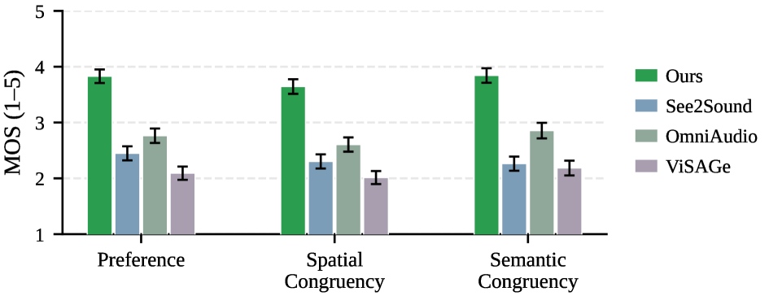
*Figure 5:Subjective evaluation (MOS, 1–5 scale); error bars: standard error. The proposed method outperforms all baselines on all criteria.*

---
**Usage Info**: 4978 tokens used.
**Generated at**: 2026-08-04 16:19:43

---

# 📚 P-MUSE: Prompt-MIDI-Optional Model for Unified Instrumental Music Synthesis and Editing

🚀 URL: https://arxiv.org/html/2608.01920

## 🌏 Abstract (원문)
MIDI-to-Music system renders the melody and rhythm of a target MIDI sequence into musical segment while cloning instrument timbre from a prompt recording. Existing systems typically adopt one of two distinct paradigms: conditional generation with prompt audio alone, which remains applicable when aligned prompt MIDI is unavailable, and In-Context Learning with paired prompt audio and MIDI, which exploits cross-modal alignment for stronger control on MIDI following and timbre similarity. We introduce P-MUSE, an instrumental MIDI-to-Music framework that unifies both paradigms via a multi-stage Curriculum-Learning supporting prompt-MIDI-optional inputs. P-MUSE further unifies music generation and local editing through a shared fill-in-the-middle formulation. Grounded in theoretical analysis and empirical study, we propose a phase-aware classifier-free guidance scheduling principle for Transcription-to-Audio systems, alongside a Tail-Drop strategy. Finally, to advance research in this field, we establish the first comprehensive benchmark, covering various prompt modes, generation/editing tasks, and four representative instruments: piano, guitar, bass, and drums. Demos are available athttps://p-muse.github.io/.
## 🌏 Abstract (번역)
MIDI-to-Music 시스템은 대상 MIDI 시퀀스의 멜로디와 리듬을 음악 세그먼트로 렌더링하는 동시에 프롬프트 녹음에서 악기 음색을 복제합니다. 기존 시스템은 일반적으로 두 가지 뚜렷한 패러다임 중 하나를 채택합니다. 정렬된 프롬프트 MIDI를 사용할 수 없을 때도 적용 가능한 프롬프트 오디오 단독 조건부 생성과, MIDI 추종 및 음색 유사성에 대한 강력한 제어를 위해 교차 모달 정렬을 활용하는 쌍을 이루는 프롬프트 오디오 및 MIDI를 사용한 In-Context Learning입니다. 우리는 프롬프트-MIDI-선택적 입력을 지원하는 다단계 커리큘럼 학습을 통해 두 패러다임을 통합하는 악기 MIDI-to-Music 프레임워크인 P-MUSE를 소개합니다. P-MUSE는 또한 공유된 중간 채우기(fill-in-the-middle) 공식을 통해 음악 생성과 로컬 편집을 통합합니다. 이론적 분석과 실증 연구를 바탕으로, 우리는 Tail-Drop 전략과 함께 Transcription-to-Audio 시스템을 위한 위상 인식 분류기 없는 안내 스케줄링 원칙을 제안합니다. 마지막으로, 이 분야의 연구를 발전시키기 위해 우리는 다양한 프롬프트 모드, 생성/편집 작업, 그리고 피아노, 기타, 베이스, 드럼의 네 가지 대표적인 악기를 포함하는 최초의 포괄적인 벤치마크를 구축합니다. 데모는 https://p-muse.github.io/에서 확인할 수 있습니다.

## 🔍 Methods & Results
- P-MUSE는 조건부 흐름 매칭(CFM)을 사용하여 MIDI-to-Music(MTM) 생성을 사전 분포에서 데이터 분포로의 전송으로 공식화합니다.
- 생성 및 편집 작업을 공유된 중간 채우기(FIM) 공식으로 통합하며, 생성 백본으로 흐름 매칭 트랜스포머(Flow Matching Transformer)를 사용합니다.
- MIDI 조건화를 위해 멜-스펙트로그램과 두 채널(속도, 온셋)의 피아노 롤을 사용하며, FiLM(Feature-wise Linear Modulation)을 통해 속도 특징을 온셋 특징으로 변조합니다.
- 프롬프트-MIDI-선택적 입력을 지원하기 위해 다단계 커리큘럼 학습을 도입합니다: 1단계(쌍을 이루는 프롬프트), 2단계(접두사-중간 FIM), 3단계(혼합 프롬프트).
- Transcription-to-Audio 시스템을 위한 분류기 없는 안내(CFG)에 대한 이론적 분석을 수행하여, 인스턴스 수준 조건이 초기 구조 형성에 중요하지만 후기 단계에서는 과포화 아티팩트를 유발할 수 있음을 발견했습니다.
- 이러한 통찰력을 바탕으로, 구조 형성 단계(0 <= t < tau)와 세부 정제 단계(tau <= t <= 1)로 구성된 '위상 인식 분류기 없는 안내 스케줄링 원칙'을 제안합니다.
- 세부 정제 단계에서 CFG를 중단하는 'Tail-Drop' 전략을 도입하여, t=0.6 이후 FAD(Frechet Audio Distance) 및 온셋 F1에서 성능 향상을 보였습니다.
- 다양한 프롬프트 모드, 생성/편집 작업, 피아노, 기타, 베이스, 드럼의 네 가지 악기를 포함하는 최초의 포괄적인 MTM 벤치마크를 구축했습니다.

## 🖼 Figures

*Figure 1:Multi-stage curriculum. Stage 1 learns paired-prompt In-Context Learning; Stage 2 adapts the model to style prompts through prompt-MIDI dropout; and Stage 3 trains for supporting mixed prompts while retaining compatibility with all three prompt modes.*

*Figure 2:P-MUSE architecture. During training (left), frame-aligned MIDI, masked clean mel prompt, and noisy mel are fused and processed by the flow-matching Transformer with 
𝑥
-prediction and 
𝑣
-loss. During inference (right), Euler solver updates the inverse ODE process with Tail-Drop strategy before waveform reconstruction by the vocoder.*

*Figure 3:Probe on generation conducted on a fixed evaluation set 
{
𝑥
𝑖
}
𝑖
=
1
4000
. Each curve starts from the real-path latent 
𝑥
𝑡
real
,
i
=
(
1
−
𝑡
)
​
𝑥
0
+
𝑡
​
𝑥
1
𝑖
 at the indicated time and integrates back to the data endpoint with 
𝑣
CFG
​
(
𝑥
𝑡
,
𝑡
)
 or 
𝑣
𝜃
​
(
𝑥
𝑡
,
𝑡
,
∅
)
.*

---
**Usage Info**: 5405 tokens used.
**Generated at**: 2026-08-04 16:19:55

---

# 📚 ETHead: Generating Expressive 3D Facial Animation and Head Movement from Speech

🚀 URL: https://arxiv.org/html/2608.01605

## 🌏 Abstract (원문)
Generating expressive 3D talking heads solely from speech remains a significant challenge due to the scarcity of high-fidelity 3D data, which limits the modeling of complex emotional motion patterns. In this paper, we introduceExpressiveTalkingHead(ETHead), a method for generating 3D facial and head motions that vividly align with the emotional content of input speech. To overcome the data limitations, we design a self-distillation framework that leverages large-scale 2D talking videos to pre-train a specialized speech encoder. By incorporating a novel emotion-modulated probabilistic masking mechanism, this framework aligns speech representations with expressive visual dynamics, allowing the encoder to extract features highly correlated with facial and head motions directly from audio. These features are then leveraged to guide 3D generation, enriching input cues and providing explicit supervision through a joint speech-motion latent space. Extensive experiments demonstrate that ETHead substantially outperforms state-of-the-art methods. Furthermore, our motion-aligned speech encoder can serve as a transferable module, offering a general solution for enhancing expressiveness in other 3D talking head animation frameworks. The project page is available at https://verdure-oss.github.io/ETHead.github.io/.
## 🌏 Abstract (번역)
음성만으로 표현력이 풍부한 3D 토킹 헤드를 생성하는 것은 고품질 3D 데이터의 부족으로 인해 복잡한 감정적 움직임 패턴을 모델링하는 데 한계가 있어 여전히 중요한 과제입니다. 본 논문에서는 입력 음성의 감정적 내용과 생생하게 일치하는 3D 얼굴 및 머리 움직임을 생성하는 방법인 ExpressiveTalkingHead(ETHead)를 소개합니다. 데이터 한계를 극복하기 위해 대규모 2D 토킹 비디오를 활용하여 특화된 음성 인코더를 사전 학습시키는 자기 증류(self-distillation) 프레임워크를 설계했습니다. 이 프레임워크는 새로운 감정 변조 확률적 마스킹 메커니즘을 통합하여 음성 표현을 표현적인 시각적 역동성과 정렬시키고, 인코더가 오디오에서 직접 얼굴 및 머리 움직임과 고도로 상관관계가 있는 특징을 추출할 수 있도록 합니다. 이 특징들은 3D 생성에 활용되어 입력 단서를 풍부하게 하고 공동 음성-움직임 잠재 공간을 통해 명시적인 감독을 제공합니다. 광범위한 실험을 통해 ETHead가 최첨단 방법을 크게 능가함을 입증했습니다. 또한, 우리의 움직임 정렬 음성 인코더는 다른 3D 토킹 헤드 애니메이션 프레임워크에서 표현력을 향상시키는 일반적인 솔루션을 제공하는 전이 가능한 모듈 역할을 할 수 있습니다. 프로젝트 페이지는 https://verdure-oss.github.io/ETHead.github.io/ 에서 확인할 수 있습니다.

## 🔍 Methods & Results
- 고품질 3D 데이터 부족으로 인한 복잡한 감정적 움직임 패턴 모델링의 한계를 극복하기 위해, 음성만으로 표현력이 풍부한 3D 토킹 헤드를 생성하는 ETHead(ExpressiveTalkingHead)를 제안한다.
- 대규모 2D 토킹 비디오를 활용하여 특화된 음성 인코더를 사전 학습시키는 자기 증류(self-distillation) 프레임워크를 설계했으며, 이는 마스크 이미지 모델링(MIM)과 자기 증류 패러다임을 기반으로 한다.
- 새로운 감정 변조 확률적 마스킹 메커니즘을 도입하여 음성 표현을 표현적인 시각적 역동성과 정렬시키고, 감정적 단서와 높은 상관관계를 갖는 토큰에 마스킹 확률을 높인다.
- 학습 중에는 확률적 양식 드롭아웃(stochastic modality dropout)을 도입하여 추론 시 음성 인코더가 독립적으로 기능할 수 있도록 하며, 학습 후에는 교사 네트워크의 음성 인코더만 유지된다.
- 음성 인코더는 음성에서 직접 얼굴 및 머리 움직임과 고도로 상관관계가 있는 특징을 추출하며, 이는 음성 콘텐츠 특징(WavLM)과 감정 단서(Emotion2vec)를 활용한다.
- 3D 토킹 헤드 프레임워크는 확산 기반 생성 패러다임을 따르며, 얼굴 표정 및 머리 자세 역학을 위한 독립적인 생성기를 사용하여 잡음이 있는 잠재 공간에서 깨끗한 움직임 매개변수를 복구하도록 학습한다.
- 생성된 움직임의 표현력을 향상시키기 위해 사전 학습된 음성 인코더를 3D 모델의 입력 및 출력 수준 모두에 통합한다.
- 입력 강화(Input Enhancement)를 위해 시각적으로 접지된 음성 인코더의 특징을 AdaLN을 통해 오디오 전용 감정 인코더의 일반적인 감정 표현을 변조하는 데 사용한다.
- 출력 감독(Output Supervision)을 위해 공동 음성-움직임 잠재 공간을 구축하고, 대조 학습을 통해 학습된 움직임 추출기와 음성 인코더를 고정된 감독자로 활용하여 생성된 움직임을 표현적인 움직임 단서에 정렬시킨다.
- 광범위한 실험을 통해 ETHead가 최첨단 방법을 크게 능가하는 성능을 보였으며, 움직임 정렬 음성 인코더는 다른 3D 토킹 헤드 애니메이션 프레임워크의 표현력을 향상시키는 전이 가능한 모듈로 활용될 수 있음을 입증했다.

## 🖼 Figures

*Figure 1:Given input speech, our method synthesizes emotion-coherent facial and head motions. The key is a motion-aligned speech encoder pre-trained on massive 2D talking-head data using emotion-aware masking mechanisms. This module can be seamlessly integrated into 3D talking-head frameworks to enhance their animation expressiveness.*

![Figure 2:Training framework of the motion-aligned speech encoder. Given a talking head video clip, the Student and Teacher networks separately extract modality-specific features followed by intra-network fusion. Random temporal masking is applied exclusively to the Student’s features, specifically targeting segments with intense emotional dynamics identified by prosody variations. The visual tokens are randomly dropped and replaced with learnable tokens. The training is driven by two self-distillation objectives: 
ℒ
𝑐
​
𝑙
​
𝑠
 aligns category predictions, while 
ℒ
𝑟
​
𝑒
​
𝑔
 reconstructs fused tokens at masked positions.](../images/2026-08-04/2608.01605/2608.01605_fig1.png)
*Figure 2:Training framework of the motion-aligned speech encoder. Given a talking head video clip, the Student and Teacher networks separately extract modality-specific features followed by intra-network fusion. Random temporal masking is applied exclusively to the Student’s features, specifically targeting segments with intense emotional dynamics identified by prosody variations. The visual tokens are randomly dropped and replaced with learnable tokens. The training is driven by two self-distillation objectives: 
ℒ
𝑐
​
𝑙
​
𝑠
 aligns category predictions, while 
ℒ
𝑟
​
𝑒
​
𝑔
 reconstructs fused tokens at masked positions.*

![Figure 3:Overview of the proposed framework. (a) Generation Pipeline: The model extracts linguistic content and emotional features from input speech to condition two diffusion-based generators. In a cascaded manner, synthesized facial motion parameters are combined with speech features to drive the subsequent head motion generator. Training is supervised by reconstruction and kinematic consistency objectives. (b) Auxiliary Module: An optional motion-aligned speech encoder enhances the baseline through input feature modulation and output-level supervision within a pre-trained speech-motion latent space.](../images/2026-08-04/2608.01605/2608.01605_fig2.png)
*Figure 3:Overview of the proposed framework. (a) Generation Pipeline: The model extracts linguistic content and emotional features from input speech to condition two diffusion-based generators. In a cascaded manner, synthesized facial motion parameters are combined with speech features to drive the subsequent head motion generator. Training is supervised by reconstruction and kinematic consistency objectives. (b) Auxiliary Module: An optional motion-aligned speech encoder enhances the baseline through input feature modulation and output-level supervision within a pre-trained speech-motion latent space.*

*Figure 4:Statistical analysis of head pose dynamics. Results are shown for a specific speaker in the 3D-RAVDESS test set. The boxes indicate the full range (minimum to maximum), with the center line denoting the median. Our method produces pitch, yaw, and their angular velocity statistics that closely match the Ground Truth, significantly outperforming baselines in preserving speaker-specific styles under emotional conditions. Key comparisons are marked by dashed boxes.*

*Figure 5:Visualization of head pose dynamics. The left line charts display the temporal evolution of pitch and yaw angles alongside their corresponding angular velocities. Notable segments are highlighted with dashed boxes, represented by the rendered head poses on the right. Compared with baselines, our method produces motion patterns that are more consistent with speaker-specific styles under emotional speech conditions.*

![Figure 6:Visual comparison of facial motion during emotional speech. To facilitate comparison, all results are rendered in a canonical frontal view with zero head pose. The top five rows present in-domain results on 3D-RAVDESS, while the bottom four rows show out-of-domain results on 3D-MEAD. Purple boxes highlight upper-facial inconsistencies such as emotional conflicts or deviant styles, while red boxes indicate lip motion errors. Compared to baselines, our approach captures speaker-specific styles and emotional nuances more accurately, demonstrating superior generalization on unseen data.](../images/2026-08-04/2608.01605/2608.01605_fig5.png)
*Figure 6:Visual comparison of facial motion during emotional speech. To facilitate comparison, all results are rendered in a canonical frontal view with zero head pose. The top five rows present in-domain results on 3D-RAVDESS, while the bottom four rows show out-of-domain results on 3D-MEAD. Purple boxes highlight upper-facial inconsistencies such as emotional conflicts or deviant styles, while red boxes indicate lip motion errors. Compared to baselines, our approach captures speaker-specific styles and emotional nuances more accurately, demonstrating superior generalization on unseen data.*

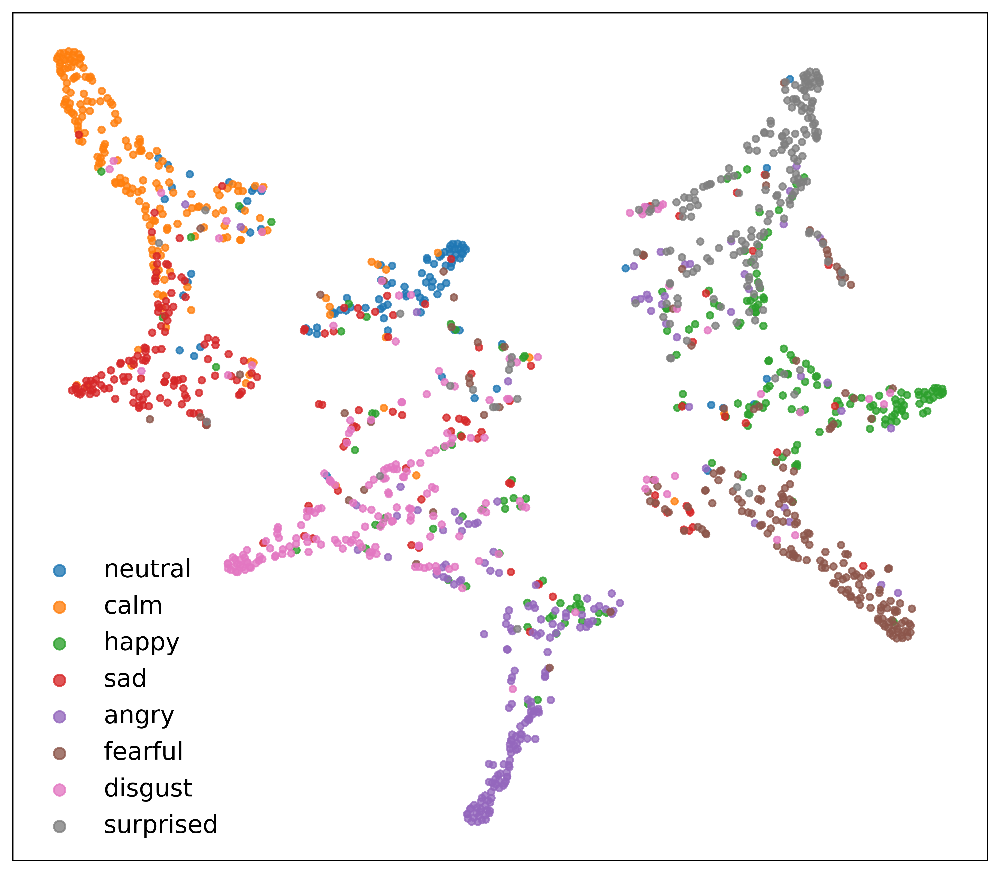
*(a)*

*(a)*

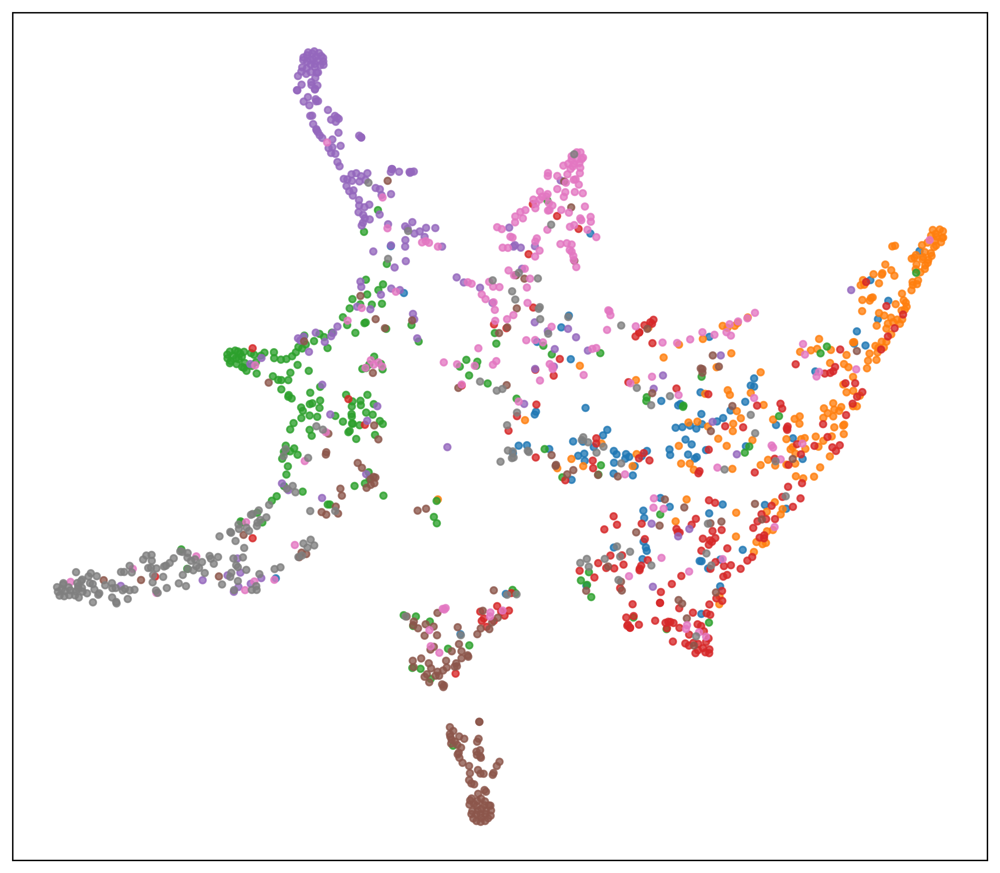
*(b)*

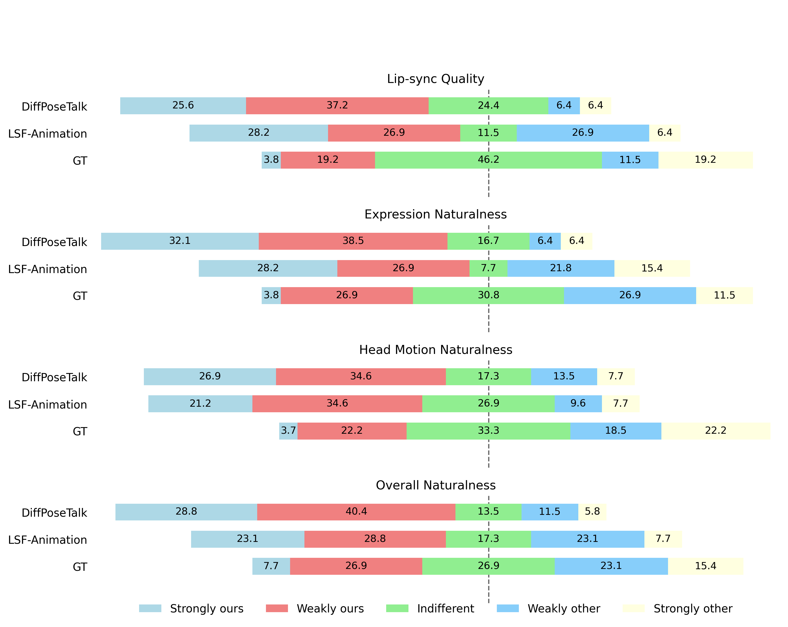
*Figure 8:User study results. Participants were asked to indicate their preferred result between our method and a competing approach under the specified evaluation criteria. The chart reports the corresponding preference percentages.*

---
**Usage Info**: 5688 tokens used.
**Generated at**: 2026-08-04 16:20:13

---

