# 🚩 (2026-08-05) Scholar Inbox 추천 논문 

# 📚 Towards Real-world Environment-aware Zero-shot Text-to-speech Synthesis via Disentangled Audio Infilling

🚀 URL: https://arxiv.org/html/2608.03011

## 🌏 Abstract (원문)
Recent zero-shot text-to-speech (TTS) systems achieve remarkable naturalness and speaker similarity but typically require high-quality speaker prompts and either strip away or entangle the acoustic environment with speaker characteristics, limiting their real-world applicability. We present an extended DAIEN-TTS, an environment-aware zero-shot TTS framework that disentangles and jointly models speech, background noise, and reverberation, enabling independent control over timbre and acoustic environment through separate speaker and environment prompts. Built upon the flow-matching-based F5-TTS, it uses a speech-environment separation module to decompose environmental speech into speech, noise, and reverberation components, which are injected into the Diffusion Transformer for environment-aware generation. Training uses simulated data constructed by mixing clean speech with noise and room impulse responses, together with a cross-speaker conditioning strategy that suppresses speaker information leakage from the environment branch. When real-world data are available, the system can be further fine-tuned to bridge the simulated-to-real domain gap. At inference, a triple classifier-free guidance mechanism enables fine-grained control over speech, noise, and reverberation, and a signal-to-noise-ratio adaptation strategy aligns the synthesized speech with the environment prompt. Experiments on simulated and real-world test sets show that DAIEN-TTS generates environmental personalized speech with high naturalness, strong speaker similarity, and faithful noise and reverberation reproduction, while offering controllability beyond prior environment-aware TTS systems.
## 🌏 Abstract (번역)
최근의 제로샷 음성 합성(TTS) 시스템은 뛰어난 자연스러움과 화자 유사성을 달성하지만, 일반적으로 고품질의 화자 프롬프트를 필요로 하며 음향 환경을 제거하거나 화자 특성과 얽히게 하여 실제 적용 가능성을 제한합니다. 본 논문에서는 확장된 DAIEN-TTS를 소개합니다. 이는 음성, 배경 소음 및 잔향을 분리하고 공동으로 모델링하는 환경 인식 제로샷 TTS 프레임워크로, 별도의 화자 및 환경 프롬프트를 통해 음색과 음향 환경을 독립적으로 제어할 수 있습니다. 플로우 매칭 기반의 F5-TTS를 기반으로 구축되었으며, 음성-환경 분리 모듈을 사용하여 환경 음성을 음성, 소음 및 잔향 구성 요소로 분해하고, 이를 환경 인식 생성을 위해 Diffusion Transformer에 주입합니다. 훈련은 깨끗한 음성에 소음과 실내 임펄스 응답을 혼합하여 구성된 시뮬레이션 데이터를 사용하며, 환경 분기에서 화자 정보 유출을 억제하는 교차 화자 조건화 전략을 함께 사용합니다. 실제 데이터가 사용 가능한 경우, 시스템은 시뮬레이션-실제 도메인 격차를 해소하기 위해 추가로 미세 조정될 수 있습니다. 추론 시, 삼중 분류기 없는 안내(triple classifier-free guidance) 메커니즘은 음성, 소음 및 잔향에 대한 미세한 제어를 가능하게 하며, 신호 대 잡음비 적응 전략은 합성된 음성을 환경 프롬프트와 정렬합니다. 시뮬레이션 및 실제 테스트 세트에 대한 실험은 DAIEN-TTS가 높은 자연스러움, 강력한 화자 유사성, 충실한 소음 및 잔향 재현을 통해 환경 맞춤형 음성을 생성하며, 이전 환경 인식 TTS 시스템을 넘어서는 제어 가능성을 제공함을 보여줍니다.

## 🔍 Methods & Results
- DAIEN-TTS는 음성, 배경 소음, 잔향을 분리하고 제어 가능한 방식으로 재결합하여 환경 인식 음성 합성을 목표로 합니다.
- 시스템은 F5-TTS를 기반으로 하며, 화자 및 환경 정보를 분리하는 SES(Speech-Environment Separation) 모듈과 TTS 모듈 내 환경 조건화 메커니즘을 도입합니다.
- SES 모듈은 입력 환경 음성을 깨끗한 음성, 소음, 잔향 구성 요소로 분해하며, 이는 마그니튜드 스펙트로그램 도메인에서 Transformer 기반 마스킹 네트워크(MaskingNet-N, MaskingNet-R)를 사용하는 2단계 캐스케이드 설계로 구현됩니다.
- TTS 모듈은 텍스트 입력과 함께 프레임 수준 화자 조건(cspk), 프레임 수준 소음 조건(cnoise), 발화 수준 잔향 임베딩(creverb)을 입력으로 받아 환경 인식 멜-스펙트로그램을 생성합니다.
- 잔향 임베딩(creverb) 추출 시, 화자 정보 유출을 방지하기 위해 동일한 RIR(Room Impulse Response)을 사용하여 다른 화자의 깨끗한 음성을 컨볼루션하는 교차 화자 조건화 전략을 사용합니다.
- 조건은 Diffusion Transformer(DiT) 블록에 주입되며, 화자 조건은 텍스트 임베딩과 함께 연결되고, 소음 및 잔향 조건은 통합된 환경 표현으로 결합되어 멀티 헤드 교차 어텐션 레이어를 통해 도입됩니다.
- 사전 훈련 단계에서는 SES 모듈은 마그니튜드 및 멜-스펙트로그램 재구성 손실로, TTS 모듈은 조건부 플로우 매칭 목표로 시뮬레이션된 데이터를 사용하여 개별적으로 훈련됩니다.
- 미세 조정 단계에서는 시뮬레이션-실제 도메인 격차를 해소하기 위해 실제 환경 음성 데이터로 SES 및 TTS 모듈을 연결하여 훈련하며, SES 모듈, 텍스트 인코더, 잔향 인코더는 고정됩니다.
- 추론 시, 화자 오디오 프롬프트에서 화자 조건을, 환경 오디오 프롬프트에서 소음 및 잔향 조건을 추출하여 ODE(Ordinary Differential Equation) 솔버를 통해 멜-스펙트로그램을 생성합니다.
- 삼중 분류기 없는 안내(TCFG) 메커니즘을 통해 음성, 소음, 잔향 구성 요소의 강도를 독립적으로 조절할 수 있습니다.
- SNR(Signal-to-Noise Ratio) 적응 전략은 합성된 음성의 SNR을 환경 프롬프트의 SNR과 일치시키기 위해 소음 조건을 재조정합니다.

## 🖼 Figures
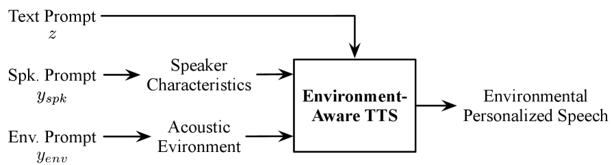
*Figure 1:Task formulation of environment-aware zero-shot TTS with separate text, speaker, and environment prompts*

![Figure 2:Overview of the two-stage training of the extended DAIEN-TTS, with the detailed DiT block structure shown in the middle. (a) Pretraining on simulated data: the noisy target 
𝐱
1
 is constructed from the clean speech 
𝐬
 of the target speaker, a selected noise 
𝐧
, and RIR 
𝐡
, while the reverberation condition is extracted from the speech 
𝐬
′
 of a different speaker convolved with the same 
𝐡
. (b) Fine-tuning on real-world data: neither 
𝐧
 nor 
𝐡
 is available; instead, the SES module separates the speech and noise components from real environmental recordings to provide the conditions. Snowflake and flame icons denote frozen and trainable modules, respectively.](../images/2026-08-05/2608.03011/2608.03011_fig1.png)
*Figure 2:Overview of the two-stage training of the extended DAIEN-TTS, with the detailed DiT block structure shown in the middle. (a) Pretraining on simulated data: the noisy target 
𝐱
1
 is constructed from the clean speech 
𝐬
 of the target speaker, a selected noise 
𝐧
, and RIR 
𝐡
, while the reverberation condition is extracted from the speech 
𝐬
′
 of a different speaker convolved with the same 
𝐡
. (b) Fine-tuning on real-world data: neither 
𝐧
 nor 
𝐡
 is available; instead, the SES module separates the speech and noise components from real environmental recordings to provide the conditions. Snowflake and flame icons denote frozen and trainable modules, respectively.*

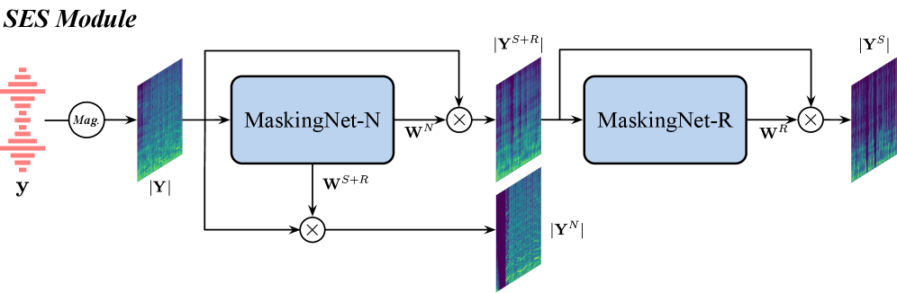
*Figure 3:Overview of the SES module with two-stage noise and reverberation separation*

*Figure 4:Inference process of the extended DAIEN-TTS. Given text 
𝐳
, a speaker prompt 
𝐲
𝑠
​
𝑝
​
𝑘
, and environment prompt 
𝐲
𝑒
​
𝑛
​
𝑣
, the SES module extracts the speaker and environment conditions from the speaker prompt and environment prompt, respectively, for generation.*

---
**Usage Info**: 7125 tokens used.
**Generated at**: 2026-08-05 16:34:56

---

# 📚 DDSynth-RL: Audio Synthesizer Inversion via Discrete Diffusion with Reinforcement Learning

🚀 URL: https://arxiv.org/html/2608.03032

## 🌏 Abstract (원문)
Synthesizer inversion is challenging for two main reasons: 1) Distinct parameter configurations can produce perceptually similar sounds. 2) Parameter-space losses often fail to reflect rendered audio similarity, while the synthesizer being a non-differentiable black box prevents simple audio-domain supervision. To address the one-to-many mapping induced by the first challenge, we formulate synthesizer inversion as conditional generation over discrete synthesizer parameters and use masked discrete diffusion as the generator. This treatment additionally avoids the fixed-order assumption of autoregressive models and the continuous-relaxation mismatch of flow matching when modeling categorical synthesizer controls. To address the second challenge, we further fine-tune the model with GRPO-style audio-domain rewards computed from rendered outputs. Experiments on Dexed show that, after supervised training, the discrete diffusion model is competitive with autoregressive and flow-matching baselines, and reward-based fine-tuning further improves out-of-domain audio matching performance. Code and demos are available at:https://github.com/DDSynth-RL/DDSynthRL.
## 🌏 Abstract (번역)
신디사이저 인버전은 두 가지 주요 이유로 인해 어렵습니다: 1) 서로 다른 파라미터 구성이 지각적으로 유사한 사운드를 생성할 수 있습니다. 2) 파라미터 공간 손실은 렌더링된 오디오 유사성을 반영하지 못하는 경우가 많으며, 신디사이저가 미분 불가능한 블랙박스이기 때문에 간단한 오디오 도메인 감독이 불가능합니다. 첫 번째 문제로 인해 발생하는 일대다 매핑을 해결하기 위해, 우리는 신디사이저 인버전을 이산 신디사이저 파라미터에 대한 조건부 생성으로 공식화하고, 마스크된 이산 확산(masked discrete diffusion)을 생성기로 사용합니다. 이 접근 방식은 또한 범주형 신디사이저 제어를 모델링할 때 자기회귀 모델의 고정 순서 가정과 플로우 매칭의 연속 완화 불일치를 피합니다. 두 번째 문제를 해결하기 위해, 우리는 렌더링된 출력에서 계산된 GRPO 스타일의 오디오 도메인 보상으로 모델을 추가로 미세 조정합니다. Dexed에 대한 실험 결과, 감독 학습 후 이산 확산 모델은 자기회귀 및 플로우 매칭 기준선과 경쟁력이 있으며, 보상 기반 미세 조정은 도메인 외 오디오 매칭 성능을 더욱 향상시키는 것으로 나타났습니다. 코드와 데모는 다음에서 확인할 수 있습니다: https://github.com/DDSynth-RL/DDSynthRL.

## 🔍 Methods & Results
- 신디사이저 인버전을 위한 2단계 프레임워크를 사용합니다: 1) 이산 신디사이저 및 MIDI 토큰의 조건부 생성을 위해 마스크된 이산 확산 모델을 감독 학습하고, 2) 렌더링된 오디오에서 계산된 보상을 사용하여 GRPO로 모델을 미세 조정합니다.
- Dexed 인버전은 102개의 학습 가능한 이산 신디사이저 제어 토큰과 3개의 MIDI 토큰(피치, 벨로시티, 지속 시간)에 대한 조건부 생성으로 공식화되며, 총 시퀀스 길이는 105입니다. 연속 값 제어는 25개의 빈으로 이산화됩니다.
- 생성 모델로 마스크된 이산 확산 모델을 사용하여 토큰 공간에서 신디사이저 파라미터를 직접 모델링합니다. 이 모델은 오디오 조건(정규화된 로그-멜)과 가시 토큰으로부터 마스크된 토큰을 복구하도록 학습하며, 고정 순서 자기회귀 가정이나 연속 완화를 피합니다.
- 감독 학습은 마스크된 위치에만 적용되는 이산 확산 손실을 사용하며, 대상 분포(범주형은 원-핫, 순서가 있는 제어는 지역적으로 평활화)를 활용합니다. 토큰 손실 가중치는 렌더링된 오디오에 더 강한 영향을 미치는 파라미터를 강조하는 데 사용됩니다.
- 추론은 완전히 마스크된 시퀀스에서 시작하여 각 단계에서 하나의 토큰을 반복적으로 채웁니다. 채울 위치는 가장 높은 정규화된 엔트로피 신뢰도를 기반으로 선택되며, 토큰은 예측된 범주형 분포에서 가장 가능성이 높은 값으로 선택됩니다.
- 렌더링된 오디오 품질을 최적화하기 위해, 감독 학습된 모델은 렌더링된 오디오 출력에서 계산된 보상을 사용하여 GRPO(Generalized Reinforcement Policy Optimization)로 미세 조정됩니다.
- 보상은 wMFCC, CLAP, CREPE 임베딩 거리, 다중 스케일 스펙트로그램 거리, 스펙트럼 최적 수송 거리, RMS 엔벨로프 코사인 유사도 등 여러 오디오 지표로부터 계산됩니다.
- Dexed에 대한 실험 결과, 감독 학습 후 이산 확산 모델은 자기회귀 및 플로우 매칭 기준선과 경쟁력이 있으며, 보상 기반 미세 조정은 도메인 외 오디오 매칭 성능을 더욱 향상시키는 것으로 나타났습니다.

## 🖼 Figures
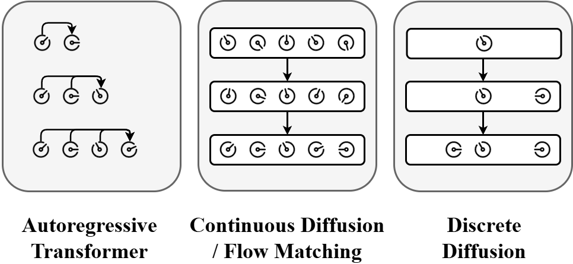
*Figure 1:Comparison of three generative modeling frameworks for synthesizer inversion.*

*Figure 2:Training and inference of our supervised discrete diffusion model. Training randomly masks parameter tokens and applies supervision only to masked positions; inference starts from a fully masked sequence and iteratively fills the most confident position based on normalized entropy. Different icons represent parameter tokens and MIDI tokens.*

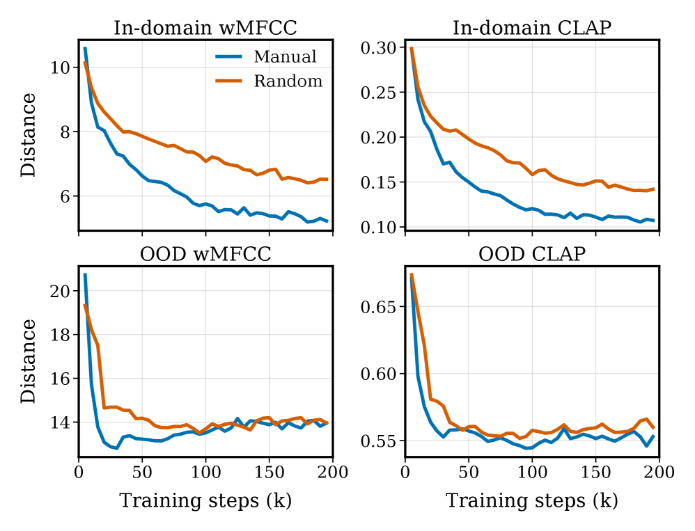
*Figure 3:Validation curves for the AR order ablation. Each curve averages four seeds after aligning validation checkpoints to a shared training-step grid.*

---
**Usage Info**: 4826 tokens used.
**Generated at**: 2026-08-05 16:35:09

---

# 📚 GROW: Group-Relative Advantage-Weighted On-Policy Reinforcement Learning of Autoregressive-Diffusion Text-to-Speech Model

🚀 URL: https://arxiv.org/html/2608.03215

## 🌏 Abstract (원문)
Reinforcement learning for flow-matching text-to-speech is complicated by deterministic ODE sampling: trajectory-level policy-gradient methods typically convert the ODE into an SDE and track per-step likelihood ratios, introducing stochastic perturbations and substantial overhead.We proposeGROW, a group-relative advantage-weighted on-policy RL method that acts directly on the standard flow-matching objective. For each prompt, GROW samples a group of on-policy utterances, separately standardizes intelligibility and speaker-similarity rewards within the group,and combines them to reweight flow-matching regression.A Wasserstein-2 velocity penalty anchors the updated model to a frozen pretrained reference.A group-mean reward baseline is introduced to convert reward weightinginto advantage weighting. For strong pretrained TTS models withconcentrated rewards, positive exponential weightingis dominated by reward-agnostic self-imitation, whereas a zero-mean signedadvantage preserves effective within-group credit assignment.Instantiated on DiTAR and evaluated on LibriSpeech and Seed-TTS EN/ZH, GROWreduces average WER from2.0162.016to1.5581.558and raises speaker similarityfrom0.6760.676to0.7150.715while keeping UTMOS.With 10-NFE training rollouts and 32-NFE evaluation, GROW retains comparable performance while training2.9×2.9\timesfaster than 32-NFE DiTAR-GRPO. We will open-source complete GROW codes, faithful DiTAR reproduction, and all model checkpoints.
## 🌏 Abstract (번역)
확정적 ODE 샘플링으로 인해 플로우 매칭 음성 합성(TTS)을 위한 강화 학습은 복잡합니다. 궤적 수준의 정책 경사 방법은 일반적으로 ODE를 SDE로 변환하고 단계별 우도비를 추적하여 확률적 교란과 상당한 오버헤드를 발생시킵니다. 우리는 표준 플로우 매칭 목표에 직접 작용하는 그룹 상대적 이점 가중 온-정책 RL 방법인 GROW를 제안합니다. 각 프롬프트에 대해 GROW는 온-정책 발화 그룹을 샘플링하고, 그룹 내에서 명료도 및 화자 유사성 보상을 개별적으로 표준화하며, 이를 결합하여 플로우 매칭 회귀를 재가중합니다. Wasserstein-2 속도 페널티는 업데이트된 모델을 고정된 사전 학습된 참조에 고정합니다. 보상 가중치를 이점 가중치로 변환하기 위해 그룹 평균 보상 기준선이 도입됩니다. 보상이 집중된 강력한 사전 학습된 TTS 모델의 경우, 양의 지수 가중치는 보상과 무관한 자기 모방에 의해 지배되는 반면, 제로 평균 부호화된 이점은 그룹 내 효과적인 기여도 할당을 유지합니다. DiTAR에 구현되고 LibriSpeech 및 Seed-TTS EN/ZH에서 평가된 GROW는 평균 WER을 2.016에서 1.558로 줄이고 화자 유사성을 0.676에서 0.715로 높이며 UTMOS를 유지합니다. 10-NFE 훈련 롤아웃과 32-NFE 평가를 통해 GROW는 32-NFE DiTAR-GRPO보다 2.9배 빠르게 훈련하면서도 유사한 성능을 유지합니다. 우리는 완전한 GROW 코드, 충실한 DiTAR 재현 및 모든 모델 체크포인트를 오픈 소스로 공개할 예정입니다.

## 🔍 Methods & Results
- 기존 플로우 매칭 TTS를 위한 강화 학습은 확정적 ODE 샘플링의 복잡성으로 인해 SDE 변환, 확률적 교란 및 상당한 오버헤드를 야기합니다.
- GROW(Group-Relative Advantage-Weighted On-Policy RL)는 표준 플로우 매칭 목표에 직접 작용하는 새로운 온-정책 강화 학습 방법입니다.
- GROW는 각 프롬프트에 대해 온-정책 발화 그룹을 샘플링하고, 그룹 내에서 명료도 및 화자 유사성 보상을 개별적으로 표준화한 후, 이를 결합하여 플로우 매칭 회귀를 재가중합니다.
- Wasserstein-2 속도 페널티를 사용하여 업데이트된 모델을 고정된 사전 학습된 참조 모델에 고정합니다.
- 그룹 평균 보상 기준선을 도입하여 보상 가중치를 이점 가중치로 변환하며, 특히 강력한 TTS 모델의 경우 제로 평균 부호화된 이점이 효과적인 그룹 내 기여도 할당에 중요함을 발견했습니다.
- DiTAR 모델에 GROW를 구현하고 LibriSpeech 및 Seed-TTS EN/ZH 데이터셋에서 평가했습니다.
- GROW는 평균 WER을 2.016에서 1.558로 감소시켰습니다.
- 화자 유사성을 0.676에서 0.715로 향상시켰으며, UTMOS는 유지했습니다.
- 10-NFE 훈련 롤아웃 및 32-NFE 평가 시, GROW는 32-NFE DiTAR-GRPO보다 2.9배 빠르게 훈련하면서도 유사한 성능을 달성했습니다.

---
**Usage Info**: 2104 tokens used.
**Generated at**: 2026-08-05 16:35:18

---

# 📚 \dotsttsfontdots.tts.edit: Precisely Controlled Speech Editing with a Continuous Autoregressive Model

🚀 URL: https://arxiv.org/html/2608.02673

## 🌏 Abstract (원문)
Speech editing for content creation requires precise control over both what an edit should do and where it should apply. Free-form natural language provides a flexible interface for expressing edit requests, but its ambiguity may leave the intended operation, parameters, or target region underspecified. We study a precise and explicit interface for speech editing: a transcript-grounded structural edit instruction with XML-style tags explicitly specifies typed operations and localizes them to transcript spans or boundaries. This semantic timeline avoids explicit timestamp alignment and provides an externally inspectable contract for compositional edits. We instantiate the interface in	dots.tts.edit, an editor adapted from the continuous autoregressive	dots.ttsfoundation model. Four representative speech-creation controls cover lexical content, affective expression, pitch and speaking-rate delivery, and temporal phrasing through text, emotion, prosody, and pause editing. Task-specific data pipelines construct operation- and scope-controlled pairs while retaining source-derived context outside each target region. We further introducedoteBench, a bilingual evaluation suite that measures precise instruction following, local preservation, and audio quality across the four controls and their composition. Experiments show leading overall instruction following and local preservation across its five editing categories, while audio quality remains comparable to existing open-source systems. Across three Seed-TTS-Eval shards, the model shows negligible differences from the base model in zero-shot TTS recognition error rate and speaker similarity. The code and model will be released soon.
## 🌏 Abstract (번역)
콘텐츠 제작을 위한 음성 편집은 편집이 무엇을 해야 하는지, 그리고 어디에 적용되어야 하는지에 대한 정밀한 제어를 요구합니다. 자유 형식의 자연어는 편집 요청을 표현하는 유연한 인터페이스를 제공하지만, 그 모호성으로 인해 의도된 작업, 매개변수 또는 대상 영역이 불충분하게 지정될 수 있습니다. 본 연구에서는 음성 편집을 위한 정밀하고 명시적인 인터페이스를 연구합니다: XML 스타일 태그를 포함하는 스크립트 기반 구조적 편집 지시는 유형화된 작업을 명시적으로 지정하고 이를 스크립트 범위 또는 경계에 지역화합니다. 이 의미론적 타임라인은 명시적인 타임스탬프 정렬을 피하고 구성적 편집을 위한 외부 검사 가능한 계약을 제공합니다. 우리는 이 인터페이스를 연속적인 자동회귀 TTS 기반 모델에서 개조된 편집기인 tts.edit에 구현했습니다. 어휘 내용, 정서적 표현, 피치 및 말하기 속도 전달, 그리고 텍스트, 감정, 운율 및 일시 정지 편집을 통한 시간적 구절화를 포함하는 네 가지 대표적인 음성 생성 제어 기능을 다룹니다. 작업별 데이터 파이프라인은 각 대상 영역 외부의 원본 파생 컨텍스트를 유지하면서 작업 및 범위 제어 쌍을 구성합니다. 우리는 또한 네 가지 제어 기능과 그 조합에 걸쳐 정확한 지시 따르기, 로컬 보존 및 오디오 품질을 측정하는 이중 언어 평가 스위트인 NoteBench를 도입했습니다. 실험 결과, 모델은 다섯 가지 편집 범주 전반에 걸쳐 선도적인 전반적인 지시 따르기 및 로컬 보존을 보여주었으며, 오디오 품질은 기존 오픈 소스 시스템과 비교할 만한 수준을 유지했습니다. 세 가지 Seed-TTS-Eval 샤드에 걸쳐, 모델은 제로샷 TTS 인식 오류율 및 화자 유사성에서 기본 모델과 무시할 만한 차이를 보였습니다. 코드와 모델은 곧 공개될 예정입니다.

## 🔍 Methods & Results
- 음성 편집을 위한 정밀하고 명시적인 인터페이스로, XML 스타일 태그를 사용하여 스크립트 기반 구조적 편집 지시를 제안했으며, 이는 유형화된 작업을 명시하고 스크립트 범위 또는 경계에 지역화한다.
- 이 인터페이스는 연속적인 자동회귀 TTS 기반 모델에서 개조된 편집기인 `tts.edit`에 구현되었다.
- 어휘 내용(텍스트 편집), 정서적 표현(감정 편집), 피치 및 말하기 속도(운율 편집), 시간적 구절화(일시 정지 편집)의 네 가지 음성 생성 제어 기능을 다룬다.
- 작업별 데이터 파이프라인은 원본 파생 컨텍스트를 유지하면서 작업 및 범위 제어 쌍을 구성한다.
- 정확한 지시 따르기, 로컬 보존 및 오디오 품질을 측정하는 이중 언어 평가 스위트인 `NoteBench`를 도입했다.
- 실험 결과, 제안된 모델은 다섯 가지 편집 범주 전반에 걸쳐 선도적인 전반적인 지시 따르기 및 로컬 보존 성능을 보였다.
- 오디오 품질은 기존 오픈 소스 시스템과 비교할 만한 수준을 유지했다.
- 세 가지 Seed-TTS-Eval 샤드에서, 모델은 제로샷 TTS 인식 오류율 및 화자 유사성에서 기본 모델과 무시할 만한 차이를 보였다.

## 🖼 Figures
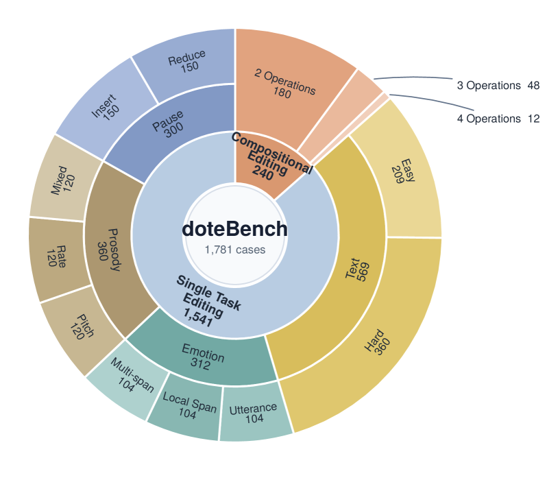
*Figure 2:Hierarchical composition of doteBench. Sector area is proportional to the number of cases. The single-task editing suite contains 1,541 cases across text, emotion, prosody, and pause editing.*

*Figure 3:Data construction pipeline. A sampler selects an original utterance, a planner produces an instruction and target transcript, and a task-specific synthesizer constructs the generated counterpart. The evaluator checks edit effect, preservation, and quality before the saver materializes accepted examples. Each constructed pair supplies both original-to-generated and generated-to-original supervision.*

*Figure 4:\dotsttsfontdots.tts.edit overview. Source transcript and speech, together with the transcript-grounded structural edit instruction with XML-style tags and its target-transcript rendering, condition the retained continuous autoregressive \dotsttsfontdots.tts backbone; only target speech is generated.*

![Figure 5:Open-source model comparison on doteBench. Five panels summarize the text, emotion, prosody, pause, and compositional editing categories. Axes form contiguous groups for instruction following, local preservation, and audio quality. Fixed model-independent semantic bounds map every metric to 
[
0
,
1
]
, with outward indicating better performance. All seven learned systems are shown for every category; the table-only Identity reference is not plotted.](../images/2026-08-05/2608.02673/2608.02673_fig4.png)
*Figure 5:Open-source model comparison on doteBench. Five panels summarize the text, emotion, prosody, pause, and compositional editing categories. Axes form contiguous groups for instruction following, local preservation, and audio quality. Fixed model-independent semantic bounds map every metric to 
[
0
,
1
]
, with outward indicating better performance. All seven learned systems are shown for every category; the table-only Identity reference is not plotted.*

---
**Usage Info**: 2015 tokens used.
**Generated at**: 2026-08-05 16:35:26

---

# 📚 *

🚀 URL: https://arxiv.org/html/2608.03742

## 🌏 Abstract (원문)
Sound effects play a crucial role in conveying actions, events, and environmental cues across digital applications, often requiring a high degree of variation and contextual adaptability. Artificial intelligence (AI)-driven audio generative models are rapidly growing in popularity and have the potential to transform the way sound is synthesized and used across various applications. In response to this growing momentum, this chapter reviews and analyzes recent AI-based generative models for sound effect synthesis, with a focus on how different input modalities (text, visual, audio, and multimodal) affect the quality, controllability, and contextual relevance of the generated audio. It examines 30 peer-reviewed articles sourced from Google Scholar, IEEE Xplore, and the ACM Digital Library, exploring the evolution of AI generative models over the past five years. The results show that multiple models achieved state-of-the-art performance, producing high-fidelity, semantically aligned, and increasingly temporally coherent sound effects across tasks. However, despite these advances, the review identifies persistent challenges, including limitations in temporal synchronization for complex multi-event scenarios, gaps between objective metrics and human perception, and trade-offs between controllability and generative diversity. Overall, the chapter highlights that AI-driven sound effect generation is progressing toward more adaptive, scalable, and context-aware systems, offering significant implications for future sound design workflows and interactive media applications.
## 🌏 Abstract (번역)
음향 효과는 디지털 애플리케이션 전반에 걸쳐 동작, 이벤트 및 환경 신호를 전달하는 데 중요한 역할을 하며, 종종 높은 수준의 변형과 상황적 적응성을 요구합니다. 인공지능(AI) 기반 오디오 생성 모델은 빠르게 인기를 얻고 있으며 다양한 애플리케이션에서 사운드가 합성되고 사용되는 방식을 변화시킬 잠재력을 가지고 있습니다. 이러한 성장세에 대응하여, 본 장에서는 사운드 효과 합성을 위한 최신 AI 기반 생성 모델을 검토하고 분석하며, 텍스트, 시각, 오디오 및 다중 모드와 같은 다양한 입력 양식이 생성된 오디오의 품질, 제어 가능성 및 상황적 관련성에 어떻게 영향을 미치는지에 중점을 둡니다. Google Scholar, IEEE Xplore 및 ACM Digital Library에서 출처를 얻은 30개의 동료 심사 논문을 검토하여 지난 5년간 AI 생성 모델의 발전을 탐구합니다. 결과는 여러 모델이 최첨단 성능을 달성하여 작업 전반에 걸쳐 고품질, 의미론적으로 정렬되고 점점 더 시간적으로 일관된 음향 효과를 생성했음을 보여줍니다. 그러나 이러한 발전에도 불구하고, 본 검토는 복잡한 다중 이벤트 시나리오에 대한 시간 동기화의 한계, 객관적 측정 지표와 인간 지각 간의 격차, 제어 가능성과 생성 다양성 간의 상충 관계를 포함한 지속적인 과제를 식별합니다. 전반적으로, 본 장은 AI 기반 음향 효과 생성이 보다 적응적이고 확장 가능하며 상황 인식 시스템으로 발전하고 있음을 강조하며, 미래의 사운드 디자인 워크플로우 및 인터랙티브 미디어 애플리케이션에 중요한 영향을 미칠 것을 시사합니다.

## 🔍 Methods & Results
- 본 연구는 지난 5년간의 AI 생성 모델 발전을 탐구하기 위해 Google Scholar, IEEE Xplore, ACM Digital Library에서 30개의 동료 심사 논문을 검토했습니다.
- 다양한 입력 양식(텍스트, 시각, 오디오, 다중 모드)이 생성된 오디오의 품질, 제어 가능성 및 상황적 관련성에 미치는 영향을 분석했습니다.
- 여러 모델이 고품질, 의미론적으로 정렬되고 시간적으로 일관된 음향 효과를 생성하며 최첨단 성능을 달성했음을 확인했습니다.
- 주요 과제로는 복잡한 다중 이벤트 시나리오에서의 시간 동기화 한계, 객관적 측정 지표와 인간 지각 간의 격차, 제어 가능성과 생성 다양성 간의 상충 관계가 식별되었습니다.
- AI 기반 음향 효과 생성이 보다 적응적이고 확장 가능하며 상황 인식 시스템으로 발전하고 있으며, 이는 미래 사운드 디자인 및 인터랙티브 미디어에 중요한 영향을 미칠 것으로 결론지었습니다.

## 🖼 Figures
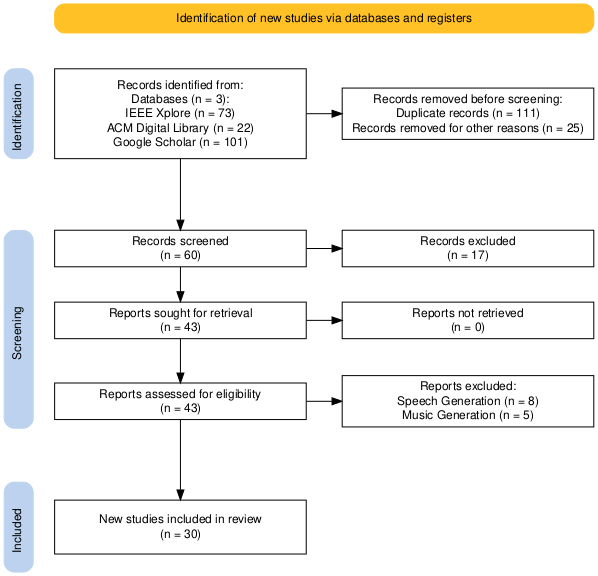
*Figure 1:PRISMA flow diagram summarizing the review process.*

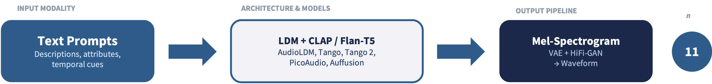
*Figure 2:Dominant architectures and synthesis pipelines for TTA generation (n represents the number of studies/works in this group).*

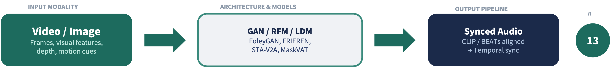
*Figure 3:Dominant architectures and synthesis pipelines for V2A generation (n represents the number of studies/works in this group).*

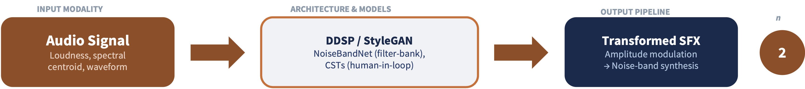
*Figure 4:Dominant architectures and synthesis pipelines for audio-to-audio generation (n represents the number of studies/works in this group).*

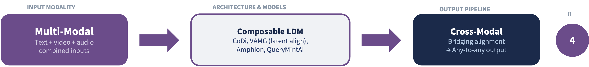
*Figure 5:Dominant architectures and synthesis pipelines for multimodal generation (n represents the number of studies/works in this group).*

---
**Usage Info**: 1458 tokens used.
**Generated at**: 2026-08-05 16:35:33

---

# 📚 MeloCodec: Harnessing Melodic Priors for High-Fidelity Singing Voice Representation†Corresponding authors

🚀 URL: https://arxiv.org/html/2608.03021

## 🌏 Abstract (원문)
Neural audio codecs serve as fundamental tokenizers for LLM-based audio generation. While semantic priors are widely exploited to enhance linguistic intelligibility, the integration of explicit acoustic priors remains underexplored, limiting synthesis fidelity in frequency-sensitive domains. To address this gap, we introduce MeloCodec, a novel framework designed to effectively incorporate melodic priors—a critical form of acoustic information for singing.To address the optimization instability typically caused by the direct fusion of such explicit priors,we propose a“Tokenize-then-Fuse” paradigmthat pre-trains a discrete melodic branch to lock in structures before feature fusion. To robustly realize this paradigm, we further propose a robust two-stage training strategy, which prevents codebook collapse and ensures stable convergence. Experiments show that MeloCodec outperforms baselines in singing voice representation, improving pitch consistency and enabling controllable pitch manipulation with minimal timbre degradation. Audio samples are available athttps://anonymous.4open.science/api/repo/melocodec_demo-60EC/file/demo.html?v=42c197c7.
## 🌏 Abstract (번역)
신경 오디오 코덱은 LLM 기반 오디오 생성을 위한 근본적인 토크나이저 역할을 합니다. 의미론적 사전 정보는 언어적 명료성을 향상시키기 위해 널리 활용되지만, 명시적인 음향 사전 정보의 통합은 아직 충분히 탐구되지 않아 주파수에 민감한 영역에서 합성 충실도를 제한합니다. 이러한 격차를 해소하기 위해 우리는 노래를 위한 음향 정보의 중요한 형태인 멜로디 사전 정보를 효과적으로 통합하도록 설계된 새로운 프레임워크인 MeloCodec을 소개합니다. 이러한 명시적인 사전 정보의 직접적인 융합으로 인해 일반적으로 발생하는 최적화 불안정성을 해결하기 위해, 우리는 특징 융합 전에 구조를 고정하기 위해 이산 멜로디 브랜치를 사전 학습시키는 "토큰화 후 융합(Tokenize-then-Fuse)" 패러다임을 제안합니다. 이 패러다임을 견고하게 구현하기 위해, 우리는 코드북 붕괴를 방지하고 안정적인 수렴을 보장하는 견고한 2단계 훈련 전략을 추가로 제안합니다. 실험 결과 MeloCodec은 노래 음성 표현에서 기준선보다 우수한 성능을 보였으며, 피치 일관성을 향상시키고 음색 저하를 최소화하면서 제어 가능한 피치 조작을 가능하게 했습니다. 오디오 샘플은 https://anonymous.4open.science/api/repo/melocodec_demo-60EC/file/demo.html?v=42c197c7에서 확인할 수 있습니다.

## 🔍 Methods & Results
- MeloCodec은 구조 모델링과 텍스처 합성을 분리하는 "Tokenize-then-Fuse" 패러다임을 사용하여 멜로디 사전 정보를 효과적으로 통합합니다.
- "Tokenize Branch"는 파형에서 크로마그램을 추출하고 RVQ를 통해 이산 멜로디 토큰(M_q)으로 양자화하여 음색 노이즈를 필터링하는 정보 병목 현상을 생성합니다.
- "Fuse Branch"는 이산 멜로디 토큰(M_q)을 음향 특징과 통합하며, 양자화된 토큰을 융합하여 지름길 학습 및 최적화 불안정성을 방지합니다.
- 견고한 2단계 훈련 전략을 사용합니다: 1단계에서는 멜로디 코덱을 사전 훈련하여 구조를 고정하고, 2단계에서는 멜로디 인코더와 RVQ를 고정한 채 멜로디 디코더를 미세 조정하여 안정적인 수렴을 보장합니다.
- 실험 결과, MeloCodec은 노래 음성 표현에서 기준선보다 우수한 성능을 보였으며, 피치 일관성을 향상시키고 음색 저하를 최소화하면서 제어 가능한 피치 조작을 가능하게 했습니다.

## 🖼 Figures
![Figure 1:The architecture of MeloCodec implementing the “Tokenize-then-Fuse” paradigm. The framework consists of a Tokenize Branch (Green) for discrete structural modeling and a Fuse Branch (Blue) for acoustic reconstruction. The switch 
𝐾
 governs the data flow across the robust two-stage training strategy, where dashed boxes explicitly delimit the scope of active gradient updates: (1) In Stage 1, 
𝐾
 routes the quantized melody 
𝑀
𝑞
 directly to the decoder to pre-train the bottleneck; (2) In Stage 2, 
𝐾
 switches to the predicted auxiliary path (
𝑀
^
𝑞
), allowing gradients to update the Fuse Branch and fine-tune the Melody Decoder, while the pre-trained Melody Encoder and RVQ remains frozen.](../images/2026-08-05/2608.03021/2608.03021_fig0.png)
*Figure 1:The architecture of MeloCodec implementing the “Tokenize-then-Fuse” paradigm. The framework consists of a Tokenize Branch (Green) for discrete structural modeling and a Fuse Branch (Blue) for acoustic reconstruction. The switch 
𝐾
 governs the data flow across the robust two-stage training strategy, where dashed boxes explicitly delimit the scope of active gradient updates: (1) In Stage 1, 
𝐾
 routes the quantized melody 
𝑀
𝑞
 directly to the decoder to pre-train the bottleneck; (2) In Stage 2, 
𝐾
 switches to the predicted auxiliary path (
𝑀
^
𝑞
), allowing gradients to update the Fuse Branch and fine-tune the Melody Decoder, while the pre-trained Melody Encoder and RVQ remains frozen.*

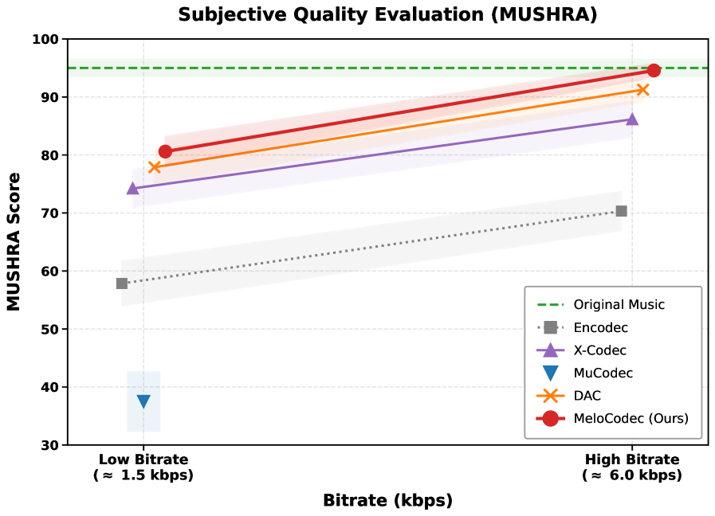
*Figure 2:Subjective MUSHRA evaluation results comparing MeloCodec with baselines across varying bitrates. The shaded areas represent the 95% confidence intervals.*

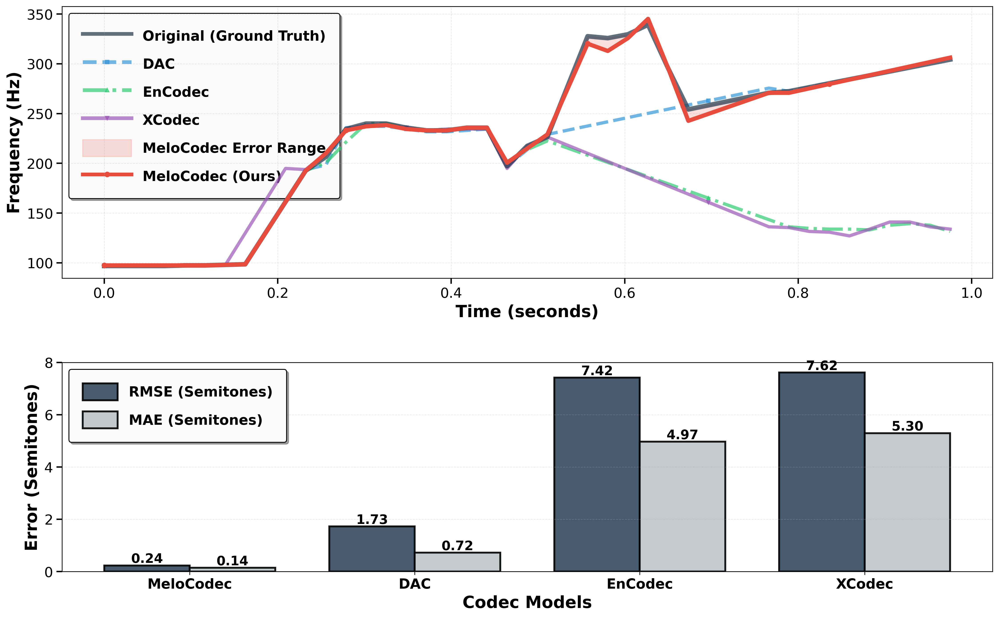
*Figure 3:Visual comparison of reconstructed pitch contours (F0). The upper panel shows F0 trajectories with the shaded area indicating MeloCodec’s deviation. The lower panel presents error metrics RMSE and MAE.*

---
**Usage Info**: 4286 tokens used.
**Generated at**: 2026-08-05 16:35:46

---

# 📚 Agogic: Performance-Timed Music Tokens for LLM-Native Text-to-Symbolic-Music Generation

🚀 URL: https://arxiv.org/html/2608.03999

## 🌏 Abstract (원문)
Building a text-to-music language model begins with a choice usually made by default: how totokenizemusic. Because that choice is normally entangled with the backbone, data, and training recipe, its effect has never been measured in isolation. We fix all three, pretrained Qwen3.5 (0.8B–27B), data, budget, and decoding, and swaponlythe representation across seven tokenizations, anchoring texture metrics to each representation’s model-free expressive ceiling. The resulting ordering is clean and, we think, surprising:the representation, not the model’s size, is the binding variable for distributional fidelity. Scaling the backbone34×34\times(0.8B→\to27B) barely moves Fréchet Music Distance, whereas switching representation halves it. A performance-resolution stream we release, PMT (10 ms timing, per-note velocity, multi-track texture; 609 symbols), reaches FMD159159at 0.8B against272272–286286for beat grids (1.71.7–1.8×1.8\timeslower at this protocol, up to2.8×2.8\timesat others, non-overlapping bootstrap confidence intervals), soa 0.8B performance-resolution model beats a 27B beat grid. The ordering reappears on a 26M from-scratch backbone and on a second, independent performance-resolution tokenizer, making it a property of the representationclass, not one lucky vocabulary. It is robust, not a finer-lattice artifact: snapping PMT’s generated onsets to a fixed grid at the beat grids’ resolution still leaves it6767–129129FMD points ahead ofboth(n=500n{=}500). We are precise about scope. The effect is distributional; whether it isaudibleis a separate question, which our automatic probe leaves open and a pre-registered, properly-powered human study is collecting to settle. Native caption adherence is weak butseparable: a lightweight decode-time constraint doubles instrument-F1 (.28→.60.28\!\to\!.60) and Correct-Key (.16→.35.16\!\to\!.35) at no distributional cost. Alongside the harness and 25+ checkpoints we release two corpora, an 86.6k set aligned across caption/MIDI/ABC/audio and a 6.25M captioned corpus (the largest for music to date, symbolic or audio; onlygeneral-audio corpora are larger), and an imprinting diagnostic: published text-to-MIDI systems reproduce their training distribution near-invariant to the caption (72%72\%vs.71%71\%chord-time on two disjoint domains). The field’s next representation claim can now be measured, not asserted.
## 🌏 Abstract (번역)
텍스트-음악 언어 모델을 구축하는 것은 일반적으로 기본적으로 선택되는 음악 토큰화 방식에서 시작됩니다. 이 선택은 일반적으로 백본, 데이터 및 훈련 방식과 얽혀 있기 때문에 그 효과는 독립적으로 측정된 적이 없습니다. 우리는 사전 훈련된 Qwen3.5 (0.8B–27B), 데이터, 예산 및 디코딩을 포함한 이 세 가지를 고정하고, 7가지 토큰화 방식에 걸쳐 표현 방식만 교체하여 각 표현 방식의 모델-자유 표현 한계에 텍스처 메트릭을 고정했습니다. 그 결과 순서는 명확하며, 놀랍게도 모델의 크기가 아니라 표현 방식이 분포 충실도에 결정적인 변수임을 보여주었습니다. 백본을 34배(0.8B→27B) 확장해도 프레셰 음악 거리(FMD)는 거의 변하지 않았지만, 표현 방식을 바꾸면 절반으로 줄었습니다. 우리가 공개하는 성능 해상도 스트림인 PMT(10ms 타이밍, 음표별 속도, 멀티트랙 텍스처; 609개 심볼)는 0.8B 모델에서 FMD 159를 달성하여 비트 그리드 방식(FMD 272–286)을 능가합니다(이 프로토콜에서는 1.7–1.8배 낮고, 다른 프로토콜에서는 최대 2.8배 낮으며, 중첩되지 않는 부트스트랩 신뢰 구간). 즉, 0.8B 성능 해상도 모델이 27B 비트 그리드 모델을 능가합니다. 이 순서는 26M 스크래치 백본과 두 번째 독립적인 성능 해상도 토크나이저에서도 다시 나타나, 특정 운 좋은 어휘가 아닌 표현 클래스의 속성임을 보여줍니다. 이는 미세 격자 아티팩트가 아닌 견고한 결과입니다. PMT가 생성한 온셋을 비트 그리드 해상도의 고정 격자에 맞춰도 여전히 두 방식(n=500)보다 67–129 FMD 포인트 앞섭니다. 우리는 범위에 대해 정확합니다. 이 효과는 분포적이며, 청각적으로 인지 가능한지는 별개의 질문으로, 우리의 자동 프로브는 이를 열어두고 있으며, 사전 등록되고 적절한 규모의 인간 연구가 이를 해결하기 위해 데이터를 수집하고 있습니다. 원본 캡션 준수도는 약하지만 분리 가능합니다. 경량 디코딩 시간 제약은 분포 비용 없이 악기-F1(0.28→0.60)과 올바른 키(0.16→0.35)를 두 배로 높입니다. 우리는 하네스 및 25개 이상의 체크포인트와 함께 두 가지 코퍼스를 공개합니다. 하나는 캡션/MIDI/ABC/오디오에 걸쳐 정렬된 86.6k 세트이고, 다른 하나는 6.25M 캡션 코퍼스(현재까지 음악 분야에서 가장 큰 규모, 심볼릭 또는 오디오; 일반 오디오 코퍼스만 더 큼)입니다. 또한 각인 진단(imprinting diagnostic)도 공개합니다. 이는 공개된 텍스트-MIDI 시스템이 캡션에 거의 불변하게 훈련 분포를 재현함(두 개의 분리된 도메인에서 코드 시간 72% 대 71%)을 보여줍니다. 이제 이 분야의 다음 표현 주장은 주장되는 것이 아니라 측정될 수 있습니다.

## 🔍 Methods & Results
- 문제 정의: 자연어 설명(c)이 주어졌을 때, 잘 구성되고(디코딩 및 렌더링 가능), 설명과 일치하며, 실제 음악의 통계적 프로필과 일치하는 기호 악보(y)를 생성하는 것을 목표로 합니다.
- PMT 파이프라인은 표현(representation), 통합 방식(integration recipe), 평가 프로토콜(evaluation protocol)의 세 가지 상호 연결된 구성 요소로 이루어져 있으며, 표현 방식 외의 모든 요소를 고정하여 품질 차이를 표현 방식에 귀속시킵니다.
- PMT 표현 방식은 각 음표를 PITCH, DUR, VEL, TSHIFT, TRACK, PROG의 해석 가능한 파라미터 튜플로 직렬화하며, 총 609개의 심볼로 구성됩니다. 이는 10ms 시간 이동 및 32단계 속도를 사용하여 비트 그리드 방식이 양자화하는 미세 타이밍과 다이내믹을 보존하는 '성능 해상도'를 특징으로 합니다.
- PMT는 모든 악기를 인터리빙하는 '플랫 단일 스트림' 방식을 사용하여 단일 소프트맥스 LLM에 의해 소비될 수 있으며, 디코딩은 확정적이고 완전하여 유효성이 0.99-1.00에 달합니다.
- PMT 디코더는 양자화 격자에서 정확하며, 인코딩-디코딩은 양자화된 피치, 온셋, 지속 시간, 속도 및 채널에 대해 항등 함수이므로 모든 편차는 양자화에 기인합니다.
- 훈련 방식은 사전 훈련된 텍스트 LLM(Qwen3.5)을 최소한의 변경으로 텍스트-음악 생성기로 변환합니다. 이는 어휘 확장(609개 음악 심볼 추가), 캡션 마스크 SFT(캡션 마스크를 사용하여 사전 훈련된 백본 미세 조정), 음악 제약 디코딩(추론 시 음악 범위에 대해서만 로짓 정규화), 스케일 이식성(0.8B에서 27B까지 동일한 방식 적용)을 포함합니다.
- 평가 프로토콜은 PMT, PerTok (성능 해상도), Beat-TSD, REMI, MIDI-Like (비트 그리드), 그룹화된 방식, 텍스트 (ABC-as-text) 등 7가지 토큰화 방식을 비교하는 '표현 방식 교체'를 사용합니다.
- 평가 프로토콜은 '천장 고정(ceiling anchoring)'을 통해 각 텍스처 메트릭을 원본 값과 모델-자유 라운드트립 후 남는 '달성도'로 보고하여 표현 방식의 표현력과 모델의 학습 능력을 분리합니다.
- 주요 결과는 모델 크기가 아닌 표현 방식이 분포 충실도에 결정적인 변수라는 것입니다. 백본을 34배 확장해도 프레셰 음악 거리(FMD)는 거의 변하지 않았지만, 표현 방식을 바꾸면 FMD가 절반으로 줄었습니다.
- 0.8B PMT 모델은 FMD 159를 달성하여 27B 비트 그리드 모델(FMD 272–286)을 능가하며, 이는 이 프로토콜에서 1.7–1.8배, 다른 프로토콜에서는 최대 2.8배 낮은 FMD를 의미합니다.
- 이러한 결과는 26M 스크래치 백본과 또 다른 독립적인 성능 해상도 토크나이저에서도 일관되게 나타나, 특정 어휘가 아닌 표현 클래스의 속성임을 입증합니다.
- PMT가 생성한 온셋을 비트 그리드 해상도의 고정 격자에 맞춰도 여전히 다른 방식들보다 67–129 FMD 포인트 앞서며, 이는 미세 격자 아티팩트가 아닌 견고한 결과임을 보여줍니다.
- 경량 디코딩 시간 제약을 통해 악기-F1(0.28→0.60)과 올바른 키(0.16→0.35)를 두 배로 높일 수 있었으며, 이는 분포 비용 없이 캡션 준수도를 향상시킬 수 있음을 시사합니다.
- 86.6k 세트(캡션/MIDI/ABC/오디오 정렬)와 6.25M 캡션 코퍼스(현재까지 음악 분야에서 가장 큰 규모) 두 가지 코퍼스를 공개했습니다.

## 🖼 Figures
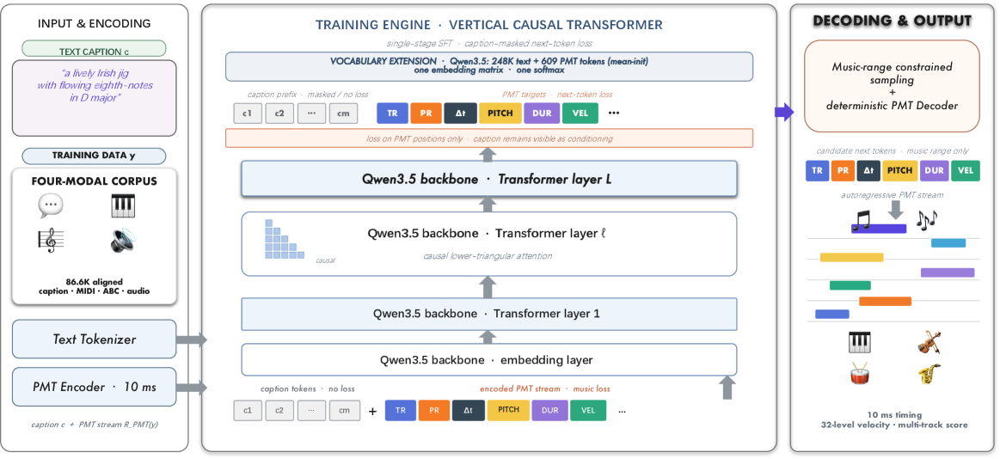
*Figure 1:PMT overview. Left: a caption paired with a piece from the four-modality corpus. Middle: the piece as a performance-timed token stream. Right: decoding back to MIDI.*

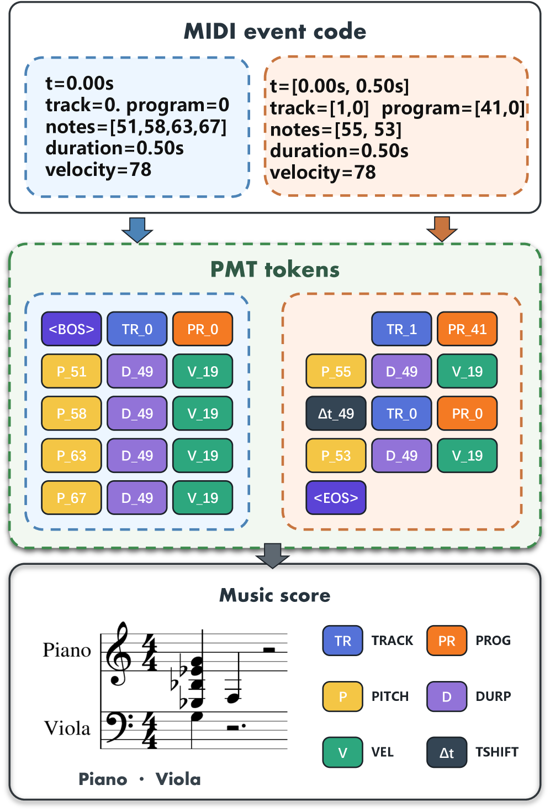
*Figure 2:One excerpt through the encoding. Top: the MIDI events as the file stores them. Bottom: the PMT token stream for the same notes.*

*Figure 3:Same caption, different representation (0.8B, identical backbone/data/budget). Piano rolls (colour 
=
 instrument, opacity 
=
 velocity) for one orchestral-soundtrack caption. PMT (top) generates an 8-instrument arrangement approaching the 11-instrument real reference (bottom), while beat-grid Beat-TSD and REMI collapse to 5 sparser tracks filling only the first seconds. Texture is set by the representation, not the backbone.*

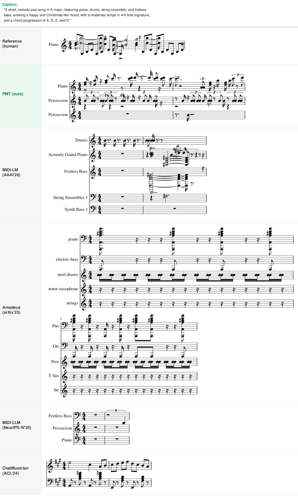
*Figure 4:Same caption, engraved as sheet music (pop). One MidiCaps caption drives six systems; each generation is notated from its own MIDI under one engraver.*

*Figure 5:Instrument-specific caption (classical, “orchestral harp”). When the caption names a specific instrument, every MIDI-native system instantiates a harp part, MIDILM labels its staff Orchestral Harp, Amadeus harp, MIDI-LLM Harp, and PMT writes a harp line with an accompanying guitar, whereas ChatMusician emits a single ABC melody line. The MIDI token vocabularies carry explicit instrument-program tokens; the ABC representation does not.*

*Figure 6:Rock caption (“distorted guitars, electric bass, drums”). The MIDI-native systems realize the requested rock instrumentation, MIDILM’s Distortion Guitar/Overdriven Guitar/Drums, Amadeus’s electric-guitar/bass/steel-drums, and PMT’s dual electric guitars with bass, while ChatMusician again reduces to a two-staff keyboard part. Across all three genres the pattern is identical: the token representation, not the backbone, sets the achievable notated texture.*

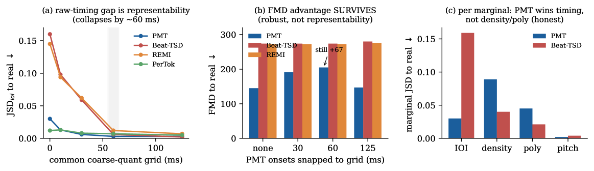
*Figure 7:Controls on the timing/FMD advantage (visualizing Table 17).*

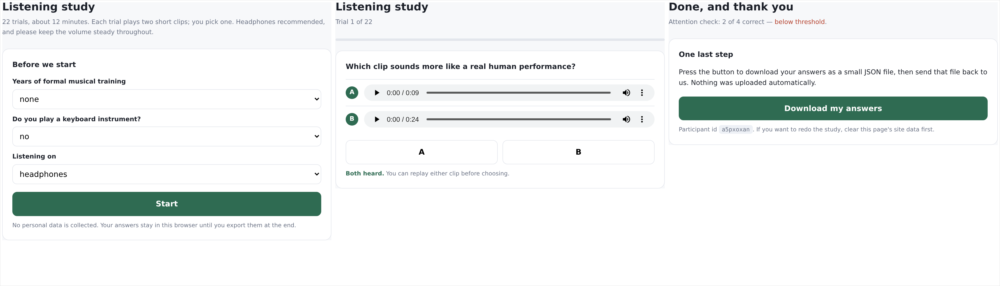
*Figure 8:The listening-study interface (captures of the deployed page). Left: intake. Middle: a trial. Right: the closing screen.*

![Figure 9:Full-pipeline qualitative comparison on MidiCaps. The same caption (column title) drives three pipelines; instrument-colored piano rolls, first 
20
 s. PMT’s instrument count tracks the caption, rich for pop/rock prompts, sparse for the solo-harp prompt (center); MIDI-LLM collapses to a single track on the harp prompt yet thickens elsewhere, and text2midi consistently over-instruments (
11
–
17
 tracks), the imprinting Table 25 quantifies as 
66
–
72
%
 chord-time and FMD 
507
–
727
 (vs. PMT’s 
36
%
/
159
).](../images/2026-08-05/2608.03999/2608.03999_fig8.png)
*Figure 9:Full-pipeline qualitative comparison on MidiCaps. The same caption (column title) drives three pipelines; instrument-colored piano rolls, first 
20
 s. PMT’s instrument count tracks the caption, rich for pop/rock prompts, sparse for the solo-harp prompt (center); MIDI-LLM collapses to a single track on the harp prompt yet thickens elsewhere, and text2midi consistently over-instruments (
11
–
17
 tracks), the imprinting Table 25 quantifies as 
66
–
72
%
 chord-time and FMD 
507
–
727
 (vs. PMT’s 
36
%
/
159
).*

*Figure 10:Imprinting diagnostic (chord-time via poly_stats, 
𝑛
=
200
 per domain). (a) Per-domain rates. (b) The same as trajectories: flat 
=
 caption-invariant.*

*Figure 11:Audio-domain view (mel-spectrograms, one soundfont, shared time axis). The same caption drives three pipelines; chord-time (paper metric) annotated per panel. Real and PMT share an articulated, silence-punctuated texture; MIDI-LLM emits a denser sustained energy wall, the audio-domain signature of the over-texturing quantified in Table 25 and Figure 10. Illustrative context for a single caption, not a quantitative claim.*

*Figure 12:What each tokenizer preserves, model-free. Encode
→
decode of 
80
 real pieces per representation; no model is involved.*

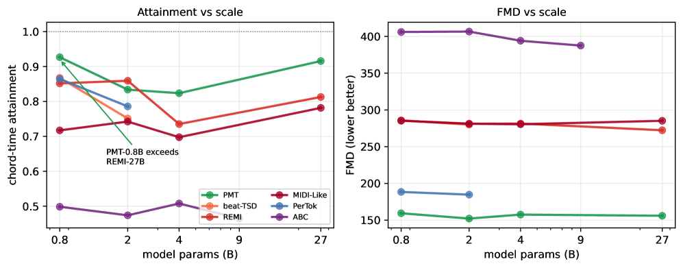
*Figure 13:Representation Pareto-dominates scale. Attainment (left, higher better) and FMD (right, lower better) vs. backbone size per representation.*

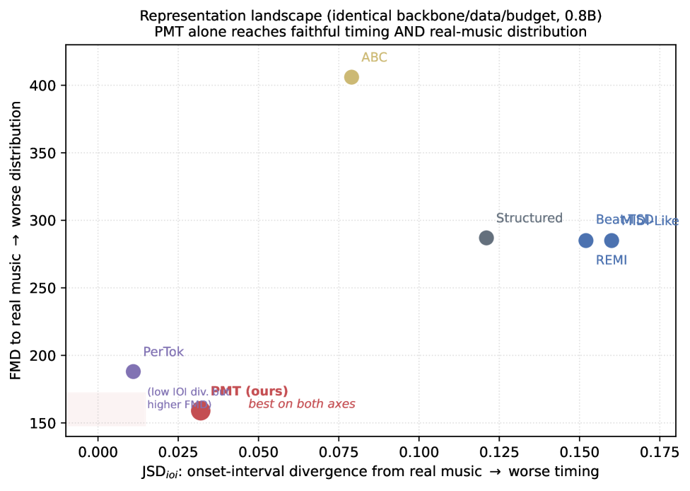
*Figure 14:Representation landscape. The seven controlled-grid representations at 0.8B under an identical backbone, data and budget.*

*Figure 15:Caption adherence is a decode-time conditioning gap (
𝑛
=
80
, 6.25M model at step 116k).*

*Figure 16:The gap is not an artifact of one embedding space. Each 0.8B arm scored twice on the same generations against the same 
500
-piece reference: 
𝑥
 over CLaMP-2, 
𝑦
 over CLaMP-3.*

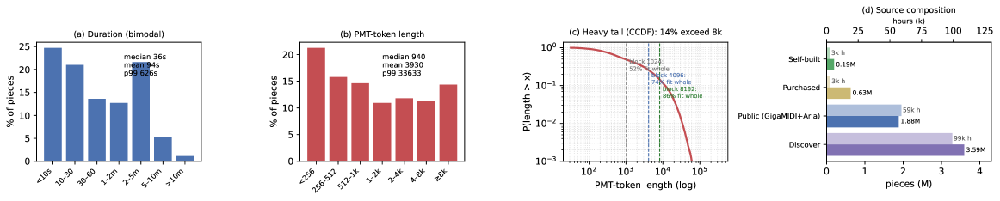
*Figure 17:Statistics of the 6.25M captioned corpus (30k-per-pool random sample; counts and hours exact). (a) Piece duration. (b) PMT-token length. (c) Block coverage. (d) Source composition.*

*Figure 18:Generation gallery (1 of 11). Per example: model and caption provenance, measured texture, the caption, the piano roll over the whole clip (colour 
=
 track, vertical axis 
=
 pitch), and the opening bars engraved. All curated; see Appendix O.*

*Figure 19:Generation gallery (2 of 11). Per example: model and caption provenance, measured texture, the caption, the piano roll over the whole clip (colour 
=
 track, vertical axis 
=
 pitch), and the opening bars engraved. All curated; see Appendix O.*

*Figure 20:Generation gallery (3 of 11). Per example: model and caption provenance, measured texture, the caption, the piano roll over the whole clip (colour 
=
 track, vertical axis 
=
 pitch), and the opening bars engraved. All curated; see Appendix O.*

*Figure 21:Generation gallery (4 of 11). Per example: model and caption provenance, measured texture, the caption, the piano roll over the whole clip (colour 
=
 track, vertical axis 
=
 pitch), and the opening bars engraved. All curated; see Appendix O.*

*Figure 22:Generation gallery (5 of 11). Per example: model and caption provenance, measured texture, the caption, the piano roll over the whole clip (colour 
=
 track, vertical axis 
=
 pitch), and the opening bars engraved. All curated; see Appendix O.*

*Figure 23:Generation gallery (6 of 11). Per example: model and caption provenance, measured texture, the caption, the piano roll over the whole clip (colour 
=
 track, vertical axis 
=
 pitch), and the opening bars engraved. All curated; see Appendix O.*

*Figure 24:Generation gallery (7 of 11). Per example: model and caption provenance, measured texture, the caption, the piano roll over the whole clip (colour 
=
 track, vertical axis 
=
 pitch), and the opening bars engraved. All curated; see Appendix O.*

*Figure 25:Generation gallery (8 of 11). Per example: model and caption provenance, measured texture, the caption, the piano roll over the whole clip (colour 
=
 track, vertical axis 
=
 pitch), and the opening bars engraved. All curated; see Appendix O.*

*Figure 26:Generation gallery (9 of 11). Per example: model and caption provenance, measured texture, the caption, the piano roll over the whole clip (colour 
=
 track, vertical axis 
=
 pitch), and the opening bars engraved. All curated; see Appendix O.*

*Figure 27:Generation gallery (10 of 11). Per example: model and caption provenance, measured texture, the caption, the piano roll over the whole clip (colour 
=
 track, vertical axis 
=
 pitch), and the opening bars engraved. All curated; see Appendix O.*

*Figure 28:Generation gallery (11 of 11). Per example: model and caption provenance, measured texture, the caption, the piano roll over the whole clip (colour 
=
 track, vertical axis 
=
 pitch), and the opening bars engraved. All curated; see Appendix O.*

*Figure 29:One caption, seven systems. Rolls over a common 
24
 s window; row labels carry the measured texture.*

*Figure 30:One caption, seven systems (second caption). Same protocol as Figure 29. The reference row is clipped at 
256
 notes by the benchmark’s own construction, which is the length bias discussed in Appendix E.*

---
**Usage Info**: 6820 tokens used.
**Generated at**: 2026-08-05 16:36:10

---

# 📚 CLASVS: Continuous-Latent Autoregression for Melody-Preserving Lyric Editing in Singing Voice Synthesis

🚀 URL: https://arxiv.org/html/2608.03253

## 🌏 Abstract (원문)
Reference-conditioned melody-preserving lyric editing replaces words while retaining a performance’s timing, singer identity, and naturalness. Continuous-latent autoregression avoids finite codebooks and offers stepwise generation with learned stopping. Editing creates a conflict absent from ordinary reconstruction: training pairs reference cues with original lyrics, whereas inference asks revised lyrics to override source-lyric-correlated cues; one source-following patch can propagate through AR history. We introduce CLASVS. Its State–Control–Transition (SCT) routing keeps target-lyric and reference-melody controls persistent, returns semantic feedback on phonetic progress to the causal planner, and confines the previous latent patch to the local Transition. Progressive State–Control Grounding (PSCG) learns this contract through paired-edit-free, content-consistent Mandarin reconstruction. On two Mandarin benchmarks, CLASVS improves all four operations over discrete-AR Vevo2 and reduces macro-PER by 46.2%, while maintaining melody, singer similarity, and perceptual quality. Together, these results establish a strong continuous-AR operating point for score-annotation-free lyric edits and a basis for broader stepwise control. Audio demonstrations are available on our project page:https://piedpiperg.github.io/Liyric-SVS/.
## 🌏 Abstract (번역)
참조 조건 멜로디 보존 가사 편집은 공연의 타이밍, 가수 정체성 및 자연스러움을 유지하면서 단어를 대체합니다. 연속 잠재 오토회귀는 유한 코드북을 피하고 학습된 중단점을 통해 단계별 생성을 제공합니다. 편집은 일반적인 재구성에는 없는 충돌을 생성합니다. 훈련은 참조 단서를 원본 가사와 짝짓는 반면, 추론은 수정된 가사가 원본 가사와 상관관계가 있는 단서를 무시하도록 요구합니다. 하나의 원본 추종 패치가 AR 기록을 통해 전파될 수 있습니다. 우리는 CLASVS를 소개합니다. 이 시스템의 상태-제어-전환(SCT) 라우팅은 목표 가사 및 참조 멜로디 제어를 지속적으로 유지하고, 음성 진행에 대한 의미론적 피드백을 인과적 플래너에 반환하며, 이전 잠재 패치를 로컬 전환으로 제한합니다. 점진적 상태-제어 접지(PSCG)는 쌍 편집 없는, 내용 일관성 있는 중국어 재구성을 통해 이 계약을 학습합니다. 두 가지 중국어 벤치마크에서 CLASVS는 이산 AR Vevo2에 비해 네 가지 모든 작업에서 개선을 보였고, 멜로디, 가수 유사성 및 지각 품질을 유지하면서 매크로-PER을 46.2% 감소시켰습니다. 이러한 결과는 악보 주석 없는 가사 편집을 위한 강력한 연속 AR 작동 지점과 더 광범위한 단계별 제어를 위한 기반을 확립합니다. 오디오 데모는 프로젝트 페이지(https://piedpiperg.github.io/Liyric-SVS/)에서 확인할 수 있습니다.

## 🔍 Methods & Results
- CLASVS는 참조 오디오에서 멜로디 토큰(6.25Hz, 512개 엔트리 코드북), CAM++ 인코더에서 192D 가수 벡터, Ming-UniAudio AudioVAE에서 16kHz 오디오를 50Hz의 64차원 잠재 벡터로 추출하는 방식으로 작동합니다.
- 음향 재귀는 5프레임(100ms)을 하나의 패치로 그룹화하여 10Hz로 실행되며, 훈련은 참조 및 목표 오디오가 동일한 성능에서 파생되고 가사가 전사된 '내용 일관성 재구성' 방식을 사용합니다. 이는 '쌍 편집 없는' 훈련으로, 수정된 가사를 따르도록 일반화 능력을 테스트합니다.
- SCT(State–Control–Transition) 라우팅은 목표 가사 및 참조 멜로디 제어를 지속적으로 유지하고, 음성 진행에 대한 의미론적 피드백을 인과적 플래너에 반환하며, 이전 잠재 패치를 로컬 전환으로 제한합니다.
- Qwen3-0.6B 인과적 플래너는 가사 및 멜로디 토큰으로 미리 채워지며, 이후 단계에서는 의미론적 피드백만 추가됩니다. 가수 정체성은 플래너를 우회하여 Flow-DiT 블록을 조절합니다.
- PSCG(Progressive State–Control Grounding)는 SCT 편집 계약을 학습시킵니다. '상태 접지'는 의미론적 인코더를 ASR 및 MSMel 손실로 사전 훈련하여 실제 콘텐츠를 추적하게 하고, '제어 접지'는 이전 잠재 패치에 히스토리 드롭아웃을 적용하고 참조 멜로디 스팬을 마스킹하여 불완전한 로컬 증거로부터 복구를 강제합니다. '작업 접지'는 커리큘럼 학습을 통해 편집 충실도 전에 광범위한 노래 및 음성 지원 데이터를 제공합니다.
- 두 가지 보완 경로가 사용됩니다: '의미론적 피드백'은 Whisper 스타일의 인코더를 통해 장거리 진행을 지원하며 플래너 캐시에 지속적으로 유지되고, '이전 잠재 패치'는 Flow-DiT를 통해 로컬 연속성을 보존하며 다음 전환에만 조건화됩니다.
- 목표 함수는 조건부 흐름 매칭을 사용하며, L_text(플래너 측 목표 콘텐츠 정규화), L_stop(중단 예측), 그리고 무조건적 안내를 위한 공동 가사-멜로디-가수 드롭아웃을 포함합니다.
- CLASVS는 두 가지 중국어 벤치마크에서 이산 AR Vevo2에 비해 네 가지 모든 작업에서 개선을 보였으며, 매크로-PER을 46.2% 감소시키면서 멜로디, 가수 유사성 및 지각 품질을 유지했습니다.

## 🖼 Figures

*Figure 1:CLASVS generates 64-D continuous AudioVAE latent patches every 100 ms. Target lyrics and reference-melody tokens persist in the causal planner’s cache. Each patch updates semantic feedback and becomes the previous latent patch for the next step; the concatenated sequence is decoded once. Repeated Flow-DiT blocks share parameters.*

*Figure 2:Progressive State–Control Grounding (PSCG). State Grounding pretrains the semantic encoder for phonetic progress; Control Grounding applies history dropout to the previous latent patch and masks melody while retaining lyrics; Task Grounding moves from broad to curated Mandarin singing.*

---
**Usage Info**: 4263 tokens used.
**Generated at**: 2026-08-05 16:36:21

---

# 📚 On the Geometry of Music Bandwidth Extension in Latent Spaces of Audio Codecs

🚀 URL: https://arxiv.org/html/2608.03721

## 🌏 Abstract (원문)
Recent audio restoration increasingly relies on large-scale conditional latent generative modeling, including diffusion, Schrödinger Bridges, and Flow Matching variants, to invert degradations such as bandwidth limitation or noise. We present an analysis of the performance of various state-of-the-art methods compared to simple arithmetic transformations in the latent spaces of multiple neural codecs for musical bandwidth extension. We show that estimating a single transport vector between the clean and degraded latent centroids on a reference set, and adding it to degraded latents, can yield restoration performance competitive with large diffusion models. This suggests, first, that some neural codec latent spaces exhibit structure aligned with audio bandwidth; and second, that in such cases complex conditional models may offer only limited gains over a simple vector addition. We argue that these findings reveal an interesting avenue for future research whereby models could take advantage of the latent space structure in order to offer greater training and parameter efficiency, and overall better performance. Additionally, we propose to consider this simple arithmetic transformation as a baseline for music bandwidth extension research, as it allows an assessment of the contribution of learnable parameters towards restoration performance.
## 🌏 Abstract (번역)
최근 오디오 복원은 대역폭 제한이나 노이즈와 같은 손상을 역전시키기 위해 확산 모델, 슈뢰딩거 브릿지, 플로우 매칭 변형을 포함한 대규모 조건부 잠재 생성 모델링에 점점 더 의존하고 있습니다. 우리는 음악 대역폭 확장을 위한 여러 신경 코덱의 잠재 공간에서 간단한 산술 변환과 비교하여 다양한 최첨단 방법의 성능 분석을 제시합니다. 우리는 참조 세트에서 깨끗한 잠재 중심과 손상된 잠재 중심 사이의 단일 전송 벡터를 추정하고 이를 손상된 잠재 벡터에 추가하는 것이 대규모 확산 모델과 경쟁할 만한 복원 성능을 제공할 수 있음을 보여줍니다. 이는 첫째, 일부 신경 코덱 잠재 공간이 오디오 대역폭과 정렬된 구조를 나타내며, 둘째, 그러한 경우 복잡한 조건부 모델이 간단한 벡터 덧셈에 비해 제한적인 이득만을 제공할 수 있음을 시사합니다. 우리는 이러한 발견이 모델이 잠재 공간 구조를 활용하여 더 큰 훈련 및 매개변수 효율성, 그리고 전반적으로 더 나은 성능을 제공할 수 있는 미래 연구를 위한 흥미로운 길을 열어준다고 주장합니다. 또한, 우리는 이 간단한 산술 변환을 음악 대역폭 확장 연구를 위한 기준선으로 고려할 것을 제안합니다. 이는 학습 가능한 매개변수가 복원 성능에 기여하는 바를 평가할 수 있게 해주기 때문입니다.

## 🔍 Methods & Results
- 음악 대역폭 확장을 위해 여러 신경 코덱의 잠재 공간에서 간단한 산술 변환(참조 세트에서 깨끗한 잠재 중심과 손상된 잠재 중심 사이의 단일 전송 벡터를 추정하여 손상된 잠재 벡터에 추가)을 최첨단 생성 모델(확산, 슈뢰딩거 브릿지, 플로우 매칭 등)과 비교 분석했습니다.
- 결과적으로, 이 간단한 산술 변환이 대규모 확산 모델과 경쟁할 만한 복원 성능을 제공할 수 있음을 보여주었습니다.
- 이는 일부 신경 코덱 잠재 공간이 오디오 대역폭과 정렬된 구조를 가지며, 이러한 경우 복잡한 조건부 모델이 간단한 벡터 덧셈에 비해 제한적인 이득만을 제공할 수 있음을 시사합니다.
- 이 간단한 산술 변환을 음악 대역폭 확장 연구의 새로운 기준선으로 제안하여, 학습 가능한 매개변수의 기여도를 평가할 수 있도록 합니다.

## 🖼 Figures

*Figure 1:We analyze audio restoration through latent transport geometry. For bandwidth extension, simple low-parameter latent transports (T) already achieve strong waveform results on common audio metrics (
ℒ
), in some cases approaching large generative baselines. For other degradations, the latent correction is less coherent, showing that restoration difficulty depends strongly on the encoder and the degradation.*

*Figure 2:Per-codec cosine-similarity heatmaps of global mean-shift transport vectors across all dataset-cutoff conditions for bandwidth extension. Each panel corresponds to one codec and compares the nine conditions formed by the three datasets (mtd, maestro, ccmixter) and three cutoff frequencies (4, 8, and 12 kHz). Brighter blocks indicate stronger alignment between learned transport directions.*

*Figure 3:SiSpec and lsd as a function of fit subset size, grouped by cutoff and codec. Starting with just 8 samples, most metrics stay similar as fit subset size grows. Results are close to full-dataset results at 8 samples (as reported in Tables 1–3), suggesting strong sample efficiency for deriving effective transport probes.*

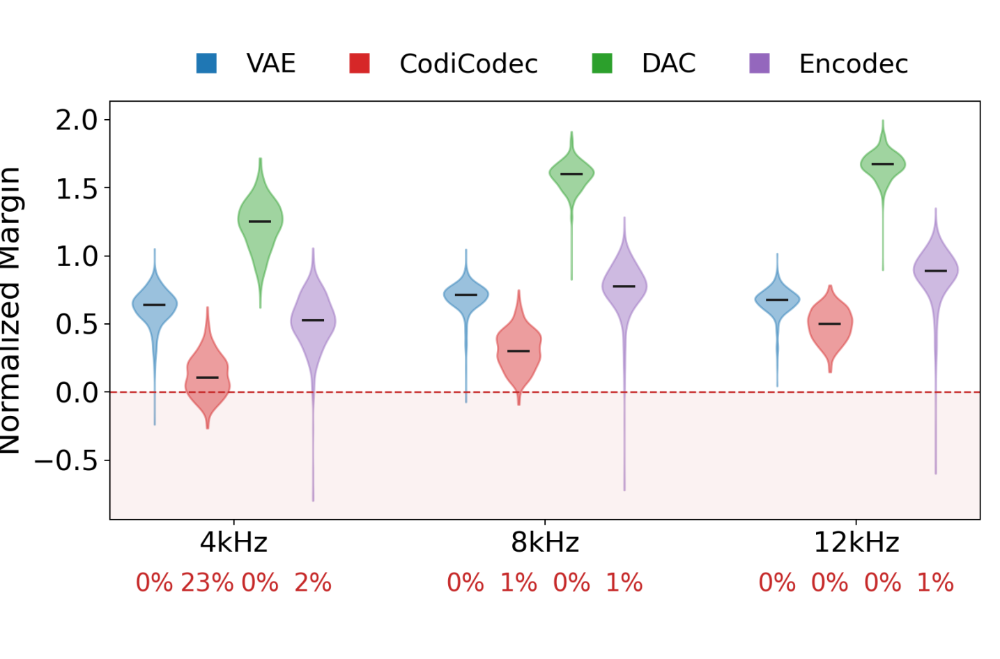
*Figure 4:Normalized BWE margin violin plots across codecs and cutoffs. Percentages beneath each codec indicate the share of samples with negative normalized margin. Lower percentage means better identity preservation.*

---
**Usage Info**: 2423 tokens used.
**Generated at**: 2026-08-05 16:36:31

---

# 📚 Echo-Aware Modulation for Compact-Latent Frequency-Time Modeling in Lightweight Acoustic Echo Cancellation

🚀 URL: https://arxiv.org/html/2608.03650

## 🌏 Abstract (원문)
Existing lightweight acoustic echo cancellation (AEC) systems often combine linear AEC with Bark-domain DNN-based suppression to lower the computational footprint. In such systems, downsampling layers further compress the input features into a compact bottleneck representation, but this compression weakens frequency-time modeling capacity and degrades performance. To mitigate this limitation, we propose MSA-EchoLite, a lightweight Bark-domain AEC framework with an asymmetric dual-branch encoder and an echo-aware frequency-time modulation (EAM) module. The EAM module enriches the compressed bottleneck representation by modeling discrepancy and correlation cues between the dual-branch microphone and echo-related latent features. Experimental results show that the Bark-domain variant of MSA-EchoLite offers a better performance-complexity trade-off than its frequency-domain counterpart but is more sensitive to feature compression. With only 26.1% additional FLOPs over its non-EAM Bark-domain variant, its EAM-enhanced version achieves 99.1% of the PESQ of the frequency-domain counterpart, which requires nearly twice the FLOPs, and even surpasses it in SDR. Overall, MSA-EchoLite outperforms state-of-the-art lightweight AEC models while using only 0.2
	M parameters and 100
	M FLOPs/s.
## 🌏 Abstract (번역)
기존의 경량 음향 에코 제거(AEC) 시스템은 계산 부담을 줄이기 위해 선형 AEC와 Bark-도메인 DNN 기반 억제를 결합하는 경우가 많습니다. 이러한 시스템에서 다운샘플링 레이어는 입력 특징을 압축된 병목 표현으로 더욱 압축하지만, 이러한 압축은 주파수-시간 모델링 능력을 약화시키고 성능을 저하시킵니다. 이러한 한계를 완화하기 위해 우리는 비대칭 듀얼 브랜치 인코더와 에코 인식 주파수-시간 변조(EAM) 모듈을 갖춘 경량 Bark-도메인 AEC 프레임워크인 MSA-EchoLite를 제안합니다. EAM 모듈은 듀얼 브랜치 마이크와 에코 관련 잠재 특징 간의 불일치 및 상관 관계 단서를 모델링하여 압축된 병목 표현을 풍부하게 합니다. 실험 결과에 따르면 MSA-EchoLite의 Bark-도메인 변형은 주파수-도메인 변형보다 더 나은 성능-복잡도 균형을 제공하지만 특징 압축에 더 민감합니다. EAM이 없는 Bark-도메인 변형에 비해 단 26.1%의 추가 FLOPs로, EAM이 강화된 버전은 거의 두 배의 FLOPs를 요구하는 주파수-도메인 변형의 PESQ 99.1%를 달성하며 SDR에서는 이를 능가합니다. 전반적으로 MSA-EchoLite는 0.2M 파라미터와 100M FLOPs/s만을 사용하면서 최첨단 경량 AEC 모델보다 뛰어난 성능을 보입니다.

## 🔍 Methods & Results
- MSA-EchoLite는 선형 에코 추정을 위해 PBFDAF를 사용하고, 마이크 신호와 선형 에코 추정치를 입력으로 받아 음성 추출 마스크를 추정합니다.
- MSA-EchoLite는 비대칭 듀얼-패스 인코딩 전략을 기반으로 하며, 마이크 신호의 근단 음성 세부 정보를 보존하는 음성 특징 경로(SFP)와 에코 억제를 위해 마이크-참조 상관 관계를 모델링하는 참조 특징 경로(RFP)로 구성됩니다.
- SFP는 1x5 컨볼루션을, RFP는 인과적 시간 패딩을 포함하는 3x5 컨볼루션을 사용하여 단기 마이크-참조 상관 관계를 포착하며, 이후 인스턴스 정규화와 PReLU 활성화가 적용됩니다.
- 압축된 Bark-도메인 표현에서 주파수-시간 세부 정보 및 마이크-에코 상호작용 단서 손실을 완화하기 위해 에코 인식 주파수-시간 변조(EAM) 모듈을 FT-LSTM 병목의 주파수 및 시간 모델링 단계 이후에 삽입합니다.
- EAM 모듈은 융합된, 마이크, 에코 관련 잠재 표현(X, S, R)으로부터 에코 인식 상호작용 표현(U)을 형성하며, 이는 마이크와 참조 경로 간의 불일치 및 국부적 상관 관계를 모델링합니다.
- EAM은 U에 3개의 깊이별 컨볼루션(DWC) 브랜치(3x3, 3x1, 1x3)를 적용하여 각각 시간-주파수, 시간 전용, 주파수 전용 상호작용을 포착하고, 채널 게이트와 로컬 게이트를 사용하여 상호작용을 제어합니다.
- 모델은 Bark-도메인 파워 계산 및 오라클 게인 매핑을 통해 전체 대역으로 재구성되며, 다중 해상도 STFT, PMSQE, 크기, 시간-도메인, 복소 스펙트럼 및 안티-래핑 위상 손실을 포함하는 종단 간 재구성 손실을 사용하여 최적화됩니다.
- MSA-EchoLite의 Bark-도메인 변형은 주파수-도메인 변형보다 더 나은 성능-복잡도 균형을 제공하며, EAM이 강화된 버전은 EAM이 없는 Bark-도메인 변형 대비 26.1%의 추가 FLOPs로 주파수-도메인 변형의 PESQ 99.1%를 달성하고 SDR에서는 이를 능가합니다.
- MSA-EchoLite는 0.2M 파라미터와 100M FLOPs/s만을 사용하여 최첨단 경량 AEC 모델보다 우수한 성능을 보입니다.

## 🖼 Figures
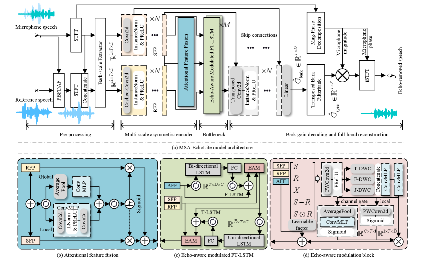
*Figure 1:(a) Overall architecture of the proposed MSA-EchoLite. (b)–(d) Detailed structures of its constituent modules.*

*Figure 2:Comparison of Bark- and frequency-domain modeling under compact latent configurations. (a) Pareto efficiency analysis based on a unified normalized score with Freq-C64H128 as reference. (b) Domain-normalized performance drop using the corresponding C64H128 model as reference.*

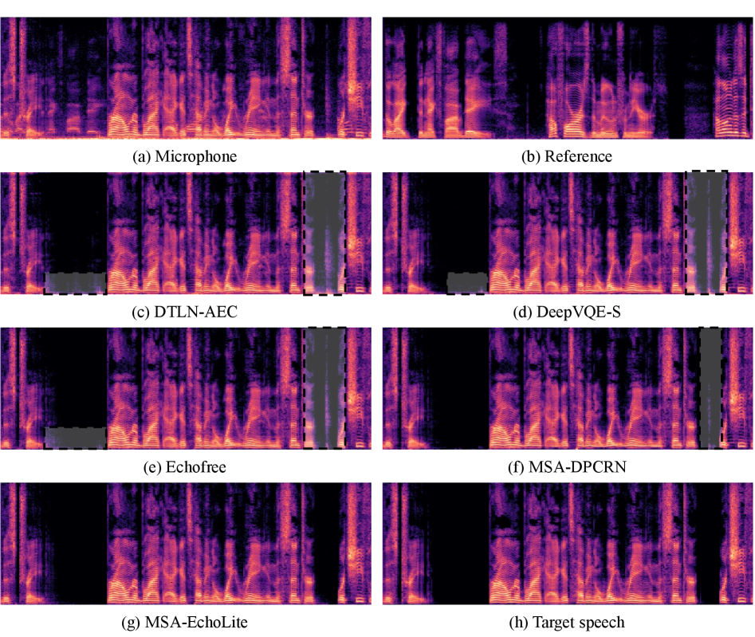
*Figure 3:Spectrogram comparison on a double-talk test sample.*

---
**Usage Info**: 3869 tokens used.
**Generated at**: 2026-08-05 16:36:43

---

