# 🚩 (2026-08-07) Scholar Inbox 추천 논문 

# 📚 Vorch-Streamer: Extending Human Audio-Visual Generation to Real-Time Long-Form Streaming

🚀 URL: https://arxiv.org/html/2608.05663

## 🌏 Abstract (원문)
Real-time long-form avatar audio–video generation requires causal, continuous synthesis while maintaining audiovisual synchronization and visual consistency. Adapting a pretrained bidirectional model to this setting presents two key dilemmas. First, autoregressively reusing generated blocks as context creates exposure bias, causing errors and visual drift to accumulate over long rollouts. Second, a global speech utterance does not indicates a causal generator which portion should be spoken next when only limited local audio–video context is available. We presentVorch-Streamer, a post-training framework that addresses these challenges and enables real-time long-form Text-to-Audio-Video (T2AV) streaming. We construct a synthetic corpus of 80K avatar clips spanning 12–21 seconds and first train a causal generator with mixed Teacher Forcing and Diffusion Forcing. We then apply long-horizon Self Forcing with DMD distillation, exposing the model to its own rollout distribution while preserving the quality of the pretrained bidirectional teacher. To explicitly control speech progression, an external language model predicts discrete 25-Hz speech-planning tokens, whose continuous features condition the audio diffusion branch and align each causal block with the content it should speak. With bounded causal context and four-step denoising, Vorch-Streamer jointly generates audio and video from text at 27.12 FPS, exceeding the 24-FPS real-time playback rate while maintaining competitive audio–lip synchronization and strong identity preservation over long-form generation. Our project page is available athttps://vorch-project.github.io/Vorch-Streamer-project/.
## 🌏 Abstract (번역)
실시간 장문 아바타 오디오-비디오 생성은 시청각 동기화 및 시각적 일관성을 유지하면서 인과적이고 연속적인 합성을 요구합니다. 사전 훈련된 양방향 모델을 이 설정에 적용하는 것은 두 가지 주요 딜레마를 제시합니다. 첫째, 생성된 블록을 컨텍스트로 자동 회귀적으로 재사용하면 노출 편향이 발생하여 긴 롤아웃 동안 오류와 시각적 드리프트가 축적됩니다. 둘째, 전역적인 발화는 제한된 로컬 오디오-비디오 컨텍스트만 사용 가능할 때 인과적 생성기가 다음으로 어떤 부분을 말해야 하는지 나타내지 않습니다. 우리는 이러한 문제를 해결하고 실시간 장문 텍스트-오디오-비디오(T2AV) 스트리밍을 가능하게 하는 후처리 훈련 프레임워크인 Vorch-Streamer를 제시합니다. 우리는 12-21초에 걸친 8만 개의 아바타 클립으로 구성된 합성 코퍼스를 구축하고, 먼저 혼합된 Teacher Forcing과 Diffusion Forcing을 사용하여 인과적 생성기를 훈련합니다. 그런 다음 DMD 증류를 포함한 장기 Self Forcing을 적용하여 모델을 자체 롤아웃 분포에 노출시키면서 사전 훈련된 양방향 교사의 품질을 보존합니다. 음성 진행을 명시적으로 제어하기 위해 외부 언어 모델은 이산적인 25Hz 음성 계획 토큰을 예측하며, 이 토큰의 연속적인 특징은 오디오 확산 분기를 조건화하고 각 인과적 블록을 말해야 할 내용과 정렬합니다. 제한된 인과적 컨텍스트와 4단계 노이즈 제거를 통해 Vorch-Streamer는 텍스트로부터 오디오와 비디오를 27.12 FPS로 동시에 생성하여 24 FPS 실시간 재생 속도를 초과하며, 장문 생성 전반에 걸쳐 경쟁력 있는 오디오-립 동기화 및 강력한 신원 보존을 유지합니다. 프로젝트 페이지는 https://vorch-project.github.io/Vorch-Streamer-project/에서 확인할 수 있습니다.

## 🔍 Methods & Results
- Vorch-Streamer는 사전 훈련된 LTX2.3 오디오-비디오 확산 모델을 실시간 장문 아바타 오디오-비디오 동시 생성으로 확장합니다.
- 이 방법은 세 가지 후처리 훈련 단계로 구성됩니다: 대규모 합성 아바타 코퍼스 구축, 혼합 훈련 전략을 통한 블록-자동회귀 스트리밍 생성기 전환, 그리고 장기 자기 강제(Self Forcing) 적용.
- 사전 훈련된 LTX2.3 모델을 사용하여 12-21초 길이의 고품질 아바타 오디오-비디오 클립 8만 개로 구성된 대규모 합성 아바타 코퍼스를 구축합니다.
- 양방향 모델을 블록-자동회귀 스트리밍 생성기로 변환하기 위해 Diffusion Forcing과 Teacher Forcing이 혼합된 훈련 전략을 채택합니다.
- 장기 자기 강제(Self Forcing)는 DMD(Distribution Matching Distillation)를 사용하여 모델을 추론 시 롤아웃 분포에 맞추고, 원래의 양방향 모델의 품질을 보존합니다.
- 명시적인 음성 계획을 위해 Fun-CosyVoice LLM이 25Hz의 이산적인 음성 계획 토큰을 예측하며, 이 토큰의 연속 특징은 오디오 확산 분기를 조건화하고 각 인과적 블록을 말해야 할 내용과 정렬합니다.
- 각 블록은 약 1초 분량의 콘텐츠에 해당하는 3개의 비디오 잠재 프레임과 25개의 오디오 잠재 토큰을 포함합니다.
- 제한된 인과적 컨텍스트를 사용하여, 블록은 훈련 중 처음 세 블록과 가장 최근의 세 이전 블록에 주의를 기울여 안정적인 메모리 소비를 유지합니다.
- 훈련-테스트 불일치를 줄이기 위해 Teacher Forcing(10% 깨끗한 이력)과 Diffusion Forcing(90% 손상된 이력)의 샘플 수준 혼합으로 인과적 모델을 훈련합니다.
- 장기 자기 강제는 모델을 자체 장기 롤아웃 분포에 노출시켜 자동회귀 추론 중 누적되는 오류 문제를 해결합니다.
- DMD 프레임워크는 인과적 학생, 고정된 양방향 '실제 점수' 모델(사전 훈련된 LTX2.3의 목표 분포), 그리고 훈련 가능한 양방향 '가짜 점수' 모델(학생의 생성된 샘플 분포 추정)로 구성됩니다.
- DMD 업데이트 방향은 학생 샘플을 '실제 점수' 예측으로 이동시키고 '가짜 점수' 모델이 현재 포착하는 분포에서 멀어지게 합니다.
- 음성 계획 LLM은 25Hz 토큰을 예측하고, 이를 연속 특징으로 변환하여 추가적인 음성 교차 주의 모듈과 학습 가능한 게이트를 통해 오디오 확산 분기에 주입합니다.
- 이러한 분리는 확산 모델이 전역 스크립트에서 음성 타이밍을 추론하는 대신 동기화된 오디오-비디오 생성에 집중할 수 있도록 합니다.
- Vorch-Streamer는 27.12 FPS로 오디오와 비디오를 동시에 생성하여 24 FPS 실시간 재생 속도를 초과하며, 경쟁력 있는 오디오-립 동기화와 장문 생성 전반에 걸쳐 강력한 신원 보존을 유지합니다.

## 🖼 Figures
![Figure 1:Real-time long-form text-to-audio-video generation with Vorch-Streamer. Conditioned on a global caption and long speech (left), our model causally and jointly streams video and synchronized speech at 27 FPS, without externally supplied audio or a reference first frame. Frames sampled at 0, 30, 60, and 90 seconds and near the end of three approximately two-minute rollouts demonstrate sustained identity and scene consistency together with expressive facial, gestural, and object motion; the blue waveforms visualize the continuously generated audio.](../images/2026-08-07/2608.05663/2608.05663_fig0.png)
*Figure 1:Real-time long-form text-to-audio-video generation with Vorch-Streamer. Conditioned on a global caption and long speech (left), our model causally and jointly streams video and synchronized speech at 27 FPS, without externally supplied audio or a reference first frame. Frames sampled at 0, 30, 60, and 90 seconds and near the end of three approximately two-minute rollouts demonstrate sustained identity and scene consistency together with expressive facial, gestural, and object motion; the blue waveforms visualize the continuously generated audio.*

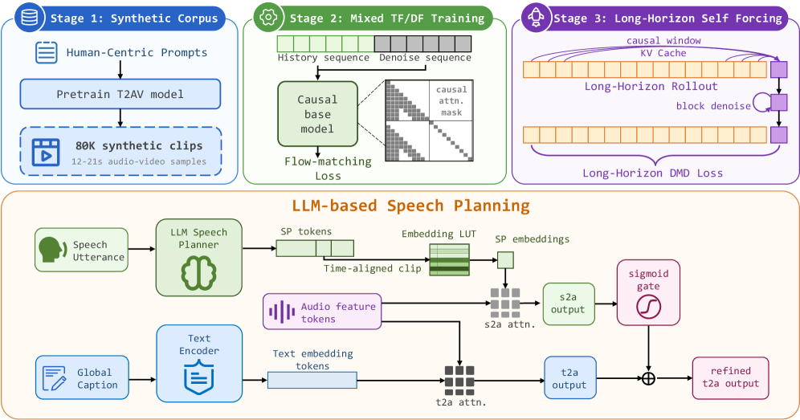
*Figure 2:Overview of Vorch-Streamer.*

![Figure 3:Long-horizon consistency as a function of generation time. The two panels show ArcFace similarity and CLIP Image similarity to the first frame of the same video. ArcFace measures facial-identity preservation, whereas CLIP Image measures broader appearance and scene preservation. Solid lines denote the mean across benchmark samples and shaded regions denote 95% confidence intervals. Curves terminate at the maximum duration completed by each method and are never extrapolated. VBench Dynamic Degree is reported separately in Table 2 to rule out artificially high similarity from static outputs.](../images/2026-08-07/2608.05663/2608.05663_fig2.png)
*Figure 3:Long-horizon consistency as a function of generation time. The two panels show ArcFace similarity and CLIP Image similarity to the first frame of the same video. ArcFace measures facial-identity preservation, whereas CLIP Image measures broader appearance and scene preservation. Solid lines denote the mean across benchmark samples and shaded regions denote 95% confidence intervals. Curves terminate at the maximum duration completed by each method and are never extrapolated. VBench Dynamic Degree is reported separately in Table 2 to rule out artificially high similarity from static outputs.*

![Figure 4:Qualitative comparison on two long-form T2AV prompts. We show frames near the beginning, middle, and end of each available rollout; OmniForcing and Hallo-Live are limited to 30 seconds and are therefore sampled at 1, 15, and 30 seconds. LiveAvatar and SoulX-FlashTalk are TIA2V references conditioned on Qwen3-TTS audio and an LTX2.3-generated first frame, whereas all other rows synthesize audio and video directly from text. Vorch-Streamer maintains coherent identity and scene structure throughout the full sequence while retaining visible facial and upper-body motion.](../images/2026-08-07/2608.05663/2608.05663_fig3.png)
*Figure 4:Qualitative comparison on two long-form T2AV prompts. We show frames near the beginning, middle, and end of each available rollout; OmniForcing and Hallo-Live are limited to 30 seconds and are therefore sampled at 1, 15, and 30 seconds. LiveAvatar and SoulX-FlashTalk are TIA2V references conditioned on Qwen3-TTS audio and an LTX2.3-generated first frame, whereas all other rows synthesize audio and video directly from text. Vorch-Streamer maintains coherent identity and scene structure throughout the full sequence while retaining visible facial and upper-body motion.*

---
**Usage Info**: 4488 tokens used.
**Generated at**: 2026-08-07 14:50:51

---

# 📚 EG-VAE: A Unified Framework for Electric Guitar Tone Transfer and Removal

🚀 URL: https://arxiv.org/html/2608.05513

## 🌏 Abstract (원문)
Electric guitar tone transfer (EGTT) and tone removal (EGTR) are two fundamental tasks in guitar tone modeling: EGTT replaces a recording’s tone with that of a reference, while EGTR recovers the dry direct-input (DI) signal from a wet, processed recording. Despite their highly related nature, prior work has addressed them independently, and both works have yet to achieve satisfactory results. In this paper, we propose EG-VAE, a unified framework that jointly models EGTT and EGTR by disentangling frame-level content and global tone representations from wet recordings with a variational autoencoder. EGTT is achieved by recombining a source’s content with a reference’s tone, while EGTR is attained by a novel tone masking objective that enforces content-tone disentanglement during training and realizes the removal procedure at inference. To improve transfer to tones unseen in training, a second training stage shapes a smooth tone space through variational sampling and audio-effects augmentation. Experimental results from both objective and subjective evaluations demonstrate that EG-VAE outperforms task-specific baselines on transfer and removal. Demos are available athttps://guitar-tone-demo.vercel.app/.
## 🌏 Abstract (번역)
전기 기타 톤 전송(EGTT)과 톤 제거(EGTR)는 기타 톤 모델링의 두 가지 기본적인 작업입니다. EGTT는 녹음된 소리의 톤을 참조 톤으로 대체하는 반면, EGTR은 처리된(wet) 녹음에서 건조한 직접 입력(DI) 신호를 복구합니다. 이 두 작업은 매우 밀접하게 관련되어 있음에도 불구하고, 이전 연구에서는 이들을 독립적으로 다루었으며, 두 작업 모두 아직 만족스러운 결과를 얻지 못했습니다. 본 논문에서는 변이형 오토인코더를 사용하여 처리된 녹음에서 프레임 수준의 콘텐츠와 전역 톤 표현을 분리함으로써 EGTT와 EGTR을 공동으로 모델링하는 통합 프레임워크인 EG-VAE를 제안합니다. EGTT는 소스의 콘텐츠를 참조 톤과 재결합하여 달성되며, EGTR은 훈련 중 콘텐츠-톤 분리를 강제하고 추론 시 제거 절차를 실현하는 새로운 톤 마스킹 목표를 통해 달성됩니다. 훈련에서 보지 못한 톤으로의 전송을 개선하기 위해, 두 번째 훈련 단계에서는 변이형 샘플링 및 오디오 효과 증강을 통해 부드러운 톤 공간을 형성합니다. 객관적 및 주관적 평가 모두에서 얻은 실험 결과는 EG-VAE가 전송 및 제거 작업에서 작업별 기준선보다 우수한 성능을 보임을 입증합니다. 데모는 https://guitar-tone-demo.vercel.app/에서 확인할 수 있습니다.

## 🔍 Methods & Results
- EG-VAE는 전기 기타 톤 전송(EGTT) 및 톤 제거(EGTR)를 위한 통합 프레임워크로 제안되었다.
- 변이형 오토인코더(VAE)를 사용하여 처리된 녹음에서 프레임 수준 콘텐츠와 전역 톤 표현을 분리함으로써 EGTT와 EGTR을 공동으로 모델링한다.
- EGTT는 소스의 콘텐츠와 참조 톤을 재결합하여 수행된다.
- EGTR은 훈련 중 콘텐츠-톤 분리를 강제하고 추론 시 톤 제거를 수행하는 새로운 톤 마스킹 목표를 통해 달성된다.
- 훈련에서 보지 못한 톤으로의 전송 성능을 향상시키기 위해, 변이형 샘플링 및 오디오 효과 증강을 통한 두 번째 훈련 단계로 부드러운 톤 공간을 형성한다.
- 객관적 및 주관적 평가 결과, EG-VAE는 전송 및 제거 작업 모두에서 기존의 작업별 기준선보다 우수한 성능을 보였다.

## 🖼 Figures

*Figure 1:The two tone-modeling tasks studied in this work. A dry direct-input (DI) signal is rendered into a wet recording by a chain of effects pedals and an amplifier (top, green). Tone removal (EGTR, red) recovers the dry signal from the wet recording, inverting the rendering process. Tone transfer (EGTT, blue) replaces the tone of the wet recording with that of another wet reference, preserving the played content.*

![Figure 2:Overview of EG-VAE. A shared encoder maps the input waveform to features 
𝐡
1
:
𝑇
′
, feeding a content extractor that produces a frame-level latent 
𝐳
1
:
𝑇
′
∼
𝒩
​
(
𝝁
𝑐
,
𝝈
𝑐
2
​
𝐈
)
 under an information bottleneck, and a tone extractor that produces a global tone embedding 
𝐬
∼
𝒩
​
(
𝝁
𝑠
,
𝝈
𝑠
2
​
𝐈
)
. The two are combined by conditional layer normalization (CLN) and decoded into the output. Dashed boxes are attribute-supervision heads; pvpGD perturbs 
𝐳
1
:
𝑇
′
 to prevent collapse of 
𝐬
. Tone masking overrides the CLN modulation (
𝜸
=
𝟏
,
𝜷
=
𝟎
) and realizes tone removal. Sampling and pvpGD are active only in stage 2.](../images/2026-08-07/2608.05513/2608.05513_fig1.png)
*Figure 2:Overview of EG-VAE. A shared encoder maps the input waveform to features 
𝐡
1
:
𝑇
′
, feeding a content extractor that produces a frame-level latent 
𝐳
1
:
𝑇
′
∼
𝒩
​
(
𝝁
𝑐
,
𝝈
𝑐
2
​
𝐈
)
 under an information bottleneck, and a tone extractor that produces a global tone embedding 
𝐬
∼
𝒩
​
(
𝝁
𝑠
,
𝝈
𝑠
2
​
𝐈
)
. The two are combined by conditional layer normalization (CLN) and decoded into the output. Dashed boxes are attribute-supervision heads; pvpGD perturbs 
𝐳
1
:
𝑇
′
 to prevent collapse of 
𝐬
. Tone masking overrides the CLN modulation (
𝜸
=
𝟏
,
𝜷
=
𝟎
) and realizes tone removal. Sampling and pvpGD are active only in stage 2.*

*Figure 3:Tone conditioning versus tone masking, sharing the same CLN operation 
𝜸
​
(
𝐬
)
⊙
LN
​
(
𝐳
1
:
𝑇
′
)
+
𝜷
​
(
𝐬
)
. Conditioning produces 
𝜸
​
(
𝐬
)
,
𝜷
​
(
𝐬
)
 from the tone embedding, yielding a wet output; masking overrides them to 
𝜸
=
𝟏
,
𝜷
=
𝟎
, leaving the content unmodulated and yielding the dry DI signal. Tone removal is thus the masked decoding path.*

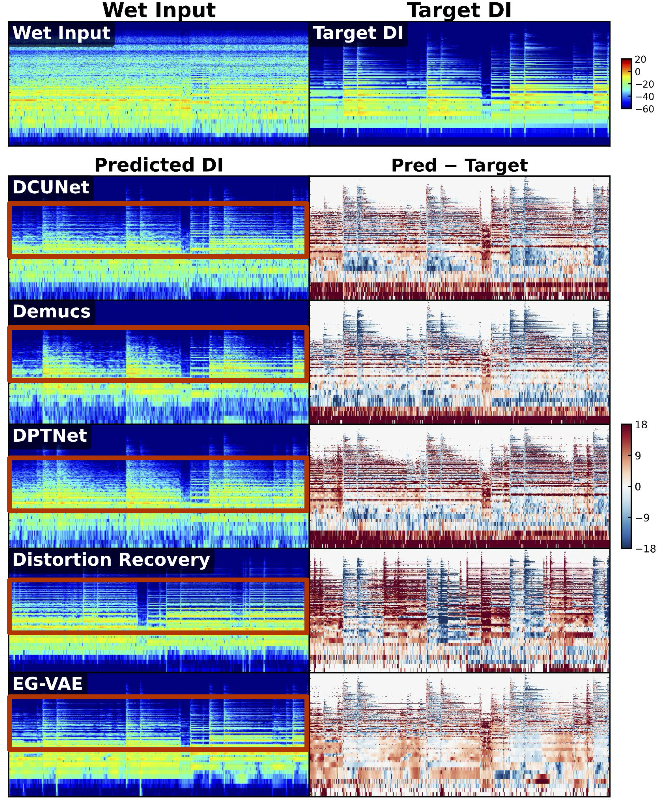
*Figure 4:Tone removal on a representative distortion-heavy tone. Top: wet input and target DI. For each method: predicted DI (left, log-magnitude dB) and the residual between prediction and target.*

*Figure 5:t-SNE visualization of the tone embedding 
𝐬
, colored by preset, for (a) seen tones and (b) unseen tones.*

---
**Usage Info**: 1554 tokens used.
**Generated at**: 2026-08-07 14:50:59

---

# 📚 Audio-to-Score Transcription using Pre-trained Features, Data Augmentation, and the New SheetSage-A2S Dataset

🚀 URL: https://arxiv.org/html/2608.06165

## 🌏 Abstract (원문)
Existing audio-to-score (A2S) systems primarily focus on classical music, and the application to popular music remains underexplored. This paper first presents the new SheetSage-A2S Dataset, which includes 61 hours of audio with**kernscore encodings for 9,468 clips originating from 6,066 unique songs, the first of its kind to facilitate A2S research for popular music. Additionally, we improve on existing A2S approaches by using data augmentation and MuQ, a pretrained feature-extraction model for music audio, to enhance generalisation abilities and extract meaningful audio features. Results show that the proposed A2S model achieves 4.98% symbol error rate (SER) on the Quartets collection for classical music, which significantly outperforms the 15.3% SER from the existing state-of-the-art(Alfaro-Contreraset al.,2024). Additionally, our model achieves 20.92% SER on the SheetSage-A2S dataset for popular music, serving as a strong benchmark for future research. The dataset, model, and code are made publicly available at:https://github.com/Multimodal-Music-Research-Lab/SheetSage2Kern_model.
## 🌏 Abstract (번역)
기존의 오디오-악보(A2S) 시스템은 주로 클래식 음악에 초점을 맞추고 있으며, 대중음악에 대한 적용은 아직 충분히 탐구되지 않았습니다. 본 논문은 대중음악 A2S 연구를 촉진하는 최초의 데이터셋인 새로운 SheetSage-A2S 데이터셋을 소개합니다. 이 데이터셋은 6,066개의 고유한 곡에서 파생된 9,468개의 클립에 대한 61시간 분량의 오디오와 **kernscore 인코딩을 포함합니다. 또한, 우리는 일반화 능력을 향상시키고 의미 있는 오디오 특징을 추출하기 위해 데이터 증강과 음악 오디오를 위한 사전 학습된 특징 추출 모델인 MuQ를 사용하여 기존 A2S 접근 방식을 개선했습니다. 결과에 따르면 제안된 A2S 모델은 클래식 음악을 위한 Quartets 컬렉션에서 4.98%의 기호 오류율(SER)을 달성하여 기존 최첨단 모델(Alfaro-Contreras et al., 2024)의 15.3% SER을 크게 능가합니다. 또한, 우리 모델은 대중음악을 위한 SheetSage-A2S 데이터셋에서 20.92%의 SER을 달성하여 향후 연구를 위한 강력한 벤치마크 역할을 합니다. 데이터셋, 모델 및 코드는 https://github.com/Multimodal-Music-Research-Lab/SheetSage2Kern_model 에서 공개적으로 이용 가능합니다.

## 🔍 Methods & Results
- 새로운 SheetSage-A2S 데이터셋을 구축하여 6,066개의 고유한 대중음악 곡에서 파생된 9,468개 클립에 대한 61시간 분량의 오디오와 **kernscore 인코딩을 제공했습니다.
- 기존 A2S 모델(Alfaro-Contreras et al., 2024)을 기반으로 CNN 인코더와 Transformer 디코더 아키텍처를 사용했습니다.
- 제안된 A2S 모델은 Transformer 디코더의 피드포워드 차원을 256에서 1024로 확장하고, 훈련 안정성을 위해 정규화 순서를 post-norm에서 pre-norm으로 변경했습니다 (1024-PreNorm baseline).
- 오디오 파일에서 특징을 추출하기 위해 기존 CNN 인코더를 사전 학습된 MuQ 모델로 대체하여 데이터 부족 문제를 완화했습니다. MuQ는 고정된 상태로 사용되며, 최종 레이어의 은닉 상태 시퀀스를 출력으로 사용하고 선형 투영 및 LayerNorm을 통해 임베딩 크기를 1024에서 256으로 줄였습니다.
- MuQ가 1차원 시퀀스를 출력하므로 1차원 사인파 위치 인코딩을 사용했으며, MuQ는 기존 CNN 인코더의 초당 약 5.38개에 비해 초당 약 25개의 특징 벡터를 출력합니다.
- 훈련 데이터의 양을 늘리고 견고성을 향상시키기 위해 오프라인 데이터 증강을 적용했습니다. 여기에는 피치 시프팅(±1, ±2, ±3 반음)과 시간 스트레칭(0.9, 0.95, 1.05, 1.1 배율)이 포함됩니다.
- 각 훈련 쌍에 대해 6가지 피치 시프트 변형을 생성하고, 각 변형에 대해 독립적으로 시간 스트레칭을 샘플링하여 훈련 세트를 7배 확장했습니다.
- 제안된 A2S 모델은 클래식 음악 Quartets 컬렉션에서 4.98%의 기호 오류율(SER)을 달성하여 기존 최첨단 모델(15.3% SER)을 크게 능가했습니다.
- 대중음악 SheetSage-A2S 데이터셋에서 20.92%의 SER을 달성하여 향후 연구를 위한 강력한 벤치마크를 제공했습니다.

## 🖼 Figures

*Figure 1.Illustration of the two main ways to generate symbolic music scores: (top) modular approach based on a traditional, note-level AMT model that typically outputs symbolic representations such as MIDI or piano-roll; (bottom) A2S approach that directly generates score symbols based on the input audio file.*

*Figure 2.Overview of the SheetSage-A2S dataset creation pipeline, with three main steps that are introduced in detail at section 2. The confidence score 
𝐶
 measures how well a potential octave and starting beat align with RMVPE’s (Wei et al., 2023) vocal pitch estimates. The process of Json2Kern is further illustrated in Figure 3.*

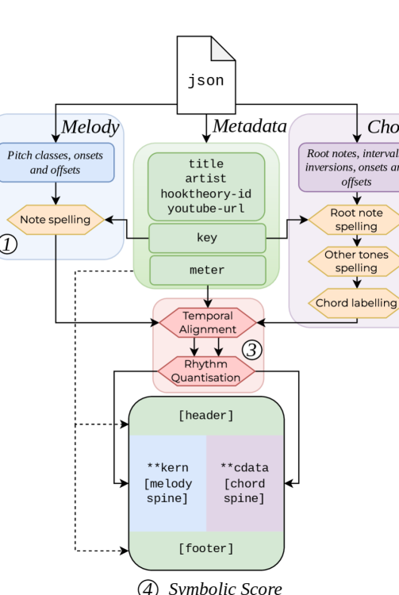
*Figure 3.Summary of the json to **kern conversion pipeline. Numbers denote the four main processing steps described in Section 2.3.*

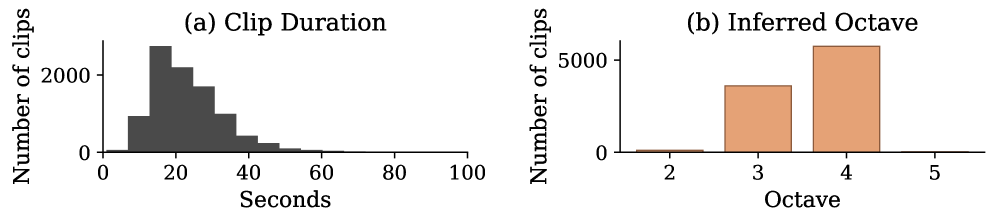
*Figure 4.SheetSage-A2S dataset statistics. (a) Clip duration, truncated at 100 seconds; (b) Inferred absolute octave.*

![Figure 5.Comparison of our proposed architecture against the baseline of (Alfaro-Contreras et al., 2024). Both models use an autoregressive Transformer decoder to generate **kern score symbols. We replace the CNN encoder from the baseline with MuQ (Zhu et al., 2025), a pre-trained model to extract audio features, followed by a linear projection and LayerNorm to map MuQ’s embedding dimension from 1024 to 256. We also increase the decoder feedforward dimension from 256 to 1024, and change its normalisation order from post-norm to pre-norm.](../images/2026-08-07/2608.06165/2608.06165_fig4.png)
*Figure 5.Comparison of our proposed architecture against the baseline of (Alfaro-Contreras et al., 2024). Both models use an autoregressive Transformer decoder to generate **kern score symbols. We replace the CNN encoder from the baseline with MuQ (Zhu et al., 2025), a pre-trained model to extract audio features, followed by a linear projection and LayerNorm to map MuQ’s embedding dimension from 1024 to 256. We also increase the decoder feedforward dimension from 256 to 1024, and change its normalisation order from post-norm to pre-norm.*

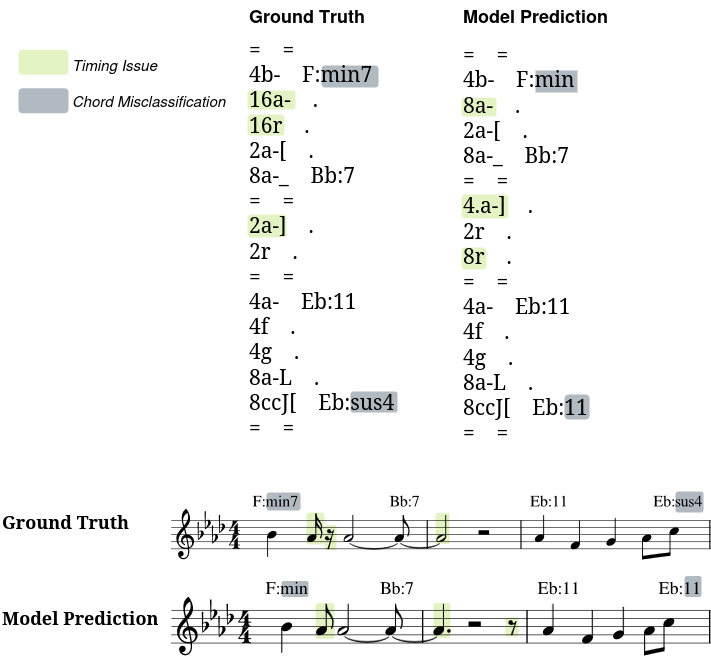
*Figure 6.Measures 5 to 7 from Love Live - Bokutachi wa Hitotsu no Hikari.12 It demonstrates that our best model can have trouble determining exact note-rest boundaries and non-triad chord labels.*

---
**Usage Info**: 3337 tokens used.
**Generated at**: 2026-08-07 14:51:09

---

# 📚 Energy-Guided Flow Matching

🚀 URL: https://arxiv.org/html/2608.05811

## 🌏 Abstract (원문)
Pixel-space generative models bypass lossy latent compression, yet necessitate joint learning of global structure and fine-grained details in a high-dimensional space. Standard flow matching interpolates noise toward a fixed clean-image endpoint, leaving the spectral evolution to be learned implicitly. In this paper, we introduce Energy-Guided Flow Matching (EG-FM) that explicitly models a coarse-to-fine generative trajectory by moving endpoint. Specifically, EG-FM replaces the fixed endpoint with a heat-kernel-filtered endpoint that evolves smoothly from low-frequency image to clean image. The fraction of high-frequency signal in moving endpoint is released by an image-specific energy-guided scheduling, leading to the re-targeting of velocity in flow matching. Our framework requires no adaptation of the backbone and training data, bringing negligible cost on the training and inference stages. In our experiment, EG-FM consistently achieves lower FID on the ImageNet class-conditional image generation task at 256×256 with fewer epochs, reaching an FID of 1.55 at 200 epochs and 1.45 at 600 epochs. We continue training the generation task on the setting of 512×512 resolution, yielding a FID of 1.58 after only 40 high-resolution adaptation epochs. Furthermore, we transfer EG-FM on text-to-image generation and achieve 0.85 on GenEval score and 83.9 on DPG-Bench. Code is available at https://github.com/ysng123/EG-FM.
## 🌏 Abstract (번역)
픽셀 공간 생성 모델은 손실이 있는 잠재 압축을 우회하지만, 고차원 공간에서 전역 구조와 미세한 세부 사항을 공동으로 학습해야 합니다. 표준 플로우 매칭은 고정된 깨끗한 이미지 종착점으로 노이즈를 보간하여 스펙트럼 진화를 암묵적으로 학습하게 합니다. 본 논문에서는 이동하는 종착점을 통해 거친 것에서 미세한 것으로의 생성 궤적을 명시적으로 모델링하는 에너지 유도 플로우 매칭(EG-FM)을 소개합니다. 구체적으로, EG-FM은 고정된 종착점을 저주파 이미지에서 깨끗한 이미지로 부드럽게 진화하는 열 커널 필터링된 종착점으로 대체합니다. 이동하는 종착점의 고주파 신호 비율은 이미지별 에너지 유도 스케줄링에 의해 방출되어 플로우 매칭에서 속도 재조정을 이끌어냅니다. 우리의 프레임워크는 백본 및 훈련 데이터의 적응이 필요 없으며, 훈련 및 추론 단계에서 무시할 수 있는 비용을 발생시킵니다. 실험에서 EG-FM은 256x256 해상도의 ImageNet 클래스 조건부 이미지 생성 작업에서 더 적은 에포크로 일관되게 더 낮은 FID를 달성했으며, 200 에포크에서 1.55, 600 에포크에서 1.45의 FID를 기록했습니다. 우리는 512x512 해상도 설정에서 생성 작업을 계속 훈련하여 단 40번의 고해상도 적응 에포크 후에 1.58의 FID를 얻었습니다. 또한, 우리는 EG-FM을 텍스트-이미지 생성에 전이하여 GenEval 점수 0.85 및 DPG-Bench 83.9를 달성했습니다. 코드는 https://github.com/ysng123/EG-FM에서 이용 가능합니다.

## 🔍 Methods & Results
- Energy-Guided Flow Matching (EG-FM) 프레임워크를 제안하여, 거친 것에서 미세한 것으로의 생성 궤적을 명시적으로 모델링하기 위해 고정된 종착점 대신 저주파 이미지에서 깨끗한 이미지로 부드럽게 진화하는 '열 커널 필터링된 이동 종착점'을 사용합니다.
- 표준 플로우 매칭의 고정된 종착점을 `y_t(x)`로 대체하여, `y_t(x)`가 저주파 이미지에서 전체 스펙트럼 이미지로 진화하도록 설계함으로써 고주파 신호를 점진적으로 방출하여 점차 선명해지는 종착점을 생성합니다.
- 부드럽고 중첩된 저주파 이미지 계열을 생성하기 위해 열 커널 응답을 사용하며, 이미지의 스펙트럼 특성에 따라 적응하는 이미지별 단조 감소 함수인 `h(x,t)`(열 시간)를 도입하여 주파수 구성 요소의 방출을 제어합니다.
- `h(x,t)`는 `y_t(x)`와 원본 이미지 `x` 사이의 고주파 정보 부족(정보 격차 `G_x(h)`)을 기반으로 파생되며, 전역 방출 클럭 `q(t)`를 사용하여 모든 이미지에서 동일한 시간 `t`에 유사한 주파수 방출 진행이 이루어지도록 정렬합니다.
- 종착점의 움직임을 고려하여 새로운 목표 속도 `v_t = (y_t(x) - epsilon) + t * partial_t y_t(x)`를 유도했으며, 이 속도 필드는 기본 전송 속도와 종착점 자체의 움직임 기여를 결합합니다.
- EG-FM은 백본 및 훈련 데이터의 적응이 필요 없어 훈련 및 추론 단계에서 무시할 수 있는 비용을 발생시킵니다.
- ImageNet 256x256 클래스 조건부 이미지 생성에서 더 적은 에포크로 낮은 FID를 달성했습니다 (200 에포크에서 1.55, 600 에포크에서 1.45).
- ImageNet 512x512 해상도에서 40번의 고해상도 적응 에포크 후 FID 1.58을 달성했습니다.
- 텍스트-이미지 생성으로 전이하여 GenEval 점수 0.85, DPG-Bench 83.9를 달성했습니다.

## 🖼 Figures

*Figure 1:Comparison of baselines and Energy-Guided Flow Matching (EG-FM). Marker size increases as checkpoints approach the desirable lower-left region, representing fewer training epochs and lower FID. Based on backbones of PixelDiT and DeCo, the EG-FM variants achieve improved FID performance with significant fewer training epochs.*

![Figure 2:Overview of Energy-Guided Flow Matching. Starting from a clean image, we construct a low-frequency endpoint and measure the residual spectral gap 
𝒢
~
𝑥
. Based on the global release clock 
𝑞
​
(
𝑡
)
, we derive a sample-adaptive heat time 
ℎ
​
(
𝑥
,
𝑡
)
 that controls the heat-kernel response 
𝑅
​
(
ℎ
,
𝜌
)
, enabling the progressive recovery of frequency components from low to high. For the training trajectory, the moving spectral endpoints 
𝑦
𝑡
​
(
𝑥
)
 evolve from a easily predicted low-pass manifold toward the full-image manifold, forming a coarse-to-fine curved path 
𝑧
𝑡
. The velocity 
𝑦
𝑡
​
(
𝑥
0
)
−
𝜖
 toward the current endpoint and the endpoint-motion term 
𝑡
​
∂
𝑡
𝑦
𝑡
​
(
𝑥
0
)
 together form the target velocity 
𝑣
𝑡
.](../images/2026-08-07/2608.05811/2608.05811_fig1.png)
*Figure 2:Overview of Energy-Guided Flow Matching. Starting from a clean image, we construct a low-frequency endpoint and measure the residual spectral gap 
𝒢
~
𝑥
. Based on the global release clock 
𝑞
​
(
𝑡
)
, we derive a sample-adaptive heat time 
ℎ
​
(
𝑥
,
𝑡
)
 that controls the heat-kernel response 
𝑅
​
(
ℎ
,
𝜌
)
, enabling the progressive recovery of frequency components from low to high. For the training trajectory, the moving spectral endpoints 
𝑦
𝑡
​
(
𝑥
)
 evolve from a easily predicted low-pass manifold toward the full-image manifold, forming a coarse-to-fine curved path 
𝑧
𝑡
. The velocity 
𝑦
𝑡
​
(
𝑥
0
)
−
𝜖
 toward the current endpoint and the endpoint-motion term 
𝑡
​
∂
𝑡
𝑦
𝑡
​
(
𝑥
0
)
 together form the target velocity 
𝑣
𝑡
.*

*Figure 3:Visualization of sample-adaptive heat-time. Under the same release clock, texture-rich Sample A requires a faster decrease in heat time than Sample B. Lower heat time indicates weaker attenuation and greater frequency release; the dashed curve denotes mean heat-time over ImageNet.*

*Figure 4:Qualitative results produced by PixelDiT-XL with EG-FM. From left to right, the panels show ImageNet class-conditional samples at 
512
×
512
 and 
256
×
256
, followed by text-to-image samples at 
512
×
512
.*

*Figure 5:Initial-endpoint sensitivity after 80 epochs. The left curve highlights the nonzero practical range; the right table reports full sweep, 
𝜎
0
=
3.5
 gives the best FID.*

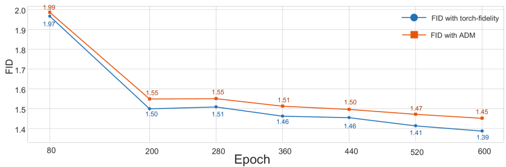
*Figure 9:FID across training checkpoints computed with torch-fidelity and the ADM evaluation suite. The two implementations show closely aligned convergence trends from 80 to 600 epochs.*

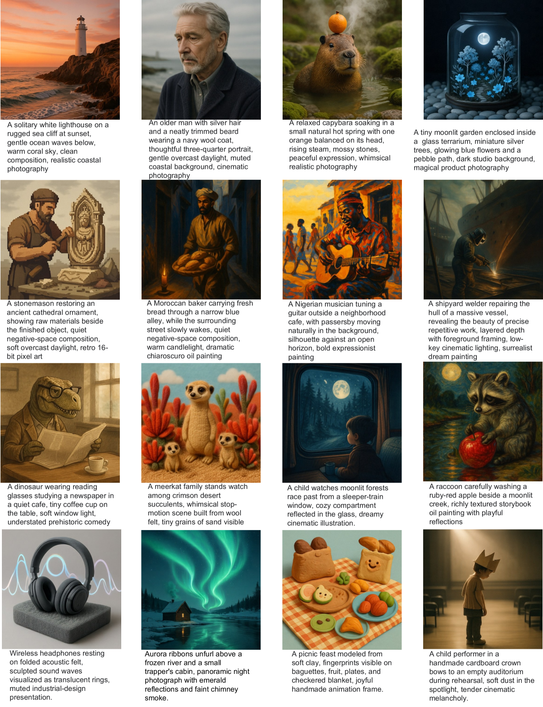
*Figure 14*

*Figure 10:Additional text-to-image samples generated by EG-FM-T2I at 
512
×
512
, spanning architectural scenes, weather, interiors, animals, and human-centered compositions.*

---
**Usage Info**: 7429 tokens used.
**Generated at**: 2026-08-07 14:51:28

---

# 📚 LILAC: An Idempotent Neural Speech Codec

🚀 URL: https://arxiv.org/html/2608.05727

## 🌏 Abstract (원문)
Neural Audio Codecs are widely adopted in speech generation and editing. However, existing neural audio codecs are not idempotent: across the paper’s twelve baseline systems, every configuration tested rewrites, on average, at least15%15\text{\,}\%of its tokens in a single decode–re-encode pass. This poses a problem for utilizing Neural Audio Codecs as token interfaces in pipelines where re-encoding decoded outputs can occur. We present LILAC, a fully convolutional24kHz/24\text{\,}\mathrm{kHz}\text{/}speech codec at9.375Hz/9.375\text{\,}\mathrm{Hz}\text{/}and0.75kbit/s0.75\text{\,}\mathrm{kbit}\text{/}\mathrm{s}that is codec idempotent by construction; re-encoding the decoded audio of any valid token stream returns the identical stream. LILAC achieves idempotency while maintaining competitive quality, reaching UTMOS 4.14 and 4.24 on LibriSpeech and LibriTTS-R test sets, comparable to SOTA sub-1kbit/s1\text{\,}\mathrm{kbit}\text{/}\mathrm{s}Neural Audio Codecs.
## 🌏 Abstract (번역)
신경 오디오 코덱은 음성 생성 및 편집에 널리 사용됩니다. 그러나 기존 신경 오디오 코덱은 멱등적이지 않습니다. 본 논문의 12개 기준 시스템 전반에 걸쳐, 테스트된 모든 구성은 단일 디코딩-재인코딩 과정에서 평균적으로 토큰의 최소 15%를 다시 작성합니다. 이는 디코딩된 출력을 재인코딩할 수 있는 파이프라인에서 신경 오디오 코덱을 토큰 인터페이스로 활용하는 데 문제를 제기합니다. 우리는 구성상 코덱 멱등적인 완전 컨볼루션 방식의 24kHz 음성 코덱인 LILAC을 제시합니다. LILAC은 9.375Hz 및 0.75kbit/s에서 작동하며, 유효한 토큰 스트림의 디코딩된 오디오를 재인코딩하면 동일한 스트림을 반환합니다. LILAC은 경쟁력 있는 품질을 유지하면서 멱등성을 달성하며, LibriSpeech 및 LibriTTS-R 테스트 세트에서 UTMOS 4.14 및 4.24에 도달하여 SOTA 1kbit/s 미만 신경 오디오 코덱과 비교할 만한 수준입니다.

## 🔍 Methods & Results
- LILAC은 멱등성을 달성하기 위해 가역 분석 변환(invertible analysis transform)과 버려진 좌표를 예측하는 채우기(fill) 모듈로 구성되며, 두 모듈 모두 완전 컨볼루션 방식입니다.
- 분석 변환은 가역 1x1 컨볼루션과 덧셈 결합 블록(Additive Coupling Block)으로 이루어져 있으며, 덧셈 결합 블록은 입력 x를 x1, x2로 분할하고 f, g 함수(ConvNext1D 블록 사용)를 통해 y1, y2를 생성하여 가역성을 보장합니다.
- 오디오 신호는 [1,T]에서 [5,T/5] 텐서로 재구성된 후, 가역 1x1 컨볼루션과 특수 아핀 덧셈 결합 블록으로 구성된 Stem 단계를 거쳐 다상 아티팩트를 완화합니다.
- 4단계의 스퀴즈-앤-믹(squeeze-and-mix) 과정을 통해 5개 채널을 80개로 확장하고, 이후 단계에서는 시간을 절반으로 줄이면서 채널의 일부(80, 80, 80, 80, 140개)를 버려 [20, T/2560] 텐서를 생성합니다.
- 각 채널에 4비트를 할당하여 프레임당 80비트를 사용하며, 24kHz 오디오, 2560 홉 길이 기준으로 9.375Hz의 프레임 속도와 0.75kbit/s의 비트레이트를 달성합니다.
- 디코딩 시에는 분석 변환을 역으로 실행하며, 컨볼루션 코드-컨텍스트 네트워크와 컨텍스트 래더를 사용하여 버려진 좌표를 재구성하고 재구성을 위한 컨텍스트를 제공합니다.
- 훈련에는 다중 해상도 멜 손실, STFT 손실, 적대적 힌지 손실, 특징 매칭 손실이 사용되며, 5000단계 웜업 후 적대적 및 특징 매칭 항이 활성화됩니다.
- LILAC은 LibriSpeech에서 UTMOS 4.14, LibriTTS-R에서 UTMOS 4.24를 달성하여 1kbit/s 미만 SOTA 신경 오디오 코덱과 유사한 경쟁력 있는 품질을 유지하면서 멱등성을 입증했습니다.

## 🖼 Figures

*Figure 1:Iterated re-encoding on 100 reader-balanced LibriSpeech test-clean clips: token agreement with the first encoding, UTMOS, and Whisper dWER over 
𝑁
=
1
–
100
 cycles. Parenthesized rates in kb/s.*

*Figure 2:LILAC’s encoder (top), shared-weight inverse (middle), and decoder-only fill networks (bottom). Projection stages transmit the retained coordinates and discard the rest; the decoder predicts the discarded blocks before inversion. Re-encoding recovers 
𝑧
𝑞
 and drops those predictions, closing the exact red loop for any fill. The flagship uses 
𝐶
=
20
,
𝑑
=
7
.*

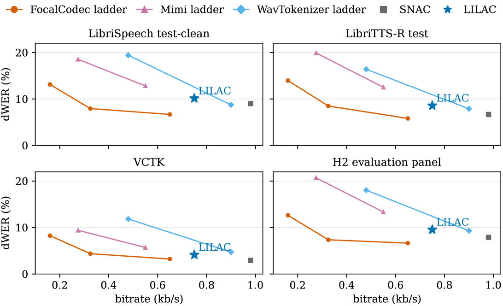
*Figure 3:dWER versus released bitrate for the sub-1 kb/s panel; lines connect operating points from the same checkpoint family.*

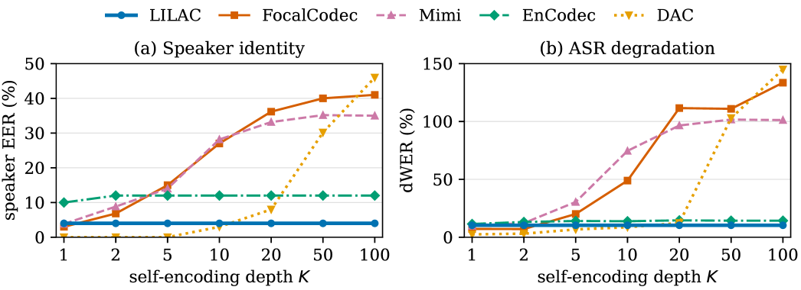
*Figure 4:Speaker EER and dWER after each codec self-encodes its own output.*

---
**Usage Info**: 4701 tokens used.
**Generated at**: 2026-08-07 14:51:44

---

# 📚 Vorch-Omni: Multi-Task Orchestration of Sight and Sound

🚀 URL: https://arxiv.org/html/2608.05803

## 🌏 Abstract (원문)
Recent advances in generative video modeling have enabled diverse generation, reference-based synthesis, extension, and editing capabilities, but many remain fragmented across task-specific models and pipelines. A shared model must disambiguate heterogeneous target, source, and reference signals—deciding what to generate, preserve, or use as guidance—while limiting interference among task objectives. Meanwhile, joint audio-visual generation further expands the space of conditioning and output configurations and introduces heterogeneous roles across modalities. We presentVorch-Omni, a unified multi-task framework for joint audio-visual synthesis. At its core is anarbitrary-condition-to-arbitrary-outputformulation that flexibly assigns video and audio signals as either clean conditioning tokens or noisy generation targets. Token-level conditioning masks and task identifiers explicitly distinguish generation targets, source content, and heterogeneous references, while position types separate temporally contiguous context from independent conditions. To capture both high-level semantic intent and fine-grained visual structure, we employ complementary visual conditioning paths: a vision-language model jointly interprets sampled condition frames and text instructions, while a video VAE encodes the conditions into clean latent tokens for direct structural guidance. To support this broad task space, we build a distributed data pipeline that curates diverse, temporally aligned audio-visual clips, produces structured video captions and audio metadata, and packs the same versioned corpus into task-ready configurations; weighted sampling further balances their heterogeneous distributions. Built upon a single flow-matching diffusion transformer, the resulting model supports more than 10 tasks without task-specific architectural modifications, including text-to-video, text-to-audio-video, image- and reference-conditioned synthesis, temporal extension, audio-driven generation, video transformation, and unimodal or audio-visual editing. This unified formulation provides a scalable foundation for general-purpose generation and manipulation across diverse audio-visual conditions and outputs. The project page is available athttps://vorch-project.github.io/Vorch-Omni-project/.
## 🌏 Abstract (번역)
생성형 비디오 모델링의 최근 발전은 다양한 생성, 참조 기반 합성, 확장 및 편집 기능을 가능하게 했지만, 많은 기능이 작업별 모델 및 파이프라인에 걸쳐 파편화되어 있습니다. 공유 모델은 이질적인 목표, 소스 및 참조 신호를 명확히 구분해야 합니다. 즉, 무엇을 생성하고, 보존하며, 지침으로 사용할지 결정해야 하며, 동시에 작업 목표 간의 간섭을 제한해야 합니다. 한편, 오디오-비주얼 공동 생성은 조건화 및 출력 구성의 공간을 더욱 확장하고 모달리티 전반에 걸쳐 이질적인 역할을 도입합니다. 우리는 오디오-비주얼 공동 합성을 위한 통합 다중 작업 프레임워크인 Vorch-Omni를 제시합니다. 그 핵심은 비디오 및 오디오 신호를 깨끗한 조건화 토큰 또는 노이즈가 있는 생성 목표로 유연하게 할당하는 '임의 조건-임의 출력' 공식입니다. 토큰 수준 조건화 마스크와 작업 식별자는 생성 목표, 소스 콘텐츠 및 이질적인 참조를 명시적으로 구분하며, 위치 유형은 시간적으로 연속적인 컨텍스트를 독립적인 조건과 분리합니다. 높은 수준의 의미론적 의도와 미세한 시각적 구조를 모두 포착하기 위해 우리는 보완적인 시각적 조건화 경로를 사용합니다. 비전-언어 모델은 샘플링된 조건 프레임과 텍스트 지침을 공동으로 해석하고, 비디오 VAE는 조건을 깨끗한 잠재 토큰으로 인코딩하여 직접적인 구조적 지침을 제공합니다. 이 광범위한 작업 공간을 지원하기 위해 우리는 다양하고 시간적으로 정렬된 오디오-비주얼 클립을 큐레이션하고, 구조화된 비디오 캡션 및 오디오 메타데이터를 생성하며, 동일한 버전의 코퍼스를 작업 준비 구성으로 패키징하는 분산 데이터 파이프라인을 구축합니다. 가중치 샘플링은 이질적인 분포의 균형을 더욱 맞춥니다. 단일 플로우 매칭 확산 트랜스포머를 기반으로 구축된 결과 모델은 텍스트-투-비디오, 텍스트-투-오디오-비디오, 이미지 및 참조 조건부 합성, 시간 확장, 오디오 기반 생성, 비디오 변환, 단일 모달 또는 오디오-비주얼 편집을 포함하여 작업별 아키텍처 수정 없이 10개 이상의 작업을 지원합니다. 이 통합 공식은 다양한 오디오-비주얼 조건 및 출력 전반에 걸쳐 범용 생성 및 조작을 위한 확장 가능한 기반을 제공합니다. 프로젝트 페이지는 https://vorch-project.github.io/Vorch-Omni-project/에서 확인할 수 있습니다.

## 🔍 Methods & Results
- Vorch-Omni는 단일 모델이 가변적인 수의 비디오 및 오디오 신호를 받아들이고, 각 신호에 작업 종속적인 역할을 할당하며, 두 모달리티를 모두 또는 하나만 생성할 수 있도록 하는 통합 다중 작업 프레임워크입니다.
- 프레임워크의 핵심 설계는 작업 사양(TaskConfig(xv, cv, xa, ca)로 표현)을 백본 계산과 분리하는 것입니다. 여기서 'x'는 생성될 노이즈가 있는 목표 신호이고 'c'는 관찰된 깨끗한 조건화 신호입니다.
- 플로우 매칭(flow matching) 기법을 사용하여 노이즈 제거를 수행하며, 비디오와 오디오 스트림 모두에 대해 하나의 노이즈 레벨(σ)을 샘플링하고 재사용하여 일치하는 노이즈 제거 난이도를 제공합니다.
- 모든 생성 및 관찰된 미디어는 모달리티별 잠재 공간(비디오 VAE, 오디오 VAE)으로 표현되며, 조건과 목표는 공통 잠재 공간을 공유합니다.
- 시각적 조건화를 위해 두 가지 보완적인 경로를 사용합니다: 1) 비전-언어 모델(VLM)은 샘플링된 조건 프레임과 텍스트 지침을 공동으로 해석하여 고수준의 의미론적 컨텍스트를 제공합니다. 2) 비디오 VAE는 조건을 깨끗한 잠재 토큰으로 인코딩하여 직접적인 구조적 지침을 제공합니다.
- 토큰 수준 조건화 마스크(miq)는 관찰된 조건(miq=1, τiq=0)과 생성 목표(miq=0, τiq=σ)를 명시적으로 구분하여 트랜스포머가 어떤 토큰을 고정하고 어떤 토큰을 노이즈 제거해야 하는지 알 수 있도록 합니다.
- 각 토큰에는 작업 식별자(riq)가 연결되어 의미론적 역할(예: 주체, 프레임, 오디오, 편집, 변환, 애니메이션, 카메라 참조)을 지정하며, 이는 모달리티별 학습된 임베딩으로 추가됩니다.
- 위치 유형(p)은 시간적 관계를 정의합니다: -1(독립 참조), 0(목표 이전 컨텍스트), 1(목표 간격), 2(목표 이후 컨텍스트). 이는 시각적 또는 음향적으로 유사한 신호가 네트워크 변경 없이 다르게 사용될 수 있도록 합니다.
- 단일 플로우 매칭 확산 트랜스포머(LTX-2.3 오디오-비디오 백본)를 기반으로 구축되었으며, 48개의 트랜스포머 블록과 비디오(32개 헤드, 128차원) 및 오디오(32개 헤드, 64차원) 스트림에 대한 비대칭 용량 할당을 특징으로 합니다.
- 각 블록은 비디오 및 오디오 자체 어텐션, 텍스트에 대한 교차 어텐션, 그리고 두 모달리티 간의 게이트된 교차 어텐션(오디오-투-비디오, 비디오-투-오디오)을 순차적으로 실행하여 양방향 오디오-비디오 노이즈 제거를 가능하게 합니다.
- 손실은 목표 토큰에 대해서만 평가되며, 각 모달리티 손실은 목표 토큰의 비율로 정규화됩니다. 모든 작업군은 이 목표를 공유하며 가중치 다중 작업 샘플링을 통해 데이터 로더 수준에서 균형을 이룹니다.
- 추론 시, 요청된 작업은 동일한 4개 리스트 작업 구성으로 변환되고, 사용 가능한 미디어는 VAE 인코딩되어 깨끗한 조건 토큰으로 삽입되며, 목표 슬롯은 가우시안 노이즈로 초기화됩니다. 플로우 ODE는 노이즈에서 데이터로 통합되고, 생성된 잠재 변수는 VAE 및 보코더를 통해 디코딩됩니다.
- 이 모델은 텍스트-투-비디오, 텍스트-투-오디오-비디오, 이미지 및 참조 조건부 합성, 시간 확장, 오디오 기반 생성, 비디오 변환, 단일 모달 또는 오디오-비주얼 편집을 포함하여 작업별 아키텍처 수정 없이 10개 이상의 작업을 지원합니다.

## 🖼 Figures

*Figure 2:Overview of Vorch-Omni. Diverse audio and video signals are expressed by an arbitrary-condition-to-arbitrary-output task configuration, with token-level conditioning masks, task identifiers, and position types specifying what to generate, preserve, or reference and how each condition relates temporally to the target. Visual conditions follow complementary VLM-semantic and VAE-latent paths, while audio and video latents are jointly denoised by the asymmetric dual-stream backbone.*

*Figure 4:GSB comparison of overall and per-dimension quality. Each bar is a 
100
%
-stacked distribution of Good (ours preferred), Same (comparable), and Bad (Wan 2.7 preferred) judgments. The value to the right reports the net win rate. Most judgments are ties; ours obtains positive net win rates on Audio Prompt Following, Audio Quality, Audio-Visual Synchronization, and Reference Alignment.*

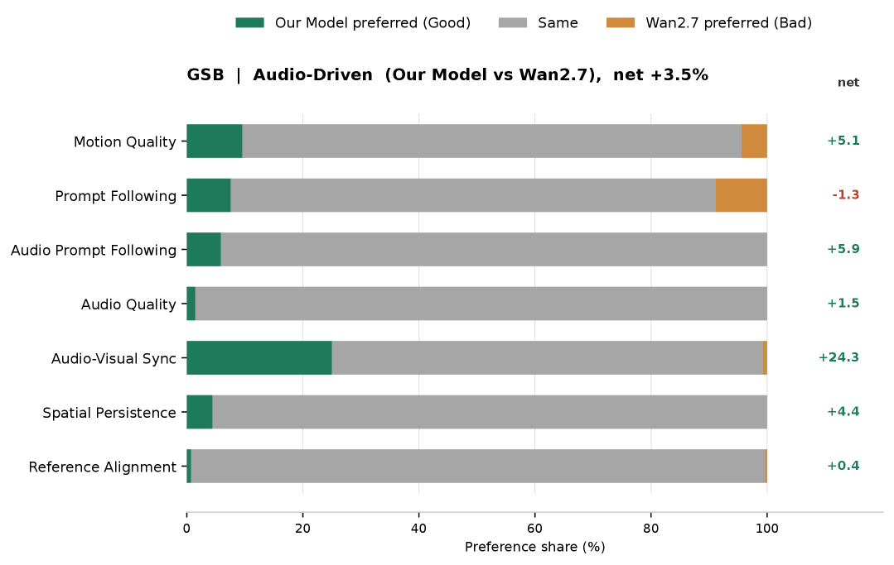
*(a)Audio-Driven*

*(a)Audio-Driven*

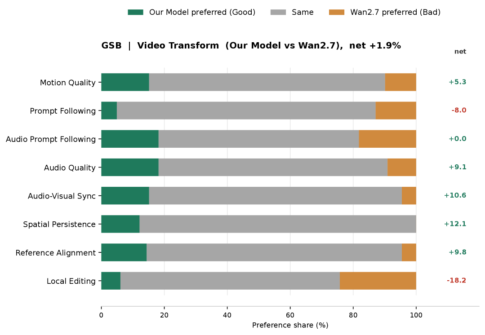
*(b)Video Transform*

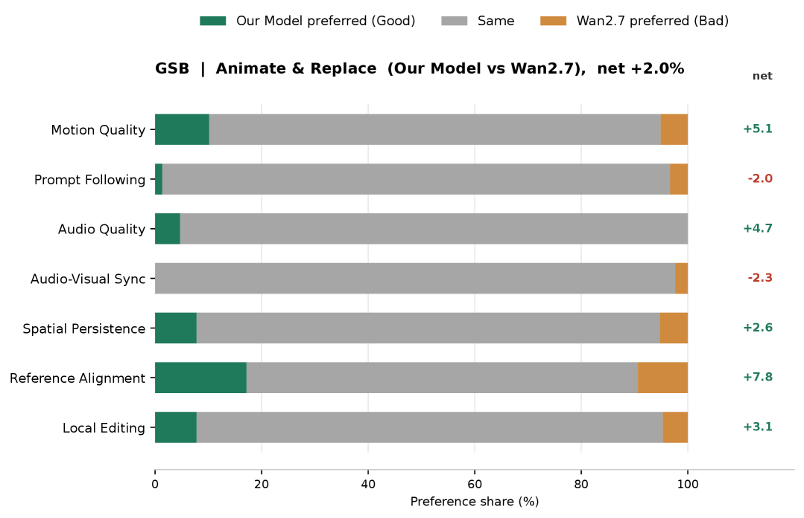
*(c)Animate Replace*

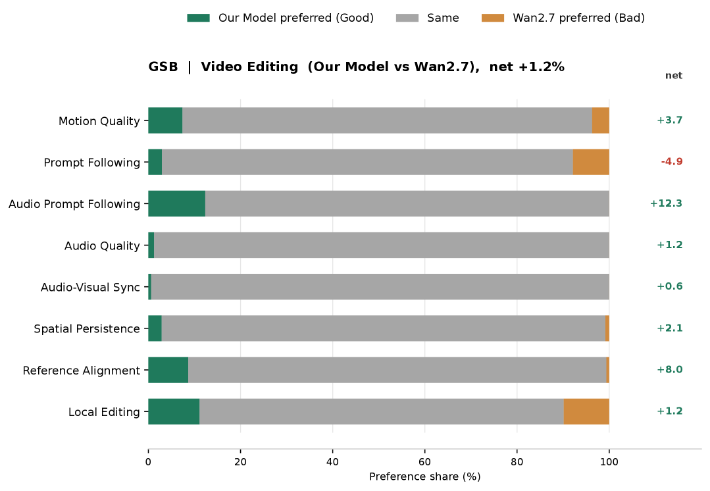
*(d)Video Editing*

*Figure 6:Music-aware joint audio-video extension. The blue interval is the observed prefix and the orange interval is generated. The model preserves the stop-motion characters and scene style, continues their interaction, and extends the warm background music across the temporal boundary.*

*Figure 7:Speech-aware joint audio-video extension. The model continues the animated scene from the observed prefix, generates the map-unfolding and pointing actions, and synthesizes the prompted Mandarin utterance in the extended interval. The log-mel strips visualize the input and generated audio.*

*Figure 8:Subject-referenced joint audio-video generation in a cinematic science-fiction setting. Given the woman’s appearance reference, the model preserves her facial features, black coat, and pearl accessories across the generated shots while following the requested camera progression. It jointly produces the final spoken line, atmospheric music, footsteps, and environmental effects; the bottom strip visualizes the generated audio.*

*Figure 9:Subject-referenced joint audio-video generation in a cinematic 3D fantasy setting. The generated shots retain the referenced man’s facial, hairstyle, and costume attributes while realizing the requested cavern, spell-casting motion, and shot transition. Speech, orchestral music, fire, underground ambience, and magical effects are synthesized jointly with the video; the bottom strip visualizes the output audio.*

*Figure 10:Video transformation with an identity reference. From left to right, the figure shows the reference image, representative frames from the source video, and frames from the generated output. The model introduces the referenced stylized scientist into the meeting while retaining the source setting and its existing participants, and integrates the new subject naturally into the interaction.*

*Figure 11:Identity-preserving video transformation across visual domains. From left to right are the realistic character reference, the animated source video, and the generated output. The model translates the referenced man’s facial, hairstyle, and clothing cues into the animation style while retaining the girl and forest environment. The output also contains the requested Mandarin dialogue and ambient sound, visualized by the bottom audio strip.*

*Figure 12:Localized semantic insertion. Representative source frames are shown on the left and edited output frames on the right. The model adds the requested igloo to the snowy foreground while retaining the aurora, mountains, camera motion, and overall illumination of the source video.*

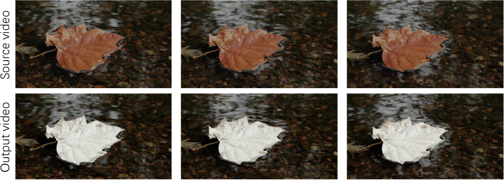
*Figure 13:Attribute-level semantic editing. The model changes only the floating leaf from brown to white, while preserving its outline, veins, motion, water ripples, visible pebbles, framing, and natural lighting from the source video.*

*Figure 14:Video style editing from a photographic source to an oil-painting appearance. The generated output applies visible brushwork and warmer, painterly color rendering while preserving the running dog, background people, scene layout, and tracking motion.*

*Figure 15:Video style editing from an outdoor hiking scene to a cyberpunk aesthetic. The output introduces blue–purple neon illumination and holographic elements while retaining the hiker’s identity, walking motion, framing, and camera trajectory from the source video.*

*Figure 16:Reference-guided local clothing edit. From left to right are the tactical-jacket reference, source-video frames, and edited output frames. The model transfers the jacket’s matte material, webbing, buckles, and pocket design to the central man while preserving the staircase, the other characters, their interactions, and the camera motion.*

*Figure 17:Reference-guided subject insertion. From left to right are the penguin reference, source-video frames, and edited output frames. The model inserts the scarf-wearing penguin into the room while retaining the sofa, illuminated brick wall, floor decorations, framing, and indoor lighting.*

*Figure 18:Multi-speaker audio-driven generation. The reference image specifies the two speakers and studio composition, while the driving audio contains their alternating English utterances. The generated frames preserve both identities and align the active speaker’s facial motion with the corresponding portion of the audio.*

*Figure 19:Single-character audio-driven animation. Conditioned on the character image and driving audio, the model generates a temporally coherent performance with expressive gestures and lip motion aligned to the sequence of English utterances. The visual style and traditional Chinese decorative setting remain consistent throughout the clip.*

---
**Usage Info**: 5384 tokens used.
**Generated at**: 2026-08-07 14:52:01

---

# 📚 PD-GS: Phoneme-Driven 3DGS for Audio-Driven Talking Heads

🚀 URL: https://arxiv.org/html/2608.05218

## 🌏 Abstract (원문)
3D Gaussian Splatting (3DGS) enables fast, photorealistic talking-head rendering, yet accurate lip articulation remains elusive: mouth motion is often over-smoothed and may violate hard articulatory constraints such as bilabial closures, producing the notorious ``leaky mouth'' artifact. A key difficulty is that brief, discrete articulatory events are inferred from a continuous acoustic embedding under a regression objective, which biases predictions toward averaged mouth configurations. While modern self-supervised speech encoders provide rich prosodic and phonetic cues, they do not provide an explicit, frame-aligned linguistic target that reliably disambiguates closure-level events. We proposePhoneme-Driven Gaussian Splatting (PD-GS), which augments a 3DGS talker with time-aligned phoneme tokens obtained from an automatic ASR and forced-alignment pipeline. Our core component, theLinguistic Fusion Module (LFM), adaptively fuses continuous audio context with discrete phoneme embeddings through a learned gate, allowing the model to preserve smooth audio-driven dynamics while strengthening phoneme guidance on articulation-critical segments. PD-GS is trained purely from monocular video using image reconstruction and lip landmark supervision. On HDTF, PD-GS achieves the best lip geometry among the compared baselines (LMD 2.66) and qualitatively reduces closure violations in challenging phoneme sequences, yielding more linguistically faithful neural avatars.
## 🌏 Abstract (번역)
3D 가우시안 스플래팅(3DGS)은 빠르고 사실적인 토킹 헤드 렌더링을 가능하게 하지만, 정확한 입술 조음은 여전히 어렵습니다. 입 움직임은 종종 과도하게 부드럽게 처리되어 양순 폐쇄와 같은 강한 조음 제약을 위반하여 악명 높은 '새는 입' 아티팩트를 생성합니다. 주요 어려움은 짧고 이산적인 조음 이벤트가 회귀 목표 하에 연속적인 음향 임베딩으로부터 추론되어 예측이 평균화된 입 모양으로 편향된다는 것입니다. 최신 자기 지도 음성 인코더는 풍부한 운율 및 음성학적 단서를 제공하지만, 폐쇄 수준 이벤트를 안정적으로 명확히 구분하는 명시적인 프레임 정렬 언어적 목표를 제공하지 않습니다. 우리는 자동 ASR 및 강제 정렬 파이프라인에서 얻은 시간 정렬 음소 토큰으로 3DGS 화자를 증강하는 음소 기반 가우시안 스플래팅(PD-GS)을 제안합니다. 우리의 핵심 구성 요소인 언어 융합 모듈(LFM)은 학습된 게이트를 통해 연속적인 오디오 컨텍스트와 이산적인 음소 임베딩을 적응적으로 융합하여, 모델이 부드러운 오디오 기반 역학을 유지하면서 조음이 중요한 부분에 대한 음소 지도를 강화할 수 있도록 합니다. PD-GS는 이미지 재구성 및 입술 랜드마크 감독을 사용하여 단안 비디오에서만 훈련됩니다. HDTF에서 PD-GS는 비교된 기준선 중에서 최고의 입술 기하학(LMD 2.66)을 달성하고, 어려운 음소 시퀀스에서 폐쇄 위반을 질적으로 감소시켜 언어적으로 더욱 충실한 신경 아바타를 생성합니다.

## 🔍 Methods & Results
- 기존 3DGS 토킹 헤드는 연속적인 음향 임베딩 사용으로 인해 입술 움직임이 과도하게 부드러워지고 양순 폐쇄와 같은 조음 제약을 위반하여 '새는 입' 아티팩트가 발생하는 문제를 해결합니다.
- 제안하는 Phoneme-Driven Gaussian Splatting (PD-GS)은 자동 ASR 및 강제 정렬 파이프라인에서 얻은 시간 정렬 음소 토큰으로 3DGS 화자를 증강합니다.
- 핵심 구성 요소인 Linguistic Fusion Module (LFM)은 학습된 게이트를 통해 HuBERT에서 추출한 연속적인 오디오 컨텍스트와 ASR+강제 정렬에서 얻은 이산적인 음소 임베딩을 적응적으로 융합합니다.
- LFM은 모델이 부드러운 오디오 기반 역학을 유지하면서 조음이 중요한 부분에 대한 음소 지도를 강화하여, 순수 오디오 기반 예측의 모호성을 해결하고 정확한 입술 및 턱 움직임을 생성합니다.
- PD-GS는 두 단계로 구성됩니다: (1) 3DMM 초기화 및 표준 3DGS 최적화를 통해 정규 아바타(G_canon)를 구축하고, (2) LFM을 포함한 조음 스트림과 표현 스트림으로 구성된 분리된 모션 생성기를 학습하여 변형을 예측합니다.
- 훈련은 단안 비디오에서만 이루어지며, 이미지 재구성 손실(L1 + LPIPS)과 입술 랜드마크 일관성 손실(L_landmark)을 사용하여 기하학적 제약을 제공합니다. 모션 생성기와 3DGS 파라미터는 종단 간 최적화됩니다.
- HDTF 데이터셋에서 PD-GS는 비교된 기준선 중 최고의 입술 기하학(LMD 2.66)을 달성했으며, 어려운 음소 시퀀스에서 폐쇄 위반을 질적으로 감소시켜 언어적으로 더욱 충실한 신경 아바타를 생성했습니다.

## 🖼 Figures

*Figure 1. Dual-Stream Motion Generator. Two complementary streams drive a 3D Gaussian avatar: a prosody stream predicts expression blendshape weights from HuBERT audio features, and an articulation stream fuses time-aligned phonemes through a Linguistic Fusion Module (LFM) with a learned gating network to produce precise lip motions, enabling photorealistic rendering with linguistically faithful articulation.*

![Figure 2.Overview of our Phoneme-Driven Gaussian Splatting (PD-GS) framework. Stage 1: Canonical avatar construction. From the training video 
𝐈
gt
, we fit a 3DMM to recover camera parameters and a neutral facial shape, initializing the canonical 3D Gaussian avatar 
𝐺
canon
. Stage 2: Dual-stream motion learning. A unified HuBERT encoder extracts audio features 
𝐅
audio
 from 
𝐀
, shared by an expression stream (blendshape deformation 
𝐃
exp
,
𝑡
) and an articulation stream (context features 
𝐡
𝑡
). Phoneme labels 
𝐩
𝑡
 from ASR+MFA are fused with 
𝐡
𝑡
 via the LFM to predict lip deformation 
𝐃
lip
,
𝑡
. The total deformation 
𝐃
total
,
𝑡
=
𝐃
lip
,
𝑡
+
𝐃
exp
,
𝑡
 renders 
𝐺
canon
. Training uses image reconstruction 
ℒ
image
 and landmark consistency 
ℒ
landmark
 losses. We further analyze cross-domain robustness.](../images/2026-08-07/2608.05218/2608.05218_fig1.png)
*Figure 2.Overview of our Phoneme-Driven Gaussian Splatting (PD-GS) framework. Stage 1: Canonical avatar construction. From the training video 
𝐈
gt
, we fit a 3DMM to recover camera parameters and a neutral facial shape, initializing the canonical 3D Gaussian avatar 
𝐺
canon
. Stage 2: Dual-stream motion learning. A unified HuBERT encoder extracts audio features 
𝐅
audio
 from 
𝐀
, shared by an expression stream (blendshape deformation 
𝐃
exp
,
𝑡
) and an articulation stream (context features 
𝐡
𝑡
). Phoneme labels 
𝐩
𝑡
 from ASR+MFA are fused with 
𝐡
𝑡
 via the LFM to predict lip deformation 
𝐃
lip
,
𝑡
. The total deformation 
𝐃
total
,
𝑡
=
𝐃
lip
,
𝑡
+
𝐃
exp
,
𝑡
 renders 
𝐺
canon
. Training uses image reconstruction 
ℒ
image
 and landmark consistency 
ℒ
landmark
 losses. We further analyze cross-domain robustness.*

![Figure 3.Qualitative analysis of articulation errors on challenging phonemes. We highlight common failure modes of audio-driven baselines: closure failure (incomplete lip sealing for bilabial stops, e.g., [p], producing ``leaky mouth''), phonetic ambiguity (distinct vowels, e.g., [æ] and [3], rendered with similarly open mouths), and weak rounding (insufficient lip protrusion, e.g., [ju:]). In contrast, ours produces clearer closures and more distinctive articulations via explicit phoneme guidance. Colors are used only as a visual aid.](../images/2026-08-07/2608.05218/2608.05218_fig2.png)
*Figure 3.Qualitative analysis of articulation errors on challenging phonemes. We highlight common failure modes of audio-driven baselines: closure failure (incomplete lip sealing for bilabial stops, e.g., [p], producing ``leaky mouth''), phonetic ambiguity (distinct vowels, e.g., [æ] and [3], rendered with similarly open mouths), and weak rounding (insufficient lip protrusion, e.g., [ju:]). In contrast, ours produces clearer closures and more distinctive articulations via explicit phoneme guidance. Colors are used only as a visual aid.*

*Figure 4.Mean gate activation over time on a held-out utterance. The gate 
𝑔
¯
𝑡
=
1
𝐷
​
∑
𝑗
𝑔
𝑡
,
𝑗
 varies systematically across aligned phoneme intervals instead of collapsing to a constant weight, showing that the LFM adaptively modulates phoneme cues, with local increases near articulation-critical segments such as bilabial closures and strong rounding.*

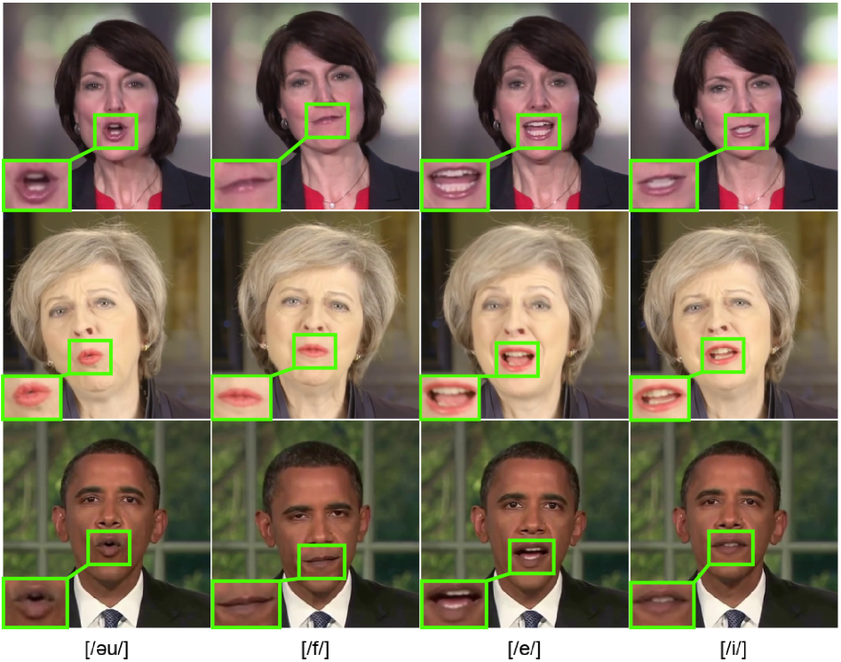
*Figure 5.Phoneme consistency across identities. For the same phoneme (columns), PD-GS generates consistent and physically correct articulations across three subjects (rows), while naturally adapting to each individual's facial geometry.*

---
**Usage Info**: 6385 tokens used.
**Generated at**: 2026-08-07 14:52:17

---

# 📚 KVAE: Family of Tokenizers for Multimodal Generative Models

🚀 URL: https://arxiv.org/html/2608.05798

## 🌏 Abstract (원문)
Latent diffusion modeling (LDM), a prominent paradigm, utilizes tokenizers to map input signal to compressed representation. This dependency positions tokenizer as an integral part of generation process itself, since it affects learning speed, quality of synthesized samples and lay foundation for later applications. This report presents series of KVAE tokenizers for audio, image and video, all designed for subsequent text-conditioned generation: KVAE-Audio, a continuous full-band 48 kHz tokenizer with a 50 Hz latent of 64 channels; KVAE-3D – two causal video tokenizers for 4x16x16 and 4x8x8 compression; KVAE-2D, an image model, compressing input by factor of 8 with 32 channels. We demonstrate that reconstruction (PSNR, LPIPS, PESQ, etc.) and generation results on objective (Frechet Distance, CLIP score, CLAP score, etc.) and subjective (side-by-side evaluation) metrics matches or surpasses frontier opensource tokenizers, such as VAEs from Wan-2.2, HunyuanVideo-1.5, FLUX.2, MovieGen, StableAudio and MMAudio. Considering difficulty of development, we share with community training details, model selection method and ablation on design choices. The code is publicly available athttps://github.com/kandinskylab/kvaeandhttps://github.com/kandinskylab/kvae-audio.
## 🌏 Abstract (번역)
주요 패러다임인 잠재 확산 모델링(LDM)은 토크나이저를 활용하여 입력 신호를 압축된 표현으로 매핑합니다. 이러한 의존성은 토크나이저가 생성 프로세스 자체의 필수적인 부분으로 자리매김하게 하는데, 이는 학습 속도, 합성 샘플의 품질에 영향을 미치고 향후 애플리케이션의 기반을 마련하기 때문입니다. 본 보고서는 오디오, 이미지 및 비디오를 위한 일련의 KVAE 토크나이저를 제시하며, 이들은 모두 텍스트 조건부 생성을 위해 설계되었습니다. 구체적으로 KVAE-Audio는 64채널의 50Hz 잠재 공간을 가진 연속적인 풀밴드 48kHz 토크나이저이며, KVAE-3D는 4x16x16 및 4x8x8 압축을 위한 두 가지 인과적 비디오 토크나이저입니다. KVAE-2D는 입력을 8배 압축하고 32채널을 사용하는 이미지 모델입니다. 우리는 재구성(PSNR, LPIPS, PESQ 등) 및 생성 결과가 객관적(Frechet Distance, CLIP score, CLAP score 등) 및 주관적(측면 비교 평가) 지표에서 Wan-2.2, HunyuanVideo-1.5, FLUX.2, MovieGen, StableAudio 및 MMAudio와 같은 선도적인 오픈소스 토크나이저와 일치하거나 능가함을 보여줍니다. 개발의 어려움을 고려하여, 우리는 훈련 세부 사항, 모델 선택 방법 및 설계 선택에 대한 제거 연구를 커뮤니티와 공유합니다. 코드는 https://github.com/kandinskylab/kvae 및 https://github.com/kandinskylab/kvae-audio에서 공개적으로 사용할 수 있습니다.

## 🔍 Methods & Results
- KVAE 토크나이저는 인코더와 디코더로 구성되며, 입력 RGB 비디오를 압축하고 재구성하며, 압축 매개변수는 시간(ft), 공간(fs), 채널(c)로 정의됩니다.
- 본 연구는 KVAE-4x8x8 (16채널) 및 KVAE-4x16x16 (64채널) 두 가지 비디오 모델을 제시합니다.
- 비디오 토크나이저는 이미지 토크나이저와 달리 추가적인 시간 축을 처리하기 위해 Conv3D 블록을 사용하거나 시간 및 공간 구성 요소로 분해하며, 시간 축에 대한 다운샘플링/업샘플링, 인과적 설정(비대칭 시간 패딩), 다양한 어텐션 메커니즘, 긴 시퀀스 처리를 위한 타일링 등의 차이점을 가집니다.
- 제안된 KVAE 모델은 CogVideoX에서 영감을 받아 효율적인 훈련과 캐싱 메커니즘을 통한 임의의 긴 시퀀스 처리를 위해 어텐션 없는 Conv3D 블록을 사용합니다. 정규화에는 SpatialRMSNorm을 사용하며, 다운샘플 및 업샘플 블록은 시간 및 공간 연산을 순차적으로 수행합니다.
- 인코더와 디코더 간의 매개변수 비대칭이 존재하며, KVAE-4x8x8은 디코더가 인코더보다 약 1.3배 크고, KVAE-4x16x16은 디코더가 인코더보다 약 5.3배 커서 더 높은 생성 능력을 가집니다.
- 훈련 시퀀스 길이는 CogVideoX의 접근 방식을 채택하여 65프레임부터 시작하여 더 빠른 수렴을 유도했으며, 129프레임으로 제한해도 400프레임 이상의 긴 시퀀스에 잘 일반화됩니다. 훈련 중 비디오 배치와 이미지를 0.3의 확률로 교차하여 사용했습니다.
- 훈련은 4단계로 구성됩니다: 1단계는 MAE, LPIPS, KL 발산의 합을 최적화하고, 2단계는 프레임 기반 GAN을 도입하며, 3단계는 잠재 다운샘플링 및 회전이 있는 EQ-loss를 적용하고, 4단계는 디코더 미세 조정입니다. 최적화는 Adam 옵티마이저를 사용하며 각 단계별로 학습률이 고정됩니다.
- 훈련 데이터셋은 생성 모델의 사전 훈련 데이터셋에서 선택된 1천만 개의 이미지와 2백만 개의 비디오로 구성되며, 해상도, 움직임, 내용에 따라 필터링되었습니다. 전처리에는 뒤집기, 회전, 크기 조정, 자르기가 포함되며 해상도는 256에서 512까지 다양합니다.

## 🖼 Figures
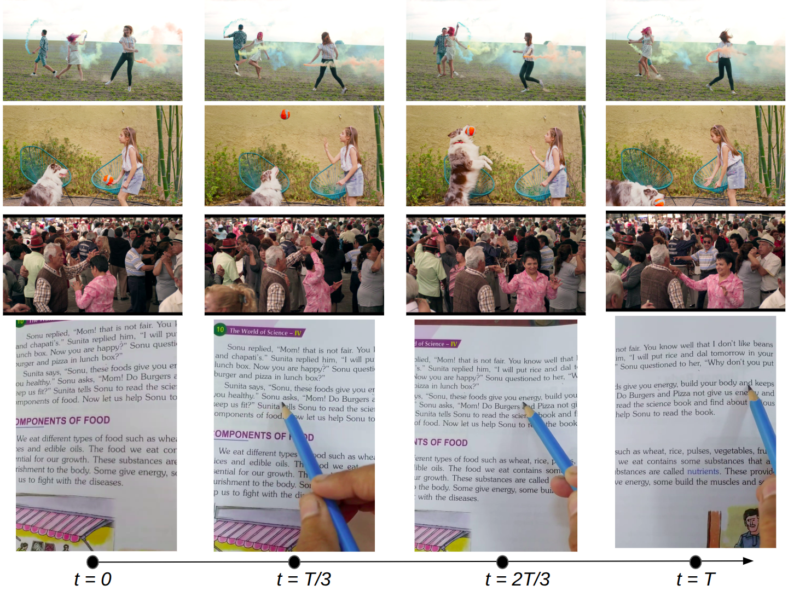
*Figure 1:Frames from internal video dataset used for intermediate evaluations*

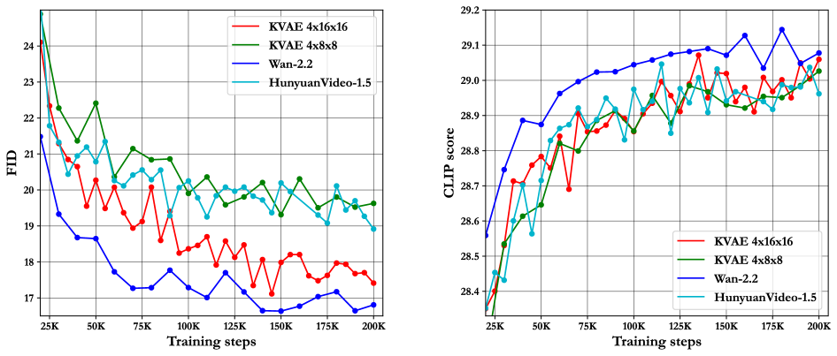
*Figure 2:Learning curves of text-to-image generation models on 384x256 resolution*

*((a))Comparison with HunyuanVideo-1.5*

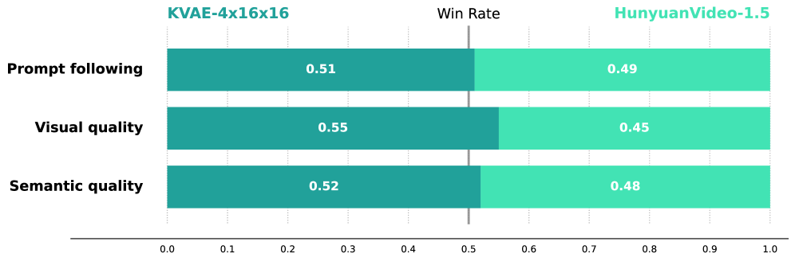
*((a))Comparison with HunyuanVideo-1.5*

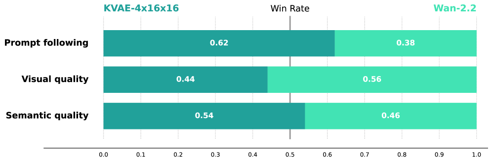
*((b))Comparison with Wan-2.2*

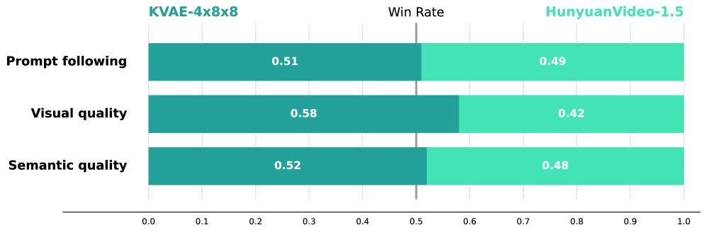
*((a))Comparison with HunyuanVideo-1.5*

*((a))Comparison with HunyuanVideo-1.5*

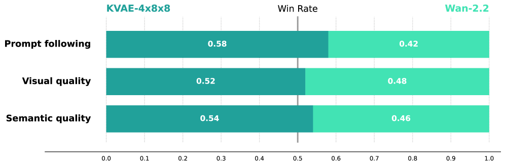
*((b))Comparison with Wan-2.2*

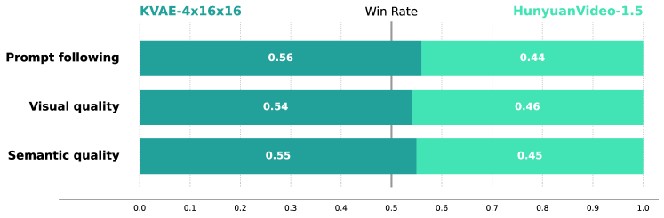
*Figure 5:Side-by-side evaluation of 121-frame 768x512 video generations for KVAE-4x16x16 and HunyuanVideo-1.5*

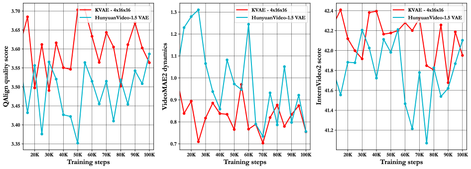
*Figure 6:Learning curves of text-to-video generation models on 121-frame 384x256 resolution. With higher values of QAlign and InterVideo2 scores, training with KVAE-4x16x16 is also characterized by less variance across this three metrics.*

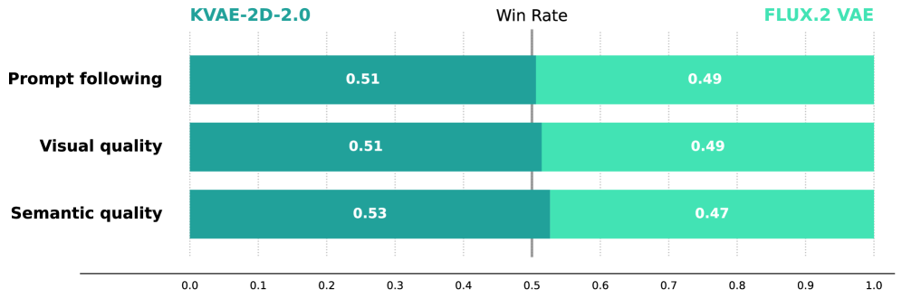
*Figure 7:Side-by-side soft win rates for the two downstream 2B T2I DiT stacks at 200K optimization steps.*

*((a))BT quality vs CDS.*

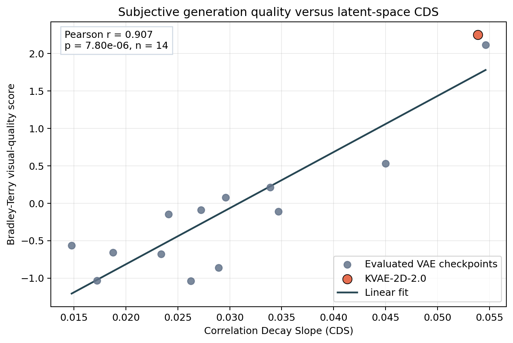
*((a))BT quality vs CDS.*

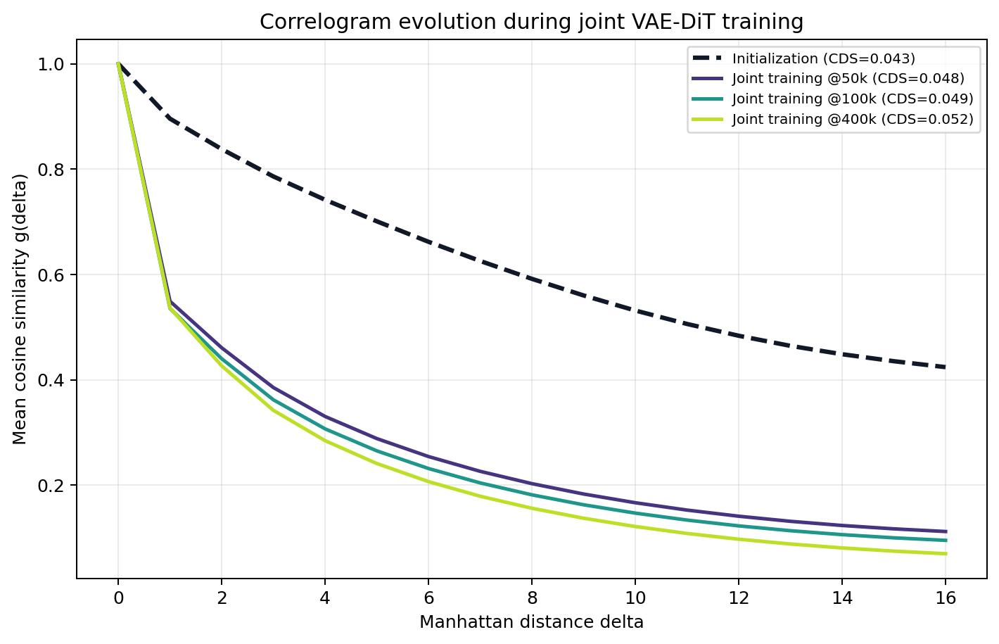
*((b))Joint-train correlograms.*

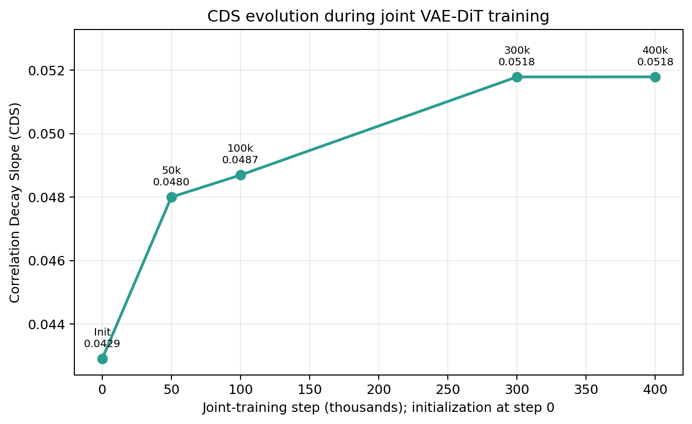
*((c))CDS vs joint step.*

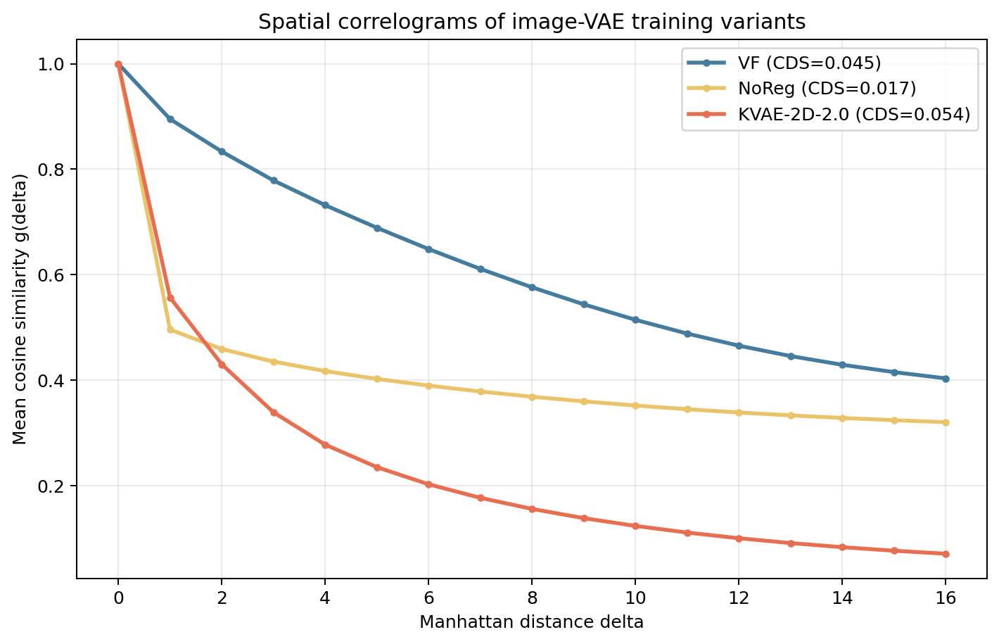
*((d))Tokenizer correlograms.*

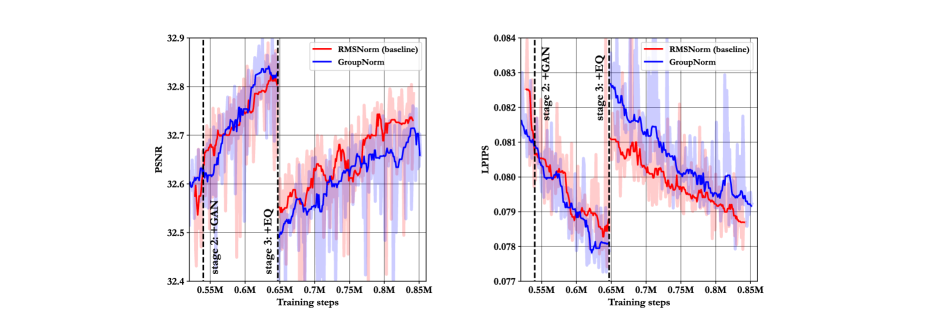
*Figure 9:Normalization layer comparison on KVAE-4x8x8.*

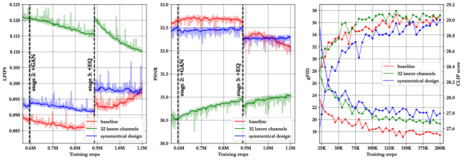
*Figure 10:Ablation study for the 4x16x16 design. Left/Middle images: reconstruction metrics Right image: learning curves of text-to-video generation models*

*Figure 11:Side-by-side evaluation of audio generations for KVAE-Audio vs MMAudio 44.1kHz*

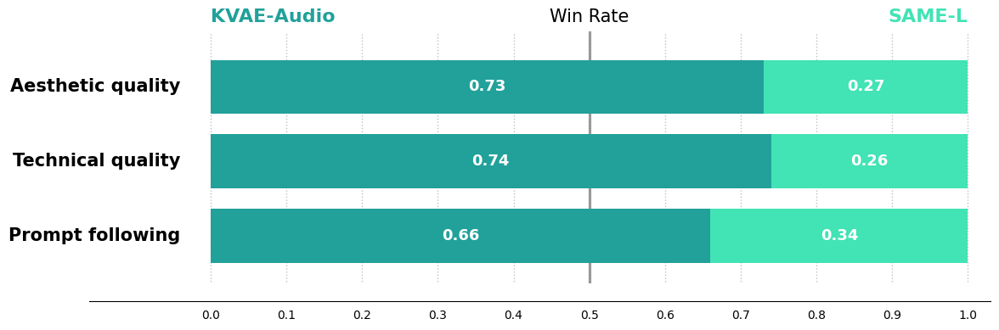
*Figure 12:Side-by-side evaluation of audio generations for KVAE-Audio vs SAME-L*

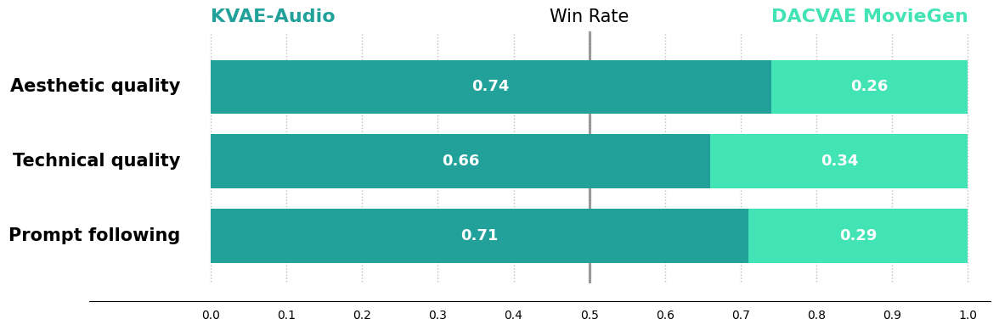
*Figure 13:Side-by-side evaluation of audio generations for KVAE-Audio vs DACVAE MovieGen*

---
**Usage Info**: 5010 tokens used.
**Generated at**: 2026-08-07 14:52:34

---

# 📚 Rethinking Automatic Music Mixing as Sequential Stem Blending

🚀 URL: https://arxiv.org/html/2608.05506

## 🌏 Abstract (원문)
Automatic music mixing, the task of automatically combining individual audio tracks into a cohesive mixture, is typically addressed by parallelized architectures that process all input tracks in a single pass. In this work, inspired by how human mix engineers process stems one at a time, we propose a paradigm shift and ask whether automatic music mixing can be reformulated as a sequential stem blending task, where each stem is blended into a growing submix. Specifically, we train a latent flow matching model conditioned on the submix context, enabling sequential processing of an arbitrary number of input tracks. To train the model, we introduce a degradation-based data synthesis strategy that simulates realistic stem blending scenarios from existing multitrack and source separation datasets. Experimental results on both stem blending and automatic music mixing benchmarks demonstrate the effectiveness of the proposed approach. We provide audio examples on the accompanying demo page111https://sequential-mixing-demo.vercel.app/.
## 🌏 Abstract (번역)
개별 오디오 트랙을 응집력 있는 믹스로 자동 결합하는 작업인 자동 음악 믹싱은 일반적으로 모든 입력 트랙을 한 번에 처리하는 병렬화된 아키텍처로 해결됩니다. 본 연구에서는 인간 믹스 엔지니어가 스템을 하나씩 처리하는 방식에서 영감을 받아, 자동 음악 믹싱을 각 스템이 성장하는 서브믹스에 블렌딩되는 순차적 스템 블렌딩 작업으로 재구성할 수 있는지 묻는 패러다임 전환을 제안합니다. 구체적으로, 서브믹스 컨텍스트에 조건화된 잠재 흐름 매칭 모델을 훈련하여 임의의 수의 입력 트랙을 순차적으로 처리할 수 있도록 합니다. 모델 훈련을 위해 기존 멀티트랙 및 음원 분리 데이터셋에서 현실적인 스템 블렌딩 시나리오를 시뮬레이션하는 열화 기반 데이터 합성 전략을 도입합니다. 스템 블렌딩 및 자동 음악 믹싱 벤치마크 모두에 대한 실험 결과는 제안된 접근 방식의 효과를 입증합니다. 동반되는 데모 페이지(https://sequential-mixing-demo.vercel.app/)에서 오디오 예시를 제공합니다.

## 🔍 Methods & Results
- 기존의 병렬 처리 방식과 달리, 각 스템이 성장하는 서브믹스에 순차적으로 블렌딩되는 '순차적 스템 블렌딩' 패러다임을 제안한다.
- 믹싱 과정은 `s(k) = s(k-1) + f(xk | s(k-1), Ck)`와 같이 반복적으로 구성되며, 여기서 `f`는 현재 서브믹스 `s(k-1)`와 메타 조건 `Ck` (스템 및 서브믹스의 라우드니스, 장르, 악기 유형 포함)에 조건화된 스템 블렌딩 변환을 나타낸다.
- 시스템은 사전 훈련된 인코더/디코더(Stable Audio Open VAE)와 잠재 공간에서 스템 블렌딩 변환을 학습하는 정류 흐름 매칭(rectified flow matching) 모델로 구성된다.
- 흐름 매칭 모델은 노이즈 없는 정식화를 채택하여, `z0` (처리되지 않은 스템 잠재)에서 `z1` (처리된 스템 잠재)로의 변환을 `zs` (서브믹스 잠재)와 `Ck`에 조건화하여 학습한다.
- 훈련 데이터는 실제 녹음 세션에서 중간 서브믹스 상태를 얻기 어렵기 때문에, 기존 멀티트랙 및 음원 분리 데이터셋에서 열화 기반 데이터 합성 전략을 통해 구성된다.
- MedleyDB의 경우 원본/처리된 스템 쌍을 사용하고, MoisesDB의 경우 처리된 스템에 스펙트럼 열화(마스킹 부스트, 오버컷, 저음부 탁함, 거친 소리, 블렌드) 및 룸 리버브를 적용하여 `xk`를 시뮬레이션한다.
- 순차적 패러다임은 사용자가 언제든지 자신의 서브믹스를 제공하거나, 특정 스템을 기존 믹스에 블렌딩하거나, 각 단계의 중간 출력을 검사할 수 있는 등 상호작용적인 워크플로우를 지원하는 이점이 있다.
- 자동 음악 믹싱을 위해 초기 서브믹스 `s(0)`는 0으로 초기화되며, 스템 처리 순서는 무작위 또는 드럼 → 베이스 → 기타 → 건반 → 현악기 → 보컬 → 기타 악기 순서의 '도메인 지식' 기반으로 설정될 수 있다.
- 흐름 매칭 모델 `vθ`는 Multimodal Diffusion Transformer (MMDiT) 블록과 Diffusion Transformer (DiT) 레이어를 결합한 하이브리드 아키텍처를 사용하며, Stable Audio Open VAE의 잠재 공간에서 작동한다.
- 모델은 30 에포크 동안 AdamW 옵티마이저로 훈련되었으며, MedleyDB v1 및 MoisesDB를 훈련 데이터셋으로 사용하고, MedleyDB v2 및 MoisesDB의 홀드아웃 세그먼트를 평가에 사용했다.

## 🖼 Figures

*Figure 1:Comparison of parallelized and sequential mixing paradigms. Prior work (top) processes all 
𝑁
 stems simultaneously in a single pass to produce the final mixture 
𝐲
^
mix
. Proposed (bottom) reformulates mixing as sequential stem blending, where a single stem 
𝐱
𝑘
 is integrated into a fixed submix 
𝐬
(
𝑘
−
1
)
 at each step, producing an updated submix 
𝐬
(
𝑘
)
. This process repeats for 
𝑘
=
1
,
…
,
𝑁
, with the final submix 
𝐬
(
𝑁
)
=
𝐲
^
mix
.*

![Figure 2:Overview of the proposed system. Inference (top): stems are processed sequentially, where each stem 
𝐱
𝑘
 is blended into the current submix 
𝐬
(
𝑘
−
1
)
 one at a time, with the accumulated submix growing at each step until the final mixture 
𝐬
𝑁
=
𝐲
^
mix
 is obtained. Training (bottom): for each blending step, the unprocessed stem 
𝐗
𝑘
 and the conditioning submix 
𝐬
(
𝑘
−
1
)
 are encoded by a shared VAE encoder into latent sequences, where the stem latent serves as the flow source 
𝑧
0
 and the submix latent is processed as a second modality via bidirectional joint attention in the MMDiT blocks. The meta-conditioning set 
𝒞
𝑘
 (genre, instrument, loudness) is processed by an MLP and injected into all transformer blocks via AdaLN. The predicted latent is decoded by the VAE decoder to produce the processed stem 
𝐲
𝑘
.](../images/2026-08-07/2608.05506/2608.05506_fig1.png)
*Figure 2:Overview of the proposed system. Inference (top): stems are processed sequentially, where each stem 
𝐱
𝑘
 is blended into the current submix 
𝐬
(
𝑘
−
1
)
 one at a time, with the accumulated submix growing at each step until the final mixture 
𝐬
𝑁
=
𝐲
^
mix
 is obtained. Training (bottom): for each blending step, the unprocessed stem 
𝐗
𝑘
 and the conditioning submix 
𝐬
(
𝑘
−
1
)
 are encoded by a shared VAE encoder into latent sequences, where the stem latent serves as the flow source 
𝑧
0
 and the submix latent is processed as a second modality via bidirectional joint attention in the MMDiT blocks. The meta-conditioning set 
𝒞
𝑘
 (genre, instrument, loudness) is processed by an MLP and injected into all transformer blocks via AdaLN. The predicted latent is decoded by the VAE decoder to produce the processed stem 
𝐲
𝑘
.*

*Figure 3:Subjective results from 
18
 participants across Automatic Music Mixing (AMM) and Stem Blending (STB) scenarios.*

---
**Usage Info**: 4393 tokens used.
**Generated at**: 2026-08-07 14:52:44

---

