# 🚩 (2026-08-10) Scholar Inbox 추천 논문 

# 📚 SemBridge: Semantic Token Anchoring for Continuous-Latent Autoregressive Speech Generation

🚀 URL: https://arxiv.org/html/2608.07462

## 🌏 Abstract (원문)
Continuous-latent autoregressive speech generation has emerged as a promising alternative to discrete-token modeling by avoiding quantization loss and preserving richer acoustic information. However, continuous acoustic targets do not expose linguistic structure as explicit token-level prediction targets. Consequently, the autoregressive language model (LM) must acquire linguistic structure indirectly through acoustic prediction, which can compromise the content fidelity of generated speech. We propose SemBridge, a training-only semantic-token anchoring framework for continuous-latent autoregressive speech generation. SemBridge uses discrete semantic tokens to directly supervise autoregressive LM states and employs a Semantic-Aligned Acoustic VAE to organize the continuous target space under the same semantic reference. The semantic supervision is used only during training, while inference remains entirely continuous. We evaluate SemBridge on zero-shot text-to-speech (TTS) and score-conditioned singing voice synthesis (SVS). Across multiple benchmarks, SemBridge improves content accuracy, as measured by word and character error rates (WER/CER), while maintaining competitive speaker similarity and perceptual quality. Experimental results demonstrate that explicit semantic-token supervision for autoregressive state learning is an effective and general direction for continuous speech generation. Speech samples are available.111https://tiamojames.github.io/SemBridge˙Demo/The model code and checkpoints will be available athttps://github.com/ASLP-lab/SemBridge.
## 🌏 Abstract (번역)
연속 잠재 오토회귀 음성 생성은 양자화 손실을 피하고 더 풍부한 음향 정보를 보존함으로써 이산 토큰 모델링에 대한 유망한 대안으로 부상했습니다. 그러나 연속 음향 목표는 언어 구조를 명시적인 토큰 수준 예측 목표로 노출하지 않습니다. 결과적으로, 오토회귀 언어 모델(LM)은 음향 예측을 통해 간접적으로 언어 구조를 습득해야 하며, 이는 생성된 음성의 내용 충실도를 손상시킬 수 있습니다. 우리는 연속 잠재 오토회귀 음성 생성을 위한 훈련 전용 의미 토큰 고정 프레임워크인 SemBridge를 제안합니다. SemBridge는 이산 의미 토큰을 사용하여 오토회귀 LM 상태를 직접 감독하고, 동일한 의미 참조 하에 연속 목표 공간을 구성하기 위해 의미 정렬 음향 VAE를 사용합니다. 의미 감독은 훈련 중에만 사용되며, 추론은 전적으로 연속적으로 유지됩니다. 우리는 SemBridge를 제로샷 텍스트-음성 변환(TTS) 및 악보 조건부 노래 음성 합성(SVS)에 대해 평가합니다. 여러 벤치마크에서 SemBridge는 단어 및 문자 오류율(WER/CER)로 측정된 내용 정확도를 향상시키면서 경쟁력 있는 화자 유사성 및 지각 품질을 유지합니다. 실험 결과는 오토회귀 상태 학습을 위한 명시적인 의미 토큰 감독이 연속 음성 생성을 위한 효과적이고 일반적인 방향임을 보여줍니다. 음성 샘플은 111https://tiamojames.github.io/SemBridge˙Demo/에서 확인할 수 있으며, 모델 코드 및 체크포인트는 https://github.com/ASLP-lab/SemBridge에서 제공될 예정입니다.

## 🔍 Methods & Results
- SemBridge는 연속 잠재 오토회귀 백본 위에 구축되며, 핵심 메커니즘은 이산 의미 토큰 레이블을 사용하여 선택된 오토회귀 LM 상태를 직접 감독하는 '의미 토큰 고정(semantic-token anchoring)'입니다.
- 보완적인 '의미 정렬 음향 VAE(Semantic-Aligned Acoustic VAE, SA-VAE)'는 동일한 의미 참조 하에 연속 음향 목표 공간을 구성합니다.
- 훈련은 두 단계로 진행됩니다: 1단계에서는 SA-VAE를 음향 재구성 및 의미 목표 정렬 목표로 훈련하고, 2단계에서는 SA-VAE와 GLM-4 의미 토크나이저를 고정하고 생성기를 원래 생성 목표와 의미 토큰 고정을 통해 훈련합니다.
- GLM-4 토크나이저(12.5Hz)는 SA-VAE를 위한 연속 의미 임베딩(e_t)과 LM 상태 고정을 위한 이산 토큰 ID(s_t)를 제공하며, SA-VAE의 음향 잠재 패치(z_t)와 시간적으로 일치합니다.
- 생성기는 PatchEnc, 인과 LM, 로컬 확산 트랜스포머(LocDiT)로 구성되며, 인과 LM의 특정 트랜스포머 레이어에 경량 의미 예측 헤드를 부착하여 의미 토큰 고정 목표를 수행합니다.
- 의미 토큰은 훈련 중 감독 목표로만 사용되며, 추론 시에는 사용되지 않아 생성 과정은 전적으로 연속적으로 유지됩니다.
- SemBridge는 제로샷 텍스트-음성 변환(TTS) 및 악보 조건부 노래 음성 합성(SVS)에 적용되었으며, 여러 벤치마크에서 단어 및 문자 오류율(WER/CER)로 측정된 내용 정확도를 향상시켰습니다.
- 모델은 경쟁력 있는 화자 유사성 및 지각 품질을 유지하며, SVS 작업에서는 명시적인 음악적 제약 하에서도 가사 명료도를 향상시켰습니다.

## 🖼 Figures

*Figure 1: Overview of the two-stage SemBridge framework. (A) Stage I trains SA-VAE to reconstruct waveforms while aligning continuous acoustic patches with embeddings from a frozen semantic tokenizer; their token IDs are retained as Stage-II targets. (B) Stage II trains a continuous-latent autoregressive generator: a causal LM encodes symbolic conditions and preceding acoustic patches, LocDiT predicts the next patch, and a semantic head supervises a LM hidden layer under the same causal shift.*

![Figure 2: Representation-space comparison between a Vanilla VAE (
𝛽
KL
=
10
−
2
) and the proposed SA-VAE on ten ESC-50 sound categories. The t-SNE projections are obtained from temporally pooled 64-dimensional sampled latents 
𝐳
. Linear-probe (LP) and 5-nearest-neighbor (5-NN) accuracies are computed in the original standardized latent space rather than in the two-dimensional t-SNE space. Higher values indicate stronger linear class separability and more consistent local neighborhood structure, respectively.](../images/2026-08-10/2608.07462/2608.07462_fig1.png)
*Figure 2: Representation-space comparison between a Vanilla VAE (
𝛽
KL
=
10
−
2
) and the proposed SA-VAE on ten ESC-50 sound categories. The t-SNE projections are obtained from temporally pooled 64-dimensional sampled latents 
𝐳
. Linear-probe (LP) and 5-nearest-neighbor (5-NN) accuracies are computed in the original standardized latent space rather than in the two-dimensional t-SNE space. Higher values indicate stronger linear class separability and more consistent local neighborhood structure, respectively.*

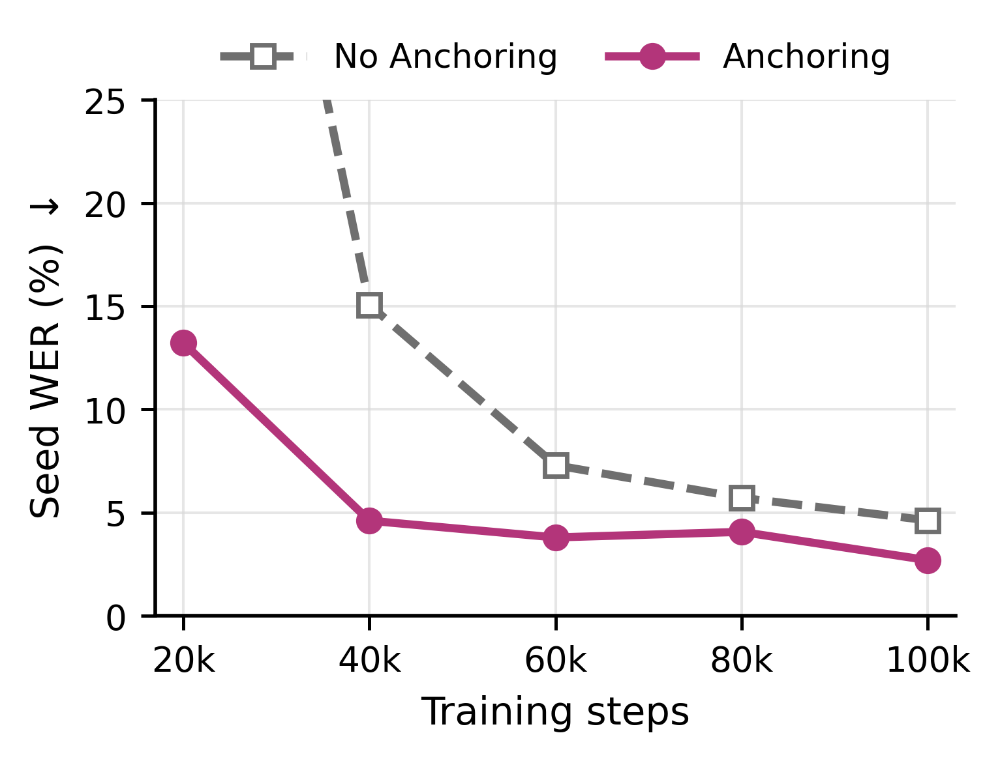
*Figure 3: Seed-TTS EN WER across training updates with and without semantic-token anchoring.*

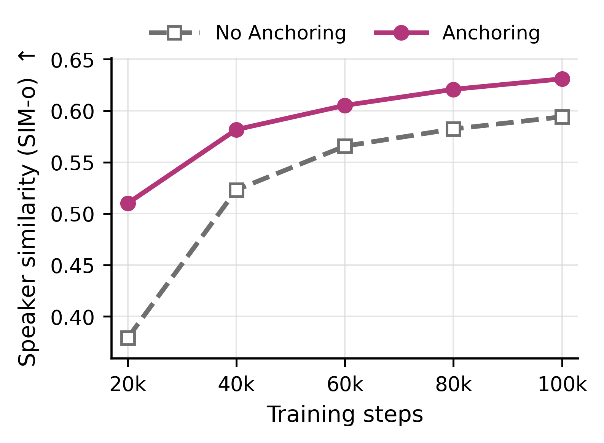
*Figure 4: Seed-TTS EN SIM-o across training updates with and without semantic-token anchoring.*

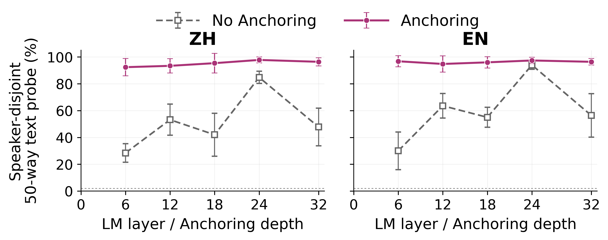
*Figure 5:Speaker-disjoint target-text probing across LM layers and Anchoring depths.*

*Figure 6:Semantic-token t-SNE at 
ℎ
32
 for No Anchoring and Anchoring@32.*

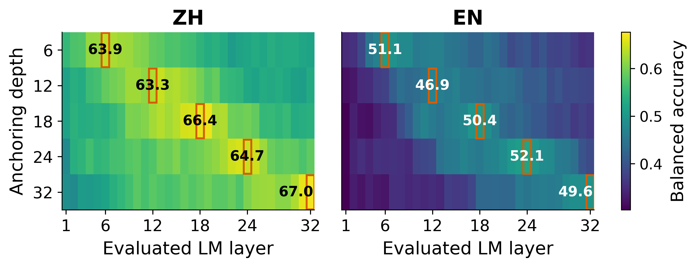
*Figure 7:Layer-wise semantic-token readability under different Anchoring depths.*

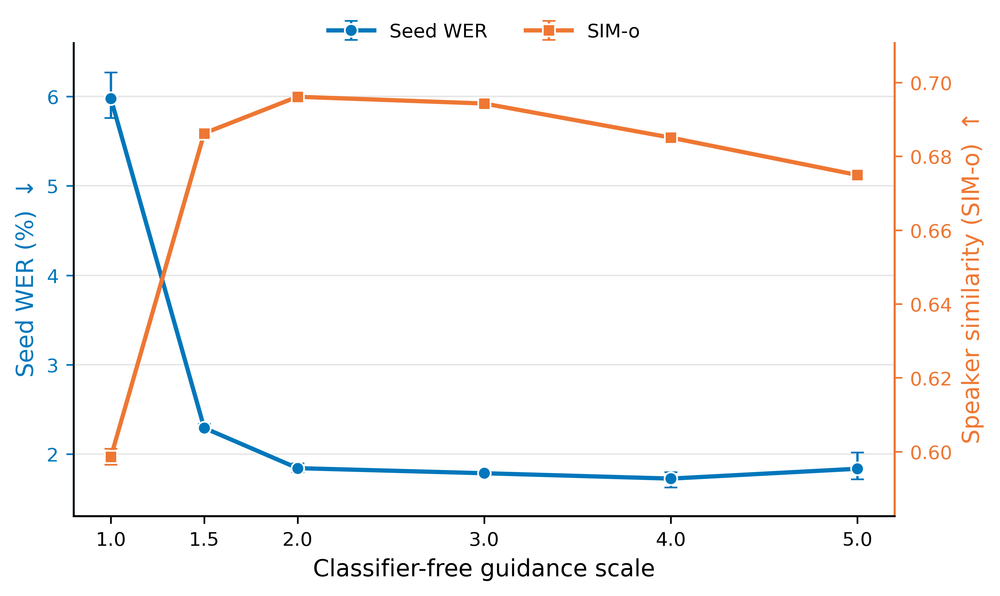
*Figure 8:CFG-scale trade-off on streaming Seed-TTS EN at 300k steps, averaged over three runs.*

---
**Usage Info**: 4397 tokens used.
**Generated at**: 2026-08-10 14:55:31

---

# 📚 MMAG: A Multi-Control Mixed Audio Generation Benchmark

🚀 URL: https://arxiv.org/html/2608.06900

## 🌏 Abstract (원문)
Recent audio generation systems have progressed from single-modality synthesis to generating complex acoustic scenes containing speech, music, and sound effects. Therefore, evaluating these models requires assessing multiple interacting capabilities, including semantic fidelity, speaker consistency, and temporal control, yet existing benchmarks focus on isolated domains or coarse-grained descriptions. To address this gap, we introduce the Multi-control Mixed Audio Generation (MMAG) benchmark. MMAG contains approximately 4,000 manually verified audio clips with rich annotations covering speech content, speaker identity, music attributes, sound events, and temporal relationships, together with dedicated subsets for voice cloning and timestamp-conditioned generation. We further propose a systematic evaluation protocol that measures acoustic fidelity, speech quality, semantic alignment, and temporal accuracy. Benchmarking representative agentic orchestrators, unified audio-visual generation models, and native mixed-audio generators reveals substantial performance trade-offs across these capabilities, with no existing model performing consistently well. Our results highlight the remaining challenges of controllable mixed audio generation and establish MMAG as a comprehensive benchmark for future research.111The project page is available:https://hirookie9.github.io/MMAG-Page/
## 🌏 Abstract (번역)
최근 오디오 생성 시스템은 단일 모달리티 합성에서 음성, 음악, 음향 효과를 포함하는 복잡한 음향 장면을 생성하는 수준으로 발전했습니다. 따라서 이러한 모델을 평가하려면 의미론적 충실도, 화자 일관성, 시간 제어 등 여러 상호작용하는 기능을 평가해야 하지만, 기존 벤치마크는 고립된 도메인이나 거친 수준의 설명에 초점을 맞추고 있습니다. 이러한 격차를 해소하기 위해 우리는 다중 제어 혼합 오디오 생성(MMAG) 벤치마크를 소개합니다. MMAG는 음성 내용, 화자 신원, 음악 속성, 음향 이벤트 및 시간적 관계를 포함하는 풍부한 주석이 달린 약 4,000개의 수동으로 검증된 오디오 클립과 음성 복제 및 타임스탬프 조건부 생성을 위한 전용 하위 집합을 포함합니다. 우리는 또한 음향 충실도, 음성 품질, 의미론적 정렬 및 시간적 정확도를 측정하는 체계적인 평가 프로토콜을 제안합니다. 대표적인 에이전트 오케스트레이터, 통합 시청각 생성 모델 및 네이티브 혼합 오디오 생성기를 벤치마킹한 결과, 이러한 기능 전반에 걸쳐 상당한 성능 트레이드오프가 나타났으며, 기존 모델 중 일관되게 우수한 성능을 보이는 모델은 없었습니다. 우리의 결과는 제어 가능한 혼합 오디오 생성의 남은 과제를 강조하고 MMAG를 미래 연구를 위한 포괄적인 벤치마크로 확립합니다. 프로젝트 페이지는 https://hirookie9.github.io/MMAG-Page/ 에서 확인할 수 있습니다.

## 🔍 Methods & Results
- 복잡한 음향 장면 생성을 평가하기 위한 기존 벤치마크의 한계를 해결하고자 다중 제어 혼합 오디오 생성(MMAG) 벤치마크를 도입했습니다.
- MMAG는 음성 내용, 화자 신원, 음악 속성, 음향 이벤트, 시간적 관계를 포함하는 풍부한 주석이 달린 약 4,000개의 수동 검증 오디오 클립으로 구성됩니다.
- 음성 복제 및 타임스탬프 조건부 생성을 위한 전용 데이터셋을 포함합니다.
- 음향 충실도, 음성 품질, 의미론적 정렬, 시간적 정확도를 측정하는 체계적인 평가 프로토콜을 제안했습니다.
- 대표적인 에이전트 오케스트레이터, 통합 시청각 생성 모델, 네이티브 혼합 오디오 생성기를 벤치마킹하여 성능을 평가했습니다.
- 벤치마킹 결과, 기존 모델들이 다양한 기능 전반에 걸쳐 상당한 성능 트레이드오프를 보였으며, 일관되게 우수한 성능을 보이는 모델은 없었습니다.
- MMAG 벤치마크는 제어 가능한 혼합 오디오 생성의 남은 과제를 명확히 보여주며, 향후 연구를 위한 포괄적인 벤치마크 역할을 합니다.

## 🖼 Figures

*Figure 1:Overview of the MMAG annotation pipeline. Expert models extract fine-grained attributes from audio clips. An LLM aggregates these annotations into coherent overall and timestamped captions, while speech segments are further processed to construct voice prompts for voice cloning evaluation. Human inspection is performed to ensure annotation quality.*

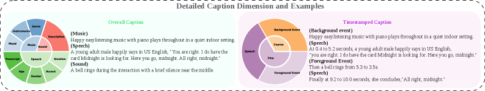
*Figure 2:Illustrative example of two caption types for the same audio clip. Overall captions annotate speech, sound, and music, along with relative temporal order. Timestamped captions provide precise timestamps for foreground events and speech segments.*

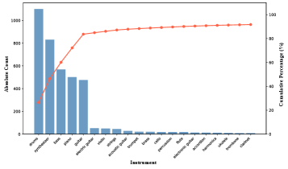
*Figure 3:Instrument distribution of MMAG*

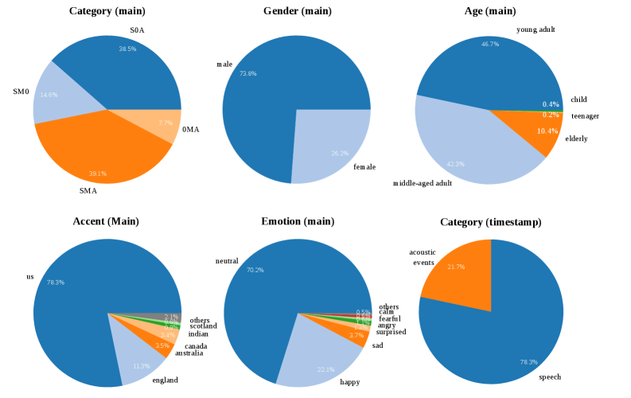
*Figure 4:Label distribution of MMAG*

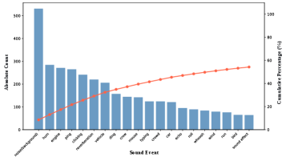
*Figure 5:Sound event distribution of MMAG*

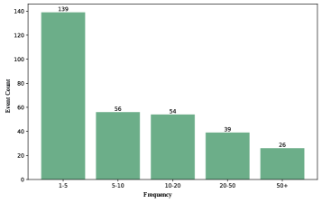
*Figure 6:Frequency distribution of sound events*

---
**Usage Info**: 1738 tokens used.
**Generated at**: 2026-08-10 14:55:38

---

# 📚 Multi Codec Discrete Diffusion Model for Text Guided Speech Inpainting and Editing

🚀 URL: https://arxiv.org/html/2608.06424

## 🌏 Abstract (원문)
Speech recordings often contain missing, corrupted, or incorrect regions that must be reconstructed or modified without re-synthesizing the entire utterance. Speech inpainting restores missing segments, whereas speech editing replaces spoken content according to an edited transcript. Both tasks require the generated speech to express the intended words while remaining consistent with the surrounding speaker identity, prosody, timing, and recording conditions. Discrete diffusion is particularly well suited to these tasks because it can iteratively refine masked tokens while jointly conditioning on both left and right acoustic context. We introduce SIEDD, a discrete diffusion framework for text-guided speech inpainting and editing over hierarchical codec tokens. Its core architecture, HiCoDD, follows the RVQ generation order by representing previously generated codebooks as clean, committed acoustic context and applying diffusion only to the current refinement codebook. This separation enables leakage-free joint training while matching sequential coarse-to-fine inference. The model further combines phoneme-level conditioning, span-localized classifier-free guidance, and duration prediction to support both fixed-duration inpainting and variable-duration text edits. On the RealEdit benchmark, SIEDD achieves the best overall speech-editing performance among the evaluated methods. It also outperforms the evaluated autoregressive baselines across all speech-inpainting settings, on both single and multiple gaps. These results demonstrate that explicitly modeling the codec hierarchy substantially improves context-preserving speech reconstruction and editing. See our full code111https://github.com/iftachShoham/SIEDD.
## 🌏 Abstract (번역)
음성 녹음에는 전체 발화를 다시 합성하지 않고 재구성하거나 수정해야 하는 누락되거나 손상되거나 잘못된 부분이 종종 포함됩니다. 음성 인페인팅은 누락된 부분을 복원하는 반면, 음성 편집은 편집된 스크립트에 따라 음성 콘텐츠를 대체합니다. 두 작업 모두 생성된 음성이 의도된 단어를 표현하면서 주변 화자 신원, 운율, 타이밍 및 녹음 조건과 일관성을 유지해야 합니다. 이산 확산은 마스킹된 토큰을 반복적으로 정제하면서 왼쪽 및 오른쪽 음향 컨텍스트에 동시에 조건을 부여할 수 있기 때문에 이러한 작업에 특히 적합합니다. 우리는 계층적 코덱 토큰을 통해 텍스트 안내 음성 인페인팅 및 편집을 위한 이산 확산 프레임워크인 SIEDD를 소개합니다. 핵심 아키텍처인 HiCoDD는 이전에 생성된 코드북을 깨끗하고 확정된 음향 컨텍스트로 표현하고 현재 정제 코드북에만 확산을 적용하여 RVQ 생성 순서를 따릅니다. 이러한 분리는 순차적인 거친-세밀 추론과 일치하면서 누출 없는 공동 훈련을 가능하게 합니다. 이 모델은 또한 고정 길이 인페인팅과 가변 길이 텍스트 편집을 모두 지원하기 위해 음소 수준 조건부, 스팬 지역화된 분류기 없는 안내, 그리고 길이 예측을 결합합니다. RealEdit 벤치마크에서 SIEDD는 평가된 방법들 중에서 전반적으로 최고의 음성 편집 성능을 달성합니다. 또한 단일 및 다중 간격 모두에서 모든 음성 인페인팅 설정에서 평가된 자기회귀 기준선보다 뛰어난 성능을 보입니다. 이러한 결과는 코덱 계층을 명시적으로 모델링하는 것이 컨텍스트 보존 음성 재구성 및 편집을 크게 향상시킨다는 것을 보여줍니다.

## 🔍 Methods & Results
- SIEDD는 계층적 코덱 토큰을 활용하는 텍스트 안내 음성 인페인팅 및 편집을 위한 이산 확산 프레임워크를 제안합니다.
- 핵심 아키텍처인 HiCoDD는 RVQ 생성 순서를 따르며, 이전에 생성된 코드북을 깨끗한 음향 컨텍스트로 사용하고 현재 정제 코드북에만 확산을 적용합니다.
- 이러한 분리 방식은 누출 없는 공동 훈련을 가능하게 하며, 순차적인 거친-세밀 추론과 일치합니다.
- 모델은 음소 수준 조건부, 스팬 지역화된 분류기 없는 안내, 그리고 길이 예측을 결합하여 고정 길이 인페인팅과 가변 길이 텍스트 편집을 모두 지원합니다.
- RealEdit 벤치마크에서 SIEDD는 평가된 방법들 중 전반적으로 최고의 음성 편집 성능을 달성했습니다.
- 음성 인페인팅 설정(단일 및 다중 간격 모두)에서 평가된 자기회귀 기준선보다 뛰어난 성능을 보였습니다.
- 코덱 계층을 명시적으로 모델링하는 것이 컨텍스트 보존 음성 재구성 및 편집 성능을 크게 향상시킴을 입증했습니다.

## 🖼 Figures
![Figure 1:Overview of the proposed architecture and inference procedure. (1) Architecture: for each target CB 
𝑘
, the noised tokens are denoised by the diffusion decoder while the clean lower CBs 
<
𝑘
 are encoded as committed acoustic context; each block combines temporal self-attention with cross-attention to the lower-CB and phoneme representations.(2) Inference: CBs are generated coarse to fine; at each stage only the edited region is denoised and then committed to the context of the next stage. The final tokens are decoded into the edited waveform. (3) Attention mask: the block-triangular pattern enforces the coarse-to-fine RVQ dependency and blocks access to the clean target CB, avoiding leakage.](../images/2026-08-10/2608.06424/2608.06424_fig0.png)
*Figure 1:Overview of the proposed architecture and inference procedure. (1) Architecture: for each target CB 
𝑘
, the noised tokens are denoised by the diffusion decoder while the clean lower CBs 
<
𝑘
 are encoded as committed acoustic context; each block combines temporal self-attention with cross-attention to the lower-CB and phoneme representations.(2) Inference: CBs are generated coarse to fine; at each stage only the edited region is denoised and then committed to the context of the next stage. The final tokens are decoded into the edited waveform. (3) Attention mask: the block-triangular pattern enforces the coarse-to-fine RVQ dependency and blocks access to the clean target CB, avoiding leakage.*

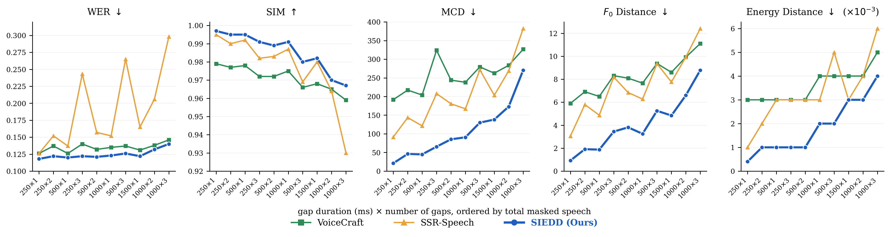
*Figure 2:Speech inpainting results across masked-span configurations, ordered by total masked speech. Lines show the mean. Higher is better for SIM, lower for all other metrics.*

---
**Usage Info**: 1656 tokens used.
**Generated at**: 2026-08-10 14:55:46

---

# 📚 SubtleTalk: Generating Controllable Weakly-correlated Facial Dynamics for 3D Talking Heads via Residual Flow Matching

🚀 URL: https://arxiv.org/html/2608.06408

## 🌏 Abstract (원문)
Audio-driven 3D facial animation aims to synthesize realistic and temporally coherent motions from speech. Despite notable progress in lip synchronization, weakly correlated dynamics, including eyebrow movements, eye blinks, and head motion, which are essential to photorealistic facial animation, remain difficult to model faithfully and often appear static or unnaturally repetitive. We attribute this limitation to three factors: (a) insufficient conditioning for weakly correlated dynamics; (b) the limited ability of deterministic regression to capture diverse motion patterns; (c) data bottlenecks from unreliable upper-face pseudo-labels and limited dataset diversity. To address these issues, we proposeSubtleTalk, a framework for generating natural and controllable weakly correlated facial dynamics via multi-condition modeling and residual flow matching. First, to compensate for the limited guidance of speech alone, we introduce interpretable controls, including prosody, regional intensity, and Valence-Arousal (VA) signals, to explicitly capture the timing, magnitude, and affective variation of weakly correlated dynamics. Second, to overcome the limited expressiveness of deterministic regression, we build residual flow matching based on a stable speech-driven motion prior, allowing the model to capture stochastic deviations beyond deterministic prediction. Third, to alleviate the data bottleneck, we constructSubtleTalk-Face, a large-scale 3D facial animation dataset comprising about 3,900 identities and 74 hours of data, built via a simple and scalable pseudo-labeling pipeline and featuring improved upper-face tracking and frame-level VA annotations. Extensive experiments demonstrate that our method significantly improves the realism and diversity of weakly correlated facial dynamics while preserving accurate lip synchronization. Our project page is available athttps://molly-ding.github.io/SubtleTalk/.
## 🌏 Abstract (번역)
오디오 기반 3D 얼굴 애니메이션은 음성으로부터 사실적이고 시간적으로 일관된 움직임을 합성하는 것을 목표로 합니다. 입술 동기화에서 상당한 진전이 있었음에도 불구하고, 눈썹 움직임, 눈 깜박임, 머리 움직임과 같이 사실적인 얼굴 애니메이션에 필수적이지만 약하게 상관관계가 있는 동적 요소들은 충실하게 모델링하기 어렵고 종종 정적이거나 부자연스럽게 반복되는 경향이 있습니다. 우리는 이러한 한계를 세 가지 요인으로 설명합니다: (a) 약하게 상관관계가 있는 동적 요소에 대한 불충분한 조건화; (b) 다양한 움직임 패턴을 포착하는 결정론적 회귀의 제한된 능력; (c) 신뢰할 수 없는 상안면 의사 레이블과 제한된 데이터셋 다양성으로 인한 데이터 병목 현상. 이러한 문제들을 해결하기 위해, 우리는 다중 조건 모델링 및 잔차 흐름 매칭을 통해 자연스럽고 제어 가능한 약하게 상관관계가 있는 얼굴 동적 요소를 생성하는 프레임워크인 SubtleTalk를 제안합니다. 첫째, 음성 단독으로는 제한적인 안내를 보완하기 위해, 우리는 운율, 지역별 강도, 그리고 VA(Valence-Arousal) 신호를 포함하는 해석 가능한 제어 요소를 도입하여 약하게 상관관계가 있는 동적 요소의 타이밍, 크기 및 정서적 변화를 명시적으로 포착합니다. 둘째, 결정론적 회귀의 제한된 표현력을 극복하기 위해, 우리는 안정적인 음성 기반 움직임 사전(prior)을 기반으로 잔차 흐름 매칭을 구축하여 모델이 결정론적 예측을 넘어선 확률적 편차를 포착할 수 있도록 합니다. 셋째, 데이터 병목 현상을 완화하기 위해, 우리는 약 3,900개의 신원과 74시간 분량의 데이터를 포함하는 대규모 3D 얼굴 애니메이션 데이터셋인 SubtleTalk-Face를 구축했습니다. 이 데이터셋은 간단하고 확장 가능한 의사 레이블링 파이프라인을 통해 구축되었으며, 개선된 상안면 추적 및 프레임 단위 VA 주석을 특징으로 합니다. 광범위한 실험을 통해 우리의 방법이 정확한 입술 동기화를 유지하면서 약하게 상관관계가 있는 얼굴 동적 요소의 사실성과 다양성을 크게 향상시킨다는 것을 입증했습니다. 프로젝트 페이지는 https://molly-ding.github.io/SubtleTalk/ 에서 확인할 수 있습니다.

## 🔍 Methods & Results
- SubtleTalk는 음성으로부터 사실적이고 시간적으로 일관된 3D 얼굴 애니메이션을 생성하는 프레임워크로, 특히 눈썹 움직임, 눈 깜박임, 머리 움직임과 같은 약하게 상관관계가 있는 동적 요소를 자연스럽고 제어 가능하게 모델링하는 데 중점을 둡니다.
- 이 프레임워크는 다중 조건 모델링과 잔차 흐름 매칭(Residual Flow Matching, RFM)을 기반으로 하며, 약하게 상관관계가 있는 동적 요소에 대한 불충분한 조건화, 결정론적 회귀의 제한된 표현력, 데이터 병목 현상이라는 세 가지 주요 한계를 해결합니다.
- SubtleTalk는 음성만으로는 부족한 안내를 보완하기 위해 운율(prosody), 지역별 강도(regional intensity), 그리고 VA(Valence-Arousal) 신호를 포함하는 해석 가능한 제어 요소를 도입하여 약하게 상관관계가 있는 동적 요소의 타이밍, 크기, 정서적 변화를 명시적으로 포착합니다.
- 모델은 두 단계 아키텍처를 사용합니다: 첫 번째 단계인 결정론적 움직임 사전(Deterministic Motion Prior, DMP)은 안정적인 입술 동기화 움직임 사전(prior)을 예측하고, 두 번째 단계인 잔차 흐름 매칭(RFM)은 이 사전 예측을 넘어선 확률적 변화를 모델링합니다.
- DMP는 WavLM 콘텐츠 특징, 형상 파라미터, 이전 움직임 컨텍스트에만 의존하여 입술 움직임과 턱 개방에 대한 압축된 사전 정보를 예측하며, FLAME 정점 공간에서 기하학적 손실(vertex loss, velocity loss)로 감독됩니다.
- RFM은 DMP에서 예측된 움직임 사전과 실제 움직임 간의 잔차를 모델링하며, 표준 흐름 매칭 목적 함수와 함께 속도 손실, 부드러움 손실, 표준 편차 손실 등의 기하학적 보조 손실을 사용하여 사실성과 다양성을 향상시킵니다.
- 명시적인 강도 제어 시 교차 요인 간섭을 완화하기 위해, Implicit Disentangled Control (IDC) 전략을 도입하여 특정 제어 요소를 변경할 때 다른 요인들이 영향을 받지 않도록 합니다.
- 추론 시 VA 신호의 가용성 문제를 해결하기 위해, 음성 기반의 VA Dynamics Predictor (VADP)를 도입하여 자동 및 사용자 안내 정서 제어를 지원합니다.
- 데이터 병목 현상을 완화하기 위해, 약 3,900개의 신원과 74시간 분량의 데이터를 포함하는 대규모 3D 얼굴 애니메이션 데이터셋인 SubtleTalk-Face를 구축했으며, 이는 개선된 상안면 추적 및 프레임 단위 VA 주석을 특징으로 합니다.
- 광범위한 실험 결과, SubtleTalk는 정확한 입술 동기화를 유지하면서 약하게 상관관계가 있는 얼굴 동적 요소(눈썹, 눈 깜박임, 머리 움직임)의 사실성과 다양성을 크게 향상시키는 것으로 나타났습니다.

## 🖼 Figures

*Figure 1.Examples generated by SubtleTalk. Given driving audio and optional controls for regional intensity and Valence-Arousal (VA), SubtleTalk can synthesize natural 3D facial animations. It enables explicit control over eyebrow , eyelid , and head dynamics, and defaults to expressive audio-only generation when auxiliary controls are omitted.*

*Figure 2. Overview of SubtleTalk, a two-stage framework for controllable weakly correlated facial dynamics. A deterministic prior (DMP) first anchors speech-driven lip motion, while residual flow matching model captures diverse upper-face variations. Multimodal conditioning (prosody, regional intensity, and VA) provides explicit control, and VA Dynamics Predictor (VADP) supports fully automatic or user-guided synthesis.*

*Figure 3.Illustration of the implicit disentangled control (IDC) strategy (Sec. 3.4). At each step, only one control dimension in 
𝐼
raw
 is randomly selected and perturbed to form 
𝐼
pert
. This drives the intended motion change via 
𝐿
ctrl
, while 
𝐿
inv
 preserves the remaining controls.*

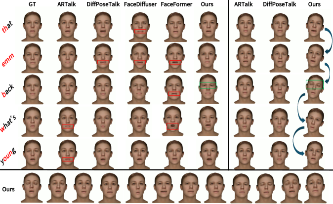
*Figure 4. Qualitative comparison with baseline methods. We contrast lip shapes (left) and head motions (right) against baselines. The bottom row displays a continuous sequence demonstrating our method’s dynamic eyebrow and eye motions over time.*

---
**Usage Info**: 6343 tokens used.
**Generated at**: 2026-08-10 14:55:56

---

# 📚 MI-MIDI: Mechanistic Interpretability of Text-to-MIDI Generation Models via Probing, Lenses and Steering

🚀 URL: https://arxiv.org/html/2608.06638

## 🌏 Abstract (원문)
Mechanistic interpretability of music generation has concentrated on audio models, leaving symbolic models largely unexplored. We analyze two public text-to-MIDI systems of contrasting design: the purpose-built encoder–decoder text2midi and MIDI-LLM, a Llama 3.2 1B model extended with MIDI tokens using linear probing, the logit and tuned lenses, activation patching and difference-in-means steering. Across these methods, we recover musically meaningful structure and show how architecture shapes its formation and control. Pitch, instrumentation, harmony and texture are linearly decodable in both models. text2midi refines predictions gradually across depth, whereas MIDI-LLM works largely in its inherited textual basis before a sharp late rotation into the musical vocabulary; patching identifies a matching late attenuation of prompt-driven instrument transfer. Steering produces bidirectional changes in register and polyphony in both systems, and in tempo/energy in MIDI-LLM. Our two-orientation protocol isolates directional control and shows that all-layer interventions are robust in text2midi but accumulate disruptively in MIDI-LLM. Together, the results provide a practical toolkit for tracing and controlling musical concepts in symbolic generators. Audio examples are available on a demo website111https://jpocwiar.github.io/MI-MIDI-Demo/.
## 🌏 Abstract (번역)
음악 생성의 기계적 해석 가능성은 오디오 모델에 집중되어 왔으며, 기호 모델은 대부분 탐구되지 않은 상태로 남아있습니다. 우리는 대조적인 설계를 가진 두 가지 공개 텍스트-MIDI 시스템을 분석합니다: 목적에 맞게 구축된 인코더-디코더 text2midi와 선형 프로빙, 로짓 및 튜닝된 렌즈, 활성화 패칭, 평균 차이 조향을 사용하여 MIDI 토큰으로 확장된 Llama 3.2 1B 모델인 MIDI-LLM입니다. 이러한 방법들을 통해 우리는 음악적으로 의미 있는 구조를 복구하고, 아키텍처가 그 형성 및 제어를 어떻게 형성하는지 보여줍니다. 피치, 악기 구성, 화성 및 텍스처는 두 모델 모두에서 선형적으로 디코딩 가능합니다. text2midi는 깊이에 따라 예측을 점진적으로 정제하는 반면, MIDI-LLM은 음악적 어휘로 급격하게 전환되기 전까지는 주로 상속된 텍스트 기반에서 작동합니다; 패칭은 프롬프트 기반 악기 전송의 일치하는 후기 감쇠를 식별합니다. 조향은 두 시스템 모두에서 음역 및 다성음악에 양방향 변화를 생성하며, MIDI-LLM에서는 템포/에너지에 변화를 생성합니다. 우리의 두 방향 프로토콜은 방향 제어를 분리하고, 모든 계층 개입이 text2midi에서는 견고하지만 MIDI-LLM에서는 파괴적으로 축적됨을 보여줍니다. 종합적으로, 이 결과들은 기호 생성기에서 음악적 개념을 추적하고 제어하기 위한 실용적인 도구 키트를 제공합니다. 오디오 예시는 데모 웹사이트111https://jpocwiar.github.io/MI-MIDI-Demo/에서 확인할 수 있습니다.

## 🔍 Methods & Results
- 두 가지 텍스트-MIDI 시스템(인코더-디코더 text2midi 및 MIDI 토큰으로 확장된 Llama 3.2 1B 모델인 MIDI-LLM)을 분석했습니다.
- 선형 프로빙, 로짓 및 튜닝된 렌즈, 활성화 패칭, 평균 차이 조향 등의 기법을 사용했습니다.
- 분석은 교차 어텐션 인코더 메모리 대 공유 프롬프트-음악 잔여 스트림, 그리고 박자 기반 REMI+ 대 절대 시간 AMT 토큰화와 같은 아키텍처 차이를 고려했습니다.
- 활성화(잔여 스트림 상태)는 예측 정렬 방식으로 기록되었으며, 인과적 마스킹을 통해 모든 생성 단계에서 활성화를 효율적으로 캡처했습니다.
- 피치, 악기 구성, 화성, 텍스처와 같은 음악적으로 의미 있는 구조가 두 모델 모두에서 선형적으로 디코딩 가능함을 확인했습니다.
- text2midi는 깊이에 따라 예측을 점진적으로 정제하는 반면, MIDI-LLM은 처리 후반에 텍스트 기반에서 음악적 어휘로 급격히 전환됩니다.
- 활성화 패칭을 통해 MIDI-LLM에서 프롬프트 기반 악기 전송의 후기 감쇠를 식별했습니다.
- 조향(steering)을 통해 두 시스템 모두에서 음역 및 다성음악에 대한 양방향 제어가 가능했으며, MIDI-LLM에서는 템포/에너지에 대한 제어도 가능했습니다.
- 두 방향 프로토콜은 모든 계층 개입이 text2midi에서는 견고하지만 MIDI-LLM에서는 파괴적으로 축적됨을 보여주었습니다.
- 연구 결과는 기호 생성기에서 음악적 개념을 추적하고 제어하기 위한 실용적인 도구 키트를 제공합니다.

## 🖼 Figures
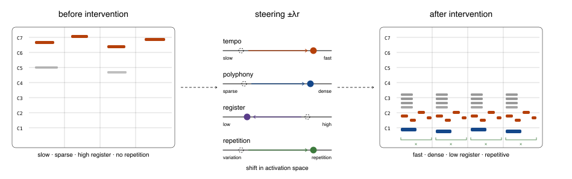
*Figure 1:Activation steering as a control panel for text-to-MIDI: shifting residual-stream activations allows steering the generated score. We locate such concepts in two public models and ask when interventions remain safe.*

*Figure 2:Per-layer probe accuracy for each token-level concept, in text2midi and MIDI-LLM; dashed lines mark each model’s majority-class baseline, so a curve’s gap above its baseline is the lift. Every best-layer entry in Table 3 is the peak of the corresponding curve.*

*Figure 3:Per-layer probe accuracy on SynTheory (mean pooling) for each concept, in text2midi and MIDI-LLM; dashed lines mark each model’s majority-class baseline. Concepts already high at layer 0 (register, progression tonic, pitch-class readouts) are readable from token identity, whereas others (interval, chord quality, chord progression) build up across layers. Every best-layer entry in Table 4 is the peak of the corresponding curve.*

*Figure 4:MIDI share of the full-vocabulary probability mass per layer of MIDI-LLM, for all analyzed tokens and by token type. Through layers 0 to 12 the mass stays near the chance share of the MIDI block (
≈
0.30
, dashed); the readout rotates into the musical vocabulary at layers 13 to 15 (shaded), in the type order special 
→
 note 
→
 time/duration.*

*Figure 5:Tuned lens (blue) vs. classic logit lens (orange), per layer, for text2midi (left) and MIDI-LLM (right): top-1 agreement with the sampled token (top row) and KL divergence to the final distribution on a log scale (bottom row). For MIDI-LLM the tuned lens makes the prediction readable several layers earlier, smoothing the layer 13 to 14 jump; for text2midi it lifts the whole first two-thirds of the curve without changing its gradual shape.*

*Figure 6:Instrument patching (piano 
→
 violin) at each MIDI-LLM layer input: effect score with paired 95% bootstrap CIs, the exact-zero self control and the neutral-prompt control. Transfer stays near full through layer 13 and attenuates sharply at layers 14 to 15; the logit-lens transition is shaded.*

---
**Usage Info**: 3201 tokens used.
**Generated at**: 2026-08-10 14:56:09

---

