# 🚩 (2026-08-11) Scholar Inbox 추천 논문 

# 📚 CuteTTS: Efficient and High-Quality Speech Synthesis via Autoregressive Modeling of Continuous Latents

🚀 URL: https://arxiv.org/html/2608.08638

## 🌏 Abstract (원문)
Zero-shot text-to-speech (TTS) now supports interactive assistants, personalized media, and accessibility tools. All TTS systems require faithful linguistic rendering, consistent speaker identity, and low-latency response. Yet compact streaming systems must preserve sufficient acoustic detail in a predictable low-rate latent sequence, while iterative diffusion sampling and classifier-free guidance multiply inference cost at every autoregressive step. To strike a balance between high-fidelity synthesis and low-latency inference, we presentCuteTTS, a compact continuous-autoregressive TTS system. It combines semantically aligned causal VAE latents with patch-level autoregression, explicit speaker conditioning, and a bidirectional flow-matching head. We further introduce guidance–step distillation, which absorbs classifier-free guidance and multiple solver steps into a single interval-conditioned student. Evaluations on LibriSpeech and Seed-TTS-Eval demonstrate competitive intelligibility and speaker similarity in zero-shot voice cloning, while distillation lowers first-audio latency by 23.3% and real-time factor by 40.8% relative to the base model with comparable objective and subjective quality. These results provide a practical path toward continuous-autoregressive TTS that reconciles high-fidelity generation with the latency demands of real-time interaction.
## 🌏 Abstract (번역)
제로샷 텍스트-음성 변환(TTS)은 이제 대화형 비서, 개인 맞춤형 미디어 및 접근성 도구를 지원합니다. 모든 TTS 시스템은 충실한 언어 렌더링, 일관된 화자 정체성, 그리고 낮은 지연 시간 응답을 요구합니다. 그러나 컴팩트한 스트리밍 시스템은 예측 가능한 낮은 속도의 잠재 시퀀스에서 충분한 음향적 세부 사항을 보존해야 하며, 반복적인 확산 샘플링 및 분류기 없는 가이던스는 모든 자기회귀 단계에서 추론 비용을 증가시킵니다. 고음질 합성 및 낮은 지연 시간 추론 사이의 균형을 맞추기 위해, 우리는 컴팩트한 연속 자기회귀 TTS 시스템인 CuteTTS를 제안합니다. 이 시스템은 의미론적으로 정렬된 인과 VAE 잠재 변수와 패치 수준 자기회귀, 명시적 화자 조건화, 그리고 양방향 플로우 매칭 헤드를 결합합니다. 우리는 또한 분류기 없는 가이던스와 여러 솔버 단계를 단일 간격 조건부 학생 모델로 흡수하는 가이던스-단계 증류(guidance–step distillation)를 도입합니다. LibriSpeech 및 Seed-TTS-Eval에 대한 평가는 제로샷 음성 복제에서 경쟁력 있는 명료도와 화자 유사성을 보여주며, 증류는 기본 모델 대비 첫 오디오 지연 시간을 23.3%, 실시간 계수를 40.8% 낮추면서도 객관적 및 주관적 품질은 유사하게 유지합니다. 이러한 결과는 고음질 생성과 실시간 상호작용의 지연 시간 요구 사항을 조화시키는 연속 자기회귀 TTS를 향한 실용적인 경로를 제공합니다.

## 🔍 Methods & Results
- CuteTTS는 고음질 합성 및 낮은 지연 시간 추론의 균형을 맞추기 위해 제안된 컴팩트한 연속 자기회귀 TTS 시스템입니다.
- 이 시스템은 의미론적으로 정렬된 인과 VAE 잠재 변수, 패치 수준 자기회귀, 명시적 화자 조건화, 그리고 양방향 플로우 매칭 헤드를 결합합니다.
- 분류기 없는 가이던스와 여러 솔버 단계를 단일 간격 조건부 학생 모델로 통합하는 가이던스-단계 증류(guidance–step distillation) 기법을 도입했습니다.
- LibriSpeech 및 Seed-TTS-Eval 데이터셋을 사용하여 평가를 수행했습니다.
- 제로샷 음성 복제에서 경쟁력 있는 명료도와 화자 유사성을 달성했습니다.
- 가이던스-단계 증류를 통해 첫 오디오 지연 시간을 23.3% 감소시키고, 실시간 계수(RTF)를 기본 모델 대비 40.8% 낮추면서도 객관적 및 주관적 품질은 유사하게 유지했습니다.

## 🖼 Figures

*Figure 1:Overview of CuteTTS. A patch encoder aggregates previously generated latent patches for the causal backbone. The final-layer LM hidden state at the current autoregressive position, preceding latent patch, and speaker embedding condition the diffusion head to generate the next continuous patch; for the distilled model, CFG weight 
𝑤
 is supplied as an additional condition. A causal VAE decoder converts completed patches to audio incrementally.*

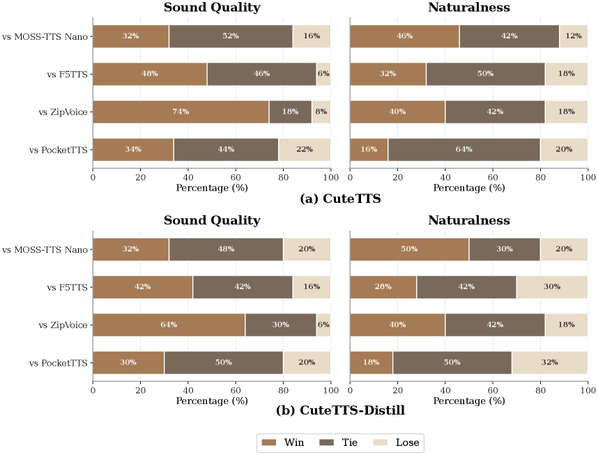
*Figure 2:Subjective evaluation on the LibriSpeech test-clean subset. Results are reported as win/tie/loss percentages from the perspective of each CuteTTS variant.*

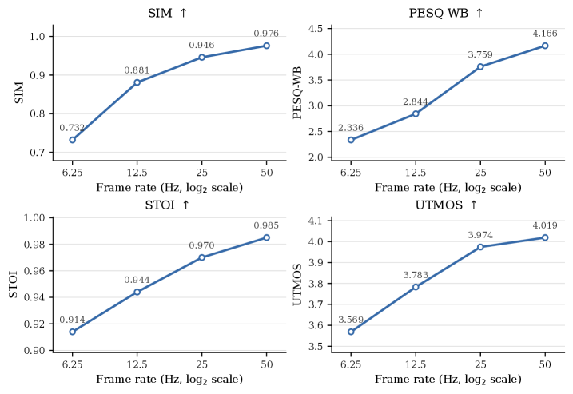
*Figure 3:VAE reconstruction quality at different frame rates on LibriSpeech test-clean. All models use the same training data and training configuration.*

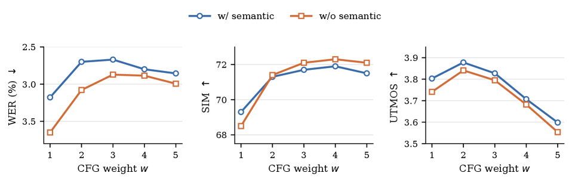
*Figure 4:Effect of semantic alignment on TTS evaluation metrics across CFG weights on LibriSpeech test-clean. The WER axis is reversed so that better performance is shown higher.*

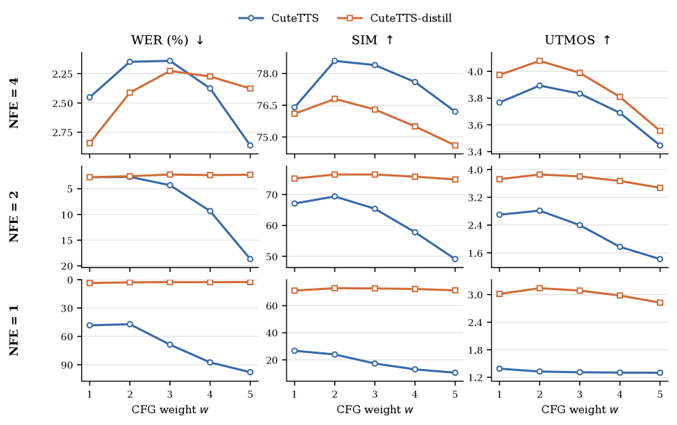
*Figure 5:Effect of guidance–step distillation on TTS performance across CFG weights and diffusion-head NFE budgets on LibriSpeech test-clean. WER axes are reversed so that better performance is shown higher.*

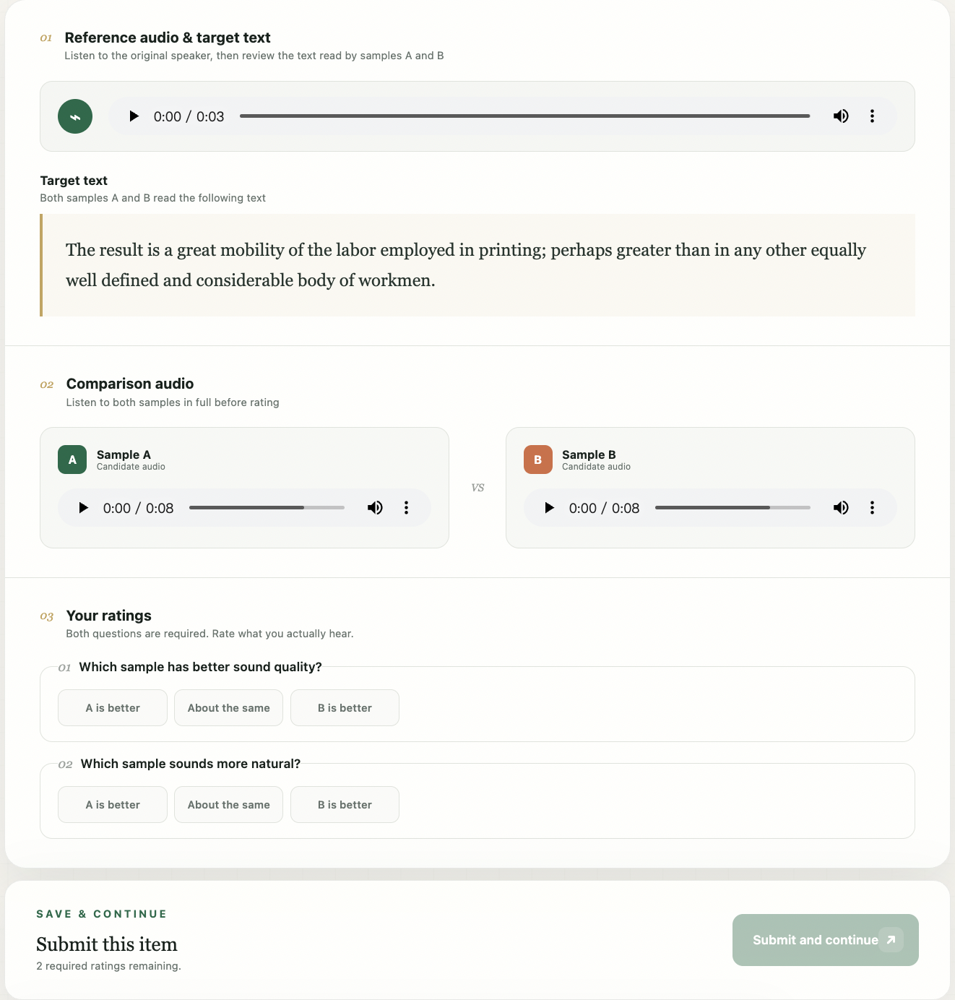
*Figure 6:Annotation interface for the subjective evaluation.*

---
**Usage Info**: 1693 tokens used.
**Generated at**: 2026-08-11 15:19:40

---

# 📚 CtrlSpeech: Coarse-to-Fine Control for Expressive Speech Synthesis

🚀 URL: https://arxiv.org/html/2608.08362

## 🌏 Abstract (원문)
Recent Text-To-Speech (TTS) systems have achieved strong naturalness and zero-shot voice cloning performance, but fine-grained control of expressive speech at the word or phoneme level remains challenging. We proposeCtrlSpeech, a controllable, expressive TTS framework with coarse-to-fine control. Built on the DiTAR architecture,CtrlSpeechcombines global speaker conditioning with phone-aligned pitch, loudness, and duration signals, enabling localized prosodic control while preserving the target speaker’s timbre. This design allows users to adjust expressive attributes at a fine temporal granularity, making speech refinement more flexible and controllable. Experimental results show thatCtrlSpeechachieves competitive zero-shot TTS performance and improves controllability over expressive attributes, demonstrating its effectiveness for flexible and practical expressive speech synthesis. Our demo, code and model weights are available atCtrlSpeech.
## 🌏 Abstract (번역)
최근 Text-To-Speech (TTS) 시스템은 강력한 자연스러움과 제로샷 음성 복제 성능을 달성했지만, 단어 또는 음소 수준에서 표현적인 음성을 세밀하게 제어하는 것은 여전히 어렵습니다. 우리는 거친 수준에서 미세 수준까지 제어 가능한 표현적인 TTS 프레임워크인 CtrlSpeech를 제안합니다. DiTAR 아키텍처를 기반으로 구축된 CtrlSpeech는 전역 스피커 조건화와 음소 정렬된 피치, 음량, 지속 시간 신호를 결합하여 대상 화자의 음색을 보존하면서 지역화된 운율 제어를 가능하게 합니다. 이 설계는 사용자가 미세한 시간적 세분성으로 표현 속성을 조정할 수 있도록 하여 음성 개선을 더욱 유연하고 제어 가능하게 만듭니다. 실험 결과는 CtrlSpeech가 경쟁력 있는 제로샷 TTS 성능을 달성하고 표현 속성에 대한 제어 가능성을 향상시켜 유연하고 실용적인 표현 음성 합성에 대한 효과를 입증합니다. 데모, 코드 및 모델 가중치는 CtrlSpeech에서 확인할 수 있습니다.

## 🔍 Methods & Results
- CtrlSpeech는 정보 손실과 시스템 복잡성을 피하기 위해 이산 코덱 토큰 대신 연속 잠재 공간(VAE)을 사용하여 음성을 모델링합니다.
- 백본으로 DiTAR 아키텍처를 채택하여 패치 간의 인과적 자기회귀 모델링과 각 패치 내의 양방향 확산 모델링을 결합합니다.
- 전역적인 음색 제어를 위해 스피커 임베딩 또는 프롬프트 음성을 통해 화자 정체성을 coarse-grained 제어 속성으로 통합합니다.
- 세밀한 운율 제어를 위해 음소 정렬된 피치(Mel 스케일로 변환 후 128개 빈으로 양자화), 음량(A-가중치 필터 및 RMS 에너지 후 64개 빈으로 양자화), 지속 시간(음소별 시간 길이) 신호를 사용합니다.
- CtrlSpeech는 DiTAR를 기반으로 하며, 음소 임베딩을 피치, 음량, 지속 시간 신호 및 전역 스피커 임베딩으로 보강합니다.
- 음향 모델링은 VAE 연속 잠재 토큰을 사용하며, 각 패치는 4개의 연속 잠재 토큰으로 구성됩니다.
- 모델은 L1 flow-matching 목적 함수와 보조 정지 예측 손실로 최적화됩니다.
- CtrlSpeech는 경쟁력 있는 제로샷 TTS 성능을 달성하고 표현 속성에 대한 제어 가능성을 향상시킵니다.
- 유연하고 실용적인 표현 음성 합성에 효과적임을 입증합니다.

## 🖼 Figures
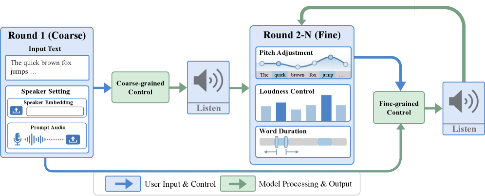
*Figure 1:Coarse-to-fine speech control pipeline.*

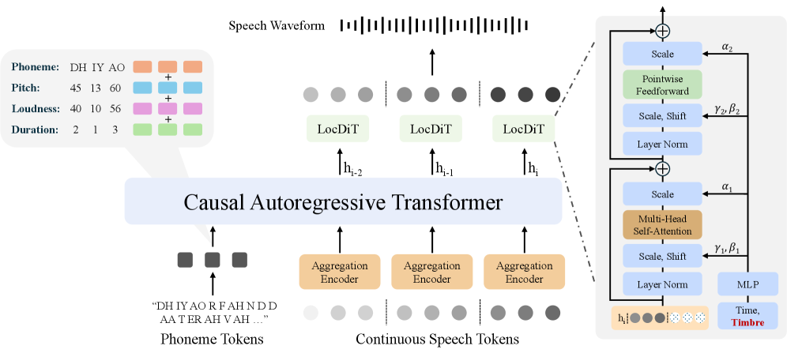
*Figure 2:The architecture of CtrlSpeech.*

---
**Usage Info**: 3442 tokens used.
**Generated at**: 2026-08-11 15:19:47

---

# 📚 SonicWeave: Chunk-Routed Mixture-of-Experts for Unified Audio Scene Generation

🚀 URL: https://arxiv.org/html/2608.09571

## 🌏 Abstract (원문)
Text-conditioned general audio generation is moving beyond isolated speech, music, and sound-effect synthesis toward a single model that can compose them into controllable, coherent audio scenes. This unified setting is particularly challenging: heterogeneous components impose conflicting structural requirements on a shared backbone, while a complex mixed scene may contain locally distinct or overlapping content that demands fine-grained adaptation within the same clip. Existing audio mixture-of-experts (MoEs) mainly route at the domain level, while token-wise routing overlooks the local continuity inherent to acoustic signals. We propose SonicWeave, a flow-matching model for unified audio scene generation. At its core is a chunk-routed MoE with a conflict-gated prior–evidence routing mechanism (CPE-MoE). CPE-MoE routes contiguous acoustic chunks by combining a global prior that encodes the structured text condition and diffusion phase with local evidence from the evolving acoustic state. A learned conflict gate favors the prior when local states are unreliable, while allowing local evidence to influence routing when a region departs from the global scene context. SonicWeave supports speech, music, sound effects, singing, and their fine-grained mixtures with a single set of weights. Across TTS, TTA, and TTM benchmarks, SonicWeave consistently improves over controlled Dense and Base-MoE baselines. Complex-scene evaluation further demonstrates improved compositional quality, while routing analyses reveal content-dependent expert specialization across diffusion phases. These results suggest that temporally coherent, prior–evidence routing is an effective conditional-computation strategy for unified audio generation. Project page:https://caiyunrui.github.io/SonicWeave.
## 🌏 Abstract (번역)
텍스트 조건부 일반 오디오 생성은 고립된 음성, 음악, 음향 효과 합성을 넘어 제어 가능하고 일관된 오디오 장면을 구성할 수 있는 단일 모델로 발전하고 있습니다. 이 통합 설정은 특히 도전적입니다. 이질적인 구성 요소들이 공유 백본에 상충하는 구조적 요구 사항을 부과하는 동시에, 복잡한 혼합 장면은 동일한 클립 내에서 미세 조정된 적응을 요구하는 국소적으로 구별되거나 겹치는 콘텐츠를 포함할 수 있습니다. 기존 오디오 전문가 혼합(MoE) 모델은 주로 도메인 수준에서 라우팅하는 반면, 토큰 단위 라우팅은 음향 신호에 내재된 국소적 연속성을 간과합니다. 우리는 통합 오디오 장면 생성을 위한 플로우 매칭 모델인 SonicWeave를 제안합니다. 그 핵심은 충돌 게이트가 있는 사전-증거 라우팅 메커니즘(CPE-MoE)을 갖춘 청크 라우팅 MoE입니다. CPE-MoE는 구조화된 텍스트 조건과 확산 단계를 인코딩하는 전역 사전과 진화하는 음향 상태에서 얻은 국소 증거를 결합하여 연속적인 음향 청크를 라우팅합니다. 학습된 충돌 게이트는 국소 상태가 신뢰할 수 없을 때 사전을 선호하며, 영역이 전역 장면 컨텍스트에서 벗어날 때 국소 증거가 라우팅에 영향을 미치도록 허용합니다. SonicWeave는 단일 가중치 세트로 음성, 음악, 음향 효과, 노래 및 이들의 미세 조정된 혼합을 지원합니다. TTS, TTA 및 TTM 벤치마크 전반에 걸쳐 SonicWeave는 제어된 Dense 및 Base-MoE 기준선보다 지속적으로 개선된 성능을 보입니다. 복잡한 장면 평가는 향상된 구성 품질을 추가로 입증하며, 라우팅 분석은 확산 단계 전반에 걸쳐 콘텐츠 의존적인 전문가 특화를 보여줍니다. 이러한 결과는 시간적으로 일관된 사전-증거 라우팅이 통합 오디오 생성을 위한 효과적인 조건부 계산 전략임을 시사합니다. 프로젝트 페이지: https://caiyunrui.github.io/SonicWeave.

## 🔍 Methods & Results
- SonicWeave는 오디오와 텍스트를 공동으로 모델링하는 듀얼 스트림 조건부 플로우 매칭 생성기이며, 사전 학습된 스테레오 VAE로 오디오 파형을 연속적인 오디오 잠재 공간으로 인코딩하고, 텍스트 스트림에서는 고정된 언어 인코더가 구조화된 오디오 캡션을 임베딩합니다.
- 핵심 아키텍처는 DiT(Diffusion Transformer)이며, 최종 레이어의 FFN을 CPE-MoE 모듈로 대체하여 플로우 속도를 예측합니다.
- CPE-MoE(Conflict-gated Prior-Evidence Mixture-of-Experts)는 이질적인 오디오에 대한 조건부 용량을 제공하며, 구조화된 텍스트와 확산 단계에서 전역 생성 의도를, 진화하는 오디오 상태에서 국소 음향 콘텐츠를 학습하여 라우팅합니다.
- 라우팅은 연속적인 음향 청크 단위로 이루어지며, 각 청크는 전역적인 '사전(Prior)' 신호(텍스트 요약 및 확산 단계 임베딩)와 국소적인 '증거(Evidence)' 신호(현재 오디오 표현)를 결합하여 전문가를 선택합니다.
- 학습된 '충돌 게이트(Conflict Gate)'는 사전과 증거 사이의 선형 보간을 제어하여, 국소 상태가 신뢰할 수 없을 때는 사전을 선호하고, 국소 영역이 전역 장면 컨텍스트에서 벗어날 때는 국소 증거가 라우팅에 영향을 미치도록 합니다.
- 자연어 주석은 <type>speech</type>와 같은 명시적 태그를 사용하여 오디오 전용 구조화된 캡션으로 변환되며, 이는 음성, 음악, 음향 효과 및 혼합 오디오 전반에 걸쳐 일관된 인터페이스를 제공합니다.
- 모델은 시간 토큰, 텍스트 토큰, 오디오 토큰의 세 가지 양식 그룹을 연결하여 처리하며, 양식별 좌표 시스템을 사용하여 텍스트와 오디오의 고유한 순서를 유지하고 교차 모달 대응을 모델링합니다.
- CLIP에서 사용된 원리에 따라 대칭적인 배치 내 대조 목표를 추가하여 오디오-캡션 표현을 정렬하고, CPE-MoE에서 사용되는 텍스트 기반 사전 및 오디오 기반 증거를 지원합니다.
- 전문가 붕괴를 방지하기 위해 Switch-Transformer 스타일의 보조 손실이 청크 단위로 계산되며, 전체 목표 함수는 플로우 매칭 손실, 대조 손실, 보조 손실의 가중 합으로 구성됩니다.
- 추론 시에는 고정 단계 Euler ODE 솔버와 Adaptive Projected Guidance (APG)를 사용하여 생성된 잠재 공간을 디코딩하여 파형 오디오를 얻습니다.
- SonicWeave는 TTS, TTA, TTM 벤치마크에서 제어된 Dense 및 Base-MoE 기준선보다 지속적으로 향상된 성능을 보였으며, 복잡한 장면 평가에서 향상된 구성 품질을 입증했습니다.
- 라우팅 분석 결과, 확산 단계 전반에 걸쳐 콘텐츠 의존적인 전문가 특화가 나타났으며, 이는 시간적으로 일관된 사전-증거 라우팅이 통합 오디오 생성을 위한 효과적인 조건부 계산 전략임을 시사합니다.

## 🖼 Figures

*Figure 1:Overview of SonicWeave for unified audio scene generation. Natural-language descriptions are converted into structured captions that separate speech content, vocal attributes, music, sound effects, and ambience. A single model then synthesizes these heterogeneous components jointly, while its CPE-MoE module provides conflict-gated, content-aware routing across acoustic chunks.*

*Figure 2:SonicWeave framework. Left: a stereo VAE encodes audio into continuous latents, which are jointly modeled with a structured-caption stream in a flow-matching DiT. Right: the CPE-MoE module groups audio tokens into chunks and fuses a global text-and-phase prior with local acoustic evidence for sparse expert routing.*

![Figure 3:Routing analysis on the balanced routing benchmark. (a) Content-conditioned expert dispatch across routed layers, showing non-uniform and content-dependent specialization. (b) Mean conflict gate 
𝔼
​
[
𝑔
𝑗
|
𝑡
]
 across diffusion phases, showing content-dependent and phase-dependent prior–evidence balancing.](../images/2026-08-11/2608.09571/2608.09571_fig2.png)
*Figure 3:Routing analysis on the balanced routing benchmark. (a) Content-conditioned expert dispatch across routed layers, showing non-uniform and content-dependent specialization. (b) Mean conflict gate 
𝔼
​
[
𝑔
𝑗
|
𝑡
]
 across diffusion phases, showing content-dependent and phase-dependent prior–evidence balancing.*

*Figure 4:Phase- and content-conditioned expert usage. Mean dispatch fractions are shown for each content type over the early, middle, and late thirds of the diffusion trajectory. Content-specific preferences persist across phases, while the degree of concentration changes as generation proceeds.*

*Figure 5:Conflict-gate dynamics and mixed-scene routing. The gym scene cpe_010, showing the gate averaged over four CPE layers and Layer 13 top-1 expert assignments. Complex background regions rely more on acoustic evidence, while the main speech segment shows stronger reliance on the text prior.*

*Figure 6:Gate-controlled prior–evidence routing. Valid chunks are grouped by their conflict-gate values. At low 
𝑔
𝑗
, the fused posterior is close to the global prior; at high 
𝑔
𝑗
, it is close to local evidence. JSD denotes Jensen–Shannon divergence.*

---
**Usage Info**: 4753 tokens used.
**Generated at**: 2026-08-11 15:19:58

---

# 📚 ReLMCodec: Designing Predictable Speech Tokens from Pre-Quantization Phoneme Structure

🚀 URL: https://arxiv.org/html/2608.08286

## 🌏 Abstract (원문)
Neural speech codecs face a fundamental tension in the language-model era: tokens that support high-fidelity reconstruction are not necessarily easy for autoregressive models to predict. Our controlled analysis of diverse codec and self-supervised speech representations shows that clearer phoneme structure before discrete code assignment is consistently associated with easier autoregressive token prediction. Yet phoneme structure alone is insufficient for high-fidelity reconstruction, which also requires reconstruction-relevant acoustic detail. Guided by this observation, we introduce ReLMCodec, a low-bitrate single-codebook speech codec built upon a preserve–control–refine principle: it preserves the linguistic organization of frozen self-supervised learning (SSL) features at the quantizer input, controls reconstruction-driven drift through Pre-quantization Anchor-Preserving Adaptation (PAPA), and refines the quantized latent space with a training-only WavLM-Large L24 teacher to reduce phoneme-level token fragmentation. Together, these components allow acoustic detail to support waveform reconstruction while keeping the resulting token sequence predictable for autoregressive models. At 650 and 800 bps, ReLMCodec moves the empirical single-stream predictability–reconstruction frontier in our evaluations, with gains that carry over to downstream text-to-speech (TTS) synthesis in both intelligibility and speaker similarity.
## 🌏 Abstract (번역)
신경 음성 코덱은 언어 모델 시대에 근본적인 긴장에 직면합니다: 고충실도 재구성을 지원하는 토큰이 자기회귀 모델이 예측하기 쉽지 않다는 것입니다. 다양한 코덱 및 자기지도 음성 표현에 대한 통제된 분석 결과, 이산 코드 할당 전의 명확한 음소 구조가 자기회귀 토큰 예측을 더 쉽게 하는 것과 일관되게 연관되어 있음을 보여줍니다. 그러나 음소 구조만으로는 고충실도 재구성에 불충분하며, 이는 재구성과 관련된 음향적 세부 정보도 필요로 합니다. 이러한 관찰에 따라, 우리는 보존-제어-정제 원칙에 기반한 저비트레이트 단일 코드북 음성 코덱인 ReLMCodec을 소개합니다. ReLMCodec은 양자화기 입력에서 고정된 자기지도 학습(SSL) 특징의 언어적 구성을 보존하고, 전-양자화 앵커 보존 적응(PAPA)을 통해 재구성 기반 드리프트를 제어하며, 음소 수준 토큰 파편화를 줄이기 위해 훈련 전용 WavLM-Large L24 교사를 사용하여 양자화된 잠재 공간을 정제합니다. 이러한 구성 요소들은 음향적 세부 정보가 파형 재구성을 지원하는 동시에 결과적인 토큰 시퀀스를 자기회귀 모델이 예측 가능하도록 합니다. 650 및 800 bps에서 ReLMCodec은 우리의 평가에서 경험적 단일 스트림 예측 가능성-재구성 경계를 이동시키며, 이는 명료도와 화자 유사성 모두에서 다운스트림 텍스트-음성 합성(TTS)으로 이어지는 이득을 가져옵니다.

## 🔍 Methods & Results
- ReLMCodec은 '보존-제어-정제' 원칙에 기반한 단일 스트림 음성 토큰화 설계를 따릅니다.
- **보존(Preserve)**: 양자화기 입력에서 고정된 자기지도 학습(SSL) 경로(W2v-BERT 2.0 L17)를 유지하여 음소 구조 정보를 보존합니다.
- **제어(Control)**: 전-양자화 앵커 보존 적응(PAPA)을 통해 재구성 관련 음향 세부 정보를 고정 스케일 잔차로 매개변수화하여 SSL 기하학의 무제한 교체를 방지합니다. PAPA는 고정된 SSL 특징에 스케일링된 잔차 보정을 추가합니다.
- **정제(Refine)**: 훈련 전용 WavLM-Large L24 교사를 사용하여 양자화된 잠재 표현을 교사 정렬 음소 구조로 정규화하며, 이를 위해 Joint-Marginal Alignment Loss (JMAS loss)를 활용합니다.
- ReLMCodec의 아키텍처는 고정된 W2v-BERT 2.0 L17 특징, 학습 가능한 음향 인코더, 12계층 PAPA 예측기, 단일 계층 EMA 벡터 양자화기(EMA-VQ), 그리고 파형 디코더로 구성됩니다.
- EMA-VQ는 50 TPS에서 8,192개(8K) 또는 65,536개(64K) 코드워드를 사용하여 650/800 BPS를 달성하며, 8차원 인자화된 코드를 사용합니다.
- 훈련은 커밋먼트 손실, 재구성 손실, 적대적 손실(다중 주기 및 다중 스케일 STFT 판별자 사용), 사후 양자화 정렬(JMAS) 손실, 그리고 고정된 WavLM 화자 검증(WavLM-SV) 모델의 지각 손실을 포함한 다양한 손실 함수를 사용합니다.
- ReLMCodec은 650 및 800 bps에서 단일 스트림 예측 가능성-재구성 경계를 개선하며, 이는 다운스트림 텍스트-음성 합성(TTS)에서 명료도와 화자 유사성 향상으로 이어지는 이득을 가져옵니다.

## 🖼 Figures

*Figure 1:Structure transfer from pre-quantization representations to matched P-VQ assignments. Top: frame-level representations colored by phoneme labels. Middle and bottom: token–phoneme co-occurrence after matched 8K P-VQ assignment. Concentrated blocks indicate that phoneme structure remains visible after discrete assignment. Additional examples are provided in Appendix Figures A2–A4.*

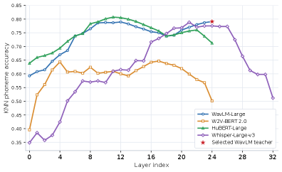
*Figure 2:Layer-wise KNN phoneme accuracy for four encoders; the star marks the selected WavLM-Large L24 teacher.*

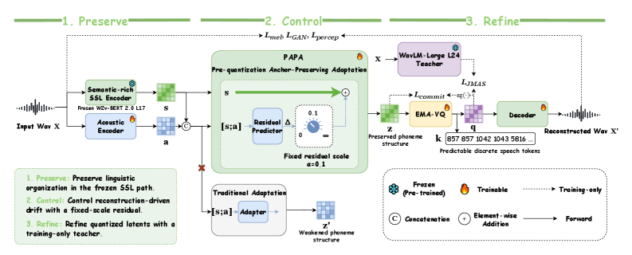
*Figure 3:Overall architecture of ReLMCodec.*

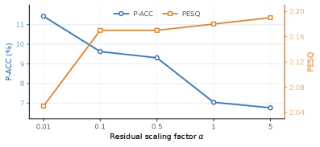
*Figure 4:PAPA residual-scale ablation.*

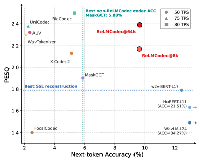
*Figure A1:P-ACC–PESQ diagnostic across waveform codecs and non-waveform references. The SSL and semantic-tokenizer references use matched waveform decoders and serve only as diagnostic context.*

*Figure A2:Pre-quantization t-distributed stochastic neighbor embedding (t-SNE) representations for representative codec, tokenizer, ReLMCodec, and SSL features. Points are colored by phoneme label, and each panel reports KNN phoneme accuracy under the shared analysis protocol.*

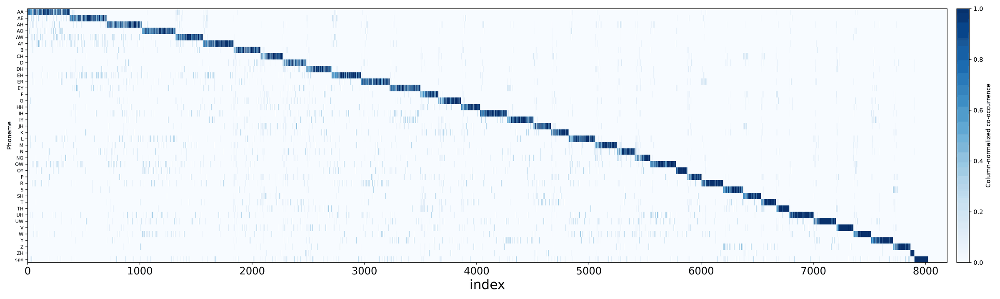
*Figure A3:Token–phoneme co-occurrence for representative waveform codecs under the matched 8K P-VQ protocol. Columns are normalized across phonemes and grouped by their dominant phoneme.*

*Figure A4:Token–phoneme co-occurrence for MaskGCT, ReLMCodec, and SSL references under the same matched P-VQ protocol. ReLMCodec retains visibly concentrated phoneme–token structure relative to the representative waveform codecs in Appendix Figure A3; the SSL panels provide reference organization.*

*Figure A5:Human mean opinion score (H-MOS) for reconstructed speech. ReLMCodec@64K has the highest mean H-MOS among the evaluated codecs and is closest to ground truth; the mean for ReLMCodec@8K also exceeds that of X-Codec2. Boxes summarize rating distributions, center lines show medians, and red markers show means.*

---
**Usage Info**: 4967 tokens used.
**Generated at**: 2026-08-11 15:20:14

---

# 📚 Beyond Reconstruction: Full-Context Generative DiT for Music Generation

🚀 URL: https://arxiv.org/html/2608.08787

## 🌏 Abstract (원문)
Hybrid music generators combine the long-range planning of an autoregressive language model with the fidelity of a diffusion- or flow-based acoustic renderer. Yet renderers are trained with clean, target-derived codec tokens but deployed with imperfect language-model predictions, creatingcodec-interface exposure bias. Rather than treating rendering as a simple reconstruction task, we formulate it as full-context generation from an imperfect discrete plan. We introduce FullDiT, a conditional DiT that fuses eight frame-aligned RVQ streams with independently encoded captions and lyrics and uses non-causal self-attention over the complete acoustic latent sequence. During training, Error-Matched Distractor Conditioning (EMDC) matches per-codebook replacement rates to teacher-forced top-1 error rates and samples near-miss tokens from cosine-KNN neighborhoods without changing the acoustic target. At inference, four-way classifier-free guidance (4-CFG) independently scales codec, lyric, and caption guidance increments. Matched ablations show that EMDC improves ViSQOL by 0.77 under synthetic corruption and is clearly preferred in non-tied comparisons with fixed language-model tokens. Further ablations show gains from full-song context and renderer-side text conditioning. The complete system outperforms five commercial systems on 15 of 18 automatic metrics and ranks among the top three on the Artificial Analysis Music with Vocals Leaderboard. The demo page is available athttps://selinacloudl.github.io/fulldit-demo/.
## 🌏 Abstract (번역)
하이브리드 음악 생성기는 자기회귀 언어 모델의 장거리 계획 능력과 확산 또는 플로우 기반 음향 렌더러의 충실도를 결합합니다. 그러나 렌더러는 깨끗하고 목표에서 파생된 코덱 토큰으로 훈련되지만, 불완전한 언어 모델 예측과 함께 배포되어 코덱 인터페이스 노출 편향을 생성합니다. 렌더링을 단순한 재구성 작업으로 취급하는 대신, 우리는 이를 불완전한 이산 계획으로부터의 전체 맥락 생성으로 공식화합니다. 우리는 독립적으로 인코딩된 캡션과 가사와 함께 8개의 프레임 정렬 RVQ 스트림을 융합하고 전체 음향 잠재 시퀀스에 대해 비인과적 자기 주의를 사용하는 조건부 DiT인 FullDiT를 소개합니다. 훈련 중, 오류 일치 방해 조건화(EMDC)는 코드북별 대체율을 교사 강제 상위 1위 오류율과 일치시키고 음향 목표를 변경하지 않고 코사인-KNN 이웃에서 근접 오차 토큰을 샘플링합니다. 추론 시, 4방향 분류기 없는 안내(4-CFG)는 코덱, 가사 및 캡션 안내 증분을 독립적으로 조정합니다. 일치하는 제거 연구는 EMDC가 합성 손상 하에서 ViSQOL을 0.77 개선하고 고정된 언어 모델 토큰과의 비연결 비교에서 명확하게 선호됨을 보여줍니다. 추가 제거 연구는 전체 노래 맥락 및 렌더러 측 텍스트 조건화로부터의 이득을 보여줍니다. 완전한 시스템은 18개 자동 측정 항목 중 15개에서 5개의 상용 시스템을 능가하며, Artificial Analysis Music with Vocals 리더보드에서 상위 3위 안에 랭크됩니다. 데모 페이지는 https://selinacloudl.github.io/fulldit-demo/에서 확인할 수 있습니다.

## 🔍 Methods & Results
- FullDiT는 자기회귀 언어 모델과 확산/플로우 기반 음향 렌더러를 결합한 하이브리드 음악 생성 시스템의 핵심 구성 요소입니다.
- 시스템은 시맨틱 인식 RVQ 토크나이저, 계층적 자기회귀 언어 모델(8B 전역 LLM 및 0.4B 지역 LLM), 선택적 2단계 멜로디 모듈, 그리고 FullDiT로 구성됩니다.
- FullDiT는 80억 개의 매개변수를 가진 비인과적 DiT 모델로, 완전한 코덱 시퀀스, 캡션, 가사에 조건화되어 연속 VAE 잠재 공간에서 전체 노래 플로우 매칭을 수행하며, VAE 디코더는 출력을 48kHz 스테레오 오디오로 변환합니다.
- FullDiT는 8개의 프레임 정렬 RVQ 스트림과 독립적으로 인코딩된 캡션 및 가사를 융합하고, 전체 음향 잠재 시퀀스에 대해 비인과적 자기 주의를 사용하여 각 프레임이 정렬된 코덱 조건과 과거 및 미래 음향 상태를 결합할 수 있도록 합니다.
- 정보 병목 현상을 피하기 위해, 원본 캡션과 가사는 언어 모델의 예측된 코덱 계획에만 의존하지 않고 FullDiT에 렌더러 측 조건으로 직접 제공됩니다.
- 오류 일치 방해 조건화(EMDC)는 훈련 중 깨끗한 코덱 시퀀스(c_gt)에서 손상된 코덱 조건(c~)을 구성하되, 목표 음향 잠재(z_0)는 변경하지 않아 코덱 인터페이스 노출 편향을 해결합니다.
- EMDC는 각 코드북의 교체율을 교사 강제 상위 1위 오류율에 맞춰 조정하고, 코사인-KNN 이웃에서 근접 오차 토큰을 샘플링하여 불확실성을 반영합니다.
- 4방향 분류기 없는 안내(4-CFG)는 추론 시 코덱, 가사, 캡션 안내 증분을 독립적으로 조절하여 각 조건이 기여하는 증분 벡터 필드를 세밀하게 제어할 수 있도록 합니다.
- EMDC는 합성 손상 하에서 ViSQOL 점수를 0.77 개선하고, 고정된 언어 모델 토큰과의 비교에서 명확하게 선호되는 것으로 나타났습니다.
- 전체 노래 맥락 및 렌더러 측 텍스트 조건화가 성능 향상에 기여함이 제거 연구를 통해 확인되었습니다.
- 완성된 시스템은 18개 자동 측정 항목 중 15개에서 5개의 상용 시스템보다 우수한 성능을 보였으며, Artificial Analysis Music with Vocals 리더보드에서 상위 3위 안에 랭크되었습니다.

## 🖼 Figures
![Figure 1:FullDiT acoustic renderer. Independently encoded lyrics and captions provide textual conditions, while frame-aligned multi-codebook RVQ tokens provide the discrete song plan. The illustrated plan mixes clean tokens with plausible near-miss substitutions. EMDC constructs this imperfect condition to approximate errors in a language-model-predicted plan, but changes only the codec condition: the paired clean target waveform and its target VAE latent remain unchanged. Rather than reconstructing the corrupted token plan, FullDiT uses text and non-causal full-song context to generatively recover a complete VAE-latent sequence consistent with the unchanged clean target. A frozen VAE decoder then maps the recovered latents to waveform.](../images/2026-08-11/2608.08787/2608.08787_fig0.png)
*Figure 1:FullDiT acoustic renderer. Independently encoded lyrics and captions provide textual conditions, while frame-aligned multi-codebook RVQ tokens provide the discrete song plan. The illustrated plan mixes clean tokens with plausible near-miss substitutions. EMDC constructs this imperfect condition to approximate errors in a language-model-predicted plan, but changes only the codec condition: the paired clean target waveform and its target VAE latent remain unchanged. Rather than reconstructing the corrupted token plan, FullDiT uses text and non-causal full-song context to generatively recover a complete VAE-latent sequence consistent with the unchanged clean target. A frozen VAE decoder then maps the recovered latents to waveform.*

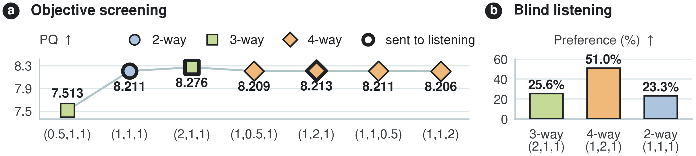
*Figure 2:Four-way CFG analysis: (a) Audiobox PQ screening of seven guidance tuples; (b) song-weighted selection shares from the blind three-way forced-choice evaluation of the three selected candidates.*

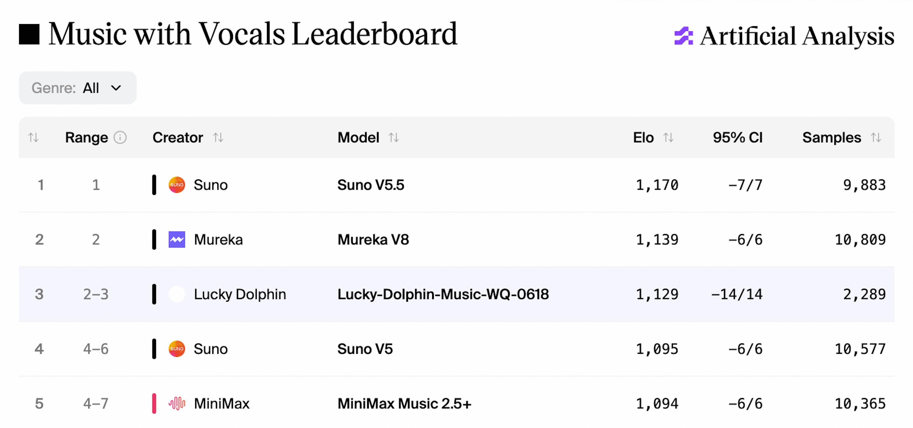
*Figure 3:Archived Artificial Analysis Music with Vocals Leaderboard snapshot used in this paper. The highlighted Lucky Dolphin entry, listed as Lucky-Dolphin-Music-WQ-0618, corresponds to our complete system.*

---
**Usage Info**: 4333 tokens used.
**Generated at**: 2026-08-11 15:20:25

---

# 📚 VIOLET: High-Fidelity Violin Synthesis with Techniques and Dynamics

🚀 URL: https://arxiv.org/html/2608.07944

## 🌏 Abstract (원문)
Neural synthesis for musical instruments has the potential to revolutionize current practices that use concatenative synthesis and a sample library. However, most research focused on piano synthesis and expressive performance generation; little work has been done on continuously articulated instruments like the violin, let alone rendering them with playing techniques and dynamics. We presentVIOLET, a latent-diffusion framework for controllable violin synthesis, which uses a Diffusion Transformer (DiT) with rectified flow to synthesize high-fidelity audio from MIDI notes, playing techniques, and continuous dynamics. To train VIOLET, in addition to using a few existing datasets, we curate a new dataset namedCSV-TD, which contains 39	h of 48	kHz synthetic audio and time-aligned annotations of MIDI notes, note-level techniques, and continuous dynamics curves. Objective and subjective evaluations show that VIOLET synthesizes violin performances with high technique adherence, accurate pitch and timing alignment, and good dynamics control. It outperforms the current state-of-the-art neural violin synthesis system and approaches a top commercial virtual instrument in terms of technique clarity, naturalness, and dynamics following.
## 🌏 Abstract (번역)
악기 신경 합성 기술은 연결 합성 및 샘플 라이브러리를 사용하는 현재 관행에 혁명을 일으킬 잠재력을 가지고 있습니다. 그러나 대부분의 연구는 피아노 합성 및 표현적인 연주 생성에 집중되었으며, 바이올린과 같이 지속적으로 아티큘레이션되는 악기에 대해서는 연주 기법과 다이내믹스를 사용하여 렌더링하는 연구가 거의 이루어지지 않았습니다. 본 논문에서는 MIDI 음표, 연주 기법 및 연속적인 다이내믹스로부터 고음질 오디오를 합성하기 위해 정류 흐름(rectified flow)을 사용하는 Diffusion Transformer (DiT)를 활용하는 제어 가능한 바이올린 합성을 위한 잠재 확산 프레임워크인 VIOLET을 소개합니다. VIOLET을 훈련시키기 위해, 기존의 몇몇 데이터셋 외에도, 39시간 분량의 48kHz 합성 오디오와 MIDI 음표, 음표 수준 기법, 연속적인 다이내믹스 곡선의 시간 정렬 주석을 포함하는 CSV-TD라는 새로운 데이터셋을 구축했습니다. 객관적 및 주관적 평가는 VIOLET이 높은 기법 준수도, 정확한 피치 및 타이밍 정렬, 그리고 우수한 다이내믹스 제어 기능을 갖춘 바이올린 연주를 합성함을 보여줍니다. VIOLET은 현재 최첨단 신경 바이올린 합성 시스템을 능가하며, 기법 명확성, 자연스러움, 다이내믹스 추종성 측면에서 최고의 상업용 가상 악기에 근접합니다.

## 🔍 Methods & Results
- VIOLET은 고음질 바이올린 합성을 위한 2단계 프레임워크로, DACVAE 모델을 미세 조정하여 바이올린 오디오를 압축된 잠재 공간으로 인코딩하고, Latent Diffusion Model (LDM)을 훈련하여 잠재 벡터를 합성합니다.
- 시스템은 MIDI 음표, 연주 기법, 연속적인 다이내믹스라는 세 가지 병렬 제어 신호를 사용하며, 이들은 각각의 임베더를 통해 처리되고 Adaptive Layer Normalization (AdaLN)을 통해 Diffusion Transformer (DiT) 백본에 주입되어 생성 과정을 안내합니다.
- DACVAE (Descript Audio Codec의 VAE 버전)를 바이올린 녹음에 미세 조정하여 오디오 잠재 표현으로 사용했으며, 이를 통해 바이올린의 고주파 재구성이 향상되었습니다.
- 컨디셔닝 입력으로 MIDI 음표(G3-A7 피치 범위의 이진 피아노롤), 12가지 연주 기법(음표 수준의 이진 피아노롤), 연속적인 다이내믹스(CC1 정보를 [0,1]로 정규화하고 제로 오더 홀드 보간)를 사용합니다.
- MIDI 임베더는 1D 인과 컨볼루션을 사용하여 음표 피아노롤을 잠재 프레임 속도로 시간적으로 다운샘플링하고, 기법 임베더는 기법 피아노롤을 직접 다운샘플링하며, 다이내믹스 임베더는 선형 레이어로 다이내믹스 곡선을 투영합니다.
- DiT의 AdaLN 설계를 따라, 확산 단계 임베딩에서 계산된 전역 변조 매개변수와 세 가지 제어 임베딩에서 계산된 세 가지 로컬 변조 매개변수를 합산하여 최종 변조 매개변수를 생성합니다.
- 정류 흐름(Rectified flow) 목표를 사용하여 모델 `v_theta(z_t, t, c)`를 훈련하여 선형 보간 `z_t = (1-t)z0 + tz1`의 경로별 속도 `v* = z1 - z0`를 예측합니다.
- 추론 시에는 가우시안 노이즈에서 시작하여 학습된 속도 필드를 역방향으로 통합하며, MIDI만, MIDI와 기법, 모든 제어라는 세 가지 중첩된 조건 세트에서 네트워크를 평가하는 구성적 분류기 없는 안내(compositional classifier-free guidance) 방식을 사용합니다.
- 모델의 고정된 컨텍스트 창을 넘어서는 길이를 렌더링하기 위해, 대상 타임라인을 50% 중첩되는 창으로 나누고, 각 창을 독립적으로 노이즈 제거한 후 Hann 창을 사용하여 시간 영역에서 중첩-합산하여 부드러운 전환을 보장합니다.

## 🖼 Figures
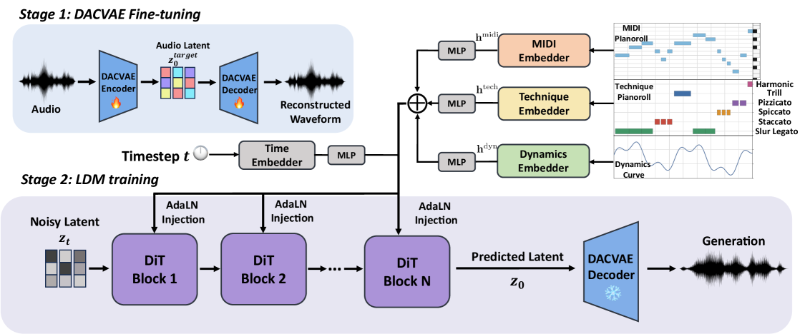
*Figure 1:Overall pipeline of the VIOLET framework.*

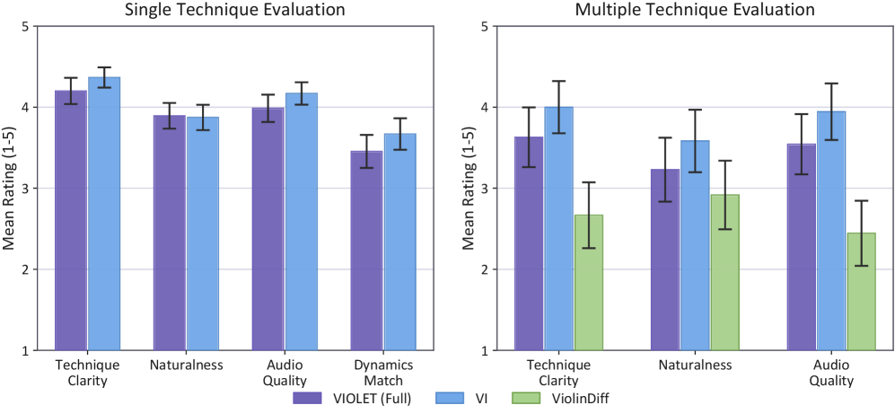
*Figure 2:Mean single-technique (left) and multi-technique (right) ratings with 95% confidence intervals. ViolinDiff appears only in the multi-technique setting.*

---
**Usage Info**: 4202 tokens used.
**Generated at**: 2026-08-11 15:20:35

---

# 📚 Towards Expressive and Faithful Audio-to-Image Generation: A Unified Multimodal Dataset and Synthesis Framework

🚀 URL: https://arxiv.org/html/2608.09529

## 🌏 Abstract (원문)
As an important subfield of cross-modal generation, synthesizing static visual content in the form of images from audio, namely audio-to-image (A2I) generation, has attracted increasing research attention in recent years. Nevertheless, despite the remarkable visual quality of modern text-to-image (T2I) models, the performance of A2I remains fundamentally limited by traditional datasets, which often lack both high-fidelity images and precise cross-modal alignment. As a result, existing methods still struggle to achieve high-quality audio-to-image generation through finetuning strong T2I models, thereby constraining practical applications in this area. Motivated by this gap, we introduce A2I-Set, a unified, high-quality tri-modal dataset consisting of 323K paired audio, images, and detailed text captions, specifically designed for audio-visual research, including audio-conditioned image generation. Besides, we developed a new mixed-source test set for the A2I task through human supervision. We further propose an A2I model, AudioCanvas, fine-tuned on our A2I-Set. Experiments show that AudioCanvas achieves more visually expressive as well as cross-modal alignment results that generally outperforming existing approaches. Our dataset and source code are available athttps://github.com/gdx012/A2I-Generation.
## 🌏 Abstract (번역)
크로스모달 생성의 중요한 하위 분야로서, 오디오로부터 이미지 형태의 정적 시각 콘텐츠를 합성하는 오디오-투-이미지(A2I) 생성은 최근 몇 년간 연구자들의 관심을 끌고 있습니다. 그럼에도 불구하고, 최신 텍스트-투-이미지(T2I) 모델의 뛰어난 시각적 품질에도 불구하고, A2I의 성능은 고품질 이미지와 정밀한 크로스모달 정렬이 모두 부족한 기존 데이터셋에 의해 근본적으로 제한됩니다. 그 결과, 기존 방법들은 강력한 T2I 모델을 미세 조정하여 고품질 오디오-투-이미지 생성을 달성하는 데 여전히 어려움을 겪고 있으며, 이는 이 분야의 실제 적용을 제약합니다. 이러한 격차에 동기 부여를 받아, 우리는 오디오 조건부 이미지 생성을 포함한 오디오-시각 연구를 위해 특별히 설계된 323K 쌍의 오디오, 이미지 및 상세 텍스트 캡션으로 구성된 통합된 고품질 삼중 모달 데이터셋인 A2I-Set을 소개합니다. 또한, 우리는 인간 감독을 통해 A2I 작업을 위한 새로운 혼합 소스 테스트 세트를 개발했습니다. 우리는 A2I-Set으로 미세 조정된 A2I 모델인 AudioCanvas를 추가로 제안합니다. 실험 결과 AudioCanvas는 기존 접근 방식보다 일반적으로 더 시각적으로 표현력이 뛰어나고 크로스모달 정렬이 잘 된 결과를 달성함을 보여줍니다. 우리의 데이터셋과 소스 코드는 https://github.com/gdx012/A2I-Generation 에서 확인할 수 있습니다.

## 🔍 Methods & Results
- 오디오 입력(a)에 기반하여 이미지를 합성하는 생성 모델(G) 학습을 목표로 하며, 기존 T2I 확산 모델의 이미지 생성 능력을 활용하여 오디오 임베딩(e_a)을 T2I 모델에 통합하는 방식으로 문제를 전환합니다.
- 기존 방법들이 오디오 특징을 텍스트 특징에 직접 매핑하는 것과 달리, 본 연구에서는 FiLM-weighted Audio-Text Fusion (FAT Fusion)이라는 새로운 주입 방법을 제안합니다.
- Stable Diffusion 모델 미세 조정 전에 Audio Projector 모듈을 도입하여 CLAP 모델의 다단계 특징을 추출하고 MLP를 통해 차원을 조정한 후, CLIP 모델 출력과 정렬되도록 학습합니다. 이때, 주석의 객체 요소를 활용하여 'An image of <object1> and <object2> ...'와 같은 CLIP 입력을 사용합니다.
- Audio Projector는 CLAP에서 추출된 다층 오디오 임베딩을 MLP를 통해 투영하고, InfoNCE 손실과 MSE 손실을 결합한 공동 학습 전략을 사용하여 CLIP 공간과의 정렬을 최적화합니다.
- FAT Fusion 모듈은 Audio Projector에서 얻은 투영된 오디오 특징을 사전 학습된 UNet 모델에 통합합니다. UNet의 각 교차 주의 계층에 새로운 오디오 전용 교차 주의 계층을 추가하고, 텍스트 정보와 오디오 정보를 통합한 특징을 FiLM(Feature-wise Linear Modulation)과 유사한 유연한 특징 융합 기술을 사용하여 결합합니다.
- 모델 학습 시, 사전 학습된 확산 모델의 파라미터는 고정하고 AudioCanvas만 미세 조정합니다. 제안된 A2I-Set 데이터셋을 사용하며, 원본 Stable Diffusion과 동일한 학습 목표를 따릅니다.
- 스타일 일관성을 위해 0.1의 확률로 오디오 조건을 무작위로 제거하며, 이는 추론 단계에서 분류기 없는 안내(classifier-free guidance)를 가능하게 합니다.
- A2I-Set은 323K 쌍의 오디오, 이미지, 상세 텍스트 캡션으로 구성된 통합된 고품질 삼중 모달 데이터셋으로, 오디오-시각 연구 및 A2I 생성을 위해 특별히 설계되었습니다.
- 인간 감독을 통해 A2I 작업을 위한 새로운 혼합 소스 테스트 세트를 개발했습니다.
- 실험 결과, AudioCanvas는 기존 접근 방식보다 시각적으로 더 표현력이 뛰어나고 크로스모달 정렬이 잘 된 결과를 달성했습니다.

## 🖼 Figures

*Figure 1.Some examples from A2I-Set. A2I-Set has a detailed description of audio as well as paired visual generation instructions Benefit from strict filter strategy and strong T2I model, our images are superior in terms of visual effects and audio-vision alignment.*

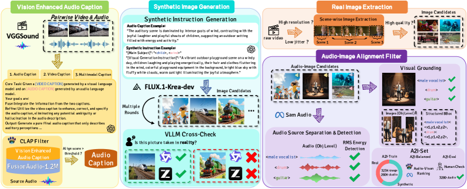
*Figure 2.An overview of our proposed A2I-Set dataset synthesis pipeline, where we used multiple reliable models for captioning, filtering, generation, and evaluation. Human experts are employed to ensure data quality.*

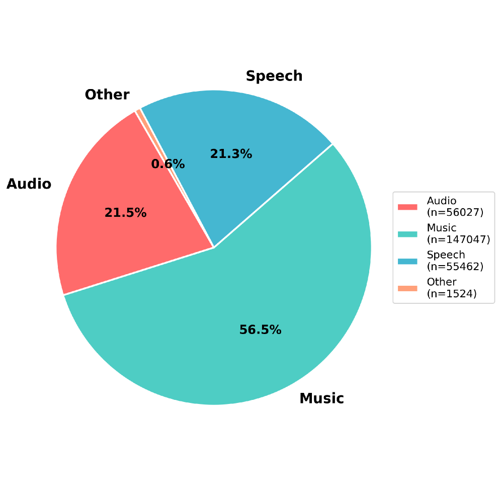
*Figure 3.The proportion of different categories of audio in the training set of A2I-Set.*

*Figure 3.The proportion of different categories of audio in the training set of A2I-Set.*

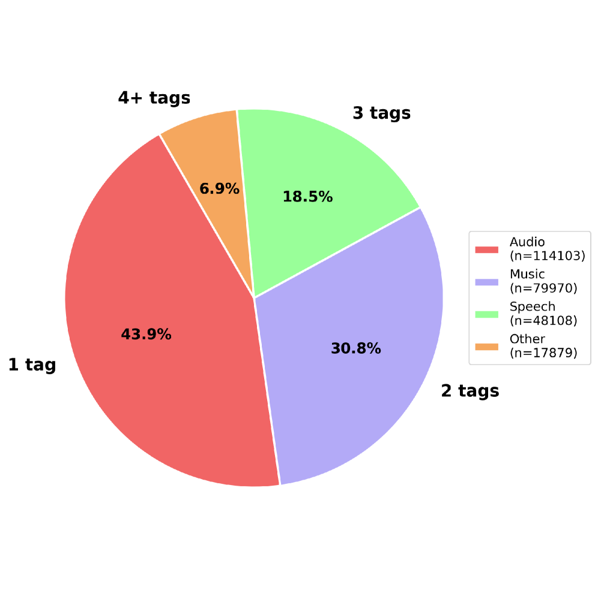
*Figure 4.Proportion of the number of sound sources in the audio of A2I-Set. A2I-Set has a uniform proportion of sound sources.*

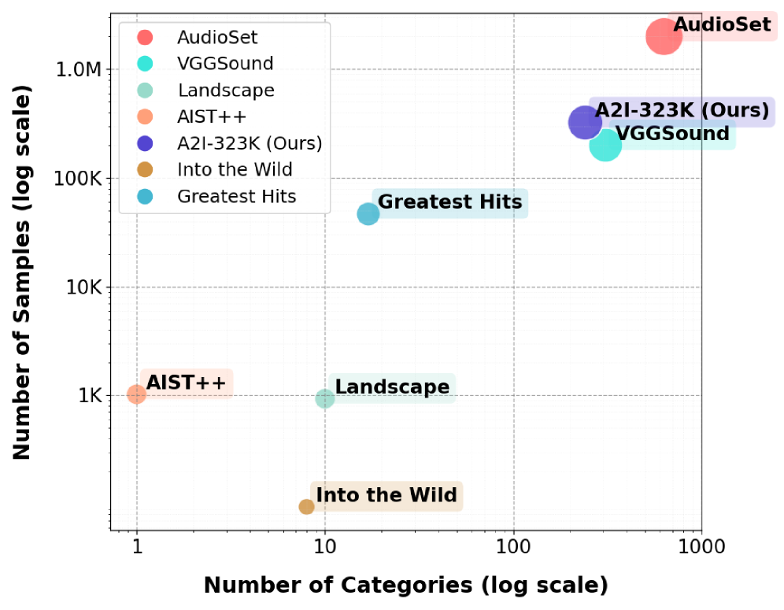
*Figure 5.Comparison of A2I-Set with several other audio-visual related datasets.*

*Figure 6.The overview of audio-to-image generation architecture AudioCanvas, audio features are injected into the diffusion model through FAT-Fusion. We keep the text input empty for both training and inference stages. Only few modules need training while the diffusion model backbone is frozen.*

*Figure 7.A complete example of caption transformation. In the Multimodal Caption stage, video caption (a) and audio caption (b) are firstly transformed into an audio caption with video message (c). To fit Text2image model input, it is then utilized to construct audio related image instruction (d).*

*Figure 8.The correspondence between audio categories and image counts in A2I-240K-train. Note that one piece of data can include multiple audio categories. Some categories are omitted to save space. Music, speeches, and sounds are displayed in different colors.*

*Figure 12.Additional image examples of A2I-Set.*

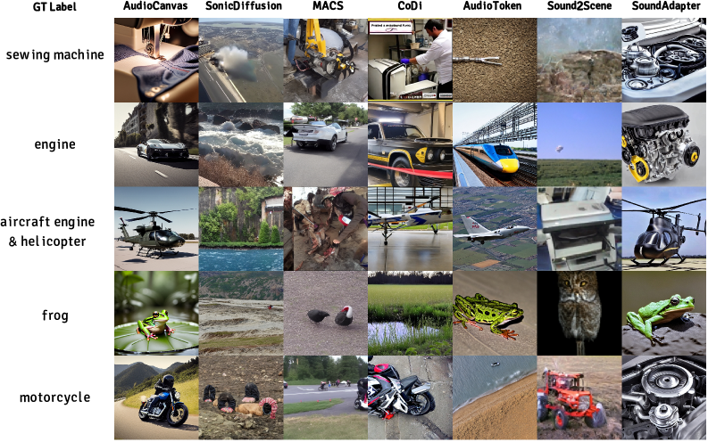
*Figure 13.Comparison results of different models on A2I-eval and Landscape. Zoom in for a better experience.*

*Figure 14.More results generated by AudioCanvas. Zoom in for a better viewing experience.*

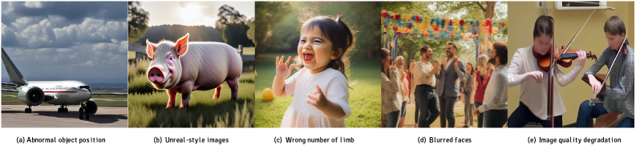
*Figure 15.Some failure generated cases. Zoom in for a better viewing experience.*

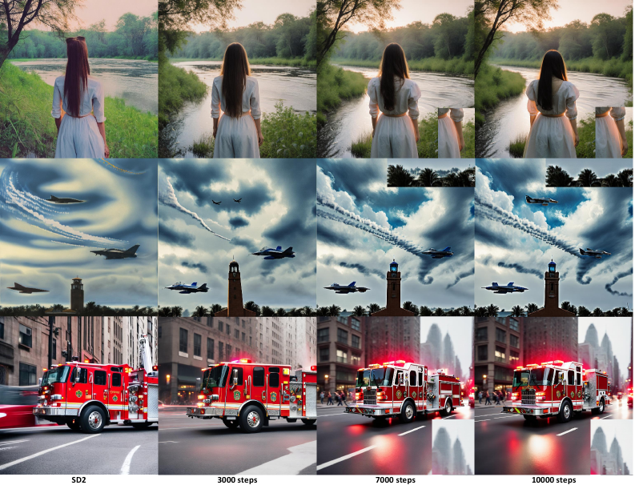
*Figure 16.Test results of SD2 fine-tuned on A2I-balanced. To ensure fairness, the seeds are set to be consistent. Zoom in for a better viewing experience.*

*Figure 17.Test results of SD-XL fine-tuned on A2I-balanced. To ensure fairness, the seeds are set to be consistent. Zoom in for a better viewing experience.*

---
**Usage Info**: 4537 tokens used.
**Generated at**: 2026-08-11 15:20:51

---

# 📚 A Unifying Perspective on Audio Generative Modeling: Latent Representations and Modeling Strategies

🚀 URL: https://arxiv.org/html/2608.08667

## 🌏 Abstract (원문)
Every audio generative system makes two coupled decisions: what representation to generate, and how to model its distribution. This paper organizes audio generative modeling around this coupling. For representation design, we compare discrete, continuous, and hybrid latents through four objectives: representation burden, distortion, empirical modelability, and streaming compatibility. For distribution modeling, rather than treating a latent’s difficulty as an intrinsic scalar, we use two diagnostic dimensions: dependency horizon, how far useful context extends, and conditional ambiguity, how much uncertainty remains after conditioning. These dimensions refine the common semantic-versus-acoustic intuition: variables with a long dependency horizon should receive global modeling capacity. Conditionally ambiguous detail may be delegated to a local or iterative generator. Applied to representative systems, this view shows that RVQ’s residual order gives ordered capacity but not ordered semantics, that AudioLM’s semantic-versus-acoustic cascade is one explicit placement of this boundary rather than a universal template, and that autoregression, iterative refinement, and hybrid designs differ chiefly in how they trade dependency horizon against critical-path generation cost. The distinction between discrete and continuous latents describes the output interface; dependency horizon, conditional ambiguity, and streaming determine how that interface should be modeled. Rather than cataloguing individual systems, we provide an evaluation and design framework for comparing representation–model pairs.
## 🌏 Abstract (번역)
모든 오디오 생성 시스템은 두 가지 상호 연결된 결정을 내립니다: 어떤 표현을 생성할 것인가, 그리고 그 분포를 어떻게 모델링할 것인가. 이 논문은 이러한 연결을 중심으로 오디오 생성 모델링을 구성합니다. 표현 설계에 있어서, 우리는 표현 부담, 왜곡, 경험적 모델링 가능성, 스트리밍 호환성이라는 네 가지 목표를 통해 이산, 연속, 하이브리드 잠재 변수를 비교합니다. 분포 모델링에 있어서, 잠재 변수의 난이도를 본질적인 스칼라로 취급하기보다는, 두 가지 진단 차원을 사용합니다: 유용한 컨텍스트가 얼마나 멀리 확장되는지를 나타내는 의존성 범위(dependency horizon), 그리고 조건화 후 얼마나 많은 불확실성이 남는지를 나타내는 조건부 모호성(conditional ambiguity)입니다. 이러한 차원들은 일반적인 의미론적 대 음향적 직관을 정교화합니다: 긴 의존성 범위를 가진 변수들은 전역 모델링 용량을 받아야 합니다. 조건부로 모호한 세부 사항은 지역 또는 반복 생성기에 위임될 수 있습니다. 대표적인 시스템에 적용된 이 관점은 RVQ의 잔여 순서가 순서화된 용량을 제공하지만 순서화된 의미론을 제공하지는 않으며, AudioLM의 의미론적 대 음향적 캐스케이드가 보편적인 템플릿이라기보다는 이 경계의 명시적인 배치 중 하나임을 보여줍니다. 또한, 자기회귀, 반복적 개선, 하이브리드 설계는 주로 의존성 범위와 임계 경로 생성 비용을 어떻게 교환하는지에서 차이가 납니다. 이산 및 연속 잠재 변수 간의 구분은 출력 인터페이스를 설명하며, 의존성 범위, 조건부 모호성, 스트리밍은 해당 인터페이스가 어떻게 모델링되어야 하는지를 결정합니다. 개별 시스템을 나열하기보다는, 표현-모델 쌍을 비교하기 위한 평가 및 설계 프레임워크를 제공합니다.

## 🔍 Methods & Results
- 오디오 표현 설계는 긴 시간적 전개(오디오 길이가 시퀀스 길이로 직결), 지각적 모호성(파형 일치가 아닌 지각적 일치), 그리고 시간에 따라 전개되는 구조(언어적 내용, 멜로디, 리듬 등)라는 세 가지 신호 및 생성 작업 특성으로 인해 어렵습니다.
- 멜-스펙트로그램과 학습된 코덱은 위상 정보를 버리고 저속 시간-주파수 스캐폴드를 유지하며 파형 실현을 보코더/디코더에 맡김으로써 이러한 설계 원칙을 구현합니다.
- 오디오 잠재 변수를 모델링하는 방법은 순차적 모델링(체인 규칙 분해)과 반복적 모델링(마스크드 모델, 확산, 플로우 매칭)으로 나뉘며, 실제 아키텍처는 컨텍스트 제한, 변수 그룹 예측, 또는 반복적 개선을 통해 선택됩니다.
- 모델링 선택을 안내하는 세 가지 진단 차원은 의존성 범위(유용한 컨텍스트가 얼마나 확장되는가), 조건부 모호성(조건화 후에도 여러 지각적으로 허용 가능한 실현이 남아있는가), 그리고 스트리밍 요구사항(미래 컨텍스트 가용성 및 허용되는 종단 간 지연 시간)입니다.
- 자기회귀(AR)는 각 단계가 생성된 과거에 접근하며, 장거리 상태(예: GSLM, TWIST의 의미 단위)에 유용하지만, 고속 음향 스트림에는 지역적 모호성으로 인해 비효율적일 수 있습니다.
- RVQ는 코드북 깊이에 걸쳐 두 번째 의존성 범위를 추가하며, VALL-E, MusicGen, Moshi와 같은 시스템은 임계 경로 비용과 조건화 유지 사이의 균형을 맞춥니다.
- 양방향 개선(예: SoundStorm, MAGNeT의 마스크드 토큰 채우기/수정, 확산 모델)은 여러 시간 위치를 병렬로 업데이트하여 임계 경로를 단축하며, 강력하게 조건화된 오프라인 TTS 또는 텍스트-오디오 생성에 적합합니다.
- 하이브리드 분해는 장거리 인과 상태와 지역적으로 모호한 실현을 다른 스케일에 할당하며(예: MELLE, DiTAR), 외부 모델은 시간에 걸쳐 인과적이고 내부 모델은 다음 프레임/블록에 대한 분포를 다룹니다.
- 오디오 생성 시스템은 전역 모델링이 필요한 변수(g)와 지역적 또는 반복적 생성기에 위임될 수 있는 나머지 실현 세부 사항(l)을 구분해야 하며, 이 경계는 도메인과 제공된 정보에 따라 달라질 수 있습니다.
- 향후 연구는 표현과 그 다운스트림 모델을 쌍으로 평가하고, 코덱과 생성기를 공동 설계하며, 스트리밍 시스템을 위한 경계 정책과 정보 전달을 명시하고, 의미론적-음향적 분할이 고정되지 않도록 다양한 작업에 맞춰 조정해야 합니다.

## 🖼 Figures
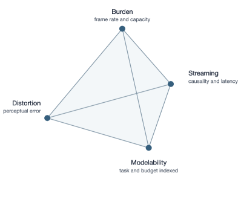
*Figure 1:A schematic view of four objectives in audio representation design. The tetrahedral drawing is a mnemonic for interacting Pareto objectives, not a metric geometry: the axes have different units and are not barycentric coordinates.*

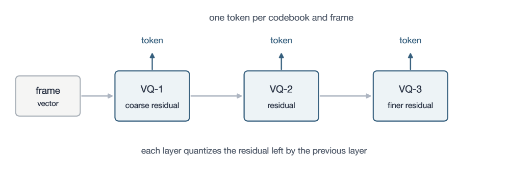
*Figure 2:RVQ’s bet: build capacity in depth, not by raising the frame rate. The first quantizer is coarsest; each later layer quantizes the previous residual. One frame can therefore hold enough information for fidelity even at a low frame rate.*

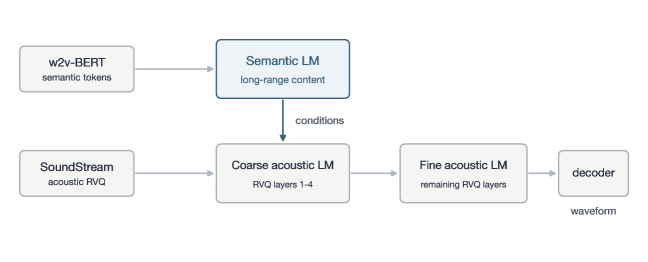
*Figure 3:AudioLM’s cascade: semantic tokens anchor long-range content. Acoustic tokens recover timbre, prosody, and detail. The important idea is the division of labor, not the exact three-stage implementation.*

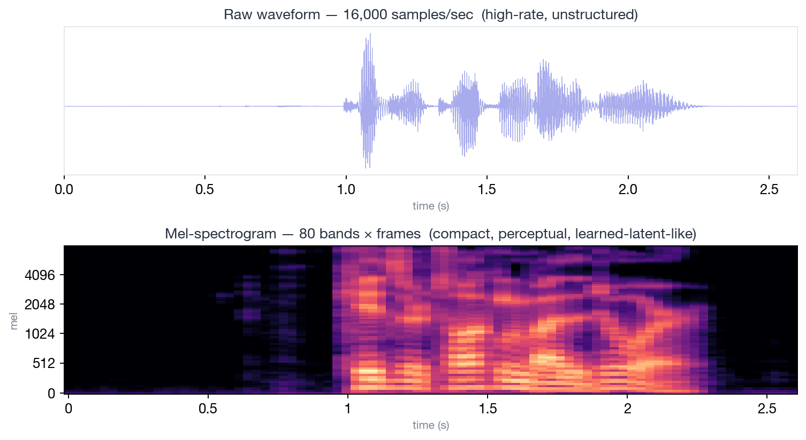
*Figure 4:The mel-spectrogram is the original audio latent in practice: a lower-rate time–frequency scaffold that keeps the coarse structure of speech and leaves waveform realization to a vocoder.*

---
**Usage Info**: 6406 tokens used.
**Generated at**: 2026-08-11 15:21:04

---

# 📚 Beyond Naturalness: Probing Automated Text-To-Speech Evaluators on Linguistically Grounded Dimensions

🚀 URL: https://arxiv.org/html/2608.09930

## 🌏 Abstract (원문)
Automated Text-to-Speech (TTS) evaluation methods (Mean Opinion Score (MOS) predictors and Audio Large Language Models (Audio-LLMs) judges) are expected to reflect human perception, yet it is unclear how well they capture the distinct aspects of speech that listeners actually perceive. We deconstruct "naturalness" into a linguistically grounded annotation schema spanning 10 distinct perceptual dimensions, and use it to construct the first dimension-level meta-evaluation benchmark for TTS, comprising 860 utterances annotated by trained linguist raters. Results from benchmarking four MOS predictors and four Audio-LLMs judges reveal that MOS predictors collapse onto acoustic signal quality, while Audio-LLMs judges show selective, prompt-dependent detection that does not generalise across all dimensions. Neither class reliably captures a breadth of linguistically structured speech errors. Our dataset, annotation schema, and evaluation code are publicly released to support more targeted and interpretable TTS evaluation.
## 🌏 Abstract (번역)
자동화된 Text-to-Speech (TTS) 평가 방법(평균 의견 점수(MOS) 예측기와 오디오 대규모 언어 모델(Audio-LLM) 심사위원)은 인간의 인식을 반영할 것으로 기대되지만, 청취자가 실제로 인지하는 음성의 개별적인 측면을 얼마나 잘 포착하는지는 불분명합니다. 우리는 '자연스러움'을 10가지 개별적인 지각 차원에 걸쳐 언어학적으로 근거한 주석 스키마로 해체하고, 이를 사용하여 훈련된 언어학자 평가자가 주석을 단 860개의 발화로 구성된 최초의 차원 수준 TTS 메타 평가 벤치마크를 구축했습니다. 4개의 MOS 예측기와 4개의 Audio-LLM 심사위원을 벤치마킹한 결과, MOS 예측기는 음향 신호 품질에 집중하는 반면, Audio-LLM 심사위원은 모든 차원에 걸쳐 일반화되지 않는 선택적이고 프롬프트에 의존적인 감지를 보여주었습니다. 두 클래스 모두 언어학적으로 구조화된 광범위한 음성 오류를 안정적으로 포착하지 못했습니다. 더 목표 지향적이고 해석 가능한 TTS 평가를 지원하기 위해 우리의 데이터셋, 주석 스키마 및 평가 코드를 공개적으로 배포합니다.

## 🔍 Methods & Results
- TTS 평가에서 '자연스러움'을 10가지 개별적인 지각 차원으로 해체하는 언어학적 기반의 주석 스키마를 제안했습니다.
- 이 스키마는 어휘(음운 정확성, 어휘 강세), 발화(억양, 운율 강세, 운율 경계 적절성, 말하기 속도 적절성), 화자(감정적 적절성, 표현력, 인간적 타당성, 화자 정체성 일관성)의 세 가지 수준으로 구성됩니다.
- 훈련된 언어학자 평가자가 주석을 단 860개의 발화로 구성된 차원 수준 TTS 메타 평가 벤치마크 데이터셋을 구축했습니다.
- 데이터셋은 LLM-수정 IPA, LLM-수정 일반 텍스트, API-강제 감정, 음향 조작(Praat 기반)을 통해 의도적인 오류를 도입하여 생성되었습니다.
- 각 샘플은 모든 해당 차원에 대해 이진(0/1) 척도로 평가되었으며, 다수결로 최종 주석이 결정되었습니다.
- 4개의 MOS 예측기와 4개의 Audio-LLM 심사위원을 벤치마킹한 결과, MOS 예측기는 주로 음향 신호 품질에 집중하는 경향을 보였습니다.
- Audio-LLM 심사위원은 선택적이고 프롬프트에 의존적인 감지를 보였으며, 이는 모든 차원에 걸쳐 일반화되지 않았습니다.
- 두 평가 방법 모두 언어학적으로 구조화된 다양한 음성 오류를 안정적으로 포착하지 못하는 한계를 드러냈습니다.
- 더 목표 지향적이고 해석 가능한 TTS 평가를 지원하기 위해 데이터셋, 주석 스키마 및 평가 코드를 공개적으로 배포했습니다.

## 🖼 Figures
![Figure 1:Dataset Construction Pipeline. Sentences from three sources (Harvard Sentences, EmergentTTS-Eval, synthetic text) are fed through three error-generation pathways: LLM-modified plain text, LLM-modified IPA transcriptions, and direct acoustic manipulation. All pathways pass through the TTS model to produce clean (Score 1) and error-targeted samples. Samples are then annotated by three linguists on all ten dimensions. After linguist annotation, majority filtering and downsampling produce a balanced final dataset of 860 samples.](../images/2026-08-11/2608.09930/2608.09930_fig0.png)
*Figure 1:Dataset Construction Pipeline. Sentences from three sources (Harvard Sentences, EmergentTTS-Eval, synthetic text) are fed through three error-generation pathways: LLM-modified plain text, LLM-modified IPA transcriptions, and direct acoustic manipulation. All pathways pass through the TTS model to produce clean (Score 1) and error-targeted samples. Samples are then annotated by three linguists on all ten dimensions. After linguist annotation, majority filtering and downsampling produce a balanced final dataset of 860 samples.*

![Figure 2:Co-occurrence of perceptual failures across speech quality dimensions. Per-dimension failure counts stratified by intended-dimension ground-truth label. Each subplot corresponds to one intended dimension (column panels); bars show the number of score-0 (failure) observations on each rating dimension (y-axis), split by whether the sample’s ground-truth label on its own intended dimension is a failure (orange, score = 0) or a pass (blue, score = 1). Tall blue bars on dimensions other than the intended one reveal that samples annotated as passing on their intended construct nonetheless exhibit failures on unrelated dimensions.](../images/2026-08-11/2608.09930/2608.09930_fig1.png)
*Figure 2:Co-occurrence of perceptual failures across speech quality dimensions. Per-dimension failure counts stratified by intended-dimension ground-truth label. Each subplot corresponds to one intended dimension (column panels); bars show the number of score-0 (failure) observations on each rating dimension (y-axis), split by whether the sample’s ground-truth label on its own intended dimension is a failure (orange, score = 0) or a pass (blue, score = 1). Tall blue bars on dimensions other than the intended one reveal that samples annotated as passing on their intended construct nonetheless exhibit failures on unrelated dimensions.*

---
**Usage Info**: 3545 tokens used.
**Generated at**: 2026-08-11 15:21:13

---

# 📚 BAMU: Bitstream-Aware Marginal-Utility Allocation for Frozen Pretrained Neural Speech Codecs

🚀 URL: https://arxiv.org/html/2608.08432

## 🌏 Abstract (원문)
Pretrained neural speech codecs typically use a fixed residual vector quantization (RVQ) depth for all frames, ignoring temporal variation in quantization difficulty. We propose BAMU, a bitstream-aware dynamic RVQ allocation framework for frozen pretrained codecs. A lightweight, rate-independent predictor estimates frame- and layer-wise marginal latent-distortion reductions, while a constrained allocator selects prefix-valid depths under an exact serialized-size budget. Experiments on EnCodec and DAC over LibriSpeech, together with VCTK evaluation, show consistent EnCodec gains and DAC improvements mainly at medium and high rates. A 30-listener study confirms a MOS improvement from 3.449 to 3.780 over matched fixed-depth coding.
## 🌏 Abstract (번역)
사전 학습된 신경망 음성 코덱은 일반적으로 모든 프레임에 대해 고정된 잔여 벡터 양자화(RVQ) 깊이를 사용하여 양자화 난이도의 시간적 변화를 무시합니다. 본 논문에서는 동결된 사전 학습 코덱을 위한 비트스트림 인식 동적 RVQ 할당 프레임워크인 BAMU를 제안합니다. 경량의 속도 독립적인 예측기는 프레임 및 레이어별 한계 잠재 왜곡 감소를 추정하며, 제약된 할당기는 정확한 직렬화된 크기 예산 내에서 접두사 유효 깊이를 선택합니다. LibriSpeech에 대한 EnCodec 및 DAC 실험과 VCTK 평가 결과, EnCodec에서 일관된 성능 향상과 DAC에서 주로 중간 및 높은 비트레이트에서 개선이 나타났습니다. 30명의 청취자 연구에서는 고정 깊이 코딩과 비교하여 MOS가 3.449에서 3.780으로 향상되었음을 확인했습니다.

## 🔍 Methods & Results
- BAMU는 동결된 인코더(E(x))를 사용하여 잠재 프레임(z)을 얻고, RVQ에 대한 채널 정규화된 왜곡 및 한계 유틸리티를 정의합니다.
- 경량의 속도 독립적인 예측기(Pθ)는 프레임 및 레이어별 한계 잠재-왜곡 감소를 추정하며, 이는 3개의 비인과적 Conv1d 블록과 1x1 출력 레이어로 구성됩니다.
- 예측기는 마스크된 Smooth-L1 손실로 훈련되며, 동결된 인코더 잠재값을 입력으로 받습니다.
- 할당기는 각 프레임에 접두사 유효 깊이(dt)를 할당하고, 목표 컨테이너 예산(B) 내에서 예측된 유틸리티(U(d))를 최대화합니다.
- 인접 프레임은 하나의 깊이를 공유하는 블록(기본 크기 4)으로 그룹화될 수 있으며, GPU 배치 Viterbi 디코딩과 병렬 라그랑주 완화를 사용하여 최적화됩니다.
- 할당기는 정확한 원시 페이로드(Rcoderaw = 10 * sum(dt))를 사용하여 후보를 평가하며, K=8 설정에서는 깊이 맵이 3비트 깊이 값과 Elias-gamma 코딩된 실행 길이를 저장합니다.
- 고정된 192비트 헤더와 최악의 경우 패딩을 위한 14비트를 고려하여, 특정 조건을 만족하는 후보만 유지됩니다.
- 가장 높은 예측 유틸리티를 가진 실행 가능한 후보가 선택되며, 힙 기반의 탐욕적 단계가 전체 블록 레이어 추가를 제안하고 정확한 RLE 페이로드를 재계산하여 수락합니다.
- 외부 컨테이너 수준 검사기는 실제 동적 스트림 크기(Ractualdynamic)를 계산하며, 최종 할당은 Ractualdynamic이 고정 깊이 컨테이너의 실제 크기(Ractualfixed)보다 작거나 같을 때만 수락됩니다.
- 할당은 접두사 조기 종료(prefix early exit)를 통해 구현되며, RVQ 단계 k에서 dt >= k인 프레임만 처리됩니다.
- 실험 결과, LibriSpeech 및 VCTK 데이터셋에서 EnCodec에 대해 일관된 성능 향상을 보였고, DAC에서는 주로 중간 및 높은 비트레이트에서 개선을 나타냈습니다.
- 30명의 청취자를 대상으로 한 연구에서, BAMU는 고정 깊이 코딩 대비 MOS 점수를 3.449에서 3.780으로 향상시켰습니다.

## 🖼 Figures
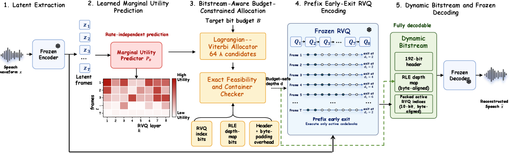
*Fig. 1:Overview of the proposed framework. A lightweight predictor estimates frame- and layer-wise marginal utilities, and a bitstream-aware allocator selects prefix-valid RVQ depths under a realized container budget. The pretrained codec remains frozen.*

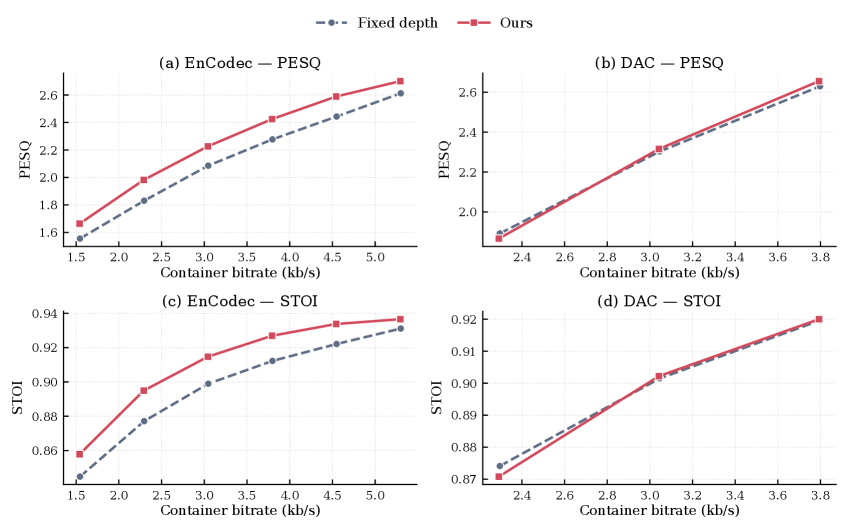
*Fig. 2:Rate–distortion performance on LibriSpeech test-clean using realized container bitrates. Each dynamic point does not exceed its matched fixed-depth container size.*

---
**Usage Info**: 3072 tokens used.
**Generated at**: 2026-08-11 15:21:23

---

# 📚 RAG-Audio: Retrieval-Augmented Generation for Faithful Brain-to-Audio Reconstruction

🚀 URL: https://arxiv.org/html/2608.09331

## 🌏 Abstract (원문)
Brain-to-audio reconstruction is limited byprior domination: when a pretrained generator is conditioned on a weak neural signal, it produces realistic but stimulus-inaccurate audio. We introduce RAG-Audio, which decodes fMRI into a semantic audio embedding, retrieves a matching real-audio exemplar, and initializes the frozen generator’s sampling trajectory from that exemplar while retaining the decoded embedding as conditioning. On Brain2Music, RAG-Audio improves 10-way stimulus identification from0.140.14–0.180.18for direct generation, near the0.100.10chance level, to0.400.40–0.430.43, comparable to retrieval. It also reduces Fréchet Audio Distance by roughly an order of magnitude, from13.4913.49to1.251.25for AudioLDM. RAG-Audio approaches nearest-neighbor retrieval in identification while remaining generative; its higher FAD is expected because retrieval directly replays real audio. An autoregressive negative control, which lacks an initializable latent trajectory, shows no comparable gain, attributing the improvement to trajectory initialization. These results suggest that retrieval-guided initialization can mitigate prior domination in brain-to-audio generation.
## 🌏 Abstract (번역)
뇌-오디오 재구성은 사전 지배(prior domination)에 의해 제한됩니다. 즉, 사전 훈련된 생성기가 약한 신경 신호에 조건화될 때, 현실적이지만 자극에 부정확한 오디오를 생성합니다. 본 연구는 fMRI를 의미론적 오디오 임베딩으로 디코딩하고, 일치하는 실제 오디오 예시를 검색하며, 디코딩된 임베딩을 조건으로 유지하면서 고정된 생성기의 샘플링 궤적을 해당 예시로부터 초기화하는 RAG-Audio를 소개합니다. Brain2Music 데이터셋에서 RAG-Audio는 직접 생성 방식(0.10의 우연 수준에 가까운 0.14-0.18)에 비해 10방향 자극 식별 성능을 0.40-0.43으로 향상시켜 검색 방식과 유사한 수준을 달성했습니다. 또한 AudioLDM의 Fréchet Audio Distance(FAD)를 약 10배 감소시켜 13.49에서 1.25로 개선했습니다. RAG-Audio는 생성 능력을 유지하면서 식별 측면에서 최근접 이웃 검색 방식에 근접합니다. RAG-Audio의 FAD가 더 높은 것은 검색 방식이 실제 오디오를 직접 재생하기 때문에 예상되는 결과입니다. 초기화 가능한 잠재 궤적이 없는 자기회귀 방식의 대조군은 유사한 성능 향상을 보이지 않아, 개선이 궤적 초기화 덕분임을 입증합니다. 이러한 결과는 검색 기반 초기화가 뇌-오디오 생성에서 사전 지배를 완화할 수 있음을 시사합니다.

## 🔍 Methods & Results
- RAG-Audio는 fMRI 응답을 CLAP 임베딩으로 디코딩하고, 메모리 뱅크에서 가장 가까운 실제 훈련 예시를 검색한 다음, 고정된 생성기의 샘플링 궤적을 해당 예시로부터 중간 시점에 초기화하는 검색 증강 파이프라인을 제안합니다.
- fMRI 데이터는 ANTsPy를 사용하여 강체 운동 보정을 거쳤으며, 혈역학적 반응을 위해 3 TR(4.5초)의 지연과 8 TR의 시간 창을 사용했습니다.
- CLAP 타겟과의 연관성을 기준으로 K=2000개의 가장 높은 점수를 받은 복셀을 유지했습니다.
- 디코더는 선택된 fMRI 특징을 예측된 CLAP 임베딩으로 매핑하며, InfoNCE 손실 함수로 훈련되어 디코딩된 스캔이 쌍을 이루는 오디오 임베딩과 가깝고 배치 내 다른 클립과 분리되도록 합니다.
- 메모리 뱅크는 실제 훈련 세트 오디오의 CLAP 임베딩으로 구성되며, 테스트 자극은 제외됩니다.
- 주어진 fMRI 응답에 대해 디코더는 예측 임베딩을 생성하고, 이와 코사인 유사도가 가장 큰 훈련 예시를 검색하여 '검색 기준선'을 정의합니다.
- RAG-Audio는 검색된 예시를 생성기의 잠재 공간으로 매핑하고, 앵커링 강도(s)에 따라 중간 초기화 시간(t0=sT)을 결정하여 생성 궤적을 초기화합니다.
- AudioLDM과 같은 잠재 확산 생성기의 경우, SDEdit 원리에 따라 예시 잠재를 부분적으로 노이즈 처리한 후 t0부터 역확산 과정을 실행하며 디코딩된 임베딩에 조건화합니다.
- TangoFlux와 같은 흐름 기반 생성기의 경우, 앵커링 강도가 초기화 시간을 직접 결정하며, 예시 잠재와 가우시안 노이즈 사이를 결정론적으로 보간하여 궤적을 초기화합니다.
- 앵커링 강도(s)는 생성 시작 시 예시 구조가 얼마나 남아있는지를 제어하며, s≈0.25–0.40 범위에서 작동합니다.
- RAG-Audio는 Brain2Music 데이터셋에서 10방향 자극 식별 성능을 직접 생성 방식의 0.14-0.18에서 0.40-0.43으로 향상시켜 검색 방식과 유사한 성능을 달성했습니다.
- AudioLDM의 Fréchet Audio Distance(FAD)를 약 10배 감소시켜 13.49에서 1.25로 개선했습니다.
- RAG-Audio는 생성 능력을 유지하면서 식별 측면에서 최근접 이웃 검색 방식에 근접하며, 검색 방식이 실제 오디오를 직접 재생하기 때문에 RAG-Audio의 FAD가 더 높은 것은 예상된 결과입니다.
- 초기화 가능한 잠재 궤적이 없는 자기회귀 방식의 MusicGen을 사용한 대조군은 유사한 성능 향상을 보이지 않아, 개선이 궤적 초기화 덕분임을 입증했습니다.
- 이러한 결과는 검색 기반 초기화가 뇌-오디오 생성에서 사전 지배(prior domination)를 완화할 수 있음을 시사합니다.

## 🖼 Figures
![Figure 1:Overview of RAG-Audio and two baselines. Given a brain-decoded CLAP embedding 
𝑧
^
, direct generation samples from noise and may be dominated by the generator prior; retrieval returns the nearest training clip but is non-generative. RAG-Audio initializes the frozen generator from the exemplar latent 
𝑧
0
 perturbed to an intermediate time, 
𝑧
𝑡
0
, preserving stimulus-related structure while the anchoring strength 
𝑠
 (with 
𝑡
0
=
𝑠
​
𝑇
) controls the trade-off between faithfulness and novelty.](../images/2026-08-11/2608.09331/2608.09331_fig0.png)
*Figure 1:Overview of RAG-Audio and two baselines. Given a brain-decoded CLAP embedding 
𝑧
^
, direct generation samples from noise and may be dominated by the generator prior; retrieval returns the nearest training clip but is non-generative. RAG-Audio initializes the frozen generator from the exemplar latent 
𝑧
0
 perturbed to an intermediate time, 
𝑧
𝑡
0
, preserving stimulus-related structure while the anchoring strength 
𝑠
 (with 
𝑡
0
=
𝑠
​
𝑇
) controls the trade-off between faithfulness and novelty.*

*Figure 2:The RAG-Audio pipeline. The decoder 
𝑓
𝜃
 maps an fMRI response 
𝑥
 to a CLAP embedding 
𝑧
^
; the nearest exemplar 
𝑎
∗
 is retrieved and encoded to 
𝑧
0
, perturbed to an intermediate time 
𝑡
0
=
𝑠
​
𝑇
 (
𝑧
𝑡
0
), and the frozen generator denoises from 
𝑧
𝑡
0
 conditioned on 
𝑧
^
 to produce 
𝑎
^
. The strength 
𝑠
 trades faithfulness against novelty.*

*Figure 3:Decoder localization: voxel relevance scores (red) overlap the Harvard–Oxford auditory-cortex mask (blue), with 
78
%
 of top voxels in bilateral superior temporal gyrus.*

*Figure 4:Ten-way identification versus anchoring strength 
𝑠
: low 
𝑠
 stays near the retrieval bound, high 
𝑠
 decays to the 
0.10
 chance level; working range 
𝑠
≈
0.25
–
0.40
.*

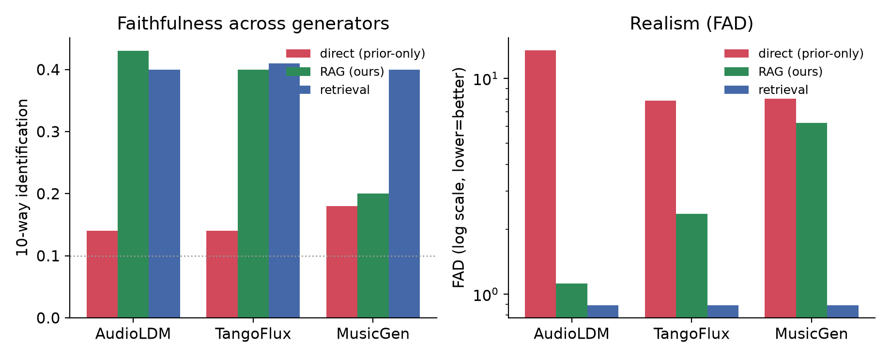
*Figure 5:Ten-way identification and FAD per generator: anchoring restores AudioLDM and TangoFlux to retrieval level but not autoregressive MusicGen.*

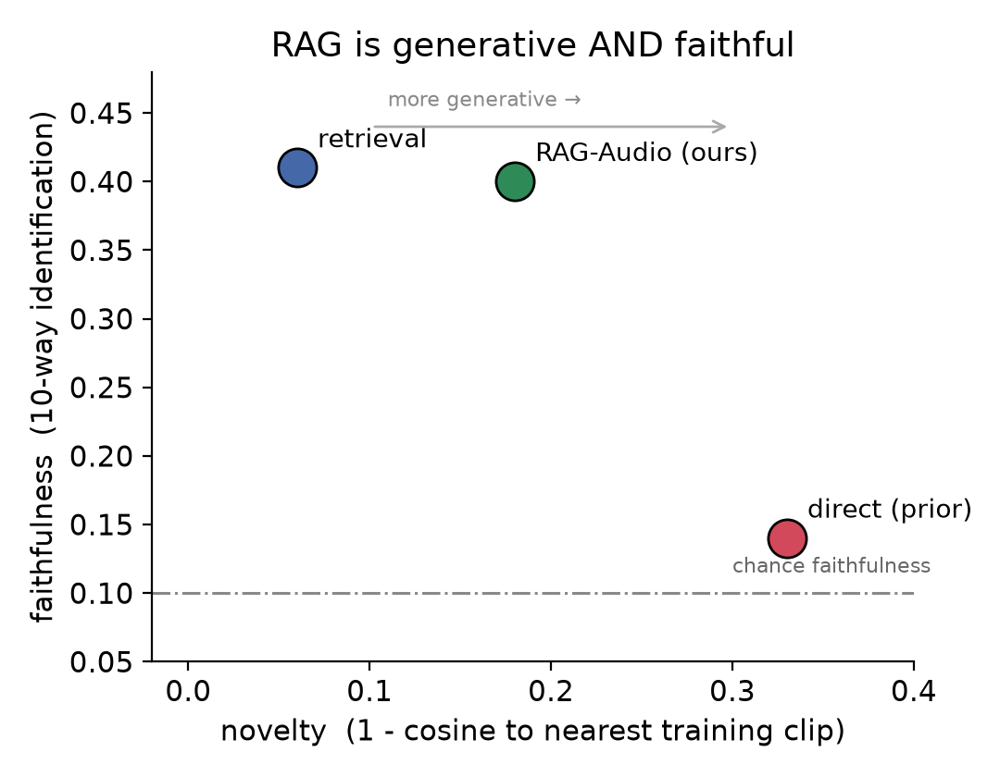
*Figure 6:Faithfulness (identification) versus novelty: direct is novel but unfaithful, retrieval faithful but verbatim, RAG-Audio faithful and generative.*

*Figure 7:Per-genre reconstructions: stimulus, RAG-Audio, and direct generation (log-mel spectrograms). Cyan lines are stimulus onsets (shared per row); the corner box is CLAP similarity to the stimulus (green/orange/red). Direct generation is realistic but off-grid and low-similarity; RAG-Audio recovers onset and harmonic structure (on-grid, high) without copying any retrieved clip. Structural, not sample-accurate, closeness.*

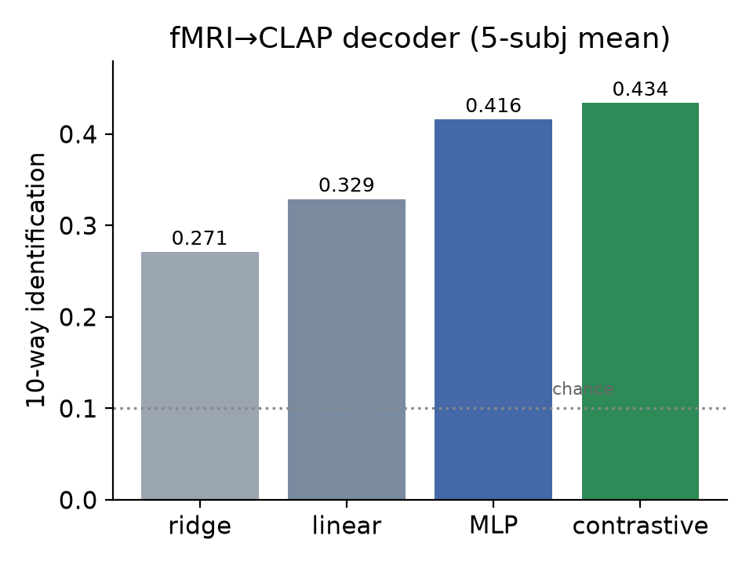
*Figure 8:Decoder 10-way identification (5-subj mean).*

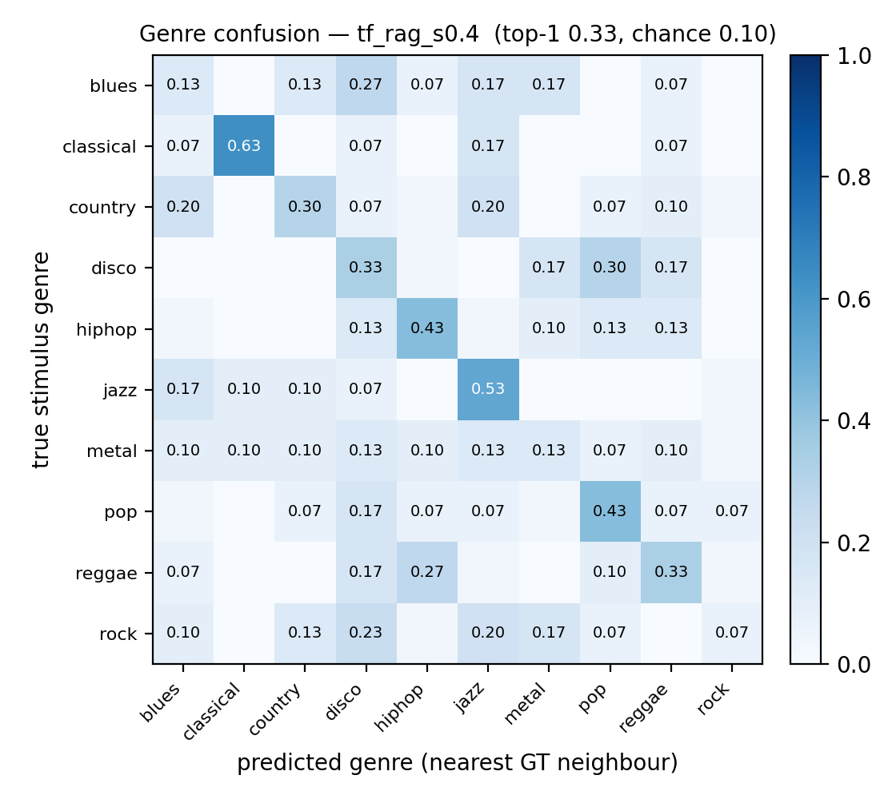
*Figure 9:Genre confusion for the RAG arm (TangoFlux).*

---
**Usage Info**: 3860 tokens used.
**Generated at**: 2026-08-11 15:21:37

---

# 📚 Beyond Piano: Cross-Instrument MIDI Velocity Estimation via Differentiable SoundFont Proxies

🚀 URL: https://arxiv.org/html/2608.08985

## 🌏 Abstract (원문)
Many music datasets contain MIDI notes but lack reliable velocities, defaulting to a constant value. This absence is especially problematic outside the piano domain, as velocity is a core component for expressive rendering, music generation, and performance analysis. This paper studies cross-instrument MIDI velocity estimation in this label-scarce setting. Starting from a piano-trained velocity estimator, we recast target-instrument adaptation as predicting renderer-conditioned velocities whose rendering matches the dynamics of the performance audio. This adaptation can be driven by either differentiable synthesizers (Diff-Synth) or our proposed differentiable SoundFont proxies (Diff-SFProxy). We highlight the Diff-SFProxy: it supervises velocity through note-wise, loudness-related acoustic parameters rather than waveform reconstruction, focusing gradients on velocity-dependent behavior. Experiments on piano and guitar show that Diff-SFProxy is effective for cross-instrument MIDI velocity estimation, while waveform-domain Diff-Synth degrades performance.
## 🌏 Abstract (번역)
많은 음악 데이터셋에는 MIDI 노트가 포함되어 있지만 신뢰할 수 있는 벨로시티가 부족하여 일정한 값으로 기본 설정됩니다. 이러한 부재는 벨로시티가 표현적인 렌더링, 음악 생성 및 연주 분석을 위한 핵심 구성 요소이기 때문에 피아노 영역 밖에서 특히 문제가 됩니다. 본 논문은 레이블이 부족한 환경에서 악기 간 MIDI 벨로시티 추정을 연구합니다. 피아노로 훈련된 벨로시티 추정기에서 시작하여, 우리는 대상 악기 적응을 연주 오디오의 다이내믹스와 일치하는 렌더링을 가진 렌더러 조건부 벨로시티를 예측하는 것으로 재구성합니다. 이 적응은 미분 가능한 신시사이저(Diff-Synth) 또는 우리가 제안하는 미분 가능한 SoundFont 프록시(Diff-SFProxy)에 의해 구동될 수 있습니다. 우리는 Diff-SFProxy를 강조합니다. 이는 파형 재구성이 아닌 노트별, 음량 관련 음향 매개변수를 통해 벨로시티를 감독하여 벨로시티 의존적 동작에 기울기를 집중시킵니다. 피아노와 기타에 대한 실험은 Diff-SFProxy가 악기 간 MIDI 벨로시티 추정에 효과적인 반면, 파형 도메인 Diff-Synth는 성능을 저하시킴을 보여줍니다.

## 🔍 Methods & Results
- 많은 음악 데이터셋에서 MIDI 벨로시티가 부족하여 표현적인 렌더링, 음악 생성 및 연주 분석에 어려움이 있습니다. 본 연구는 레이블이 부족한 환경에서 악기 간 MIDI 벨로시티 추정을 목표로 합니다.
- 피아노로 훈련된 벨로시티 추정기에서 시작하여, 대상 악기 적응을 연주 오디오의 다이내믹스와 일치하는 렌더링을 가진 렌더러 조건부 벨로시티를 예측하는 문제로 재구성했습니다.
- 이 적응은 미분 가능한 신시사이저(Diff-Synth) 또는 제안된 미분 가능한 SoundFont 프록시(Diff-SFProxy)에 의해 구동됩니다.
- Diff-SFProxy는 파형 재구성이 아닌 노트별, 음량 관련 음향 매개변수를 통해 벨로시티를 감독하여 벨로시티 의존적 동작에 기울기를 집중시킵니다.
- 피아노와 기타에 대한 실험 결과, Diff-SFProxy는 악기 간 MIDI 벨로시티 추정에 효과적임을 입증했습니다.
- 반면, 파형 도메인 Diff-Synth는 성능을 저하시키는 것으로 나타났습니다.

## 🖼 Figures

*Figure 1:Overview of the cross-instrument velocity estimation framework. VeloEst is trained with ground-truth velocity labels on piano (
ℒ
velo
), then fine-tuned for target instruments through one of two adaptation strategies. Diff-Synth provides waveform-domain supervision (
ℒ
audio
). Diff-SFProxy provides note-wise loudness-parameter supervision (
ℒ
params
).*

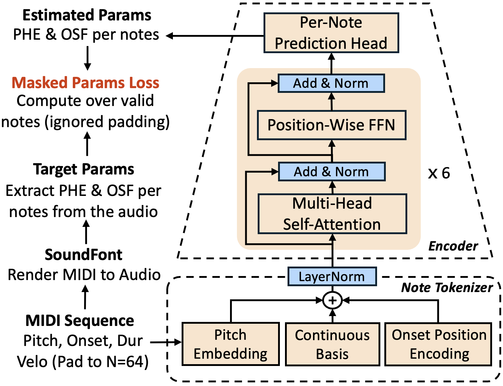
*Figure 2:An encoder-only Transformer maps padded note sequences to per-note PHE/OSF targets extracted from SoundFont-rendered audio.*

---
**Usage Info**: 2338 tokens used.
**Generated at**: 2026-08-11 15:21:47

---

# 📚 MADBench: A Benchmark for Modality-Aware Audio Deepfake Detection

🚀 URL: https://arxiv.org/html/2608.09593

## 🌏 Abstract (원문)
Recent advances in speech synthesis and audio generation have made high-fidelity acoustic forgery low-cost and difficult to attribute, enabling a realistic attack scenario in which speech and background audio are independently manipulated over otherwise authentic video. Yet existing research either focuses on visual manipulation, addresses speech detection in isolation, or conflates speech and non-speech audio as a single undifferentiated audio stream, overlooking the distinct forensic challenges posed by background audio. This conflation is consequential: the two acoustic components arise from fundamentally different generative mechanisms, exhibit distinct artifact profiles, and pose different challenges to detection systems. We introduceMADBench, the first benchmark that treats speech and environmental audio as distinct acoustic components, enabling component-aware evaluation of audio deepfake detection across independently manipulated forgery sources. We benchmark representative state-of-the-art detectors and multimodal large language models under a unified protocol. Our experiments reveal that environmental audio manipulation is more detectable than synthetic speech across general-purpose encoders, while existing pretrained detectors fail on both acoustic components, and manipulated environmental audio asymmetrically degrades speech deepfake detection, findings entirely invisible under the single-label paradigm of prior benchmarks. MADBench establishes a rigorous foundation for future research into robust, component-aware audio deepfake detection.
## 🌏 Abstract (번역)
최근 음성 합성 및 오디오 생성 기술의 발전으로 고품질 음향 위조가 저비용으로 가능해졌고 출처를 파악하기 어려워졌습니다. 이는 실제와 같은 영상에서 음성과 배경 오디오가 독립적으로 조작되는 현실적인 공격 시나리오를 가능하게 합니다. 그러나 기존 연구는 시각적 조작에 초점을 맞추거나, 음성 탐지만을 다루거나, 음성과 비음성 오디오를 단일한 오디오 스트림으로 혼합하여 배경 오디오가 제기하는 독특한 포렌식 문제를 간과하고 있습니다. 이러한 혼합은 중대한 결과를 초래합니다. 두 음향 구성 요소는 근본적으로 다른 생성 메커니즘에서 발생하고, 서로 다른 아티팩트 프로필을 나타내며, 탐지 시스템에 다른 과제를 제기하기 때문입니다. 우리는 음성과 환경 오디오를 별개의 음향 구성 요소로 취급하는 최초의 벤치마크인 MADBench를 소개합니다. 이는 독립적으로 조작된 위조 소스에 걸쳐 오디오 딥페이크 탐지의 구성 요소 인식 평가를 가능하게 합니다. 우리는 통일된 프로토콜 하에 대표적인 최첨단 탐지기 및 멀티모달 대규모 언어 모델을 벤치마킹합니다. 우리의 실험은 일반적인 인코더에서 환경 오디오 조작이 합성 음성보다 더 잘 탐지되는 반면, 기존의 사전 훈련된 탐지기는 두 음향 구성 요소 모두에서 실패하고, 조작된 환경 오디오가 음성 딥페이크 탐지를 비대칭적으로 저하시킨다는 것을 밝혀냈습니다. 이러한 발견은 이전 벤치마크의 단일 레이블 패러다임에서는 전혀 보이지 않던 결과입니다. MADBench는 견고하고 구성 요소 인식적인 오디오 딥페이크 탐지에 대한 향후 연구를 위한 엄격한 기반을 마련합니다.

## 🔍 Methods & Results
- 기존 연구는 음성과 비음성 오디오를 혼합하여 배경 오디오의 독특한 포렌식 문제를 간과하며, 이는 음성 및 환경 오디오가 다른 생성 메커니즘, 아티팩트 프로필, 탐지 과제를 가진다는 점에서 한계가 있습니다.
- MADBench는 음성과 환경 오디오를 별개의 음향 구성 요소로 취급하여 독립적으로 조작된 위조 소스에 걸쳐 오디오 딥페이크 탐지의 구성 요소 인식 평가를 가능하게 하는 최초의 벤치마크로 도입되었습니다.
- 대표적인 최첨단 탐지기 및 멀티모달 대규모 언어 모델을 통일된 프로토콜 하에 벤치마킹하는 실험을 수행했습니다.
- 실험 결과, 일반적인 인코더에서 환경 오디오 조작이 합성 음성보다 더 잘 탐지되는 것으로 나타났습니다.
- 기존의 사전 훈련된 탐지기는 음성 및 환경 오디오 두 구성 요소 모두에서 실패하는 것으로 확인되었습니다.
- 조작된 환경 오디오는 음성 딥페이크 탐지를 비대칭적으로 저하시키는 것으로 밝혀졌으며, 이는 이전 단일 레이블 벤치마크에서는 관찰되지 않던 결과입니다.

## 🖼 Figures
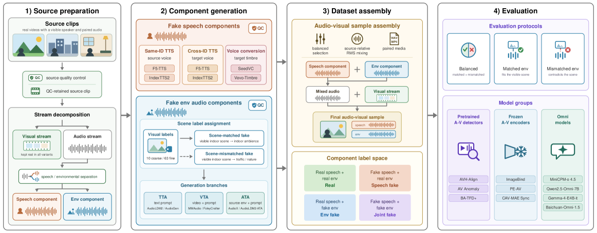
*Figure 1:Overview of the MADBench dataset construction and benchmark evaluation pipeline.*

---
**Usage Info**: 1734 tokens used.
**Generated at**: 2026-08-11 15:21:55

---

# 📚 Aero Realtime: Fully Aligned Input-Output Streams for Low-Latency Streaming Multimodal Generation

🚀 URL: https://arxiv.org/html/2608.08469

## 🌏 Abstract (원문)
Existing streaming multimodal models process observations incrementally but still follow a turn-based prefill-then-decode pattern, making them non-duplex: new observations cannot naturally enter an active generation stream. Proactive alternatives use micro-turn polling or external response gates, which fragment continuous interaction, decouple response timing from language generation, and complicate KV-cache-friendly serving. We introduce Aero Realtime, a 4B streaming multimodal model with a duplex architecture for realtime generation. Aero Realtime aligns video, audio, and textual output on a shared temporal grid, where each approximately 80-ms audio slot predicts either a lexical token or a silence token. This allows input and output to advance together, enabling one autoregressive objective to learn both when to respond and what to generate. During inference, Aero Realtime appends only the newest multimodal slot, carries forward the previous output state, and reuses the KV cache for efficient incremental execution. We further provide a complete training and serving recipe, including realtime QA construction, slot-aligned supervision, hardware-aware distributed training, and resumable inference. On four NVIDIA A6000 workstation GPUs, Aero Realtime maintains 84-ms median and 173-ms P95 processing lag over 20 minutes of a continuously streamed video, remaining within 200	ms of the source timeline. These results demonstrate the feasibility of fully aligned input-output modeling for duplex, proactive, and hardware-aligned multimodal interaction.
## 🌏 Abstract (번역)
기존 스트리밍 멀티모달 모델은 관측치를 점진적으로 처리하지만, 여전히 턴 기반의 '프리필-디코드' 패턴을 따르므로 양방향(duplex)이 아닙니다. 즉, 새로운 관측치가 활성 생성 스트림에 자연스럽게 들어갈 수 없습니다. 능동적인 대안들은 마이크로 턴 폴링 또는 외부 응답 게이트를 사용하는데, 이는 연속적인 상호작용을 단편화하고, 응답 타이밍을 언어 생성과 분리하며, KV 캐시 친화적인 서빙을 복잡하게 만듭니다. 우리는 실시간 생성을 위한 양방향 아키텍처를 가진 4B 스트리밍 멀티모달 모델인 Aero Realtime을 소개합니다. Aero Realtime은 비디오, 오디오, 텍스트 출력을 공유된 시간 그리드에 정렬하며, 각 약 80밀리초의 오디오 슬롯은 어휘 토큰 또는 침묵 토큰을 예측합니다. 이를 통해 입력과 출력이 함께 진행되어, 하나의 자기회귀 목표가 언제 응답할지와 무엇을 생성할지를 모두 학습할 수 있습니다. 추론 중에는 Aero Realtime이 최신 멀티모달 슬롯만 추가하고, 이전 출력 상태를 전달하며, 효율적인 점진적 실행을 위해 KV 캐시를 재사용합니다. 우리는 또한 실시간 QA 구성, 슬롯 정렬 감독, 하드웨어 인식 분산 학습, 재개 가능한 추론을 포함하는 완전한 학습 및 서빙 레시피를 제공합니다. 4개의 NVIDIA A6000 워크스테이션 GPU에서 Aero Realtime은 20분 동안 연속적으로 스트리밍되는 비디오에 대해 84밀리초의 중앙값 및 173밀리초의 P95 처리 지연을 유지하며, 원본 타임라인에서 200밀리초 이내를 유지합니다. 이러한 결과는 양방향, 능동적, 하드웨어 정렬 멀티모달 상호작용을 위한 완전히 정렬된 입출력 모델링의 실현 가능성을 보여줍니다.

## 🔍 Methods & Results
- Aero Realtime은 비디오, 오디오, 텍스트 출력을 공유된 약 80ms의 오디오 슬롯 시간 그리드에 정렬하는 양방향 아키텍처를 가진 4B 스트리밍 멀티모달 모델이다.
- 각 오디오 슬롯에서 현재 오디오 표현은 이전 텍스트 스트림 토큰 임베딩과 결합되어 인과적 언어 모델에 입력되며, 다음 정렬된 어휘 토큰 또는 침묵 토큰([P])을 예측한다.
- 추론 시, Aero Realtime은 최신 멀티모달 슬롯만 추가하고, 이전 출력 상태를 전달하며, KV 캐시를 재사용하여 효율적인 점진적 실행을 수행한다.
- 실시간 QA 데이터셋 구축을 위해 GPT-5.4를 사용하여 비디오 접두사와 텍스트 메모리를 기반으로 시간적으로 정렬된 QA 쌍을 생성하는 인과적 절차를 통해 103k개의 실시간 QA 샘플을 얻었다.
- 학습 데이터셋은 LLaVA-Video, LiveCC, EgoIT, QAEgo4D와 같은 기존 비디오 코퍼스를 실시간 스트림 형식 또는 일반적인 지시어 형식으로 변환하여 포함한다.
- 슬롯 정렬 감독(slot-aligned supervision)은 각 응답을 타임스탬프 이후 첫 번째 오디오 슬롯에 매핑하고, 토큰화된 응답을 다음 슬롯에 배치하며, 비어있는 위치는 침묵 토큰([P])으로 감독한다.
- vLLM-Omni의 재개 가능한 요청(resumable requests)을 사용하여 80ms 업데이트마다 하나의 오디오 특징과 타임스탬프가 있는 시각적/구조적 토큰을 추가하고 하나의 토큰을 출력하며, 샘플링된 토큰은 다음 오디오 업데이트에 융합된다.
- 하드웨어 인식 분산 학습 전략으로 '워크로드 균형 프레임 병렬 처리(workload-balanced frame parallelism)'를 사용하여 각 프레임의 시각적 워크로드(H_f W_f)를 추정하고, 이를 시퀀스 병렬 랭크에 할당하여 시각적 계산 부하를 균등화하고 중복 인코딩을 방지한다.
- 또한 '통합 패킹 시퀀스 병렬 처리(unified packed-sequence parallelism)'를 통해 오디오 시퀀스와 최종 멀티모달 언어 시퀀스를 동일한 시퀀스 병렬 그룹에 분할하여 DeepSpeed Ulysses를 사용하여 세 가지 주요 구성 요소(비전, 오디오, LM)를 모두 분산 처리한다.
- 4개의 NVIDIA A6000 GPU에서 Aero Realtime은 20분 동안 연속 스트리밍되는 비디오에 대해 84ms의 중앙값 및 173ms의 P95 처리 지연을 유지하며, 원본 타임라인에서 200ms 이내를 유지하는 성능을 보였다.

## 🖼 Figures
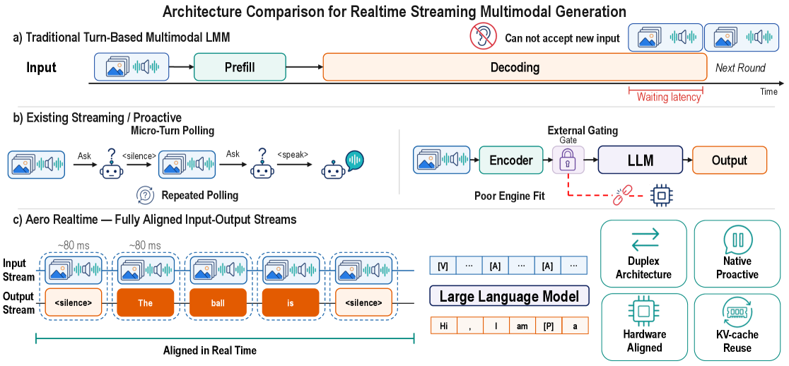
*Figure 1:Realtime multimodal architectures: (a) non-duplex turn-based generation, (b) micro-turn polling and external gating, and (c) Aero Realtime’s aligned input-output stream.*

![Figure 2:Aero Realtime architecture. Each audio state is fused with the preceding output embedding; 
[
𝙿
]
 denotes silence.](../images/2026-08-11/2608.08469/2608.08469_fig1.png)
*Figure 2:Aero Realtime architecture. Each audio state is fused with the preceding output embedding; 
[
𝙿
]
 denotes silence.*

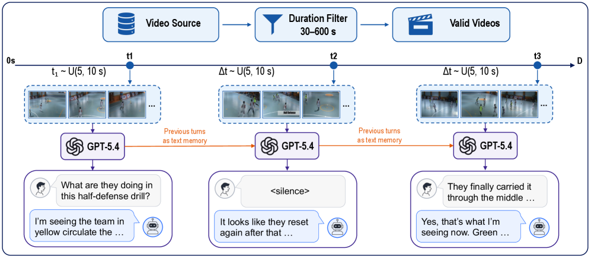
*Figure 3:Realtime QA construction and training-data composition. Generation uses only past visual context and turns; source shares use unique videos and question-type shares use deduplicated samples.*

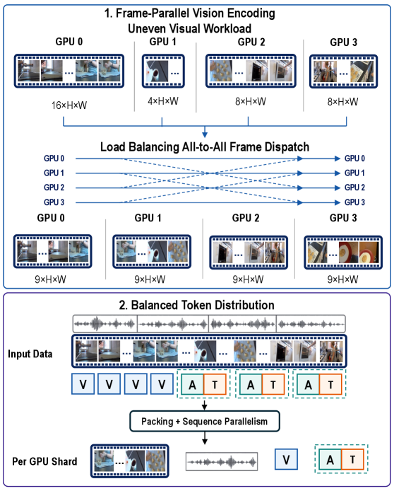
*Figure 4:Three-level training parallelism: workload-balanced frame parallelism for vision and Ulysses sequence parallelism for audio and language.*

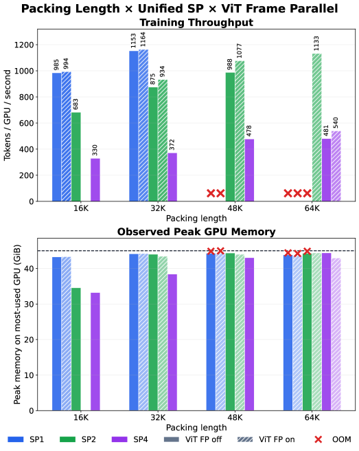
*Figure 5:Throughput and peak memory across packing lengths and parallel settings on four A6000 GPUs. Hatching enables ViT frame parallelism; crosses denote OOM.*

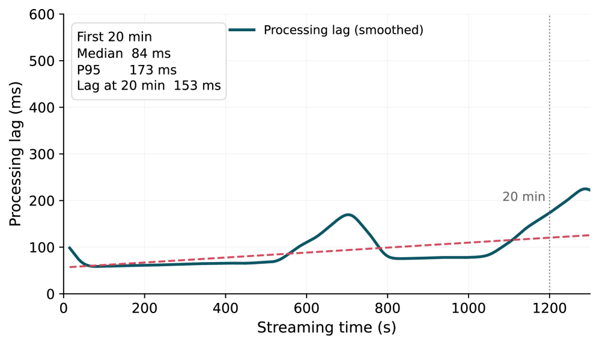
*Figure 6:Long-horizon processing lag under continuous audio-video streaming.*

*Figure 7*

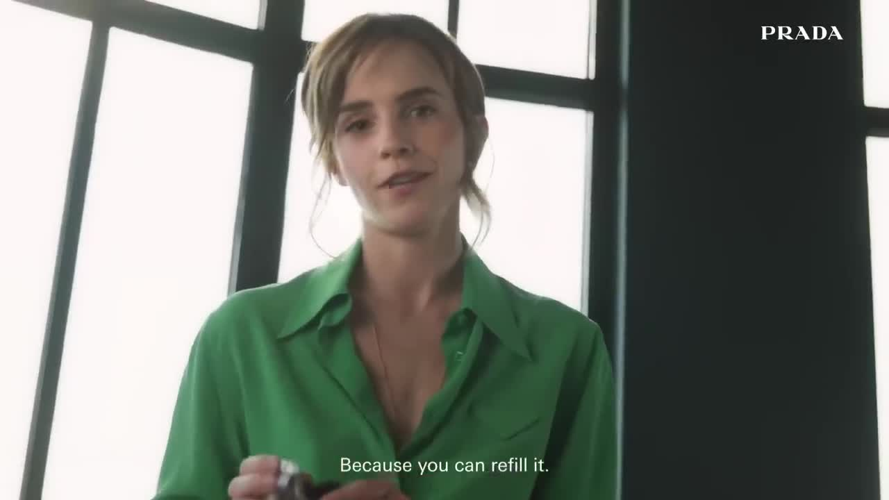
*Figure 8*

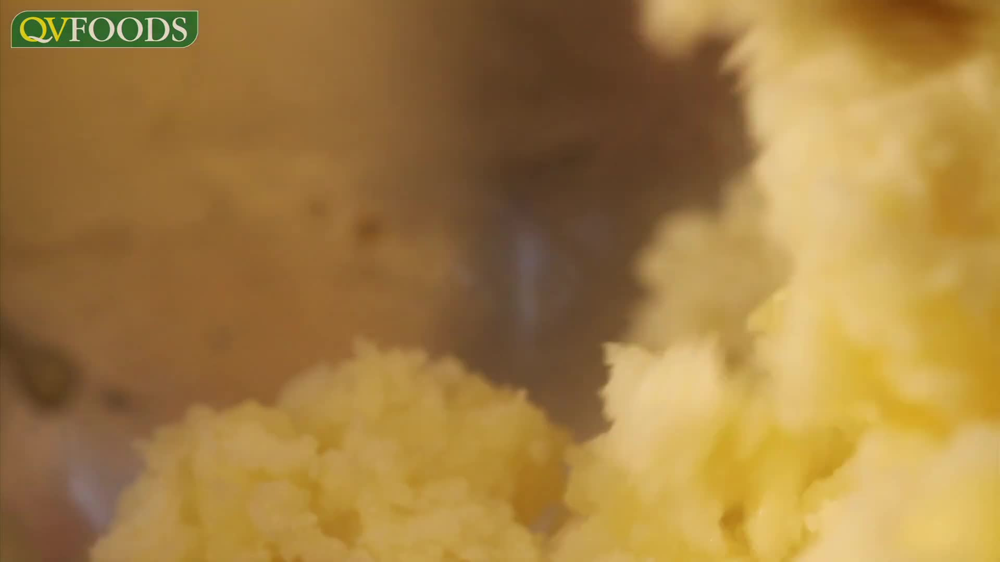
*Figure 9*

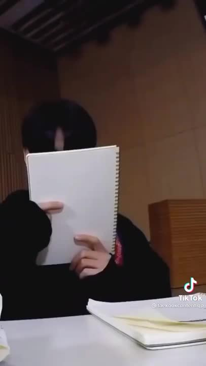
*Figure 10*

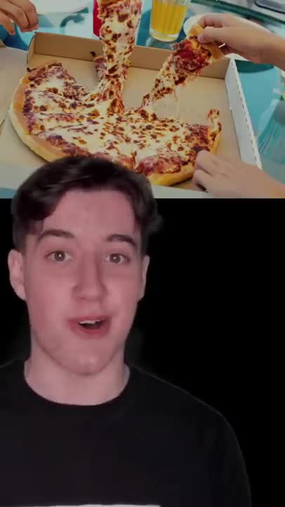
*Figure 11*

---
**Usage Info**: 4232 tokens used.
**Generated at**: 2026-08-11 15:22:06

---

# 📚 VoxZip: Semantic-Anchored Temporal KV Cache Compression for Long-Context Audio Inference

🚀 URL: https://arxiv.org/html/2608.08569

## 🌏 Abstract (원문)
Recent advancements in Speech Large Language Models have demonstrated remarkable capabilities in understanding complex audio tasks. Despite this progress, their long-context inference remains severely bottlenecked by prohibitive KV cache memory demands. Existing text-centric compression methods struggle here, often disrupting speech continuity or discarding crucial semantic cues. To address this, we propose VoxZip, a train-free, two-stage semantic-anchored KV cache compression framework. The first stage uses automatic speech recognition (ASR) transcriptions as explicit semantic anchors to temporally align, compress, and fuse audio tokens, significantly reducing the initial KV cache while elevating token information density. To further improve the compression ratio, the second stage employs a dynamic filtering strategy based on temporally decayed accumulated attention to evict non-essential tokens while mitigating early-token bias. Comprehensive evaluations on Qwen3-Omni across six diverse audio benchmarks demonstrate the superiority of our approach. VoxZip excels in long-audio reasoning and consistently maintains high-fidelity perception on short-form tasks. Notably, it sustains over 90% of the uncompressed baseline performance even under an aggressive 20x KV cache compression in long-context scenarios. Furthermore, at a 4x compression ratio, VoxZip yields a 1.9x increase in inference throughput alongside a 3.3x reduction in peak memory overhead. Code and models will be available athttps://github.com/MM-Speech/VoxZip.
## 🌏 Abstract (번역)
최근 음성 대규모 언어 모델(SLLM)의 발전은 복잡한 오디오 작업을 이해하는 데 놀라운 능력을 보여주었습니다. 이러한 발전에도 불구하고, 긴 컨텍스트 추론은 엄청난 KV 캐시 메모리 요구 사항으로 인해 심각한 병목 현상을 겪고 있습니다. 기존의 텍스트 중심 압축 방법은 음성 연속성을 방해하거나 중요한 의미 단서를 버리는 경우가 많아 이 분야에서 어려움을 겪습니다. 이를 해결하기 위해 우리는 학습 없이 작동하는 2단계 의미 기반 KV 캐시 압축 프레임워크인 VoxZip을 제안합니다. 첫 번째 단계는 자동 음성 인식(ASR) 전사본을 명시적인 의미 앵커로 사용하여 오디오 토큰을 시간적으로 정렬, 압축 및 융합하여 초기 KV 캐시를 크게 줄이고 토큰 정보 밀도를 높입니다. 압축률을 더욱 향상시키기 위해 두 번째 단계에서는 시간적으로 감쇠된 누적 어텐션을 기반으로 하는 동적 필터링 전략을 사용하여 중요하지 않은 토큰을 제거하고 초기 토큰 편향을 완화합니다. 6가지 다양한 오디오 벤치마크에서 Qwen3-Omni에 대한 포괄적인 평가는 우리 접근 방식의 우수성을 입증합니다. VoxZip은 긴 오디오 추론에서 탁월하며 짧은 형식 작업에서도 일관되게 높은 충실도의 인식을 유지합니다. 특히, 긴 컨텍스트 시나리오에서 공격적인 20배 KV 캐시 압축 하에서도 압축되지 않은 기준 성능의 90% 이상을 유지합니다. 또한, 4배 압축률에서 VoxZip은 추론 처리량을 1.9배 증가시키고 최대 메모리 오버헤드를 3.3배 감소시킵니다. 코드와 모델은 https://github.com/MM-Speech/VoxZip에서 제공될 예정입니다.

## 🔍 Methods & Results
- SLLM의 KV 캐시 메모리 병목 현상을 해결하기 위해 학습 없이 작동하는 2단계 의미 기반 KV 캐시 압축 프레임워크인 VoxZip을 제안합니다.
- 1단계는 ASR 전사본을 명시적인 의미 앵커로 사용하여 오디오 토큰을 시간적으로 정렬, 압축 및 융합합니다. 이는 음성 오디오를 텍스트 임베딩과 결합하여 정보 밀도를 높이고 초기 KV 캐시 크기를 크게 줄입니다.
- 1단계에서 의미론적 오디오 구간은 ASR 타임스탬프를 기반으로 음향 특징을 분할하고, 균일하게 그룹화하여 평균 풀링한 후 해당 텍스트 임베딩과 요소별로 더하여 압축됩니다. 배경 음향 구간은 원본 특징을 유지합니다.
- 2단계는 시간적으로 감쇠된 누적 어텐션 점수를 기반으로 하는 동적 필터링 전략을 사용하여 생성 단계에서 중요하지 않은 토큰을 제거합니다. 이는 초기 토큰 편향을 완화하고 핵심 토큰만 유지합니다.
- Qwen3-Omni 및 6가지 오디오 벤치마크에 대한 평가에서 VoxZip은 긴 오디오 추론에서 우수한 성능을 보였으며, 짧은 오디오 작업에서도 높은 충실도를 유지했습니다.
- 긴 컨텍스트 시나리오에서 20배 KV 캐시 압축 하에서도 압축되지 않은 기준 성능의 90% 이상을 유지하는 것으로 나타났습니다.
- 4배 압축률에서 VoxZip은 추론 처리량을 1.9배 증가시키고 최대 메모리 오버헤드를 3.3배 감소시켰습니다.

## 🖼 Figures
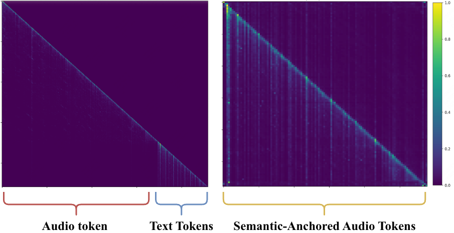
*Figure 1.Attention score distributions in Qwen3-Omni-Instruct-30B. Left: the uncompressed baseline shows highly sparse attention over raw audio and text tokens. Right: semantic-anchored compression densifies and focuses the attention.*

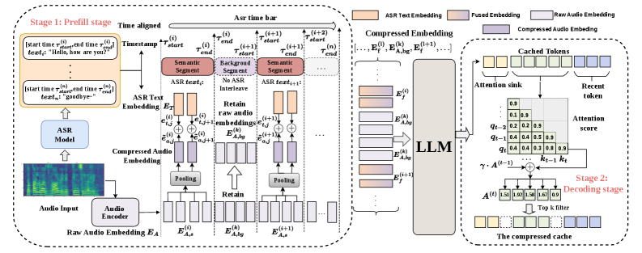
*Figure 2.The VoxZip framework. Stage 1 (left) performs semantic-anchored audio compression during the prefill stage. Stage 2 (right) dynamically filters the KV cache using time-decayed attention scores during decoding.*

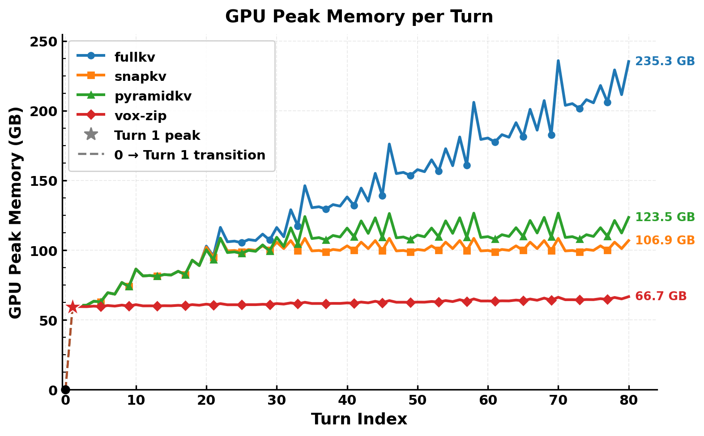
*Figure 3.GPU peak memory across conversational turns.*

---
**Usage Info**: 4545 tokens used.
**Generated at**: 2026-08-11 15:22:15

---

# 📚 Structured Phonological Representations for Audio–Articulatory rtMRI Speech Classification

🚀 URL: https://arxiv.org/html/2608.09767

## 🌏 Abstract (원문)
Real-time MRI makes it possible to observe vocal-tract articulation during speech, but mapping these articulatory patterns to phonetic and phonological categories remains challenging. We investigate whether PhonoQ, an audio-based model trained to recognize structured phonological features, provides useful information for audio–articulatory modeling. Specifically, we extract representations from PhonoQ’s Conformer module, whose training is shaped by supervision for manner, place, voicing, and vowel features. Using articulatory contours with synchronized audio-derived features, we compare WavLM-large and HuBERT-large baselines with models that incorporate PhonoQ-derived representations. Across unseen-speech and unseen-subject settings, these features improve macro-F1 for phonological targets including manner, place, voicing, vowel height, and vowel backness, and also improve fine-grained 39-phoneme classification. In a contour-only inference setting, audio-derived teacher supervision yields modest but consistent gains over contour-only training, indicating that phonological information from synchronized audio can be partially transferred to articulatory models. Finally, posterior analyses show interpretable surface-sensitive patterns consistent with flapping-like/t/realizations,/t/–/r/retraction or affrication, and nasal place assimilation.
## 🌏 Abstract (번역)
실시간 MRI는 발화 중 성도 조음을 관찰할 수 있게 하지만, 이러한 조음 패턴을 음성 및 음운 범주에 매핑하는 것은 여전히 어렵습니다. 본 연구에서는 구조화된 음운 특징을 인식하도록 훈련된 오디오 기반 모델인 PhonoQ가 오디오-조음 모델링에 유용한 정보를 제공하는지 조사합니다. 구체적으로, 우리는 PhonoQ의 Conformer 모듈에서 표현을 추출하는데, 이 모듈은 조음 방식, 조음 위치, 유성음 여부, 모음 특징에 대한 감독 학습을 통해 훈련됩니다. 동기화된 오디오 파생 특징을 포함하는 조음 윤곽을 사용하여, WavLM-large 및 HuBERT-large 기준 모델과 PhonoQ 파생 표현을 통합한 모델을 비교합니다. 미지의 발화 및 미지의 화자 설정 전반에 걸쳐, 이러한 특징들은 조음 방식, 조음 위치, 유성음 여부, 모음 높이, 모음 후설성 등 음운 목표에 대한 macro-F1을 향상시키고, 미세한 39개 음소 분류도 개선합니다. 윤곽선만 사용하는 추론 설정에서, 오디오 파생 교사 감독은 윤곽선만 사용하는 훈련에 비해 미미하지만 일관된 이득을 보여주며, 이는 동기화된 오디오의 음운 정보가 조음 모델로 부분적으로 전이될 수 있음을 나타냅니다. 마지막으로, 후방 분석은 플래핑과 유사한 /t/ 실현, /t/–/r/ 후퇴 또는 파찰음화, 비음 조음 위치 동화와 일치하는 해석 가능한 표면 민감 패턴을 보여줍니다.

## 🔍 Methods & Results
- PhonoQ-derived representations were evaluated for audio-articulatory classification, where audio-derived features are available at inference time to analyze cross-modal complementarity.
- The classifier uses a 9-frame aligned feature window, comparing six configurations: contour only, HuBERT, HuBERT+PhonoQ, WavLM, WavLM+HuBERT, and WavLM+PhonoQ.
- The model backbone consists of a two-layer bidirectional LSTM for contour encoding, gated fusion for combining audio-derived features, and a target-specific linear classification head, trained with cross-entropy loss for each phonetic/phonological target.
- In a stricter contour-only setting, audio-derived information is available during training but not at inference time, testing information transfer from synchronized audio to articulatory models.
- Contour-only baselines are trained with cross-entropy loss; teacher-supervised variants add an auxiliary instance-level contrastive loss (InfoNCE) to align projected contour representations with audio-derived teacher representations.
- HuBERT, WavLM, and PhonoQ were evaluated as single teachers, along with weighted two-teacher supervision combining a generic SSL teacher and PhonoQ.
- PhonoQ posterior tracks were analyzed to examine interpretable surface-sensitive phonological cues, extracting canonical phone intervals and averaging relevant posterior dimensions.
- Posterior analyses showed patterns consistent with flapping-like /t/ realizations, /t/–/r/ retraction or affrication, and nasal place assimilation, providing evidence for surface-sensitive phonological patterns.

## 🖼 Figures
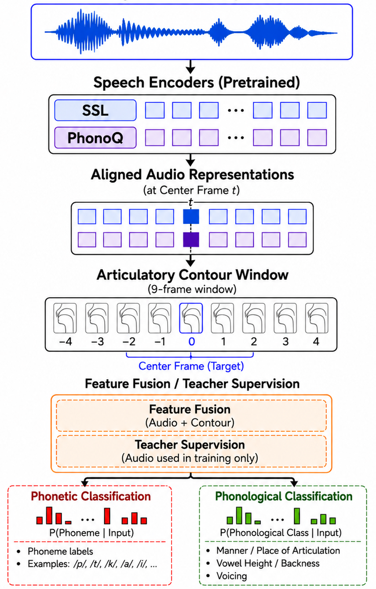
*Figure 1:Method overview. Audio-derived SSL and PhonoQ representations are aligned to articulatory contour windows and used either for feature fusion or as training-only teacher supervision.*

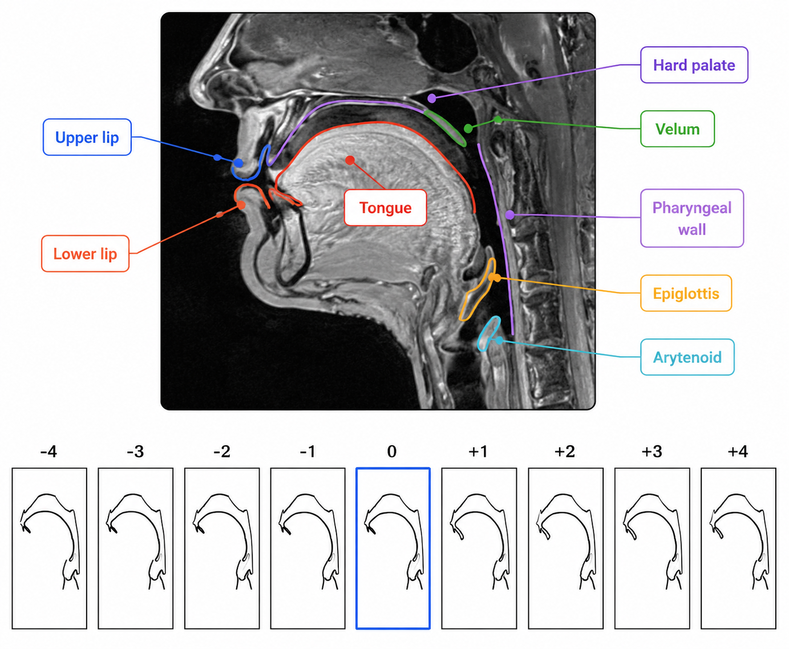
*Figure 2:Articulatory contour input. Annot-16 contour tracks represent vocal-tract shape as time-aligned articulatory vectors. Each example uses a 9-frame window centered on the target frame.*

*Figure 3:PhonoQ posterior tracks for three surface-sensitive contexts paired with canonical controls: (A) flapping (water vs. take), (B) /tr/-affrication (tree vs. stars), and (C) nasal place assimilation (rainbow vs. stain). Shaded regions mark the target phone interval.*

---
**Usage Info**: 3319 tokens used.
**Generated at**: 2026-08-11 15:22:26

---

