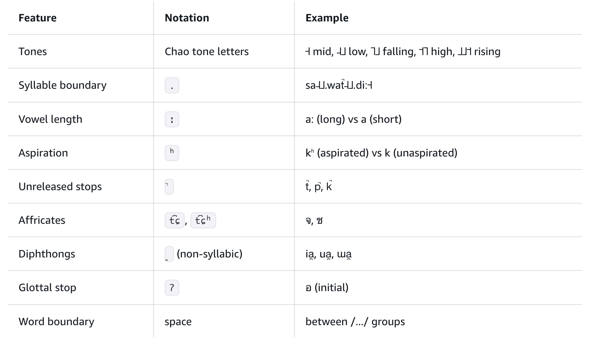
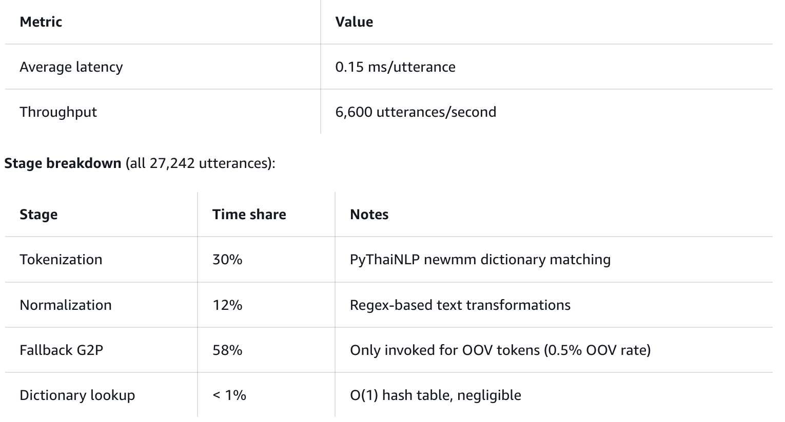
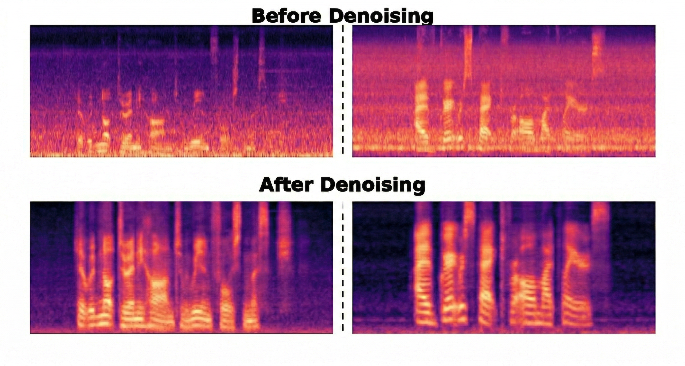
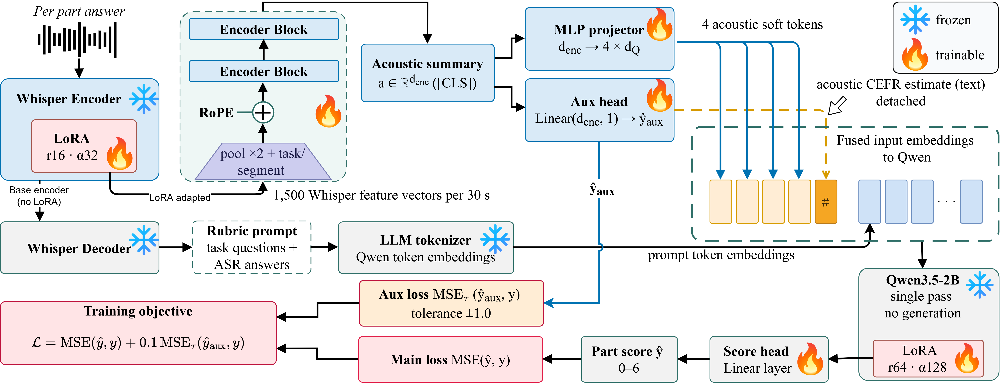

# 🚩 (2026-08-14) Scholar Inbox 추천 논문 

# 📚 VoxAudio: Vocalized Audio Synthesis viaMulti-Reward Autoregressive Flow Matching

🚀 URL: https://arxiv.org/html/2608.12951

## 🌏 Abstract (원문)
Vocalized audio synthesis, the task of generating audio in which intelligible speech is embedded within an environmental soundscape, underpins applications such as podcast production and video dubbing. Existing Text-to-Audio (T2A) systems either reduce quoted speech to unintelligible vocal murmur or delegate it to a separate TTS model with post-hoc mixing, which forfeits control over when speech occurs and how it interacts with the scene. We present VoxAudio, a causal autoregressive flow matching model that addresses this problem from three complementary aspects. At the architecture level, chunk-wise causal factorization with independent per-chunk noise levels lets audio be emitted through sliding-window streaming inference with KV caching at variable target durations; to enable inference at arbitrary chunk granularities, we further pretrain the model with randomized chunk boundaries. At the preference level, multi-reward Negative-aware FineTuning (NFT) jointly optimizes semantic fidelity, linguistic accuracy, aesthetic quality, and temporal grounding. At the data level, to supply the missing supervision for vocal content, we buildVoxCorpus, a large-scale corpus whose captions quote the verbatim transcript of embedded speech with time intervals, andVoxBench, an interval-annotated benchmark with a temporal-grounding metric. Experiments on four benchmarks spanning general audio, speech, and unified vocalized audio validate the effectiveness and efficiency of VoxAudio. Our code and demos are available athttps://voxaudio.github.io.
## 🌏 Abstract (번역)
지능형 음성이 환경 사운드스케이프 내에 내장된 오디오를 생성하는 작업인 보컬 오디오 합성은 팟캐스트 제작 및 비디오 더빙과 같은 애플리케이션의 기반이 됩니다. 기존의 텍스트-투-오디오(T2A) 시스템은 인용된 음성을 알아들을 수 없는 웅얼거림으로 축소하거나, 별도의 TTS 모델에 위임하여 사후 믹싱을 수행하는데, 이는 음성이 언제 발생하고 장면과 어떻게 상호작용하는지에 대한 제어를 상실하게 만듭니다. 우리는 이러한 문제를 세 가지 보완적인 측면에서 해결하는 인과적 자기회귀 플로우 매칭 모델인 VoxAudio를 제시합니다. 아키텍처 수준에서는 청크별 인과적 분해와 독립적인 청크별 노이즈 레벨을 통해 가변적인 목표 지속 시간으로 KV 캐싱을 사용하는 슬라이딩-윈도우 스트리밍 추론을 통해 오디오를 방출할 수 있습니다. 임의의 청크 세분성으로 추론을 가능하게 하기 위해, 우리는 무작위 청크 경계로 모델을 추가로 사전 학습합니다. 선호도 수준에서는 다중 보상 Negative-aware FineTuning(NFT)이 의미론적 충실도, 언어적 정확성, 미적 품질 및 시간적 접지를 공동으로 최적화합니다. 데이터 수준에서는 보컬 콘텐츠에 대한 누락된 감독을 제공하기 위해, 내장된 음성의 정확한 스크립트를 시간 간격과 함께 인용하는 대규모 코퍼스인 VoxCorpus와 시간적 접지 메트릭을 포함하는 간격 주석 벤치마크인 VoxBench를 구축합니다. 일반 오디오, 음성 및 통합 보컬 오디오를 아우르는 네 가지 벤치마크에 대한 실험은 VoxAudio의 효과와 효율성을 검증합니다. 우리의 코드와 데모는 https://voxaudio.github.io에서 확인할 수 있습니다.

## 🔍 Methods & Results
- 기존 T2A 시스템의 한계(음성 제어 상실)를 해결하기 위해 인과적 자기회귀 플로우 매칭 모델인 VoxAudio를 제안합니다.
- 아키텍처 측면에서, 청크별 인과적 분해와 독립적인 청크별 노이즈 레벨을 사용하여 가변 지속 시간의 슬라이딩-윈도우 스트리밍 추론을 가능하게 합니다. 임의의 청크 세분성을 위해 무작위 청크 경계로 모델을 사전 학습합니다.
- 선호도 측면에서, 다중 보상 Negative-aware FineTuning(NFT)을 통해 의미론적 충실도, 언어적 정확성, 미적 품질, 시간적 접지를 공동으로 최적화합니다.
- 데이터 측면에서, 보컬 콘텐츠 감독을 위해 음성 스크립트와 시간 간격이 포함된 대규모 코퍼스 VoxCorpus와 시간적 접지 메트릭을 갖춘 벤치마크 VoxBench를 구축했습니다.
- 일반 오디오, 음성, 통합 보컬 오디오를 포함하는 네 가지 벤치마크에서 VoxAudio의 효과성과 효율성을 검증했습니다.

## 🖼 Figures

*Fig. 1: Comparison of Audio Generation Paradigms. Decoupled Pipeline: Conventional methods synthesize soundscapes and speech independently, requiring post-hoc mixing. VoxAudio: A unified system for vocalized audio synthesis from single prompts.*

*Fig. 2: Overview of the VoxAudio Framework. Top: The workflow for VoxAudio dataset construction. Middle: The training pipeline, comprising chunk-agnostic autoregressive flow-matching supervised training and preference alignment NFT with multi-dimensional rewards. Bottom: The sliding-window streaming inference mechanism, which facilitates real-time, continuous audio synthesis.*

*Fig. 3: Detailed architecture and attention mechanism of the Causal Diffusion Transformer. (a) The causal joint block facilitates interaction between audio latents and conditioning features; (b) The causal fused block refines integrated representations through deep self-attention; (c) The chunk-wise causal attention mask, where shaded regions indicate masked-out tokens, ensuring that each temporal chunk only attends to current and historical context.*

*Fig. 4:The Generated Mel-spectrograms of VoxAudio (top) and Dasheng-AudioGen (bottom).*

---
**Usage Info**: 1766 tokens used.
**Generated at**: 2026-08-14 14:48:27

---

# 📚 FastThaiG2P: Lightning-fast Thai Grapheme-to-phoneme Conversion for Voice Agent Pipelines

🚀 URL: https://arxiv.org/html/2608.12814

## 🌏 Abstract (원문)
FastThaiG2P provides sub-millisecond Thai grapheme-to-phoneme conversion for text-to-speech pipelines (International Phonetic Alphabet and Kokoro-TTS conventions) using a PyThaiNLP-tokenized, extensible dictionary and normalization rules for common Central Thai speech. The approach achieves an average latency of 0.15 ms per utterance on a benchmark of 27,242 synthetically generated utterances, of which 30% is spent on tokenization, 12% on normalization, and 58% on out-of-vocabulary fallbacks (0.5% OOV rate). To demonstrate its effectiveness, we used FastThaiG2P to phonemize Som-TTS, an open dataset containing 20 hours of grapheme-and-audio pairs, then trained an 82M-parameter StyleTTS 2 model based on a Kokoro-TTS recipe. The resulting model vocalizes intelligible Thai speech suitable for prototyping and development at 0.25 real-time factor (4x real-time) with ONNX inference on CPU.
## 🌏 Abstract (번역)
FastThaiG2P는 PyThaiNLP로 토큰화된 확장 가능한 사전과 일반적인 중앙 태국어 발음을 위한 정규화 규칙을 사용하여 텍스트 음성 변환 파이프라인(국제 음성 기호 및 Kokoro-TTS 규칙)을 위한 서브 밀리초 태국어 문자-음소 변환을 제공합니다. 이 접근 방식은 27,242개의 합성 생성 발화 벤치마크에서 발화당 평균 0.15ms의 지연 시간을 달성했으며, 이 중 30%는 토큰화에, 12%는 정규화에, 58%는 어휘 외 대체(0.5% OOV 비율)에 사용되었습니다. 효과를 입증하기 위해 FastThaiG2P를 사용하여 20시간 분량의 문자-오디오 쌍을 포함하는 공개 데이터셋인 Som-TTS를 음소화한 다음, Kokoro-TTS 레시피를 기반으로 82M 매개변수 StyleTTS 2 모델을 훈련했습니다. 결과 모델은 CPU에서 ONNX 추론을 통해 0.25 실시간 계수(4배 실시간)로 프로토타이핑 및 개발에 적합한 명료한 태국어 음성을 발성합니다.

## 🔍 Methods & Results
- FastThaiG2P는 텍스트 정규화, 토큰화, 음소 사전 조회, 대체 G2P의 4단계 파이프라인으로 구성됩니다.
- 정규화 단계는 발음 불가능한 스크립트를 발음 가능한 스크립트로 변환하며, maiyamok 확장, 숫자 변환, 약어 및 단위 읽기 등 고정된 순서로 처리됩니다.
- 토큰화는 PyThaiNLP의 'newmm' 엔진과 사용자 정의 사전을 사용하여 텍스트를 단어로 분할하며, 이 사전은 분할 및 IPA 조회 키로 사용됩니다.
- 62,112개의 IPA 사전은 수동 오버라이드, 태국어 Wiktionary, Claude Opus 4.6으로 생성된 항목(38개 음소 코드포인트 화이트리스트로 유효성 검사)으로 구성됩니다.
- 사전에 없는 단어는 TLTK2에서 가져온 규칙 기반 대체 G2P를 통해 IPA로 변환되며, 이는 음절 분할, 로마자화, IPA 변환 과정을 거칩니다.
- 기존 TLTK의 반복적인 정규식 재컴파일 문제를 해결하기 위해 무제한 정규식 캐시를 도입하고 음절 규칙을 미리 로드하여 G2P 지연 시간을 발화당 약 2ms에서 0.15ms로 최대 15배 단축했습니다.
- IPA 표기법은 차오 성조 문자를 사용하는 영어 Wiktionary 태국어 IPA 전사 표준을 따르며, 38개의 음소 관련 코드포인트를 사용합니다.
- 영어에 사전 훈련된 Kokoro-82M 모델은 태국어의 5가지 성조를 지원하기 위해 사용되지 않는 토큰 ID 170을 높은 성조 마커로 재활용하고, IPA의 발음 구별 부호를 제거하며, 특정 문자를 Kokoro 등가물로 대체하여 태국어에 맞게 조정되었습니다.

## 🖼 Figures

*Figure 1:IPA Convention*

*Figure 2:IPA-to-Kokoro Mapping*

*Figure 3:Latency Profiling Result*

*Figure 4:TTS Inference Result*

---
**Usage Info**: 4352 tokens used.
**Generated at**: 2026-08-14 14:48:40

---

# 📚 HybridSB-MoE: Dual-Domain Schrödinger Bridges with Scene-Adaptive Expert Routing for Speech Enhancement

🚀 URL: https://arxiv.org/html/2608.12715

## 🌏 Abstract (원문)
Generative speech enhancement faces three gaps: spectral models capture harmonic structure but often disrupt phase, waveform models preserve phase but miss harmonics, and Schrödinger Bridges (SB) shorten transport from noise to clean speech but leave inference cost only loosely tied to training. We proposeHybridSB-MoE, a dual-domain framework that fills these gaps through three contributions unified by a single asymmetric design principle. (i)Asymmetric uncertainty fusion: The spectral path captures epistemic uncertainty via expert disagreement, while the waveform bridge models aleatoric variance through stochastic dynamics. We fuse them asymmetrically, allowing the mixing weight to adapt to distinct error regimes rather than average predictions. (ii)Heterogeneous MoEwith top-k=2k{=}2routing across five distinct architectural archetypes, where architectural diversity makes the epistemic signal indicate which inductive bias fails rather than small perturbations among similar experts. (iii)Discretization bound(Theorem1): path-consistency and trajectory regularizers together bound theKK-step bridge sampling error in 2-Wasserstein distance at rateK−αK^{-\alpha}, making small-KKinference an objective-level guarantee rather than an empirical claim. On VoiceBank+DEMAND, HybridSB-MoE outperforms diffusion- and SB-based baselines at their step budgets while remaining competitive with consistency-distilled few-step methods.
## 🌏 Abstract (번역)
생성형 음성 향상은 세 가지 문제에 직면해 있습니다: 스펙트럼 모델은 고조파 구조를 포착하지만 종종 위상을 손상시키고, 파형 모델은 위상을 보존하지만 고조파를 놓치며, 슈뢰딩거 브릿지(SB)는 노이즈에서 깨끗한 음성으로의 전송을 단축하지만 추론 비용이 훈련에 느슨하게 연결되어 있습니다. 우리는 단일 비대칭 설계 원칙으로 통합된 세 가지 기여를 통해 이러한 문제들을 해결하는 이중 도메인 프레임워크인 HybridSB-MoE를 제안합니다. (i) 비대칭 불확실성 융합: 스펙트럼 경로는 전문가 불일치를 통해 인식론적 불확실성을 포착하고, 파형 브릿지는 확률적 역학을 통해 우연적 분산을 모델링합니다. 우리는 예측을 평균화하는 대신 혼합 가중치가 서로 다른 오류 체제에 적응하도록 비대칭적으로 융합합니다. (ii) 다섯 가지 고유한 아키텍처 원형에 걸쳐 top-k=2 라우팅을 사용하는 이기종 MoE: 여기서 아키텍처 다양성은 유사한 전문가들 사이의 작은 교란이 아니라 어떤 귀납적 편향이 실패했는지를 인식론적 신호가 나타내도록 합니다. (iii) 이산화 경계 (정리 1): 경로 일관성 및 궤적 정규화 장치는 함께 K단계 브릿지 샘플링 오류를 2-Wasserstein 거리에서 K^{-\alpha} 비율로 제한하여, 작은 K 추론을 경험적 주장이 아닌 목표 수준의 보장으로 만듭니다. VoiceBank+DEMAND 데이터셋에서 HybridSB-MoE는 확산 및 SB 기반 기준 모델들을 동일한 단계 예산에서 능가하며, 일관성 증류된 소수 단계 방법들과도 경쟁력 있는 성능을 유지합니다.

## 🔍 Methods & Results
- HybridSB-MoE는 이기종 스펙트럼 MoE 경로, 슈뢰딩거 브릿지(SB) 파형 경로, 그리고 비대칭 불확실성 융합 모듈로 구성된 이중 도메인 프레임워크입니다. 이는 노이즈 입력에 대해 스펙트럼(로그-크기 STFT 기반) 및 파형(시간 도메인 SB 기반) 경로를 병렬로 처리하며, 불확실성 인식 융합 모듈이 신뢰도에 따라 각 경로의 가중치를 동적으로 조절하여 최종 향상된 신호를 생성합니다.
- 이기종 MoE는 기존 MoE와 달리 Home, Nature 등 5가지 고유한 아키텍처 원형을 사용하여 다양한 노이즈 처리 원시 요소에 맞춰 설계되었으며, sparse top-k=2 라우팅과 원형 및 토큰 수준의 두 단계 게이트를 통해 장면 적응형 처리를 수행합니다.
- 슈뢰딩거 브릿지(SB) 파형 경로는 노이즈 관측(y)과 깨끗한 목표(x) 사이의 조건부 분포를 직접 연결하여 표준 확산 모델보다 짧고 정보가 풍부한 궤적을 제공합니다. 학습 가능한 디노이저가 깨끗한 목표를 직접 예측하며, 브릿지 일관성 업데이트를 통해 이전 타임스텝의 예측된 깨끗한 추정치를 재주입합니다.
- 경로 일관성 및 궤적 정규화 장치는 SB 디노이징 경로의 부드러움과 낮은 곡률을 유도합니다. 이산화 경계(정리 1)는 이 두 정규화 장치가 K단계 브릿지 샘플링 오류를 2-Wasserstein 거리에서 K^{-\alpha} 비율로 제한함을 증명하여, K=8과 같은 적은 단계 추론이 이론적으로 보장됨을 보여줍니다.
- 비대칭 불확실성 융합은 스펙트럼 경로의 인식론적 불확실성(전문가 불일치)과 파형 경로의 우연적 불확실성(SB 확률적 역학)을 비대칭적으로 통합합니다. 이는 각 경로의 고유 오류(높은 전문가 불일치 또는 높은 SB 분산)가 클 때 다른 경로로 전환하도록 동적으로 가중치를 조절하며, 보정 손실을 통해 스칼라가 오류와 비례하도록 합니다.
- 모든 구성 요소는 엔드투엔드로 훈련되며, 재구성, SB(데이터, 경로, 궤적 손실), 부하 분산 및 보정 손실을 결합한 목적 함수를 사용합니다. VoiceBank+DEMAND 데이터셋에서 HybridSB-MoE는 확산 및 SB 기반 기준 모델들을 동일한 단계 예산에서 능가하며, 일관성 증류된 소수 단계 방법들과도 경쟁력 있는 성능을 보였습니다.
- 어블레이션 연구를 통해 각 구성 요소(이기종 MoE, 정규화된 SB, 비대칭 융합)가 서로 긴밀하게 결합되어 있으며, 어느 하나라도 제거하면 PESQ 점수가 0.17에서 0.63까지 크게 하락하여, 비대칭 융합과 적은 K 단계 추론 보장을 위한 각 구성 요소의 필수적인 역할과 시너지 효과를 입증했습니다.

## 🖼 Figures

*Figure 1:The persistent dual-domain dichotomy in speech enhancement. Waveform processing preserves temporal fine structure and phase coherence but underperforms on harmonically structured interference; spectral processing captures harmonic structure and stationary noise patterns but fragments phase across STFT frames. The two domains succeed and fail in opposite regimes, and existing generative methods inherit one half of the trade-off by committing to a single domain.*

![Figure 2:Overview of HybridSB-MoE. The spectral pathway (top) routes log-magnitude features 
𝑧
=
log
⁡
|
𝑆
​
{
𝑦
}
|
 through 
𝑁
 heterogeneous archetype experts via gating 
𝐺
⁡
(
𝑧
)
 to produce 
𝑥
spec
​
(
𝑡
)
. The waveform pathway (bottom) iteratively refines an SB state 
[
𝑥
𝑡
,
𝑦
]
 through a U-Net to produce 
𝑥
wave
​
(
𝑡
)
. An uncertainty-aware fusion combines both via 
𝑢
epi
 (top-
𝑘
 expert disagreement) and 
𝑢
ale
 (bridge-variance head) to yield 
𝑥
^
​
(
𝑡
)
.](../images/2026-08-14/2608.12715/2608.12715_fig1.png)
*Figure 2:Overview of HybridSB-MoE. The spectral pathway (top) routes log-magnitude features 
𝑧
=
log
⁡
|
𝑆
​
{
𝑦
}
|
 through 
𝑁
 heterogeneous archetype experts via gating 
𝐺
⁡
(
𝑧
)
 to produce 
𝑥
spec
​
(
𝑡
)
. The waveform pathway (bottom) iteratively refines an SB state 
[
𝑥
𝑡
,
𝑦
]
 through a U-Net to produce 
𝑥
wave
​
(
𝑡
)
. An uncertainty-aware fusion combines both via 
𝑢
epi
 (top-
𝑘
 expert disagreement) and 
𝑢
ale
 (bridge-variance head) to yield 
𝑥
^
​
(
𝑡
)
.*

![Figure 4:Heterogeneous expert architectures (the 
𝑁
=
5
 archetypes used for VoiceBank+DEMAND). Left: shared backbone with variable module slots. Right: example instantiations with architecturally distinct modules, each targeting a different noise-processing primitive (Home, Nature, Office, Transport, Public). Built on this compact set of canonical archetypes, sparse top-
𝑘
=
2
 routing blends experts per input to span the 
(
5
2
)
=
10
-dimensional simplex of pairwise mixtures, yielding combinatorial coverage of the 
14
 noise types in VoiceBank+DEMAND without requiring a dedicated expert per environment.](../images/2026-08-14/2608.12715/2608.12715_fig7.png)
*Figure 4:Heterogeneous expert architectures (the 
𝑁
=
5
 archetypes used for VoiceBank+DEMAND). Left: shared backbone with variable module slots. Right: example instantiations with architecturally distinct modules, each targeting a different noise-processing primitive (Home, Nature, Office, Transport, Public). Built on this compact set of canonical archetypes, sparse top-
𝑘
=
2
 routing blends experts per input to span the 
(
5
2
)
=
10
-dimensional simplex of pairwise mixtures, yielding combinatorial coverage of the 
14
 noise types in VoiceBank+DEMAND without requiring a dedicated expert per environment.*

*Figure 6:Spectrogram comparison before and after enhancement. HybridSB-MoE attenuates broadband noise while preserving speech harmonics and formant structure. Color bar (dB) is shown on the right.*

---
**Usage Info**: 8709 tokens used.
**Generated at**: 2026-08-14 14:48:59

---

# 📚 CASA: Content-Acoustic Speaking Assessment with Speech Encoder and Large Language Model

🚀 URL: https://arxiv.org/html/2608.13101

## 🌏 Abstract (원문)
Research on automatic speaking assessment (ASA) has increasingly adopted multimodal speech large language models to assess learners’ speaking performance. However, existing studies provide limited analysis of how acoustic and content information contribute to predictions and how stable the resulting performance is. We propose CASA, a simpler architecture combining Whisper-medium and Qwen3.5-2B that achieves state-of-the-art performance while providing a more interpretable separation between speech delivery and content. On the Speak & Improve Corpus 2025, CASA achieves a root mean square error (RMSE) of 0.358, improving on the previous best RMSE while using approximately half the estimated inference parameters. The general-purpose architecture is designed for adaptation to other ASA corpora without structural changes and relies on three handcrafted fluency features. Through ablations and repeated runs, we analyze the individual and complementary contributions of acoustic and content information, examine performance variability, and demonstrate the potential of large language model reasoning for training-free content validation.
## 🌏 Abstract (번역)
자동 말하기 평가(ASA) 연구는 학습자의 말하기 능력을 평가하기 위해 멀티모달 음성 대규모 언어 모델을 점점 더 많이 채택하고 있습니다. 그러나 기존 연구들은 음향 및 내용 정보가 예측에 어떻게 기여하는지, 그리고 결과 성능이 얼마나 안정적인지에 대한 분석이 제한적이었습니다. 본 연구에서는 Whisper-medium과 Qwen3.5-2B를 결합한 더 간단한 아키텍처인 CASA를 제안합니다. CASA는 최첨단 성능을 달성하면서 음성 전달과 내용 간에 더 해석 가능한 분리를 제공합니다. Speak & Improve Corpus 2025에서 CASA는 0.358의 RMSE(평균 제곱근 오차)를 달성하여 이전 최고 RMSE를 개선했으며, 추정된 추론 매개변수의 약 절반만 사용했습니다. 이 범용 아키텍처는 구조적 변경 없이 다른 ASA 코퍼스에 적용할 수 있도록 설계되었으며, 세 가지 수제 유창성 특징에 의존합니다. 우리는 제거 연구와 반복 실행을 통해 음향 및 내용 정보의 개별적이고 상호 보완적인 기여를 분석하고, 성능 변동성을 조사하며, 훈련 없이 내용 검증을 위한 대규모 언어 모델 추론의 잠재력을 입증합니다.

## 🔍 Methods & Results
- S&I Corpus는 4개의 파트(P1, P3, P4, P5)로 구성되며, 총 약 315시간의 음성 데이터를 포함하고, CEFR 척도(2.0-5.5, 0.5단계)에 기반한 전체 점수가 부여됩니다.
- CASA는 각 파트를 독립적으로 채점하는 단일 공유 모델 아키텍처를 사용하며, 전체 점수는 파트별 예측의 산술 평균으로 계산됩니다.
- 모델은 Whisper-medium 인코더(고정)를 기반으로 하며, LoRA 어댑터를 사용하여 음향 브랜치 표현을 생성합니다.
- 음향 브랜치는 화자의 전달 능력을 평가하며, 전체 파트별 CEFR 레이블로 지도 학습됩니다. 30초 단위로 음성을 처리하고, 인코딩을 연결한 후 인접 프레임 쌍을 평균화하여 시간 해상도를 20ms에서 40ms로 줄입니다.
- P1 및 P5 파트의 경우, 태스크 임베딩과 세그먼트 임베딩이 각 프레임에 추가되며, 2계층 Transformer 인코더와 RoPE를 사용하여 시퀀스를 처리하고 [CLS] 토큰으로 요약합니다.
- 음향 요약은 두 개의 헤드로 전달됩니다: LLM을 위한 4개의 음향 소프트 토큰을 생성하는 MLP 프로젝터와 스칼라 CEFR 추정치를 생성하는 선형 보조 헤드입니다. 보조 손실은 작은 가중치(0.1)와 ±1점의 허용 오차를 사용하여 주 손실이 지배하는 것을 방지합니다.
- 내용 브랜치는 고정된 Whisper 인코더-디코더를 사용하여 답변을 오프라인으로 전사합니다. 전사된 내용은 태스크 프롬프트와 함께 Qwen3.5-2B에 입력됩니다.
- Qwen3.5-2B는 4개의 음향 소프트 토큰, 텍스트로 표현된 음향 CEFR 추정치, 채점 기준, 질문-답변 쌍, 그리고 오디오 및 ASR 출력에서 파생된 3가지 유창성 통계(지속 시간, 침묵 비율, 말하기 속도)를 포함하는 융합된 입력 시퀀스를 받습니다.
- Qwen의 기본 매개변수는 고정되며, 다른 LoRA 어댑터로 조정됩니다. 모델은 단일 순방향 패스를 수행하며, 최종 토큰 표현에 적용된 선형 회귀 헤드가 파트 점수를 예측합니다.
- 훈련 목표는 융합된 채점기의 주 손실과 음향 브랜치의 보조 손실을 결합합니다.
- CASA는 Speak & Improve Corpus 2025에서 0.358의 RMSE를 달성하여 이전 최고 성능을 개선했으며, 추론 매개변수를 약 절반만 사용했습니다.
- CASA는 음성 전달과 내용 간의 해석 가능한 분리를 제공하며, 대규모 언어 모델 추론을 통한 훈련 없는 내용 검증의 잠재력을 입증합니다.

## 🖼 Figures

*Figure 1:An overview of the model architecture.*

---
**Usage Info**: 3357 tokens used.
**Generated at**: 2026-08-14 14:49:10

---

