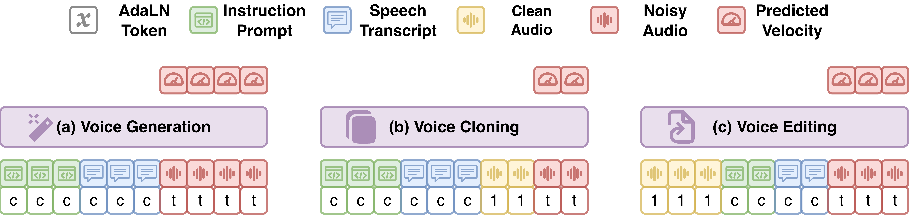
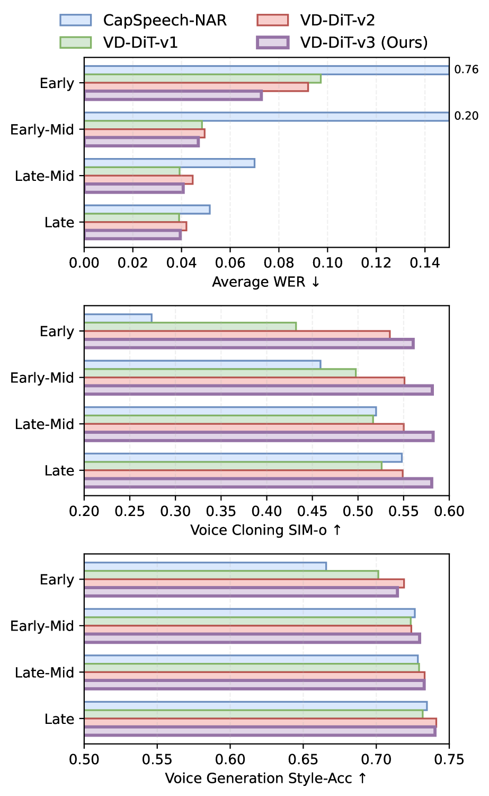
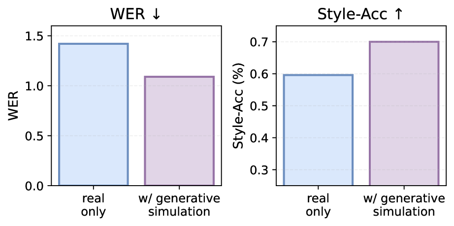
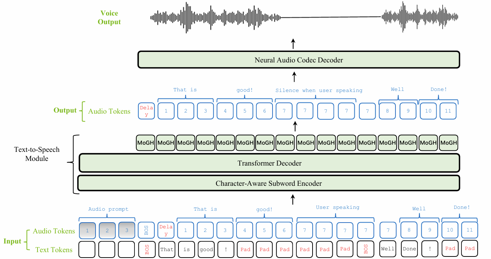
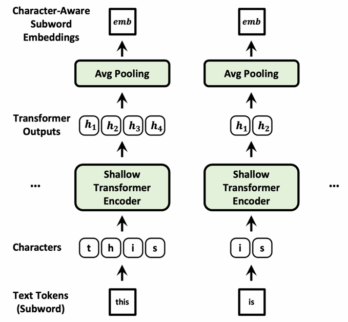
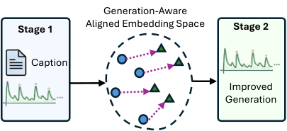

# 🚩 (2026-08-17) Scholar Inbox 추천 논문 

# 📚 VoiceDesigner: Text-to-Voice Generation and Editing via Unified Diffusion Modeling and Data Augmentation

🚀 URL: https://arxiv.org/html/2608.13613

## 🌏 Abstract (원문)
Recent breakthroughs in generative models have made text-to-voice generation (TTV) possible, enabling the synthesis of speech directly from textual voice descriptions. However, existing systems face two key challenges. First, they struggle to generate a diverse range of voices, spanning real-world human speakers and fictional characters. Second, they lack robust and flexible voice editing capabilities, such as voice cloning and the ability to modify attributes like emotion and tone. In this paper, we propose VoiceDesigner, a unified framework for text-to-voice generation and editing that supports diverse and controllable voice design. To tackle the above challenges, we propose solutions from two perspectives. First, we develop a hybrid data pipeline that leverages digital signal processing techniques and speech generation models to construct a diverse voice dataset covering both real-world and fictional voices. Second, we introduce a diffusion transformer with architectural improvements to better handle complex conditioning and enhance multi-task performance, enabling unified voice generation and editing. Through subjective and objective evaluations, VoiceDesigner achieves superior prompt alignment with both voice descriptions and editing instructions, while maintaining competitive perceptual quality and voice usability compared to state-of-the-art TTV models.
## 🌏 Abstract (번역)
최근 생성 모델의 발전으로 텍스트-음성 생성(TTV)이 가능해졌으며, 텍스트 음성 설명으로부터 직접 음성을 합성할 수 있게 되었습니다. 그러나 기존 시스템은 두 가지 주요 과제에 직면해 있습니다. 첫째, 실제 사람 화자와 가상의 캐릭터를 아우르는 다양한 범위의 음성을 생성하는 데 어려움을 겪습니다. 둘째, 음성 복제 및 감정, 톤과 같은 속성을 수정하는 기능과 같은 강력하고 유연한 음성 편집 기능이 부족합니다. 본 논문에서는 다양하고 제어 가능한 음성 디자인을 지원하는 텍스트-음성 생성 및 편집을 위한 통합 프레임워크인 VoiceDesigner를 제안합니다. 위 과제를 해결하기 위해 두 가지 관점에서 해결책을 제시합니다. 첫째, 디지털 신호 처리 기술과 음성 생성 모델을 활용하여 실제 및 가상 음성을 모두 포함하는 다양한 음성 데이터셋을 구축하는 하이브리드 데이터 파이프라인을 개발합니다. 둘째, 복잡한 조건화를 더 잘 처리하고 다중 작업 성능을 향상시켜 통합 음성 생성 및 편집을 가능하게 하는 아키텍처 개선이 적용된 확산 트랜스포머를 소개합니다. 주관적 및 객관적 평가를 통해 VoiceDesigner는 최첨단 TTV 모델과 비교하여 경쟁력 있는 지각 품질과 음성 유용성을 유지하면서 음성 설명 및 편집 지침 모두에 대해 우수한 프롬프트 정렬을 달성합니다.

## 🔍 Methods & Results
- VoiceDesigner는 텍스트-음성 생성 및 편집을 위한 통합 프레임워크로, (1) 텍스트 음성 설명 및 스크립트로부터 음성 생성, (2) 오디오 참조 및 스크립트로부터 음성 복제, (3) 편집 지침, 오디오 참조 및 스크립트로부터 음성 편집의 세 가지 모드를 지원한다.
- 음성 생성을 위해 화자 및 스타일 특성(성별, 나이, 말하기 속도, 피치, 표현력, 감정, 억양)과 캐릭터 사양(공주, 마법사, 괴물, 로봇 등)을 포함하는 2단계 음성 프롬프트 스키마를 설계했다.
- 음성 편집 기능은 화자 정체성을 유지하면서 감정, 말하기 스타일, 피치 조절 및 포먼트 특성, 특수 오디오 효과(예: 목소리를 더 어둡게 만들기) 수정 등을 지원한다.
- VoiceDesigner는 DAC-VAE를 인코더 및 디코더로 사용하는 오디오 잠재 공간에서 작동하는 플로우 매칭 확산 모델을 채택하며, 스크립트, 지침, 오디오 참조의 세 가지 입력 양식에 따라 오디오 잠재 표현을 생성한다.
- 단일 확산 모델 내에서 다양한 모드를 통합하여 중복 훈련 비용을 줄이고 작업 간 지식 전이를 가능하게 한다.
- 추론 시 문장 수준 지속 시간 예측기를 사용하여 목표 음성 지속 시간을 추정하며, 이는 확산 모델에 의해 노이즈 제거되는 목표 잠재 시퀀스의 길이를 결정한다.
- 다중 조건화 신호를 처리하기 위해 단일 스트림 다중 모달 확산 트랜스포머(MM-DiT)를 기반으로 구축되었으며, 모달리티 인식 조건화를 향상시키기 위한 두 가지 핵심 설계가 도입되었다.
- **토큰 수준 AdaLN(Adaptive LayerNorm)**: 확산 노이즈가 생성 대상에만 적용되고 조건화 입력은 노이즈가 없는 이질적인 확산 상태를 해결하기 위해, 각 오디오 토큰에 연속 시간 임베딩을 할당하고 전용 조건 토큰([C])을 도입하여 조건화 신호와 생성 대상을 명시적으로 구분한다. 이는 더 빠른 수렴과 향상된 성능을 가져온다.
- **3D-RoPE(Rotary Positional Encoding)**: 이질적인 조건이 단일 순차 구조로 강제되는 것을 방지하기 위해 회전 위치 임베딩을 3차원 공간으로 확장한다. x축은 지침 토큰, y축은 스크립트 토큰, z축은 오디오 토큰에 해당하여 정렬 인식 및 모달리티 인식 위치 구조를 보존하면서 모든 토큰에 걸쳐 통합된 자기 주의를 가능하게 한다.
- 다양한 음성 데이터셋 구축을 위해 두 가지 데이터 시뮬레이션 파이프라인을 도입했다: (1) **DSP 기반 오디오 효과 합성 파이프라인**은 피치 시프팅, 포먼트 시프팅, 잔향 등 다양한 오디오 효과와 SiFi-GAN을 사용하여 일반 음성을 드래곤, 로봇 등 비인간 캐릭터 음성으로 변환한다. (2) **생성 시뮬레이션 파이프라인**은 제로샷 TTS(음성 복제) 및 음성 변환 모델을 사용하여 고품질 스타일 음성 데이터를 증강하여 언어 및 음성 다양성을 높인다.
- 데이터 품질을 보장하기 위해 언어적 정확도(WER), 화자 일관성, 감정 일관성을 평가하는 다단계 필터링 프로세스를 적용했다.

## 🖼 Figures

*Figure 1:Generation modes of VoiceDesigner.*

*Figure 2:An overview of framework design of VoiceDesigner.*

*Figure 3:An overview of data simulation pipeline.*

*Figure 4:Ablation study on the model architecture.*

*Figure 5:Ablation study on generative data augmentation.*

---
**Usage Info**: 4490 tokens used.
**Generated at**: 2026-08-17 14:23:52

---

# 📚 VoiceChat-TTS: A Low-Latency Continuous Speech Synthesis Model for Interactive Agents

🚀 URL: https://arxiv.org/html/2608.13831

## 🌏 Abstract (원문)
Spoken dialogue is a natural form of human–computer interaction, yet most speech language models remain limited to turn-based operation and lack real-time adaptability, such as user barge-in. Recent duplex speech-to-speech and speech-to-text models reduce latency by replacing multi-stage pipelines, but often compromise speech quality because accurate ASR, interruption handling, and high-fidelity synthesis must be optimized jointly. We propose VoiceChat-TTS, a low-latency, continuous, and streamable text-to-speech model for interactive agents. VoiceChat-TTS is driven directly by LLM text-token streams, supports explicit interruption via control tokens, and produces silence when no textual input is available. The model enables always-on, responsive speech generation while preserving modularity and high speech quality, and it supports mid-utterance interruptions without resetting the KV cache.
## 🌏 Abstract (번역)
음성 대화는 인간-컴퓨터 상호작용의 자연스러운 형태이지만, 대부분의 음성 언어 모델은 턴 기반 작동에 국한되어 있으며 사용자 끼어들기(barge-in)와 같은 실시간 적응성이 부족합니다. 최근의 양방향 음성-음성 및 음성-텍스트 모델은 다단계 파이프라인을 대체하여 지연 시간을 줄이지만, 정확한 ASR, 중단 처리 및 고음질 합성이 동시에 최적화되어야 하므로 종종 음성 품질을 저하시킵니다. 본 논문에서는 대화형 에이전트를 위한 저지연, 연속적, 스트리밍 가능한 텍스트-음성 모델인 VoiceChat-TTS를 제안합니다. VoiceChat-TTS는 LLM 텍스트-토큰 스트림에 의해 직접 구동되며, 제어 토큰을 통한 명시적 중단을 지원하고, 텍스트 입력이 없을 때는 침묵을 생성합니다. 이 모델은 모듈성과 높은 음성 품질을 유지하면서 항상 켜져 있고 반응적인 음성 생성을 가능하게 하며, KV 캐시를 재설정하지 않고도 발화 중간에 중단하는 것을 지원합니다.

## 🔍 Methods & Results
- VoiceChat-TTS는 Audio Flamingo 3-Chat의 스트리밍 음성 디코더를 기반으로 하며, 완전 양방향 상호작용(중단 처리 및 사용자 발화 시 침묵 생성)을 지원하도록 수정되었습니다.
- 오디오 코덱은 22kHz 파형을 12.5Hz 프레임 속도로 압축하는 완전 인과적 오토인코더이며, 31개의 코드북 RVQ 토큰을 사용하여 각 오디오 토큰 프레임이 80ms 파형 청크에 해당합니다.
- 텍스트 토크나이저는 NVIDIA Nemotron Nano 2 서브워드 토크나이저를 사용하며, BOS(Beginning-of-Sequence) 및 중단 토큰으로 확장되었고, 오디오 스트림보다 1토큰 앞서서 제한적인 언어적 선행 예측을 제공합니다.
- Character-Aware Subword Encoder는 LLM과 TTS 학습 코퍼스 간의 어휘 불일치를 완화하기 위해 각 서브워드를 문자로 변환하여 처리하고, 서브워드 연속 토큰을 포함하여 발음 정확도를 향상시킵니다.
- Mixture of Gaussian Estimation Head (MoGH)는 31단계 자기회귀 디코딩 대신 RVQ 토큰을 반복적으로 언마스킹하여 심층 RVQ 토큰 계층의 생성을 가속화합니다.
- 오디오 프롬프트 컨디셔닝은 3초 참조 오디오 프롬프트를 사용하여 명시적인 화자 단서를 제공하며, 특히 생성 초기나 사용자가 말하는 동안 음향 컨텍스트가 약할 때 유용합니다.
- Boundary Embeddings 및 Gated Fusion은 BOS 및 중단 토큰에 대한 학습 가능한 텍스트 임베딩을 도입하여 대화 턴 전환의 부드러움을 개선하고, 게이트 퓨전 메커니즘으로 아키텍처의 수치적 안정성을 확보합니다.
- 최종 VoiceChat-TTS 모델은 총 977M 파라미터로 구성되며, 778M 파라미터의 Gemma 3 기반 스트리밍 TTS 모듈과 199M 파라미터의 코덱 모델을 포함합니다.

## 🖼 Figures

*Figure 1:VoiceChat-TTS architecture overview.*

*Figure 2:Character-Aware Subword Encoder architecture overview.*

---
**Usage Info**: 2894 tokens used.
**Generated at**: 2026-08-17 14:24:00

---

# 📚 StreamHear: Domain-Adapted Pseudo-Labeling for Semi-Supervised Streaming Speech Recognition

🚀 URL: https://arxiv.org/html/2608.13717

## 🌏 Abstract (원문)
Streaming automatic speech recognition (ASR) underperforms on domain-shifted target audio, where labeled in-domain data is costly to prepare while unlabeled audio is abundant. We present StreamHear, a semi-supervised pipeline that adapts a pretrained streaming student by fine-tuning an offline transducer teacher on the labeled training set, generating pseudo-labels on the unlabeled portion, and fine-tuning the student on the mixture. We further introduce a prior-regularized dynamic-programming realignment step that fixes chunk-level word placement using an ASR-hypothesis anchor. Across four datasets spanning financial calls, prepared read speech, and phone-quality dialogue, StreamHear consistently outperforms supervised student fine-tuning and narrows the gap to the offline teacher.
## 🌏 Abstract (번역)
도메인 전환된 타겟 오디오에서 스트리밍 자동 음성 인식(ASR)은 성능이 저하되며, 이 경우 레이블이 지정된 도메인 내 데이터는 준비 비용이 많이 들지만 레이블이 지정되지 않은 오디오는 풍부합니다. 우리는 사전 훈련된 스트리밍 학생 모델을 적응시키는 반지도 학습 파이프라인인 StreamHear를 제시합니다. 이는 레이블이 지정된 훈련 세트에서 오프라인 트랜스듀서 교사 모델을 미세 조정하고, 레이블이 지정되지 않은 부분에서 의사 레이블을 생성하며, 혼합된 데이터에서 학생 모델을 미세 조정하는 방식으로 이루어집니다. 우리는 또한 ASR 가설 앵커를 사용하여 청크 수준 단어 배치를 수정하는 사전 정규화된 동적 프로그래밍 재정렬 단계를 도입합니다. 금융 통화, 준비된 읽기 음성, 전화 품질 대화에 걸쳐 네 가지 데이터셋에서 StreamHear는 지도 학습 기반 학생 모델 미세 조정을 지속적으로 능가하며 오프라인 교사 모델과의 성능 격차를 줄입니다.

## 🔍 Methods & Results
- StreamHear는 교사 모델 미세 조정, 의사 레이블 생성, 학생 모델 미세 조정의 세 가지 순차적 학습 단계로 구성된 반지도 학습 파이프라인이며, 각 단계는 한 번만 실행됩니다.
- 오프라인 트랜스듀서 교사 모델(M_T)은 레이블이 지정된 도메인 내 훈련 세트(D_L)에서 표준 트랜스듀서 손실을 사용하여 미세 조정되어 타겟 오디오 분포에 적응합니다.
- 미세 조정된 교사 모델은 레이블이 지정되지 않은 도메인 내 세트(D_U)를 탐욕적 디코딩으로 전사하여 의사 레이블이 지정된 청크(D'_U)를 생성하며, 선택적으로 시퀀스 평균 교사 로그 우도에 따라 필터링할 수 있습니다.
- 캐시 인식 스트리밍 학생 모델(M_S)은 레이블이 지정된 데이터와 의사 레이블이 지정된 데이터의 혼합(D_L ∪ D'_U)에서 표준 RNN-T 손실을 사용하여 미세 조정됩니다.
- 청크 수준 데이터 준비 단계에서, ASR 가설 앵커를 사용하여 청크 수준 단어 배치를 수정하는 '사전 정규화된 동적 프로그래밍(DP) 재정렬' 단계가 도입됩니다. 이는 Needleman-Wunsch 정렬을 통해 단어 일치 보상, 건너뛰기 비용, 그리고 쌍을 이룬 단어 간의 청크 인덱스 변위에 대한 사전 페널티를 사용하여 수행됩니다.
- StreamHear는 금융 통화, 준비된 읽기 음성, 전화 품질 대화 등 네 가지 다양한 데이터셋에서 지도 학습 기반 학생 모델 미세 조정을 지속적으로 능가하는 성능을 보였습니다.
- StreamHear는 스트리밍 학생 모델과 오프라인 교사 모델 간의 성능 격차를 효과적으로 줄였습니다.

---
**Usage Info**: 3068 tokens used.
**Generated at**: 2026-08-17 14:24:11

---

# 📚 Trajectory Dynamics in Self-Supervised Learning Latent Space for Audio Deepfake Detection

🚀 URL: https://arxiv.org/html/2608.13817

## 🌏 Abstract (원문)
Human speech production is constrained by physiology, giving rise to characteristic temporal structure on acoustic signals. We hypothesise that these constraints manifest as structured trajectory dynamics in the latent space of Self-Supervised Learning (SSL) models, and that synthetic speech violates them detectably. To test this hypothesis, we train a causal Long Short-Term Memory (LSTM) next-frame predictor on bonafide speech only (Stage 1), using the deepfake-specialised SSL backbone Wav2Vec2-Large-AntiDeepfake, and compare against a static global-average-pooling baseline using identical features, thus isolating the contribution of temporal modelling. A supervised Stage 2, which trains a Multi-Layer Perceptron on the frozen LSTM internal states using labelled data, is included to characterise the role of spoof supervision. Our system achieves competitive or state-of-the-art performance across six benchmarks: ASVspoof 2019/2021, Codecfake, In-the-Wild, MLAAD-EN, and Deepfake-Eval-2024, including best published EER on ASVspoof 2021 (0.75%) and, notably, Stage 1 trained on bonafide speech only surpasses the published supervised baseline from the same backbone on DE2024 (30.35%). On near-domain benchmarks, static and dynamic approaches perform comparably. On harder cross-corpus benchmarks with diverse synthesis methods, trajectory dynamics provide substantial gains, confirming that temporal physiological constraints carry detection signal beyond utterance-level statistics.
## 🌏 Abstract (번역)
인간의 음성 생성은 생리학적 제약을 받으며, 이는 음향 신호에 특징적인 시간적 구조를 발생시킵니다. 우리는 이러한 제약이 자기지도학습(SSL) 모델의 잠재 공간에서 구조화된 궤적 역학으로 나타나며, 합성 음성은 이를 감지 가능하게 위반한다고 가정합니다. 이 가설을 검증하기 위해, 우리는 딥페이크 특화 SSL 백본인 Wav2Vec2-Large-AntiDeepfake를 사용하여 실제 음성(bonafide speech)만을 대상으로 인과적 장단기 기억(LSTM) 다음 프레임 예측기(1단계)를 훈련하고, 동일한 특징을 사용하는 정적 전역 평균 풀링(global-average-pooling) 기준선과 비교하여 시간 모델링의 기여를 분리했습니다. 레이블이 지정된 데이터를 사용하여 고정된 LSTM 내부 상태에 다층 퍼셉트론(MLP)을 훈련하는 지도 학습 2단계는 스푸핑 감독의 역할을 특성화하기 위해 포함되었습니다. 우리 시스템은 ASVspoof 2019/2021, Codecfake, In-the-Wild, MLAAD-EN, Deepfake-Eval-2024를 포함한 6가지 벤치마크에서 경쟁력 있거나 최첨단 성능을 달성했으며, ASVspoof 2021에서 최고의 EER(0.75%)을 기록했습니다. 특히, 실제 음성만으로 훈련된 1단계는 DE2024에서 동일한 백본의 공개된 지도 학습 기준선(30.35%)을 능가했습니다. 근접 도메인 벤치마크에서는 정적 및 동적 접근 방식이 유사한 성능을 보였습니다. 다양한 합성 방법을 사용하는 더 어려운 교차 코퍼스 벤치마크에서는 궤적 역학이 상당한 이득을 제공하여, 시간적 생리학적 제약이 발화 수준 통계를 넘어선 탐지 신호를 전달한다는 것을 확인했습니다.

## 🔍 Methods & Results
- Wav2Vec2-Large-AntiDeepfake 백본을 사용하여 1024차원 프레임 수준 특징을 추출하며, 이 특징은 실제 음성(bonafide)과 합성 음성(synthetic)을 구별하도록 사전 훈련되어 강력한 표현 기반을 제공합니다.
- 정적 기준선은 동일한 특징을 사용하여 전역 평균 풀링(GAP)된 임베딩과 실제 음성 훈련 데이터셋의 중심점 간의 L2 거리를 계산하여 시간 순서 정보를 제거합니다.
- 1단계(시간 모델링)에서는 2계층 LSTM 네트워크(은닉 차원 512)를 사용하여 이전 프레임으로부터 다음 프레임을 인과적으로 예측합니다. 이 모델은 ASVspoof 2019 LA 훈련 세트의 실제 음성 발화 2,580개만을 사용하여 훈련되며, 예측된 다음 프레임과 실제 다음 프레임 간의 평균 제곱 오차를 최소화합니다. 높은 점수는 훈련된 실제 음성 역학에서 벗어난 궤적을 나타냅니다.
- 2단계(스푸핑 감독 - 선택 사항)에서는 고정된 1단계 LSTM을 특징 추출기로 사용하여 모든 프레임에 걸쳐 평균 풀링된 은닉 상태(512차원)를 추출합니다. 이 표현을 사용하여 ASVspoof 2019 LA 훈련 세트의 실제 및 스푸핑 발화(총 25,380개)에 대해 3계층 MLP를 훈련하여 스푸핑 확률을 출력하며, 이 단계는 스푸핑 감독을 도입합니다.
- 제안된 시스템은 ASVspoof 2019/2021, Codecfake, In-the-Wild, MLAAD-EN, Deepfake-Eval-2024 등 6개 벤치마크에서 경쟁력 있거나 최첨단 성능을 달성했으며, ASVspoof 2021에서 0.75%의 최고 EER을 기록했습니다.
- 특히, 실제 음성만으로 훈련된 1단계는 Deepfake-Eval-2024(DE2024)에서 동일 백본의 공개된 지도 학습 기준선(30.35%)을 능가하는 성능을 보였습니다.
- 다양한 합성 방법을 사용하는 어려운 교차 코퍼스 벤치마크에서 궤적 역학이 상당한 성능 향상을 제공하여, 시간적 생리학적 제약이 발화 수준 통계를 넘어선 탐지 신호를 전달한다는 가설을 확인했습니다.

## 🖼 Figures

*Fig. 1:UMAP visualisation of AntiDeepfake embedding space (red: bonafide, grey: spoof) across six benchmarks in increasing order of difficulty (left to right). Bonafide/spoof overlap grows progressively from tight separation (ASVspoof 2019/2021, Codecfake) through partial overlap (In-the-Wild, MLAAD-EN) to near-complete mixing (DE2024), explaining the corresponding degradation of the static baseline and the growing advantage of trajectory dynamics.*

---
**Usage Info**: 4433 tokens used.
**Generated at**: 2026-08-17 14:24:25

---

# 📚 1Introduction

🚀 URL: https://arxiv.org/html/2608.13741

## 🌏 Abstract (원문)
Time series generation plays an important role in domains such as energy, traffic, and healthcare, where high-quality synthetic series can support data augmentation, privacy-preserving data sharing, and simulation(40;23).However, the controllability of a generator directly determines its practical value. Unconditional generation methods(4;16;42;27;12)are not controllable. Conditioning on structured signals such as class labels or attribute vectors(19;28;34;15)restricts the user to a predefined condition schema and supports no scenario outside it.In contrast, a natural language description can be both flexible for users and semantically meaningful for describing time series. For example, a clinician can specify a 12-lead ECG through a clinical report(17). This makes text the most promising interface for describing the morphology of time series(18). Consequently, text-conditional time series generation has emerged as the frontier of conditional time series generation(6;9;21).Existing text-conditioned generators differ mainly in where generation is performed. One line of work first trains an autoencoder to compress the time series and then a generator in the latent space(6;17), while the other line generates the raw series directly in the observation space(9;21). Despite this difference, the two approaches share the same treatment of the text condition and lack a deliberate design of the conditioning path. T2S(6), DiffuSETS(17), and BRIDGE(21)obtain fixed caption representations from an off-the-shelf language embedding model and feed them to the generator, and VerbalTS(9)learns an adapter that reprograms the frozen text-encoder output into multi-resolution features. In all these methods, the text representation is either kept frozen from a text-only encoder or shaped only by the denoising objective, never explicitly aligned with the time-series modality.However, explicit cross-modal alignment is effective in other time series tasks. For forecasting, TimesCLIP(5)contrastively aligns visual and textual views of the series, BALM-TSF(44)balances the two modalities with a contrastive semantic-alignment loss, and Time-MMD(26)shows that aligned textual context substantially reduces forecasting error; for understanding and reasoning, TEST(35)and ChatTS(39)align series to an LLM via text prototypes or synthetic captions. Similar observations hold beyond time series(32;33). Converting semantic correspondence into an explicit geometric relation improves downstream performance.In text conditional time series generation, however, developing a good cross-modal alignment is not a direct plug-in of existing methods. We observe two challenges in our experiments.1):Fine-tuning the text encoders inside the generator improves caption adherence at the cost of fidelity (Table2), which shows that the generation loss alone is insufficient to shape the shared latent space.2):Existing cross-modal alignment methods optimize the shared space for ranking and retrieval, but do not necessarily retain the fine-grained, reconstruction-relevant detail that a generator needs. We address these two challenges by learning a generation-aware text-time-series shared embedding space (Figure1), which makes the text embedding faithful enough to drive the generator to better caption adherence without sacrificing fidelity.In this work, we propose GALA (Generation-Aware cross-modaLAlignment), a two-stage text-to-time-series generation method. In the first stage, GALA contrastively aligns a pretrained text encoder and a time-series foundation model into a shared embedding space, with a magnitude-aware encoding that preserves the absolute level and scale that captions often refer to. To make the alignment generation-aware, we add an auxiliary generation loss that requires the text embedding to remain sufficient to synthesize its paired series; the encoders themselves are adapted with a low-rank update. The auxiliary loss lifts caption adherence and fidelity together rather than trading them off, It is a necessary component rather than an add-on, and it works for any adaptation that reaches into the backbones, the only failing case being a trainable head on frozen features. In the second stage, the aligned text encoder is frozen and its embedding serves as the condition of a flow-matching generator. In summary, our contributions are threefold:We identify an overlooked gap in text-to-time-series generators: the conditioning representation is either frozen text-only features or adapted solely through the generation objective; in neither case is it aligned with the time-series modality, so the conditioning signal is under-optimized for generation.We propose GALA, a two-stage method that decouples cross-modal alignment from generation and makes the alignment generation-aware: a contrastive objective is combined with an auxiliary generation loss that keeps the text embedding sufficient to synthesize time series.We conduct extensive experiments on TSFragment-600K across four domains and three fragment lengths, demonstrating that GALA matches or beats state-of-the-art methods on generation fidelity while improving caption adherence by a large margin. Ablations, a probing analysis, and comparisons with alternative alignment schemes further explain where the gains come from.
## 🌏 Abstract (번역)
시계열 생성은 에너지, 교통, 헬스케어와 같은 분야에서 중요한 역할을 하며, 고품질 합성 시계열은 데이터 증강, 개인 정보 보호 데이터 공유 및 시뮬레이션을 지원할 수 있습니다(40;23). 그러나 생성기의 제어 가능성은 실용적 가치를 직접적으로 결정합니다. 비조건부 생성 방법(4;16;42;27;12)은 제어할 수 없습니다. 클래스 레이블 또는 속성 벡터와 같은 구조화된 신호에 조건을 부여하는 것(19;28;34;15)은 사용자를 미리 정의된 조건 스키마로 제한하고 그 외의 시나리오를 지원하지 않습니다. 이와 대조적으로, 자연어 설명은 사용자에게 유연하고 시계열의 형태를 설명하는 데 의미론적으로 유용할 수 있습니다. 예를 들어, 임상의는 임상 보고서(17)를 통해 12-리드 ECG를 지정할 수 있습니다. 이는 텍스트를 시계열의 형태를 설명하는 가장 유망한 인터페이스로 만듭니다(18). 결과적으로, 텍스트 조건부 시계열 생성은 조건부 시계열 생성의 최전선으로 부상했습니다(6;9;21). 기존 텍스트 조건부 생성기는 주로 생성이 수행되는 방식에서 차이가 있습니다. 한 연구 라인은 먼저 오토인코더를 훈련하여 시계열을 압축한 다음 잠재 공간에서 생성기를 훈련하는 반면(6;17), 다른 라인은 관측 공간에서 원시 시계열을 직접 생성합니다(9;21). 이러한 차이에도 불구하고, 두 접근 방식은 텍스트 조건에 대한 동일한 처리를 공유하며 조건화 경로에 대한 의도적인 설계가 부족합니다. T2S(6), DiffuSETS(17) 및 BRIDGE(21)는 기성 언어 임베딩 모델에서 고정된 캡션 표현을 얻어 생성기에 공급하고, VerbalTS(9)는 고정된 텍스트 인코더 출력을 다중 해상도 특징으로 재프로그래밍하는 어댑터를 학습합니다. 이 모든 방법에서 텍스트 표현은 텍스트 전용 인코더에서 고정된 상태로 유지되거나 노이즈 제거 목표에 의해서만 형성되며, 시계열 양식과 명시적으로 정렬되지 않습니다. 그러나 명시적인 교차 모달 정렬은 다른 시계열 작업에서 효과적입니다. 예측의 경우, TimesCLIP(5)은 시계열의 시각적 및 텍스트적 관점을 대조적으로 정렬하고, BALM-TSF(44)는 대조적인 의미론적 정렬 손실로 두 양식의 균형을 맞추며, Time-MMD(26)는 정렬된 텍스트 컨텍스트가 예측 오류를 상당히 줄임을 보여줍니다. 이해 및 추론의 경우, TEST(35) 및 ChatTS(39)는 텍스트 프로토타입 또는 합성 캡션을 통해 시계열을 LLM에 정렬합니다. 유사한 관찰은 시계열을 넘어선 분야에서도 유효합니다(32;33). 의미론적 대응을 명시적인 기하학적 관계로 변환하면 다운스트림 성능이 향상됩니다. 그러나 텍스트 조건부 시계열 생성에서 좋은 교차 모달 정렬을 개발하는 것은 기존 방법을 직접 적용하는 것이 아닙니다. 우리는 실험에서 두 가지 과제를 관찰했습니다. 1) 생성기 내에서 텍스트 인코더를 미세 조정하면 충실도를 희생하면서 캡션 준수도가 향상됩니다(표 2). 이는 생성 손실만으로는 공유 잠재 공간을 형성하기에 불충분하다는 것을 보여줍니다. 2) 기존 교차 모달 정렬 방법은 순위 지정 및 검색을 위해 공유 공간을 최적화하지만, 생성기가 필요로 하는 미세하고 재구성 관련 세부 정보를 반드시 유지하지는 않습니다. 우리는 생성기 구동에 충분히 충실한 텍스트 임베딩을 만들어 충실도를 희생하지 않고도 캡션 준수도를 향상시키는 생성 인식 텍스트-시계열 공유 임베딩 공간을 학습함으로써 이 두 가지 과제를 해결합니다(그림 1). 본 연구에서는 GALA(Generation-Aware cross-modaL Alignment)라는 2단계 텍스트-시계열 생성 방법을 제안합니다. 첫 번째 단계에서 GALA는 사전 훈련된 텍스트 인코더와 시계열 파운데이션 모델을 공유 임베딩 공간으로 대조적으로 정렬하며, 캡션이 종종 참조하는 절대 수준과 스케일을 보존하는 크기 인식 인코딩을 사용합니다. 정렬을 생성 인식으로 만들기 위해, 텍스트 임베딩이 쌍을 이루는 시계열을 합성하기에 충분하도록 요구하는 보조 생성 손실을 추가합니다. 인코더 자체는 저랭크 업데이트로 조정됩니다. 보조 손실은 캡션 준수도와 충실도를 상충시키지 않고 함께 향상시킵니다. 이는 추가 기능이 아니라 필수 구성 요소이며, 백본에 도달하는 모든 적응 방식에 작동하며, 유일하게 실패하는 경우는 고정된 특징에 대한 훈련 가능한 헤드입니다. 두 번째 단계에서는 정렬된 텍스트 인코더가 고정되고 해당 임베딩이 플로우 매칭 생성기의 조건으로 사용됩니다. 요약하자면, 우리의 기여는 세 가지입니다. 우리는 텍스트-시계열 생성기에서 간과된 간극을 식별했습니다. 조건화 표현이 고정된 텍스트 전용 특징이거나 생성 목표를 통해서만 조정되는 경우, 어느 경우에도 시계열 양식과 정렬되지 않아 조건화 신호가 생성에 최적화되지 않습니다. 우리는 교차 모달 정렬을 생성과 분리하고 정렬을 생성 인식으로 만드는 2단계 방법인 GALA를 제안합니다. 대조 목표는 텍스트 임베딩이 시계열을 합성하기에 충분하도록 유지하는 보조 생성 손실과 결합됩니다. 우리는 4개 도메인과 3개 조각 길이에 걸쳐 TSFragment-600K에 대한 광범위한 실험을 수행하여 GALA가 생성 충실도에서 최첨단 방법과 일치하거나 능가하면서 캡션 준수도를 크게 향상시킴을 입증했습니다. 절제 연구, 탐색 분석 및 대체 정렬 방식과의 비교는 이러한 이득이 어디에서 오는지 추가로 설명합니다.

## 🔍 Methods & Results
- GALA는 텍스트 조건부 시계열 생성을 위한 2단계 방법으로, 생성기의 제어 가능성과 실용적 가치를 높이기 위해 텍스트 임베딩과 시계열 양식 간의 명시적인 교차 모달 정렬을 목표로 합니다.
- 1단계 (정렬): 사전 훈련된 텍스트 인코더(Embedding-Gemma-300M)와 시계열 파운데이션 모델(Chronos-2)을 LoRA를 사용하여 공유 임베딩 공간으로 정렬합니다.
- 1단계에서 Chronos-2의 인스턴스 정규화를 데이터셋 수준의 전역 z-점수 정규화로 대체하여 캡션이 참조하는 절대 수준과 스케일 정보를 보존하는 '크기 인식 인코딩'을 구현합니다.
- 1단계의 손실 함수는 대조 목표(대칭 InfoNCE 손실)와 보조 생성 손실의 조합입니다. 보조 생성 손실은 경량 조건부 노이즈 제거기(flow-matching loss 사용)를 통해 텍스트 임베딩이 시계열 재구성에 충분한 정보를 유지하도록 강제하여 '생성 인식' 정렬을 달성합니다.
- 2단계 (생성): 1단계에서 정렬된 텍스트 인코더를 고정하고, 해당 임베딩을 조건으로 사용하여 DiT 스타일의 확산 트랜스포머(JiT 레시피로 훈련)를 기반으로 하는 조건부 플로우 매칭 생성기를 훈련합니다.
- 생성기는 지연 임베딩을 통해 시계열을 이미지로 매핑한 후 관측 도메인에서 직접 시계열을 생성하며, 50단계 결정론적 Heun 솔버를 사용하여 샘플링합니다.
- 실험 결과, GALA는 TSFragment-600K 데이터셋(4개 도메인, 3개 조각 길이)에서 최첨단 방법과 비교하여 생성 충실도에서 동등하거나 더 나은 성능을 보였으며, 캡션 준수도(caption adherence)를 크게 향상시켰습니다.

## 🖼 Figures

*Figure 1:GALA synthesizes a time series from a free-form caption by first aligning text and series into a shared, generation-aware embedding space, then conditioning a generator on the frozen text embedding.*

*Figure 2:Overview of GALA. Stage 1 contrastively aligns a LoRA-adapted text encoder and time-series encoder into a shared space, with a generation-aware auxiliary loss keeping the text embedding sufficient to synthesize its fragment. Stage 2 freezes the aligned text encoder and trains a flow-matching generator on its embedding.*

---
**Usage Info**: 8181 tokens used.
**Generated at**: 2026-08-17 14:24:45

---

# 📚 Omni-LiveAvatar: Minute-Level Real-Time Streaming Joint Audio-Visual Avatar Generation

🚀 URL: https://arxiv.org/html/2608.13602

## 🌏 Abstract (원문)
Joint audio-video generative models serve as foundation for immersive and interactive digital-human generation. Nevertheless, most existing models rely on bidirectional attention and multi-step denoising and can generate only short clips, making them unsuitable for real-time interaction over extended durations. We presentOmni-LiveAvatar, the first framework for minute-level, real-time streaming joint audio-video avatar generation. Specifically, we propose (1) aprogressive autoregressive distillation pipelinethat transfers a large bidirectional joint audio-video diffusion model into a few-step autoregressive generator without auxiliary stabilization mechanisms; (2) asynchronized audio-video long-short-term memorythat preserves global consistency under a bounded memory budget; and (3) ahierarchical rolling prompt planningstrategy that enables coherent semantic evolution and seamless prompt transitions. Extensive experiments show that Omni-LiveAvatar generates high-quality, synchronized minute-level avatars in real time. In terms of speed, it achieves a33×\timesgeneration speedup over its teacher, LTX-2, on a single NVIDIA H200 GPU; in terms of generation quality, it outperforms accelerated baselines across visual quality, audio quality, cross-modal synchronization, and human fidelity. Our code is available athttps://github.com/Aoko955/Omni-LiveAvatar
## 🌏 Abstract (번역)
오디오-비디오 공동 생성 모델은 몰입형 및 상호작용적인 디지털 휴먼 생성의 기반이 됩니다. 그럼에도 불구하고, 대부분의 기존 모델은 양방향 어텐션과 다단계 노이즈 제거에 의존하며 짧은 클립만 생성할 수 있어, 장시간 실시간 상호작용에는 부적합합니다. 본 논문에서는 분 단위의 실시간 스트리밍 오디오-비디오 아바타 생성을 위한 최초의 프레임워크인 Omni-LiveAvatar를 제시합니다. 구체적으로, 우리는 (1) 보조 안정화 메커니즘 없이 대규모 양방향 오디오-비디오 확산 모델을 소수 단계의 자기회귀 생성기로 전환하는 점진적 자기회귀 증류 파이프라인; (2) 제한된 메모리 예산 내에서 전역적 일관성을 유지하는 동기화된 오디오-비디오 장단기 메모리; 그리고 (3) 일관된 의미론적 진화와 원활한 프롬프트 전환을 가능하게 하는 계층적 롤링 프롬프트 계획 전략을 제안합니다. 광범위한 실험 결과, Omni-LiveAvatar는 고품질의 동기화된 분 단위 아바타를 실시간으로 생성함을 보여줍니다. 속도 면에서는 단일 NVIDIA H200 GPU에서 교사 모델인 LTX-2 대비 33배의 생성 속도 향상을 달성했으며, 생성 품질 면에서는 시각적 품질, 오디오 품질, 교차 모달 동기화 및 인간 충실도 전반에 걸쳐 가속화된 기준선 모델들을 능가합니다. 코드: https://github.com/Aoko955/Omni-LiveAvatar

## 🔍 Methods & Results
- Omni-LiveAvatar는 텍스트 프롬프트로부터 분 단위의 동기화된 오디오-비디오 아바타를 실시간으로 생성하는 것을 목표로 합니다.
- 기존 모델의 한계(대규모 멀티모달 모델 증류의 어려움, 교차 모달 드리프트, 이질적인 의미론 스케줄링)를 해결하기 위해 세 가지 핵심 구성 요소를 제안합니다.
- 첫째, '점진적 자기회귀 증류 파이프라인'은 대규모 양방향 오디오-비디오 확산 모델을 보조 메커니즘 없이 효율적인 소수 단계 자기회귀 생성기로 전환합니다.
- 이 파이프라인은 (1) 양방향 확산 모델을 양방향 소수 단계 생성기로 증류하는 단계, (2) 이를 블록-인과적 어텐션 마스크와 궤적 정렬 ODE 회귀를 통해 인과적 소수 단계 생성기로 변환하는 단계, (3) 오류 전파를 억제하고 미래 오디오 단서를 활용하는 '공동 롤링 강제(joint rolling forcing)'를 도입하는 단계로 구성됩니다.
- 둘째, '동기화된 오디오-비디오 장단기 메모리'는 장시간 생성 시 발생하는 드리프트를 방지합니다. 첫 번째 매크로 블록의 KV 상태를 장기 메모리로 유지하여 신원, 장면, 음색 등의 안정적인 참조를 제공하고, 최근 매크로 블록의 롤링 KV 캐시를 단기 메모리로 유지하여 움직임 및 음성 연속성을 보존합니다.
- 장기 메모리의 영향력을 유지하기 위해 주기적으로 RoPE(Rotary Position Embedding)를 재적용하여 메모리를 재고정합니다.
- 셋째, '계층적 롤링 프롬프트 계획 전략'은 롤링 강제 패러다임 하에서 의미론적 충돌 없이 다양한 시간적 세분성으로 텍스트 조건을 원활하게 스케줄링합니다. 전역 프롬프트는 고정된 임베딩으로 시퀀스 수준의 의미론을 제공하고, 지역 프롬프트는 블록 수준의 음성 콘텐츠를 담당하며, 롤링 윈도우 내의 프롬프트들을 연결하여 유효 조건을 형성함으로써 원활한 전환을 가능하게 합니다.
- 실험 결과, Omni-LiveAvatar는 고품질의 동기화된 분 단위 아바타를 실시간으로 생성하며, 교사 모델인 LTX-2 대비 33배 빠른 생성 속도를 달성했습니다.
- 또한, 시각적 품질, 오디오 품질, 교차 모달 동기화 및 인간 충실도 측면에서 가속화된 기준선 모델들을 능가하는 성능을 보였습니다.

## 🖼 Figures

*Figure 1:Qualitative comparison of minute-level generation. Compared with state-of-the-art baselines, Omni-LiveAvatar preserves consistent avatar and background appearance, and maintains tight audio-video alignment over a minute-long rollout, whereas OmniForcing and Hallo-Live exhibit severe appearance drift. In the bottom row, the syllable uttered at each frame is highlighted in red, and the insets show the corresponding mouth shapes for lip-audio alignment.*

![Figure 2:Overview of Omni-LiveAvatar. The proposed progressive autoregressive distillation pipeline converts a large bidirectional audio-video diffusion model into a few-step causal generator without any auxiliary stabilization mechanism (top). At inference, the synchronized audio-video long-short-term memory preserves global consistency while retaining recent context within a bounded memory budget for minute-level streaming inference (middle), and the hierarchical rolling prompt planning organizes global and local prompts for smooth long-form semantic evolution (bottom).](../images/2026-08-17/2608.13602/2608.13602_fig1.png)
*Figure 2:Overview of Omni-LiveAvatar. The proposed progressive autoregressive distillation pipeline converts a large bidirectional audio-video diffusion model into a few-step causal generator without any auxiliary stabilization mechanism (top). At inference, the synchronized audio-video long-short-term memory preserves global consistency while retaining recent context within a bounded memory budget for minute-level streaming inference (middle), and the hierarchical rolling prompt planning organizes global and local prompts for smooth long-form semantic evolution (bottom).*

*Figure 3:Visualization of the denoising trajectories (left) and output distributions (right) of the multi-step teacher and few-step student. Projected via principal component analysis, the visualization shows that DMD aligns the output distribution but disrupts the pointwise denoising trajectory.*

*Figure 4:Qualitative comparison of 5-second avatar generation. Omni-LiveAvatar generates realistic and temporally consistent avatars with visual quality comparable to Ovi and LTX-2, whereas OmniForcing exhibits noticeable realism degradation and Hallo-Live suffers from facial and hand artifacts as well as color drift.*

---
**Usage Info**: 4574 tokens used.
**Generated at**: 2026-08-17 14:24:58

---

